# Chap 1: Mathematical Premiminaries

## Roundoff Errors and Computer Arithmetic

**讨论1：近似表示 $\int_0^1 e^{-x^2} dx$**

使用泰勒展开式表示 $e^{-x^2}$，因此：

$$
\begin{align}
\int_0^1 e^{-x^2} dx & = \int_0^1 (1 - x^2 + \dfrac{x^4}{2!} - \dfrac{x^6}{3!} + \dfrac{x^8}{4!} - \dots) dx \notag \\
& = \underbrace{1 - \dfrac{1}{3} + \dfrac{1}{2!} \times \dfrac{1}{5} - \dfrac{1}{3!} \times \dfrac{1}{7}}_{S_4} + \underbrace{\dfrac{1}{4!} \times \dfrac{1}{9} - \dots}_{R_4} \notag
\end{align}
$$

令 $\int_0^1 e^{-x^2} dx = S_4 = 1 - \dfrac{1}{3} + \dfrac{1}{10} - \dfrac{1}{42} \approx 1 - 0.333 + 0.1 - 0.024 = 0.743$

因为余项 $|R_4| = |\dfrac{1}{4!} \times \dfrac{1}{9} - \dfrac{1}{5!} \times \dfrac{1}{11} + \dots| < \dfrac{1}{4!} \times \dfrac{1}{9} < 0.005$，所以上述结果保留到千分位。

综上：

- 舍入误差 < 0.0005 * 2 = 0.001
- 截断误差 < 0.005
- |总误差| < 0.006

接下来马上介绍误差的概念~

从<u>成因</u>角度来看，**误差**(error)可以分为：

- **截断误差**(truncation error)：从用于近似表示无限级数的，截断或有限的求和中得到的误差
- **舍入误差**(roundoff error)：执行实数计算时得到的误差。由于机器只能表示有限位的数字，因此进行算术运算时会产生这种误差

用**规范化**(normalized)的十进制浮点数形式表示实数（$k$位十进制机器数）：

$$
\pm 0.d_1 d_2 \dots d_k \times 10^n \quad \text{where } 1 \le d_1 \le 9 \text{ and } 0 \le d_i \le 9 (i = 2, \dots, k)
$$

具体来说，假如给定一个实数 $y = \textcolor{cornflowerblue}{0.d_1 d_2 \dots d_k} d_{k+1} d_{k+2} \dots \times \textcolor{cornflowerblue}{10^n}$，那么它对应的浮点数形式为：

$$
fl(y) = \begin{cases}0.d_1 d_2 \dots d_k \times 10^n & \text{Chopping} \\ chop(y + 5 \times 10^{n - (k+1)}) = 0.\delta_1 \delta_2 \dots \delta_k \times 10^n & \text{Rounding}\end{cases}
$$

---
此外，误差又可按<u>测量</u>方式的不同分为（假设 $p^*$ 是 $p$ 的近似形式）：

- **绝对误差**(absolute error)：$|p - p^*|$
- **相对误差**(relative error)：$\dfrac{|p - p^*|}{|p|}, p \ne 0$

如果 $t$ 是满足下面关系的最大非负整数，那么称 $p^*$ 是 $p$ 保留至 $t$ 位**有效数字**(significant digits)的近似形式。

$$
\dfrac{|p - p^*|}{p} < 5 \times 10^{-t}
$$

>所以有效数字的定义是从**相对误差**出发的。

回到前面对截断和舍入的讨论，比较一下它们的相对误差：

- **截断**(chopping)

    $$
    \begin{align}
    \Big|\dfrac{p - p^*}{p}\Big| & = \Big| \dfrac{0.d_1 d_2 \dots d_k d_{k+1} \dots \times 10^n - 0.d_1 d_2 \dots d_k \times 10^n}{0.d_1 d_2 \dots d_k d_{k+1} \dots \times 10^n} \Big| \notag \\
    & = \Big|\dfrac{0.d_{k+1} d_{k+2} \dots}{0.d_1 d_2 \dots}\Big| \times 10^{-k} \le \dfrac{1}{0.1} \times 10^{-k} = 10^{-k+1} \notag
    \end{align}
    $$

- **舍入**(rounding)

    $$
    \Big|\dfrac{p - p^*}{p}\Big| \le \dfrac{0.5}{0.1} \times 10^{-k} = 0.5 \times 10^{-k+1}
    $$


舍入误差对计算结果的影响：

- 两个近乎相等的数字相减，会导致有效位数的抵消

    **例子**:

    $a_1 = 0.1234\textcolor{red}{5}, a_2 = 0.1234\textcolor{red}{6}$ 都有 5 位有效数字，但是 $a_2 - a_1 = 0.0000\textcolor{red}{1}$ 只有 1 位有效数字。

- 用一个很小的数去除（或用很大的数去乘）另一个数，会导致误差的扩大

	**例子**：

    假如有一个值 $a = \dfrac{p}{q}$，它的近似结果为 $a^* = \dfrac{p + \varepsilon_p}{q + \varepsilon_q}$。那么：

    - 绝对误差$e_{\text{abs}} = |a^* - a|$
    - 相对误差$e_{\text{rel}} = \dfrac{e_{\text{abs}}}{a}$

    我们可以把绝对误差看作是 $q$ 关于 $\dfrac{p}{q}$ 的函数，对它求导，我们就能观察绝对误差的变化率。所以：

  $$
    \begin{align}
    e_{\text{abs}}'(q) & = \dfrac{d\frac{p}{q}}{dq} \notag \\
    & = -\dfrac{p}{q^2} \notag
    \end{align}
  $$

    因此，如果 $q$ 是一个很小的数，那么对其稍加改动，绝对误差就会产生很大的变化。


启示：在让计算机计算数学公式前，要先对公式化简，以降低对精度的影响。

**讨论2**

问题：计算 $f(x) = x^3 - 6.1x^2 + 3.2x + 1.5$ 在 $x = 4.71$ 时的值，保留 3 位有效数字。
    
分析：
    
比较精确计算，以及分别使用截断和舍入两种方法近似的结果：

<div style="text-align: center">
    
</div>

**注意**：中间结果也要记得截断/舍入，不是只对最终结果截断/舍入！

最终结果：

- <span style="color:cornflowerblue">Exact = -14.263899</span>
- <span style="color:green">Chopping = -13.5</span>
- <span style="color:red">Rounding = -13.4</span>

相对误差：

- <span style="color:green">Chopping = 5%</span>
- <span style="color:red">Rounding = 6%</span>

因此两种近似方法得到结果误差都偏大，而且舍入近似法效果更差。

---
下面介绍一种可以使近似结果更为精确的方法——[**秦九韶算法**](https://en.wikipedia.org/wiki/Horner%27s_method)（又称 Horner's Method），它可以将多项式转化为：

$$
\begin{align}
& a_0 + a_1 x + a_2 x^2 + a_3 x^3 + \dots + a_n x^n \notag \\
= & a_0 + x(a_1 + x(a_2 + x(a_3 + \dots + x(a_{n-1} + xa_n) \dots ))) \notag
\end{align}
$$

利用这一公式，我们可以将原函数转换为：

$$
f(x) = x^3 - 6.1x^2 + 3.2x + 1.5 = ((x - 6.1)x + 3.2)x + 1.5
$$

最终结果：

- <span style="color:green">Chopping = -14.2</span>
- <span style="color:red">Rounding = -14.3</span>

相对误差：

- <span style="color:green">Chopping = 0.45%</span>
- <span style="color:red">Rounding = 0.25%</span>


## Algorithms and Convergence

**定义**：

若算法满足：对初始数据的微小改动对最终结果的影响不大，那么称这样的算法是**稳定的**(stable)，否则就是**不稳定的**(unstable)。如果算法仅对某些特定的初始数据改动是稳定的，那么称这种算法是**条件稳定的**(conditionally stable)。
    
>注：到[第5章](5.md#stability)的时候我们还会回过头来看这个概念。

**定义**

令 $E_0 > 0$ 表示初始误差，$E_n$ 表示 $n$ 次运算后的误差。

- 如果$E_n \approx C n E_0$，其中 $C$ 是与 $n$ 独立的常量，那么称误差是**线性**(linear)增长的
- 如果 $E_n \approx C^n E_0$，其中 $C > 1$，那么称误差是**指数**(exponential)增长的

**注**

- 误差的**线性**增长通常是不可避免的，且当 $C$ 和 $E_0$ 都很小的时候，一般而言结果是**可被接受的**
- 误差的**指数**增长应当避免，因为即使对于很小的 $n$，$C^n$ 的值也可能变得很大。无论 $E_0$ 的大小如何，这样的误差都会导致**不可接受的**不精确结果。

**例子**

题目：计算 $I_n = \dfrac{1}{e} \int_0^1 x^n e^x dx, n = 0, 1, 2, \dots$
    
分析：
    
法1：

- 通过分部积分法，可以得到：$I_n = 1 - nI_{n-1}$
- $I_0 = \dfrac{1}{e} \int_0^1 e^x dx = 1 - \dfrac{1}{e} \approx 0.63212056 = I_0^*$，对应的绝对误差 $|E_0| = |I_0 - I_0^*| < 0.5 \times 10^{-8}$
- 此外，可以得到不等式：$\dfrac{1}{e} \int_0^1 x^n e^0 dx < I_n < \dfrac{1}{e} \int_0^1 x^n e^1 dx$，因此 $I_n \in \Big(\dfrac{1}{e(n+1)}, \dfrac{1}{n+1}\Big)$
- 然而，借助第 1 步的等式和第 2 步的近似结果，我们继续计算后面的结果，发现：

    <div style="text-align: center">
        
    </div>

    误差越来越大，才算了十几项计算的结果就变得很离谱，明显超出第 3 步得到的不等式范围

**讨论3：出现上述情况的原因？**

绝对误差 $|E_n| = |I_n - I_n^*| = |(1 - nI_{n-1}) - (1 - nI_{n-1}^*)| = n|E_{n-1}| = \dots = n!|E_0|$，所以误差是以阶乘速度增长的，比指数级别的增长还要快得多！

---
法2：
- 在法1基础上，将等式 $I_n = 1 - nI_{n-1}$ 转换为等价形式 $I_{n-1} = \dfrac{1}{n} (1 - I_n)$
- 同样根据法1得到的不等式，我们取中间值作为 $I_n$ 的近似值，即令 $I_n^* = \dfrac{1}{2} \Big[\dfrac{1}{e(N+1)} + \dfrac{1}{N+1}\Big] \approx I_n$
- 此时的绝对误差为：$|E_n| = |I_n - I_n^*| \rightarrow 0, n \rightarrow +\infty$
- 现在得到的计算结果如下所示：

    <div style="text-align: center">
        
    </div>

    可以看到，计算结果的误差变得很小了，到达可以被接受的程度

- 这种转换之所以可行，是因为 $|E_{n-1}| = \Big| \dfrac{1}{n} (1 - I_n) - \dfrac{1}{n} (1 - I_n^*) \Big| = \dfrac{1}{n}|E_n|$，从而 $|E_n| = \dfrac{1}{N(N-1)\dots(n+1)} |E_N|$，也就是说即使当$n$变得很大，误差还是很小，是稳定的误差

**注** ：在之后的学习中，我们需时刻关注误差对近似求解的影响；并要记住：输出值的误差来自输入值的误差（误差的**传播性**(propagation)）。

**补充：收敛速度** ：若 $\lim\limits_{h \rightarrow 0} f(h) = L$，那么 $f(h)$ 的收敛速度 $p$ 满足：$f(h) - L = O(h^p)$。


# Chap 2: Solutions of Equations in One Variable

本章要探讨的问题是：**求 $f(x) = 0$（一元方程）的根(root)**。


## The Bisection Method

第一种求根方法是**二分法**(bisection method)。它的思路非常简单，以微积分课程中介绍过的**介值定理**(intermediate value theorem)为理论依据，通过二分不断逼近真正的根。

**介值定理** ：如果 $f \in C[a, b]$（$C$ 表示连续函数）且 $K$ 是介于 $f(a)$ 和 $f(b)$ 之间的任意值，那么存在一个数 $p \in (a, b)$，使得 $f(p) = K$
    
<div style="text-align: center">
    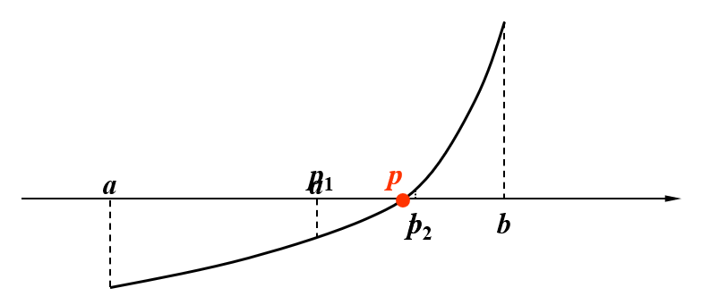
</div>

接下来基于上图来演示二分法的过程：

**过程演示**

Step 1：
    
<div style="text-align: center">
    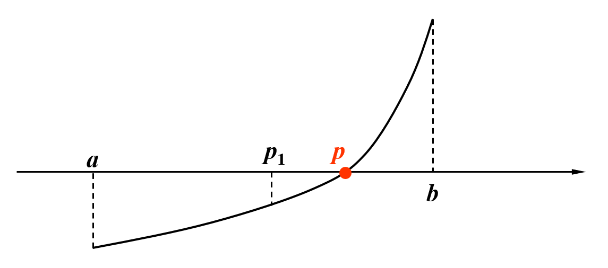
</div>

在 $a, b$ 之间取中点 $p_1$。观察图像，并根据介值定理，$f(p_1), f(b)$ 之间存在取值为0的情况，那么真正的根 $p$ 一定落在 $p_1$ 和 $b$ 之间，所以接下来令 $p_1$ 为下界 $a$，继续二分。
    
Step 2：
    
<div style="text-align: center">
    
</div>

在 $a$（原来为 $p_1$）, $b$ 之间取中点 $p_2$。观察图像，并根据介值定理，$f(a), f(p_2)$ 之间存在取值为0的情况，那么真正的根 $p$ 一定落在 $a$ 和 $p_2$ 之间，所以接下来令 $p_2$ 为上界 $b$，继续二分。
    
Step X：
    
后续过程同上所述。

**讨论：那么，这一迭代过程何时结束呢？**

以下几种条件都可作为停止迭代的根据：

- 绝对误差：$|p_N - p_{N-1}| < \varepsilon$
- 相对误差：$\dfrac{|p_N - p_{N-1}|}{|p_N|} < \varepsilon$
- 函数值：$|f(p_N)| < \varepsilon$

然而，使用误差作为依据的时候需要当心：因为在实践中，存在序列 $\{p_N\}$ 发散的情况，这个时候不应该将误差作为判断依据。

<div style="text-align: center">
    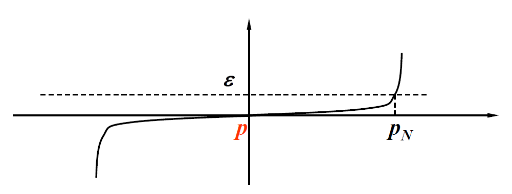
</div>   

**定理** ：假设 $f \in C[a, b]$ 且满足 $f(a) \cdot f(b) < 0$，那么二分法将产生一个序列 $\{p_n\} (n = 1, 2, \dots)$，用于逼近 $f$ 的一个零点 $p$，并满足：
    
$$
|p_n - p| \le \dfrac{b - a}{2^n} \quad \text{when } n \ge 1
$$


**二分法的实现**

在连续函数 $f$ 的区间 $[a, b]$ 上寻找 $f(x) = 0$ 的解，其中 $f(a), f(b)$ 符号相反。

- 输入：端点 $a, b$；容忍值(tolerance) $TOL$；最大迭代次数 $N_{max}$
- 输出：$p$ 的近似解或失败信息

```cpp hl_lines="4 9"
Step 1  Set i = 1;
            FA = f(a);
Step 2  while (i <= N_max) do steps 3-6
        Step 3  Set p = a + (b - a) / 2;  // computer p_i
                FP = f(p);
        Step 4  if (FP == 0) or (b - a) / 2 < TOL then Output(p);
                STOP;  // successful
        Step 5  Set i++;
        Step 6  if sign(FA) * sign(FP) > 0 then Set a = p; FA = FP;
                else set b = p;  // update a_i, b_i
Step 7  Output(Method failed after N_max iterations);  // unsuccessful
        Stop.
```

**思考伪代码中的高亮部分**
    
问题：
    
- 为什么取中值的代码不写成 `p = (a + b) / 2`？
- 为什么判断上下界的代码不写成 `FA * FP > 0`？
        

答案：
    
主要是为了防止**溢出**(overflow)。因为无论是 `a + b` 还是 `FA * FP`，如果它们的符号一致，且数值特别大的时候，它们的和或积可能是计算机无法表示出来的东西，也就是产生了溢出的问题，此时该算法可能返回的是一个意料之外的结果，而不产生报错。所以我们需要好好关注这些细节！


**对二分法的评价**

优点：

- 简单，只要求函数 $f$ 是连续的
- 结果总是会收敛到真正的解

缺点：

- 收敛速度过慢，并且在计算过程中，更好的介值近似可能在不经意间被抛弃掉了
- 不适用于寻找多根和复数根的情况

**实际使用时的建议**

- 在使用二分法之前先画一幅 $f(x)$ 的草图，先观察二分法是否可行
- 或者用一个子程序将完整的区间划分为多个子区间 $[a_k, b_k]$，这样的话即使 $f(a) \cdot f(b)$，也可以保证 $f(a_k) \cdot f(b_k) < 0$


## Fixed-Point Iteration

接下来介绍第二种求根方法：**不动点迭代**(fixed-point iteration)。

>wiki: [Fixed point](https://en.wikipedia.org/wiki/Fixed_point_(mathematics))

首先，我们要将 $f(x)$ 的根看作 $g(x)$ 的不动点，即：

$$
f(x) = 0 \xLeftrightarrow{\text{equivalent}} x = g(x)
$$

基本思路是：从初始的近似值 $p_0$ 开始，通过 $p_n = g(p_{n-1})$（其中 $n \ge 1$），产生序列 $\{p_n\}_{n=0}^\infty$。如果该序列能收敛到 $p$，且 $g$ 是一个连续函数，那么：

$$
p = \lim\limits_{n \rightarrow \infty} p_n = \lim\limits_{n \rightarrow \infty} g(p_{n-1}) = g(\lim\limits_{n \rightarrow \infty} p_{n-1}) = g(p) 
$$

这个方法看似特别简单：只需不断的迭代，我们总能找到解。但实际上，并不是所有的 $g(x)$ 都能做到让序列收敛，具体来看下面几个例子：

**例子**

题目
    
判断以下几种 $g(x)$ 中，哪个能做到收敛，为什么？

>建议在阅读答案前，先自己动手画画看

<div style="text-align: center">
    
</div>  

答案

<div style="text-align: center">
    
</div>  

>~~让我不禁回忆起浙江高考恶心人的数列大题~~

**不动点定理** ：令 $g \in C[a, b]$，且满足 $\forall x \in [a, b]$，有 $g(x) \in [a, b]$。并且一阶导函数 $g'$ 存在于区间 $(a, b)$，且满足 $\forall x \in (a, b)$，$\exists$ 常数 $k \in (0, 1)$ 使得 $|g'(x)| \le k$ 成立。那么 $\forall p_0 \in [a, b]$，由 $p_n = g(p_{n-1}), n \ge 1$ 定义的序列会收敛到位于区间 $[a, b]$ 上的唯一不动点。
    
**推论** ：如果 $g$ 满足不动点定理的假设，那么用 $p_n$（$\forall n \ge 1$）近似表示 $p$ 所产生的误差边界为：
    
$$
|p_n - p| \le \dfrac{1}{1 - k}|p_{n+1} - p_n| \quad \text{and} \quad |p_n - p| \le \dfrac{k^n}{1 - k} |p_1 - p_0|
$$


**讨论：思考这两个不等式的意义**

- 前者可以用来控制计算的精度
- 后者告诉我们：$k$ 越小，收敛速度越快

**不动点迭代的实现**

给定一个初始近似值 $p_0$，找到 $p = g(p)$ 的一个解。

- 输入：初始近似值 $p_0$；容忍值 $TOL$；最大迭代次数 $N_{max}$
- 输出：近似解 $p$ 或错误信息

```cpp
Step 1  Set i = 1;
Step 2  while (i <= N_max) do steps 3-6
        Step 3  Set p = g(p_0);  // compute p_i
        Step 4  if |p - p_0| < TOL then Output(p);  // successful
            STOP;
        Step 5  Set i++;
        Step 6  Set p_0 = p;  // update p_0
Step 7  Output(The method failed after N_max iterations);  // unsuccessful
```

**例题**

题目
    
<div style="text-align: center">
    
</div> 

解答
    
如果无脑迭代的话，会得到以下结果：

<div style="text-align: center">
    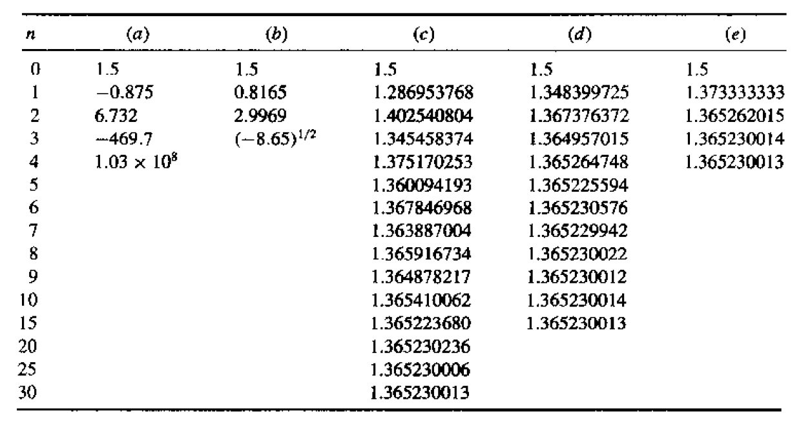
</div> 

可以看到 a 和 b 不太行，c, d, e 都可以迭代下去。不行的原因分别是一个不收敛，另一个出现对负数开根号的情况。但即使是 OK 的那几个，也有一些小小的差别：

- c. 在区间 $[1, 1.5]$ 时，$k \approx 0.66$，也就是说该方程收敛较慢
- d. $k \approx 0.15$，收敛速度中等
- e. $k$ 更小，收敛很快（实际上它就是下面要介绍的[牛顿法](#newtons-method)）


## Newton's Method

最后要介绍的求根方法是**牛顿法**(Newton's method)，它的基本思想是使用[**泰勒展开式**](https://en.wikipedia.org/wiki/Taylor_series)(Taylor's expansion)来线性化一个非线性的函数。

具体来说，令 $p_0 \in [a, b]$ 为 $p$ 的一个近似值，满足 $f'(p) \ne 0$。考虑以下 $f(x)$ 关于 $p_0$ 的泰勒多项式：

$$
f(x) = f(p_0) + f'(p_0)(x - p_0) + \dfrac{f''(\xi_x)}{2!} (x - p_0)^2 \quad \text{where } \xi_x \text{ lies between } p_0 \text{ and } x
$$

假设 $|p - p_0|$ 很小，那么 $(p - p_0)^2$ 会更小，那么：

$$
0  = f(p) \approx f(p_0) + f'(p_0) (p - p_0) \Rightarrow p \approx p_0 - \dfrac{f(p_0)}{f'(p_0)}
$$

**动画演示**

Step 1：
    
先取一个近似值 $p_0$。

<div style="text-align: center">
    
</div>     

求该位置下的导数，然后在对应点上做一条切线，该切线与 x 轴的交点即为下一个近似值，该近似值更加接近于真实值。

<div style="text-align: center">
    
</div>  

Step 2：
    
<div style="text-align: center">
    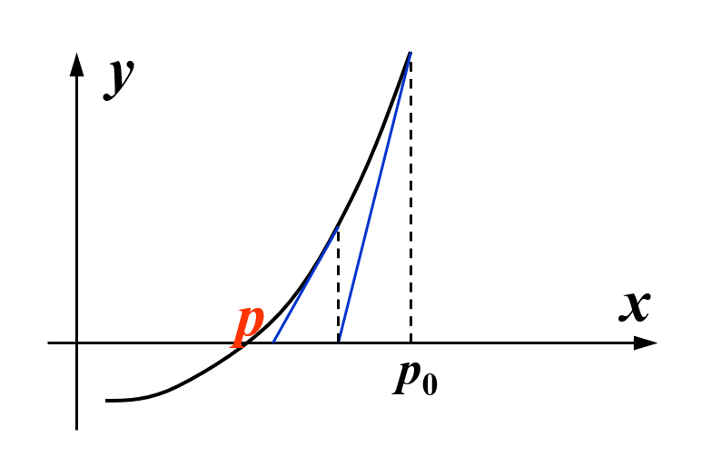
</div>  

从新的近似值出发，求该位置下的导数，然后在对应点上做一条切线，该切线与 x 轴的交点即为下一个近似值，该近似值更加接近于真实值。
    
Step X：
    
重复上述过程，直至逼近真正的解 $p$。

将这些过程压缩在一张图中：

<div style="text-align: center">
    
</div>  


从上述过程中，我们不难得到以下递推关系式：

$$
p_n = p_{n-1} - \dfrac{f(p_{n-1})}{f'(p_{n-1})} \quad \text{for } n \ge 1
$$

**定理** ：令 $f \in C^2[a, b]$（即函数具有二阶连续导数）。如果 $p \in [a, b]$ 满足 $f(p) = 0$ 且 $f'(p) \ne 0$，那么存在一个 $\delta > 0$，使得牛顿法产生一个序列 $\{p_n\} (n = 1, 2, \dots)$，对任意近似值 $p_0 \in [p - \delta, p + \delta]$，该序列收敛于 $p$。
    
**牛顿法的实现**

给定一个初始近似值 $p_0$，找到 $f(x) = 0$ 的一个解。

- 输入：初始近似值 $p_0$；容忍值 $TOL$；最大迭代次数 $N_{max}$
- 输出：近似解 $p$ 或错误信息

```cpp hl_lines="3"
Step 1  Set i = 1;
Step 2  while (i <= N_max) do steps 3-6
        Step 3  Set p = p_0 - f(p_0) / f'(p_0);  // compute p_i
        Step 4  if |p - p_0| < TOL then Output(p);  // successful
            STOP;
        Step 5  Set i++;
        Step 6  Set p_0 = p;  // update p_0
Step 7  Output(The method failed after N_max iterations);  // unsuccessful
```

>相比不动点迭代的实现，只有高亮行发生了变化。

**注意** ：牛顿法的收敛性取决于初始近似值的选择。如下图所示，如果选择不当的话，牛顿法就会失效：
    
<div style="text-align: center">
    
</div>


## Error Analysis for Iterative Methods

**定义**

假设 $\{p_n\} (n = 0, 1, 2, \dots)$ 是一个收敛到 $p$ 的序列，且 $\forall n, p_n \ne p$。若存在正常数 $\alpha, \lambda$，使得：

$$
\lim\limits_{n \rightarrow \infty} \dfrac{|p_{n+1} - p|}{|p_n - p|^\alpha} = \lambda
$$

成立，那么 $\{p_n\} (n = 0, 1, 2, \dots)$ 以阶数 $\alpha$ 收敛到 $p$，且渐进误差常量为 $\lambda$。

- 若 $\alpha = 1$，那么序列是**线性**(linearly)收敛的
- 若 $\alpha = 2$，那么序列是**二次**(quadratically)收敛的

所以，$\alpha$ 越大，收敛速度越快。

>注意：阶数 $\alpha$ 可以不是整数。

**思考**

问题：对于 $g'(p) \ne 0$ 的迭代法，收敛的阶数是多少？
    
解答：
    
$$
\lim\limits_{n \rightarrow \infty} \dfrac{|p_{n+1} - p|}{|p_n - p|^\alpha} = \lim\limits_{n \rightarrow \infty} \dfrac{g'(\xi_n)|p_n - p|}{|p_n - p|^\alpha} = |g'(p)|
$$

因此是线性收敛的。

**讨论**

问题：牛顿法的收敛阶数是多少（此时 $g'(p) = 0$）？
    
解答：
    
通过泰勒展开式可以得到：

$$
\begin{align}
0 = f(p) & = f(p_n) + f'(p_n)(p - p_n) + \dfrac{f''(\xi_n)}{2!} (p - p_n)^2 \notag \\
\Rightarrow p & = \underbrace{p_n - \dfrac{f(p_n)}{f'(p_n)}}_{p_{n+1}} - \dfrac{f''(\xi_n)}{2! f'(p_n)}(p - p_n)^2 \Rightarrow \dfrac{|p_{n+1} - p|}{|p_n - p|^2} = \dfrac{f''(\xi_n)}{2f'(p_n)} \notag
\end{align}
$$

只要 $f'(p) \ne 0$（在一个简单根附近），那么牛顿法至少是**二次收敛**的。

**定理** ：令 $p$ 是 $g(x)$ 的不动点。如果存在一些常量 $\alpha \ge 2$，使得 $g \in C^\alpha [p - \delta, p + \delta], \textcolor{red}{g'(p) = \dots = g^{(\alpha - 1)}(p) = 0}$ 且 $\textcolor{red}{g^{(\alpha)}(p) \ne 0}$。那么关于 $p_n = g(p_{n-1}), n \ge 1$ 的迭代是<span style="text-color: red"> $\alpha$ 阶</span>收敛的。
    
**讨论**

题目：如果根**不是**简单的(simple)（即有**重根**(multiple roots)），那么牛顿法的收敛阶数是多少？
    
答案：
    
如果 $p$ 是 $f$ 中的一个根，且重数(multiplicity)为 $m$，那么 $f(x) = (x - p)^m q(x)$ 且 $q(p) \ne 0$。

根据牛顿法：$p_n = g(p_{n-1}) \text{ for } n \ge 1 \text{ with } g(x) = x - \dfrac{f(x)}{f'(x)}$，得到：

$$
g'(p) = \Big|1 - \dfrac{f'(p)^2 - f(p)f''(p)}{f'(p)^2}\Big| = 1 - \dfrac{1}{m} < 1
$$

所以此时牛顿法收敛，但不是二次收敛。

---
幸运的是，存在一种可以加快收敛速度的方法：将有重根的 $f$ 转换为等价的另一个有**简单根**的函数，在这个新的函数上使用牛顿法。具体来说：

- 令 $\mu(x) = \dfrac{f(x)}{f'(x)}$，那么 $f$ 的重根 = $\mu$ 的简单根

- 在 $\mu$ 上应用牛顿法：

  $$
  g(x) = x - \dfrac{\mu(x)}{\mu'(x)} = x - \dfrac{f(x)f'(x)}{[f'(x)]^2 - f(x)f''(x)}
  $$

**对上述方法的评价**

- 优点：二次收敛
- 缺点：
    - 需要额外计算 $f''(x)$
    - 分母是两个都接近于0的数的差


## Accelerating Convergence

### Aitken's $\Delta^2$ Method

**定义（作为背景知识）** ：对于给定的序列 $\{p_n\} (n = 1, 2, \dots)$，**前向差**(forward difference) $\Delta p_n = p_{n+1} - p_n (n \ge 0)$。更高次的幂 $\Delta^k p_n$ 可以被递归定义为 $\Delta^k p_n = \Delta (\Delta^{k-1} p_n) (k \ge 2)$

虽然二次收敛效果很好，但并不是所有方法都能二次收敛——我们还得关注那些**线性收敛**的方法。因此下面将介绍一些能够加速线性收敛的技术。我们先来认识第一种方法：**Aitken's $\Delta^2$ 方法**。

**推导过程**

假设 $\{p_n\}_{n=0}^\infty$ 是线性收敛的序列，且极限为 $p$。为了构造一个收敛至 $p$ 更快的序列 $\{\hat{p_n}\}$，我们先假设 $p_n - p, p_{n+1} - p, p_{n+2} - p$ 的结果符号一致，且 $n$ 足够大，使得 

$$
\dfrac{p_{n+1} - p}{p_n - p} \approx \dfrac{p_{n+2} - p}{p_{n+1} - p}
$$

成立。那么通过一系列的转化，可以得到：

$$
p \approx \dfrac{p_{n+2}p_n - p_{n+1}^2}{p_{n+2} - 2p_{n+1} + p_n}
$$

再次转化，得到：$p \approx p_n - \dfrac{(p_{n+1} - p_n)^2}{p_{n+2} - 2p_{n+1} + p_n}$

>这里用到了[不动点迭代](#fixed-point-iteration)的知识。

利用前面介绍的前向差概念，替换上述等式中的记号，最终得到以下公式，即为 Atiken's $\Delta^2$ 方法所得到的加速收敛序列的递推公式：

$$
\hat{p}_n = \{\Delta^2\}(p_n) = p_n - \dfrac{(\Delta p_n)^2}{\Delta^2 p_n} (n \ge 0)
$$

Aitken's $\Delta^2$ 方法的思想在于：用多项低阶去产生高阶精度，从而避免多次迭代。


**定理** ：假设序列 $\{p_n\} (n = 1, 2, \dots)$ 线性收敛到极限 $p$；且对于所有充分大的数 $n$，有 $(p_n - p)(p_{n+1} - p) > 0$。那么序列 $\{\hat{p}_n\} (n = 1, 2, \dots)$ 收敛到 $p$ 的速度快于 $\{p_n\} (n = 1, 2, \dots)$，即：

$$
\lim\limits_{n \rightarrow \infty} \dfrac{\hat{p}_n - p}{p_n - p} = 0
$$


### Steffensen's Method

在 Aitken's $\Delta^2$ 方法的基础上稍作修改，我们就能得到用于加速**二次收敛**的技术——**Steffensen 方法**。用这种方法构造出来的序列如下所示：

$$
\begin{align}
p_0^{(0)}, p_1^{(0)} = g(p_0^{(0)}), p_2^{(0)} = g(p_2^{(0)})  \notag \\
p_0^{(1)} = \{\Delta^2\}(p_0^{(0)}), p_1^{(1)} = \{\Delta^2\}(p_0^{(1)}) , p_2^{(1)} = \{\Delta^2\}(p_1^{(1)})\notag \\
p_0^{(2)} = \{\Delta^2\}(p_0^{(1)}), \dots \notag
\end{align}
$$

**注意** ：该方法的使用前提是 $g'(p) \ne 1$。

**算法：Steffensen 加速**

对于给定初始值 $p_0$，寻找 $x = g(x)$ 的解。

- 输入：初始近似值 $p_0$；容忍值 $TOL$；最大迭代次数 $N_{max}$
- 输出：近似解 $x$ 或失败信息

```cpp
Step 1  Set i = 1;
Step 2  while (i <= N_max) do steps 3-6
        Step 3  Set p_1 = g(p_0);
                    p_2 = g(p_1);
                    p = p_0 - (p_1 - p_0)^2 / (p_2 - 2 * p_1 + p_0);
        Step 4  if |p - p_0| < TOL then Output(p);  // successful
            STOP;
        Step 5  Set i++;
        Step 6  Set p_0 = p;  // update p_0
Step 7  Output(The method failed after N_max iterations);  // unsuccessful
```


# Chap 6: Direct Methods for Solving Linear Systems


目标：求解 $A \boldsymbol{x} = \boldsymbol{b}$

**逆矩阵的求解**

个人比较喜欢**高斯-约旦消元法**(Gauss-Jordan elimination)（计算机也常用这种方法），其大致步骤如下：

1. 构造增广矩阵 $[A | I]$
2. 对增广矩阵进行行初等变换（目标是将左侧的 $A$ 变为单位矩阵 $I$）：
    - 交换两行。
    - 将某一行乘以一个非零常数。
    - 将某一行的一个倍数加到另一行。 
3. 检查结果：如果左侧成功变为 $I$，则右侧的矩阵就是 $A^{-1}$。如果左侧在变换过程中出现全零行（或列），则 $A$ 不可逆。


## Linear Systems for Equations

### Gaussian Elimination

**高斯消元法**(Gaussian elimination)的基本思路：

- 首先将矩阵 $A$ 归约成一个**上三角**(upper-triangular)矩阵
- 然后通过**回代**(backward-substitution)来求解未知量

<div style="text-align: center">
    
</div>


先来看**消元**(elimination)的实现：先令 $A^{(1)} = A = (a_{ij}^{(1)})_{n \times n}, \boldsymbol{b}^{(1)} = \boldsymbol{b} = \begin{bmatrix}b_1^{(1)} \\ \vdots \\ b_n^{(1)}\end{bmatrix}$

- 第1步：

  - 如果 $a_{11}^{(1)} \ne 0$，计算 $m_{i1} = \dfrac{a_{i1}^{(1)}}{a_{11}^{(1)}}, (i = 2, \dots, n)$

  - 那么增广矩阵(augmented matrix)的第 $i$ 行 $\text{row}_i$为：$m_{i1} \times \text{row}_1$，得到

    $$
    \left[
    \begin{array}{cccc|c}
    a_{11}^{(1)} & a_{12}^{(1)} & \cdots & a_{1n}^{(1)} & b_1^{(1)} \\
    0 & & A^{(2)} & & \boldsymbol{b}^{(2)} \\
    \end{array}
    \right]
    $$

    其中 $\begin{cases}a_{ij}^{(2)} = a_{ij}^{(1)} - m_{i1} a_{1j}^{1} \\ b_i^{(2)} = b_i^{(1)} - m_{i1} b_1^{(1)}\end{cases}, (i, j = 2, \dots, n)$


- 第k步：

  - 如果 $a_{kk}^{(k)} \ne 0$，计算 $m_{ik} = \dfrac{a_{ik}^{(k)}}{a_{kk}^{(k)}}, (i = k+1, \dots, n)$
  - $\begin{cases}a_{ij}^{(k+1)} = a_{ij}^{(k)} - m_{ik} a_{kj}^{k} \\ b_i^{(k+1)} = b_i^{(k)} - m_{ik} b_k^{(k)}\end{cases}, (i, j = k+1, \dots, n)$

- n-1 步后：

  $$
  \begin{bmatrix} a_{11}^{(1)} & a_{12}^{(1)} & \dots & a_{1n}^{(1)} \\ & a_{22}^{(2)} & \dots & a_{2n}^{(2)} \\ & & \dots & \vdots \\ & & & a_{nn}^{(n)}\end{bmatrix} \begin{bmatrix}x_1 \\ x_2 \\ \vdots \\ x_n\end{bmatrix} = \begin{bmatrix}b_1^{(1)} \\ b_2^{(2)} \\ \vdots \\ b_n^{(n)}\end{bmatrix}
  $$

---

接下来看**回代**：

- $x_n = \dfrac{b_n^{(n)}}{a_{nn}^{(n)}}$
- $x_i = \dfrac{b_i^{(i)} - \sum\limits_{j=i+1}^n a_{ij}^{(i)} x_j}{a_{ii}^{(i)}}, (i = n - 1, \dots, 1)$
- 我们必须找到最小的整数 $k \ge i$ 且 $a_{ki}^{(i)} \ne 0$，然后交换第 $k$ 行和第 $i$ 行

**代码实现**

求解 $n \times n$ 线性方程组：

$$
\begin{align}
E_1: & a_{11} x_1 + a_{12} x_2 + \dots + a_{1n} x_n = a_{1, n+1} \notag \\
E_2: & a_{21} x_1 + a_{22} x_2 + \dots + a_{2n} x_n = a_{2, n+1} \notag \\
\vdots \quad &  \quad \vdots \quad \quad \quad\ \vdots \quad \quad \quad \quad \quad \quad \vdots \quad \quad \quad \vdots \notag \\
E_n: & a_{n1} x_1 + a_{n2} x_2 + \dots + a_{nn} x_n = a_{n, n+1} \notag \\
\end{align}
$$

- 输入：未知量和方程的数量 $n$；增广矩阵 $A = (a_{ij})$，其中 $1 \le i \le n, 1 \le j \le n+1$
- 输出：解 $x_1, x_2, \dots, x_n$，或者线性方程组没有唯一解的信息

```cpp
Step 1  for i = 1, ..., n - 1 do Steps 2-4:
    Step 2  Let p be the smallest integer with i <= p <= n and a[p][i] != 0;
            if no integer p can be found
                then Output('no unique solution exists');
                STOP;
            // row exchange
    Step 3  if p != i then perform (E[p]) <-> (E[i]);
            // elimination
    Step 4  for j = i + 1, ..., n do Step 5 and 6:
        Step 5  Set m[j][i] = a[j][i] / a[i][i]
        Step 6  Perform (E[j] - m[j][i] * E[i]) -> (E[i])
    Step 7  if a[n][n] = 0 then Output('no unique solution exists');
                STOP;
            // backward substitution
    Step 8  Set x_n = a[n][n+1] / a[n][n]
    Step 9  for i = n - 1, ..., 1 set x[i] = [a[i][n+1] - sum(j=i+1, n, a[i][j] * x[j])] / a[i][i];
    Step 10 Output(x[1], ..., x[n]);
            STOP;    // success
```


### Amount of Computation

现在我们来统计一下计算量（仅考虑乘法/除法）。

- 消元：$\sum\limits_{k=1}^{n-1} (n - k)(n - k + 2) = \dfrac{n^3}{3} + \dfrac{n^2}{2} - \dfrac{5}{6}n$
- 回代：$1 + \sum\limits_{i=1}^{n-1}(n - i + 1) = \dfrac{n^2}{2} + \dfrac{n}{2}$

所以对于很大的 $n$，乘法和除法的总数大约为 $\textcolor{red}{\dfrac{n^3}{3}}$。也就是说，高斯消元法的时间复杂度为 **$O(n^3)$**。


## Pivoting Strategies

>除非有特殊说明，以下的 $k$ 指的是第 $k$ 次高斯消元。

**一般高斯消元法的问题**

在高斯消元的过程中，如果其中一个**主元**(pivot) $a_{kk}^{(k)} = 0$，那么就需要进行行交换 $(E_k) \leftrightarrow (E_p)$，其中 $p$ 是最小的满足 $p > k$ 且 $a_{pk}^{(k)} \ne 0$ 的整数。但为了减小舍入误差，即使主元并不等于0的时候也要做行交换。

如果 $a_{kk}^{(k)}$ 相比 $a_{jk}^{(k)}$ 较小的话，那么乘数 $m_{jk} = \dfrac{a_{jk}^{(k)}}{a_{kk}^{(k)}}$ 会大于1，导致误差的积累。并且在回代的时候，$x_k$ 的值因为分母 $a_{kk}^{(k)}$ 的值过小，其计算误差也会被放大。

所以，我们需要选取合适的主元以减小误差。下面给出一些选取主元的策略。

**置换矩阵** ：找到合适的主元后，一般我们会做一个行交换。在后面涉及到[矩阵分解](#matrix-factorization)的时候，“行交换”这一操作就可以用一个**置换矩阵**(permutation matrix) $P$ 来表示。它的元素基于**单位矩阵**(identity matrix) $I$，在此基础上对里面的元素做行交换，便可表示对应的行交换操作。
    
比如 $P_{12} = \begin{bmatrix}0 & 1 & 0 \\ 1 & 0 & 0 \\ 0 & 0 & 1\end{bmatrix}$ 表示交换第1行和第2行。如果 $\boldsymbol{x} = \begin{bmatrix}x_1 \\ x_2 \\ x_3\end{bmatrix}$，那么 $P_{12} \boldsymbol{x} = \begin{bmatrix}x_2 \\ x_1 \\ x_3\end{bmatrix}$。


### Partial Pivoting

**部分主元法**(partial pivoting)（或称为最大列主元法(maximal column pivoting)）：找到最小的 $p$，使得 $|a_{pk}^{(k)}| = \max\limits_{k \le i \le n} |a_{ik}^{(k)}|$，然后交换第 $p$ 行和第 $k$ 行。

**代码实现**

求解 $n \times n$ 线性方程组：

$$
\begin{align}
E_1: & a_{11} x_1 + a_{12} x_2 + \dots + a_{1n} x_n = a_{1, n+1} \notag \\
E_2: & a_{21} x_1 + a_{22} x_2 + \dots + a_{2n} x_n = a_{2, n+1} \notag \\
\vdots \quad &  \quad \vdots \quad \quad \quad\ \vdots \quad \quad \quad \quad \quad \quad \vdots \quad \quad \quad \vdots \notag \\
E_n: & a_{n1} x_1 + a_{n2} x_2 + \dots + a_{nn} x_n = a_{n, n+1} \notag \\
\end{align}
$$

- 输入：未知量和方程的数量 $n$；增广矩阵 $A = (a_{ij})$，其中 $1 \le i \le n, 1 \le j \le n+1$
- 输出：解 $x_1, x_2, \dots, x_n$，或者线性方程组没有唯一解的信息

```cpp
Step 1  for i = 1, ..., n set NROW(i) = i;    // initialize row pointer
Step 2  for i = 1, ..., n - 1 do Steps 3-6:    // elimination process
    Step 3  Let p be the smallest integer with i <= p <= n and
            |a(NROW(p), i)| = max_{i <= j <= n}|a(NROW(j), i)|;
    Step 4  if a(NROW(p), i) = 0 then Output('no unique solution exists');
                STOP;
    Step 5  if NROW(i) != NROW(p) then set NCOPY = NROW(i);    // simulated row interchange
                                          NROW(i) = NROW(p);
                                          NROW(p) = NCOPY;
    Step 6  for j = i + 1, ..., n do Steps 7-8:
        Step 7  Set m(NROW(j), i) = a(NROW(j), i) / a(NROW(i), i);
        Step 8  Perform (E_NROW(j) - m(NROW(j), i) * E_NROW(i)) -> (E_NROW(j));
    Step 9  if a(NROW(n), n) = 0 then Output('no unique solution exists');
                STOP;
    // start backward substitution
    Step 10 Set x[n] = a(NROW(n), n + 1) / a(NROW(n), n);
    Step 11 for i = n - 1, ..., 1
                set x[i] = (a(NROW(i), n + 1) - sum(j=i+1, n, a(NROW(i), j) * x[j])) / a(NROW(i), i);
    Step 12 Output(x[1], ..., x[n]);    // procedure completed successfully
            STOP;
```

**例子**

题目：求解线性方程组 $\begin{cases}30.00 x_1 + 594100 x_2 = 591700 \\ 5.291 x_1 - 6.130 x_2 = 46.78\end{cases}$，舍入精度为 4 位。
    
分析：可以看到，虽然根据部分主元法，解方程时无需交换行，然而注意到第一个方程中同一行的元素量级相差巨大，而第二行元素的量级比较接近，所以会产生较大的误差（这也反映了部分主元法的缺陷）。


### Scaled Partial Pivoting

**缩放部分主元法**(scaled partial pivoting)（或称为缩放列主元法(scaled-column pivoting)）：将一行中最大的元素放在主元的位置上。

- 第1步：定义每一行的**缩放因子**(scale factor) $s_i = \max\limits_{1 \le j \le n} |a_{ij}|$（即每行中**绝对值最大**的元素）
- 第2步：（对于第 $k$ 次高斯消元，）找到最小的 $p \ge k$，使得 $\dfrac{|a_{pk}^{(k)}|}{s_p} = \max\limits_{k \le i \le n} \dfrac{|a_{ik}^{(k)}|}{s_i}$，然后交换第 $p$ 行和第 $k$ 行

**注** ：缩放因子**只计算一次**（在高斯消元前），以确保计算效率。

**代码实现**

和部分主元法的实现相比，区别在于前3步，后续步骤都是一样的，因此下面只列出前3步：

```cpp
Step 1  for i = 1, ..., n set s_i = max_{1 <= j <= n}(|a_ij|);
                          if s_i = 0 then Output('no unique solution exists');
                                          STOP;
Step 2  for i = 1, ..., n - 1 do Steps 3-6:    // elimination process
    Step 3  Let p be the smallest integer with i <= p <= n and
            |a(NROW(p), i)| / s(NROW(p)) = max_{i <= j <= n}(|a(NROW(j), i)| / s(NROW(j)));
```

**缩放部分主元法的好处在哪里？**

一般的部分主元法考虑的是**绝对大小**（当前列绝对值最大的元素），而缩放部分主元法考虑的是**相对大小**（当前列中，元素绝对值与该行最大绝对值之比最大的元素）。虽然一般的部分主元法足以应对大多数情况，但从数值稳定性上看，后者能够在矩阵元素有较大量级差异的极端情形下能够减少误差的积累，从而表现出更好的稳定性（比如 $1$ 和 $10^5$ 这么大的量级差异）。


### Complete Pivoting

**完全主元法**(complete pivoting)（或称为最大主元法(maximal pivoting)）：搜索所有的元素 $a_{ij} (i, j = k, \dots, n)$，找出其中数值最大的元素。通过**互换**(interchange)行和列，使得该元素来到主元的位置上。


### Amount of Computation

- 部分主元法：需要 $O(n^2)$ 次**比较**
- 缩放部分主元法：需要 $O(n^2)$ 次**比较**，以及 $O(n^2)$ 次**除法**（初始计算）
- 完全主元法：需要 $O(\dfrac{n^3}{3})$ 次**比较**

>所以，要想追求更好的稳定性，就要以更大的计算量为代价。

**注** ：如果新的缩放因子在行交换的时候才被确定，那么缩放部分主元法需要 $O(\dfrac{n^3}{3})$ 次额外的**比较**，以及 $O(n^2)$ 次**除法**


## Matrix Factorization

高斯消元法是一种简单粗暴的方法，但效率不是很高。因此下面介绍一种基于高斯消元法实现的改进方法——**矩阵分解**(matrix factorization)。它的计算过程如下：

- 第 1 步：

  - $m_{i1} = \dfrac{a_{i1}}{a_{11}} (a_{11} \ne 0)$
  - 令 $L_1 = \begin{bmatrix}1 & & & \\ -m_{21} & 1 & & \\ \vdots & & \ddots \\ -m_{n1} & & &1\end{bmatrix}$（这就是**第一高斯变换矩阵**(first Gaussian transformation matrix)），那么 $L_1 [A^{(1)} \quad \boldsymbol{b}^{(1)}] = \begin{bmatrix}a_{11}^{(1)} & \dots a_{1n}^{(1)} & b_1^{(1)} \\ 0 & A^{(2)} & \boldsymbol{b}^{(2)}\end{bmatrix}$

- 第 k 步：

  - **第k高斯变换矩阵**(kth Gaussian transformation matrix)：$L_k = \begin{bmatrix}1 & & & & \\ & \ddots & & & \\ & & 1 & & \\ & & -m_{k+1, k} & & \\ & & \vdots &\ddots & \\ & & -m_{n, k} & & 1\end{bmatrix}$（空的地方都是0）

- 第 n-1 步：

  $$
  L_{n-1}L_{n-2} \dots L_1 [A \quad \boldsymbol{b}] = \begin{bmatrix}a_{11}^{(1)} & a_{12}^{(1)} & \dots & a_{1n}^{(1)} & b_1^{(1)}\\ & a_{22}^{(2)} & \dots & a_{2n}^{(2)} & b_2^{(2)} \\ & & \dots & \vdots & \vdots\\ & & & a_{nn}^{(n)} & b_n^{(n)}\end{bmatrix}
  $$

**定理**

若高斯消元法能够在不使用行互换的基础上求解线性方程组 $A \boldsymbol{x} = \boldsymbol{b}$，那么矩阵 $A$ 可以被因式分解为一个下三角矩阵 $L$ 和上三角矩阵 $U$ 的乘积，即 $A = LU$。

其中：

$$
U = \begin{bmatrix}a_{11}^{(1)} & a_{12}^{(1)} & \dots & a_{1n}^{(1)} \\ 0 & a_{22}^{(2)} & \dots & a_{2n}^{(2)} \\ \vdots & \vdots & \ddots & \vdots \\ 0 & \dots & \dots & a_{nn}^{(n)}\end{bmatrix} \quad L = \begin{bmatrix}1 & 0 & \dots & 0 \\ m_{21} & 1 & \dots & 0 \\ \vdots & \vdots & \ddots & \vdots \\ m_{n1} & \dots & m_{n, n-1} & 1\end{bmatrix} \quad m_{ji} = \dfrac{a_{ji}^{(i)}}{a_{ii}^{(i)}}
$$

如果矩阵 $L$ 是**单位的**(unitary)（也就是说主对角线元素都是1），那么得到的矩阵分解是**唯一的**。
    

**注** ：如果 $U$ 也是**单位的**，那么这种分解就称为[**Crout 分解**](https://en.wikipedia.org/wiki/Crout_matrix_decomposition)。我们可通过对 $A^T$ 的 $LU$ 分解来实现 Crout 分解。也就是说，找到 $A^T = LU$，那么 $A = U^T L^T$ 就是 $A$ 的 Crout 分解。

**$LU$ 分解的代码实现**

将 $n \times n$ 的矩阵 $A = (a_{ij})$ 分解为下三角矩阵 $L = (l_{ij})$ 和上三角矩阵 $U = (u_{ij})$，也就是说 $A = LU$，其中 $L$ 或 $U$ 的主对角线元素均为1。

- 输入：维度 $n$；$A$ 的元素 $a_{ij}, 1 \le i, j \le n$；$L$ 的对角元素 $l_{11} = \dots = l_{nn} = 1$ 或 $U$ 的对角元素 $u_{11} = \dots = u_{nn} = 1$
- 输出：$L$ 的项 $l_{ij}, 1 \le j \le i, 1 \le i \le n$，以及 $U$ 的项 $u_{ij}, i \le j \le n, 1 \le i \le n$

```cpp
Step 1  Select l_11 and u_11 satisfying l_11 * u_11 = a_11;
        if l_11 * u_11 = 0 then Output('Factorization impossible');
            Stop;
Step 2  for j = 2, ..., n set u_1j = a_1j / l_11;    // first row of U
                              l_j1 = a_j1 / u_11;    // first column of L
Step 3  for i = 2, ..., n - 1 do Steps 4 and 5:
    Step 4  Select l_ii and u_ii safisfying l_ii * u_ii = a_ii - sum(k=1, i-1, l_ik * u_ki);
            if l_ii * u_ii = 0 then Output('Factorization impossible');
                Stop;
    Step 5  for j = i + 1, ..., n:
                set u_ij = 1 / l_ii * (a_ij - sum(k=1, i-1, l_ik * u_kj));    // ith row of U
                set l_ji = 1 / u_ii * (a_ji - sum(k=1, i-1, l_jk * u_ki));    // ith column of L
Step 6  Select l_nn and u_nn satisfying l_nn * u_nn = a_nn - sum(k=1, n-1, l_nk * u_kn);
// if l_nn * u_nn = 0, then A = LU but A is singular
Step 7  Output(l_ij for j = 1, ..., i and i = 1, ..., n);
        Output(u_ij for j = i, ..., n and i = 1, ..., n);
        STOP;
```

这样我们只得到了 $L$ 和 $U$，还没有解出这个线性方程组（矩阵），所以还要继续往下转换。

因为 $A \boldsymbol{x} = LU \boldsymbol{x} = \boldsymbol{b}$，所以我们令 $\boldsymbol{y} = U\boldsymbol{x}$，

- 先解 $L \boldsymbol{y} = \boldsymbol{b}$
    - $y_1 = \dfrac{b_1}{l_{11}}$
    - $y_i = \dfrac{1}{l_{ii}} \Big[b_i - \sum\limits_{j=1}^{i-1} u_{ij} y_j\Big]$
- 再解 $U \boldsymbol{x} = \boldsymbol{y}$
    - $x_n = \dfrac{y_n}{u_{nn}}$
    - $x_i = \dfrac{1}{u_{ii}} \Big[y_i - \sum\limits_{j=i+1}^n u_{ij} x_j\Big]$

**高斯消元法 v.s. LU 分解（by Gemini 2.5 Flash）**

| 特性             | 一般高斯消元法（直接对 $[A\|b]$） | LU分解                                       |
| :--------------- | :------------------------------- | :------------------------------------------- |
| **基本思想**     | 将 $[A\|b]$ 转化为 $[U'\|b']$      | 将 $A$ 分解为 $L$ 和 $U$                     |
| **求解 $Ax=b$**  | 每次 $O(N^3)$                    | 分解 $O(N^3)$，每次求解 $O(N^2)$            |
| **多右端向量**   | 每次 $O(N^3)$                    | **高效**：分解一次 $O(N^3)$，后续每次 $O(N^2)$ |
| **计算 $A^{-1}$** | $O(N^4)$                         | **高效**：$O(N^3)$                           |
| **计算 $\det(A)$** | 需记录消元过程                   | **直接**：对角线元素乘积                     |
| **结构**         | 紧密耦合 $A$ 和 $b$              | **模块化**：分解与求解分离                   |
| **存储**         | 每次重新计算                     | $L, U$ 可存储重用                            |
| **数值稳定性**   | 依赖于主元选择                   | 依赖于主元选择，通常与主元法结合             |


## Special Types of Matrices

### Strictly Diagonally Dominant Matrix

**严格对角占优矩阵**(strictly diagonally dominant matrix)满足：

$$
|a_{ii}| > \sum\limits_{\substack{j = 1 \\ j \ne i}}^n |a_{ij}|
$$

即对角线元素的绝对值是其所在行内所有元素的绝对值中的最大者。

**定理**

- 严格对角占优矩阵 $A$ 是**非奇异的**(nonsigular)（即行列式不为0，且存在逆矩阵）
- 在这种矩阵上使用高斯消元法**无需**行或列的**互换**
- 并且计算将相对于舍入误差的增长保持**稳定**
  

### Choleski's Method for Positive Definite Matrix

**定义** ：对于一个矩阵 $A$，如果它是**对称的**，且 $\forall \boldsymbol{x} \ne \boldsymbol{0}, \boldsymbol{x}^T A \boldsymbol{x} > 0$ 成立，那么称该矩阵是**正定**(positive definite)矩阵。

**定理**

正定矩阵 $A$ 的性质：

a. $A$ 是非奇异的

b. $a_{ii} > 0, i = 1, 2, \dots n$

c. $\max_{1 \le k, j \le n} |a_{kj}| \le \max_{1 \le i \le n} |a_{ii}|$

d. $(a_{ij})^2 < a_{ii} a_{jj}, i \ne j$

PPT 上还有这些性质：

- $A^{-1}$ 也是正定的
- $A$ 的每个**前导主子矩阵**(leading principal submatrices) $A_k$ 的行列式(determinant)都是正的

>**前导主子矩阵** ：矩阵 $A$ 的前导主子矩阵为 $A_k = \begin{bmatrix}a_{11} & a_{12} & \dots & a_{1k} \\ a_{21} & a_{22} & \dots & a_{2k} \\ \vdots & \vdots & \ddots & \vdots \\ a_{k1} & a_{k2} & \dots & a_{kk} \end{bmatrix}, 1 \le k \le n$


---

我们将 $A = LU$ 中的 $U$ 进一步拆分成对角矩阵 $D$ 和单位上三角矩阵 $\widetilde{U}$：

<div style="text-align: center">
    
</div>


可以推导出：$A$ 是对称矩阵（$A = A^T \rightarrow LU = LD \widetilde{U} = \widetilde{U^T} DL^T$）$\Rightarrow L = \widetilde{U}^T \Rightarrow A = LDL^T$。这样我们得到了另一种矩阵分解—— $LDL^T$ 分解：

**$LDL^T$ 分解的代码实现**

将 $n \times n$ 的矩阵 $A = (a_{ij})$ 分解为 $LDL^T$ 的形式，其中 $L$ 是下三角矩阵，对角线元素均为1；$D$ 为对角矩阵，对角线上的元素均为正数。

- 输入：维度 $n$；$A$ 的元素 $a_{ij}, 1 \le i, j \le n$
- 输出：$L$ 的项 $l_{ij}, 1 \le j \le i, 1 \le i \le n$，以及 $D$ 的项 $u_{i}, 1 \le i \le n$

```cpp
Step 1  for i = 1, ..., n do Steps 2-4:
    Step 2  for j = 1, ..., i - 1, set v_j = l_ij * d_j;
    Step 3  Set d_i = a_ii - sum(j=1, i-1, l_ij * v_j);
    Step 4  for j = i + 1, ..., n, set l_ji = (a_ji - sum(k=1, i-1, l_jk * v_k)) / d_i;
```

---

令 $D^{\frac{1}{2}} = \begin{bmatrix}\sqrt{u_{11}} & & & \\ & \sqrt{u_{22}} & & \\ & & & & \\ & & & \sqrt{u_{nn}}\end{bmatrix}$，$\widetilde{L} = LD^{\frac{1}{2}}$ 仍然是一个上三角矩阵，因此 $A = \widetilde{L} \widetilde{L}^T$

>因为前导主子矩阵都是正的，所以 $u_{ii} > 0$

综上，若 $A$ 是**正定矩阵**，那么：

- 当 $L$ 是一个对角线元素均为1的下三角矩阵，并且 $D$ 是一个对角项均为正数的对角矩阵时，$A$ 可被分解为 $LDL^T$
- 当 $L$ 是一个对角线上均为非零元素的下三角矩阵时，$A$ 可被分解为 $LL^T$

**算法：Choleski 法**

目标：将规模为 $n \times n$ 的对称的正定矩阵 $A$ 分解为 $LL^T$，其中 $L$ 是下三角矩阵。

输入：$n$ 维矩阵 $A$，其元素为 $a_{ij}, 1 \le i, j \le n$

输出：矩阵 $L$，其元素为 $l_{ij}, 1 \le j \le i, 1 \le i \le n$

```cpp
Step 1  set l_11 = sqrt(a_11);
Step 2  for j = 2, ..., n, set l_j1 = a_j1 / l_11;
Step 3  for i = 2, ..., n - 1 do steps 4 and 5
    Step 4  set l_ii = sqrt(a_ii - sum(pow(l_ik, 2), 1, i - 1))
    // LDL^T is faster, but must be modified to solve Ax = b

    Step 5  for j = i + 1, ..., n, set l_ji = (a_ji - sum(l_jk * l_ik, 1, i - 1)) / l_ii;
Step 6  set l_nn = sqrt(a_nn - sum(pow(l_nk, 2), 1, n - 1))
Step 7  output (l_ij for j = 1, ..., i and i = 1, ..., n);
Stop.
```

**Choleski 法的优点（by Gemini 2.5 Flash）**

- 数值稳定性高：Choleski 法在数值上非常稳定，因为它不需要主元选择。由于矩阵是正定的，可以保证对角线元素 $l_{ii}$ 的平方根总是正实数，并且不会出现除以零的情况。
- 计算效率高：相比于一般的 LU 分解（需要 $2N^3/3$ 次浮点运算），Choleski 法只需要大约 $N^3/3$ 次浮点运算，因为它利用了矩阵的对称性，只需要计算 $L$ 的下三角部分（或 $U$ 的上三角部分）。这使得它在处理大型对称正定系统时非常高效。
- 存储效率高：由于 $L$ 和 $L^T$ 之间存在关系，我们只需要存储 $L$（或 $U$），这节省了存储空间。
- 保证正定性：如果 Choleski 法成功完成（即所有 $l_{ii}$ 都是正实数），则可以确认原始矩阵是正定的。反之，如果分解过程中遇到负数或零的平方根，则矩阵不是正定的。


### Crout Reduction for Tridiagonal Linear System

**带状矩阵** ：对于一个 $n \times n$ 的矩阵，如果有整数 $p, q$，满足 $1 < p, q < n$，当 $i + p \le j$ 或 $j + q \le i$ 时，有 $a_{ij} = 0$，那么称该矩阵为**带状矩阵**(band matrix)，其**带宽**(bandwidth)为 $w = p + q - 1$。

当 $p = q = 2$ 时，$w = 3$，此时的矩阵称为**三对角矩阵**(tridiagonal matrix)，其形式如下：

$$
A = \begin{bmatrix}a_{11} & a_{12} & 0 & \dots & \dots & 0 \\ a_{21} & a_{22} & a_{23} & \dots & \dots & \vdots \\ 0 & a_{32} & a_{33} & \dots & \dots & \vdots \\ \vdots & \ddots & \ddots & \ddots & \ddots & a_{n-1, n} \\ 0 & \dots & \dots & 0 & a_{n, n-1} & a_{nn}\end{bmatrix}
$$

对于上述形式的线性方程组（$A \boldsymbol{x} = \boldsymbol{f}$），我们采用一种特殊的 $LU$ 分解，称为 **Crout 分解**。下面给出具体求解步骤：

1. 寻找矩阵 $A$ 的 Crout 分解，$L, U$ 分别为：

   $$
   L = \begin{bmatrix}l_{11} & 0 & \dots & \dots & 0 \\ l_{21} & l_{22} & \ddots & & \vdots \\ 0 & \ddots & \ddots & \ddots & 0 \\ 0 & \dots & 0 & l_{n, n-1} & l_{nn}\end{bmatrix} \quad U = \begin{bmatrix}1 & u_{12} & 0 & \dots & 0 \\ 0 & 1 & \ddots & \ddots & \vdots \\ \vdots & & \ddots & \ddots & u_{n-1, n} \\ 0 & \dots & \dots & 0 & 1\end{bmatrix}
   $$

2. 求解 $L\boldsymbol{y} = \boldsymbol{f} \Rightarrow y_1 = \dfrac{f_1}{l_{11}}, y_i = \dfrac{(f_i - l_{i, i-1} y_{i-1})}{l_{ii}} (i = 2, \dots, n)$

3. 求解 $U\boldsymbol{x} = \boldsymbol{y} \Rightarrow x_n = y_n, x_i = y_i - u_{i,i+1} x_{i+1}$

**定理** ：如果 $A$ 是三对角线矩阵，且是对角线占优的，并满足 $|b_1| > |c_1| > 0, |b_n| > |a_n| > 0, a_i \ne 0, c_i \ne 0$，那么 $A$ 是非奇异的，对应的线性方程组有解。

**注**

- 如果 $A$ 是严格对角占优的，那么没有必要让所有的 $a_i, b_i, c_i$ 都是非零的
- 该方法是稳定的，因为所有从计算过程中获得的值会被约束在原有元素的范围内
- 计算量为 $O(n)$

**代码实现**

求解 $n \times n$ 的线性方程组：

$$
\begin{align}
E_1: a_{11} x_1 + a_{12} x_2 \quad \quad \quad \quad \quad \quad \quad \quad \quad \quad \quad \quad \quad & = a_{1, n+1} \notag \\
E_2: a_{21} x_1 + a_{22} x_2 + a_{23} x_3 \quad \quad \quad \quad \quad \quad \quad \quad \quad \ \ & = a_{2, n+1} \notag \\
\vdots \quad \quad \quad \quad \quad \quad \quad \quad \quad \vdots \quad \quad \quad \quad \quad \quad \quad \quad \quad \quad \ \ & \ \ \vdots \notag \\
E_{n-1}: \quad a_{n-1, n-2} x_{n-2} + a_{n-1, n-1} x_{n-1} + a_{n-1, n} x_n & = a_{n-1, n+1} \notag \\
E_{n}: \quad \quad \quad \quad \quad \quad \quad \quad \quad \quad \ a_{n, n-1} x_{n-1} + a_{n, n} x_n & = a_{n, n+1} \notag \\
\end{align}
$$

假设这个线性方程组有唯一解。

- 输入：维度 $n$；$A$ 的元素
- 输出：解 $x_1, \dots, x_n$

```cpp
Step 1  Set l_11 = a_11;
            u_12 = a_12 / l_11;
            z_1 = a_{1,n+1} / l_11;
Step 2  for i = 2, ..., n-1 set l_{i, i-1} = a_{i, i-1};    // ith row of L
                                l_ii = a_ii - l_{i, i-1} * u_{i-1, i};
                                u_{i, i+1} = a_{i, i+1} / l_ii;    // (i+1)th column of U
                                z_i = (a_{i, n+1} - l_{i, i-1} * z_{i-1}) / l_ii;
Step 3  Set l_{n, n-1} = a_{n, n-1};    // nth row of L
            l_nn = a_nn - l_{n, n-1} * u_{n-1, n};
            z_n = (a_{n, n+1} - l_{n, n-1} * z_{n-1}) / l_nn;
// Step 4 and 5 solve Ux = z
Step 4  x_n = z_n;
Step 5  for i = n-1, ..., 1 set x_i = z_i - u_{i, i+1} * x_{i+1};
Step 6  Output(x_1, ..., x_n);
        STOP;
```


# Chap 7: Iterative Techniques in Matrix Algebra


目标：同第6章，还是求解 $A \boldsymbol{x} = \boldsymbol{b}$。

**思路**：

类似求解 $f(x) = 0$ 用的不动点迭代：

- 先将 $A \boldsymbol{x} = \boldsymbol{b}$ 转化为等价的 $\boldsymbol{x} = T\boldsymbol{x} + \boldsymbol{c}$ 的形式
- 然后从初始猜测值 $\boldsymbol{x}^{(0)}$ 开始 $\boldsymbol{x}^{(k+1)} = T\boldsymbol{x}^{(k)} + \boldsymbol{c}$ 的迭代，得到（收敛的）序列 $\{\boldsymbol{x}^{(k)}\}$

上述思路的优势在于：

- 可以通过迭代次数来控制精度
- 迭代技术被实际运用于求解**稀疏的**(sparse)线性方程组

接下来我们需要分析：

- 如何设计一个迭代方案
- 在何种条件下序列将会收敛
- 某个方法的收敛速度有多快
- 误差评估


## Norms of Vectors and Matrices

### Vector Norms

在 $R^n$ 上的**向量范数**(vector norm)是一个 $R^n \rightarrow R$ 的函数 $\| \cdot \|$。$\forall \boldsymbol{x}, \boldsymbol{y} \in R^n, \alpha \in C$，它满足以下性质：

- **正定**：$\| \boldsymbol{x} \| \ge 0;\ \| \boldsymbol{x} \| = 0 \Leftrightarrow \boldsymbol{x} = \boldsymbol{0}$
- **齐次**(homogeneous)：$\| \alpha \boldsymbol{x} \| = |\alpha| \cdot \| \boldsymbol{x} \|$
- **三角不等式**：$\| \boldsymbol{x} + \boldsymbol{y}\| \le \| \boldsymbol{x} \| + \| \boldsymbol{y} \|$

**例子**

题目：
    
<div style="text-align: center">
    
</div>

解答：
    
就证明这个范数满足上述三条性质就行了，很简单的！

一些常用的范数：

- $\| \boldsymbol{x} \|_1 = \sum\limits_{i=1}^n |x_i|$
- $\| \boldsymbol{x} \|_2 = \sqrt{\sum\limits_{i=1}^n |x_i|^2}$（**欧几里得范数**，即我们熟知的**模长**）
- $\| \boldsymbol{x} \|_p = \Big( \sum\limits_{i=1}^n |x_i|^p \Big)^{\frac{1}{p}}$（**$p$ 范数**）
- $\| \boldsymbol{x} \|_\infty = \max\limits_{1 \le i \le n} |x_i|$（**无穷范数**）

注：$\lim\limits_{p \rightarrow \infty} \| \boldsymbol{x} \|_p = \| \boldsymbol{x} \|_{\infty}$

**一些定义和定理**

向量的收敛性：

定义1：若 $\forall \varepsilon > 0$，$\exists N(\varepsilon) \in N$，使得 $\|\boldsymbol{x}^{(k)} - \boldsymbol{x}\| < \varepsilon$ 成立，那么在 $R^n$ 上的向量序列 $\{ \boldsymbol{x}^{(k)} \}_{k=1}^{\infty}$ 关于范数 $\| \cdot \|$ 收敛到 $\boldsymbol{x}$。

定理1：当且仅当 $\lim\limits_{k \rightarrow \infty} x_i^{(k)} = x_i\ (i = 1, 2, \dots, n)$ 时，那么在 $R^n$ 上的向量序列 $\{\boldsymbol{x}\}_{k=1}^{\infty}$ 关于范数 $\| \cdot \|_{\infty}$ 收敛到 $\boldsymbol{x}$。

范数的等价性：

定义2：若存在正常数 $C_1, C_2$，使得 $C_1 \|\boldsymbol{x}\|_B \le \|\boldsymbol{x}\|_A \le C_2 \| \boldsymbol{x} \|_B$，那么 $\| \cdot \|_A$ 和 $\| \cdot \|_B$ 是等价的。

定理2：所有在 $R^n$ 上的向量范数都是等价的。

下面证明了 $\| \cdot \|_2$ 和 $\| \cdot \|_\infty$ 的等价性：

<div style="text-align: center">
    
</div>


### Matrix Norms

对于所有规模为 $n \times n$ 的矩阵，**矩阵范数**(matrix norms)是一个实数值函数 $\| \cdot \|$。对于所有规模为 $n \times n$ 的矩阵 $A, B$ 以及所有的 $\alpha \in C$，满足：

- **正定**：$\| A \| \ge 0;\ \| A \| = 0 \Leftrightarrow A = O$
- **齐次**：$\| \alpha A \| = |\alpha| \cdot \| A \|$
- **三角不等式**：$\| A + B \| \le \| A \| + \| B \|$
- :star2: **一致性**(consistency)：$\| AB \| \le \| A \| \cdot \| B \|$

下面整理了一些常用的范数：

- **弗罗贝尼乌斯范数**(Frobenius norm)：$\| A \|_F = \sqrt{\sum\limits_{i=1}^n \sum\limits_{j=1}^n |a_{ij}|^2}$

- **自然范数**(natural norm)

  - **算子范数**(operator norm)（和向量范数 $\| \cdot \|$ 关联，所以也可称为 **$p$ 范数**）

    $$
    \| A \|_p = \max\limits_{\boldsymbol{x} \ne \boldsymbol{0}} \dfrac{\| A \boldsymbol{x} \|_p}{\| \boldsymbol{x} \|_p} = \max\limits_{\| \boldsymbol{x} \|_p = 1} \| A\boldsymbol{x} \|_p
    $$

  - **无穷范数**：$\| A \|_{\infty} = \max\limits_{1 \le i \le n} \sum\limits_{j=1}^n |a_{ij}|$

  - **1-范数**：$\| A \|_1 = \max\limits_{1 \le j \le n} \sum\limits_{i=1}^n |a_{ij}|$

  - **2-范数**（又称**谱范数**(spectral norm)）：$\| A \|_2 = \sqrt{\lambda_{\max} (A^T A)}$

**推论**

对于任意向量 $\boldsymbol{z} \ne 0$，矩阵 $A$ 以及任意自然范数 $\| \cdot \|$，我们有：

$$
\| A \boldsymbol{z} \| \le \| A \| \cdot \| \boldsymbol{z} \|
$$

成立。

**所以范数到底是什么？**

PPT 上没有讲清楚我们要学范数的原因（虽然可以根据上下文推测出它会被用于迭代求解线性方程组），所以看这些概念的时候难免会一头雾水。于是，我还是让老朋友 Gemini 2.5 Flash 帮我用相对通俗的语言简单说明范数的意义，进而理解学习范数的原因：

- 是什么？——范数是广义上的“长度”或“大小”，是任何满足三条基本性质（非负、齐次、三角不等式）的函数。
- 有什么用？——它是一把万能的“尺子”，核心意义在于**量化**。
    - 它量化了**距离**，让我们可以在抽象空间中比较“远近”。
    - 它量化了**误差**，成为机器学习和优化问题的基石。
    - 它量化了**模型复杂度**（通过正则化），帮助我们构建更健壮的模型。

简而言之，没有范数，我们就无法衡量和比较，现代机器学习和许多科学计算领域的大厦都将无从谈起。


## Eigenvalues and Eigenvectors

**特征值和特征向量**

- 如果 $A$ 是一个方阵，那么 $A$ 的**特征多项式**(characteristic polynomial)为 $p(\lambda) = \det (A - \lambda I)$
- 特征方程 $p(\lambda) = 0$ 的解就是矩阵 $A$ 的**特征值**(eigenvalues)
- 若存在特征值 $\lambda$和向量 $\boldsymbol{x} \ne \boldsymbol{0}$，满足 $(A - \lambda I) \boldsymbol{x} = \boldsymbol{0}$，那么 $\boldsymbol{x}$ 就是 $A$ 的**特征向量**(eigenvector)

这么说感觉很抽象（~~尤其是对笔者这种已经很久没有接触过线性代数题目的人~~）。所以建议各位观看 [3b1b 的相关视频](https://www.youtube.com/watch?v=PFDu9oVAE-g&list=PLZHQObOWTQDPD3MizzM2xVFitgF8hE_ab&index=14)，对特征值和特征向量有一个更为直观形象的认识。

矩阵 $A$ 的**谱半径**(spectral radius) $\rho(A) = \max{| \lambda |}$，其中 $\lambda$ 是 $A$ 的特征值（复数范围，所以 $|\lambda|$ 表示特征值的**模长**）。

<div style="text-align: center">
    
</div>


**定理** ：如果 $A$ 是一个 $n \times n$ 的矩阵，那么对于所有的自然范数 $\| \cdot \|$，有 $\rho(A) \le \| A \|$ 成立。
    

若 $\forall i, j = 1, 2, \dots, n$，有 $\lim\limits_{k \rightarrow \infty} (A^k)_{ij} = 0$，那么称规模为 $n \times n$ 的矩阵 $A$ 是**收敛**的。


## Iterative Techniques for Solving Linear Systems

当线性方程组维度不高的时候，很少会用到迭代方法，因为迭代方法达到足够精度所需的时间超过用高斯消元法计算的时间。不过在大型的线性方程组，迭代方法在存储和计算上的效率优势会变得更为明显。

下面介绍一些常见的求解线性方程组的迭代方法。


### Jacobi Iterative Method

对于线性方程组 $\begin{cases}a_{11}x_1 + a_{12}x_2 + \dots + a_{1n}x_n = b_1 \\ a_{21}x_1 + a_{22}x_2 + \dots + a_{2n}x_n = b_2 \\ \dots \\ a_{n1}x_1 + a_{n2}x_2 + \dots + a_{nn}x_n = b_n\end{cases}$，当 $a_{ii} \ne 0$ 时，不难得到：

$$
\begin{cases}
x_1 = \dfrac{1}{a_{11}}(-a_{12}x_2 - \dots - a_{1n}x_n + b_1) \\ x_2 = \dfrac{1}{a_{22}}(-a_{21}x_1 - \dots - a_{2n}x_n + b_1) \\ x_n = \dfrac{1}{a_{nn}}(-a_{n1}x_1 - \dots - a_{1n, n-1}x_{n-1} + b_n) 
\end{cases}
$$

用矩阵形式表示上述线形方程组，并转化为以下形式：

<div style="text-align: center">
    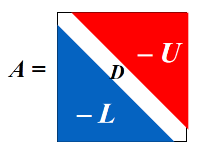
</div>


那么：

$$
\begin{align}
A\boldsymbol{x} = \boldsymbol{b} & \Leftrightarrow (D - L - U)\boldsymbol{x} = \boldsymbol{b} \notag \\
& \Leftrightarrow D\boldsymbol{x} = (L + U) \boldsymbol{x} + \boldsymbol{b} \notag \\
& \Leftrightarrow \boldsymbol{x} = \underbrace{D^{-1} (L + U)}_{T_j} \boldsymbol{x} + \underbrace{D^{-1} \boldsymbol{b}}_{\boldsymbol{c_j}} \notag
\end{align}
$$

因此该迭代法的递推公式为：$\boldsymbol{x}^{(k)} = T_j \boldsymbol{x}^{(k-1)} + \boldsymbol{c_j}$，其中 $T_j$ 被称为**雅可比迭代矩阵**(Jacobi iterative matrix)。

>看起来矩阵表示更为简洁，但算的时候我们就可以直接用上面给出的线性方程组解来计算（下面给出的算法也正是这么做的）。

**算法：雅可比迭代方法**

对于给定的初始近似解 $\boldsymbol{x}^{(0)}$，求解 $A\boldsymbol{x} = \boldsymbol{b}$

- 输入：方程和未知数的个数 $n$，矩阵元素 $a[][]$，常数项 $b[]$，初始近似解 $X0[]$，容忍值 $TOL$，最大迭代次数 $N_{max}$
- 输出：近似解 $X[]$ 或错误信息

```c linenums="1" hl_lines="4 7"
Step 1  Set k = 1;
Step 2  while (k <= N_max) do step 3-6
        Step 3  for i = 1, ..., n
                    Set X[i] = (b[i] - sum(j=1, j!=i, j<=n, a[i][j] * X[0][j])) / a[i][i];  // compute x^k
        Step 4  if norm(X - X0)_infty = max(1<=i<=n, X[i] - X0[i]) < TOL then Output(X[]);
                STOP;    // successful
        Step 5  for i = 1, ..., n  Set X0[] = X[];  // update X0
        Step 6  Set k++;
Step 7  Output (Maximum number of iterations exceeded);
        STOP.    // unsuccessful
```

考虑高亮行：

- 第4行：`a[i][i]` 有可能为0，不过由于在计算过程中不会修改矩阵 $A$，因此我们可以在计算前为矩阵元素**重新排序**，以保证 `a[i][i] != 0`。如果无法通过重排避免这一问题，那么矩阵 $A$ 就是**奇异的**。
- 第7行：$X^{(k+1)}$ 必须等到 $X^{(k)}$ 的项全部算出来，因此要用两个向量来存储结果。但这样就有些浪费空间了，因为我们最后只会用到一个向量。


### Gauss-Seidel Iterative Method

观察线性方程组的解：

$$
\begin{align}
x_2^{(k)} & = \dfrac{1}{a_{22}}(\textcolor{red}{-a_{21}x_1^{(k)}} - a_{23}x_3^{(k-1)} - a_{24}x_4^{(k-1)} - \dots - a_{2n}x_n^{k-1} + b_2) \notag \\ 
x_3^{(k)} & = \dfrac{1}{a_{33}}(\textcolor{red}{-a_{31}x_1^{(k)} - a_{32}x_2^{(k)}} - a_{34}x_4^{(k-1)} - \dots - a_{3n}x_n^{k-1} + b_3) \notag \\ 
\dots \notag \\ 
x_n^{(k)} & = \dfrac{1}{a_{nn}}(\textcolor{red}{-a_{n1}x_1^{(k)} -a_{n2}x_2^{(k)} -a_{n3}x_3^{(k)} - \dots - a_{n, n-1}x_{n-1}^{k}} + b_n) \notag
\end{align}
$$

用矩阵形式表述为：

$$
\begin{align}
& \boldsymbol{x}^{(k)} = D^{-1} (L\boldsymbol{x}^{(k)} + U\boldsymbol{x}^{(k-1)}) + D^{-1} \boldsymbol{b} \notag \\
\Leftrightarrow & (D - L)\boldsymbol{x}^{(k)} = U\boldsymbol{x}^{(k-1)} + \boldsymbol{b} \notag \\
\Leftrightarrow & \boldsymbol{x}^{(k)} = \underbrace{(D - L)^{-1} U }_{T_g} \boldsymbol{x}^{(k-1)} + \underbrace{(D - L)^{-1}}_{\boldsymbol{c}_g} \boldsymbol{b} \notag
\end{align}
$$

因此该迭代法的递推公式为：$\boldsymbol{x}^{(k)} = T_g \boldsymbol{x}^{(k-1)} + c_g \boldsymbol{b}$，其中 $T_g$ 为**高斯-塞德尔迭代矩阵**(Gauss-Seidel iterative matrix)。

**算法：高斯-塞德尔迭代方法**

对于给定的初始近似解 $\boldsymbol{x}^{(0)}$，求解 $A\boldsymbol{x} = \boldsymbol{b}$

- 输入：方程和未知数的个数 $n$，矩阵元素 $a[][]$，常数项 $b[]$，初始近似解 $X0[]$，容忍值 $TOL$，最大迭代次数 $N_{max}$
- 输出：近似解 $X[]$ 或错误信息

```c
Step 1  Set k = 1;
Step 2  while (k <= N_max) do step 3-6
        Step 3  for i = 1, ..., n
                    Set X[i] = (-sum(j=1, i-1, a[i][j] * x[j]) - sum(j=i+1, n, a[i][j] * X0[j]) + b[i]) / a[i][i];  // compute x^k
        Step 4  if norm(X - X0)_infty = max(1<=i<=n, X[i] - X0[i]) < TOL then Output(X[]);
                STOP;    // successful
        Step 5  for i = 1, ..., n  Set X0[] = X[];  // update X0
        Step 6  Set k++;
Step 7  Output (Maximum number of iterations exceeded);
        STOP.    // unsuccessful
```

**注** ：上述两种迭代方法**不总是收敛的**。并且存在雅可比迭代法失败，但高斯-塞德尔迭代法成功的情况，反之亦然。

**雅可比迭代法 v.s. 高斯-塞德尔迭代法（by Gemini 2.5 Flash）**

| 特性           | 雅可比迭代法 (Jacobi Iteration)                               | 高斯-塞德尔迭代法 (Gauss-Seidel Iteration)                          |
| :------------- | :------------------------------------------------------------ | :------------------------------------------------------------------ |
| **信息利用**   | 计算 $x_i^{(k+1)}$ 时，完全使用 $x^{(k)}$ 的所有分量。      | 计算 $x_i^{(k+1)}$ 时，使用 $x_1^{(k+1)}, \dots, x_{i-1}^{(k+1)}$（最新值）和 $x_{i+1}^{(k)}, \dots, x_n^{(k)}$（旧值）。 |
| **收敛速度**   | 通常比高斯-塞德尔慢。                                         | 通常比雅可比快（如果收敛的话）。                                    |
| **收敛条件**   | 迭代矩阵 $B_J = -D^{-1}(L+U)$ 的谱半径 $\rho(B_J) < 1$。     | 迭代矩阵 $B_{GS} = -(D+L)^{-1}U$ 的谱半径 $\rho(B_{GS}) < 1$。     |
| **并行性**     | **易于并行化**，因为每个分量的计算是独立的。                  | **难以并行化**，因为每个分量的计算依赖于前一个分量的最新值。        |
| **内存需求**   | 需要存储 $x^{(k)}$ 和 $x^{(k+1)}$ 两套向量。                 | 可以在原地更新，只需要存储一套向量（但实际实现可能仍用两套）。      |
| **实现复杂度** | 相对简单。                                                    | 略复杂，需要注意更新顺序。                                          |
| **适用矩阵**   | 对角占优矩阵（严格对角占优或不可约对角占优）保证收敛。        | 对角占优矩阵（严格对角占优或不可约对角占优）保证收敛。对于对称正定矩阵，高斯-塞德尔也保证收敛。 |
| **鲁棒性**     | 相对较差，有时会发散。                                        | 相对较好，通常比雅可比更稳定。                                      |


### Convergence of Iterative Method

现在我们来考察迭代法 $\boldsymbol{x}^{(k)} = T\boldsymbol{x}^{(k-1)} + \boldsymbol{c}$ 的收敛性。

**定理**

以下语句是等价的：

- $A$ 是一个收敛矩阵
- 对于<u>某些</u>自然范数，$\lim\limits_{n \rightarrow \infty} \| A^n \| = 0$
- 对于<u>所有</u>自然范数，$\lim\limits_{n \rightarrow \infty} \| A^n \| = 0$
- $\textcolor{red}{\rho(A) < 1}$（比较常用）
- $\forall \boldsymbol{x},\ \lim\limits_{n \rightarrow \infty} A^n \boldsymbol{x} = \boldsymbol{0}$
  

**一些补充说明（主要针对第4和5点）**
    
$$
\textcolor{red}{\boldsymbol{e}^{(k)}} = \boldsymbol{x^{(k)}} - \boldsymbol{x^*} = (T\boldsymbol{x^{(k-1)}} + \boldsymbol{c}) - (T\boldsymbol{x^*} + \boldsymbol{c}) = T(\boldsymbol{x}^{(k-1)} - \boldsymbol{x^*}) = \textcolor{red}{T \boldsymbol{e^{(k-1)}}}
$$

根据上述递推式，可以得到 $\boldsymbol{e^{(k)}} = T^k \boldsymbol{e^{(0)}}$，因此 

$$
\|\boldsymbol{e^{(k)}}\| \le \| T \| \cdot \| \boldsymbol{e^{(k-1)}} \| \le \dots \le \| T \|^k \cdot \| \boldsymbol{e^{(0)}} \|
$$

- 充分条件：$\|T\| < 1\ \Rightarrow\ \|T\|^k \rightarrow 0\ \text{as}\ k \rightarrow \infty$
- 必要条件：$\boldsymbol{e^{(k)}} \rightarrow \boldsymbol{0}\ \text{as}\ k \rightarrow \infty\ \Rightarrow T^k \rightarrow O$

**定理** ：$\forall \boldsymbol{x^{(0)}} \in R^n$，由 $\boldsymbol{x}^{(k)} = T\boldsymbol{x}^{(k-1)} + \boldsymbol{c}\ (k \ge 1)$ 定义的序列 $\{ \boldsymbol{x^{(k)}} \}_{k=0}^\infty$，当且仅当 $\textcolor{red}{\rho(T) < 1}$ 时，会收敛到 $\boldsymbol{x} = T\boldsymbol{x} + \boldsymbol{c}$ 的唯一解。
    
>可以把这个定理看作是[**不动点定理**](2.md#fixed-point-iteration)在矩阵中的应用。


**定理**

对于任意满足 $\|T\| < 1$ 的自然矩阵以及给定的向量 $\boldsymbol{c}$，那么 $\forall \boldsymbol{x^{(0)}} \in R^n$，由 $\boldsymbol{x}^{(k)} = T\boldsymbol{x}^{(k-1)} + \boldsymbol{c}$ 定义的序列 $\{ \boldsymbol{x^{(k)}} \}_{k=0}^\infty$ 会收敛到向量 $\boldsymbol{x} \in R^n$，并且由以下误差边界：

- $\| \boldsymbol{x} - \boldsymbol{x^{(k)}}\| \le \|T\|^k \| \boldsymbol{x} - \boldsymbol{x^{0}}\|$
    - $\| \boldsymbol{x} - \boldsymbol{x^{(k)}}\| \approx \rho(T)^k \| \boldsymbol{x} - \boldsymbol{x^{0}}\|$。因此，**谱半径越小，迭代法的收敛速度越快**

- $\| \boldsymbol{x} - \boldsymbol{x^{(k)}}\| \le \dfrac{\|T\|^k}{1 - \|T\|} \| \boldsymbol{x^{(1)}} - \boldsymbol{x^{0}}\|$

>该定理同样对应“[不动点定理](2.md#fixed-point-iteration)”一节中给出的那2个不等式推论


**定理** ：如果 $A$ 是一个严格对角占优矩阵，那么对于任意选择的初始近似解 $\boldsymbol{x^{(0)}}$，无论使用雅可比方法还是高斯-塞德尔方法，都可以让序列 $\{ \boldsymbol{x^{(k)}} \}_{k=0}^\infty$ 收敛到 $A\boldsymbol{x} = \boldsymbol{b}$ 的唯一解。
    
>只需证明 $\forall |\lambda| \ge 1$，有 $|\lambda I - T| \ne 0$。也就是说，$\lambda$ 不能称为对应迭代矩阵 $T$ 的特征值。


### Relaxation Methods

**残差向量** ：假设 $\widetilde{\boldsymbol{x}} \in \mathbb{R}^n$ 是线性方程组 $A \boldsymbol{x} = \boldsymbol{b}$ 的近似解，那么关于该线性方程组的 $\widetilde{\boldsymbol{x}}$ 的**残差向量**(residual vector)为 $\boldsymbol{r} = \boldsymbol{b} - A \widetilde{\boldsymbol{x}}$

接下来我们从残差向量的角度审视高斯-塞德尔方法：

$$
\begin{align}
x_i^{(k)} & = \dfrac{1}{a_{ii}} \Big[ b_i - \sum\limits_{j=1}^{i-1} a_{ij} x_i^{(k)} - \sum\limits_{j=i+1}^n a_{ij} x_j^{(k-1)} \Big] \notag \\
& = x_i^{(k-1)} + \dfrac{r_i^{(k)}}{a_{ii}} \quad \text{ where } r_i^{(k)} = b_i - \sum\limits_{j < i} a_{ij} x_j^{(k)} - \sum\limits_{j \ge i} a_{ij} x_j^{(k-1)} \notag
\end{align}
$$

令 $x_i^{(k)} = x_i^{(k-1)} + \textcolor{red}{\omega} \dfrac{r_i^{(k)}}{a_{ii}}$。对于正数 $\omega$ 的某种选择，我们能够减少残差向量 $\boldsymbol{r}$ 的范数，并且得到更快的收敛。这样的方法称为**松弛法**(relaxation methods)。根据 $\omega$ 的大小，我们有以下几类松弛法：

- $0 < \omega < 1$：**欠松弛法**(under-relaxation methods)
- $\omega = 1$：**高斯-塞德尔方法**
- $\omega > 1$：**逐次超松弛法**(successive over-relaxation methods, **SOR**)
  - 通常能加速收敛，这就是“超松弛”的由来——它“超前”地调整了更新方向，使得迭代步长更大，更快地逼近真实解

用矩阵形式可以表述为：

$$
\begin{align}
x_i^{(k)} & = x_i^{(k-1)} + \omega \dfrac{r_i^{(k)}}{a_{ii}} = (1 - \omega)x_i^{(k-1)} + \dfrac{\omega}{a_{ii}} \Big[ -\sum\limits_{j<i} a_{ij} x_j^{(k)} - \sum\limits_{j>i} a_{ij} x_j^{k-1} + b_i \Big] \notag \\
& \Rightarrow\ \boldsymbol{x^{(k)}} = (1 - \omega) \boldsymbol{x^{(k-1)}} + \omega D^{-1} [L \boldsymbol{x^{(k)}} + U \boldsymbol{x^{(k-1)}} + \boldsymbol{b}] \notag \\
& \Rightarrow\ \underbrace{(D - \omega L)^{-1} [(1 - \omega) D + \omega U]}_{T_{\omega}} \boldsymbol{x}^{(k-1)} + \underbrace{(D - \omega L)^{-1} \omega}_{\boldsymbol{c_\omega}} \boldsymbol{b} \notag
\end{align}
$$

也就是说，SOR 迭代法的递推公式为：$\boldsymbol{x}^{(k)} = T_\omega \boldsymbol{x}^{(k-1)} + \boldsymbol{c}_\omega \boldsymbol{b}$。

显然，矩阵 $T_\omega$ 的表示过于复杂，因而很难准确得到它的谱半径。但好在我们还可以走以下“捷径”，有助于我们选择合适的 $\omega$ 值。

**一些定理**

定理1：**Kahan 定理** ：若 $a_{ii} \ne 0\ (i = 1, 2, \dots, n)$，那么 $\rho(T_\omega) \ge |\omega - 1|$，这也就意味着 SOR 方法仅在 $0 < \omega < 2$ 时收敛。
    
定理2：**Ostrowski-Reich 定理** ：若 $A$ 是**正定**矩阵且 $0 < \omega < 2$，那么 SOR 方法对于任意初始近似解均能收敛。
    
定理3：如果 $A$ 是**正定**的**三对角线**矩阵，那么 $\rho(T_g) = |\rho(T_j)|^2 < 1$，且 SOR 方法中 $\omega$ 的最优选择是 $\omega = \dfrac{2}{1 + \sqrt{1 - |[\rho(T_j)]^2|}}$，此时 $\rho(T_\omega) = \omega - 1$。

**讨论**

题目：给定 $A = \begin{bmatrix}2 & 1 \\ 1 & 2\end{bmatrix}, \boldsymbol{b} = \begin{bmatrix}1 \\ 2\end{bmatrix}$，以及迭代法 $\boldsymbol{x^{(k)}} = \boldsymbol{x^{(k-1)}} + \omega (A\boldsymbol{x^{(k-1)}} - \boldsymbol{b})$，那么：
    
- 当 $\omega$ 取什么值时，该方法会收敛？
- 当 $\omega$ 取什么值时，该方法的收敛速度最快？
  

解答：
    
考虑 $T = I + \omega A$ 的特征值，解得 $\lambda_1 = 1 + \omega, \lambda_2 = 1 + 3 \omega$

- 要使该方法收敛，需满足 $\rho(T) < 1 \quad \Rightarrow -\dfrac{2}{3} < \omega < 0$
- 现在考虑 $\rho(T) = \max\{|1 + \omega|, |1 + 3\omega|\}$ 在何时取最小值（即收敛速度最快的时候）——我们可以画图研究：

<div style="text-align: center">
    
</div>

发现当 $\omega = -\dfrac{1}{2}$ 时取值最小。

**算法：SOR 迭代法**

对于给定的初始近似解 $\boldsymbol{x}^{(0)}$ 和参数 $\omega$，求解 $A\boldsymbol{x} = \boldsymbol{b}$

- 输入：方程和未知数的个数 $n$，矩阵元素 $a[][]$，常数项 $b[]$，初始近似解 $X0[]$，参数 $\omega$，容忍值 $TOL$，最大迭代次数 $N_{max}$
- 输出：近似解 $X[]$ 或错误信息

```c
Step 1  Set k = 1;
Step 2  while (k <= N_max) do step 3-6
        Step 3  for i = 1, ..., n
                    Set X[i] = (1 - omega) * X0[i] + (omega * (-sum(j=1, i-1, a[i][j] * x[j]) - sum(j=i+1, n, a[i][j] * X0[j]) + b[i])) / a[i][i]  // compute x^k
        Step 4  if norm(X - X0)_infty = max(1<=i<=n, X[i] - X0[i]) < TOL then Output(X[]);
                STOP;    // successful
        Step 5  for i = 1, ..., n  Set X0[] = X[];  // update X0
        Step 6  Set k++;
Step 7  Output (Maximum number of iterations exceeded);
        STOP.    // unsuccessful
```


## Error Bounds and Iterative Refinement

目标：研究 $A$ 和 $\boldsymbol{b}$ 的误差会如何影响 $A \boldsymbol{x} = \boldsymbol{b}$ 的解 $\boldsymbol{x}$？

假设 <u>$A$ 是准确的，$\boldsymbol{b}$ 有误差 $\delta \boldsymbol{b}$</u>，那么带有误差的解可以写成 $\boldsymbol{x} + \delta \boldsymbol{x}$。可以得到：

$$
A (\boldsymbol{x} + \delta \boldsymbol{x}) = \boldsymbol{b} + \delta \boldsymbol{b} \Rightarrow \dfrac{\| \delta \boldsymbol{x} \|}{\| \boldsymbol{x} \|} \le \| A \| \cdot \| A^{-1} \| \cdot \dfrac{\| \delta \boldsymbol{b} \|}{\| \boldsymbol{b} \|}
$$

其中 $\| A \| \cdot \| A^{-1} \|$ 被称为**相对放大因子**(relative amplification factor)。


**定理**

如果矩阵 $B$ 在某些自然范数上满足 $\| B \| < 1$，那么：

- $I \pm B$ 是非奇异的
- $\| (I \pm B)^{-1} \| \le \dfrac{1}{1 - \| B \|}$

---

假如 <u>$\boldsymbol{b}$ 是准确的，$A$ 有误差 $\delta A$</u>，那么带有误差的解可以写成 $\boldsymbol{x} + \delta \boldsymbol{x}$。可以得到：

$$
\begin{align}
& (A + \delta A) (\boldsymbol{x} + \delta \boldsymbol{x}) = \boldsymbol{b} \notag \\
\Rightarrow & \dfrac{\| \delta \boldsymbol{x} \|}{\| \boldsymbol{x} \|} \le \dfrac{\| A^{-1} \| \cdot \| \delta A \|}{1 - \| A^{-1} \| \cdot \| \delta A \|} = \dfrac{\| A^{-1} \| \cdot \| A \| \cdot \frac{\| \delta A \|}{\| A \|}}{1 - \| A^{-1} \| \cdot \| A \| \cdot \frac{\| \delta A \|}{\| A \|}} \notag
\end{align}
$$

其中 $\| A \| \cdot \| A^{-1} \|$ 是误差放大的关键因子，被称为**条件数**(condition number)，记作 $K(A)$。

- 如果 $K(A)$ 接近1，那么矩阵 $A$ 是**良态的**(well-conditioned)
- 如果 $K(A)$ 比远大于1，那么矩阵 $A$ 是**病态的**(ill-conditioned)

**定理**

假设 $A$ 是非奇异的，且 $\| \delta A \| < \dfrac{1}{\| A^{-1} \|}$。那么 $(A + \delta A) (\boldsymbol{x} + \delta \boldsymbol{x}) = \boldsymbol{b} + \delta \boldsymbol{b}$ 的解 $\boldsymbol{x} + \delta \boldsymbol{x}$ 近似于 $A \boldsymbol{x} = \boldsymbol{b}$ 的解 $\boldsymbol{x}$，（相对）误差为：

$$
\dfrac{\| \delta \boldsymbol{x} \|}{\| \boldsymbol{x} \|} \le \dfrac{K(A)}{1 - K(A) \frac{\| \delta A\|}{\| A \|}} \Big(\dfrac{\| \delta A \|}{\| A \|} + \dfrac{\| \delta \boldsymbol{b} \|}{\| \boldsymbol{b} \|} \Big)
$$

**注**

>条件数 $K(A)_i$ 的下标 $i$ 表示所使用的[矩阵范数](#matrix-norms)的类型（比如 $i=2$ 表示的就是 2-范数）

- 如果 $A$ 是**对称的**，那么 $K(A)_2 = \dfrac{\max |\lambda|}{\min |\lambda|}$
- 对于所有自然范数 $\| \cdot \|_p$，$K(A)_p \ge 1$
- $\forall\ \alpha \in R, K(\alpha A) = K(A)$
- 如果 $A$ 是正交的（即 $A^{-1} = A^T$），那么 $K(A)_2 = 1$
- 对于所有正交矩阵 $R$，$K(RA)_2 = K(AR)_2 = K(A)_2$

**讨论**

问题：对于给定的 $A = \begin{bmatrix}1 & 0.99 \\ 0.99 & 0.98\end{bmatrix}, \boldsymbol{b} = \begin{bmatrix}1.99 \\ 1.97\end{bmatrix}$
    
1. 计算 $K(A)_2$
2. 给 $\boldsymbol{b}$ 一个很小的扰动 $\delta \boldsymbol{b} = \begin{bmatrix}-0.97 \times 10^{-4} \\ 0.106 \times 10^{-3}\end{bmatrix}$，原方程的解会有什么变化？
   

解答：直接从[前辈笔记](https://note.jiepeng.tech/CS/NA/Chapter_07/#_9)上 copy 下来的：
    
<div style="text-align: center">
    
</div>
<div style="text-align: center">
    
</div>


### Iterative Refinement

**定理** ：假设 $\boldsymbol{x}^*$ 是 $A \boldsymbol{x} = \boldsymbol{b}$ 的近似解，$A$ 是一个非奇异矩阵，$\boldsymbol{r} = \boldsymbol{b} - A\boldsymbol{x}$ 是 $\boldsymbol{x}^*$ 的残差向量。那么对于任意自然范数，$\| \boldsymbol{x} - \boldsymbol{x}^* \| \le \| \boldsymbol{r} \| \cdot \| A^{-1} \|$。且如果 $\boldsymbol{x} \ne \boldsymbol{0}, \boldsymbol{b} \ne \boldsymbol{0}$，那么：

$$
\dfrac{\| \boldsymbol{x} - \boldsymbol{x}^* \|}{\| \boldsymbol{x} \|} \le K(A) \dfrac{\| \boldsymbol{r} \|}{\| \boldsymbol{b} \|}
$$

**迭代优化**(iterative refinement)的步骤为：

1. $A \boldsymbol{x} = \boldsymbol{b} \Rightarrow$ 近似解 $\boldsymbol{x}_1$
2. $\boldsymbol{r}_1 = \boldsymbol{b} - A \boldsymbol{x}_1$
3. $A \boldsymbol{d}_1 = \boldsymbol{r}_1 \Rightarrow \boldsymbol{d}_1$
   - 如果 $\boldsymbol{d}_1$ 是精确的，那么 $\boldsymbol{x}_2 = \boldsymbol{x}_1 + A^{-1} (\boldsymbol{b} - A\boldsymbol{x}_1) = A^{-1} \boldsymbol{b}$，$\boldsymbol{x}_2$ 也是精确的。
4. $\boldsymbol{x}_2 = \boldsymbol{x}_1 + \boldsymbol{d}_1$

之后重复 2-4 步。

**算法：迭代优化**

<div style="text-align: center">
    
</div>


# Chap 9: Approximating Eigenvalues


## The Power Method

**幂法**(power method)是一种用于计算矩阵的**主特征值**(dominant eigenvalue)（即矩阵中模长最大的特征值，也就是**谱半径** $\rho(\lambda)$）以及对应的特征向量的技术。先来看最一般的幂法：

### The Original Method

假设 $A$ 是一个 $n \times n$ 的矩阵，满足 $|\textcolor{red}{\lambda_1}| \textcolor{red}{>} |\lambda_2| \ge \dots \ge |\lambda_n| \ge 0$，且这些特征值对应 $n$ 个线性独立的特征向量。

思路：从任意 $\boldsymbol{x^{(0)}} \ne \boldsymbol{0}$ 以及 $(\boldsymbol{x^{0}}, \boldsymbol{v_1})$ 出发

$$
\begin{align}
\boldsymbol{x^{(0)}} & = \sum\limits_{j=1}^n \beta_j \boldsymbol{v_j}, \beta_1 \ne 0 \notag \\
\boldsymbol{x^{(1)}} & = A\boldsymbol{x^{(0)}} = \sum\limits_{j=1}^n \beta_j \lambda_j \boldsymbol{v_j} \notag \\
\boldsymbol{x^{(2)}} & = A\boldsymbol{x^{(1)}} = \sum\limits_{j=1}^n \beta_j \lambda_j^2 \boldsymbol{v_j} \notag \\
& \quad \quad \quad \dots \notag \\
\boldsymbol{x^{(k)}} & = A \boldsymbol{x^{(k-1)}} = \sum\limits_{j=1}^n \beta_j \lambda_j^k \boldsymbol{v_j} \notag \\
& = \lambda_1^k \sum\limits_{j=1}^n \Big(\dfrac{\lambda_j}{\lambda_1}\Big)^k \boldsymbol{v_j} \notag
\end{align}
$$

当 $k$ 足够大时，我们有：

$$
\boldsymbol{x^{(k)}} \approx \lambda_1^k \beta_1 \boldsymbol{v_1}, \boldsymbol{x^{(k-1)}} \approx \lambda_1^{k-1} \beta_1 \boldsymbol{v_1} \Rightarrow \dfrac{(\boldsymbol{x^{(k)}})_i}{(\boldsymbol{x^{(k-1)}})_i} \approx \lambda_i
$$


### Normalization

**归一化**(normalization)的目的是确保在每一步满足 $\| \boldsymbol{x} \|_{\infty} = 1$，以确保稳定性。

令 $\| \boldsymbol{x^{(k)}} \|_{\infty} = |\boldsymbol{x_{p_k}^{(k)}}|$，那么 $\boldsymbol{u^{(k-1)}} = \dfrac{\boldsymbol{x^{(k-1)}}}{\boldsymbol{x^{(k-1)}_{p_{k-1}}}}$ 且 $\boldsymbol{x^{(k)}} = A \boldsymbol{u^{(k-1)}}$。因而得到：

$$
\boldsymbol{u^{(k)}} = \dfrac{\boldsymbol{x^{(k)}}}{|\boldsymbol{x^{(k)}_{p_k}}|} \rightarrow \boldsymbol{v_1} \quad \text{and} \quad \lambda_1 \approx \dfrac{\boldsymbol{x_i^{(k)}}}{u_i^{(k-1)}} = \boldsymbol{x^{(k)}_{p_{k-1}}}
$$

**算法：幂法**

从非零初始向量开始，近似求解规模为 $n \times n$ 的矩阵 $A$ 的主特征值及其特征向量。

- 输入：维度 $n$，矩阵 $a[][]$，初始向量 $x0[]$，容忍值 $TOL$，最大迭代次数 $N_{max}$
- 输出：近似特征值 $\lambda$，近似（规范化的）特征向量

```c
Step 1  Set k = 1;
Step 2  Find index such that [x0[index]] = norm_infty(x0);
Step 3  Set x0[] = x0[] / x0[index];    // normalize x0
Step 4  while (k <= N_max) do steps 5-11
        Step 5  x[] = A * x0[];
        Step 6  lambda = x[index]
        Step 7  Find index such that [x[index]] = norm_infty(x);
        Step 8  if x[index] == 0 then
                    Output("A has the eigenvalue 0", x[0]);
                    STOP.
                // the matrix is singular and user should try a new x0
        Step 9  err = norm_infty(x0 - x / x[index]);
                x0[] = x[] / x[index]      // computer u^k
        Step 10 if (err < TOL) then
                    Output(lambda, x0[]);
                    STOP.
        Step 11 Set k++;
Step 12 Output(Maximum number of iterations exceeded);
        STOP.    // unsucessful
```

**注**

- 该方法在有**多重特征值**（即存在 $\lambda_1 = \lambda_2 = \dots = \lambda_r$）的情况下也能生效，因为：

    $$
    \boldsymbol{x^{(k)}} = \lambda_1^k \Big[ \sum\limits_{j=1}^r \beta_j \boldsymbol{v_j} + \sum\limits_{j=r+1}^n \beta_j \Big(\dfrac{\lambda_j}{\lambda_1}\Big)^k \boldsymbol{v_j} \Big] \approx \lambda_1^k \Big( \sum\limits_{j=1}^r \beta_j \boldsymbol{v_j} \Big)
    $$

- 若存在类似 $\lambda_1 = -\lambda_2$ 的情况，那么该方法就会失效。
- 因为我们无法确保对于任意初始近似向量 $\boldsymbol{x^{(0)}}$，$\beta_1 \ne 0$，所以在这种情况下的迭代结果可能就不是 $\boldsymbol{v_1}$，而时第一个满足 $(\boldsymbol{x^{(0)}}, \boldsymbol{v_m}) \ne 0$，关联的特征值为 $\lambda_m$。
- [Aitken $\Delta^2$ 法](2.md#aitkens--method)也能用在这里加快收敛速度。


### Rate of Convergence

在前面的计算中，我们已经得到：

$\boldsymbol{x^{(k)}} = A\boldsymbol{x^{(k-1)}} = \lambda_1^k \sum\limits_{j=1}^n \Big(\dfrac{\lambda_j}{\lambda_1}\Big)^k \boldsymbol{v_j}$

现在，我们的目标是使 $\Big| \dfrac{\lambda_2}{\lambda_1} \Big|$ 的值尽可能小，以加快收敛速度。

假设 $\lambda_1 > \lambda_2 \ge \dots \lambda_n$，且 $|\lambda_2| > |\lambda_n|$。

<div style="text-align: center">
    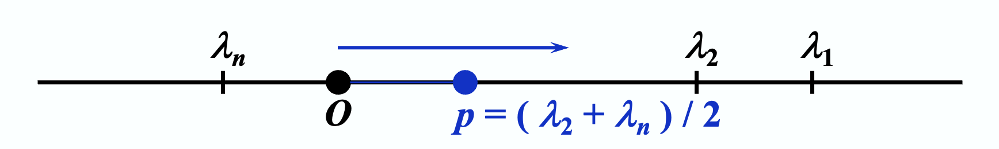
</div>


思路：令 $B = A - pI$，那么 $|\lambda I - A| = |\lambda I - (B + pI)| = |(\lambda - p) I - B|$，这样可以得到 $\lambda_A - p = \lambda_B$。因为 $\dfrac{\lambda_2 - p}{\lambda_1 - p} < \dfrac{|\lambda_2|}{|\lambda_1|}$，寻找 $B$ 的特征值的迭代收敛速度快于关于 $A$ 的迭代。


### Inverse Power Method

**反幂法**(inverse power method)是幂法的一种改进方法，相比幂法能够更快地收敛。下面给出具体计算过程：

如果 $A$ 有特征值 $|\lambda_1| \ge |\lambda_2| \ge \dots \textcolor{red}{> |\lambda_n|}$，那么对于 $A^{-1}$ 满足：

$$
\textcolor{red}{\Big|\dfrac{1}{\lambda_n}\Big| > } \Big|\dfrac{1}{\lambda_{n-1}}\Big| \ge \dots \ge \Big| \dfrac{1}{\lambda_1} \Big|
$$

并且这些特征值对应于相同的特征向量。

$A^{-1}$ 的主特征值 $\Leftrightarrow$ $A$ 的特征值中的最小值

要想迭代计算 $\boldsymbol{x^{(k+1)}} = A^{-1} \boldsymbol{x^{(k)}}$，就得在每次迭代步骤中求解线性方程组 $A \boldsymbol{x^{(k+1)}} = \boldsymbol{x^{(k)}}$，其中 $A$ 需要被分解(factorized)。

思路：如果我们知道 $A$ 的一个特征值 $\lambda_i$ 最接近一个指定值 $p$，那么对于任意的 $j \ne i$，我们有 $|\lambda_i - p| << |\lambda_j - p|$。并且，如果存在 $(A - pI)^{-1}$，那么逆幂法能以更快的收敛速度寻找到 $(A - pI)^{-1}$ 的主特征值 $\dfrac{1}{\lambda_i - p}$。

**例题**

题目：
<div style="text-align: center">
    
</div>

解答：A、B 为幂法，C、D 为逆幂法；且 $\lambda_2$ 更接近真值，所以 D 的收敛速度最快。

**算法：反幂法**

从非零初始向量开始，近似求解规模为 $n \times n$ 的矩阵 $A$ 的主特征值及其特征向量。

- 输入：维度 $n$，矩阵 $a[][]$，初始向量 $x0[]$，容忍值 $TOL$，最大迭代次数 $N_{max}$
- 输出：近似特征值 $\lambda$，近似（规范化的）特征向量

```c
Step 1  Set q = (x[]^T · A · x[]) / (x^T · x[]);
Step 2  Set k = 1;
Step 3  Find the smallest integer p with 1 <= p <= n and |x_p| = norm_infty(x);
Step 4  Set x[] = x[] / x_p
Step 5  while (k <= N_max) do steps 6-12
        Step 6  Solve the linear system (A - qI)y = x;
        Step 7  if the system does not have a unique solution, then
                    Output("q is an eigenvalue", q);
                    STOP.
        Step 8  set lambda = y_p;
        Step 9  Find the smallest integer p with 1 <= p <= n and |y_p| = norm_infty(y);
        Step 10  err = norm_infty(x[] - y[] / y_p);
                 x[] = y[] / y_p;
        Step 11 if (err < TOL) then
                    Output(lambda, x[]);
                    STOP.
        Step 12 Set k++;
Step 13 Output(Maximum number of iterations exceeded);
        STOP.
```


# Chap 3: Interpolation and Polynomial Approximation


如果函数 $y = f(x)$ 的计算过于复杂，或者甚至是未知的，一种近似求解的办法是：首先在一组点序列 $x_0, \dots, x_n$ 上获取一组函数值 $y_0 = f(x_0), \dots, y_n = f(x_n)$，然后根据这些值构造一个相对简单的近似函数 $g(x) \approx f(x)$。

如果 $g(x)$ 满足 $\forall\ i = 0, \dots, n, g(x_i) = f(x_i)$，我们称 $g(x)$ 为 $f(x)$ 的**插值函数**(interpolating function)。最常见的插值函数形式是**代数多项式**(algebraic polynomials)。

<div style="text-align: center">
    
</div>


## Interpolation and the Lagrange Polynomial

目标：找到 $n$ 阶多项式 $P_n(x) = a_0 + a_1 x + \dots + a_n x^n$，使得 $\forall\ i = 0, \dots, n, P_n(x_i) = y_i$。

>注：对任何 $i \ne j$，必须满足 $x_i \ne x_j$

当 $n = 1$ 时：给定 $x_0, x_1; y_0, y_1$。找到 $P_1(x) = a_0 + a_1 x$，使得 $P_1(x_0) = y_0, P_1(x_1) = y_1$。此时 $P_1(x)$ 是一个经过给定两点 $(x_0, y_0), (x_1, y_1)$ 的**线函数**(line function)，即：

$$
\begin{align}
P_1(x) & = y_0 + \dfrac{y_1 - y_0}{x_1 - x_0}(x - x_0) \notag \\
& = \underbrace{\Big(\dfrac{x - x_1}{x_0 - x_1}\Big)}_{\textcolor{red}{L_{1, 0}}(x)} y_0 + \underbrace{\Big(\dfrac{x - x_0}{x_1 - x_0}\Big)}_{\textcolor{red}{L_{1, 1}}(x)} y_1 = \sum\limits_{i=0}^1 \textcolor{red}{L_{1, i}}(x)y_i \notag
\end{align}
$$

其中标红的项被称为**拉格朗日基**(Lagrange Basis)，它满足：$L_{1, i}(x_j) = \delta_{ij} = \begin{cases}1 & \text{if } i = j \\ 0 & \text{if } i \ne j\end{cases}$（称为 **Kronecker 符号**）

---

当 $n \ge 1$ 时：我们要寻找 $L_{n, i}(x)\ (i = 0, \dots, n)$，使得 $L_{n, i} (x_j) = \delta_{ij}$。然后令 $P_n(x) = \sum\limits_{i=0}^n L_{n, i}(x) y_i$。因此 $P_n(x_i) = y_i$。

每个 $L_{n, i}$ 都有 $n$ 个根 $x_0 \dots \widehat{x_i} \dots x_n$。可以得到：

$$
L_{n, i}(x) = C_i (x - x_0) \dots (\widehat{x - x_i}) \dots (x - x_n) = C_i \prod\limits_{\substack{j \ne i \\ j = 0}}^n (x - x_j)
$$

当 $L_{n, i}(x_i) = 1$ 时，$C_i = \prod\limits_{j \ne i} \dfrac{1}{x_i - x_j}$

$$
L_{n, i}(x) = \prod\limits_{\substack{j \ne i \\ j = 0}}^n \dfrac{(x - x_j)}{(x_i - x_j)} \Rightarrow P_n(x) = \sum\limits_{i=0}^n L_{n, i}(x) y_i
$$

这里的 $P_n(x)$ 就是**n 阶拉格朗日插值多项式**(n-th Lagrange interpolating polynomial)。

**Quiz**

题目
    
<div style="text-align: center">
    
</div>

答案：A

- 首先，拉格朗日多项式一定是个连续函数 -> C❌
- 其次，从它的式子就可以看出，它不可能是直线（$n=5$ 表明它是六次曲线）-> B❌

**定理** ：如果 $x_0, x_1, \dots, x_n$ 是 $n + 1$ 个不同的数，且用函数 $f$ 得到这 $n + 1$ 个数对应的函数值，那么最终得到的 n 阶多项式就是**唯一的**（和[拉格朗日多项式](#interpolation-and-the-lagrange-polynomial)、[牛顿插值法](#newtons-interpolation)等具体的构造方法无关）。
    

**注** ：插值多项式不是唯一的，除非它的阶数被约束在不超过 $n$ 的范围内。
    
相应的反例就是 $P(x) = L_n(x) + p(x) \prod\limits_{i=0}^n (x - x_i)$，其中 $p(x)$ 可以是任意阶数的多项式。

---

下面我们来分析**余项**(remainder)：假如 $a \le x_0 < x_1 < \dots < x_n \le b$ 且 $f \in C^{n+1} [a, b]$。考虑截断误差 $R_n(x) = f(x) - P_n(x)$

**罗尔定理**

如果 $\varphi(x)$ 足够平滑，且 $\varphi(x_0) = \varphi(x_1) = 0$，那么 $\exists \xi \in (x_0, x_1)$，使得 $\varphi'(\xi) = 0$。

一般来说，如果 $\varphi(x_0) = \varphi(x_1) = \varphi(x_2) = 0$，那么 $\exists \xi_0 \in (x_0, x_1), \xi_1 \in (x_1, x_2)$，使得 $\varphi'(\xi_0) = \varphi'(\xi_1) = 0$，那么 $\exists \xi \in (\xi_0, \xi_1)$，使得 $\varphi''(\xi) = 0$

同理，$\varphi(x_0) = \dots = \varphi(x_n) = 0 \Rightarrow \exists \xi \in (a, b)$，使得 $\xi^{(n)}(\xi) = 0$


---

$R_n(x)$ 至少有 $n + 1$ 个根 $\Rightarrow R_n(x) = K(x) \prod\limits_{i=0}^n (x - x_i)$ 

修正任何 $x \ne x_i\ (i = 0, \dots, n)$。定义为 $t \in [a, b]$ 定义函数 $g$ 为：

$$
g(t) = R_n(t) - K(x) \prod\limits_{i=0}^n (t - x_i)
$$

$g(x)$ 有 $n + 2$ 个不同的根 $x_0, \dots, x_n, x\ \Rightarrow g^{(n+1)}(\xi_x) = 0, \xi_x \in (a, b)$

$$
\begin{align}
& f^{(n+1)}(\xi_x) - \cancel{P_n^{(n+1)}(\xi_x)} - K(x)(n+1)! = R_n^{(n+1)}(\xi_x) - K(x)(n+1)! \notag \\
& \Rightarrow K(x) = \dfrac{f^{(n+1)}(\xi_x)}{(n+1)!} \notag
\end{align}
$$

因此 $R(x) = \dfrac{f^{(n+1)}(\xi_x)}{(n+1)!} \prod\limits_{i=0}^n (x - x_i)$

**注**

- 因为大多数情况下 $\xi_x$ 无法确定，因此我们会获取 $f^{(n+1)}$ 的上界。也就是说，得到一个估计值 $M_{n+1}$，满足 $\forall\ x \in (a, b),\ |f^{(n+1)}(x)| \le M_{n+1}$，并且取 $\dfrac{M_{n+1}}{(n+1)!} \prod\limits_{i=0}^n |x - x_i|$ 为总误差的上界。
- 对于任意阶数 $\le n$ 的多项式函数 $f$，插值多项式是精确的，因为 $f^{(n+1)}(x) \equiv 0$。

**例子**

例1
    
题目：假设为 $f(x) = e^x\ (x \in [0, 1])$ 做一个表格，表格中的每一项精确到8位小数，并且步幅为 $h$。对于绝对误差不超过 $10^{-6}$ 的线性插值，$h$ 应该是多少？
    
解答：
    
假设 $[0, 1]$ 被划分为 $n$ 个等间距的子区间 $[x_0, x_1], [x_1, x_2], \dots, [x_{n-1}, x_n]$，且 $x$ 在区间 $[x_k, x_{k+1}]$ 上。那么估计误差为：

$$
\begin{align}
|f(x) - P_1(x)| & = \Big|\dfrac{f^{(2)}(\xi)}{2!}(x - x_k)(x - x_{k+1})\Big| \notag \\
& = \Big|\dfrac{e^\xi}{2}(x - kh)(x - (k+1)h)\Big| \le \dfrac{e}{2} \times \dfrac{h^2}{4} \notag
\end{align}
$$

$\dfrac{eh^2}{8} \le 10^{-6} \quad \Rightarrow \quad h \le 1.72 \times 10^{-3}$

方便起见，我们就取 $n = 1000, h = 0.001$ 好了。
    
例2
    
题目：给定 $\sin \dfrac{\pi}{6} = \dfrac{1}{2}, \sin \dfrac{\pi}{4} = \dfrac{1}{\sqrt{2}}, \sin \dfrac{\pi}{3} = \dfrac{\sqrt{3}}{2}$。使用关于 $\sin x$ 的线形和二次拉格朗日多项式，计算 $\sin 50 \degree$ 并评估误差。（已知 $\sin 50 \degree = 0.7660444...$）
    
解答
    
- 先使用 $x_0, x_1$ 和 $x_1, x_2$ 计算线形插值。

    - 使用 $x_0 = \dfrac{\pi}{6}, x_1 = \dfrac{\pi}{4}$
        - $P_1(x) = \dfrac{x - \frac{\pi}{4}}{\frac{\pi}{6} - \frac{\pi}{4}} \times \dfrac{1}{2} + \dfrac{x - \frac{\pi}{6}}{\frac{\pi}{4} - \frac{\pi}{6}} \times \dfrac{1}{\sqrt{2}}$
        - $50 \degree = \dfrac{5\pi}{18}$
        - $\sin 50 \degree \approx P_1(\dfrac{5 \pi}{18}) \approx 0.77614$
        - $f(x) = \sin x, f^{(2)} = - sin \xi_x, \xi_x \in (\dfrac{\pi}{6}), \dfrac{\pi}{3}$，且 $\dfrac{1}{2} < \sin \xi_x < \dfrac{\sqrt{3}}{2}$
        - $R_1 (x) = \dfrac{f^{(2)(\xi_x)}}{2!}(x - \dfrac{\pi}{6})(x - \dfrac{\pi}{4})$，得到 $-0.01319 < R_1(\dfrac{5\pi}{18}) < -0.00762$，因此**外推误差** $\approx -0.01001$
    - 使用 $x_1 = \dfrac{\pi}{4}, x_2 = \dfrac{\pi}{3}$
        - 计算得到 $\sin 50 \degree \approx 0.76008, 0.00538 < \widetilde{R_1}(\dfrac{5\pi}{18}) < 0.00660$
        - 因此插值误差 $\approx 0.00596$
                
	
    **外推 v.s. 插值**
    
    - **外推**(extrapolation)：在已知数据点范围之**外**，估计或预测未知数据点的值。
    - **插值**(interpolation)：在已知数据点范围之**内**，估计或预测未知数据点的值。
    
    由于 $\dfrac{\pi}{6} < \dfrac{\pi}{4} < 50 \degree < \dfrac{\pi}{3}$，因此使用 $x_0, x_1$ 属于外推，而 $x_1, x_2$ 属于插值。一般而言，**插值效果优于外推**。
    
- 再使用 $x_0, x_1, x_2$ 计算二次插值。

    - $P_2(x) = \frac{(x - \frac{\pi}{4})(x - \frac{\pi}{3})}{(\frac{\pi}{6} - \frac{\pi}{4})(\frac{\pi}{6} - \frac{\pi}{2})} \times \dfrac{1}{2} + \frac{(x - \frac{\pi}{6})(x - \frac{\pi}{3})}{(\frac{\pi}{4} - \frac{\pi}{6})(\frac{\pi}{4} - \frac{\pi}{3})} \times \dfrac{1}{\sqrt{2}} +  \frac{(x - \frac{\pi}{6})(x - \frac{\pi}{4})}{(\frac{\pi}{3} - \frac{\pi}{6})(\frac{\pi}{3} - \frac{\pi}{4})} \times \dfrac{\sqrt{3}}{2}$
    - $\sin 50 \degree \approx P_2(\dfrac{5\pi}{18}) \approx 0.76543$
    - $R_2(x) = \dfrac{- \cos \xi_x}{3!}(x - \dfrac{\pi}{6})(x - \dfrac{\pi}{4})(x - \dfrac{\pi}{3}),\ \dfrac{1}{2} < \cos \xi_x < \dfrac{\sqrt{3}}{2}$
    - $0.00044 < R_2(\dfrac{5 \pi}{18}) < 0.00077$，所以二次插值的误差 $\approx 0.00061$
    

**注** ：看起来更高次的插值法通常会带来更好的结果，但并不总是如此。


### Neville's Method

**拉格朗日多项式的缺陷** ：如果发现当前拉格朗日多项式的精度不够，那我们就会考虑更多的插值点。但这样的话我们就得从头开始计算拉格朗日基，前面的工作都浪费掉了。
    
而接下来介绍的 Neville 法就能利用之前算好的插值多项式继续计算，无需重复计算。

**定义** ：令 $f$ 是关于 $x_0, x_1, \dots, x_n$ 的函数，并假设 $m_1, \dots, m_k$ 是 $k$ 个不同的整数且满足 $\forall i, 0 \le m_i \le n$。拉格朗日多项式在 $k$ 个点 $x_{m_1}, \dots, x_{m_k}$ 上与 $f(x)$ 具有相同值时，记作 $P_{m_1, \dots, m_k}(x)$。

**定理** ：

令 $f$ 是关于 $x_0, x_1, \dots, x_k$ 的函数，并令 $x_i, x_j$ 为其中两个不相等的数，那么：

$$
P(x) = \dfrac{(x - x_j)P_{0, 1, \dots, j-1, j+1, \dots, k}(x) - (x - x_i)P_{0, 1, \dots, i-1, i+1, \dots, k}(x)}{x_i - x_j}
$$

描述了在 $k+1$ 个点 $x_0, x_1, \dots, x_k$ 上向 $f$ 插值的第 $k$ 个拉格朗日多项式。
    

上述定理表明插值多项式可以**递归**生成。比如，它们可以以下表所示的方式，一行行地生成插值多项式：

$$
\begin{matrix}
x_0 & P_0 & & & & \\
x_1 & P_1 & P_{0, 1} & & & \\
x_2 & P_2 & P_{1, 2} & P_{0, 1, 2} & & \\
x_3 & P_3 & P_{2, 3} & P_{1, 2, 3} & P_{0, 1, 2, 3} \\
x_4 & P_4 & P_{3, 4} & P_{2, 3, 4} & P_{1, 2, 3, 4} & P_{0, 1, 2, 3, 4}
\end{matrix}
$$

上述过程被称为 **Neville 法**。但 $P$ 的记号显得过于笨重（一堆下标表示参与到多项式中的插值点）。观察发现，只需要两个下标就行了——我们用新的记号 $Q_{i, j}(x)\ (0 \le j \le i)$ 来表示阶数为 $j$ 的，在 $(j+1)$ 个数 $x_{i-j}, x_{i-j+1}, \dots, x_{i-1}, x_i$ 上的插值多项式，即：$Q_{i, j} = P_{i-j, i-j+1, \dots, i-1, i}$。那么上面的表格就可以转化为：

$$
\begin{matrix}
x_0 & Q_{0, 0} & & & & \\
x_1 & Q_{1, 0} & Q_{1, 1} & & & \\
x_2 & Q_{2, 0} & Q_{2, 1} & Q_{2, 2} & & \\
x_3 & Q_{3, 0} & Q_{3, 1} & Q_{3, 2} & Q_{3, 3} \\
x_4 & Q_{4, 0} & Q_{4, 1} & Q_{4, 2} & Q_{4, 3} & Q_{4, 4}
\end{matrix}
$$

而上面定理给出的递推公式可以转化为：

$$
Q_{i, j}(x) = \dfrac{(x - x_{i - j})Q_{i, j-1}(x) - (x - x_i)Q_{i-1, j-1}(x)}{x_i - x_{i - j}}
$$

观察发现，求上面表格某一项的值时，我们会用到其左侧和左上角的两个项。

**算法：Neville 迭代插值**

求解对于数 $x$，在 $n+1$ 个不同的数 $x_0, \dots, x_n$ 上的函数 $f$ 的插值多项式 $P$。

- 输入：数 $x_0, x_1, \dots, x_n$；值 $f(x_0), f(x_1), \dots, f(x_n)$，分别作为 $Q$ 的第1列 $Q_{0, 0}, Q_{1, 0}, \dots, Q_{n, 0}$ 上的值。
- 输出：表 $Q$，其中 $P(x) = Q_{n, n}$

```c
Step 1  for i = 1, 2, ..., n:
            for j = 1, 2, ..., i:
                set Q[i][j] = ((x - x[i-j]) * Q[i][j-1] - (x - x[i]) * Q[i-1][j-1]) / (x[i] - x[i-j]);
Step 2  Output(Q);
        STOP;
```


## Divided Difference

>Divided differences is a recursive division process. Given a sequence of data points $(x_0,y_0),\dots,(x_n,y_n)$, the method calculates the coefficients of the interpolation polynomial of these points in the Newton form.  -- [Wikipedia](https://en.wikipedia.org/wiki/Divided_differences)

- **1阶差商**：$f[x_i, x_j] = \dfrac{f(x_i) - f(x_j)}{x_i - x_j} (i \ne j, x_i \ne x_j)$

- **2阶差商**：$f[x_i, x_j, x_k] = \dfrac{f[x_i, x_j] - f[x_j, x_k]}{x_i - x_k} (i \ne k, x_i \ne x_k)$

- **$k+1$阶差商**：

  $$
  \begin{align}
  f[x_0, \dots, x_{k+1}] & = \dfrac{f[\textcolor{cornflowerblue}{x_0}, x_1, \dots, x_k] - f[x_1, \dots, x_k, \textcolor{cornflowerblue}{x_{k+1}}]}{\textcolor{cornflowerblue}{x_0 - x_{k+1}}} \notag \\
  & = \dfrac{f[x_0, \dots, x_{k-1}, \textcolor{cornflowerblue}{x_k}] - f[x_0, \dots, x_{k-1}, \textcolor{cornflowerblue}{x_{k+1}}]}{\textcolor{cornflowerblue}{x_k - x_{k+1}}} \notag
  \end{align}
  $$

事实上，$f[x_0, \dots, x_k] = \sum\limits_{i=0}^k \dfrac{f(x_i)}{\omega_{k+1}' (x_i)}$，其中 $\omega_{k+1}(x) = \prod\limits_{i=0}^k (x - x_i), \omega_{k+1}'(x_i) = \prod\limits_{\substack{j = 0 \\ j \ne i}}^k (x_i - x_j)$。这个公式的要点在于：$f[x_0, \dots, x_k]$ 的值和 $x_0, \dots, x_k$ 的顺序无关。


### Newton's Interpolation

目标：得到 $N_n(x) = a_0 + a_1(x - x_0) + a_2(x - x_0)(x - x_1) + \dots + a_n(x - x_0) \dots (x - x_{n-1})$

我们将1阶差商、2阶差商、...、$k+1$阶差商展开，得到：

$$
\begin{cases}
f(x) = f(x_0) + (x - x_0)f[x, x_0] & (1)\\
f[x, x_0] = f[x_0, x_1] + (x - x_1)f[x, x_0, x_1] & (2)\\
\dots\ \dots\ \dots\\
f[x, x_0, \dots, x_{n-1}] = f[x_0, \dots, x_n] + (x - x_n) f[x, x_0, \dots, x_n] & (n-1)
\end{cases}
$$

计算 $(1) + (x - x_0) \times (2) + \dots + (x - x_0) \dots (x - x_{n-1}) \times (n-1)$，得到：

$$
\begin{align}
f(x) = & \textcolor{red}{f(x_0) + f[x_0, x_1](x - x_0) + f[x_0, x_1, x_2](x - x_0)(x - x_1) + \dots} \notag \\
& \textcolor{red}{+ f[x_0, \dots, x_n](x - x_0) \dots (x - x_{n-1})} \notag \\
& \textcolor{green}{+ f[x, x_0, \dots, x_n](x - x_0) \dots (x - x_{n-1})(x - x_n)} \notag
\end{align}
$$

其中红色部分就是我们要求的 $N_n(x)$ ，而绿色部分是 $R_n(x)$。所以，$a_i = f[x_0, \dots, x_i]$

**算法：牛顿插值差商公式**

求得对于数 $x$，在 $n+1$ 个不同的数 $x_0, \dots, x_n$ 上的函数 $f$ 的插值多项式 $P$ 的差商系数。

- 输入：数 $x_0, x_1, \dots, x_n$；值 $f(x_0), f(x_1), \dots, f(x_n)$，分别记作 $F_{0, 0}, F_{1, 0}, \dots, F_{n,0}$。
- 输出：数 $F_{0, 0}, F_{1, 1}, F_{n, n}$，其中 $P(x) = \sum\limits_{i=0}^n F_{i, i} \prod_{j=0}^{i-1} (x - x_j)$

```c
Step 1  for i = 1, 2, ..., n:
            for j = 1, 2, ..., i:
                set F[i][j] = (F[i][j-1] - F[i-1][j-1]) / (x[i] - x[i-j]);
Step 2  Output(F[0][0], F[1][1], ..., F[n][n]);  // F[i][i] is f[x[0], x[1], ..., x[i]]
        STOP;
```

**注**

- 因为第 n 个插值多项式是唯一的，所以 $N_n(x) \equiv P_n(x)$
- 它们必须有相同的截断误差，即：

    $$
    \begin{align}
    & f[x, x_0, \dots, x_n] \omega_{k+1} (x) = \dfrac{f^{(n+1)}(\xi_x)}{(n+1)!} \omega_{k+1}(x) \notag \\
    & \Rightarrow f[x_0, \dots, x_k] = \dfrac{f^{(k)}(\xi)}{k!}, \xi \in (x_{\text{min}}, x_{\text{max}}) \notag
    \end{align}
    $$

- 牛顿插值法的求解过程和 Neville 法类似：

    $$
    \begin{matrix}
    f(x_0) & & & & & \notag \\
    f(x_1) & f[x_0, x_1] & & & & \notag \\
    f(x_2) & f[x_1, x_2] & f[x_0, x_1, x_2] & & & \notag \\
    \dots & \dots & \dots & & & \notag \\
    f(x_{n-1}) & \dots & \dots & & & \notag \\
    f(x_n) & f[x_{n-1}, x_n] & f[x_{n-2}, x_{n-1}, x_n] & & f[x_0, \dots, x_n] \notag \\
    f(x_{n+1}) & f[x_n, x_{n+1}] & f[x_{n-1}, x_n x_{n+1}] & \dots & f[x_1, \dots, x_{n+1}] & f[x_0, \dots, x_{n+1}] \notag 
    \end{matrix}
    $$


### Formulae with Equal Spacing

如果这些点是等间距的，即 $x_i = x_0 + ih\ (i = 0, \dots, n)$，那么：

- **前向差**(forward difference)：$\Delta f_i = f_{i+1} - f_i, \Delta^k f_i = \Delta(\Delta^{k-1} f_i) = \Delta^{k-1} f_{i+1} - \Delta^{k-1} f_i$
- **后向差**(backward difference)：：$\nabla f_i = f_i - f_{i-1}, \nabla^k f_i = \nabla(\nabla^{k-1} f_i) = \nabla^{k-1} f_i - \nabla^{k-1} f_{i-1}$
- **中心差**(centered difference)：$\delta^k f_i = \delta^{k-1} f_{i+\frac{1}{2}} - \delta^{k-1} f_{i - \frac{1}{2}}$，其中 $f_{i \pm \frac{1}{2}} = f(x_i \pm \dfrac{h}{2})$


### Some Important Properties

- 线性：$\Delta(a \cdot f(x) + b \cdot g(x)) = a \Delta f + b \Delta g$
- 如果 $f(x)$ 是一个 $m$ 阶多项式，那么 $\Delta^k f(x)\ (0 \le k \le m)$ 是一个 $m - k$ 阶多项式且 $\Delta^k f(x) = 0\ (k > m)$
- 差值还能从以下函数中得到：
  - $\Delta^n f_k = \sum\limits_{j=0}^n (-1)^j \left( \begin{array}{cccc}n \\ j\end{array}\right) f_{n+k-j}$
  - $\nabla^n f_k = \sum\limits_{j=0}^n (-1)^{n-j} \left( \begin{array}{cccc}n \\ j\end{array}\right) f_{k+j-n}$

- 反之亦然：$f_{n+k} = \sum\limits_{j=0}^n \left( \begin{array}{cccc}n \\ j\end{array}\right) \Delta^j f_k$
- $f[x_0, \dots, x_k] = \dfrac{\Delta^k f_0}{k! h^k}, f[x_n, x_{n-1}, \dots, x_{n-k}] = \dfrac{\nabla^k f_n}{k!h^k}$。从 $R_n$ 可以得到：$f^{(k)}(\xi) = \dfrac{\Delta^k f_0}{h^k}$

**总结**

- **牛顿前向差公式**(Newton forward-difference formula)：令 $x = x_0 + th$，那么 

    $$
    \begin{align}
    N_n(x) & = N_n(x_0 + th) = \sum\limits_{k=0}^n \left( \begin{array}{cccc}t \\ k\end{array}\right) \Delta^k f(x_0), \notag \\
    & = f(x_0) + t \Delta f(x_0) + \dfrac{t(t-1)}{2!} \Delta^2 f(x_0) + \dots + \dfrac{t(t-1) \dots (t-n+1)}{n!} \Delta^n f(x_0) \notag \\
    R_n(x) & = \dfrac{f^{(n+1)} (\xi)}{(n+1)!} t(t-1) \dots (t-n)h^{n+1}, \xi \in (x_0, x_n) \notag
    \end{align}
    $$

- **牛顿后向差公式**(Newton backward-difference formula)：颠倒点的顺序，即计算 $N_n(x) = f(x_n) + f[x_n, x_{n-1}](x - x_n) + \dots + f[x_n, \dots, x_0](x - x_n) \dots (x - x_1)$。令 $x = x_n + th$，那么 

    $$
    \begin{align}
    N_n(x) & = N_n(x_n + th) = \sum\limits_{k=0}^n \underbrace{(-1)^k \left( \begin{array}{cccc}-t \\ k\end{array}\right)}_{C_{t+k-1}^k} \nabla^k f(x_n) \notag \\
    & = f(x_n) + t \nabla f(x_n) + \dfrac{t(t+1)}{2!} \nabla^2 f(x_n) + \dots + \dfrac{t(t+1) \dots (t+n-1)}{n!} \nabla^n f(x_n) \notag
    \end{align}
    $$


## Hermite Interpolation

**密切多项式** ：令 $x_0, x_1, \dots, x_n$ 为在 $[a, b]$ 上的 $n+1$ 个不同的数，$m_i$ 是和 $x_i$ 关联的非负整数（$i = 0, \dots, n$）。假设 $f \in C^m[a, b]$，其中 $m = \max\limits_{0 \le i \le n}m_i$，那么用于近似 $f$ 的**密切多项式**(osculating polynomial)为满足以下条件的阶数最小的多项式 $P(x)$：

$$
\dfrac{d^k P(x_i)}{dx^k} = \dfrac{d^k f(x_i)}{dx^k},\ \text{for each } i = 0, \dots, n \text{ and } k = 0, \dots, m
$$

>相比前面提到的插值多项式，密切多项式还要求**k阶导数相等**，因而得到了更准确、更光滑的插值曲线。

目标：找到一个**密切多项式** $P(x)$，使得 $\forall i = 0, 1, \dots, n, P(x_i) = f(x_i), P'(x_i) = f'(x_i), \dots, P^{(m_i)}(x_i) = f^{(m_i)}(x_i)$。

**注**

- 给定 $N$ 个条件（即有 $N$ 个方程），$N - 1$ 阶多项式就能确定下来
- 与 $f$ 以及所有在**一个点** $x_0$ 上的 $\le m_0$ 阶的导数吻合的密切多项式就是一个**泰勒多项式**：

    $$
    P(x) = f(x_0) + f'(x_0)(x - x_0) + \dots + \dfrac{f^{(m_0)}(x_0)}{m_0!}(x - x_0)^{m_0}
    $$

    且余项 $R(x) = f(x) - \varphi(x) = \dfrac{f^{(m_0 + 1)}(\xi)}{(m_0 + 1)!}(x - x_0)^{(m_0 + 1)}$

- 当 $\forall i = 0, 1, \dots, n,\ m_i = 1$ 时，此时的多项式为**埃尔米特多项式**(Hermite polynomials)

一般情况下，给定 $x_0, \dots, x_n; y_0, \dots, y_n$ 以及 $y_0', \dots, y_n'$，埃尔米特多项式 $H_{2n+1}(x)$ 满足对于所有的 $i$，$H_{2n+1}(x_i) = y_i$ 且 $H_{2n+1}'(x_i) = y_i'$

**用待定系数法求解埃尔米特多项式**

令 $H_{2n+1}(x) = \sum\limits_{i=0}^n y_i h_i(x) + \sum\limits_{i=0}^n y_i' \widehat{h_i}(x)$，其中 $h_i(x_j) = \delta_{ij}, h_i'(x_j) = 0, \widehat{h_i}(x_j) = 0, \widehat{h_i}'(x_j) = \delta_{ij}$

- $h_i(x)$：对应**函数值** $y_i$
    - $x_0, \dots, \widehat{x_i}, \dots, x_n$ 是重数为2的根 $\Rightarrow\ h_i(x) = (A_i x + B_i) L_{n, i}^2(x)$
    - $A_i, B_i$ 能通过 $h_i(x_i) = 1, h_i'(x_i) = 0$ 求解
    - $h_i(x) = [1 - 2L_{n, i}'(x_i)(x - x_i)L_{n, i}^2(x)]$
- $\widehat{h_i}(x)$：对应**导数值** $y_i'$
    - 除了 $x_i$ 外，所有的根 $x_0, \dots, x_n$ 的重数均为2，得到：
    - $\begin{cases}\widehat{h_i}(x) = C_i(x - x_i) L_{n, i}^2(x) \\ \widehat{h_i}'(x_i) = 1 \Rightarrow C_i = 1\end{cases} \quad \Rightarrow \quad \widehat{h_i}(x) = (x - x_i) L_{n, i}^2(x)$

如果 $a = x_0 < x_1 < \dots < x_n = b, f \in C^{2n}[a, b]$，那么 $R_n(x) = \dfrac{f^{(2n+2)}(\xi_x)}{(2n+2)!}\Big[\prod\limits_{i=0}^n (x - x_i) \Big]^2$ 

**思考**

题目：给定 $x_i = i + 1, i = 0, 1, 2, 3, 4, 5$，哪一个是 $\widehat{h_2}(x)$？

<div style="text-align: center">
    
</div>

答案：
    
<div style="text-align: center">
    
</div>

**例子**

例1
    
题目：假设 $x_0 \ne x_1 \ne x_2$。给定 $f(x_0), f(x_1), f(x_2)$ 和 $f'(x_1)$，寻找多项式 $P(x)$，满足 $P(x_i) = f(x_i),\ i = 0, 1, 2$，且 $P'(x_1) = f'(x_1)$。并分析误差。
    
解答
    
首先，$P(x)$ 的阶必须 $\le 3$（本题给出 4 个条件（3个函数值 + 1个导数值），根据前面“注”的第一条，最多能确定 3 阶多项式）。

与拉格朗日多项式类似，我们假设埃尔米特多项式的形式为：$P_3(x) = \sum\limits_{i=0}^2 f(x_i) h_i(x) + f'(x_1) \widehat{h_1}(x)$。接着根据已知条件，用待定系数法可以得到：

$$h_i(x_j) = \delta_{ij}, h_i'(x_1) = 0, \widehat{h_1}(x_i) = 0, \widehat{h_1}'(x_1) = 1$$

- $h_0(x)$：有根 $x_1, x_2$，且 $h_0'(x_1) = 0 \quad \Rightarrow \quad x_1$ 是一个重根
    - $\begin{cases}h_0(x) = C_0(x - x_1)^2(x - x_2) \\ h_0(x_0) = 1 \Rightarrow C_0\end{cases} \quad \Rightarrow \quad h_0(x) = \dfrac{(x - x_1)^2(x - x_2)}{(x_0 - x_1)^2(x_0 - x_2)}$
- $h_2(x)$：与 $h_0(x)$ 类似
- $h_1(x)$：有根 $x_0, x_2 \Rightarrow h_1(x) = (Ax + B)(x - x_0)(x - x_2)$。$A, B$ 可通过 $h_1(x_1) = 0$ 和 $h_1'(x_1) = 0$ 求解
- $\widehat{h_1}(x)$：有根 $x_0, x_1, x_2 \Rightarrow \widehat{h_1}(x) = C_1(x - x_0)(x - x_1)(x - x_2)$。$h_1(x_1) = 1 \Rightarrow C_1$ 能被求解

其误差分析类似拉格朗日误差分析：

$$
\begin{align}
R_3(x) & = f(x) - P_3(x) \notag \\
& = K(x)(x - x_0)(x - x_1)^2(x - x_2) \notag \\
& \Rightarrow K(x) = \dfrac{f^{(4)}(\xi_x)}{4!} \notag
\end{align}
$$

例2
    
题目：
    
<div style="text-align: center">
    
</div>

解答：
    
根据已知条件，可以得到：

$$
h_0(x) = \begin{cases}h_0(1) = 1 \\ h_0'(1) = 0 \\ h_0(2) = 0 \end{cases} \quad \widehat{h_0}(x) = \begin{cases}\widehat{h_0}(1) = 0 \\ \widehat{h_0'}(1) = 1 \\ \widehat{h_0}(2) = 0 \end{cases} \quad h_1(x) = \begin{cases}h_1(1) = 0 \\ h_1'(1) = 0 \\ h_1(2) = 1 \end{cases}
$$

下面按照从易到难的顺序求解这3个未知量：

- 求解 $h_1(x)$
    - 由条件知，$x = 1$ 是二重根
    - 那么可以令 $h_1(x) = C(x - 1)^2$
    - 再利用剩下那个条件，代进去计算，解得 $C = 1$
    - 所以 $h_1(x) = (x - 1)^2$
- 求解 $\widehat{h_0}(x)$
    - 由条件知，$x = 1, x = 2$ 均为该函数的根
    - 那么可以令 $\widehat{h_0}(x) = C(x - 1)(x - 2)$
    - 利用剩下的导数条件（需要先对 $\widehat{h_0}(x)$ 求导），解得 $C = -1$
    - 所以 $\widehat{h_0}(x) = -(x - 1)(x - 2)$
- 求解 $h_0(x)$
    - 由于根据已知条件只能确定 $x = 2$ 是其中一根，另一根未知，所以只好假设 $h_0(x) = ax^2 + bx + c$
    - 将三个条件代进去，得到三元一次方程，解得 $a = -1, b = 2, c = 0$
    - 所以 $h_0(x) = -x^2 + 2x = x(2 - x)$

**定理**：

如果 $f \in C^1[a, b]$ 且 $x_0, \dots, x_n \in [a, b]$ 是不同的数，那么在函数 $f$ 及其导数 $f'$ 一致的最小次数唯一多项式即为次数不超过 $2n+1$ 的埃尔米特多项式：

$$
H_{2n+1}(x) = \sum\limits_{j=0}^n f(x_j) H_{n,j}(x) + \sum\limits_{j=0}^n f'(x_j) \widehat{H}_{n,j}(x)
$$

其中 $H_{n,j} = [1 - 2(x - x_j) L'_{n,j}(x_j)]L_{n,j}^2(x)$，$\widehat{H}_{n,j}(x) = (x - x_j) L^2_{n,j}(x)$。在这里，$L_{n,j}(x)$ 指代的是$n$阶多项式中第$j$个拉格朗日系数。

另外，若 $f \in C^{2n-2}[a, b]$，那么

$$
f(x) = H_{2n+1}(x) + \dfrac{(x - x_0)^2 \dots (x - x_n)^2}{(2n+2)!}f^{(2n+2)}(\xi)
$$

$\xi$ 为某个满足 $a < \xi < b$ 的数。
    

**算法：埃尔米特插值**

求得在 $n+1$ 个不同的数 $x_0, \dots, x_n$ 上的函数 $f$ 的埃尔米特插值多项式 $H(x)$ 的系数。

- 输入：数 $x_0, x_1, \dots, x_n$；值 $f(x_0), f(x_1), \dots, f(x_n)$ 以及 $f'(x_0), \dots, f'(x_n)$
- 输出：数 $Q_{0,0}, Q_{1, 1}, \dots, Q_{2n+1, 2n+1}$，其中 

    $$
    \begin{align}
    H(x) = & Q_{0,0} + Q_{1,1}(x - x_0) + Q_{2,2}(x - x_0)^2 + Q_{3,3}(x - x_0)^2(x - x_1) \notag \\
    & + Q_{4,4}(x - x_0)^2(x - x_1)^2 + \dots \notag \\
    & + Q_{2n+1, 2n+1}(x - x_0)^2(x - x_1)^2 \dots (x - x_{n-1})^2(x - x_n) \notag
    \end{align}
    $$

```c
Step 1  for i = 1, 2, ..., n do Step 2 and 3:
    Step 2  Set z[2*i] = x[i];
                z[2*i+1] = x[i];
                Q[2*i][0] = f(x[i]);
                Q[2*i+1][0] = f(x[i]);
                Q[2*i+1][1] = f`(x[i]);
    Step 3  if i != 0 then set Q[2*i][1] = (Q[2*i][0] - Q[2*i-1][0]) / (z[2*i] - z[2*i-1]);
Step 4  for i = 2, 3, ..., 2*n+1:
            for j = 2, 3, ..., i set Q[i][j] = (Q[i][j-1] - Q[i-1][j-1]) / (z[i] - z[i-j]);
Step 5  Output(Q[0][0], Q[1][1], ..., Q[2*n+1][2*n+1]);
        STOP.
```


## Cubic Spline Interpolation

**例子**

考虑关于函数 $f(x) = \dfrac{1}{1 + x^2}$ 在点 $x_i = -5 + \dfrac{10}{n}i \in [-5, 5] \ (i = 0, \dots, n)$ 的拉格朗日多项式 $P_n(x)$

<div style="text-align: center">
    
</div>

可以看到，我们无法用多项式（这些彩色曲线）较为准确地近似函数（黑色曲线）。正如前面所说，增加多项式的阶数不能保证更好的近似结果，因为高阶多项式更容易发生**振荡**(oscillation)，反而会加大误差（即[**龙格现象**](https://en.wikipedia.org/wiki/Runge%27s_phenomenon)(Runge's phenomenon)）。


**一些尝试**

**按段线性插值**(piecewise linear interpolation)
    
思路：在每个子区间 $[x_i, x_{i+1}]$ 上，通过线性多项式近似表示 $f(x)$，即：

$$
f(x) \approx P_1(x) = \dfrac{x - x_{i+1}}{x_i - x_{i+1}}y_i + \dfrac{x - x_i}{x_{i+1} - x_i} y_{i+1} \text{ for } x \in [x_i, x_{i+1}]
$$

令 $h = \max |x_{i+1} - x_i|$，那么 $P_1^h(x) \xrightarrow{\text{uniform}} f(x), h \rightarrow 0$

**缺点：不够平滑**

---

**埃尔米特按段多项式**(Hermite Piecewise Polynomials)
    
思路：给定 $x_0, \dots, x_n;\ y_0, \dots, y_n;\ y_0', \dots, y_n'$，在区间 $[x_i, x_{i+1}]$ 的两个端点上构造一个关于 $y, y'$ 的3阶埃尔米特多项式

**缺点：计算导数不太容易**

---

这里介绍一种更好的方法：**三次样条插值**(cubic spline interpolation)。

**定义**

给定一个定义在 $[a, b]$ 上的函数 $f$，以及一组节点 $a = x_0 < x_1 \dots < x_n = b$，关于 $f$ 的**三次样条插值器**(cubic spline interpolant) $S$ 是一个满足下面条件的函数：

- $S(x)$ 是一个分段函数，在每个子区间 $[x_i, x_{i+1}]$ 上是一个三次多项式 $S_i(x)$（$i = 0, 1, \dots, n - 1$）
- $S(x_i) = f(x_i),\ i = 0, 1, \dots, n$
- $S_{i+1}(x_{i+1}) = S_i(x_{i+1}),\ i = 0, 1, \dots, n - 2$
- $S_{i+1}'(x_{i+1}) = S_i'(x_{i+1}),\ i = 0, 1, \dots, n - 2$
- $S_{i+1}''(x_{i+1}) = S_i''(x_{i+1}),\ i = 0, 1, \dots, n - 2$

>后面三个条件确保了三次样条插值的**光滑性**。

<div style="text-align: center">
    
</div>


### Method of Bending Moment

令 $h_j = x_j - x_{j-1}$ 且 对于 $x \in [x_{j-1}, x_j],\ S(x) = S_j(x)$（$S_j(x)$是3阶多项式），那么 $S_j''(x)$ 是一个1阶多项式，并能通过 $f$ 上的2个节点值确定下来。

假设 $S_j''(x_{j-1}) = M_{j-1}, S_j''(x_j) = M_j$（**弯矩**(bending moment)），那么 $\forall x \in [x_{j-1}, x_j]$，$S_j''(x) = M_{j-1} \dfrac{x_j - x}{h_j} + M_j \dfrac{x - x_{j-1}}{h_j}$

对 $S_j''$ 积分，可以得到：

- $S_j'(x) = -M_{j-1} \dfrac{(x_j - x)^2}{2h_j} + M_{j-1} \dfrac{(x - x_{j-1})^2}{2h_j} + A_j$
- $S_j(x) = M_{j-1} \dfrac{(x_j - x)^3}{6h_j} + M_{j-1} \dfrac{(x - x_{j-1})^3}{6h_j} + A_jx + B_j$

其中 $A_j, B_j$ 能通过方程 $S_j(x_{j-1}) = y_{j-1}, S_j(x_j) = y_j$ 求解。可以得到：

- $A_j = \dfrac{y_j - y_{j-1}}{h_j} - \dfrac{M_j - M_{j-1}}{6}h_j$
- $A_j x + B_j = (y_{j-1} - \dfrac{M_{j-1}}{6} h_j^2) \dfrac{x_j - x}{h_j} + (y_j - \dfrac{M_j}{6}h_j^2)\dfrac{x - x_{j-1}}{h_j}$

现在我们来求解 $M_j$：因为 $S'$ 在 $x_j$ 上是连续的，所以：

- $[x_{j-1}, x_j]$: $S_j'(x) = -M_{j-1} \dfrac{(x_j - x)^2}{2h_j} + M_j \dfrac{(x - x_{j-1})^2}{2h_j} + f[x_{j-1}, x_j] - \dfrac{M_j - M_{j-1}}{6}h_j$
- $[x_j, x_{j+1}]$: $S_{j+1}'(x) = -M_j \dfrac{(x_{j+1} - x)^2}{2h_{j+1}} + M_{j+1} \dfrac{(x - x_j)^2}{2h_{j+1}} + f[x_j, x_{j+1}] - \dfrac{M_{j+1} - M_j}{6}h_{j+1}$

根据 $S_j'(x_j) = S_{j+1}'(x_j)$，我们可以结合 $M_{j-1}, M_j, M_{j+1}$ 的系数——定义 $\lambda_j = \dfrac{h_{j+1}}{h_j + h_{j+1}}, \mu_j = 1 - \lambda_j, g_j = \dfrac{6}{h_j + h_{j+1}} (f[x_j, x_{j+1}] - f[x_{j-1}, x_j])$，可以得到：$\mu_j M_{j-1} + 2M_j + \lambda_j M_{j+1} = g_j\ (1 \le j \le n - 1)$（下图就是这个递推式的矩阵表示（一个三对角矩阵））。也就是说，我们有 $n+1$ 个未知数，但只有 $n-1$ 个方程，所以还需要2个额外的边界条件。

<div style="text-align: center">
    
</div>


- **固定边界**(clamped boundary)：$S'(a) = y_0', S'(b) = y_n'$

  - $[a, x_1]$: $S_1'(x) = -M_0 \dfrac{(x_1 - x)^2}{2h_1} + M_1 \dfrac{(x - a)^2}{2h_1} + f[x_0, x_1] - \dfrac{M_1 - M_0}{6}h_1$
  - 在 $[x_{n-1}, b]$ 上 $S_n'$ 也是类似的：$\begin{cases}2M_0 + M_1 = \dfrac{6}{h_1} (f[x_0, x_1] - y_0') = g_0 \\ M_{n-1} + 2M_n = \dfrac{6}{h_n} (y_n' - f[x_{n-1}, x_n]) = g_n\end{cases}$

  **算法：固定三次样条**

  <div style="text-align: center">
      
  </div>

  <div style="text-align: center">
      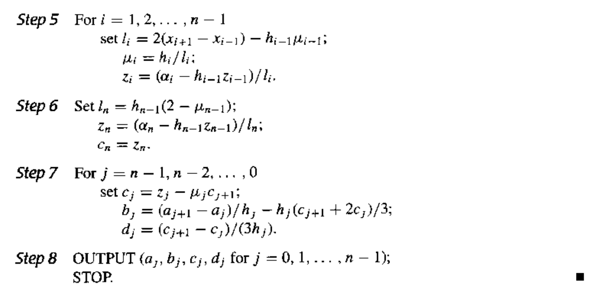
  </div>

- **自由边界**(free boundary)：$S''(a) = y_0'' = M_0, S''(b) = y_n'' = M_n$，且 $M_0 = M_n = 0$ 时

  - 那么 $\lambda_0 = 0, g_0 = 2y_0'';\ \mu_n = 0, g_n = 2y_n''$
  - 此时的样条称为**自然样条**(natural spline)

  **算法：自然三次样条**

  <div style="text-align: center">
      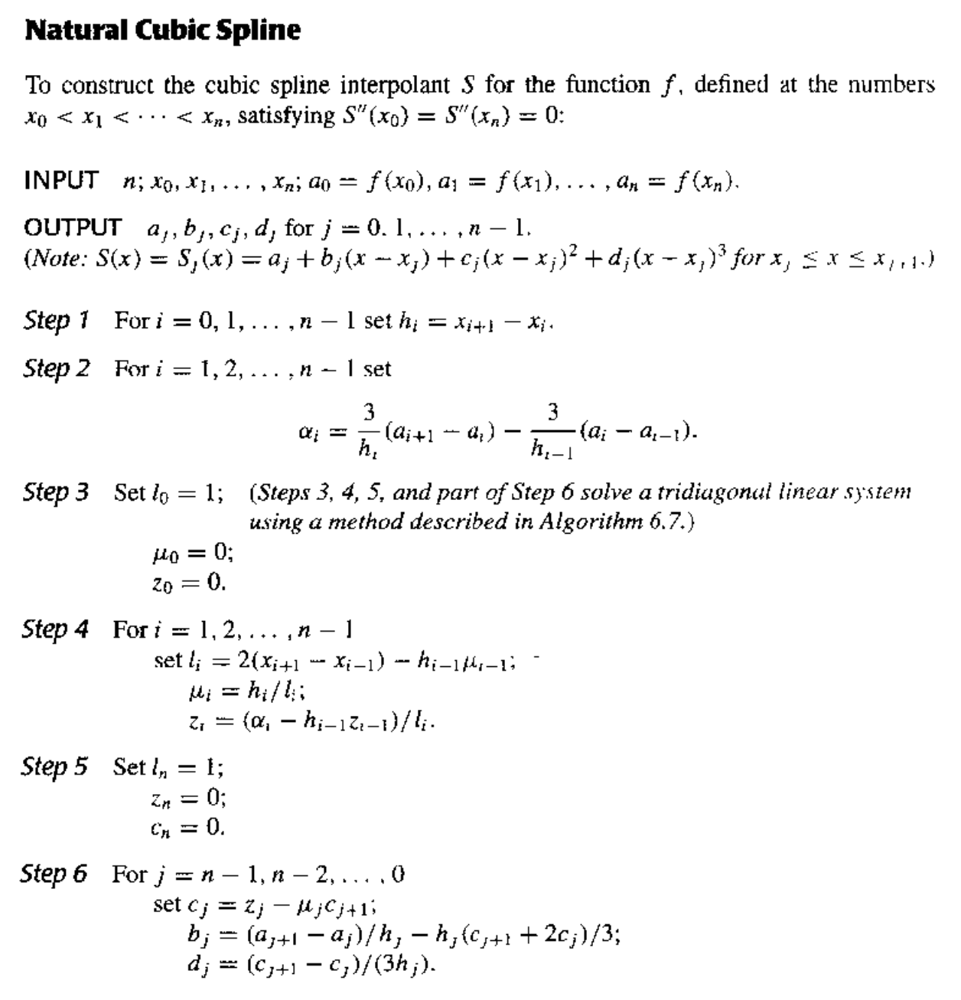
  </div>

  <div style="text-align: center">
      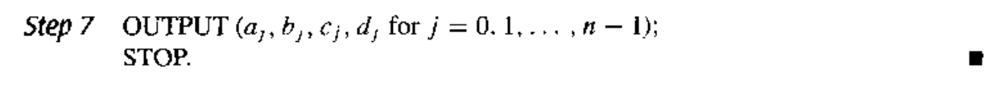
  </div>

- **周期边界**(periodic boundary)：如果 $f$ 是周期函数，即 $y_n = y_0$ 且 $S'(a^+) = S'(b^-) \Rightarrow M_0 = M_n$

  <div style="text-align: center">
      
  </div>

**注**

- 只要系数矩阵是严格对角占优的，那么三次样条能通过边界被**唯一**确定
- 如果 $f \in C[a, b]$ 且 $\dfrac{\max h_i}{\min h_i} \le C < \infty$，那么当 $h_i \rightarrow 0$ 时，$S(x) \xrightarrow{\text{uniform}} f(x)$。也就是说，在保证不增加样条阶数的情况下，可通过增加节点个数来提升近似精度

**算法概述：三次样条插值法**

1. 计算 $\mu_j, \lambda_j, g_j$
2. 求解 $M_j$
3. 找到包含 $x$ 的子区间，即找到相应的 $j$
4. 通过 $S_j(x)$ 得到 $f(x)$ 的近似值


# Chap 8: Approximation Theory


近似理论的目标是：给定 $x_1, \dots, x_m$ 和 $y_1, \dots y_m$，寻找更简单的函数 $P(x) \approx f(x)$（近似表示 $f(x)$）。

然而，因为有时 $m$ 可能会特别大，并且 $y_i$ 是不准确的实验数据（即 $y_i \ne f(x_i)$），所以此时更合理的做法是去寻找最佳拟合的 $P(x)$，使得对于所有点而言，$P(x_i) - y_i$ 尽可能小。下面我们就来介绍这些数学方法。


## Discrete Least Square Approximation

目标：确定一个多项式 $P_n(x) = a_0 + a_1 x + \dots a_n x^n$，用于近似表示一组数据 $\{(x_i, y_i)\ |\ i = 1, 2, \dots, m\}$，使得最小二乘误差 $E_2 = \sum\limits_{i=1}^m [P_N(x_i) - y_i]^2$ 最小化，其中 $n \ll m$

关键：$E_2$ 实际上是一个关于 $a_0, a_1, \dots, a_n$ 的函数，也就是说 $E_2(a_0, a_1, \dots, a_n) = \sum\limits_{i=1}^m [a_0 + a_1 x_i + \dots + a_n x_i^n - y_i]^2$。要想让 $E_2$ 最小化，必要条件是 $\dfrac{\partial E_2}{\partial a_k} = 0, k = 0, \dots, n$

$$
\begin{align}
0 & = \dfrac{\partial E_2}{\partial a_k} = 2\sum\limits_{i=1}^m [P_N(x_i) - y_i]^2 \dfrac{\partial P_n(x_i)}{\partial a_k} = 2 \sum\limits_{i=1}^m \Big[\sum\limits_{j=0}^n a_j x_i^j - y_i \Big]x_i^k \notag \\
& = 2\Big\{\sum\limits_{j=0}^n a_j \Big(\sum\limits_{i=1}^m x_i^{j+k}\Big) - \sum\limits_{j=1}^m y_i x_i^k\Big\} \notag
\end{align}
$$

令 $b_k = \sum\limits_{i=1}^m x_i^k, c_k = \sum\limits_{i=1}^m y_i x_i^k$，那么：

$$
\begin{bmatrix}b_{0+0} & \dots & b_{0+n} \\ \vdots & \vdots & \vdots \\ b_{n+0} & \dots & b_{n+n}\end{bmatrix} \begin{bmatrix}a_0 \\ \vdots \\ a_n\end{bmatrix} = \begin{bmatrix}c_0 \\ \vdots \\ c_n\end{bmatrix}
$$

**注**

- $P_n(x)$ 的顺序由用户给出，且必须不得超过 $m-1$。若 $n=m-1$，那么 $P_n(x)$ 就是 $E_2 = 0$ 的拉格朗日插值多项式
- 不强制要求 $P_n(x)$ 是一个多项式
- 如果要考虑权重 $w_i$ 的话，LSA 的公式就变成：$E_2 = \sum\limits_{i=1}^m w_i [P_N(x_i) - y_i]^2$

**例子**

例1
    
题目：
    
<div style="text-align: center">
    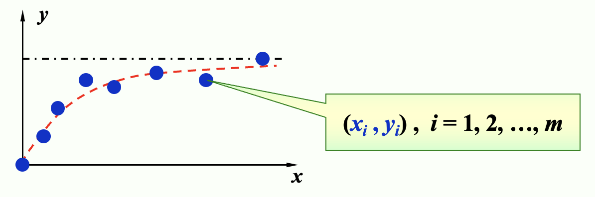
</div>

解答：
    
法1
    
令 $y \approx P(x) = \dfrac{x}{ax + b}$，寻找 $a, b$，使得 $E_2(a, b) = \sum\limits_{i=1}^m \Big(\dfrac{x_i}{ax_i + b} - y_i\Big)^2$ 最小化。

**线性化**(linearization)：令 $Y = \dfrac{1}{y}, X = \dfrac{1}{x}$，那么 $Y \approx a + b X$ 就是一个线性问题了。

将 $(x_i, y_i)$ 转换为 $(X_i, Y_i)$，$a, b$ 就能被解出来了。
    
法2
    
令 $y \approx P(x) = ae^{-\frac{b}{x}}$，不难发现 $\ln y \approx \ln a - \dfrac{b}{x}$

**线性化**：令 $Y = \ln y, X = \dfrac{1}{x}, A = \ln a, B = -b$，得到 $Y \approx A + BX$ 这样一个线性问题。

将 $(x_i, y_i)$ 转换为 $(X_i, Y_i)$，$a, b$ 就能被解出来了（$a = e^A, b = -B, P(x) = ae^{-\frac{b}{x}}$）
    
例2
    
题目：
    
<div style="text-align: center">
    
</div>

解答：
    
- 拿那个带权重的 LSA 公式计算，得到一个关于 $a, b$ 的函数
- 当所有偏导数均为0时，函数值最小；所以在代入具体值前，建议先化简偏导数公式，以减小计算量
- 得到的偏导数为：$\begin{cases}\dfrac{\partial S}{\partial a} = 0 \Rightarrow \sum w_i x_i y_i = 0 \\ \dfrac{\partial S}{\partial b} = 0 \Rightarrow \sum w_i x_i^3 y_i = 0\end{cases}$
- 再代入具体值，就可以得到关于 $a, b$ 的二元一次方程
- 解得 $a = \dfrac{8}{7}, b = \dfrac{23}{49}$


## Orthorgonal Polynomials and Least Squares Approximation

目标：

- 离散版本：给定 $x_1, \dots, x_m;\ y_1, \dots, y_m$，找到更简单的函数 $P(x) \approx f(x)$，使得 $E = \sum\limits_{i=1}^m |P(x_i) - y_i|^2$ 最小化。
- 连续版本：给定在 $[a, b]$ 上的函数 $f(x)$，找到更简单的函数 $P(x) \approx f(x)$，使得 $E = \int_a^b [P(x) - f(x)]^2 dx$ 最小化。

**定义** ：对于一组在区间 $[a, b]$ 上的函数 $\{\varphi_0(x), \varphi_1(x), \dots, \varphi_n(x)\}$，当 $\forall x \in [a, b]$，$a_0 \varphi_0(x) + a_1 \varphi_1(x) + \dots + a_n \varphi_n(x) = 0$ 时，有 $a_0 = a_1 \dots = a_n = 0$，那么称这组函数是**线性独立**(linearly independent)的，否则称它们是**线性相关**(linearly dependent)的。

**定理** ：如果 $\varphi_j(x)$ 是一个 $j$ 次多项式（$j = 0, \dots, n$），那么 $\{\varphi_0(x), \varphi_1(x), \dots, \varphi_n(x)\}$ 在任意区间 $[a, b]$ 上都是**线性独立的**(linear independent)。
    

**定理** ：令 $\Pi_n$ 为一组次数至多为 $n$ 的多项式，如果 $\{\varphi_0(x), \varphi_1(x), \dots, \varphi_n(x)\}$ 是 $\Pi_n$ 内一组线性独立的多项式，那么 $\Pi_n$ 内的任意多项式均可被唯一写做 $\varphi_0(x), \varphi_1(x), \dots, \varphi_n(x)$ 的一个线性组合。

**定义** ：对于一般的一组线性独立的函数 $\{\varphi_0(x), \varphi_1(x), \dots, \varphi_n(x)\}$，关于它们的**线性组合** $P(x) = \sum\limits_{j=0}^n a_j \varphi_j(x)$ 被称为**广义多项式**(generalized polynomial)。

一些特殊的多项式：

- $\{\varphi_j(x) = \cos jx\}, \{\psi_j(x) = \sin jx\} \Rightarrow \{\varphi_j(x), \psi_j(x)\}$ 得到的是**三角多项式**(trigonometric polynomial)
- $\{\varphi_j(x) = e^{kjx}, k_i \ne k_j\}$ 得到的是**指数多项式**(exponential polynomial)

**定义：权重函数(weight function)**

- **离散**版本：当对一组离散点 $(x_i, y_i) (i = 1, \dots, n)$ 进行近似时，我们为每个点赋予一个误差项 $w_i$，它是一个正实数。此时我们要考虑让 $E = \sum w_i [P(x_i) - y_i]^2$ 最小化。集合 $\{w_i\}$ 被称为**权重**(weight)。设置权重的目标是为这些点赋予不同的“重要程度”，以便实现更好的近似。
- **连续**版本：一个在区间 $I$ 上的可积分的函数 $w$ 被称为权重函数，它满足 $\forall x \in I, w(x) \ge 0$，但 $w(x)$ 不会在 $I$ 的任意子区间上消失。此时我们要考虑让 $E = \int_a^b w(x) [P(x) - f(x)]^2 dx$ 最小化。

**定义：广义的最小二乘近似(general least square approximation)问题**

- **离散**版本：给定一组离散点 $(x_i, y_i)$ 和一组对应的权重 $\{w_i\}$（$i = 1, \dots, m$）。我们要找到一个广义多项式 $P(x)$，使得误差 $E = \sum w_i [P(x_i) - y_i]^2$ 最小化。
- **连续**版本：给定定义在区间 $[a, b]$ 上的一个函数 $f(x)$ 和一个权重函数 $w(x)$。我们要找到一个广义多项式 $P(x)$，使得误差 $E = \int_a^b w(x) [P(x) - f(x)]^2 dx$ 最小化。

---

**内积**

映射 $V \times V \rightarrow F$ 满足以下三个公理：

- 共轭对称性：$(x, y) = \overline{(y, x)}$
- 线性：$(ax, y) = a(x, y), (x + y, z) = (x, z) + (y, z)$
- 正定性：$(x, x) \ge 0;\ (x, x) = 0 \Rightarrow x = 0$

内积就是 $x$ 的范数 $\|x\| = \sqrt{(x, x)}$

对于一般函数 $(f, g)$：

- 离散版本：$\sum\limits_i f_i g_i = (f_1\ f_2\ \dots\ f_n) \begin{pmatrix}g_1 \\ g_2 \\ \vdots \\ g_n\end{pmatrix} = (f)^T(g)$
- 连续版本：$\int_a^b f(x)g(x) dx$

若带有权重函数，即 $(f, g)_w$：

- 离散版本：

    $$
    \begin{align}
    \sum\limits_i f_i g_i & = (f_1\ f_2\ \dots\ f_n) \begin{pmatrix}w_1 & 0 & \dots & 0 \\ 0 & w_2 & \dots & 0 \\ \vdots & \vdots & \ddots & \vdots \\ 0 & 0 & \dots & w_n\end{pmatrix} \begin{pmatrix}g_1 \\ g_2 \\ \vdots \\ g_n\end{pmatrix} \notag \\
    & = (f)^T[w](g) \notag
    \end{align}
    $$

- 连续版本：$\int_a^b w(x)f(x)g(x) dx$

---

对于 $(f, g) = \begin{cases}\sum\limits_{i=1}^m w_i f(x_i) g(x_i) & \text{discrete version} \\ \int_a^b w(x) f(x) g(x) dx & \text{continuous version} \end{cases}$，可以证明它表示的是一个**内积**(inner product)，且 $\|f\| = \sqrt{(f, f)}$ 是一个**范数**。并且当 $(f, g) = 0$ 时，我们称 $f, g$ 是**正交的**(orthogonal)。

因此一般的最小二乘近似问题可以被转换为：

<div style="text-align: center" markdown="1">
寻找一个广义多项式 $P(x)$，使得 $E = (P - y, P - y) = \| P - y \|^2$ 最小化。
</div>

令 $P(x) = a_0 \varphi_0(x) + a_1 \varphi_1(x) + \dots + a_n \varphi_n(x)$，然后与求解离散问题类似：$\dfrac{\partial E}{\partial a_k} = 0$，即对于所有 $a_k$ 偏导数为0时误差取最小值。将等号左侧公式化简，可以得到：$\sum\limits_{j=0}^n (\varphi_k, \varphi_j) a_j = (\varphi_k, f), k = 0, \dots, n$，也就是说：

$$
\begin{bmatrix}b_{ij} = (\varphi_i, \varphi_j)\end{bmatrix} \begin{bmatrix}a_0 \\ \vdots \\ a_n\end{bmatrix} = \begin{bmatrix}(\varphi_0, f) \\  \vdots \\ (\varphi_n, f)\end{bmatrix} = \varepsilon
$$

**例子**

题目：使用 $y = a_0 + a_1 x + a_2 x^2\ (w \equiv 1)$ 近似点集 $\{(1, 4), (2, 10), (3, 18), (4, 26)\}$
    
解答：
    
$\varphi_0(x) = 1, \varphi_1(x) = x, \varphi_2(x) = x^2$，可以计算出：

<div style="text-align: center">
    
</div>

<div style="text-align: center">
    
</div>

$\|B\|_{\infty} = 484, \|B^{-1}\|_{\infty} = \dfrac{63}{4} \Rightarrow K(B) = 7623$

---

**例子**

当使用 $\varphi_j(x) = x^j$ 和 $w(x) \equiv 1$ 近似 $f(x) \in C[0, 1]$ 时，$(\varphi_i, \varphi_j) = \int_0^1 x^i x^j dx = \dfrac{1}{i + j +1}$（[**希尔伯特矩阵**](https://en.wikipedia.org/wiki/Hilbert_matrix)(Hilbert matrix)）

改进：如果我们能找到一组一般的线性独立的函数 $\{\varphi_0(x), \varphi_1(x), \dots, \varphi_n(x) \}$，使得任何函数对 $\varphi_i(x), \varphi_j(x)$ 是**正交的**(orthogonal)，那么范数矩阵将会是个**对角矩阵**。此时我们有 $a_k = \dfrac{(\varphi_k, f)}{(\varphi_k, \varphi_k)}$

下面考虑构造**正交多项式**(orthogonal polynomials)。

**定理**

对于一组在 $[a, b]$ 的多项式函数 $\{\varphi_0(x), \varphi_1(x), \dots, \varphi_n(x)\}$ 以及一个权重函数 $w$，当满足以下条件时，我们认为这些函数是正交的：

$$
\varphi_0 (x) \equiv 1, \varphi_1(x) = x - B_1, \varphi_k(x) = (x - B_k)\varphi_{k-1}(x) - C_k \varphi_{k-2}(x)
$$

其中 $B_k = \dfrac{(x \varphi_{k-1}, \varphi_{k-1})}{(\varphi_{k-1}, \varphi_{k-1})}, C_k = \dfrac{(x \varphi_{k-1}, \varphi_{k-2})}{( \varphi_{k-2}, \varphi_{k-2})}$
    
**注**
    
- 这样构造出来的正交多项式都是[**首一多项式**](https://en.wikipedia.org/wiki/Monic_polynomial)(monic polynomial)（即最高次数项系数为1的多项式）。
- 该定理正是源自我们在线性代数中学过的[**格拉姆-施密特正交化**](https://en.wikipedia.org/wiki/Gram%E2%80%93Schmidt_process)(Gram-Schmidt process)。

**例子**

例1
    
题目：（和之前基本一样的）使用 $y = c_0 + c_1 x + c_2 x^2, w \equiv 1$ 近似点集 $\{(1, 4), (2, 10), (3, 18), (4, 26)\}$
    
解答：
    
首先构造正交多项式 $\varphi_0(x), \varphi_1(x), \varphi_2(x)$，令 $y = a_0 \varphi_0(x) + a_1 \varphi_1(x) + a_2 \varphi_2(x)$（$a_k = \dfrac{(\varphi_k, y)}{(\varphi_k, \varphi_k)}$）。接下来就计算出这些值：

<div style="text-align: center">
    
</div>

最终解得 $y = \dfrac{1}{2}x^2 + \dfrac{49}{10}x - \dfrac{3}{2}$
    
例2
    
题目：
    
<div style="text-align: center">
    
</div>

解答：
    
知道内积的求解公式和上述正交多项式的构造后，这题其实挺容易的。所以就直接给出答案了：

- $\varphi_0(x) = 1$
- $\varphi_1(x) = x - 2$
- $\varphi_2(x) = x^2 - 4x + \dfrac{8}{3}$

**算法：正交多项式近似**

用一个有被容忍值约束的误差的多项式，近似一个给定的函数。

- 输入：数据个数 $m$；$x[m];\ y[m]$；权重 $w[m]$；容忍值 $TOL$；多项式最大阶数 $Max_n$
- 输出：近似多项式的系数

```c
Step 1  Set phi_0(x) ≡ 1; 
            a_0 = iprod(phi_0, y) / iprod(phi_0, phi_0); 
            P(x) = a_0 * phi_0(x); 
            err = iprod(y, y) - a_0 * iprod(phi_0, y);
Step 2  Set B_1 = iprod(x * phi_0, phi_0) / iprod(phi_0, phi_0); 
            phi_1(x) = x - B_1;
            a_1 = iprod(phi_1, y) / iprod(phi_1, phi_1); 
            P(x) += a_1 * phi_1(x); 
            err -= a_1 * iprod(phi_1, y);
Step 3  Set k = 1;
Step 4  while ((k < Max_n) && (|err| >= TOL)) do steps 5-7:
    Step 5  k++;
    Step 6  B_k = iprod(x * phi_1, phi_1) / iprod(phi_1, phi_1); 
            C_k = iprod(x * phi_1, phi_0) / iprod(phi_0, phi_0);
            phi_2(x) = (x - B_k) * phi_1(x) - C_k * phi_0(x); 
            a_k = iprod(phi_2, y) / iprod(phi_2, phi_2);
    Step 7  Set phi_0(x) = phi_1(x); phi_1(x) = phi_2(x);
Step 8  Output(); STOP.
```

**讨论**
    
问题：这里的 `err` 是否是最小二乘误差，为什么？
    
解答：
    
是的，并且 `err` 的推导公式如下：

$$
\begin{align}
err & = \| P - y \|^2 = (P - y, P - y) = (\sum\limits_{k=0}^n a_k \varphi_k - y, \sum\limits_{i=0}^n a_i \varphi_i - y) \notag \\
& = \sum\limits_{k=0}^n a_k^2 (\varphi_k, \varphi_k) - 2 \sum\limits_{k=0}^n a_k (\varphi_k, y) + (y, y) = (y, y) - \sum\limits_{k=0}^n a_k (\varphi_k, y) \notag
\end{align}
$$


## Chebyshev Polynomials and Economization of Power Series

前面讲过，解决一般的最小二乘近似问题的目标是：

<div style="text-align: center" markdown="1">
寻找一个广义多项式 $P(x)$，使得 $E = (P - y, P - y) = \| P - y \|^2$ 最小化。
</div>


再次明确：我们的目标是最小化 $\|P - y\|_{\infty}$——这是一个**极小化极大问题**(minimax problem)。


### Targets

目标 1.0：找到 $n$ 阶多项式 $P_n(x)$ 使得 $\|P_n - f\|_{\infty}$ 最小化。

**定义** ：如果 $P(x_0) - f(x_0) = \pm \|P - f\|_{\infty}$，那么此时 $x_0$ 被称为 $(\pm)$ **偏差点**(deviation point)（也就是正好在误差边界上的点）。

从任意地方构造出多项式并不容易，但我们能够检验多项式的一些特征：

- 如果 $f \in C[a, b]$ 且 $f$ **不是**一个 $n$ 阶多项式，那么存在一个唯一的多项式 $P_n(x)$，使得 $\|P_n - f\|_{\infty}$ 最小化

- $P_n(x)$ 存在，且必须同时有正负偏差点

- **切比雪夫定理**(Chebyshev Theorem)：$P_n(x)$ 最小化  $\|P_n - f\|_{\infty}\ \Leftrightarrow P_n(x)$ 至少有 $n+2$ 个关于 $f$ 的正负偏差点。也就是说，存在一组点 $a \le t_1 < \dots < t_{n+2} \le b$ 使得 $P_n(t_k) - f(t_k) = \pm(-1)^k \|P_n - f\|_{\infty}$。集合 $\{t_k\}$ 被称为**切比雪夫交替序列**(Chebyshev alternating sequence)。

  >$P_n(x) - f(x)$ 至少有 $n+1$ 个根。

  <div style="text-align: center">
      
  </div>

---

目标 2.0：确定插值点 $\{x_0, \dots, x_n\}$ 使得 $P_n(x)$ 最小化余项 $|P_n(x) - f(x)| = |R_n(x)| = \Big|\dfrac{f^{(n+1)}(\xi)}{(n+1)!} \prod\limits_{i=0}^n (x - x_i)\Big|$

目标 2.1：找到 $\{x_1, \dots, x_n\}$ 使得 $\|w_n\|_{\infty}$ 在 $[-1, 1]$ 最小化，其中 $w_n(x) = \prod\limits_{i=1}^n (x - x_i)$

---

注意到 $w_n(x) = x^n - P_{n-1}(x)$，问题就变成了：

目标 3.0：找到多项式 $P_{n-1}(x)$，使得 $\|x^n - P_{n-1}(x)\|_{\infty}$ 在 $[-1, 1]$ 上最小。

根据切比雪夫定理，我们知道 $P_{n-1}(x)$ 有 $n+1$ 个关于 $x^n$ 的偏差点，也就是说 $w_n(x)$ 在 $n+1$ 个点上交替获得最大值和最小值。


### Chebyshev Polynomials

考虑 $\cos (n \theta)$ 在 $[0, \pi]$ 上的 $n+1$ 个极值。

令 $x = \cos (\theta)$，那么 $x \in [-1, 1]$。我们称 $T_n(x) = \cos (n\theta) = \cos (n \cdot \text{arc} \cos x)$ 为**切比雪夫多项式**(Chebyshev polonomial)。

- $T_n(x)$ 假设在 $t_k = \cos \Big(\dfrac{k}{n} \pi\Big) (k = 0, 1, \dots, n)$ 上，在最大值1和最小值-1之间交替变换，也就是说 $T_n(t_k) = (-1)^k \|T_n(x)\|_{\infty}$
- $T_n(x)$ 有 $n$ 个根 $x_k = \cos \Big(\dfrac{2k - 1}{2n} \pi \Big)(k = 1, \dots, n)$
- $T_n(x)$ 有递推关系式：$T_0(x) = 1, T_1(x) = x, T_{n+1}(x) = 2x T_n(x) - T_{n-1}(x)$
  - $T_n(x)$ 是一个最高阶系数为 $2^{n-1}$ 的 $n$ 阶多项式
- $\{T_0(x), T_1(x), \dots\}$ 在 $[-1, 1]$ 上关于权重函数 $w(x) = \dfrac{1}{\sqrt{1 - x^2}}$ 上正交，也就是说 $(T_n, T_m) = \int_{-1}^1 \dfrac{T_n(x) T_m(x)}{\sqrt{1-x^2}} dx = \begin{cases}0 & n \ne m \\ \pi & n = m = 0 \\ \dfrac{\pi}{2} & n = m \ne 0\end{cases}$

回到之前提到的目标：

- 目标 3.0：找到多项式 $P_{n-1}(x)$，使得 $\|x^n - P_{n-1}(x)\|_{\infty}$ 在 $[-1, 1]$ 上最小。
  - 此时 $w_n(x) = x^n - P_{n-1}(x) = \dfrac{T_n(x)}{2^{n-1}}$
- 目标 2.1：找到 $\{x_1, \dots, x_n\}$ 使得 $\|w_n\|_{\infty}$ 在 $[-1, 1]$ 最小化，其中 $w_n(x) = \prod\limits_{i=1}^n (x - x_i)$
  - 此时 $\min\limits_{w_n \in \widetilde{\Pi}_n} \|w_n\|_{\infty} = \Big\|\dfrac{1}{2^{n-1}} T_n(x)\Big\|_{\infty} = \dfrac{1}{2^{n-1}}$。其中：$\widetilde{\Pi}_n$ 是 $n$ 阶的**首一多项式**，$\{x_1, \dots, x_n\}$ 是 $T_n(x)$ 的 $n$ 个根
- 目标 2.0：确定插值点 $\{x_0, \dots, x_n\}$ 使得 $P_n(x)$ 最小化余项 $|P_n(x) - f(x)| = |R_n(x)| = \Big|\dfrac{f^{(n+1)}(\xi)}{(n+1)!} \prod\limits_{i=0}^n (x - x_i)\Big|$
  - 取 $T_{n+1}(x)$ 上的 $n+1$ 个根作为插值点 $\{x_0, \dots, x_n\}$，然后关于 $f(x)$ 的插值多项式 $P_n(x)$ 假设绝对误差的最小上界为 $\dfrac{M}{2^n (n+1)!}$

**例子**

问题：找到在 $[0, 1]$ 上关于 $f(x) = e^x$ 的最佳近似多项式，使得绝对误差不超过 $0.5 \times 10^{-4}$。
    
解答：
    
1. 确定 $n$：
    - 改写变量 $x = \dfrac{a+b}{2} + \dfrac{b-a}{2} t = \dfrac{1}{2}(t+1)$
    - $|R_n| \le \dfrac{e}{(n+1)!} \times \dfrac{1}{2^{2n+1}} < \dfrac{1}{2} \times 10^{-4}$，解得 $n = 4$
2. 找到 $T_5(t)$ 的根：$t_0 = \cos \dfrac{\pi}{10}, \cos \dfrac{3 \pi}{10}, \cos \dfrac{5 \pi}{10}, \cos \dfrac{7 \pi}{10}, \cos \dfrac{9 \pi}{10}$
3. 对变量做点改变：
    - $x_0 = \dfrac{1}{2} \Big(\cos \dfrac{\pi}{10} + 1\Big) \approx 0.98$
    - $x_1 = \dfrac{1}{2} \Big(\cos \dfrac{3 \pi}{10} + 1\Big) \approx 0.79$
    - $x_2 = \dfrac{1}{2} \Big(\cos \dfrac{5 \pi}{10} + 1\Big) \approx 0.50$
    - $x_3 = \dfrac{1}{2} \Big(\cos \dfrac{7 \pi}{10} + 1\Big) \approx 0.21$
    - $x_4 = \dfrac{1}{2} \Big(\cos \dfrac{9 \pi}{10} + 1\Big) \approx 0.02$
4. 用插值点 $x_0, \dots, x_4$ 计算 $L_4(x)$


### Economization of Power Series

目标：给定 $P_n(x) \approx f(x)$，幂级数**经济化**(economization)的目标是在确保精度损失最小的情况下，降低多项式的次数。

考虑一个任意的 $n$ 阶多项式 $P_n(x) = a_n x^n + a_{n-1} x^{n-1} + \dots + a_1 x + a_0$，对应的多项式 $P_{n-1}(x)$ 通过移除 $n$ 阶多项式 $Q_n(x)$（$x^n$ 项的系数为 $a_n$）得到。那么 $\max\limits_{[-1, 1]} |f(x) - P_{n-1}(x)| \le \max\limits_{[-1, 1]} |f(x) - P_n(x)| + \max\limits_{[-1, 1]} |Q_n(x)|$，而 $Q_n(x)$ 能够反映精度的损失。

为了最小化精度损失，$Q_n(x)$ 必须为 $a_n \times \dfrac{T_n(x)}{2^{n-1}}$

**注**

- 对于一般区间 $[a, b]$，需要改变变量。也就是说，令 $x = [(b - a) t + (a + b)] / 2$，然后寻找对于 $f(t)$ 在 $[-1, 1]$ 上的（近似）多项式 $P_n(t)$，最终得到 $P_n(x)$。
- 另一种方法是用 $T_0(x), \dots, T_k(x)$ 的线性组合来表示每一项 $x^k$。比如，$x = T_1(x)$，且 $x^3 = [T_3(x) + 3T_1(x)] / 4$。然后只要从原始多项式中移除切比雪夫函数就行了。

**例子**

题目：已知 $f(x) = e^x$ 在 $[-1, 1]$ 上的4阶泰勒多项式为 $P_4 = 1 + x + \dfrac{x^2}{2} + \dfrac{x^3}{6} + \dfrac{x^4}{24}$。它的截断误差的上界为 $|R_4(x)| \le \dfrac{e}{5!} |x^5| \approx 0.023$。请将这个近似多项式的次数降至2。
    
解答
    
<div style="text-align: center">
    
</div>


# Chap 4: Numerical Differentiation and Integration


## Numerical Differentiation

目标：对于给定的 $x_0$，近似计算 $f'(x_0)$（即**数值微分**(numerical differentiation)）

微分计算公式：$f'(x_0) = \lim\limits_{h \rightarrow 0} \dfrac{f(x_0 + h) - f(x_0)}{h}$


{ width=25% align=right }
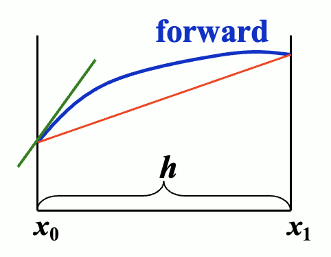{ width=25% align=right }

- 前向：$f'(x_0) \approx \dfrac{f(x_0 + h) - f(x_0)}{h}$
- 后向：$f'(x_0) \approx \dfrac{f(x_0) - f(x_0 - h)}{h}$

现在我们用 $f(x)$ 的带有插值点 $x_0, x_0 + h$ 的拉格朗日多项式来近似表示 $f(x)$：

$$
\begin{align}
f(x) & = \dfrac{f(x_0)(x - x_0 - h)}{x_0 - x_0 - h} + \dfrac{f(x_0 + h)(x - x_0)}{x_0 + h - x_0} \notag \\
& + \dfrac{(x - x_0)(x - x_0 - h)}{2} f''(\xi_x) \notag \\
f'(x) & = \dfrac{f(x_0 + h) - f(x_0)}{h} + \dfrac{2(x - x_0) - h}{2} f''(\xi_x) \notag \\
& + \dfrac{(x - x_0)(x - x_0 - h)}{2} \cdot \dfrac{d}{dx} [f''(\xi_x)] \notag
\end{align}
$$

因此 $f'(x_0) = \dfrac{f(x_0 + h) - f(x_0)}{h} - \dfrac{h}{2}f''(\xi)$

---

接下来用插值点为 $\{x_0, x_1, \dots, x_n\}$ 的拉格朗日多项式来近似表示 $f(x)$

$$
\begin{align}
f(x) & = \sum\limits_{k=0}^n f(x_k) L_k(x) + \dfrac{(x - x_0) \dots (x - x_n)}{(n+1)!} f^{(n+1)}(\xi_x) \notag \\
f'(x_j) & = \sum\limits_{k=0}^n f(x_k)L_k'(x_j) + \dfrac{f^{(n+1)}(\xi_j)}{(n+1)!} \prod\limits_{\substack{k = 0 \\ k \ne j}}^n (x_j - x_k) \notag
\end{align}
$$

上述导数公式被称为近似 $f'(x_j)$ 的 **n+1 点公式**((n+1)-point formula)。

**注**

- 一般来说，更多的评估点（即这里的插值点）会带来更大的近似精度
- 但另一方面，随着评估点的增加，舍入误差也在变大，因此数值微分是**不稳定的**！

**例子**

例1
    
题目：给定三个点 $x_0, x_0 + h, x_0 + 2h$，请推到关于它们的三点公式，然后选出对于 $f'(x)$ 而言最佳的三点公式。
    
解答：
    
根据前面的 n+1 点公式，不难得到：

$$
\begin{align}
f'(x_j) = & f(x_0) \Big[ \dfrac{2x_j - x_1 - x_2}{(x_0 - x_1)(x_0 - x_2)} \Big] + f(x_1) \Big[ \dfrac{2x_j - x_0 - x_2}{(x_1 - x_0)(x_1 - x_2)} \Big] \notag \\
& + f(x_2) \Big[ \dfrac{2x_j - x_0 - x_1}{(x_2 - x_0)(x_2 - x_1)} \Big] + \dfrac{1}{6}f^{(3)}(\xi_j) \prod_{\substack{k = 0 \\ k \ne j}}^2(x_j - x_k)\ (j = 0, 1, 2) \notag
\end{align}
$$

将 $x_0, x_1 = x_0 + h, x_2 = x_0 + 2h$ 代入上述公式，得到以下公式：

$$
\begin{align}
f'(x_0) & = \dfrac{1}{h}\Big[-\dfrac{3}{2} f(x_0) + 2f(x_0 + h) - \dfrac{1}{2}f(x_0 + 2h) \Big] + \dfrac{h^2}{3} f^{(3)}(\xi_0) \notag \\
f'(x_0 + h) & = \dfrac{1}{h} \Big[ -\dfrac{1}{2} f(x_0) + \dfrac{1}{2} f(x_0 + 2h) \Big] - \dfrac{h^2}{6} f^{(3)}(\xi_1) \notag \\
f'(x_0 + 2h) & = \dfrac{1}{h} \Big[ \dfrac{1}{2} f(x_0) - 2f(x_0 + h) + \dfrac{3}{2} f(x_0 + 2h) \Big] + \dfrac{h^2}{3} f^{(3)}(\xi_2) \notag
\end{align}
$$

方便起见，对于后两个公式，我们用 $x_0$ 替代原来的 $x_0 + h$ 和 $x_0 + 2h$，得到：

$$
\begin{align}
f'(x_0) & = \dfrac{1}{h}\Big[-\dfrac{3}{2} f(x_0) + 2f(x_0 + h) - \dfrac{1}{2}f(x_0 + 2h) \Big] + \dfrac{h^2}{3} f^{(3)}(\xi_0) \notag \\
f'(x_0) & = \dfrac{1}{h} \Big[ -\dfrac{1}{2} f(x_0 - h) + \dfrac{1}{2} f(x_0 + h) \Big] - \dfrac{h^2}{6} f^{(3)}(\xi_1) \notag \\
f'(x_0 + 2h) & = \dfrac{1}{h} \Big[ \dfrac{1}{2} f(x_0 - 2h) - 2f(x_0 - h) + \dfrac{3}{2} f(x_0) \Big] + \dfrac{h^2}{3} f^{(3)}(\xi_2) \notag
\end{align}
$$

观察发现第1个和第3个式子唯一的区别仅在 $h$ 和 $-h$，所以实际上只剩下2个式子，它们就是我们要找的三点公式：

$$
\begin{align}
f'(x_0) & = \dfrac{1}{h}\Big[-\dfrac{3}{2} f(x_0) + 2f(x_0 + h) - \dfrac{1}{2}f(x_0 + 2h) \Big] + \dfrac{h^2}{3} f^{(3)}(\xi_0)\ \xi_0 \in [x_0, x_0 + 2h] \notag \\
f'(x_0) & = \dfrac{1}{h} \Big[ -\dfrac{1}{2} f(x_0 - h) + \dfrac{1}{2} f(x_0 + h) \Big] - \dfrac{h^2}{6} f^{(3)}(\xi_1)\ xi_1 \in [x_0 - h, x_0 + h] \notag
\end{align}
$$

<div style="text-align: center">
    
</div>

例2
    
题目：寻找近似计算 $f''(x_0)$ 的方式。

解答
    
考虑在 $x_0$ 处的 $f(x_0 + h), f(x_0 - h)$ 的泰勒展开式：

$$
\begin{align}
f(x_0 + h) & = f(x_0) + f'(x_0) h + \dfrac{1}{2}f''(x_0)h^2 + \dfrac{1}{6} f'''(x_0) h^3 + \dfrac{1}{24} f^{(4)} (\xi_1) h^4 \notag \\
f(x_0 - h) & = f(x_0) - f'(x_0) h + \dfrac{1}{2}f''(x_0)h^2 - \dfrac{1}{6} f'''(x_0) h^3 + \dfrac{1}{24} f^{(4)} (\xi_{-1}) h^4 \notag
\end{align}
$$

因此：$f''(x_0) = \dfrac{1}{h^2} [f(x_0 - h) - 2f(x_0) + f(x_0 + h)] - \dfrac{h^2}{12} f^{(4)} (\xi)$


## Elements of Numerical Integration

目标：近似计算 $I = \int_a^b f(x) dx$（即**数值求积**(numerical quadratrue)）

思路：使用 $f(x)$ 的**拉格朗日插值多项式**——从区间 $[a, b]$ 上选择一组不同的点 $a \le x_0 < x_1 \dots < x_n \le b$。拉格朗日多项式为 $P_n(x) = \sum\limits_{k=0}^n f(x_k) L_k(x)$，因此：

$$
\int_a^b f(x) dx \approx \sum\limits_{k=0}^n f(x_k) \int_a^b L_k(x) dx
$$

令 $A_k = \int_a^b L_k(x) dx = \int_a^b \prod\limits_{j \ne k} \dfrac{x - x_j}{x_k - x_j} dx$

误差 $R[f]$ 为：

$$
\begin{align}
& R[f] \notag \\
= & \int_a^b f(x) dx - \sum\limits_{k=0}^n A_kf(x_k) \notag \\
= & \int_a^b [f(x) - P_n(x)] dx = \int_a^b R_n(x) dx \notag \\
= & \int_a^b \dfrac{f^{(n+1)}(\xi_x)}{(n+1)!} \prod\limits_{k=0}^n(x - x_k)dx \notag
\end{align}
$$

**定义** ：求积公式的**精度**(degree of accuracy/precision)为最大的正整数 $n$，使得公式对于每个 $x^k(k = 0, 1, \dots, n)$ 都是精确的。

**例子**

题目
    
考虑在 $[a, b]$ 上的线性插值，我们有 $P_1(x) = \dfrac{x - b}{a - b}f(a) + \dfrac{x - a}{b - a}f(b)$。可以得到：

- $A_1 = A_2 = \dfrac{b - a}{2}$
- $\int_a^b f(x) dx \approx \dfrac{b - a}{2}[f(a) + f(b)]$

请计算上述公式的精度。
    
解答
    
考虑 $x^k(k = 0, 1, \dots)$：

- $x^0$：$\int_a^b 1dx = b - a = \dfrac{b - a}{2}[1 + 1]$
- $x^1$：$\int_a^b xdx = \dfrac{b^2 - a^2}{2} = \dfrac{b - a}{2}[a + b]$
- $x^2$：$\int_a^b x^2dx = \dfrac{b^3 - a^3}{3} \ne \dfrac{b - a}{2}[a^2 + b^2]$

<div style="text-align: center">
    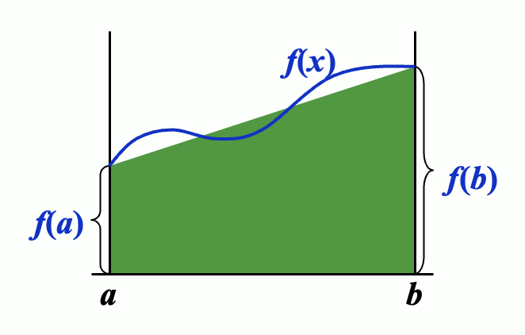
</div>

因此精度阶数 = 1

---

对于等间距的节点 $x_i = a + ih, h = \dfrac{b - a}{n}, i = 0, 1, \dots, n$

$$
\begin{align}
A_i & = \int_{x_0}^{x_n} \prod\limits_{j \ne i} \dfrac{x - x_j}{x_i - x_j} dx \notag \\
& = \int_0^n \prod\limits_{i \ne j} \dfrac{(t - j)h}{(i - j)h} \times h dt = \dfrac{(b - a)\textcolor{green}{(-1)^{n-i}}}{\textcolor{green}{ni!(n - i)!}} \textcolor{green}{\int_0^n \prod\limits_{i \ne j} (t - j) dt} \notag 
\end{align}
$$

其中标绿色的部分（$\dfrac{(-1)^{n-i}}{ni!(n - i)!} \int_0^n \prod\limits_{i \ne j} (t - j) dt$）被称为**科茨系数**(Cotes cofficient)，记作 $C_i^{(n)}$

**注** ：可以看到，科茨系数不取决于 $f(x)$ 或 $[a, b]$，而仅由 $n, i$ 决定。因此我们可以从一张表中找出这些系数。上述公式称为**牛顿-科茨公式**(Newton-Cotes formula)

- $n = 1$
  - $C_0^{(1)} = C_1^{(1)} = \dfrac{1}{2}$
  - $\int_a^b f(x) dx \approx \dfrac{b - a}{2}[f(a) + f(b)]$（称为**梯形法则**(trapezoidal rule)）
  - $R[f] = \int_a^b \dfrac{f''(\xi_x)}{2!}(x-a)(x-b) dx = -\dfrac{1}{12}h^3f''(\xi)$
  - $\xi \in [a, b], h = \dfrac{b - a}{1}$
  - 精度 = 1
- $n = 2$
  - $C_0^{(2)} = \dfrac{1}{6}, C_1^{(2)} = \dfrac{2}{3}, C_2^{(2)} = \dfrac{1}{6}$
  - $\int_a^b f(x) dx \approx \dfrac{b - a}{6}[f(a) + 4f(\dfrac{a+b}{2}) + f(b)]$（称为**辛普森法则**(Simpson's rule)）
  - $R[f] = -\dfrac{1}{90} h^5 f^{(4)}(\xi)$
  - $\xi \in (a, b), h = \dfrac{b - a}{2}$
  - 精度 = 3
- $n = 3$：**辛普森 3/8 法则**，精度 = 3，$R[f] = -\dfrac{3}{80}h^5 f^{(5)}(\xi)$
- $n = 4$：**科茨法则**(Cotes' Rule)，精度 = 5，3，$R[f] = -\dfrac{8}{945}h^7 f^{(6)}(\xi)$

**定理**

对于使用 $n+1$ 个点的牛顿-科茨公式，$\exists \xi \in (a, b)$，使得：

$$
\int_a^b f(x) dx = \sum\limits_{k=0}^n A_k f(x_k) + \dfrac{h^{n+3}f^{(n+2)}(\xi)}{(n+2)!} \int_0^n t^2(t - 1) \dots (t - n) dt
$$

- 如果 $n$ 为**偶数**，那么 $f \in C^{n+2}[a, b]$ 且 $\int_a^b f(x) dx = \sum\limits_{k=0}^n A_k f(x_k) + \dfrac{h^{n+2}f^{(n+1)}(\xi)}{(n+1)!} \int_0^n t(t - 1) \dots (t - n) dt$
- 如果 $n$ 为**奇数**，那么  $f \in C^{n+1}[a, b]$


## Compotsite Numerical Integration

由于高阶多项式容易发生振荡，所以我们用**分段**(piecewise)插值的方式来近似 $f(x)$。这里用到了低阶的牛顿-科茨公式。


### Composite Trapezoidal Rule

**复合梯形法则**(composite trapezoidal rule)涉及到的变量有：$h = \dfrac{b-a}{n}, x_k = a + kh\ (k=0, \dots, n)$。

我们将梯形公式作用在每个区间 $[x_{k-1}, x_k]$ 上，即：

$$
\int_{x_{k-1}}^{x_k} f(x)dx \approx \dfrac{x_k - x_{k-1}}{2} [f(x_{k-1}) + f(x_k)], k = 1, \dots, n \Rightarrow \\
\int_a^b f(x)dx \approx \sum\limits_{k=1}^n \dfrac{h}{2}[f(x_{k-1}) + f(x_k)] = \dfrac{h}{2}\Big[f(a) + 2\sum\limits_{k=1}^{n-1} f(x_k) + f(b) \Big] = \textcolor{cornflowerblue}{T_n} \\
\begin{align}
R[f] & = \sum\limits_{k=1}^n \Big[-\dfrac{h^3}{12} f''(\xi_k)\Big] = -\dfrac{h^2}{12}(b-a) \dfrac{\sum\limits_{k=1}^n f''(\xi_k)}{n} \notag \\
& = -\dfrac{h^2}{12}(b-a) f''(\xi), \xi \in (a, b) \notag
\end{align}
$$

>$R[f]$ 的公式涉及到**中值定理**(MVT)。


### Composite Simpson's Rule

**复合辛普森法则**(composite Simpson rule)涉及到的变量和复合梯形公式一致：$h = \dfrac{b-a}{n}, x_k = a + kh\ (k=0, \dots, n)$。

我们将辛普森公式作用在每个区间 $[x_{k-1}, x_k]$ 上，即：

$$
\int_{x_{k-1}}^{x_k} f(x)dx \approx \dfrac{h}{6} [f(x_{k}) + 4 f(x_{k+\frac{1}{2}}) + f(x_{k+1})], k = 1, \dots, n \Rightarrow \\
\int_a^b f(x)dx \approx \dfrac{h}{6}\Big[f(x_a) + 4\sum\limits_{k=0}^{n-1}f(x_{k+\frac{1}{2}}) + 2\sum\limits_{k=0}^{n-2}f(x_{k+1}) + f(x_b)\Big] = \textcolor{cornflowerblue}{S_n} \\
R[f] = -\dfrac{b-a}{180} \Big(\dfrac{h}{2}\Big)^4 f^{(4)}(\xi)
$$

**注**

为了简化记号，我们令 $n' = 2n$，那么 $h' = \dfrac{b-a}{n'} = \dfrac{h}{2}, x_k = a+kh'$，所以：

$$
S_n = \dfrac{h'}{3}[f(a) + 4 \sum\limits_{odd\ k} f(x_k) + 2 \sum\limits_{even\ k} f(x_k) + f(b)]
$$

---

上述的复合方法都是**稳定的**。来看下面这个例子：

**例子**

考虑在 $[a, b]$ 上有 $n$ 个子区间的辛普森法则。假设 $f(x_i)$ 由 $f^*(x_i)$ 近似，满足 $f(x_i) = f^*(x_i) + \varepsilon_i\ (i = 0, \dots, n)$，那么累积误差为：

$$
e(h) = \Big|\dfrac{h}{3}[\varepsilon_0 + 4 \sum\limits_{odd\ k} \varepsilon_k + 2 \sum\limits_{even\ k} \varepsilon_k + \varepsilon_n]\Big|
$$

若 $|\varepsilon_i| < \varepsilon\ (i = 0, \dots, n)$，那么：

$$
e(h) < \dfrac{h}{3} [\varepsilon + 4(n/2)\varepsilon + 2(n/2-1)\varepsilon + \varepsilon] = nh\varepsilon = (b-a)\varepsilon
$$

可以看到，当我们修正分区，以确保准确性时，增加的计算量**不会**带来更多的舍入误差。

**讨论**

题目：使用 $n=8$ 梯形法则和辛普森法则来近似 $\pi = \int_0^1 \dfrac{4}{1+x^2} dx$。
    
答案
    
$$
\begin{align}
T_8 & = \dfrac{1}{16}\Big[f(0) + 2\sum\limits_{k=1}^7f(x_k) + f(1)\Big] \quad \text{where } x_k = \dfrac{k}{8} \notag \\
& = \textcolor{green}{3.1}\textcolor{red}{383988494} \notag
\end{align}
$$

$$
\begin{align}
S_4 & = \dfrac{1}{24}\Big[f(0) + 4\sum\limits_{odd}f(x_k)+ 2\sum\limits_{even}f(x_k) + f(1)\Big] \quad \text{where } x_k = \dfrac{k}{8} \notag \\
& = \textcolor{green}{3.141592}\textcolor{red}{502} \notag
\end{align}
$$

在编程的时候，我们通常会将一个子区间划分为两个均等宽度的更小的子区间。也就是说，令 $n = 2^k\ (k = 0, 1, \dots)$

当 $k=9$ 时，$T_{512} = \textcolor{green}{3.141592}\textcolor{red}{02}$

$\dfrac{4}{3}T_8 - \dfrac{1}{3}T_4 = \textcolor{green}{3.141592}\textcolor{red}{502} = S_4$


## Romberg Integration

回顾一下梯形法则的误差公式：$R_n[f] = -\dfrac{h^2}{12}(b-a)f''(\xi)$。当我们将每个子区间的长度缩减至原来的一半时，

$$
R_{2n}[f] = -\Big(\dfrac{h}{2}\Big)^2 \dfrac{1}{12}(b-a)f''(\xi') \approx \dfrac{1}{4}R_n[f]
$$

从而得到：$\dfrac{I - T_{2n}}{I - T_n} \approx \dfrac{1}{4}$，解得 $I \approx \dfrac{4T_{2n} - T_n}{4 - 1} = \dfrac{4}{3}T_{2n} - \dfrac{1}{3}T_n = S_n$

一般情况下：

- $\dfrac{4T_{2n} - T_n}{4 - 1} = S_n$
- $\dfrac{4^2S_{2n} - S_n}{4^2 - 1} = C_n$
- $\dfrac{4^3C_{2n} - C_n}{4^3 - 1} = R_n$ -> **Romberg 序列**(Romberg sequence)

**Romberg 法**如下所示：

<div style="text-align: center">
    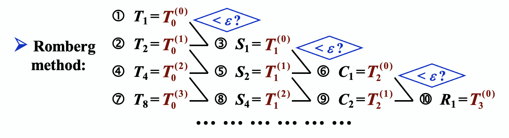
</div>


可以看到，Romberg 法通过不断将积分区间对分（涉及到接下来介绍的 [Richardson 外推法](#richardsons-extrapolation)），在这些子区间上作用[（复合）梯形法则](#composite-trapezoidal-rule)，从而提高积分精度。

其递推公式为：

$$
R_{k, j} = R_{k, j-1} + \dfrac{1}{4^{j-1} - 1}(R_{k, j-1} - R_{k-1, j-1}) \quad k = j, j+1, \dots
$$

对应的表格为：

$$
\begin{matrix}
h & R_{1, 1} \\
\frac{h}{2} & R_{2, 1} & R_{2, 2} \\
\frac{h}{4} & R_{3, 1} & R_{3, 2} & R_{3, 3} \\
\vdots & \vdots & \vdots & \vdots & \ddots \\
\frac{h}{2^{n-1}} & R_{n, 1} & R_{n, 2} & R_{n, 3} & \dots & R_{n, n}
\end{matrix}
$$

**算法：Romberg**

近似积分 $I = \int_a^b f(x) dx$，选择整数 $n > 0$

- 输入：端点 $a, b$；整数 $n$
- 输出：数组 $R$（按行计算 $R$；只保留2行（节省空间））

```c
Step 1  Set h = b - a;
            R[1][1] = h / 2 * (f(a) + f(b));
Step 2  Output(R[1][1]);
Step 3  for i = 2, ..., n do steps 4-8:
    // approximation from Trapezoidal method
    Step 4  Set R[2][1] = 1/2 * [R[1][1] + h * sum(k=1, pow(2, i-2), f(a + (k - 0.5) * h))];
    Step 5  for j = 2, ..., i:
                // extrapolation
                set R[2][j] = R[2][j-1] + (R[2][j-1] - R[1][j-1]) / (pow(4, j-1) - 1);
    Step 6  Output(R[2][j] for j = 1, 2, ..., i);
    Step 7  Set h /= 2;
    Step 8  for j = 1, 2, ..., i set R[1][j] = R[2][j];    // update row 1 of R
Step 9  STOP.
```


## Richardson's Extrapolation

**Richardson 外推法**(Richardson's extrapolation)实现的目标是：使用低阶公式获取高精度的结果。

它的核心思想是：利用同一数值方法在不同步长下计算出的结果，通过线性组合来消除或减小近似解中的主要误差项，从而得到一个更高精度的估计值。

>这和求解一元方程的 [Aitken's $\Delta^2$ 法](2.md#aitkens--method)在思想上有共通之处。

假设对于某些 $h \ne 0$，我们有公式 $T_0(h)$，用于近似未知量 $I$，并且其**截断误差**的形式为：

$$
T_0(h) - I = \alpha_1 h + \alpha_2 h^2 + \alpha_3 h^3 + \dots
$$

用 $h$ 一半的值替代自身，我们有：

$$
T_0(h/2) - I = \alpha_1 (h/2) + \alpha_2 (h/2)^2 + \alpha_3 (h/2)^3 + \dots
$$

结合上述两个公式，我们就可以将精度从 $O(h)$ 提升至 $O(h^2)$：

$$
\dfrac{2T_0(\frac{h}{2}) - T_0(h)}{2 - 1} - I = -\dfrac{1}{2}\alpha_2 h^2 - \dfrac{3}{4} \alpha_3 h^3 - \dots
$$

令 $T_1 = \dfrac{2T_0(\frac{h}{2}) - T_0(h)}{2 - 1} = I + \beta_1 h^2 + \beta_2 h^3 + \dots$。类似地，我们可以将精度提升至 $O(h^3)$：

$$
T_2 = \dfrac{2^2T_1(\frac{h}{2}) - T_1(h)}{2^2 - 1} = I + \gamma_1 h^3 + \gamma_2 h^4 + \dots
$$

以此类推，我们可以将精度可以提升到 $m+1$ 阶：

$$
T_m = \dfrac{2^mT_{m-1}(\frac{h}{2}) - T_{m-1}(h)}{2^m - 1} = I + \delta_1 h^{m+1} + \delta_2 h^{m+2} + \dots
$$

**例子**

题目
    
<div style="text-align: center">
    
</div>

解答
    
由 Gemini 2.5 pro 作答，且通过笔者验证。

1.  建立误差方程：

    令 $N(A) = \frac{f(x_0+A)-2f(x_0)+f(x_0-A)}{A^2}$。我们可以将真实值表示为：

    $$f''(x_0) = N(A) + K_1A^2 + K_2A^4 + \dots$$

    其中 $K_1 = -\frac{f^{(4)}(x_0)}{12}$。

2. 使用两种步长：

    我们使用步长 $A$ 和 $A/2$ 来计算近似值：

    * **步长 A**: $f''(x_0) = N(A) + K_1A^2 + K_2A^4 + \dots$（式1）
    * **步长 A/2**: $f''(x_0) = N(A/2) + K_1(A/2)^2 + K_2(A/2)^4 + \dots = N(A/2) + \frac{K_1}{4}A^2 + \frac{K_2}{16}A^4 + \dots$（式2）

3. 消除 $O(A^2)$ 误差项：

    为了消除 $K_1A^2$ 项，我们将（式2）乘以4，然后减去（式1）：

    * $4f''(x_0) = 4N(A/2) + K_1A^2 + \frac{K_2}{4}A^4 + \dots$
    * $f''(x_0) = N(A) + K_1A^2 + K_2A^4 + \dots$

    两式相减得到：

    $3f''(x_0) = 4N(A/2) - N(A) - \frac{3K_2}{4}A^4 + \dots$

4. 导出新公式：

    整理上式，我们得到一个新的 $f''(x_0)$ 的近似公式，其误差项为 $O(A^4)$：

    $$f''(x_0) \approx \frac{4N(A/2) - N(A)}{3}$$

    这个公式的误差为 $O(A^4)$，比原来的 $O(A^2)$ 精度更高。


## Adapative Quadrature Methods

目标：预测函数变化量，根据变化的需求调整步幅。

前面介绍的复合积分方法的缺点是：对所有区间递归划分子区间，这样计算量太大，而且还有产生了许多不必要的计算，这很浪费。因此，我们采用一种仅对具有**较大误差**(large error)的区间进行划分的方法，避免额外的计算。我们称这样的方法为**自适应求积方法**(adapative quadrature mehtods)。

那么什么算“较大误差”呢？一种简单的确定策略是使用 $\int_a^b f(x) dx$ 的总误差 $\varepsilon$ 来确定边界：在长度为 $h$ 的区间中，误差应该要小于 $h \dfrac{\varepsilon}{b - a}$。当误差超过这个值时，我们就认为是较大误差，需要继续划分该区间。

接下来的问题就是如何估计一个区间的误差。这里我们暂时仅考虑辛普森法则下的误差估计——即如何估计：

$$
\varepsilon(f, a, b) \approx \int_a^b f(x)dx - S(a, b) = \dfrac{h^5}{90} f^{(4)}(\xi)
$$

其中 $h = \dfrac{b-a}{2}, \xi \in [a, b]$。

这个问题的答案在例2中给出。

**例子**
    
考虑基于复合辛普森法则的自适应方法：

$$
\int_a^b f(x)dx = S(a, b) - \dfrac{h^5}{90}f^{(4)}(\xi)
$$

其中 $S(a, b) = \dfrac{h}{3}[f(a) + 4f(a + h) + f(b)], h = \dfrac{b-a}{2}$。令：

$$
\begin{align}
S\Big(a, \dfrac{a+b}{2}\Big) = \dfrac{h}{6}[f(a) + 4f(a + h/2) + f(a + h)] \notag \\
S\Big(\dfrac{a+b}{2}, b\Big) = \dfrac{h}{6}[f(a + h) + 4f(a + 3h/2) + f(b)] \notag
\end{align}
$$

那么：

$$
\int_a^b f(x) dx = S\Big(a, \dfrac{a+b}{2}\Big) + S\Big(\dfrac{a+b}{2}, b\Big) - \dfrac{1}{16} \times \dfrac{h^5}{90}f^{(4)}(\eta) \\
\begin{align}
&\ \Big| \int_a^b f(x) dx - S\Big(a, \dfrac{a+b}{2}\Big) - S\Big(\dfrac{a+b}{2}, b\Big) \Big| \notag \\
\approx &\ \dfrac{1}{15} \Big|S(a, b) - S\Big(a, \dfrac{a+b}{2}\Big) - S\Big(\dfrac{a+b}{2}, b\Big) \Big| \notag \\
< &\ \varepsilon \notag
\end{align}
$$

可以看到，相比一般的辛普森法则，结合自适应方法后误差只有原来的 $\dfrac{1}{15}$ 🎉


## Gaussian Quadrature

目标：构造一个公式 $\int_a^b w(x) f(x) dx \approx \sum\limits_{k=0}^n A_k f(x_k)$，对于 $n+1$ 个点而言精度为 $2n+1$。

思路：确定 $2n+2$ 个未知量 $x_0, \dots, x_n;\ A_0, \dots, A_n$，使得公式在 $f(x) = 1, x, x^2, \dots, x^{2n+1}$ 上都是精确的。点 $x_0, \dots, x_n$ 被称为**高斯点**(Gaussian points)，这个方法被称为**高斯求积**(Gaussian quadrature)

**讨论**

题目：使用 $n = 1$ 的高斯求积近似表示 $\int_0^1 \sqrt{x} f(x) dx$。
    
解答

假设 $\int_0^1 \sqrt{x} f(x) dx \approx A_0 f(x_0) + A_1 f(x_1)$。

公式必须在 $f(x) = 1, x, x^2, x^3$ 上精确表示。计算 $\begin{cases}\frac{2}{3} = A_0 + A_1 \\ \frac{2}{5} = A_0 x_0 + A_1 x_1 \\ \frac{2}{7} = A_0 x_0^2 + A_1 x_1^2 \\ \frac{2}{9} = A_0x_0^3 + A_1 x_1^3\end{cases}$，解得：$\begin{cases}x_0 \approx 0.8212 \\ x_1 \approx 0.2899 \\ A_0 \approx 0.3891 \\ A_1 \approx 0.2776\end{cases}$

**定理** ：当且仅当 $W(x) = \prod\limits_{k=0}^n(x - x_k)$ 与所有阶数不超过 $n$ 的多项式正交时，$x_0, \dots, x_n$ 是**高斯点**。
    

正交多项式的集合 $\{\varphi_0, \varphi_1, \dots, \varphi_n, \dots\}$ 是线性独立的，且 $\varphi_{n+1}$ 和任何多项式 $P_m(x)\ (m \le n)$ 正交。所以，如果我们拿 $\varphi_{n+1}$ 作为 $W(x)$，那么 **$\varphi_{n+1}$ 的根**就是高斯点了。

**例子**

题目：使用高斯求积来近似计算 $\int_0^1 \sqrt{x} f(x) dx$，其中 $n = 1$
    
解答
    
假设 $\int_0^1 \sqrt{x} f(x) dx \approx A_0 f(x_0) + A_1 f(x_1)$。

1. 构造正交多项式 $\varphi_2$。令 $\varphi_0(x) = 1, \varphi_1(x) = x + a, \varphi_2(x) = x^2 + bx + c$
    - $(\varphi_0, \varphi_1) = 0 \Rightarrow \int_0^1 \sqrt{x} (x + a) dx = 0 \Rightarrow a = - \dfrac{3}{5}$
    - $(\varphi_0, \varphi_2) = 0 \Rightarrow \int_0^1 \sqrt{x} (x^2 + bx + c) dx = 0 \Rightarrow a = - \dfrac{10}{9}$
    - $(\varphi_1, \varphi_2) = 0 \Rightarrow \int_0^1 \sqrt{x} (x - \dfrac{3}{5})(x + bx + c) dx = 0 \Rightarrow a = \dfrac{5}{21}$
    - $\therefore \varphi_2(x) = x^2 - \dfrac{10}{9}x + \dfrac{5}{21}$

2. 找到 $\varphi_2$ 的两个根，作为高斯点 $x_0, x_1$：$x_{0;1} = \dfrac{\frac{10}{9} \pm \sqrt{(\frac{10}{9})^2 - \frac{20}{21}}}{2}$

3. 因为这个公式必须在 $f(x) = 1, x$ 上是精确的，所以我们能比较容易地求解 $A_0, A_1$ 的线性方程组（待定系数）

最终结果为：$x_0 \approx 0.8212, x_1 \approx 0.2899, A_0 \approx 0.3891, A_1 \approx 0.2776$

现在使用上述结果来近似计算$\int_0^1 \sqrt{x} e^x dx$

$$
\int_0^1 \sqrt{x} e^x dx \approx A_0 e^{x_0} + A_1 e^{x_1} = 0.3891 \times e^{0.8212} + 0.2776 \times e^{0.2899} \approx 1.2555
$$

而 $\int_0^1 \sqrt{x} (2x-1) dx = \dfrac{2}{15}$ 是精确的。

一些特殊的正交多项式：

- **勒让德多项式**(Legendre polynomials)：定义在 $[-1, 1]$ 上且 $w(x) \equiv 1$

  $$
  P_k(x) = \dfrac{1}{2^k k!} \dfrac{d^k}{dx^k}(x^2 - 1)^k \quad \quad (P_k, P_l) = \begin{cases}0 & k \ne l \\ \dfrac{2}{2k+1} & k = l\end{cases}
  $$

  $P_0 = 1, P_1 = x, (k + 1)P_{k+1} = (2k + 1)xP_k - kP_{k-1}$

  使用 $P_{n+1}$ 的根的公式称为**高斯-勒让德求积公式**。

- **切比雪夫多项式**(Chebyshev polynomials)：定义在 $[-1, 1]$ 上且 $w(x) = \dfrac{1}{\sqrt{1 - x^2}}$

  $$
  T_k(x) = \cos (k \times \arccos x)
  $$

  $T_{n+1}$ 的根为 $x_k = \cos \Big(\dfrac{2k + 1}{2n + 2} \pi \Big) \quad (k = 0, \dots, n)$

  公式 $\int_{-1}^1 \dfrac{1}{\sqrt{1 - x^2}} f(x) dx = \sum\limits_{k=0}^n A_k f(x_k)$ 称为**高斯-切比雪夫求积公式**。

  - 注意到积分端点 $\pm 1$ 是积分上的**奇点**(singular points)，此时在等间距的点上使用牛顿-科茨公式会出现问题；而高斯积分能够避免这个问题。


# Chap 5: Initial-Value Problems for Ordinary Differential Equations


## The Elementary Theory of Initial-Value Problems

1阶[**常微分方程**](https://en.wikipedia.org/wiki/Ordinary_differential_equation)(ordinary differential equations, ODE)的[**初值问题**](https://en.wikipedia.org/wiki/Initial_value_problem)(initial-value problems, IVP)：

$$
\begin{cases}
\dfrac{dy}{dt} = f(t, y), t \in [a, b] \\
y(a) = \alpha
\end{cases}
$$

>第一个方程表达的意思的是（未知）函数 $y$ 随自变量 $t$（往往是时间）的变化率是一个关于 $t, y$ 的（已知）函数；第二个方程就是初始条件。

目标：在一组网格点(mesh points) $a = t_0 < t_1 < \dots < t_n = b$ 上（通常是等间距的）计算 $y(t)$ 的近似值。也就是说，计算 $w_i \approx y(t_i) = y_i\ (i = 1, \dots, n)$。

**定义** ：

对于函数 $f(t, y)$，若存在常数 $L > 0$，满足：

$$
|f(t, y_1) - f(t, y_2)| \le L|y_1 - y_2|
$$

我们称该函数满足在变量 $y \in D \subset R^2$ 上的 **Lipschitz 条件**。

**定理** ：

假设 $D = \{(t, y)\ |\ a \le t \le b, -\infty < y < \infty\}$，且 $f(t, y)$ 在 $D$ 上连续。若 $f$ 满足在变量 $y \in D$ 上的 Lipschitz 条件，那么初值问题
    
$$
y'(t) = f(t, y), a \le t \le b, y(a) = \alpha
$$

有**唯一解** $y(t)$（$a \le t \le b$）。

**定义** ：

若初值问题

$$
y'(t) = f(t, y), a \le t \le b, y(a) = \alpha
$$

满足以下条件，我们称之为**适定性问题**(well-posed problem)：

- 问题存在唯一解 $y(t)$
- $\forall \varepsilon > 0$，存在正常数 $k(\varepsilon)$，使得当 $|\varepsilon_0| < \varepsilon$，并且 $\delta(t)$ 在 $[a, b]$ 上连续且 $|\delta(t)| < \varepsilon$ 时，对于

    $$
    z'(t) = f(t, z) + \delta(t), a \le t \le b, z(a) = \alpha + \varepsilon_0
    $$

    （上述式子称为**扰动问题**(perturbed problem)），存在唯一解 $z(t)$，满足 $|z(t) - y(t)| < k(\varepsilon) \cdot  \varepsilon\ (a \le t \le b)$

**定理** ：

假设 $D = \{(t, y)\ |\ a \le t \le b, -\infty < y < \infty\}$，且 $f(t, y)$ 在 $D$ 上连续。若 $f$ 满足在变量 $y \in D$ 上的 Lipschitz 条件，那么初值问题

$$
y'(t) = f(t, y), a \le t \le b, y(a) = \alpha
$$

具有**适定性**(well-posed)。

 

## Euler's Method

{ width=30% align=right }

>继续往下阅读前，不妨回顾一下前面提出的[目标](#the-elementary-theory-of-initial-value-problems)。

$y'(t_0) \approx \dfrac{y(t_0 + h) - y(t_0)}{h}\ \Rightarrow\ y(t_1) \approx y(t_0) + hy'(t_0) = \alpha + hf(t_0, \alpha)$

其中 $h$ 为步长。

**欧拉法**(Euler's method)的核心是<u>用切线近似曲线</u>，它通过**差分方程**(difference equations)来计算近似值：$\begin{cases}w_0 = \alpha \\ w_{i+1} = w_i + hf(t_i, w_i)\end{cases}\ (i = 0, \dots, n - 1)$

**定理** ：

假设 $f$ 在 $D = \{(t, y)\ |\ a \le t \le b, -\infty < y < \infty \}$ 上是连续的，且满足 Lipschitz 条件（对应常数 $L$）；且存在常数 $M, \forall\ a \le t \le b$，满足 $|y''(t)| \le M$。

令 $y(t)$ 为初值问题 $y'(t) = f(t, y), a \le t \le b, y(a) = \alpha$ 的唯一解，且 $w_0, w_1, \dots, w_n$ 为通过欧拉法（对于某些正整数 $n$）得到的近似值，那么：

$$
|y_i - w_i| \le \dfrac{hM}{2L}[e^{L(t_i - a)} - 1] \quad (i = 0, 1, \dots, n)
$$

**注** ：

$y''(t)$ 可在不知道 $y(t)$ 的情况下被计算出来：

$$
y''(t) = \dfrac{d}{dt}y'(t) = \dfrac{d}{dt}f(t, y(t)) = \dfrac{\partial}{\partial t}f(t, y(t)) + \dfrac{\partial}{\partial y}f(t, y(t)) \cdot f(t, y(t))
$$

---

代入舍入误差后，差分方程为：$\begin{cases}w_0 = \alpha \textcolor{red}{+ \delta_0} \\ w_{i+1} = w_i + hf(t_i, w_i) \textcolor{red}{+ \delta_{i+1}}\end{cases}(i = 0, \dots, n - 1)$

**定理** ：

令 $y(t)$ 为初值问题 $y'(t) = f(t, y), a \le t \le b, y(a) = \alpha$ 的唯一解，且 $w_0, w_1, \dots, w_n$ 为使用上述差分方程得到的近似值。若 $|\delta_i| < \delta\ (i = 0, \dots, n)$，那么 $\forall\ i$

$$
|y_i - w_i| \le \dfrac{1}{L} \Big(\dfrac{hM}{2} + \dfrac{\delta}{h}\Big)[e^{L(t_i - a)} - 1] + |\delta_0|e^{L(t_i - a)}
$$

>其中 $h \ge \sqrt{2 \delta / M}$


## High Order Taylor Methods

**定义** ：

差分法 $\begin{cases}w_0 = \alpha \\ w_{i+1} = w_i + h\varphi(t_i, w_i)\end{cases} (i = 0, \dots, n - 1)$ 的**局部截断误差**(local truncation error)为：

$$
\tau_{i+1}(h) = \dfrac{y_{i+1} - (y_i + h\varphi(t_i, y_i))}{h} = \dfrac{y_{i+1} - y_i}{h} - \varphi(t_i, y_i) \quad (i = 0, \dots, n - 1)
$$

**注** ：局部截断误差就是 $\dfrac{y_{i+1} - w_{i+1}}{h}$（基于假设 $w_i = y_i$）。

欧拉法的局部截断误差：

$$
\begin{align}
\tau_{i+1} & = \dfrac{y_{i+1} - w_{i+1}}{h} = \dfrac{[y_i + hy'(t_i) + \frac{h^2}{2}y''(\xi_i)] - [y_i + hf(t_i, y_i)]}{h} \notag \\
& = \dfrac{h}{2} y''(\xi_i) = O(h) \notag
\end{align}
$$

**注** ：

$$
\begin{align}
y_{i+1} & = y(t_{i+1}) = y(t_i + h) = y(t_i) + y'(t_i)h + y''(\xi_i) \dfrac{h^2}{2} \notag \\
& = y_i + hy'(t_i) + \frac{h^2}{2}y''(\xi_i) \notag
\end{align}
$$

>我一开始没看出这一点（~~还是太菜了~~）

所以欧拉法本质上是**泰勒展开式的1阶形式**，换句话说我们可通过 $n = 1$ 时泰勒展开式得到的欧拉法近似表示 $y(t)$。

---

高阶泰勒法公式为：

$$
y_{i+1} = y_i + hf(t_i, y_i) + \dfrac{h^2}{2} f'(t_i, y_i) + \dots + \dfrac{h^n}{n!}f^{(n-1)}(t_i, y_i) + \dfrac{h^{(n+1)}}{(n+1)!}f^{(n)}(\xi_i, y(\xi_i))
$$

对于阶数为 $n$ 的泰勒法，其对应的差分方程为：

$$
\begin{cases}w_0 = \alpha \\ w_{i+1} = w_i + hT^{(n)}(t_i, w_i)\end{cases} (i = 0, \dots, n - 1)
$$

其中 $T^{(n)}(t_i, w_i) = f(t_i, w_i) + \dfrac{h}{2}f'(t_i, w_i) + \dots + \dfrac{h^{n-1}}{n!} f^{(n-1)}(t_i, w_i)$

若 $y \in C^{n+1}[a, b]$，那么局部截断误差是 $O(h^n)$。

**讨论**

题目：应用 $n = 10$ 的 3 阶泰勒法，解决初值问题 $y' = y - t^2 + 1, 0 \le t \le 2, y(0) = 0.5$。
    
>这里的 $n$ 是区间分段数，不是题目前面讲的阶数。

解答：
    
找到 $f$ 的前两个导数：

- $f(t, y(t)) = y(t) - t^2 + 1$
- $f'(t, y(t)) = y'(t) - 2t = y(t) - t^2 + 1 - 2t$
- $f''(t, y(t)) = y'(t) - 2t - 2 = y(t) - t^2 - 2t - 1$

得到：

$$
\begin{align}
T^{(3)}(t_i, w_i) & = f(t_i, w_i) + \dfrac{h}{2} f'(t_i, w_i) + \dfrac{h^2}{6}f''(t_i, w_i) \notag \\
& = \Big(1 + \dfrac{h}{2} + \dfrac{h^2}{6} \Big)(w_i - t_i^2 + 1) - \Big(1 + \dfrac{h}{3}\Big)ht_i - \dfrac{h^2}{3} \notag
\end{align}
$$

通过3阶泰勒法，得到差分方程：$\begin{cases}w_0 = 0.5 \\ w_{i+1} = w_i + h\Big[\Big(1 + \dfrac{h}{2} + \dfrac{h^2}{6}\Big)(w_i - t_i^2 + 1) - \Big(1 + \dfrac{h}{3}ht_i - \dfrac{h^2}{3}\Big)\Big]\end{cases}$

因为 $n = 10$，那么 $h = 0.2, t_i = 0.2i, w_{i+1} = 1.22133w_i - 0.00855i^2 - 0.00853i + 0.21867$。


### Other Euler's Methods

- **隐式欧拉法**(implicit Euler's method)

  - $y'(t_0) \approx \dfrac{y(t_0) - y(t_0 - h)}{h}\ \Rightarrow\ \textcolor{red}{y(t_1)} \approx y(t_0) + hy'(t_1) + \alpha + hf(t_1, \textcolor{red}{y(t_1)})$

    { align=right width=30% }

  - 差分方程为 $\begin{cases}w_0 = \alpha \\ \textcolor{red}{w_{i+1}} = w_i + hf(t_{i+1}, \textcolor{red}{w_{i+1}})\end{cases} (i = 0, \dots, n - 1)$

    - 之所以称为“隐式”，是因为差分方程左右两边都有 $w_{i+1}$，这意味着我们需要通过解方程得到 $w_{i+1}$，而无法像一般的欧拉法（相对地，我们将其称为**显式欧拉法**）那样直接计算得到 $w_{i+1}$

  - 通常以迭代形式求解 $w_{i+1}$，其初始值通过显式法给出

  - 隐式欧拉法的局部截断误差为 $\tau_{i+1} = \dfrac{y_{i+1} - w_{i+1}}{h} = -\dfrac{h}{2}y''(\xi_i) = O(h)$

  - 相比显式法，该方法更为**稳定**，因为计算 $w_{i+1}$ 时用到了未来的信息 $t_{i+1}, w_{i+1}$，从而能更准确地预测未来趋势，对解的约束也就越强；而显式法只用了当前的信息 $t_{i}, w_{i}$，其预测结果自然会有更大的偏差

- **梯形法**(trapezoidal method)

  - 差分方程为 $\begin{cases}w_0 = \alpha \\ \textcolor{red}{w_{i+1}} = w_i + \dfrac{h}{2}[f(t_i, w_i) + f(t_{i+1}, \textcolor{red}{w_{i+1}})]\end{cases} (i = 0, \dots, n - 1)$
  - 注：局部截断误差为 $O(h^2)$；但必须以迭代方式求解隐式方程

- **两步法**(double-step method)

  - $y'(t_0) = \dfrac{1}{2h}[y(t_0 + h) - y(t_0 - h)] - \dfrac{h^2}{6}y^{(3)}(\xi_1)\ \Rightarrow\ y(t_2) \approx y(t_0) + 2hf(t_1, y(t_1))$
  - 差分方程为 $\begin{cases}w_0 = \alpha \\ w_{i+1} = w_{i-1} + 2hf(t_i, w_i)\end{cases} (i = 1, \dots, n - 1)$
  - 该方法要求知道两个初始点，故得其名；而先前讨论的方法都是**单步法**(single-step methods)
    - 也就是说，两步法除了要知道 $w_0$（即原来的初值）外，还要知道 $w_1$ 的值，因此需要先用单步法得到 $w_1$ 后再用多步法
  - 若假设 $w_{i-1} = y_{i-1}, w_i = y_i$，那么局部截断误差为 $O(h^2)$
  - 由于两步法用到了更多点的信息，因此能得到更精确的近似结果

**比较上述各法的优劣** ：

|方法|👍|👎|
|:-:|:-:|:-:|
|显式欧拉法|简单|低阶精度|
|隐式欧拉法|稳定|低阶精度、耗时（计算量大）|
|梯形法|更精确|耗时|
|两步法|更精确、显式|要求一个额外的初始点|


## Runge-Kutta Methods

**Runge-Kutta 法**是一种具有高阶局部截断误差的单步方法，无需计算 $f$ 的导数。

思路：在单步法中，某个线段从 $(t_i, w_i)$ 出发，以某个斜率延伸至下一个点 $(t_{i+1}, w_{i+1})$。我们可以通过**找到更好的斜率**来改善结果。

观察以下修改过的欧拉法（即改进欧拉法，下面会介绍的）：

$$
\begin{cases}
w_{i+1} = w_i + h\Big[ \dfrac{1}{2} K_1 + \dfrac{1}{2} K_2 \Big] \\
K_1 = f(t_i, w_i) \\
K_2 = f(t_i + h, w_i + hK_1)
\end{cases}
$$

- 斜率是否必须是 $K_1, K_2$ 的平均值？
- 步幅是否必须为 $h$？

我们将其进一步泛化（从一般的平均值 -> 加权平均值）：

$$
\begin{cases}
w_{i+1} & = w_i + h[\textcolor{red}{\lambda_1} K_1 + \textcolor{red}{\lambda_2} K_2 ] \\
K_1 & = f(t_i, w_i) \\
K_2 & = f(t_i + \textcolor{red}{p}h, w_i + \textcolor{red}{p}hK_1)
\end{cases}
$$

我们要找到 $\lambda_1, \lambda_2, p$，使得该方法的局部阶段误差的阶数为2。

1. 写出 $K_2$ 在 $(t_i, y_i)$ 上的泰勒展开式：

   $$
   \begin{align}
   K_2 & = f(t_1 + ph, y_i + phK_1) \notag \\
   & = f(t_i, y_i) + phf_t(t_i, y_i) + phK_1f_y(t_i, y_i) + O(h^2) \notag \\
   & = y'(t_i) + phy''(t_i) + O(h^2) \notag 
   \end{align}
   $$

   **注** ：

   $$
   \begin{align}
   y''(t) & = \dfrac{d}{dt}f(t, y) \notag \\
   & = f_t(t, y) + f_y(t, y) \dfrac{dy}{dt} \notag \\
   & = f_t(t, y) + f_y(t, y)f(t, y) \notag
   \end{align}
   $$

2. 将 $K_2$ 代入到第一个式子中：

   $$
   \begin{align}
   w_{i+1} & = y_i + h\{\lambda_1 y'(t_i) + \lambda_2[y'(t_i) + phy''(t_i) + O(h^2)]\} \notag \\
   & = y_i + (\lambda_1 + \lambda_2) hy'(t_i) + \lambda_2 ph^2 y''(t_i) + O(h^3) \notag
   \end{align}
   $$

3. 找到 $\lambda_1, \lambda_2, p$，使得 $\tau_{i+1} = (y_{i+1} - w_{i+1}) / h = O(h^2)$

$$
\begin{cases}
w_{i+1} & = y_i + (\lambda_1 + \lambda_2) hy'(t_i) + \lambda_2 ph^2 y''(t_i) + O(h^3) \\
y_{i+1} & = y_i + hy'(t_i) + \dfrac{h^2}{2} y''(t_i) + O(h^3) 
\end{cases}
$$

比对上面两个方程，可以得到：$\lambda_1 + \lambda_2 = 1, \lambda_2 p = \dfrac{1}{2}$（3 个未知数，2 个方程）

所以有无穷多个解。而由这两个方程得到的一系列方法被称为 **2阶龙格-库塔法**(Runge-Kutta method of order 2)。

**注** ：本节开始提到的改进欧拉法就是龙格-库塔法的一种特殊情况（$p = 1, \lambda_1 = \lambda_2 = \dfrac{1}{2}$）

**2阶龙格-库塔法的多种形式** ：

- **中点法**(midpoint method)：将从二阶泰勒法中的 $T^{(2)}(t, y)$ 用 $f(t + h / 2, y + (h / 2)f(t, y))$ 替换得到的差分方程法。

    $$
    \begin{cases}
    w_0 = \alpha \\
    w_{i+1} = w_i + hf(t_i + \dfrac{h}{2}, w_i + \dfrac{h}{2}f(t_i, w_i))
    \end{cases}
    \quad (i = 0, \dots, N - 1)
    $$

- **改进欧拉法**(modified Euler method)：

    $$
    \begin{cases}
    w_0 = \alpha \\
    w_{i+1} = w_i + \dfrac{h}{2}[f(t_i, w_i) + f(t_{i+1}, w_i + hf(t_i, w_i))]
    \end{cases}
    \quad (i = 0, \dots, N - 1)
    $$

- **Heun 法**：

    $$
    \begin{cases}
    w_0 = \alpha \\
    w_{i+1} = w_i + \dfrac{h}{4}[f(t_i, w_i) + 3f(t_i + \dfrac{2}{3}h, w_i + \dfrac{2}{3}hf(t_i, w_i))]
    \end{cases}
    \quad (i = 0, \dots, N - 1)
    $$

---

计算更高精度：

$$
\begin{cases}
w_{i+1} = y_i + h[\textcolor{red}{\lambda_1} K_1 + \textcolor{red}{\lambda_2} K_2 + \dots + \textcolor{red}{\lambda_m} K_m] \\
K_1 = f(t_i, w_i) \\
K_2 = f(t_i + \textcolor{red}{\alpha_2} h, w_i + \textcolor{red}{\beta_{21}} hK_1) \\
K_3 = f(t_i + \textcolor{red}{\alpha_3} h, w_i + \textcolor{red}{\beta_{31}} hK_1 + \textcolor{red}{\beta_{32}} hK_2) \\
\dots \\
K_m = f(t_i + \textcolor{red}{\alpha_m} h, w_i + \textcolor{red}{\beta_{m1}} hK_1 + \textcolor{red}{\beta_{m2}} hK_2 + \dots + \textcolor{red}{\beta_{m, m-1}} hK_{m-1}) \\
\end{cases}
$$

最流行的是经典 **4 阶龙格-库塔法**：

$$
\begin{cases}
w_{i+1} = w_i + \dfrac{h}{6}(K_1 + 2K_2 + 2K_3 + K_4) \\
K_1 = f(t_i, w_i) \\
K_2 = f(t_i + \dfrac{h}{2}, w_i + \dfrac{h}{2} K_1) \\
K_3 = f(t_i + \dfrac{h}{2}, w_i + \dfrac{h}{2} K_2) \\
K_4 = f(t_i + h, w_i + hK_3)
\end{cases}
$$

**注** ：

- 在使用龙格-库塔法时，主要的计算量在于求解 $f$。Butcher 已经帮我们建立好了每步求值次数与局部截断误差阶数之间的关系：

    <div style="text-align: center">
        
    </div>

- 因为龙格-库塔法是基于泰勒展开式的，所以 $y$ 不得不足够平滑，以获取在高阶方法下的更高的精度。通常低阶方法相比高阶方法会采用更小的步幅。


## Multistep Methods

思路：使用 $y, y'$ 在多个网格点(mesh points)上的线性组合，以得到更好的近似值 $y(t_{i+1})$。

**多步法**(multistep method)的一般形式如下：

$$
w_{i+1} = \textcolor{red}{a_{m-1}} w_i + \textcolor{red}{a_{m-2}} w_{i-1} + \dots + \textcolor{red}{a_0} w_{i+1-m} + h[\textcolor{red}{b_m} f_{i+1} + \textcolor{red}{b_{m-1}} f_i + \dots + \textcolor{red}{b_0} f_{i+1-m}]
$$

- 在隐式法中，$b_m \ne 0$
- 在显式法中，$b_m = 0$

具体方法：从积分中获取。在 $[t_i, t_{i+1}]$ 上对 $y'(t) = f(t, y)$ 进行积分，得到：

$$
y(t_{i+1}) - y(t_i) = \int_{t_i}^{t_{i+1}} f(t, y(t)) dt
$$

关键是**近似计算积分**。不同的近似方法会得到不同的差分方程。


### Adams-Bashforth Explicit $m$-step Technique

使用**牛顿后向差分**公式，在 $(t_i, f_i), (t_{i-1}, f_{i-1}), \dots, (t_{i+1-m}, f_{i+1-m})$ 上对 $f$ 进行插值，并得到 $P_{m-1}(t)$。或者令 $t = t_i + sh, s \in [0, 1]$，我们有：

$$
\int_{t_i}^{t_{i+1}} f(t, y(t)) dt = h \int_0^1 P_{m-1}(t_i + sh) ds + h \int_0^1 \underbrace{R_{m-1}}_{\substack{\text{local} \\ \text{truncation} \\ \text{error}}}(t_i + sh) ds
$$

最后得到显式公式：$w_{i+1} = w_i + h\int_0^1 P_{m-1}(t_i + sh)ds$

**定义** ：

多步法的局部截断误差为：

$$
\tau_{i+1}(h) = \dfrac{y_{i+1} - (a_{m-1}y_i + \dots + a_0 y_{i+1-m})}{h} - [b_m f_{i+1} + \dots + b_0 f_{i+1-m}]
$$

其中 $i = m-1, m, \dots, n - 1$

**例子**

题目：请求出 Adams-Bashforth 2步显式法。
    
解答：
    
使用牛顿后向差分公式，在 $(t_i, f_i), (t_{i-1}, f_{i-1})$ 上对 $f$ 插值：

$$
P_1(t_i + sh) = f_i + s \nabla f_i = f_i + s(f_i - f_{i-1})
$$

得到 $w_{i+1} = w_i + h \int_0^1 [f_i + s(f_i - f_{i-1})] ds = w_i + \dfrac{h}{2} (3f_i - f_{i-1})$

局部截断误差为：

$$
\begin{align}
\tau_{i+1} & = \dfrac{y(t_{i+1}) - w_{i+1}}{h} = \int_0^1 R_1 (t_i + sh) ds \notag \\
& = \int_0^1 \dfrac{d^2 f(\xi_i, t(\xi_i))}{dt^2} \dfrac{1}{2!} sh(s+1)h ds = \dfrac{5}{12} h^2 y'''(\widetilde{\xi_i}) \notag
\end{align}
$$

**注** ：

一般来说，对于 $\tau = A_mh^my^{(m+1)}(\xi_i)$，$A_m$ 和系数 $f_i, f_{i-1}, f_{i+1-m}$ 能从表格中找到。

<div style="text-align: center">
    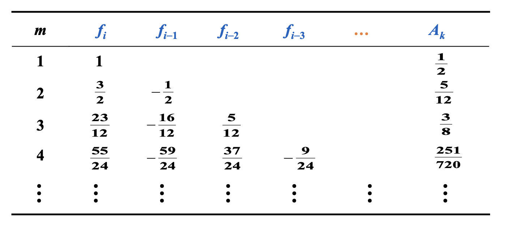
</div>

Adams-Bashforth 4 步显式法：$w_{i+1} = w_i + \dfrac{5}{24} (55f_i - 59 f_{i-1} + 37 f_{i-2} - 9f_{i-3})$


### Adams-Moulton Implicit $m$-step Technique

使用牛顿前向差分公式，在 $(t_{i+1}, \textcolor{red}{f_{i+1}}), (t_i, f_i), \dots, (t_{i+1-m}, f_{i+1-m})$ 上对 $f$ 进行插值，并得到 $P_m(t)$。类似的，我们可以得到一组 $\tau_{i+1} = B_m h^{m+1} y^{(m+2)} (\xi_i)$ 的隐式公式。

<div style="text-align: center">
    
</div>


Adams-Moulton 3 步隐式法：$w_{i+1} = w_i + \dfrac{h}{24} (9 f_{i+1} + 19 f_i - 5 f_{i-1} + f_{i-2})$


### Adams Predictor-Corrector System

1. 用 **Runge-Kutta 法**计算前 $m$ 个初始值（为多步法（$m$ 步）的启动做准备）
2. 用 **Adams-Bashforth 显式法**进行预测（效率高）
3. 用 **Adams-Moulton 隐式法**进行校正（提高精度，更稳定）

**注** ：

- 对于上述步骤用到的三个公式，它们的局部截断误差必须有**相同的阶数**。
- 最受欢迎的系统是将 4 阶 Adams-Bashforth 法作为预测器，将 1 次迭代下的 Adams-Moulton 法作为校正器，而起始值通过 4 阶 Runge-Kutta 法获得。


### Derive from Taylor Expansion

>回顾[多步法的一般形式](#multistep-methods)。

思路：扩展在关于 $t_i$ 的泰勒级数里的 $y_{i-1}, \dots, y_{i+1-m}$ 和 $f_{i+1}, f_{i-1}, \dots, f_{i+1-m}$，并让 $h^k$ 的系数相等，以获得 $a_0, \dots, a_{m-1}$ 和 $b_0, \dots, b_m$。

**例子**

例1
    
题目：请求出形如以下形式的 4 阶公式：
    
$$
w_{i+1} = \textcolor{red}{a_2}w_i + \textcolor{red}{a_1}w_{i-1} + \textcolor{red}{a_0}w_{i-2} + h[\textcolor{red}{b_3}f_i + \textcolor{red}{b_2}f_{i-1} + \textcolor{red}{b_1}f_{i-2} + \textcolor{red}{b_0}f_{i-3}]
$$

解答：
    
在 $t_i$ 处扩展 $y_{i-1}, y_{i-2}, f_{i-1}, f_{i-2}, f_{i-3}$ 和 $y(t_{i+1})$

假设 $w_i = y_i$ 的情况下，$\tau_{i+1} = \dfrac{y_{i+1} - w_{i+1}}{h} = O(h^4)$

$$
\begin{align}
y_{i-1} = & y_i - hy_i' + \dfrac{1}{2} h^2 y_i'' - \dfrac{1}{6}h^3 y_i''' + \dfrac{1}{24}h^4 y_i^{(4)} + O(h^5) \notag \\
y_{i-2} = & y_i - 2hy_i' + 2 h^2 y_i'' - \dfrac{4}{3}h^3 y_i''' + \dfrac{2}{3}h^4 y_i^{(4)} + O(h^5) \notag \\
f_{i-1} = & y_i' - hy_i'' + \dfrac{1}{2}h^2 y_i''' - \dfrac{1}{6}h^3y_i^{(4)} + O(h^4) \notag \\
f_{i-2} = & y_i' - 2hy_i'' + 2h^2 y_i''' - \dfrac{4}{3}h^3y_i^{(4)} + O(h^4) \notag \\
f_{i-3} = & y_i' - 3hy_i'' + \dfrac{9}{2}h^2 y_i''' - \dfrac{9}{2}h^3y_i^{(4)} + O(h^4) \notag \\
\end{align}
$$

$$
y(t_{i+1}) = y_i + hy_i' + \dfrac{1}{2}h^2y_i'' + \dfrac{1}{6}h^3 y_i''' + \dfrac{1}{24}h^4 y_i^{(4)} + O(h^5)
$$

有 5 个方程，7 个未知量。

- 令 $a_0 = a_1 = 0$ -> **Adams-Bashforth 显式法**
- 用 $f_{i+1}$ 替换 $f_{i-1}$，并令 $a_0 = a_1 = 0$ -> **Adams-Moulton 隐式法**
- 用 $w_{i-3}$ 替换 $f_{i-3}$，我们能得到另一组阶数为 4 的方法，包括了显式 **Milne 法**：

    $$
    w_{i+1} = w_{i-3} + \dfrac{4h}{3}(2f_i - f_{i-1} + 2f_{i-2})
    $$

    其截断误差为 $\dfrac{14}{45}h^4y^{(5)}(\xi_i), \xi_i \in (t_{i-3}, t_{i+1})$

- 令 $a_0 = 0, a_1 = 1$ -> **Simpson 隐式法**

    $$
    w_{i+1} = w_{i-1} + \dfrac{h}{3}(f_{i+1} + 4f_i + f_{i-1})
    $$

    其截断误差为 $-\dfrac{h^4}{90}y^{(5)}(\xi_i), \xi_i \in (t_{i-1}, t_{i+1})$
    
---

例2
    
题目：
    
<div style="text-align: center">
    
</div>

解答：
    
>解析过程来自 Gemini 2.5 pro，并且也通过了笔者的验证。

为了找到使局部截断误差最小的系数，我们的策略是，假设近似解 $w_i$ 等于真实解 $y(t_i)$，然后将公式中的每一项围绕点 $t_i$ 进行泰勒展开。通过匹配展开后 $h$ 的同次幂的系数，我们使这个公式对于尽可能高阶的多项式都是精确的，从而达到最小化截断误差的目的。

我们把公式中的 $y_{i+1}$, $y_{i-1}$ 和 $y'_{i+1}$ (即 $f_{i+1}$) 围绕 $t_i$ 展开。设步长为 $h$。

* $y_{i+1} = y(t_i + h) = y_i + h y'_i + \frac{h^2}{2} y''_i + \frac{h^3}{6} y'''_i + O(h^4)$
* $y_{i-1} = y(t_i - h) = y_i - h y'_i + \frac{h^2}{2} y''_i - \frac{h^3}{6} y'''_i + O(h^4)$
* $y'_{i+1} = y'(t_i + h) = y'_i + h y''_i + \frac{h^2}{2} y'''_i + O(h^3)$

将上述展开式代入原公式中：

$y_i + h y'_i + \frac{h^2}{2} y''_i + ... = a_0 y_i + a_1(y_i - h y'_i + \frac{h^2}{2} y''_i - ...) + \beta h(y'_i + h y''_i + ...)$

现在，我们按 $y$ 在 $t_i$ 点的各阶导数（$y_i, y'_i, y''_i$）来合并与整理等式右边的项：

$y_i + h y'_i + \frac{h^2}{2} y''_i + ... = (a_0+a_1)y_i + h(-a_1+\beta)y'_i + h^2(\frac{a_1}{2}+\beta)y''_i + ...$

为了让等式两边尽可能相等，我们令等式两边 $h$ 的低次幂项的系数相等。这会给我们一个关于 $a_0, a_1, \beta$ 的线性方程组。

* 匹配 $y_i$ 的系数 (即 $h^0$ 项)：$1 = a_0 + a_1$（方程 1）

* 匹配 $y'_i$ 的系数 (即 $h^1$ 项)：$h(1 \cdot y'_i) = h(-a_1 + \beta)y'_i \implies 1 = -a_1 + \beta$（方程 2）

* 匹配 $y''_i$ 的系数 (即 $h^2$ 项)：$h^2(\frac{1}{2} \cdot y''_i) = h^2(\frac{a_1}{2} + \beta)y''_i \implies \frac{1}{2} = \frac{a_1}{2} + \beta$（方程 3）

解上述三元一次方程，最终得到：

* $a_0 = \frac{4}{3}$
* $a_1 = -\frac{1}{3}$
* $\beta = \frac{2}{3}$


## Higher-Order Equations and Systems of Differential Equations

### m-th Order System of 1st-Order IVP

$$
\begin{cases}
u_1'(t) = f_1(t, u_1(t), \dots, u_m(t)) \\
\dots \\
u_m'(t) = f_m(t, u_1(t), \dots, u_m(t))
\end{cases}
$$

初始条件为：$u_1(a) = \alpha_1, u_2(a) = \alpha_2, \dots, u_m(a) = \alpha_m$

令 $\boldsymbol{y} = \begin{bmatrix}u_1 \\ \vdots \\ u_m\end{bmatrix}, \boldsymbol{f} = \begin{bmatrix}f_1 \\ \vdots \\ f_m\end{bmatrix}, \boldsymbol{\alpha} = \begin{bmatrix}\alpha_1 \\ \vdots \\ \alpha_m\end{bmatrix}$，可以得到：$\begin{cases}\boldsymbol{y}'(t) = \boldsymbol{f}(t, \boldsymbol{y}) \\ \boldsymbol{y}(a) = \boldsymbol{\alpha}\end{cases}$


### Higher-Order Differential Equation

$$
\begin{cases}
y^{(m)}(t) = f(t, y, y', \dots, y^{(m-1)}), a \le t \le b \\
y(a) = \alpha_1, y'(a) = \alpha_2, \dots, y^{(m-1)}(a) = \alpha_m
\end{cases}
$$

思路：将高阶的微分方程归约到一个 1 阶的微分方程组。

令 $u_1(t) = y(t), u_2(t) = y'(t), \dots, u_m(t) = y^{(m-1)}(t)$，得到：

$$
\begin{cases}
u_1' = y' = u_2 \\
u_2' = y'' = u_3 \\
\vdots \\
u_{m-1}' = y^{(m-1)} = u_m \\
u_m' = y^{(m)} = f(x, u_1, \dots, u_m)
\end{cases}
$$

初始条件为 $u_1(a) = \alpha_1, u_2(a) = \alpha_2, \dots, u_m(a) = \alpha_m$。

**例子**

题目：
    
使用欧拉法求解以下 IVP（$h = 0.1$）

$$
\begin{align}
& y'' - 2y' + y = te^t - 1.5t + 1 \quad \text{for } 0 \le t \le 0.2 \notag \\
& y(0) = 0, y'(0) = -0.5 \notag
\end{align}
$$

解答：
    
令 $u_1(t) = y(t), u_2(t) = y'(t)$，得到：

$$
\begin{cases}
u_1'(t) = u_2(t) \\
u_2'(t) = te^t - 1.5t + 1 - u_1(t) + 2u_2(t)
\end{cases}
$$

初始条件为 $u_1(0) = 0, u_2(0) = -0.5$

根据

$$
\begin{align}
w_{i+1} & = w_1 + h\Big[\dfrac{1}{2}K_1 + \dfrac{1}{2}K_2\Big] \notag \\
K_1 & = f(t_i, w_i) \notag \\
K_2 & = f(t_i + h, w_i + hK_1) \notag
\end{align}
$$

，计算：

<div style="text-align: center">
    
</div>

精确解为：$y(t) = \dfrac{t^3 e^t}{6} - te^t + 2e^t - 1.5t - 2$


## Stability

**定义**

- 当局部截断误差为 $\tau_i(h)$ 的单微分方程法满足下面的条件时，我们认为它和近似得到的微分方程是**一致的**(consistent)：

    $$
    \lim\limits_{h \rightarrow 0} \max\limits_{1 \le i \le n} |\tau_i(h)| = 0
    $$

    对于多步法，还要求对于 $i = 1, 2, \dots, m-1$，有 $\lim\limits_{h \rightarrow 0}|w_i - y_i| = 0$

- 当满足下面的条件时，我们认为一步微分方程法关于近似得到的微分方程**收敛**(convergent)：

    $$
    \lim\limits_{h \rightarrow 0} \max\limits_{1 \le i \le n} |w_i - y_i| = 0
    $$

    多步法和上面的一样。

- 若在初始条件中的小改变或小扰动产生对应较小的近似值变化，那么称该方法是**稳定的**(stable)。

**讨论**

题目：使用显式欧拉法、隐式欧拉法，以及改进欧拉法解决以下初值问题：$y'(t) = -30y(t), y(0) = 1$，区间为 $[0, 0.5], h = 0.1$。
    
解答：

<div style="text-align: center">
    
</div>

**定义** ：

将某个方法用在一个简单的**测试方程**(test equation)上：$y' = \lambda y, y(0) = \alpha$，其中 $\lambda$ 是复数且 $\text{Re}(\lambda) < 0$。假设舍入误差仅在初始点被引入。如果这个初始误差在特定步幅 $h$ 上被缩小的话，那么该方法关于 $H = \lambda h$ 是**绝对稳定的**(absolutely stable)。所有 $H$ 构成的集合称为**绝对稳定性区域**(the region of absolute stability)。

当 $A$ 的绝对稳定性区域大于 $B$ 时，称法 $A$ 比法 $B$ **更稳定**。
    
**例子**
    
<div style="text-align: center">
    
</div>

**例子**

例1：
    
考虑显式欧拉法 $w_{i+1} = w_i + hf_i$

{ width=30% align=right }

$$
w_{i+1} = w_i + h\lambda w_i = \alpha(1 + H)^{i+1}
$$

>这里令 $H = h \lambda$

$$
\alpha^* = \alpha + \varepsilon \Rightarrow w_{i+1}^* = \alpha^* (1 + H)^{i+1} \Rightarrow \varepsilon_{i+1} = w_{i+1}^* - w_{i+1} = (1 + H)^{i + 1}\varepsilon
$$

因此要想保证误差减小，必须满足 $|1 + H| < 1$，对应的稳定性区域（绿色部分）如右图所示。
    
---

例2：
    
考虑隐式欧拉法 $w_{i+1} = w_i + hf_{i+1}$

{ width=30% align=right }

$$
w_{i+1} = \Big(\dfrac{1}{1 - H}\Big)w_i \Rightarrow \varepsilon_{i+1} = \Big(\dfrac{1}{1 - H}\Big)^{i+1} \varepsilon
$$

因此要想保证误差减小，必须满足 $|1 - H| > 1$，对应的稳定性区域（绿色部分）如右图所示。
    
**注** ：它是**无条件稳定的**(unconditionally stable)，因为稳定性区域包含了整个左半平面，即 $\text{Re}(\lambda) < 0$ 的情况。

---

例3
    
考虑 2 阶 Runge-Kutta 隐式法：

$$
\begin{cases}
w_{i+1} = w_i + hK_1 \\
K_1 = f(t_i + \dfrac{h}{2}, w_i + \dfrac{h}{2}K_1)
\end{cases}
$$

{ width=20% align=right }

可以得到 $K_1 = \dfrac{\lambda w_i}{1 - \frac{\lambda h}{2}} \Rightarrow w_{i+1} = \Big(\dfrac{2+H}{2-H}\Big)w_i \Rightarrow \Big|\dfrac{2+H}{2-H}\Big| < 1$

**注** ：它是**无条件稳定的**(unconditionally stable)。

**补充：1-4阶的 Runge-Kutta 显式法**

{ width=30% align=right }

$$
\begin{cases}
w_{i+1} & = w_i + \dfrac{h}{6} (K_1 + 2K_2 + 2K_3 + 2K_4) \\
K_1 & = f(t_i, w_i) \\
K_2 & = f(t_i + \dfrac{h}{2}, w_i + \dfrac{h}{2} K_1) \\
K_3 & = f(t_i + \dfrac{h}{2}, w_i + \dfrac{h}{2} K_2) \\
K_4 & = f(t_i + h, w_i + \dfrac{h}{2} K_3) \\
\end{cases}
$$

$$
\begin{align}
K_1 & = \lambda w_i \notag \\
K_2 & = \lambda w_i (1 + \dfrac{H}{2}) \notag \\
K_3 & = \lambda w_i (1 + \dfrac{H}{2} + \dfrac{H^2}{4}) \notag \\
K_4 & = \lambda w_i (1 + H + \dfrac{H^2}{2} + \dfrac{H^3}{4}) \notag \\
w_{i+1} & = w_i \Big(1 + H + \dfrac{H^2}{2} + \dfrac{H^3}{6} + \dfrac{H^4}{24}\Big) \notag
\end{align}
$$

---

例4
    
题目：
    
考虑以下 IVP 组（刚性组(stiff system)）：

$$
\begin{cases}
u_1' & = 9u_1 + 24u_2 + 5 \cos t - \dfrac{1}{3} \sin t, \quad u_1(0) = \dfrac{4}{3} \\
u_2' & = -24u_1 - 51u_2 - 9 \cos t + \dfrac{1}{3} \sin t, \quad u_1(0) = \dfrac{2}{3}
\end{cases}
$$

如何选择步幅 $h$，以保证应用欧拉显式法之后的稳定性？
    
解答：
    
唯一解为：$\begin{cases}u_1(t) = 2e^{-3t} - e^{-39t} + \dfrac{1}{3} \cos t \\ u_2(t) = -e^{-3t} + 2e^{-39t} - \dfrac{1}{3} \cos t\end{cases}$。

矩阵 $\begin{bmatrix}9 & 24 \\ -24 & 51\end{bmatrix}$ 的特征值为 $\lambda_1 = -3, \lambda_2 = -39$

$-2 < \lambda h < 0 \Rightarrow h < \dfrac{2}{39} \approx 0.051$
    
---

例5
    
题目：
    
<div style="text-align: center">
    
</div>        

解答：
    
以下解答来自 Gemini 2.5 pro，且经过笔者验证。

1. 二阶龙格-库塔隐式法

    公式为 $w_{i+1}=w_{i}+hK_{1}$，其中 $K_{1}=f(t_{i}+\frac{h}{2},w_{i}+\frac{h}{2}K_{1})$。

    将 $f(t,y) = \lambda y$ 代入 $K_1$ 的方程：

    $K_1 = \lambda(w_i + \frac{h}{2}K_1) \implies K_1(1-\frac{h\lambda}{2})=\lambda w_i \implies K_1 = \frac{\lambda w_i}{1-\frac{h\lambda}{2}}$

    将其代入主公式：

    $w_{i+1} = w_i + h(\frac{\lambda w_i}{1-\frac{h\lambda}{2}}) = w_i(1+\frac{h\lambda}{1-\frac{h\lambda}{2}}) = w_i(\frac{1-\frac{h\lambda}{2}+h\lambda}{1-\frac{h\lambda}{2}}) = w_i(\frac{1+\frac{h\lambda}{2}}{1-\frac{h\lambda}{2}})$

    令 $z=h\lambda$，增长因子为 $Q(z) = \frac{1+z/2}{1-z/2}$。绝对稳定区域要求 $|Q(z)| \le 1$。

    $|\frac{1+z/2}{1-z/2}| \le 1 \implies |1+z/2| \le |1-z/2|$

    设 $z = x+iy$，则 $|1+\frac{x}{2}+i\frac{y}{2}| \le |1-\frac{x}{2}-i\frac{y}{2}|$。

    两边平方得到 $(1+\frac{x}{2})^2+(\frac{y}{2})^2 \le (1-\frac{x}{2})^2+(-\frac{y}{2})^2$，化简得 $1+x \le 1-x \implies 2x \le 0 \implies x \le 0$。

    这意味着 $Re(z) = Re(h\lambda) \le 0$。该方法的绝对稳定区域是**整个复平面的左半平面**。

2. 亚当斯-莫尔顿一阶隐式法（即梯形法）

    公式为 $w_{i+1}=w_{i}+\frac{h}{2}(f_{i+1}+f_{i})$。

    将 $f_i = \lambda w_i$ 和 $f_{i+1} = \lambda w_{i+1}$ 代入：

    $w_{i+1} = w_i + \frac{h}{2}(\lambda w_{i+1} + \lambda w_i)$

    $w_{i+1}(1-\frac{h\lambda}{2}) = w_i(1+\frac{h\lambda}{2})$

    $w_{i+1} = w_i(\frac{1+\frac{h\lambda}{2}}{1-\frac{h\lambda}{2}})$

    这得到了与第一种方法**完全相同的增长因子**。因此，它的绝对稳定区域同样是**整个复平面的左半平面**。

综上，两种方法的绝对稳定区域是**相同的**。