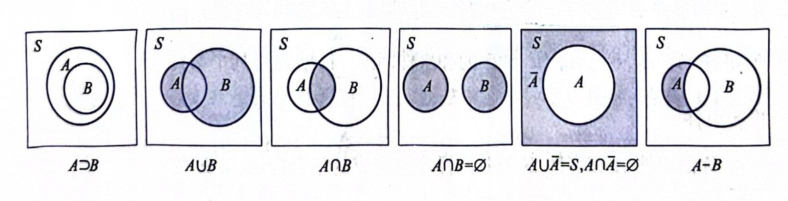
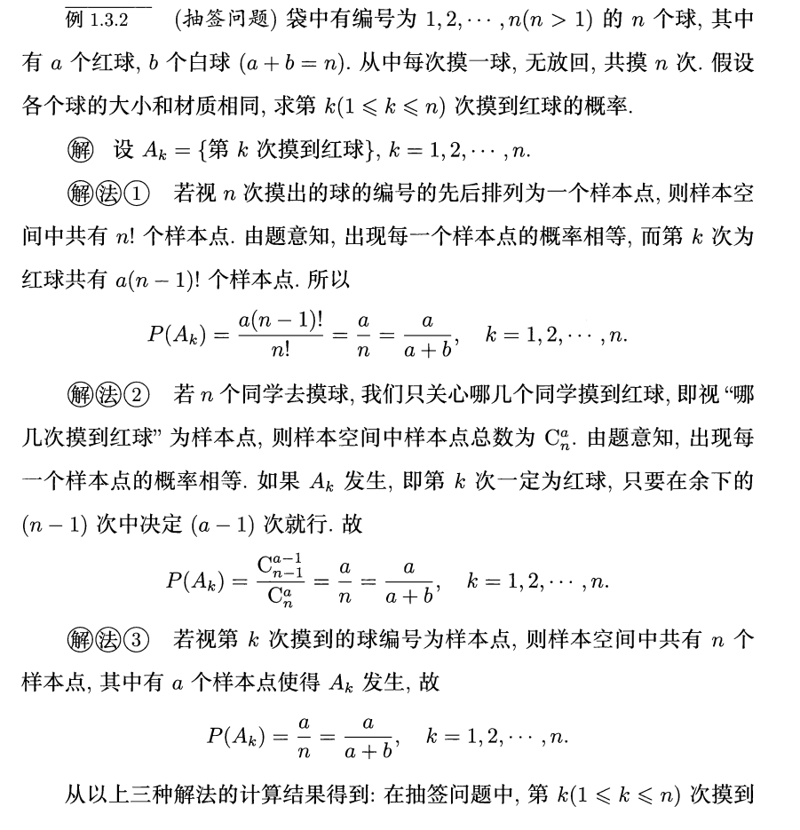
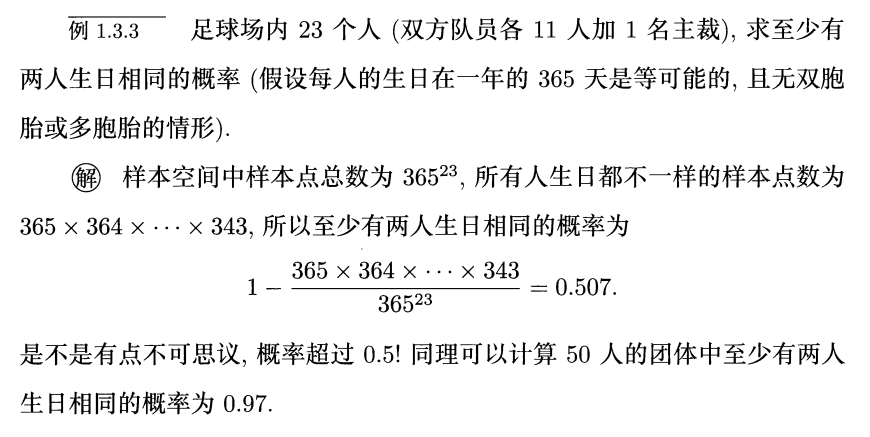
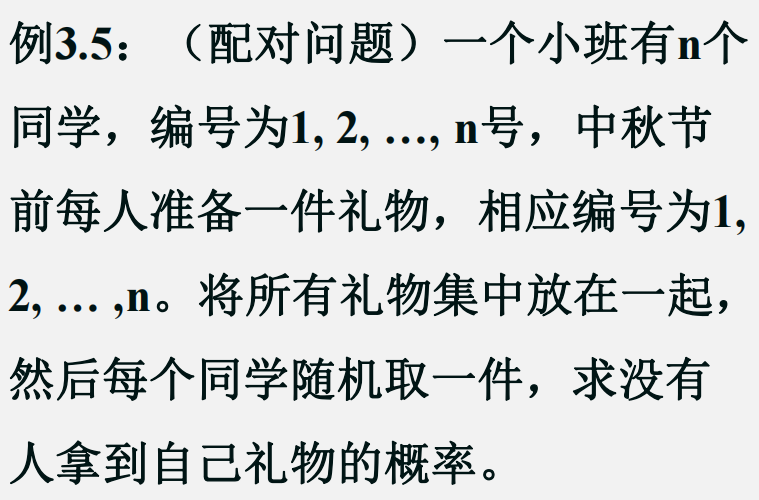
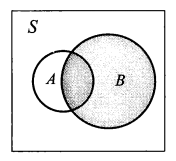
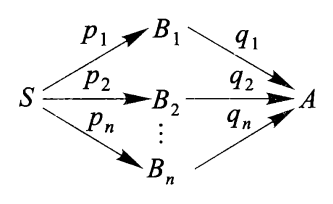
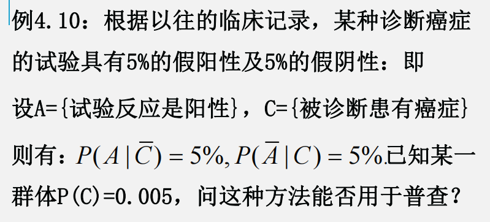
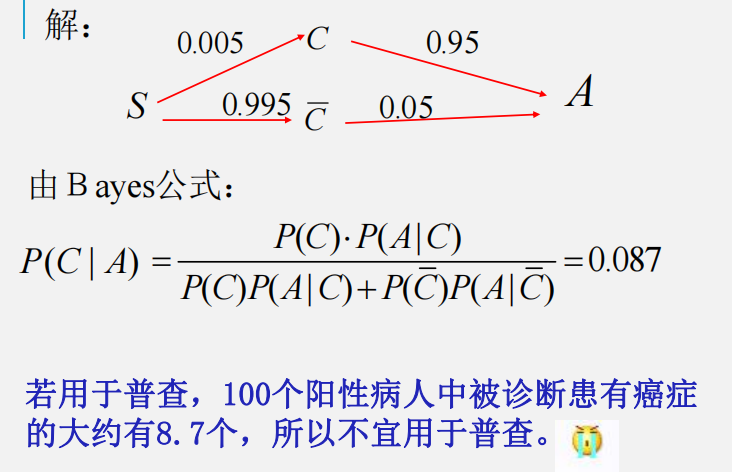
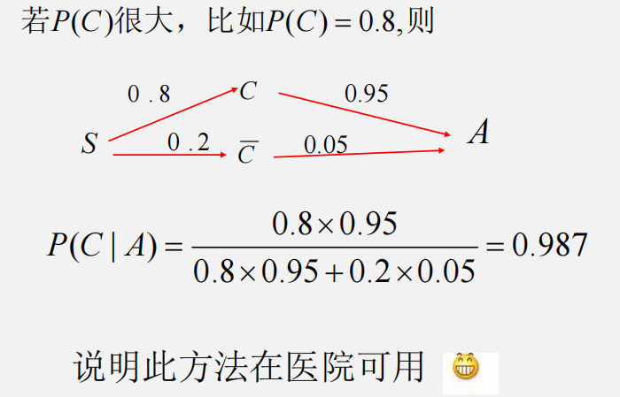

# 第1章 概率论的基本概念

## 样本空间，随机事件

### 概念

**随机试验**的特点：

- 可以在相同的条件下**重复**进行
- 每次试验可能出现的结果是不确定的，但能**事先知道**试验的**所有可能结果**
- 每次试验完成前**不能预知**哪一个结果会发生

---
- 样本空间：随机试验的所有可能结果构成的集合，包括：
    - 有限样本空间
    - 无限样本空间
        - [可数](../dm/2.md/#countable-sets)（与自然数集一一对应）
        - 不可数（任意实数区间）
- 样本点：随机试验的每一个结果
- 随机事件（简称事件）：样本空间的任一子集
- 基本事件：只含有一个样本点的事件
- 事件发生：试验所出现的结果（即样本点）属于某一事件，即这一事件所包含的样本点恰好为此次试验的结果
- 样本空间$S$可视为一事件，这样的事件必定发生，被称为**必然事件**
- 空集$\emptyset$也可视为一事件，被称为**不可能事件**

### 基本运算

- 包含/包含于：$A \supset B/B \subset A$
- 相等：$A = B \Leftrightarrow (A \subset B) \wedge (B \subset A)$
- 和事件：$A \cup B = \{x: x \in A \ \mathrm{or}\ x \in B\}$
    - 有限个事件：$\bigcup\limits_{i=1}^n A_i$
    - 无限个事件：$\bigcup\limits_{i=1}^{+\infty} A_i$
- 积事件：$A \cap B = AB = \{x: x \in A \ \mathrm{and}\ x \in B\}$
    - 有限个事件：$\bigcap\limits_{i=1}^n A_i$
    - 无限个事件：$\bigcap\limits_{i=1}^{+\infty} A_i$
- 互不相容/互斥：$A \cap B = \emptyset$
- 逆事件/对立事件：$(A \cap B = \emptyset) \wedge (A \cup B = S)$，记作 $\overline{A}$，即 $\overline{A} = \{x: x \notin A\}$
- 差事件：$A - B = A \cap \overline{B} = \{x: x \in A \wedge x \notin B\}$

维恩图：

    

---
运算规则：

- 交换律：
    - $A \cup B = B \cup A$
    - $A \cap B = B \cap A$
- 结合律
    - $A \cup (B \cup C) = (A \cup B) \cup C$
    - $A \cap (B \cap C) = (A \cap B) \cap C$
- 分配律
    - $A \cap (B \cup C) = (A \cap B) \cup (A \cap C)$
    - $A \cup (B \cap C) = (A \cup B) \cap (A \cup C)$
- 德摩根定律
    - $\overline{\bigcup\limits_{j=1}^n A_j} = \bigcap\limits_{j=1}^n \overline{A_j}$
    - $\overline{\bigcap\limits_{j=1}^n A_j} = \bigcup\limits_{j=1}^n \overline{A_j}$

## 频率与概率

### 频率

- 频数$n_A$：事件$A$在$n$次重复试验中发生的次数（$0 \le n_A \le n$）
- 频率$f_n(A) = \dfrac{n_A}{n}$

频率的性质：

- 对任一事件$A$，$0 \le f_n(A) \le 1$
- $f_n(S) = 1$
- 若$A \cap B = \emptyset$，则 $f_n(A \cup B) = f_n(A) + f_n(B)$
    - 扩展版：若$A_1, A_2, \dots, A_k(k \ge 3)$两两互斥时，
    $$
    f_n(\bigcup\limits_{j=1}^k A_j) = \sum\limits_{j=1}^kf_n(A_j)
    $$

### 概率

- 定义1：$A$的频率$f_n(A)$的稳定值$p$被认为是事件$A$的概率。
- :star:定义2：设样本空间$S$的任一事件$A$，定义一个实数$P(A)$，若它满足以下三条公理：
    - 非负性：$P(A) \ge 0$
    - 规范性：$P(S) = 1$
    - 可列可加性：对$S$中可列个两两互斥的事件$A_1, A_2, \dots, A_n, \dots$（即$A_iA_j=\emptyset, i \ne j, i, j = 1, 2, \dots$），有$P(\bigcup\limits_{j=1}^{+\infty}A_j) = \sum\limits_{j=1}^{+\infty}P(A_j)$

    则称$P(A)$为事件$A$发生的概率。

根据定义2，可以引申出以下性质：

- 有限可加性：对于有限个两两互斥的事件，有$P(\bigcup\limits_{j=1}^{n}A_j) = \sum\limits_{j=1}^{n}P(A_j)$
- $P(A) = 1 - P(\overline{A})$
- $P(\emptyset) = 0$
- 当$A \supset B$时，$P(A-B) = P(A) - P(B) \Rightarrow P(A) \ge P(B)$
- $P(A) \le P(S) = 1$
- $P(A \cup B) = P(A) + P(B) - P(AB)$
    - 推广（[容斥原理](../dm/8.md#inclusion-exclusion)）：

    $$
    \begin{align}
    P(\bigcup\limits_{j=1}^n A_j) = & \sum\limits_{j=1}^nP(A_j) - \sum\limits_{i < j}(A_iA_j) + \sum\limits_{i < j < k}P(A_iA_jA_k) - \dots + \notag \\
    & (-1)^{n-1}P(A_1A_2 \dots A_n),\quad n \ge 1 \notag
    \end{align}
    $$
 

## 等可能概型

一个随机试验，如果满足下列性质：

- 有限性：样本空间的样本点数有限
- 等可能性：每一个样本点出现的概率相等

那么称这个试验为**等可能概型/古典概型**

若样本空间为$S = \{e_1, e_2, \dots, e_n\}(n \ge 1)$，随机事件$A = \{e_{i_1}, e_{i_2}, \dots, e_{i_l}\}$，其中$i_1, \dots, i_l$是$1, 2, \dots, n$中某$l(l \ge 1)$个不同的值，则：

$$
P(A) = P(\bigcup\limits_{j=1}^l\{e_{i_j}\}) = \sum\limits_{j=1}^lP(\{e_{i_j}\}) = \dfrac{l}{n}
$$

??? example "例题"

    === "例1"

        

            
            
        

    === "例2"

        

            
        

    === "例3"

        

            
        

        这个问题就是离散数学讲到过的[错排问题](../dm/8.md#derangements)(derangement)，这里就不具体展开分析了。

实际推断原理：概率很小的事件，在一次试验中几乎是不可能发生的。

## 条件概率

**条件概率**的定义：如果$P(B) > 0$，那么在$B$发生的情况下$A$发生的条件概率为：

$$
P(A | B) = \dfrac{P(AB)}{P(B)}
$$

可以将条件概率$P(A|B)$理解为在**缩小的样本空间**$B$内，事件$A$发生的概率，下面用维恩图表示这种条件概率：

    

条件概率相关的性质（假定$P(C) \ne 0$）：

- $P(A|C) \ge 0$
- $P(S|C) = 1$
- $P(B|C) = 1 - P(\overline{B}|C)$
- 当$A \supset B$时，$P(A|C) \ge P(B|C)$
- $P(A \cup B | C) = P(A|C) + P(B|C) - P(AB|C)$
- 特别地，若$AB = \emptyset$，则$P(A \cup B | C) = P(A|C) + P(B|C)$

??? example "例题"

    === "问题"

        

            
        

    === "答案"

        不难想到，将一枚硬币抛3次会产生8种不同的可能（$2 \times 2 \times 2$），每种可能都是等概率的。但是题目要求从6个人里等概率地挑选一个，那么可以先将8种可能编个号（1-8号），6个人分别拿到前6个号，剩下2个号“作废”。之后如果遇到后两种情况，就当这次试验失败，重新再抛硬币，直到出现的情况在1-6号之间。由条件概率知（样本空间缩小至6个样本），这样做可以确保6个人有相同被选中的概率。

### 乘法公式

当$P(A) \ne 0, P(B) \ne 0$时，称下面的等式为**乘法公式**：

$$
P(AB) = P(A) \cdot P(B|A) = P(B) \cdot P(A|B)
$$

推广到n个事件：当$P(A_1A_2 \dots A_{n-1}) \ne 0(n \ge 3)$时，有：

$$
P(A_1A_2 \dots A_n) = P(A_1)P(A_2|A_1)P(A_3|A_1A_2)\dots P(A_n|(A_1A_2 \dots A_{n-1})
$$

在条件概率中，乘法公式依然成立（$P(AC) \ne 0$）：

$$
P(AB|C) = P(A|C) \cdot P(B|AC)
$$

### 全概率公式、贝叶斯公式

设$S$为某一随机试验的样本空间，$B_1, B_2, \dots, B_n$为该试验的一组事件，且满足：

- 不重：$B_iB_j = \emptyset, i, j = 1, 2, \dots, n, i \ne j$
- 不漏：$B_1 \cup B_2 \cup \dots \cup B_n = S$

则称$B_1, B_2, \dots, B_n$为$S$的一个**划分**（或**完备事件组**）

>注：离散数学“Relations”一章提到过这个[概念](../dm/9.md#equivalence-classes-and-partitions)哦\~（~~所以直接从离散数学那边挖一张图过来~~）

    

**全概率公式**：设$S$为某一试验的样本空间，若$B_1, B_2, \dots, B_n$是$S$的一个划分，且$P(B_j) > 0, j = 1, 2, \dots, n$，则对任一事件$A$，有

$$
P(A) = \sum\limits_{j=1}^n P(B_j)P(A|B_j)
$$

设$P(B_j) = p_j$，$P(A|B_j) = q_j, j = 1, 2, \dots, n$，则$P(A) = \sum\limits_{j=1}^np_jq_j$，对应的图示分析如下，看上去会更加直观：

    

**贝叶斯(Bayes)公式**（逆概公式）：

$$
P(B_k|A) = \dfrac{P(B_kA)}{P(A)} = \dfrac{P(B_k)P(A|B_k)}{\sum\limits_{j=1}^nP(B_j)P(A|B_j)}, k = 1, 2, \dots, n
$$

在贝叶斯公式中，$P(B_j)(j = 1, 2, \dots, n)$往往是已知或事先假设的，因此被称为**先验概率**；而当事件$A$发生后，对$B_j$发生的概率重新进行推断或修正，因此称$P(B_j|A)$为**后验概率**。

??? example "例题"

    === "问题"

        

            
        

    === "答案"

        

            
        

        

            
        

## 事件的独立性与独立检验

设$A, B$为两随机事件，当

$$
P(AB) = P(A) \cdot P(B)
$$

时，称事件$A, B$**相互独立**。当$P(A) \cdot P(B) \ne 0$时，事件$A, B$相互独立等价于**条件概率 = 无条件概率**，即

$$
P(B|A) = P(B) \quad \mathrm{or} \quad P(A|B) = P(A)
$$

若$A, B$相互独立，则$A$与$\overline{B}$，$\overline{A}$与$B$，$\overline{A}$与$\overline{B}$相互独立。

推广：

- 设$A, B, C$为三个随机事件，当

    $$
    \begin{align}
    P(AB) & = P(A)P(B) \notag \\
    P(AC) & = P(A)P(C) \notag \\
    P(BC) & = P(B)P(C) \notag
    \end{align}
    $$

    均成立时，称事件$A, B, C$**两两独立**，若同时还满足

    $$
    P(ABC) = P(A)P(B)P(C)
    $$

    则称事件$A, B, C$**相互独立**。

    !!! warning "注意"

        相互独立 $\Rightarrow$ 两两独立，但两两独立 $\not \Rightarrow$ 相互独立

- 设$n$个事件$A_1, A_2, \dots, A_n(n \ge 2)$，若对其中任意$k$个事件$A_{i_1}, A_{i_2}, \dots, A_{i_k}$，都有

    $$
    P(A_{i_1}, A_{i_2}, \dots, A_{i_k}) = \prod\limits_{j = 1}^kP(A_{i_j})
    $$

    成立，则称事件$A_1, A_2, \dots, A_n$**相互独立**。

---
- **独立试验**：试验结果互不影响的一系列试验
- **重复试验**：各个子试验是在相同条件下进行的

