# 第2章 随机变量及其概率分布

??? abstract "核心知识"

    - 离散型随机变量（概率分布律）：二项分布、泊松分布
    - 连续型随机变量（概率分布函数、概率密度函数）：均匀分布、指数分布、正态分布
    - 随机变量函数的分布
        - 关键：寻找等价事件

定义：设随机试验样本空间为$S$，若$X=X(e)$为定义在样本空间$S$上的实值单值函数，$e \in S$，则称$X = X(e)$为**随机变量**。

    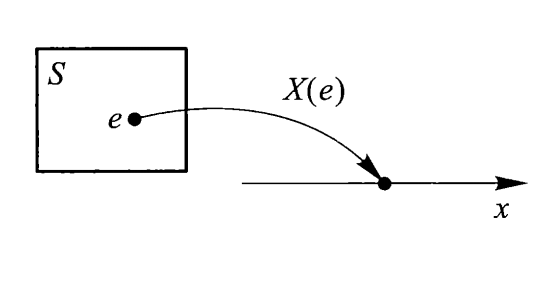

一般用大写字母$X, Y, Z, X_1, X_2, \dots$或$\xi, \eta$来表示随机变量，用小写字母$x, y, z, x_1, x_2, \dots$来表示实数。

## 离散型随机变量

设$X$为离散型随机变量，若其可能取值为$x_1, x_2, \dots, x_k, \dots$，则称

$$
P(X = x_k) = p_k, k = 1, 2, \dots
$$

为$X$的**概率分布律**或概率分布列，简称为$X$的**分布律**(distribute law)。

概率分布律还可用下面的列表法表示：

|$X$|$x_1$|$x_2$|$\dots$|$x_k$|$\dots$|
|:-:|:-:|:-:|:-:|:-:|:-:|
|$p$|$p_1$|$p_2$|$\dots$|$p_k$|$\dots$|

概率分布律的性质：

- $p_k \ge 0, k = 1, 2, \dots$
- $\sum\limits_{k=1}^{+ \infty}p_k = 1$

下面介绍几种重要的离散型随机变量的概率分布。

### 0-1(p)分布

若概率分布律为：

|$X$|$0$|$1$|
|:-:|:-:|:-:|
|$p$|$1-p$|$p$|

（或者写成$P(X = k) = p^k(1-p)^{1-k}, k = 0, 1$）

其中$0 < p < 1$，称$X$服从参数为$p$的**0-1分布**，也称为**两点分布**，并用记号$X \sim \text{0-1}(p)$表示。

0-1分布就是n=1的二项分布。

### 二项分布

定义：设在$n$次独立重复试验中，每次试验都只有两个结果：$A, \overline{A}$，且每次试验中$A$发生的概率不变。记$P(A) = p, 0 < p < 1$，称这一系列试验为**$n$重伯努利试验**。

若概率分布律为：

$$
P(X = k) = C_n^k p^k (1-p)^{n-k}, k = 0, 1, 2, \dots, n
$$

其中$0 < p < 1, n \ge 1$，则称$X$服从参数$(n, p)$的**二项分布**(binomial distribution)，记为$X \sim B(n, p)$。因此二项分布是n重伯努利试验的概率分布律。

### 泊松分布

若概率分布律为：

$$
P(X = k) = \dfrac{e^{- \lambda}\lambda^k}{k!}, k = 0, 1, 2, \dots
$$

其中$\lambda > 0$，则称$X$服从参数为$\lambda$的**泊松分布**(Poisson distribution)，记为$X \sim P(\lambda)$。

下图展示了$\lambda = 1, 2$和$5$时泊松分布概率分布律的折线图：

    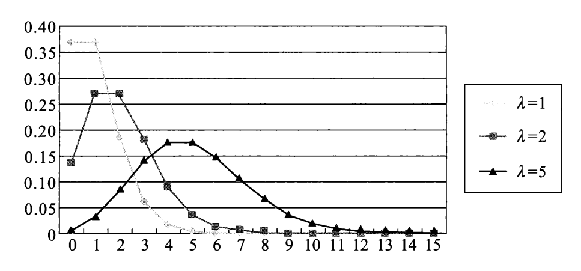

当$n$足够大，$p$充分小（$p < 0.1$），且$np$保持适当大小时，参数为$(n, p)$的二项分布也可以用泊松分布近似描述，即：

$$
C_n^k p^k (1-p)^{n-k} \approx \dfrac{e^{- \lambda}\lambda^k}{k!}
$$

其中$\lambda = np$。

??? example "例子：二项分布与泊松分布概率分布律的比较"

    

        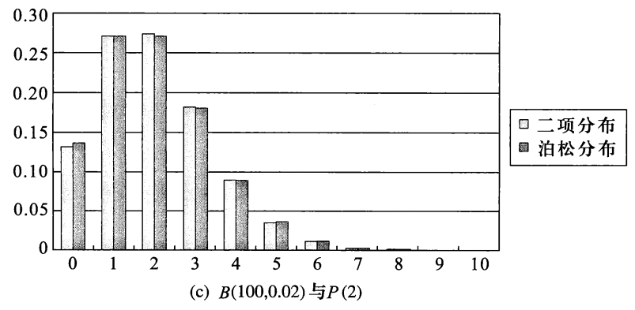
    

??? info "补充：其他分布"

    注：仅作了解即可，考试不考。

    - **超几何分布**(hypergeometric distribution)
        - 概率分布律：

            $$
            P(X = k) = \dfrac{C_a^kC_b^{n - k}}{C_N^n}, k = l_1, l_1 + 1, \dots, l_2
            $$

            其中$l_1 = \max\{0, n - b\}, l_2 = \min\{a, n\}$

        - 记作$X \sim H(n, a, N)$
        - 概率分布律柱形图：

            

                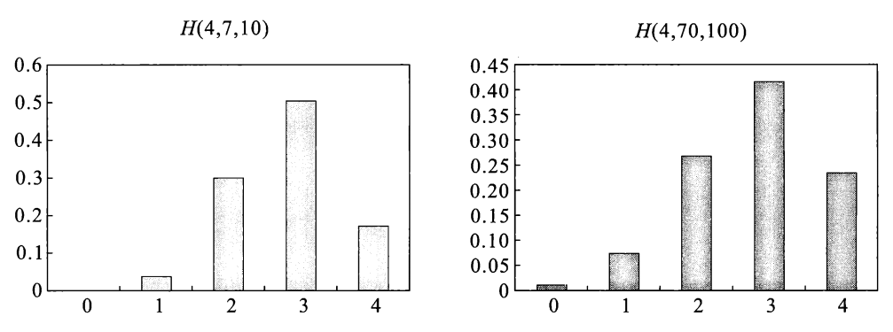
            

        - 例子：有$N$个球，其中有$a$个白球和$b$个红球（$a + b = N$），从中无放回地取$n(n \le N)$个球，设每次取到各球的概率相等，令随机变量$X$为取到的白球个数，$X$服从超几何分布。

    - **几何分布**(geometric distribution)
        - 概率分布律：

            $$
            P(X = k) = p(1 - p)^{k-1}, k = 1, 2, \dots
            $$
        
        - 概率分布律折线图：

            

                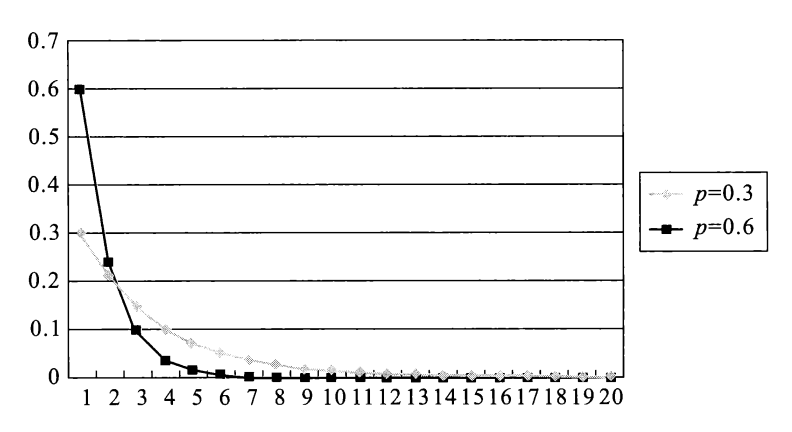
            

        - 例子：在$n$重伯努利试验中，有两个结果$A$和$\overline{A}$，记$X$为$A$首次发生所需要的试验次数，则$X$服从几何分布。

    - **帕斯卡分布**（负二项分布）
        - 概率分布律：

            $$
            \begin{align}
            P(X = k) & = P\{前 k - 1 次中恰有 r - 1 次发生，且第 k 次 A 发生\} \notag \\
            & = C_{k - 1}^{r - 1}p^r(1-p)^{k - r}, k = r, r + 1, r + 2, \dots \notag
            \end{align}
            $$

            其中 $r \ge 1$

        - 记作$NB(r, p)$
        - 概率分布律的折线图

            

                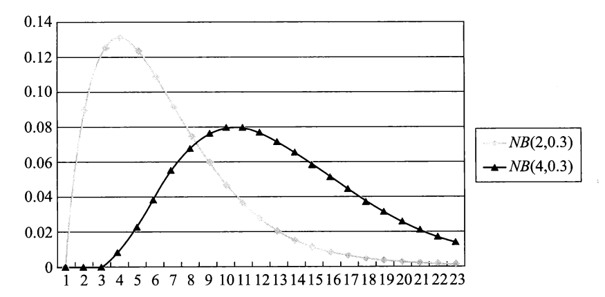
            

        - 例子：仍然在$n$重伯努利实验中，令$X$为$A$发生$r$次时所需的试验次数，$X$服从帕斯卡分布。

## 随机变量的概率分布函数

设$X$为一随机变量，$x$为任意实数，函数

$$
F(x) = P(X \le x)
$$

称为随机变量$X$的**概率分布函数**，简称**分布函数**(distribution function)。对任意实数$x_1, x_2(x_1 < x_2)$，有：

$$
P(x_1 < X \le x_2) = P(X \le x_2) - P(X \le x_1) = F(x_2) - F(x_1)
$$

几何意义：将$X$设想为数轴上一随机点，那么$X$落在区间$(-\infty, x]$上的概率即为$F(x)$，如下图所示：

    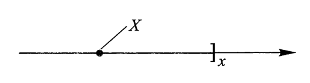

若$X$为**离散型**随机变量，设概率分布律为$P(X = x_i) = p_i, i = 1, 2, \dots$，则$X$的分布函数为：

$$
F(x) = P(X \le x) = \sum\limits_{x_i \le x}P(X = x_i)
$$

:star:分布函数的性质：

- $F(x)$单调不减
- $0 \le F(x) \le 1$，且有$\lim\limits_{a \rightarrow -\infty}F(a) = 0, \lim\limits_{b \rightarrow +\infty}F(b) = 1$，简记为$F(-\infty) = 0, F(+\infty) = 1$
- $F(x + 0) = F(x)$，即$F(x)$是**右连续**函数

下面两张图分别为离散型和连续型随机变量的分布函数曲线：

    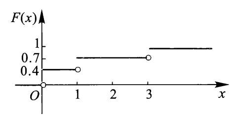
    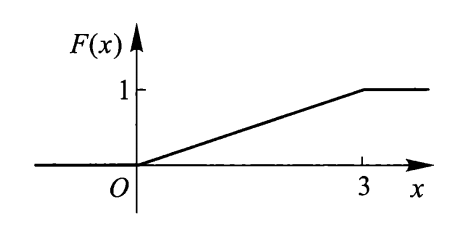

## 连续型随机变量

对于随机变量$X$，其分布函数为$F(x)$，若存在一个非负的实值函数$f(x)$，$-\infty < x < +\infty$，使得对任意实数$x$，有：

$$
F(x) = \int_{-\infty}^x f(t) \text{d}t
$$

则称$X$为**连续型随机变量**，称$f(x)$为$X$的**概率密度函数**(probability density function)，简称密度函数。

易知此时分布函数$F(x)$是连续的，它的几何意义为$f(x)$的曲线与x轴所围成的面积：

    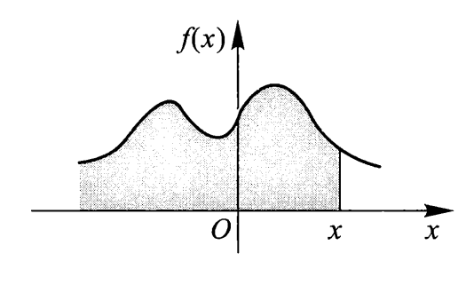

密度函数的性质：

- $f(x) \ge 0$

:star: $\int_{-\infty}^{+\infty}f(x)\text{d}x = 1$ 

- 对任意实数$x_1, x_2(x_1 < x_2)$
    $$
    P(x_1 < X \le x_2) = F(x_2) - F(x_1) = \int_{x_1}^{x_2}f(t)\text{d}t
    $$

    几何意义见下图：

    

        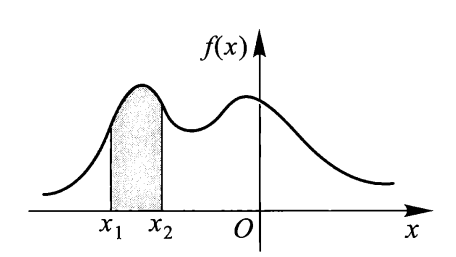
    

    - 由该性质易证$P(X = a) = 0$，即连续型随机变量取任一定值的概率为0。因此，连续型随机变量落在开区间与相应闭区间上的概率相等（也就是说无需纠结连续型随机变量区间的开闭问题）。
- 在$f(x)$的连续点$x$处，$F'(x) = f(x)$
    - 由该性质知，在$f(x)$的连续点$x$处，当$\Delta x$充分小时，有
    $$
    P(x < X \le x + \Delta x) \approx f(x)\Delta x
    $$

下面介绍几种重要的连续型随机变量的概率分布。

### 均匀分布

设随机变量$X$具有如下密度函数：

$$
f(x) = \begin{cases}\dfrac{1}{b-a} & , x \in (a, b) \\ 0 & , \text{other cases}\end{cases}
$$

则称$X$服从区间$(a, b)$上**均匀分布**(uniform distribution)，记为$X \sim U(a, b)$。此时$X$的分布函数为：

$$
F(x) = \begin{cases}0 & , x < a \\ \dfrac{x - a}{b - a} & , a \le x < b \\ 1 & , x \ge b\end{cases}
$$

密度函数和分布函数的曲线如下所示：

    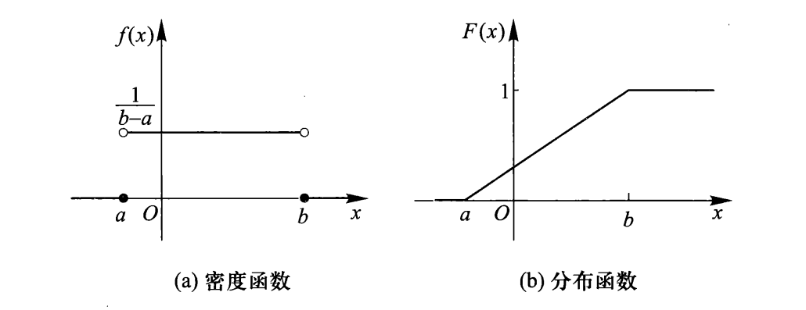

设有实数$c, l$，满足$a \le c < c + l \le b$，则：

$$
P(c < X < c + l) = \int_c^{c + l} \dfrac{1}{b - a} \text{d}x = \dfrac{l}{b - a}
$$

可以看到，该结果与$c$无关，而与$l$成正比。其几何意义是：$X$落在区间$(a, b)$内任一长度为$l$的子区间的概率为子区间的长度与该区间的长度之比。

### 指数分布

设随机变量$X$具有密度函数：

$$
f(x) = \begin{cases}\lambda e^{-\lambda x} & , x > 0 \\ 0 & , x \le 0\end{cases}
$$

其中$\lambda > 0$，则称$X$服从参数为$\lambda$的**指数分布**(exponential distribution)，记为$X \sim E(\lambda)$

下图展示了不同$\lambda$值下的密度函数曲线：

    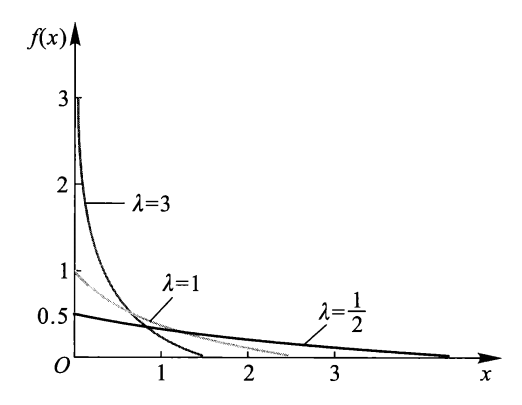

指数分布的分布函数为：

$$
F(x) = \begin{cases}1 - e^{-\lambda x} & , x > 0 \\ 0 & , x \le 0\end{cases}
$$

:star:重要性质——“**无记忆性**”：当$X \sim E(\lambda)$时，对$\forall\ t > 0, t_0 > 0$，有：

$$
\begin{align}
P(X > t_0 + t\ |\ X > t_0) & = \dfrac{P(X > t_0 + t)}{P(X > t_0)} = \dfrac{1 - F(t_0 + t)}{1 - F(t_0)} \notag \\
& = e^{-\lambda t} = P(X > t) \notag
\end{align}
$$

改写成：

$$
P(X > t_0 + t) = P(X > t_0) \cdot P(X > t)
$$

用具体的例子类比：

- 若$X$表示等待时间，那么无记忆性说明只要还没等到，那么剩余等待时间仍然服从参数为$\lambda$的指数分布
- 若$X$表示元件寿命，那么无记忆性说明只要还没坏掉，那么剩余寿命仍然服从参数为$\lambda$的指数分布

### 正态分布

设随机变量$X$具有密度函数：

$$
f(x) = \dfrac{1}{\sqrt{2 \pi}\sigma}e^{-\frac{(x - \mu)^2}{2\sigma^2}}, -\infty < x < +\infty
$$

其中$-\infty < \mu < +\infty, \sigma > 0$，则称$X$服从参数为$(x, \mu)$的**正态分布**(normal distribution)，简称$X$为**正态变量**，记为$X \sim N(\mu, \sigma^2)$。

密度函数曲线如下，它的特点是$f(x)$值中间大，两头小，且是对称的：

    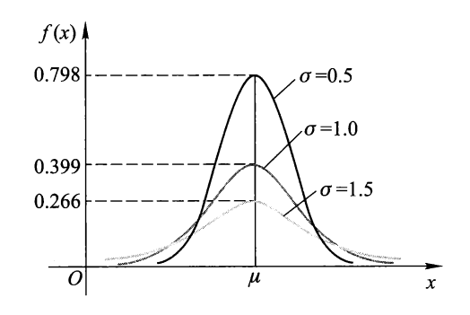

其中：

- $\mu$为**位置参数**，它决定密度函数对称轴的位置以及$X$取值集中的位置
- $\sigma$为**尺度参数**，它是一个反映$X$取值分散程度的一个指标量，其值越大，曲线峰越低，越扁平

密度函数的性质：

- $f(x)$关于$x = \mu$对称
- $\max\limits_{-\infty < x < +\infty}f(x) = f(\mu) = \dfrac{1}{\sqrt{2 \pi} \sigma}$
- $\lim\limits_{|x - \mu| \rightarrow + \infty} f(x) = 0$

正态分布的分布函数为：

$$
F(x) = \int_{-\infty}^x \dfrac{1}{\sqrt{2 \pi} \sigma}e^{-\frac{(t - \mu)^2}{2\sigma^2}} \text{d}t
$$

当$X \sim N(\mu, \sigma^2)$时，对任意实数$a, b(a < b)$，有：

$$
P(a < X < b) = \int_a^b\dfrac{1}{\sqrt{2 \pi} \sigma}e^{-\frac{(x - \mu)^2}{2\sigma^2}} \text{d}x
$$

#### 标准正态分布

特别地，当$\mu = 0, \sigma = 1$时，记正态变量为$Z$，那么$Z \sim N(0, 1)$，称$Z$服从**标准正态分布**

- 密度函数：$\varphi (x) = \dfrac{1}{\sqrt{2\pi}}e^{-\frac{x^2}{2}}, - \infty < x < + \infty$
- 分布函数：$\Phi(x) = \int_{- \infty}^x \dfrac{1}{\sqrt{2\pi}}e^{-\frac{t^2}{2}} \text{d} t$
- 密度函数（左图）和分布函数（右图）的曲线图如下：

    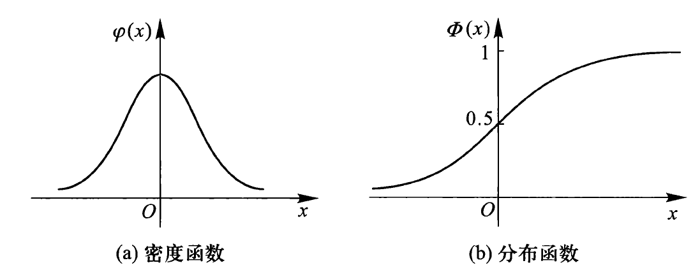

性质：

- 密度函数关于$y$轴对称
- $\Phi(x) + \Phi(-x) = 1$
- 当$X \sim N(\mu, \sigma^2)$时，对任意实数$a, b(a < b)$，令$t = \dfrac{x - \mu}{\sigma}$，得：

    $$
    P(a < X < b) = \int_{\frac{a - \mu}{\sigma}}^{\frac{b - \mu}{\sigma}}\dfrac{1}{\sqrt{2\pi}}e^{-\frac{t^2}{2}} \text{d} t
    $$

    此时被积函数为标准正态分布的密度函数（$Y = \dfrac{X - \mu}{\sigma} \sim N(0, 1)$），故：

    $$
    P(a < X < b) = \Phi(\dfrac{b - \mu}{\sigma}) - \Phi(\dfrac{a - \mu}{\sigma})
    $$

    所以，==一般正态分布的计算 -> 标准正态分布的计算==

??? abstract "标准正态分布函数值表"

    

        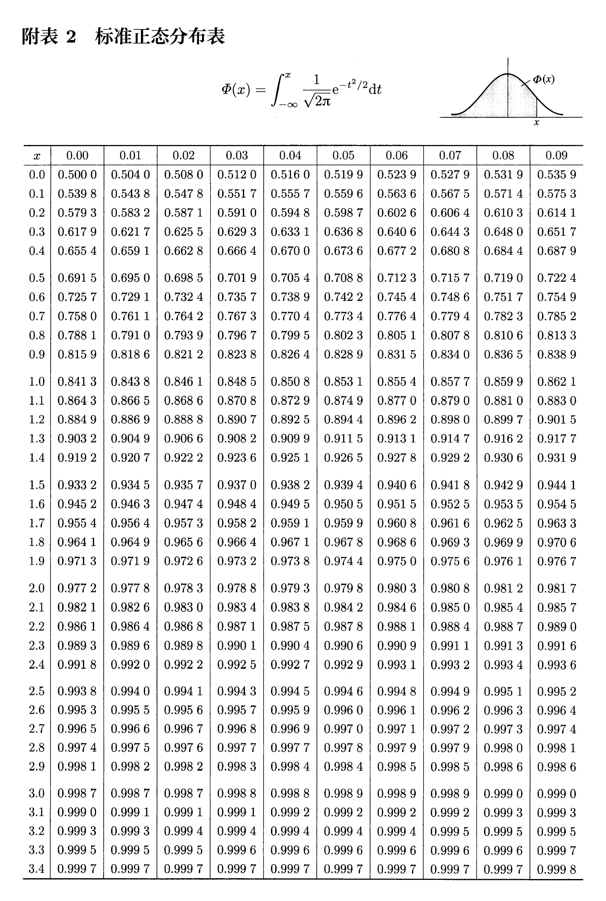
    

---
若$X \sim N(\mu, \sigma^2)$，则：

$$
P(|X - \mu| < k\sigma) = \Phi(k) - \Phi(-k) = 2\Phi(k) - 1
$$

当$k = 1, 2, 3$时，其值分别为$0.6826, 0.9544, 0.9974$。它们相对比较常用，对于其他$k$值，可以用上面给出的公式计算，然后再查上面的表找到对应值。

    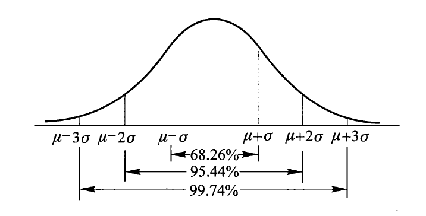

## 随机变量函数的分布

若已知$X$的分布，$Y = g(X)$，求$Y$的概率分布的步骤：

- **离散型**随机变量：
    - 先列出$Y$的所有可能取值$y_1, y_2, \dots, y_k, \dots$
    - 然后找出事件$\{Y = y_k\}$的等价事件$\{X \in D_k\}$
    - 从而求出$Y$的**概率分布律**$P(Y = y_k) = P(X \in D_k)$
- **连续型**随机变量：
    - 先写出$Y$的概率分布函数：$F_Y(y) = P(Y \le y)$
    - 然后找出$\{Y \le y\} = \{g(X) \le y\}$的等价事件$\{X \in D\}$，得$F_Y(y) = P(X \in D) =$对应的$X$的概率分布函数
    - 再求出$Y$的**概率密度函数**$f_Y(y)$（一般是对$F_Y(y)$**求导**）

:star:关键是**找出等价事件**

---
结论：设随机变量具有密度函数$f_X(x)$，令$Y = |X|, Z = X^2$，它们的概率密度函数分别为：

$$
\begin{align}
f_Y(y) & = \begin{cases}f_X(y) + f_X(-y) &, y > 0 \\ 0 &, y \le 0\end{cases} \notag \\
f_Z(z) & = \begin{cases}\dfrac{1}{2 \sqrt{z}}(f_X(\sqrt{z}) + f_X(-\sqrt{z})) &, z > 0 \\ 0 &, z \le 0\end{cases} \notag
\end{align}
$$

---
特别地，当$y = g(x)$具有**严格单调性**（严格单增/严格单减）时，记$X$的密度函数为$f_X(x)$，$y = g(x)$的反函数为$x = h(y)$，则$Y$的密度函数为：

$$
f_Y(y) = \begin{cases}f_X(h(y)) \cdot |h'(y)| &, y \in D \\ 0 &, y \notin D\end{cases}
$$

其中$D$为函数$y = g(x)$的值域。

??? example "例题"

    === "题目"

        设$Y = \sin X, X \sim U(0, \pi)$，求$f_Y(y)$

    === "答案"

        

            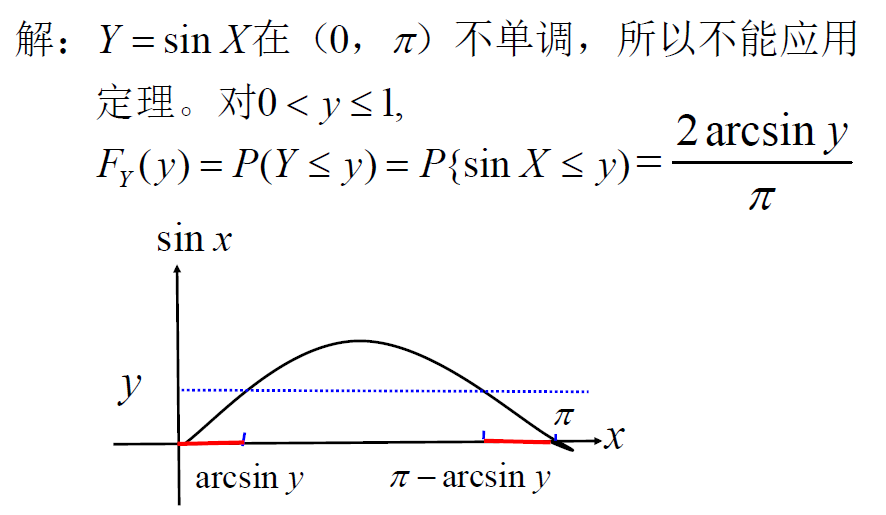
        

        

            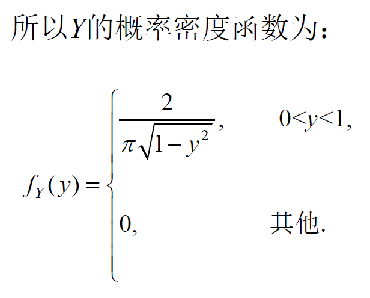
        
