# 第3章 多维随机变量及其分布

## 二维离散型随机变量

二维离散型随机变量：二维随机变量$(X, Y)$的取值有限或可列。

### 联合分布

设二维离散型随机变量$(X, Y)$的可能取值为$(x_i, y_j), i, j = 1, 2, \dots$，称

$$
P(X = x_i, Y = y_j) = p_{ij}, i, j = 1, 2, \dots
$$

为$(X, Y)$的联合概率分布律，简称**联合分布律**(joint distribution law)。它的列表法形式为：

    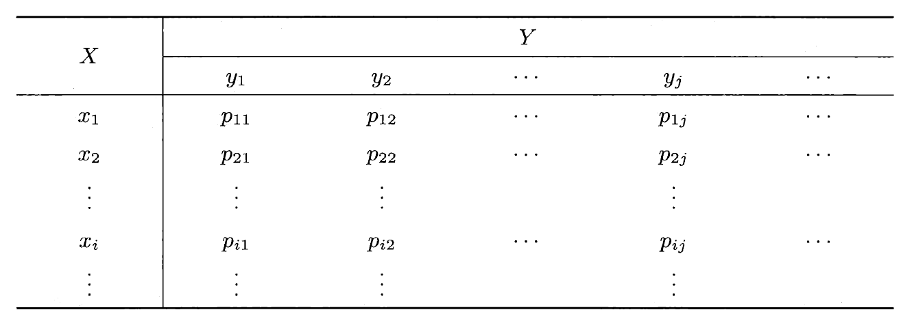

满足的条件有：

- $p_{ij} \ge 0, i, j = 1, 2, \dots$
- $\sum\limits_i \sum\limits_j p_{ij} = 1$

### 边际分布

$$
\begin{align}
P(X = x_i) = P(\bigcup\limits_{j = 1}^{+ \infty}(X = x_i, Y = y_j)) = \sum\limits_{j = 1}^{+ \infty}p_{ij} \overset{\text{def}}{=} p_{i .} \notag \\
P(Y = y_j) = P(\bigcup\limits_{i = 1}^{+ \infty}(X = x_i, Y = y_j)) = \sum\limits_{i = 1}^{+ \infty}p_{ij} \overset{\text{def}}{=} p_{. j} \notag
\end{align}
$$

其中$p_{i .} \ge 0, p_{. j} \ge 0, \sum\limits_{i}p_{i .} = 1, \sum\limits_{j}p_{. j} = 1$

它们分别称为随机变量$X$与$Y$的**边际分布律**(marginal distribution law)或边缘分布律，可以用以下表格表示：

    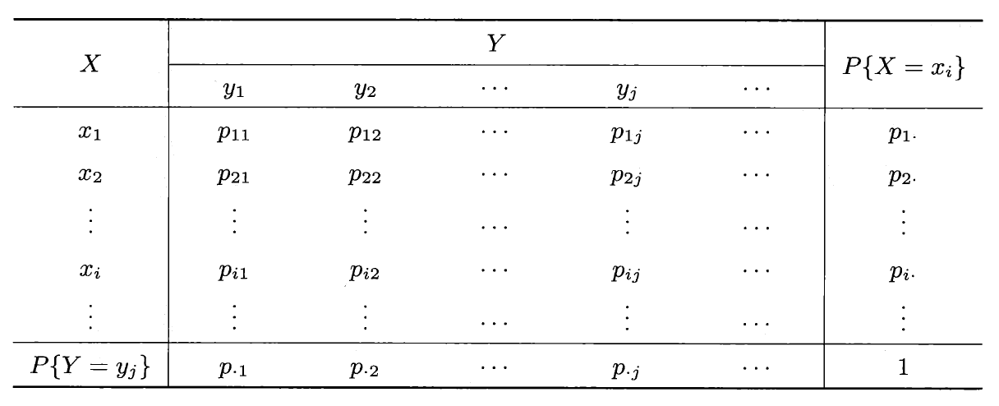

### 条件分布

当$P(Y = y_j) \ne 0$时，

$$
P(X = x_i\ |\ Y = y_i) = \dfrac{P(X = x_i, Y = y_j)}{P(Y = y_j)} = \dfrac{p_{ij}}{p_{. j}}, i = 1, 2, \dots
$$

当$P(X = x_i) \ne 0$时，

$$
P(Y = y_i\ |\ X = x_i) = \dfrac{P(X = x_i, Y = y_j)}{P(X = x_i)} = \dfrac{p_{ij}}{p_{i .}}, j = 1, 2, \dots
$$

其中显然有$\dfrac{p_{ij}}{p_{. j}} \ge 0, \dfrac{p_{ij}}{p_{i .}} \ge 0$，且$\sum\limits_{i = 1}^{+ \infty}\dfrac{p_{ij}}{p_{. j}} = \sum\limits_{j = 1}^{+ \infty}\dfrac{p_{ij}}{p_{i .}} = 1$

称为给定条件$\{Y = y_i\}$条件下$X$/$\{X = x_i\}$条件下$Y$的**条件分布律**(conditional distribution law)。

## 二维随机变量的分布函数

### 联合分布函数

设二维随机变量$(X, Y)$，$\forall\ x, y$，称函数

$$
F(x, y) = P(X \le x, Y \le y)
$$

为$(X, Y)$的**联合分布函数**。

性质：

- 给定$x = x_0$，$F(x_0, y)$关于$y$单调不减；给定$y = y_0$，$F(x, y_0)$关于$x$单调不减

    

        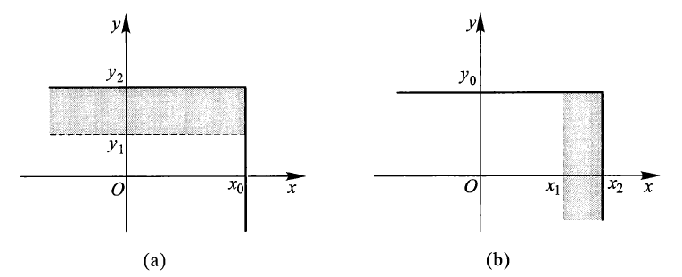
    

- $0 \le F(x, y) \le 1$，且$F(x, -\infty) = F(-\infty, y) = F(-\infty, -\infty) = 0$，$F(+\infty, +\infty) = 1$
- $F(x, y) = F(x + 0, y), F(x, y) = F(x, y + 0)$，即$F(x, y)$关于$x$右连续，关于$y$右连续
- 令$x_2 > x_1, y_2 > y_1$时，有

    $$
    \begin{align}
    & F(x_2, y_2) - F(x_1, y_2) - F(x_2, y_1) + F(x_1, y_1) \notag \\
    = & P(x_1 < X \le x_2, y_1 < Y \le y_2) \ge 0 \notag
    \end{align}
    $$

    

        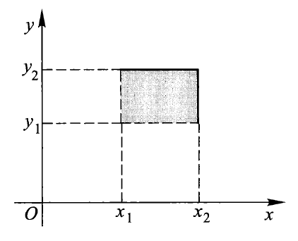
    

### 边际分布函数

记二维随机变量$(X, Y)$的联合分布函数$F(x, y)$，$X, Y$的**边际分布函数**分别为$F_X(x), F_Y(y)$，则：

$$
\begin{align}
F_X(x) = P(X \le x) = P(X \le x, Y \le +\infty) = F(x, +\infty) \notag \\
F_Y(y) = P(Y \le y) = P(X \le +\infty, Y \le y) = F(+\infty, y) \notag
\end{align}
$$

### 条件分布函数

设$(X, Y)$为

- 二维**离散型**随机变量：当$P(X = x_i) \ne 0$时，称函数

    $$
    F_{Y|X}(y | x_i) = P(Y \le y | X = x_i)
    $$

    为给定$\{X = x_i\}$条件下$Y$的**条件分布函数**

- 二维**连续型**随机变量：$\forall x$，若$P(x < X \le x + \delta) > 0, \delta > 0$，$\forall y$，称函数

    $$
    F_{Y|X}(y | x) = \lim\limits_{\delta \rightarrow 0^+}P(Y \le y | x < X \le x + \delta)
    $$

    为给定$\{X = x\}$条件下$Y$的**条件分布函数**

总结：一般地，对于给定实数$x$，若极限

$$
\lim\limits_{\delta \rightarrow 0^+}P(Y \le y | x - \delta < X \le x + \delta) = \lim\limits_{\delta \rightarrow 0^+}P(Y \le y, x - \delta < X \le x + \delta)
$$

对任何实数$y$均存在，则称函数

$$
F_{Y|X}(y | x) = \lim\limits_{\delta \rightarrow 0^+}P(Y \le y | x - \delta < X \le x + \delta) = \lim\limits_{\delta \rightarrow 0^+}\dfrac{P(Y \le y, x - \delta < X \le x + \delta)}{P(x - \delta < X \le x + \delta)}
$$

为给定$\{X = x\}$条件下$Y$的**条件分布函数**，仍记为$P(X \le x | Y = y)$

## 二维连续型随机变量

### 联合分布

设二维随机变量$(X, Y)$的联合分布函数为$F(x, y)$，若存在二元非负函数$f(x, y)$，使对任意的实数$x, y$，有

$$
F(x, y) = \int_{-\infty}^x \int_{-\infty}^y f(u, v) \text{d}u\text{d}v
$$

则称$(X, Y)$为二维连续型随机变量，称$f(x, y)$为**联合密度函数**。

性质：

- $f(x, y) \ge 0$
- $\int_{-\infty}^{+\infty} \int_{-\infty}^{+\infty} f(x, y) \text{d}x\text{d}y = F(+\infty, +\infty) = 1$
- 在$f(x, y)$的连续点处有

    $$
    \dfrac{\partial^2F(x, y)}{\partial x \partial y} = f(x, y) 
    $$

- $(X, Y)$落入$xOy$平面任一区域$D$的概率为

    $$
    P((X, Y) \in D) = \iint\limits_D f(x, y) \text{d}x\text{d}y
    $$
    
    - 当$\Delta x \rightarrow 0^+, \Delta y \rightarrow 0^+$时，可得

    $$
    P(x < X \le x + \Delta x, y < Y \le y + \Delta y) \approx f(x, y)\Delta x \Delta y
    $$

    即$(X, Y)$落在矩形区域$D$的概率近似等于$f(x, y)\Delta x \Delta y$，这也表明$f(x, y)$是描述二维随机变量$(X, Y)$落在点$(x, y)$附近的概率大小的一个量。

### 边际分布

$X$和$Y$的**边际密度函数**分别用$f_X(x), f_Y(y)$表示。

因为：

$$
\begin{align}
F_X(x) & = P(X \le x) = P(X \le x, Y \in (-\infty, +\infty)) \notag \\
& = \int_{-\infty}^x[\int_{-\infty}^{+\infty}f(x, y)\text{d}y]\text{d}x \notag \\
\end{align}
$$

所以：

$$
\begin{align}
f_X(x) & = \int_{-\infty}^{+\infty}f(x, y)\text{d}y \notag \\
f_Y(y) & = \int_{-\infty}^{+\infty}f(x, y)\text{d}x \notag \\
\end{align}
$$

### 条件分布

- 给定$\{X = x\}(f_X(x) \ne 0)$的条件下$Y$的**条件密度函数**为：

$$
f_{Y|X}(y|x) = \dfrac{f(x, y)}{f_X(x)}, -\infty < y < +\infty
$$ 

- 给定$\{Y = y\}(f_Y(y) \ne 0)$的条件下$X$的**条件密度函数**为：

$$
f_{X|Y}(x|y) = \dfrac{f(x, y)}{f_Y(y)}, -\infty < x < +\infty
$$ 

因为：

$$
\begin{align}
F_{X|Y}(x|y) & = \int_{-\infty}^x \dfrac{f(u, y)}{f_Y(y)}\text{d}u \notag \\
& = \lim\limits_{\Delta y \rightarrow 0^+} \dfrac{P(X \le x, y < Y \le y + \Delta y)}{P(y < Y \le y + \Delta y)} \notag \\
& =  \lim\limits_{\Delta y \rightarrow 0^+} \dfrac{\frac{1}{\Delta y}\int_{-\infty}^x \text{d}s \int_y^{y + \Delta y}f(u, v)\text{d}v}{\frac{1}{\Delta y}  \int_y^{y + \Delta y}f(t)\text{d}t} \notag \\
& = \dfrac{\int_{-\infty}^x f(u, y)\text{d}u}{f_Y(y)} = \int_{-\infty}^x\dfrac{f(u, y)}{f_Y(y)}\text{d}u \notag  
\end{align}
$$

所以：

$$
\begin{align}
F_{X|Y}(x|y) & = \int_{-\infty}^x\dfrac{f(u, y)}{f_Y(y)}\text{d}u \notag \\
F_{Y|X}(y|x) & = \int_{-\infty}^y\dfrac{f(x, v)}{f_X(x)}\text{d}v \notag 
\end{align}
$$

:star:性质（以$f_{X|Y}(x|y)$为例）：

- $f_{X|Y}(x|y) \ge 0$
- $\int_{-\infty}^{+\infty}f_{X|Y}(x|y) \text{d}x$ = 1
- $P(a < X < b | Y = y) = \int_a^bf_{X|Y}(x|y) \text{d}x$ 
- 在$f_{X|Y}(x|y)$的连续点$x$，有$\dfrac{\text{d}F_{X|Y}(x|y)}{\text{d}x} = f_{X|Y}(x|y)$
:star2: $f(x, y) = f_{X|Y}(x|y) \cdot f_Y(y) = f_{Y|X}(y|x)\cdot f_X(x)$

??? example "例题"

    === "题目"

        

            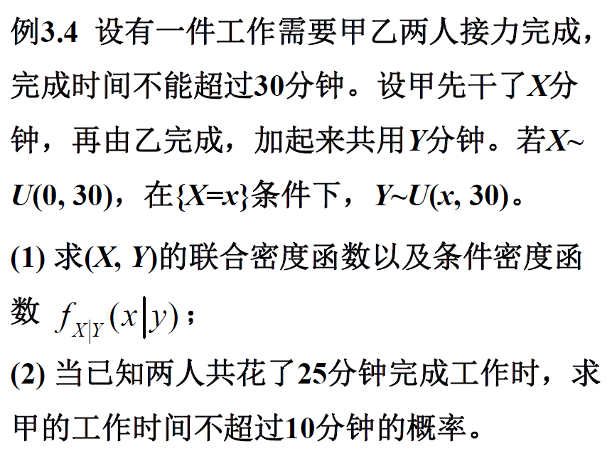
        

    === "答案"

        

            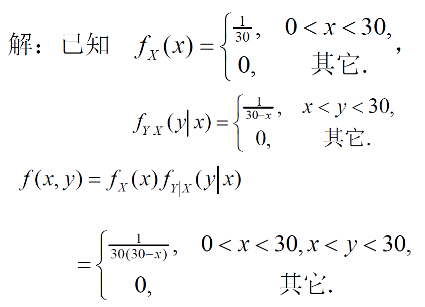
            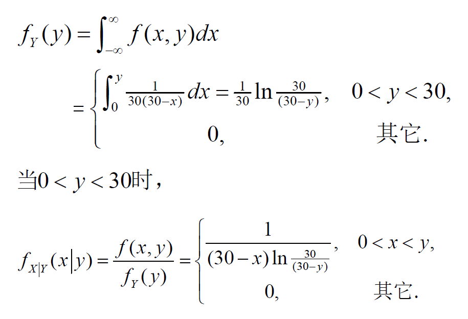
            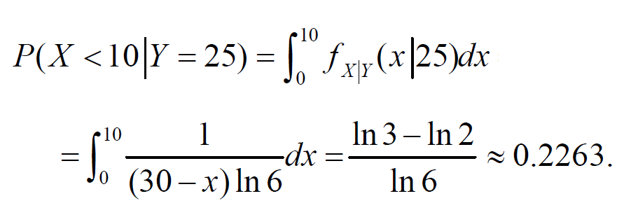
        

### 二元均值分布和二元正态分布

设二维随机变量$(X, Y)$在二维有界区域$D$上取值，且具有联合密度函数：

$$
f(x, y) = \begin{cases}\dfrac{1}{\text{Area of}\ D} &, (x, y) \in D \\ 0 &, 其他\end{cases}
$$

则称$(X, Y)$服从$D$上**均匀分布**。

    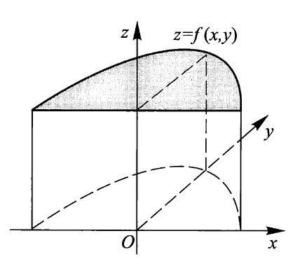

若$D_1$是$D$的一个子集，则可得到$P((X, Y) \in D_1) = \iint\limits_{D_1}f(x, y)\text{d}x\text{d}y$，即$P((X, Y) \in D_1) = \dfrac{\text{Area of}\ D_1}{\text{Area of}\ D}$

---
设二维随机变量$(X, Y)$具有**联合密度函数**：

$$
\begin{align}
f(x, y) = \dfrac{1}{2 \pi \sigma_1 \sigma_2 \sqrt{1 - \rho^2}} \exp \{- \dfrac{1}{2(1 - \rho^2)} [\dfrac{(x - \mu_1)^2}{\sigma_1^2} - \notag \\
2\rho \dfrac{(x - \mu_1)(y - \mu_2)}{\sigma_1 \sigma_2} + \dfrac{(y - \mu_2)^2}{\sigma_2^2}]\} \notag
\end{align}
$$

其中$-\infty < \mu_1 < +\infty, -\infty < \mu_2 < +\infty, \sigma_1 > 0, \sigma_2 > 0, |\rho| < 1$，则称$(X, Y)$服从参数为$(\mu_1, \mu_2; \sigma_1, \sigma_2; \rho)$的**二元正态分布**，记为$(X, Y) \sim N(\mu_1, \mu_2; \sigma_1, \sigma_2; \rho)$

下面展示$N(0, 0;1, 1;\rho)$当$\rho = 0, 0.5, -0.5$时联合密度函数图集鸟瞰图：

    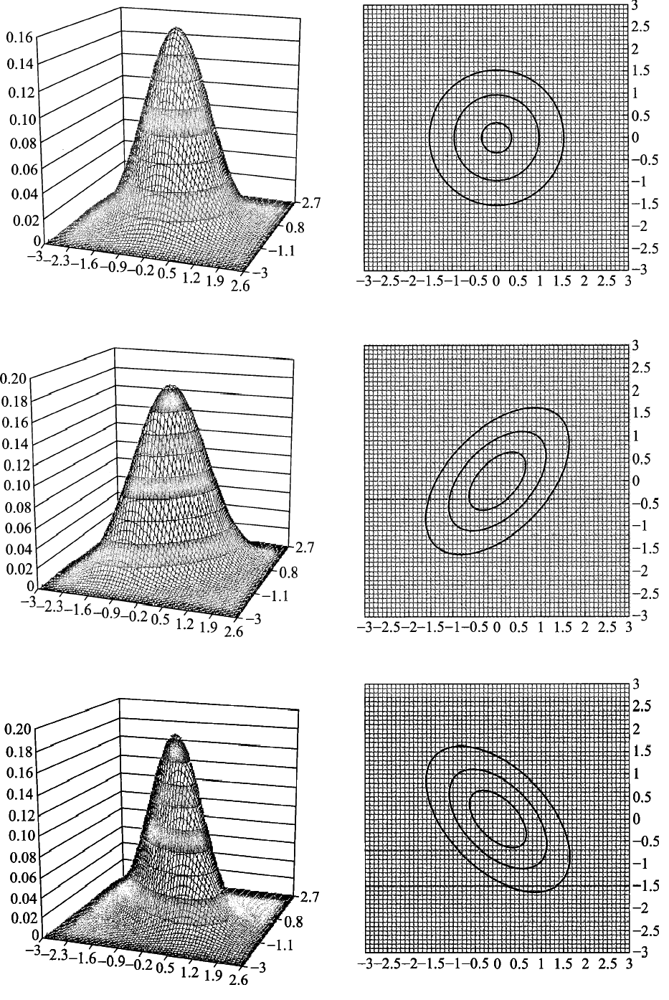

!!! note "注"

    二元均值分布/二元正态分布的边际分布和条件分布仍然是均值分布/正态分布。

??? info "补充：二元正态分布的其他密度函数"

    >注：考试应该不做要求（~~谁能记住这么长串玩意儿啊~~）

    - **边际密度函数**（不依赖于参数$\rho$）：
        - $f_X(x) = \int_{-\infty}^{+\infty}f(x, y)\text{d}y = \dfrac{1}{\sqrt{2\pi}\sigma_1}e^{\frac{(x - \mu_1)^2}{2\sigma_1^2}}$，即$X \sim N(\mu_1, \sigma_1^2)$
        - $f_Y(y) = \int_{-\infty}^{+\infty}f(x, y)\text{d}x = \dfrac{1}{\sqrt{2\pi}\sigma_2}e^{\frac{(y - \mu_2)^2}{2\sigma_2^2}}$，即$Y \sim N(\mu_2, \sigma_2^2)$

    - **条件密度函数**：
        - 在$\{X = x\}$的条件下，$Y$的条件分布为$N(\mu_2 + \rho \dfrac{\sigma_2}{\sigma_1}(x - \mu_1), (1 - \rho^2)\sigma_2^2)$，即：

        $$
        \begin{align}
        f_{Y|X}(y|x) & = \dfrac{f(x, y)}{f_X(x)} \notag \\
        & = \dfrac{1}{\sqrt{2\pi}\sigma_2\sqrt{1 - \rho^2}}\exp\{\dfrac{-1}{2(1 - \rho^2)\sigma_2^2}[y - (\mu_2 + \rho\dfrac{\sigma_2}{\sigma_1}(x - \mu_1))]^2\} \notag 
        \end{align}
        $$

        - 在$\{Y = y\}$的条件下，$X$的条件分布为$N(\mu_1 + \rho \dfrac{\sigma_1}{\sigma_2}(y - \mu_2), (1 - \rho^2)\sigma_1^2)$
    

## 随机变量的独立性

独立的两种定义：

1. 对任意两个实数集合$D_1, D_2$，若：

    $$
    P(X \in D_1, Y \in D_2) = P(X \in D_1) \cdot P(Y \in D_2)
    $$

    则称随机变量$X, Y$相互**独立**

    - 当$P(X \in D_1) \cdot P(Y \in D_2) \ne 0$时，定义亦可写成：

    $$
    P(X \in D_1 | Y \in D_2) = P(X \in D_1)\ \text{or}\ P(Y \in D_2 | X \in D_1) = P(Y \in D_2)
    $$

2. 当且仅当对任意实数$x, y$，有

    $$
    P(X \le x, Y \le y) = P(X \le x) \cdot P(Y \le y)
    $$

    成立，即$F(x, y) = F_X(x) \cdot F_Y(y)$时，$X, Y$（联合分布函数 = 边际分布函数的乘积）相互**独立**

    - 二维离散型随机变量：设$X, Y$的可能取值为$x_i, y_j, i, j = 1, 2, \dots$，对任意实数$x_i, y_j$，都有

    $$
    p_{ij} = p_{i \cdot} \cdot p_{\cdot j}, i, j = 1, 2, \dots
    $$

    - 二维连续型随机变量：对任意实数$x, y$，有

        $$
        \begin{align}
        \int_{-\infty}^x [\int_{-\infty}^y f(u, v)\text{d}v]\text{d}u  & =  \int_{-\infty}^x f_X(u)\text{d}u \int_{-\infty}^y f_Y(v)\text{d}v \notag \\
        & = \int_{-\infty}^x [\int_{-\infty}^y f_X(u) \cdot f_Y(v)\text{d}v]\text{d}u \notag
        \end{align}
        $$

定理：二维连续型随机变量$X, Y$相互独立的充要条件是$X, Y$的联合密度函数$f(x, y)$几乎处处可写成$x$的函数$m(x)$与$y$的函数$n(y)$的乘积，即：

$$
f(x, y) = m(x) \cdot n(y), -\infty < x < +\infty, -\infty < y < +\infty
$$

??? proof "证明"

    

        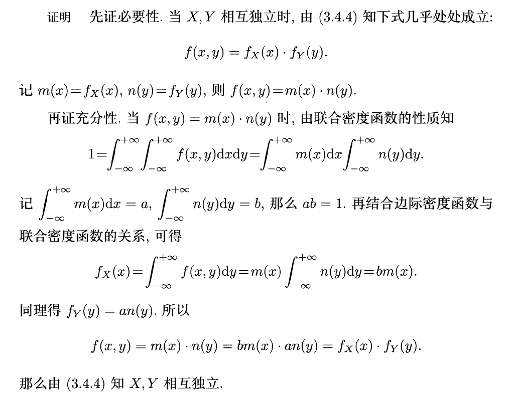
    

??? info "补充：n维随机变量的独立性"

    >注：仅做了解即可，考试不太可能考这么复杂吧...

    对于n维随机变量$(X_1, X_2, \dots, X_n)$，

    - 联合分布函数：$F(x_1, x_2, \dots, x_n) = P(X_1 \le x_1, X_2 \le x_2, \dots, X_n \le x_n)$
    - 边际分布函数：$F_{X_1}(x_1) = P(X_1 \le x_1) = F(x_1, +\infty, +\infty, \dots, +\infty)$
        - 当$n > 2$时，$(X_1, X_2)$的联合分布边际函数为

        $$
        F_{X_1, X_2}(x_1, x_2) = P(X_1 \le x_1, X_2 \le x_2) = F(x_1, x_2, +\infty, \dots, +\infty)
        $$

    n维连续型随机变量：随机变量$(X_1, X_2, \dots, X_n)$，对于它的分布函数$F(x_1, x_2, \dots, x_n)$，存在非负函数$f(x_1, x_2, \dots, x_n)$，使得

    $$
    F(x_1, x_2, \dots, x_n) = \int_{-\infty}^{x_1} \int_{-\infty}^{x_2} \dots \int_{-\infty}^{x_n}f(t_1, t_2, \dots, t_n) \text{d}t_1 \text{d}t_2 \dots \text{d}t_n
    $$

    成立。其中$f(x_1, x_2, \dots, x_n)$为联合密度函数。

    - 边际密度函数：

    $$
    \begin{align}
    f_{X_1}(x_1) & = \int_{-\infty}^{+\infty} \int_{-\infty}^{+\infty} \dots \int_{-\infty}^{+\infty}f(x_1, x_2, \dots, x_n) \text{d}x_2 \text{d}x_3 \dots \text{d}x_n \notag \\
    f_{X_1, X_2}(x_1, x_2) & = \int_{-\infty}^{+\infty} \int_{-\infty}^{+\infty} \dots \int_{-\infty}^{+\infty}f(x_1, x_2, \dots, x_n) \text{d}x_3 \text{d}x_4 \dots \text{d}x_n \notag
    \end{align}
    $$

    ---
    若对于任意实数$x_1, x_2, \dots, x_n$，有

    $$
    F(x_1, x_2, \dots, x_n) = F_{X_1}(x_1) F_{X_2}(x_2) \dots F_{X_n}(x_n)
    $$

    则称$X_1, X_2, \dots, X_n$相互独立。

    ---
    设$(X_1, X_2, \dots, X_m)$与$(Y_1, Y_2, \dots, Y_n)$分别为$m$维和$n$维的随机变量，分别用$F_X(x_1, x_2, \dots, x_m)$与$F_Y(y_1, y_2, \dots, y_n)$表示它们的联合分布函数，再记$F(x_1, x_2, \dots, x_m; y_1, y_2, \dots, y_n)$为$(X_1, X_2, \dots, X_m, Y_1, Y_2, \dots, Y_n)$的联合分布函数。对任意实数$x_i, y_j, i = 1, 2, \dots, m, j = 1, 2, \dots, n$，若

    $$
    F(x_1, x_2, \dots, x_m; y_1, y_2, \dots, y_n) = F_X(x_1, x_2, \dots, x_m) \cdot F_Y(y_1, y_2, \dots, y_n)
    $$

    则称$(X_1, X_2, \dots, X_m)$与$(Y_1, Y_2, \dots, Y_n)$相互独立。

    若$(X_1, X_2, \dots, X_m)$与$(Y_1, Y_2, \dots, Y_n)$相互独立，$g_1, g_2$时两个连续函数，则$g_1(X_1, X_2, \dots, X_m)$与$g_2(Y_1, Y_2, \dots, Y_n)$相互独立。

## 多元随机变量函数的分布

### $Z = X + Y$的分布

- $(X, Y)$为二维**离散型**随机变量，设$P(X = x_i, Y = y_j) = p_{ij}, i, j = 1, 2, \dots$，又设$Z$的可能取值有$z_1, z_2, \dots, z_k, \dots$，则有

    $$
    \begin{align}
    P(Z = z_k) & = P(X + Y = z_k) \notag \\
    & = \sum\limits_{i = 1}^{+\infty}P(X = x_i, Y = z_k - x_i), k = 1, 2, \dots \notag
    \end{align}
    $$

    或

    $$
    \begin{align}
    P(Z = z_k) & = P(X + Y = z_k) \notag \\
    & = \sum\limits_{j = 1}^{+\infty}P(X = z_k - y_j, Y = y_j), k = 1, 2, \dots \notag
    \end{align}
    $$

    - 特别地，当$X, Y$相互独立时，上式可以写成：

    $$
    P(Z = z_k) = \sum\limits_{i = 1}^{+\infty}P(X = x_i) \cdot P(Y = z_k - x_i), k = 1, 2, \dots
    $$

    或

    $$
    P(Z = z_k) = \sum\limits_{j = 1}^{+\infty}P(X = z_k - y_j) \cdot P(Y = y_j), k = 1, 2, \dots
    $$

- $(X, Y)$为二维**连续型**随机变量，设联合密度函数为$f(x, y)$，则$Z$的分布函数为：

    $$
    \begin{align}
    F_Z(z) & = P(Z \le z) = \iint\limits_{x + y \le z}f(x, y)\text{d}x\text{d}y \notag \\
    & = \int_{-\infty}^{+\infty}[\int_{-\infty}^{z-y} f(x, y)\text{d}x]\text{d}y \notag \\
    & = \int_{-\infty}^{+\infty}[\int_{-\infty}^{z} f(u - y, y)\text{d}u]\text{d}y \notag \\
    & = \int_{-\infty}^{z}[\int_{-\infty}^{\infty} f(u - y, y)\text{d}y]\text{d}u  = \int_{\infty}^z f_Z(u)\text{d}u\notag
    \end{align}
    $$

    - 故$Z$的密度函数为：$f_Z(z) = \int_{-\infty}^{+\infty} f(z - y, y)\text{d}y$
    - 由对称性知：$f_Z(z) = \int_{-\infty}^{+\infty} f(x, z - x)\text{d}x$
    - **卷积公式**：当$X, Y$相互独立时，$f_Z(z) = \int_{-\infty}^{+\infty} f_X(z - y) f_Y(y) \text{d}y = \int_{-\infty}^{+\infty} f_X(x) f_Y(z - x) \text{d}x$

!!! note "相关结论"

    - 设$X \sim P(\lambda_1), Y \sim P(\lambda_2)$，$X, Y$相互独立，记$Z = X + Y$，那么$Z$的概率分布律为$Z \sim P(\lambda_1 + \lambda_2)$
        - 可以证明：$n$个相互独立的服从泊松分布的随机变量的和仍服从泊松分布，其参数为$n$个分布的参数之和
    - 设$X \sim N(\mu_1, \sigma_1^2), Y \sim N(\mu_2, \sigma_2^2)$，$X, Y$相互独立，记$Z = X + Y$，那么$Z$的概率分布律为$Z \sim N(\mu_1 + \mu_2, \sigma_1^1 + \sigma_2^2)$
        - 可以证明：$n$个相互独立的正态变量的和仍为正态变量，即：若$X_1, X_2, \dots, X_n$相互独立，且$X_i \sim N(\mu_i, \sigma^2)$，则$\sum\limits_{i = 1}^n X_i \sim N(\sum_{i = 1}^n \mu_i, \sum_{i = 1}^n \sigma_i^2)$
        - 进一步证明：$n$个相互独立的正态变量的**线性组合**仍为正态变量

### $M = \max\{X, Y\}, N = \min\{X, Y\}$的分布

记$X, Y$的联合分布函数为$F(x, y)$，$X, Y$的边际分布函数分别为$F_X(t), F_Y(t)$

- $M$的分布函数：$F_M(t) = P(\max\{X, Y\} \le t) = P(X \le t, Y \le t) = F(t, t)$
    - 当$X, Y$相互独立时，$F_M(t) = F_X(t) \cdot F_Y(t)$
- $N$的分布函数：$F_N(t) = P(\min\{X, Y\} \le t) = P((X \le t) \cup (Y \le t)) = F_X(t) + F_Y(t) - F(t, t)$，或者$F_N(t) = 1 - P(\min\{X, Y\} > t) = 1 - P(X > t, Y > t)$
    - 记忆：因为要求$X, Y$的最小值$\le t$，那么只要确保$X, Y$中至少有一个$\le t$即可，因此取的是两个事件的**并集**
    - 当$X, Y$相互独立时，$F_M(t) = F_X(t) + F_Y(t) - F_X(t) \cdot F_Y(t) = 1 - [1 - F_X(t)] \cdot [1 - F_Y(t)]$

推广到$n$个变量：设$X_1, X_2, \dots, X_n$为$n$个相互独立的随机变量，分布函数分别为$F_1(x), F_2(x), \dots, F_n(x)$，记$M = \max\{X_1, X_2, \dots, X_n\}, N = \min\{X_1, X_2, \dots, X_n\}$，则：

$$
\begin{align}
F_M(t) & = \prod\limits_{i = 1}^n F_i(t) \notag \\
F_N(t) & = 1 - \prod\limits_{i = 1}^n [1 - F_i(t)] \notag
\end{align}
$$