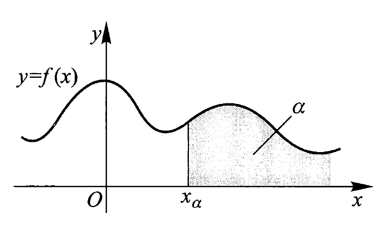
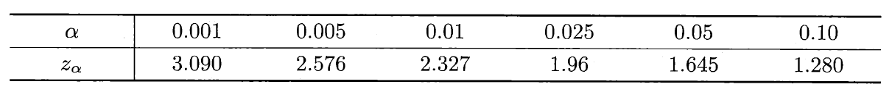

# 第4章 随机变量的数字特征

??? abstract "核心知识"

    - 期望$E(X)$
        - 连续型随机变量期望的计算、随机变量函数的期望
        - 性质：线性组合、乘积
        - 常见概率分布的期望

    - 方差$Var(X)$
        - 懒人公式
        - 性质
        - 常见概率分布的方差

    - 协方差
        - 懒人公式
        - 性质

    - 相关系数
        - 取值范围、正负相关
        - 相关与独立的关系
        - 二元正态分布
        
    - 其他数字特征：k阶原点矩、k阶中心矩、分位数

## 数学期望

### 定义

- 离散型：设随机变量$X$的概率分布律为$P(X = x_i) = p_i, i = 1, 2, \dots$，若级数$\sum\limits_{i = 1}^{+\infty} x_i p_i$**绝对收敛**（即$\sum\limits_{i = 1}^{+\infty}|x_i|p_i < +\infty$），称该级数为$X$的**期望**（均值），记为$E(X) = \sum\limits_{i = 1}^{+\infty} x_i p_i$
    - 若$\sum\limits_{i = 1}^{+\infty} |x_i| p_i = +\infty$，称$X$的期望**不存在**
    - 为何要求绝对收敛：若级数仅为条件收敛，那么级数和会随级数各项顺序的不同而发生改变，从而无法得到唯一值；而且用更直观的角度看，期望与概率分布律的各项顺序无关
- 连续型：设随机变量$X$的密度函数为$f(x)$，若$\int_{-\infty}^{+\infty} |x|f(x) \text{d}x < +\infty$，则称该积分为$X$的**期望**（均值），记为$E(X) = \int_{-\infty}^{+\infty} xf(x) \text{d}x$
    - 若$\int_{-\infty}^{+\infty} |x|f(x) \text{d}x = +\infty$，称$X$的期望**不存在**
    - 若已知二维随机变量$(X, Y)$的联合密度函数$f(x, y)$，那么：
        - $E(X) = \int_{-\infty}^{+\infty} \int_{-\infty}^{+\infty} xf(x, y) \text{d}x \text{d}y,\ E(Y) = \int_{-\infty}^{+\infty} \int_{-\infty}^{+\infty} yf(x, y) \text{d}x \text{d}y$
        - $E(XY) = \int_{-\infty}^{+\infty} \int_{-\infty}^{+\infty} xyf(x, y) \text{d}x \text{d}y$

### 随机变量函数的数学期望

一元随机变量$X$函数的期望公式：

- 离散型：若$\sum\limits_{i = 1}^{+\infty} |g(x_i)| p_i < +\infty$，则$g(x)$的期望$E(g(X))$存在，且$E(g(x)) = \sum\limits_{i = 1}^{+\infty} g(x_i) p_i$，其中$P(X = x_i) = p_i, i = 1, 2, \dots$为$X$的概率分布律

- 连续型：若$\int_{-\infty}^{+\infty} |g(x)|f(x) \text{d}x < +\infty$，则$g(x)$的期望$E(g(X))$存在，且$E(g(x)) = \int_{-\infty}^{+\infty} g(x)f(x) \text{d}x$，其中$f(x)$为$X$的密度函数

上述定理可以推广至二元或多元的随机变量函数中。

---
二元随机变量$(X, Y)$函数的期望公式：

- 离散型：若$\sum\limits_{i = 1}^{+\infty} \sum\limits_{j = 1}^{+\infty}|h(x_i, y_j)| p_{ij} < +\infty$，则$h(X, Y)$的期望$E(h(X, Y))$存在，且$E(h(X, Y)) =\sum\limits_{i = 1}^{+\infty} \sum\limits_{j = 1}^{+\infty}h(x_i, y_j) p_{ij}$，其中$P(X = x_i, Y = y_j) = p_{ij}, i = 1, 2, \dots, j = 1, 2, \dots$为$(X, Y)$的联合分布律

- 连续型：若$\int_{-\infty}^{+\infty} \int_{-\infty}^{+\infty} |h(x, y)|f(x, y) \text{d}x \text{d}y< +\infty$，则$h(x, y)$的期望$E(h(x, y))$存在，且$E(h(x, y)) = \int_{-\infty}^{+\infty} \int_{-\infty}^{+\infty} h(x, y)f(x, y) \text{d}x \text{d}y$，其中$f(x, y)$为$(X, Y)$的联合密度函数

### 性质

- 定理（**期望的线性组合**）：若$n$个随机变量$X_1, X_2, \dots, X_n(n \ge 1)$的期望都存在，则对任意$n+1$个实数$c_0, c_1, c_2, \dots, c_n$，$c_0 + \sum\limits_{i=1}^n c_i X_i$的期望也存在，且$E(c_0 + \sum\limits_{i=1}^n c_i X_i) = c_0 + \sum\limits_{i=1}^n c_i E(X_i)$。
    - 该定理**不要求随机变量相互独立**，因此适用范围很广
    - 特别地，当$c_i = 0, i = 1, 2, \dots, n$时，得$E(c_0) = c_0$，即对于任何常数$c$，有$E(c) = c$。

- 定理（**期望的乘积**）：$n$个**相互独立**的随机变量乘积的期望 = 它们的期望的乘积，即若随机变量$X_1, X_2, \dots, X_n(n \ge 1)$**相互独立**，且它们的期望都存在，则$\prod\limits_{i = 1}^{n} X_i$的期望也存在，且$E(\prod\limits_{i = 1}^{n} X_i) = \prod\limits_{i = 1}^{n} E(X_i)$

!!! note "常见概率分布的期望"

    === "**二项分布**（$X \sim B(n, p)$）"
    
        $E(X) = np$

    === "**泊松分布**（$X \sim P(\lambda)$）"
        
        $$
        \begin{align}
        E(X) & = \sum\limits_{k=0}^{+\infty}k \cdot P(X = k) = \sum\limits_{k=0}^{+\infty}k \cdot \dfrac{\lambda^k}{k!} e^{-\lambda} \notag \\
        & = \lambda \sum\limits_{k = 1}^{+\infty}\dfrac{\lambda^{k-1}}{(k-1)!}e^{-\lambda} = \lambda \notag
        \end{align}
        $$

    === "**指数分布**（$X \sim E(\lambda)$）"

        $$
        \begin{align}
        E(X) & = \int_{-\infty}^{+\infty}xf(x)\text{d}x = \int_{0}^{+\infty}x\lambda e^{-\lambda x}\text{d}x = - \int_{0}^{+\infty}x\text{d}e^{-\lambda x} \notag \\
        & = -(xe^{-\lambda x}) \Big|_0^{+\infty} +  \int_{0}^{+\infty}e^{-\lambda x} \text{d}x = \dfrac{1}{\lambda} \notag
        \end{align}
        $$

    === "**标准正态分布**（$X \sim N(0, 1)$）"
    
        因为密度函数$\varphi (x) = \dfrac{1}{\sqrt{2\pi}}e^{-\frac{x^2}{2}}$是偶函数，那么$x\varphi(x)$是奇函数，所以

        $$
        E(X) = \int_{-\infty}^{+\infty} x\varphi(x) \text{d}x = 0
        $$

    === "**正态分布**（$X \sim N(\mu, \sigma^2)$）"
    
        令$Z = \dfrac{X - \mu}{\sigma} \sim N(0, 1)$，即$X = \sigma Z + \mu$，因为$E(Z) = 0$，所以

        $$
        E(X) = E(\sigma Z + \mu) = \sigma E(Z) + \mu = \mu
        $$

## 方差

设随机变量$X$的数学期望$E(X)$存在，若$Var(X) = E[(X - E(X))^2]$存在，称$Var(X)$（或$D(X)$）为$X$的**方差**(variance)；称方差的平方根$\sqrt{Var(X)}$为**标准差**(standard variance)或均方差，记为$\sigma(X)$或$SD(X)$。方差和标准差均反映了随机变量与其中心位置（期望）的偏移程度，但标准差的优势在于它和期望有相同的量纲。

- 离散型随机变量：$Var(X) = \sum\limits_{i = 1}^{+\infty} (x_i - E(X))^2p_i$
- 连续型随机变量：$Var(X) = \int_{- \infty}^{+ \infty} (x - E(X))^2 f(x) \text{d}x$

:star2:但一般不会用上面的公式计算方差，而是用下面给出的**（~~懒人~~）公式**计算：

$$
Var(X) = E(X^2) - [E(X)]^2
$$

- 这个公式也可用来求$E(X^2)$：$E(X^2) = [E(X)]^2 + Var(X)$

### 性质

设$c$为常数，则：

- $Var(cX) = c^2 Var(X)$
- $Var(X + c) = Var(X)$
- $Var(X) \le E[(X - c)^2]$，当且仅当$E(X) = c$时等号成立
    - 当且仅当$P(X = E(X)) = 1$时，$Var(X) = 0$
    - 证明：不等号两边做个差，利用期望的性质和懒人公式来化简计算
- $Var(X + Y) = Var(X) + Var(Y) + 2Cov(X, Y)$
    - 更完整的版本见“协方差”一节给出的“定理”
- 对任意正整数$n(n \ge 2)$，设$X_1, X_2, \dots, X_n$为**两两独立**的随机变量，方差都存在，则$X_1 + X_2 + \dots + X_n$的方差也存在，且：

    $$
    Var(\sum\limits_{i = 1}^n X_i) = \sum\limits_{i = 1}^n Var(X_i)
    $$

    - 对任意有限实数$c_0, c_1, c_2, \dots, c_n$，则

    $$
    Var(c_0 + \sum\limits_{i = 1}^n c_i X_i) = \sum\limits_{i = 1}^n c_i^2 Var(X_i)
    $$

    - 事实上条件可从“两两独立”弱化为“两两不相关”

!!! note "常见概率分布的方差"

    === "**二项分布**（$X \sim B(n, p)$）"

        令$Y_i$表示服从参数为$p$的0-1分布的相互独立的随机变量，则$\sum_{i=1}^n Y_i \sim B(n, p)$。易知$E(Y_i) = p, E(Y_i^2) = p, Var(Y_i) = p(1 - p)$，则：

        $$
        \begin{align}
        Var(X) & = Var(\sum\limits_{i=1}^n Y_i) = \sum\limits_{i = 1}^n Var(Y_i) \notag \\
        & = \sum\limits_{i=1}^n p(1 - p) = np(1 - p) \notag
        \end{align}
        $$

    === "**泊松分布**（$X \sim P(\lambda)$）"
        
        $$
        \begin{align}
        E(X^2) & = \sum\limits_{k=0}^{+\infty}k^2 \cdot P(X = k) \notag \\
        & = \sum\limits_{k = 0}^{+\infty}k^2 \cdot \dfrac{\lambda^k}{k!}e^{-\lambda} = \lambda \sum\limits_{k = 1}^{+\infty}k \cdot \dfrac{\lambda^{k - 1}}{(k - 1)!}e^{-\lambda} \notag \\
        & = \lambda \sum\limits_{k = 1}^{+\infty} [(k - 1) + 1] \cdot \dfrac{\lambda^{k - 1}}{(k - 1)!}e^{-\lambda} \notag \\
        & = \lambda [\lambda \sum\limits_{k = 2}^{+\infty} \dfrac{\lambda^{k - 2}}{(k - 2)!}e^{-\lambda} + \sum\limits_{k = 1}^{+\infty} \dfrac{\lambda^{k - 1}}{(k - 1)!}e^{-\lambda}] \notag \\
        & = \lambda^2 + \lambda \notag
        Var(X) & = \lambda^2 + \lambda - \lambda^2 = \lambda  
        \end{align}
        $$

    === "**指数分布**（$X \sim E(\lambda)$）"

        $$
        \begin{align}
        E(X^2) & = \int_{-\infty}^{+\infty} x^2 f(x) \text{d}x \notag \\
        & = \int_{0}^{+\infty}x^2 \lambda e^{-\lambda x} \text{d} x = - \int_0^{+\infty} x^2 \text{d} e^{- \lambda x} \notag \\
        & = -(x^2 e^{-\lambda x}) \Big|_0^{+\infty} + 2 \int_{0}^{+\infty} xe^{-\lambda x} \text{d}x = \dfrac{2}{\lambda} E(X)\notag \\
        Var(X) & = \dfrac{2}{\lambda^2} - \dfrac{1}{\lambda^2} = \dfrac{1}{\lambda^2} \notag
        \end{align}
        $$

    === "**标准正态分布**（$X \sim N(0, 1)$）"

        $$
        \begin{align}
        E(X^2) & = \dfrac{1}{\sqrt{2 \pi}} \int_{-\infty}^{+\infty}x^2 \cdot e^{-\dfrac{x^2}{2}} \text{d}x \notag \\
        & = - \dfrac{1}{\sqrt{2 \pi}} \int_{-\infty}^{+\infty}x \text{d}(e^{-\dfrac{x^2}{2}}) \notag \\
        & = - \dfrac{1}{\sqrt{2 \pi}} [(xe^{-\dfrac{x^2}{2}}) \Big|_{-\infty}^{+\infty} - \int_{-\infty}^{+\infty} e^{-\dfrac{x^2}{2}} \text{d}x] \notag \\
        & = \dfrac{1}{\sqrt{2 \pi}} \int_{-\infty}^{+\infty} e^{-\dfrac{x^2}{2}} \text{d}x = 1\notag \\
        Var(X) & = 1 - 0^2 = 1 \notag
        \end{align}
        $$

    === "**正态分布**（$X \sim N(\mu, \sigma^2)$）"
    
        令$Z = \dfrac{X - \mu}{\sigma} \sim N(0, 1)$，即$X = \sigma Z + \mu$，因为$Var(Z) = 1$，则：

        $$
        Var(X) = Var(\sigma Z + \mu) = \sigma^2 Var(Z) = \sigma^2
        $$

!!! abstract "总结"

    |概率分布|期望$E(X)$|方差$Var(X)$|
    |:-:|:-:|:-:|
    |0-1分布|$p$|$p(1 - p)$|
    |二项分布$B(n, p)$|$np$|$np(1 - p)$|  
    |泊松分布$P(\lambda)$|$\lambda$|$\lambda$|
    |均匀分布$U(a, b)$|$\dfrac{a + b}{2}$|$\dfrac{(b - a)^2}{12}$|
    |指数分布$E(\lambda)$|$\dfrac{1}{\lambda}$|$\dfrac{1}{\lambda^2}$|    
    |正态分布$N(\mu, \sigma^2)$|$\mu$|$\sigma^2$|      

---
若随机变量$X$的方差存在，则称$X^* = \dfrac{X - E(X)}{\sqrt{Var(X)}}$为$X$的**标准化变量**。

## 协方差与相关系数

### 协方差

对于数学期望都存在的随机变量$X$和$Y$，当$E[(X - E(X))(Y - E(Y))]$存在时，称其为$X$与$Y$的**协方差**(covariance)，记作$Cov(X, Y)$，可将其看作一个二元随机变量函数。

- 二维离散型随机变量：$Cov(X, Y) = \sum\limits_{i=1}^{+\infty} \sum\limits_{j=1}^{+\infty} (x_i - E(X))(y_j - E(Y))p_{ij}$
- 二维连续型随机变量：$Cov(X, Y) = \int_{-\infty}^{+\infty} \int_{-\infty}^{+\infty} (x - E(X))(y - E(Y))f(x, y) \text{d}x \text{d}y$

:star2:但一般不会用上面的公式计算协方差，而是用下面给出的公式计算（与计算方差的懒人公式的形式类似，可放在一起记忆）：

$$
Cov(X, Y) = E(XY) - E(X)E(Y)
$$

**定理**：对任意正整数$n(n \ge 2)$，设$X_1, X_2, \dots, X_n$为方差存在的随机变量，则$X_1 + X_2 + \dots + X_n$的方差也存在，且：

$$
Var(\sum\limits_{i=1}^nX_i) = \sum\limits_{i=1}^n Var(X_i) + 2 \sum\limits_{1 \le i < j \le n} Cov(X_i, X_j)
$$

- 该公式**不要求这些随机变量相互独立**
- 若随机变量相互独立，则$Var(\sum\limits_{i=1}^nX_i) = \sum\limits_{i=1}^n Var(X_i)$

性质：

- $Cov(X, Y) = Cov(Y, X)$
- $Cov(X, X) = Var(X)$
- $Cov(aX, bY) = abCov(X, Y)$，其中$a, b$为实数
- 若$Cov(X_i, Y)(i = 1, 2)$存在，则：$Cov(X_1 + X_2, Y) = Cov(X_1, Y) + Cov(X_2, Y)$
- 若$X, Y$相互独立，则$Cov(X, Y) = 0$，但反之不然
- 当$Var(X) \cdot Var(Y) \ne 0$时，有$(Cov(X, Y))^2 \le Var(X) Var(Y)$，当且仅当$X, Y$之间有严格的线性关系（即存在常数$c_1, c_2$使得$P(Y = c_1 + c_2 X) = 1$成立）时等号成立
- $Cov(c, X) = E(cX) - E(c)E(X) = 0, c$为常数
- $Cov(X + Y, X - Y) = Cov(X, X) - Cov(Y, Y) = Var(X) - Var(Y)$

:star2: $Cov(aX + bY, cX + dY) = acVar(X) + bdVar(Y) + (ad + bc)Cov(X, Y)$

### 相关系数

对于随机变量$X$和$Y$，当$E(X^2)$与$E(Y^2)$均存在且$Var(X), Var(Y)$均为非零实数时，称

$$
\rho_{XY} = \dfrac{Cov(X, Y)}{\sqrt{Var(X)}\sqrt{Var(Y)}}
$$

为$X$与$Y$的**相关系数**(correlation coefficient)，有时也简记为$\rho$。

根据标准化变量的定义，令$X^* = \dfrac{X - E(X)}{\sqrt{Var(X)}}, Y^* = \dfrac{Y - E(Y)}{\sqrt{Var(Y)}}$，则

$$
\rho_{XY} = Cov(X^*, Y^*)
$$

性质：

- 若$X$和$Y$相互独立，则$\rho_{XY} = 0$，但反之不然
- $|\rho_{XY}| \le 1$，当且仅当$X, Y$之间有严格的线性关系（即存在常数$c_1, c_2$使得$P(Y = c_1 + c_2 X) = 1$成立）时等号成立

    ??? info "补充知识"

        协方差和相关系数都是刻画两变量间“线性”关系的一种数字特征，但相关系数是无量纲的指标，可视之为“标准尺度下的协方差”；且相关系数有时称为“线性相关系数”。

        考虑用$X$的线性函数$a + bX$逼近$Y$，用均方误差$e(a, b) = E\{[Y - (a + bX)]^2\}$来衡量逼近的程度，且其值越小，逼近程度越好。下面求最佳近似式$e(a_0, b_0) = \min\limits_{a, b}e(a, b)$

        $$
        e(a, b) = E(Y^2) = b^2E(x^2) + a^2 - 2bE(XY) + 2abE(X) - 2aE(Y)
        $$

        得到：$\begin{cases}\dfrac{\partial e(a, b)}{\partial a} = 2a + 2bE(X) - 2E(Y) = 0 \\ \dfrac{\partial e(a, b)}{\partial b} = 2bE(X^2) - 2E(XY) + 2aE(X) = 0\end{cases}$

        解得：$\begin{cases}a_0 = E(Y) - b_0 E(X) \\ b_0 = \dfrac{Cov(X, Y)}{Var(X)}\end{cases}$

        此时：

        $$
        \begin{align}
        e(a_0, b_0) & = E\{[Y - (a_0 + b_0 X)^2]\} \notag \\
        & = Var(\dots) + [E(\dots)]^2 \notag \\
        & = Var(Y - b_0 X) = Var(Y) + b_0^2 Var(X) - 2b_0 Cov(X, Y) \notag \\
        & = Var(Y) - \dfrac{[Cov(X, Y)]^2}{Var(X)} \notag \\
        & = (1 - \rho_{XY}^2) Var(Y) \notag
        \end{align}
        $$

- 若$\rho_{XY} = \pm 1$，则$E\{[Y - (a_0 + b_0 X)^2]\} = 0$，可得$P[Y - (a_0 + b_0 X) = 0] = 1$
- 当$|\rho_{XY}| \rightarrow 1$时，用$a + bX$来逼近$Y$的偏差越少，即$X$和$Y$的线性相关程度越强，反之则越弱
- 当$\rho_{XY} > 0$时，称$X$与$Y$**正相关**；当$\rho_{XY} < 0$时，称$X$与$Y$**负相关**
- 当$\rho_{XY} = 0$时，称$X$与$Y$**不相关**或零相关
    - 此外还可以用下面任意一条来定义不相关：
        - $Cov(X, Y) = 0$
        - $E(XY) = E(X)E(Y)$
        - $Var(X + Y) = Var(X) + Var(Y)$

- 定理：对于两个相互独立的随机变量，若其方差存在，则一定不相关；但如果它们不相关，却未必相互独立。反之，若两随机变量相关，则它们一定不独立。
    - 省流：**独立 -> 不相关，相关 -> 不独立**，反之不一定成立
    - 但对于一些特定的分布，如**正态分布，不相关和独立是等价的**

**二元正态分布**$N(\mu_1, \mu_2; \sigma_1^2, \sigma_2^2; \rho)$中$X$和$Y$的相关系数为：$\rho_{XY} = \rho$（证明见教材$P_{160-161}$）。

## 其他数字特征

### 矩

设$X, Y$为随机变量，$k, l$为正整数

- $X$的**$k$阶（原点）矩**：$\mu_k = E(X^k)$
    - $E(X) = \mu_1$
- $X$的**$k$阶中心矩**：$\upsilon_k = E[(X - E(X))^k]$
    - $Var(X) = \upsilon_2$
- $X$和$Y$的**$k + l$阶混合（原点）矩**：$E(X^k Y^l)$
- $X$和$Y$的**$k + l$阶混合中心矩**：$E[(X - E(X))^k(Y - E(Y))^l]$

### 分位数

!!! info "注"

    第七、八两章的题目常用分位数的知识。

设连续型随机变量$X$的分布函数和密度函数分别为$F(x)$与$f(x)$，对任意$0 < \alpha < 1$，称满足条件$P(X > x_{\alpha}) = 1 - F(x_{\alpha}) = \int_{x_{\alpha}}^{+\infty} f(x) \text{d}x = \alpha$的实数$x_{\alpha}$为随机变量$X$的**上$\alpha$分位数**。其几何意义如下所示：

    

- 当$\alpha = \dfrac{1}{2}$时，称$x_{\frac{1}{2}}$为$X$的**中位数**(median)
- 当$\alpha = \dfrac{1}{4}$时，称$x_{\frac{1}{4}}$为$X$的**上$\dfrac{1}{4}$分位数**
- 当$\alpha = \dfrac{3}{4}$时，称$x_{\frac{3}{4}}$为$X$的**上$\dfrac{3}{4}$分位数**

---
**标准正态分布**的上$\alpha$分位数通常记为$z_\alpha$，即$z_\alpha$满足：$\int_{z_{\alpha}}^{+\infty} \varphi(x) \text{d}x = \alpha$，常用的$z_\alpha$值如下所示：

    

由对称性易知$z_{1 - \alpha} = -z_\alpha$，且$z_{\frac{1}{2}} = 0$

## 多维随机变量的数字特征

### 多维随机变量的期望和协方差矩阵

!!! warning "注意"

    协方差矩阵不考！！！

记$n$维随机变量$\bm{X} = \{X_1, X_2, \dots, X_n\}^{\text{T}}$，若其每一分量的期望都存在

- 称$E(\bm{X}) = (E(X_1), E(X_2), \dots, E(X_n))^{\text{T}}$为$n$维随机变量$\bm{X}$的**数学期望（向量）**
- 称

    $$
    \begin{align}
    Cov(\bm{X}) & = E[\bm{X} - E(\bm{X})(\bm{X} - E(\bm{X}))^\text{T}] \notag \\ 
    & = \begin{bmatrix}Var(X_1) & Cov(X_1, X_2) & \dots & Cov(X_1, X_n) \\ Cov(X_2, X_1) & Var(X_2) & \dots & Cov(X_2, X_n) \\ \vdots & \vdots && \vdots \\ Cov(X_n, X_1) & Cov(X_n, X_2) & \dots & Var(X_n)\end{bmatrix} \notag
    \end{align}
    $$

    为$n$维随机变量$\bm{X}$的**协方差矩阵**，也可写为$Cov(\bm{X}) = (Cov(X_i, X_j))_{n \times n}$。

    - 性质：协方差矩阵式一个对称的非负定矩阵

### 多维正态变量

$n$维随机变量$\bm{X}$的协方差矩阵$\bm{B} = Cov(\bm{X})$，期望$\bm{a} = E(\bm{X})$，则由密度函数

$$
f(\bm{x}) = f(x_1, x_2, \dots, x_n) = \dfrac{1}{(2 \pi)^{\frac{n}{2}} |\bm{B}|^{\frac{1}{2}}} \exp [-\dfrac{1}{2}(\bm{x} - \bm{a})^{\text{T}} \bm{B}^{-1} (\bm{x} - \bm{a})]
$$

定义的分布为$n$元正态分布，常记为$\bm{X} \sim N(\bm{a}, \bm{B})$。其中$|\bm{B}|$表示$\bm{B}$的行列式，$\bm{B}^{-1}$表示$\bm{B}$的逆矩阵，$(x - \bm{a}^{\text{T}})$为$(\bm{x} - \bm{a})$的转置。

特别地，当$n = 2$时，二元正态分布的协方差矩阵为：$\bm{B} = \begin{bmatrix}\sigma_1^2 & \sigma_1 \sigma_2 \rho \\ \sigma_1 \sigma_2 \rho & \sigma_2^2\end{bmatrix}$，其中$\sigma_i^2(i = 1, 2)$为两分量的方差，$\rho$为两分量的相关系数。

性质：

- $n$维正态变量的任意$k$维字向量也服从$k$元正态分布，也就是说每个分量都服从一元正态分布。反之，若$X_i$都是正态变量，且相互独立，则该$(X_1, X_2, \dots, X_n)^{\text{T}}$服从$n$元正态分布
- $\bm{X} = (X_1, X_2, \dots, X_n)^{\text{T}}$服从$n$元正态分布的充要条件是它的各个分量的任意线性组合均服从一元正态分布，即对任意$n$维实向量$\bm{l} = (l_1, l_2, \dots, l_n)^{\text{T}}$，有

    $$
    \bm{X} \sim N(\bm{a}, \bm{B}) \Leftrightarrow \bm{l}^{\text{T}}\bm{X} = \sum\limits_{i=1}^n l_i X_i \sim N(\bm{l}^T \bm{a}, \bm{l}^{\text{T}}\bm{B}\bm{l})
    $$

    其中$l_1, l_2, \dots, l_n$不全为0。

- 正态变量的线性变换不变性：若$\bm{X} = (X_1, X_2, \dots, X_n)^{\text{T}}$服从$n$元正态分布，设$Y_1, Y_2, \dots, Y_n$都是$X_1, X_2, \dots, X_n$的线性函数，则$\bm{Y} = (Y_1, Y_2, \dots, Y_n)^{\text{T}}$也服从$k$元正态分布。用矩阵形式表述为：若$\bm{X} \sim N(\bm{a}, \bm{B}), \bm{C} = (c_{ij})_{k \times n}$为$k \times n$实数矩阵，则：

    $$
    \bm{Y} = \bm{CX} \sim (\bm{Ca}, \bm{CBC}^{\text{T}})
    $$

- 服从$n$元正态分布的随机变量$\bm{X}$中的分量相互独立的充要条件是它们两两不相关，等价于$Cov(\bm{X})$为对角矩阵
