# 第5章 大数定律及中心极限定理

## 大数定律

### 依概率收敛

设$\{T_n, n \ge 1\}$为一随机变量序列，$c$为一常数。若对任意$\varepsilon > 0$，都有

$$
\lim\limits_{n \rightarrow +\infty}P(|Y_n - c| \ge \varepsilon) = 0
$$

成立，则称$\{Y_n, n \ge 1\}$**依概率收敛**于$c$，记为$Y_n \stackrel{P}{\longrightarrow} c, n \rightarrow +\infty$。它的意义是：当$n$很大时，$Y_n$十分接近$c$，两者的偏差小于任意给定整数$\varepsilon$这一事件发生的概率趋于1，为一大概率事件。上式的等价形式为：

$$
\lim\limits_{n \rightarrow +\infty}P(|Y_n - c| < \varepsilon) = 1
$$

重要性质：设$X_n \stackrel{P}{\longrightarrow} a, Y_n \stackrel{P}{\longrightarrow} b, n \rightarrow +\infty$，其中$a, b$为常数，若二元函数$g(x, y)$在点$(a, b)$连续，则有：

$$
g(X_n, Y_n) \stackrel{P}{\longrightarrow} g(a, b), n \rightarrow +\infty
$$

### 两个重要不等式

!!! warning "注意"

    马尔科夫不等式不考！！！

**马尔科夫(Markov)不等式**：若随机变量$Y$的$k$阶（原点）矩存在（$k \ge 1$），则对任意$\varepsilon > 0$，有：

$$
P(|Y| \ge \varepsilon) \le \dfrac{E(|Y|^k)}{\varepsilon^k} \quad (\text{or } P(|Y| < \varepsilon) \ge 1 - \dfrac{E(|Y|^k)}{\varepsilon^k})
$$

特别地，当$Y$为取非负值的随机变量且它的$k$阶矩存在时，则有：$P(Y \ge \varepsilon) \le \dfrac{E(|Y|^k)}{\varepsilon^k}$

---
**切比雪夫(ChebyShev)不等式**：设随机变量$X$的数学期望和方差存在，分别记为$\mu, \sigma^2$，则对任意的$\varepsilon > 0$，有：

$$
P(|X - \mu| \ge \varepsilon) \le \dfrac{\sigma^2}{\varepsilon^2} \quad (\text{or } P(|X - \mu| < \varepsilon) \ge 1 - \dfrac{\sigma^2}{\varepsilon^2})
$$

- 切比雪夫不等式是马尔科夫不等式的一个推论。
- 该不等式的重要性在于：不管随机变量的分布类型是什么，只要已知它的数学期望和方差，就可以对随机变量落入期望附近的区域$(\mu - \varepsilon, \mu + \varepsilon)$内或外的概率给出一个界的估计。$X$的方差越小，对于相同的$\varepsilon$，$P(|X - \mu| \ge \varepsilon)$上界越小，即落入$(\mu - \varepsilon, \mu + \varepsilon)$的概率越大，因此方差能够刻画$X$的概率分布偏离其中心位置的离散程度。

??? example "例题"

    === "题目"

        

            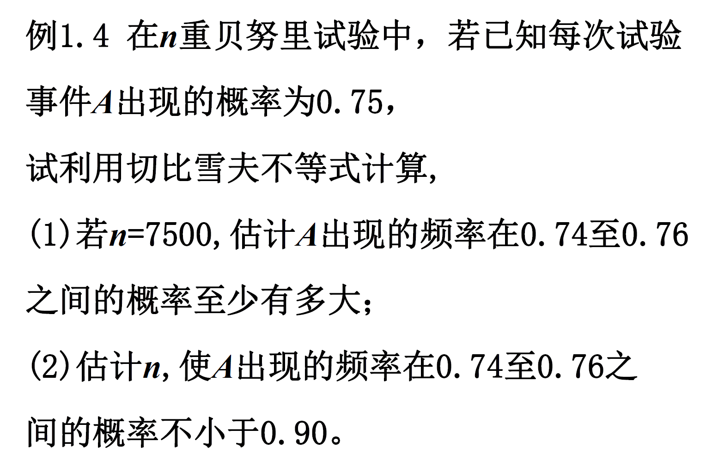
        

    === "解答"

        

            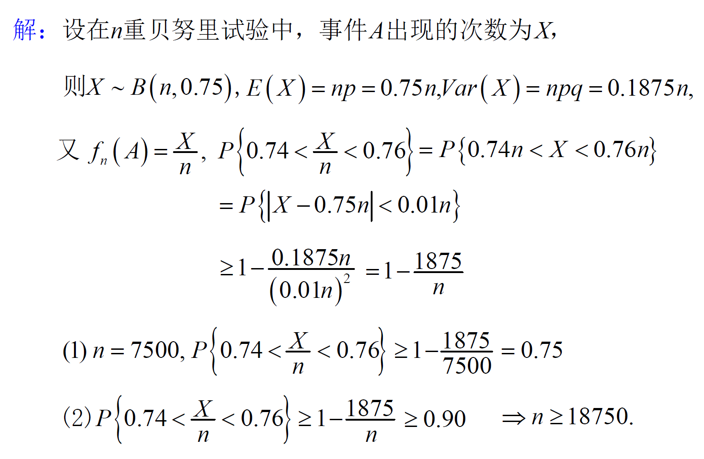
        

### 两个大数定律

设$\{X_i, i \ge 1\}$为一随机变量序列，若存在常数序列$\{c_n, n \ge 0\}$，使得对任意$\varepsilon > 0$，有：

$$
\lim\limits_{n \rightarrow +\infty}P(\Bigg|\dfrac{1}{n}\sum\limits_{i = 1}^n X_i - c_n\Bigg| \ge \varepsilon) = 0 \quad (\text{or } \lim\limits_{n \rightarrow +\infty}P(\Bigg|\dfrac{1}{n}\sum\limits_{i = 1}^n X_i - c_n\Bigg| < \varepsilon) = 1)
$$

成立，即当$n \rightarrow +\infty$时，有$\dfrac{1}{n}\sum\limits_{i=1}^nX_i - c_n \stackrel{P}{\longrightarrow} 0$，则称随机变量序列$\{X_i, i \ge 1\}$服从**弱大数定律**，简称服从**大数定律**。特别地，当$c_n = c(n = 1, 2, \dots)$时，可写为：$\dfrac{1}{n}\sum\limits_{i=1}^nX_i \stackrel{P}{\longrightarrow} c, n \rightarrow +\infty$

---
**伯努利(Bernoulli)大数定律**：设$n_A$为$n$重伯努利试验中时间$A$发生的次数，$p$为事件$A$在每次试验中发生的概率，即$P(A) = p$，则对任意$\varepsilon > 0$，有：

$$
\lim\limits_{n \rightarrow +\infty}P(\Big|\dfrac{n_A}{n} - p \Big| \ge \varepsilon) = 0
$$

- 该定律提供了用频率的极限值来定义概率的理论依据，从数学上严格证明了[第1章](1.md#频率与概率)提到的“频率的稳定值即为概率”的结论。

---
**辛钦(Khinchin)大数定律**：设$\{X_i, i \ge 1\}$为独立同分布的随机变量序列，且数学期望存在，记为$\mu$，则对任意的$\varepsilon > 0$，有：

$$
\lim\limits_{n \rightarrow +\infty} P(\Bigg| \sum\limits_{i = 1}^n X_i - \mu \Bigg| \ge \varepsilon) = 0
$$

即$\dfrac{1}{n}\sum\limits_{i=1}^n X_i \stackrel{P}{\longrightarrow} \mu (n \rightarrow +\infty)$，并认为此时随机变量序列$\{X_i, i \ge 1\}$服从大数定律。

推论：

- 设$\{X_i, i \ge 1\}$为独立同分布的随机变量序列，若$h(x)$为一连续函数，且$E(|h(X_1)|) < +\infty$，则对任意$\varepsilon > 0$，有：

    $$
    \lim\limits_{n \rightarrow +\infty} P(\Bigg| \sum\limits_{i = 1}^n h(X_i) - a \Bigg| \ge \varepsilon) = 0
    $$

    其中$a = E(h(X_1))$，即$\dfrac{1}{n}\sum\limits_{i=1}^n h(X_i) \stackrel{P}{\longrightarrow} a, n \rightarrow +\infty$

- $f(\overline{X}) \stackrel{P}{\longrightarrow} f(E(X))$

??? example "例题"

    === "题目"

        

            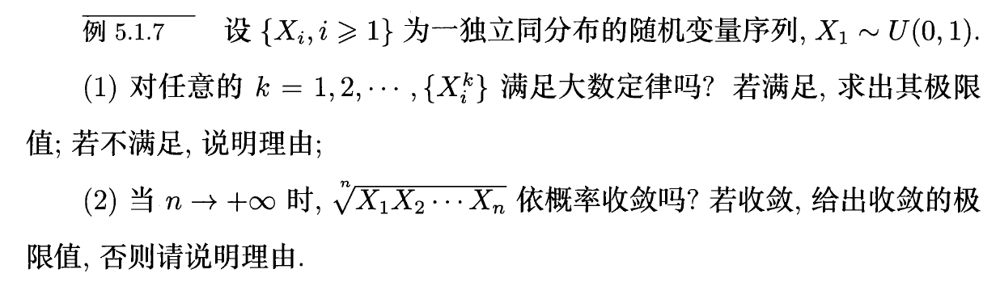
        

    === "解答"

        

            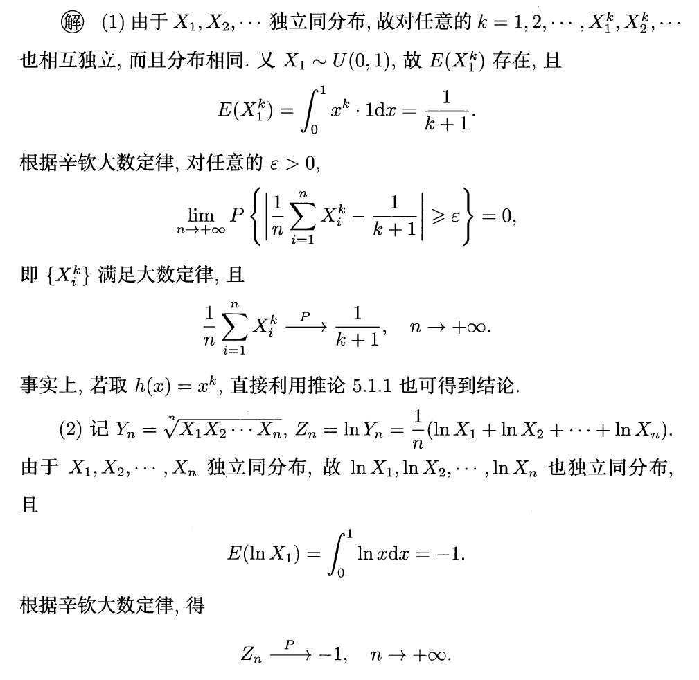
            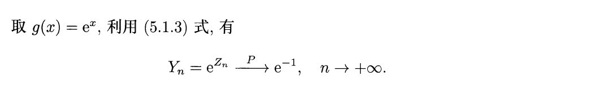
        

!!! abstract "总结"

    个人认为不需要死记上面的式子，只需记住下面提炼的结论，然后再做几道题差不多就悟了。

    - 伯努利大数定律：在n重伯努利试验中，频率稳定于概率
    - 辛钦大数定律：若总体均值存在，则样本均值稳定于总体均值（要用到第6章的知识）

## 中心极限定理

### 独立同分布情形

**林德伯格(Lindeberg)-莱维(Lévy)中心极限定理**：设$\{X_i, i \ge 1\}$为独立同分布的随机变量序列，且期望$E(X_i) = \mu$和方差$Var(X_i) = \sigma^2$均存在$(\sigma > 0)$，则对任意的$x \in \bf{R}$，有：

$$
\begin{align}
\lim\limits_{n \rightarrow +\infty} P\Bigg(\dfrac{\sum\limits_{i=1}^n X_i - E(\sum\limits_{i=1}^n X_i)}{\sqrt{Var(\sum\limits_{i=1}^n X_i)}} \le x \Bigg) & = \lim\limits_{n \rightarrow +\infty} P\Bigg(\dfrac{\sum\limits_{i=1}^n X_i - n\mu}{\sigma \sqrt{n}} \le x \Bigg) \notag \\
& = \dfrac{1}{\sqrt{2 \pi}} \int_{-\infty}^x e^{-\frac{t^2}{2}} \text{d}t = \Phi(x) \notag
\end{align}
$$

- 该定理表明：期望为$\mu$，方差为$\sigma^2$的独立同分布的随机变量的部分和$\sum\limits_{i=1}^n X_i$的标准化变量$\dfrac{\sum\limits_{i=1}^n X_i - n\mu}{\sigma \sqrt{n}}$，当$n$充分大时，近似地服从**标准正态分布**$N(0, 1)$，即：

$$
\dfrac{\sum\limits_{i=1}^n X_i - n\mu}{\sigma \sqrt{n}} \stackrel{\text{approximately}}{\sim} N(0, 1), \text{when n is sufficiently large}
$$

或者记作$\dfrac{1}{n} \sum\limits_{i=1}^n X_i \stackrel{\text{approximately}}{\sim} N(\mu, \dfrac{\sigma^2}{n})$（当$n$充分大时）

??? example "例题"

    === "题目"

        

            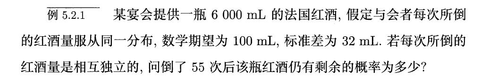
        

    === "解答"

        

            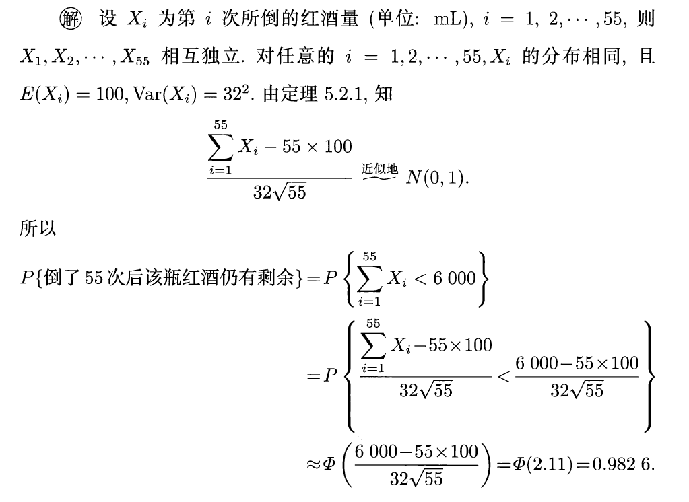
        

---
将该定理用于$n$重伯努利试验，可得如下推论：

**棣莫弗(De Moivre)-拉普拉斯(Laplace)中心极限定理**：设$n_A$为$n$重伯努利试验中事件$A$发生的次数，$p$为事件$A$在每次试验中发生的概率，即$P(A) = p$，则对任意$x \in \bf{R}$，有：

$$
\lim\limits_{n \rightarrow +\infty} P(\dfrac{n_A - np}{\sqrt{np(1 - p)}} \le x) = \dfrac{1}{\sqrt{2 \pi}} \int_{-\infty}^x e^{-\frac{t^2}{2}} \text{d}t = \Phi(x)
$$

- 该定理表明，当$n$充分大时，二项分布$B(n, p)$可用正态分布$N(np, np(1 - p))$来逼近。

??? example "例题"

    === "例1"

        === "题目"

            

                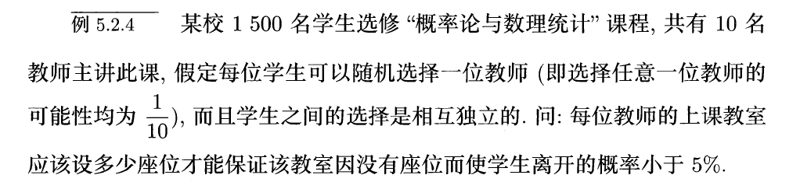
            

        === "解答"

            

                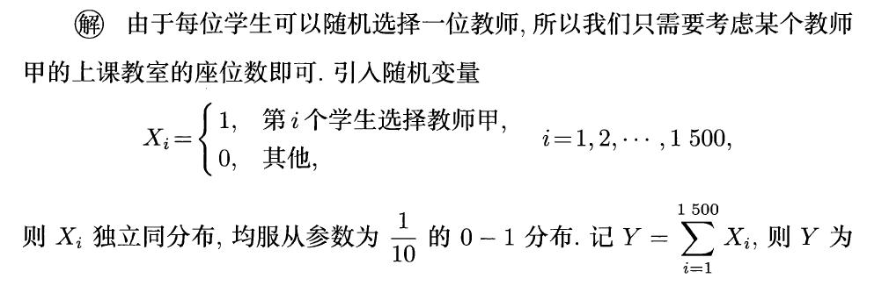
                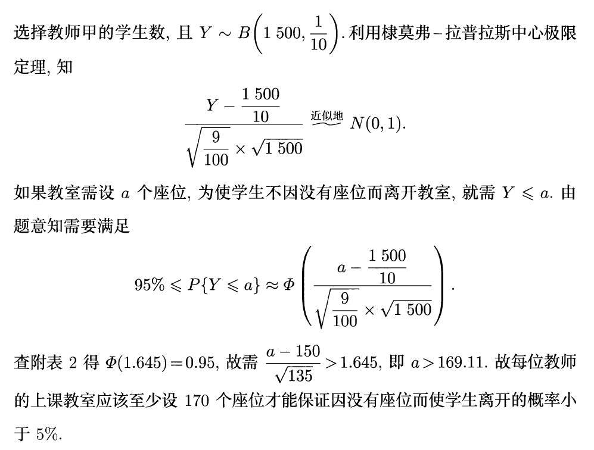
            

    === "例2"

        === "题目"

            

                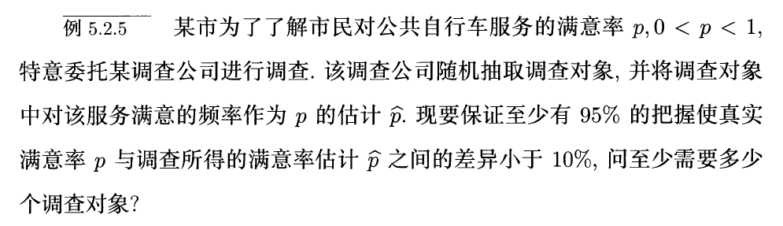
            

        === "解答"

            

                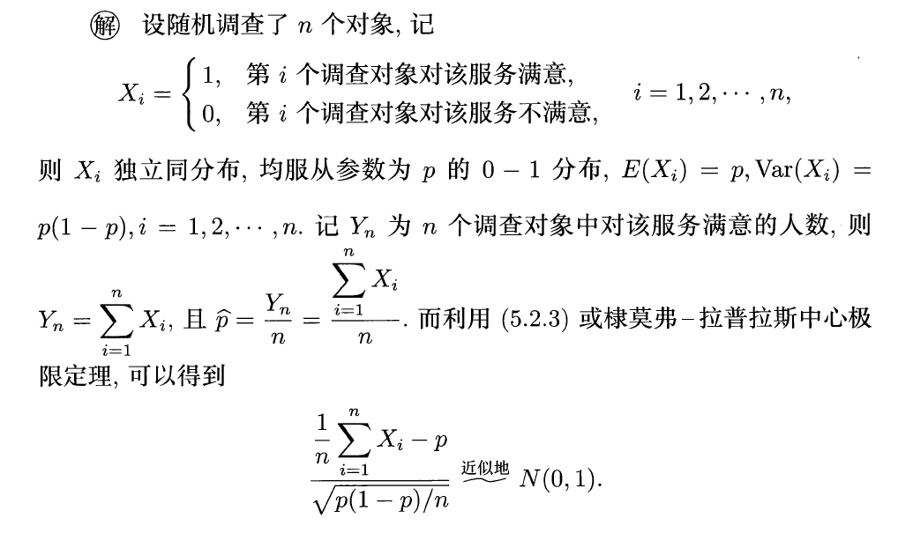
                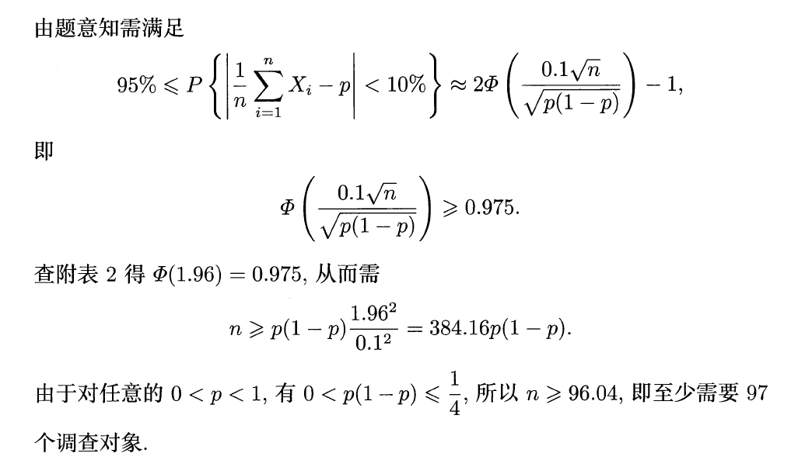
            

!!! abstract "总结"

    独立同分布的中心极限定理实现了**随机变量的一般分布 -> 对应的标准化变量的正态分布**的转化。

### 独立不同分布情形

!!! warning "注意"

    这块内容不考！！！