# 第6章 统计量与抽样分布

## 随机样本与统计量

数理统计中涉及到的基本概念：

- 总体：研究对象的全体
- 个体：总体中的每个成员
- 总体容量：总体包含的个体数量
    - 有限总体：容量有限的总体
    - 无限总体：容量无限的总体
- 对总体的研究，往往仅限于研究对象的一个或几个数量指标
- 可以将指标$X$看作一个随机变量，或者就把$X$看作总体（之后不再区分总体和指标了）
    - 若$X$分布函数为$F(\cdot)$，则也称$F(\cdot)$为总体
    - 若关心总体的多个指标，可以用随机向量$(X_1, X_2, \dots, X_d)$来表示
    
- 数据收集方法：
    - 试验
    - 抽样调查
        - 样本：从总体中抽取的部分个体；样本容量：被抽取的个体数量
        - 样本值（或观测值）：对样本$X_1, X_2, \dots, X_n$这$n$个随机样本进行观测得到的一组实数$x_1, x_2, \dots, x_n$
        - **简单随机样本**/独立同分布(iid.)样本：满足下列性质的来自总体$X$（它具有分布函数$F(\cdot)$）的随机样本$X_1, X_2, \dots, X_n$
            - 独立性：$X_1, X_2, \dots, X_n$是相互独立的随机变量
            - 代表性：每一$X_i$与总体$X$有相同的分布函数
        - 采用有放回抽样得到的样本是简单随机样本；而采用无放回抽样得到的样本不是简单随机样本，但如果是在无限总体或总体容量的情况下，此种抽样方法得到的样本近似为简单随机样本
        - 若无特殊说明，之后提到的「样本」均指简单随机样本
        - 样本的联合分布函数：$F_n(x_1, x_2, \dots, x_n) = \prod\limits_{i=1}^n F(x_i)$
        - 若总体具有连续型分布，其密度函数为$f(x)$，那么样本的联合密度函数为：$f_n(x_1, x_2, \dots, x_n) = \prod\limits_{i=1}^n f(x_i)$

- **统计量**：设$X_1, X_2, \dots, X_n$是来自总体$X$的一个样本，$g(X_1, X_2, \dots, X_n)$是样本$X_1, X_2, \dots, X_n$的函数，若$g$不含未知参数，则称$g(X_1, X_2, \dots, X_n)$是一统计量。常用的统计量有：
    - 样本均值：$\overline{X} = \dfrac{1}{n} \sum\limits_{i=1}^n X_i$
    - 样本方差：$S^2 = \dfrac{1}{n-1} \sum\limits_{i=1}^n (X_i - \overline{X})^2 = \dfrac{1}{n - 1}(\sum\limits_{i=1}^n X_i^2 - n\overline{X}^2)$
    - 样本标准差：$S = \sqrt{S^2} = \sqrt{\dfrac{1}{n-1} \sum\limits_{i=1}^n (X_i - \overline{X})^2}$
    - 样本$k$阶（原点）矩：$A_k = \dfrac{1}{n}\sum\limits_{i=1}^n X_i^k, k = 1, 2, \dots$
    - 样本$k$阶中心矩：$B_k = \dfrac{1}{n} \sum\limits_{i=1}^n(X_i - \overline{X})^k, k = 2, 3, \dots$

    ??? info "说明"

        - 一般地，用样本均值$\overline{X}$作为总体均值$\mu$的估计，用样本方差$S^2$作为总体方差$\sigma^2$的估计，用样本原点矩$A_k$（样本中心矩$B_k$）作为总体原点矩$\mu_k$（总体中心矩$\upsilon_k$）的估计
        - 总体方差的估计可用$S^2$或$B_2$，区别在于前者是无偏估计
        - 总体的任一个未知参数可以有多个不同的估计，因此参数估计不唯一
        - 假设$X_1, X_2, \dots, X_n$是一个从总体$X$中抽取的简单随机样本，$\mu_k = E(X^k)(k = 1, 2, \dots)$存在，由辛钦大数定律可知：

        $$
        A_k = \dfrac{1}{n} \sum\limits_{i=1}^n X_i^k \stackrel{P}{\longrightarrow} \mu_k, n \rightarrow +\infty
        $$

## 几类重要的抽样分布

抽样分布：统计量的分布

### $\chi^2$分布

设$X_1, X_2, \dots, X_n$为独立同分布的随机变量，且都服从标准正态分布$N(0, 1)$，记：

$$
Y = X_1^2 + X_2^2 + \dots + X_n^2
$$

称$Y$服从自由度为$n$的$\chi^2$分布，记作$Y \sim \chi^2(n)$。密度函数为：

$$
f_{\chi^2}(x) = \begin{cases}\dfrac{1}{2^{\frac{n}{2}} \Gamma(\frac{n}{2})}x^{\frac{n}{2} - 1} e^{-\frac{x}{2}} & x > 0 \\ 0 & \text{others}\end{cases}
$$

下图展示了不同$n$值下的密度函数：

    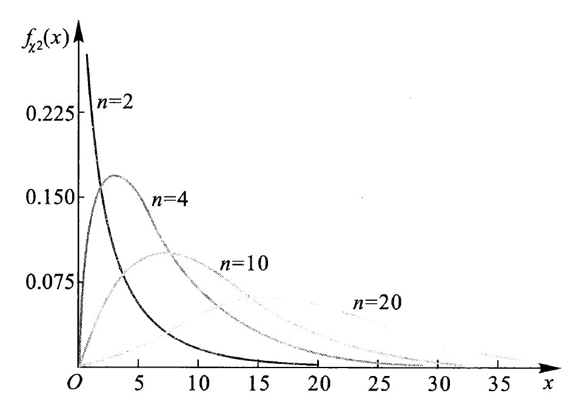

$\chi^2$分布的性质：

- 分布可加性：设$Y_1 \sim \chi^2(m), Y_2 \sim \chi^2(n), m, n \ge 1$，且$Y_1 + Y_2 \sim \chi^2(m + n)$
- 期望和方差：设$Y \sim \chi^2(n)$，则$E(Y) = n, Var(Y) = 2n$
- 分位数：对于给定的正数$\alpha, 0 < \alpha < 1$，称满足条件$P(\chi^2 > \chi_{\alpha}^2(n)) = \int_{\chi_{\alpha}^2(n)}^{+\infty}f_{\chi^2}(x) \text{d}x = \alpha$的$\chi_{\alpha}^2(n)$为$\chi^2(n)$分布的**上（侧）$\alpha$分位数**

    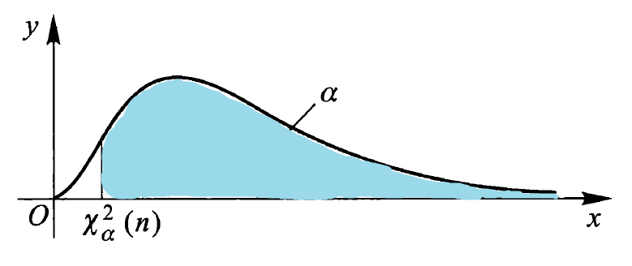

??? abstract "$\chi^2$分布表"

    

        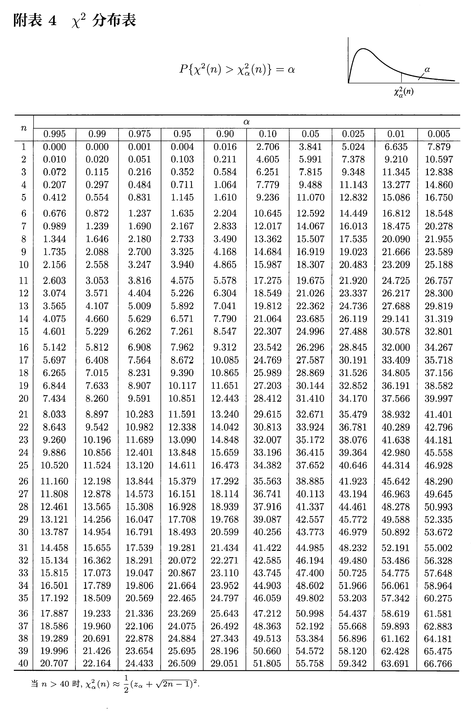
    

### $t$分布

设$X \sim N(0, 1), Y \sim \chi^2(n)$，且$X, Y$相互独立，则称随机变量$t = \dfrac{X}{\sqrt{\frac{Y}{n}}}$服从自由度为$n$的$t$分布（又称为学生氏分布），记为$t \sim t(n)$。它的密度函数为：

$$
f_t(x) = \dfrac{\Gamma[\frac{n + 1}{2}]}{\sqrt{\pi n} \Gamma(\frac{n}{2})}(1 + \dfrac{x^2}{n})^{-\frac{n+1}{2}}, -\infty < x < +\infty
$$

密度曲线函数如图所示：

    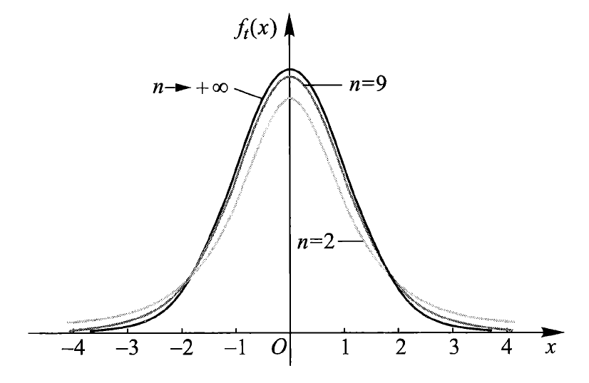

$t$分布的性质：

- 密度函数$f_t(x)$是偶函数，关于$y$轴对称
    - 由密度函数的对称性知：$t_{1 - \alpha}(n) = -t_{\alpha}(n)$
- 由$t$分布的密度函数可以得到：$\lim\limits_{n \rightarrow +\infty} f_t(x) = \dfrac{1}{\sqrt{2 \pi}}e^{\frac{x^2}{2}}$，即当$n$足够大时，$t$分布近似于标准正态分布$N(0, 1)$
- 分位数：对于给定的正数$\alpha, 0 < \alpha < 1$，称满足条件$P(t > t_{\alpha}(n)) = \int_{t_{\alpha}(n)}^{+\infty}f_{t}(x) \text{d}x = \alpha$的$t_{\alpha}(n)$为$t(n)$分布的**上（侧）$\alpha$分位数**

    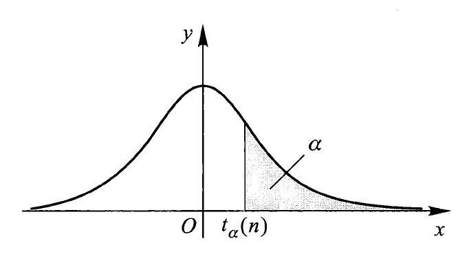

??? abstract "$t$分布表"

    

        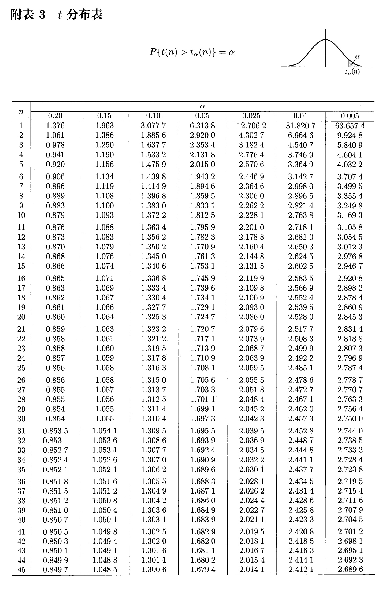
    

### $F$分布

设$U \sim \chi^2(n_1), V \sim \chi^2(n_2)$，且$U$与$V$相互独立，则称随机变量$F = \dfrac{F / n_1}{V / n_2}$服从第一自由度为$n_1$，第二自由度为$n_2$的$F$分布，记为$F \sim F(n_1, n_2)$。密度函数为：

$$
f_F(x) = \dfrac{\Gamma[\frac{n_1 + n_2}{2}] (\frac{n_1}{n_2})^{\frac{n_1}{2}}x^{\frac{n_1}{2}-1}}{\Gamma(\frac{n_1}{2}) \Gamma(\frac{n_2}{2})[1 + \frac{n_1 x}{n_2}]^{\frac{n_1 + n_2}{2}}}, x > 0
$$

密度函数曲线如图所示：

    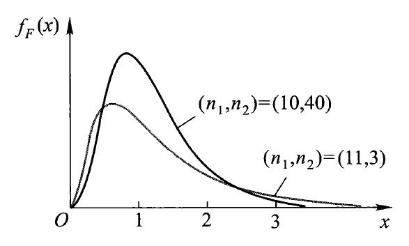

$F$分布的性质：

- 若$F \sim F(n_1, n_2)$，则$\dfrac{1}{F} \sim F(n_2, n_1)$
- 若$X \sim t(n)$，则$X^2 \sim F(1, n)$
- 分位数：对于给定的正数$\alpha, 0 < \alpha < 1$，称满足条件：

    $$
    P(F > F_{\alpha}(n_1, n_2)) = \int_{F_\alpha(n_1, n_2)}^{+\infty} f_F(x) \text{d}x = \alpha
    $$

    的$F_\alpha(n_1, n_2)$为$F(n_1, n_2)$分布的上（侧）$\alpha$分位数，如图所示：

    

        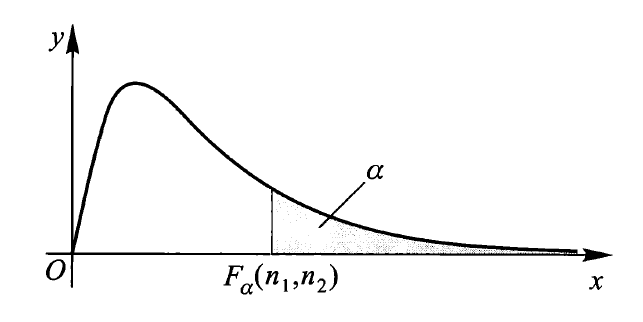
    

    - $F$分布分位数满足如下关系式：$F_{1 - \alpha}(n_1, n_2) = \dfrac{1}{F_\alpha(n_2, n_1)}$

??? abstract "$F$分布表"

    

        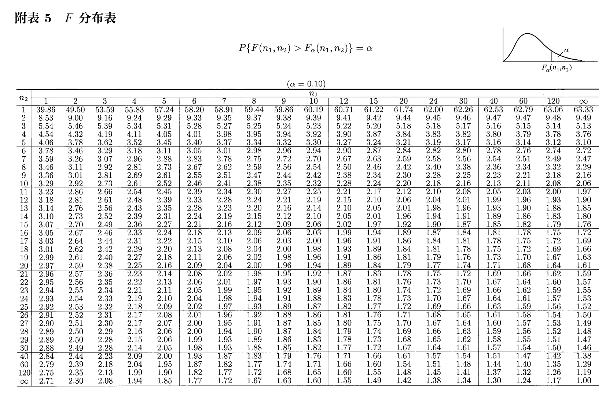
    

    

        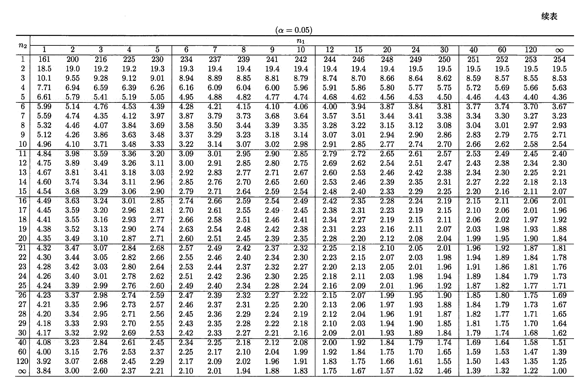
    

    

        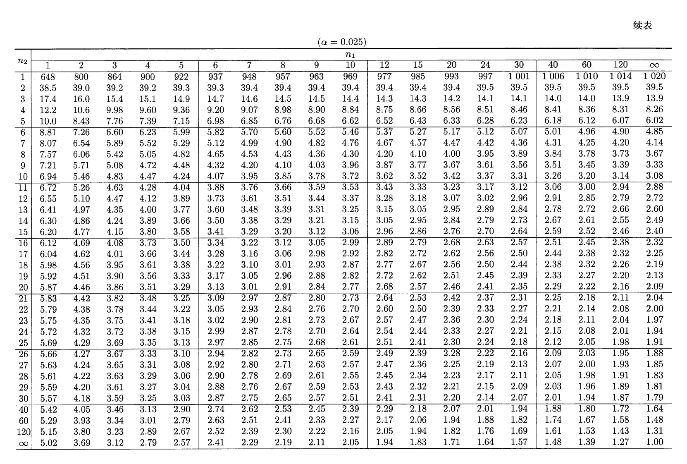
    

    

        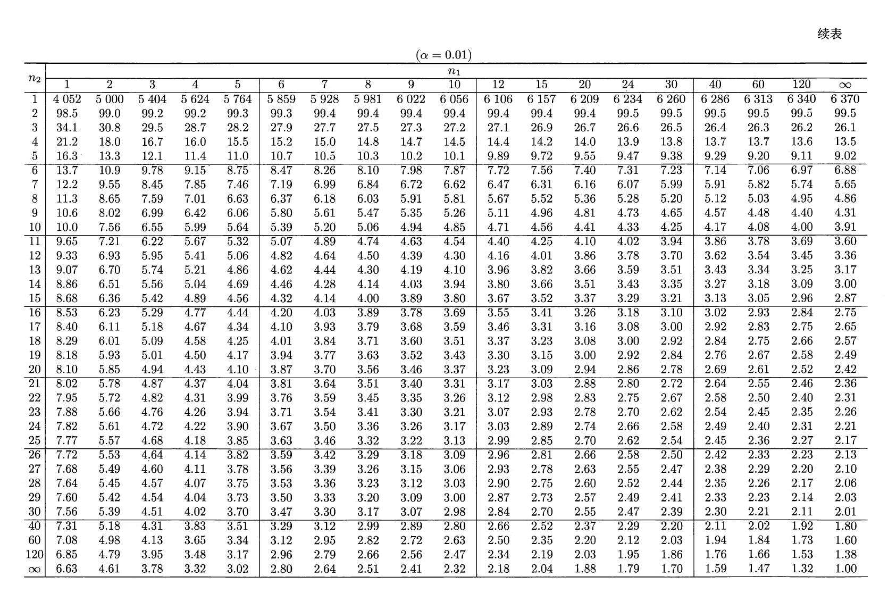
    

    

        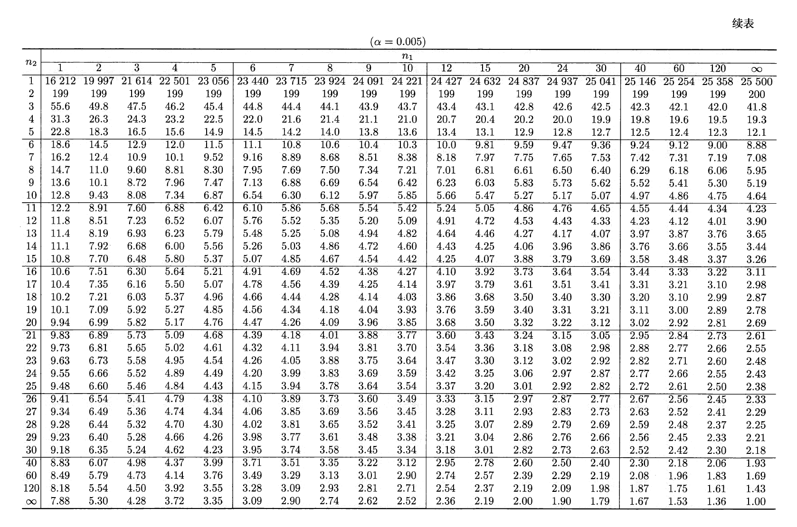
    

## 正态总体下的抽样分布

设$X_1, X_2, \dots, X_n$为来自正态总体$N(\mu, \sigma^2)$的简单随机样本，$\overline{X}$是样本均值，$S^2$是样本方差，则有：

- $\overline{X} \sim N(\mu, \dfrac{\sigma^2}{n})$
- $\dfrac{(n - 1)S^2}{\sigma^2} \sim \chi^2(n - 1)$
- $\overline{X}$与$S^2$相互独立
- $\dfrac{(\overline{X} - \mu)\sqrt{n}}{S} \sim t(n - 1)$

设$X_1, X_2, \dots, X_{n_1}$和$Y_1, Y_2, \dots, Y_{n_2}$分别为来自正态总体$N(\mu_1, \sigma_1^2)$和$N(\mu_2, \sigma_2^2)$的两个相互独立的简单随机样本。记$\overline{X}, \overline{Y}$分别是两个样本的样本均值，$S_1^2, S_2^2$分别是两个样本的样本方差，则有：

- $\dfrac{S_1^2 \cdot \sigma_2^2}{S_2^2 \cdot \sigma_1^2} \sim F(n_1 - 1, n_2 - 1)$
- 当$\sigma_1^2 = \sigma_2^2 = \sigma^2$时，

$$
\dfrac{(\overline{X} - \overline{Y}) - (\mu_1 - \mu_2)}{S_w \sqrt{\frac{1}{n_1} + \frac{1}{n_2}}} \sim t(n_1 + n_2 - 2)
$$

其中，$S_w^2 = \dfrac{(n_1 - 1)S_1^2 + (n_2 - 1)S_2^2}{n_1 + n_2 - 2}, S_w = \sqrt{S_w^2}$