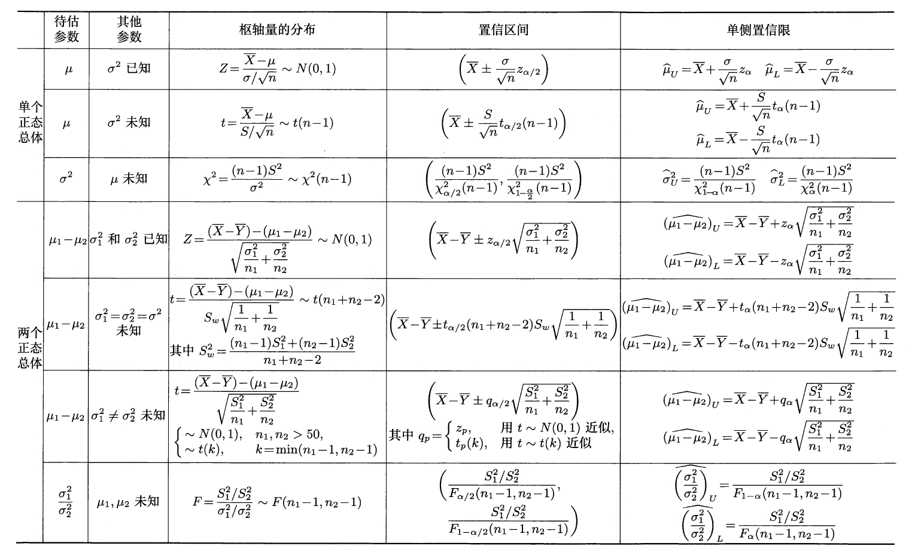

# 第7章 参数估计

## 点估计

设总体$X$的分布函数为$F(x; \theta)$，$\theta$是待估参数，$X_1, X_2, \dots, X_n$是$X$的一个样本。**点估计**问题就是要构造一个适当的统计量$\hat{\theta}(X_1, X_2, \dots, X_n)$，用来估计参数$\theta$。

- 此时称$\hat{\theta}(X_1, X_2, \dots, X_n)$为$\theta$的**（点）估计量**
- 若用样本值$x_1, x_2, \dots, x_n$代替样本，称$\hat{\theta}(x_1, x_2, \dots, x_n)$为$\theta$的**估计值**
- 估计量和估计值统称为**估计**，简记为$\hat{\theta}$

两种常用的点估计方法：矩法、极大似然法。

### 矩法

当样本容量$n \rightarrow +\infty$时，样本矩依概率收敛于相应的总体矩，即：

$$
A_k \stackrel{P}{\longrightarrow} \mu_k, \quad B_k \stackrel{P}{\longrightarrow} v_k
$$

其中$A_k, B_k$分别为样本的$k$阶原点矩和$k$阶中心矩，$\mu_k, v_k$分别为总体的$k$阶原点矩和$k$阶中心矩。因此，矩法的统计思想是：**用样本矩（的函数）作为相应总体矩（同一函数）的估计**。

基本步骤如下：

>设$\theta_1, \theta_2, \dots, \theta_m$是总体$X$的待估参数，并假定$X$的前$m(m \ge 1)$阶矩存在。

1. 求总体$X$的前$m$阶矩（不妨设为原点矩）$\mu_1, \mu_2, \dots, \mu_m$，一般地，这些矩可以写成待估参数$\theta_1, \theta_2, \dots, \theta_m$的函数形式，记为：

    $$
    \begin{cases}
    \mu_1 = E(X) = g_1(\theta_1, \theta_2, \dots, \theta_m), \\
    \mu_2 = E(X^2) = g_2(\theta_1, \theta_2, \dots, \theta_m), \\
    \dots \\
    \mu_m = E(X^m) = g_m(\theta_1, \theta_2, \dots, \theta_m), \\
    \end{cases}
    $$

2. 由上面的方程组，可求出各参数关于前$m$阶矩$\mu_1, \mu_2, \dots, \mu_m$的函数表达式：

    $$
    \theta_k = h_k(\mu_1, \mu_2, \dots, \mu_m), k = 1, 2, \dots, m
    $$

3. 根据矩法思想，以$A_i$代替$\mu_i, i = 1, 2, \dots, m$，即可得各参数的估计量为：

    $$
    \widehat{\theta_k} = h_k(A_1, A_2, \dots, A_m), k = 1, 2, \dots, m
    $$

    称$\widehat{\theta_k}$为参数$\theta_k$的**矩估计量**（$k = 1, 2, \dots, m$）

!!! info "注"

    - 在上面的不等式组中，可以用部分总体中心矩$v_i$代替原点矩$\mu_i$，此时在步骤3中以相应的样本矩$B_i$代替$v_i$即可
    - 矩估计没有涉及总体是正态分布的信息
    - 当样本容量趋于无穷大时，矩估计量依概率收敛于相应的参数，通常称这种估计量为参数的**相合估计**
    - 当总体的分布未知，但知道待估参数关于总体各阶矩的函数形式时，便可求出该参数的矩估计
    - 缺点：在总体分布已知时，没有充分利用总体分布所提供的信息，矩估计量不具有唯一性

### 极大似然法

基本思想：设某事件$A$发生的概率依赖于待估参数$\theta$，如果观察到$A$已发生，那么就使取得事件$A$发生的概率达到最大的$\theta$值作为$\theta$的估计。

设$X$为**离散型总体**，其概率分布律为$P(X = x) = p(x; \theta)$，$\theta \in \Theta$是未知的待估参数，$\Theta$为参数可取值的范围。$X_1, X_2, \dots, X_n$是来自总体$X$的样本，并设$x_1, x_2, \dots, x_n$是已经得到的样本值，则样本$X_1, X_2, \dots, X_n$取到样本值$x_1, x_2, \dots, x_n$的概率为：

$$
P(X_1 = x_1, X_2 = x_2, \dots, X_n = x_n) = \prod\limits_{i=1}^nP(X_i = x_i) = \prod\limits_{i=1}^np(x_i;\theta)
$$

将其记为**似然函数**$L(\theta)$：

$$
L(\theta) = L(\theta; x_1, x_2, \dots, x_n) = \prod\limits_{i=1}^np(x_i;\theta)
$$

形式上，$L(\theta)$与样本联合分布律$p(x_1, x_2, \dots, x_n ; \theta)$相同，但，

- $L(\theta)$是样本值给定时关于$\theta$的函数
- $p(x_1, x_2, \dots, x_n ; \theta)$是参数给定时关于样本值的函数

基于上述思想，应选取$\theta$的估计值$\hat{\theta}$，使得$L(\theta)$取到最大，于是$\hat{\theta}$满足：

$$
L(\hat{\theta}) = L(\hat{\theta}; x_1, x_2, \dots, x_n) = \max\limits_{\theta \in \Theta}L(\theta; x_1, x_2, \dots, x_n)
$$

由此获得的$\hat{\theta} = \hat{\theta}(x_1, x_2, \dots, x_n)$称为参数$\theta$的**极大似然估计值**，相应的统计量$\hat{\theta}(X_1, X_2, \dots, X_n)$称为参数$\theta$的**极大似然估计量**。

---
设$X$为**连续型总体**，其密度函数为$f(x; \theta)$，$\theta \in \Theta$是未知的待估参数。$X_1, X_2, \dots, X_n$是来自总体$X$的样本，并设$x_1, x_2, \dots, x_n$是已经得到的样本值，此时**似然函数**为：

$$
L(\theta) = L(\theta; x_1, x_2, \dots, x_n) = \prod\limits_{i=1}^nf(x_i;\theta)
$$

形式上，$L(\theta)$与样本联合密度函数$f(x_1, x_2, \dots, x_n ; \theta)$相同。

**极大似然估计值**和**极大似然估计量**的定义同离散型版本。寻求极大似然估计常用微分法，有：$\dfrac{\text{d}L(\theta)}{\text{d}\theta} \Big|_{\theta = \hat{\theta}} = 0$，称之为**似然方程**。

为了计算方便，往往对似然函数求对数，记$l(\theta) = \ln L(\theta)$为**对数似然函数**，此时似然方程等价为：$\dfrac{\text{d}l(\theta)}{\text{d}\theta} \Big|_{\theta = \hat{\theta}} = 0$，称为**对数似然方程**。

!!! info "注"

    - 若总体分布含有多个待估参数，可将上文的$\theta$看成向量，此时需要对似然方程的每个参数求偏导数，建立含多个式子的似然方程
    - 当似然方程的解不存在时，往往根据似然函数关于待估参数的单调性来求其极大似然估计

**极大似然估计的不变性**：设参数$\theta$的极大似然估计为$\hat{\theta}$，$\theta^* = g(\theta)$是$\theta$的连续函数，则参数$\theta^*$的极大似然估计为$\widehat{\theta^*} = g(\hat{\theta})$

## 估计量的评价准则

### 无偏性准则

设$\theta \in \Theta$是总体$X$的待估参数，$X_1, X_2, \dots, X_n$是来自总体$X$的样本。若估计量$\hat{\theta} = \hat{\theta}(X_1, X_2, \dots, X_n)$的数学期望存在，且满足：$E(\hat{\theta}) = \theta, \theta \in \Theta$，称$\hat{\theta}$是$\theta$的无偏估计量或**无偏估计**。

- **偏差**：$E(\hat{\theta}) - \theta$（$E(\hat{\theta}) \ne \theta$）
- **渐近无偏估计**：满足$\lim\limits_{n \rightarrow +\infty} E(\hat{\theta}) = \theta$，但$E(\hat{\theta}) \ne \theta$

### 有效性准则

设$\widehat{\theta_1} = \widehat{\theta_1}(x_1, x_2, \dots, x_n), \widehat{\theta_2} = \widehat{\theta_2}(x_1, x_2, \dots, x_n)$都是参数$\theta$的无偏估计，若$\forall \theta \in \Theta, Var_\theta(\widehat{\theta_1}) \le Var_\theta(\widehat{\theta_2})$，且至少有一个$\theta \in \Theta$使不等号成立（？），则称$\widehat{\theta_1}$比$\widehat{\theta_2}$有效。

### 均方误差准则

设$\hat{\theta} = \hat{\theta}(X_1, X_2, \dots, X_n)$是总体参数$\theta$的估计量，称$E[(\hat{\theta} - \theta)^2]$是估计量$\hat{\theta}$的**均方误差**，记为$Mse(\hat{\theta})$。

- 设$\widehat{\theta_1}, \widehat{\theta_2}$都是$\theta$的估计量，若$\forall \theta \in \Theta, Mse(\widehat{\theta_1}) \le Mse(\widehat{\theta_2})$，则称在均方误差准则下，$\widehat{\theta_1}$优于$\widehat{\theta_2}$
- 均方误差准则常用于有偏估计之间，有偏估计与无偏估计之间的比较
- 若$\hat{\theta}$是参数$\theta$的无偏估计量，则$Mse(\hat{\theta}) = Var(\hat{\theta})$，即均方误差准则在无偏估计之间的比较等价于有效性准则
- 在实际情况下，均方误差准则比无偏性准则更重要，即如果一个估计量虽然有偏，但其均方误差较小，有时比方差较大的无偏估计更有用

### 相合性准则

设$\widehat{\theta_n} = \hat{\theta}(X_1, X_2, \dots, X_n)$是总体参数$\theta$的估计量，若$\forall\ \varepsilon > 0$，有：$\lim\limits_{n \rightarrow +\infty}P(|\widehat{\theta_n} - \theta| < \varepsilon) = 1$，即$\widehat{\theta_n}$依概率收敛于$\theta$，称$\widehat{\theta_n}$是$\theta$的**相合估计量**，并记$\widehat{\theta_n} \stackrel{P}{\longrightarrow} \theta, n \rightarrow +\infty$。

- 一般地，由矩法求得的参数估计量都满足相合性
- 对于极大似然估计，在总体分布满足一定条件下，求得的估计量也是待估参数的相合估计量

## 区间估计

### 置信区间

设总体为$X$，$\theta \in \Theta$为待估参数，$X_1, X_2, \dots, X_n$是来自总体$X$的样本，统计量$\widehat{\theta_L} = \widehat{\theta_L}(X_1, X_2, \dots, X_n)$和$\widehat{\theta_U} = \widehat{\theta_U}(X_1, X_2, \dots, X_n)$满足$\widehat{\theta_L} < \widehat{\theta_U}$，且对给定$\alpha \in (0, 1)$和任意$\theta \in \Theta$，有：$P(\widehat{\theta_L} < \theta < \widehat{\theta_U}) \ge 1 - \alpha$，则

- 称随机区间$(\widehat{\theta_L}, \widehat{\theta_U})$是参数$\theta$的**置信水平**为$1 - \alpha$的**置信区间**
    - 置信区间是一个随机区间，对某次具体样本观测来说，有时包含$\theta$，有时不包含$\theta$，且包含$\theta$的可能性至少为$1 - \alpha$
    - 在实际应用中，通常取$\alpha = 0.1$或$0.05$

- $\widehat{\theta_L}, \widehat{\theta_U}$分别称为$\theta$的置信水平是$1 - \alpha$的双侧**置信下限**和**置信上限**
- **精确度**：区间的平均长度$E(\widehat{\theta_U} - \widehat{\theta_L})$
- **误差限**：$\dfrac{1}{2}E(\widehat{\theta_U} - \widehat{\theta_L})$
- **奈曼原则**：当样本容量给定时，置信水平和精确度是相互制约的。因此在保证置信水平达到一定的前提下，尽可能提高精确度。
    - 当总体$X$是**连续型**随机变量时，对于给定置信水平$1 - \alpha$，应使上面的不等式取等号，即$P(\widehat{\theta_L} < \theta < \widehat{\theta_U}) = 1 - \alpha$的随机区间$(\widehat{\theta_L}, \widehat{\theta_U})$作为置信区间
    - 当总体$X$是**离散型**随机变量时，则应选择使$P(\widehat{\theta_L} < \theta < \widehat{\theta_U}) = 1 - \alpha$且尽可能接近$1 - \alpha$的随机区间$(\widehat{\theta_L}, \widehat{\theta_U})$作为置信区间

对于给定的$\alpha \in (0, 1)$，如果统计量$\widehat{\theta_L}, \widehat{\theta_U}$满足：

$$
P(\widehat{\theta_L} < \theta) \ge 1 - \alpha, \quad P(\theta < \widehat{\theta_U}) \ge 1 - \alpha, \quad \theta \in \Theta
$$

那么分别称$\widehat{\theta_L}$和$\widehat{\theta_L}$是参数$\theta$的置信水平为$1 - \alpha$的**单侧置信下限**和**单侧置信上限**。

- 当总体$X$是连续型随机变量时，应选择$\widehat{\theta_L}, \widehat{\theta_U}$使：$P(\widehat{\theta_L} < \theta) = P(\theta < \widehat{\theta_U}) = 1 - \alpha, \theta \in \Theta$
- 设统计量$\widehat{\theta_L}, \widehat{\theta_U}$分别是参数$\theta$的置信水平为$1 - \alpha_1, 1 - \alpha_2$的单侧置信下限和单侧置信上限，且$\widehat{\theta_L} < \widehat{\theta_U}$，那么$(\widehat{\theta_L}, \widehat{\theta_U})$是$\theta$置信水平为$1 - \alpha_1 - \alpha_2$的置信区间。

### 枢轴量法

设总体$X$的密度函数（或概率分布律）为$f(x;\theta)$，其中$\theta$为待估参数，并设$X_1, X_2, \dots, X_n$是来自总体$X$的样本，如果样本和参数$\theta$的函数$G(X_1, X_2, \dots, X_n; \theta)$的分布完全已知，且形式上不依赖于其他未知参数，那么称$G(X_1, X_2, \dots, X_n; \theta)$为**枢轴量**。

寻找$\theta$的置信区间的步骤：

1. 构造一个分布已知的枢轴量$G(X_1, X_2, \dots, X_n; \theta)$
2. 当总体$X$是

    - 连续型随机变量时，对给定的置信水平$1 - \alpha$，根据枢轴量$G(X_1, X_2, \dots, X_n; \theta)$的分布，适当地选择两个常数$a, b$，使：

    $$
    P_\theta (a < G(X_1, X_2, \dots, X_n; \theta) < b) = 1 - \alpha
    $$

    - 离散型随机变量时，对给定的置信水平$1 - \alpha$，选择常数$a, b$满足：

    $$
    P_\theta (a < G(X_1, X_2, \dots, X_n; \theta) < b) \ge 1 - \alpha \text{ and be close to } 1- \alpha \text{ as much as possible}
    $$

3. 假如参数可以从$G(X_1, X_2, \dots, X_n; \theta)$中分离出来，不等式$a < G(X_1, X_2, \dots, X_n; \theta) < b$可以等价地转化为$\widehat{\theta_L} < \theta < \widehat{\theta_U}$
    - 对于连续型总体：

    $$
    P(\widehat{\theta_L} < \theta < \widehat{\theta_U}) = 1 - \alpha
    $$

    - 对于离散型总体：

    $$
    P(\widehat{\theta_L} < \theta < \widehat{\theta_U}) \ge 1 - \alpha \text{and be close to } 1 - \alpha \text{ as much as possible}
    $$    

    表明$(\widehat{\theta_L}, \widehat{\theta_U})$是$\theta$的置信水平为$1 - \alpha$的置信区间

???+ info "注"

    对于步骤2，满足式子的常数$a, b$的解是不唯一的。根据奈曼原则，应选择使置信区间$(\widehat{\theta_L}, \widehat{\theta_U})$的平均长度达到最短的$a, b$，习惯上取$a, b$满足：

    $$
    \begin{align}
    & P_\theta (G(X_1, X_2, \dots, X_n; \theta) \le a) \notag \\ 
    = & P_\theta (G(X_1, X_2, \dots, X_n; \theta) \ge b) \notag \\
    = & \dfrac{\alpha}{2} \notag
    \end{align}
    $$

## 正态总体参数的区间估计

打LaTeX公式太累了，所以下面就直接贴上课本给的表格，公式都是整理好的：

    

## 非正态总体参数的区间估计

### 0-1分布参数的区间估计

设总体$X$服从0-1分布分布$B(1, p), X_1, X_2, \dots, X_n$是来自总体$X$的样本，当$n$充分大时，由中心极限定理知：

$$
\dfrac{\sum\limits_{i=1}^n X_i - np}{\sqrt{np(1-p)}} = \dfrac{n \overline{X} - np}{\sqrt{np(1-p)}}
$$

近似服从标准正态分布$N(0, 1)$，于是有：

$$
P\Big(- z_{\alpha / 2} < \dfrac{n \overline{X} - np}{\sqrt{np(1-p)}} < z_{\alpha / 2}\Big) \approx 1 - \alpha
$$

等价于：

$$
P((n + z_{\alpha / 2}^2)p^2 - (2n \overline{X} + z_{\alpha / 2}^2)p + n\overline{X}^2 < 0) \approx 1 - \alpha
$$

求一元二次方程，可得参数$p$的置信水平为$1 - \alpha$的近似置信区间为：

$$
(\dfrac{1}{2 \alpha}(-b - \sqrt{b^2 - 4ac}), \dfrac{1}{2 \alpha}(-b + \sqrt{b^2 - 4ac})) = (\widehat{p_L}, \widehat{p_U})
$$

其中$a = n + z_{\alpha / 2}^2, b = -(2n\overline{X} + z_{\alpha / 2}^2), c = n\overline{X}^2$，取$p(1-p)$的估计量为$\overline{X}(1 - \overline{X})$，得参数$p$的置信水平为$1 - \alpha$的近似置信区间为：

$$
\Big(\overline{X} - z_{\alpha / 2}\sqrt{\dfrac{\overline{X}(1 - \overline{X})}{n}}, \overline{X} + z_{\alpha / 2}\sqrt{\dfrac{\overline{X}(1 - \overline{X})}{n}}\Big)
$$

在实际应用中，通常要满足$n > 30$且$np > 5, n(1-p) > 5$

### 其他均值分布$\mu$的区间估计

设总体$X$的均值为$\mu$, 方差为$\sigma^2$，$X_1, X_2, \dots, X_n$是来自总体$X$的样本，当$n$充分大时（$n > 50$），由中心极限定理知：

$$
\dfrac{\sum\limits_{i=1}^n X_i - n\mu}{\sqrt{n}\sigma} \stackrel{\text{approximately}}{\sim} N(0, 1)
$$

故$\mu$的置信水平为$1-\alpha$的近似置信区间为：$(\overline{X} \pm \dfrac{\sigma}{\sqrt{n}}z_{\alpha / 2})$。如果方差未知，可用估计量$S^2$代替$\sigma^2$。

???+ info "注"

    当样本容量$n \le 50$时，$t$分布具有良好的统计稳健性，即当总体$X$不服从正态分布，但样本数据基本对称时，枢轴量$\dfrac{\overline{X} - \mu}{S / \sqrt{n}}$仍可以看成近似服从分布$t(n - 1)$，从而均值$\mu$的置信水平为$1-\alpha$的近似置信区间为：$(\overline{X} \pm \dfrac{S}{\sqrt{n}}t_{\alpha / 2}(n - 1))$