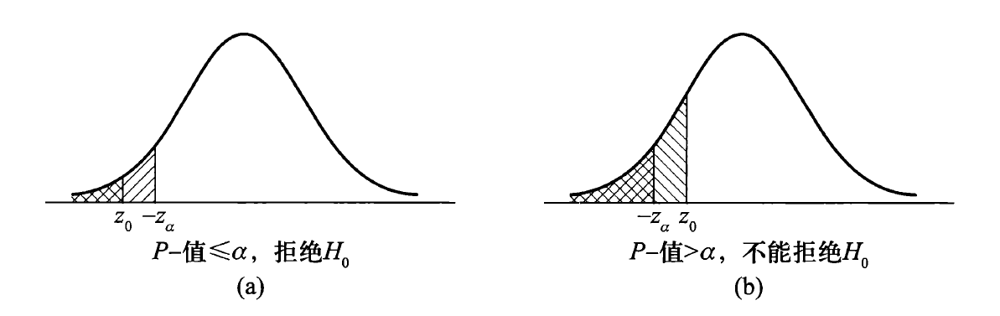

# 第8章 假设检验

??? abstract "核心知识"

    - 一些基本概念：两类假设、三种检验、两类错误、拒绝域、P-值
    - 正态总体参数的假设检验
        - 单个/两个正态总体、有关均值/方差的假设检验
        - 与第7章“正态总体的区间估计”相关知识结合起来理解

## 假设检验的基本思想

- 问题的提出
    - 假设$H$，同时提出两个完全相反的假设，分别为**原假设/零假设**$H_0$和**备择假设/对立假设**$H_1$（<u>备择假设一般是我们想要支持的假设</u>）
    - 关于总体参数$\theta$的假设，有三种情况（$\theta_0$为已知常数）：
        - **左侧检验**：$H_0: \theta \ge \theta_0, H_1: \theta < \theta_0$
        - **右侧检验**：$H_0: \theta \le \theta_0, H_1: \theta > \theta_0$
        - 前两种检验合称为**单侧检验**，还有两种形式为（需要知道）：
            - $H_0: \theta = \theta_0, H_1: \theta < \theta_0$（与第1种几乎相同）
            - $H_0: \theta = \theta_0, H_1: \theta > \theta_0$（与第2种几乎相同）
        - **双侧检验**：$H_0: \theta = \theta_0, H_1: \theta \ne \theta_0$

- 检验统计量和拒绝域
    - **检验统计量**：在假设问题中取值大小和原假设$H_0$是否成立有密切关系的统计量
        - 一般情况下，我们用上一章介绍过的**枢轴量**作为检验统计量
    - **拒绝域**$W$：拒绝原假设$H_0$的样本值范围（样本空间的一个子集）
        - 若样本落入$W$，就拒绝$H_0$

        :star:**结论**：
        
        - 左侧检验：$W = \{G_0 < g_{1 - \alpha}\}$
        - 右侧检验：$W = \{G_0 > g_\alpha\}$
        - 双侧检验：
            - $\mu$相关：$W = \{|G_0| > g_{\alpha / 2}\}$
            - $\sigma^2$相关：$W = \{G_0 < g_{1 - \alpha / 2} \cup G_0 > g_{\alpha / 2}\}$

    - **接受域**$\overline{W}$：拒绝域的补集

    !!! abstract "总结"

        对于正态总体的区间估计和假设检验，可以发现以下对应关系：

        - **双侧**置信区间 <-> **双侧**检验的接受域
        - 单侧置信**下限** <-> **左侧**检验的接受域
        - 单侧置信**上限** <-> **右侧**检验的接受域

- 两类错误
    - 在假设检验中可能出现下列四种情形：
        - 拒绝了一个错误的原假设:+1:
        - 接受了一个真实的原假设:+1:
        - 拒绝了一个真实的原假设:-1: -> **第I类错误/弃真错误**，发生概率记为$\alpha$
        - 接受了一个错误的原假设:-1: -> **第II类错误/存伪错误**，发生概率记为$\beta$

    - 计算公式：

    $$
    \begin{align}
    \alpha & = P(\text{type I error}) = P(\text{reject } H_0 | H_0 \text{ is true}) = P_{H_0}(\text{reject } H_0) \notag \\
    & = P\{(x_1, x_2, \dots, x_n) \in W | H_0 \text{ is true}\} \notag \\
    \beta & = P(\text{type II error}) = P(\text{accpet } H_0 | H_0 \text{ is false}) = P_{H_1}(\text{accept } H_0) \notag \\
    & = P\{(x_1, x_2, \dots, x_n) \in \overline{W} | H_0 \text{ is false}\} \notag
    \end{align}
    $$

    - **奈曼-皮尔逊原则**：
        - 首先控制第I类错误的概率，即选定一个常数$\alpha \in (0, 1)$，要求犯第I类错误的概率不超过$\alpha$
        - 然后在满足这个约束条件的检验下，在寻找检验，使得犯第II类错误的概率尽可能小
        - $\alpha$称为**显著性水平**，常取$\alpha = 0.01, 0.05, 0.10$等

- P-值与统计显著性
    - **P-值**：当原假设$H_0$为真时，检验统计量取比观察到的结果更为极端的数值的概率，用于衡量拒绝$H_0$的理由是否充分，其值越小拒绝$H_0$的理由越充分
    - 若P-值$\le \alpha$，则**拒绝**原假设，此时称检验结果在显著性水平$\alpha$下是**统计显著**的

    :star:**结论**：

    - 左侧检验：$P_{-} = P(g < G_0)$
    - 右侧检验：$P_{-} = P(g > G_0)$
    - 双侧检验：
        - $\mu$相关：$P_{-} = 2P(g > |G_0|)$
        - $\sigma^2$相关：$P_{-} = 2 \min\{P(g > G_0), P(g < G_0)\}$

    - 具体方法：在试卷第一页抬头寻找$g_A = G_0$，则$P(g < G_0) = 1 - A, P(g > G_0) = A$
    

处理假设检验问题的基本步骤：

1. 根据实际问题提出原假设和备择假设
2. 提出检验统计量和拒绝域的形式
3. 根据奈曼-皮尔逊原则和给定的显著性水平$\alpha$，求出拒绝域$W$中的临界值
4. 根据实际样本值作出判断

3和4也可如下进行：

- 计算检验统计量的观测值和P-值
- 根据给定的显著性水平$\alpha$作出判断

## 正态总体参数的假设检验

### 单个正态总体

设正态总体$X \sim N(\mu, \sigma^2), X_1, X_2, \dots, X_n$是来自该总体的样本，记样本均值为$\overline{X}$，样本方差为$S^2$。

#### 有关均值的假设检验

!!! info "注"

    对于之后的6张图片，用`/`表示的阴影部分面积为$\alpha$，用`\`表示的阴影部分面积为P-值。

- $\sigma^2$已知 -> **Z检验**
    - 检验统计量：$Z = \dfrac{\overline{X} - \mu_0}{\sigma / \sqrt{n}}$，对应的取值为$z_0$
    - 双侧假设：$H_0: \mu = \mu_0, H_1: \mu \ne \mu_0$
        - 拒绝域：$W = \{|Z| = \Big|\dfrac{\overline{X} - \mu_0}{\sigma / \sqrt{n}}\Big| \ge z_{\alpha / 2}\}$

        

            
        

        - P-值 = $P_{H_0}(|Z| \ge |z_0|) = 2P_{H_0}(Z \ge |z_0|) = 2(1 - \Phi(|z_0|))$。当P-值$\le \alpha$时，拒绝原假设，否则不能拒绝，如图所示：

        

            
        

    - 左侧假设：$H_0: \mu \ge \mu_0, H_1: \mu < \mu_0$
        - 拒绝域：$W = \{Z = \dfrac{\overline{X} - \mu_0}{\sigma / \sqrt{n}} \le -z_{\alpha}\}$
        - P-值 = $\sup\limits_{\mu \ge \mu_0} P(Z \le z_0) = P(Z \le z_0 | \mu = \mu_0) = \Phi(z_0)$，若P-值$\le \alpha$，则拒绝原假设$H_0$，否则不能拒绝

        

            
        

    - 右侧假设：$H_0: \mu \le \mu_0, H_1: \mu > \mu_0$
        - 拒绝域：$W = \{Z = \dfrac{\overline{X} - \mu_0}{\sigma / \sqrt{n}} \ge z_\alpha\}$
        - P-值 = $\sup\limits_{\mu \ge \mu_0} P(Z \ge z_0) = P(Z \ge z_0 | \mu = \mu_0) = 1 - \Phi(z_0)$

        

            
        

- $\sigma^2$未知：用样本方差$S^2$代替$\sigma^2$ -> **t检验**
    - 检验统计量：$T = \dfrac{\overline{X} - \mu_0}{S / \sqrt{n}} \sim t(n - 1)$，对应的取值为$t_0$
    - 双侧假设：$H_0: \mu = \mu_0, H_1: \mu \ne \mu_0$
        - 拒绝域：$W = \{|T| = \Big|\dfrac{\overline{X} - \mu_0}{S / \sqrt{n}}\Big| \ge t_{\alpha / 2}(n - 1)\}$
        - P-值 = $2P(t(n-1) \ge |t_0|)$
    - 左侧假设：$H_0: \mu \ge \mu_0, H_1: \mu < \mu_0$
        - 拒绝域：$W = \{T = \dfrac{\overline{X} - \mu_0}{S / \sqrt{n}} \le -t_{\alpha}(n - 1)\}$
        - P-值 = $\sup\limits_{\mu \ge \mu_0} P(T \le t_0) = P(t(n - 1) \le t_0)$
    - 右侧假设：$H_0: \mu \le \mu_0, H_1: \mu > \mu_0$
        - 拒绝域：$W = \{T = \dfrac{\overline{X} - \mu_0}{S / \sqrt{n}} \ge t_{\alpha}(n - 1)\}$
        - P-值 = $\sup\limits_{\mu \le \mu_0} P(T \ge t_0) = P(t(n - 1) \ge t_0)$

#### 有关方差的假设检验

此时用到的检验为**$\chi^2$检验**

不妨假设$\mu$是未知的，假设问题包括：

- 双侧假设：$H_0: \sigma^2 = \sigma_0^2, H_1: \sigma^2 \ne \sigma_0^2$
- 左侧假设：$H_0: \sigma^2 \ge \sigma_0^2, H_1: \sigma^2 < \sigma_0^2$
- 右侧假设：$H_0: \sigma^2 \le \sigma_0^2, H_1: \sigma^2 > \sigma_0^2$

其中$\sigma_0^2$为已知常量，此时$\sigma^2$的无偏估计量$S^2 = \dfrac{1}{n - 1}\sum\limits_{i=1}^n(X_i - \overline{X})^2$，取检验统计量$\chi^2 = \dfrac{(n - 1)S^2}{\sigma_0^2}$，当$\sigma^2 = \sigma_0^2$时，$\chi^2 \sim \chi^2(n - 1)$。

在给定显著性水平$\alpha$时，有拒绝域：

- 双侧检验：$W = \{\chi^2 \ge \chi_{\alpha / 2}^2(n - 1) \text{ or } \chi^2 \le \chi_{1 - \alpha / 2}^2(n - 1)\}$
- 左侧检验：$W = \{\chi^2 \le \chi_{1 - \alpha}^2(n - 1)\}$
- 右侧检验：$W = \{\chi^2 \ge \chi_{\alpha}^2(n - 1)\}$

计算P-值：$p_0 = P_{\sigma^2 = \sigma_0^2}(\dfrac{(n - 1)S^2}{\sigma_0^2} \le \dfrac{(n - 1)s^2}{\sigma_0^2}) = P(\chi^2(n - 1) \le \chi_0^2)$

- 双侧检验：P-值 = $2 \min\{p_0, 1 - p_0\}$
- 左侧检验：P-值 = $p_0$
- 右侧检验：P-值 = $1 - p_0$

### 两个正态总体

设正态总体$X \sim N(\mu_1, \sigma_1^2), Y \sim N(\mu_2, \sigma_2^2), X_1, X_2, \dots, X_{n1}, Y_1, Y_2, \dots, Y_{n2}$分别是来自这两个总体的样本，记：

- $\overline{X} = \dfrac{1}{n_1}\sum\limits_{i=1}^{n_1} X_i,\ S_1^2 = \dfrac{1}{n_1-1} \sum\limits_{i=1}^{n_1} (X_i - \overline{X})^2$
- $\overline{Y} = \dfrac{1}{n_2}\sum\limits_{j=1}^{n_2} Y_i,\ S_2^2 = \dfrac{1}{n_2-1} \sum\limits_{j=1}^{n_2} (Y_i - \overline{Y})^2$

#### 有关均值的假设检验

考虑双侧假设问题：$H_0: \mu_1 = \mu_2, H_1: \mu_1 \ne \mu_2$，当原假设$H_0$成立时，两样本均值取值比较接近，即$|\overline{X} - \overline{Y}|$取值偏小，因此取检验统计量为$\overline{X} - \overline{Y}$

- $\sigma_1^2, \sigma_2^2$已知 -> **Z检验**
    - 拒绝域：$W = \{\dfrac{|\overline{X} - \overline{Y}|}{\sqrt{\frac{\sigma_1^2}{n_1} + \frac{\sigma_2^2}{n_2}}} \ge z_{\alpha / 2}\}$
    - P-值 = $P_{H_0}(|Z| \ge |z_0|) = 2(1 - \Phi(|z_0|))$，其中$Z \sim N(0, 1)$，$z_0$为给定样本值时检验统计量的取值

- $\sigma_1^2 = \sigma_2^2 = \sigma^2$但未知 -> **两样本精确t检验**
    - 检验统计量：$T = \dfrac{\overline{X} - \overline{Y}}{S_w \sqrt{\frac{1}{n_1} + \frac{1}{n_2}}}$
    - 拒绝域：$W = \{|T| \ge t_{\alpha / 2}(n_1 + n_2 - 2)\}$
    - P-值 = $P_{H_0}(|T| \ge |t_0|) = 2P(t(n_1 + n_2 - 2) \ge |t_0|)$，其中$t_0$为给定样本值时检验统计量$T$的取值

- $\sigma_1^2 \ne \sigma_2^2$且未知

    ??? warning "注意：该情况不考，仅做了解（感兴趣的话可以点击展开阅读）"

        - 检验统计量：$T = \dfrac{\overline{X} - \overline{Y}}{\sqrt{\frac{S_1^2}{n_1} + \frac{S_2^2}{n_2}}}$
        - 拒绝域：$W = \{|T| \ge z_{\alpha / 2}\}$
        - P-值 = $P_{H_0}(|T| \ge |t_0|) = 2P(Z \ge |t_0|)$，其中$Z \sim N(0, 1)$，$t_0$为给定样本值时检验统计量$T$的取值
        - 对于小样本情形，上述统计量$T$近似服从t分布 -> **两样本近似t检验**
            - 自由度为$k = \min\{n_1 - 1, n_2 - 1\}$
            - 更精确的近似自由度$k = \dfrac{(S_1^2 / n_1 + S_2^2 / n_2)^2}{\frac{(S_1^2 / n_1)}{n_1 - 1} + \frac{(S_2^2 / n_2)^2}{n_2 - 1}}$
            - 拒绝域：$W = \{|T| \ge t_{\alpha / 2}(k)\}$
            - P-值 = $P_{H_0}(|T| \ge |t_0|) = 2P(t(k) \ge |t_0|)$

#### 有关方差的假设检验

考虑假设问题：$H_0: \sigma_1^2 = \sigma_2^2, H_1: \sigma_1^2 \ne \sigma_2^2$，取检验统计量$F = \dfrac{S_1^2}{S_2^2}$。当$H_0$检验时，$F \sim F(n_1 - 1, n_2 - 1)$，此时$F$的取值既不能偏大也不能偏小，因此检验的拒绝域为：

$$
W = \{F \ge F_{\alpha / 2}(n_1 - 1, n_2 - 1) \text{ or } F \le F_{1 - \alpha / 2}(n_1 - 1, n_2 - 1)\}
$$

将样本值代入后得到的检验统计量的值记为$f_0$，即$f_0 = \dfrac{s_1^2}{s_2^2}$，设：

$$
p_0 = P_{\sigma_1^2 = \sigma_2^2}(\dfrac{S_1^2}{S_2^2} \le \dfrac{s_1^2}{s_2^2}) = P(F(n_1 - 1, n_2 - 1) \le f_0)
$$

P-值为

- 双侧检验：$2\min\{p_0, 1 - p_0\}$
- 左侧检验：$p_0$
- 右侧检验：$1 - p_0$

???+ abstract "总结：正态总体均值、方差的检验法"

    

        
        
    

## 假设检验与区间估计

设$X_1, X_2, \dots, X_n$是来自正态总体$N(\mu, \sigma^2)$的样本，其中方差$\sigma^2$已知，此时$\mu$的置信水平为$1 - \alpha$的置信区间为：$\Big(\overline{X} - \dfrac{\sigma}{\sqrt{n}}z_{\alpha / 2}, \overline{X} + \dfrac{\sigma}{\sqrt{n}}z_{\alpha / 2}\Big)$

对于均值$\mu$的双侧假设问题，在给定显著性水平$\alpha$下，

- 拒绝域：$W = \{\Big|\dfrac{\overline{X} - \mu_0}{\sigma / \sqrt{n}}\Big| \ge z-{\alpha / 2}\}$
- 接受域：$\overline{W} = \{\Big|\dfrac{\overline{X} - \mu_0}{\sigma / \sqrt{n}}\Big| < z-{\alpha / 2}\} = \{\overline{X} - \dfrac{\sigma}{\sqrt{n}}z_{\alpha / 2} < \mu_0 < \overline{X} + \dfrac{\sigma}{\sqrt{n}}z_{\alpha / 2}\}$，即接受域正好是这个置信区间

---
对应一般情况，设$X_1, X_2, \dots, X_n$是来自总体$ X\sim F(x; \theta)$的样本，

- 如果双侧假设问题的显著性水平为$\alpha$的接受域$\overline{W}$能等价地写成$\widehat{\theta_L} < \theta_0 < \widehat{\theta_U}$的形式，那么$(\widehat{\theta_L}, \widehat{\theta_U})$是$\theta$的置信水平为$1 - \alpha$的置信区间
- 反之也成立

## 拟合优度检验

!!! warning "注"

    这块内容不考！！！

设$F(x)$是总体的未知的分布函数，又设$F_0(x)$是具有某种已知类型的分布函数，但可能含有若干未知参数，需验证假设$H_0: F(x) = F_0(x)$，这类分布的假设验证称为**拟合优度检验**。下面主要讨论皮尔逊拟合优度$\chi^2$检验。

基本思想（要求样本容量$n \ge 50$，且$np_i$（或$n\widehat{p_i}$））$\ge 5$：

- 对总体$X$的取值分为互不相容的$k$类，记为$A_1, A_2, \dots, A_k$；设$X_1, X_2, \dots, X_n$是来自该总体的样本，并记$n_i$为样本值落在$A_i$类的个数（**实际频数**）
- 当$H_0$中的$F_0(x)$完全已知时，计算$p_i = O_{H_0}(A_i), i = 1, 2, \dots, k$
- 假设$H_0$中的$F_0(x)$含有$r$个未知参数时，要先在$F_0(x)$的形式下利用极大似然法估计$r$个未知的参数，然后求得$p_i$的估计值$\widehat{p_i}$
- 当$H_0$为真时，$n$个个体中属于$A_i$的“期望个数”应为$np_i$（或$n\widehat{p_i}$）（**理论频数**）
- $\chi^2 = \sum\limits_{i=1}^k\dfrac{(n_i - np_i)^2}{np_i}$（或$\chi^2 = \sum\limits_{i=1}^k\dfrac{(n_i - n\widehat{p_i})^2}{n\widehat{p_i}}$）作为衡量实际频数与理论频数偏差的综合指标，当$H_0$为真时，$\chi^2$的值偏小
- 拒绝域：$W = \{\chi^2 \ge C\}$，其中临界值$C$为待定常数
- 极限定理：若$n$充分大，则当$H_0$为真时，统计量$\chi^2$近似服从$\chi^2(k - r - 1)$分布，其中$k$为分类数，$r$为$F_0(x)$中含有的未知参数个数，当$F_0(x)$完全已知时，$r = 0$
    - 有关上述分布假设的显著性水平$\approx \alpha$的拒绝域为$W = \{\chi^2 \ge \chi_{\alpha}^2(k - r - 1)\}$
    - P-值 = $P(\chi^2(k - r - 1) \ge \chi_0^2)$，其中$\chi_0^2$为$\chi^2$的观测值，称该P-值为拟合优度，其值越大，越无法拒绝原假设。给定$\alpha$，当P-值$\le \alpha$时，就拒绝原假设