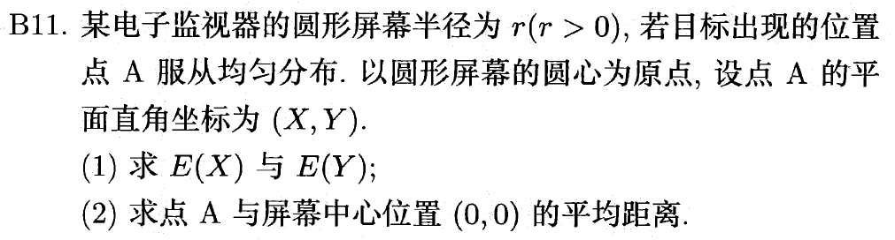

# 题目整理

!!! info "注"

    以下题目来自教材课后习题和历年卷上的题目，供复习参考。

    答案都是基于我自己的思考后再写的，不是完全抄参考答案的，不然就没什么复习效果了。

    有些题目我没有给出答案，只是列出我摘录的理由，起到警醒自己的作用。

题目格式：

!!! question "题目"

    题目内容

    ??? note "解答"

        答案略(bushi)

## 第1章

## 第2章

## 第3章

!!! question "题目"

    

        
    

    ??? note "解答"

        第(1)小题和第(3)小题略，解得$c = 6$

        下面只分析第(2)小题：

        - 令$Z = X + Y$，题目转化为求$P(Z \le 1) = F_Z(1)$
        - 下面就是一通二重积分的计算，要注意的是**积分变量的范围**，这个很容易搞错（这也是我摘录这道题的原因）
            - $F_Z(z) = \int_{-\infty}^zf_Z(t)\text{d}t$
            - 概率密度函数：$f_Z(z) & = \int_{-\infty}^{+\infty}f(z - y, y)\text{d}y$
            - 计算（尤其注意$y$的积分范围）：

            $$
            \begin{align}
            F_Z(1) & = \int_0^1 \int_{\frac{z}{2}}^{z} 6(2y - z) \text{d}y \text{d}z \notag \\
            & = \int_0^1 (6y^2 - 6zy) \Big|_{\frac{z}{2}}^z \text{d}z \notag \\
            & = \int_0^1 \dfrac{3}{2}z^2 \text{d}z \notag \\
            & = \dfrac{1}{2}z^3 \Big|_0^1 \notag \\
            & = \dfrac{1}{2} \notag
            \end{align}
            $$

        
!!! question "题目"

    

        
    

    ??? note "解答"

        很容易得到$f_Z(z) = \int_{-\infty}^{+\infty} f(z - y, y)\text{d}y = \int_{-\infty}^{+\infty} \dfrac{3 - z}{3}\text{d}y$，麻烦的点在于确定$y$的积分范围——除了题目给出的$0 < y < 2$之外，我们还可以得到另一个范围：$0 < z - y < 1$，即$z - 1 < y < z$，因此需要**分类讨论**。请务必仔细计算各种情况下的密度函数，答案就不列出来了，计算不难。

## 第4章

!!! question "题目"

    

        
    

    ??? note "解答"

        - 这道题的二维随机变量服从均匀分布，联合密度函数为取值范围（面积）的倒数
        - 第(1)小题的期望计算类似一维随机变量，但是要用联合密度函数+二重积分
        - 第(2)小题
            - 令平均距离$Z = \sqrt{X^2 + Y^2}$，原题转化为求$E(Z)$
            - $F_Z(z) = P(Z \le z) = P(X^2 + Y^2 \le z^2) = \dfrac{\pi z^2}{\pi r^2} = \dfrac{z^2}{r^2}$
            - $f_Z(z) = \dfrac{2z}{r^2}$
            - $E(Z) = \int_0^r zf_Z(z) \text{d}z= \int_0^r \dfrac{2z^2}{r^2} \text{d}z = \dfrac{2r}{3}$

!!! question "题目"

    

        
    

    ??? note "解答"

        - 本题难点在于对随机变量$X$进行适当的转化
        - 令$X_i = \begin{cases}1 & \text{ith card is selected at least once} \\ 0 & \text{ith card is never selected}\end{cases}$
        - 那么$X = \sum\limits_{i=1}^n X_i$
        - 所以$E(X) = E(\sum\limits_{i=1}^n X_i) = \sum\limits_{i=1}^n E(X_i) = nE(X_1) = n \dfrac{1 - (n - 1)^n}{n^n} = \dfrac{n^n - (n - 1)^n}{n^{n - 1}}$
        - $\lim\limits_{n \rightarrow +\infty} E(\dfrac{X}{n}) =\lim\limits_{n \rightarrow +\infty} \dfrac{n^n - (n - 1)^n}{n^n} = \lim\limits_{n \rightarrow +\infty} 1 - (1 - \dfrac{1}{n})^n = 1 - \dfrac{1}{e}$

!!! question "题目"

    

        
    

    ??? note "解答"

        - 本题难点在于如何构造并转化随机变量（和上一题类似）
        - 令随机变量$X_i$为第$i$个点距原点的距离，由题意易知$X_i \sim U(0, 1)$，且$X_1, \dots, X_n$独立同分布
        - 令随机变量$Z$为相距最远的两个点的距离，可以推出：

            $$
            Z = \max\{X_1, \dots, X_n\} - \min\{X_1, \dots, X_n\}
            $$

        - 令$M = \max\{X_1, \dots, X_n\},\ N = \min\{X_1, \dots, X_n\}$，那么：
            - $F_M(m) = P(M \le m) = P(X_1 \le m) \dots P(X_n \le m) = [F(m)]^n = m^n$
            - $F_N(t) = P(N \le t) = 1 - P(N > t) = 1 - P(X_1 > t)\dots P(X_n > t) = 1 - [1 - F(t)]^n = 1 - (1 - t)^n$
            - $f_M(m) = nm^{n-1}, f_N(n) = n(1 - t)^{n - 1}$

        - 因此

            $$
            \begin{align}
            E(Z) & = E(M) - E(N) \notag \\
            & = \int_0^1 nm^n \text{d}m - \int_0^1 n(1 - t)^{n-1}t \text{d}t \notag \\
            & = \dfrac{n - 1}{n + 1} \notag
            \end{align}
            $$

## 第5章

## 第6章

## 第7章

## 第8章

## 综合题
