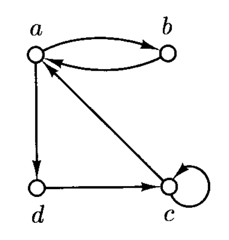

# Sets, Relations and Language

!!! warning "注意"

    本章前面很多知识在《[离散数学及其应用](../dm/index.md)》或其他等价课程）中已经学过了。如果还记得这些知识的话，可以直接跳转到「[Alphabets and Languages](#alphabets-and-languages)」一节；如果（~~像笔者一样~~）基本忘完的话，可以按顺序阅读，快速回忆起（~~或者预习（doge）~~）这些知识。


## Sets

- 集合
    - 没有重复元素
    - 顺序不重要
- 元素/成员
- 单元集(singleton)：只有 1 个元素的集合
- 空集 $\emptyset$
- 子集
- 真子集(proper subset)
- 判断两个集合是否相等
- 集合运算
    - 并(union)：$\bigcup S = \{x : x \in P \text{ for some set } P \in S\}$
    - 交(intersection)：$\bigcap S = \{x : x \in P \text{ for each set } P \in S\}$
    - 差(difference)

- 集合的性质：
    - 幂等性(idempotency)：$A \cup A = A, A \cap A = A$
    - 交换律(commutativity)：$A \cup B = B \cup A, A \cap B = B \cap A$
    - 结合律(associativity)：$(A \cup B) \cup C = A \cup (B \cup C), (A \cap B) \cap C = A \cap (B \cap C)$
    - **分配律**(distributivity)：$(A \cup B) \cap C = (A \cap C) \cup (B \cap C), (A \cap B) \cup C = (A \cup C) \cap (B \cup C)$
    - 吸收律(absorption)：$(A \cup B) \cap A = A, (A \cap B) \cup A = A$
    - **德摩根定律**(Demorgan's law)：$A - (B \cup C) = (A - B) \cap (A - C), A - (B \cap C) = (A - B) \cup (A - C)$
        - $A = U$（全集）的时候可能是我们更加熟悉的形式

- **不相交**集(disjoint)：两个集合无公共元素，即它们的交集为空集
- **幂集**(power set)：包含某一集合 $A$ 所有子集的集合，记作 $2^A$
- **划分**(partition)：幂集的子集，记作 $\Pi$，并且满足：
    - 不包含空集
    - 每个元素（原集合的子集）互不相交
    - $\bigcup \Pi = A$


## Relations and Functions

### Relations

- **有序对**(ordered pair) $(a, b)$
    - $a, b$ 为其分量(component)
    - 和集合 $\{a, b\}$ 不同，首先要考虑分量的顺序，其次两个分量可以是一样的

- 集合 $A, B$ 的**笛卡尔积**(Cartesian product)：记作 $A \times B$，所有有序对 $(a, b)\ (a \in A \text{ and } b \in B)$ 构成的集合
- 集合 $A, B$ 的**二元关系**(binary relation)即为 $A \times B$ 的子集
- **有序元组**(ordered tuple) $(a_1, \dots, a_n)$（其中 $n$ 为任意自然数）
    - 有序三元组/四元组/五元组/六元组(ordered triples/quadruples/quintuple/sextuples)

- **序列**(sequence)即未指定 $n$（序列长度）的有序 $n$ 元组
- **n 重笛卡尔积**(n-folds Cartesian product) $A_1 \times \dots \times A_n$：所有有序对 $(a_1, \dots, a_n)\ (a_i \in A_i\ (i = 1, \dots, n))$ 构成的集合
- **n 元关系**(n-ary relation)即为 $A_1 \times \dots \times A_n$ 的子集
    - 1, 2, 3 元关系分别对应 unary/binary/tenary relations


### Functions

- 集合 $A$ 到集合 $B$ 的**函数**(function)是 $A$ 到 $B$ 的二元关系，并满足以下性质：对于每个元素 $a \in A$，**有且仅有一个**以 $a$ 为第一元素的有序对
- 一般用字母 $f, g, h$ 表示函数
- $f: A \mapsto B$ 表示从 $A$ 到 $B$ 的函数 $f$
- 其中 $A$ 为函数的**域**(domain)
- $f(a)$ 为 $a$ 在 $f$ 中的**像**(image)
- 若 $A'$ 是 $A$ 的子集，那么定义 $f[A'] = \{f(a): a \in A'\}$，称 $f[A']$ 为 $A'$ 在 $f$ 中的像
- $f$ 的**范围**(range)即为域对应的像
- 若函数为 $f: A_1 \times \dots A_n \mapsto B$，并且 $f(a_1, \dots, a_n) = b$（$a_i \in A_i \text{ and } b \in B$），那么称 $a_1, \dots, a_n$ 为 $f$ 的**参数**(auguments)，$b$ 为 $f$ 的**值**(value)
- 对于 $f: A \mapsto B$
    - 若对于任意两个不同元素 $a, a' \in A,\ f(a) \ne f(a')$，称 $f$ 是**单射**的(one-to-one / injective)
    - 若 $B$ 的每个元素是 $A$ 中某些元素的像，称 $f$ 是**满射**的(onto)
    - 若既是单射，又是满射，那么 $f$ 是**双射**函数(bijection)

- 二元关系 $R \subseteq A \times B$ 的**逆**(inverse)记作 $R^{-1} \subseteq B \times A$，即 $\{(b, a) : (a, b) \in R\}$
    - 但函数的逆不一定是函数，只有当 $f$ 是双射时才能保证是函数（即**反函数** $f^{-1}$）
    - $f^{-1}(f(a)) = a\ (\forall a \in A)$，$f(f^{-1}(b)) = b\ (\forall b \in B)$


## Special Types of Binary Relations

（二元）关系 $R \subseteq A \times A$ 可以被表示为一张**有向图**(directed graph)

- $A$ 的每个元素用一个小圈表示，称为**节点**(node)
- 而 $(a, b)$ 则用由 $a$ 到 $b$ 的箭头表示，称为**边**(edge)

<div style="text-align: center">
    
</div>

有向图（$R \subseteq A \times A$）的一些性质：

- **自反**(reflective)：$(a, a) \in R, a \in A$
- **对称**(symmetric)：当 $(a, b) \in R$ 时，$(b, a) \in R$
    - 没有形如 $(a, a)$ 对的对称关系可用**无向图**(undirected graph)表示

- **反对称**(antisymmetric)：当 $(a, b) \in R$ 时，$(b, a) \notin R$
- **传递**(transitive)：当 $(a, b), (b, c) \in R$ 时，$(a, c) \in R$

同时满足**自反、对称、传递**的关系被称为**等价关系**(equivalence relation)。用无向图表示的等价关系由一组集群构成，这些集群就是**等价类**(equivalence classes)，如下图所示：

<div style="text-align: center">
    
</div>

通常我们用 $[a]$ 表示包含元素 $a$ 的等价类，即 $[a] = \{b: (a, b) \in R \text{ or } (b, a) \in R\}$。

!!! theorem "定理"

    令 $R$ 为非空集合 $A$ 的一个等价关系，那么 $R$ 的**等价类**构成了 $A$ 的一个**划分**。

    ??? proof "证明"

        - 设 $\Pi = \{[a] : a \in A\}$，需要证明 $\Pi$ 中的集合非空、互不相交，并且它们的并集覆盖了 $A$
        - 所有等价类都是**非空的**，因为根据自反性，$\forall a \in A, a \in [a]$
        - 要证明**互不相交**，考虑任意两个不同的等价类 $[a]$ 和 $[b]$，并假设 $[a] \cap [b] \ne \emptyset$。于是存在一个元素 $c$ 使得 $c \in [a]$ 且 $c \in [b]$。因此 $(a, c) \in R$ 且 $(c, b) \in R$；由于 $R$ 是传递的，$(a, b) \in R$；又因 $R$ 是对称的，$(b, a) \in R$。现在取任意元素 $d \in [a]$，则 $(d, a) \in R$，由传递性得 $(d, b) \in R$。因此 $d \in [b]$，所以 $[a] \subseteq [b]$。同理可得 $[b] \subseteq [a]$。故 $[a]=[b]$。但这与 $[a]$ 和 $[b]$ 是不同的假设相矛盾。
        - 要证明 **$\bigcup \Pi = A$**，只需注意到每个A中的元素都包含在 $\Pi$ 的某个集合中——即由自反性可知，对于每个 $a \in A$ ，有 $a \in [a]$

而同时满足**自反、反对称和传递**的关系被称为**偏序**(partial order)。假如 $R \subseteq A \times A$ 是偏序，

- 对于 $a \in A$，若满足仅当 $a = b$ 时 $(b, a) \in R$，称 $a$ 为**最小值**(minimal)
    - 可以这么想：最小值 $a$ 总是要位于左侧，除非右侧也是 $a$
- $\forall a, b \in A$，$(a, b) \in R$ 或 $(b, a) \in R$，那么偏序 $R$ 就是**全序**(total order)

二元关系的**路径**(path)是一个序列 $(a_1, \dots, a_n)$（$n \ge 1$），满足 $(a_i, a_{i+1}) \in R$（$i = 1, \dots, n-1$）。路径**长度**就是 $n$。

- 对于路径 $(a_1, \dots, a_n)$，当 $(a_n, a_1) \in R$ 时，该路径就是一个**环**(cycle)。


## Finite and Infinite Sets

若存在双射 $f: A \mapsto B$，称集合 $A, B$ 是**等势的**(equinumerous)，记作 $A \sim B$。而等势就是一种**等价关系**：

- 自反：对于任何集合 $A$，恒有 $A \sim A$，因为存在**恒等映射** $Id_A: A \to A$ 为双射
- 对称：若 $A \sim B$，则 $B \sim A$，因为 $A \sim B$ 意味着存在双射 $f: A \to B$，那么其**逆映射** $f^{-1}: B \to A$ 也一定是双射
- 传递：若 $A \sim B$ 且 $B \sim C$，则 $A \sim C$，因为存在双射 $f: A \to B$ 和 $g: B \to C$，它们的**复合映射** $g \circ f: A \to C$ 同样是双射

若集合 $A$ 与 $\{1, 2, \dots, n\}$（$n$ 为自然数）等势，那么集合 $A$ 就是**有限的**(finite)；而 $A$ 的**基数**(cardinality) $|A|$ 就是 $n$（即有限集合的元素个数）。

当集合不是有限的，那就是**无限的**(infinite)。需要注意的是，不是所有的无限集合是等势的。

若集合与 $\mathbb{N}$ 等势，那么该集合就是**可数无限的**(countably infinite)；并且有限和可数无限均属于**可数的**(countable)，反之就是**不可数的**(uncountable)。

!!! theorem "定理"

    以下四个命题等价：

    - $A$ 是可数的
    - $A$ 是有限的，且存在一个双射 $f: A \to \mathbb{N}$
    - 存在单射 $g: A \to \mathbb{N}$
    - 存在满射 $h: \mathbb{N} \to A$


## Three Fundamental Proof Techniques

下面介绍三种在各种证明中经常出现的基本原理(fundamental principle)：

- **数学归纳法**(mathematical induction)：令 $A$ 为一个自然数集合，满足：
    - $0 \in A$
    - 对于每个自然数 $n$，若 $\{0, 1, \dots, n\} \subseteq A$，那么 $n + 1 \in A$

    那么 $A = \mathbb{N}$

    - 可以用**反证法**(contradiction)证明其正确性
    - 实际上归纳法通常用来证明以下形式的断言：“对于任意自然数 $n$，性质 $P$ 为真。”设集合 $A = \{n : P \text{ is true of } n\}$，那么：
        - 在**基础步骤**(basis step)中证明 $0 \in A$，即 $P$ 在 $0$ 上为真
        - **归纳假设**(induction hypothesis)：对于固定但任意的 $n \ge 0$，$P$ 在每个自然数 $0, 1, \dots, n$ 都成立
        - 在**归纳步骤**中，要利用归纳假设证明 $P$ 在 $n+1$ 上为真

        以上便是运用数学归纳法的模板。

    - 具体应用可参考教材列出的例子

- **鸽巢原理**(pigeonhole principle)：若 $A, B$ 是有限集合且 $|A| > |B|$，那么 $A$ 到 $B$ 的映射不是单射。
    - 通俗版：假设 $A$ 表示一群鸽子，$B$ 表示一些鸽巢，那么至少有一个鸽巢容纳的鸽子数超过 1
    - 可用数学归纳法证明（具体证明见教材，这里只给思路）
        - 基本步骤：证明 $|B| = 0$ 时成立
        - 归纳假设：$|B| \le n$ 时均成立
        - 归纳步骤：证明 $|B| = n + 1$ 时成立

    !!! theorem "定理"

        令 $R$ 为有限集合 $A$ 上的二元关系，$a, b \in A$，若 $R$ 上存在由 $a$ 到 $b$ 的路径，那么路径长度至多为 $|A|$。

        ??? proof "证明"

            用鸽巢原理 + 反证法，其实挺简单的，所以这里不给证明，可参考教材。

- **对角化**(diagonalization)：令 $R$ 为集合 $A$ 上的二元关系，且令 $D$ 为 $R$ 上的**对角集合**(diagonal set)，即 $\{a : a \in A \text{ and } (a, a) \notin R\}$。$\forall a \in A$，令 $R_a = \{b : b \in A \text{ and } (a, b) \in R\}$，那么 $D$ 和所有 $R_a$ 均不同。

    !!! theorem "定理"

        幂集 $2^{\mathbb{N}}$ 是不可数的。

        ??? proof "证明"

            假设 $2^{\mathbb{N}}$ 是可数无限的，也就是说假定存在一种方法可以枚举 $2^N$ 的所有元素，如：
            $$
            2^{\mathbb{N}} = \{R_0, R_1, R_2, \dots\}
            $$

            （注意这些就是在对角化原理陈述中的集合 $R_a$，一旦我们考虑关系 $R = \{(i,j) : j \in R_i\}$）。现在考虑（对角）集合
            $$
            D = \{n \in N : n \notin R_n\}
            $$

            $D$ 是自然数的一个子集，因此它应该出现在枚举 $\{R_0, R_1, R_2, \dots\}$ 中的某个位置。
            
            - 但 $D$ 不可能是 $R_0$，因为它在是否包含 0 这一点上与 $R_0$ 不同（当且仅当 0 不在 $R_0$ 中时，0 在 $D$ 中）
            - 同样地，它也不可能是 $R_1$，因为它在 1 的归属上不同于 $R_1$
            - 以此类推，不得不推出这样一个结论：$D$ 根本不会出现在这个枚举中，这就和假设产生了矛盾


## Closures and Algorithms

!!! definition "定义"

    令 $R \subseteq A^2$ 为定义在集合 $A$ 上的有向图，那么 $R$ 的**自反传递闭包**(reflective transitive closure)为关系：

    $$
    R^* = \{(a, b): a, b \in A \text{ and there is a path from } a \text{ to } b \text{ in } R\}
    $$

根据上述定义，我们可以得到一个计算对于任意给定的在有限集合 $A = \{a_1, a_2, \dots, a_n\}$ 上的二元关系 $R$的自反传递闭包的算法（该算法的正确性来自其对定义的直接实现）：

```py
Initially R^* = emptyset
for i = 1, ..., n do
    for each i-tuple (b[1], ..., b[i]) in A^i do
        if (b[1], ..., b[i]) is a path in R then add (b[1], b[i]) to R^*
```

显然算法最终会得出正确答案。接下来要研究的问题是：它将在多少步之后**终止**(terminate)？答案取决于输入关系的规模，即依赖于集合 $A$ 中元素的数量 $n$。因此，我们要寻找一个函数 $f: \mathbb{N} \mapsto \mathbb{N}$，使得当 $n \ge 1$ 时，对于二元关系 $R \subseteq A \times A, |A| = n$，算法 $f(n)$ 步后终止。

正如算法分析中常见的那样，我们允许 $f(n)$ 是一个粗略的高估(overestimate)，只要其**增长率**(rate of growth)正确即可。下面就来探讨增长率这一话题。


### Growth of Functions

!!! definition "定义"

    假设 $f: \mathbb{N} \mapsto \mathbb{N}$，$f$ 的**阶数**(order)（记作 $\mathcal{O}(f)$）为所有包含以下性质的函数 $g: \mathbb{N} \mapsto \mathbb{N}$ 的集合：存在正整数 $c > 0, d > 0$，$\forall n \in \mathbb{N}$，$g(n) \le c \cdot f(n) + d$。若该不等式对所有 $n$ 都成立，那么我们可以说 $g(n) \in \mathcal{O}(f(n))$（其中常量为 $c, d$）。

如果有两个函数 $f, g: \mathbb{N} \mapsto \mathbb{N}$，有 $f \in \mathcal{O}(g), g \in \mathcal{O}(f)$，那么可以写作 $f \asymp g$。容易证明，$\asymp$ 是一个**等价关系**。

因此，所有从自然数集合到其自身的函数可通过 $\asymp$ 划分为不同的等价类中。$f$ 关于 $\asymp$ 的等价类就是 $f$ 的**增长率**。


### Analysis of Algorithms

现在对上述算法所需步骤做一个大致的估计：

- 算法需要检验每个序列 $(b_1, \dots, b_i)$（长度至多为 $n$），确定它是否为 $R$ 的一条路径，若是则将其放入 $R^*$
- 每次检验都需要不超过 $n$ 次的这样的的基本运算：测试 $(a, b)$ 是否在 $R$ 内，以及将 $(a, b)$ 放入 $R^*$ 内
- 因此总运算次数不超过 $n \cdot (1 + n + n^2 + \dots + n^n)$，即该算法所需时间的增长率为 $\mathcal{O}(n^{n+1})$，效率超低！

于是考虑以下更高效的算法，并且可能比前面的算法看起来更为自然和直观：

```py
# reflective
Initially R^* = R union {(a[i], a[i]) : a[i] in A}
# transitive
while there are three elements a[i], a[j], a[k] in A such that 
    (a[i], a[j]), (a[j], a[k]) in R^* but (a[i], a[k]) not in R^* do:
        add (a[i], a[k]) to R^*
```

算法的正确性不言而喻。那么算法何时停止呢？答案是至多 $n^2$ 次迭代，因为 $R^*$ 至多有 $n^2$ 个二元对。并且由于每次迭代需要 $\mathcal{O}(n^3)$ 的操作（因为三元组中的每个元素都要被搜一遍），所以整个算法的复杂度为 $\mathcal{O}(n^5)$。从原来的**指数**(exponential)级降至**多项式**(polynomial)级，该算法实现了巨大的提升！

然而这样还不够高效——一个显而易见的问题是该算法会重复遍历已经检查过的三元组。如果能够克服这个问题，算法的复杂度就能降至 $\mathcal{O}(n^3)$（每个三元组仅检查一次）。改进思路是将三元组按中间元素的索引升序排序遍历，对应算法如下：

```py
Initially R^* = R union {(a[i], a[i]) : a[i] in A}
for each j = 1, 2, ..., n do
    for each i = 1, 2, ..., n and k = 1, 2, ..., n do
        if (a[i], a[j]), (a[j], a[k]) in R^* but (a[i], a[k]) not in R^* then
            add (a[i], a[k]) to R^*
```

要想证明该算法的正确性，就需要证明以下陈述：对于每个 $j = 1, \dots, n$，在外层循环执行完 $j$ 次后，$R^*$ 包含了所有 $(a_i, a_k)$ 对，满足 $R$ 中从 $a_i$ 到 $a_k$ 之间有一条**等级**(rank)（路径上中间节点的最大索引，不包括起点和终点）不超过 $j$ 的路径。可通过归纳法证明，具体证明过程见教材 $P_{37}$，这里不再赘述。
 

### Closure Properties and Closures

!!! definition "定义"

    令 $D$ 为集合，$n \ge 0$，$R \subseteq D^{n+1}$ 为 $D$ 上 $n+1$ 元关系。那么对于 $D$ 的子集 $B$，若当 $b_1, \dots, b_n \in B$ 且 $(b_1, \dots, b_n, b_{n+1}) \in R$，那么称 $B$ 是在 $R$ 下是**封闭的**(closed)。任何形如“集合 $B$ 在关系 $R_1, R_2, \dots, R_m$ 下是封闭”的性质被称为 $B$ 的**闭包性质**(closure property)。

!!! theorem "定理"

    令 $P$ 为定义在集合 $D$ 上的关系的一条闭包性质，且 $A$ 为 $D$ 的子集，那么存在一个唯一的最小集合 $B$，满足包含 $A$ 且具备性质 $P$。

任何在有限集合上的闭包性质能在**多项式**时间内被算出来。假设在有限集合 $D$ 上有不同元数的关系 $R_1 \subseteq D^{r_1}, \dots, R_k \subseteq D^{r_k}$，并有集合 $A \subseteq D$。现在要计算 $A$ 在关系 $R_1, \dots, R_k$ 下的闭包 $A^*$。我们可以通过泛化前面得到的 $\mathcal{O}(n^5)$ 的传递闭包算法实现在多项式时间内的计算。

```py
Initially A^* = A
while there is an index i, 1 <= i <= k, and r[i] elements a[j[1]], ..., a[j[r[i-1]]] in A^*
    and a[j[r[i]]] in D - A^* such that (a[j[1]], ..., a[j[r[i]]]) in R[i] do:
        add a[j[r[i]]] in A^*
```

该算法的复杂度为 $\mathcal{O}(n^{r+1})$，其中 $n = |D|$ 且 $r$ 为 $r_1, \dots, r_k$ 中最大的数。


## Alphabets and Languages

计算理论的数学研究必须要从理解符号字符串的数学原理开始。

- **字母表**(alphabet)：关于**符号**(symbol)的有限集合，记作 $\Sigma$
    - 和计算理论密切相关的一个字母表是**二元字母表**(binary alphabet) $\{0, 1\}$
- **字符串**(string)：来自字母表的有限符号序列
    - 字符串的书写不需要用括号或逗号间隔，而是直接将符号连在一起写，比如 watermelon, 0110011
    - 单个符号等同于用该符号表示的字符串
    - 没有符号的字符串是**空字符串**(empty string)，记作 $e$
    - 一般使用 $u, v, w, x, y, z$ 和希腊字母表示字符串
    - $\Sigma^*$：在字母表 $\Sigma$ 上的**所有字符串集合**（包括空字符串）
    - $\Sigma^+ = \Sigma^* - \{e\}$：在字母表 $\Sigma$ 上的**非空字符串集合**
    - $\Sigma^n = \underbrace{\Sigma \times \dots \times \Sigma}_{\text{length} = n}$：在字母表 $\Sigma$ 上的**长度为 $n$ 的字符串集合**
    - 字符串 $w$ 的**长度**(length)即序列长度，记作 $|w|$
    - 可将字符串看作一个函数 $w: \{1, \dots, |w|\} \mapsto \Sigma$；$w(j)$ 的值就是 $w$ 在第 $j$ 个位置上的符号
    - 如果需要区分不同位置上的相同符号，我们将它们称为该符号的不同**出现**(occurrence)
    - **拼接**(concatenation)：将两个来自相同字母表的字符串 $x, y$ 结合起来，形成新的字符串，记作 $x \circ y$ 或 $xy$
        - 形式上，当且仅当 $|w| = |x| + |y|, w(j) = x(j)\ (j = 1, \dots, |x|)$ 且 $w(|x| + j) = y(j)\ (j = 1, \dots, |y|)$ 时，$w = x \circ y$
        - $w \circ e = e \circ w = w$
        - 拼接满足**结合律**，即 $(wx)y = w(xy)$
        - 当且仅当存在字符串 $x, y$，满足 $w = xvy$，称字符串 $v$ 为 $w$ 的**子字符串**(substring)；此外还有以下特殊情况：
            - $w = xv$ -> $v$ 是 $w$ 的**后缀**(suffix)
            - $w = vy$ -> $v$ 是 $w$ 的**前缀**(prefix)
        - 字符串 $w^i$ 的定义如下（一种**归纳定义**(definition by induction)）：

            $$
            \begin{aligned}
            w^0 & = e, \quad \text{the empty string} \\
            w^{i+1} & = w^i \circ w, \quad \text{for each } i \ge 0
            \end{aligned}
            $$

    - **反转**(reversal)：记作 $w^R$，其归纳定义为：
        - 若 $|w| = 0$，则 $w^R = w = e$
        - 若 $|w| = n + 1 > 0$，则 $w = ua$，其中 $a \in \Sigma$ 且 $w^R = au^R$
  
- **语言**(language)：$\Sigma^*$ 的任意子集（即字母表 $\Sigma$ 上任意字符串构成的集合）
    - $\Sigma^*, \emptyset, \Sigma$ 都是语言
    - 用以下形式表述无限(infinite)语言：

        $$
        L=\{w\in\Sigma^*:w\text{ has property }P\}
        $$

    - 若 $\Sigma$ 是有限字母表，那么 $\Sigma^*$ 是**可数无限的**
    - 要想构建双射 $f: \mathbb{N} \mapsto \Sigma^*$，首先要确定字母表顺序，即 $\Sigma = \{a_1, \dots, a_n\}$，然后可按以下方式枚举 $\Sigma^*$ 的成员：
        - $\forall k \ge 0$，所有长度为 $k$ 的字符串应在长度为 $k+1$ 字符串之前被枚举
        - 长度恰好为 $k$ 的 $n^k$ 个字符串按**词典序**(lexicographically)枚举，即 $a_{i_1}, \dots, a_{i_k}$ 先于 $a_{j_1}, \dots, a_{j_k}$ 枚举，其中 $0 \le m \le k - 1, i_l = j_l\ (l = 1, \dots, m), i_{m+1} < j_{m+1}$
  
    - 由于语言本质上是集合，所以可通过集合运算（并、交、差）将语言结合起来
        - $A$ 的**补**(complement)为 $\bar{A} = \Sigma^* - A$

    - 语言的**拼接**(concatenation)：若 $L_1, L_2$ 为在 $\Sigma$ 上的语言，那么拼接为 $L = L_1 \circ L_2 = L_1 L_2$，其中

        $$
        L=\{w\in\Sigma^*:w=x\circ y\text{ for some }x\in L_1\mathrm{~and~}y\in L_2\}
        $$

    - **克莱尼星号**(Kleene star)：记作 $L^*$，是通过拼接 0 个或多个来自 $L$ 的字符串构成的全部字符串的集合，即

        $$
        L^*=\{w\in\Sigma^*:w=w_1\circ\cdots\circ w_k\text{ for some }k\geq0\text{ and some }w_1,\ldots,w_k\in L\}
        $$

        - 如果将字母表看作一种有限语言，那么 <u>$\Sigma^*$ 的定义和克莱尼星号是一致的</u>

    - $L$ 在拼接运算下的**闭包**(closure)记作 $L^+ = LL^*$，即包含 $L$ 和所有由 $L$ 内字符串拼接而成的字符串的最小语言

        $$
        \{w\in\Sigma^*:w=w_1\circ w_2\circ\cdots\circ w_k\text{ for some }k\geq1\text{ and some }w_1,\ldots,w_k\in L\}
        $$