# Sets, Relations, and Language

!!! info "说明"

    前面的集合、关系等知识早在《[离散数学及其应用](../dm/index.md)》课程中讲解过，故这里不再赘述。若有遗忘可点击链接后阅读笔者之前留下的笔记。

## Sets

请前往《离散数学及其应用》对应章节复习：

- [Chap 2 Basic Structures: Sets, Functions, Sequences, Sums, and Matrices -- Sets](../dm/2.md#sets)
- [Chap 9 Relations -- Equivalence Classes and Partitions](../dm/9.md#equivalence-classes-and-partitions)

## Relations and Functions

同样到《离散数学及其应用》对应章节复习：

- [Chap 9 Relations -- Relations and Their Properties](../dm/9.md#relations-and-their-properties)
- [Chap 2 Basic Structures: Sets, Functions, Sequences, Sums, and Matrices -- Functions](../dm/2.md#functions)

## Special Types of Binary Relations

再次去《离散数学及其应用》对应章节复习：

- [Chap 10 Graph -- Graphs and Graph Models](../dm/10.md#graphs-and-graph-models)
- [Chap 2 Basic Structures: Sets, Functions, Sequences, Sums, and Matrices -- Matrices](../dm/2.md#matrices)
- “关系的性质”见 “[Relations and Functions](#relations-and-functions)” 一节下第一个链接
- [Chap 9 Relations -- Equivalence Relations](../dm/9.md#equivalence-relations)
- “划分”见 “[Sets](#sets)” 一节下第二个链接
- [Chap 9 Relations -- Partial Orderings](../dm/9.md#partial-orderings)

## Finite and Infinite Sets

- **等势**(equinumerous)
    - 定义：集合 $A, B$ 是等势的（$A \sim B$）$\Leftrightarrow\ \exists $ 双射 $f: A \rightarrow B$
    - 所以等势集合就是至少存在一个双射函数的集合
    - 注意没有“等势函数”或“双射集合”的概念，只有等势集合与双射函数，不要搞混了
    - 性质：它是一种等价关系，因此具备自反性、对称性和传递性

- [Chap 2 Basic Structures: Sets, Functions, Sequences, Sums, and Matrices -- Cardinality of Sets](../dm/2.md#cardinality-of-sets)

## Three Fundamental Proof Techniques

- **数学归纳法**(the principle of mathematical induction)：假设 $A$ 是一个自然数集合，满足：
    - $0 \in A$，且
    - $\forall$ 自然数 $n$，若 $\{0, 1, 2, \dots, n\} \in A$，那么 $n + 1 \in A$

    

        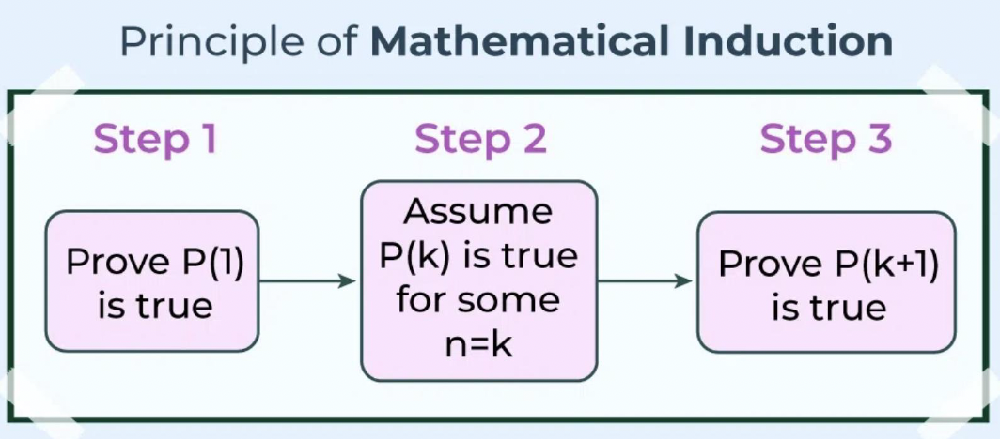
    

- **鸽巢原理**(the pigeonhole principle)
    - 若 $A. B$ 是有限集合且 $|A| > |B|$，那么 $A, B$ 之间不存在一一映射（单射）的函数
    - 另一种表述：若要把 $m$ 个物体放进 $n$ 个桶中，若 $m > n$，那么有一些桶至少会有两个物体

    ??? example "例子"

        === "题目"

            证明：对于球面上任意5个点，存在一个闭合的半球，至少能包含其中4个点。

        === "解答"

            - 球上的大圆是指能将球切成两个半球的圆
            - 球上任意2点就能确定这样的一个大圆
            - 先用5个点中的2个找出一个大圆，剩下3个点
            - 根据鸽巢原理，至少有2个点位于同一个半球
            - 因此至少有4个点位于一个闭合的半球内

    ??? proof "证明"

        

            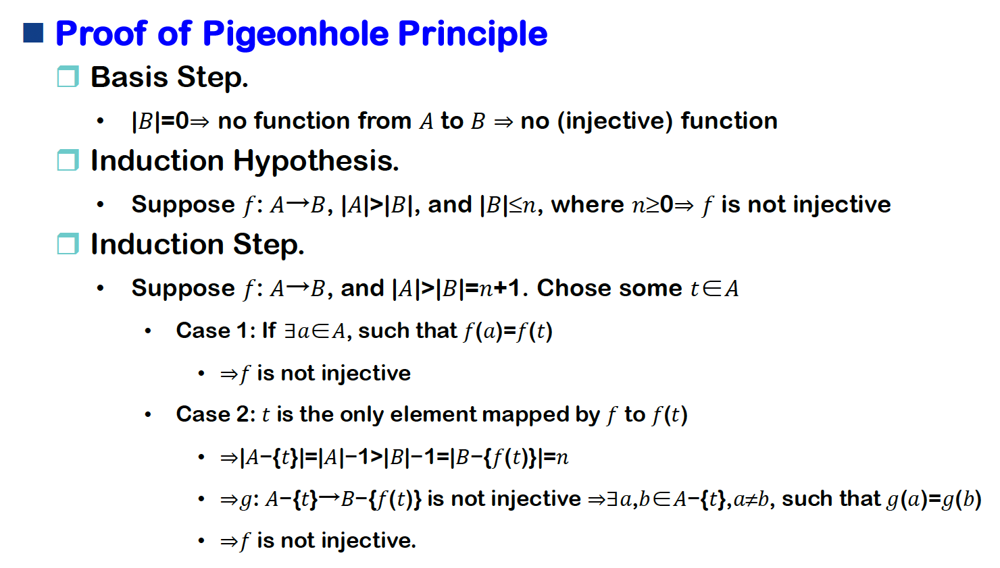
        

- **对角化原理**(diagonalization principle)：
    - 令 $R$ 为集合 $A$ 上的二元关系，并令 $D$ 为 $R$ 上的对角集合，即 $D = \{a | a \in A \wedge (a, a) \notin A \}$
    - 对于 $a \in A$，令 $R_a = \{b | b \in A \wedge (a, b) \in R\}$，$D$ 与所有 $R_a$ 都不同

    ??? example "例子"

        === "例1"

            

                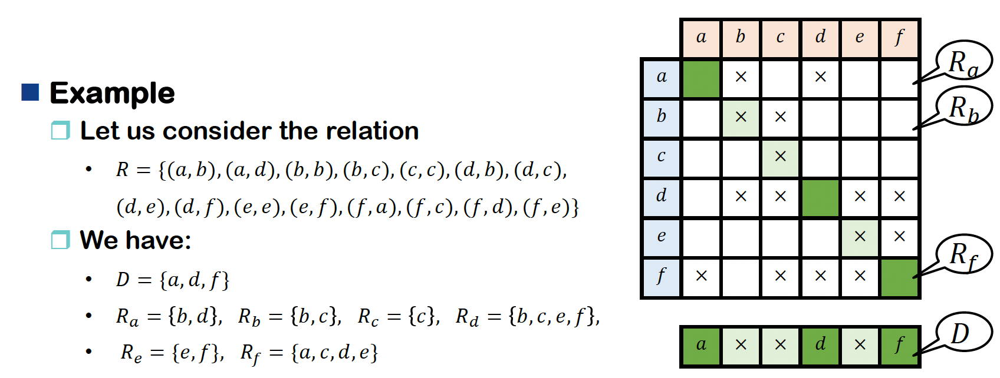
            

        === "例2：康托尔定理"

            

                
            

        === "例3"

            

                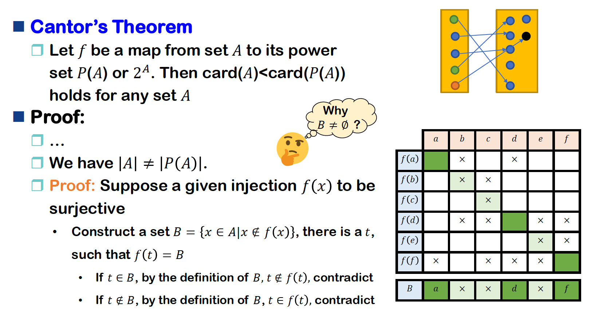
            

            

                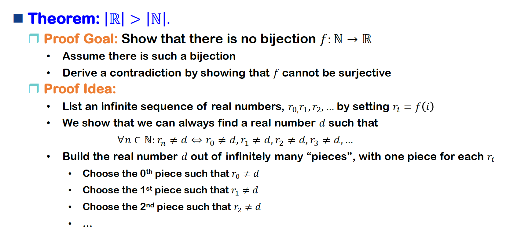
            

            

                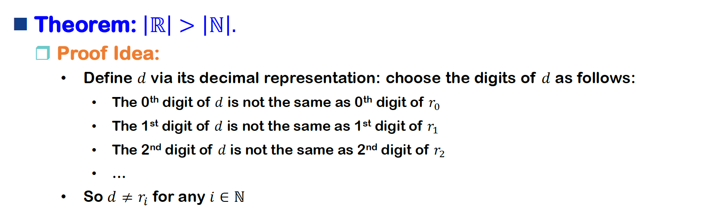
            

            

                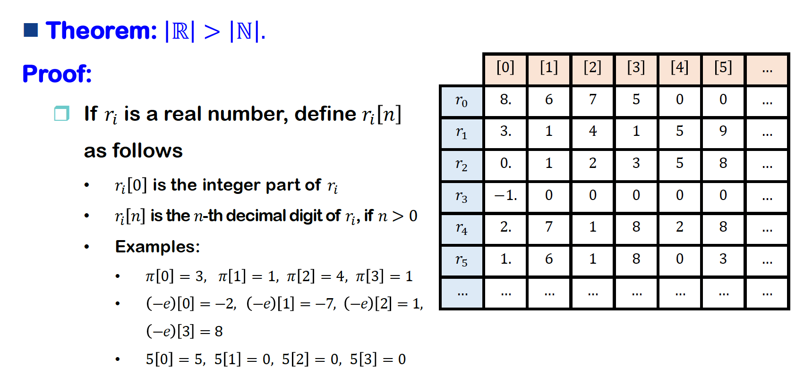
            

            

                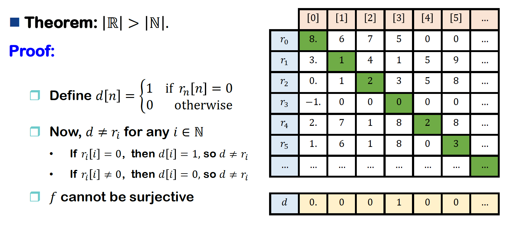
            

        === "例4"

            

                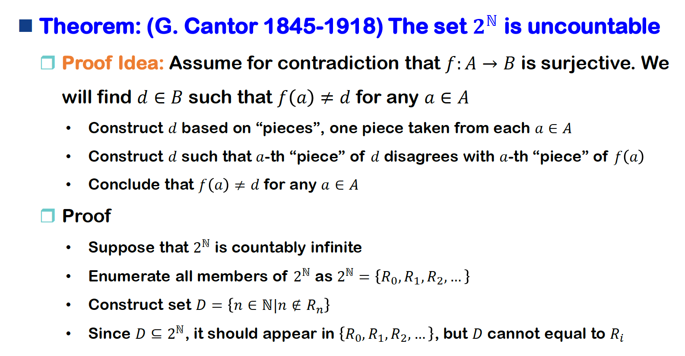
            

            

                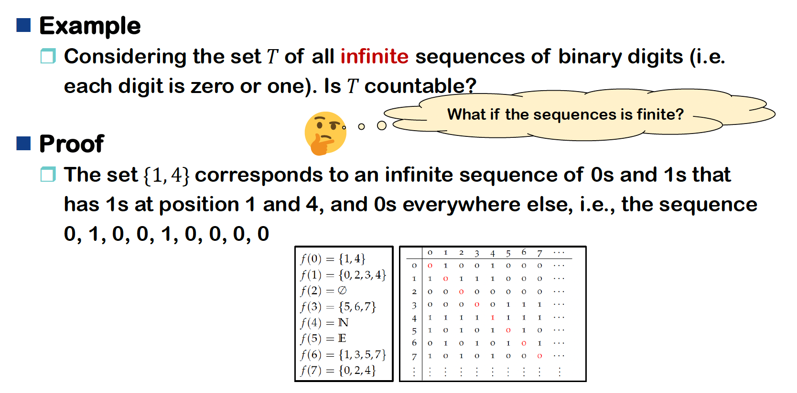
            

## Closure

- 关系的**闭包**(closure)是指对于给定的任意二元关系 $R$，可以针对以下属性的任何组合形成闭包：自反性(reflective)、对称性(symmetric)、传递性(transitive)。
- 注意：$R$ 的自反传递闭包通常记作 $R^*$
- 严格定义：令 $R \subseteq A \times A$ 为一个有向图，$R$ 的自反传递闭包就是
    $$
    R^* = \{(a, b) | a, b \in A \text{ and there is path from } a \text{ to } b \text{ in } R\}
    $$

???+ example "例子"

    === "例1"

        

            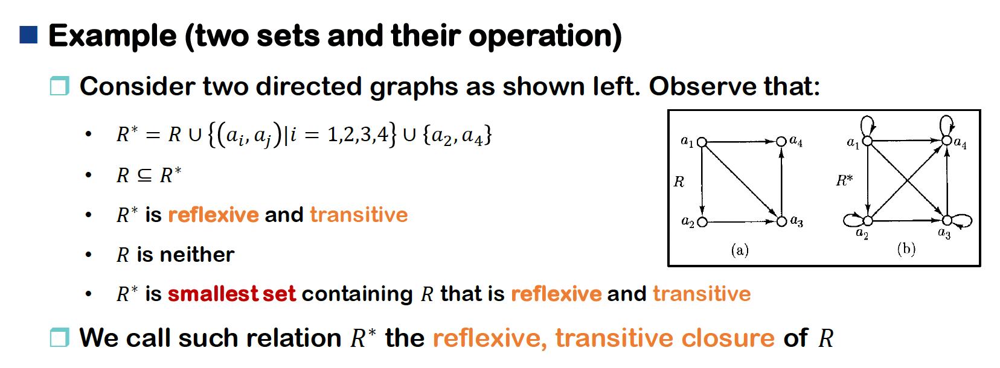
        

    === "例2"

        

            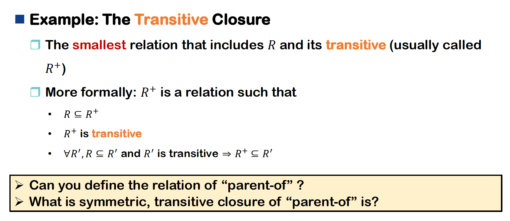
        

## Alphabet and Language

- 数据在计算机内存中会被编码为位串(strings of bits)或适合被操纵的其他符号(symbols)
- 计算理论的数学研究始于对符号串(strings of symbols)操纵的数学理解
- **字母表**(alphabet)
    - 定义：任意的**有限**集合被称为一个字母表。字母表的元素被称为字母表的**符号**(symbols)
    - 记号：用 $\Sigma$ 表示字母表
    - 例子：
        - $\Sigma = \{\rightarrow, \emptyset, \not \exist, \cong, \sqrt[4]\}$
        - $\Sigma = \{a, b, c\}$
        - $\Sigma = \{n \in \mathbb{N}, n \le 10^5\}$
        - $\Sigma = \{0, 1\}$ 为二元字母表

- **字符串**(string)
    - 称字母表 $\Sigma$ 的**有限**序列为在 $\Sigma$ 上的字符串
    - $e$：空字符串
    - $\Sigma^*$：$\Sigma$ 上的所有字符串
    - $w \in \Sigma^*$ 就是 $\Sigma^*$ 内的一个字符串
    - 字符串长度
    - 例子：令 $\Sigma = \{a, b\}$，$\Sigma$ 上的部分字符串为 $aaa, bbb, ab, abab \dots$

- 字符串运算
    - **拼接**(concatenation)：$x \circ y$ 或 $xy$
        - 应用：子字符串、前缀、后缀
        - 例子：$\forall w, we = ew = w$
    - **求幂**(exponentiation)：
        - $w^0 = e$
        - $w^{i+1} = w^i \circ w, \forall i \ge 0$
    - **反转**(reversal)：
        - 若字符串 $w$ 长度为0，那么 $w^R = w = e$
        - 若字符串 $w$ 长度为 $n+1 > 0, w = ua, a \in \Sigma$，那么 $w^R = au^R$

    >这里用到了归纳定义。

- **语言**(language)：字符串的集合
    - 符号 $L \subseteq \Sigma^*$
    - $\emptyset, \Sigma, \Sigma^*$ 都是语言
    - **有限语言**(finite language)：列出所有的字符串
    - **无限语言**(infinite language)：通过以下方案制定
        $$
        L = \{w \in \Sigma^*: w \text{ has property } P \}
        $$

    - 例子：$L = \{ab, aabb, aaabbb, \dots \} = \{a^nb^n | n \ge 1\}$

- **定理**：若 $\Sigma$ 是一个有限字母表，那么 $\Sigma^*$ 是一个可数的无限集合

    ??? proof "证明"

        构建一个双射 $f: \mathbb{N} \rightarrow \Sigma^*$

        - 固定字母表符号的顺序，即令 $\Sigma = \{a_1, a_2, \dots, a_n\}$
        - $\Sigma^*$ 内的成员可按以下方式被枚举
            - 对于每个 $\ge 0$ 的 $k$，长度为 $k$ 的所有字符串需要在长度 $k + 1$ 的字符串被枚举前被枚举好
            - 长度恰好为 $k$ 的 $n^k$ 个字符串按**词典序**(lexicographically)被枚举

        - 例子：若 $\Sigma = \{0, 1\}$，顺序就是：$e, 0, 1, 00, 01, 10, 11, 000, 001, 010, 011, \dots$

    - 在非空字母表中，有可数无穷多的字符串；并且语言是可数的，数量为 $|\mathbb{R}|$

- 语言的运算：
    - 并、交、差、补(complement)（$\overline{L} = \Sigma^* - L$）
    - 求幂：
        - $L^0 = \{e\}$
        - $L^{i+1} = LL^i, \forall i \ge 0$
    - 拼接：$L_1 L_2 = \{w_1 w_2 | w_1 \in L_1 \wedge w_2 \in L_2\}$
    - **克莱尼星号**(Kleene star)： $L^* = \{w \in \Sigma^*: w = w_1 \dots w_k, k \ge 0, w_1, \dots, w_k \in L\} = L^0 \cup L^1 \cup L^2 \cup \dots$
    - 我们用 $L^+$ 表示 $LL^*$，因此 $L^+ = \{w \in \Sigma^*: w = w_1 \dots w_k, k \ge \textcolor{red}{1}, w_1, \dots, w_k \in L\} = L^1 \cup L^2 \cup L^3 \cup \dots$
    - 注意 $L^+$ 被认为是 $L$ 在拼接函数下的闭包，即 $L^+$ 是包含 $L$ 和所有来自 $L$ 的字符串的拼接而成的字符串的最小语言
    - $\emptyset^* = \{e\}$
    - $\forall L, (L^*)^* = L^*, L \emptyset = \emptyset L = \emptyset$

