# Regular Language and Finite Automata

!!! failure "警告"

    下面的内容目前就看作笔者的胡言乱语。目前这只是 PPT 的部分 copy，笔者还没有参透其中的内容，因此可能有不少错误之处。等到期末的时候再来大改一番。

## Deterministic Finite Automata

??? example "例子"

    === "例1"

        

            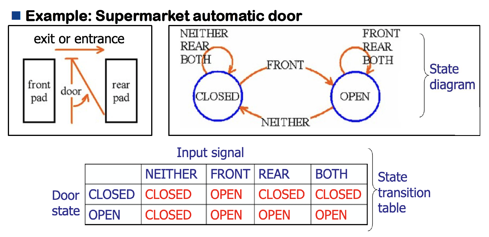
        

    === "例2"

        

            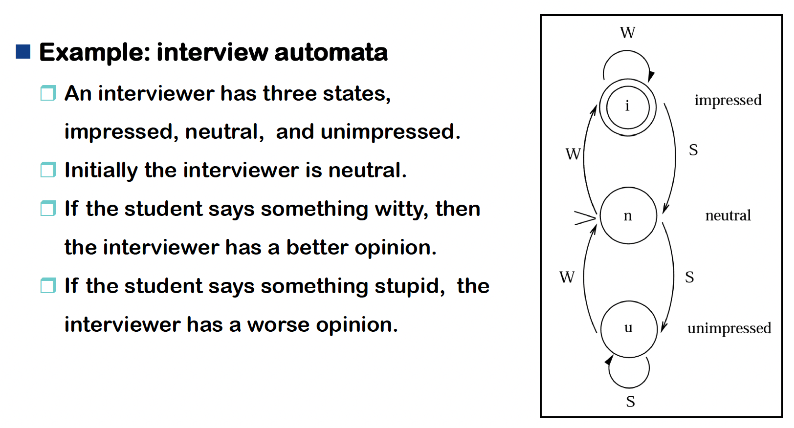
        

自动机的图形化表示——**状态图**(state diagram)

- **状态**(state)
- **初始状态**(initial state)
- **最终状态**(final state)
- **转移函数**(transition function)：$\delta(p, a) = p$

???+ example "例子"

    

        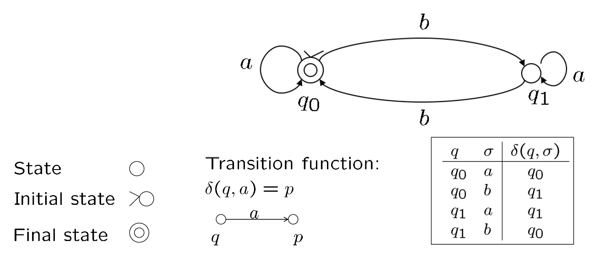
    

!!! definition "定义"

    **确定有限自动机**(deterministic finite automata, **DFA**)是一个五元组 $(K, \Sigma, \delta, s, F)$，其中：

    - $K$：状态的有限集合
    - $\Sigma$：字母表
    - $s \in K$：初始状态
    - $F \subseteq K$：最终状态的集合
    - $\delta$：转移函数，$K \times \Sigma \rightarrow K$
        - 转移函数会基于当前输入和状态给出**唯一**的下一状态

???+ example "例子"

    \automata
        \node[initial,state]    (q_1)                 {$q_1$};
        \node[state]            (q_2) [right=of q_1]  {$q_2$};
        \node[state,accepting]  (q_3) [right=of q_2]  {$q_3$};
        \path 
            (q_1) edge [loop above]               node {0}    (q_1)
                  edge                            node {1}    (q_2)
            (q_2) edge [bend left]                           node {0}    (q_1)
                  edge                            node {1}    (q_3)
            (q_3) edge [in=30,out=60,loop]        node {0,1}  (q_3)
        ;

    - $M_1 = (Q, \Sigma, \delta, q_1, F)$
    - $Q = \{q_1, q_2, q_3\}$
    - $\Sigma = \{0, 1\}$
    - $F = \{q_3\}$
    - $\delta =$

        ||0|1|
        |:-:|:-:|:-:|
        |$q_1$|$q_1$|$q_2$|
        |$q_2$|$q_1$|$q_3$|
        |$q_3$|$q_3$|$q_3$|

有限自动机 $M$ 是一种**识别装置**，它拥有**有限**个内部状态，接收输入并根据迄今所见的输入序列是否**属于**该语言来响应“是”或“否”。

??? example "例子"

    === "例1"

        

            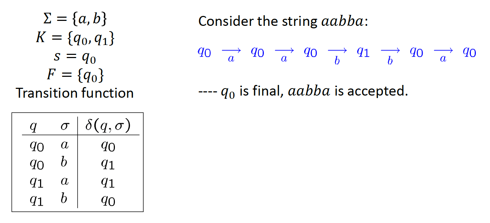
        

    === "例2"

        

            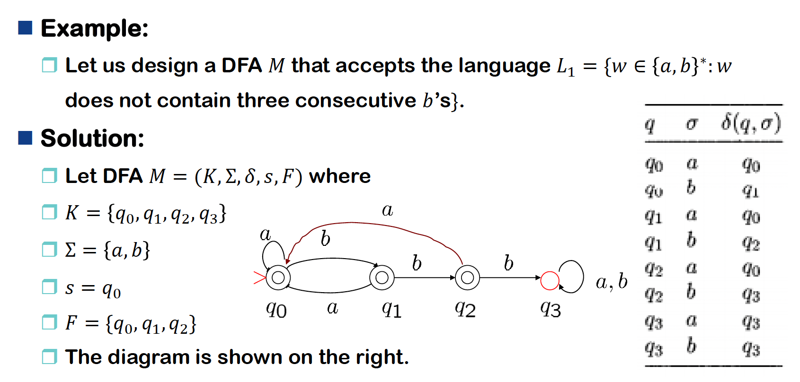
        

    === "例3"

        

            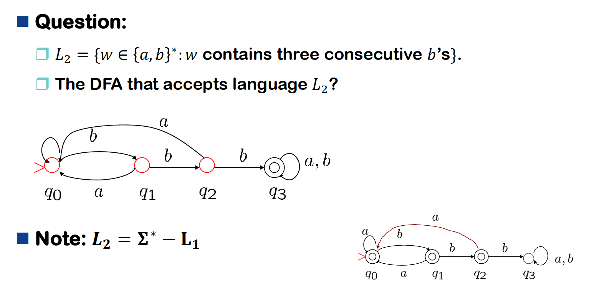
        

!!! note "注"

    - DFA $(K, \Sigma, \delta, s, F)$ 的**配置**(configuration)属于 $K \times \Sigma^*$
        - 有限自动机 $M$ 的配置能够展示当前状态以及即将要读取的输入
    - $M$ 的两个配置的二元关系 $\vdash_M$：$(q, w) \vdash_M (q', w') \Leftrightarrow \exists a \in \Sigma, w = aw'$ 且 $\delta(q, a) = q'$
        - 若自动机 $M$ 从 $(q, w)$ 到 $(q', w')$ 只需一步的话，$(q, w) \vdash_M (q', w')$
        - 我们称 $(q, w)$ 在一步内**产生**(yield) $(q', w')$
    - $\vdash_M^*$ 是 $\vdash_M$ 的**自反传递闭包**
        - 经过一些步骤，也可能为零步之后，$(q, w) \vdash_M^* (q', w') \Leftrightarrow (q, w)$ 产生了 $(q', w')$
    - 字符串 $s \in \Sigma^*$ 被认为是被 $M$ 所**接受**的，当且仅当存在状态 $q \in F$，使得 $(s, w) \vdash_M^* (q, \varepsilon)$
    - $L(M)$ 是被 $M$ **接受**的语言，且是所有被 $M$ 接受的字符串的集合
    - 当起点状态是接受状态时，$\varepsilon$ 可被接受

## Nondeterministic Finite Automata

!!! definition "定义"

    **非确定有限自动机**(nondeterministic finite automata, **NFA**)是一个五元组 $(K, \Sigma, \delta, s, F)$，其中：

    - $K$：状态的有限集合
    - $\Sigma$：字母表
    - $s \in K$：初始状态
    - $F \subseteq K$：最终状态的集合
    - $\Delta$：**转移关系**，是 $K \times (\Sigma \cup \{e\}) \times K$ 的子集
        - DFA 的转移函数 $\delta: K \times \Sigma \rightarrow K$ 也是关系 $K \times \Sigma \times K$
  
!!! note "注"

    - 对于 DFA，$\delta$ 是函数，而对于 NFA，$\Delta$ 是关系
    - 三元组 $(q, u, q) \in \Delta$：NFA 的转移
        - 若没有输入符号，$u = e$
    - **配置**(configuration)：$K \times \Sigma$ 的一个元素
    - 二元关系 $\vdash_M$ 和它的**自反传递闭包** $\vdash_M^*$
    - 字符串 $s \in \Sigma^*$ 被认为是被 $M$ 所**接受**的，当且仅当存在状态 $q \in F$，使得 $(s, w) \vdash_M^* (q, \varepsilon)$
    - $L(M)$ 是被 $M$ **接受**的语言，且是所有被 $M$ 接受的字符串的集合

??? example "例子"

    

        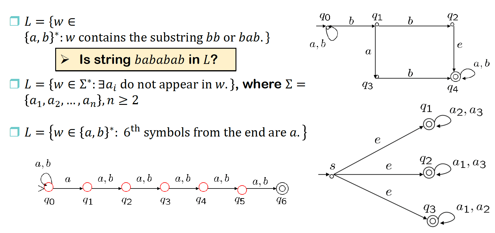
    

从表达能力看，每个 DFA 都是 NFA，因此 NFA 允许更多的转移。

**DFA / NFA 等价性**(equivalence)：两个 FA $M_1, M_2$（DFA or NFA）是等价的，当且仅当 $L(M_1) = L(M_2)$。

要证明 DFA 和 NFA 的等价性，我们必须要做两件事：

- 对每个 DFA，产生能接受相同的语言的 NFA
- 对每个 NFA，产生能接受相同的语言的 DFA

由于第一种情况是显然的，所以下面就来考虑如何处理第二种情况。大致的证明思路是：找出 DFA 和 NFA 之间的不同并弥补差距。下面列出两者的差异：

- 转移关系
    - DFA 的转移关系必须是函数：$K \times \Sigma \times K$
    - NFA 的转移关系不必是函数：$K \times (\Sigma \cup \{e\}) \times K$
- 域
    - DFA 的转移关系的域是 $K \times \Sigma$
    - NFA 的转移关系的域是 $K \times (\Sigma \cup \{e\})$
        - 注意到 NFA 的转移关系 $\Delta$ 可能包含一个配置 $(q, e, p)$，这允许 NFA 读取空字 $e$，而这在 DFA 中是不被允许的

为了将 NFA 转换为等价的 DFA，上述两个差异必须要消除掉。

???+ example "例子"

    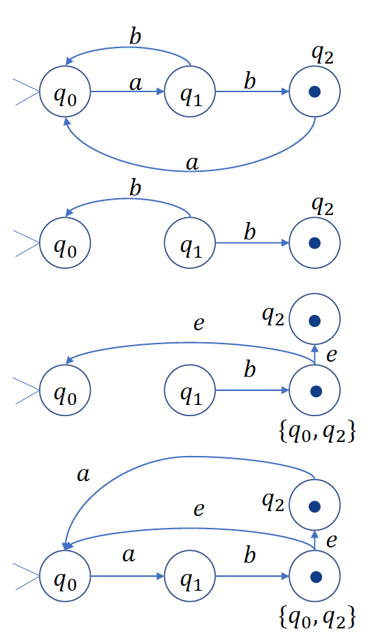{ align=right width=20% }

    $$
    \begin{align*}
    & M=(\{q0,q1,q2\},\Sigma=\{a,b\},\Delta,s=q0,F=\{q2\}), \\
    & \Delta=\{(q0,a,q1),(q1,b,q0),(q1,b,q2),(q2,a,q0)\}
    \end{align*}
    $$

    - 非函数的部分是
    - 如何将其转换为函数

    !!! note "差异1的解决思路"

        我们将 $M'$ 的状态设定为由 $M$ 状态构成的某些集合

        - 将状态 $\{q_0\}$ 设为 $M'$ 的初始状态，因为 $q_0$ 原本是 $M$ 的初始状态
        - 再令 $\{q_0, q_2\}, \{q_2\}$ 为$M'$ 的最终状态，因为 $q_2$ 原本是 $M$ 的最终状态

    !!! note "差异2的解决思路"

        在读取输入符号 $\sigma \in \Sigma$ 时，$M'$ 的一步操作模拟了 $M$ 在输入符号 $\sigma$ 上的一步，可能随后跟随任意数量的 $M$ 的 $e$ 步移动。

        - $\Delta = \{(q_0, a, q_1), (q_1, b, q_0), (q_1, b, q_2), (q_2, a, q_0)\}$
  
    为形式化表达上述思想，要有一个特殊的定义：

    !!! definition "定义：$E(q)$"

        对于任意状态 $q \in K$，令 $E(q)$ 为所有在 $M$ 中从状态 $q$ 出发、无需读取任何输入即可到达的所有状态的集合。
        $$
        E(q) = \{p \in K: (q, e) \vdash_M^* (p, e)\}
        $$

    对于上面的例子：

    

        
        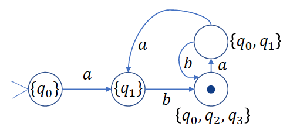
    

    ???+ proof "证明思路"

        - 根据给定的 NFA：$M = \{K, \Sigma, \Delta, s, F\}$
        - 构建 DFA：$M' = \{K', \Sigma, \delta, s', F'\}$

        其中：

        - $K' = 2^K$
        - $s' = E(s)$
        - $F' = \{Q | Q \subseteq K, Q \cap F \ne \emptyset\}$
        - 对于每一个 $Q \subseteq K, a \in \Sigma$，令 $\delta(Q,a)=\cup\{E(p)|q\in Q,p\in K,\mathrm{and~}(q,a,p)\in\Delta\}$

!!! note "结论"

    对于任意字符串 $w \in \Sigma^*$ 和任意状态 $p, q \in K$，对于某些包含 $p$ 的集合 $P$，$(q,w)\vdash_M^*(p,e)\Leftrightarrow(E(q),w)\vdash_{M^{\prime}}^*(P,e)$。

    ??? proof "证明"

        

            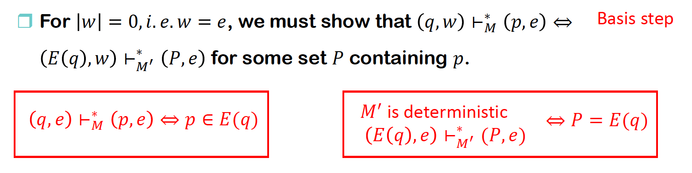
        

        

            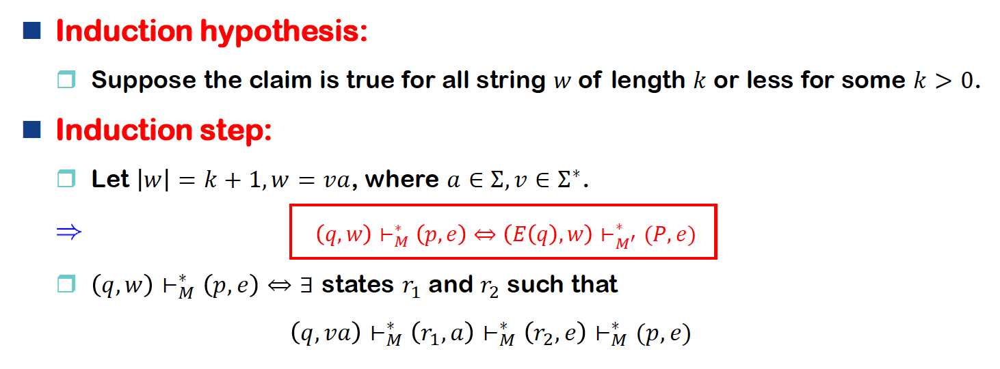
        

        

            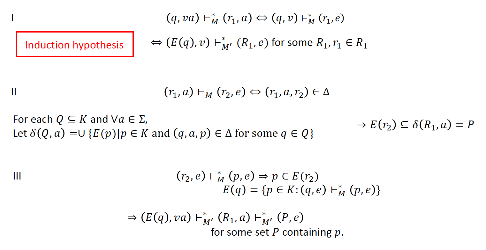
        

        

            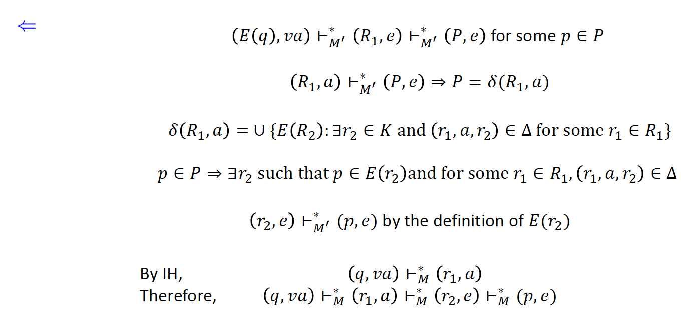
        

??? example "例子"

    

        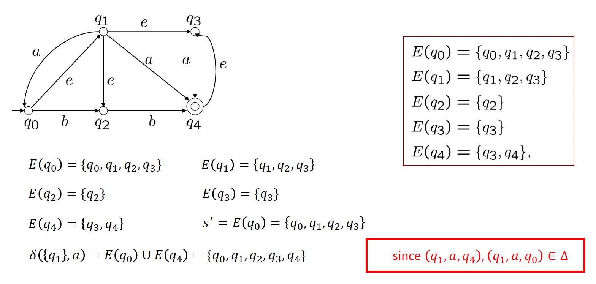
    

