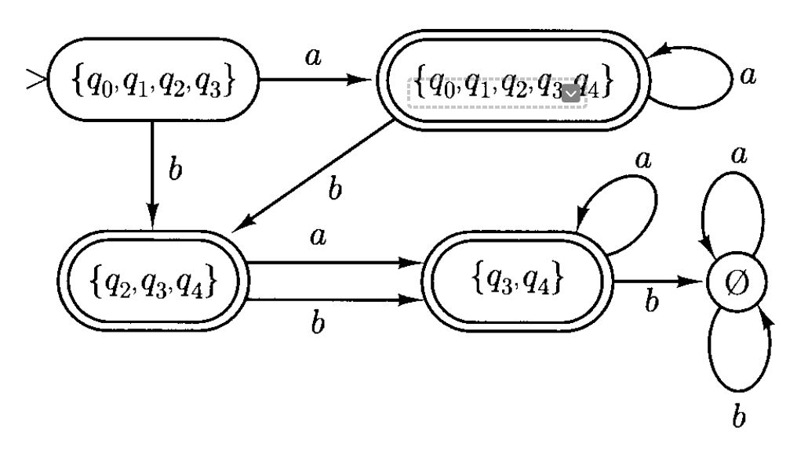
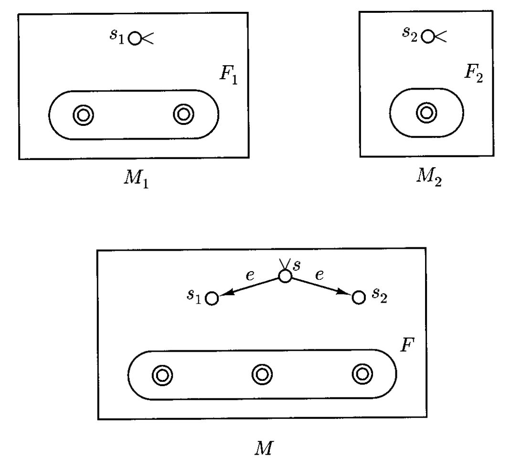

# Finite Automata and Regular Expressions

!!! info "约定"

    用 **DFA** 和 **NFA** 分别指代确定性有限自动机和非确定性有限自动机。

## Deterministic Finite Automata

**有限自动机**(finite automata)接收**字符串**输入并以**输入纸带**(input tape)的形式传递，之后仅输出一个关于是否认为输入**可接受**(acceptable)的指示。更多有关有限自动机（更准确的说，是**确定性有限自动机**(deterministic finite automata, **DFA**)）操作的细节如下：

<div style="text-align: center">
    
</div>

- 输入磁带被划分为一个个方格，每个方格表示字符串上的单个符号
- 整个机器的主要部分可看作是在任意时刻处于其中一种不同的内部**状态**(state)（总的状态数是有限的）的一个“黑盒”
- 这个“黑盒”叫做**有限控制**(finite control)，它借助一个可移动的**读头**(reading head)感知输入带上任意位置所写的符号
- 一开始，读头置于磁带的最左端方格，有限控制设定为**初始状态**(initial state)
- 每隔固定的一段时间，自动机从输入带上读取一个符号，随后根据当前状态及所读符号进入新状态，读完后读头会向右移动一格
- 上述过程反复进行，直到到达输入字符串的末端时，自动机通过其结束时所处的状态来表示对所读内容的接受与否
    - 如果它停在一个**最终状态**(final state)集合中的某个状态上，则该输入字符串被视为**被接受的**(accepted)
    - 机器所接受的语言就是它所接受的字符串集合

下面给出 DFA 的形式化定义：

!!! definition "定义"

    **确定性有限自动机**是一个五元组 $M = (K, \Sigma, \delta, s, F)$，其中

    - $K$：**状态**的有限集合
    - $\Sigma$：字母表
    - $s \in K$：**初始状态**(start state)
    - $F \subseteq K$：**最终状态**(final states)集合
    - $\delta$：**转移函数**(transition function)，一个从 $K \times \Sigma$ 到 $K$ 的函数

- 如果 $M$ 处在状态 $q \in K$，且从输入纸带上读到符号 $a \in \Sigma$，那么 $\delta(q, a) \in K$ 是一个唯一确定的（下一个）状态
- DFA 的**配置**(configuration) $C$ 由**当前状态** $q$ 和**剩余字符串** $w$ 决定，即 $C = (q, w)$（对于上图，就是 $(q_2, ababab)$）
- 若 $(q, w)$ 和 $(q', w')$ 是 $M$ 的两个配置，那么 $(q, w) \vdash_M (q', w')$ 当且仅当对于某个符号 $a \in \Sigma$，有 $w = aw'$ 并且 $\delta(q, a) = q'$ 时成立，此时我们说 $(q, w)$ **在一步内产生**(yields in one step) $(q', w')$
    - 注意实际上 $\vdash_M$ 是从 $K \times \Sigma^+$ 到 $K \times \Sigma^*$ 的一个函数，也就是说，除了形如 $(q, e)$ 的配置外，每个配置都有唯一确定的下一个配置
    - 而形如 $(q, e)$的配置意味着 $M$ 已经读完所有输入，因此停止处理
- 用符号 $\vdash_M^*$ 表示 $\vdash_M$ 的**自反传递闭包**；$(q, w) \vdash_M^* (q', w')$ 就表示 $(q, w)$ **在 0 步或多步内产生了** $(q', w')$
    - 当且仅当存在状态 $q \in F$，使得 $(s, w) \vdash_M^* (q, e)$ 成立时，字符串 $w \in \Sigma^*$ 被 $M$ **接受**
    - 被 $M$ 接受的语言 $L(M)$ 是所有被 $M$ 接受的字符串的集合

??? example "例子"

    === "例1"

        假如确定性有限状态机 $M = (K, \Sigma, \delta, s, F)$，其中：

        $$
        \begin{align*}
        K &= \{q_0, q_1\}, \\
        \Sigma &= \{a, b\}, \\
        s &= q_0, \\
        F &= \{q_0\},
        \end{align*}
        $$

        而 $\delta$ 为：

        | $q$ | $\sigma$ | $\delta(q, \sigma)$ |
        | :---: | :---: | :---: |
        | $q_0$ | $a$ | $q_0$ |
        | $q_0$ | $b$ | $q_1$ |
        | $q_1$ | $a$ | $q_1$ |
        | $q_1$ | $b$ | $q_0$ |

        不难发现 $L(M)$ 表示的是有偶数个 $b$ 的字符串。

        除了表格形式外，我们也可以用**状态图**(state diagram)表示转移函数，如下所示：

        \automata
            \node[state, initial, accepting] (q0) {$q_0$}; 
            \node[state, right of=q0] (q1) {$q_1$};
            \path[->] (q0) edge [loop above] node {$a$} (q0);
            \path[->] (q0) edge [bend left] node {$b$} (q1);
            \path[->] (q1) edge [bend left] node {$b$} (q0); 
            \path[->] (q1) edge [loop right] node {$a$} (q1);

    === "例2"

        下面设计一个确定性有限状态机 $M$，它接受语言 $L(M) = \{w \in \{a, b\}^*: w \text{ does not contain three consecutive b's}\}$，其中：

        $$
        \begin{aligned}
        K &= \{q_0, q_1, q_2, q_3\}, \\
        \Sigma &= \{a, b\}, \\
        s &= q_0, \\
        F &= \{q_0, q_1, q_2\},
        \end{aligned}
        $$

        而 $\delta$ 为：

        | $q$ | $\sigma$ | $\delta(q, \sigma)$ |
        | :---: | :---: | :---: |
        | $q_0$ | $a$ | $q_0$ |
        | $q_0$ | $b$ | $q_1$ |
        | $q_1$ | $a$ | $q_0$ |
        | $q_1$ | $b$ | $q_2$ |
        | $q_2$ | $a$ | $q_0$ |
        | $q_2$ | $b$ | $q_3$ |
        | $q_3$ | $a$ | $q_3$ |
        | $q_3$ | $b$ | $q_3$ |

        对应的状态图如下：

        \automata
            \node[state, initial, accepting] (q0) {$q_0$};
            \node[state, accepting, right=of q0] (q1) {$q_1$};
            \node[state, accepting, right=of q1] (q2) {$q_2$};
            \node[state, right=of q2] (q3) {$q_3$};
            \path[->] (q0) edge[loop left] node {$a$} (q0)
                    (q0) edge node [below] {$b$} (q1)
                    (q1) edge[bend left] node {$a$} (q0)
                    (q1) edge node [below] {$b$} (q2)
                    (q2) edge[bend left] node {$a$} (q0)
                    (q2) edge node [below] {$b$} (q3)
                    (q3) edge[loop right] node {$a$} (q3)
                    (q3) edge[loop above] node {$b$} (q3);

        可以看到，如果出现连续 3 个 $b$ 的情况，状态机就会**陷入**(trap) $q_3$ 这唯一的非最终状态，因而该字符串无法为自动机接受。我们称 $q_3$ 为**死亡状态**(dead state)。


## Nondeterministic Finite Automata

自动机的**非确定性**(nondeterminism)是指状态的改变仅部分取决于当前状态和输入符号。也就是说对于给定的当前状态和输入符号，**允许有多种可能的下一状态**；自动机可能会选择这些合法的下一状态中的任意一个，而这个选择不受模型的影响。

这种不确定性是对有限状态机的符号化推广(notational generalization)，能够极大简化对自动机的描述。并且稍后我们会看到：**每个非确定性有限自动机等价于某个确定性有限自动机**。

???+ example "例子"

    假如设计一个自动机 $M$，它能够接受语言 $L = (ab \cup aba)^*$。对应的 DFA 和 NFA 的状态图分别如下：

    === "DFA"

        \automata
            \node[state, initial, accepting] (q0) {$q_0$};
            \node[state, right=of q0] (q1) {$q_1$};
            \node[state, accepting, right=of q1] (q2) {$q_2$};
            \node[state, accepting, right=of q2] (q3) {$q_3$};
            \node[state, below left=1.5cm and 1.5cm of q2] (q4) {$q_4$};
            \path[->] 
            (q0) edge node {$a$} (q1)
            (q1) edge node {$b$} (q2)
            (q2) edge node {$a$} (q3)
            (q3) edge[bend left] node {$a$} (q1)
            (q3) edge[bend left] node {$b$} (q2)
            (q4) edge[loop left] node {$a$} (q4)
            (q4) edge[loop right] node {$b$} (q4)
            (q0) edge node[left] {$b$} (q4)
            (q1) edge node[left] {$a$} (q4)
            (q2) edge node[right] {$b$} (q4);

    === "NFA"

        \automata
            \node[state, initial, accepting] (q0) {$q_0$};
            \node[state, right=of q0] (q1) {$q_1$};
            \node[state, below left=1.5cm and 1.5cm of q1] (q2) {$q_2$};
            \path[->] 
            (q0) edge[bend right] node[below] {$a$} (q1)
            (q1) edge[bend right] node[above] {$b$} (q0)
            (q2) edge node[left] {$a$} (q0)
            (q2) edge node[right] {$b$} (q1);

        ---
        - 可以看到，当输入为 $b$，状态为 $q_1$ 时，下一状态既可以是 $q_0$，也可以是 $q_2$
        - 如果存在某种方式，从初始状态（$q_0$）出发，沿着标记有字符串符号的箭头到达一个最终状态，那么该字符串是可接受的
        - 注意到从状态 $q_0$ 出发，当输入为 $b$ 时没有可进入的状态
            - 这是非确定性有限自动机的另一个特点：在某些状态和输入符号的组合下也可能没有任何可行的转移路径

允许 NFA 上有带**空字符串 $e$** 的箭头，这能让自动机在不读取任何输入的情况下实现状态转移。

NFA 的形式化定义如下：

!!! definition "定义"

    **非确定性有限自动机**(nondeterministic finite automata, NFA)是一个五元组 $M = (K, \Sigma, \Delta, s, F)$，其中：

    - $K$：**状态**的有限集合
    - $\Sigma$：字母表
    - $s \in K$：**初始状态**
    - $F \subseteq K$：**最终状态**集合
    - $\Delta$：**转移关系**(transition relation)，一个从 $K \times (\Sigma \cup \{e\}) \times K$ 的子集

- 元组 $(q, a, p) \in \Delta$ 被称为 $M$ 的**转移**(transition)。当 $M$ 处在状态 $q$ 且下一个输入符号为 $a$ 时，$M$ 会可能会进行 $(q, a, p)$ 或 $(q, e, p)$ 中的任何一种转移
- $M$ 的**配置**是 $K \times \Sigma^*$ 中的一个元素
- 配置间的关系 $\vdash_M$（**一步内产生**）的定义如下：当前仅当存在 $u \in \Sigma$ 使得 $w = uw'$，且 $(q, u, q') \in \Delta$ 时，$(q, w) \vdash_M (q', w')$
    - $\vdash_M$ 不必是函数，因此可能存在一对多的映射
- $\vdash_M^*$ 是 $\vdash_M$ 的自反传递闭包；当且仅当 $\exists q \in F$，$(s, w) \vdash_M^* (q, e)$，称字符串 $w \in \Sigma^*$ 为 $M$ **接受**

??? example "例子"

    === "例1"

        下面设计了一个接受出现模式为 $bb$ 或 $bab$ 的字符串的 NFA，其中：

        $$
        \begin{aligned}
        K &= \{q_0, q_1, q_2, q_3, q_4\}, \\
        \Sigma &= \{a, b\}, \\
        s &= q_0, \\
        F &= \{q_4\} \\
        \Delta & = \{(q_0, a, q_0), (q_0, b, q_0), (q_0, b, q_1), \\
        & (q_1, b, q_2), (q_1, a, q_3), (q_2, e, q_4), \\
        & (q_3, b, q_4), (q_4, a, q_4), (q_4, b, q_4)\}
        \end{aligned}
        $$

        对应的状态图如下：

        \automata
            \node[state, initial] (q0) {$q_0$};
            \node[state, right=of q0] (q1) {$q_1$};
            \node[state, right=of q1] (q2) {$q_2$};
            \node[state, below=of q1] (q3) {$q_3$};
            \node[state, accepting, below=of q2] (q4) {$q_4$};
            \path[->] 
            (q0) edge[loop above] node {$a, b$} (q0)
            (q0) edge node {$b$} (q1)
            (q1) edge node {$b$} (q2)
            (q1) edge node {$a$} (q3)
            (q2) edge node {$e$} (q4)
            (q3) edge node {$b$} (q4)
            (q4) edge[loop right] node {$a, b$} (q4);

        对于输入 $bababab$，即有可能陷入 $q_0$ 状态出不去：

        $$
        \begin{aligned}(q_0,bababab)&\mathsf{\vdash}_M\left(q_0,ababab\right)\\&\vdash_M(q_0,babab)\\&\vdash_M(q_0,abab)\\&\vdots\\&\vdash_M(q_0,e)\end{aligned}
        $$

        也有可能顺利抵达最终状态：

        $$
        \begin{aligned}(q_0,bababab)&\vdash_M(q_1,ababab)\\&\vdash_M(q_3,babab)\\&\vdash_M(q_4,abab)\\&\vdash_M(q_4,bab)\\&\vdash_M(q_4,ab)\\&\vdash_M\left(q_4,b\right)\\&\vdash_M(q_4,e)\end{aligned}
        $$

        对 NFA 而言，只要存在一种可能到达最终状态的序列，说明对应的字符串是可被接受的，因此 $bababab \in L(M)$。

    === "例2"

        令 $\Sigma = \{a_1, \dots, a_n\}\ (n \ge 2)$。考虑以下语言：

        $$
        L=\{w:\text{there is a symbol }a_i\in\Sigma\text{ not appearing in }w\}
        $$

        也就是说只要字符串包含了字母表内的所有符号就无法被自动机接受，而其他情况均会被接受。这样的 NFA 相对比较容易设计：

        - $K$ 包含 $n+1$ 个状态 $\{s, q_1, \dots, q_n\}$
        - 且这些状态均为最终状态，即 $F = K$
        - $\Delta$ 仅包含两类转移
            - *初始转移*(initial transition)：$(s, e, q_i)\ (1 \le i \le n)$
            - *主转移*(main transition)：$(q_i, a_j, q_i)\ (i \ne j)$

        对应的状态图如下（$n=3$）：

        \automata
            \node[state, initial] (s) {$s$};
            \node[state, accepting, above right=1.5cm and 2.5cm of s] (q1) {$q_1$};
            \node[state, accepting, right=2.5cm of s] (q2) {$q_2$};
            \node[state, accepting, below right=1.5cm and 2.5cm of s] (q3) {$q_3$};
            \path[->] 
            (s) edge node[above, sloped] {$e$} (q1)
            (s) edge node[above] {$e$} (q2)
            (s) edge node[below, sloped] {$e$} (q3)
            (q1) edge[loop right] node {$a_2, a_3$} (q1)
            (q2) edge[loop right] node {$a_3, a_1$} (q2)
            (q3) edge[loop right] node {$a_1, a_2$} (q3);

        可以看到，$M$ 通过猜测输入中缺失的符号来开始运算。NFA 的强大之处在于它会把每一种可能都走一遍，因此永远会走出一条正确的路，从而成功得到最终结果。

值得注意的是，**DFA 只是 NFA 的一种特殊类型**：在 DFA 中，转移关系是一个从 $K \times \Sigma$ 映射到 $K$ 的函数。当且仅当  $\Delta$ 没有形如 $(q, e, p)$ 的转移，且 $\forall q \in K, a \in \Sigma$，恰好存在一个 $p \in K$ 使得 $(q, a, p) \in \Delta$ 时，NFA 就是确定的(deterministic)。

事实上，虽然看起来 NFA 比 DEA 更强大、更通用，但实际上 NFA 总是可以被转换为**等价的** DFA。形式上，对于两个有限自动机 $M_1, M_2$（无论是 DFA 还是 NFA），当且仅当 $L(M_1) = L(M_2)$ 时，我们称这两者是**等价的**(equivalent)。

!!! theorem "定理"

    对于每一个 NFA，存在一个等价的 DFA。

    !!! warning "注意"

        建议阅读“证明”的前半部分内容，介绍了如何根据 NFA 构造等价的 DFA 的方法。

    ??? proof "证明"

        >对教材 $P_{69-72}$ 的翻译，略有删改。

        设 $M=(K,\Sigma,\Delta,s,F)$ 是一个 NFA，我们将构造一个与其等价的 DFA $M^{\prime}=(K^{\prime},\Sigma,\delta^{\prime},s^{\prime},F^{\prime})$ 。关键思想是将 NFA 看作在任何时刻，不只占据一个状态，而是占据一个状态集合：即，通过到目前为止读取的输入，所有可以从初始状态到达的状态的集合。

        以下构造将上述想法形式化：

        - $M^{\prime}$ 的状态集合 $K^{\prime}$ 将是 $2^{K}$，即 $M$ 的状态集合 $K$ 的幂集
        - $M^{\prime}$ 的终态集合 $F^{\prime}$ 将由 $K$ 的所有包含至少一个 $M$ 的终态的子集组成
        - $M^{\prime}$ 的转移函数 $\delta^{\prime}$ 的定义会稍微复杂一些，基本思想是：$M^{\prime}$ 在读取输入符号 $a \in \Sigma$ 上的移动，模仿 $M$ 在输入符号 $a$ 上的移动，**可能随后跟随 $M$ 的任意数量的 e-移动**。

        为了形式化这个想法，我们需要一个特殊的定义：对于任何状态 $q \in K$，令 $E(q)$ 是 $M$ 的所有可从状态 $q$ 到达且无需读取任何输入的状态集合。也就是说：

        $$E(q)=\{p\in K:(q,e)\vdash_{M}^{*}(p,e)\}$$

        换句话说，$E(q)$ 是集合 $\{q\}$ 在关系 $\{(p,r):\text{there is a transition }(p,e,r)\in\Delta\}$ 下的闭包。因此，$E(q)$ 可以通过以下算法计算：

        ```py
        Initially set E(q) := {q};
        while there is a transition (p, e, r) in Delta with p in E(q) and r not in E(q) do:
            E(q) := E(q) union {r}
        ```

        这个算法是我们用于**闭包**计算的一般算法的特化(specialization)。它保证在最多 $|K|$ 次迭代后终止，因为 `while` 循环的每次执行都会向 $E(q)$ 中添加一个新状态，而最多只有 $|K|$ 个状态可以被添加。

        现在准备形式化地定义与 $M$ 等价的确定性自动机 $M^{\prime}=(K^{\prime},\Sigma,\delta^{\prime},s^{\prime},F^{\prime})$。具体来说：

        $$
        \begin{aligned}
        K^{\prime}&=2^{K} \\
        s^{\prime}&=E(s) \\
        F^{\prime}&=\{Q\subseteq K:Q\cap F\ne\emptyset\}
        \end{aligned}
        $$

        对于每个 $Q\subseteq K$ 和每个符号 $a\in\Sigma$，定义：
        $$\delta^{\prime}(Q,a)=\bigcup\{E(p):p\in K\mathrm{~and~}(q,a,p)\in\Delta\text{ for some }q\in Q\}$$

        也就是说，$\delta^{\prime}(Q,a)$ 被视为 $M$ 可以通过读取输入 $a$（并且可能随后跟着若干 **e-转移**）所能到达的所有状态的集合。

        上述构造法所需时间为 $\mathcal{O}(m \cdot 2^n)$，其中 $m = |\Sigma|, n = |K|$。

        ---
        剩下的任务是要证明 $M^{\prime}$ 是**确定性的**并且**等价于** $M$。

        - 证明 $M^{\prime}$ 是确定性：注意到 $\delta^{\prime}$ 是单值的，并且根据其构造方式，它在所有 $Q\in K^{\prime}$ 和 $a\in\Sigma$ 上都是良好定义的。（$\delta^{\prime}(Q,a)=\emptyset$ 对于某些 $Q\in K^{\prime}$ 和 $a\in\Sigma$ 并不意味着 $\delta^{\prime}$ 不是良好定义的；$\emptyset$ 是 $K^{\prime}$ 的一个成员。）

        - 证明 $M$ 和 $M^{\prime}$ 是等价的
            - 我们现在声称：对于任何字符串 $w\in\Sigma^{*}$ 和任何状态 $p,q\in K$，

                $$(q,w)\vdash_M^*(p,e)\text{ if and only if }(E(q),w)\vdash_{M^{\prime}}^*(P,e)$$

                对一些包含 $p$ 的集合 $P$ 成立。

            - 由此定理将很容易得出：考虑任意字符串 $w\in\Sigma^{*}$。那么 $w\in L(M)$ 当且仅当 $(s,w)\vdash_{M}^{*}(f,e)$ 对于某个 $f\in F$ （根据定义），当且仅当 $(E(s),w)\vdash_{M^{\prime}}^{*}(Q,e)$ 对于某个包含 $f$ 的 $Q$（根据上述声称）；换句话说，当且仅当 $(s^{\prime},w)\vdash_{M^{\prime}}^{*}(Q,e)$ 对于某个 $Q\in F^{\prime}$。最后一个条件是 $w\in L(M^{\prime})$ 的定义。

            - 我们通过对 $w$ 进行**归纳**来证明这个声称：
                - 基础步骤：对于 $|w|=0$（即 $w=e$），我们必须证明 $(q,e)\vdash_{M}^{*}(p,e)$ 当且仅当 $(E(q),e)\vdash_{M^{\prime}}^{*}(P,e)$ 对于某个包含 $p$ 的集合 $P$。第一个陈述等价于说 $p\in E(q)$。由于 $M^{\prime}$ 是确定性的，第二个陈述等价于说 $P=E(q)$ 且 $P$ 包含 $p$；即 $p\in E(q)$。这就完成了基础步骤的证明。
                - 归纳假设：假设该声称对于所有长度为 $k$ 或更短的字符串 $w$ 成立，其中 $k\ge0$。
                - 归纳步骤：我们证明该声称对于任何长度为 $k+1$ 的字符串 $w$ 成立。设 $w=va$，其中 $a\in\Sigma$，且 $v\in\Sigma^{*}$。

                    - 对于**“仅当”方向**，假设 $(q, w)\vdash_{M}^{*}(p,e)$。那么存在状态 $r_{1}$ 和 $r_{2}$ 使得
                        
                        $$(q,w)\vdash_{M}^{*}(r_{1},a)\vdash_{M}(r_{2},e)\vdash_{M}^{*}(p,e)$$

                        也就是说，$M$ 从状态 $q$ 到达状态 $p$，经过若干次移动（读取了输入 $v$），随后一次移动（读取了输入 $a$），随后若干次移动（未读取任何输入。现在 $(q,va)\vdash_{M}^{*}(r_{1},a)$ 等同于 $(q,v)\vdash_{M}^{*}(r_{1},e)$，并且因为 $|v|=k$，根据归纳假设，$(E(q),v)\vdash_{M^{\prime}}^{*}(R_{1},e)$ 对于某个包含 $r_{1}$ 的集合 $R_{1}$ 成立。由于 $(r_{1},a)\vdash_{M}(r_{2},e)$，存在一个三元组 $(r_{1},a,r_{2})\in\Delta$，因此根据 $M^{\prime}$ 的构造，$E(r_{2})\subseteq\delta^{\prime}(R_{1},a)$。又因为 $(r_{2},e)\vdash_{M}^{*}(p,e)$，可以得出 $p\in E(r_{2})$，所以 $p\in\delta^{\prime}(R_{1},a)$。因此，$(R_{1},a)\vdash_{M^{\prime}}(P,e)$ 对于某个包含 $p$ 的 $P$ 成立，从而 $(E(q),va)\vdash_{M^{\prime}}^{*}(R_{1},a)\vdash_{M^{\prime}}(P,e)$。

                    - 为了证明**另一个方向**，假设 $(E(q),va)\vdash_{M^{\prime}}^{*}(R_{1},a)\vdash_{M^{\prime}}(P,e)$，对于某个包含 $p$ 的 $P$ 和某个 $R_{1}$ 使得 $\delta^{\prime}(R_{1},a)=P$。现在根据 $\delta^{\prime}$ 的定义，$\delta^{\prime}(R_{1},a)$ 是所有集合 $E(r_{2})$ 的并集，其中对于某个状态 $r_{1}\in R_{1}$，$(r_{1},a,r_{2})$ 是 $M$ 的一个转移。由于 $p\in P=\delta^{\prime}(R_{1},a)$，存在某个特定的 $r_{2}$ 使得 $p\in E(r_{2})$，并且对于某个 $r_{1}\in R_{1}$，$(r_{1},a,r_{2})$ 是 $M$ 的一个转移。那么根据 $E(r_{2})$ 的定义，$(r_{2},e)\vdash_{M}^{*}(p,e)$。同时，根据归纳假设，$(q,v)\vdash_{M}^{*}(r_{1},e)$，因此 $(q, va)\vdash_{M}^{*}(r_{1},a)\vdash_{M}(r_{2},e)\vdash_{M}^{*}(p,e)$。

        证毕。

??? example "例子"

    \automata
        \node[state, initial] (q0) {$q_0$};
        \node[state, above right=1.2cm and 2.5cm of q0] (q1) {$q_1$};
        \node[state, below right=1.2cm and 2.5cm of q0] (q2) {$q_2$};
        \node[state, above right=1.2cm and 2.5cm of q2] (q3) {$q_3$};
        \node[state, accepting, right=2.5cm of q2] (q4) {$q_4$};
        \path[->] 
        (q0) edge[bend left] node {$e$} (q1)
        (q0) edge node {$b$} (q2)
        (q1) edge[bend left] node {$a$} (q0)
        (q1) edge node {$e$} (q2)
        (q1) edge node {$e$} (q3)
        (q1) edge node {$a$} (q4)
        (q2) edge node {$b$} (q4)
        (q3) edge node {$a$} (q4)
        (q4) edge[bend left] node {$e$} (q3);

    现在利用前面证明过程中给出的算法，将上面的 NFA 转换为等价的 DFA。

    - 由于 $M$ 有 $5$ 个状态，因此 $M'$ 有 $2^5 = 32$ 个状态
    - 当然其中只要部分状态和 $M'$ 的运算相关，那些无法从 $s'$ 到达的状态就是不相关的操作
    - $E(q)$
        - $E(q_0) = \{q_0, q_1, q_2, q_3\}$
        - $E(q_1) = \{q_1, q_2, q_3\}$
        - $E(q_2) = \{q_2\}$

    - 因为 $s' = E(q_0)$，所以 $(q_1, a, q_0), (q_1, a, q_4), (q_3, a, q_4)$ 都是对 $q \in s'$ 的转移 $(q, a, p)$，即 $\delta(q, a) = E(q_0) \cup E(q_4) = \{q_0, \dots, q_4\}$
    - 同理 $(q_0, b, q_2)， (q_2, b, q_4)$ 都是对 $q \in s'$ 的转移 $(q, b, p)$，即 $\delta(q, b) = E(q_2) \cup E(q_4) = \{q_2, \dots, q_4\}$
    - 重复上述计算，可得到：

        $$
        \begin{aligned}\delta^{\prime}(\{q_0,q_1,q_2,q_3,q_4\},a)&=\{q_0,q_1,q_2,q_3,q_4\},\\\delta^{\prime}(\{q_0,q_1,q_2,q_3,q_4\},b)&=\{q_2,q_3,q_4\},\\\delta^{\prime}(\{q_2,q_3,q_4\},a)&=E(q_4)=\{q_3,q_4\},\\\delta^{\prime}(\{q_2,q_3,q_4\},b)&=E(q_4)=\{q_3,q_4\},\\\delta^{\prime}(\{q_3,q_4\},a)&=E(q_4)=\{q_3,q_4\},\\\delta^{\prime}(\{q_3,q_4\},b)&=\emptyset,\\\delta^{\prime}(\emptyset,a)&=\delta^{\prime}(\emptyset,b)=\emptyset.\end{aligned}
        $$

    对应的状态图如下：

    <div style="text-align: center">
        
    </div>

    可以看到 $\{q_0, q_1, q_2, q_3, q_4\}, \{q_2, q_3, q_4\}, \{q_3, q_4\}$ 是最终状态。


## Regular Languages

被 FA（DFA/NFA）接受的语言就是**正则语言**(regular languages)。接下来证明被 FA 接受的语言的闭包性质：

!!! theorem "定理"

    被有限自动机接受的语言类在以下运算中是封闭的：

    - **并**
    - **拼接**
    - **克莱尼星号**
    - **补**
    - **交**

    ??? proof "证明"

        令 $M_1 = (K_1, \Sigma, \Delta_1, s_1, F_1), M_2 = (K_2, \Sigma, \Delta_2, s_2, F_2)$。

        === "并"

            令 $M_1, M_2$ 为 NFA，我们将构造一个 NFA $M$，满足 $L(M) = L(M_1) \cup L(M_2)$。$M$ 的构造非常简单直观，如下所示：

            <div style="text-align: center">
                
            </div>

            $M$ 利用不确定性猜测输入在 $L(M_1)$ 中还是在 $L(M_2)$ 中。下面给出形式化的证明：

            - 不失一般性地，假设 $K_1, K_2$ 是不相交集
            - 那么 $M$ 接受语言 $L(M_1) \cup L(M_2)$ 的定义如下：$M = (K, \Sigma, \Delta, s, F)$，其中：
                - $s$ 是不属于 $K_1$ 或 $K_2$ 的新状态
                - $K = K_1 \cup K_2 \cup \{s\}$
                - $F = F_1 \cup F_2$
                - $\Delta = \Delta_1 \cup \Delta_2 \cup \{(s, e, s_1), (s, e, s_2)\}$
            - 也就是说 $M$ 一开始会任意选取 $M_1$ 或 $M_2$ 的初始状态，随后模仿 $M_1$ 或 $M_2$ 的行为
            - 形式上，若 $w \in Sigma^*$，那么 $(s, w) \vdash_M^* (q, e)\ (q \in F)$ 当且仅当 $(s_1, w) \vdash_{M_1}^* (q, e)\ (q \in F_1)$ 或 $(s_2, w) \vdash_{M_2}^* (q, e)\ (q \in F_2)$ 成立
            - 因此当且仅当 $M_1$ 或 $M_2$ 接受 $w$ 时，$M$ 接受 $w$，于是 $L(M) = L(M_1) \cup L(M_2)$

        === "拼接"

            令 $M_1, M_2$ 为 NFA，我们将构造一个 NFA $M$，满足 $L(M) = L(M_1) \circ L(M_2)$。$M$ 的构造如下所示：

            <div style="text-align: center">
                
            </div>

            可以看到，$M$ 先模拟一段时间的 $M_1$，之后从 $M_1$ 的最终状态“跳转”到 $M_2$ 的初始状态，开始模仿 $M_2$ 了。

            这里省略了形式化的证明。

        === "克莱尼星号"

            令 $M_1$ 为 NFA，我们将构造一个 NFA $M$，满足 $L(M) = L(M_1)^*$。$M$ 的构造如下所示：

            <div style="text-align: center">
                
            </div>

            - $M$ 由 $M_1$ 的状态和 $M_1$ 的所有转移构成，且任何 $M_1$ 的最终状态都是 $M$ 的最终状态
            - 此外 $M$ 有新的初始状态 $s$，$s$ 也是一种最终状态，这使得 $e$ 也能为 $M$ 所接受
            - $s$ 处存在到 $M_1$ 的 $s_1$ 的 e 转移，因此 $M$ 可模仿 $M_1$ 的行为
            - $M_1$ 的每个状态都存在一个到 $s_1$ 的 e 转移，这样一旦读取好 $L(M_1)$ 的一个字符串后，就能接着继续从初始状态 $s_1$ 开始了


        === "补"

            令 $M$ 为 DFA。补语言 $\overline{L} = \Sigma^* - L(M)$ 会被 DFA $\overline{M} = (K, \Sigma, \delta, s, K - F)$ 接受，即 $\overline{M}$ 与 $M$ 相同，除了互换最终状态和非初始状态。

        === "交"

            $$
            L_1\cap L_2=\Sigma^*-((\Sigma^*-L_1)\cup(\Sigma^*-L_2))
            $$

            交的封闭性就转换为遵守并的封闭性和补的封闭性，而这些前面都证明过了。

!!! theorem "定理"

    当且仅当为有限自动机所接受时，语言是**正则的**(regular)。

    ??? proof "证明"

        === "必要性"

            - 正则语言类是包含空集 $\emptyset$ 和单元素 $a$（其中 $a$ 是一个符号）的最小语言类，并且在并、连接和克莱尼星号运算下封闭
            - 显然空集及所有单元素确实能被有限自动机接受
            - 并且根据上一条定理，有限自动机语言在并、连接和克莱尼星号运算下是封闭的
            - 因此，每个正则语言都能被某个有限自动机所接受

        === "充分性"

            - 令 $M = (K, \Sigma, \delta, s, F)$ 为一个有限自动机（不一定确定）。我们将构造一个正则表达式 $R$，使得 $L(R) = L(M)$；我们将把 $L(M)$ 表示为许多（但数量有限的）简单语言的并集
            - 设 $K = \{q_1,..., q_n\}$ 且 $s = q_1$
            - 对于 $i, j = 1, \dots, n$ 和 $k = 0, \dots, n$，定义 $R(i, j, k)$ 为所有在 $\Sigma^*$ 中的字符串集合，这些字符串能够驱动 $M$ 从状态 $q_i$ 到状态 $q_j$，而不经过任何编号大于等于 $k + 1$ 的中间状态

                - 端点 $q_i$ 和 $q_j$ 允许编号高于 $k$
                - 也就是说，$R(i, j, k)$ 是由所有从 $q_i$ 到 $q_j$、等级为 $k$ 的路径所拼写的字符串集合
                - 当 $k = n$ 时满足：

                    $$
                    R(i,j,n)=\{w\in\Sigma^*:(q_i,w)\vdash_M^*(q_j,e)\}
                    $$

                - 所以 $L(M)=\bigcup\{R(1,j,n):q_j\in F\}$，关键点在于所有 $R(i, j, k)$ 集合是正则的，因此 $L(M)$ 是正则的

            - 可通过在 $k$ 上的归纳法证明 $R(i, j, k)$ 是正则的

                - $k=0$：

                    $$
                    R(i, j, 0) = \begin{cases}\{a \in \Sigma \cup \{e\}\ :\ (q_i, a, q_j) \in \Delta\} \text{ if } i \ne j \\ \{e\} \cup \{a \in \Sigma \cup \{e\}\ :\ (q_i, a, q_j) \in \Delta\} \text{ if } i = j\end{cases}
                    $$

                    这些集合都是有限的，因而是正则的

                - 归纳步骤
                    - 假设 $\forall i, j,\ R(i, j, k - 1)$ 被定义为 $i, j$ 上的正则语言
                    - 那么 $R(i, j, k)$ 可通过包括并、克莱尼星号和拼接的正则操作，结合先前定义好的正则语言来定义，即：

            $$
            R(i,j,k)=R(i,j,k-1)\cup R(i,k,k-1)R(k,k,k-1)^*R(k,j,k-1)
            $$

            该方程说明了要从 $q_i$ 到达 $q_j$ 而不经过编号大于 $k$ 的状态，$M$ 可以采取以下方式之一：

            - 从 $q_i$ 到 $q_j$，不经过编号大于 $k-1$ 的状态；或者
            - 先从 $q_i$ 到 $q_j$，然后从 $q_k$ 到 $q_k$（零次或多次），接着从 $q_k$ 到 $q_j$；在每一步中，都不经过任何编号大于 $k-1$ 的中间状态

            因此 $R(i, j, k)$ 对所有 $i, j, k$ 而言是正则的，从而完成归纳证明。


## Regular Expressions

计算理论的中心问题是通过有限规范表示语言。显然有限语言是能穷举出来的，所以仅需考虑无限语言的问题。

一个结论是：无论有多么强大的方法来表示语言，只有可数多个的语言能够被表示出来，只要表示本身也是有限的。所以那些不可数的语言自然无法使用有限表示了。

考虑**表达式**(expression)的概念，即描述语言是如何通过前面介绍的运算构建的符号字符串。其中，在 $\Sigma^*$ 上的**正则表达式**(regular expression)是在字母表 $\Sigma \cup \{(, ), \oslash, \mathsf{U}, *\}$ 的全体字符串，可按以下方式获取：

- $\oslash$ 和 $\Sigma$ 的每个成员都是正则表达式
- 若 $\alpha, \beta$ 都是正则表达式，那么 $(\alpha, \beta)$ 也是正则表达式
- 若 $\alpha, \beta$ 都是正则表达式，那么 $(\alpha \mathsf{U} \beta)$ 也是正则表达式
- 若 $\alpha$ 是正则表达式，则 $\alpha^*$ 也是正则表达式
- 只有上述四条均满足时才是正则表达式，否则就不是

正则表达式和它们所表示的语言之间的关系由函数 $\mathcal{L}$ 构建，使得若 $\alpha$ 是任意正则表达式，那么 $\mathcal{L}(\alpha)$ 就是用 $\alpha$ 表示的语言。函数 $\mathcal{L}$ 的具体定义如下：

- $\mathcal{L}(\oslash) = \emptyset, \mathcal{L}(a) = \{a\}\ (\forall a \in \Sigma)$
- 若 $\alpha, \beta$ 都是正则表达式，那么 $\mathcal{L}((\alpha \beta)) = \mathcal{L}(\alpha)\mathcal{L}(\beta)$
- 若 $\alpha, \beta$ 都是正则表达式，那么 $\mathcal{L}((\alpha \mathsf{U} \beta)) = \mathcal{L}(\alpha) \cup \mathcal{L}(\beta)$
- 若 $\alpha$ 是正则表达式，那么 $\mathcal{L}(\alpha^*) = \mathcal{L}(\alpha)^*$

运算优先级：$* > \circ > \cup$

每个能够用一种正则表达式表达的语言能够被无限多个其他正则表达式表示。我们通常会忽略正则表达式中多余的括号（$(, )$）。

字母表 $\Sigma$ 上的**正则语言**(regular language)类定义为满足 $L = \mathcal{L}(\alpha)$ 的全部语言 $L$，即能被正则表达式表达的全部语言。正则语言也可被看成是一种**闭包**——在 $\Sigma$ 上的正则语言类就是以下语言集合（关于并、拼接、克莱尼星号运算）的闭包：
$$
\{\{\sigma\}:\sigma\in\Sigma\}\cup\{\emptyset\}
$$

??? info "注"

    特别为某种语言 $L$ 设计，用于回答“字符串 $w$ 是 $L$的成员”这类问题的算法，称为**语言识别装置**(language recognition device)。

    另一种用于指定语言的方法是**语言生成器**(language generators)，用于描述如何生成一个语言的通用示例(generic specimen)。这样的方法不是一种算法，因为它不是为了回答问题而设计的，也不是完全明确地告诉我们要做什么，但它仍然是表示语言的重要而有用的手段。


## Languages that Are and Are Not Regular

尽管目前我们有能够证明语言是正则的强大技术，但我们目前还没展示过如何判断语言**不是正则的**。下面给出两条为正则语言所具备的，但某些非正则语言不具备的性质：

- 当从左到右扫描字符串时，用于最终判断该字符串是否属于某语言所需的**内存容量必须是有限的、预先固定的，并且依赖于该语言本身**，而非特定的输入字符串
    - 例如，我们可以推测 $\{a^n b^n: n \ge 0\}$ 不是正则的，因为很难想象如何构建一个有限状态设备，在到达 $a$ 和 $b$ 的分界处时能准确记住它已经看到了多少个 $a$，以便与 $b$ 的数量进行比较
- 具有无限数量字符串的正则语言通过带有循环的自动机以及包含克林星号的正则表达式来表示
    - 这类语言必然拥有**具备某种简单重复结构的无限子集**，这种结构源于相应正则表达式中的克林星号或有限自动机状态图中的循环。
    - 例如，集合 $\{a^n: n > 1 \text{ is a prime}\}$ 不是正则的，因为质数集合中不存在简单的周期性

这些直观的想法虽然准确，但在用于正式证明时还不够精确。我们现在将证明一个定理，它捕捉了这种直觉的一部分，并轻松推导出某些语言的非正则性作为其直接结果。

!!! theorem "**泵定理**(pumping theorem)"

    令 $L$ 为一条正则语言，存在整数 $n \ge 1$，使得任意字符串 $w \in L$（$|w| \ge n$）能够被重写为 $w = xyz$，满足 $y \ne e, |xy| \le n$ 且 $xy^iz \in L$（$i \ge 0$）。

    ??? proof "证明"

        由于 $L$ 是正则的，因此它能被 DFA $M$ 所接受。设 $n$ 为 $M$ 的状态数，$w$ 是长度不低于 $n$ 的字符串。考虑 $M$ 在 $w$ 上运算的前 $n$ 步：
        $$
        (q_0,w_1w_2\ldots w_n)\vdash_M(q_1,w_2\ldots w_n)\vdash_M\ldots\vdash_M(q_n,e)
        $$

        - 其中 $q_0$ 是初始状态，$w_1, \dots w_n$ 是 $w$ 前 $n$ 个符号
        - 因为 $M$ 只有 $n$ 个状态，所以上述计算中存在 $n+1$ 种配置 $(q_i, w_{i+1}, \dots w_n)$
        - 根据**鸽巢原理**，存在 $i, j, 0 \le i < j \le n$ 满足 $q_i = q_j$
        - 也就是说存在非空字符串 $y = w_i w_{i+1} \dots w_j$，使得 $M$ 的状态从 $q_i$ 重新回到 $q_i$
        - 因此可以从 $w$ 中移除 $y$，或者在 $w_j$ 之后重复插入多个 $y$，而 $M$ 仍然会接受这些字符串，即对于每个 $i \ge 0$，$M$ 都会接受 $xy^iz \in L$ 的情况，其中 $x = w_1 \dots w_i, z= w_{j+1} \dots w_m$

???+ abstract "总结：正则语言的判定（来自 25 秋冬朋辈辅学）"

    - **不存在**判断任意语言是否正则的通用方法
    - 证明语言**正则**
        - 该语言有限
        - 构造一个接受该语言的 FA
        - 构造一个生成该语言的正则表达式
        - 正则语言的闭包性质
    - 证明语言**非正则**
        - 泵定理
        - 反证
            - 不存在接受该语言的 FA
            - 正则语言的闭包性质


<!-- ## State Minimization

**状态最小化**(state minimization)的第一步是识别出**可到达**(reachable)的状态（或者说删去**不可到达的**(unreachable)状态），这一任务可在多项式时间内完成。算法如下：

```py
R := {s}
while there is the state p in R and a in Sigma such that delta(p, a) not in R do
    add delta(p, a) to R
```

下一步是寻找**等价的**(equivalent)状态，将它们**合并**(merge)起来。简单来说，当从两个状态出发，分别得到被自动机接受的且完全相同的字符串时，这两个状态就是等价的。

!!! definition "定义"

    令语言 $L \subseteq \Sigma^*$，字符串 $x, y \in \Sigma^*$，当 $\forall z \in \Sigma^*$，满足以下条件：$xz \in L$ 当且仅当 $yz \in L$ 成立时，称 $x, y$ 关于 $L$ 是**等价的**，记作 $x \approx_L y$（注意到 $\approx_L$ 是一个等价关系）。

上述定义可简单概括为：要么 $x, y$（或者同时附加任意固定且相同的字符串后）同属于 $L$，要么都不在 $L$ 内。

!!! definition "定义"

    令 $M = (K, \Sigma, \delta, s, F)$ 为 DFA，当字符串 $x, y \in \Sigma^*$ 驱使 $M$ 从状态 $s$ 出发来到相同状态时，称 $x, y$ 关于 $M$ 是**等价的**，记作 $x \sim_M y$。形式上，当且仅当存在状态 $q$ 使得 $(s, x) \vdash_M^* (q, e)$ 且 $(s, y) \vdash_M^* (q, e)$ 时，$x \sim_M y$ 成立。

    同样的，$\sim_M$ 也是一个等价关系。其等价类能被 $M$ 的状态更加准确地识别出来。这些状态从 $s$ 出发是可到达的，因此至少有一个字符串在对应的等价类内。我们将关于状态 $q$ 的等价类记作 $E_q$。

!!! theorem "定理"

    对任意 DFA $M = (K, \Sigma, \delta, s, F)$ 和任意字符串 $x, y \in \Sigma^*$，若 $x \sim_M y$，则 $x \approx_{L(M)} y$。

我们称 $\sim_M$ 是 $\approx_{L(M)}$ 的一个**细化**(refinement)。

!!! theorem "Myhill-Nerode 定理"

    令 $L \subseteq \Sigma^*$ 为正则语言，存在状态数和 $\approx_L$ 的等价类数相等的 DFA，它接收 $L$。

!!! note "推论"

    当且仅当 $\approx_L$ 有有限多个等价类时，语言 $L$ 是正则的。

!!! note "引理"

    对任意两个状态 $q, p \in K$ 和任意整数 $n \ge 1$，当且仅当 $q \equiv_{n-1} p$，且 $\forall\ a \in \Sigma, \delta(q, a) \equiv_{n-1} \delta(p, a)$ 时，$q \equiv_n p$ 成立。 -->

