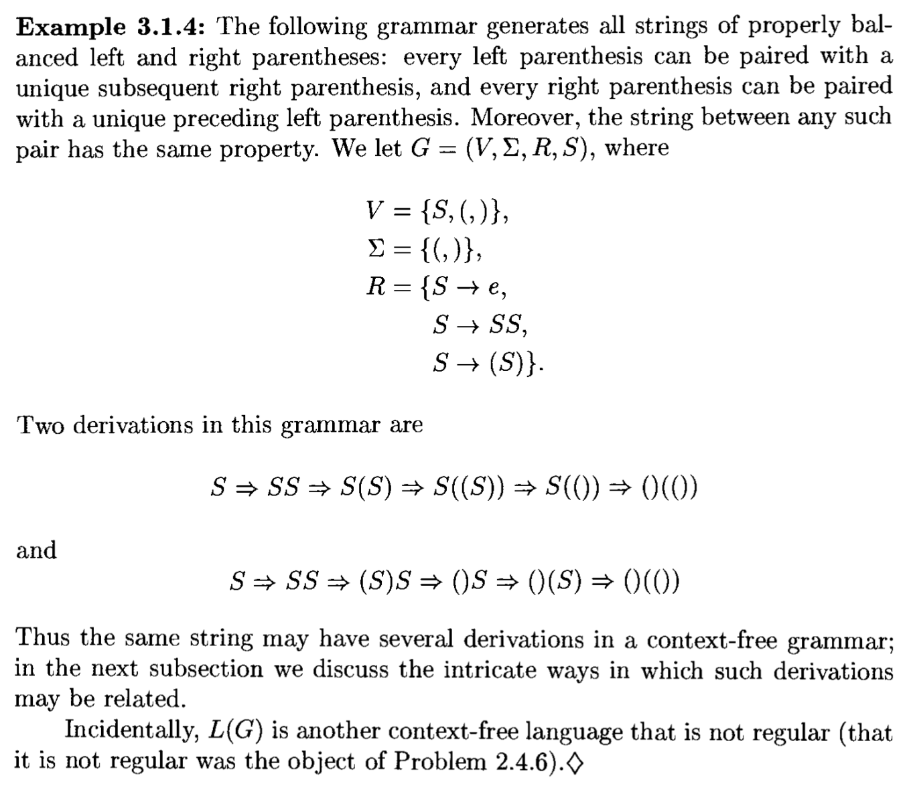
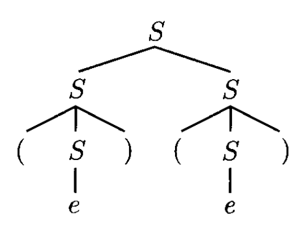
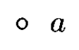
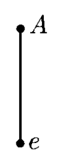
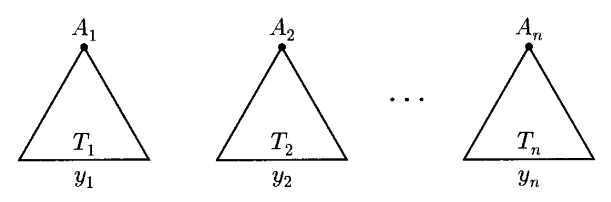
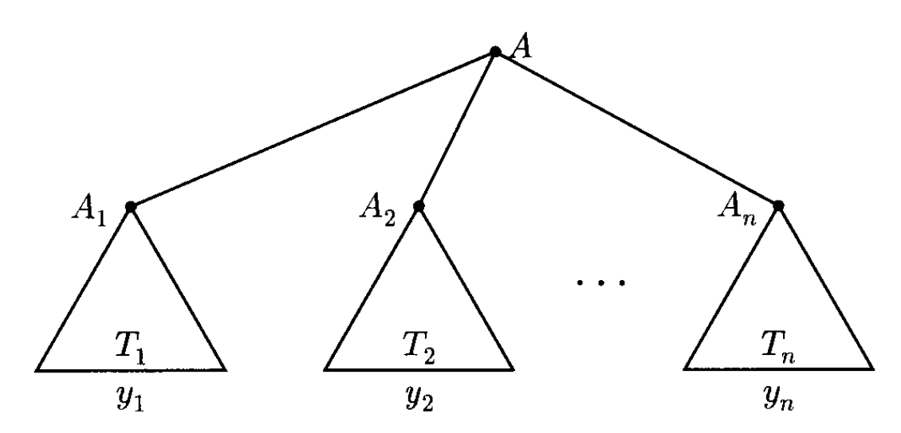
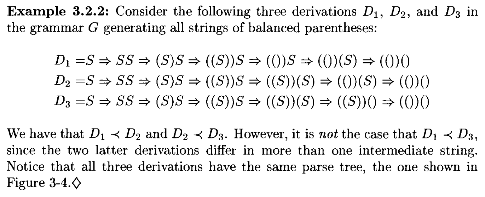
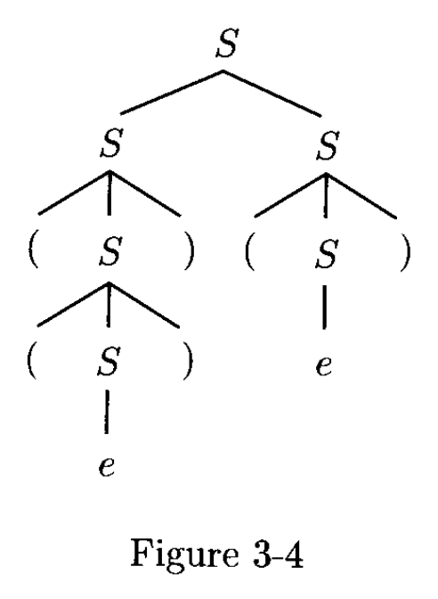
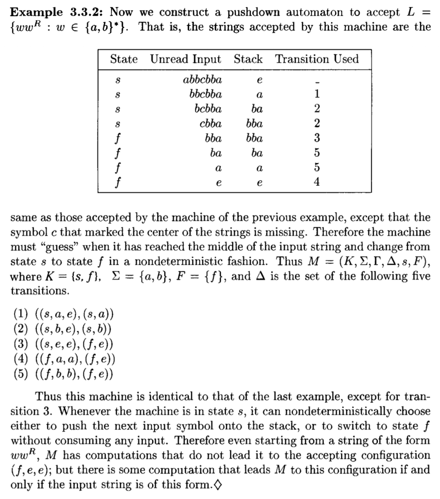

# Context-Free Languages

## Context-Free Grammars

- **语言识别器**(language recognizer)：接受合法字符串的设备
- **语言生成器**(language generator)：生成语法正确的字符串的设备
    - 正则表达式可看作一种语言生成器

下面我们将认识一种更为复杂也更加强大的语言生成器，叫做**上下文无关文法**(context-free grammar, **CFG**)，基于对属于某种语言的字符串结构的更完整的理解。

???+ example "例子"

    对于由正则表达式 $a(a^* \cup b^*)b$ 产生的语言。令 $S$ 作为表示“语言中某一字符串”的新符号，令 $M$ 为中间部分(middle PDArt)（即 $(a^* \cup b^*)$），那么可得到以下表示：
    $$
    S \rightarrow a M b
    $$

    我们称上述表达式为一条**规则**(rule)。而 $M$ 可以这样表示：
    $$
    M \rightarrow A \text{ and } M \rightarrow B
    $$

    其中 $A, B$ 分别表示关于一串 $a$ 或一串 $b$ 的字符串，即：

    $$
    A \rightarrow e \text{ and } A \rightarrow aA \\
    B \rightarrow e \text{ and } B \rightarrow bB
    $$

对于上面的例子，考虑字符串 $aaAb$，符号 $A$ 的**上下文**(context)就是周围的（子）字符串 $aa$ 和 $b$。不难发现，施加 $A$ 的规则时独立于 $A$ 的上下文，这便是“上下文无关”一词的由来。
 
在一条规则中，$\rightarrow$ 左边的符号一般是大写字母，而像小写字母一般不会出现在 $\rightarrow$ 左边——它们往往表示字符串生成过程的终结，所以称它们为**终结符**(terminals)。

下面给出 CFG 的形式定义：

!!! definition "定义"

    **上下文无关文法** $G$ 是一个四元组 $(V, \Sigma, R, S)$，其中：

    - $V$：字母表
    - $\Sigma$：**终结符**集合，$V$ 的子集
    - $R$：**规则**集合，$(V - \Sigma) \times V^*$ 的有限子集
    - $S$：**起始符号**(start symbol)，$V - \Sigma$ 的一个元素

    ---
    - $V - \Sigma$ 中的成员是**非终结符**(nonterminals)
    - $\forall A \in V - \Sigma. u \in V^*$，当 $(A, u) \in R$ 时，记作 $A \rightarrow_G u$
    - 当且仅当存在字符串 $x, y \in V^*, A \in V - \Sigma$，使得 $u = xAy, v = xv'y$ 且 $A \rightarrow_G v'$ 时，记为 $u \Rightarrow_G v$
    - $\Rightarrow_G^*$ 为 $\Rightarrow_G$ 的自反传递闭包
    - 由 $G$ 产生的语言（即**上下文无关语言**(context-free language, **CFL**)）$L(G) = \{w \in \Sigma^*\ :\ S \Rightarrow_G^* w\}$

- 当指代文法足够显而易见时，我们就会省去下标，即写作 $A \rightarrow w, u \Rightarrow v$
- 称如以下形式的任意序列为从 $w_n$ 到 $w_0$ 的 $G$ 的**推导**(derivation)

    $$
    w_0 \Rightarrow_G w_1 \Rightarrow_G \cdots \Rightarrow_G w_n
    $$

    - $w_0, \dots, w_n$ 为 $V^*$ 中的任意字符串
    - 推导的**长度**(length)（或**步骤**(steps)）$n$ 为任意自然数

??? example "例子"

    === "例1"

        用 CFG 表示简单的英语句子，但还是有不少 bug。

        

            
        

    === "例2"

        生成匹配的括号：

        

            
        

        >在数据结构课上，我们会用**栈**来检验字符串中的括号匹配。

## PDArse Trees

根据上一节例 2 给出的 CFG，对于字符串 $()()$，可以通过两种截然不同的推导得到：

$$
S \Rightarrow SS \Rightarrow (S)S \Rightarrow ()S \Rightarrow ()(S) \Rightarrow ()() \\
S \Rightarrow SS \Rightarrow S(S) \Rightarrow S() \Rightarrow (S)() \Rightarrow ()()
$$

{ align=right width=20% }

从结果上看，两种推导是一样的；它们唯一的区别在于使用规则的**顺序**(order)。我们可以用一张图表示这些推导：

- 称这幅图为**解析树**(PDArse tree)
- 树**节点**(node)的标签表示 $V$ 的一个符号
- 所有的叶子都是终结符或空字符串 $e$
- 通过从左往右拼接字符串，得到推导出来的字符串，这边是解析树的**产出**(yield)

对解析树更形式化的定义如下：

{ align=right width=5% }

- 每个由 $a \in \Sigma$ 构成的单节点就是一棵解析树，同时充当根、叶子和产出

{ align=right width=5% }

- 若 $(A \rightarrow e) \in R$，那么右图就是一棵解析树，其中根为 $A$，叶子和产出为 $e$
- 若下图所示的一组树均为解析树

    

        
    

    其中 $n \ge 1$，根节点分别为 $A_1, \dots, A_n$，产出分别为 $y_1, \dots, y_n$，并且 $(A \rightarrow A_1 \dots A_n) \in R$，那么下图所示的树也是一棵解析树。其中根为 $A$，叶子为上述所有解析树的叶子，产出为 $y_1 \dots y_n$

    

        
    

- 除上述情况外的都不是解析树

解析树能够表示**推导的等价类**(equivalence classes)。令 $G = (V, \Sigma, R, S)$ 为 CFG，$D = x_1 \Rightarrow x_2 \Rightarrow \dots \Rightarrow x_n, D' = x_1' \Rightarrow x_2' \Rightarrow \dots \Rightarrow x_n'$ 为 $G$ 的两个推导，其中 $x_i, x_i' \in V^*\ (i = 1, \dots, n);\ x_1, x_1' \in V - \Sigma;\ x_n, x_n' \in V - \Sigma^*$。当 $n > 2$ 且存在整数 $k$，$1 < k < n$，满足：

- $\forall i \ne k, x_i = x_i'$
- $x_{k-1} = x_{k-1}' = uAvBw$，其中 $u, v, w \in V^*, A, B \in V - \Sigma$
- $x_k = uyvBw$，其中 $A \rightarrow y \in R$
- $x_k' = uAvzw$，其中 $B \rightarrow z \in R$
- $x_{k+1} = x_{k+1}' = uxvyw$

那么称 $D$ **先于**(precedes) $D'$，记作 $D \prec D'$。

??? example "例子"

    

        
        
    

    

        
    

当 $(D, D')$ 属于 $\prec$ 的自反、对称、传递闭包时，称 $D, D'$ 是**相似的**(similar)。说人话就是：如果其中一个推导能够通过“**交换**(switching)”使用规则的顺序来得到另一个推导，那么这两个推导就是相似的。

每个推导的等价类都满足相似性，也就是说每棵解析树都包含一个在 $\prec$ 关系下**最大的**(maximal)推导，即<u>先于任何推导的推导</u>。这样的推导就叫做**最左推导**(leftmost derivation)。可按以下步骤从解析树中获得最左推导：从根节点开始，通过运用解析树蕴含的规则，重复替换最左侧的非终结符。

类似地，**最右推导**(rightmost derivation)就是<u>不先于任何推导的推导</u>，也可通过类似的方式得到。每一棵解析树有且仅有一个最左推导和一个最右推导。以最左推导为例：每棵树的最左推导是唯一确定的，因为每一步都有一个需要替换的非终结符，即最左侧的那个。最右推导同理。

判断何时某个推导步是最左推导的一部分是比较容易的一件事。当且仅当 $x = wA\beta, y = w\alpha\beta$，其中 $w \in \Sigma^*, \alpha, \beta \in V^*, A \in V - \Sigma$ 且 $A \rightarrow \alpha$ 是 $G$ 的一条规则时，记作 $x \xRightarrow{L} y$。

- 因此，若 $x_1\Rightarrow x_2\Rightarrow\cdots\Rightarrow x_n$ 是最左推导，那么实际上就是 $x_1 \xRightarrow{L} x_2 \xRightarrow{L} \cdots \xRightarrow{L} x_n$
- 最右推导的对应记号就是 $x \xRightarrow{R} y$

!!! theorem "定理"

    令 $G = (V, \Sigma, R, S)$ 为 CFG，$A \in V - \Sigma, w \in \Sigma^*$，那么以下语句是等价的：

    - $A \Rightarrow^* w$
    - 存在根为 $A$，产出为 $w$ 的一棵解析树
    - 存在最左推导 $A \xRightarrow{L}^* w$
    - 存在最右推导 $A \xRightarrow{R}^* w$

### Ambiguity

假如文法 $G'$ 存在能来自两棵或多棵解析树的字符串，那么称 $G'$ 是**二义的**(ambiguous)。这样的二义文法不利于解析，因为没有唯一的解析树，即语言中的每个字符串没有唯一的“意义(meaning)”。

好在我们有方法能够消除二义性：引入新的非终结符 $T, F$，也就是说存在能够产生相同语言的**非二义**(unambiguous)文法。事实上，存在 CFL 满足每个产生它们的 CFG 必须是二义的，这样的语言称为**内在二义的**(inherently ambiguous)。

## Pushdown Automata

并不是所有 CFL 都能被 FA 识别，因为 CFL 不一定是正则的。比如考虑这个例子：$\{ww^R: w \in \{a, b\}^*\}$，它是上下文无关的，但是无法用 FA 表示。然而，如果机器能够在读取时积累输入字符串，每次向已存储的字符串附加一个符号，那么机器就能以非确定的方式猜测出何时到达输入的中心，从而每次能检查内存中的符号。这样的存储设备是一个**栈**(stack)，因为只允许读取和写入顶部的符号。

    

现在我们用形式定义表述将栈作为辅助存储(auxiliary storage)的自动机的思路：

!!! definition "定义"

    **下推自动机**(pushdown automata, **PDA**)是一个六元组 $M = (K, \Sigma, \Gamma, s, F, \Delta)$，其中：

    - $K$：**状态**的有限集合
    - $\Sigma$：关于**输入符号**的字母表
    - $\Gamma$：关于**栈符号**的字母表
    - $s$：**初始状态**
    - $F$：**最终状态**集合
    - $\Delta$：**转移关系**，$(K \times (\Sigma \cup \{e\}) \times \Gamma^*) \times (K \times \Gamma^*)$ 的有限子集

- 直观地，若 $((p, a, \beta), (q, \gamma)) \in \Delta$，那么处在状态 $p$ 且栈的顶层符号为 $\beta$ 的自动机 $M$ 可能会从输入纸带中读取 $a$（若 $a = e$ 就是没有读到任何东西），用 $\gamma$ 替换栈上的 $\beta$，并进入状态 $q$。这样的一个配对就是 $M$ 的一个**转移**(transition)。
- 由于可在 $M$ 上同时作用多个转移，因此是不确定的(nondeterministic)
- 向栈**压入**(push)符号就是在栈顶添加一个符号；向栈**弹出**(pop)符号就是在栈顶删除符号
- PDA 的**配置**(configuration)定义为 $K \times \Sigma^* \times \Gamma^*$ 的一个成员
    - 假如有配置 $(q, w, abc)$，那么 $a$ 在栈顶，$c$ 在栈底

- 若 $(p, x, \alpha), (q, y, \zeta)$ 均为 $M$ 的配置，当存在一个转移 $((p, a, \beta), (q, \gamma)) \in Delta$，满足 $x = ay, \alpha = \beta \eta, \zeta = \gamma \eta\ (\eta \in \Gamma^*)$ 时，称 $(p, x, \alpha)$ **一步产生了**(yields in one step) $(q, y, \zeta)$，写作 $(p, x, \alpha) \vdash_M (q, y, \zeta)$
    - 记它的自反传递闭包为 $\vdash_M^*$

- 当且仅当对于某些状态 $p \in F$，$(s, w, e) \vdash_M^* (p, e, e)$，称 $M$ **接受了**字符串 $w \in \Sigma^*$
- 从另一种角度看“接受”这件事：存在配置序列 $C_0, C_1, \dots, C_n (n > O)$，满足 $C_0 \vdash_M C_1 \vdash_M \dots \vdash_M C_n, C_0 = (s, w, e)$ 且 $C_n = (p, e, e)\ (p \in F)$
    - 我们称这样的序列为 $M$ 的一次**计算**(computation)，**长度**/**步数**为 $n$

- $M$ 接受的语言 $L(M)$ 即为所有被 $M$ 接受的字符串的集合

??? example "例子"

    === "例1"

        

            
        

    === "例2"

        

            
        

## Pushdown Automata and Context-Free Grammars

!!! theorem "定理"

    被下推自动机接受的语言类就是上下文无关语言类。

证明分为两部分（两条引理的证明）：

!!! note "引理"

    每个上下文无关语言都能被某些下推自动机所接受。

???+ proof "证明"

    令 $G = (V, \Sigma, R, S)$ 为 CFG，我们需要构造一个 PDA（记作 $M$），满足 $L(M) = L(G)$
    
    - $M$ 只有两个状态 $p, q$，并在第一次移动后永远保留在状态 $p$
    - $M$ 还用到终结符和非终结符的集合 $V$ 以及栈字母表

    所以令 $M = (\{p, q\}, \Sigma, V, \Delta, p, \{q\})$，其中 $\Delta$ 包含以下转移：

    1. $((p, e, e), (q, S))$
    2. $((q, e, A), (q, x))$，其中 $(A \rightarrow x) \in R$
    3. $((q, a, a), (q, e))$，其中 $a \in \Sigma$

    - $M$ 始于将 $S$（起始符号）压入空栈中，并进入状态 $q$（转移 1）
    - 在之后的每一步中，要么根据规则 $A \rightarrow x$ 用 $x$ 替换栈顶的符号 $A$（假如是非终结符），要么弹出栈顶符号（假如它是匹配到下一个输入符号的终结符（转移 3））
    - $M$ 的转移设计是为了让栈模拟输入字符串的最左推导

    要继续证明该引理，需证明以下论断(claim)：设 $w \in \Sigma^*, \alpha \in (V - \Sigma) V^* \cup \{e\}$，那么当且仅当 $(q, w, s) \vdash_M^* (q, e, \alpha)$ 时，$S \xRightarrow{L}^* w \alpha$。

    === "必要条件（仅当）"

        假设 $S \Rightarrow^{*} w\alpha$，其中 $w \in \Sigma^{*}$，且 $\alpha \in (V-\Sigma)V^{*} \cup \{e\}$。我们的目标是通过对 $w$ 的**最左推导**长度进行归纳，证明 $(q, w, S) \vdash_{M}^{*}(q, e, \alpha)$。

        - 基础步骤：如果推导长度为 0，那么 $w = e$，且 $\alpha = S$。因此，确实有 $(q, w, S) \vdash_{M}^{*}(q, e, \alpha)$
        - 归纳假设：假设如果 $S \Rightarrow^{*} w\alpha$ 的推导长度为 $n$ 或更小（$n \ge 0$），则 $(q, w, S) \vdash_{M}^{*}(q, e, \alpha)$ 成立
        - 归纳步骤：考虑 $S$ 到 $w\alpha$ 的最左推导，其长度为 $n+1$：

            $$
            S = u_{0} \Rightarrow u_{1} \Rightarrow...\Rightarrow u_{n} \Rightarrow u_{n+1} = w\alpha
            $$

            设 $A$ 是 $u_{n}$ 中最左边的非终结符，则 $u_{n} = xA\beta$，且 $u_{n+1} = x\gamma\beta$，其中 $x \in \Sigma^{*}$，$\beta, \gamma \in V^{*}$，且 $A \rightarrow \gamma$ 是文法 $R$ 中的一条规则。

            1. 由于 $S$ 到 $u_{n} = xA\beta$ 的最左推导长度为 $n$，根据归纳假设：
                
                $$(q, x, S) \vdash_{M}^{*}(q, e, A\beta)$$

            2. 又因为 $A \rightarrow \gamma$ 是 $R$ 中的一条规则，通过一个类型 2 转换，我们可以得到：
                
                $$(q, e, A\beta) \vdash_{M} (q, e, \gamma\beta)$$

            3. 现在注意到 $u_{n+1}$ 既是 $w\alpha$，同时也是 $x\gamma\beta$。因此，存在一个字符串 $y \in \Sigma^{*}$，使得 $w = xy$ 且 $y\alpha = \gamma\beta$。我们可以将 a 和 b 重写为：

                $$(q, w, S) \vdash_{M}^{*}(q, y, \gamma\beta)$$

            4. 然而，由于 $y\alpha = \gamma\beta$，通过 $|y|$ 个类型 3 转换的序列，我们可以得到：
                
                $$(q, y, \gamma\beta) \vdash_{M}^{*}(q, e, \alpha)$$

            结合 c 和 d，完成了归纳步骤。

    === "充分条件（当）"

        假设 $(q, w, S) \vdash_{M}^{*}(q, e, \alpha)$，其中 $w \in \Sigma^{*}$ 且 $\alpha \in (V-\Sigma)V^{*} \cup \{e\}$。我们需要证明 $S \Rightarrow^{*} w\alpha$。同样采用归纳法，但这次是基于 $M$ 的计算中 Type 2 转换的数量。

        - 基础步骤：由于任何计算的第一步是类型 2 转换，如果 $(q, w, S) \vdash_{M}^{*}(q, e, \alpha)$ 不包含类型 2 转换，那么 $w = e$ 且 $\alpha = S$。此时结果 $S \Rightarrow^{*} eS$ 是成立的

        - 归纳假设：假设如果 $(q, w, S) \vdash_{M}^{*}(q, e, \alpha)$ 是由 $n$ 个 Type 2 步骤或更少（$n \ge 0$）的计算完成的，则 $S \Rightarrow^{*} w\alpha$ 成立

        - 归纳步骤：假设 $(q, w, S) \vdash_{M}^{*}(q, e, \alpha)$ 是由 $n+1$ 个 Type 2 转换完成的。考虑倒数第二个类型 2 转换，假设计算序列为：
        
            $$(q, w, S) \vdash_{M}^{*}(q, y, A\beta) \vdash_{M} (q, y, \gamma\beta) \vdash_{M}^{*}(q, e, \alpha)$$

            其中 $w = xy$，对于某些 $x, y \in \Sigma^{*}$，且 $A \rightarrow \gamma$ 是文法中的一条规则。

            1. 从 $(q, w, S) \vdash_{M}^{*}(q, y, A\beta)$ 到 $(q, y, A\beta)$ 的计算中，只包含了 $n$ 个 Type 2 转换。
            
                $$(q, w, S) \vdash_{M}^{*}(q, y, A\beta) \text{}$$
                
                根据归纳假设，得到 $S \Rightarrow^{*} xA\beta$。

            2. 由于 $A \rightarrow \gamma$ 是规则，有 $S \Rightarrow^{*} x\gamma\beta$
            3. 然而，由于 $(q, y, \gamma\beta) \vdash_{M}^{*}(q, e, \alpha)$，并且这部分计算推测仅由类型 3 转换构成，由此可得 $y\alpha = \gamma\beta$

            因此，$S \Rightarrow^{*} x\gamma\beta = x(y\alpha) = (xy)\alpha = w\alpha$。

下面证明定理的另一半：

!!! note "引理"

    若某个语言被下推自动机所接受，那么它就是上下文无关语言。

