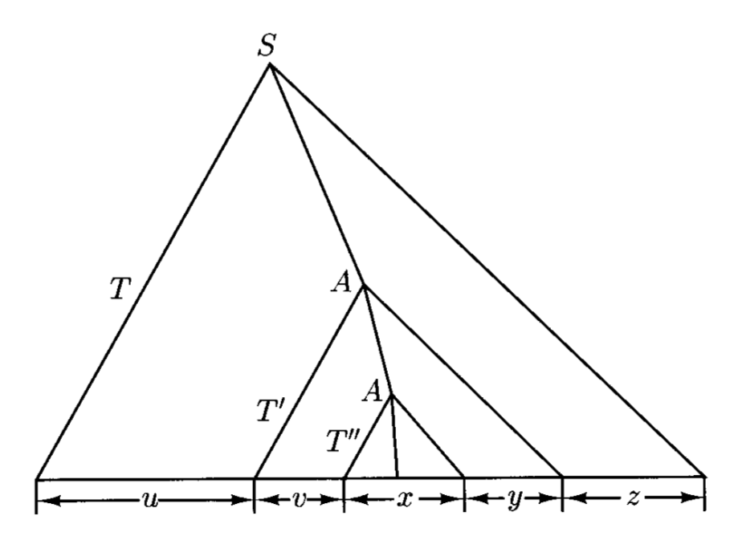

# Context-Free Languages

## Context-Free Grammars

- **语言识别器**(language recognizer)：接受合法字符串的设备
- **语言生成器**(language generator)：生成语法正确的字符串的设备
    - 正则表达式可看作一种语言生成器

下面我们将认识一种更为复杂也更加强大的语言生成器，叫做**上下文无关文法**(context-free grammar, **CFG**)，基于对属于某种语言的字符串结构的更完整的理解。

???+ example "例子"

    对于由正则表达式 $a(a^* \cup b^*)b$ 产生的语言。令 $S$ 作为表示“语言中某一字符串”的新符号，令 $M$ 为中间部分(middle PDArt)（即 $(a^* \cup b^*)$），那么可得到以下表示：
    $$
    S \rightarrow a M b
    $$

    我们称上述表达式为一条**规则**(rule)。而 $M$ 可以这样表示：
    $$
    M \rightarrow A \text{ and } M \rightarrow B
    $$

    其中 $A, B$ 分别表示关于一串 $a$ 或一串 $b$ 的字符串，即：

    $$
    A \rightarrow e \text{ and } A \rightarrow aA \\
    B \rightarrow e \text{ and } B \rightarrow bB
    $$

对于上面的例子，考虑字符串 $aaAb$，符号 $A$ 的**上下文**(context)就是周围的（子）字符串 $aa$ 和 $b$。不难发现，施加 $A$ 的规则时独立于 $A$ 的上下文，这便是“上下文无关”一词的由来。
 
在一条规则中，$\rightarrow$ 左边的符号一般是大写字母，而像小写字母一般不会出现在 $\rightarrow$ 左边——它们往往表示字符串生成过程的终结，所以称它们为**终结符**(terminals)。

下面给出 CFG 的形式定义：

!!! definition "定义"

    **上下文无关文法** $G$ 是一个四元组 $(V, \Sigma, R, S)$，其中：

    - $V$：字母表
    - $\Sigma$：**终结符**集合，$V$ 的子集
    - $R$：**规则**集合，$(V - \Sigma) \times V^*$ 的有限子集
    - $S$：**起始符号**(start symbol)，$V - \Sigma$ 的一个元素

    ---
    - $V - \Sigma$ 中的成员是**非终结符**(nonterminals)
    - $\forall A \in V - \Sigma, u \in V^*$，当 $(A, u) \in R$ 时，记作 $A \rightarrow_G u$
    - 当且仅当存在字符串 $x, y \in V^*, A \in V - \Sigma$，使得 $u = xAy, v = xv'y$ 且 $A \rightarrow_G v'$ 时，记为 $u \Rightarrow_G v$
    - $\Rightarrow_G^*$ 为 $\Rightarrow_G$ 的自反传递闭包
    - 由 $G$ 产生的语言（即**上下文无关语言**(context-free language, **CFL**)）$L(G) = \{w \in \Sigma^*\ :\ S \Rightarrow_G^* w\}$

- 当指代文法足够显而易见时，我们就会省去下标，即写作 $A \rightarrow w, u \Rightarrow v$
- 称如以下形式的任意序列为从 $w_n$ 到 $w_0$ 的 $G$ 的**推导**(derivation)

    $$
    w_0 \Rightarrow_G w_1 \Rightarrow_G \cdots \Rightarrow_G w_n
    $$

    - $w_0, \dots, w_n$ 为 $V^*$ 中的任意字符串
    - 推导的**长度**(length)（或**步骤**(steps)）$n$ 为任意自然数

??? example "例子"

    === "例1"

        用 CFG 表示简单的英语句子，但还是有不少 bug。

        <div style="text-align: center">
            
        </div>

    === "例2"

        生成匹配的括号：

        <div style="text-align: center">
            
        </div>

        >在数据结构课上，我们会用**栈**来检验字符串中的括号匹配。


## Parse Trees

根据上一节例 2 给出的 CFG，对于字符串 $()()$，可以通过两种截然不同的推导得到：

$$
S \Rightarrow SS \Rightarrow (S)S \Rightarrow ()S \Rightarrow ()(S) \Rightarrow ()() \\
S \Rightarrow SS \Rightarrow S(S) \Rightarrow S() \Rightarrow (S)() \Rightarrow ()()
$$

{ align=right width=20% }

从结果上看，两种推导是一样的；它们唯一的区别在于使用规则的**顺序**(order)。我们可以用一张图表示这些推导：

- 称这幅图为**解析树**(PDArse tree)
- 树**节点**(node)的标签表示 $V$ 的一个符号
- 所有的叶子都是终结符或空字符串 $e$
- 通过从左往右拼接字符串，得到推导出来的字符串，这边是解析树的**产出**(yield)

对解析树更形式化的定义如下：

{ align=right width=5% }

- 每个由 $a \in \Sigma$ 构成的单节点就是一棵解析树，同时充当根、叶子和产出

{ align=right width=5% }

- 若 $(A \rightarrow e) \in R$，那么右图就是一棵解析树，其中根为 $A$，叶子和产出为 $e$
- 若下图所示的一组树均为解析树

    <div style="text-align: center">
        
    </div>

    其中 $n \ge 1$，根节点分别为 $A_1, \dots, A_n$，产出分别为 $y_1, \dots, y_n$，并且 $(A \rightarrow A_1 \dots A_n) \in R$，那么下图所示的树也是一棵解析树。其中根为 $A$，叶子为上述所有解析树的叶子，产出为 $y_1 \dots y_n$

    <div style="text-align: center">
        
    </div>

- 除上述情况外的都不是解析树

解析树能够表示**推导的等价类**(equivalence classes)。令 $G = (V, \Sigma, R, S)$ 为 CFG，$D = x_1 \Rightarrow x_2 \Rightarrow \dots \Rightarrow x_n, D' = x_1' \Rightarrow x_2' \Rightarrow \dots \Rightarrow x_n'$ 为 $G$ 的两个推导，其中 $x_i, x_i' \in V^*\ (i = 1, \dots, n);\ x_1, x_1' \in V - \Sigma;\ x_n, x_n' \in \Sigma^*$。当 $n > 2$ 且存在整数 $k$，$1 < k < n$，满足：

- $\forall i \ne k, x_i = x_i'$
- $x_{k-1} = x_{k-1}' = uAvBw$，其中 $u, v, w \in V^*, A, B \in V - \Sigma$
- $x_k = uyvBw$，其中 $A \rightarrow y \in R$
- $x_k' = uAvzw$，其中 $B \rightarrow z \in R$
- $x_{k+1} = x_{k+1}' = uxvyw$

那么称 $D$ **先于**(precedes) $D'$，记作 $D \prec D'$。

??? example "例子"

    <div style="text-align: center">
        
        
    </div>

    <div style="text-align: center">
        
    </div>

当 $(D, D')$ 属于 $\prec$ 的自反、对称、传递闭包时，称 $D, D'$ 是**相似的**(similar)。说人话就是：如果其中一个推导能够通过“**交换**(switching)”使用规则的顺序来得到另一个推导，那么这两个推导就是相似的。

每个推导的等价类都满足相似性，也就是说每棵解析树都包含一个在 $\prec$ 关系下**最大的**(maximal)推导，即<u>先于任何推导的推导</u>。这样的推导就叫做**最左推导**(leftmost derivation)。可按以下步骤从解析树中获得最左推导：从根节点开始，通过运用解析树蕴含的规则，重复替换最左侧的非终结符。

类似地，**最右推导**(rightmost derivation)就是<u>不先于任何推导的推导</u>，也可通过类似的方式得到。每一棵解析树有且仅有一个最左推导和一个最右推导。以最左推导为例：每棵树的最左推导是唯一确定的，因为每一步都有一个需要替换的非终结符，即最左侧的那个。最右推导同理。

判断何时某个推导步是最左推导的一部分是比较容易的一件事。当且仅当 $x = wA\beta, y = w\alpha\beta$，其中 $w \in \Sigma^*, \alpha, \beta \in V^*, A \in V - \Sigma$ 且 $A \rightarrow \alpha$ 是 $G$ 的一条规则时，记作 $x \xRightarrow{L} y$。

- 因此，若 $x_1\Rightarrow x_2\Rightarrow\cdots\Rightarrow x_n$ 是最左推导，那么实际上就是 $x_1 \xRightarrow{L} x_2 \xRightarrow{L} \cdots \xRightarrow{L} x_n$
- 最右推导的对应记号就是 $x \xRightarrow{R} y$

!!! theorem "定理"

    令 $G = (V, \Sigma, R, S)$ 为 CFG，$A \in V - \Sigma, w \in \Sigma^*$，那么以下语句是等价的：

    - $A \Rightarrow^* w$
    - 存在根为 $A$，产出为 $w$ 的一棵解析树
    - 存在最左推导 $A \xRightarrow{L}^* w$
    - 存在最右推导 $A \xRightarrow{R}^* w$


### Ambiguity

假如文法 $G'$ 存在能来自两棵或多棵解析树的字符串，那么称 $G'$ 是**二义的**(ambiguous)。这样的二义文法不利于解析，因为没有唯一的解析树，即语言中的每个字符串没有唯一的“意义(meaning)”。

好在我们有方法能够消除二义性：引入新的非终结符 $T, F$，也就是说存在能够产生相同语言的**非二义**(unambiguous)文法。事实上，存在 CFL 满足每个产生它们的 CFG 必须是二义的，这样的语言称为**内在二义的**(inherently ambiguous)。


## Pushdown Automata

并不是所有 CFL 都能被 FA 识别，因为 CFL 不一定是正则的。比如考虑这个例子：$\{ww^R: w \in \{a, b\}^*\}$，它是上下文无关的，但是无法用 FA 表示。然而，如果机器能够在读取时积累输入字符串，每次向已存储的字符串附加一个符号，那么机器就能以非确定的方式猜测出何时到达输入的中心，从而每次能检查内存中的符号。这样的存储设备是一个**栈**(stack)，因为只允许读取和写入顶部的符号。

<div style="text-align: center">
    
</div>

现在我们用形式定义表述将栈作为辅助存储(auxiliary storage)的自动机的思路：

!!! definition "定义"

    **下推自动机**(pushdown automata, **PDA**)是一个六元组 $M = (K, \Sigma, \Gamma, s, F, \Delta)$，其中：

    - $K$：**状态**的有限集合
    - $\Sigma$：关于**输入符号**的字母表
    - $\Gamma$：关于**栈符号**的字母表
    - $s$：**初始状态**
    - $F$：**最终状态**集合
    - $\Delta$：**转移关系**，$(K \times (\Sigma \cup \{e\}) \times \Gamma^*) \times (K \times \Gamma^*)$ 的有限子集

- 直观地，若 $((p, a, \beta), (q, \gamma)) \in \Delta$，那么处在状态 $p$ 且栈的顶层符号为 $\beta$ 的自动机 $M$ 可能会从输入纸带中读取 $a$（若 $a = e$ 就是没有读到任何东西），用 $\gamma$ 替换栈上的 $\beta$，并进入状态 $q$。这样的一个配对就是 $M$ 的一个**转移**(transition)。
- 由于可在 $M$ 上同时作用多个转移，因此是不确定的(nondeterministic)
- 向栈**压入**(push)符号就是在栈顶添加一个符号；向栈**弹出**(pop)符号就是在栈顶删除符号
- PDA 的**配置**(configuration)定义为 $K \times \Sigma^* \times \Gamma^*$ 的一个成员
    - 假如有配置 $(q, w, abc)$，那么 $a$ 在栈顶，$c$ 在栈底

- 若 $(p, x, \alpha), (q, y, \zeta)$ 均为 $M$ 的配置，当存在一个转移 $((p, a, \beta), (q, \gamma)) \in \Delta$，满足 $x = ay, \alpha = \beta \eta, \zeta = \gamma \eta\ (\eta \in \Gamma^*)$ 时，称 $(p, x, \alpha)$ **一步产生了**(yields in one step) $(q, y, \zeta)$，写作 $(p, x, \alpha) \vdash_M (q, y, \zeta)$
    - 记它的自反传递闭包为 $\vdash_M^*$

- 当且仅当对于某些状态 $p \in F$，$(s, w, e) \vdash_M^* (p, e, e)$，称 $M$ **接受了**字符串 $w \in \Sigma^*$
- 从另一种角度看“接受”这件事：存在配置序列 $C_0, C_1, \dots, C_n (n > O)$，满足 $C_0 \vdash_M C_1 \vdash_M \dots \vdash_M C_n, C_0 = (s, w, e)$ 且 $C_n = (p, e, e)\ (p \in F)$
    - 我们称这样的序列为 $M$ 的一次**计算**(computation)，**长度**/**步数**为 $n$

- $M$ 接受的语言 $L(M)$ 即为所有被 $M$ 接受的字符串的集合

??? example "例子"

    === "例1"

        <div style="text-align: center">
            
        </div>

    === "例2"

        <div style="text-align: center">
            
        </div>


## Pushdown Automata and Context-Free Grammars

!!! theorem "定理"

    被下推自动机接受的语言类就是上下文无关语言类。

证明分为两部分（两条引理的证明）：

!!! note "引理"

    每个上下文无关语言都能被某些下推自动机所接受。

??? proof "证明"

    令 $G = (V, \Sigma, R, S)$ 为 CFG，我们需要构造一个 PDA（记作 $M$），满足 $L(M) = L(G)$
    
    - $M$ 只有两个状态 $p, q$，并在第一次移动后永远保留在状态 $p$
    - $M$ 还用到终结符和非终结符的集合 $V$ 以及栈字母表

    所以令 $M = (\{p, q\}, \Sigma, V, \Delta, p, \{q\})$，其中 $\Delta$ 包含以下转移：

    1. $((p, e, e), (q, S))$
    2. $((q, e, A), (q, x))$，其中 $(A \rightarrow x) \in R$
    3. $((q, a, a), (q, e))$，其中 $a \in \Sigma$

    - $M$ 始于将 $S$（起始符号）压入空栈中，并进入状态 $q$（转移 1）
    - 在之后的每一步中，要么根据规则 $A \rightarrow x$ 用 $x$ 替换栈顶的符号 $A$（假如是非终结符），要么弹出栈顶符号（假如它是匹配到下一个输入符号的终结符（转移 3））
    - $M$ 的转移设计是为了让栈模拟输入字符串的最左推导

    要继续证明该引理，需证明以下论断(claim)：设 $w \in \Sigma^*, \alpha \in (V - \Sigma) V^* \cup \{e\}$，那么当且仅当 $(q, w, s) \vdash_M^* (q, e, \alpha)$ 时，$S \xRightarrow{L}^* w \alpha$。

    === "必要条件（仅当）"

        假设 $S \Rightarrow^{*} w\alpha$，其中 $w \in \Sigma^{*}$，且 $\alpha \in (V-\Sigma)V^{*} \cup \{e\}$。我们的目标是通过对 $w$ 的**最左推导**长度进行归纳，证明 $(q, w, S) \vdash_{M}^{*}(q, e, \alpha)$。

        - 基础步骤：如果推导长度为 0，那么 $w = e$，且 $\alpha = S$。因此，确实有 $(q, w, S) \vdash_{M}^{*}(q, e, \alpha)$
        - 归纳假设：假设如果 $S \Rightarrow^{*} w\alpha$ 的推导长度为 $n$ 或更小（$n \ge 0$），则 $(q, w, S) \vdash_{M}^{*}(q, e, \alpha)$ 成立
        - 归纳步骤：考虑 $S$ 到 $w\alpha$ 的最左推导，其长度为 $n+1$：

            $$
            S = u_{0} \Rightarrow u_{1} \Rightarrow...\Rightarrow u_{n} \Rightarrow u_{n+1} = w\alpha
            $$

            设 $A$ 是 $u_{n}$ 中最左边的非终结符，则 $u_{n} = xA\beta$，且 $u_{n+1} = x\gamma\beta$，其中 $x \in \Sigma^{*}$，$\beta, \gamma \in V^{*}$，且 $A \rightarrow \gamma$ 是文法 $R$ 中的一条规则。

            1. 由于 $S$ 到 $u_{n} = xA\beta$ 的最左推导长度为 $n$，根据归纳假设：
                
                $$(q, x, S) \vdash_{M}^{*}(q, e, A\beta)$$

            2. 又因为 $A \rightarrow \gamma$ 是 $R$ 中的一条规则，通过一个类型 2 转换，我们可以得到：
                
                $$(q, e, A\beta) \vdash_{M} (q, e, \gamma\beta)$$

            3. 现在注意到 $u_{n+1}$ 既是 $w\alpha$，同时也是 $x\gamma\beta$。因此，存在一个字符串 $y \in \Sigma^{*}$，使得 $w = xy$ 且 $y\alpha = \gamma\beta$。我们可以将 a 和 b 重写为：

                $$(q, w, S) \vdash_{M}^{*}(q, y, \gamma\beta)$$

            4. 然而，由于 $y\alpha = \gamma\beta$，通过 $|y|$ 个类型 3 转换的序列，我们可以得到：
                
                $$(q, y, \gamma\beta) \vdash_{M}^{*}(q, e, \alpha)$$

            结合 c 和 d，完成了归纳步骤。

    === "充分条件（当）"

        假设 $(q, w, S) \vdash_{M}^{*}(q, e, \alpha)$，其中 $w \in \Sigma^{*}$ 且 $\alpha \in (V-\Sigma)V^{*} \cup \{e\}$。我们需要证明 $S \Rightarrow^{*} w\alpha$。同样采用归纳法，但这次是基于 $M$ 的计算中 Type 2 转换的数量。

        - 基础步骤：由于任何计算的第一步是类型 2 转换，如果 $(q, w, S) \vdash_{M}^{*}(q, e, \alpha)$ 不包含类型 2 转换，那么 $w = e$ 且 $\alpha = S$。此时结果 $S \Rightarrow^{*} eS$ 是成立的

        - 归纳假设：假设如果 $(q, w, S) \vdash_{M}^{*}(q, e, \alpha)$ 是由 $n$ 个 Type 2 步骤或更少（$n \ge 0$）的计算完成的，则 $S \Rightarrow^{*} w\alpha$ 成立

        - 归纳步骤：假设 $(q, w, S) \vdash_{M}^{*}(q, e, \alpha)$ 是由 $n+1$ 个 Type 2 转换完成的。考虑倒数第二个类型 2 转换，假设计算序列为：
        
            $$(q, w, S) \vdash_{M}^{*}(q, y, A\beta) \vdash_{M} (q, y, \gamma\beta) \vdash_{M}^{*}(q, e, \alpha)$$

            其中 $w = xy$，对于某些 $x, y \in \Sigma^{*}$，且 $A \rightarrow \gamma$ 是文法中的一条规则。

            1. 从 $(q, w, S) \vdash_{M}^{*}(q, y, A\beta)$ 到 $(q, y, A\beta)$ 的计算中，只包含了 $n$ 个 Type 2 转换。
            
                $$(q, w, S) \vdash_{M}^{*}(q, y, A\beta) \text{}$$
                
                根据归纳假设，得到 $S \Rightarrow^{*} xA\beta$。

            2. 由于 $A \rightarrow \gamma$ 是规则，有 $S \Rightarrow^{*} x\gamma\beta$
            3. 然而，由于 $(q, y, \gamma\beta) \vdash_{M}^{*}(q, e, \alpha)$，并且这部分计算推测仅由类型 3 转换构成，由此可得 $y\alpha = \gamma\beta$

            因此，$S \Rightarrow^{*} x\gamma\beta = x(y\alpha) = (xy)\alpha = w\alpha$。

下面证明定理的另一半：

!!! note "引理"

    若某个语言被下推自动机所接受，那么它就是上下文无关语言。

??? proof "证明"

    TBD（教材 $P_{139-142}$，~~太多了，想当懒狗~~）


## Languages that Are and Are Not Context-Free

### Closure Properties

!!! theorem "定理"

    上下文无关语言在**并**、**拼接**和**克莱尼星号**上是封闭的。

    ??? proof "证明"

        令 $G_1 = \{V_1, \Sigma_1, R_1, S_1\}, G_2 = \{V_2, \Sigma_2, R_2, S_2\}$ 为 CFG。不失一般性地，假设它们的非终结符集合（即 $V_1 - \Sigma_1, V_2 - \Sigma_2$）是不相交的。

        === "并"

        - 令 $S$ 为新符号，$G = \{V_1 \cup V_2 \cup \{S\}, \Sigma_1 \cup \Sigma_2, R, S\}$，其中 $R = R_1 \cup R_2 \cup \{S \rightarrow S_1, S \rightarrow S_2\}$，那么可以声称 $L(G) = L(G_1) \cup L(G_2)$
        - 由于包含 $S$ 的规则为 $S \rightarrow S_1, S \rightarrow S_2$，所以当且仅当 $S_1 \Rightarrow_G^* w$ 或 $S_2 \Rightarrow_G^* w$ 时，$S \Rightarrow_G^* w$
        - 又由于 $G_1, G_2$ 有不相交的非终结符集合，因此最后的析取(disjunction)等价于 $w \in L(G_1) \cup L(G_2)$

        === "拼接"

            构造是相似的。$L(G_1)L(G_2)$ 由以下文法产生：
            $$
            G = (V_1 \cup V_2 \cup \{S\}, \Sigma_1 \cup \Sigma_2, R_1 \cup R_2 \cup \{S \to S_1 S_2\}, S).
            $$

        === "克莱尼星号"

            $L(G_1)^*$ 由以下文法生成：
            $$
            G = (V_1 \cup \{S\}, \Sigma_1, R_1 \cup \{S \to \varepsilon, S \to SS_1\}, S)
            $$

!!! theorem "定理"

    一个上下文无关语言和一个正则语言的交集是一个上下文无关语言。

    ??? proof "证明"

        若 $L$ 是 CFL 且 $R$ 为 RL，那么 $L = M(G_1)$，$M_1$ 为 PDA $(K_1, \Sigma_1, \Gamma_1, \Delta_1, s_1, F_1)$，$R = L(M_2)$，$M_2$ 为 DFA $(K_2, \Sigma, \delta, s_2, F_2)$。思路是将这两个机器结合为一个 PDA $M$，能并行执行 $M_1, M_2$ 的计算，并且仅接受两个机器都接受的字符串。令 $M = (K, \Sigma, \Gamma, \Delta, s, F)$，其中：

        - $K = K_1 \times K_2$
        - $\Gamma = \Gamma_1$
        - $s = (s_1, s_2)$
        - $F = F_1 \times F_2$
        - $\Delta$
        - 对每个 PDA 的转移 $((q_1, a, \beta), (p_1, \gamma)) \in \Delta_1$ 和每个状态 $q_2 \in K_2$，将转移 $(((q_1, q_2), a, \beta), (p_1, \delta(q_1, a), \gamma))$ 加到 $\Delta$ 中
        - 对每个 PDA 的转移 $((q_1, e, \beta), (p_1, \gamma)) \in \Delta_1$ 和每个状态 $q_2 \in K_2$，将转移 $(((q_1, q_2), e, \beta), ((p_1, q_2), \gamma))$ 加到 $\Delta$ 中


### Pumping Theorem

令 $G = \{V, \Sigma, R, S\}$ 为 CFG，

- $G$ 的**扇出**(fanout) $\phi(G)$ 是 $R$ 的所有规则中箭头右边最大的符号数
- 解析树的**路径**(path)是指由不同节点构成的序列，每一个节点和上一个节点用线段连接，其**长度**(length)即为线段数
- 解析树的**高度**(height)是最长路径的长度

!!! theorem "定理"

    任意 $G$ 的高为 $h$ 的解析树的产出长度至多为 $\phi(G)^h$。

!!! theorem "泵定理(pumping theorem)"

    令 $G = (V, \Sigma, R, S)$ 为上下文无关文法，任意长度超过 $\phi(G)^{|V - \Sigma|}$ 的字符串 $w \in L(G)$ 能被重写为 $w = uvxyz$，满足 $v$ 或 $y$ 为非空（即 $vy \ne e$），且每个 $n \ge 0$ 的字符串 $uv^nxy^nz$ 均在 $L(G)$ 内。

    ??? proof "证明"

        - 令 $w$ 为字符串，$T$ 为解析树，其根节点为 $S$，产出 $w$ 为所有同根和同产出的解析树中叶子数最少的那个
        - 由于产出长于 $\phi(G)^{|V - \Sigma|}$，所以 $T$ 的路径长至少为 $|V - \Sigma| + 1$，即有 $|V - \Sigma| + 2$ 个节点；其中只有一个节点是终结符，其余均为非终结符
        - 由于路径上的节点数多于非终结符的个数，因此存在路径上两个不同节点有相同成员 $A \in V - \Sigma$

        <div style="text-align: center">
            
        </div>

        观察以上路径：
        
        - 令 $u, v, w, x, y, z$ 为 $T$ 的部分产出
        - $T'$ 中除去 $T''$ 的部分能够被重复任意多次（包括 0 次），以产生其他解析树，对应产出为 $uv^nxy^nz$

!!! theorem "定理"

    CFL 在交或补运算上不封闭。

    ??? proof "证明"

        - 显然 $\{a^nb^nc^m : m, n \ge 0\}, \{a^mb^nc^n : m, n \ge 0\}$ 是上下文无关的。但它们的交 $\{a^nb^nc^n, n \ge 0\}$ 不是上下文无关的
        - 由于 $L_1 \cap L_2 = \overline{\overline{L_1} \cup \overline{L_2}}$，若在补运算在封闭，那么也会在交运算封闭，所以补运算也不封闭


## Algorithms for Context-Free Grammars

!!! theorem "定理"

    - 存在多项式时间内的算法，能够为给定的 CFG 构造一个等价的 PDA
    - 存在多项式时间内的算法，能够为给定的 PDA 构造一个等价的 CFG
    - 存在多项式时间内的算法，能够根据给定的 CFG 和字符串 $x$，判断 $x \in L(G)$ 是否成立

!!! definition "定义"

    对于 CFG $G = (V, \Sigma, R, S)$，若满足以下形式，称 $G$ 处于**乔姆斯基范式**(Chomsky normal form, **CNF**)：

    - $S \rightarrow e$
    - $A \rightarrow BC\ (B, C \in V - \Sigma - \{S\})$
    - $A \rightarrow a\ (a \in \Sigma)$

!!! theorem "定理"

    对于任意的 CFG $G$，存在处于 CNF 的 CFG $G'$，满足 $L(G') = L(G) - \{\Sigma \cup \{e\}\}$。另外，$G'$ 的构造能在多项式时间（与 $G$ 的大小相关）内完成。

下面展示如何将 $G$ 转换为对应的 CNF。有以下三种在规则右侧违背 CNF 的情况：

- **长规则**（长度 >= 3）
- **空(e)规则**（$A \rightarrow e\ (A \notin S)$）
- **短规则**（$A \rightarrow a$ 或 $A \rightarrow B$）

接下来将一一移除这些违背 CNF 定义的情况：

- 长规则：假设 $A \rightarrow B_1 B_2 \dots B_n \in R$，其中 $B_1 \dots B_n \in V$ 且 $n \ge 3$
    - 用新的 $n - 1$ 条规则替换它，即：

        $$
        \begin{aligned}A\to&B_1A_1,\\A_1\to&B_2A_2,\\&\vdots\\A_{n-2}\to&B_{n-1}B_n\end{aligned}
        $$

        其中 $A_1, \dots, A_{n-2}$ 为非终结符

    - 重复上述替换过程，结果一定等价于原来的那条规则，且箭头右侧长度不超过 2

- e 规则
    - 定义一个可擦除非终结符的集合 $\mathcal{E}=\{A\in V-\Sigma:A\Rightarrow^*e\}$，即所有可能推导出空字符串的非终结符
    - 这一过程可通过以下闭包计算完成：

        ```py
        E := emptyset
        while there is a rule A -> alpha with alpha in E* and A not in E do
            add A to E
        ```

    - 有了 $\mathcal{E}$ 之后，可根据它删掉 $G$ 中所有的 e 规则——重复以下步骤：对于每条形如 $A \rightarrow BC$ 或 $A \rightarrow CB$（$B \in \mathcal{E}, C \in V$）的规则，将 $A \rightarrow C$ 加入到文法中
    - 这么操作下来，除了 $e$ 不能推导出来外，其他推导照旧，因为上述过程忽略了规则 $S \rightarrow e$

- 短规则
    - $\forall A \in V$，通过以下简单的闭包算法，计算从 $A$ 推导出的符号集合 $\mathcal{D}(A) = \{B \in V: A \Rightarrow^* B\}$：

        ```py
        D(A) := {A}
        while there is a rule B -> C with B in D(A) and C not in D(A) do
            add C to D(A)
        ```

    - 若 $a$ 为终结符，$\mathcal{D}(a) = a$
    - 我们用 $A \rightarrow B'C'$ 替换 $A \rightarrow BC$，其中 $B' \in \mathcal{D}(B), C' \in \mathcal{D}(C)$，从而消除了短规则
    - 最后为 $A \rightarrow BC$ 增加规则 $S \rightarrow BC$，满足 $A \in \mathcal{D}(S) - \{S\}$
  
最后分析一下上述操作的时间复杂度：

- 长规则：$\mathcal{O}(n)$
- e 规则：$\mathcal{O}(n^2)$
- 短规则：$\mathcal{O}(n^2)$

因此总的时间复杂度为 $\mathcal{O}(n^2)$

CNF 的一个好处是它能在多项式时间内判断是否能从一个文法中生成某个字符串，对应算法如下（通过分析 $x$ 的所有子字符串判断 $x \in L(G)$）：

```py
for i := 1 to n do
    N[i][i] = {x[i]}; all other N[i][j] are initially empty
for s := 1 to n - 1 do
    for i := 1 to n - s do
        for k := i to i + s - 1 do
            if there is a rule A -> BC in R with B in N[i][k] and C in N[k + 1][i + s]
                then add A to N[i][i + s]
    Accept x if S in N[1][n]
```

该算法是一种**动态规划**(dynamic programming)算法，因为它将一个问题划分为多个子问题，并且其解是从子问题的解中构建出来的。

为证明算法正确性，我们需声称：对于自然数 $0 \le s \le n$，算法经 $s$ 次迭代后，$\forall\ i = 1, \dots, n - s$，
$$
N[i,i+s]=\{A\in V:A\Rightarrow^*x_i\cdots x_{i+s}\}
$$

成立。（可通过归纳法证明，见教材 $P_{155-156}$）

上述算法的时间复杂度为 $\mathcal{O}(n^3)$。

