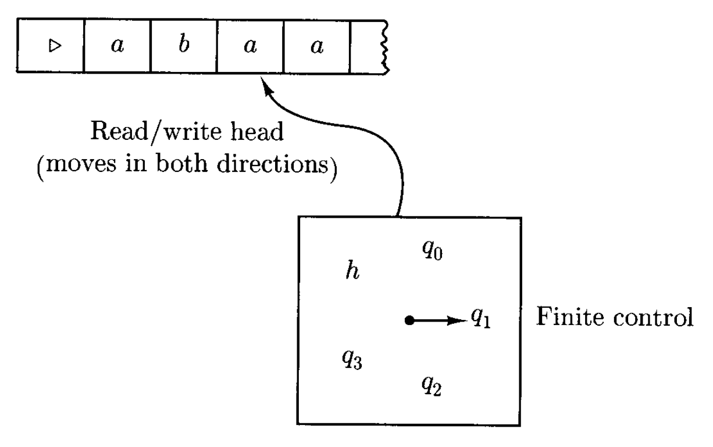
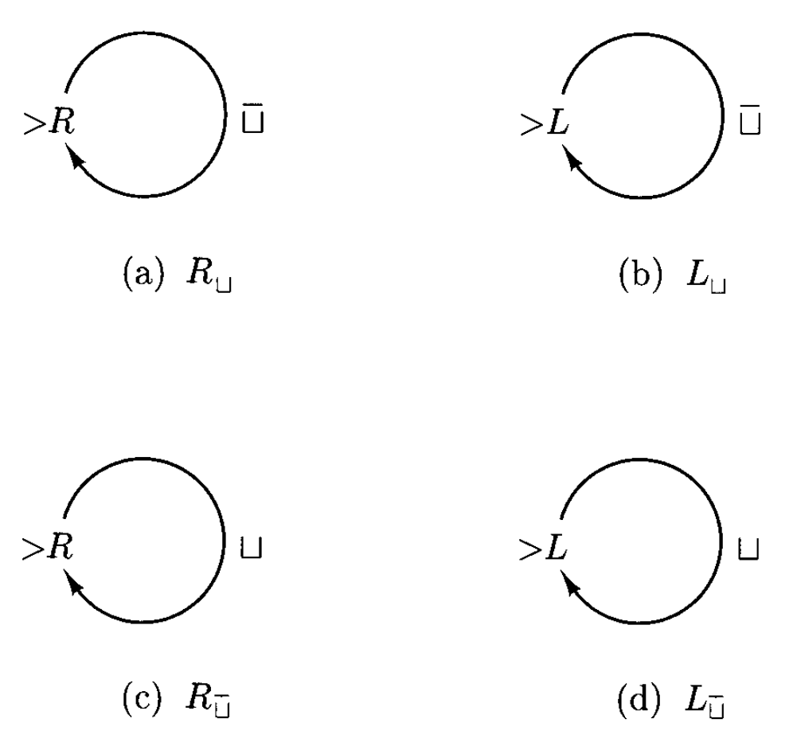
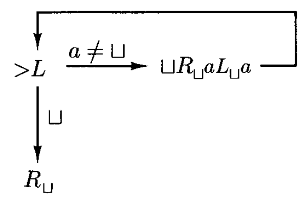
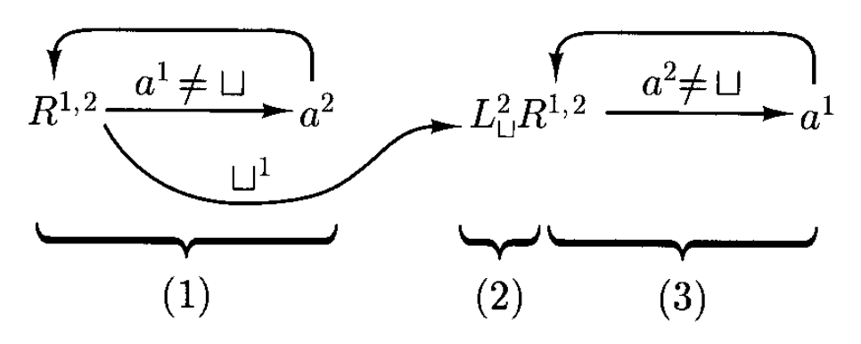
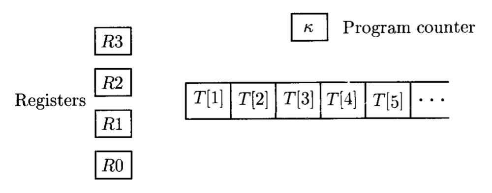

# Turing Machine

??? abstract "核心知识"

    本章是《计算理论》课程的核心内容，需重点关注！

    - 图灵机
        - 基本定义
        - 层级记号：基本机器 -> 复杂机器
        - 图灵机判定 == 函数递归 == 语言递归
        - 图灵机半判定 == 语言递归可枚举
    - 图灵机的扩展：多条纸带、无限延展、多个读写头、多维纸带 == 标准图灵机
    - 随机访问图灵机：寄存器、程序计数器、程序
    - 非确定性图灵机 == 标准图灵机
    - 文法
        - 语言递归可枚举 == 由文法生成
        - 函数递归 == 文法可计算
    - 数值函数：原始递归函数、$\mu$-递归函数（== 递归）

!!! warning "注意"

    本章笔记的证明是 Gemini 3 Pro 基于教材内容整理得到的（笔者稍微整理了一下排版），可能存在错误。若读者发现的话可以在评论区中指出🙇‍♂️。

## Definition

图灵机的设计同时满足以下三条标准：

- 应当是一种**自动机**
- 描述、形式定义和推理应当尽可能**简单**
- 执行的计算应尽可能**通用**

**图灵机**(Turing machine)由一个有限状态控制单元、一条纸带和一个能在纸带上读写的头构成的。

<div style="text-align: center">
    
</div>

**控制单元**(control unit)在离散步内操作，每一步基于当前状态和读写头当前扫描到的纸带符号来执行以下两个函数：

- 设置控制单元为新状态
- 以下操作选择其一执行：
    - 向当前纸带格写入一个符号，替代原来存在的符号
    - 将读写头向左或向右移一格

我们假定**纸带**(tape)有左端，但右侧是无限延伸的。为避免读写头移出左端，规定**最左端**始终用特殊符号 $\triangleright$ 表示，并假设读写头遇到该符号后就立即向右移动。

另外，我们用 $\leftarrow$ 和 $\rightarrow$ 符号表示读写头的**左移**和**右移**操作，这些符号并不是任何字母表的成员。

最后，由于纸带并不总是填满字符串的，那些地方就用**空**(blank)符号 $\sqcup$ 表示。

下面给出图灵机的形式定义：

!!! definition "定义"

    图灵机是一个五元组 $(K, \Sigma, \delta, s, H)$，其中：

    - $K$：**状态**的有限集合
    - $\Sigma$：字母表，包含**空符号** $\sqcup$ 和**左端符号** $\triangleright$，但不包含符号 $\leftarrow, \rightarrow$
    - $s \in K$：**初始状态**
    - $H \subseteq K$：**停机状态**(halting states)的集合
    - $\delta$：**转移函数**，一个从 $(K - H) \times \Sigma$ 到 $K \times (\Sigma \cup \{\leftarrow, \rightarrow\})$ 的函数，满足：
        - $\forall\ q \in K - H$，若 $\delta(q, \triangleright) = (p, b)$，那么 $b = \rightarrow$
        - $\forall\ q \in K - H, a \in \Sigma$，若 $\delta(q, a) = (p, b)$，那么 $b \ne \triangleright$

对于转移函数满足的第二个条件，还可分为以下两种情况：

- $b$ 是 $\Sigma$ 中的符号 -> 机器会将当前符号 $a$ 重写为 $b$
- $b$ 是 $\leftarrow$ 或 $\rightarrow$ -> 读写头沿 $b$ 指示的方向移动

??? example "例子"

    考虑图灵机 $M = (K, \Sigma, \delta, s, \{h\})$，其中

    $$
    \begin{aligned}
    K & = \{q_0, q_1, h\} \\
    \Sigma & = \{a, \sqcup, \triangleright\} \\
    s & = q_0
    \end{aligned}
    $$

    $\delta$ 通过以下表格给出：

    | $q$ | $\sigma$ | $\delta(q, \sigma)$ |
    | :--- | :--- | :--- |
    | $q_0$ | $a$ | $(q_1, \sqcup)$ |
    | $q_0$ | $\sqcup$ | $(h, \sqcup)$ |
    | $q_0$ | $\triangleright$ | $(q_0, \rightarrow)$ |
    | $q_1$ | $a$ | $(q_0, a)$ |
    | $q_1$ | $\sqcup$ | $(q_0, \rightarrow)$ |
    | $q_1$ | $\triangleright$ | $(q_1, \rightarrow)$ |

    不难发现 $M$ 的功能是从右开始扫描纸带，将遇到的所有 $a$ 重写为 $\sqcup$，直到遇到已经是 $\sqcup$ 的格子时停止。我们称这种将非空符号变为空符号的操作为**擦除**(erasing)非空符号。 

不同于前面介绍的确定型设备，图灵机的操作可能永远不会停止。

!!! definition "定义"

    图灵机 $M = (K, \Sigma, \delta, s, H)$ 的**配置**(configuration)是 $K \times \triangleright \Sigma^* \times (\Sigma^* (\Sigma - \{\sqcup\}) \cup \{e\})$ 的一个成员。

也就是说，所有配置均假设为从左端符号开始，且从不以空符号结尾，除非当前就扫描到了空符号。状态为 $H$ 中的一个状态的配置被称为**停机配置**(halted configuration)。

我们用一种简单记号描述磁带内容：$w\underline{a}u$ 表示配置 $(q, wa, u)$ 的磁带内容，其中**下划线**符号表示读写头所在位置。所以这个配置又能简写为 $(q, w\underline{a}u)$。

!!! definition "定义"

    令 $M = (K, \Sigma, \delta, s, H)$ 为一台图灵机，且考虑 $M$ 的两个配置 $(q_1, w_1\underline{a_1}u_1)$ 和 $(q_2, w_2\underline{a_2}u_2)$，其中 $a_1, a_2 \in \Sigma$，那么：
    $$
    (q_1, w_1\underline{a_1}u_1) \vdash_M (q_2, w_2\underline{a_2}u_2)
    $$

    当且仅当在对于某些 $b \in \Sigma \cup \{\leftarrow, \rightarrow\}, \delta(q_1, a_1) = \delta(q_2, b)$，以及以下三种情况之一满足时：

    1. $b \in \Sigma, w_1 = w_2, u_1 = u_2, a_2 = b$
    2. $b = \leftarrow, w_1 = w_2 a_2$，且满足以下两种情况之一：
        - 当 $a_1 \ne \sqcup$ 或 $u_1 \ne e$ 时，$u_2 = a_1 u_1$
        - 当 $a_1 = \sqcup$ 且 $u_1 = e$ 时，$u_2 = e$
    3. $b = \rightarrow, w_2 = w_1 a_1$，且满足以下两种情况之一：
        - $u_1 = a_2 u_2$
        - $u_1 = u_2 = e$ 且 $a_2 = \sqcup$

    成立。

用自然语言简要描述这三种情况：

1. $M$ 仅**重写**符号，并不移动读写头
2. $M$ 将读写头**左移一格**；若正从空纸带中移出，那么当前扫描到的空符号就会从配置中消失
3. $M$ 将读写头**右移一格**；若正移入空纸带，空符号将作为新的扫描符号被加入到配置中

!!! definition "定义"

    对任意图灵机 $M$，令 $\vdash_M^*$ 为 $\vdash_M$ 的**自反传递闭包**。若 $C_1 \vdash_M^* C_2$，称配置 $C_1$ 产生了配置 $C_2$。$M$ 的**计算**(computation)是一个配置序列 $C_0, C_1, \dots, C_n\ (n \ge 0)$，满足：
    $$
    C_0 \vdash_M C_1 \vdash_M C_2 \vdash_M \dots \vdash_M C_n
    $$

    称上述计算长度为 $n$ 或需要 $n$ 步完成，并且可将其简写为 $C_0 \vdash_M^n C_n$。


### Notation

下面将用一种**层级记号**(hierarchical notation)来表示通过简单组件构建得到的更复杂的机器。这些简单组件称为**基本机器**(basic machine)，具体分为两类图灵机：

- **符号写机器**(symbol-writing machine)：
    - $M_a = (\{s, h\}, \Sigma, \delta, s, \{h\})$，其中 $a \in \Sigma \cup \{\leftarrow, \rightarrow\} - \{\triangleright\}$，且 $\forall\ b \in \Sigma - \{\triangleright\}, \delta(s, b) = (h, a)$
    - 它要做的事只是写入符号 $a$（除了遇到 $\triangleright$ 时会右移）
    - 又称为 **$a$ 写入机器**($a$-writing machine)，可简记为 $a$
- **头移动机器**(head-moving machine)：$M_\leftarrow, M_\rightarrow$ 可分别简写为 $L, R$

接下来，我们将这些基本机器结合起来。单个的机器很像有限自动机的状态，机器间的连接也像有限自动机中的状态连接。然而，从一台机器到另一台机器的连接要等到第一台机器停机后才能建立，随后另一台机器将从第一台机器停机时所处的纸带位置和自己的初始状态来启动。

??? example "例子"

    { align=right width=20% }

    假设有三台图灵机 $M_1, M_2, M_3\ (M_i = (K_i, \Sigma, \delta_i, s_i, H_i), i = 1, 2, 3)$，它们组合而成的机器如右图所示。

    - 该机器从 $M_1$ 的初始状态开始，先由 $M_1$ 操作，直到其停机
    - 若停机时，当前扫描到的符号为 $a$，那么就启动 $M_2$ 并以 $M_2$ 完成后续操作；若扫描到的符号为 $b$，那么就启动 $M_3$ 并以 $M_3$ 完成后续操作

    用更形式化的语言表示这一组合机器 $M = (K, \Sigma, \delta, s, H)$：

    - $K = K_1 \cup K_2 \cup K_3$
    - $s = s_1$
    - $H = H_2 \cup H_3$
    - $\forall\ \sigma \in \Sigma, q \in K - H$，$\delta(q, \sigma)$ 的定义如下：
        - 若 $q \in K_1 - H_1$，那么 $\delta(q, \sigma) = \delta_1(q, \sigma)$
        - 若 $q \in K_2 - H_2$，那么 $\delta(q, \sigma) = \delta_2(q, \sigma)$
        - 若 $q \in K_3 - H_3$，那么 $\delta(q, \sigma) = \delta_3(q, \sigma)$
        - 若 $q \in H_1$，那么

            $$
            \delta(q, \sigma)
            \begin{cases}
            = s_2 & \text{if } \sigma = a \\
            = s_3 & \text{if } \sigma = b \\
            \in H & \text{otherwise}
            \end{cases}
            $$

下图展示了一个由 $R$ 的两个副本组合而成的机器：

<div style="text-align: center">
    
</div>

为方便表示，我们将其改写为图 (b) 的形式：带有多个符号的单个箭头 == 多个仅有单个符号的并行箭头。若箭头上包含了字母表中的所有符号，那么这些符号标记就可以省略掉。对于图中的例子，若 $\Sigma = \{a, b, \sqcup, \triangleright\}$，那么上图可被表示为：
$$
R \rightarrow R
$$

我们甚至可以将这种没有标记的箭头给省略掉，记作 $RR$ 或 $R^2$。

---
假如 $a$ 是 $\Sigma$ 里的一个符号，那么 $\overline{a}$ 的意思是除 $a$ 外的任何符号。那么下图所示的机器的作用是向右扫描纸带，直到遇到空符号为止。该机器还可简记为 $R_\sqcup$。

<div style="text-align: center">
    
</div>

{ align=right width=20% }

图 (b) 说明了可以用 $a \ne \sqcup$ 表示 $\overline{\sqcup}$。这种记号的好处是 $a$ 可能会在图中的其他地方用到，比如右图给出的例子。

<br/>

???+ abstract "总结一些简记符号"

    <div style="text-align: center">
        
    </div>

    - $R_\sqcup$：找到当前扫描格右侧的第一个空格
    - $L_\sqcup$：找到当前扫描格左侧的第一个空格
    - $R_{\overline{\sqcup}}$：找到当前扫描格右侧的第一个非空格
    - $L_{\overline{\sqcup}}$：找到当前扫描格左侧的第一个非空格

???+ example "例子"

    === "复制机器"

        **复制机器**(copying machine) $C$ 执行以下功能：如果 $C$ 从输入 $w$ 开始，也就是说，如果字符串 $w$（仅包含非空白符号，但可能为空）被放置在一条其左侧有一个空白方格的其他空白纸带上，并且读写头位于 $w$ 左侧的空白方格上，那么机器最终将在一条其他空白纸带上以 $w \sqcup w$ 停止。我们称 $C$ 将 $\sqcup w \underline{\sqcup}$ 变换为 $\sqcup w \sqcup w \underline{\sqcup}$。下面给出 $C$ 的图示：

        <div style="text-align: center">
            
        </div>

        1. $L_\sqcup$ 找到 $w$ 左端的空格，再通过 $R$ 右移一格到达 $w$ 左端
        2. 如果读到 $a$，执行 $\sqcup R^2_\sqcup a L^2_\sqcup a$
            - 先擦除 $a$
            - 先找到 $w$ 右侧第一个空格（原字符串和副本的间隔符），然后再往右移一格
            - 写入 $a$
            - 回到原来的位置：左移读写头，先来到空格处，再来到刚刚被擦除的地方，最后恢复被擦除的符号 $a$
        3. 读到 $\sqcup$ 意味着 $w$ 读取完毕，于是通过 $R_\sqcup$ 来到 $w$ 副本右侧的空格，然后停机

        ??? example "一个长得很像的变体（来自 23-24 历年卷）"

            <div style="text-align: center">
                
            </div>

            这是正确的。可以自己画画看，或在脑子里大致过一遍。

    === "右移机器"

        **右移机器**(right-shifting machine) $S_\rightarrow$ 将 $\sqcup w \underline{\sqcup}$ 转换为 $\sqcup \sqcup w \underline{\sqcup}$（$w$ 不包含空符号）。其图示如下：

        <div style="text-align: center">
            
        </div>

        >注：英文版教材在 $L_\sqcup$ 后多加了一个 $a$，这是不对的（中文翻译版就没这个问题）

        可以看出，机器按从右往左的顺序将 $w$ 的每个符号右移一格的。


## Computing with Turing Machine

若 $M = (K, \Sigma, \delta, s, H)$ 为一台图灵机，且 $w \in (\Sigma - \{\sqcup, \triangleright\})^*$，那么 $M$ 在输入 $w$ 上的**初始配置**(initial configuration)为 $(s, \triangleright \underline{\sqcup}w)$。

!!! definition "定义"

    令 $M = (K, \Sigma, \delta, s, H)$ 为一台图灵机，且 $H = \{y, n\}$ 包含两个不同的停机状态（分别表示「是」和「否」）。任何包含状态 $y$ 的停机配置被称为**接受配置**(accepting configuration)，而任何包含状态 $n$ 的停机配置被称为**拒绝配置**(rejecting configuration)。

    对于输入 $w \in (\Sigma - \{\sqcup, \triangleright\})^*$，若 $(s, \triangleright \underline{\sqcup} w)$ 产生了接受配置，那么称 $M$ **接受**(accepts)了 $w$；若 $(s, \triangleright \underline{\sqcup} w)$ 产生了拒绝配置，那么称 $M$ **拒绝**(rejects)了 $w$。

    令 $\Sigma_0 = \Sigma - \{\sqcup, \triangleright\}$ 为 $M$ 的**输入字母表**(input alphabet)。对于语言 $L \subseteq \Sigma_0^*$，若任意字符串 $w \in \Sigma_0^*$，以下条件为真：$w \in L$ 时 $M$ 接受了 $w$，且 $w \notin L$ 时 $M$ 拒绝了 $w$，那么称 $M$ **判定**(decides)了 $L$。而被图灵机判定的语言被认为是**递归的**(recursive)。

??? example "例子"

    考虑语言 $L = \{a^nb^nc^n: n \ge 0\}$。前几章介绍的语言识别器均不能成功识别这类语言。而图灵机能够将其识别出来，如下所示：

    <div style="text-align: center">
        
    </div>

    >注：这张图有个小 bug——没有标出起始状态所在位置。但根据机器的逻辑可以推断出起始状态应该是在最左侧的那台机器（即 $R$）上。

    可以看到，图中又多了两个新的基本机器：$y$ 和 $n$，用于将新状态分别设置为接收状态 $y$ 和拒绝状态 $n$。

    - 如果在任何时候机器感知到字符串不在 $a^*b^*c^*$ 中，或者某个符号的数量过多（例如，如果它在寻找 $a$ 时看到 $b$ 或 $c$），那么它将进入状态 $n$ 并立即拒绝
    - 如果它在寻找 $a$ 时遇到了输入的右端，这意味着所有输入都已被 $d$ 替换，因此得到 $a^nb^nc^n\ (n \ge 0)$

和其他语言识别器不同的是，即便图灵机有两个停机状态 $y, n$，总是有可以规避这两个答案的选项，这会使得**停机失败**。


### Recursive Functions

!!! definition "定义"

    令 $M = (K, \Sigma, \delta, s, H)$ 为图灵机，$\Sigma_0 = \Sigma - \{\sqcup, \triangleright\}$ 为字母表，$w \in \Sigma_0^*$。假设 $M$ 在输入 $w$ 上停机，且 $(s, \triangleright \underline{\sqcup} w) \vdash_M^* (h, \triangleright \underline{\sqcup} y)$（$y \in \Sigma_0^*$），那么称 $y$ 为 $M$ 在输入 $w$ 上的**输出**，记作 $M(w)$。

    令 $f$ 为从 $\Sigma_0^*$ 到 $\Sigma_0^*$ 的函数。当且仅当 $\forall\ w \in \Sigma_0^*$，$M(w) = f(w)$，称 $M$ **计算**(computes)了函数 $f$。像这种能被图灵机计算出来的函数被认为是**递归的**(recursive)（或**可判定的**(decidable)）。

$\{0, 1\}^*$ 中的字符串可用来表示非负整数，即**二进制记号**(binary notation)。任意字符串 $w = a_1 a_2 \dots a_n \in \{0, 1\}^*$ 可表示数字：

$$
\text{num}(w) = a_1 \cdot 2^{n-1} + a_2 \cdot 2^{n-2} + \dots + a_n
$$

而任意**自然数**可被表示为 $0 \cup 1 \cup (0 \cup 1)^*$（开头没有多余的 0）。

事实上，带有多个参数的**数值函数**(numerical functions)（比如加法和乘法），能被可以计算从 $\{0, 1, ;\}^*$ 到 $\{0, 1\}^*$ 的函数的图灵机计算出来。其中 $;$ 是用来分隔二进制参数的符号。

!!! definition "定义"

    令 $M = (K, \Sigma, \delta, s, H)$ 为图灵机，满足 $0, 1, ; \in \Sigma$，并令 $f$ 为任意从 $\mathbb{N}^k$ 到 $\mathbb{N}$ 的函数（$k \ge 1$）。若 $\forall\ w_1, \dots, w_k \in 0 \cup 1 \cup (0 \cup 1)^*$（即任意 $k$ 个表示整数二进制编码的字符串），$\text{num}(M(w_1; \dots ; w_k)) = f(\text{num}(w_1), \dots, \text{num}(w_k))$，称 $M$ **计算**了 $f$。也就是说，若 $M$ 起始于整数 $n_1, \dots, n_k$ 的二进制表示，那么它最终停机时，纸带上包含了一个表示数字 $f(n_1, \dots, n_k)$（函数值）的字符串。这样被图灵机计算出来的函数被认为是**递归的**（或**可计算的**(computable)）。

??? example "例子"

    我们设计一个计算**后继函数**(successor function) $\text{succ}(n) = n + 1$ 的机器。

    - 首先会找到输入右端，然后只要见到 1，它就会往左移动并把 1 -> 0
    - 当遇到 0 时，将其改变为 1 后停机
    - 若遇到 $\sqcup$，意味着这个数字的二进制表示完全由 1 构成，那么机器在 $\sqcup$ 的位置上写入 1 后停机

    <div style="text-align: center">
        
    </div>

    >个人看法：当机器读到 1，将其改写为 0 后，只会继续执行 $L$ 而非 $R_\sqcup L$。只看这张图的话很容易让人误以为是要再执行 $R_\sqcup L$...


### Recursively Enumerable Languages

!!! definition "定义"

    令 $M = (K, \Sigma, \delta, s, H)$ 为图灵机，$\Sigma_0 = \Sigma - \{\sqcup, \triangleright\}$ 为字母表，$L \subseteq \Sigma_0^*$ 为语言。若对于任意字符串 $w \in \Sigma_0^*$，以下条件为真：当且仅当 $M$ 在输入 $w$ 上停机时，$w \in L$，那么称 $M$ **半判定**(semidecides)了 $L$。这种被图灵机半定的语言被认为是**递归可枚举的**(recursively enumerable)。

现在我们并不关心具体到达的停机配置，只要能停机就行了。若 $w \in \Sigma_0^* - L$，那么 $M$ 就不能进入停机状态。

接下来扩展图灵机的函数记号：用 $M(w) = \nearrow$ 表示 $M$ 未能在 $w$ 上停机。这样我们就能重写半判定的定义：$\forall\ w \in \Sigma_0^*, M(w) = \nearrow$ 当且仅当 $w \notin L$。

看起来图灵机的半判定定义是对[确定型有限自动机（DFA）](2.md#deterministic-finite-automata)的可接受性的直接扩展，但有一个很明显的区别是：FA 始终会停机，而半判定语言 $L$ 的图灵机无法始终能够判断字符串 $w$ 是否属于 $L$，因为如果 $w \notin L$，我们永远无法知道要等多久才能得到答案。

!!! theorem "定理"

    若某种语言是**递归的**，那它也是**递归可枚举的**。

    ??? proof "证明"

        若一个语言是递归的，则存在图灵机 $M$ 能判定它，即对任何输入都能在接受态 $y$ 或拒绝态 $n$ 停机。证明其为递归可枚举的关键在于构造一个新机器 $M'$，**将原有的拒绝态 $n$ 改为非停机状态**，使其针对所有符号 $a \in \Sigma$ 满足 $\delta'(n, a) = (n, a)$ 从而原地**死循环**。如此一来，$M'$ 对属于该语言的输入保持接受并停机，而对不属于该语言的输入则会永远运行（即 $M'(w) = \nearrow$），这种行为完全符合“半判定”的定义。

!!! theorem "定理"

    若语言 $L$ 是**递归的**，那么它的**补** $\overline{L}$ 也是**递归的**。

    ??? proof "证明"

        若 $L$ 由图灵机 $M = (K, \Sigma, \delta, s, \{y, n\})$ 判定，那么 $L$ 也可由 $M' = (K, \Sigma, \delta', s, \{y, n\})$ 判定。$M'$ 和 $M$ 唯一的不同在于它颠倒了两个停机状态 $y, n$ 的含义，即 $\delta'$ 被定义为：

        $$
        \delta'(q, a) = \begin{cases} 
        n & \text{if } \delta(q, a) = y \\ 
        y & \text{if } \delta(q, a) = n \\ 
        \delta(q, a) & \text{otherwise} 
        \end{cases}
        $$

        显然 $M'(w) = y$ 当且仅当 $M(w) = n$，因此 $M'$ 判定了 $\overline{L}$。

???+ abstract "总结：语言的分类"

    >偷了 [xg 的图](https://note.tonycrane.cc/cs/tcs/toc/topic4/#_4)（并修正了原图的错误）

    <figure style=" width: 60%" markdown="span">
        
        
        <figcaption></figcaption>
    </figure>


???+ info "补充：图灵机和可数(countable)的关系"

    以下集合都是可数（无穷）的：

    - 所有可能的图灵机
    - 递归函数的集合
    - 递归可枚举语言的集合
    - 递归语言的集合


## Extensions

到目前为止，我们介绍的图灵机虽然强大，但是慢而笨拙。为更好地理解它的强大之处，接下来将从不同方向扩展图灵机模型。但无论是哪种情况，这些看似新改进的模型最终都可以用标准图灵机模型来模拟，这也证实了图灵机确实是终极的计算设备。


### Multiple Tapes

对任意固定整数 $k \ge 1$，**$k$-纸带图灵机**是配有 $k$ 条纸带和对应头的图灵机。

<div style="text-align: center">
    
</div>

!!! definition "定义"

    令整数 $k \ge 1$。**$k$-纸带图灵机**是一个五元组 $(K, \Sigma, \delta, s, H)$，其中 $K, \Sigma, s, H$ 的定义和标准图灵机相同，而**转移函数** $\delta$ 是一个从 $(K - H) \times \Sigma^k$ 到 $K \times (\Sigma \cup \{\leftarrow, \rightarrow\})^k$ 的函数。也就是说，对于每个状态 $q$，每个纸带符号的 $k$ 元组 $(a_1, \dots, a_k)$，$\delta(q, (a_1, \dots, a_k)) = (p, (b_1, \dots, b_k))$，其中 $p$ 是新状态，$b_j$ 是 $M$ 在纸带 $j$ 上采取的行动。

    自然地，我们再次断言：若 $a_j = \triangleright\ (j \le k)$，那么 $b_j = \rightarrow$。

!!! definition "定义"

    令 $M = (K, \Sigma, \delta, s, H)$ 是 $k$-纸带图灵机。$M$ 的**配置**是以下关系的一个成员：
    $$
    K \times (\triangleright \Sigma^* \times (\Sigma^* (\Sigma - \{\sqcup\}) \cup \{e\}))^k
    $$

    也就是说，配置能够标识出状态、纸带内容，以及 $k$ 个纸带上各个头的位置。

若 $(q, (w_1 \underline{a_1} u_1, \dots, w_k \underline{a_k} u_k))$ 是 $k$-纸带图灵机的一个配置，且若 $\delta(p, (a_1, \dots, a_k)) = (b_1, \dots, b_k)$，那么在一步内机器会移动到配置 $(p, (w_1' \underline{a_1'} u_1', \dots, w_k' \underline{a_k'} u_k'))$，其中 $w_i' \underline{a_i'} u_i'$ 是通过行动 $b_i$ 修改 $w_i \underline{a_i} u_i$ 得到的。我们称 $(q, (w_1 \underline{a_1} u_1, \dots, w_k \underline{a_k} u_k))$ **在一步内产生**(yields in one step)配置 $(p, (w_1' \underline{a_1'} u_1', \dots, w_k' \underline{a_k'} u_k'))$。

??? example "例子"

    === "例1"

        用 2-纸带图灵机构建一个复制机器 $C$。

        1. 同时向右移动两条纸带的头，将第一条纸带的每个符号复制到第二条纸带上，直到在第一条纸带上遇到空符号为止；第二条纸带的第一个格子需要留空
        2. 向左移动第二条纸带的头，直到遇到空符号为止
        3. 又一次同时向右移动两条纸带的头，但这次将第二条纸带的每个符号复制到第一条纸带上，直到在第二条纸带上遇到空符号时停机

        用形式化的语言表述上述过程：

        $$
        \begin{aligned}
        \text{At the beginning: } & \text{First tape} & \triangleright \underline{\sqcup} w \\
                        & \text{Second tape} & \triangleright \underline{\sqcup} \\
        \text{After (1): }        & \text{First tape} & \triangleright \sqcup w \underline{\sqcup} \\
                        & \text{Second tape} & \triangleright \sqcup w \underline{\sqcup} \\
        \text{After (2): }       & \text{First tape} & \triangleright \sqcup w \underline{\sqcup} \\
                        & \text{Second tape} & \triangleright \underline{\sqcup} w \\
        \text{After (3): }       & \text{First tape} & \triangleright \sqcup w \sqcup w \underline{\sqcup} \\
                        & \text{Second tape} & \triangleright \sqcup w \underline{\sqcup}
        \end{aligned}
        $$

        我们用**上标**表示机器所操作的**纸带编号**，比如：

        - $\sqcup^2$：在第二条纸带上写入一个空符号
        - $L_\sqcup^1$：在第一条纸带上向左搜索第一个空符号
        - $R^{1, 2}$：同时向右移动第一和第二条纸带的头

        因此上述机器可用下图表示出来：

        <div style="text-align: center">
            
        </div>

        >注：这里的 $L_\sqcup^2$ 是指向左移动第二条纸带对应的读写头到遇到的第一个空格处，不是两次左移的意思（这和前面某个例子不太一样，因为当时只有一条纸带，为了偷懒就用指数表示多次相同的操作）。

    === "例2"

        下面用 2-纸带图灵机实现了任意两个二进制数的加法。

        <div style="text-align: center">
            
        </div>

        背后的思路很简单：两个整数均从最低位开始，进行对应位的相加，将结果写入第一条纸带上，而进位被保存在状态中。

        >注：可以用 3-纸带图灵机实现两数乘法（具体见教材课后习题 4.3.5）。

!!! theorem "定理"

    令 $M = (K, \Sigma, \delta, s, H)$ 为 $k$-纸带图灵机（$k \ge 1$）。那么存在一个标准图灵机 $M' = (K', \Sigma', \delta', s', H)$，其中 $\Sigma \subseteq \Sigma'$，满足：对任意输入字符串 $w \in \Sigma^*$，当且仅当对于该输入，$M'$ 在相同停机状态上停机，且在纸带上有相同的输出 $y$ 时，对于该输入，$M$ 停机时会在第一条纸带上输出 $y$。

    另外，对于输入 $x$，若 $M$ 在 $t$ 步后停机，那么对于同一输入，$M'$ 在 $\mathcal{O}(t \cdot (|x| + t))$ 后停机。

    ??? proof "证明"

        - 首先将 $M'$ 的单条纸带在逻辑上划分为 $2k$ 条轨道：每两条轨道对应 $M$ 的一条纸带，其中一条轨道存储实际的字符数据，另一条轨道则专门用标记来记录该纸带读写头的当前位置（对应图 (b)）
        - 在模拟 $M$（对应图 (a)）的每一个计算步骤时，$M'$ 需要执行一次完整的扫描操作：它先遍历整个有效纸带区域以收集所有 $k$ 个读写头下的字符信息，确定下一步动作；随后再次遍历以更新轨道上的字符并移动读写头标记
        - 由于 $M$ 运行 $t$ 步后，$M'$ 的有效纸带长度最多增长到 $|x| + t$，而 $M'$ 每模拟一步都需要完整扫描该长度，因此总的时间复杂度就是步数乘以扫描长度，即 $\mathcal{O}(t \cdot (|x| + t))$

        <div style="text-align: center">
            
        </div>

!!! note "引理"

    能被 $k$-纸带图灵机计算的任意函数或者判定/半判定的任意语言，也能被标准图灵机分别计算/判定/半判定。


### Two-way Infinite Tape

在两边都能无限延伸的纸带上，除输入外的所有格子均初始化为空符号，并且头位于输入的左端。显然此时不需要 $\triangleright$。

这种图灵机并没有变得更强大，而且能很容易用 2-纸带图灵机模拟出来（进一步也能被标准图灵机模拟出来）：一条纸带包含从第一个输入符号开始向右的所有纸带内容，另一条纸带逆向包含纸带左边的剩余部分。该模拟只需**线性**时间。


### Multiple Heads

现在允许一个纸带上有多个独立运作的头。不难发现可以用 $k$-纸带图灵机来模拟这一过程。基本思路是将纸带划分为多条轨道，除了某一轨道外，其余轨道都仅用于记录读写头的位置。要模拟多头图灵机的一个计算步，纸带必须被扫描两次：一次找到头位置下的符号，另一次要改变符号或移动头。所需步骤数为**平方**时间。


### Two-Dimensional Tape

另一种对图灵机的推广是将它的纸带扩展至无限的二维网格。但这种改变也没让机器变强。有趣的是，对于输入 $x$，在这种二维图灵机上模拟 $t$ 步所需的步骤数为关于 $t$ 和 $|x|$ 的多项式。

---
上面介绍的扩展可以结合起来使用。最后用一个定理总结上述讨论结果：

!!! theorem "定理"

    能被带有多个纸条/多个头/两路无限纸带/多维纸带的图灵机计算的任意函数或者判定/半判定的任意语言，也能被标准图灵机分别计算/判定/半判定。


## Random Access Turing Machines

尽管到目前为止，我们的图灵机已经足够强大，但它们仍然有一个明显的局限：只能**顺序**(sequentially)访问内存，而真实的计算机支持对内存的**随机访问**(random access)。于是我们进一步探索支持**随机访问的图灵机**：

<div style="text-align: center">
    
</div>

- 它具有一组固定数量的**寄存器**(registers)、**程序计数器**(program counter)，和一条一端无限延伸的纸带
- 每个寄存器和每个纸带格子都有一个任意的自然数
- 机器在寄存器和纸带格子上的行动由一个固定的**程序**(program)制定，可对应标准图灵机中的转移函数；程序是一个指令序列，和真实计算机中的指令集很像
- 下面枚举了一些常用指令：
    - $j$：寄存器编号，$0 \le j < k$
    - $T[i]$：当前纸带格子 $i$ 的内容
    - $R[j]$：当前寄存器 $j$ 的内容
    - $s \le p$：程序中的指令编号
    - $c$：任意自然数
    - 几乎所有指令将 $\kappa$ 变为 $\kappa + 1$（除了跳转和停机指令）

    <div align=center markdown="1">

    | Instruction | Operand | Semantics |
    | :--- | :--- | :--- |
    | `read` | $j$ | $R_0 := T[R_j]$ |
    | `write` | $j$ | $T[R_j] := R_0$ |
    | `store` | $j$ | $R_j := R_0$ |
    | `load` | $j$ | $R_0 := R_j$ |
    | `load` | $= c$ | $R_0 := c$ |
    | `add` | $j$ | $R_0 := R_0 + R_j$ |
    | `add` | $= c$ | $R_0 := R_0 + c$ |
    | `sub` | $j$ | $R_0 := \max\{R_0 - R_j, 0\}$ |
    | `sub` | $= c$ | $R_0 := \max\{R_0 - c, 0\}$ |
    | `half` | | $R_0 := \lfloor \frac{R_0}{2} \rfloor$ |
    | `jump` | $s$ | $\kappa := s$ |
    | `jpos` | $s$ | if $R_0 > 0$ then $\kappa := s$ |
    | `jzero` | $s$ | if $R_0 = 0$ then $\kappa := s$ |
    | `halt` | | $\kappa := 0$ |

    </div>

- 初始情况下，寄存器值为 0，程序计数器值为 1
- 程序计数器值为 $\kappa$，一个指示下一条要执行的指令的整数
- 寄存器 0 的特殊作用是一个**累加器**(accumulator)，所有的算术和逻辑运算都发生在这里

    >类似 x86 的 `ax` 寄存器。

下面给出随机访问图灵机的形式化定义：

!!! definition "定义"

    **随机访问图灵机**(random access Turing machine)是一个二元对 $M = (k, \Pi)$，其中 $k > 0$ 表示**寄存器**数量，**程序** $\Pi = (\pi_1, \pi_2, \dots, \pi_p)$ 是一个有限的指令序列，其中每条指令 $\pi_i$ 是来自上面表格中的其中一个类型。假设最后一条指令 $\pi_p$ 始终是一个 `halt` 指令（程序的其他地方也可以出现 `halt` 指令）。

    随机访问图灵机 $(k, \Pi)$ 的一个**配置**是一个 $k+2$ 元组 $(\kappa, R_0, R_1, \dots, R_{k-1}, T)$，其中：

    - $\kappa \in \mathbb{N}$ 是程序计数器，一个介于 $0$ 到 $p$ 的整数
    - 若 $\kappa = 0$，那么该配置是一个**停机配置**
    - $\forall\ 0 \le j < k$，$R_j \in \mathbb{N}$ 是**寄存器 $j$ 的当前值**
    - **纸带内容** $T$ 是一个关于正整数对的有限集合，具体来说是 $(\mathbb{N} - \{0\}) \times (\mathbb{N} - \{0\})$ 的一个子集，满足 $\forall\ i > 1$，至多存在一个形如 $(i, m) \in T$ 的对
        - $(i, m) \in T$ 表示第 $i$ 个纸带格子的当前值为整数 $m > 0$

    令配置 $C = (\kappa, R_0, R_1, \dots, R_{k-1}, T), C' = (\kappa', R_0', R_1', \dots, R_{k-1}', T')$，当 $\kappa', R_j', T'$ 的值能够反映当前指令 $\pi_\kappa$ 的“语义”在 $\kappa, R_j, T$ 上的应用时，称 $C$ **在一步内产生了** $C'$，记作 $C \vdash_M C'$。$\vdash_M$ 的自反传递闭包 $\vdash_M^*$ 是名为「**产生**(yield)」的关系。

??? example "例子"

    前面给出的随机访问图灵机指令集中没有乘法指令 `mply`，这是因为把该指令当做一个原语的话，用标准图灵机模拟时会更耗时。

    我们可以用以下程序模拟该指令的实现：

    ??? code "代码实现"

        ```asm linenums="1"
        store 2
        load 1
        jzero 19
        half
        store 3
        load 1
        sub 3
        sub 3
        jzero 13
        load 4
        add 2
        store 4
        load 2
        add 2
        store 2
        load 3
        store 1
        jump 2
        load 4
        halt
        ```

        >注意：教材给的程序存在印刷错误——重复出现了两次 `19.   load 4`。只需删掉第一个就行了。 

    - 当初始情况下寄存器 0 为 $x$，寄存器 1 为 $y$，那么停机后寄存器 0 的值就是 $x \cdot y$
    - 乘法通过连续加法实现
    - `half` 指令用于揭露 $y$ 的二进制表示

    ??? example "一个配置序列的例子"

        <div style="text-align: center">
            
        </div>

    - 程序会进行多轮迭代，一次迭代就是要执行从 $\pi_2$ 到 $\pi_{18}$ 的序列；在第 $k$ 次迭代中满足：
        - 寄存器 2 包含 $x2^k$
        - 寄存器 3 包含 $\lfloor y / 2^k \rfloor$
        - 寄存器 1 包含 $\lfloor y / 2^{k-1} \rfloor$
        - 寄存器 4 包含 $x \cdot (y \text{ mod } 2^k)$ 的部分结果

    - 我们可将上述程序简记为 `mply 1` 指令，表示 $R_0 := R_0 \cdot R_1$ 的语义；很自然地可以将其扩展为 `mply j` 和 `mply = c`
    - 最后给出一种可读性更高的程序缩写形式：

        ```c
        w := 0
        while y > 0 do
            begin
            z := half(y)
            if y - z - z != 0 then w := w + x
            x := x + x
            y := z
            end
        halt
        ```

        - 其中 `y`, `x`, `z`, `w` 分别表示 $R_1, R_2, R_3, R_4$
        - 这里省略了指令前的标号；如果有必要用 `goto` 指令，可以在跳转指令上进行标号

我们可以学习上面的例子，用一些缩写来表示冗长的程序。比如用 $R_1 : = R_1 + R_2 - 1$ 表示以下序列：

```asm linenums="1"
load 1
add 2
sub = 1
store 1
```

还可以用更美观的名称表示：$x := x + y - 1$。

!!! definition "定义"

    固定字母表 $\Sigma$，随机访问图灵机从中获取输入，其中 $\sqcup \in \Sigma$，而 $\triangleright \notin \Sigma$（因为随机访问图灵机没有离开纸带最左端的问题）。令 $\mathbf{E}$ 为 $\Sigma$ 和 $\{0, 1, \dots, |\Sigma| - 1\}$ 的一个固定双射，它对输入和输出进行了编码；并假设 $\mathbf{E}(\sqcup) = 0$。

    输入为 $w = a_1 a_2 \dots a_n \in (\Sigma - \{\sqcup\})^*$ 的随机访问图灵机 $M = (k, \Pi)$ 为 $(\kappa, R_0, \dots, R_{k-1}, T)$，其中 $\kappa = 1, R_j = 0\ (\forall\ j), T = \{(1, \mathbf{E}(a_1)), (2, \mathbf{E}(a_2)), \dots, (n, \mathbf{E}(a_n))\}$。

    当若输入为 $x \in \Sigma^*$ 的初始配置产生停机配置时，若 $R_0 = 1$，称 $M$ **接受**了字符串 $x$；若 $R_0 = 0$，则称 $M$ **拒绝**了字符串 $x$。

    令字母表 $\Sigma_0 \subseteq \Sigma - \{\sqcup\}$，令语言 $L \subseteq \Sigma_0^*$。当 $x \in L$ 时 $M$ 接受了 $x$，当 $x \notin L$ 时 $M$ 拒绝了 $x$，称 $M$ **判定**了 $L$。

    当以下条件为真：当前仅当对于输入 $x$，$M$ 能够产生某些停机状态时，$x \in L$，称 $M$ **半判定**了 $L$。

    令函数 $f: \Sigma_0^* \mapsto \Sigma_0^*$。$\forall\ x \in \Sigma_0^*$，$M$ 的起始配置最终在产生停机配置时得到纸带内容 $\{(1, \mathbf{E}(a_1)), (2, \mathbf{E}(a_2)), \dots, (n, \mathbf{E}(a_n))\}$，其中 $f(w) = a_1 \dots a_n$，称 $M$ **计算**了 $f$。

??? example "例子"

    来看如何用随机访问图灵机计算有限二元关系的自反传递闭包，也就是说给定有向图 $R \subseteq A \times A$，其中 $A = \{a_0, \dots, a_{n-1}\}$，我们希望计算 $R^*$。

    首先遇到的一个问题是如何用字符串表示 $R$。

    - 可以先用**邻接矩阵**(adjacency matrix) $A_R$ 表示 $R$；其元素取值仅为 0 或 1，当且仅当 $(a_i, a_j) \in R$ 时第 $i, j$ 个元素取值为 1，否则为 0
    - 之后就按行主序顺序读取这个矩阵，获得长为 $n^2$ 的字符串，记作 $x_R$

    <div style="text-align: center">
        
    </div>

    接下来就要设计一个机器 $M$，计算满足以下定义的函数 $f$：对任何在有限集合 $\{a_1, \dots, a_n\}$ 的关系，$f(x_R) = x_{R^*}$。假设 $\mathbf{E}(0) = 1, \mathbf{E}(1) = 2, \mathbf{E}(\sqcup) = 0$。程序如下：

    ???+ code "代码实现"

        ```c linenums="1"
        n := 1
        while T[n · n] != 0 do n := n + 1
        n := n - 1
        i = 0
        while i < n do i = i + 1, T[i · n + i] := 2
        i := j := k := 0
        while j < n do j := j _ 1,
            while i < n do i := i + 1,
                while k < n do k := k + 1
                    if T[i · n + j] = 2 and T[j · n + k] = 2 then T[i · n + k] := 2
        halt
        ```

        - 前三条指令计算集合 $A$ 的元素数 $n$
        - 矩阵中的第 $(i, j)$ 项能用纸带上第 $(i \cdot n + j)$ 个符号表示
        - 时间复杂度为 $\mathcal{O}(n^3)$

!!! theorem "定理"

    任何递归或递归可枚举语言，以及任何递归函数，都可以通过随机访问图灵机来判定、半判定和计算。

!!! theorem "定理"

    任何由随机访问图灵机判定或半判定的语言，以及任何由随机访问图灵机可计算的功能，都可以分别由**标准图灵机**判定、半判定和计算。

    此外，如果机器在某个输入上停止，那么标准图灵机在该输入上所采取的步骤数由随机访问图灵机在该输入上所采取的步骤数的**多项式**所界定。

    ??? proof "证明"

        通过构造一个拥有 $k+3$ 条磁带的标准图灵机 $M'$ 来模拟具有 $k$ 个寄存器的随机访问图灵机。

        - $M'$ 使用不同的磁带分别维护输入数据、以（地址，值）二元组序列形式存储的内存内容，以及各个寄存器的二进制数值
        - 模拟过程分为三个阶段：首先将输入转换为内部格式，接着通过在磁带上进行扫描和二进制算术运算来逐条执行随机访问图灵机的指令（如读写、加法、跳转等），最后将结果转换为标准输出格式
        - 关于时间复杂度：由于磁带上记录的数据长度随步数 $t$ 线性增长，且单步模拟的开销主要取决于该长度，因此标准图灵机可以在 $\mathcal{O}((t+n)^3)$ 的多项式时间内完成对随机访问图灵机的模拟


## Nondeterministic Turing Machines

**非确定性图灵机**(nondeterministic Turing machine, **NTM**)是一个五元组 $(K, \Sigma, \Delta, s, H)$，其中 $K, \Sigma, s, H$ 和标准图灵机一致，而 $\Delta$ 是 $((K - H) \times \Sigma) \times (K \times (\Sigma \cup \{\leftarrow, \rightarrow\}))$ 的一个子集。配置，以及关系 $\vdash_M, \vdash_M^*$ 的定义也很自然，但注意 $\vdash_M$ 不必是单值的，配置在一步内可产生多种情况。

!!! definition "定义"

    令 $M = (K, \Sigma, \Delta, s, H)$ 为非确定性图灵机。对于输入 $w \in (\Sigma - \{\triangleright, \sqcup\})^*$，若 $(s, \triangleright \underline{\sqcup}w) \vdash_M^* (h, u\underline{a}v)$，其中 $h \in H, a \in \Sigma, u, v \in \Sigma^*$，称 $M$ **接受**了 $w$。注意：对于该输入，即便 NTM 可能有多种非停机计算的可能，只要存在一个能停机的计算，就认为 NTM 接受了该输入。

    若对于所有输入 $w \in (\Sigma - \{\triangleright, \sqcup\})^*$，满足当且仅当 $M$ 接受 $w$ 时 $w \in L$，称 $M$ **半判定**了语言 $L \subseteq (\Sigma - \{\triangleright, \sqcup\})^*$。

!!! definition "定义"

    令 $M = (K, \Sigma, \Delta, s, \{y, n\})$ 为 NTM。对于所有输入 $w \in (\Sigma - \{\triangleright, \sqcup\})^*$，若满足以下两个条件，称 $M$ **判定**了语言 $L \subseteq (\Sigma - \{\triangleright, \sqcup\})^*$：

    - 存在一个自然数 $N$，依赖于 $M, w$，使得不存在满足 $(s, \triangleright \underline{\sqcup}w) \vdash_M^N C$ 的配置 $C$（？）
    - 当且仅当 $(s, \triangleright \underline{\sqcup}w) \vdash_M^* (h, u\underline{a}v)$（其中 $u, v \in \Sigma^*, a \in \Sigma$）时 $w \in L$

    最后，对于所有输入 $w \in (\Sigma - \{\triangleright, \sqcup\})^*$，若满足以下两个条件，称 $M$ **计算**了函数 $f: (\Sigma - \{\triangleright, \sqcup\})^* \mapsto (\Sigma - \{\triangleright, \sqcup\})^*$：

    - 存在一个自然数 $N$，依赖于 $M, w$，使得不存在满足 $(s, \triangleright \underline{\sqcup}w) \vdash_M^N C$ 的配置 $C$（？）
    - 当且仅当 $ua = \triangleright \sqcup$  且 $v = f(w)$ 时 $(s, \triangleright \underline{\sqcup}w) \vdash_M^* (h, u\underline{a}v)$

??? example "例子"

    使用 NTM 寻找**合数**(composite number)。当输入为整数 $n$ 的二进制表示时，机器完成以下操作：

    1. 逐位且非确定地选择两个大于 1 的二进制数 $p, q$，将二进制表示写在输入的下一个位置上
    2. 使用前面例子介绍的乘法机器，用 $p, q$ 的乘积替代这两个数的二进制表示
    3. 检查 $n, p \cdot q$ 是否相同，可通过简单的按位比较得到；若相同则停机，否则以某种方式继续执行下去

    对上述机器加以改进，可以用来判定语言 $C$（一个关于所有合数二进制表示的集合）。

    - 第 1 阶段不会去猜测位数多于 $n$ 的整数，因为显然不可能是 $n$ 的因子
    - 第 3 阶段中，机器在两数相等时，会以状态 $y$ 停机，否则状态为 $n$

    因此所有计算最终会在有限步后停止。

    上面定义中的上界 $N$ 不太容易计算出来。假设整数 $n$ 有 $l$ 位，令 $N_1$ 为乘法机器在长度不超过 $2l + 1$ 的输入上最大的计算步骤数；$N_2$ 为比较两个至多长为 $3l$ 的字符串所需的步骤数。那么 $M'$ 的计算在 $N_1 + N_2 + 3l + 6$ 步后一定会停机，具体取决于机器和输入。

!!! theorem "定理"

    如果一个非确定性图灵机 $M$ 半判定或判定了一个语言，或计算了一个函数，那么存在一个**标准图灵机** $M'$ 半判定或判定相同的语言，或计算相同的函数。

    ??? proof "证明"

        证明过程的关键步骤如下：

        1. 确定非确定性的分支上界：
            - 证明的核心在于观察到非确定性图灵机 $M$ 虽然可能有无数种计算路径，但在任何特定时刻，它的选择是有限的
            - 对于 $M$ 的每一个“状态-符号”组合 $(q, a)$，适用的指令四元组 $(q, a, p, b)$ 的数量是固定的；我们可以找到这个数量的最大值，记为 $r$
            - 这样，$M$ 在每一步的动作都可以被映射为集合 $\{1, 2, \dots, r\}$ 中的一个整数，代表第 $1$ 到第 $r$ 种可能的选择

        2. 构造确定性图灵机：
            - 为了消除非确定性，我们定义一个确定性图灵机 $M_d$；它有两条磁带：第一条放原始输入 $w$，第二条放一个由 $\{1, 2, \dots, r\}$ 构成的**提示串**(hints)（例如 $i_1 i_2 \dots i_n$）
            - $M_d$ 的运行规则是：在第 $k$ 步时，它不进行选择，而是直接读取第二条磁带上的第 $k$ 个数字 $i_k$，并执行对应的第 $i_k$ 种转换；如果提示串耗尽或指示无效，则停止
            - 我们构建最终的标准确定性图灵机 $M'$，它使用三条磁带进行模拟：
                - 第一条磁带：永久存储原始输入 $w$，仅供读取，用于每次模拟重置
                - 第二条磁带：用于运行 $M_d$ 的模拟计算
                - 第三条磁带：用于生成提示串序列

        3. 具体的模拟循环（**燕尾流程**(dovetailing procedure)）：
            - 按照**词典序**(lexicographical order)在第三条磁带上生成 $\{1, \dots, r\}^*$ 中的所有字符串：$\varepsilon, 1, 2, \dots, r, 11, 12, \dots$
            - 对于生成的每一个字符串 $I$，执行以下循环：
                1. 重置：将第一条磁带的输入 $w$ 复制到第二条磁带
                2. 运行：以第三条磁带上的 $I$ 为路径指引，在第二条磁带上运行 $M_d$
                3. 判断：如果 $M_d$ 在该路径指引下停机（接受），则 $M'$ 停机（接受）；否则，生成下一个字符串，重复步骤 a

        $M'$ 的图示如下：

        <div style="text-align: center">
            
        </div>

        - $C^{1 \rightarrow 2}$：擦除第二条纸带，将第一条纸带的内容拷贝到第二条上
        - $B^3$：在第三条纸带上生成下一个词典序字符串
        - $M_d^{2, 3}$：$M$ 的确定性版本，在纸带 2 和 3 上操作

        >可以把 NTM 看作一棵树，上述过程就是利用 DTM 在树上做 BFS。

        数学上的完备性：如果 $M$ 在输入 $w$ 上有接受路径，假设该路径长度为 $n$，则它必然对应某个长度为 $n$ 的选择序列 $S \in \{1, \dots, r\}^n$。由于 $M'$ 是按字典序穷举所有可能的序列，经过有限步（大约 $r + r^2 + \dots + r^n$ 次尝试）后，第三条磁带必然会生成出序列 $S$，从而复现该接受计算并停机。这证明了 $M'$ 接受 $w$ 当且仅当 $M$ 接受 $w$ 时成立。


## Grammars

图灵机及其扩展均属于**语言接受器**(language acceptors)。但我们知道还有另一类叫做**语言生成器**(language generators)的重要的计算设备，比如[正则表达式](2.md#regular-expressions)和[上下文无关文法](3.md#context-free-grammars)（CFG）。接下来就要介绍 CFG 一种推广形式：**文法**(grammar)（或**无限制文法**(unrestricted grammar)），并且说明由它产生的语言就是递归可枚举语言。

!!! definition "定义"

    **文法**（无限制文法/重写系统(rewriting system)是一个四元组 $G = (V, \Sigma, R, S)$，其中：

    - $V$：字母表
    - $\Sigma \subseteq V$：**终结符**(terminal symbols)集合；$V - \Sigma$ 就是**非终结符**(nonterminal symbols)集合
    - $S \in V - \Sigma$：**起始**符号(start symbol)
    - $R$：**规则**集合，是 $(\textcolor{red}{V^*}(V - \Sigma)\textcolor{red}{V^*}) \times V^*$ 的有限子集

        >红色部分是和 CFG 不同的地方，即规则中考虑到了上下文；而 CFG 规则的箭头左侧只能有一个非终结符。

    ---
    - 若 $(u, v) \in R$，记作 $u \rightarrow v$
    - 当且仅当对于 $w_1, w_2 \in V^*$，$u' \rightarrow v' \in R$，$u = w_1 u' w_2, v = w_1 v' w_2$ 时，记作 $u \Rightarrow_G v$
    - $\Rightarrow_G^*$ 为 $\Rightarrow_G$ 的自反传递闭包
    - 当且仅当 $S \Rightarrow_G^* w$ 时，称 $G$ 生成了字符串 $w \in \Sigma^*$
    - 由 $G$ 生成的语言 $L(G)$ 是 $\Sigma^*$ 中由 $G$ 生成的所有字符串的集合
    - **推导**(derivation)是形如 $w_0 \Rightarrow_G w_1 \Rightarrow_G \dots \Rightarrow_G w_n$ 的一个序列

??? example "例子"

    以下文法 $G = (V, \Sigma, R, S)$ 生成了语言 $\{a^n b^n c^n: n \ge 1\}$，其中：

    $$
    \begin{aligned}
    V &= \{S, a, b, c, A, B, C, T_a, T_b, T_c\} \\
    \Sigma &= \{a, b, c\}, \text{and} \\
    R &= \{S \to ABCS, \\
    &\quad S \to T_c, \\
    &\quad CA \to AC, \\
    &\quad BA \to AB, \\
    &\quad CB \to BC, \\
    &\quad CT_c \to T_c c, \\
    &\quad CT_c \to T_b c, \\
    &\quad BT_b \to T_b b, \\
    &\quad BT_b \to T_a b, \\
    &\quad AT_a \to T_a a, \\
    &\quad T_a \to e\}.
    \end{aligned}
    $$

    - 前两条规则生成形如 $(ABC)^n T_c$ 的字符串
    - 接下来三条规则将字符串按 $A, B, C$ 的顺序排序，这样字符串变成了 $A^n B^n C^n T_c$
    - 其余规则将 $T_c$ “迁移”到左侧，将所有的 $C$ 变换为 $c$，然后成为 $T_b$；$T_b, T_a$ 也做类似的转换，但 $T_a$ 最后会被擦除

!!! theorem "定理"

    当且仅当语言是**递归可枚举**时，它由文法生成。

    ??? proof "证明"

        证明过程分为两个方向，核心思想是利用**非确定性图灵机**来模拟文法的推导过程，以及利用**文法**来逆向模拟图灵机的计算历史。

        - **必要性**(only if)（文法 $\Rightarrow$ 递归可枚举）：给定一个文法 $G$，我们可以构造一个非确定性图灵机 $M$ 来**半判定**该语言。
            - 构造结构：$M$ 拥有两条磁带：第一条存储输入串 $w$（只读）；第二条用于模拟推导过程，初始写入开始符号 $S$
            - 模拟过程：$M$ 在每一步非确定性地从 $G$ 的规则集 $R$ 中选择一条规则 $u \rightarrow v$；它扫描第二条磁带，找到子串 $u$ 并将其替换为 $v$（需要适当移动后续字符以调整空间）
            - 判定条件：每次推导后，$M$ 都会检查第二条磁带的内容是否与第一条磁带的 $w$ 完全匹配。如果匹配，$M$ 停机并接受；否则继续循环或陷入死循环。这证明了 $M$ 能接受 $G$ 生成的所有字符串

        - **充分性**(if)（递归可枚举 $\Rightarrow$ 文法）：给定一个半判定语言 $L$ 的图灵机 $M$，我们需要构造一个文法 $G$ 来生成；这里的关键技巧是让 $G$ 模拟 $M$ 的逆向计算过程。
            - 基本假设：假设 $M$ 在停机前会清空磁带，即停机配置为 $(h, \triangleright \sqcup)$。文法的生成过程是从这个停机配置开始，逆向倒推回初始配置
            - 配置的字符串表示：图灵机的配置 $(q, \triangleright u \underline{a} w)$ 被编码为字符串 $\triangleright uaqw$，即把当前状态 $q$ 插入到读写头所指符号 $a$ 的紧后面
            - 生成规则（逆向转换）：文法规则是 $M$ 转移函数的逆操作
                - 若 $M$ 有转移 $\delta(q, a) = (p, b)$（即从 $q$ 读 $a$ 变为 $p$ 写 $b$），则 $G$ 有规则 $bp \rightarrow aq$，意味着在推导方向上将 $b$ 和状态 $p$ 还原为 $a$ 和状态 $q$
                - 若 $M$ 右移 $\delta(q, a) = (p, \rightarrow)$，则 $G$ 对应规则 $abp \rightarrow aqb$
                - 同理，左移操作也有对应的逆向规则

            - 推导流程：文法从 $S \rightarrow \triangleright \sqcup h \triangleleft$ 开始（即 $M$ 的接受状态），通过上述逆向规则逐步还原出初始配置 $\triangleright \sqcup sw \triangleleft$。最后通过清理规则 $\triangleright \sqcup s \rightarrow \varepsilon$ 和 $\triangleleft \rightarrow \varepsilon$ 去掉辅助符号，仅留下输入串 $w$
            - 结论：$S \Rightarrow_G^* w$ 当且仅当 $M$ 在输入 $w$ 上能停机，从而证明了 $G$ 恰好生成 $L(M)$

!!! definition "定义"

    令 $G = (V, \Sigma, R, S)$ 为文法，$f: \Sigma^* \mapsto \Sigma^*$ 为函数。$\forall\ w, v \in \Sigma^*$，以下条件为真时，称 $G$ 计算了 $f$：

    $$
    SwS \Rightarrow_G^* v \text{ if and only if } v = f(w)
    $$

    也就是说，由输入 $w$ 组成的字符串，两侧带有 $G$ 的起始符号，恰好产生一个在 $\Sigma^*$ 的字符串，其值为 $f(w)$。

    当且仅当存在一个能计算函数 $f: \Sigma^* \mapsto \Sigma^*$ 的文法时，称该函数为**文法可计算的**(grammartically computable)。

!!! theorem "定理"

    当且仅当函数 $f: \Sigma^* \mapsto \Sigma^*$ 是**文法可计算**的时候，该函数是**递归的**。 


## Numerical Functions

!!! definition "定义"

    先定义一种极其简单的，从 $\mathbb{N}^k$ 到 $\mathbb{N}$ 的函数（$k \ge 0$）。基本函数为：

    - $\forall\ k \ge 0$，**$k$ 元零函数**($k$-ary zero function)被定义为：$\text{zero}_k (n_1, \dots, n_k) = 0$（$\forall\ n_1, \dots, n_k \in \mathbb{N}$）
    - $\forall\ k \ge j > 0$，**第 $j$ 个 $k$ 元恒等函数**($j$th $k$-ary identity function)被定义为：$\text{id}_{k, j} (n_1, \dots, n_k) = n_j$（$\forall\ n_1, \dots, n_k \in \mathbb{N}$）
    - **后继函数**(successor function)被定义为 $\text{succ}(n) = n + 1$（$\forall\ n \in \mathbb{N}$）

    更复杂的函数：

    - 令 $k, l \ge 0, g: \mathbb{N}^k \mapsto \mathbb{N}$ 为 $k$ 元函数，令 $h_1, \dots, h_k$ 为 $l$ 元函数，那么带有 $h_1, \dots, h_k$ 的**组合**(composition)函数 $g$ 是 $l$ 元函数，其定义如下：

        $$
        f(n_1, \dots, n_{\ell}) = g(h_1(n_1, \dots, n_{\ell}), \dots, h_k(n_1, \dots, n_{\ell}))
        $$

    - 令 $k \ge 0$，$g$ 为 $k$ 元函数，令 $h$ 为 $(k + 2)$ 元函数，那么由 $g, h$ **递归**定义的函数 $f$ 是 $k + 1$ 元函数，其定义如下（$\forall\ n_1, \dots, n_k, m \in \mathbb{N}$）：

        $$
        \begin{aligned}
        f(n_1, \dots, n_k, 0) &= g(n_1, \dots, n_k), \\
        f(n_1, \dots, n_k, m + 1) &= h(n_1, \dots, n_k, m, f(n_1, \dots, n_k, m))
        \end{aligned}
        $$

    **原始递归函数**(primitive recursive functions)就是上面全部的基本函数，以及通过任意次数的组合和递归定义从基本函数获得的所有函数。

??? example "原始递归函数的例子"

    - $\text{plus2}(n) = n + 2 = \text{succ}(\text{succ}(n))$
    - $\text{plus}(m, n) = m + n$

        $\quad \Rightarrow \begin{cases}\text{plus}(m, 0) = m, \\ \text{plus}(m, n+1) = \text{succ}(\text{plus}(m, n))\end{cases}$

    - $\text{mult}(m, n) = m \cdot n$

        $\quad \Rightarrow \begin{cases}\text{mult}(m, 0) = \text{zero}(m), \\ \text{mult}(m, n+1) = \text{plus}(m, \text{mult}(m, n))\end{cases}$

    - $\text{exp}(m, n) = m^n$

        $\quad \Rightarrow \begin{cases}\text{exp}(m, 0) = \text{succ}(\text{zero}(m)), \\ \text{exp}(m, n+1) = \text{mult}(m, \text{exp}(m, n))\end{cases}$

    - 所有形如 $f(n_1, \dots, n_k) = C$ 的常数函数都是原始递归函数
    - 符号函数 $\text{sgn}(n) = \begin{cases}0 & \text{if } n = 0 \\ 1 & \text{otherwise}\end{cases}$

        $\quad \Rightarrow \begin{cases}\text{sgn}(0) = 0 \\ \text{sgn}(n+1) = 1\end{cases}$

    ???+ info "注"

        为更好的可读性，分别用 $m + n, m \cdot n, m \uparrow n$ 来表示 $\text{plus}(m, n), \text{mult}(m, n), \text{exp}(m, n)$。

    - **前驱函数**(predecessor function) $\begin{cases}\text{pred}(0) = 0 \\ \text{pred}(n+1) = n\end{cases}$
    - $m \sim n = \text{max}\{m - n, 0\}$

        $\quad \Rightarrow \begin{cases}m \sim 0 = m \\ m \sim n + 1 = \text{pred}(m \sim n)\end{cases}$

我们可以用取值仅为 0 和 1 的原始递归函数来构建**原始递归谓词**(primitive recursive predicate)，比如 $\text{greater-than}(m, n)$。

??? example "原始递归函数的例子"

    - $\text{positive}(n) = \text{sgn}(n)$
    - $\text{iszero}(n) = 1 - \text{sgn}(n)$
    - $\text{geq}(m, n) = \text{iszero}(n \sim m)$
    - $\text{eq}(m. n) = \text{geq}(m, n) \wedge \text{geq}(n, m)$

原始递归谓词相关操作（也属于原始递归谓词）：

- **否定**(negation)：$\neg p(m) = 1 \sim p(m)$
- **析取**(disjunction)/**合取**(conjunction)：
    - $p(m, n) \vee q(m, n) = 1 \sim \text{iszero}(p(m, n) + q(m, n))$
    - $p(m, n) \wedge q(m, n) = 1 \sim \text{iszero}(p(m, n) \cdot q(m, n))$

若 $g, h$ 是原始递归函数，$p$ 是原始递归谓词，那么**按情况定义的函数**(function defined by cases) $f$ 也是原始递归的：

$$
f(n_1, \ldots, n_k) = \begin{cases} g(n_1, \ldots, n_k), & \text{if } p(n_1, \ldots, n_k) \\ h(n_1, \ldots, n_k), & \text{otherwise} \end{cases}
$$

??? example "按情况定义的原始递归函数的例子"

    - 整除余数 $\begin{cases}\text{rem}(0, n) = 0 \\ \text{rem}(m + 1, n) = \begin{cases}0 & \text{if equal}(\text{rem}(m, n), \text{pred}(n)) \\ \text{rem}(m, n) + 1 & \text{otherwise}\end{cases}\end{cases}$
    - 整除商 $\begin{cases}\text{div}(0, n) = 0 \\ \text{div}(m + 1, n) = \begin{cases}\text{div}(m, n) + 1 & \text{if equal}(\text{rem}(m, n), \text{pred}(n)) \\ \text{div}(m, n) & \text{otherwise}\end{cases}\end{cases}$

!!! tip "提示"

    如果题目要求证明某个函数是原始递归函数，可以直接利用例子（紫框）中给出的一些原始递归函数推导，不需要从头证明。

需要注意的是，原始递归函数无法捕获所有的函数。

!!! definition "定义"

    令 $g$ 为 $k+1$ 元函数（$k \ge 0$）。$g$ 的**最小化**(minimalization)是一个 $k$ 元函数 $f$，其定义如下：

    $$
    f(n_1, \dots, n_k) = \begin{cases} \text{the least } m \text{ such that } g(n_1, \dots, n_k, m) = 1, \\ \quad \text{if such an } m \text{ exists;} \\ 0 \text{ otherwise.} \end{cases}
    $$

    将 $g$ 的最小化记作 $\mu m[g(n_1, \dots, n_k, m) = 1]$。

    若运行以下方法后总是能终止，那么称函数 $g$ 是**可最小化的**(minimalizable)。

    ```c
    m := 0;
    while g(n_1, ..., n_k, m) != 1 do m := m + 1;
    output m
    ```

    也就是说，当且仅当 $\exists\ m \in \mathbb{N}$，满足 $g(n_1, \dots, n_k, m) = 1$ 时，$g$ 是可最小化的。

    若一个函数可以通过基本函数的组合、递归定义和可最小化函数的最小化操作获得，则称该函数为 **$\mu$-递归的**。

!!! theorem "定理"

    当且仅当函数 $f: \mathbb{N}^k \mapsto \mathbb{N}$ 是可递归的（也就是能被图灵机计算出来），该函数是 $\mu$-递归的。

    ??? proof "证明"

        === "必要性"

            首先假设 $f$ 是 $\mu$-递归函数。由于基本函数显然是可计算的，我们只需证明由可计算函数通过组合、递归和最小化生成的函数依然是可计算的。若 $f$ 是通过组合 $g$ 和 $h_1, \dots, h_\ell$ 定义的，我们可以通过以下**随机访问图灵机**程序计算它：

            $$
            \begin{aligned}
            & m_1 := h_1(n_1, ..., n_k); \\
            & m_2 := h_2(n_1, ..., n_k); \\
            & \vdots \\
            & m_l := h_l(n_1, ..., n_k); \\
            & \text{output } g(m_1, ..., m_l).
            \end{aligned}
            $$

            若 $f$ 是通过原始递归从 $g$ 和 $h$ 定义的，即 $f(n_1, \dots, n_k, m)$，则可通过以下循环程序计算：

            $$
            \begin{aligned}
            & v := g(n_1, ..., n_k); \\
            & \text{if } m = 0 \text{ then output } v \\
            & \text{else for } i := 1, 2, ..., m \text{ do} \\
            & \quad v := h(n_1, ..., n_k, i - 1, v); \\
            & \text{output } v.
            \end{aligned}
            $$

            若 $f$ 定义为 $\mu m[g(n_1, \dots, n_k, m)]$，且 $g$ 是可最小化的，则对应的计算程序为：

            $$
            \begin{aligned}
            & m := 0; \\
            & \text{while } g(n_1, ..., n_k, m) \ne 1 \text{ do } m := m + 1; \\
            & \text{output } m
            \end{aligned}
            $$

        === "充分性"

            假设图灵机 $M$ 计算函数 $f$。我们定义基数 $b = |\Sigma| + |K|$ 并通过映射 $\mathbf{E}$ 将符号和状态映射为 $\{0, \dots, b-1\}$。图灵机的配置 $(q, a_1 a_2 \dots a_k \dots a_n)$ 被编码为基数 $b$ 的整数：

            $$
            \mathbf{E}(a_1)b^n + \mathbf{E}(a_2)b^{n-1} + \dots + \mathbf{E}(a_k)b^{n-k+1} + \mathbf{E}(q)b^{n-k} + \mathbf{E}(a_{k+1})b^{n-k-1} + \dots + \mathbf{E}(a_n)
            $$

            在此编码基础上，我们将 $f(n)$ 定义为一系列 $\mu$-递归函数的组合：

            $$
            f(n) = \text{num}(\text{output}(\text{last}(\text{comp}(n))))
            $$

            其中 $\text{lastpos}(n)$ 用于定位字符串中 $\triangleright$ 的位置，定义为：

            $$
            \text{lastpos}(n) = \mu m[\text{equal}(\text{digit}(m, n, b), \mathbf{E}(\triangleright)) \text{ or } \text{equal}(m, n)]
            $$

            利用它我们可以定义 $\text{last}(n) = \text{rem}(n, b \uparrow \text{lastpos}(n))$。最核心的函数 $\text{comp}(n)$ 映射 $n$ 到 $M$ 计算 $f(n)$ 的完整配置序列，其定义利用了最小化算子：

            $$
            \text{comp}(n) = \mu m[\text{iscomp}(m, n) \text{ and } \text{halted}(\text{last}(m))]
            $$

            最后，函数 $\text{num}(n)$ 将输出的基数 $b$ 表示转换回数值，其展开式为：

            $$
            \text{digit}(1, n, b) \cdot 2 + \text{digit}(2, n, b) \cdot 2 \uparrow 2 + \dots + \text{digit}(\log(b \sim 2, n \sim 1), n, b) \cdot 2 \uparrow \log(b \sim 2, n \sim 1)
            $$

            这证明了 $f$ 确实可以完全由 $\mu$-递归函数表达。

??? question "例题"

    >来自 24-25 历年卷

    === "题目"

        $f(x) = \begin{cases}8x & \text{if } x \equiv y \text{ mod } 2 \\ 4x+1 & \text{otherwise}\end{cases}$

        1. 用基本图灵机表示这个函数
        2. 证明这个函数是原始递归的

    === "解答"

        >这里给出笔者的一些想法，不一定完全正确，有问题的话欢迎指出！

        === "1"

            不难想到：

            - $x \equiv y \text{ mod } 2$ 表明 $x, y$ 的奇偶性相同，即它们的二进制表示中最低位是相同的
            - $8x$ 和 $4x + 1$ 分别对应在 $x$ 对应的二进制表示右边添加 `000` 和 `01`

            于是绘制图灵机的大致思路为：

            - 纸带上有关于 x 和 y 的二进制表示，中间用分号间隔
            - 将读写头移到分号处，然后向左移一个，读取 x 的最低位，用图灵机的内部状态记录
            - 将读写头移到 y 右侧的空格，再往左移一格，读取 y 的最低位，并和内部状态比较，检验 x 和 y 的奇偶性是否相同
            - 无论是否相同，接下来都要往左移动读写头，不断擦除沿途上的符号，直到遇到分号停止（分号也要擦除）
            - 如果奇偶性相同，则添加 `000`，否则添加 `01`

            >笔者水平有限，还没想好怎么画出图灵机，暂且先用文字表示；若有好心人画出来的话，可以提交一个 PR，在此万分感谢🙏

        === "2"

            可以用前面已知的那些原始递归函数凑出来，得到：

            $$
            f(x, y) = \begin{cases}g(x) & \text{if } P(x, y) \text{ is true} \\ h(x) & \text{otherwise}\end{cases}
            $$

            其中 $P(x, y) = \text{eq}(\text{rem}(x, 2), \text{rem}(y, 2)), g(x) = 8x, h(x) = 4x+1$，显然它们都是原始递归函数。