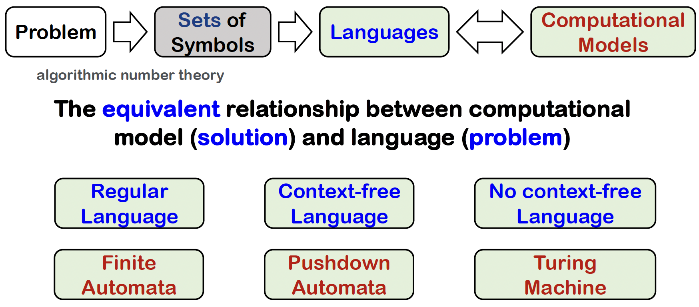

# 计算理论

!!! info "课程信息"

    - 学分：2.0（~~不要被学分骗了，听说课程内容比肩 4 学分的课~~）
    - 教师：郑乾
    - 教材：*Elements of The Theory of Computation* (Second Edition), Harry R. Lewis, Christos H. Papadimtriou, Prentice Hall

??? note "课程目标"

    

        
    

!!! abstract "目录"

    - [x] [Sets, Relations, and Language](1.md)
    - [x] [Finite Automata](2.md)
    - [ ] [Context-Free Languages](3.md)
    - [ ] [Turing Machine](4.md)
    - [ ] [Undecidability](5.md)

!!! recommend "推荐阅读"

    - [xg 的笔记](https://note.tonycrane.cc/cs/tcs/toc/)
    - [咸鱼暄前辈的笔记](https://xuan-insr.github.io/other_courses/theory_of_computation)
