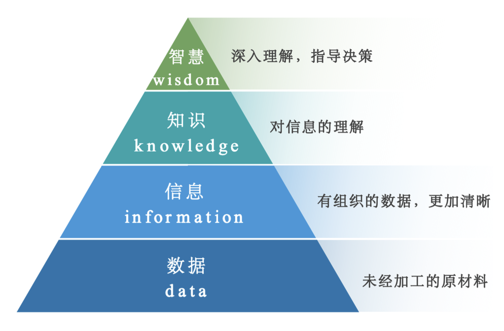
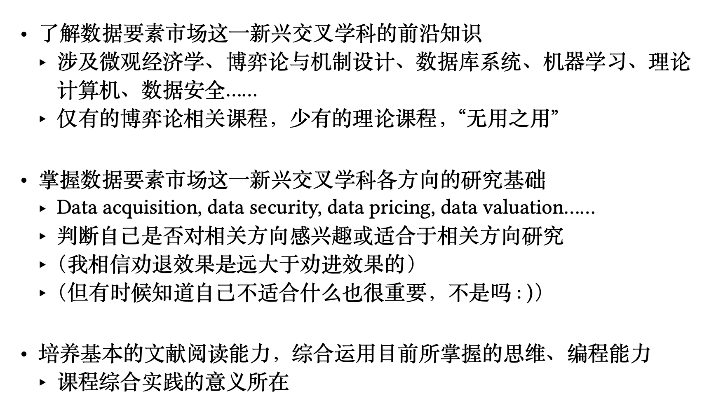
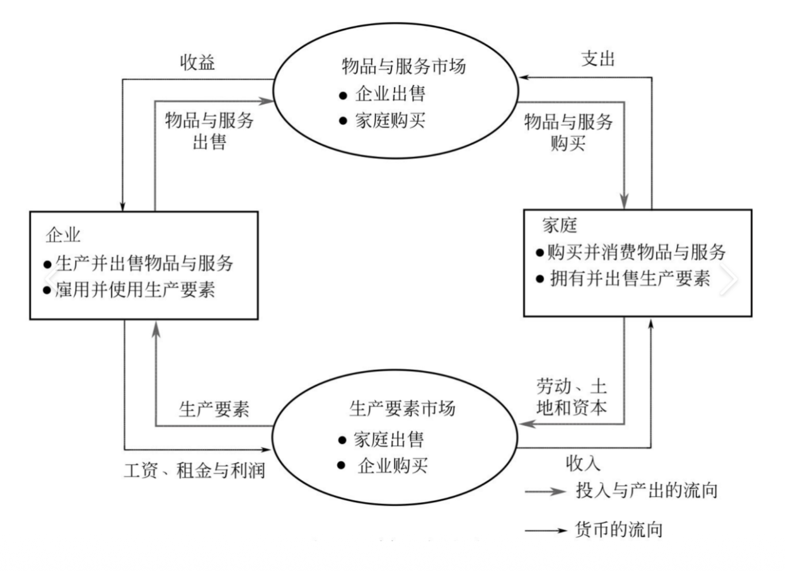
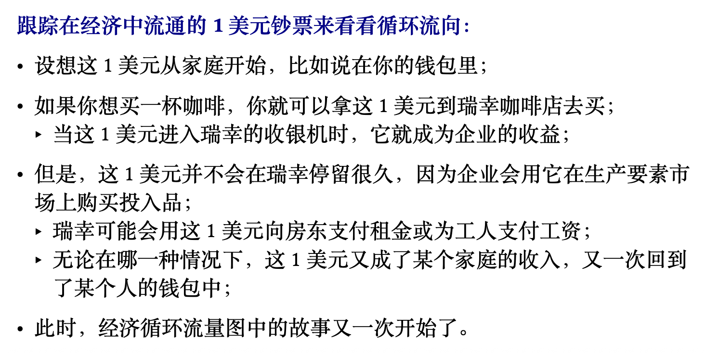
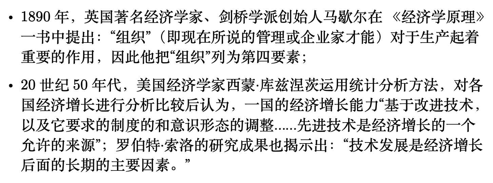
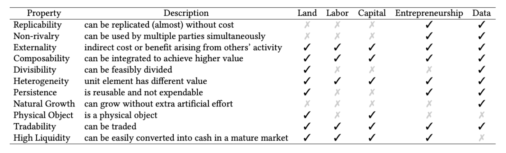
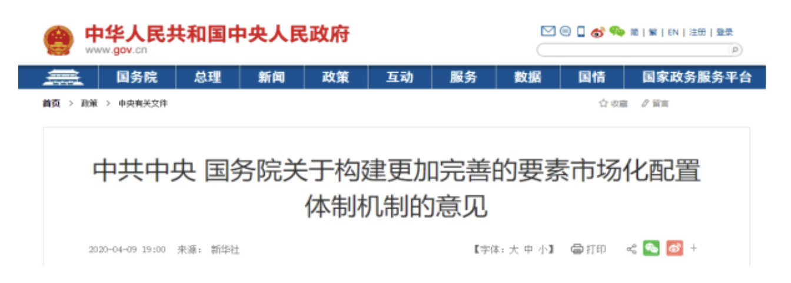
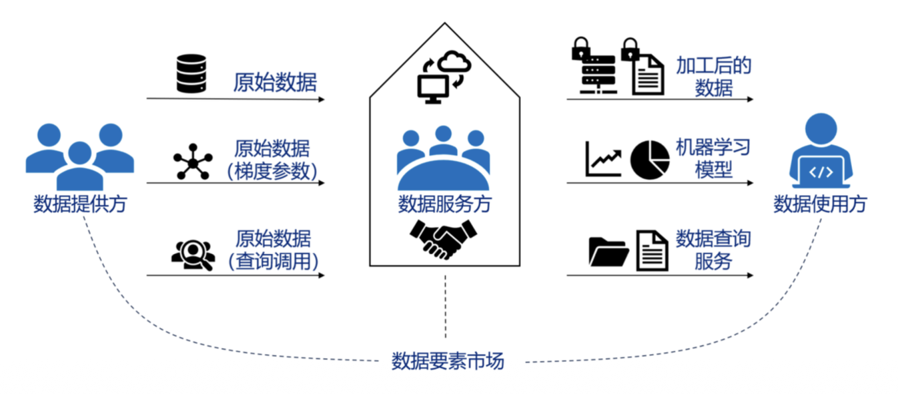
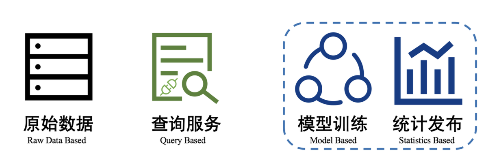
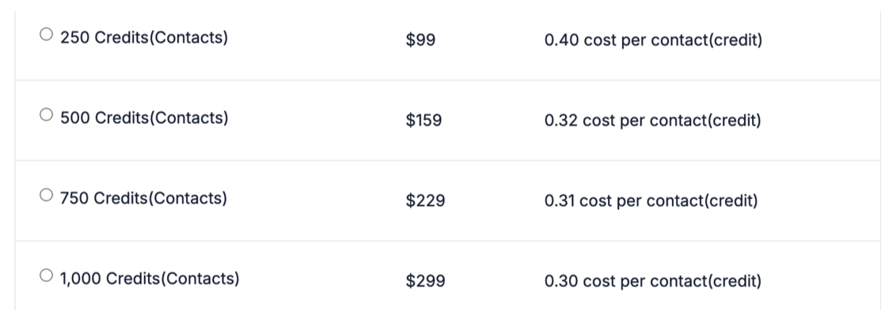

# Lec 1: 概述

## 简介

**数据是二十一世纪的新石油。**

大数据时代的挑战：

- **数据的收集与整理**(data acquisition)
    - 数据的聚合有利于打破数据孤岛
    - 处理不善，容易形成“数据沼泽”
    - 从数据到智慧的流程如图（~~记得高中信息技术教材中提到过~~）

        

            
        

- 如何保障**数据的安全与合规**(data security and compliance)
    - 数据泄露风险大、成本高
    - 数据滥用需要规范
- 如何将数据流动到最需要它的人手中
    - **数据市场**(data market)：基本架构、基本要求与设计目标
- 如何实施**数据定价**(data pricing)
    - 数据定价与传统定价的区别？有什么新要求？
    - 如何设计适用于数据的定价机制？
- 如何衡量**数据的价值**(data valuation)
    - 合作博弈中的概念：**沙普利(Shapley)值**
    - 如何解决沙普利值的计算困难性？如何将其应用于提升机器学习模型的准确率？

??? plan "课程目标"

    >直接从 PPT 截图下来

    

        
    
  

## 生产要素

课程名“数据要素市场”可拆分成三部分：

- 数据：21 世纪的新石油
    - 机器学习 = 数据 + 模型
- 要素：下面马上介绍
- 市场：之后再介绍

### 循环流量图

**循环流量图**：一种简化直观的市场经济模型，如下所示：

    

 

- 经济简单化为只由两类决策者——企业和家庭——所组成
- **企业**用劳动、土地和资本（建筑物和机器）这些投入品来**生产**物品和服务，这些投入品被称为**生产要素**
- **家庭**则拥有生产要素并**消费**企业生产的所有物品与服务
- 家庭和企业在两类市场上相互交易：
    - 在**物品与服务市场**上，家庭是买者，而企业是卖者；具体来说就是家庭购买企业生产的物品与服务
    - 在**生产要素市场**上，家庭是卖者，而企业是买者；在这些市场上，家庭向企业提供用于生产物品与服务的投入

??? example "例子"

    

        
    
 

### 传统四大生产要素

**生产要素**应当是<u>进行社会生产经营活动时所需的各种资源</u>。在传统主流经济学的观点中，有如下四大生产要素类别：

- **土地**(land)：所有用于生产的自然资源
    - 尽管狭义的土地范围很窄，但广义而言这一生产要素包括的不仅仅是土地，它包括可再生资源如森林等，也包括不可再生的石油、水等；不过很多时候还是讨论狭义的土地
    - 土地服务的价格称为**租金**(rent)
    - 土地的特点是**供给的价格弹性非常小**，即使价格变动非常大，我们也很难供给新的土地

- **劳动力**(labor)：包含体力劳动和脑力劳动，或可称之为人力资源
    - 劳动力的价格即**工资**(wage)
    - 劳动力的特点与土地类似，供应可以改变，但不是立即改变的，因此**供应弹性小**
    - 此外，供应基于许多因素，如人口规模，工作欲望，对工作的态度，年龄和性别构成等

- **资本**(capital)：指用于生产物品与服务的设备和建筑物
    - 这就是说，经济中的资本代表现在正用于生产新物品和服务的过去生产的物品的积累
    - 误区 1：<u>资本作为生产要素不是指**金钱**</u>，因为金钱显然不符合定义，金钱不直接用于生产，只是完成交易用的一种工具，应当是**使用金钱购置资本要素**
        - 这一点与金融学中的资本（也就是我们更熟悉的概念）不同，金融学中的资本是投资人往公司投入的资源，一般都是钱

    - 误区 2：<u>资本和**资产**(asset)并非一个意思</u>，在公司金融中，资产本质上是会计概念，指一个公司所控制的可以产生经济效益的资源；金融学的另一个重要方向是资产定价，此时资产主要指证券等其它金融工具。
    - 资本的价格：企业获得资本是依靠通过借钱和股东投资，因此资本收入一些是以利息的形式支付给借钱给企业的家庭，另一些则是以股利的形式支付给企业股东。

- **企业家才能**(entrepreneurship)（或**技术**(technology)）
    >直接引用 PPT 上的内容

    

        
    
 

### 数据作为生产要素

从一定意义上说，生产要素反映着人类社会不同发展阶段的生产力水平。

- **土地**：在**原始社会**，人类就开始使用土地进行耕作
- **劳动力**：在**奴隶制社会**，人类开始组织大量劳动力（奴隶）
    - 古典经济学家威廉·配第在 1662 年出版的《赋税论》中说：“劳动是财富之父，土地是财富之母”
- **资本**：工商业社会（**资本主义社会**）引入，资本主义生产方式的核心（生产资料私有）
- **企业家才能/技术**：各国实践表明，<u>经济增长的速度要快于要素投入增长的速度</u>
    - 有些增长是传统要素解释不了的，合理的解释是**科技进步**
    - 此外，经济学家安格斯·麦迪森说，技术进步不应该局限于机器制造上的进步，而应该包括**管理、组织**和农业耕作方面的创新

**数据**：

- 互联网、云计算、人工智能等技术加速创新，数字技术、数字经济是世界科技革命和产业变革的先机。
- 数据的规模爆发式增长，不仅在数字经济发展中的地位和作用凸显，而且对传统生产方式变革具有重大影响，催生新产业新业态新模式，成为驱动经济社会发展的关键生产要素。

???+ question "思考"

    === "问题"

        数据和数据要素的区别？什么样的数据不是数据要素？

    === "解答"

        简单来说，两者的区别为**能否投入生产**，数据要素就是能投入生产的数据。

### 生产要素之间的比较

???+ abstract "不同生产要素之间的性质比较（无需细看）"

    

        
    
 

之后重点关注数据的如下两个特性：

- **零成本复制性**（**易于操纵**）：
    - 在定价中可以设计更复杂的策略
    - 与创新（专利等）类似，因此会带来**产权问题**
- **价值不确定性**：在数据被应用于一个具体任务前很难知道其效果
    - 为数据定价带来困难。

## 数据市场的意义

### 数据流通的意义

!!! warning "注意"

    此后**数据市场**和**数据要素市场**共同使用，表示相同的含义。

数据市场的首要目的是<u>让数据流通起来</u>，数据流通的意义是什么？

???+ example "例子"

    考虑一个自动驾驶汽车产业的例子，有很多自动驾驶车厂，每个厂商都需要驾驶员习惯数据训练自动驾驶算法。

    - **数据的乘数效应**：基于数据训练更好的算法 -> 生产高质量汽车，吸引更多购买 -> 更多购买导致更多使用，更多使用带来更多的数据 -> ...
    >笔者联想到一个类似，但涉及领域不同的概念：飞轮效应，也体现了这种良性循环和价值放大的思想

    - 如果自动驾驶汽车厂之间共享数据，那么这一乘数效应将更加显著
    - 类似的例子还有医疗数据，测绘数据...

因此数据流通的意义在于打破数据孤岛，发挥数据的乘数效应，加速**数据密集型企业**发展。

从另一个角度看： 

- 李开复：*Tech Companies Should Stop Pretending AI Won’t Destroy Jobs*
    - China has more data than the US—way more. Data is what makes AI go. A very good scientist with a ton of data will beat a super scientist with a modest amount of data.
-  中国拥有大量人口，大量数据，而且数据可以加密管控，因此也是“卡脖子”的关键要素

### 数据要素市场的战略意义

2020 年我国首次将“数据”与土地、劳动力、资本、技术等传统要素并列为要素之一，提出要加快培育数据要素市场：

    

 

- 2022 年 12 月：《关于构建数据基础制度更好发挥数据要素作用的意见》（数据二十条）
- 2023 年 9 月：《数据要素白皮书（2023 年）》
- 2024 年 1 月：《“数据要素 × ”三年行动计划（2024—2026 年）》
- ...

### 数据定价的意义

理解数据流通的意义后，下面的问题是：为什么数据的流通需要**市场**？而市场最重要的机制是**价格机制**，故问题是**数据定价**的意义是什么？

- 数据的生产是有成本的，**如果要求免费公开，没有人会愿意生产数据**
    - **公共物品**属性（**非排他性**：数据一个人用了之后另一个人也能用）
    - 公共物品的一个重要问题是**产权**，之后会展开介绍
    - 企业自己聚集数据，制造**数据壁垒、数据垄断**
- 数据免费会导致**数据的滥用**（例如隐私数据）；
- 将数据**视为一种劳动，而非资本**：
    - 曾经劳动本身也被视为资本：奴隶是奴隶主的财产
    - 将数据视为资本，数据只是生产的副产品，而将数据视为劳动，可以更公平地补偿产生数据的个体（例如消费者隐私数据）
    - 将数据视为劳动，可以在 AI 取代一些岗位的同时，**产生一些新的数据工作岗位**（创造性破坏），如数据标注员

### 绝对优势、比较优势和机会成本

??? info "引入"

    Meta 海量社交语料数据 -> ScaleAI 数据标注 -> OpenAI 训练模型
    
    为什么 Meta 会将重心不断偏向数据出售？为什么 OpenAI 不花费大量资源自己制造数据，选择从外部购买数据？

    ——**比较优势理论**

    >当然也不一定是这一理由，但是给出了一种理解方式。下面还会顺带介绍简单的经济学原理，为后续课程准备。

下面将通过一个经济学寓言来展开介绍经济学的概念。

???+ example "寓言"

    假设世界上只有两种物品——牛肉与土豆，而且世界上只有两个人——名叫 Rose 的牧牛人和名叫 Frank 的种土豆的农民，他们每个人都既爱吃牛肉，又爱吃土豆。
    
    如果 Rose 只能生产牛肉，而 Frank 只能生产土豆，那么，贸易的好处是显而易见的：贸易使他们能享用更多的品种：Rose 不必整日吃牛肉，Frank 不必绞尽脑汁思考土豆的 N 种吃法，每个人都可以吃上牛排配烤土
    豆或夹有薯条的汉堡包。
    
    如果 Rose 和 Frank 都能生产对方生产的物品，只是成本相对较高，这种好处也是相似的。例如，假定 Rose 可以种土豆，但她的土地非常不适于种土豆。同样，假定 Frank 也能养牛，但他并不擅长养牛和生产牛肉。在这种情况下，很容易看出，Frank 和 Rose 都可以通过专门从事自己最擅长的活动并从相互交易中获益。

    ---
    但如果是下面这种情况呢？

    

    ||牛肉（盎司/天）|土豆（盎司/天）|
    |:-:|:-:|:-:|
    |Frank|8|32|
    |Rose|24|48|

    

    假设 Frank 和 Rose 每人每天工作 8 小时，并可以把这个时间用于种土豆或养牛上。上表说明 Frank 和 Rose 每天能生产的牛肉和土豆的数量。

显然 Rose 在生产牛肉和土豆上都比 Frank 有效率，这种优势在经济学中被称为**绝对优势**(absolute advantage)：

- 定义：生产者生产一种物品所需投入较少，就可以说该生产者在生产这种物品上有绝对优势
- 在上述例子中，**时间**是唯一的投入，Rose 无论在生产土豆还是生产牛肉上都有绝对优势：她的单位时间产量更高，因此她生产 1 单位这两种物品需要的时间都少于 Frank。

???+ question "思考"

    === "思考1"

        === "问题"

            Rose 的绝对优势意味着 Rose 不应该和 Frank 产生贸易吗？

        === "解答"

            如果两个人都自给自足，并且每个人每天用 4h 生产牛肉，4h 生产土豆，下表给出了两个人每天的产量：

            

            ||牛肉（盎司/天）|土豆（盎司/天）|
            |:-:|:-:|:-:|
            |Frank|4|16|
            |Rose|12|24|

            

            然而聪明的 Rose 发现这样的安排并非最优，她说：Frank，我的朋友，我这里有一桩好买卖！我认为你所有的时间都应该用于种土豆，我应该用 6h 养牛，2h 种土豆。然后你给我 15 盎司土豆，我给你 5 盎司牛肉作为回报。这样我们都将得到更多的这两种食物。改进产量后如下表所示：

            

            ||牛肉（盎司/天）|土豆（盎司/天）|
            |:-:|:-:|:-:|
            |Frank|5|17|
            |Rose|13|27|

            
 

    === "思考2"

        === "问题"

            为什么 Rose 具有绝对优势，但与 Frank 产生贸易仍有好处？

        === "解答"

            

            ||牛肉（盎司/天）|土豆（盎司/天）|
            |:-:|:-:|:-:|
            |Frank|8|32|
            |Rose|24|48|

            

            - Frank 每生产 1 单位牛肉，相当于放弃生产 4 单位土豆
            - Rose 每生产 1 单位牛肉，相当于放弃生产 2 单位土豆
            - Frank 每生产 1 单位土豆，相当于放弃生产 1/4 单位牛肉
            - Rose 每生产 1 单位土豆，相当于放弃生产 1/2 单位牛肉

**经济学十大原理之二：某种东西的成本是为了得到它而放弃的东西。**

- **机会成本**(opportunity cost)：为了得到某种东西而必须放弃的东西
- Frank 得到 1 盎司的牛肉需要放弃的 4 单位土豆就是其得到 1 盎司的牛肉的机会成本
    - 牛肉并不是用于直接生产土豆的，因此并非传统意义上的成本

在描述两个生产者的机会成本时，经济学家用**比较优势**(comparative advantage)这个术语：

- 定义：如果一个生产者在生产 X 物品时放弃了较少的其他物品，即生产 X 物品的机会成本较小，就可以说他在生产该物品上具有比较优势
- Frank 生产土豆的机会成本低于 Rose，Rose 生产牛肉的机会成本低于 Frank，因此，Frank 在种植土豆上有比较优势，而 Rose 在生产牛肉上有比较优势
- 尽管一个人有可能在两种物品的生产上都具有绝对优势，但**不可能都具有比较优势**，因为<u>一种物品的机会成本是另一种物品机会成本的倒数</u>

**经济学十大原理之五：贸易能使每个人状况更好，因为它使人们可以专门从事他们具有比较优势的活动。**

- **专业化和贸易的好处不是基于绝对优势，而是基于比较优势**。当每个人专门生产自己有比较优势的物品时，经济的总产量就增加了。
    - Frank 用更多时间种土豆，Rose 用更多时间养牛，土豆总产量从 40 盎司增加到 44 盎司，牛肉总产量从 16 盎司增加到 18 盎司，二人分享增加产量的好处。
- 从贸易的过程看，他们**各自通过以低于自己生产某种物品的机会成本的价格得到该物品而从贸易中获益**。
    - 从 Frank 的角度考虑，他用 15 盎司土豆换到了 5 盎司牛肉；换句话说，Frank 以 3 盎司土豆的价格购买 1 盎司牛肉，牛肉的这个价格低于 Frank 生产 1 盎司牛肉的机会成本，即 4 盎司土豆。因此，Frank 由于以一种有利的价格买到牛肉而从这一交易中获益，Rose 同理。

???+ question "分析"

    === "问题"

        分析一：为什么 Frank 应该完全不生产牛肉？

    === "解答"

        

        

        每小时产量（盎司）

        ||牛肉|土豆|
        |:-:|:-:|:-:|
        |Frank|1|4|
        |Rose|3|6|

        

        

        时间分配（$0 \le x, y \le 8$）

        ||牛肉|土豆|
        |:-:|:-:|:-:|
        |Frank|$x$|$8-x$|
        |Rose|$y$|$8-y$|

        
 

        

        - 此时，牛肉的总产量为 $x + 3y$，土豆的总产量为 $4(8 − x) + 6(8 − y) = 80 − 4x − 6y$，如果我们希望牛肉和土豆的总产量都上升，那么
            - 当 $x$ 增加 $1$ 时，牛肉总产量上升要求 $y$ 下降不能超过 $1/3$，但土豆总产量上升要求 $y$ 下降不能低于 $2/3$，二者要求矛盾，因此不可能实现牛肉和土豆的总产量都上升。
            - 当 $x$ 下降 $1$ 时，分析可知牛肉和土豆的总产量都上升只需要求 $y$ 上升 $1/3$ 到 $2/3$ 之间即可。
        - 因此，当 $x$ 下降时，只要 $y$ 上升幅度在要求范围内即可实现牛肉和土豆的总产量都上升，因此最优情况是 Frank 完全不生产牛肉，即 $x = 0$。在例子中，我们从 $x = 4, y = 4$ 调整到 $x = 0, y = 6$，符合分析结果。

### 边际效用

???+ question "分析"

    === "问题"

        分析二：交换价格的合理范围是什么？

    === "解答"

        **经济学十大原理之三：理性人考虑边际量，只有一种行动的边际利益大于边际成本，一个理性决策者才会采取这项行动。**

        ???+ example "例子"

            考虑航空公司决定对等退票的乘客收取多高的价格：

            - 假设一架有 200 个座位的飞机横越美国飞行一次成本 10 万美元，则每个座位的平均成本是 10 万 / 200 = 500 美元；
            - 人们很容易就此得出结论：航空公司的票价决不应该低于 500 美元；
            - 而事实上，一个理性的航空公司往往会通过考虑边际量而设法增加利润。设想一架飞机即将起飞时仍有 10 个空位，而在登机口等退票的乘客愿意支付 300 美元买一张票。航空公司应该把票卖给他吗？
                - 当然应该。如果飞机有空位，多增加一位乘客的成本是微不足道的。虽然每位乘客飞行的平均成本是 500 美元，但边际成本仅仅是这位额外的乘客将消费的一包花生米和一罐软饮料的成本而已。只要等退票的乘客所支付的钱大于边际成本，卖给他机票就是有利可图的。

使用上述边际效用的视角，可以得到如下结论：

**一般规律：对从贸易中获益的双方而言，他们进行贸易的价格在两种机会成本之间。**

- 在我们的例子中，Frank 和 Rose 同意按每盎司牛肉 3 盎司土豆的比例进行贸易，这一价格在 Rose 的机会成本（每盎司牛肉 2 盎司土豆）和 Frank 的机会成本（每盎司牛肉 4 盎司土豆）之间；
- 在这个价格范围内，Rose 想卖牛肉以购买土豆，而 Frank 想卖土豆以购买牛肉：每一方都可以以低于他的机会成本的价格购买一种物品，即此时他们的**边际利益都大于边际成本，从而使得双方的状况都改善了**。如果不在这个区间则做不到双方获益。
- 使双方均能获益的最优价格并不一定在 2 和 4 的正中间，但它一定在 2 和 4 之间的某个地方，那么现实中这一价格如何决定？这就需要一般**均衡理论**来解释（这就超出了这门课程的范畴）。

??? question "Quiz 题"

    === "题目"

        已知 A 国和 B 国生产计算机和小麦的工作日数如下：

        - A 国生产一单位计算机需要 104 个工作日，生产一单位小麦需要 4 个工作日
        - B 国生产一单位计算机需要 60 个工作日，生产一单位小麦需要 3 个工作日

        回答以下问题：

        1. 说明哪一国在生产计算机上具有比较优势，哪一国在生产小麦上具有比较优势，在分工的自由贸易中两国进出口的商品是什么？
        2. 两国贸易中，一单位计算机和多少单位的小麦进行交换是合理的范围？

    === "解答"

        

        每天完成量

        ||计算机|小麦|
        |:-:|:-:|:-:|
        |A|1/104|1/4|
        |B|1/60|1/3|

        
 

        - A 每生产 1 单位计算机，相当于放弃生产 26 单位小麦
        - B 每生产 1 单位计算机，相当于放弃生产 20 单位小麦
        - A 每生产 1 单位小麦，相当于放弃生产 1/26 单位计算机
        - B 每生产 1 单位小麦，相当于放弃生产 1/20 单位计算机                

        因此，A 生产小麦的机会成本低于 B，B 生产计算机的机会成本低于 A，那么 A 在种植小麦上有比较优势，而 B 在生产计算机上有比较优势。所以 A 进口计算机，出口小麦；B 进口小麦，出口计算机。

        根据边际效用的一般规律，贸易价格应在两个机会成本之间，所以 1 单位计算机和 20～26 单位小麦进行交换比较合理。

### 看不见的手

**经济学十大原理之六：市场通常是组织经济活动的一种好方法。**

我们可以跳出例子的框架，考虑一个完整的经济体，其中牛肉和土豆根据供给和需求两股力量分别拥有各自的价格，从而有了土豆和牛肉之间的交换比例；

- 由此可以看到货币作为一般等价物的作用，如果市场中只有土豆和牛肉，那么我们只需要他们之间的交换比例即可，但如果有成千上万种商
品，则需要货币这一计价物来衡量不同物品的价格关系。

???+ abstract "总结"

    比较优势理论可以用于解释为什么不同的 AI 巨头会有不同的主营业务——这是因为他们比较优势不同：

    - Meta 拥有大量社交语料数据，OpenAI 拥有大量天才程序员
    - 这也就能从另一个角度看到数据交易的必要性

## 数据市场基本概念

数据市场研究范围非常广，除数据交易定价外，还有政府市场治理、国际数据流通政策等话题，本课程只关注**数据交易与定价**相关内容。

A data market is any mechanism whereby the exchange of data products including **datasets and data derivatives (such as query results and trained models)** takes place as a result of data buyers and data sellers being in contact with one another, either **directly or through mediating agents**.

    

 

### 分类

    

 

- **原始数据**：例如直接出售完整数据集。
- **查询数据**：例如 [Google Bigquery](https://cloud.google.com/bigquery)，通过按查询向购买者收费并补偿数据所有者，通常使用 API 形式调用查询服务。
- **模型数据**：出售基于数据训练出的模型，可以使用 API 调用服务的方式出售，优势在于保护原始训练数据隐私，且买家可以知道预测准确度。

### 数据交易流程

1. **数据收集**：数据收集是数据市场的第一阶段，目的是**找到可以交换的数据集**。为了**避免陷入数据量大但有价值的数据稀缺的困境**，如何从海量数据中挖掘出具有商业价值的数据是一个重要的问题。
2. **数据存储**：数据存储有**多方面风险**，如**黑客攻击、丢失和未经授权使用**，因此存储阶段需要结合物理措施和隐私计算技术来应对各种威胁。
3. **数据产品化**：利用买家需求将原始数据**转化为可销售、标准化、可重复和可理解的数据产品**的过程。例如转为关系型数据库便于查询调用，或训练机器学习模型。
4. **数据合规**：数据合规是指**企业必须遵守的标准和法规，以防止敏感数据泄露、误用、破坏等**。世界各地已经制定了不同类型的数据安全法律，数据市场中的参与者必须遵守这些法律，否则将面临高额罚款。
5. **数据定价**：数据定价就是**将数据产品作为交易的资产进行定价**，一个完善的数据定价体系可以广泛地方便数据交易，然而数据定价远非容
易之事（后续章节会具体展开介绍）。
6. **数据溯源**：在数据交易中，买家关心如何验证卖家是否如实提供了数据产品。**数据可追溯性描述了数据来自哪里以及如何被转换，这是保证数据收集、数据产品化和数据定价的真实性的一种方式**。实现数据的可追溯性，可以从源头上解决数据质量问题和收益分配问题。
7. **数据销毁**：一旦数据不再用于完成预期的程序，或者数据所有者不再拒绝共享数据，就必须立即将其销毁，否则将严重侵犯数据所有者的隐私。数据销毁主要包括存储介质的物理销毁或存储内容的重写。

### 现实中的数据市场

- [AWS(Amazon Web Service) Data Exchange](https://aws.amazon.com/cn/data-exchange/)
- [数据堂](https://www.datatang.com/)
- 上海大数据交易中心

## 数据市场设计要求

《关于构建数据基础制度更好发挥数据要素作用的意见》（数据二十条）中指出了数据要素市场中四个需要解决的关键问题：**数据产权、流通交易、收益分配、安全治理**。

在数据交易的视角下，可以一一对应如下四个问题，下面逐个展开讨论：

- 产权问题
- 定价问题
- 公平问题
- 隐私问题

### 产权问题

此前已经提到，数据具有非排他性，即具有公共物品的属性：

- 公地悲剧：封建主在自己的领地中划出一片尚未耕种的土地作为牧场（称为“公地”），无偿向牧民开放。这本是造福于民的事，但由于无偿放牧，每个牧民都养尽可能多的牛羊。随着牛羊数量无节制增加，公地牧场最终因“超载”而成为不毛之地，牧民的牛羊最终全部饿死。
- 解决方案：**产权划分**/**政府监管**。
- 数据可以类比于**创新**，一种创新的技术公开后也可以被所有人使用，创新的产权管理方式称为“**专利制度**”。

在理解了数据产权问题的重要性后，下面的问题是，<u>数据产权应该归谁所有</u>？回到之前讲过的自动驾驶车的例子：

>出于隐私数据的考虑，我们不讨论“产权归政府所有”的情况。

- 如果产权归**企业**（比如保险公司）所有
    - 即使向其他企业出售数据会带来收益，但企业可能担心出售数据会使得其他企业实现技术赶超，因此产权归企业会导致数据流通有限
    - 除了流通有限，产权归企业还会导致隐私问题，因为这样企业可以滥用驾驶员习惯数据（属于隐私数据），随意出售处置等
- 如果产权归驾驶员（即**数据生产者**）所有
    - 驾驶员可以自己权衡隐私成本和出售数据的收益，将数据同时出售给多个厂商，带来更大的社会效益

### 定价问题

数据定价三种最简单基本的方法：

**成本法：根据形成数据的成本进行数据定价**，具体公式为：

$$
P = TC \times (1 + R) \times U
$$

其中 $P$ 为数据价格，$TC$ 为形成数据产品的总成本，$R$ 为卖家的预期收益率，$U$ 为调整系数，例如出售的数据可能存在时效性问题等，需要基于这些因素调整数据价格。

!!! bug "成本法的问题"

    - 数据是可以**零成本复制的**，然而成本法要求所有买家都需要支付数据的生产成本，并不是非常合理
    - 数据产品的**形成成本和价值先天具有弱对应性**，并不是生产成本高的数据就一定能让买家满意

---
**收益法：通过预计数据资产带来的收益确定价格**，公式如下：

$$
P = \sum\limits_{t=1}^n F_t \cdot \dfrac{1}{(1 + r)^t}
$$

其中 $P$ 为数据价格，$n$ 为数据失效前能使用的收益期总数，$F_t$ 代表数据在未来第 $t$ 个收益期能为数据买家产生的收益，$r$ 为贴现率。

不同于成本法从数据卖家产生数据的成本出发，**收益法从数据买家获得数据后的收益出发**。

- 例如企业购买消费者数据确定目标人群从而定向投放广告，则购买数据带来的收益为目标人群观看广告后为企业增加的收入
- 成本法和收益法的区别类似于**内在价值**(intrinsic value)和**工具价值**(instrumental value)的区别；
    - 一条新闻可能是记者耗费了大量时间才完成的，这条新闻出现在报纸上就自然有其内在价值
    - 然而很多人可能对这条新闻的内容并不感兴趣，他们会认为看到这条新闻无法给他们带来什么实际作用，因此对这些人工具价值很低

- 回到数据本身，**数据产生成本不随买家变化而变化，但数据能产生的收益随着买家的具体任务不同而有较大不同**
- 在确定价格时，**更合理的方式应当是根据买家收益确定**，即面向需求定价而非面向成本定价，否则很容易出现贱卖或高价无人买的情况
- 收益法的执行中也存在困难，即数据卖家并不一定完全清楚数据买家购买数据能带来的具体收益，甚至无法得知买家购买数据的目的
    - 之后的理论模型会会更深入地讨论如何解决这一问题

---
**市场法：根据相同或者相似的数据产品的近期或者往期成交价格，通过对比分析，确定数据价格**，计算公式如下：

$$
P = P_0 \times \prod\limits_{i=1}^n \delta_i
$$

其中 $P$ 为数据价格，$P_0$ 为供参考的类似数据产品价格，$\delta_i$ 是第 $i$ 个修正系数。修正系数可以有非常多类，例如时效性、数据生产技术难度等，具体的选择需要根据数据产品本身的特性决定。

!!! bug "市场法的缺陷"

    现在可供参考的数据价格可能并不多，因此这一方法需要当数据市场经过长期发展后才更具备参考价值。

---
数据具有零成本复制性和买家购买数据的效用不确定性，并且数据易于操纵，因此可以在最简单的定价方式基础上使用一些特别的策略：

    

 

- [BookYourData](https://www.bookyourdata.com/)：是一个出售电子邮件列表的数据市场，出售的电子邮件可以用于向目标用户定向投放广告等；
- 上述策略称为**免费增值**(freemium)：用免费服务吸引用户，将用户锁定在平台，然后通过增值服务将部分免费用户转化为收费用户实现变现。如 overleaf 等平台/软件/LLM 有免费版和允许更多功能的升级版。

由上可以看出，现实中数据定价参考了其他产品的定价策略。事实上，平台/软件等产品也被称为**信息产品**，即可以使用比特存储的产品，因此数据也属于信息产品的一种，类似地如操作系统、话费流量等也属于此。

信息产品因为可以用比特存储，因此都可以零成本（或低成本）复制，并且容易操纵，故很多的定价思想都可以迁移到数据上。

    

 

例如上图中提供了一系列数量-价格条目，购买数量越多单条数据的价格越低，这就类似于话费流量等定价方式。这一方式能满足不同需求买家的需要，也是面向需求定价思想的体现。

### 公平和隐私问题

- 公平问题：如何公平分配数据使用/出售带来的收益
    - 按数据产品产出的投入比重公平分配收益
    - 明确数据产权，例如使用隐私数据应当对消费者补偿多少等
    - 机器学习模型使用了多方数据，使用**合作博弈中的沙普利值**实现公平的收益分配

- 隐私问题：如何构建安全可信的数据要素市场
    - 隐私计算：数据脱敏，差分隐私，多方安全计算，同态加密等
    - 数据溯源：区块链，数字水印等
    - 政府监管：防止隐私数据滥用，防止数据篡改等