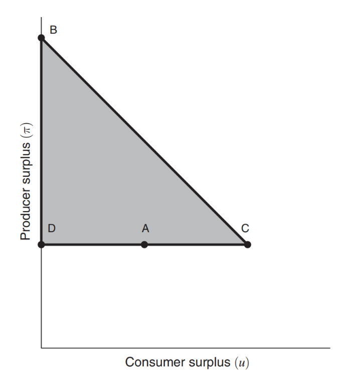

# Lec 11: 隐私，外部性与数据定价

## 数据定价：隐私视角

### 隐私成本

考虑个体 $i$ 拥有一条隐私数据（例如是否患有某种疾病等），他在纠结是否以一定价格出售自己的这条隐私数据。假设数据买方是一个可信的数据中心，承诺对 $i$ 使用满足 $\varepsilon_i$-[差分隐私](2.md#差分隐私)的机制 $M$ 保护其隐私。

- $i$ 关心出售的价格是否能补偿隐私泄漏带来的自身效用降低，因此隐私泄漏带来的效用降低自然也就成为了隐私成本

为了衡量隐私泄漏带来的效用降低，首先需要定义 $i$ 的效用函数 $u_i$

- 自然地，可以将 $u_i$ 定义在所有未来可能发生的事件 $a \in A$ 上，其中 $A$ 表示未来可能发生的事件集合
- 机制 $M$ 的输出会影响未来事件发生的概率，令 $f\ :\ \text{Range}(M) \rightarrow \Delta(A)$ 表示从机制输出到事件发生概率的映射；因此 $f(M(D))$ 可以表示当机制作用于数据库 $D$ 时，每个事件 $a \in A$ 发生的概率

举一个例子理解上述定义：

- 设 $D_1$ 是包含 $i$ 是否患有某种疾病的隐私数据的数据库，$D_2$ 是不包含该条数据的数据库
- $A$ 表示未来 $i$ 可能接受的医疗保险的价格
- 机制 $M$ 保证数据库上的查询满足 $\varepsilon$-差分隐私，保险公司在看到机制 $M$ 返回的结果后会决定 $i$ 的医疗保险价格
- 因此 $f(M(D_1))$ 的含义就是当保险公司在看到数据库 $D_1$ 的查询结果后为 $i$ 提供不同保费的概率分布

在这一场景下，$i$ 关心的问题是出售自己的患病数据能否补偿他在未来医疗保险中可能遭遇的价格上升带来的效用下降。形式化地，而当 $i$ 不出售自己的数据时（即数据库为 $D_2$），其（期望）效用为

$$
v_i = \mathbb{E}_{a \sim f(M(D_2))}[u_i(a)] = \sum\limits_{a \in A} u_i(a) \cdot \mathbb{P}(f(M(D_2)) = a) 
$$

当 $i$ 出售自己的数据时（即数据库为 $D_1$），其（期望）效用为

$$
v_i' = \mathbb{E}_{a \sim f(M(D_1))}[u_i(a)] = \sum\limits_{a \in A} u_i(a) \cdot \mathbb{P}(f(M(D_1)) = a) 
$$    

假设 $M$ 是一个满足 $\varepsilon_i$-差分隐私的机制，根据差分隐私的后处理性质，$f \circ M$ 也是满足 $\varepsilon_i$-差分隐私的，故有

$$
\begin{align*}
v_i' & = \sum\limits_{a \in A} u_i(a) \cdot \mathbb{P}(f(M(D_1)) = a) \\
& \le \sum\limits_{a \in A} u_i(a) \cdot \exp(\varepsilon_i) \mathbb{P}(f(M(D_2)) = a) \\
& = \exp(\varepsilon_i) \cdot v_i
\end{align*}
$$

同理也可以证明 $v_i \le \exp(\varepsilon_i) \cdot v_i'$。

- 由此可见，只要数据中心承诺使用满足 $\varepsilon_i$-差分隐私的机制 $M$，那么数据卖家 $i$ 出售自己数据后的效用 $v_i$ 受到的影响 $(v_i - v_i')$ 不会超过 $(1 - \exp(-\varepsilon_i)) v_i$
- 因此可以将隐私成本函数写为 $c(v_i, \varepsilon_i) = (1 - \exp(-\varepsilon_i)) v_i$
- 当 $\varepsilon_i$ 较小时，则可以更进一步地近似为 $c(v_i, \varepsilon_i) = \varepsilon_i v_i$——这是一个线性函数，表明用户的隐私成本随着隐私泄漏的增加而线性增加

与数据价值分类相同，隐私成本也可分成**内在成本和工具成本**两部分：

- 此前定义隐私成本的角度是工具成本的角度，即泄露隐私后可能会因为价格歧视或其他原因带来多少损失
- 然而在很多场景下，个人不愿意透露一些信息并不出于披露信息后会导致自己遭受经济损失，而是出于内在的不情愿的心理（内在成本）

最后，读者可以回想一下自己的真实经历：我们真的有这么重视隐私成本吗？答案对于很多人而言是否定的：**即使每个人都会表面上认为个人数据的隐私保护非常重要，都表现出对自己的隐私数据被滥用的担忧，但事实上很多人都在无时无刻地泄露自己的隐私信息，这一对隐私的态度和行为不匹配的现象被称为隐私悖论**。

一个很生动的例子是，考虑如下两个问题：

1. 给你一个披萨，你是否愿意提供自己的邮箱地址？
2. 某一平台已经拥有你的邮箱地址，平台要求你支付一个披萨的价钱来保证你的邮箱不会被进一步公开，你是否愿意支付？

非常现实地，很多人会在第一个问题上选择愿意，而在第二个问题上选择不愿意。

### 隐私数据获取机制

假设你是一个数据分析师，希望收集数据统计某一人群中的吸烟率、肥胖率或患某种疾病的比例，你希望以尽可能低的成本获得比较高的准确率。数据分析师有可能的两个目标：

1. 有预算约束，希望最大化估计的准确度
2. 有估计准确度的目标，希望在实现目标的前提下最小化支付

如何为这两个目标设计相应的机制？

**困难：每个人的隐私成本和隐私数据是相关的**：

- 例如吸烟 / 过于肥胖的人会认为自己的数据隐私成本很高，如果只用固定价格获取数据，会导致统计偏差
- 如果隐私成本的先验信息完全未知，目标很难达到；如果隐私成本先验分布已知，可以设计相应的机制（见大作业相关选题）

### 隐私数据交易的福利影响

考虑数据买家购买消费者隐私数据然后对消费者实施价格歧视的场景：

- 数据买家主要是电商平台，产品卖家或广告商等
- 在购买消费者隐私数据后，买家对消费者的支付能力等有了更近一步的认知，从而可以实施三级价格歧视（极端情况下可以实施一级价格歧视），从而实现福利的提升
- 当然除了数据买家的福利提升外，消费者的福利可能也因为遭受价格歧视而降低

考虑厂商采用公布价格出售商品的场景，此时假设买家具有单位需求，即每个买家都最多只会购买一单位商品，厂商可以使用三级价格歧视的场景。令 $u$ 表示消费者福利，$\pi$ 表示厂商福利。自然地，这两个福利需要满足以下三条约束：

- $u \ge 0$：**消费者福利大于等于 0**，这是因为消费者在商品价格高于自身估值时不会购买商品，因此消费者至少可以确保福利非负
- $\pi \ge \pi^*$，其中 $\pi^*$ 表示没有价格歧视时的厂商利润：这也是自然的要求，因为在有三级价格歧视的情况下，**厂商至少也可以选择没有价格歧视时的价格来保证 $\pi^*$ 的利润**
- $\pi + u \le w^*$，其中 $w^*$ 表示消费者对产品估值的总和：这是因为这一场景下的**社会福利应当等于所有买到产品的消费者对产品的估值总和，而消费者对产品估值的总和是所有消费者都买到产品时的社会福利**，因此是可能的最大社会福利

上述三条约束都是线性约束，因此**可能的福利范围可以用图中的阴影部分表示（称为福利三角形）**。然而这只给出了可能福利的最大范围，这一范围内的点是否一定能取到则是未知的。事实上可以证明，**这一范围内的所有厂商和消费者福利组合都是可以取得的**。

    

考虑消费者估值集合为 $V = \{1, 2, 3\}$ 的情况，且聚合市场中三类消费者占比相同，即 $x^* = (1/3, 1/3, 1/3)$。显然最大的可能社会福利

$$
w^* = \dfrac{1}{3}(1 + 2 + 3) = 2
$$

下面看最优垄断定价（价格只可能在 $V$ 中点，为什么？）：

- 当价格定在 $v_1 = 1$ 时，所有人都买得起，因此收益为 1
- 当价格定在 $v_1 = 2$ 时，2/3 的人买得起，因此收益为 4/3
- 当价格定在 $v_1 = 3$ 时，只有估值最高的 1/3 消费者买得起，收益为 1

因此不难看出最优垄断定价为 $v^* = v_2 = 2$，对应厂商收益为 $\pi^* = 4/3$。此时消费者福利也不难计算为 $u^* = 1/3(2 − 2) + 1/3(3 − 2) = 1/3$。

### 隐私数据政策问题

- 微观视角：数字平台机制设计
    - 好处：平台使用隐私数据可以**优化推荐算法**，提高用户福利
    - 坏处：平台使用隐私数据可以**实施价格歧视**（现实中不多见？）
    - 权衡：如何设计隐私数据使用政策权衡上述利弊

- 宏观视角：非竞争性与数据产权
    - 数据具有非竞争性，可以同时被多个企业使用
    - 自动驾驶车厂的例子：自动驾驶车厂需要驾驶员驾驶习惯等数据增强算法，增强算法后可以提高产出，产出提高后可以收集到更多数据，从而数据产生了**乘数效应**
    - 产权：如果数据产权归厂商所有，厂商会担心其他公司拥有后竞争加剧，因此数据共享少；如果产权归个人所有，个人可以权衡自己的隐私和卖数据的收益，产生更多的数据共享
    - 数据和 idea 的比较：都属于信息产品，都有公共物品属性（非竞争性），但**数据相比于 idea 更容易传播（idea 需要教育），但数据的传播也更容易受到管控（加密等）**

## 数据定价：外部性问题

外部性问题通常分为两个角度讨论：

- 买家视角
    - 不同买家之间具有竞争关系，例如是两个自动驾驶车厂，购买数据增强自动驾驶算法，此时一方购买数据增强算法后可能会影响另一方的市场占有率
    - 不同买家是股票投资者，购买某些股票的调研报告后会导致供求关系改变，股票价格改变从而影响其他人的收益
- 卖家视角
    - 假设两个消费者隐私数据强相关（他们年龄、性别等背景类似，习惯也类似），那么其中一个人出售自己的隐私数据后，另一个人的隐私数据就不值钱了
    - 这会导致隐私数据均衡价格下降，以及隐私数据使用的泛滥
    
感兴趣的同学可以选择大作业的相关选题阅读相关文献。