# Lec 2: 数据合规与安全

??? info "背景知识"

    - 数据安全事件频发：随着大数据时代的到来，隐私数据泄露问题日益突出，亟待解决。
        - 举例：滴滴出行由于严重违法违规收集使用个人信息被勒令下架整改、Facebook用户数据遭窃导致 5.33 亿用户的个人隐私数据被泄露
    - 数据安全法制化建设越来越完善
    - 四法四条例四合规明确保护个人信息及重要数据

隐私计算常见技术有：

- 安全多方计算：互不信任的参与方协同计算而不泄露隐私信息
- 联邦学习：本地训练模型并共享更新，原始数据不出域
- 数据脱敏：消除或混淆敏感信息，以保护数据隐私
- 差分隐私：在计算结果中引入噪声，防止对个别数据的推断
- 全同态加密：允许数据在加密状态下直接进行运算
- 零知识证明：在不泄露信息的情况下证明某个断言的真实性
- ...

下面将详细介绍这些技术。

## 安全多方算法

!!! question "姚氏百万富翁问题"

    >[wiki](https://en.wikipedia.org/wiki/Yao%27s_Millionaires%27_problem)

    两个富人比谁钱多，如何能实现互相保密但可以比出谁的钱多？

    ??? bug "第三方是不可信的！"

        解决该问题，我们不会引入第三方，这是因为：

        - 第三方需要知道两位富翁的信息才能比较，而一旦掌握这些信息就存在隐私泄露的风险。即使第三方承诺保密，也无法保证会因为黑客攻击、内部人员泄密等原因而主动或被动地泄露这些数据。
        - 引入第三方的前提是信任这个第三方。但我们通常采取“零信任”原则，即假设任何参与方都可能是恶意的或不可靠的。而百万富翁问题正是为了解决在不信任第三方的情况下，如何实现安全多方计算。

    在姚期智的原文中，问题表述为：

    >For definiteness, suppose Alice has $i$ millions and Bob has $j$ millions, where $1 \le i, i \le 10$. We need a protocol for them to decide whether $i < j$, such that this is also the only thing they know in the end (aside from their own values). Let $M$ be the set of all $N$.

???+ note "通俗易懂的解法"

    

        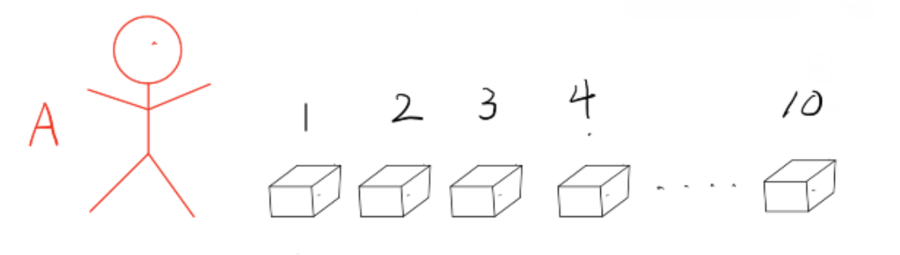
    
 

    第一个百万富翁，选择十个盒子，按照顺序排列，分别代表 1 到 10，并用自己的财产数字与盒子的数字进行比较，如果小于该数字，则在盒子里面放一个苹果，若大于等于则放一个香蕉。

    

        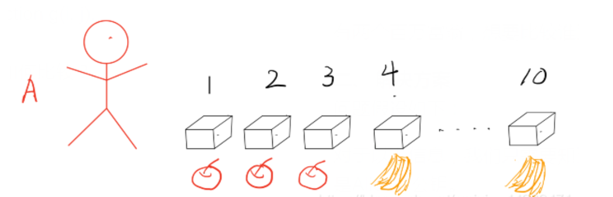
    
 

    请第二个百万富翁来，让他选择自己财产数额对应的箱子（在第一个百万富翁不参与的情况下）。随后，第二个百万富翁把剩余所有箱子销毁。

    

        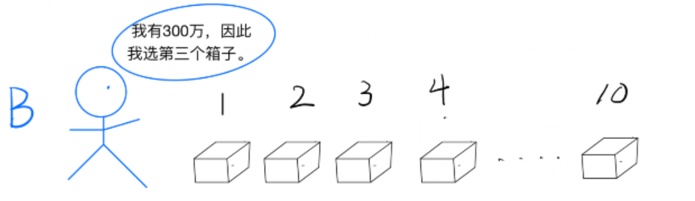
    
 

    最后，两个百万富翁一起打开最后剩下的那个箱子，则可以得出谁更富有。

    

        
    
 

姚期智给出的正式解法如下：

1. Bob picks a random $N$-bit integer, and computes privately the value of $E_a(x)$; call the result $k$.
2. Bob sends Alice the number $k - j + 1$;
3. Alice computes privately the values of $y_u = D_a(k-j+u)$ for $u = 1, 2, \dots, 10$.
4. Alice generates a random prime $p$ of $\dfrac{N}{2}$ bits, and computes the values $z_u = y_u (\mod\ p)$ for all $u$; if all $z_u$ differ by at least 2 in the mod $p$ sense, stop; otherwise generates another random prime and repeat the process until all $z_u$ differ by at least 2; let $p$, $z_u$ denote this final set of numbers;
5. Alice sends the prime $p$ and the following 10 numbers to B: $z_1, z_2, \dots, z_{10}$, followed by $z_i + 1, z_{i+1} + 1, \dots, z_{10} + 1; the above numbers should be interpreted in the mod $p$ sense.
6. Bob looks at the $j$-th number (not counting $p$) sent from Alice, and decides that $i > j$ if it is equal to $x\ \mod\ p$, and $i < j$ otherwise.
7. Bob tells Alice what the conclusion is.

简化的解释为：

- 第一步，经过特定的操作，让 A 构造出 $n$ 把锁，B 有且仅有第 $j$ 把锁的钥匙，但是 A 不知道 $j$ 是多少。
- 第二步，A 给 B $n$ 把锁锁着的标志位，其中前 $i$ 个标志位置 0，后 $n-i$ 个置 1。
- 第三步，B 检查第 $j$ 把锁锁着的标志位是否为 0。如果为 0 则 $i \ge j$，否则 $i < j$。

## 联邦学习

**联邦学习**(federated learning)：在分布式设备或系统上训练模型，参与方仅传输模型参数，在**不共享数据**的基础上联合建模。**原始数据不出域、通信量低、计算负载均衡**，但是上传参数存在隐私泄露风险。

    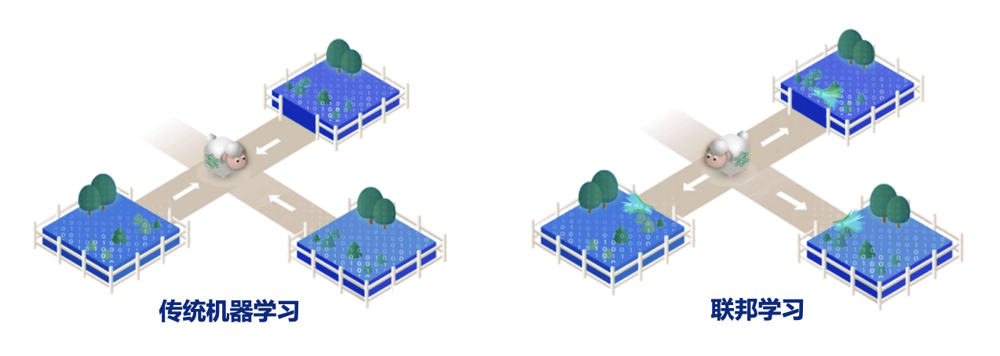

 

对于联邦学习，有一个比较著名的比喻是“小羊吃草”，小羊和草分别被比作**模型**和**数据**。

- 对于传统的机器学习，需要将各个草场的草移动至小羊所在的中心区域，然后小羊才可以吃草，即小羊不动草动。
- 而联邦学习是小羊移动到各个草场分别进行吃草，即小羊动草不动。

在上述两种模式中，小羊都可以将所有的草吃完。

---
主要特征：

- 多方协作：多个参与方协作构建一个共享的机器学习模型，各方都拥有若干能够用来训练模型的训练数据
- 各方平等：参与各方之间是平等的
- 数据隐私保护：在模型训练过程中，各参与方拥有的数据都不会离开该参与方，并保证任何一个参与方都不能推测出其他方的原始数据

技术类别：

- 横向联邦学习：单一数据库**用户量不足**，多个数据库联合训练
- 纵向联邦学习：单一数据库**属性维度不足**，多个数据库联合训练
- 迁移联邦学习：数据库之间样本和属性**重叠均较少**，多个数据库联合训练

!!! recommend "优势"

    - 相比集中式学习，能够更好的保护数据隐私，且减少数据通信开销
    - 相比 MPC，计算、通信复杂度更低，可扩展至百万级参与者

!!! bug "劣势"

    - 相比集中式学习，存在一定的精度损失
    - 相比 MPC，计算任务局限于模型训练，且存在一定的信息泄露

实用化挑战：

- 降低隐私泄漏：联邦学习的中间结果会泄漏数据隐私，结合密码学、差分隐私等技术降低联邦学习中间结果的隐私泄漏
- 兼容大模型：联邦学习传递模型参数不传递数据，但大模型参数量同样巨大，构建面向大模型的联邦学习方法，降低传递模型的通信复杂度

## 数据脱敏

**数据脱敏**(data masking)：根据制定的脱敏规则，针对敏感信息进行数据变形或遮蔽，降低数据的敏感级别，扩大数据可共享和被使用的范围，达到保护隐私数据安全的目的。

    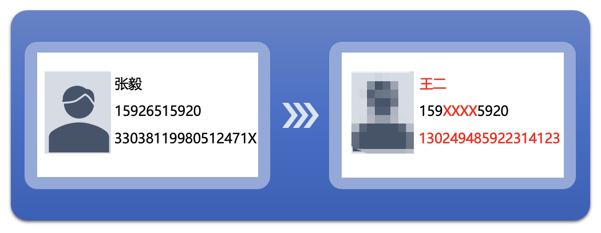

 

数据脱敏有以下分类：

- **动态数据脱敏**：
    - 适用于**不脱离生产环境**，对敏感数据的查询和调用结果进行**实时**脱敏
    - 在访问敏感数据的同时实时进行脱敏处理，可以为不同角色、不同权限、不同数据类型执行不同的脱敏方案，从而确保返回的数据可用而安全
- **静态数据脱敏**：
    - 适用于**脱离生产环境**，脱敏后分发至测试、开发、数据分析等场景
    - 是数据的“搬移并仿真替换”
    - 将数据脱敏处理后，下发给下游环节取用和读写
    - 脱敏后数据与生产环境**相隔离**，满足业务需求的同时保障生产数据库的安全

为适应不同数据脱敏的应用场景，在保持数据原始特征及业务一致性的基础上，提供了多种数据脱敏方法：

- **无效化**：在处理待脱敏的数据时，通过对字段数据值进行**截断、加密、隐藏**等方式让敏感数据脱敏，使其不再具有利用价值；一般采用特殊字符（`*` 等）代替真值

    

        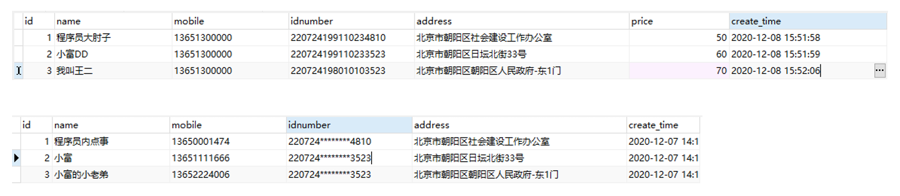
    
 

- **随机值**：字母变为随机字母，数字变为随机数字，文字随机替换文字的方式来改变敏感数据，这种方案的优点在于可以在一定程度上保留原有数据的格式，往往这种方法用户不易察觉的

    

        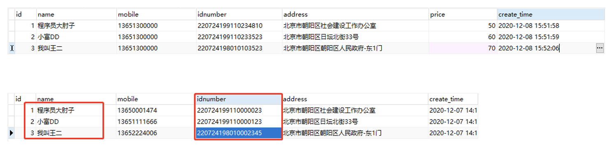
    
 

- **数据替换**：与无效化方式比较相似，不同的是这里不以特殊字符进行遮挡，而是用一个设定的虚拟值替换真值

    

        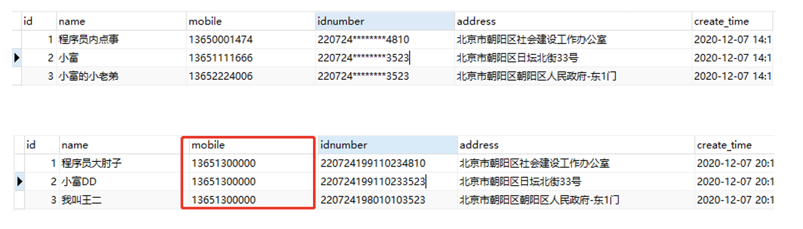
    
 

- **对称加密**：一种特殊的可逆脱敏方法，通过加密密钥和算法对敏感数据进行加密，密文格式与原始数据在逻辑规则上一致，通过密钥解密可以恢复原始数据，要注意的就是密钥的安全性

    

        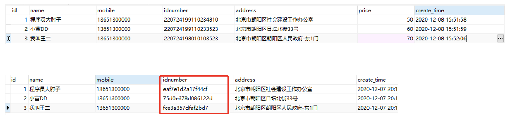
    
 

- **平均值**：经常用在统计场景，针对数值型数据，我们先计算它们的均值，然后使脱敏后的值在均值附近随机分布，从而保持数据的总和不变

    

        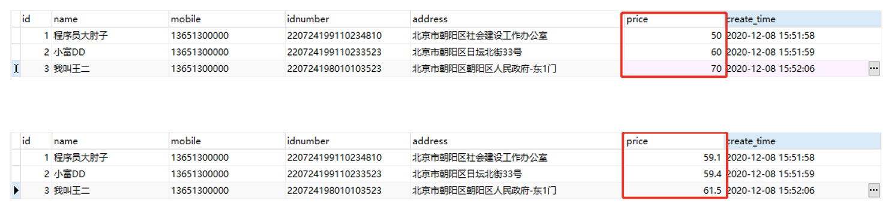
    

- **偏移和取整**：通过随机移位改变数字数据，偏移取整在保持了数据的安全性的同时保证了范围的大致真实性，比之前几种方案更接近真实数据，在大数据分析场景中意义比较大

    

        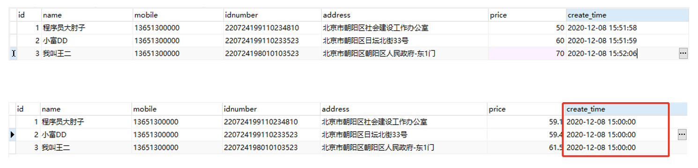
    

---
为了适应不同数据脱敏的应用场景，基于多种数据脱敏方法，我们提供多个数据脱敏算法以满足不同数据脱敏标准：

- **遮蔽脱敏**：对数据的全部或者一部分用符号替换
- **一致性脱敏**：原始数据的关联关系在进行数据脱敏后也能保持
- **保持数据格式脱敏**：保留数据的主要格式
- **保持数据特征脱敏**：保留数据的主要特征
- **泛化脱敏**：保留原始数据局部特征的前提下使用其他方式替代原始数据的方式
- **可逆性脱敏**：脱敏后数据可以使用对应表，对数据进行恢复操作，从脱敏数据可以获取原始数据

数据脱敏的整体架构图如下所示：

    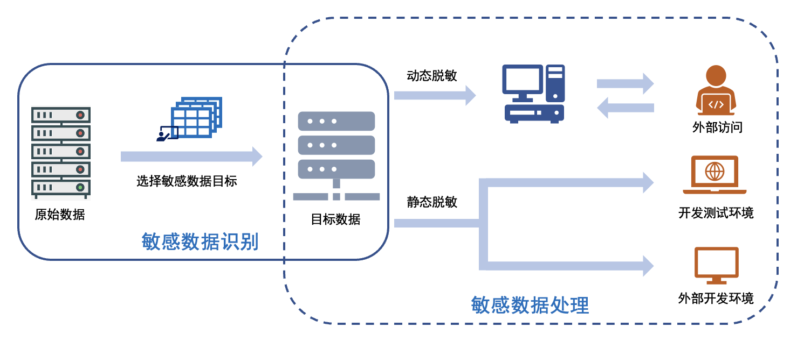

## 差分隐私

**差分隐私**(differential privacy)是一种“隐私”的数学模型，第一次用可证明的数学模型定义了隐私和隐私保护。通过对真实数据添加**随机噪声**进行扰动，实现用户隐私的量化保护。差分隐私具有以下特点：

- **安全性**：随机噪声对真实数据的扰动是差分隐私安全性的来源
- **可用性**：（独立）随机噪声叠加后的相互抵消使得扰动数据的统计结果具有较高准确度

???+ example "例子"

    

        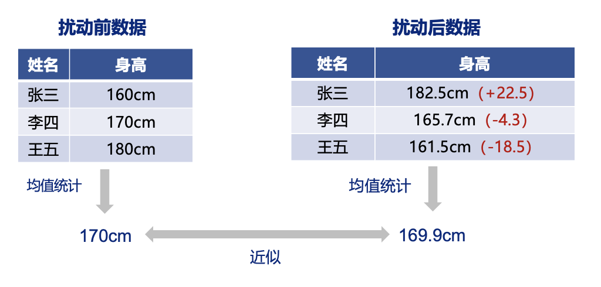
    

差分隐私可分为：

- **全局**差分隐私：可信的数据管理者收集数据并在数据集的统计结果上添加扰动

    

        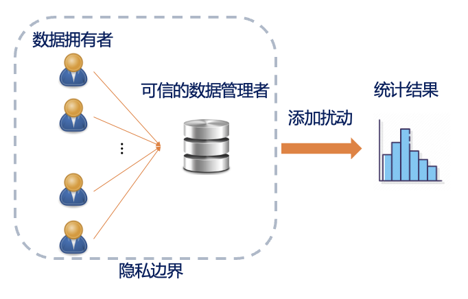
    

- **本地**差分隐私：用户在本地对数据添加扰动后发送给非可信的数据管理者

    

        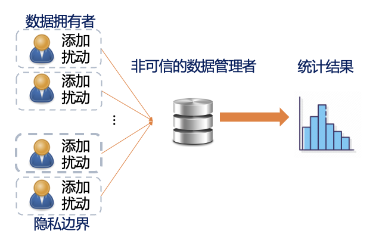
    

差分隐私的组合性：

- **顺序组合**

    

        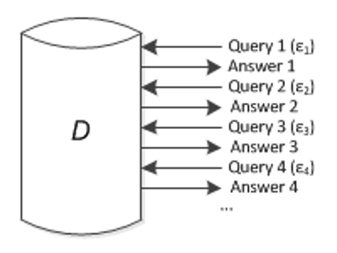
    

- **并行组合**

    

        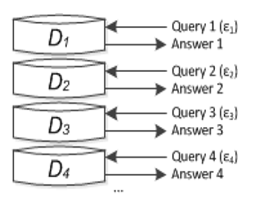
    

??? question "为什么是差分隐私？"

    - 功能需求：加密方法解决数据计算过程中的隐私泄露，差分隐私解决计算结果的隐私泄露。
    - 性能需求：在海量数据收集的场景中，加密方法计算开销过大。
    - 风控需求：企业需要一种“一劳永逸”的用户数据脱敏方法，即在数据收集后，存储、处理、分析阶段不需要额外的用户隐私保护措施，从而有效控制风险责任。

???+ bug "隐私困境"

    假如我们根据一份 HIV 感染者的数据集绘制对应的直方图：

    

        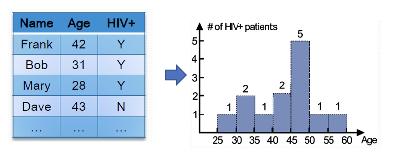
    

    假如新增一条记录，那么该记录也会导致直方图的变化，而且从直方图的变化中可以看出新增记录的一些信息。

    

        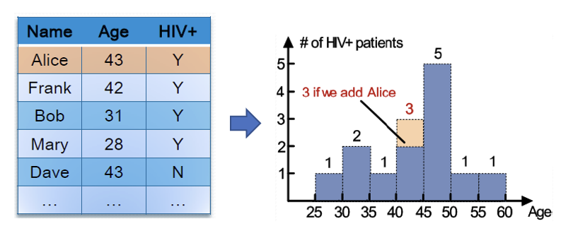
    

    这样的话 Alice（新增记录）的个人隐私就被暴露了。我们希望在从直方图中获取有用统计信息的时候不要知道个人信息，也就是说让统计结果在输入层面无法被区分出来。

对于上面的例子，用了差分隐私后，即使新增了 Alice 这条记录，我们也无法从直方图的变化中看出这一新信息。

    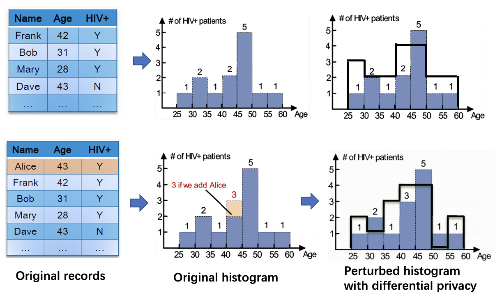

下面正式介绍差分隐私的定义（来自 Dwork ICALP 2006）：

对于每对仅有一行不同的输入：

    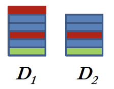

对于每个输出：

    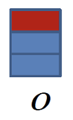

 

对方不应该基于输出 $O$ 辨别出 $D_1$ 和 $D_2$，因此需要满足：

$$
\log\Big(\dfrac{\text{Pr}[A(D_1) = O]}{\text{Pr}[A(D_2) = O]}\Big) < \varepsilon\ (\varepsilon > 0)
$$

???+ question "思考"

    === "思考1"

        === "问题"

            为何这2份数据集仅相差一行？

        === "解答"

            为了模拟单个记录的在与不在。

    === "思考2"

        === "问题"

            为什么要针对*所有的*数据集对？

        === "解答"

            为了保证无论哪条记录都满足。

其中 $\varepsilon$ 称为**隐私参数**(privacy parameter)，满足：

$$
\text{Pr}[A(D_1) = O] \le e^{\varepsilon} \text{Pr}[A(D_2) = O]
$$

可以看到，$\varepsilon$ 的作用是控制 $D_1, D_2$ 的区分度。更小的 $\varepsilon$ 能保证更多的隐私（也能得到更好的利用）。

### 拉普拉斯机制

那么如何既不泄露单条数据信息，又保证统计结果逼近真实结果？下面给出一种基于拉普拉斯(Laplace)机制的解决方案：

    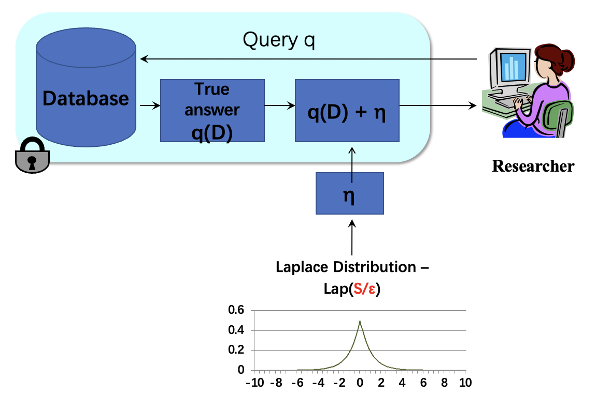

图中的 $\eta$ 就是差分隐私中的随机噪声，它是来自拉普拉斯分布 Lap($S / \varepsilon$) 中的任一取值。

拉普拉斯分布的概率密度函数为：$f(x\ |\ \mu, b) = \dfrac{1}{2b} \exp(-\dfrac{|x - \mu|}{b})$。

- 均值：$\mu$
- 方差：$2 b^2$

概率密度函数曲线图如下所示：

    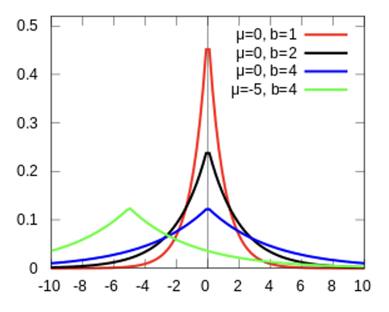

**敏感度**(sensitivity)：考虑一个 $I \rightarrow R$ 的查询 $q$，$\forall$ 相邻的数据表 $D, D'$，敏感度 $S(q)$ 是一个满足下面不等式的最小的数：

$$
|q(D) - q(D')| \le S(q)
$$

!!! theorem "定理"

    如果某个查询的敏感度为 $S$，那么算法 $A(D) = q(D) + \text{Lap}\Big(\dfrac{S(q)}{\varepsilon}\Big)$ 能保证 $\varepsilon-$ 差分隐私。

有了这些知识后，我们可以推导出前面和隐私函数相关的不等式——考虑相邻数据库 $D, D'$，输出 $O$，那么：

$$
\begin{align}
\dfrac{\text{Pr}[A(D) = O]}{\text{Pr}[A(D') = O]} & = \dfrac{\text{Pr}[q(D) + \eta = O]}{\text{Pr}[q(D') + \eta = O]} \notag \\
& = \dfrac{e^{-\frac{|O - q(D)|}{\lambda}}}{e^{-\frac{|O - q(D')|}{\lambda}}} \notag \\
& \le e^{\frac{|q(D) - q(D')|}{\lambda}} \le e^{\frac{S(q)}{\lambda}} = e^{\varepsilon} \notag
\end{align}
$$

???+ example "例子"

    === "例1"

        对于以下计数查询（其中黄色记录表示不存在，所以 D 有 3 个 Y，D' 有 2 个 Y）

        

            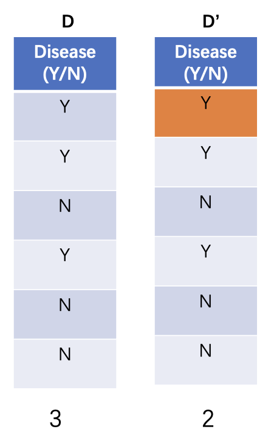
        

        - 敏感度：1
        - 解：3 + $\eta$，其中 $\eta$ 来自 $\text{Lap}\Big(\dfrac{1}{\varepsilon}\Big)$（均值为0，方差为 $\dfrac{2}{\varepsilon^2}$）

    === "例2"

        对于以下求和查询（只考虑 Age 属性，取值范围为 $[p, q]$；并且记准确的查询结果为 $\Sigma$）

        

            
        

        - 敏感度：$q$
        - 解：$\Sigma + \eta$，其中 $\eta$ 来自 $\text{Lap}\Big(\dfrac{q}{\varepsilon}\Big)$

### 应用

差分隐私的部署和使用大多存在于政府机构与互联网巨头。

???+ abstract "差分隐私应用年鉴"

    

        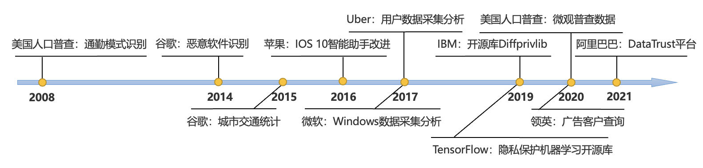
    

???+ example "例子"

    === "例1"

        

            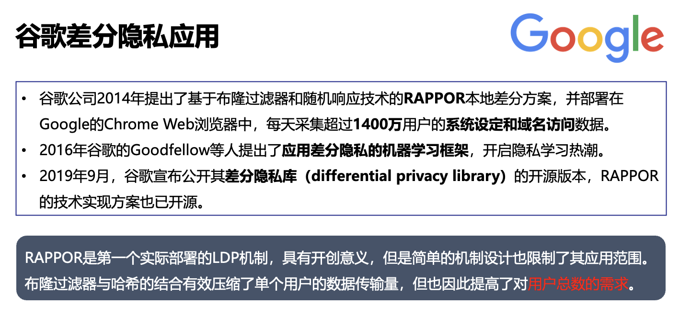
        

    === "例2"

        

            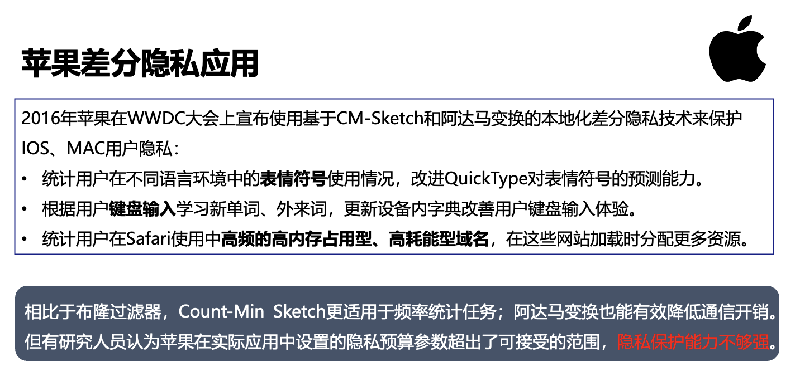
        

    === "例3"

        

            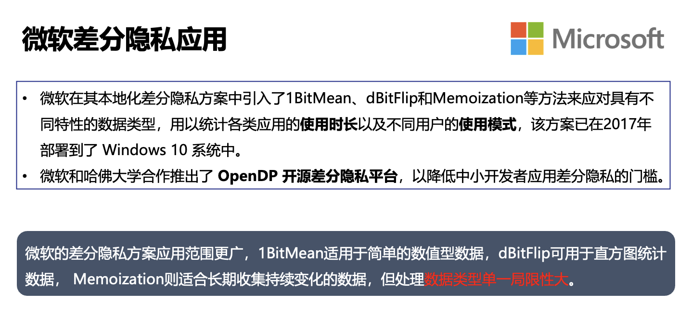
        

## 全同态加密

**全同态加密**(fully homomorphic encryption)：在密文域的操作等效于明文域的对应操作，支持加法和乘法数据操作的同时不泄露任何数据信息，即：

    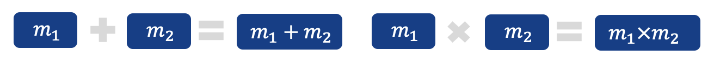

???+ example "简单示例（不考虑安全性和乘法同态性）"

    

        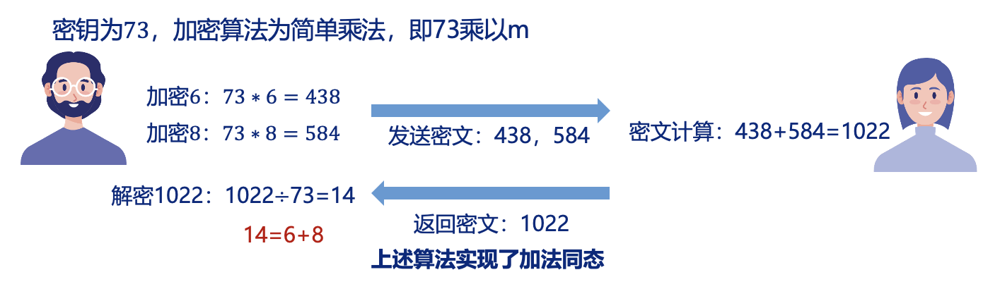
    

全同态加密技术发展：

- 第一代同态加密——Gentry09：首次提出全同态加密算法
- 第二代同态加密——BV11,BGV12：首次基于标准安全假设构造全同态加密
- 第三代同态加密——GSW13：设计了一个基于近似特征向量的全同态加密方案
- 第四代同态加密——CKKS16：支持浮点数同态运算，可应用于联邦学习

技术优势与劣势

- 优势：实现了在密文域上的任意运算，避免运算过程中需要先解密而导致的用户敏感信息泄露，实现了数据的可用不可见
- 劣势：计算成本高

## 零知识证明

**零知识证明**(zero knowledge proof)：**证明者**(prover)能够在不向**验证者**(verifier)提供任何有用的信息的情况下，使验证者相信某个论断是正确的。

???+ example "例子"

    Alice 发现洞穴中某扇魔法门的开门暗号。洞穴呈环形，入口在一侧，对侧则有魔法门隔断。Bob 想知 Alice 是否已知该暗号，但Alice 不希望泄露暗号给 Bob。

    

        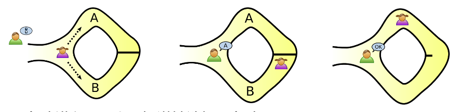
    

    Alice 随机选择一条路进入，Bob 不知道她选择哪条路。

    Bob 进入山洞，随机选择 A 或 B 作为他想让 Alice 返回的路径名称并大喊：

    - 若 Alice 确实知道暗号：在必要时打开门，**永远能**够沿着所需的路径返回
    - 若 Alice 并不知道暗号：仅当 Bob 做出与她所选路径相同的选择时，可按所需路径返回（**50％的机会**）

    重复多次（连续进行 20 次），Alice 若不知道暗号，其成功的机会会越来越小（大约百万分之一）

零知识证明特征：

- **完整性**：诚实的验证者可以相信诚实证明者拥有正确论断
- **可靠性**：不诚实证明者无法说服诚实验证者其拥有正确论断
- **零知识性**：验证者不知道除论断的正确性以外的任何信息

零知识证明技术：

- **交互式零知识证明**：通过证明者和验证者之间的**多轮交互**完成论断的证明
- **简洁非交互式零知识证明（zk-SNARKs）**：
    - 简洁：零知识证明可以**快速验证**
    - 非交互式：证明者和验证者之间只需要交互一次
- **非交互式可扩容透明零知识证明（zk-STARKs）**：
    - 可扩容：验证时间与电路规模呈**亚线性**增长
    - 透明：依赖于**可公开验证**的随机数来生成用于证明和验证的公共参数

!!! recommend "优势"

    - **严格的隐私保护**，通过密码学可证明安全理论实现对用户信息的隐私保护
    - **广泛的应用场景**，包括匿名支付、身份认证、区块链扩容等，未来市场潜力大

!!! bug "劣势"

    - **证明生产成本高**：证明者的时间和空间负责度较高，无法在低算力设备上执行
    - **需要不可证伪假设**：大多数零知识证明技术需要不可证伪假设，例如知识假设
    - **存在量子计算威胁**：部分零知识证明使用双线性曲线群，量子计算机可以打破其安全模型

实用化挑战：

- 性能优化：优化执行引擎，改进算法和电路，实现线性证明者执行时间
- 硬件加速：设计新型基于硬件（GPU、ASIC）加速的安全零知识证明方案
- 零知识证明编译器：开发高兼容性零知识证明编译器，包括高级开发框架、布尔电路、R1CS编译器

## 数据合规

>~~背景就跳过了~~

### 技术

- 数据安全技术快速发展，为业务带来了机遇和挑战
- 技术创新推动合规加速进入数字化转型的快车道
- 创新工具与系统应用赋能数据要素合规

合规工具是数字化转型的关键。技术创新配合良好易用的工具可以极大提升作业的工作效率和质量，使人员摆脱大量简单烦琐的重复性劳动，更加聚焦于高级作业和核心价值创造。

- 不断优化数据分析工具，建立全流程易学易用的可视化平台
- 高度封装各类专业工具，降低人员学习和使用门槛
- 利用RPA等工具，实现文本、报表和数据的自动批量下载和加工

具体有以下数据要素合规技术：

- OCR、ASR、NLP
- 机器学习、神经网络、深度学习
- 区块链技术

### 平台

平台集人工智能、法律、数据安全于一体，提供个人信息保护合规的一站式解决方案，有效解决合规业务“最后一公里”问题。

    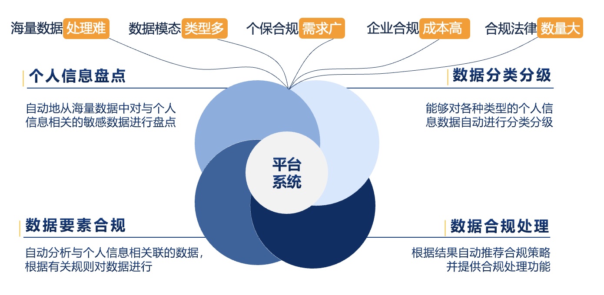

    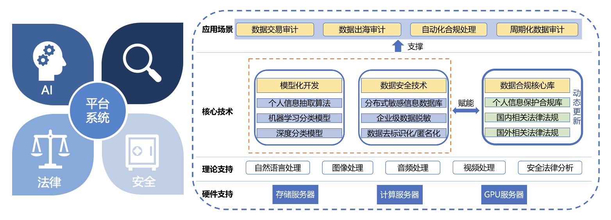

具体应用有：

- 数据市场
- 人机交互
- 医疗服务
- 数据出海
- 内部合规

### 展望

人工智能、智能物联网与量子技术的出现，使数据安全技术迎来新的挑战与机遇。

- 人工智能：人工智能在赋能传统安全防御的同时，也放大攻击者的威胁能力
- 智能物联网：智能物联网中万物互联互通，数以亿计的物联网设备存在存在巨大数据安全风险
- 量子计算与通信：量子计算与量子通信的新型计算与通信模式，为数据安全技术带来全新挑战与场景

---
AI 赋能的新型攻击：人工智能被恶意使用创建更复杂精准的自动化攻击，使攻击者可以更快更准地发现防火墙、软件、密码、访问控制等系统漏洞。

- AI 赋能的新型密码破解工具
    - PassGAN 通过训练生成对抗网络，学习人类密码使用习惯并掌握其分布，从而生成更真实准确的密码
    - 提供远超传统暴力破解的密码破解效率，具备强大的密码破解能力
- AI赋能的钓鱼攻击
    - FraudGPT 通过微调生成式语言模型，学习人类邮件撰写习惯并掌握其特征，从而生成看似真实的网络钓鱼电子邮件
    - 生成合乎逻辑且看似可信的欺诈性文本，具备极高欺骗性

---
AI赋能的新型防御：人工智能可以增强防御系统在应对复杂攻击时的防御能力，赋能防御者更准更高效完成威胁检测、入侵检测、渗透测试、智能安全策略制定等防御任务。

- 基于人工智能的流量检测系统（USENIX Sec'22）
    - 利用人工智能学习海量网络流量的统计特征、会话特征、流量上下文信息等关键特征，自动化检测恶意流量
    - 提供面对加密、暗网等复杂流量的大规模、高精度恶意流量检测能力

- 基于人工智能的渗透测试系统（USENIX Sec'22）
    - 利用人工智能将传统渗透测试中的各个攻击测试维度进行智能调度与关联，自动化渗透测试流程
    - 提供远超人工测试的高准确性与高效率，具备高强度、高频次且不间断的测试能力

## 水印

- 声明所有权并防止共享数据的未授权使用
- 基本分为两个阶段：嵌入与检测
- 利用模型效用衡量数据效用（本工作）

||数据|模型|
|:-|:-|:-|
|数据效用|✅|N/A|
|模型效用（准确性）|this work|✅|

    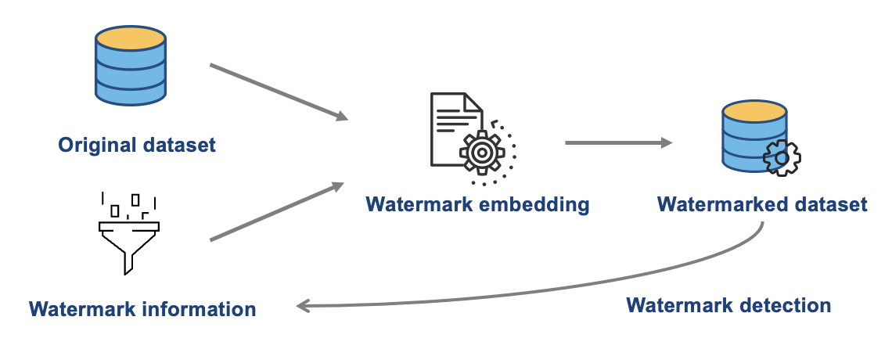

### 水印嵌入

- 将设计好的噪声引入特定小格(cell)
- 噪声范围划分

    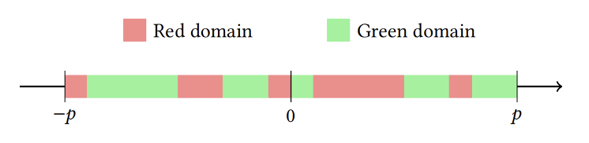

水印嵌入的步骤为：

1. 从所选属性中选择关键单元格 -> 非侵入性(non-intrusive)
2. 对范围进行划分，从绿色区域选择噪声到扰动键单元
3. 对所有关键单元进行扰动后，得到水印后的数据集

???+ example "例子"

    

        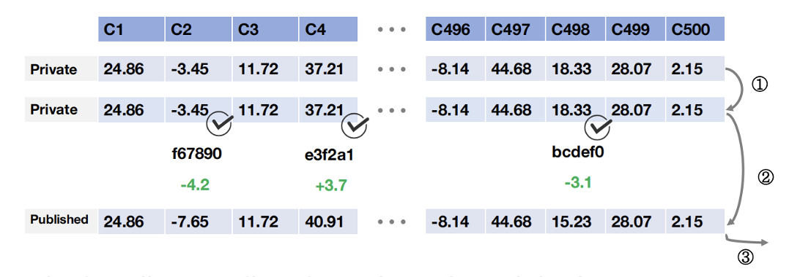
    

    对于分类属性，直接替换原来的属性。

### 水印检测

步骤：

1. 计算这些扰动格的差
2. 恢复噪声域划分
3. 按它们的差对绿色格计数
4. 计算 z-score，并与阈值进行比较

???+ example "例子"

    

        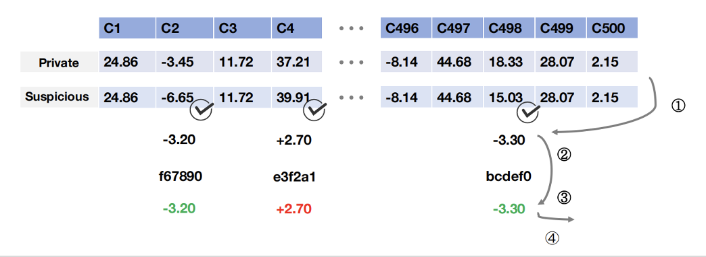
    

