# Lec 3: 非合作博弈论基础

## 微观经济学基础

### 偏好

!!! info "引入"

    你现在要组织一场活动，需要为活动购置一些钥匙扣和本子作为奖品，但你不确定买多少个钥匙扣和本子，这时你的心里会出现这样的声音：

    - 比起 20 个钥匙扣和 5 个本子，我更喜欢 15 个钥匙扣和 10 个本子；
    - 比起 15 个钥匙扣和 10 个本子，我更喜欢 10 个钥匙扣和 15 个本子；
    - ...

    ??? "🧠顿时想到这个（误）"

        

            ルビィちゃん！　何が好き？  
            チョコミント　よりも　あ・な・た・♡  
            歩梦ちゃん！　何が好き？  
            ストロベリーフレイバー　よりも　あ・な・た・♡  
            四季ちゃん！　何が好き？  
            クッキー＆クリーム　よりも　あ・な・た・♡
        

在微观经济学中，我们假定消费者在面临选择时，通常首先会对可选方案进行排序，然后从中选择最喜欢的方案。这种排序就体现了消费者的**偏好**(preference)。

事实上，有了偏好之后，就可以衡量物品的价格了：

- 只需要询问一个诚实的人，例如“你觉得 1 斤苹果和多少钱带给你的偏好是无差异的”，如此就可以得到一个消费者可以接受的价格
- 通过这样的方式，可以为每个消费者的每种消费组合的偏好赋予一个**常数**，这一常数可以表示消费者对一个消费组合的**偏好程度**
    - 例如为 20 个钥匙扣和 5 个本子的组合赋予常数 10，为 15 个钥匙扣和 10 个本子的组合赋予常数 15...

### 效用

这些常数就称为这些消费组合对消费者产生的**效用**(utility)。

形式化而言，记 $\bm{x} = (x_1, \dots, x_n)$ 表示消费者的消费组合（又称消费束），其中 $x_i$ 表示购买 $x_i$ 单位物品 $i$。

效用函数就是将消费束映射到满意程度的函数：

$$
u:\ \mathbb{R}^n \rightarrow \mathbb{R}
$$

- 设 $x$ 是一个消费束，则 $u(x)$ 是一个实数，表示消费者对 $x$ 满意程度
- 如 $u(1 斤苹果，− 6 元钱) = 0$ 表示 1 斤苹果和 6 元钱对消费者无差异
- 要求消费者越满意的消费束对应的效用值越高
- **理性人假设：经济中每个参与人都会选择让自身效用最大化的行动**
- 当然理性还有其它含义，例如使用贝叶斯公式更新信念
    - 理性人假设是经济学的理论研究基础，虽然饱受争议（那为什么仍然要考虑理性人的情况呢）
    - 不理性人的经济学：行为经济学

### 贝叶斯公式

!!! definition "贝叶斯公式"

    设 $B$ 和 $A_1, \dots, A_n$ 为一系列事件，则有：

    $$
    \mathbb{P}(A_k\ |\ B) = \dfrac{\mathbb(A_k, B)}{\mathbb{P}(B)} = \dfrac{\mathbb{P}(B\ |\ A_k) \cdot \mathbb{P}(A_k)}{\sum_{A_i} \mathbb{P}(B\ |\ A_i) \cdot \mathbb{P}(A_i)}
    $$

???+ example "例子"

    === "题目"

        假设一个常规的检测结果的敏感度与可靠度均为 99%，即吸毒者每次检
        测呈阳性的概率为 99%，而不吸毒者每次检测呈阴性的概率为 99%。假
        设某公司对全体雇员进行吸毒检测，己知 0.5% 的雇员吸毒，请问每位检
        测结果呈阳性的雇员吸毒的概率为下面哪个选项

        A. 小于 50%    B. 大于 50%

    === "解答"

        $$
        \begin{align}
        \mathbb{P}(\text{吸毒｜阳性}) & = \dfrac{\mathbb{P}(阳性｜吸毒) \cdot \mathbb{P}(吸毒)}{\mathbb{P}(阳性｜吸毒) \cdot \mathbb{P}(吸毒) + \mathbb{P}(阳性｜不吸毒) \cdot \mathbb{P}(不吸毒)} \notag \\
        & = \dfrac{0.99 * 0.005}{0.99 * 0.005 + 0.01 * 0.995} = 0.3322 \notag
        \end{align}
        $$

### 几类效用函数

- **柯布-道格拉斯效用函数**：$u(x_1, x_2) = x_1^\alpha x_2^{1 - \alpha}$，其中 $\alpha \in (0, 1)$
    - 其中 $\alpha \in (0, 1)$ 表明商品是多多益善的，但具有[边际效用递减](#边际效用递减规律)的特点
        - 可以求 $x_1$ 或 $x_2$ 的偏导数，由于 $\alpha \in (0, 1)$，不难发现得到的偏导数都是递减（二阶导 < 0）
    - 现实中常用的效用函数，也可以表达经济投入-产出关系等
- **冯诺伊曼-摩根斯坦效用函数**：$u(L) = pu(\bm{x}) + (1 - p)u(\bm{y})$
    - 如果有一个彩票 $L$，购买后有 $p$ 的概率获得 $\bm{x}$，有 $1-p$ 的概率获得 $\bm{y}$，那么购买彩票的效用等于购买 $\bm{x}$ 和购买 $\bm{y}$ 的效用的加权平均
    - $u$ 是严格凹函数（二阶导 < 0） -> **风险厌恶**，$u$ 是严格凸函数（二阶导 > 0） -> **风险偏好**，$u$ 是线性函数（二阶导 = 0） -> **风险中性**

    ??? example "例子"

        

            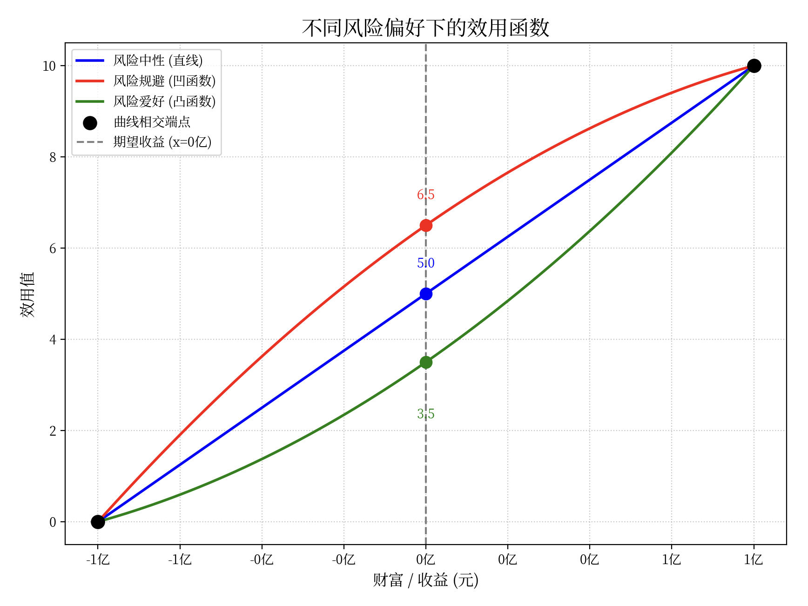
        

        假如有一个赌局，猜对了得1亿元，猜错了倒扣1亿元。

        - 如果某个人是风险厌恶的话，那 ta 对应的效用函数就是红色那条。所以不参加赌局（即 x = 0 时）对 ta 来说的效用会更大。
        - 相反，若另一个人是风险偏好的话，那 ta 对应的效用函数就是绿色那条。所以不参加赌局（即 x = 0 时）对 ta 来说的效用会更小。

- **拟线性效用函数**：$u(\bm{x}, p) = v(\bm{x}) - p$
    - 假定每一元钱的效用是单位 1，则上式表示通过价格 $p$ 购买了消费束 $x$ 后的效用
    - 此前的效用函数都是在描述 $v$ 的形式，这里考虑了价格
    - 日后最常见的效用函数

### 边际效用递减规律

???+ example "例子"

    炎炎夏日，如果你想买一些冰激凌解暑，你可能会思考吃几个冰激凌对你而言最满足，于是你计算了一下大致的效用值如下表：

    

    |数量|1|2|3|4|5|6|
    |:-:|:-:|:-:|:-:|:-:|:-:|:-:|
    |效用|7|12|16|18|15|10|

    

!!! definition "定义"

    **边际效用**是指消费者对某种物品的消费量每增加一单位所增加的额外满足程度。

对于上面的例子，边际效用为：

|数量|1|2|3|4|5|6|
|:-:|:-:|:-:|:-:|:-:|:-:|:-:|
|边际效用|7|5|4|2|-3|-5|

可以看到：

- 在一定时间内，随着消费某种商品数量的不断增加，消费者从中得到的总效用是在增加的，但是以递减的速度增加的，即边际效用是递减的；
- 当商品消费量达到一定程度后，总效用达到最大值，如果继续增加消费，总效用不但不会增加，反而会逐渐减少，此时边际效用变为负数。

### 效用最大化问题

预备工作结束后，可以计算一个效用最大化问题，由此研究消费者决策问题的特点。为简化讨论，考虑只有两个商品的情形：设消费者的效用函数为 $u(x_1, x_2)$，两种商品的价格分别为 $p_1$ 和 $p_2$，消费者的收入为 $p$。

这里强调了消费者的收入，这是因为在消费时消费者都有**预算约束**(budget constraint)，因此效用最大化的目标可以写为：

$$
\begin{align}
\max\limits_{x_1, x_2} & \quad u(x_1, x_2) \notag \\
\text{s.t.} & \quad p_1 x_1 + p_2 x_2 \le p. \notag
\end{align}
$$

要求 $u$ 关于 $x_1, x_2$ 是递增的，则 $u$ 取最大值时预算约束必然取等号。

???+ example "例子"

    === "题目"

        设消费者需求函数为 $u(x_1, x_2) = x_1^\alpha x_2^\beta$，两种商品价格分别为 $p_1$ 和 $p_2$，消费者的收入为 $p$，求消费者的需求函数。

    === "解答"

        写出效用最大化问题：

        $$
        \begin{align}
        \max\limits_{x_1, x_2} & \quad x_1^\alpha x_2^\beta \notag \\
        \text{s.t.} & \quad p_1 x_1 + p_2 x_2 = p. \notag
        \end{align}
        $$

        - 两种解法：利用预算约束化为一元函数极值问题求解，或使用[拉格朗日乘数法](https://en.wikipedia.org/wiki/Lagrange_multiplier)
        - 不难解得

            $$
            x_1 = \dfrac{\alpha}{\alpha + \beta} \dfrac{p}{p_1},\ x_2 = \dfrac{\beta}{\alpha + \beta} \dfrac{p}{p_2}
            $$

        - 注意这里的效用函数没有考虑钱的效用，而是将钱视为约束
        - 不难发现需求与价格之间成反相关关系

### 市场出清

将上述基本思想推广，可以得到一般情况下的消费者需求函数。

!!! definition "需求定律"

    在其他条件不变的情况下，商品的需求量与价格之间成反方向变动的关系，即价格上涨，需求量减少；价格下降，需求量增加。

当然也存在一些例外，例如[吉芬商品](https://en.wikipedia.org/wiki/Giffen_good)，但这里不做讨论。

厂商生产决策与消费者决策是类似的，只是考虑利润最大化/成本最小化问题，可以得到如下供给定律：

!!! definition "供给定律"

    对于正常商品来说，在其他条件不变的情况下，商品价格与需求量之间存在着正方向的变动关系，即一种商品的价格上升时，这种商品的供给量就会增加，相反，价格下降时供给量减少，这就是供给定律。

    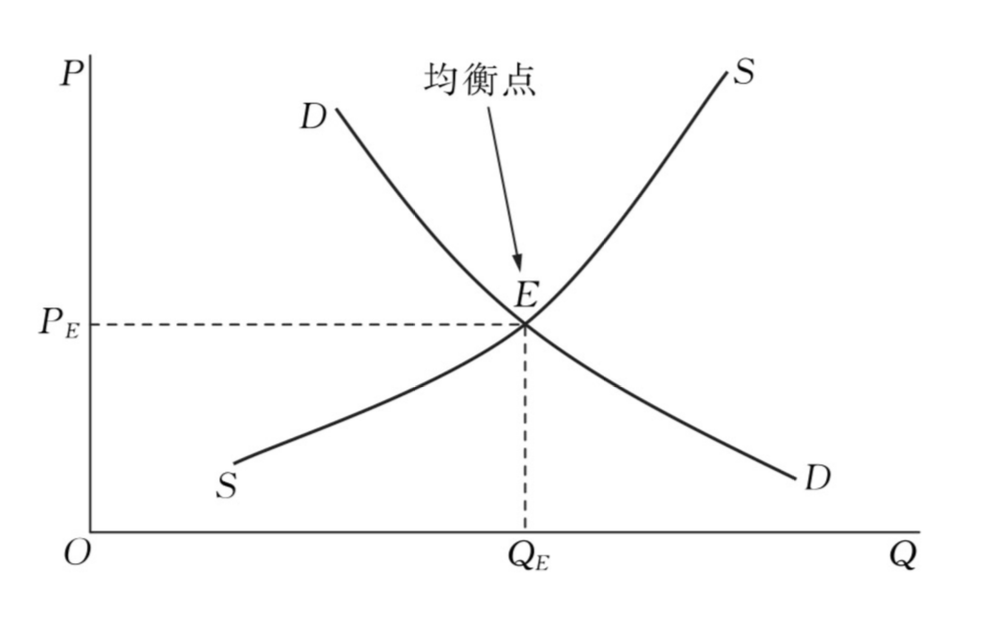

>P: price, Q: quantity, D: demand curve, S: supply curve, E: equilibrium point

**市场出清**(market clearing)：市场机制能够自动地消除超额供给或超额需求，市场在短期内自发地趋于供给等于需求的均衡状态。

上述均衡称为“竞争均衡”，因为其中重要的假设是厂商和消费者数量非常多，以至于他们**每个人各自的行动完全无法改变整个市场的价格**。

- 例如此前效用最大化问题中假设消费者是**价格接受者**

### 社会福利

有了竞争均衡的概念后，我们希望知道这样一个市场能自发达到的均衡有多“好”——这是经济学的重要目标之一，因为经济学是研究资源配置的学科，自然我们希望目前这一市场模型能够达到有效资源配置。

资源配置有效性的主要衡量标准依赖于**福利**(welfare)，因此下面讨论消费者、厂商福利以及市场总福利，或者说社会福利的衡量方法。

    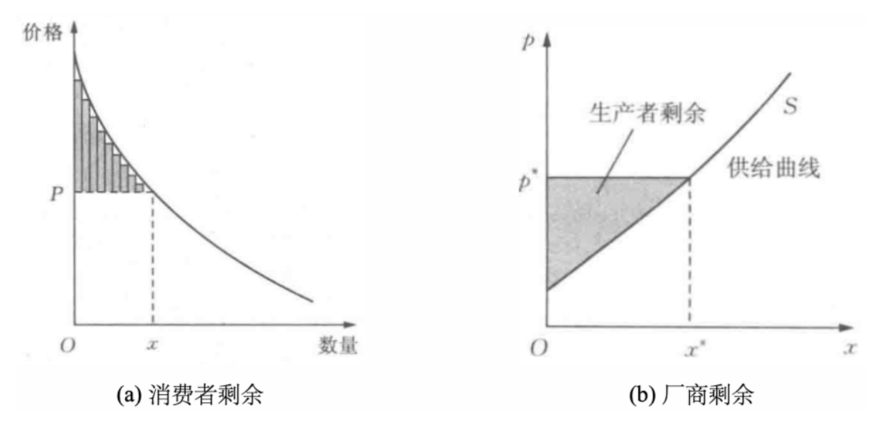

- **消费者剩余 = 买到的商品效用 - 支付**
    - 对应图(a)，支付为 $P$，$x$ 为消费者实际购买的数量，消费者剩余为图中阴影部分
- **厂商剩余 = 出售的收益 - 成本**
    - 对应图(b)，出售的收益为 $p^*$，$x^*$ 为厂商实际销售的数量，厂商剩余为图中阴影部分

社会福利 = 消费者剩余（消费者福利）+ 厂商剩余（厂商福利）

- 消费者剩余和厂商剩余之间的支付被抵消，因此只剩下消费者买到商品的效用 - 厂商成本

    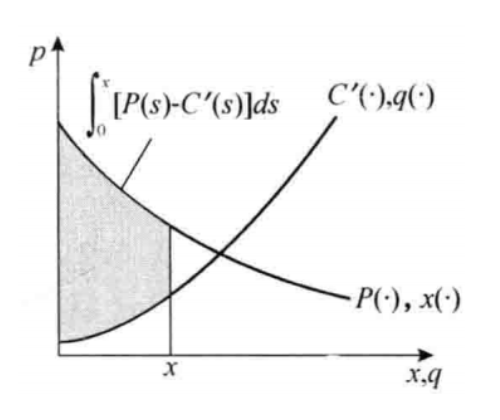

显然在供给曲线和需求曲线相交的位置实现社会福利最大化，这就是福利经济学第一定理的直观结果：

!!! theorem "福利经济学第一定理"

    在竞争市场中，当市场供求达到均衡时，市场资源配置是社会福利最大化的。

### 看不见的手

仔细思考福利经济学第一定理，会发现这一结果的内涵是非常有趣的：竞争均衡建立在市场上每个消费者都追求自身效用最大化，并且每个厂商都追求利润最大化的基础上，是所有人自私的行为结合在一起得到的均衡，最终却实现了有效率的分配。事实上，这一结果就是亚当·斯密在《国富论》中所描述的**看不见的手**(invisible hand)的一个具体体现：

>每个人都试图用应用他的资本，来使其生产品得到最大的价值。一般来说，他并不企图增进公共福利，也不清楚增进的公共福利有多少，他所追求的仅仅是他个人的安乐，个人的利益，但当他这样做的时候，就会有一双看不见的手引导他去达到另一个目标，而这个目标绝不是他所追求的东西。由于追逐他个人的利益，他经常促进了社会利益，其效果比他真正想促进社会效益时所得到的效果为大。  
>
———— 亚当·斯密，《国富论》

### 市场失灵

然而现实并非福利经济学第一定理所说的那般美好，因为福利经济学第一定理成立的**假设非常多**：完全竞争、完全信息、无交易成本、无外部性、无规模经济等，而这些假设在现实中很难实现。在这些条件不满足的时候，就出现了**市场失灵**(market failure)。

#### 垄断

**垄断**(monopoly)：一个产品只有一家厂商生产，故该厂商具有市场势力，自身可以决定产品价格，从而会破坏完全竞争市场的福利最优性。

**垄断厂商会通过提高价格攫取更多的消费者剩余**。

#### 外部性

**外部性**(externalities)：一个人或一群人的行动和决策使另一个人或一群人受损或受益的情况，即社会成员从事经济活动时其成本与后果不完全由该行为人承担。

- 例如河流上游工业园区，下游渔场，工业园区排污会影响渔场的生产活动（**负外部性**）
- 例如植树造林不仅美化了环境，还为周围居民提供了清新的空气和休闲场所（**正外部性**）
- 植树造林的本质是提供**公共物品**(public goods)，即能够被所有人得到的物品或服务，**任何人都不能因为自己的消费而排除他人对该物品的消费（非排他性）**，类似的例子还有电信、电力、自来水等。公共物品的提供通常会带来正外部性。
    - 但也存在问题：公地悲剧
    - 产权问题/政府监管

#### 信息不对称

目前为止几乎所有的讨论都忽视了信息问题：

- 在完全竞争市场中，暗含着假定厂商的成本函数在不同厂商之间是已知的，厂商对消费者的需求曲线也是已知的，消费者对厂商生产的产品带给自己的效用在购买前也是已知的。
- 然而在现实世界中，这些信息通常是不完全的，厂商的成本函数在一些情况下甚至是商业机密，因此不同厂商拥有的成本信息是不同的；对一些新的产品，厂商并不能准确判断市场对其的需求；消费者很多时候也要通过 “货比三家” 的方式来选择最适合自己的产品。
- 这些问题都是**信息不对称**(asymmetric information)的例子，接下来我们将看到，信息不对称会给资源的有效配置带来很多挑战。

乔治·阿克洛夫(George Akerlof）)提出“**柠檬市场**(The Market for Lemons)”的概念。“柠檬” 在美国俚语中表示 “次品”或 “不中用的东西”，所以柠檬市场也称次品市场。

???+ example "例子"

    - 考虑二手车市场，假设市场上有 100 个人在出售二手汽车，还有一系列消费者想要购买二手汽车。已知这些汽车中有 50 辆是好货，还有 50 辆是次货。
    - 每辆车的卖家知道它的质量，但买家不清楚且很难直接区分具体某辆车是好货还是次货（信息不对称）。
    - 次货卖家希望能卖 2000 美元，买家最高支付意愿为 2400 美元。
    - 好货卖家希望能卖 3000 美元，买家最高支付意愿为 3600 美元。
    - 信息对称时，买家能区分出好货和次货从而选择自己需要的产品。
    - 但现在买家无法区分，只知道一半的车是好货，一半的车是次货。
        - 因此买家对一辆车支付意愿不会超过 $\dfrac{1}{2} * 2400 + \dfrac{1}{2} * 3600 = 3000$ 元
        - 然而此时好车卖家不愿出售，只能退出市场，留下次货占领整个市场，也就是所谓的“**劣币驱逐良币**”
        - 显然这样的市场降低了买卖双方福利，存在市场失灵问题。

    ???+ question "思考"

        === "问题"

            这一市场失灵问题可以如何解决？

        === "解答"

            - 监管？
                - 成本太高！
                - 寻租（~~贿赂~~）
            - 广告？
                - 前提是广告是真实的
            - 看卖家提供多久的保修
                - 好货卖家一般能提供更长时间的保修

类似的例子还有：

- 保险中的**逆向选择**和**道德风险**问题
- **斯宾塞(Michael Spence)劳动力市场模型**
- 阿克洛夫、斯宾塞和斯蒂格利茨（Joseph Stiglitz，贡献在于信息甄别）共同获得 2001 年诺贝尔经济学奖

### 数据的特性

- **卖家垄断**：例如 X，Meta，Google 等平台拥有大量自己独特的用户数据，因此具有垄断势力
- **零成本复制性**：
    - 最直接的一点是，供给曲线失效
    - 外部性：例如你的竞争厂家购买了某份利于提高产量的重要数据，但你没有买，尽管你没有参与市场，但你的利润可能会受到影响；**零成本复制使得数据出售更容易，人们更容易受到外部性的影响**
    - 公共物品：数据产权问题（类似于创新、专利）；尊重数据劳动成本

结合垄断和零成本复制性，数据定价可以类比其它信息产品（由比特构成的产品，通常具有零成本复制性），如软件、操作系统、话费等，结合垄断定价可以实施**价格歧视**(price discrimination)：

- 一级（完全）价格歧视：厂商完全掌握消费者偏好，**将每个消费者的价格定在其最大支付意愿上**，完全攫取消费者剩余
- 三级价格歧视：根据消费者一些特征，如年龄、性别、地域等，**对不同消费者群体收取不同价格**（大数据杀熟，学生半价）
- 二级价格歧视：先前的思路是收集消费者的信息做出个性化定价，而二级价格歧视是**按不同的价格出售不同数量的商品**，但购买相同数量产品的人都支付相同的价格；
    - 一种最简单的形式就是，大客户购买的数量比普通客户多，因此可以享受到更低的价格（例如话费）
    - 更巧妙的策略是设计一系列产品的特定组合，使得不同消费者**根据自己的需求选择不同的组合（信息甄别）**，从而提升整体销量和利润，如机票的商务舱/经济舱，Windows 专业版/家庭版（**版本化**）等

---
- **效用不确定性（信息不对称）**：
    - **买家确定数据的效用，但卖家不确定买家认为的效用**：可能因为买家的下游任务保密，此时需要通过信息显示或甄别的方式解决
    - **卖家知道数据的价值，但买家本身不确定数据效用**：买家没看到数据内容前不确定数据质量，可以通过免费试用、打广告（贝叶斯劝说）等方式解决
    - **买家和卖家都不确定数据的效用**：结合以上二者，卖家不清楚买家下游任务，买家没看到数据内容前不确定数据质量

以上问题的解决都将求助于新的研究范式，即基于**博弈论**的研究范式。

## 博弈论：引入与基本概念

### 引入

- **微观经济学主要关注个人最大化自身效用的单人决策问题**，例如消费者最大化效用、厂商最大化利润问题等
    - 完全竞争市场中，消费者无需考虑厂商行动，厂商无需考虑消费者乃至其他厂商行动，就能同时达到自身效用最大化和福利最大化
- 然而**现实中很多场景下每个人的决策会互相影响**，从数学表达式来看，从单人决策到多人相关决策实际上就是从

    $$
    \max\limits_{x \in X} u(x)
    $$
    变为了

    $$
    \max\limits_{x_i \in X_i} u(x_i, x_{-i})
    $$
    其中 $X$ 和 $X_i$ 表示决策者的可选决策，$x_{-i} = (x_1, \dots, x_{i-1}, x_{i+1}, \dots, x_n)$ 表示除 $i$ 之外的其他人的决策，这在博弈论中是常用的记号。

- 显然，多人决策下每个人的最优决策都与其他人的最优决策相互交织，因此引入了相当的复杂性，下面通过几个例子来简单体会这一点。

???+ example "例子"

    === "例1：垄断与寡头"

        === "思考1"

            假设你是一个书店老板，你的书店是某个小镇上唯一的书店，每本书的成本为 20 元。你知道每个顾客只要书的价格不超过 200 元就会买，那么你的决策是什么？

        === "回答"

            

                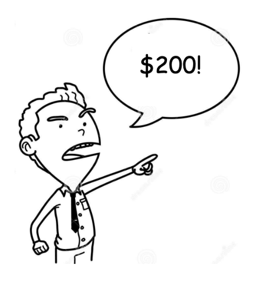
            

            这一情况下只有一个厂商，也就是此前提到的[**垄断**](#垄断)的情况。

        ---
        === "思考2"

            但如果现在小镇上突然开起了另一个书店，并且每本书的成本也为 20 元，那么你们的决策是什么？

        === "回答"

            

                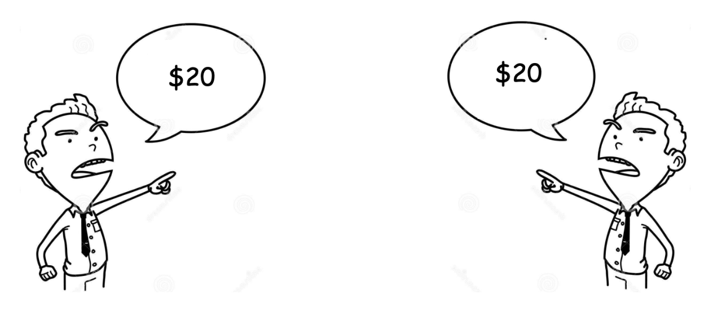
            

            - 此时有两个厂商，属于**寡头垄断**(oligopoly)，少数几个厂商的情况都属于寡头垄断
            - 上述竞争是**价格**竞争，称为**伯川德竞争**(Bertrand competition)，此时两个厂商的最优策略是定价等于成本
            - 后续还会介绍**产量**竞争场景，称为**古诺竞争**(Cournot competition)

        ---
        - 总结：垄断和寡头垄断下，厂商都具有市场势力，但垄断厂商做决策只需要考虑消费者需求，而寡头垄断厂商则需要考虑其他寡头策略
        - 价格竞争导致利润降为 0，这样的结果双方都很难接受。因此你可以和对方达成协议，共同提高价格，这样双方都能获得正的利润
            - 然而这样的行为可能会被视为垄断协议，两家书店构成了[**卡特尔**](https://en.wikipedia.org/wiki/Cartel)(cartel)，这是一种违反反垄断法的行为
        - 但这并不是故事的结局。如果有一天你的好朋友开了一家印刷厂，他可以让你的成本降低到 15 元，结局会如何呢？
            - 显然，你可以将价格定在 19.99 美元，从而将对方挤出市场，而你的利润则会变为 4.99 美元
            - 总而言之：多人决策的情况复杂性更高

    === "例2：一个游戏"

        === "描述"

            每个同学代表世界上的一个国家，每位同学代表的国家之间可以互通贸易。为了保护本国产业，或控制贸易逆差，每位同学可以设置一个关税。

            - 如果你和其他同学都设置低关税，则你们的效用均为 10
            - 如果一方设置高关税，另一方设置低关税，则设置高关税的一方效用为 15，设置低关税的一方效用为 0
            - 如果你和其他同学都设置高关税，则你们的效用均为 5

            你会选择设置高关税还是低关税？

            

                
            

        === "分析：囚徒困境"

            可以将上述博弈写成如下形式：

            

                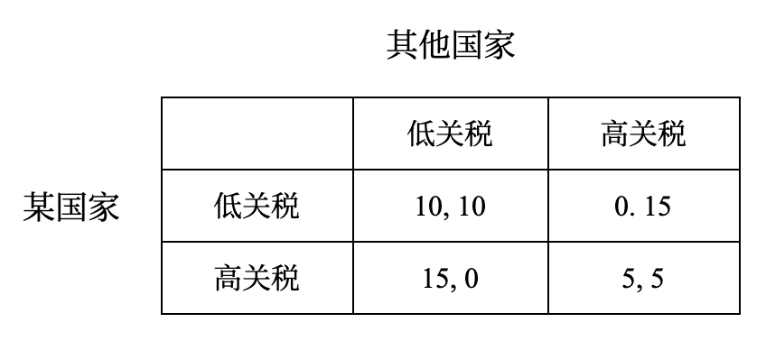
            
 

            再看传统的囚徒困境：一个犯罪团伙的两名成员1和2被捕，他们在两个独立的房间里接受审问，无法互相通信。他们可以选择承认或不承认罪行，对应的结果如下。由此不难发现，两个问题本质上是一致的。

            

                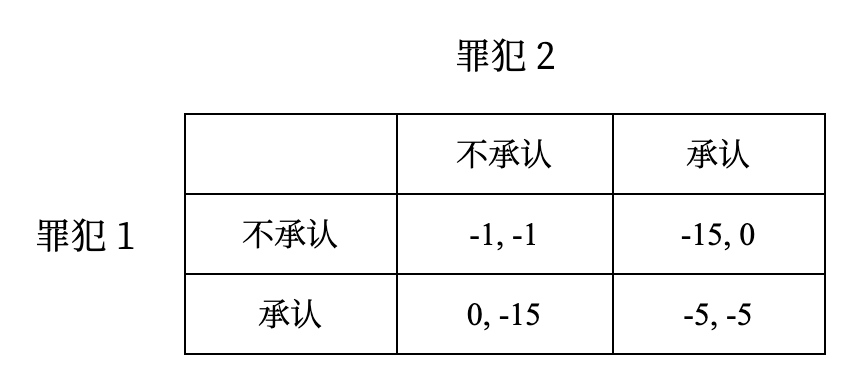
            
 

### 博弈的表达

博弈问题的**基本要素**？总而言之，是指多个人的交互决策

- 多个人进行决策
- 博弈的行为相互影响

如何规范地表达囚徒困境？

!!! definition "定义"

    博弈可被表达为一个三元组 $G = (N, (S_i)_{i \in N}, (u_i)_{i \in N})$，其中

    - **参与人**(player)集合：$N$，参与人记为 $i \in N$
    - 每个参与者可以选择的**策略**(strategy)集合：$S_i$
    - **报酬函数**(payoff function)：$u_i\ :\ S_1 \times \dots \times S_n \rightarrow \mathbb{R}$

???+ example "例子"

    在囚徒困境中：

    - $N = \{罪犯 1，罪犯 2\}$
    - $S_1 = S_2 = \{承认，不承认\}$
    - $u_1, u_2$ 可通过上例的表格给出，如 $u_1(承认，承认) = -5$

- 上述博弈表达称为**策略式博弈**(strategic game)，更为复杂的博弈（扩展式、不完全信息）还会有其它描述的要素
- 要求博弈的参与人是**理性且智能的**：
    - 理性人假设在微观经济学中已经介绍，即参与人会选择最大化自身效用的行动
    - 智能人假设参与人有能力分析博弈的全局
    - 例如在竞争市场中，只要求是理性人，因为只需要最大化自身效用，并不要求对市场的全局有深刻的认识
- 参与人理性、智能是**共同知识**：我知道你知道我知道你知道...

### 博弈论

总而言之，**博弈论**(game theory)可以被定义为对智能的理性决策者之间冲突与合作的数学模型研究：

- 博弈论为分析那些涉及两个或更多个参与者且其决策会影响相互间福利水平的情况提供了一般性的数学方法
- 近代博弈论始于 [Zermelo](https://en.wikipedia.org/wiki/Ernst_Zermelo)、[Borel](https://en.wikipedia.org/wiki/%C3%89mile_Borel)、[Von Neumann](https://en.wikipedia.org/wiki/John_von_Neumann)、[Morgenstern](https://en.wikipedia.org/wiki/Oskar_Morgenstern) 等人的工作
- 人类对于如何设计物理系统来控制自然物质已经懂得许多，但对于如何建立社会体制来调节面临冲突的人类行为却做得不够

### 博弈的解

博弈论的核心：给定一个博弈，关于 “将会发生什么，我们能说些什么”。这一问题有至少三种不同可能的解释：

- **经验的、描述性的**解释：在给定的博弈中，参与人如何展开博弈
- **规范的**解释：在给定的博弈中，参与人 “应该” 如何展开博弈
- **理论的**解释：假定参与人的行为是 “合理的” 或 “理性的”，那么我们能推测出什么

第一种解释涉及对参与人实际行为的观察，偏向于心理学与行为经济学的领域；第二种解释适用于仲裁者、立法者等，他们需要根据商定的原则（如公正、效率等）决定博弈的结果；第三种解释则是通过理论方法预期一个博弈的合理结果。

!!! definition "定义"

    博弈的解或**解概念**(solution concept)是对于一个博弈的一种预期结果，通常是一个策略组合，即参与人的行动选择，或收益的分配结果。

### 博弈论的分类

博弈论无处不在：

- 扑克、国际象棋、围棋等游戏
- 广告拍卖、频谱拍卖、价格竞争、讨价还价
- 政策制定、国家治理、选举
- 国家安全、国际关系

博弈论的分类有：

- **非合作博弈**：参与人之间没有合作，选择行动之后效用是各自的效用，与他人无关
    - 分类依据一：**是否完全信息**，即参与人之间是否互相知道对方的效用函数，是否知道博弈的全局信息
    - 分类依据二：**静态博弈**或**动态博弈**，即参与人的行动是一次同时完成的，还是序贯进行的
        - 在两个互相看不见的房子里进行石头剪刀布，不要求同时完成，但是行动的先后不会影响结果，因此是静态博弈
    - 四大类博弈：
        - 完全信息静态博弈（如囚徒困境）
        - 完全信息动态博弈（如价格领袖模型）
        - 不完全信息静态博弈（如拍卖）
        - 不完全信息动态博弈（如扑克牌）

- **合作博弈**：考虑参与人之间合作后产生的联合效用
    - 重点关注如何分配联合效用，有很多的解概念（收益分配方式）
    - 博弈规范解释的应用（公平分配）
    - 目前广泛应用于数据估值（在[下一讲](4.md)中介绍）

## 占优策略均衡

???+ example "囚徒困境的分析"

    继续囚徒困境的例子，一个犯罪团伙的两名成员 1 和 2 被捕，他们在两个独立的房间里接受审问，他们之间无法通信：

    

        
    
 

    理性的参与者会观察到：

    - 罪犯 1 发现，无论对方选择承认或不承认，自己选择承认都会比不承认效用更高
    - 罪犯 2 发现，无论对方选择承认或不承认，自己选择承认都会比不承认效用更高
    - 这时我们说不承认是一个**严格劣策略**(strictly dominated strategy)，即无论对方选择什么，自己选择这个策略都是最差的

### 严格占优

称不承认是一个**严格劣策略**(strictly dominated strategy)，即无论对方选择什么，自己选择这个策略都是最差的。

!!! definition "定义"

    给定参与人 $i$ 的策略 $s_i$，如果他有另一个策略 $t_i$，使得对于任意的 $s_{-i} \in S_{-i}$，都有

    $$
    u_i(t_i, s_{-i}) > u_i(s_i, s_{-i})
    $$
    则称 $s_i$ 是参与人 $i$ 的一个**严格劣策略**(strictly dominated strategy)。此时称 $s_i$ 被 $t_i$ **严格占优**(strictly dominated)，或者说 $t_i$ **严格占优于**(strictly dominates) $s_i$。

• 博弈论中假定，理性人不会选择严格劣策略，这并不是一个很强的假设，是符合常识的
• 在博弈论中，参与人是理性的是共同知识
• 因此囚徒困境的解（**占优策略均衡**）是（承认，承认）

---
囚徒困境的结果看起来有些不合理？

1. 为什么两个人不会选择更好的点？（理性人的假设）
2. 现实中两个人选择合作，原因可能是什么？（现实中存在更复杂的因素影响效用）

**囚徒困境本质：出于个人理性的决策无法达到社会最优。**

在完全竞争市场中，每个理性人的自私行为最终会导致整个市场的效率最大化，然而囚徒困境的例子表明现实不可能总是如此美好，人们总要为自己的自私行为付出代价。

**囚徒困境的例子**：公地悲剧、内卷、关税战、小组作业拖 ddl...（N 人博弈，不止双人）

**解决囚徒困境**：强制力、机制设计、长期关系...

### 重复剔除严格劣策略

博弈论研究的目标之一就是希望拿到一个博弈就能分析清楚其应有的结果，现在有了占优这一工具，我们可以针对部分问题达成目标。

???+ example "例子"

    

        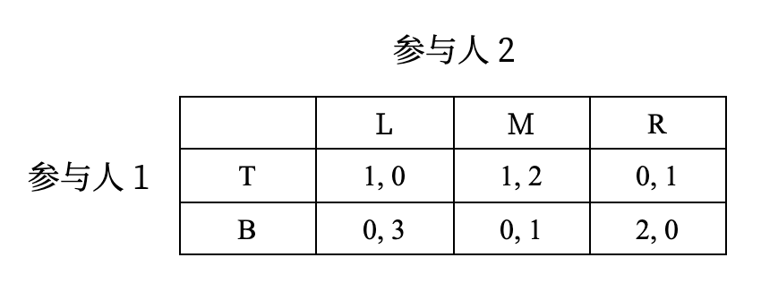
    
 

    利用囚徒困境的思想，不难验证，对于参与人 2，策略 $R$ 被策略 $M$ 严格占优，因此我们可以 剔除策略 $R$，得到新的博弈：

    

        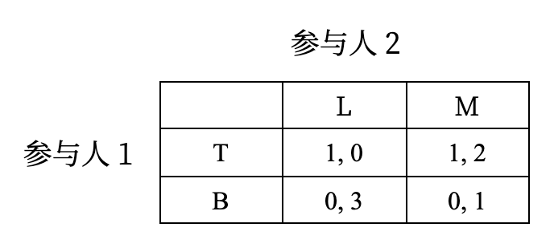
    
 

    进一步地，对于参与人 1，策略 $B$ 被策略 $T$ 严格占优，因此我们可以剔除策略 $B$，得到如下博弈：

    

        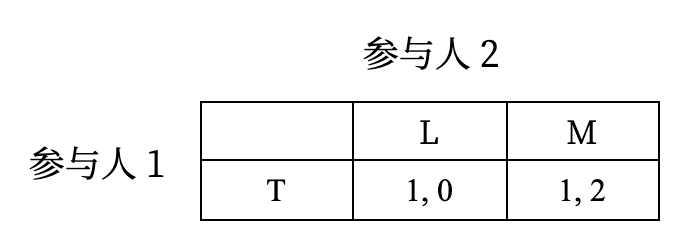
    
 

    最后对于参与人 2，$L$ 被 $M$ 严格占优，因此最终的解（占优策略均衡）是 $(T, M)$。以上过程每一步都剔除一个被占优的策略，故整个过程被称为重复剔除劣策略。

### 弱占优

有的博弈没有严格劣策略，例如：

    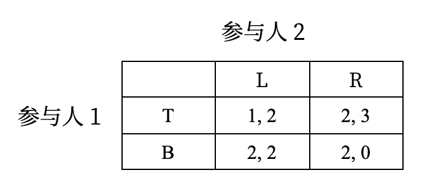

 

尽管没有严格劣策略，但策略 $B$ 确实有特殊之处：

- 和策略 $T$ 相比，$B$ 虽然不能总是给出更好的结果，但至少不会更差
- 并且在参与人 2 选择 $L$ 时，策略 $B$ 会给出更好的结果

这种情况下，我们称策略 $B$ **弱占优于**(weakly dominates)策略 $T$

!!! definition "定义"

    给定参与人 $i$ 的策略 $s_i$，如果他有另一个策略 $t_i$，满足如下两个条件：

    - $\forall\ s_{-i} \in S_{-i}$，都有 $u_i(t_i, s_{-i}) \ge u_i(s_i, s_{-i})$
    - 至少存在一个 $s_{-i} \in S_{-i}$，使得 $u_i(t_i, s_{-i}) > u_i(s_i, s_{-i})$

    则称 $s_i$ 是参与人 $i$ 的一个弱劣策略(weakly dominated strategy)。此时我们称 $s_i$ 被 $t_i$ 弱占优(weakly dominated)，或者说 $t_i$ 弱占优于(weakly dominates) $s_i$。

- 一般而言，除非强调严格占优，否则默认占优是指弱占优
    - 理性参与人不会使用（弱）劣策略
    - 可以用于重复剔除劣策略寻找博弈的解，但是比严格劣策略的版本对理性的要求更强
    - 颤抖的手原则：考虑列参与人分别以 $x$ 和 $1 - x$ 的概率选择 $L$ 和 $R$（$0 < x < 1$），那么行参与人会选择 $B$，因为 $T$ 的期望效用是 $x + 2(1 - x)$，而 $B$ 的期望效用是 $2$。

重复剔除劣策略的过程中如果只有严格劣策略，那么结果不依赖于剔除的顺序。

??? proof "证明"

    >证明由 Gemini 2.5 pro 提供。

    本证明采用反证法（Proof by Contradiction），思路清晰且严谨。

    **核心论点：** 如果一个策略在某个剔除顺序中幸存下来，那么它不可能在另一个剔除顺序中被剔除。

    1.  **建立假设：**

        假设定理不成立。也就是说，存在至少两个不同的剔除顺序，我们称之为顺序A和顺序B，它们导致了不同的最终策略集。令这两个幸存策略集分别为 $S_A^\infty$ 和 $S_B^\infty$。

        既然 $S_A^\infty \neq S_B^\infty$，那么必然存在一个策略集比另一个“小”，或者它们互不包含。不失一般性，我们假设 $S_A^\infty$ 中至少有一个策略组合 $s^*$，而这个组合不在 $S_B^\infty$ 中。

    2.  **找到第一个被错误剔除的策略：**

        既然 $s^* \in S_A^\infty$ 但 $s^* \notin S_B^\infty$，这意味着在顺序B的剔除过程中，构成 $s^*$ 的至少一个分量策略被剔除了。

        让我们在顺序B的整个剔除过程中，找到**第一个**被剔除的、但同时又是某个 $S_A^\infty$ 中策略组合（比如 $s^*$）分量的策略。我们把这个策略命名为 $s_i \in S_i$（它是参与人 $i$ 的一个策略），并假设它是在顺序B的第 $k$ 轮被剔除的。

    3.  **分析剔除条件：**

        根据定义，策略 $s_i$ 在第 $k$ 轮被剔除，是因为在第 $k$ 轮开始时所剩下的策略空间（我们称之为 $S_B^k$）中，存在另一个策略 $s'_i$（对于参与人 $i$）严格占优于 $s_i$。这意味着：

        $$u_i(s'_i, s_{-i}) > u_i(s_i, s_{-i})$$

        这个不等式对于**所有**对手当时可选的策略组合 $s_{-i} \in S_{-i, B}^k$ 都成立。

    4.  **关键步骤——连接两个顺序：**

        现在是关键。我们是如何选择 $s_i$ 的？我们选择它的标准是：它是**第一个**在顺序B中被剔除、但却是 $S_A^\infty$ 成员的策略。

        这意味着，在剔除 $s_i$ 的那一刻（第 $k$ 轮），对于任何参与人 $j$（包括 $i$ 自己），所有属于幸存集 $S_A^\infty$ 的策略都还没有在顺序B中被剔除。换句话说，在第 $k$ 轮开始时，幸存策略集 $S_A^\infty$ 仍然完整地包含在当时的策略空间 $S_B^k$ 之中。

        即： $S_A^\infty \subseteq S_B^k$ 。

        这进一步意味着，对手的策略空间 $S_{-i, A}^\infty$ 也被包含在对手当时的策略空间 $S_{-i, B}^k$ 中。

        即： $S_{-i, A}^\infty \subseteq S_{-i, B}^k$ 。

    5.  **导出矛盾：**

        我们在第3步中知道，$s'_i$ 严格占优于 $s_i$ 对于所有 $s_{-i} \in S_{-i, B}^k$ 都成立。

        既然 $S_{-i, A}^\infty$ 是 $S_{-i, B}^k$ 的一个子集，那么上述不等式自然也对所有 $s_{-i} \in S_{-i, A}^\infty$ 成立。

        这意味着，策略 $s_i$ 在 $S_A^\infty$ 这个策略空间里，被策略 $s'_i$ 严格占优了。

        但是，这里有一个问题：$s_i$ 是 $S_A^\infty$ 的成员，而 $S_A^\infty$ 是顺序A剔除过程的**最终幸存集**。根据定义，最终幸存集里不应该包含任何严格劣策略。

        这就产生了一个直接的矛盾：

        * 一方面，$s_i$ 属于最终幸存集 $S_A^\infty$。
        * 另一方面，我们证明了 $s_i$ 在 $S_A^\infty$ 这个环境中是一个严格劣策略。

    6.  **结论：**

        这个矛盾说明我们最初的假设——“存在两个顺序导致不同结果”——是错误的。因此，任何剔除严格劣策略的顺序，都必然会得到相同的最终策略集。

但是剔除弱劣策略的顺序可能会影响结果——请看下面的例子：

???+ example "例子"

    === "问题"

        请找出两种剔除弱劣策略的顺序使得下表所示博弈最终的解不同：

        

            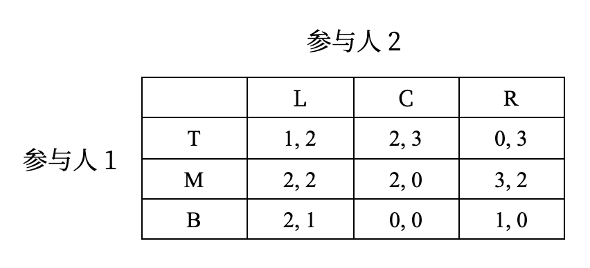
        
 

    === "解答"

        === "可能路径1"

            剔除顺序：T -> R -> C -> B，这样就只剩下 ML 了

        === "可能路径2"

            剔除顺序：T -> C -> B，这样还剩下 ML 和 MR

## 纳什均衡

!!! info "引入"

    并非所有博弈都有占优策略，例如：

    

        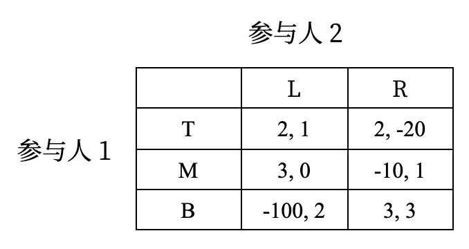
    

    - 可以换一个角度考虑：如果一个参与人已知他人使用的策略，那么他参加的博弈实际上就是要选择一个“最佳应对”
    - 考虑策略组合 $(B, R)$，此时每个人都不愿意单独偏离这一组合，因为 $B$ 和 $R$ 各自是对方的最佳应对
        - 也就是说，如果其它参与人确实根据 $(B, R)$ 选择了策略，那么每个人都不愿意单独偏离这一组合，所以这一策略组合是稳定的

将前述直观转化为严谨的表达：

!!! definition "定义"

    令 $s_{-i}$ 为参与人 $i$ 之外的所有参与人的策略组合，参与人 $i$ 的策略 $s_i$ 是 $s_{-i}$ 的一个**最佳应对**(best response)，如果满足：

    $$
    u_i(s_i, s_{-i}) = \max\limits_{t_i \in S_i}(t_i, s_{-i})
    $$

基于此，可以定义博弈论中最为核心的解概念——纳什均衡：

!!! definition "定义"

    若对于每个参与人 $i$，$s_i^*$ 是 $s_{-i}^*$ 的最佳应对，那么策略组合 $s^* = (s_1^*, \dots, s_n^*)$ 是一个**纳什均衡**(Nash equilibrium)。

基于最优反应的定义通常用于计算纳什均衡，下面这一纳什均衡的等价定义在表达上更为直接：

!!! definition "定义"

    一个策略组合 $s^* = (s_1^*, \dots, s_n^*)$ 是一个**纳什均衡**，如果对于每个参与人 $i$ 和任意的策略 $s_i \in S_i$ 都有 

    $$
    u_i(s^*) \ge u_i(s_i, s_{-i}^*)
    $$

- 如果 $u_i(\widehat{s_i}, s_{-i})$，那么策略 $\widehat{s_i}$ 是参与人 $i$ **有利可图的策略偏离**，因此纳什均衡的策略向量不允许存在有利可图的策略偏离
- 因此纳什均衡的合理性直观就是这一策略组合是“稳定的”
- 通过这一理解可以很容易明白为什么上述定义与此前基于最优反应的定义是等价的

>纳什均衡被冯诺依曼称为 "Another fixed point theorem"。

### 离散策略求解

使用最优反应函数的纳什均衡定义可以非常轻松地求解策略空间离散的情况下的纳什均衡：

???+ example "例子"

    === "题目"

        计算下表所示博弈的纳什均衡：

        

            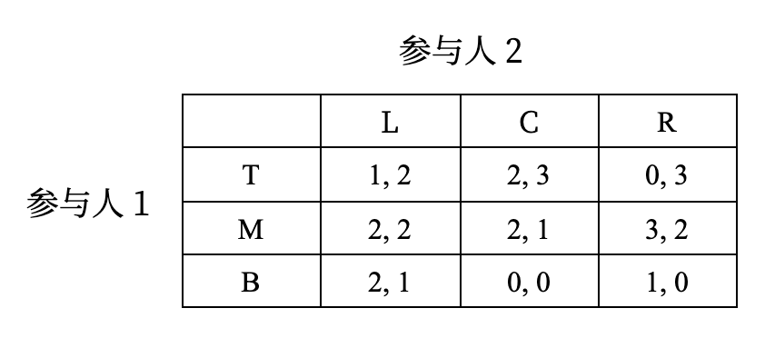
        

    === "解答"

        - 先找出参与人1的最优策略
            - L: M, B
            - C: T, M
            - R: M
        - 再找出参与人2的最优策略
            - T: C, R
            - M: L, R
            - B: L

        同时出现在两个地方的策略就符合纳什均衡：TC, ML, MR, BL

本质上是求解两个人最优反应的交点，此时两个人的策略互为最优反应。

### 连续策略求解：古诺竞争

此前介绍的伯川德竞争是两个寡头进行价格竞争的情况，下面介绍的古诺竞争是两个寡头进行产量竞争的情况。

???+ example "例子"

    === "题目"

        两家制造商 1 和 2 生产相同的产品，在同一市场中竞争潜在的顾客。两家制造商同时选择产量，总产量决定产品的市场价格，市场价格对两家企业而言是相同的。用 $q_1$ 和 $q_2$ 分别表示两家企业的产量，因此 $q_1 + q_2$ 是市场的总产量。假设供给为 $q_1 + q_2$ 时，每件产品的价格为 $2 - q_1 - q_2$。假设两家厂商的单位生产成本分别为正实数 $c_1, c_2$，试求解这一博弈的纳什均衡。

    === "解答"

        博弈定义：两人博弈，每个参与人的策略集合 $[0, +\infty)$，如果参与人 1 选择策略 $q_1$，参与人 2 选择策略 $q_2$，那么参与人 1 的效用（利润）是：

        $$
        u_1(q_1, q_2) = (2 - q_1 - q_2)q_1 - c_1 q_1 = q_1(2 - q_1 - q_2 - c_1)
        $$
        参与人 2 的效用是：

        $$
        u_2(q_1, q_2) = q_2(2 - q_1 - q_2 - c_2)
        $$
        使用最优反应的定义求解纳什均衡，首先求参与人 1 关于 $q_2$ 的最优反应 $R(q_2)$，即将最大化 $u_1(q_1, q_2)$ 的 $q_1$ 定义为 $R(q_2)$：

        $$
        \dfrac{\partial u_1}{\partial q_1} = 2 - 2q_1 - q_2 - c_1 = 0
        $$
        解得：

        $$
        R(q_2) = \dfrac{2 - q_2 - c_1}{2}
        $$
        注意 $u_1(q_1, q_2)$ 关于 $q_1$ 是凹函数，因此一阶条件得到的是最大值点。

        同理对于参与人 2，可以解得：

        $$
        R(q_1) = \dfrac{2 - q_1 - c_2}{2}
        $$
        联立上述方程：

        $$
        \begin{cases}
        q_1^* = \dfrac{2 - q_2^* - c_1}{2} \\
        q_2^* = \dfrac{2 - q_1^* - c_2}{2}
        \end{cases}
        $$

        从而可以解得均衡策略为：

        $$
        q_1^* = \dfrac{2 - 2c_1 + c_2}{3}, q_2^* = \dfrac{2 - 2c_2 + c_1}{3}
        $$
        不难看出，在均衡中，自己的成本越高，均衡产量越低；对方的成本越高，会导致对方均衡产量降低，从而给自己提高产量的机会。因此这一结果是非常符合直观的。

        - **目标不只是解出均衡，而是通过解看出模型是否符合现实，对于现实情况有什么参考价值**。

        均衡求解图示：

        

            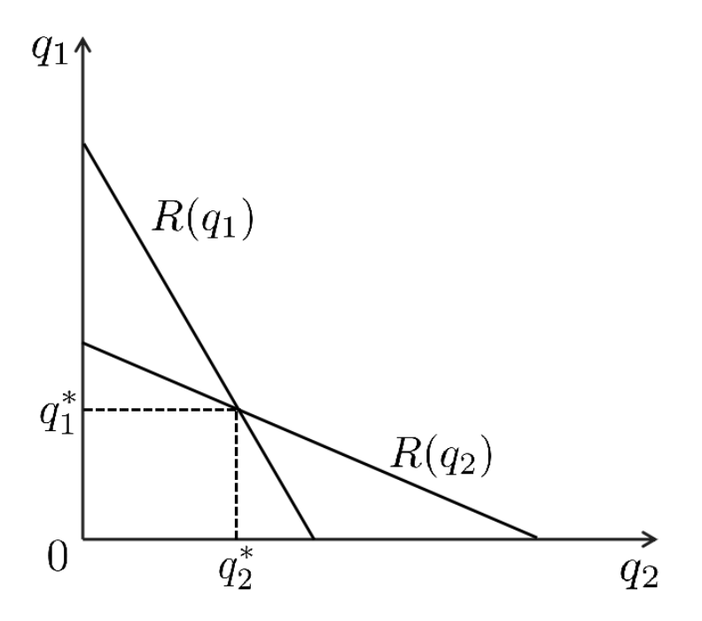
        

???+ question "思考"

    === "问题"

        此前给出的伯川德竞争结果是否构成纳什均衡？是否构成占优策略均衡？

    === "解答"

        - 伯川德竞争的结果（价格等于边际成本）是一个**纳什均衡**，因为在这个点上，任何一方都没有动力单方面改变策略。
        - 但它**通常不被视为占优策略均衡**，因为在伯川德竞争中，企业的最佳策略是相互依赖的，不存在一个无论竞争对手如何选择都始终是最佳的“占优策略”。

### 纳什均衡的意义：协调博弈

???+ question "思考"

    === "思考1"

        两个将军考虑是否要合作进攻，如果两个将军合作进攻，则各自可以领赏，没有进攻则领不到赏，但如果只有一方进攻，则进攻者会输得很惨，这个博弈会走向何方？

        

            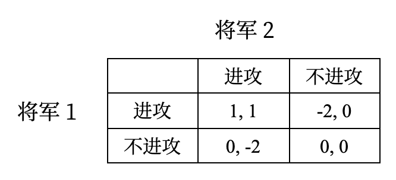
        

    === "思考2"

        如果全班 75% 的同学选择攻击，则攻击成功，参与攻击的获得总评 1 分的加分；否则攻击失败，参与攻击的同学会扣 2 分。你会选择什么？

- 现实往往达不到纳什均衡：需要充分的交流或多次博弈达到稳态或者有一个仲裁者建议（相关均衡），这也是**协调博弈**的意义
- 纳什均衡需要**精炼**：如果博弈存在两个纳什均衡，哪一个更合理？
- 均衡与物种演化也有关联

## 混合策略纳什均衡

!!! info "引入"

    纳什均衡是求解博弈的强大工具。然而很可惜的是，仍然存在相当一部分博弈无法找到纳什均衡，甚至是非常常见的博弈，例如石头剪刀布博弈：

    

        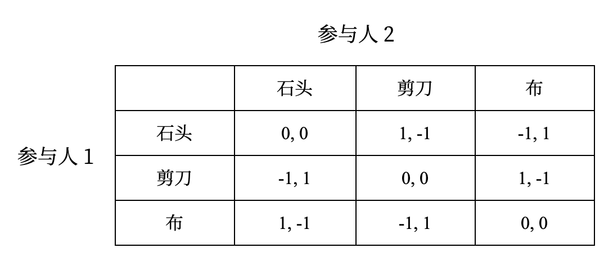
    

    不难验证这个博弈没有纳什均衡——这也符合预期，毕竟石头剪刀布的游戏从来没有一个稳定的策略

    - 考虑简单的情况，例如一个参与人永远出石头，那么另一个人只要观察到这一点，就可以永远出布，这样的情况显然无法构成均衡
    - 所以可以猜想，稳定的策略必定带有随机性，各个参与人要让自己的行为不可捉摸，这就引入了**混合策略**(mixed strategy)的概念

### 混合策略

!!! definition "定义"

    令 $G = (N, (S_i)_{i \in N}, (u_i)_{i \in N})$ 为一个策略型博弈。一个**混合策略**(mixed strategy)是 $S_i$ 上的概率分布，参与人 $i$ 的混合策略集记为：

    $$
    \Sigma_i = \Big\{\sigma_i\ :\ S_i \rightarrow [0, 1]\ :\ \sum\limits_{s_i \in S_i} \sigma_i(s_i) = 1\Big\}
    $$

    其中 $\sigma_i(s_i)$ 表示参与人 $i$ 在该混合策略下选择策略 $s_i$ 的概率。

- 因此混合策略就是给每个 $S_i$ 中的策略（称之为**纯策略**(pure strategy)）一个概率，然后按照这个概率随机选择策略
- 例如在石头剪刀布博弈中，$(\dfrac{1}{3}, \dfrac{1}{3}, \dfrac{1}{3})$ 就是一种混合策略，表示每个纯策略（出石头、剪刀和布）被选择的概率都是 $\dfrac{1}{3}$
- 纯策略是混合策略特例：只有一个策略概率为 1，其余为 0
- 还有一个记号：对每个参与人 $i$，令 $\Delta(S_i)$ 为 $S_i$ 上的概率分布集合，即

    $$
    \Delta(S_i) = \Big\{p\ :\ S_i \rightarrow [0, 1] \:\ \sum\limits_{s_i \in S_i} \sigma_i(s_i) = 1 \Big\}
    $$

    则显然有 $\Sigma_i = \Delta(S_i)$
- 当 $S_i$ 是连续策略空间时，求和需要替换为积分，当然本课程不讨论连续策略空间下的混合策略
- 有混合策略后，博弈中参与人的效用函数也需要做相应的调整，需要适应有混合策略的情况

 
### 博弈的混合扩展

!!! definition "定义"

    令 $G = (N, (S_i)_{i \in N}, (u_i)_{i \in N})$ 为一个策略型博弈。$G$ 的**混合扩展**(mixed extension)是一个博弈：

    $$
    \Gamma = (N, (\Sigma_i)_{i \in N}, (U_i)_{i \in N})
    $$

    其中 $\Sigma_i = \Delta(S_i)$ 是参与人 $i$ 的混合策略集，他的收益函数 $U_i\ :\ \Sigma \rightarrow \mathbb{R}$ 将每个混合策略向量 $\sigma = (\sigma_1, \dots, \sigma_n) \in \Sigma_1 \times \dots \times \Sigma_n$ 映射到一个实数

    $$
    U_i(\sigma) = \mathbb{E}[u_i(\sigma)] = \sum\limits_{s \in S} \prod\limits_{j=1}^n \sigma_j (s_j) u_i (s_1, \dots, s_n)
    $$

- 这里使用了冯诺伊曼-摩根斯坦恩效用函数：每个纯策略 $(s_1, \dots, s_n)$ 出现的概率为 $\prod_{j=1}^n \sigma_j(s_j)$，因此效用的本质是参与人 $i$ 在混合策略向量 $\sigma$ 下的期望收益
- 这里还蕴含一个假定：每个参与人的行动相互独立

???+ example "例子"

    石头剪刀布博弈中，参与人 1 选择混合策略 $(\dfrac{1}{2}, \dfrac{1}{3}, \dfrac{1}{6})$（$\dfrac{1}{2}$ 概率出石头，$\dfrac{1}{3}$ 概率出剪刀，$\dfrac{1}{6}$ 概率出布），参与人 2 选择混合策略 $(\dfrac{1}{4}, \dfrac{1}{2}, \dfrac{1}{4})$ 时，对于参与人 1 有：

    |策略组合|概率|效用|策略组合|概率|效用|
    |:-:|:-:|:-:|:-:|:-:|:-:|
    |（石头，石头）|1/8|0|（剪刀，布）|1/12|1|
    |（石头，剪刀）|1/4|-1|（布，石头）|1/24|1|
    |（石头，布）|1/8|-1|（布，剪刀）|1/12|-1|
    |（剪刀，石头）|1/12|-1|（布，布）|1/24|0|
    |（剪刀，剪刀）|1/6|0||||

    不难求出参与人 1 的效用为 $\dfrac{1}{12}$，参与人 2 对称地有效用为 $-\dfrac{1}{12}$。    

### 混合策略纳什均衡

类似于纯策略纳什均衡，可以给出混合策略纳什均衡的定义：

!!! definition "定义"

    给定一个博弈的混合扩展 $\Gamma = (N, (\Sigma_i)_{i \in N}, (U_i)_{i \in N})$，一个混合策略向量 $\sigma^* = (\sigma_1^*, \dots, \sigma_n^*)$ 是一个**混合策略纳什均衡**，若对于每个参与人 $i$，有

    $$
    U_i(\sigma^*) \ge U_i(\sigma_i, \sigma_i^*), \forall \sigma_i \in \Sigma_i
    $$

例如，两个参与人都选择混合策略 $\Gamma = (N, (\Sigma_i)_{i \in N}, (U_i)_{i \in N})$ 时，$(\sigma_1^*, \sigma_2^*)$ 构成了混合策略纳什均衡

- 可以尝试根据定义验证这一结果
- 然而一旦开始验证就会发现上述定义不适合于验证这一结果：因为需要对任意的混合策略 $\sigma_i$ 都进行验证，展开后的表达式非常复杂

因此引入一个更为方便的等价条件方便判断：

!!! note "混合策略纳什均衡等价条件"

    令 $G = (N, (S_i)_{i \in N}, (u_i)_{i \in N})$ 为一个策略型博弈。$\Gamma$ 为 $G$ 的混合扩展。一个混合策略向量 $\sigma^*$ 是 $\Gamma$ 的**混合策略纳什均衡**，当且仅当对于每个参与人 $i$ 和每一个纯策略 $s_i \in S_i$，有

    $$
    U_i(\sigma^*) \ge U_i(s_i, \sigma_i^*)
    $$

    >也就是说，只需要和纯策略比较就行了，计算量一下子小了不少。

???+ proof "证明"

    - 正向推导只需注意到纯策略是特殊的混合策略即可
    - 反过来，对于参与人 $i$ 的每个混合策略 $\sigma_i$

    $$
    \begin{align}
    U_i(\sigma_i, \sigma_{-i}^*) = \sum\limits_{s_i \in S_i} \sigma_i(s_i) U_i(s_i, \sigma_{-i}^*) \le \sum\limits_{s_i \in S_i} \sigma_i(s_i) U_i(\sigma^*) = U_i(\sigma^*) \notag \\
    \square \notag
    \end{align}
    $$

### 计算

#### 最优反应

考虑如下性别大战：一对夫妻要安排他们周末的活动，可选择的活动有看足球赛（$F$）和听音乐会（$C$）。丈夫更喜欢看足球赛，而妻子更喜欢听音乐会。如果他们选择的活动不同，那么他们都不会高兴，如果他们选择的活动相同，那么他们都会高兴，只是高兴程度略有不同：

    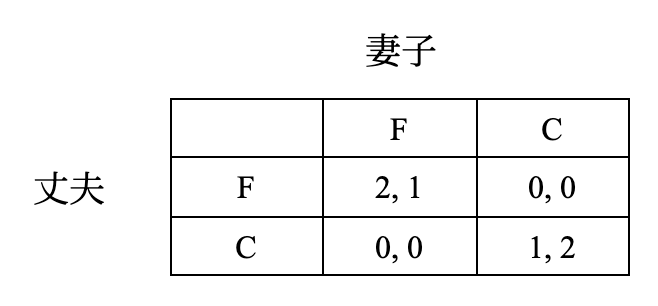

显然 $(F, F)$ 和 $(C, C)$ 是纯策略纳什均衡，但是否存在非纯策略纳什均衡的混合策略纳什均衡呢？

首先展示如何使用**最优反应**法计算混合策略纳什均衡。记丈夫的混合策略为 $(x, 1 - x)$（表示以 $x$ 的概率选择 $F$，$1 − x$ 的概率选择 $C$），妻子的混合策略为 $(y, 1 - y)$。对于丈夫的每个混合策略 $(x, 1 - x)$，妻子的最优反应集合为：

$$
\begin{align}
br_2(x) & = \arg \max\limits_{y \in [0, 1]} u_2(x, y) \notag \\
& = \{y \in [0, 1]\ :\ u_2(x, y) \ge u_2(x, z), \forall z \in [0, 1] \} \notag
\end{align}
$$

而 $u_2(x, y) = xy \cdot 1 + (1 - x)(1 - y) \cdot 2 = 2 - 2x - 2y + 3xy$。将 $x$ 视为定值，对 $y$ 求导得到 $3x - 2$，因此可以得到最优反应集合为（丈夫同理）：

$$
br_2(x) := \begin{cases}\{0\} & x \in [0, \frac{2}{3}) \\ [0, 1] & x \in \{\frac{2}{3}\} \\ \{1\} & x \in (\frac{2}{3}, 1] \end{cases},\ br_1(y) := \begin{cases}\{0\} & y \in [0, \frac{1}{3}) \\ [0, 1] & y \in \{\frac{1}{3}\} \\ \{1\} & y \in (\frac{1}{3}, 1] \end{cases}
$$

    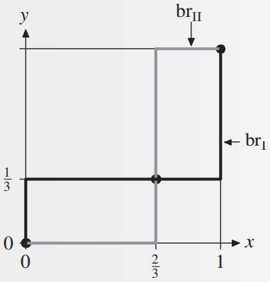

三个交点：$(x^*, y^*) = (0, 0), (x^*, y^*) = (\dfrac{2}{3}, \dfrac{1}{3}), (x^*, y^*) = (1, 1)$，第 1 个和第 3 个是纯策略纳什均衡，第 2 个是混合策略纳什均衡。

???+ question "思考"

    === "问题"

        - 求混合策略纳什均衡下双方的对应的收益，你能从中得到什么启示？
        - 从上面的图形能看出混合策略纳什均衡具有什么特点？

    === "回答"

        都是 $\dfrac{2}{3}$，即 $(\dfrac{2}{3}, \dfrac{2}{3})$。可以看到这比纯策略 $(F, F)$ 或 $(C, C)$ 对应的效用都差，因为这个混合策略很容易取到效用为0的另外两种策略。最好的做法是两个人商量一下或请人仲裁，比如第一周看足球赛，第二周听音乐会等等，让他们的选择具备一些相关性，而不是独立做选择。

#### 无差异原则

从上述例子中可以看出，混合策略纳什均衡下双方选择策略 $F$ 和 $C$ 的效用是相等的，这一结论可以一般化：

!!! note "无差异原则"

    令 $\sigma^*$ 为一个混合策略纳什均衡，$s_i$ 和 $s_i'$ 为参与人 $i$ 的两个纯策略，若 $\sigma_i^*(s_i), \sigma_i^*(s_i') > 0$，则 $U_i(s_i, \sigma_{-i}^*) = U_i(s_i', \sigma_{-i}^*)$。

定理成立的原因很简单：如果 $U_i(s_i, \sigma_{-i}^*) > U_i(s_i', \sigma_{-i}^*)$，那么参与人 $i$ 应该增加 $s_i$ 的概率，这样可以提高自己的收益。

- 被赋予正概率的集合称为**混合策略的支撑集合**

???+ question "思考"

=== "思考1"

    === "问题"

        被严格占优的策略有可能属于混合策略的支撑集合吗？

    === "解答"

        不可能。严格占优策略的定义不满足无差异原则的条件。

=== "思考2"

    === "问题"

        为什么混合策略支撑集的策略无差异，不能只选择其中一个行动或任意选取概率分布？

    === "解答"

        - “选择其中一个行动”意味着某个纯策略的收益更高，那参与人就一定会选择这个收益更高的，而将收益更低的那个排除在外，这样就打破了纳什均衡
        - 我们选择混合策略的概率主要是为对方考虑的，只有当精确选择了某个概率分布时，才能使得对方的每个纯策略都达到相同收益

???+ example "例子"

    接下来使用无差异原则计算性别大战的混合策略纳什均衡。使用无差异原则时首先需要先找到纯策略纳什均衡，否则后续计算可能会忽略。纯策略纳什均衡显然是 $(F, F)$ 和 $(C, C)$。

    考虑丈夫的混合策略 $\sigma_1 = (x, 1 - x)$ 和妻子的混合策略 $\sigma_2 = (y, 1 - y)$，且 $0 < x < 1, 0 < y < 1$（称为**完全混合的均衡**）。根据无差异原则必有丈夫选择 $F$ 和 $C$ 的效用相等：

    $$
    U_1(F, \sigma_2) = 2y = 1 - y = U_1(C, \sigma_2)
    $$

    解得 $y = \dfrac{1}{3}$，同理可以解得 $x = \dfrac{2}{3}$。因此用无差异原则可以更简便地得到混合策略纳什均衡。

注意，**无差异原则只是取得混合策略纳什均衡的必要条件，并非充分条件**，因此求出结果后需要验证。然而上例无需检验，因为上例只有两个策略，两个策略的效用都一致，不存在其他策略得到更高的效用。

### 存在性与计算复杂性

尽管并非所有博弈都有纳什均衡，但是下面的纳什定理告诉我们，每个有限的策略型博弈都有至少一个混合策略纳什均衡：

!!! theorem "纳什定理"

    每一个策略型博弈 $G$，如果参与人的个数有限，每个参与人的纯策略数目有限，那么 $G$ 至少有一个混合策略纳什均衡。

证明超出本门课程范围（需要使用[布劳威尔不动点定理](https://en.wikipedia.org/wiki/Brouwer_fixed-point_theorem)、[角谷不动点定理](https://en.wikipedia.org/wiki/Kakutani_fixed-point_theorem)等），感兴趣的同学可以参考相关书目。

关于混合策略纳什均衡的计算，根据定义可以转化为线性可行性问题，有指数时间的求解方式（实验要求实现），自然的问题是，是否存在多项式时间的通用解法？答案是，不知道是否存在。

!!! theorem "[定理（陈汐，邓小铁）](https://doi.org/10.1109%2FFOCS.2006.69)"

    双人博弈纳什均衡的计算是 **[PPAD](https://en.wikipedia.org/wiki/PPAD_(complexity)) 完全问题**。

我们不在此解释 PPAD 完全的含义，只需知道目前是没有多项式时间算法可以计算一般的两人博弈的混合策略纳什均衡。

## 完全信息动态博弈

???+ info "引入：蜈蚣博弈"

    **蜈蚣博弈**：

    - 两个参与人依次行动
    - 在奇数轮 $t = 1, 3, \dots, 99$，参与人 1 选择停止博弈（$S$）或者继续博弈（$C$），如果他在第 $t$ 轮选择停止，收益为 $(t, t - 1)$，否则继续博弈
    - 在偶数轮 $t = 2, 4, \dots, 100$，参与人 2 选择停止博弈（$S$）或者继续博弈（$C$），如果他在第 $t$ 轮选择停止，收益为 $(t - 2, t + 1)$，否则继续
    - 如果最初 99 轮没人停止，那么 100 轮后博弈结束，双方收益为 (101, 100)

    下图表现了为什么这一博弈被称为蜈蚣博弈：

    

        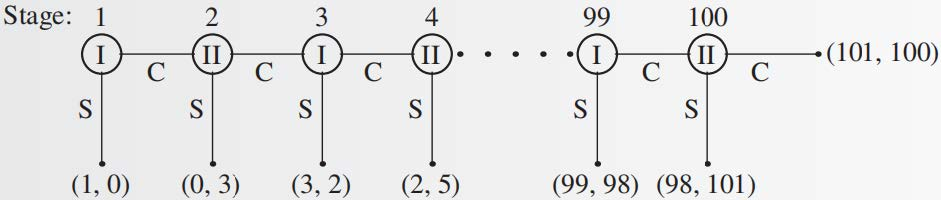
    

    和你的小伙伴玩玩这一博弈，看一看你们的选择是什么？

### 基本概念

不难看出，上述博弈出现了参与人多轮交互，整体博弈被表达为了一棵树，这一类博弈被称为**扩展式博弈**(extensive-form game)，其中：

- **根节点表示博弈的开始，每个叶节点都标志博弈的一个结束点**
- 每个**非叶节点**上都需要标注这一步的**行动者**
- 每个**叶节点**上需要标注博弈在这一**终点下的参与人效用**

扩展式博弈每个参与人的**策略是一个向量，表示其在所有可能行动的节点上的行动**。

- 例如蜈蚣博弈中参与人 1 的策略可能是 $(C, C, S, C, \dots, S, C)$
- 即使选定某一策略后博弈停止，也要将此后所有节点的策略都定义好。

一个扩展式博弈的**子博弈**(subgame)由一个节点 $x$ 和所有该节点的后继节点组成

- 实际上就是**以 $x$ 为根的子树**，记为 $\Gamma(x)$

### 完美信息博弈

如果每个参与人**在选择行动时，都知道他位于博弈树的哪个节点上**，那么这个博弈就是**完美信息博弈**(game with perfect information)，例如蜈蚣博弈，国际象棋等。

- 但很多博弈不符合这一条件，例如德州扑克或者斗地主等扑克牌游戏，你不知道其他玩家的手牌
- [**德州扑克 AI 战胜人类**](https://arxiv.org/abs/1705.02955)：NIPS'17 best paper
- 每个年代有自己最关注的热点，但什么文章能具有长久影响力是未知的
    - 虽然德州扑克那篇论文在当时关注度很高（当时人们更关注“AI 战胜人类”的话题），但是同年发布的论文 [*Attention Is All You Need*](https://arxiv.org/abs/1706.03762) 在现在看来价值更大

### 子博弈完美均衡

下面介绍完全信息动态博弈的均衡概念，需要扩展普通的纳什均衡概念。

!!! definition "定义"

    在扩展式博弈 $\Gamma$ 中，一个策略向量 $\sigma^*$ 是**子博弈完美均衡**(subgame perfect equilibrium)，如果对于博弈的任意子博弈 $\Gamma(x)$，局限在那个子博弈的策略向量 $\sigma^*$ 是 $\Gamma(x)$ 的纳什均衡：对每个参与人 $i$，每个策略 $\sigma_i$ 和子博弈 $\Gamma(x)$，

    $$
    u_i(\sigma^*\ |\ x) \ge u_i(\sigma_i, \sigma_{-i}^*\ |\ x)
    $$

这一定义是很直观的，因为如果某个子博弈 $\Gamma(x)$ 上参与人存在有利可图的偏离，那么全局来看这也是一个有利可图的偏离。

当一个博弈存在不止一个均衡时，我们希望基于合理的选择标准选择一些均衡，而剔除另一些均衡，这样的一个选择叫做**均衡精炼**(equilibrium refinements)。

???+ question "思考"

    === "问题"

        子博弈完美均衡是否是纳什均衡的精炼？换言之，是否存在不是子博弈完美均衡的纳什均衡？

    === "解答"

        存在的。来看下面这个例子：

        

            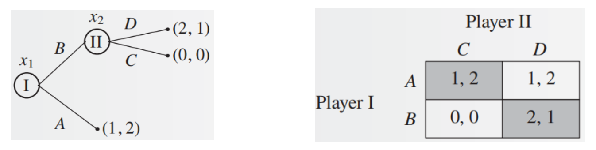
        

        - 这一博弈有两个纯策略纳什均衡：$(A, C)$ 和 $(B, D)$，参与人 I 更偏好 $(B, D)$，参与人 II 更偏好 $(A, C)$
        - $(A, C)$ 不是子博弈完美均衡，因为在 $x_2$ 处参与人 II 存在有利可图的偏离：选择 $D$ 而不是 $C$（因此子博弈完美均衡的确是纳什均衡的精炼）
        - 在 $(A, C)$ 下，I 不会偏离均衡，是因为 II **威胁** I：如果你选择 $B$，我就选择 $C$。然而这个威胁显然是不可置信的，因为如果 I 选择 $B$，那么 II 还是选择 $D$ 更有利

例子中 $(A, C)$ 能作为均衡，或者说 $C$ 这一被 $D$ 占优的策略可以成为均衡，是因为 $(A, C)$ 到不了真正要选择 $C, D$ 的 $x_2$ 点。

用 $P_\sigma(x)$ 表示当实施策略向量 $\sigma$ 时，博弈展开将造访节点 $x$ 的概率。有如下定理：

!!! theorem "定理"

    令 $\sigma^*$ 是扩展式博弈 $\Gamma$ 的纳什均衡，如果对所有 $x$ 都有 $P_{\sigma^*}(x) > 0$，那么 $\sigma^*$ 是子博弈完美均衡。

- 定理是显然的，因为如果 $\sigma^* 不是子博弈完美均衡，那么在某个子博弈 $\Gamma(x)$ 上存在有利可图的偏离，并且这个偏离产生的概率不为 0，因此也可以带来全局的有利可图的偏离
- 推论：完全混合的纳什均衡是子博弈完美均衡

### 逆向归纳法

如何找到完美信息博弈的子博弈完美均衡？**直观：要求每个子博弈都是均衡，可以从最小的子博弈出发求解**。

    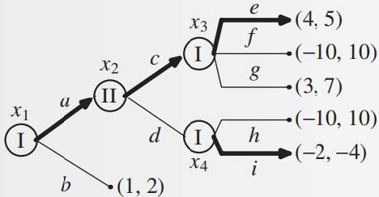

从最小的子博弈出发，即 $\Gamma(x_3)$ 和 $\Gamma(x_4)$，选择图中加粗的策略（子博弈的均衡），然后将均衡结果替代子博弈，逐步向上推导到根节点即可（因此子博弈完美均衡是 $(ae, c)$）。

    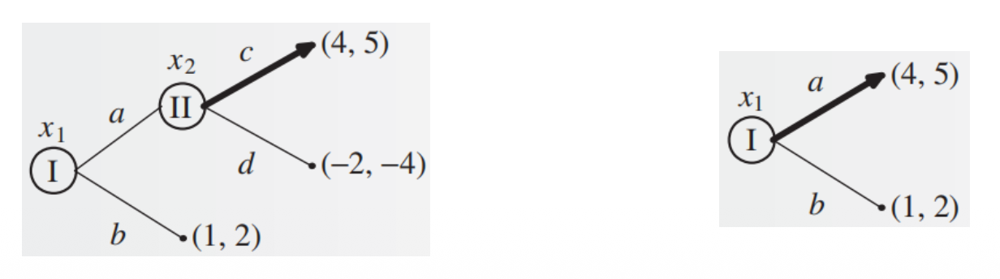

这一方法称为**逆向归纳法**(backward induction)，该方法的应用保证了每一个子博弈都使用了均衡策略，并且每一步都能做出选择，由此可得：

!!! theorem "定理"

    每个有限完美信息扩展式博弈都至少有一个子博弈完美纯策略均衡。

然而逆向归纳法存在局限性：**不是子博弈完美均衡的均衡可能更好**。

- **重复囚徒困境有限轮**，逆向归纳法会得到两个罪犯在每一轮都选择承认（因此需要新的博弈建模方式描述人们在长期关系中会合作这一事实）
- 蜈蚣博弈：显然，逆向归纳法的结果是参与人在第一轮就要选择停止，但现实中通常双方都会试探前进一段才会结束

### 产量领导模型（斯塔克尔伯格模型）

经济学中子博弈完美均衡最基本的应用就是产量领导模型（或称**斯塔克尔伯格**(Stackelberg)模型），常用于**描述有一家厂商处于支配地位或充当自然领导者的行业**。例如 IBM 是具有支配地位的行业，通常观察到的其它小企业的行为模式是等待 IBM 宣布新产量然后调整自己的产量决策，此时 IBM 就是斯塔克尔伯格领导者，其它厂商是跟随者。

???+ question "思考"

=== "问题"

    设市场中有两个厂商：

    - 厂商 1 是领导者，选择产量 $y_1$
    - 厂商 2 是跟随者，选择产量 $y_2$
    - 用 $p(y_1 + y_2)$ 表示总产量为 $y_1 + y_2$ 时的市场价格
    - $c_1(y_1)$ 和 $c_2(y_2)$ 表示厂商 1 和 2 在生产 $y_1$ 和 $y_2$ 单位商品时的成本

    画出对应的博弈树，思考如何使用逆向归纳法形式化求解子博弈完美均衡？

=== "解答"

    使用**逆向归纳法**，第一步应该是求解在厂商 1 的任意策略 $y_1$ 下厂商 2 的最优反应 $y_2 = f_2(y_1)$，然后厂商 1 看哪个 $y_1$ 结合对应的 $f_2(y_1)$ 能实现自己的收益最大化。因此厂商 1 的利润最大化决策可以综合表达为：

    $$
    \begin{align}
    \max\limits_{y_1} & \quad \pi_1(y_1, y_2) = p(y_1 + y_2) y_1 - c_1(y_1) \notag \\
    \text{s.t.} & \quad y_2 = \arg \max\limits_{y_2} \pi_2(y_1, y_2) = p(y_1 + y_2) y_2 - c_2(y_2) \notag
    \end{align}
    $$

    - 这是一个**双层优化问题**(bi-level optimization problem)，即优化的约束条件是另一个优化问题：厂商 1 在做决策时，他知道厂商 2 会根据他的决策做出最优反应
    - 求解过程：先求解厂商 2 的最优反应函数 $y_2^* = f_2(y_1)$，然后将其代入厂商 1 的利润函数中，求解厂商 1 的最优产量 $y_1^*$

???+ example "例子"

=== "题目"

    设总产量为 $y_1 + y_2$ 时的市场价格为 $2 - y_1 - y_2$，并且厂商 1 和 2 的生产一件产品的单位生产成本分别为 $c_1, c_2$，求在该假设下二者的子博弈完美均衡产量。

=== "解答"

    先写出厂商 1 和 2 的利润函数：

    $$
    \pi_1 = (2 - y_1 - y_2) y_1 - c_1 y_1 \\
    \pi_2 = (2 - y_1 - y_2) y_2 - c_2 y_2
    $$

    然后先对给定 $y_1$ 的情况下求厂商 2 的最优反应，解得 $y_2 = \dfrac{2 - y_1 - c_2}{2}$。

    然后将 $y_2$ 代入厂商 1 的利润函数，求解得到最优的 $y_1^* = \dfrac{2 + c_2 - 2c_1}{2}$。

    最后将 $y_1$ 代入 $y_2$ 的表达式，求解得到最优的 $y_2^* = \dfrac{2 + 2c_1 - 3c_2}{4}$。

    - 上述结果能如何联系到实际？
        - 自己的成本越高，产量越低；对方的成本越高，产量越高（类似古诺竞争）
    - 上述求解过程和古诺竞争的区别？
        - 在斯塔克尔伯格竞争，领导者确信自己选择什么的时候对方选择的策略是什么，求解的时候会考虑对方的行动
        - 但古诺竞争不知道对方选择什么
    - 事实上古诺竞争和斯塔克尔伯格竞争都是在纳什均衡的概念提出之前就已经被研究了，而纳什均衡统一了这些博弈背后的思想

## 不完全信息动态博弈

### 行业博弈

现实中的博弈不一定是完全信息的，例如德州扑克游戏中我们不知道对手的手牌，厂商竞争互相之间的实力也并非完全已知，因此需要引入**不完全信息博弈**(game with incomplete information)来描述这些场景。

???+ example "例子"

    === "例1"

        考虑一个包括两个企业的行业博弈。假定这个行业有一个在位者（参与人 1）和一个潜在的进入者（参与人 2）。参与人 1 决定是否建立一个新工厂，同时参与人 2 决定是否进入该行业。假定**参与人 2 不知道参与人 1 建厂的成本是 3 还是 0，但参与人 1 自己知道**。

        

            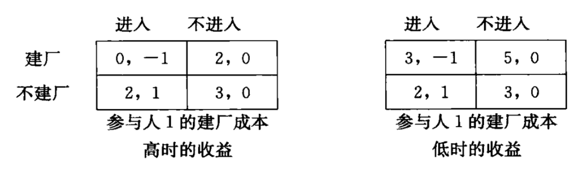
        

        **假设参与人 2 对参与人 1 的类型有先验概率**：认为参与人 1 成本为 3（成本高）的概率为 $p$，成本为 0（成本低）的概率为 $1 - p$。

        - 求解均衡前**首先检查是否存在劣策略**：参与人 1 有占优策略：成本低，建厂；成本高，不建厂；从而轻松得到参与人 1 的均衡策略
        - 根据参与人 1 的策略，参与人 2 进入的期望效用为 $p - (1 - p) = 2p - 1$，不进入的期望效用为 0
        - 因此当 $p > \dfrac{1}{2}$ 时，对于参与人 2，选择进入优于不进入，故选择进入，$p < \dfrac{1}{2}$ 则选择不进入，$p = \dfrac{1}{2}$ 二者无差异。

    === "例2"

        上页例子的均衡因为参与人 1 在两种情况下均存在占优策略而十分容易求解。如果将低成本时的建厂成本设定为 1.5，如下表，则参与人 1 只在高成本时有占优策略（不建厂）。

         

            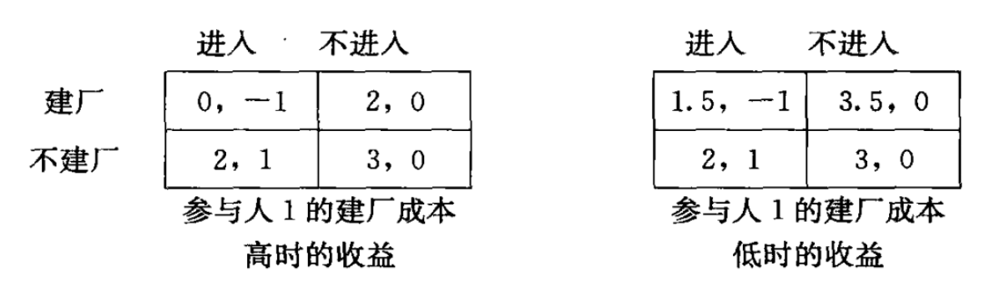
        
       

        接下来只能使用**无差异原则**求解均衡。设参与人 1 低成本时建厂概率为 $x$，参与人 2 进入概率为 $y$。首先考虑是否存在**纯策略均衡**：

        - $x = 1, y = 0$（对应纯策略组合（建厂，不进入）），对低成本的参与人 1 而言，$x = 1$ 是 $y = 0$ 的最优反应；对参与人 2，$x = 1$ 时，$y = 0$ 的效用为 $0$，$y = 1$ 的效用为 $p - (1 - p) = 2p - 1$，故 $y = 0$ 是 $x = 1$ 的最优反应当且仅当 $p \le \dfrac{1}{2}$
        - 同理可以验证 $x = 0, y = 1$ 在任意的 $p$ 下都是均衡

        接下来考虑混合策略均衡，根据无差异条件：

        - 低成本参与人 1 是否建厂无差异：

            $$
            1.5y + 3.5(1 - y) = 2y + 3(1 - y)
            $$
            解得 $y = \dfrac{1}{2}$

        - 参与人 2 是否进入无差异：

            $$
            p + (1 - p)(-x + (1 - x)) = 0
            $$
            解得 $x = \dfrac{1}{2(1 - p)}$

        总而言之，这一博弈存在两个纯策略均衡（其中一个有条件）和一个混合策略纳什均衡。

        - 均衡下高成本参与人 1 永远选择占优策略不建厂
        - 当 $p \le \dfrac{1}{2}$ 时，低成本参与人 1 选择建厂，参与人 2 选择不进入
        - 低成本参与人 1 选择不建厂，参与人 2 选择进入
        - 低成本参与人 1 以 $x = \dfrac{1}{2(1 - p)}$ 概率选择建厂，参与人 2 以概率 $\dfrac{1}{2}$ 选择进入

        你能从这一均衡中观察到什么？

        - 学会从解的直观中判断解是否正确/合理

### 定义

从行业博弈出发，不完全信息博弈定义在策略式博弈基础上有如下改变：

- 原先的**三元组需要扩展为五元组**，需要增加每个参与人的类型集合 $(T_i)_{i \in N}$ 和类型的先验分布 $p$
    - **先验分布 $p$ 是给每种类型向量 $(t_1, \dots, t_n)$ 赋予一个概率**
    - 行业博弈中参与人 2 只有一种默认类型，故先验分布定义在两种类型向量（高成本，默认类型）和（低成本，默认类型）上，此处显然默认类型可以被省略，因此可以只定义参与人 1 两种类型的先验概率
    - 读者可以想象扑克牌游戏的场景，在发牌之前各个参与人之间对其他人的牌的分布会有一个大致的估计，这一估计就是先验分布

    - 在一般的情况下，上述 $p$ 给出的是联合概率分布，因此边际概率分布为
        $$
        p(t_i) = \sum\limits_{t_{-i}}p(t_i, t_{-i})
        $$ 
        参与人是知道自己的类型为 $t_i$ 的，故对其他人的类型有后验概率分布为
        $$
        p(t_{-i}\ |\ t_i) = \dfrac{p(t_i, t_{-i})}{p(t_i)} = \dfrac{p(t_i, t_{-i})}{\sum_{t_{-i}} p(t_i, t_{-i})}
        $$
        注意此前的行业博弈无需更新后验分布，事实上只要不同参与人是独立的就无需更新后验分布。

- 此外，**先验分布是所有参与人的共同知识**
    - 例如斗地主时大家都会认为一方有很多炸弹的概率是比较小的
    - 更复杂的模型中可能会有更弱的假设

- 原先的参与人**策略**需要扩展至**对参与人的每种类型都定义一个策略**
    - 例如行业博弈求解了参与人 1 高类型和低类型下的策略
    - 尽管参与人知道自己的类型，但参与人还是要为每个类型都定义策略的，这是因为**其他参与人不知道你的类型**，但计算均衡时需要基于所有类型下的策略才能算出效用
    - 参与人 $i$ 类型为 $t_i$ 下选择纯策略 $s_i$ 的概率记为 $\sigma_i(t_i; s_i)$

- 最后，参与人 $i$ 的**效用**与类型相关（回忆行业博弈高低成本参与人 1）
    - 当所有人类型组合为 $t$，纯策略组合为 $s$ 时的效用记为 $u_i(t; s)$
    - 注意**效用与所有人的类型相关**（可以考虑你和一个能力未知的人匹配打游戏），而**策略只与自己的类型相关**

### 均衡

!!! warning "注"

    以下内容比较形式化，只需要理解大致思想即可。

均衡的定义需要涉及收益的比较，故此处简单展开计算。当参与人策略组合为 $\sigma = (\sigma_1, \dots, \sigma_n)$ 时，如果参与人类型组合是 $t = (t_1, \dots, t_n)$，那么每个纯策略组合 $(s_1, \dots, s_n)$ 被选择的概率是 $\prod_{i \in N} \sigma_i(t_i; s_i)$，因此参与人 $i$ 的期望收益是：

$$
U_i(t; \sigma) = \sum\limits_{s \in S}\prod\limits_{i=1}^n \sigma_i(t_i; s_i)u_i(t; s)
$$

上述表达式中在不完全信息的情况下存在不确定性：参与人不知道其它参与人的类型，因此需要进一步对类型求取期望，得到（将 $t$ 拆成 $t_i, t_{-i}$）

$$
U_i(\sigma) \triangleq \mathbb{E}_{t_{-i}} U_i(t_i, t_{-i}; \sigma) = \sum\limits_{t_{-i}} p(t_{-i}\ |\ t_i) U_i(t_i, t_{-i}; \sigma) 
$$

这就得到了参与人策略组合为 $\sigma = (\sigma_1, \dots, \sigma_n)$ 时，每个参与人 $i$ 效用的形式化表达。

基于此可以给出不完全信息（静态）博弈的均衡概念的定义：

!!! definition "定义"

    不完全信息博弈的策略向量 $\sigma^* = (\sigma_1^*, \dots, \sigma_n^*)$ 是不完全信息博弈的**贝叶斯均衡**(Bayesian equilibrium)，如果对每个参与人 $i$，每个类型 $t_i$ 以及每个可能的纯策略 $s_i$，都有 

    $$
    U_i(\sigma^*) \ge U_i(s_i, \sigma_{-i}^*)
    $$

注意定义中的两个细节：

- 对每个类型 $t_i$ 的原因在于此前计算 $U_i(\sigma)$ 时是基于参与人已知自己类型 $t_i$ 的后验概率分布的
- 只需要考虑向纯策略 $s_i$ 的偏离的原因在此前混合策略纳什均衡的等价定义中已经解释

### 三个阶段

当然读者可能心里会有一个疑惑：这里讨论的是静态博弈，但前面的行动顺序看起来像是动态博弈。

- 仔细观察便会发现，自然的行动并非策略性的，与参与人之间没有交互，最后一步的结果在第二步选择行动后就确定了；
- 尽管这并非真的动态博弈，但上述三个步骤划分了经济学文献中常见的不完全信息博弈的三个阶段：
    - 每个人类型被指派之前的阶段被称为**事前阶段**(ex ante)
    - 每个人类型被指派之后的阶段被称为**事中阶段**(interim)
    - 收益确定之后的阶段被称为**事后阶段**(ex post)
- 不同阶段的关键差异在于参与人拥有的信息不同

最后值得一提的是，提出这一不完全信息博弈框架的约翰·海萨尼(John C.Harsanyi)与纳什同在 1994 年获得诺贝尔经济学奖。当年获得诺贝尔经济学奖的还有莱茵哈德·泽尔腾(Reinhard Selten)，其最著名的贡献是提出了子博弈完美纳什均衡的概念。

### 古诺竞争

在行业博弈的例子中，参与人类型空间离散，行动空间也离散。下面的例子对应类型空间离散，但行动空间连续的情况（二者都连续的情况在拍卖中介绍）。

!!! warning "注"

    行动空间连续的情况只考虑纯策略均衡，混合策略求解比较复杂。

回忆古诺竞争是两个寡头同时决定产量的博弈。假定企业的利润为 $u_i = q_i(\theta_i - q_i - q_j)$，其中 $\theta_i$ 是线性需求函数的截距与企业 $i$ 的单位成本之差，$q_i$ 是企业 $i$ 选择的产量。

???+ example "例子"

    企业 1 的类型 $\theta_1 = 1$ 是共同知识，但企业 2 拥有关于其单位成本的私人信息。企业 1 认为 $\theta_2 = \dfrac{3}{4}$（高成本）和 $\dfrac{5}{4}$（低成本）的概率均为 $\dfrac{1}{2}$，且先验分布是共同知识。

    首先将博弈表达为不完全信息的形式（写出五元组）：

    - 参与人：两个企业
    - 策略：产量 $[0, +\infty)$
    - 效用函数：利润 $u_i$
    - 类型：企业 1 的 1 个类型，企业 2 的 2 个高低成本
    - 先验分布：高低成本的概率均为 1/2

    求解博弈的纯策略均衡。记企业 1 的产量为 $q_1$，企业 2 在 $\theta_2 = \dfrac{5}{4}$ 时的产量为 $q_2^L$，在 $\theta_2 = \dfrac{3}{4}$ 时的产量为 $q_2^H$。企业 2 的均衡产量必须满足：

    $$
    q_2(\theta_2) \in \arg \max\limits_{q_2} q_2(\theta_2 - q_1 - q_2) \Rightarrow q_2(\theta_2) = \dfrac{\theta_2 - q_1}{2}
    $$

    企业 1 不知道企业 2 属于哪种类型，因此他的收益只能是对企业 2 的类型取期望：

    $$
    \begin{align}
    q_1 \in \arg \max\limits_{q_1} \dfrac{1}{2} & q_1 (1 - q_1 - q_2^L) + \dfrac{1}{2}q_1(1 - q_1 - q_2^H) \notag \\
    & \Rightarrow q_1 = \dfrac{2 - q_2^H - q_2^L}{4} \notag
    \end{align}
    $$

    将 $\theta_2$ 的两个取值代入 $q_2(\theta_2)$，解得 $q_1 = \dfrac{1}{3}, q_2^L = \dfrac{11}{24}, q_2^H = \dfrac{5}{24}$。事实上这也是博弈唯一的贝叶斯纳什均衡（因为求出来的是最优反应，没有混合策略）。

    - 如果两个厂商都知道厂商 2 的类型，可以求出高低两种情况的纳什均衡，可以计算出此时的利润然后取平均
    - 如果两个厂商都不知道厂商 2 的类型，本质上退回完全信息情景
        - 厂商 2 自己都不知道自己的类型，故只能按平均值计算自己的策略，厂商 1 也知道厂商 2 按平均值计算，从而博弈退化到完全信息场景

        |关于厂商 2 的类型的知识|厂商 1 的利润|厂商 2 的利润|
        |:-:|:-:|:-:|
        |两个厂商都不知道|$\dfrac{1}{9}$|$\dfrac{1}{9}$|
        |只有厂商 2 知道|$\dfrac{1}{9}$|$\approx 0.127$|
        |两个厂商都知道|$\dfrac{1}{8}$|$\dfrac{5}{36}$|

        上述表格带来的启示：厂商主动披露自己的信息对双方都有好处（从都不知道到都知道，双方的利润都有所提高）

??? example "例子"

    === "题目"

        

            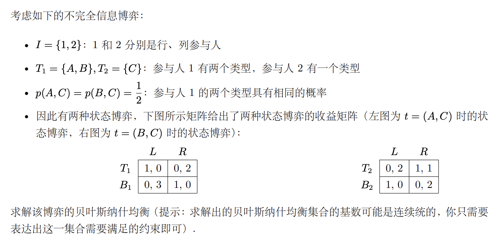
        

        >来自去年的[作业4](https://yhwu-is.github.io/Teach/ec/data_market/2024/HW4-solution.pdf)

    === "解答"

        

            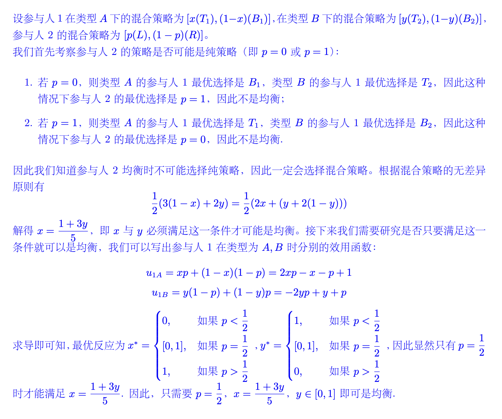
        
        

