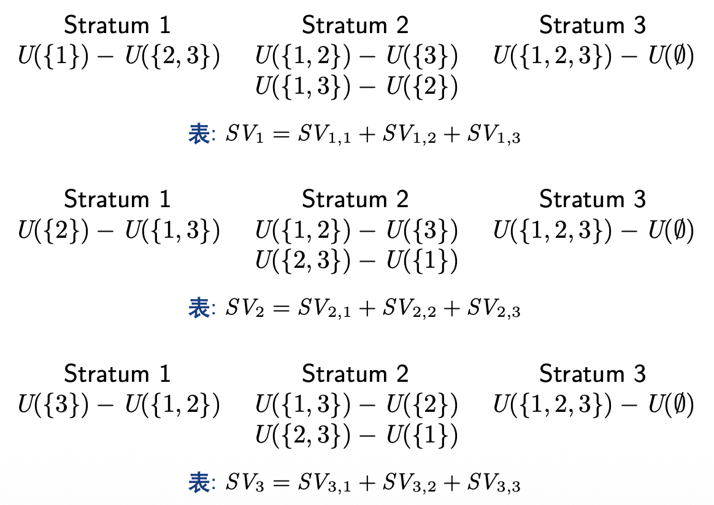

# Lec 4: 合作博弈与数据估值

## 从非合作博弈到合作博弈

### 分摊美元博弈

???+ example "例子"

    === "例1"

        有两个参与者，每个人都可以在 0 到 100 美元之间提出他所需要的某个钱数．如果两个人提出的钱数之和不超过 100 美元，那么他们将按照他们提出的钱数来分配这 100 美元．如果他们提出的钱数之和超过 100 美元，那么他们都只能得到 0 美元。

        ??? tip "某个方案"

            (50, 50)

            - 公平(equity)：两个人得到了相同的钱数
            - 效率(efficiency)：两个人将 100 全部分完

    === "例2"

        现在考虑更复杂的情况，一个三人参与的博弈，每个人都提出一个三个参与人的收益配置（而非之前的例子中每个人只提出自己的钱数），并且三个人的收益之和不能超过 300 美元．

        考虑以下两种情况：
        
        - 除非三个人提出相同的配置方案，此时他们将按照他们提出的配置方案来分配，否则他们都得到 0 美元：(100, 100, 100)
        - 除非参与人 1 和 2 提出相同的配置方案，此时他们将按照他们提出的配置方案来分配，否则他们都得到 0 美元：(150, 150, 0)

    === "例3"

        考虑一个三个人参与的博弈，每个人都提出一个**三个参与人的收益配置**，并且三个人的收益之和不能超过 300 美元．如果有任意两个参与者提出相同的配置方案，就按照他们提出的配置方案来分配，否则全体得到 0 美元。

        - 如果参与人 1 和 2 进行有效谈判，他们应当提出 (150, 150, 0)
        - 这时 3 可能和 2 妥协，提出 (0, 225, 75) 请求 2 的同意以得到更多的收益
        - 然而此时 1 可能和 3 妥协，提出 (113, 0, 187)
        
        **公平、有效率的合作博弈解**

### 合作博弈

!!! definition "定义（合作博弈）"

    一个具有**可转移效用**(transferable utility)的合作博弈（或称为 TU 博弈）是一个满足如下条件的二元组 $(N; v)$：
    
    - $N = \{1, 2, \dots, n\}$ 是一个有限的参与者集合；一个 $N$ 的子集被称为一个**联盟**(coalition)，全体联盟构成的集合记为 $2^N$
    - $v : 2^N \rightarrow R$ 称为该博弈的**特征函数**(characteristic function)，对于任意的 $S \subseteq N$，$v(S)$ 表示联盟 $S$ 的价值(worth)，且满足 $v(\emptyset) = 0$

???+ example "例子"

    考虑一个场景，假设有三个人 A，B，C，他们的特点分别如下：

    - A 擅长于发明专利，依靠这一才能年收入达 17 万美元
    - B 有机敏的商业嗅觉，能准确发掘潜在市场，创建商业咨询公司年收入可达 15 万美元
    - C 擅长市场营销，开办专门的销售公司年收入可达 18 万美元
    
    显然，三个人的才能互补，于是他们考虑合作：B 可以为 A 提供市场资讯，将 A 的发明专利卖给市场上最有需求的人，这样他们合作每年收入可达 35 万美元；C 利用他的才能销售 A 的发明专利，合作年收入可达 38 万美元；当然 B 和 C 也可以合作组建一个提供市场咨询和销售一体化的公司，这样每年合作收入可达 36 万美元；最后 A，B，C 如果共同合作，A 在 B 的建议下发明最符合市场需求的专利，然后由 C 进行销售，这样他们合作每年收入可达 56 万美元。

    现在可以用定义形式化这一博弈，不难得到 $N = \{A, B, C\}$，全体联盟构成的集合

    $$
    2^N = \{\emptyset, \{A\}, \{B\}, \{C\}, \{A, B\}, \{B, C\}, \{A, C\}, \{A, B, C\} \}
    $$

    则该场景可以表示为一个合作博弈 $(N; v)$，其中特征函数 $v$ 定义如下：

    $$
    v(S) = \begin{cases}0 & S = \emptyset \\ 17 & S = \{A\} \\ 15 & S = \{B\} \\ 18 & S = \{C\} \\ 35 & S = \{A, B\} \\ 36 & S = \{B, C\} \\ 38 & S = \{A, C\} \\ 56 & S = \{A, B, C\}\end{cases}
    $$

    通过确定参与者以及特征函数构成的二元组，我们的确可以形式化地完整描述前面例子的所有信息。

!!! definition "定义"

    一个合作博弈 $(N; v)$（其中 $N= {1, 2, \dots, n}$）的解概念是一个函数 $\varphi$，它将每个博弈 $(N; v)$ 与一个 $\mathbb{R}^n$ 的子集 $\varphi(N; v)$ 联系起来．如果对于任意的博弈 $\varphi(N; v)$ 都是一个单点集，则称这一解概念为**单点解**(point solution)。

更通俗地说，合作博弈的解概念就是一个将每个博弈都映射到一个可行的收入分配集合的函数，这个集合中的每个元素是一个分配向量 $(x_1, x_2, \dots, x_n)$，其中 $x_i$ 表示参与者 $i$ 在当前分配下可以获得的收入。

???+ example "例子"

    设 $(N; v)$ 是一个三人参与的合作博弈，其中 $N = \{1, 2, 3\}$，特征函数 $v$ 定义如下：

    $$
    v(\emptyset) = v(\{1\}) = v(\{2\}) = v(\{3\}) = 0, \\
    v(\{1, 2\}) = v(\{1, 3\}) = v(\{2, 3\}) = v(\{1, 2, 3\}) = 1
    $$

    这是三人分 300 元的最后一个例子的形式化版本．现在讨论这一博弈的可行解概念，可以从两个不同的角度来考虑这一问题：

    - 如果你是参与者，你会认为两两组成联盟是最好的，结合对称性，你会认为这一博弈的解概念是 $\varphi(N; v) = \Big\{ \Big(\dfrac{1}{2}, \dfrac{1}{2}, 0\Big), \Big(\dfrac{1}{2}, 0, \dfrac{1}{2}\Big), \Big(0, \dfrac{1}{2}, \dfrac{1}{2} \Big) \Big\}$，即你心中的解概念是一个三个元素的集合
    - 如果你是局外人，你认为三个参与人是“对称的”，因此这一博弈的解概念应当是 $\varphi(N; v) = \Big\{ \Big(\dfrac{1}{3}, \dfrac{1}{3}, \dfrac{1}{3}\Big) \Big\}$，只有一个向量组成

## 核

!!! definition "定义（核）"

    一个合作博弈 $(N; v)$（其中 $N= {1, 2, \dots, n}$）的**核**(core)是一个解概念 $\varphi$，其中 $\varphi(N; v)$ 由满足以下两个条件的分配向量 $x = (x_1, x_2, \dots, x_n)$ 组成：

    - **有效率的**(efficient)：$\sum\limits_{i=1}^n x_i = v(N)$，即所有参与者分完了整个联盟的全部收入
    - **联盟理性**(coalitionally rational)：对于任意的 $S \subseteq N$，有 $x_i \ge v(S)$，即对于任何联盟而言，他们在大联盟中分配到的收入一定不会比离开大联盟组成小联盟获得的收入少

???+ example "例子"

    === "例1"

        === "题目"

            求下列三个参与人的合作博弈的核，其中 $N = \{1, 2, 3\}$，特征函数 $v$ 的定义如下：

            $$
            v(\emptyset) = v(\{1\}) = v(\{2\}) = v(\{3\}) = 0, \\
            v(\{1, 2\}) = v(\{2, 3\}) = 1, v(\{1, 3\}) = 2, v(\{1, 2, 3\}) = 3
            $$

        === "解答"

            直接设出在核中的向量 $x = (x_1, x_2, x_3)$，并根据核的定义，这一向量应当满足有效率的：

            $$
            x_1 + x_2 + x_3 = v(\{1, 2, 3\}) = 3
            $$

            以及联盟理性，即：

            $$
            x_1 + x_2 \ge v(\{1, 2\}) = 1, x_2 + x_3 \ge v(\{2, 3\}) = 1, x_1 + x_3 \ge v(\{1, 3\}) = 2, \\
            x_1 \ge v(\{1\}) = 0, x_2 \ge v(\{2\}) = 0, x_3 \ge v(\{3\}) = 0
            $$      

            接下来的关键问题在于如何求出符合上述等式与不等式的所有向量．事实上，有效率性已经将 $x$ 限制到 $\mathbb{R}^3$ 中的一个平面，然后我们只需将这些不等式约束在这一平面上处理即可。

            

                
            

    === "例2"

        考虑三个参与人的合作博弈，$N = \{1, 2, 3\}$，特征函数 $v$ 定义如下：

        $$
        v(\emptyset) = v(\{1\}) = v(\{2\}) = v(\{3\}) = 0, \\
        v(\{1, 2\}) = v(\{1, 3\}) = v(\{2, 3\}) = v(\{1, 2, 3\}) = 1
        $$

        设核中向量为 $x = (x_1, x_2, x_3)$，基于下面这一简单的观察发现核为空集：

        - 根据有效率的，我们有：

            $$
            x_1 + x_2 + x_3 = v(\{1, 2, 3\}) = 1
            $$

        - 但根据联盟理性，由于 $v(\{1, 2\}) = v(\{1, 3\}) = v(\{2, 3\}) = 1$，因此 $x_1 + x_2 \ge 1, x_2 + x_3 \ge 1, x_1 + x_3 \ge 1$，于是我们有：
            $$
            2x_1 + 2x_2 + 2x_3 \ge 3
            $$

        显然这两个不等式是矛盾的，因此这一博弈的核为空集。

    
### 沙普利值的性质

为了定义出沙普利值，我们首先需要写出沙普利值应当满足的效率和公平性质，然后给出定义并证明其唯一性．为了便于形式化地描述下面的沙普利性质，首先给出如下记号上的定义：

!!! definition "定义"

    令 $\varphi$ 为一个单点解，即对于任意的合作博弈 $(N; v)$（其中 $N= {1, 2, \dots, n}$），$\varphi (N; v)$ 都是一个单点集，也就是唯一一个 $\mathbb{R}^n$ 中的向量．我们定义 $\varphi_i(N; v)$ 为向量 $\varphi(N; v)$ 中的第 $i$ 个位置的元素，即 $\varphi_i(N; v)$ 表示参与者 $i$ 在博弈 $(N; v)$ 中的分配到的收入。

!!! definition "定义（有效率的）"

    一个解概念 $\varphi$ 是**有效率的**(fficiency)，若对于任意的合作博弈 $(N; v)$（其中 $N = \{ 1, 2, \dots , n\}$），有 $\sum\limits_{i=1}^n \varphi_i (N; v) = v(N)$。

即所有参与者分完了整个联盟的全部收入，事实上这与核的要求一致，这一条件是理性参与者一定会希望满足的。

第二个性质是对称性，这一性质是公平性的关键．为了定义对称性，需要首先定义两个参与人什么时候是对称的：

!!! definition "定义（参与人的对称性）"

    令 $(N; v)$ 是一个合作博弈，对于 $i, j \in N$，如果对于任意的 $S \subseteq N - \{i, j\}$，有 $v(S \cup \{i\}) = v(S \cup \{j\})$，则称参与者 $i$ 和 $j$ 是对称的。

用通俗的话说，两个参与人是对称的，即对于任何不包含他们的联盟，二者分别加入这一联盟后，联盟增加的效用（或称**边际贡献**(marginal contribution)）是一致的，因为对称性的定义等价于 $v(S \cup \{i\})− v(S) = v(S \cup \{j\})− v(S)$。

!!! definition "定义（解概念的对称性）"

    一个解概念 $\varphi$ 是满足**对称性**(symmetry)的，若对于任意的合作博弈 $(N; v)$，如果 $i, j \in N$ 是对称的，则 $\varphi_i(N; v) = \varphi_j(N; v)$。

!!! definition "定义（零参与者）"

    一个解概念 $\varphi$ 是符合**零参与者**(null player)性质的，若对于任意的合作博弈 $(N; v)$，如果 $i \in N$，且对于任意的 $S \subseteq N - \{i\}$，有

    $$
    v(S \cup \{i\}) = v(S)
    $$
    
    则 $\varphi_i(N; v) = 0$。

零参与者性质表明，如果一个参与人对于任何联盟的加入都不会增加联盟的效用，即他的边际贡献永远为0，那么他获得的收入应当为0。

### 沙普利值的定义

???+ info "沙普利值定义尝试"

    考虑合作博弈 $(N; v)$，其中 $N= {1, 2, \dots, n}$，我们定义解概念 $\varphi$ 为

    $$
    \varphi_i(N; v) = v(\{1, 2, \dots, i\})− v(\{1, 2, \dots, i− 1\}), \forall i \in N
    $$

    这一解概念满足有效率性、零参与者和加性．然而这一解概念**不满足对称性**，例如考虑 $N = \{1, 2, 3\}$，特征函数 $v$ 定义如下：
    
    $$
    v(\emptyset) = v(\{1\}) = v(\{2\}) = v(\{3\}) = v(\{1, 2\}) = v(\{1, 3\}) = 0, \\
    v(\{2, 3\}) = v(\{1, 2, 3\}) = 1
    $$

    不难解得这一解概念下的分配向量为 $\{(0, 0, 1)\}$，但是我们很容易发现参与人 2 和 3 在这一博弈中是对称的，但是 $\varphi_2(N; v) = 0 \ne 1 = \varphi_3(N; v)$。

上面的定义能满足除了对称性以外的所有性质，这时我们心里应当有一个强烈的声音告诉我们，这里的不对称性来源于强制给定了这 $n$ 个参与人的排序，而不同的排序可能会带来不同的分配结果，因此自然的想法是：为什么不尝试把**所有的排序对应的结果取平均**呢？记这 $n$ 个参与人的全体排序构成的集合为 $S_n$，根据简单的组合知识可知这一集合中含有 $|S_n|= n!$ 个元素．对于任意排序 $\sigma \in S_n$，定义：

$$
P_i(\sigma) := \{j \in N\ |\ \sigma(j) < \sigma(i)\}
$$

即在排序 $\sigma$ 下位于参与人 $i$ 前面的所有参与人的集合。例如若在排序 $\sigma$ 下参与人 $i$ 排在了第一位，那么 $P_i(\sigma) = \emptyset$。

!!! definition "定义"

    令 $(N; v)$ 是一个合作博弈，其中 $N = \{1, 2, \dots, n\}$，参与人 $i$ 的沙普利值定义为：

    $$
    SV_i(N; v) = \dfrac{1}{n!} \sum\limits_{\sigma \in S_n} v(P_i(\sigma) \cup \{i\}) - v(P_i(\sigma))
    $$

即我们将所有排序下前面失败的定义取了平均。

前面的定义基于对不同排列的边际贡献加权平均，我们可以重新整理这一定义，得到**基于对不同联盟的边际贡献的加权平均**定义的沙普利值等价定义。假设 $i \in N$ 是一个参与者，$S$ 是某个不包含 $i$ 的联盟，考虑有多少种排序 $\sigma$ 恰好可以使得排在 $i$ 的前面就是 $S$，即 $P_i(\sigma) = S$。相当于将 $n$ 个参与者分成了三个部分，最前面是 $S$，中间是 $i$，最后是 $N - (S \cup \{i\})$。这三个部分的参与者的相对顺序是确定的，而这三个部分内的参与者的相对顺序又是可以任意排列的，因此这一情况下的排序数目为 $|S|!(n − |S| − 1)!$。因此这 $|S|!(n − |S| − 1)!$ 个排列下 $P_i(\sigma) = S$，基于此我们可以将上面式子中所有排列按 $P_i(\sigma)$ 对应的联盟组合起来，得到沙普利值的等价定义：

!!! definition "定义"

    合作博弈 $(N; v), N = \{1, 2, \dots, n\}$，则参与人 $i$ 的沙普利值定义为：

    $$
    SV_i(N; v) = \dfrac{1}{n!} \sum\limits_{S \subseteq N - \{i\}} |S|!(n − |S| − 1)! (v(S \cup \{i\}) - v(S))
    $$

??? example "例子"

    === "题目"

        $$
        v(S) = \begin{cases}0 & S = \emptyset \\ 17 & S = \{A\} \\ 15 & S = \{B\} \\ 18 & S = \{C\} \\ 35 & S = \{A, B\} \\ 36 & S = \{B, C\} \\ 38 & S = \{A, C\} \\ 56 & S = \{A, B, C\}\end{cases}
        $$

    === "解答"

        直接套上面公式做，具体过程由 Gemini 2.5 pro 生成：

        **1. 计算参与者 A 的 Shapley 值 (SV_A)**

        我们需要计算当 A 加入不同联盟 $S \subseteq \{B, C\}$ 时所带来的边际贡献。

        * **当 S = ∅ (空集) 时:**
            * 边际贡献: $v(\{A\}) - v(\emptyset) = 17 - 0 = 17$
            * 权重: $\frac{0! (3-0-1)!}{3!} = \frac{1 \times 2}{6} = \frac{1}{3}$
            * 加权贡献: $\frac{1}{3} \times 17 = \frac{17}{3}$

        * **当 S = {B} 时:**
            * 边际贡献: $v(\{A, B\}) - v(\{B\}) = 35 - 15 = 20$
            * 权重: $\frac{1! (3-1-1)!}{3!} = \frac{1 \times 1}{6} = \frac{1}{6}$
            * 加权贡献: $\frac{1}{6} \times 20 = \frac{20}{6}$

        * **当 S = {C} 时:**
            * 边际贡献: $v(\{A, C\}) - v(\{C\}) = 38 - 18 = 20$
            * 权重: $\frac{1! (3-1-1)!}{3!} = \frac{1 \times 1}{6} = \frac{1}{6}$
            * 加权贡献: $\frac{1}{6} \times 20 = \frac{20}{6}$

        * **当 S = {B, C} 时:**
            * 边际贡献: $v(\{A, B, C\}) - v(\{B, C\}) = 56 - 36 = 20$
            * 权重: $\frac{2! (3-2-1)!}{3!} = \frac{2 \times 1}{6} = \frac{1}{3}$
            * 加权贡献: $\frac{1}{3} \times 20 = \frac{20}{3}$

        **总计 SV_A:**

        $$SV_A = \frac{17}{3} + \frac{20}{6} + \frac{20}{6} + \frac{20}{3} = \frac{34}{6} + \frac{20}{6} + \frac{20}{6} + \frac{40}{6} = \frac{114}{6} = 19$$

        ---

        **2. 计算参与者 B 的 Shapley 值 (SV_B)**

        我们需要计算当 B 加入不同联盟 $S \subseteq \{A, C\}$ 时所带来的边际贡献。

        * **当 S = ∅ 时:** $v(\{B\}) - v(\emptyset) = 15 - 0 = 15$
        * **当 S = {A} 时:** $v(\{A, B\}) - v(\{A\}) = 35 - 17 = 18$
        * **当 S = {C} 时:** $v(\{B, C\}) - v(\{C\}) = 36 - 18 = 18$
        * **当 S = {A, C} 时:** $v(\{A, B, C\}) - v(\{A, C\}) = 56 - 38 = 18$

        **总计 SV_B:**

        $$SV_B = \frac{1}{3}(15) + \frac{1}{6}(18) + \frac{1}{6}(18) + \frac{1}{3}(18) = 5 + 3 + 3 + 6 = 17$$

        ---

        **3. 计算参与者 C 的 Shapley 值 (SV_C)**

        我们需要计算当 C 加入不同联盟 $S \subseteq \{A, B\}$ 时所带来的边际贡献。

        * **当 S = ∅ 时:** $v(\{C\}) - v(\emptyset) = 18 - 0 = 18$
        * **当 S = {A} 时:** $v(\{A, C\}) - v(\{A\}) = 38 - 17 = 21$
        * **当 S = {B} 时:** $v(\{B, C\}) - v(\{B\}) = 36 - 15 = 21$
        * **当 S = {A, B} 时:** $v(\{A, B, C\}) - v(\{A, B\}) = 56 - 35 = 21$

        **总计 SV_C:**
        
        $$SV_C = \frac{1}{3}(18) + \frac{1}{6}(21) + \frac{1}{6}(21) + \frac{1}{3}(21) = 6 + \frac{21}{6} + \frac{21}{6} + 7 = 13 + \frac{42}{6} = 13 + 7 = 20$$

        ---

        **最终结果**

        根据计算，三位参与者的 Shapley 值分别为：

        * **$SV_A = 19$**
        * **$SV_B = 17$**
        * **$SV_C = 20$**

        **验证:**
        为了确保计算正确，所有参与者的 Shapley 值之和应等于大联盟的总价值 $v(\{A, B, C\})$。
        $SV_A + SV_B + SV_C = 19 + 17 + 20 = 56$
        $v(\{A, B, C\}) = 56$
        两者相等，计算结果正确。

## 数据估值

### 留一法

一个自然的想法是使用逆向思维，即为了衡量数据集 $D_i$ 的贡献，可以考虑如果没有数据 $D_i$，模型的表现会受到多大的影响，这就是**留一法**（leave-one-out，简称 LOO）的基本思想，即基于留一法数据价值 $\varphi_i$ 的定义如下：

$$
\varphi_i^{LOO} = U(\mathcal{D}) - U(\mathcal{D} - \{D_i\}) 
$$

即使用所有数据训练出的模型的表现与去掉数据 $D_i$ 后训练出的模型的表现之差．换句话说，也就是在已有其它数据集的情况下，加入$D_i$ 后的模型的性能可以提升多少．这一定义的直观合理性在于，如果数据Di 对模型的贡献很大，那么去除数据 $D_i$ 后模型的表现应当会受到很大的影响，即 $\varphi_i^{LOO}$ 的值应当较大。

!!! bug "缺陷"

    如果 $D_i = D_j$，显然 $\varphi_i^{LOO} = \varphi_j^{LOO} = 0$，因为当去掉数据 $D_i$ 或 $D_j$ 后训练出的模型因为存在完全重复的数据，模型表现完全不会受到影响。

### Data-Shapley

数据集 $D_i$ 的Data-Shapley 值的定义如下：

$$
\varphi_i^{Shap} = \dfrac{1}{n} \sum\limits_{S \subseteq D - \{D_i\}} \dfrac{U(S \cup \{D_i\}) - U(S)}{\binom{n-1}{|S|}}
$$

进一步地，可以考虑将所有 $|S|$ 一致的项合并．令

$$
\Delta_j(D_j) = \dfrac{1}{\binom{n-1}{j}} \sum\limits_{S \subseteq D - \{D_i\}, |S| = j} (U(S \cup \{D_i\}) - U(S))
$$

即加入数据集 $\{D_i\}$ 后对所有大小为 $j$ 的联盟的带来的模型训练结果提升的平均值，称为 $D_i$ 对大小为 $j$ 的联盟的**边际贡献**(marginal contribution)。基于此，Data-Shapley 的定义可以进一步改写为：

$$
\varphi_i^{Shap} = \dfrac{1}{n} \sum\limits_{j=0}^{n-1} \Delta_j(D_j)
$$

从这一角度看，数据集 $D_i$ 的Data-Shapley 值实际上就是 $D_i$ 对所有不同大小的联盟的边际贡献的平均。也就是说，Data-Shapley 将数据对任意大小联盟的贡献是平等对待的。

### Beta-Shapley

在 Data-Shapley 中，数据对任意大小的联盟的贡献是平等对待的，也就是说，一个数据集对小的联盟的贡献和对大的联盟的贡献在 Data-Shapley 中具有相同的权重．然而，一个自然的问题是，当联盟本身已经很大时，此时再加入一个数据集，对联盟的贡献通常而言会比较小，所以对较大联盟的边际贡献值更容易受到噪声干扰．因此直观上来看，在数据估值中，如果对较大联盟的边际贡献的权重应当适当缩小，更加重视对较小联盟的边际贡献，可能对数据集的评估会更加准确．基于此，Beta-Shapley 的定义为：

$$
\varphi_i^{Beta} = \dfrac{1}{n} \sum\limits_{j=0}^{n-1} \overline{w_j} \Delta_j(D_j)
$$

### Data-Banzhaf

!!! definition "定义"

    $$
    \varphi_i^{banz} = \sum\limits_{S \subseteq D - \{D_i\}} \dfrac{1}{2^{n-1}} (v(S \cup \{D_i\}) - v(S))
    $$

从 Data-Banzhaf 的表达式中很容易看出其中的思想，事实上就是将 $D_i$ 对所有 $2n−1$ 个联盟 $S \subseteq D - \{D_i\}$ 的贡献取平均，而此前 Data-Shapley 对每个单独的联盟的权重与联盟大小有关（为 $\dfrac{|S|!(n - |S| - 1)!}{n!}$），只有将同一大小联盟权重求和才是常数。

和 Beta-Shapley 相比，二者均是 Data-Shapley 的优化，Beta-Shapley 解决了对大联盟边际贡献噪声大的问题，Data-Banzhaf 是从另一个角度，即针对随机学习算法带来的扰动进行优化。

### 时间复杂度

- 留一法：$O(n)$
- Data-Shapley, Beta-Shapley, Data-Banzhaf：$O(2^n)$（$P$ 完全问题蒙特卡洛采样）

### 多项式时间复杂度游戏

在合作博弈论中，**Airport Game** 是一个经典的成本分摊问题，用于模拟机场跑道的建设成本分摊问题．其核心思想是：

- 每个玩家（航空公司）需要一条长度为 $c_i$ 的跑道（$c_i$ 是玩家 $i$ 的最大需求）
- 跑道的总成本由所有玩家中最大的 $c_i$ 决定（即 $U(S) = \max\limits_{i \in S} c_i$）
- 目标是公平地分摊总成本 $U(N)$（其中 $N$ 是全体玩家集合）

不妨假设 $c_1 \le c_2 \le \dots \le c_n$，对于玩家 $i$，只有与 $S \subseteq \{1, 2, \dots, i-1\}$ 合作时对成本产生贡献，且 

$$
U(S \cup \{i\}) - U(S) = c_i - \max\limits_{j \in S} c_j
$$

因此，可以通过直接枚举 $S$ 中需求最大的玩家 $j$ 以及计算满足 $j \in S$ 且 $j = \arg \max_{k \in S} c_k$ 的集合 $S$ 的组合数在多项式时间内求得 $i$ 的成本：

$$
\varphi_i^{shap} = \dfrac{c_i}{n} + \dfrac{1}{n} \sum\limits_{j=1}^{i-1} \sum\limits_{k=0}^{j-1} \dfrac{\binom{j-1}{k}(c_i - c_j)}{\binom{n-1}{k+1}}
$$

## 沙普利值计算

- 边际贡献：$MC(S \cup \{i\}) = U(S \cup \{i\}) - U(S)$
- 沙普利值：$SV_i = \dfrac{1}{n!} \sum_\pi U(S_i^\pi \cup \{i\}) - U(S_i^\pi) = \dfrac{1}{n} \sum_{S \subseteq N - \{i\}} \dfrac{MC(S \cup \{i\})}{\binom{n-1}{|S|}}$
- 计算复杂度：$O(2^n)$

### 沙普利值近似的高效采样方法

下面以这种情况为例分析：

- $N = \{1, 2, 3\}$
- $SV_1 = \dfrac{1}{3}[U(\{1\}) - U(\emptyset) + \dfrac{U(\{1, 2\}) - U(\{2\}) + U(\{1, 3\}) - U(\{3\})}{2} + U(\{1, 2, 3\}) - U(\{2, 3\})]$

#### 排列采样

- 初始为 $\widehat{SV_1} = 0, \widehat{SV_2} = 0, \widehat{SV_3} = 0$
- 采样第 1 个排列：1, 2, 3
    $$
    \widehat{SV_1} += U(\{1\}) - U(\emptyset), \widehat{SV_2} += U(\{1, 2\}) - U(\{1\}), \widehat{SV_3} += U(\{1, 2, 3\}) - U(\{1, 2\})
    $$

- 采样第 2 个排列：3, 2, 1
    $$
    \widehat{SV_3} += U(\{3\}) - U(\emptyset), \widehat{SV_2} += U(\{3, 2\}) - U(\{3\}), \widehat{SV_3} += U(\{3, 2, 1\}) - U(\{2, 1\})
    $$

- 平均：$\widehat{SV_1} /= 2, \widehat{SV_2} /= 2, \widehat{SV_3} /= 2$

#### 分层采样

>Stratum：层

    

- 初始为 $\widehat{SV_{1, 1}} = 0, \widehat{SV_{1, 2}} = 0, \widehat{SV_{1, 3}} = 0$
- 在第1层取一个样本：$U(\{1\}) - U(\emptyset)$，$\widehat{SV_{1, 1}} += U(\{1\}) - U(\emptyset)$
- 在第2层取一个样本：$U(\{1, 3\}) - U(\{3\})$，$\widehat{SV_{1, 2}} += U(\{1, 3\}) - U(\{3\})$
- 在第3层取一个样本：$U(\{1, 2, 3\}) - U(\{1, 2\})$，$\widehat{SV_{1, 3}} += U(\{1, 2, 3\}) - U(\{1, 2\})$
- 平均：$\widehat{SV_1} = \dfrac{\widehat{SV_{1, 1}} + \widehat{SV_{1, 2}} + \widehat{SV_{1, 3}}}{3}$

#### 补充贡献

- 补充贡献(conplementary contribution)：$CC(S) = U(S) - U(N - S)$
- 沙普利值：$SV_i = \dfrac{1}{n} \sum\limits_{S \subseteq N - \{i\}} \dfrac{CC(S \cup \{i\})}{\binom{n-1}{|S|}}$

???+ example "例子"

    

        
    

    - $A: U(\{A, B\}) -U(\{C\})$
    - $B: U(\{A, B\}) -U(\{C\})$
    - $C: U(\{C\}) -U(\{A, B\})$

---
分层(stratification)：

    

    

???+ example "例子"

    

        
    

### 动态沙普利值计算

- 加法：将数据点集合 $D_{add} = \{z_{n+1}, \dots, z_m\}$ 加到 $D$，构成一个新的数据集 $N^+ = D \cup D_{add}$。$z_i \in N^+$ 的沙普利值为：
    $$
    SV_i^+ = \dfrac{1}{n+m} \sum\limits_{S \subseteq N^+ - \{i\}} \dfrac{U(S \cup \{i\}) - U(S)}{\binom{n-1}{|S|}}
    $$

- 减法：将数据点子集 $D_{del} = \{z_p, \dots, z_q\}$ 从 $D$ 移除，构成一个新的数据集 $N^- = D - D_{del}$。$z_i \in N^-$ 的沙普利值为：
    $$
    SV_i^- = \dfrac{1}{n+p-q-1} \sum\limits_{S \subseteq N^- - \{i\}} \dfrac{U(S \cup \{i\}) - U(S)}{\binom{n+p-q-2}{|S|}}
    $$

动态沙普利值计算的问题就是对于 $N^+$/$N^-$ 的数据点，高效计算 $SV_i^+$/$SV_i^-$。

???+ example "例子"

    

        
    

算法：

- 加法：支点算法，增量(delta)算法
- 减法：YN 算法，增量算法

#### 支点法

位于 $D \cup \{z_i\}$ 的排列的 $z_i$（出现在 $z_{n+1}$ 之前）的边际贡献已经在 $D$ 中预先计算过了，能够被再次使用。

???+ example "例子"

    

        
    

#### 增量法

计算 $\Delta SV_i$ 而非 $NSV_i$，这样只需用到更少的采样排列，但可以达到相同的精度。

    

#### YN 算法

将预先计算好的效用存储在多维数组中，供后续再次使用。

???+ example "例子"

    

        
    

算法步骤：

- 给定 $D = \{z_1, \dots, z_n\}$
    - $YN[z_i][z_j][k] = \sum\limits_{S \subseteq D, |S| = k, z_i \in S, z_j \notin S} U(S)$
    - $NN[z_i][z_j][k] = \sum\limits_{S \subseteq D, |S| = k, z_i \notin S, z_j \notin S} U(S)$
- 给定 $N^- = D - z_{del}, z_i \in Z^-$
    $$
    SV_i^- = \dfrac{1}{n - 1} \sum\limits_{k=1}^{n-1} \dfrac{YN[z_i][z_{del}][k] - NN[z_i][z_{del}][k - 1]}{\binom{n-2}{k-1}}
    $$

???+ example "例子"

    

        
    

### P-Shapley：沙普利值在概率分类器上的应用

可以用不同的平均概率表示相同的模型精度

    

$$
U_p(S) = \dfrac{1}{|V|} \sum\limits_{z_k \in V} CF(Pr(\hat{y}_k = y_k)) \quad PSV_i = \dfrac{1}{n} \sum\limits_{S \subseteq N - \{z_i\}} \dfrac{U_p(S \cup \{z_i\}) - U_p(S)}{\binom{n-1}{|S|}}
$$

    

