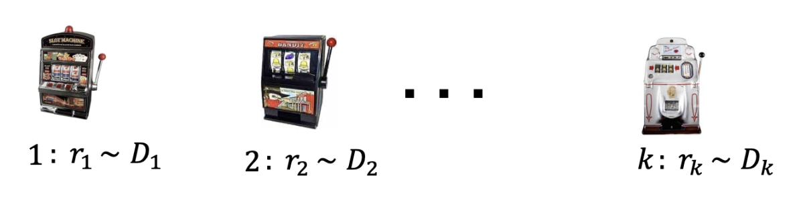
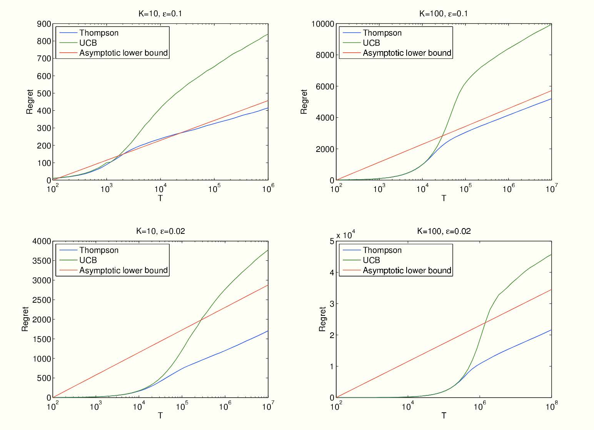
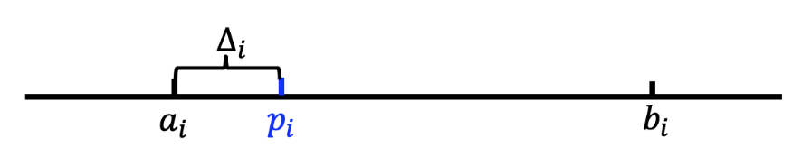
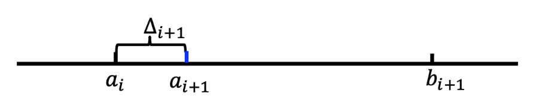
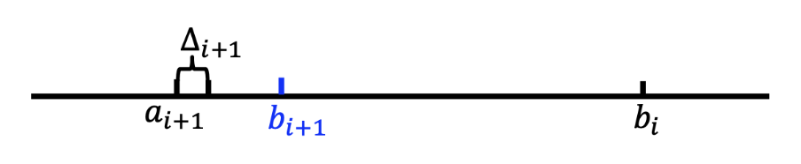

# Lec 5: 多臂老虎机算法基础与应用

<!-- head 元素一定要放在一级标题下面，不然标题就显示不出来了 -->
<head>
    
    <link rel="stylesheet" href="https://cdn.jsdelivr.net/npm/pseudocode@latest/build/pseudocode.min.css">
    
</head>

## 随机多臂老虎机

### 引入

一般的机器学习任务有：

    

以上都是基于**模式识别**的学习问题(recognition-based learning problems)

- 学习环境通常是给定的：输入图片/语音...输出标签
- 通常使用监督学习：学习特征到标签的映射

本讲介绍的是基于**决策**的学习问题(decision-based learning problems)

- 学习环境通常是动态的
- 通过决策过程中获得的奖励/代价学习到最优决策（AlphaGo）
- **强化学习**(reinforcement learning)
- **多臂老虎机**：无状态转移的强化学习

一个赌鬼要玩多臂老虎机，摆在他面前有 $K$ 个**臂**(arms)或**动作选择**(actions)，每一轮游戏中，他要选择拉动一个臂并会获得一个随机**奖励**(reward)（这一随机奖励来源于一个赌场设定好的分布，但赌鬼一开始不知道这一分布）。如果总共玩 $T$ 轮，他该如何最大化奖励？

    

其它场景：新闻网站（推荐系统）、动态定价、投资组合...

**问题的本质：权衡探索(explore)和利用(exploit)**

- 例如新闻网站的推荐，可以先尝试几次随机推荐探索用户的喜好，然后利用这几次尝试学习到的结果做出比较准确的推荐。

### 基本概念

???+ example "例子"

    |例子|动作|奖励|
    |:-:|:-:|:-:|
    |投资组合|选择一个股票买入|股票的涨跌|
    |动态定价|选择一个价格交易|商品销售的收益|
    |新闻网站|展示一则新闻|是否被用户点击|

根据反馈类型分类：

- **完全反馈**(full feedback)：能看见所有臂的奖励，例如投资组合中所有股票的涨跌
- **部分反馈**(partial feedback)：能看见部分臂的奖励，例如动态定价中任何更低（高）价格都被接受（拒绝）
- **老虎机反馈**(bandit feedback)：只能看见选择的臂的奖励，例如新闻网站上该新闻是否被用户点击

根据奖励类型分类：

- 随机奖励/IID 奖励：玩家或者的奖励随机取自一个未知概率分布
- 对抗性奖励：奖励可以任意，能由一个“对手”有针对性的选择
- ...

### 问题模型

在每一步 $t = 1, 2, \dots, T$ 中：

1. 玩家选择一个臂 $a_t \in A = \{a_1, \dots, a_K\}$
2. 玩家获得该臂对应的随机奖励 $r_t \sim R(a_t)\ (r_t \in [0, 1])$
3. 玩家依据过往轮次的奖励情况调整选择策略，实现奖励最大

!!! note "说明"

    - 奖励分布的均值为 $\mu(a_k) = \mathbb{E}[R(a_k)], k \in [K]$
    - 最优臂 $a^*$ 的奖励均值 $\mu^* = \max_{a \in A} \mu(a)$
    - 奖励均值差异 $\Delta (a) = \mu^* - \mu(a)$

### 遗憾模型

我们需要设计 MAB 算法实现最大化奖励，实际上就是找最优臂。那么，分析 MAB 算法的性能就是在分析算法能否找到最优臂。我们用**遗憾**(regret)来度量实际选择和最优选择的差异。

!!! definition "定义"

    - **伪遗憾**(pseudo-regret)：$R(T) = \sum\limits_{t=1}^T (\mu^* - \mu(a_t)) = \mu^* \cdot T - \sum\limits_{t=1}^T \mu(a_t)$
    - **期望遗憾**(expected regret)：$\mathbb{E}[R(T)]$

即伪遗憾就是选择最优臂的期望收益减去实际收益，期望遗憾是伪遗憾的期望（玩家策略可能存在随机性，因此 $\mu(a_t)$ 可能是随机变量）。显然，**最大化奖励的目标可以等价为最小化遗憾的目标**。

在 MAB 问题中，我们常常关注算法**遗憾界**(regret bound)。一个好的遗憾界是**次线性的**(sub-linear)，这意味着算法能逐渐学到最优臂，即

$$
\dfrac{\text{regret bound}}{T} \rightarrow 0, \quad T \rightarrow \infty
$$

### Hoeffding 不等式

!!! theorem "Hoeffding 不等式"

    假设 $X_1, X_2, \dots, X_n$ 是 $[0, 1]$ 上的独立随机变量，样本均值为 $\overline{X_n} = \dfrac{1}{n} \sum_{i=1}^n X_i, \mu = \mathbb{E}[\overline{X_n}]$。对于任意 $\varepsilon > 0$ 有：

    $$
    \mathbb{P}(|\mu - \overline{X_n}| \ge \varepsilon) \le 2 \exp (-2n \varepsilon^2)
    $$

该不等式属于**集中不等式**(concentration inequalities)，直观上来说 $\mathbb{P}(|\mu - \overline{X_n}| \le \text{small}) \ge 1 - \text{small}$，即**样本均值与实际均值的差距很小的概率是很大的**，并且随机变量个数越多（$N$ 越大）差距大的概率越小。

与多臂老虎机问题的关联：将 $X_1, \dots, X_n$ 视为选择一个臂 $n$ 次得到的 $n$ 个奖励，这一不等式表明，当 $n$ 很大时，采样出的奖励均值和臂的真实均值是非常接近的。

称 $[\mu - \varepsilon, \mu + \epsilon]$ 是**置信区间**(confidence interval)，$\varepsilon$ 是置信半径(confidence radius)。

若令 $\varepsilon = \sqrt{\dfrac{\alpha \log T}{n}}$，则有

$$
\mathbb{P}(|\mu - \overline{X_n}| \ge \varepsilon) = \mathbb{P}\Big(|\mu - \overline{X_n}| \ge \sqrt{\dfrac{\alpha \log T}{n}} \Big) \le 2T^{-2\alpha}, \forall\ \alpha > 0
$$

在接下来的讨论中一般取 $\alpha = 2$。

### 贪心算法

为了找到那个最好的臂，一个朴素的解决思路是，将**所有臂都尝试一遍，然后选择表现最好的臂，并在后续的时间步中保持这种选择**。贪心算法就是这么一种算法，它采用“完全偏向利用”的策略，其基本逻辑是：始终选择当前估计奖励最高的臂，并利用历史经验更新对每个臂的奖励估计值。

<pre class="pseudocode" lineNumber="true">
\begin{algorithm}
\caption{贪心算法}
\begin{algorithmic}
\STATE 探索阶段：将每个臂各尝试 $N$ 次
\STATE 利用阶段：
\FOR{$t > KN$}
    \STATE 选择平均奖励最高的臂 $\hat{a} = \arg \max_a Q_t(a)$
    \STATE 观察奖励 $r_t$，$N_{t + 1}(\hat{a}) = N_t(\hat{a}) + 1, Q_{t+1}(\hat{a}) = Q_t(\hat{a}) + \dfrac{r_t - Q_t(\hat{a})}{N_{t+1}(\hat{a})}$
\ENDFOR
\end{algorithmic}
\end{algorithm}
</pre>

注意 $N_t(\hat{a})$ 的含义是第 $t$ 轮前 $\hat{a}$ 被选过的次数，

$$
Q_{t+1}(\hat{a}) = Q_t(\hat{a}) + \dfrac{r_t - Q_t(\hat{a})}{N_{t+1}(\hat{a})}
$$

则是在更新 $\hat{a}$ 的平均奖励。第 $t$ 论未被选中的臂对应的 $N$ 和 $Q$ 值不变。

#### 分析

!!! theorem "定理"

    贪心算法的遗憾界为 $O(T^{\frac{2}{3}}(K \log T)^{\frac{1}{3}})$。

首先考虑 $K = 2$ 的情况，即只有两个臂。遗憾产生当且进档选择了次优臂 $a \ne a^*$。显然，探索阶段的遗憾为：

$$
R(\text{exploration}) \le N
$$

对于利用阶段，分为两种情况考虑（**通常的分析套路**）：

- 事件 $E$：所有臂 $a$ 均满足 $|\mu(a) - Q(a)| \le \sqrt{\dfrac{2 \log T}{N}}$，即两个臂的采样期望奖励 $Q(a)$ 与真实期望 $\mu(a)$ 间差距都不大的情况
- 事件 $\overline{E}$：事件 $E$ 的补集

则有：

$$
\begin{align}
& \mathbb{E}[R(\text{exploitation})] \notag \\
\le & \mathbb{E}[R(\text{exploitation})\ |\ E] \times \mathbb{P}(E) + \mathbb{E}[R(\text{exploitation})\ |\ \overline{E}] \times \mathbb{P}(\overline{E}) \notag \\
\le & \mathbb{E}[R(\text{exploitation})\ |\ E] + T \times O(\dfrac{1}{T^4}) \notag
\end{align}
$$

其中 $O(\dfrac{1}{T^4})$ 来源于

$$
\mathbb{P}\Big( |\mu(a) - Q(a)| \le \sqrt{\dfrac{2 \log T}{N}} \Big) \ge 1 - 2T^{-4}
$$

由此可以看出，如上拆分成两个事件的目标是说明**大概率发生的事件遗憾小，遗憾大的事件发生概率小**，综合二者可证明遗憾是比较小的。

记 $\text{rad} = \sqrt{\dfrac{2 \log T}{N}}$，在事件 $E$ 下产生遗憾时，有

$$
\mu(a) + \text{rad} \ge Q(a) > Q(a^*) \ge \mu(a^*) - \text{rad}
$$

其中首尾两个 $\ge$ 来自 $E$ 的定义，中间的 $>$ 来源于此时产生了遗憾，即最好的臂的采样期望比次优的臂小。整理得 $\mu(a^*) - \mu(a) \le 2 \text{rad}$。那么

$$
\begin{align}
& \mathbb{E}[R(\text{exploitation})] \notag \\
\le & \mathbb{E}[R(\text{exploitation})\ |\ E] + T \times O(\dfrac{1}{T^4}) \notag \\
\le & (T - 2N) \cdot 2 \text{rad} + O(\dfrac{1}{T^3}) \notag
\end{align}
$$

综合探索和利用的遗憾可得 $\mathbb{E}[R(T)] \le N + 2 \text{rad} T + O(\dfrac{1}{T^3})$。若令 $N = T^{\frac{2}{3}} (\log T)^{\frac{1}{3}}$，则有 $\mathbb{E}[R(T)] \le O(T^{\frac{2}{3}}(\log T)^{\frac{1}{3}})$。

---
下面考虑 $K > 2$ 的情况：

- 探索阶段的遗憾为：

    $$
    R(\text{exploration}) \le N(K - 1)
    $$

- 利用阶段的遗憾为：

    $$
    \begin{align}
    & \mathbb{E}[R(\text{exploitation})] \notag \\
    \le & \mathbb{E}[R(\text{exploitation})\ |\ E] \times \mathbb{P}(E) + \mathbb{E}[R(\text{exploitation})\ |\ \overline{E}] \times \mathbb{P}(\overline{E}) \notag \\
    \le & (T - KN) \cdot 2 \text{rad} + O(\dfrac{1}{T^3}) \notag
    \end{align}
    $$

综合探索和利用的遗憾可得 $\mathbb{E}[R(T)] \le KN + 2 \text{rad} T + O(\dfrac{1}{T^3})$。若令 $N = (\dfrac{T}{K})^{\frac{2}{3}} (\log T)^{\frac{1}{3}}$，则有 $\mathbb{E}[R(T)] \le O(T^{\frac{2}{3}}(K \log T)^{\frac{1}{3}})$。

### $\varepsilon$-贪心算法

回想上面的贪心算法存在两个问题：

- “探索”阶段的尝试带来遗憾
- “利用”阶段陷于局部最优带来遗憾

为了解决这两个问题，$\varepsilon$-贪心算法引入了随机性，在“探索”与“利用”之间实现了较好的权衡。

- 其核心思想是：以 $1 - \varepsilon$ 的概率选择当前已在最优的臂 $a' = \arg \max_a Q_t(a)$，以 $\varepsilon$ 的概率随机选择一个臂
- 前一步代表对当前知识的“利用”，后一步代表对可能最优的“探索”，从而避免陷入局部最优
- 通过调整 $\varepsilon(0 \le \varepsilon \le 1)$ 的值，可以控制探索和利用之间的平衡
    - 较小的 $\varepsilon$ 值倾向于更多的利用，而较大的 $\varepsilon$ 值倾向于更多的探索；通常而言会将 $\varepsilon$ 设置成一个较小的值，如 $\varepsilon = 0.1$

<pre class="pseudocode" lineNumber="true">
\begin{algorithm}
\caption{$\varepsilon$-贪心算法}
\begin{algorithmic}
\FOR{$t = 1, 2, \dots, T$}
    \STATE 以 $\varepsilon_t$ 的概率探索：随机选择一个臂
    \STATE 以 $(1 - \varepsilon_t)$ 的概率利用：选择 $a_t = \arg \max_a Q_t(a)$
    \STATE 观察奖励 $r_t$，$N_{t + 1}(\hat{a}) = N_t(\hat{a}) + 1, Q_{t+1}(\hat{a}) = Q_t(\hat{a}) + \dfrac{r_t - Q_t(\hat{a})}{N_{t+1}(\hat{a})}$
\ENDFOR
\end{algorithmic}
\end{algorithm}
</pre>

通过选择合适的 $\varepsilon$ 值，可以证明 $\varepsilon$-贪心算法的遗憾上界：

!!! theorem "定理"

    令 $\varepsilon_t = t^{-\frac{1}{3}}(K \log t)^{\frac{1}{3}}$，$\varepsilon$-贪心算法的遗憾界为 $O(T^{\frac{2}{3}}(K \log T)^{\frac{1}{3}})$。

该算法的优势是简单易实现，并且可以通过调整 $\varepsilon$ 灵活控制探索与利用。

### 上置信界算法

$\varepsilon$-贪心策略存在一个问题：虽然每个动作都有被选择的概率，但是这种选择太过于随机，导致最优臂被访问的概率较低，这并不能有助于智能体很大概率的发现最优选择，**上置信界算法**(upper confidence bound，UCB)很好地改进了这一点。

UCB 算法是多臂赌博机问题中一种经典的基于置信区间的探索-利用策略。其核心思想是为每个臂的奖励估计构建一个置信区间上界，选择上界最大的臂，从而在探索和利用之间自动平衡。

<pre class="pseudocode" lineNumber="true">
\begin{algorithm}
\caption{上置信界算法}
\begin{algorithmic}
\STATE 对于每个候选臂 $k = 1, 2, \dots, K$，令 $Q_1(a_k) = 0, N_1(a_k) = 0$
\FOR{$t = 1, \dots, T$}
    \IF{$t \le K$}
        \STATE 初始化顺序选择每个臂
    \ELSE
        \STATE 选择 $a_t = \arg \max_a \Big( Q_t(a) + \sqrt{\dfrac{2 \ln t}{N_t(a)}} \Big)$
    \ENDIF
    \STATE 观察奖励 $r_t$，$N_{t + 1}(a_t) = N_t(a_t) + 1, Q_{t+1}(a_t) = Q_t(a_t) + \dfrac{r_t - Q_t(a_t)}{N_{t+1}(a_t)}$
\ENDFOR
\end{algorithmic}
\end{algorithm}
</pre>

简而言之，UCB 的算法流程是：首先将每一个候选臂都选择一遍，作为初始化；然后在后续的时间步中，选择奖励均值估计量的上置信界最大的臂，其中均值估计量的上置信界定义为：

$$
Q_t(a) = \sqrt{\dfrac{2 \ln t}{N_t(a)}}
$$

最后更新被选中的臂的相关参数。其中上置信界的直观理解是：

- 上置信界的前一项 $Q_t(a)$ 代表臂的估计奖励，这个值越大说明**对应臂的历史表现越好**
- 后一项 $\dfrac{2 \ln t}{N_t(a)}$ 是置信区间的半径，其会随着选择次数的增加而变小，并且**该值越大则说明估计的不确定性越大，因此能过鼓励玩家尝试较少被选择的臂，避免陷入次优**
- 因此，选择上置信界最大的臂有利于偏向于选择表现较好或是较少选择的臂，从而算法能够逐渐收敛到最优臂

总而言之。UCB 算法同时考虑了估计奖励与不确定性，较好的平衡了探索与利用，也可以得到更好的遗憾界（证明省略）。

!!! theorem "定理"

    UCB 算法的遗憾界为 $O(\sqrt{KT \log T})$

### 汤普森采样算法

- **汤普森采样**(Thompson sampling，TS)最早于 1933 年由 [William R. Thompson](https://en.wikipedia.org/wiki/William_R._Thompson) 提出
- 雅虎 [*An Empirical Evaluation of Thompson Sampling*](https://papers.nips.cc/paper_files/paper/2011/hash/e53a0a2978c28872a4505bdb51db06dc-Abstract.html)，NIPS 2011
- 2015 年前后才出现了一些理论分析的文章

    

基本思想：

- 采用贝叶斯方法，为每个臂维护一个先验概率分布，表示对该臂奖励概率的信念
- 每次选择臂时，从每个臂的后验概率分布中进行采样，并选择采样值最高的臂
- 最后，根据获得的奖励更新所选臂的后验概率分布，从而在探索和利用之间取得平衡

<pre class="pseudocode" lineNumber="true">
\begin{algorithm}
\caption{汤普森采样算法}
\begin{algorithmic}
\STATE 对于每个候选臂 $k = 1, 2, \dots, K$，令 $S_1(a_k) = 0, F_1(a_k) = 0$
\FOR{$t = 1, \dots, T$}
    \FOR{$k = 1, \dots, K$}
        \STATE 从 $Beta(S_T(a_k) + 1, F_t(a_k) + 1)$ 分布中采样 $\theta_t(a_k)$
    \ENDFOR
    \STATE 选择 $a_t = \arg \max_a \theta_t(a)$，并观察奖励 $r_t$
    \IF{$r_t = 1$}
        \STATE $S_{t+1}(a_t) = S_t(a_t) + 1$
    \ELSE
        \STATE $F_{t+1}(a_t) = F_t(a_t) + 1$
    \ENDIF
\ENDFOR
\end{algorithmic}
\end{algorithm}
</pre>

具体而言，汤普森采样算法使用 Beta 分布 $B(\alpha, \beta)$ 来作为每个臂的选择概率分布。

- Beta 分布中参数 $\alpha$ 和 $\beta$ 分别表示伯努利试验中的成功和失败次数，$\alpha$ 越大分布越集中于 1，$\beta$ 越大则越接近于 0
- 在每一个时间步中，对于每个臂，从其 $Beta(S_t(a) + 1, F_t(a) + 1)$ 分布中进行采样；选择采样值最高的臂；执行所选臂，并观察奖励
- 根据获得的奖励更新所选臂的 Beta 分布参数
- 如果成功，则 $S_{t+1}(a_t) = S_t(a_t) + 1$；如果失败，则 $F_{t+1}(a_t) = F_t(a_t) + 1$

???+ question "思考"

    === "思考1"

        === "题目"

            只能用 Beta 分布吗？

        === "解答"

            并非如此，事实上共轭先验分布（即先验分布和后验分布属于同一个分布族）即可

    === "思考2"

        === "题目"

            只能用于奖励 $r_t \in \{0, 1\}$ 的情况吗？

        === "解答"

            如果奖励 $r_t \in [0, 1]$，则以 $r_t$ 为概率从 $\{0, 1\}$ 中抽一个数作为反馈。
        
        
总而言之，汤普森采样算法相当简洁优雅，并且也能得到和 UCB 一致的遗憾界，甚至实证中表明其效果比 UCB 算法更好（证明省略）。

!!! theorem "定理"

    TS 算法的遗憾界为 $O(\sqrt{KT \log T})$。

## 对抗性多臂老虎机

### 基本模型

**对抗性多臂老虎机**(adversarial MAB)问题是 MAB 问题的一种变体。相较于随机多臂老虎机问题的设定，**对抗性多臂老虎机问题中的奖励（代价）由对手动态生成，而不是从奖励分布中随机产生的**。该奖励可能会针对玩家的策略进行调整，从而产生了对抗性。基本模型如下：

在每一步 $t = 1, 2, \dots, T$ 中：

1. 玩家选择一个行动集合 $[n] = \{1, \dots, n\}$ 上的概率分布 $p_t$
2. **对手在已知 $p_t$ 的情况下选择一个代价向量 $c_t \in [0, 1]^n$**，即为每一个行动选择一个代价
3. 玩家选择一个行动 $i_t \sim p_t$，并且观察到代价 $c_t(t_i)$
4. 玩家学到整个 $c_t$ 以调整未来的策略

!!! note "注"

    - 玩家的目标：选取一个策略序列 $p_1, p_2, \dots, p_T$ 使得总代价最小（和此前的奖励最大相对），即最小化期望代价 $\mathbb{E}_{i_t \sim p_t}[\sum\limits_{t=1}^Tc_t(i_t)]$
    - 对手不一定非要存在，其实**只是一个最差结果分析**
    - 此处玩家不仅能学到选择的行动的代价，事实上可以学到所有行动的代价，因此是**全反馈**的情况，与此前情况不同

### 遗憾的定义

接下来希望找到一个好的’‘在线学习算法，想法仍然是定义遗憾，但此时遗憾的定义因为对手不是随机抽取的成本，因此需要调整。

第一种遗憾定义的想法是，与所有轮次结束后（每一轮的成本都已知）的事后最优作差，然而下面的例子表明这一定义是不合理的：

???+ example "例子"

    设行动集合为 $\{1, 2\}$，在每一轮 $t$，对手按如下步骤选择代价向量：假设算法选择一个概率分布 $p_t$，如果在此分布下选择行动 1 的概率至少为 1/2，那么 $c_t = (1, 0)$，反之 $c_t = (0, 1)$。在此情况下，在线算法期望代价至少为 $\dfrac{T}{2}$，而在事先知晓代价向量的情况下，最优算法的期望代价为 0。

这一例子表明，与事后最优比较可能出现线性级别的遗憾，因此这一基准太强了。因此转而将遗憾定义为在线算法与**最优固定行动事后代价**之差。

!!! definition "定义"

    固定代价向量 $c_1, c_2, \dots, c_T$，决策序列 $p_1, p_2, \dots, p_T$ 的遗憾为：

    $$
    R_T = \mathbb{E}_{i_t \sim p_t} \Big[\sum\limits_{t=1}^T c_t (t_i) \Big] - \min\limits_{i \in [n]} \sum\limits_{t=1}^T c_t(i)
    $$

即遗憾被定义成了**和每轮都选择同一行动的最优的固定行动的代价之差**，这样的定义相对而言更加合理：

- 在前面的例子中，固定策略序列（全选 0 或 1）的遗憾不再是简单的 0；
- 平均遗憾：$\dfrac{\overline{R_T}}{R}$，若 $T \rightarrow \infty, \dfrac{\overline{R_T}}{R} \rightarrow 0$，则称算法是**无憾**(no-regret)的；等价的即 $R_T$ 关于 $R$ 是次线性的
• 这一定义的合理性在于，有自然的算法实现无憾，但无憾的实现也不是平凡的

### 跟风算法

接下来的目标就是设计一个无憾的在线学习算法。首先介绍一个最简单的在线学习算法：**跟风算法**(Follow-The-Leader, FTL)

!!! definition "定义"

    跟风算法指在每一个时间点 $t$，选择最小累积代价 $\sum\limits_{s=1}^{t-1} c_s(i)$ 的行动 $i$。

???+ example "例子"

    下面这一含有两个行动 $\{1, 2\}$ 的例子表明，跟风算法不是无憾的：

    |$t$|$1$|$2$|$3$|$4$|$5$|$\dots$|$T$|
    |:-:|:-:|:-:|:-:|:-:|:-:|:-:|:-:|
    |$c_t(1)$|$1$|$0$|$1$|$0$|$1$|$\dots$|$*$|
    |$c_t(2)$|$0$|$1$|$0$|$1$|$0$|$\dots$|$*$|

    FTL 会持续选择代价为 1 的行动，总代价为 $T$，而最优固定行动算法的代价为 $\dfrac{T}{2}$，平均遗憾为 $\dfrac{1}{2}$，故不是无憾算法。

事实上，任意的确定性算法都会有线性级别的遗憾：$\dfrac{n-1}{n}T$，其中 $n$ 是可能行动的个数：

- 对手是知道我们的算法的，因此如果采用确定性算法，对手可以直接推断出我们每一步的选择，从而设置我们选择的行为有代价 1，其余行为代价为 0
- 这样玩家的总代价为 $T$，而最优固定行动算法的总代价最高为 $\dfrac{T}{n}$ （因为有 $n$ 种可能的行动）
• 如果采用随机策略，则对手只能推断出我们的概率分布 $p_t$，而不能推断出我们的具体行动 $i_t \sim p_t$，因此对手无法完美利用我们的算法

因此需要引入随机化来避免对手的推断，下面从一个简单的例子入手，引出无憾算法：乘性权重算法。

### MWU 算法

???+ example "例子"

    考虑一个简化的在线学习场景，每个行动的代价之可能为 0 或 1，并且**存在一个完美的行动，其代价永远为 0**（但玩家一开始不知道哪个是完美行动），是否存在次线性遗憾的算法？

    - 观察：只要一个行动出现了非零代价，那就可以永远排除它，但我们并不知道剩余行动中哪个最好
    - 可以设计算法如下：对每一步 $t = 1, 2, \dots, T$，记录截至目前从没出现过代价 1 的行动，然后在这些行动中根据均匀分布随机选择一个行动

任一轮 $t$，令 $S_{\text{good}} = \{i \in [n]\ |\ \text{行动} i \text{从未出现过代价} 1\}, k = |S_{\text{good}}|$。因此每个 $i \in S_{\text{good}}$ 下一轮选中概率为 $\dfrac{1}{k}$，每个 $i \notin S_{\text{good}}$ 的概率为 $0$。

对于任意的 $\varepsilon \in (0, 1)$，下面两种情况之一一定会发生：

- $i \in S_{\text{good}}$ 中至多 $\varepsilon k$ 个行动有代价 1，此时这一阶段的期望代价至多为 $\varepsilon$
- $i \in S_{\text{good}}$ 中至少 $\varepsilon k$ 个行动有代价 1，每次出现这一情况时，下一步就可以排除掉至少 $\varepsilon k$ 个行动，因此这种情况最多出现 $\log_{1 - \varepsilon} \dfrac{1}{n}$ 次

因此总的遗憾至多为：

$$
R_T = T \times \varepsilon + \log_{1 - \varepsilon} \dfrac{1}{n} \times 1 = T \varepsilon + \dfrac{\ln n}{-\ln (1 - \varepsilon)} \le T \varepsilon + \dfrac{\ln n}{\varepsilon}
$$

最后的不等号来源于 $- \ln (1 - \varepsilon) \ge \varepsilon (0 < \varepsilon < 1)$。显然当 $\varepsilon = \sqrt{\dfrac{\ln n}{T}}$ 时，$R_T \le 2 \sqrt{T \ln n}$，即次线性遗憾。

---
可以将之前的算法描述得更加形式化：

<pre class="pseudocode" lineNumber="true">
\begin{algorithm}
\caption{形式化表述的算法}
\begin{algorithmic}
\STATE Initialize weight $w_1(i) = 1, \forall i = 1, \dots, n$
\FOR{$t = 1, \dots, T$}
    \STATE Let $W_t = \sum\limits_{i \in [n]} w_t(i)$, pick action $i$ with probability $\dfrac{w_t(i)}{W_t}$
    \STATE Observe cost vector $c_t \in \{0, 1\}^n$
    \FORALL{$i \in [n]$}
        \STATE update $w_{t+1}(i) = w_t(i) \cdot (1 - c_t(i))$
    \ENDFOR
\ENDFOR
\end{algorithmic}
\end{algorithm}
</pre>

在更一般的情况下，代价可以是 $[0, 1]$ 中的任意值，并且不一定存在完美策略，因此我们需要对算法进行修改：

<pre class="pseudocode" lineNumber="true">
\begin{algorithm}
\caption{乘性权重算法}
\begin{algorithmic}
\STATE Initialize weight $w_1(i) = 1, \forall i = 1, \dots, n$
\FOR{$t = 1, \dots, T$}
    \STATE Let $W_t = \sum\limits_{i \in [n]} w_t(i)$, pick action $i$ with probability $\dfrac{w_t(i)}{W_t}$
    \STATE Observe cost vector $c_t \in \textcolor{red}{[0, 1]^n}$
    \FORALL{$i \in [n]$}
        \STATE update $w_{t+1}(i) = w_t(i) \cdot (1 - \textcolor{red}{\varepsilon \cdot} c_t(i))$
    \ENDFOR
\ENDFOR
\end{algorithmic}
\end{algorithm}
</pre>

第一处修改扩展了代价的范围，第二处修改使得权重更保守，否则不存在完美策略时所有行动的权重全部归零。

上图给出的算法就是**乘性权重**(Multiplicative Weights Update, MWU)算法。算法的直观是，根据每个行动在之前阶段的表现来决定下一阶段的权重，即表现好的行动权重增加，表现差的行动权重减少。

那么，乘性权重算法是否是无憾的呢？

!!! theorem "定理"

    乘性权重算法在之前的问题设定下的遗憾至多为 $O(\sqrt{T \ln n})$。    

接下来证明定理。

???+ proof "分析"

    关键：将期望代价与权重的下降关联起来。第 $t$ 轮的期望代价为：

    $$
    \overline{C_t} = \sum\limits_{i=1}^n p_t(i)c_t(i) = \dfrac{\sum_{i=1}^n w_t(i) c_t(i)}{W_t}
    $$

    事实上这正比于总权重的下降，即 $\sum_{i=1}^n \varepsilon w_t(i) c_t(i) = \varepsilon W_t \overline{C_t}$。因此下面的证明思想分析的是总权重下降的速度。

    !!! theorem "引理"

        $W_{t+1} \le W_t \cdot e^{-\varepsilon \overline{C_t}}$，其中 $W_t = \sum_{i=1}^n w_t(i)$ 是第 $t$ 轮的总权重，$\overline{C_t}$ 是第 $t$ 轮的期望代价。

    直接根据权重更新法则即可证明：

    $$
    \begin{align}
    W_{t+1} & = \sum\limits_{i=1}^n w_{t+1}(i) = \sum\limits_{i=1}^n w_t(i) \cdot (1 - \varepsilon c_t(i)) \notag \\
    & = W_t - \varepsilon \sum\limits_{i=1}^n w_t(i)c_t(i) = W_t - \varepsilon W_t \overline{C_t} \le W_t \cdot e^{-\varepsilon \overline{C_t}} \notag
    \end{align}
    $$

    不断应用上述引理，可以得到如下推论：

    !!! note "推论"

        $$
        W_{t+1} \le ne^{-\varepsilon \sum_{t=1}^T \overline{C_t}}
        $$

    !!! theorem "引理"

        对于任意的行动 $i$，都有 $W_{t+1} \ge e^{-T \varepsilon^2} \cdot e^{-\varepsilon \sum_{t=1}^T c_t(i)}$。

    这一步的放缩比较激进，但非常有效：

    $$
    \begin{align}
    W_{t+1} & \ge w_{t+1}(i) = w_1(i) \cdot \prod\limits_{t=1}^T(1 - \varepsilonc_t(i)) \notag \\
    & \ge \prod\limits_{t=1}^T e^{-\varepsilon c_t(i) - \vareosilon^2c_t^2(i)} \ge e^{-T\varepsilon^2} \cdot e^{-\varepsilon \sum_{t=1}^T c_t(i)} \notag
    \end{align}
    $$

    其中第二个不等号使用 $1 - \delta \ge e^{-\delta - \delta^2}$，第三个不等号直接将 $c_t^2(i)$ 项放大成1。

    ---
    回顾上述给出的结论：

    - $W_{t+1} \le ne^{-\varepsilon \sum_{t=1}^T \overline{C_t}}$
    - 对于任意的行动 $i$，都有 $W_{t+1} \ge e^{-T \varepsilon^2} \cdot e^{-\varepsilon \sum_{t=1}^T c_t(i)}$

    综合有 $e^{-T \varepsilon^2} \cdot e^{-\epsilon \sum_{t=1}^T c_t(i)} \le ne^{-\varepsilon \sum_{t=1}^T \overline{C_t}}$，这等价于：

    $$
    -T\varepsilon^2 - \varepsilon \sum\limits_{t=1}^T c_t(i) \le \ln n - \varepsilon \sum\limits_{t=1}^T \overline{C_t}
    $$

    重新整理有：
    
    $$
    \sum\limits_{t=1}^T \overline{C_t} - \sum\limits_{t=1}^T c_t(i) \le \dfrac{\ln n}{\varepsilon} + T \varepsilon
    $$

    取 $\varepsilon = \sqrt{\dfrac{\ln n}{T}}$，有 $\sum\limits_{t=1}^T \overline{C_t} - \min\limits_i \sum\limits_{t=1}^T c_t(i) \le 2 \sqrt{T \ln n}$，即遗憾至多为 $O(\sqrt{T \ln n})$。

!!! note "注"

- 注意 MWU 算法对于任意的代价序列都是无憾的，这就是对抗性的意义，上述证明也不依赖于任何对代价序列的假设；
- 如果使用 $w_{t+1}(i) = w_t(i) \cdot e^{-\varepsilon c_t(i)}$，因为 $e^{-\varepsilon} \approx 1 - \varepsilon$，因此也是可以进行类似的分析的
    - 这样得到的算法称为 [Hedge 算法](https://en.wikipedia.org/wiki/Multiplicative_weight_update_method#Hedge_algorithm)
- 如果从全反馈更换为老虎机反馈，算法思路不变，得到的是 [Exp3 算法](https://en.wikipedia.org/wiki/Multi-armed_bandit#Exp3)

## 多臂老虎机的应用

### 基本思想

- 面对具有不确定性的问题的“万金油”方法
- 在数据市场相关文献中的应用
    - 在线定价问题：数据卖家不确定数据对于买家的价值，可以使用随机多臂老虎机建模解决
    - 数据获取问题：数据买家不确定数据市场上哪些数据对于自己的训练任务而言最有效，可以使用随机或对抗性多臂老虎机建模解决

### 动态定价问题

下面给出在线定价最经典文献的一个简化场景，解决方法与上述随机和对抗性多臂老虎机算法都不同

• *The Value of Knowing a Demand Curve*, R. Kleinberg and T. Leighton, FOCS 2003, FOCS 2023 时间检验奖

!!! example "例子"

    假设你要出售一份数据，你知道会有 $N$ 个人来购买你的数据，并且每个人对数据的估值 $v$ 都完全一致，都在 $[0, 1]$ 中。买家是逐个到达的，你需要提供一个价格 $p$，如果 $v \ge p$，买家就会购买你的数据，否则买家会离开。你的目标是尽快地学习到 $v$ 的值，误差范围是 $\varepsilon = \dfrac{1}{N}$

显然，最简单的想法就是通过二分搜索迅速达到这一精度：最多需要 $\log N$ 次的搜索来实现这一精度。

### 二分搜索

- 如果的确遇到了最坏的情况，$\log N$ 次搜索之后，可以设置到价格 $p \ge \tilde{v} - \dfrac{1}{N}$，其中 $\tilde{v}$ 是我们第 $log N$ 轮学习到的值
- 在这种情况下，$N$ 轮之后的总收益是

$$
\underbrace{0}_{\text{前} \log N \text{轮}} + \underbrace{(N - \log N)(v - \dfrac{2}{N})}_{\text{后} N - \log N \text{轮}} \approx vN - v \log N - 2
$$

- 则二分搜索的遗憾为 $R \approx vN - (vN - v \log N - 2) = v \log N + 2$
- 这是最小的可能遗憾吗？

!!! theorem "定理"

    存在一个算法，使得其遗憾至多为 $1 + 2 \log \log N$。

- 尽管二分搜索是在没有任何先验信息的情况下能搜索到 $N$ 的最快算法，但当猜测的 $p_i > v$ 时，卖家一分钱也赚不到
- 也就是说，二分搜索在向上探索的时候可能过于激进，因此改进的算法需要在探索时更加保守！

### 改进算法

1. 在第 $i$ 阶段，我们保持一个探索区间 $[a_i, b_i]$，其中 $a_1 = 0, b_1 = 1$，并设置 $\Delta_1 = \dfrac{1}{2}$
2. 为第 $i$ 个买家 $i$ 提供价格 $p_i = a_i + \Delta_i$

    

        
    

3. 如果 $i$ 接受价格 $p_i$，则 $a_{i+1} = p_i, b_{i+1} = b_i, \Delta_{i+1} = \Delta_i$

    

        
    

4. 如果 $i$ 拒绝价格 $p_i$，则 $a_{i+1} = a_i, b_{i+1} = p_i, \Delta_{i+1} = (\Delta_i)^2$

    

        
    

5. 当 $b_i - a_i \le \dfrac{1}{N}$，此后价格均取 $a_i$，不再改变。

!!! theorem "定理"

    改进算法的遗憾至多为 $1 + 2 \log \log N$。

首先需要分析区间长度 $b_i - a_i$ 的特点，有如下结论：

!!! theorem "引理"

    $\Delta_i = 2^{-2^{j-1}}$，并且当 $\Delta_{i+1} = (\Delta_i)^2$ 时，$b_{i+1} - a_{i+1} = \Delta_i = \sqrt{\Delta_{i+1}}$。

第一个结论根据数学归纳法可以证明：

- 当 $i = 1$ 时，$\Delta_1 = \dfrac{1}{2} = 2^{-2^0}$
- 假设对于 $i = k$ 成立，即 $\Delta_k = 2^{-2^{j-1}}$，则：

    $$
    \Delta_{k+1} = (\Delta_k)^2 = 2^{-2^{j-1} - 2^{j-1}} = 2^{-2^j}
    $$

第二个结论，当 $\Delta_{i+1} = (\Delta_i)^2$ 时，根据算法可以直接得到。

- 在 $b_i - a_i \le \dfrac{1}{N}$ 后，总的遗憾最多为 1
- 因此重点在于分析达到这一步之前的遗憾
- 在达到这一步之前 $\Delta$ 更新了多少次？
    - $\log \log N$：令 $2^{-2^i} = \dfrac{1}{N}$，则 $i = \log \log N$
    - 接下来就要证明每个 $\Delta i$ 内产生的遗憾是有限的

!!! theorem "引理"
    
    任意的步长 $\Delta i$ 内的遗憾至多为 2。

- 如果在 $\Delta i$ 下直接被拒绝，遗憾至多为 1
- 如果发生出售，则最多出售 $\dfrac{\sqrt{\Delta_i}}{\Delta_i}$ 次，因为 $\Delta_{i-1} = \sqrt{\Delta_i}$，如果超出这个次数，那么 $\Delta_{i-1}$ 在前面的步骤不会更新
- 因此出售过程中的遗憾最多为

    $$
    \dfrac{\sqrt{\Delta_i}}{\Delta_i} \times \sqrt{\Delta_i} = 1
    $$

综合上述两个引理可以得到改进算法的遗憾为 $1 + 2 \log \log N$。

