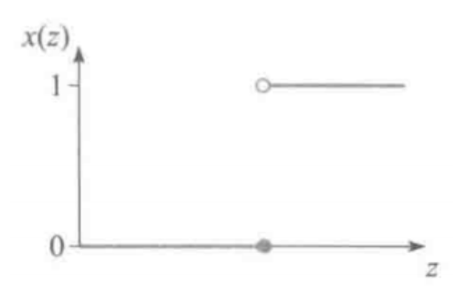

# Lec 6: 拍卖与机制设计基础

## 拍卖理论基础

### 出售物品的方式

- **公布价格**(posted pricing)：指以在菜单/货架等上标明的固定价格出售物品的方式，餐厅吃饭、超市和互联网购物等都是这种方式的例子
- **拍卖**(auction)：指以买方出价、卖方出价或买卖双方互相出价决定最终物品的出售对象以及出售价格的方式，其中的出价称为**投标**(bid)，通俗而言也可称报价
    - 讨价还价可以建模为买卖双方互相投标的过程，因此也可以视为一类特殊的拍卖

### 常见的拍卖形式

- **英式拍卖**(English auction)或**公开升价拍卖**(open ascending price auction)：最广为人知的拍卖形式。**拍卖师**(auctioneer)（不一定是卖家本人，可能只是一个中介）从一个比较低的价格开始，只要还有至少两个感兴趣的竞拍者，就以一个**较小的增量逐渐提高价格**，直到只剩下唯一一个竞拍者为止。此时**唯一的竞拍者赢得拍卖品并向拍卖师支付倒数第二个竞拍者退出时竞拍的价格**。
    - 英式拍卖最熟悉的场景或许就是古董拍卖，当然例如政府土地等的拍卖也是英式拍卖的典型应用。

- **荷式拍卖**(Dutch auction)或**公开降价拍卖**(open descending price auction)（有时也叫做日式拍卖）与英式拍卖相反，拍卖师从一个足够高的价格开始（保证没有竞拍者感兴趣），然后**逐渐降低价格**，直到有竞拍者愿意接受价格为止。此时**该竞拍者赢得拍卖品并向拍卖师支付这个价格**。
    - 荷式拍卖则在一些特殊场景中有所应用，这一应用与“荷式”这一名字的由来有关：荷兰盛产郁金香，而花卉保质期短，因此拍卖需要尽快完成，显然降价拍卖比升价拍卖更具有时间效率。

英式和荷式拍卖都属于**公开拍卖**，即所有竞拍者都能看到其他竞拍者的出价。相对的一类场景拍卖称为**密封拍卖**(sealed-bid auction)，即所有竞拍者以密封形式提交竞价，传统的以寄信封形式提交竞价的拍卖即属于这一类，更现代的例子则是在网页上直接提交报价（如 eBay）。

密封价格拍卖中最常见的两种为**第一价格拍卖**(first-price auction)和**第二价格拍卖**(second-price auction)，简称一价拍卖和二价拍卖。

- 前者指报价最高的竞拍者赢得物品，并支付自己的报价（也就是所有报价中最高的报价）
- 后者也是报价最高的竞拍者赢得物品，但只需要支付所有报价中第二高的报价

有的拍卖中会设置**保留价格**(reserve price)，指卖家在拍卖开始前设定的最低出售价格。如果所有报价都低于保留价格，卖家选择不卖出物品。当然有的拍卖也会设置**入场费**(entry fee)，即所有参与者在拍卖开始前需要支付的费用，无论是否赢得拍卖。

在有的拍卖中，不一定只有单个物品待出售，这类拍卖称为**多物品拍卖**(multi-item auction)，只出售一个物品的拍卖称为**单物品拍卖**(single-item auction)。

- 多物品拍卖中有的是拍卖多个相同物品，例如数据产品拍卖，因为可以数据零成本复制，因此可以在一场拍卖中出售完全一致的多份数据
- 另一类是可以同时拍卖多个不同物品，例如著名的频谱拍卖，政府可以同时拍卖多个不同频段的无线电频谱

有的拍卖只需买方一轮投标即可决定拍卖结果，如密封第一、第二价格拍卖，有的拍卖可能需要多轮逐次决定。还有一些拍卖场景需要卖家也提供投标，例如**讨价还价**(bargaining)，或**双向拍卖**(double auction)，一种基本的双向拍卖方式是取买卖双方报价均值为最后的售价。

还有一类拍卖称为**反向拍卖**(reverse auction)是卖家报价的，在反向拍卖中，买家作为拍卖师通常具有一些采购需求，竞拍者是待采购商品的卖家，买家通过卖家的投标，结合其提供的商品质量决定选择哪些卖家的商品。不难发现，常见的招标就可以使用反向拍卖的方式进行。

---
总结而言，上面提到的拍卖都可以从三个角度进行分类：

- **投标**规则：只有买家投标，只有卖家投标，还是买卖双方投标？投标是针对单个物品，还是可以同时投标多个物品？是否投标低于某个价格无效？
- **交易**规则：拍卖结果是哪些竞拍者可以获得物品？获得物品的竞拍者需要支付多少？没有获得物品的竞拍者是否需要支付？
- **信息**规则：投标时是否公开其他投标者的报价？读者应当不难将上面的拍卖形式从这三个角度分别进行分类。

### 单物品密封拍卖的一般框架

从最容易分析的单物品密封拍卖入手，引出拍卖的基本问题、分析方法和一些常用的基本结论。

- 一个卖家有**一个不可分割的物品**待出售
- 有 $n$ 个潜在的买家（竞拍者）$N = \{1, 2, \dots, n\}$
    - 每个买家 $i$ 对物品有一个心理价位（估值）$t_i$，但 **$t_i$ 对卖家以及其它买家而言是不完全信息**（即 $t_i$ 是买家的类型）
    - 买家估值的**先验概率密度 $f_i : [a_i, b_i] \rightarrow \mathbb{R}^+$ 是共同知识**，其中 $a_i$ 和 $b_i$ 是买家 $i$ 估值的下界和上界
    - 假设 $f_i$ 连续且 $f_i(t_i) > 0$ 对所有 $t_i \in [a_i, b_i]$ 成立，则 $t_i$ 的分布函数

        $$
        F_i(t_i) = \int_{a_i}^{t_i} f_i(s_i) d s_i
        $$

        分布函数在 $t_i$ 处的值表示参与人 $i$ 心理价位小于等于 $t_i$ 的概率

- 卖家对物品也有一个估值，代表这个物品没被卖出去仍被卖家持有时卖家的效用，记为 $t_0$，这一信息是共同知识。为讨论方便，假定 $t_0 = 0$

用不完全信息静态博弈描述单物品拍卖：

- 每个买家对物品的估值是私人信息，但具有先验分布共同知识
- 每个买家 $i$ 的策略是选择一个报价 $b_i$
- 卖家没有策略，只需要按照给定的拍卖的规则（一价/二价），基于买家的报价 $\bm{b} = (b_1, \dots, b_n)$，决定博弈的结果 $(\bm{x}, \bm{p})$
    - 其中 $\bm{x}$ 是物品的分配规则，$x_i(\bm{b})$ 表示买家 $i$ 在所有竞拍者投标为 $\bm{b}$ 下获得物品的概率；
    - $\bm{p}$ 是支付规则，$p_i(\bm{b})$ 表示买家 $i$ 在所有竞拍者投标为 $\bm{b}$ 下需要支付的价格。当然，在单物品拍卖中，要求

        $$
        \sum\limits_{i=1}^n x_i(\bm{b}) \le 1
        $$

        即只有一个物品待出售。如果等于 1，代表物品总会卖出去，如果小于 1，代表有可能卖家选择不卖出物品。注意，$x_i(\bm{b})$ 不一定只取 0 和 1，也可能是一个概率。

给定一个分配结果 $(\bm{x}, \bm{p})$，每个买家 $i$ 的效用以拟线性效用函数的形式表达为：

$$
u_i = x_i(\bm{b})t_i - p_i(\bm{b})
$$

其中 $x_i(\bm{b})t_i$ 表示买家 $i$ 获得物品的**期望收益**（获得物品的概率乘以物品的效用），$p_i(\bm{b})$ 表示买家 $i$ 需要支付的价格。

注意无论什么类型的拍卖，**最终的结果都是由分配规则和支付规则决定**。接下来我们将分别讨论第二价格拍卖和第一价格拍卖的博弈结果。

### 单物品第二价格拍卖

首先根据上述讨论形式化第二价格拍卖。在第二价格拍卖中，假设买家投标为 $\bm{b} = (b_1, \dots, b_n)$，那么最终的分配规则 $(\bm{x}, \bm{p})$ 为

$$
x_i(\bm{b}) = \begin{cases}1 & \text{如果} b_i = \max_{j \in N} b_j \\ 0 & \text{其他情况}\end{cases} \\
p_i(\bm{b}) = \begin{cases}\max_{j \ne i} b_j & \text{如果} b_i = \max_{j \in N} b_j \\ 0 & \text{其他情况}\end{cases}
$$

即报价最高的买家赢得物品，但只需要支付第二高的报价。

有多个买家报出相同的最高报价时该如何处理？

- 一方面由于每个买家的估值服从连续分布，因此这种情况的概率为 0
- 另一方面即使出现这种情况，卖家也可以随机选择一个报价最高的买家赢得物品打破平局
- 如果没有特别说明，都忽略多个买家报出相同最高报价的情况

#### 二阶拍卖是诚实占优的

我们刻意先介绍第二价格拍卖，而非按照自然的顺序首先介绍第一价格拍卖，这是因为第二价格拍卖的博弈均衡非常简单且具有良好的性质：

!!! definition "二价拍卖诚实占优"

    在单物品第二价格拍卖中，即每个竞拍者将自身估值 $t_i$ 作为报价 $b_i$ 得到的 $\bm{b} = (t_1, \dots, t_n)$ 是（弱）占优策略均衡。简而言之，**所有竞拍者诚实报价是（弱）占优策略均衡**。

诚实报价是占优策略是二价拍卖的一个非常重要的性质：

- 竞拍者参与二价拍卖时的**策略非常简单：只需要将自己的估值作为报价即可，不需要考虑与其他竞拍者的复杂关系**
- 另一方面，诚实报价可以**显示竞拍者的真实估值，从而打破信息不对称，卖家只需直接选出报价最高的竞拍者即可实现社会福利最大化**
    - 因为社会福利就等于拥有物品的人对物品的估值，因此最大化社会福利就要将物品转移到对其估值最高的人手中

??? proof "证明"

    考虑任意的竞拍者 $i$，设 $p_i = \max_{j \ne i} b_j$，即 $p_i$ 是除了 $i$ 之外的所有竞拍者的最高报价。分三种情况讨论：

    1. 如果 $t_i > p_i$，那么 $i$ 如果报价 $b_i = t_i$ 就会赢得拍卖并支付 $p_i$，效用 $t_i - p_i > 0$。考虑策略的偏离，如果选择报价提高至 $b_i' > t_i$，结果没有任何改变；如果报价降低至 $t_i > b_i' \ge p_i$，结果仍然一致；但如果降低报价至 $b_i' < t_i$，那么 $i$ 将不再赢得拍卖，因此 $i$ 的效用将变为 0，故 $t_i > p_i$ 时 $i$ 诚实报价是（弱）占优策略。

    2. 如果 $t_i < p_i$，那么 $i$ 如果报价 $b_i = t_i$ 不会赢得拍卖，效用 0。考虑策略的偏离，如果报价降低至 $b_i' < t_i$，结果没有任何改变；如果报价提高至 $t_i < b_i' < p_i$，结果仍然一致；但如果提高报价至 $b_i' \ge p_i$，那么 $i$ 将赢得拍卖并支付 $p_i$，因此 $i$ 的效用将变为 $t_i - p_i < 0$，故 $t_i < p_i$ 时 $i$ 诚实报价是（弱）占优策略。

    3. 如果 $t_i = p_i$，事实上拍卖的输赢带给 $i$ 的效用都是 0，因此 $i$ 无论报价多少都不会影响效用。

    综上，对于任意的竞拍者 $i$，诚实报价是（弱）占优策略均衡。

#### 缺陷

尽管第二价格拍卖具有如此好的性质，但在通常的印象中似乎并不如第一价格拍卖常见。一个重要的原因是，卖家可以操纵第二价格拍卖，通过向最高报价者谎称一个比较高的第二价格来提高自己的收益：

- 例如在第二价格拍卖中，你是最高价格的报价者，你的报价为 100 元，第二高报价为 80 元，因此你赢得拍卖并支付 80 元。
- 但因为是密封拍卖，你无法得知第二高报价的准确数值，如果卖家告诉你第二高报价是 90 元，你也无从得知 90 元是不是真的第二高报价，但卖家掌握这一信息，从而可以从信息操纵中获得更高的收益。

### 第一价格拍卖

#### 第一价格拍卖不是诚实占优的

我们自然希望一价拍卖能有二价拍卖那样简单的结果，但只需要稍作分析就会发现一价拍卖的博弈结果并不那么简单：

- 如果一价拍卖中竞拍者报出自己的估值，那么赢下拍卖后的支付就是自己的估值，因此**效用为 0，与没有赢下拍卖一致**，因此从直观上看一价拍卖的参与人有动机报出低于自己估值的报价。

严格来说，代入二价拍卖诚实报价占优的证明，一价拍卖在 $t_i > p_i$ 时（报价高于第二高价格时），**如果将报价从 $t_i$ 下调到 $p_i$ 和 $t_i$ 之间，竞拍者 $i$ 仍然可以赢下拍卖，但效用可以提高到大于 0 的值**，因此一价拍卖并非诚实报价是占优策略，而是有动机报出低于自己估值的报价。

- 由此可以看出**二价拍卖诚实的关键：报价与自己的估值无直接关联**
- 问题：三价拍卖是否诚实？——不是

#### 第一价格拍卖的均衡

因此接下来尝试**从贝叶斯纳什均衡的角度给出一价拍卖的不完全信息静态博弈结果**。在一价拍卖中，假设买家投标为 $\bm{b} = (b_1, \dots, b_n)$，那么最终的分配规则 $(\bm{x}, \bm{p})$ 为：

$$
x_i(\bm{b}) = \begin{cases}1 & \text{如果} b_i = \max_{j \in N} b_j \\ 0 & \text{其他情况}\end{cases} \\
p_i(\bm{b}) = \begin{cases}b_i & \text{如果} b_i = \max_{j \in N} b_j \\ 0 & \text{其他情况}\end{cases}
$$

下面计算一价拍卖的贝叶斯纳什均衡，一般的结论推导比较复杂，因此只考虑非常简单的情况的计算。

???+ example "例子"

    假设只有两个竞拍者，并且两个竞拍者的估值是独立的，且都服从 [0, 1] 上的均匀分布。两个竞拍者的真实估值记为 $t_1, t_2$，试求解博弈的纯策略贝叶斯纳什均衡。

这一博弈对应<u>类型空间连续且策略空间连续</u>的情况，因此比之前介绍的例子都要复杂。自然地，可以考虑具有如下性质的特殊均衡：

- 纯策略均衡
- 由于两个竞拍者是对称的，因此考虑对称均衡，即二者的出价策略都是当自己的估值为 $t_i$ 时出价 $\beta(t_i)$
- 假设 $\beta$ 是增函数，即估值越大报价越高；
- $\beta(0) = 0$，即估值为 0 的竞拍者出价也为 0。

回忆纯策略均衡的求解是寻找对方策略的最优反应，因此首先写出当竞拍者 1 报价 $b_1$，竞拍者 2 报价 $\beta(t_2)$ 时竞拍者 1 的效用为：

$$
\begin{align}
(t_1 - b_1)\mathbb{P}(b_1 > \beta(t_2)) & = (t_1 - b_1)\mathbb{P}(t_2 < \beta^{-1}(b_1)) \notag \\
& = (t_1 - b_1) \cdot \beta^{-1} (b_1) \notag 
\end{align}
$$

对 $b_1$ 求导有取极大值的必要条件为

$$
-\beta^{-1}(b_1) + \dfrac{t_1 - b_1}{\beta'(\beta^{-1}(b_1))} = 0
$$

已知考虑对称均衡，故均衡时 $b_1 = \beta(t_1)$，代入上式有

$$
t_1 = t_1 \beta'(t_1) + \beta(t_1)
$$

上式对任意的 $t_1$ 都成立，可以改写为

$$
t = (t\beta(t))'
$$

不难解得 $\beta(t_1) = \dfrac{t_1}{2}$，这就解出了一价拍卖的对称递增均衡。当然上述一阶条件只是极值的必要条件，还需要检验充分性，此处省略。

需要强调的是，这一均衡仅仅只是在竞拍者估值独立同分布（而且是最简单的均匀分布）下的**递增对称**均衡，即使如此求解过程也并不简单，可想而知非独立同分布情况下的均衡更难以求解。因此第一价格拍卖下竞拍者的策略决定就会更加复杂，远不及二价拍卖那样简单。

??? example "习题：N 人一价拍卖"

    === "题目"

        

            
        

    === "解答"

        

            
        

### 收入等价定理

在第二价格拍卖中，竞拍者诚实报价是占优策略，但赢得拍卖的竞拍者只需支付第二高报价；而在第一价格拍卖中，竞拍者会降低自己的报价，但赢得拍卖的竞拍者需要支付的价格是自己的报价（即最高的报价）。自然的问题是：在这两种拍卖中，卖家的期望收入哪种拍卖会更高呢？

在只有两个竞拍者，且两个竞拍者的估值独立同分布于 $[0, 1]$ 上的均匀分布的情况下，竞拍者 1 报价为 $\dfrac{t_1}{2}$，其赢下拍卖的概率为

$$
\mathbb{P}\Big(\dfrac{t_1}{2} > \dfrac{t_2}{2}\Big) = \mathbb{P}(t_2 < t_1) = t_1
$$

因此竞拍者 1 的期望支付为 $t_1 \cdot \dfrac{t_1}{2} = \dfrac{t_1^2}{2}$。站在卖家的角度，$t_1$ 是不确定的，因此卖家认为竞拍者 1 的期望支付为

$$
\int_0^1 \dfrac{t_1^2}{2} d t = \dfrac{1}{6}
$$

竞拍者 2 的分析完全一致，期望支付也为 $\dfrac{1}{6}$，故卖家认为一价拍卖能带来的期望支付为 $\dfrac{1}{3}$。

---
还有一种计算方式：在只有两个竞拍者，且两个竞拍者的估值独立同分布于 $[0, 1]$ 上的均匀分布的情况下，可以直接写出一价拍卖选择对称递增均衡下的期望收益等于

$$
\mathbb{E}[\max(\beta(t_1), \beta(t_2))] = \mathbb{E} \Big[\dfrac{\max(t_1, t_2)}{2}\Big]
$$

$\max (t_1, t_2)$ 是次序统计量，对应的分布函数为 

$$
F(t) = \mathbb{P}(\max(t_1, t_2) < t) = \mathbb{P}(t_1 < t) \cdot \mathbb{P}(t_2 < t) = t^2
$$

故对应的密度函数为 $f(t) = 2t$，因此收益期望值等于

$$
\dfrac{1}{2} \mathbb{E}[\max(t_1, t_2)] = \dfrac{1}{2} \int_0^1 t \cdot 2t dt = \dfrac{1}{3}
$$

在二价拍卖的情况下，根据诚实报价占优以及支付第二高报价可知卖家的期望收益为（具体计算步骤省略）

$$
\mathbb{E}[\min(t_1, t_2)] = \dfrac{1}{3}
$$

因此对于卖家而言，在上述情况下选择第一和第二价格拍卖，最终得到的期望收益无差别。

事实上这并不是巧合，而是下面这一定理的一个特例：

!!! theorem "收入等价定理"

    假设竞拍者估价独立同分布，那么只要估价为 0 的竞拍者的期望支付为 0，且拍卖规则为报价最高者得到物品，则拍卖的递增对称均衡都会使得卖家获得相等的期望收入。

定理的证明不要求掌握。利用这一结论，习题要求我们求解一些形式特别的拍卖的均衡策略。

??? example "例子"

    === "题目"

        

            
        

        

            
        

    === "解答"

        

            
        

### 其他拍卖理论问题

- 信息问题：本课程讨论只涉及竞拍者估值相互独立的情况（不一定同分布），但实际上竞拍者的估值可能是相关的
    - 为什么竞拍者的估值是不完全信息的：其一是**偏好不确定性**，即买家个人对物品的喜好各不相同；其二是**质量不确定性**，即物品的质量对买家而言是不完全信息
    - 如果只存在偏好不确定性，那么不同买家的估值可以认为独立，但如果存在质量不确定性，某个买家的估值可能会影响其他买家的估值
    - 比如对一处石油矿藏的估值，因为有的买家可能具有更多的对这处矿藏质量的信息，因此部分买家的估值就会受到其他买家的估值的影响，这种情况称为**相互依赖价值**(interdependent value)

    回忆英式拍卖、荷式拍卖以及第一价格和第二价格拍卖，现在可以讨论它们之间的关系：

    - 英式拍卖：**当拍卖师叫价小于等于估值时，理性的竞拍者会继续竞拍**，否则退出；因此最终的胜者具有最高估值，并且**支付的价格是倒数第二个竞拍者退出时竞拍的价格**，因此英式拍卖和第二价格拍卖等价。

        然而**如果考虑相互依赖价值，英式拍卖无法与第二价格拍卖等价**：

        - 因为在拍卖师不断提高价格的过程中，竞拍者的行为会互相影响
        - 例如某轮报价后很多竞拍者的退出会使得留在拍卖中的竞拍者对自己的高估值产生怀疑，并有可能改变其接下来的行为
        - 而二价拍卖作为密封价格拍卖，各竞拍者之间完全无法相互影响

    - 荷式拍卖：**理性的竞拍者会在拍卖师叫价小于等于自己估值时投标，因此最终的胜者具有最高估值，且支付价格是自己的估值（第一价格）**，因此荷式拍卖和第一价格拍卖具有等价性。
        - 荷式拍卖中能带个其他参与人有用信息的行为只有某个竞拍者愿意以当前价格购买，然而此后拍卖就结束了，**因此不存在信息问题，故而仍然可以与一价拍卖视为等价的**。

- 拍卖中的合谋：**合谋竞标**(bidding ring)是非法行为，但仍然盛行。通常，合谋竞拍者会在内部进行预拍卖，选出其中估值最高的竞拍者作为代表参与拍卖，其他成员提交接近于零的报价，从而降低竞争，最终如果赢得拍卖并且降低了支付，则在合谋组织内分配利益。
- 多物品拍卖：不同拍卖物品之间存在互补性、替代性的情况；
    - 例如频谱拍卖，政府可以同时拍卖多个不同频段的无线电频谱，研究这一情况下的拍卖理论称为**组合拍卖**(combinatorial auction)
    - 2020 年诺贝尔经济学奖得主保罗·米尔格罗姆（Paul R.Milgrom）和罗伯特·威尔逊（Robert B.Wilson）就致力于组合拍卖的研究，他们的理论也被为应用于设计美国无线电频谱销售许可证的拍卖方案

## 机制设计基础

???+ info "引入"

    - 此前的讨论都是给定一个拍卖规则，然后分析在这一拍卖规则下的均衡策略，从而可以进一步分析拍卖的社会福利影响和拍卖中卖家的收入
    - 然而，假如你是一个卖家，在拍卖前你可能心里会有一个目标，即希望通过设计一种拍卖机制使得自己的收入最大化，又或者你是政府官员，你希望你组织的这场拍卖能最大化社会福利
    - 为了达成目标，你需要从拍卖的理想结果出发，设计一个拍卖机制，使得理性的竞拍者在这一机制下的行为能够达到你的目标，这就是**机制设计**(mechanism design)的基本思想
        - 更一般的机制设计不局限于拍卖，还包括物品分配、匹配以及政府政策制定等，但关键的思想都是“上有政策，下有对策”，因此设计机制时都是在**确保在这一机制下理性的参与人的均衡行动是满足机制设计者的要求的**
        - 当然本讲主要讨论基于拍卖的机制设计

### 机制设计的定义

可以从拍卖设计中抽象出较为一般的机制设计问题：

!!! definition "定义"

    对一个不完全信息博弈，一个机制是一个二元组 $(S, M)$，其中 $S = S_1 \times \dots \times S_n$ 是所有参与人可选的纯策略集合，$M$ 是一个将所有参与人的纯策略向量 $(s_1, \dots, s_n) \in S$ 映射到结果集合 $O$ 上的一个概率分布的一个映射。

    如果一个机制是**确定性的**(deterministic)，那么对于每个行动向量，机制 $M$ 将其行动映射到一个确定的结果 $o_i \in O$ 上。

例如，一个单物品密封拍卖机制是将买家的投标向量映射到一个结果 $(\bm{x}, \bm{p})$ 上的机制，其中 $\bm{x}$ 是分配规则，$\bm{p}$ 是支付规则。

当然上述定义不仅适用于拍卖机制设计，只要针对不完全信息博弈，并且将参与人策略映射到结果，就是符合上述机制定义的。

上述定义能覆盖更多的机制设计问题展现了这一定义的一般性，然而一般性的定义可能也会引入一些不寻常的例子：

???+ example "例子"

    考虑如下单物品出售机制，假设有两个买家，各有对物品的价值作为私人信息。然而现在买家的纯策略集合 $S_1$ 和 $S_2$ 不再是报价，而是一个奇怪的集合：

    $$
    S_1 = S_2 = \{\text{去上课，去操场跑步，去食堂吃饭}\}
    $$

    而机制的分配规则是不管二者行动如何，最终都随机决定物品的分配，支付规则为无论有没有得到物品，只要选择去上课就不用支付，选择去操场跑步和去食堂吃饭就必须支付 100 元。

### 直接显示机制

- 前面提到的机制令人非常困惑，但根据定义无法否认这是一个合理的机制
- 之后的讨论将重点关注**福利最大化**以及**卖家利润最大化**的拍卖机制设计，这是拍卖机制设计的两大目标
    - 这一例子表明，需要考虑的机制类型可能太过广泛了，这会给接下来的讨论带来很大的困难
- 因此希望找到一类简单的机制，只要考虑这一类机制就足以得到任何可能机制可以得到的结果，从而使得研究福利最大化和卖家利润最大化问题时只需要研究这一类简单的机制就足够了
    - 下面介绍的**显示原理**(revelation principle)可以实现这一理想
    - 由于机制设计面对的是不完全信息场景，因此考虑的均衡概念是占优策略均衡和贝叶斯纳什均衡，接下来的讨论都是如此

为了介绍显示原理，首先需要定义如下两个基本概念：

!!! definition "定义"

    对于一个机制 $(S, M)$，如果

    - 对每个参与人 $i$ 都有 $S_i = T_i$，即每个参与人的行动就是显示自己的类型，则这一机制被称为**直接显示机制**(direct revelation mechanism)或**直接机制**(direct mechanism)。
    - 如果每个参与人如实报告自己的类型构成的行动向量 $s = (t_1, \dots, t_n)$ 是博弈的均衡，则称这一机制是**激励相容**(incentive compatible)的，或者说是**诚实的**(truthful)。
        - 更详细地，如果 $s$ 是占优策略均衡，则称这一机制是**占优策略激励相容**(dominant-strategy incentive compatib, DSIC)的
        - 如果 $s$ 是贝叶斯纳什均衡，则称这一机制是**贝叶斯激励相容**(Bayesian incentive compatib, BIC)的

不难发现，如果**单物品密封价格拍卖**中各参与人的类型（即估值）集合为 $[0, +\infty)$，则每个参与人的行动集合（报价）也是 $[0, +\infty)$，故属于**直接机制**。此外，由于二价拍卖下诚实报价是占优策略均衡，故**二价拍卖是占优策略激励相容的**。

### 显示原理

!!! theorem "显示原理"

    给定任意一个机制及其占优策略均衡（或贝叶斯纳什均衡），都可以找到一个激励相容的直接机制，使得该机制均衡下的结果和原机制均衡下对应的结果一致。

可以先用一价拍卖的例子体会上述定理的含义。回忆只有两个竞拍者，且两个竞拍者的估值独立同分布于 $[0, 1]$ 上的均匀分布的情况下，一价拍卖选择对称递增均衡为 $\beta(t) = \dfrac{t}{2}$。

如果此时机制变为：报价最高者获得物品，但只需要支付最高报价的一半，那么此时竞拍者诚实报价就可以体验到和一价拍卖选择策略 $\beta$ 时完全一致的结果。下图给出了将这一思想一般化后的证明图示。

    

通俗而言就是**机制设计者替代参与人做了求解均衡的工作**，因此参与人只需要输入自己的真实类型就可以得到和原机制均衡下相同的均衡，该激励相容的直接机制也就得到了与原机制相同的结果。

由此可见，显示原理是一个十分精妙的定理，其能发挥的作用是非常大的：在后续讨论的机制设计问题中，**都可以只考虑所有参与者在均衡下如实报告自己类型的机制**。

- 因为任何机制都能转化为直接显示机制，而这一转化并不会改变机制的结果
- 因此仅通过这一类机制我们就可以得到所有可能机制的结果，从而**大大缩小了机制设计需要考虑的机制集合**
- 此外，直接显示机制中参与人需要诚实给出自己的类型，从而解决了信息不对称问题

值得一提的是，显示机制是由 2007 年诺贝尔经济学奖得主迈尔森提出并证明的，他获得诺奖基于的最重要的贡献之一就是显示原理。

### 迈尔森引理

二价拍卖是激励相容的直接显示机制，然而一价拍卖并不是。

- 自然的问题：什么样的机制是激励相容的直接显示机制？
- **迈尔森引理**(Myerson’s lemma)给出了**拍卖机制（从报价到分配和支付的机制）激励相容的充要条件**：这里首先给出迈尔森引理在**占优策略**均衡下的版本，之后讨论最优机制时会讨论贝叶斯纳什均衡下的版本。

!!! theorem "迈尔森引理"

    一个拍卖机制是 DSIC（占优策略激励相容）的，当且仅当其分配规则和支付规则 $(\bm{x}, \bm{p})$ 满足：
    
    - $\bm{x}$ 是单调的，即 $x_i(b_i)$ 是 $b_i$ 的单调不减函数
    - 给定 $\bm{x}$ 的情况下，只要给定 $p_i(0)$ 的值，对任意的 $i \in N$ 和 $b_i \in [0, +\infty)$，$\bm{p}$ 的表达式是唯一确定的：

        $$
        p_i(b_i) = p_i(0) + b_i \cdot x_i(b_i) - \int_0^{b_i} x_i(s) ds
        $$

- 引理的第一个条件是很好理解的，即报价越高，获得物品的概率越高
    - 直观而言，如果报价降低能有更高的概率获得物品，那么竞拍者就会有动机选择降低自己的报价，不符合激励相容性质
- 第二个条件说明，要满足 DSIC 性质，在给定的分配规则下，只要报价为 0 时的支付 $p_i(0)$ 确定（通常都为 0），则只有一种特定的支付规则能使得竞拍者如实报告自己的估值
    - 这一支付规则被称为**迈尔森支付公式**，下图是一个直观解释：横坐标是竞拍者 $i$ 报价的取值，纵坐标是竞拍者 $i$ 的分配结果，图中递增的曲线是分配规则 $x_i(b_i)$，阴影部分面积等于长方形面积减去曲线下方面积，正好对应竞拍者 $i$ 报价为 $b_i$ 时的支付（设 $p_i(0) = 0$）。

        

            
        

    - **显示信息的权衡：不能提取全部的剩余，否则无法做到诚实**。

#### 二价拍卖与迈尔森引理

单物品二价拍卖的 DSIC 性质直接包含在迈尔森引理中

根据二价拍卖的分配规则可知：

- 当 $b_i < \max_{j \ne i} b_j$ 时，$x_i$ 在 $[0, b_i]$ 内均为 0，因此根据迈尔森支付公式计算出此时支付 $p_i(b_i) = 0$，符合二价拍卖结果
- 当 $b_i > \max_{j \ne i} b_j$ 时，$x_i$ 在 $[\max_{j \ne i} b_j, b_i]$ 内为 1，其余部分为 0，如下图所示

    

        
    

    因此根据迈尔森支付公式计算出此时支付

    $$
    p_i(b_i) = b_i - (b_i - \max\limits_{j \ne i} b_j) = \max\limits_{j \ne i} b_j
    $$

    也符合二价拍卖结果。

根据上图的直观，对于竞拍者 $i$ 而言二价拍卖的分配规则是一个阶梯函数，其中间断点位于 $\max_{j \ne i} b_j$，报价高于此值时获得物品，低于此值时不会获得物品。一般地，称阶梯形分配规则的间断点为**关键值**(critical value)。

需要注意的是，迈尔森引理并没有限制单物品拍卖，如果**是多个完全相同物品的拍卖，且每个竞拍者具有单位需求（只需要一份物品，例如数据），不难发现上面的陈述并没有需要修改之处**。

- 此时买家的估值仍然是一维的
- 问题：假设有 $m$ 个完全的相同物品，每个竞拍者具有单位需求，请设计 DSIC 拍卖机制
    - 可行的一种拍卖机制：$m+1$ 价拍卖
    - 当然不止这么一种，

综合显示原理和迈尔森引理，在之后的拍卖设计讨论中都只需要考虑竞拍者如实报告自己估值的机制，但在使用此类机制研究时要注意，在一个给定的分配规则下只有一种特定的支付规则才能达到。因此**拍卖机制设计问题进一步转化为只需要设计分配规则，因为激励相容情况下的支付规则是对应唯一确定的**（只要固定 $p_i(0)$ 的取值）。

#### 迈尔森引理的证明

在直观理解了迈尔森引理后，接下来给出迈尔森引理的证明：

首先验证定理“当”的部分，相对而言比较简单直接。设竞拍者 $i$ 的估值为 $t_i$，当其报价为 $t_i'$ 时，其收益表达为

$$
u_i(t_i') = t_i \cdot x_i(t_i') - p_i(t_i') = (t_i - t_i')x_i(t_i') + \int_0^{t_i'} x_i(s) ds - p_i(0)
$$

特别地，当报价 $t_i = t_i'$，即竞拍者诚实报价时，其收益为

$$
u_i(t_i) = \int_0^{t_i} x_i(s) ds - p_i(0)
$$

故有

$$
u_i(t_i) - u_i(t_i') = (t_i' - t_i)x_i(t_i') - \int_{t_i}^{t_i'} x_i(s) ds - p_i(0)
$$

当 $t_i' \ge t_i$ 时，由于 $x_i$ 是增函数，故

$$
\int_{t_i}^{t_i'} x_i(s) ds \le (t_i' - t_i)x_i(t_i')
$$

因此 $u_i(t_i) - u_i(t_i') \ge 0$，当 $t_i' \le t_i$ 时同理可得 $u_i(t_i) - u_i(t_i') \ge 0$。

故无论其他竞拍者的报价如何，竞拍者 $i$ 选择如实报出自己的估值是占优策略，因此该机制是 DSIC 的。

---
接下来证明“仅当”的部分，即要从激励相容推出这一机制。这里需要用到一个精妙的交换技巧。假设机制 $(\bm{x}, \bm{p})$ 是 DSIC 的，有两个任意的变量 $0 \le y < z$。一种可能的情况是，智能体 $i$ 的估值是 $z$，提交报价是 $y$，此时 DSIC 要求 $u_i(z) \ge u_i(y)$ 展开为

$$
z \cdot x_i(z) - p_i(z) \ge z \cdot x_i(y) - p_i(y)
$$

另一种情况是，智能体 $i$ 的估值是 $y$，提交报价是 $z$，此时要求

$$
y \cdot x_i(y) - p_i(y) \ge y \cdot x_i(z) - p_i(z)
$$

上述两式移项、组合后可以得到

$$
z \cdot (x_i(y) - x_i(z)) \le p_i(y) - p_i(z) \le y \cdot (x_i(y) - x_i(z))
$$

实际上由上式左右两端已经可以看出，$(z - y) (x_i(y) - x_i(z)) \le 0$，因为 $z > y$，故 $x_i(y) - x_i(z) \le 0$，又因为这一结果对任意的 $0 \le y < z$ 成立，故 $x_i$ 是单调递增的，故也是可积且几乎处处可导的。

进一步地，对不等式中三项分别除以 $y - z$，然后另 $y \rightarrow z$ 可得下式几乎处处成立：

$$
p_i'(y) = y \cdot x_i'(y)
$$

两边对 $y$ 积分可得

$$
\int_0^{b_i} p_i'(y) dy = \int_0^{b_i} y \cdot x_i'(y) dy
$$

使用分部积分即可得到迈尔森支付公式

$$
p_i(b_i) = p_i(0) + b_i \cdot x_i(b_i) - \int_0^{b_i} x_i(s) ds
$$

??? example "例子"

    === "题目"

        

            
        

    === "解答"

        

            
        

        

            
        

## 福利最大化机制设计

接下来开始讨论福利最大化和卖家利润最大化拍卖机制设计，首先考虑**福利最大化目标**，卖家利润最大化将在下一讲介绍。

此前已经知道，**单物品第二价格拍卖可以实现福利最大化**。

- 因为每个理性竞拍者都会如实报告自己的估值，物品将分配给报价最高（也就是估值最高）的竞拍者，从而实现福利最大化
- 当然我们的目标不止于此，本节希望将福利最大化机制推广到更一般的拍卖或物品分配等场景

### 一般物品分配问题

考虑一般的物品分配场景：

- 例如有两个竞拍者和四个不同的物品（例如四个不同地区/不同频段的频谱），记为 $S = \{A, B, C, D\}$
- 买家对 $S$ 的任意子集都有不同的估值；
- 可能的分配结果 $\Omega$ 包含将所有物品分配出去的所有可能结果，其中 $\omega \in \Omega$ 表示一个合理的分配结果
    - 例如将 $B$ 分配给竞拍者 1，$A, C, D$ 分配给竞拍者 2 就是一个合理的分配结果

如何为这种情况设计福利最大化的拍卖机制？

自然地，读者可能会想到迈尔森引理，然而最大的困难是，**迈尔森引理中买家对物品的估值是一维变量可以描述的，此处无法做到。事实上迈尔森引理至今也无法推广到多维的一般情况**。

### VCG 机制

因此我们需要求助于其他的机制。记可能的分配结果集合记为 $\Omega$，其中 $\omega \in \Omega$ 表示一个合理的分配结果。下面**首先假设所有竞拍者是诚实报价的，即对分配结果 $\omega$ 的报价 $b_i(\omega)$ 就等于他对 $\omega$ 中给他分配的物品的效用值**，则下面的分配规则给出了福利最大化的**分配规则**：

$$
\omega^* = \arg \max\limits_{\omega \in \Omega} \sum\limits_{i=1}^n b_i(\omega)
$$

此外，为了讨论方便，记 $\omega^*_{-i}$ 为去掉参与人 $i$ 后的福利最大化分配结果，即 $\omega^*_{-i} = \arg \max_{\omega \in \Omega} \sum_{j \ne i} b_j(\omega)$。记所有参与人的投标向量为 $\bm{b} = (b_1, \dots, b_n)$，下面的支付公式给出了福利最大化 DSIC 机制的**支付规则**：

$$
p_i(\bm{b}) = \sum\limits_{j \ne i} b_j(\omega^*_{-i}) - \sum\limits_{j \ne i} b_j(\omega^*)
$$

上述公式的含义是，$i$ 需要支付的价格是，在 $i$ 不参与分配时其他人的最大福利减去 $i$ 参与分配时最大福利情况下其他人的福利。事实上也可以视为参与人 $i$ 给其他参与人带来的外部性。

结合以上的分配规则和支付规则，就得到了一般物品分配场景下的福利最大化 DSIC 机制，称之为**维克里-克拉克-格罗夫斯(Vickrey-Clarke-Groves)机制**，或简称 **VCG 机制**。

值得一提的是，VCG 机制是由三位依次对这一机制的提出做出贡献的经济学家的名字命名的：

- 其中的第一位，威廉·维克里(William Vickrey)是 1996 年诺贝尔经济学奖得主，可惜的是在获奖后三天在去开会的路上去世
    - 维克里首次提出并证明了第二价格拍卖的诚实性，因此第二价格拍卖也被称为维克里拍卖
- 上述支付公式则是由克拉克于 1971 年提出的，因此实际上这一机制应当被称作**克拉克机制**(Clarke mechanism)，或称**主角机制**(pivot mechanism)
- 而后格罗夫斯在 1973 年给出了 VCG 机制更一般的形式

#### 二价拍卖与 VCG 机制

事实上，二价拍卖是 VCG 机制在单物品拍卖下的特例：

- 首先分配机制满足福利最大化，这在单物品拍卖中就是将物品分配至对物品估值最高的竞拍者，因此与二价拍卖一致
- 其次是支付规则：
    - 如果你不是估值最高的，那么你不参与时的最大福利等于估值最高的竞拍者的估值 $v_i$，你参与时的最大福利也等于估值最高的竞拍者的估值 $v_i$，并且此时你的福利等于 0，因此支付等于 $v_i - (v_i - 0) = 0$
    - 如果你是估值最高的，那么你不参与时的最大福利等于估值第二高的竞拍者的估值 $v_j$，你参与的情况下的最大福利等于你的估值 $v$，并且此时你的福利等于 $v$，因此支付等于 $v_j - (v - v) = v_j$
    - 由此可以看出 VCG 的支付规则也与二价拍卖一致

#### 性质

第一个需要介绍的性质是 **DSIC**，即诚实报价占优。定理的证明略为复杂，故此处略去，只需要知道这一结论即可：

!!! theorem "定理"

    VCG 机制是 DSIC 的。

在 DSIC 的基础上，VCG 满足的第二个性质是**使得社会福利最大化**，因为 VCG 机制在保证诚实报价的情况下基于报价实现了福利最大化的分配。这一性质也被称为**事后有效率**，即事后阶段也能满足福利最大化。类似地也可以定义事前、事中角度的期望福利最大化。

- VCG 机制不依赖于任何先验分布假设，因此无法定义事前、事中效用

第三个性质是，在 VCG 机制下，**每个参与人的支付必定是大于等于 0 的**，这也就避免了出现拍卖中支付小于 0 的不正常情况。

- 回忆支付公式，减号前对应除 $i$ 之外的参与人的最大福利，减号后对应的只是除 $i$ 之外的参与人的某种可能的福利，因此减号后的值必定小于等于减号前的值，从而保证了支付的非负性。

第四个性质涉及到一个新的概念，即**个人理性**(individual rationality)，通常简称为 IR：

- 个人理性指<u>所有参与人参与机制产生的效用都不会低于其不参与机制时的效用</u>。通常不参与机制的效用为 0，因此个人理性的定义可以简化为所有参与人的效用都不会低于 0
- 相应的，个人理性也有事前、事中和事后的版本，分别对应事前、事中期望效用大于等于 0 以及事后的实际效用大于等于 0
- 这一性质称为个人理性也是不难理解的，因为如果一个参与人的效用低于 0，那么他就没有参与机制的动机，因此机制设计者应当保证所有参与人的效用都不会低于 0，这样理性的参与人才会选择参与机制

下面需要说明 VCG 机制满足**事后个人理性**。不难写出参与 VCG 机制的事后效用满足

$$
\begin{align}
u_i & = b_i(w^*) - p_i(\bm{b}) \notag \\
& = \sum\limits_{i=1}^n b_i(w^*) - \sum\limits_{j \ne i} b_j(w_{-i}^*) \notag \\
& \ge 0 \notag
\end{align}
$$

不等号成立是显然的：前者是 $n$ 人最大福利，后者是其中部分人的最大福利。

#### 缺陷

接下来则要开始讨论 VCG 机制的缺陷，从两个例子入手讨论：

???+ example "例子"

    === "例1"

        第一个例子考虑一般的多物品拍卖：假设有 $n$ 个竞拍者，$m$ 个物品，则有效的分配结果集合 $\Omega$ 为所有 $n$ 个竞拍者对 $m$ 个物品的分配方式，有 $nm$ 种可能的分配结果。对于每个竞拍者 $i$，只要他们报告对每个 $\omega \in \Omega$ 的估值，就可以根据 VCG 机制的分配和支付规则计算出分配结果和支付结果。

        由此可以看出 VCG 机制非常强大，只要设计好可行的分配机制集合 $\Omega$，并且有参与人对任意的 $\omega \in \Omega$ 的估值，就可以得到福利最大化的 DSIC 机制。但转念一想，如果 $m$ 和 $n$ 的数量很大时，每个参与人需要报告相当巨大数量的估值，并且求解福利最大化问题也是指数级别的复杂度，因此 VCG 机制在很多实际场景中并不适用，还需要研究其它组合拍卖机制。

        通过这个例子，我们理解了 VCG 虽然能解决非常一般化的问题，但具有计算困难性，因此在现实中并不常用。

    === "例2"       

        第二个例子请各位尝试从计算结果中得到启发：

        考虑有三个竞拍者两个物品 $A$ 和 $B$ 的多物品拍卖：

        - 第一个竞拍者对同时获得两个物品有估值 1（即 $v_1(AB) = 1$），其余情况均为 0
        - 第二个竞拍者只对赢得物品 $A$ 有估值 1，即 $v_2(A) = v_2(AB) = 1$），其余情况均为 0
        - 第三个竞拍者只对赢得物品 $B$ 有估值 1（即 $v_3(B) =  v_3(AB) = 1$），其余情况均为 0

        回答下面两个问题：

        ??? question "问题"

            === "问题1"

                === "题目"

                    计算只有前两个竞拍者时和三个竞拍者全在时的 VCG 机制的结果

                === "解答"

                    >答案由 Gemini 2.5 pro 生成。

                    === "只有前两个竞拍者（竞拍者1和2）"

                        * **竞拍者信息:**
                            * 竞拍者1: 对物品组合 {A, B} 的估值为 1 ($v_1(AB) = 1$)。
                            * 竞拍者2: 对物品 A 的估值为 1 ($v_2(A) = 1$)。
                        * **寻找最优分配（最大化社会总价值）:**
                            * 方案1: 将 {A, B} 分配给竞拍者1。社会总价值 = $v_1(AB) = 1$。
                            * 方案2: 将 A 分配给竞拍者2，B 不分配。社会总价值 = $v_2(A) = 1$。
                            * 两种方案都实现了最大社会总价值 1。我们任选一种进行分析（结果是相同的）。让我们选择**方案1**，即将 {A, B} 分配给竞拍者1。

                        * **计算支付价格:**
                            * **竞拍者1的支付价格 ($p_1$)**:
                                * VCG支付规则是：竞拍者支付其参与对他人造成的“机会成本”或“损害”。
                                * $p_1$ = (如果没有竞拍者1，其他人能获得的最大价值) - (在当前分配下，其他人实际获得的价值)。
                                * 如果没有竞拍者1，最优分配是将 A 给竞拍者2，他人（即竞拍者2）获得的最大价值为 $v_2(A) = 1$。
                                * 在当前分配（{A, B}给竞拍者1）下，其他人（竞拍者2）获得的价值为 0。
                                * 因此，$p_1 = 1 - 0 = 1$。
                            * **竞拍者2的支付价格 ($p_2$)**:
                                * 竞拍者2没有赢得任何物品，因此 $p_2 = 0$。

                        * **结果 (两名竞拍者):**
                            * **分配:** 物品 A 和 B 都分配给竞拍者1。
                            * **社会总价值:** 1。
                            * **拍卖收益:** $p_1 + p_2 = 1 + 0 = 1$。

                    === "三个竞拍者全部在时"

                        * **竞拍者信息:**
                            * 竞拍者1: $v_1(AB) = 1$。
                            * 竞拍者2: $v_2(A) = 1$。
                            * 竞拍者3: $v_3(B) = 1$。
                        * **寻找最优分配（最大化社会总价值）:**
                            * 方案1: 将 {A, B} 分配给竞拍者1。社会总价值 = $v_1(AB) = 1$。
                            * 方案2: 将 A 分配给竞拍者2，B 分配给竞拍者3。社会总价值 = $v_2(A) + v_3(B) = 1 + 1 = 2$。
                            * 显然，**方案2**实现了最大的社会总价值 2。

                        * **计算支付价格:**
                            * **竞拍者1的支付价格 ($p_1$)**:
                                * 竞拍者1没有赢得任何物品，因此 $p_1 = 0$。
                            * **竞拍者2的支付价格 ($p_2$)**:
                                * $p_2$ = (如果没有竞拍者2，其他人能获得的最大价值) - (在当前分配下，其他人实际获得的价值)。
                                * 如果没有竞拍者2，场上剩下竞拍者1和3。最优分配是将 {A,B} 给竞拍者1 或者将 B 给竞拍者3，两者最大价值都是 1。所以其他人（1和3）能获得的最大价值为 1。
                                * 在当前分配（A给2，B给3）下，其他人（1和3）获得的价值为 $v_1(\emptyset) + v_3(B) = 0 + 1 = 1$。
                                * 因此，$p_2 = 1 - 1 = 0$。
                            * **竞拍者3的支付价格 ($p_3$)**:
                                * $p_3$ = (如果没有竞拍者3，其他人能获得的最大价值) - (在当前分配下，其他人实际获得的价值)。
                                * 如果没有竞拍者3，场上剩下竞拍者1和2。正如我们在“情况一”中计算的，其他人（1和2）能获得的最大价值为 1。
                                * 在当前分配（A给2，B给3）下，其他人（1和2）获得的价值为 $v_1(\emptyset) + v_2(A) = 0 + 1 = 1$。
                                * 因此，$p_3 = 1 - 1 = 0$。

                        * **结果 (三名竞拍者):**
                            * **分配:** 物品 A 分配给竞拍者2，物品 B 分配给竞拍者3。
                            * **社会总价值:** 2。
                            * **拍卖收益:** $p_1 + p_2 + p_3 = 0 + 0 + 0 = 0$。

            === "问题2"

                === "题目"

                    你能从中总结出什么？增加竞拍者会减少单物品二价拍卖的收益吗？

                === "解答" 

                    >答案由 Gemini 2.5 pro 生成。

                    - 总结：增加竞拍者（从2个增加到3个）反而使得拍卖方的总收益从 1 减少到了 0。
                    - 增加竞拍者**不会**减少单物品二价拍卖的收益。增加一个新的竞拍者，可能会：
                        - 不改变原来的最高价和第二高价。
                        - 成为新的第二高价（但低于原最高价），从而**提高**成交价。
                        - 成为新的最高价，使原最高价成为第二高价，同样**提高**成交价。

                        因此，在单物品二价拍卖中，增加竞拍者**永远不会减少**拍卖收益，收益只会保持不变或增加。