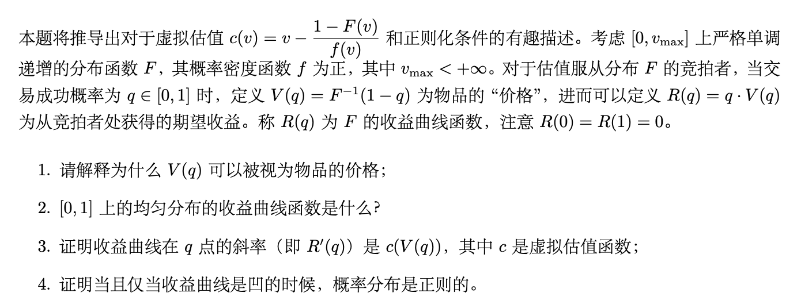
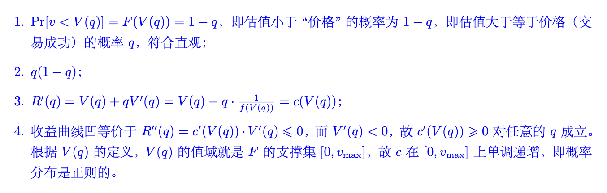
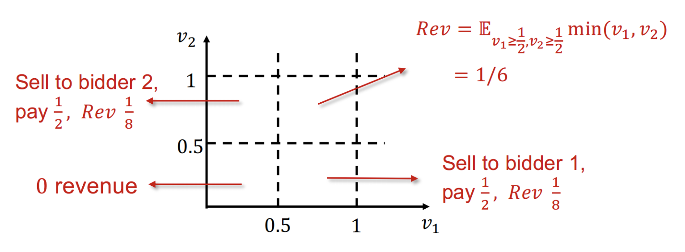
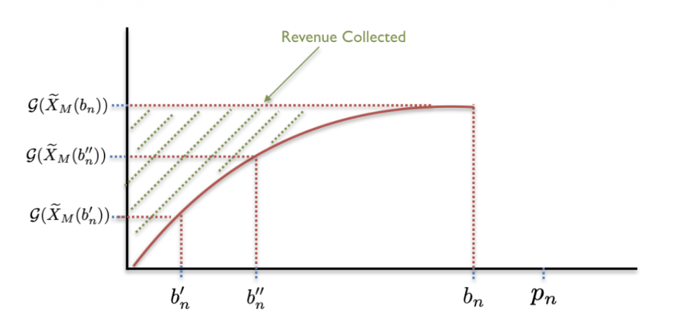

# Lec 7: 最优机制

本讲从卖家收益的角度考虑拍卖机制设计问题，即**如何设计一个使得卖家的收益最大化的拍卖机制**，又称最优机制。

## 虚拟福利最大化

??? info "背景"

    - 最优机制这一名称来源于其诞生的论文，即诺贝尔经济学奖得主迈尔森于 1981 年发表的著名论文 *Optimal auction design*
    - 可以说这篇论文是理论经济学最伟大的论文之一，开创了一套完整的理论范式，后续无数文章都使用了本文提出的技术解决问题
    - 本质而言这篇文章从理论上完美解决了参与人私人信息是一维变量的情况下，利润的最大化机制设计问题，给出了显示解
        - 参与人私人信息是高维变量的情况至今只有一些特殊情况的解，一般情况的最优机制显示解仍然是公开问题

### 基本模型

考虑单物品情况，即一个卖家有一个不可分割的物品待出售。

- 与此前单物品讨论一致，有 $n$ 个潜在买家（竞拍者）$N = \{1, 2, \dots, n\}$
- 每个买家 $i$ 对物品有一个心理价位 $t_i$ 是不完全信息
    - 其连续先验概率密度 $f_i : [a_i, b_i] \rightarrow \mathbb{R}^+$ 是共同知识，且 $f_i(t_i) > 0$ 对所有 $t_i \in [a_i, b_i]$ 成立
    - 记 $T$ 为所有参与人可能的估值组合，即
        
        $$
        T = [a_1, b_1] \times [a_2, b_2] \times \dots \times [a_n, b_n]
        $$

- 假定不同买家的估值分布是相互独立的（但不需要同分布）
    - 故在 $T$ 上估值的联合密度函数是 $f(t) = \prod_{i=1}^n f_i(t_i)$
    - 按照惯例记 $f_{-i}(t_{-i}) = \prod_{j \in N, j \ne i} f_i(t_i)$

- 此外，为了讨论方便，卖家对物品的估值 $t_0 = 0$ 是共同知识

### BIC 迈尔森引理

根据显示原理，**只需要考虑激励相容的直接机制**，即所有买家如实报告自己的估值的机制。在最优机制的讨论中，**如实报告类型不一定是占优策略均衡，而是贝叶斯纳什均衡**，等价条件与 DSIC 时不一定相同，故需要给出 BIC 版本的迈尔森引理。

为给出 BIC 迈尔森引理，需要一些准备工作。假定拍卖机制的分配规则和支付规则为 $(\bm{x}, \bm{p})$，考虑事中阶段，即参与人知道自己的估值，对他人估值是不完全信息的阶段。为了讨论 BIC 的条件，应首先写出效用函数。

由于考虑的是贝叶斯纳什均衡，因此应当考虑其他参与人都如实报告自己估值时，即 $b_{-i} = t_{-i}$ 时，估值为 $t_i$ 的竞拍者 $i$ 报告 $t_i'$ 的期望效用

$$
U_i(t_i') = \int_{T_{-i}} (t_i \cdot x_i(t_i', t_{-i}) - p_i(t_i', t_{-i})) f_{-i}(t_{-i}) dt_{-i}
$$

理解这一表达式：买家效用为他的估值 $t_i$ 乘以物品分配概率 $x_i(t_i', t_{-i})$ 减去支付 $p_i(t_i', t_{-i})$，然而买家不能确定其他买家真实估值，因此还需要根据先验分布对其他人的估值求期望。因此 BIC 的条件就是 $U_i(t_i) \ge U_i(t_i')$ 对所有 $i \in N$ 和 $t_i' \in [a_i, b_i]$ 成立。

然而这一 $U_i$ 的表达式的确看起来非常不友好，因此尝试简化。定义

$$
Q_i(t_i') = \int_{T_{-i}} x_i(t_i', t_{-i}) f_{-i}(t_{-i}) dt_{-i}
$$

则 $Q_i(t_i')$ 的含义为，当其他买家诚实报价，买家 $i$ 报价 $t_i'$ 时，他**获得物品的概率**。定义

$$
M_i(t_i') = \int_{T_{-i}} p_i(t_i', t_{-i}) f_{-i}(t_{-i}) dt_{-i}
$$

则 $M_i(t_i')$ 的含义为，当其他买家诚实报价，买家 $i$ 报价 $t_i'$ 时，他的**期望支付**。因此，$U_i(t_i')$ 可以简化为

$$
U_i(t_i') = t_i Q_i(t_i') - M_i(t_i')
$$

这就与 DSIC 情况下的 $u_i(t_i') = t_i x_i(t_i') - p_i(t_i')$ 形式上一致了，只是获得物品的概率和支付都求了期望，并且假定了其他买家如实报价。

因此仿照 DSIC 迈尔森引理可以给出 BIC 版本的迈尔森引理，并且证明过程完全类似，因此不再赘述，除了需要注意积分下界因为显示机制要求报价集合 $T_i = [a_i, b_i]$ 而变为了 $a_i$：

!!! theorem "BIC 迈尔森引理"

    一个拍卖机制是 **BIC**（即**贝叶斯激励相容**）的，当且仅当其分配规则和支付规则 $(\bm{x}, \bm{p})$ 满足：

    - $Q_i(t_i)$ 是单调不减函数；
    - 对任意的 $i \in N$ 和 $b \in [a_i, b_i]$，有

        $$
        M_i(b) = M_i(a_i) + bQ_i(b) - \int_{a_i}^b Q_i(s) ds
        $$

### 合理的机制

由此得到了 BIC 的充要条件。然而现在还不能转入最大化卖家收益的讨论，因为仅满足 BIC 的机制是不够**合理**(feasible)的。合理的机制除了满足 BIC 外，还应当满足如下两个条件：

- 第一个条件是**分配规范性**，因为只有一个物品在分配，故对于所有 $\bm{t} \in T$，有

    $$
    \sum\limits_{i=1}^n x_i(\bm{t}) \le 1
    $$

    并且 $x_i(\bm{t}) \ge 0$ 对所有 $i \in N$ 和 $\bm{t} \in T$ 成立

- 第二个条件是，对所有 $i \in N$ 和 $t_i \in [a_i, b_i]$，有 $U_i(t_i) \ge 0$，即需要满足**（事中阶段的）个人理性**，否则竞拍者在得知自己的类型后会选择退出拍卖

下面的定理给出了在 BIC 的基础上满足个人理性的充要条件：

!!! theorem "定理"

    当且仅当对于每个 $i \in N$ 都满足 $M_i(a_i) \le 0$ 时，一个 BIC 的拍卖机制是 IR（个人理性）的。

即要求当竞拍者估值为最低值时的期望支付小于等于 0。

??? proof "证明"

    根据 BIC 的条件，不难写出

    $$
    U_i(t_i) = t_iQ_i(t_i) - M_i(t_i) = \int_{a_i}^{t_i} Q_i(s) ds - M_i(a_i)
    $$

    个人理性要求对任意的 $t_i \in [a_i, b_i]$，都有 $U_i(t_i) \ge 0$，因为等式右侧当 $t_i = a_i$ 时取最小值 $-M_i(a_i)$，故个人理性成立当且仅当 $M_i(a_i) \le 0$。

总结：给出了合理机制的三个条件，即 BIC、分配规范性和 IR，以及 BIC 和 IR 的等价条件。基于上述讨论可以开始考虑如何设计最优机制。

### 转化为虚拟福利最大化问题

首先当所有买家如实报告自己的类型时，投标结果为 $\bm{t} = (t_1, \dots, t_n)$，卖家期望收入是（注意卖家对物品估值为 0，故只有卖出才能产生收益）

$$
U_0 = \int_T \Big(\sum\limits_{i=1}^n p_i(\bm{t})\Big) f(\bm{t}) d \bm{t}
$$

下面这一引理给出了最大化卖家收入 $U_0$ 的合理的最优机制的一个简洁明了的条件：

!!! theorem "引理"

    假设分配规则 $\bm{x}$ 最大化

    $$
    \int_T \Big( \sum\limits_{i=1}^n (t_i - \dfrac{1 - F_i(t_i)}{f_i(t_i)}) x_i(\bm{t}) \Big) f(\bm{t}) d \bm{t}
    $$

    支付规则 $\bm{p}$ 使得 $M_i(a_i) = 0$ 对所有 $i \in N$ 成立，且 $(\bm{x}, \bm{p})$ 满足 BIC、分配规范性和 IR，则 $(\bm{x}, \bm{p})$ 是合理的最优机制。

引理的具体证明因为技术性较强（见[这篇论文](https://yhwu-is.github.io/Teach/ec/data_market/2025/Optimal%20Auction%20Design.pdf)）不展开描述，下面描述大致步骤：

1. 根据 BIC 迈尔森引理和展开 $U_0$ 的表达式，然后利用积分变换技巧得到

    $$
    U_0 = \int_T \Big( \sum\limits_{i=1}^n (t_i - \dfrac{1 - F_i(t_i)}{f_i(t_i)}) x_i(\bm{t}) \Big) f(\bm{t}) d \bm{t} + \sum\limits_{i=1}^n M_i(a_i)
    $$

2. 从而目标转化为在满足 BIC、分配规范性和 IR 的情况下最大化上式。其**加号前的部分只与分配规则 $\bm{x}$ 有关，加号后的部分展开后只与支付规则 $\bm{p}$ 有关**，因此可以分别考虑这两个部分：

- 对于加号前的部分，目标就是找到分配机制 $\bm{x}$ 使其最大化；
- 对于加号后的部分，根据个人理性等价条件有 $M_i(a_i) \le 0$，因此要最大化 $U_0$ 就要选择支付规则 $\bm{p}$ 使得 $M_i(a_i) = 0$ 对所有 $i \in N$ 成立。

由此，这一引理的结论得证。

有了这一引理，接下来的任务就是找到一个分配机制 $\bm{x}$ 使得

$$
\int_T \Big( \sum\limits_{i=1}^n (t_i - \dfrac{1 - F_i(t_i)}{f_i(t_i)}) x_i(\bm{t}) \Big) f(\bm{t}) d \bm{t}
$$

最大化，而支付规则在 $\bm{x}$ 确定后直接根据迈尔森引理以及 $M_i(a_i) = 0$ 的条件确定即可。

令

$$
c_i(t_i) = t_i - \dfrac{1 - F_i(t_i)}{f_i(t_i)}
$$

称其为竞拍者 $i$ 的**虚拟估值**(virtual valuation)，则目标就是找到一个分配机制 $\bm{x}$ 使得

$$
\int_T \Big( \sum\limits_{i=1}^n c_i(t_i) x_i(\bm{t}) \Big) f(\bm{t}) d \bm{t}
$$

最大化。

如果对任意的 $\bm{t}$，都能找到一个 $\bm{x}$ 使得

$$
\sum\limits_{i=1}^n c_i(t_i) x_i(\bm{t})
$$

最大化，自然也能满足最大化要求。

- 因此，目标进一步转化为找到一个分配机制 $\bm{x}$ 使得对任意的 $\bm{t}$，都能找到一个 $\bm{x}$ 使得 $\sum_{i=1}^n c_i(t_i) x_i(\bm{t})$ 最大化
- 如果 $c_i(t_i)$ 是竞拍者 $i$ 的真实估值，那么最大化 $\sum_{i=1}^n c_i(t_i) x_i(\bm{t})$ 就是最大化竞拍者福利，然而 $c_i(t_i)$ 并不是真实估值，只是虚拟估值，因此这一问题称为**虚拟福利最大化问题**

### 整体研究思路总结

总而言之，经过一系列的积分变换和问题转化，最大化卖家收益的问题被转化为了虚拟福利最大化问题。下面可以总结研究这一问题的完整思路：

1. **利用显示原理将机制设计空间限制在直接显示机制**，因此只需要设计竞拍者如实报告估值的机制，因此卖家收益最大化问题可以写为如下数学规划问题：

    $$
    \max\limits_{\bm{x}, \bm{p}}\ U_0 = \int_T \Big( \sum\limits_{i=1}^n p_i(\bm{t}) \Big) f(\bm{t}) dt \\
    \text{s.t.} (\bm{x}, \bm{p}) \text{满足 BIC,} \\
    \ \ \ (\bm{x}, \bm{p}) \text{满足 IR,} \\
    \ \ \sum\limits_{i=1}^n x_i(\bm{t}) \le 1
    $$

2. **利用 BIC 迈尔森引理将 BIC 转化为两个等价条件**，其一是期望分配概率 $Q_i$ 的单调性，其二是期望支付 $M_i$ 可由 $Q_i$ 和 $M_i(a_i)$ 唯一表达。
3. **将个人理性条件转化为等价条件** $M_i(a_i) \le 0$。
4. 将**目标函数利用积分变换等将目标问题转化为虚拟福利最大化问题**。

第 2 - 4 步实际上就是**将数学规划的约束和目标函数变得更加清晰**，从而可以在下一节中给出显示的最大化解。

- 事实上很多问题的本质都是数学规划问题，但**最优机制问题具有特殊的结构从而可以给出很漂亮的显示解**，这些特殊结构的发现就是迈尔森这篇文章最大的贡献，并且这一结构在很多问题上都有出现，因此在未来非常多的工作中都应用了迈尔森这一套方法。
- 本质上很多问题都可以表达为数学规划问题，解决问题的方式就是找到特殊结构（例如背包问题动态规划），但现实中很多问题无法找到内在的特殊结构。

## 最优机制

### 虚拟福利最大化的解

下面的任务是决定最优的分配机制 $\bm{x}$ 使得虚拟福利最大化。事实上不难看出如何做到这一点：

- 因为最大化目标函数是 $\sum_{i=1}^n c_i(t_i)x_i(\bm{t})$，且要求 $\sum_{i=1}^n x_i(\bm{t}) \le 1$，故而实际上要最大化的就是 $c_i(t_i)$ 的一个加权平均，其中权重和不大于 1
- 显然只需要给 $c_i(t_i)$ 最大的一项或多项赋予和为 1 的权重即可，并且这一最大值必须要大于等于 0，否则不如全部权重都为 0 的情况。即只允许同时满足
    - 最大化 $c_i(t_i) = t_i - \dfrac{1 - F_i(t_i)}{f_i(t_i)}$
    - $c_i(t_i) \ge 0$

    两个条件的参与人 $i$ 有获得物品的概率，并且如果有这样的参与人，他们获得物品的概率和为 1。换一种说法，即

    $$
    p_i(t) > 0 \Rightarrow c_i(t_i) = \max\limits_{j \in N} c_j(t_j) \ge 0
    $$

### 正则化条件

然而时刻要记住，我们设计的**机制必须是合理的，即满足 BIC、分配规范性和 IR**。

- 显然上述解已经满足了分配规范性，IR 与分配机制的选择无关，因此只需要考虑 BIC
    - 根据 BIC 迈尔森引理，其中第二条与支付机制的选择有关，因此只需要检验第一条 $Q_i(t_i)$ 单调不减是否满足
    - 这一条件并非一定成立，例如当 $c_i$ 为递减函数时，反而最低的估值会获得物品
- 因此引入一个充分条件（称为正则化条件）来保证这一要求的成立：**如果对于任意的 $i \in N$ ，都有 $c_i(t_i)$ 关于 $t_i$ 是单调递增的，那么称这一问题符合正则化条件**
    - 这显然是 $Q_i$ 关于 $t_i$ 单调递增的充分条件，因为如果 $c_i(t_i)$ 关于 $t_i$ 单调递增，那么根据之前 $x_i$ 的选择，当参与人 $i$ 提高报价时，他得到物品的概率不会降低，从而 $Q_i$ 关于 $t_i$ 单调递增也成立
    - 因此当满足正则化条件时，上面给出的解的确是合理的最优机制

对于**大部分熟知的分布，正则化条件都是满足的**。

- 例如 $[0, 1]$ 上的均匀分布，对应的 $c_i(t_i) = 2t_i - 1$ 是单调递增的
- 当然从理论层面上讲，仍需考虑正则化条件不满足的情况（例如分布是**双峰分布**），这一情况的解略为复杂，因此不在此展开（但很经典）

现在继续考虑正则化条件满足的情况，已有正则化条件下的最优机制的分配规则 $\bm{x}$，接下来需要确定支付规则 $\bm{p}$。不难理解分配规则仍然是一个阶梯函数，令

$$
z_i(t_{-i}) = \inf \{s_i\ |\ c_i(s_i) \ge 0 \text{ and } c_i(s_i) \ge c_j(t_j), \forall\ j \ne i\}
$$

>$\inf$ 表示下确界

即 $z_i(t_{-i})$ 是使得参与人 $i$ 刚好能有机会获得物品的最低报价，也就是阶梯函数的间断点。那么根据支付公式

$$
p_i(b, t_{-i}) = b \cdot x_i(b, t_{-i}) - \int_{a_i}^b x_i(s, t_{-i}) ds
$$

可以解出分配规则对应的支付规则 $\bm{p}$ 为（回忆阶梯函数的直观）

$$
p_i(t) = \begin{cases}z_i(t_{-i}) x_i(\bm{t}), & c_i(z_i(t_{-i})) \ge t_0 \text{ and } c_i(z_i(t_{-i})) \ge c_j(t_j), \forall\ j \ne i \\ 0, & \text{other cases}\end{cases}
$$

更简单的，如果只有一个满足 $c_i(z_i(t_{-i})) \ge t_0$ 和 $c_i(z_i(t_{-i})) \ge c_j(t_j), \forall\ j \ne i$ 的 $i$，则 $x_i(\bm{t}) = 1$，且

$$
p_i(t) = \begin{cases}z_i(t_{-i}), & x_i(t) = 1 \\ 0, & x_i(t) = 0\end{cases}
$$

??? example "例子"

    === "题目"

        

            
        

    === "解答"

        

            
        

### 买家估值独立同分布情形

考虑一种最简单的情况来具象化前面给出的结论。考虑一个所有买家估值独立同分布的情形（即对称模型），并且符合正则化条件，不难得到

$$
z_i(t_{-i}) = \max\{c^{-1}(t_0), \max\limits_{j \ne i} t_j\}
$$

- 结合前面得到的 $(\bm{x}, \bm{p})$，此时的最优机制其实就是一个含保留价格的二价拍卖机制，其中保留价格为 $c^{-1}(t_0)$
- 因为此时所有买家估值同分布，因此虚拟估值函数也相同，故具有最高估值（最高报价）的赢得物品，并且支付第二高报价和保留价格之间的较高者，并且如果最高报价低于保留价格，则不分配物品

更具体而言，当所有买家估值独立且服从 $[0, 1]$ 上的均匀分布时，虚拟估值函数为 $c_i(t_i) = 2t_i - 1$，因此保留价格为 1/2，此时的最优机制就是保留价格为 1/2 的第二价格拍卖。

### 最大的利润

???+ example "例子"

    当所有买家估值独立且服从 [0, 1] 上的均匀分布时，求最优机制下卖家的收益。

    

        
    

??? question "思考"

    === "问题"

        为什么最优机制能打破收入等价原理的限制，获得更高的收益？

    === "解答"

        TBD

### 总结

尽管最优机制可以使得买家获得最大的期望效用，但是这一机制存在一些天然的缺陷：

- **卖家很难准确估计每一个买家的估值分布**，因此这一机制很难完美实现，特别是应用于数据拍卖场景时，数据买家的估值不确定性更大，因此之后会讨论在无先验分布下的机制设计
- 非对称模型（即买家的估值不同分布）下，**报价最高的买家可能并不是最有可能获得物品的买家**。这一点非常显然，因为不同的分布下 $c$ 的形态会有所不同
    - 若 $f_i(t_i) = \dfrac{1}{b_i - a_i}$，即买家的估值均匀分布，不难计算得到 $c_i(t_i) = 2t_i - b_i$，这关于 $t_i$ 是单调递增的，因此符合正则化条件
    - 但是此时的最优机制是选出 $2t_i - b_i$ 最大的 $i$，如果 $b_i < b_j$，那么可能存在 $t_i < t_j$ 但是 $2t_i - b_i > 2t_j - b_j$ 的情况，即报价更低的买家可能获得物品

3. 最优机制不是事后有效率的，例如我们考虑对称模型下，卖家估值等于 0 且买家估值都大于 0 的情况，此时**显然物品要售出才是福利最大化（也是帕累托最优或事后有效率）的，但是如果所有买家的报价都低于 $c^{-1}_i(0)$，那么物品就不会被售出**，这显然不是事后有效率的。

当然最优机制仍然是具有实际意义的：雅虎曾在广告拍卖中加入保留价格，发现了保留价格的确能带来利润提升——这就是理论研究指导实践的意义所在。

最后需要提醒的一点是，**如果是多个相同物品的拍卖，只有分配规范性条件会改变，其余推导均没有任何变化**。

??? question "思考"

    === "问题"
        
        假设买家具有单位需求（每个买家只需要一个物品），那么此时最大化利润的拍卖规则是什么？

    === "解答"

        TBD

因此最优机制**可以直接应用于已知买家估值先验分布的数据拍卖中**。

## 拍卖与数据定价

### 基本思想

针对数据卖家未知数据买家对数据产品估值的问题，拍卖理论中关于设计机制使得买家诚实报出自己的估值的讨论，打破了信息不对称，自然成为了一个合适的解决方案：

- 此前讨论的**最优机制可以很轻松地推广到多个相同物品的情况**，因此在已知各数据买家估值先验分布的情况下的最优机制（利润最大化）设计是可以被迈尔森最优机制直接解决的
- **福利最大化机制设计则可以根据 VCG 机制**解决
- 因此研究基于拍卖的数据定价需要挖掘更贴合数据产品本身特性的问题以及现有理论无法解决的非平凡问题

### 机器学习模型拍卖

考虑如下机器学习模型出售场景：

- 数据卖家是零售商店，他们将匿名化的分钟级消费者流量数据流出售到市场中，而数据买家则是希望获得能够预测未来库存需求的物流公司
- 零售商选择使用拍卖的形式出售由这些数据训练出的库存需求预测模型，因此需要每个物流公司提供一个报价
    - 自然地，在机器学习模型出售的场景中，**每个物流公司的报价应当是模型预测单位（1%）准确度提升对其带来的效用增益（将一单位准确率类比为一单位物品）**
    - 例如，根据物流公司内部测算得知，超出或低于销售量 10% 的备货成本为 10000 元，则物流公司对于每 1% 的库存需求预测准确性提高的估值为 1000 元，这也就是物流公司诚实报价时应当给出的报价。

因此接下来的问题便是，如何设计一个拍卖机制使得物流公司愿意诚实报价。回忆上一讲的讨论，只需要为拍卖设计分配机制 $\bm{x}$ 和支付机制 $\bm{p}$。由于这一拍卖形式只需要要求买家报告一个估值，因此迈尔森引理给出了这一拍卖机制是 DSIC（即买家诚实报价）的充要条件。

>回顾[迈尔森引理](6.md#迈尔森引理)

- 模型可以零成本复制，故分配规则不存在 $\sum_i x_i(b_i) \le 1$ 的要求
- 买家 $i$ 对模型的报价 $b_i$ 代表其对每 1% 的模型准确度的估值，因此**每个买家能分配到的 $x_i(b_i) \in [0, 1]$ 应当代表模型的准确率**
    - 这也是出售机器学习模型的拍卖设计相较于普通商品的一大不同：普通商品不可分割且不可零成本复制，分配结果 $x_i(b_i)$ 只能表示获得物品的概率，而**机器学习模型的准确率则自然是一个 $[0, 1]$ 中的常数**，故此时的 $x_i(b_i)$ 可以代表模型的优劣而非获得模型的概率。

!!! abstract "总结"

    |参数|普通商品|机器学习模型|
    |:-:|:-:|:-:|
    |$b_i$|对单个商品的估值|对单位预测准确度的估值|
    |$x_i(b_i)$|获得物品的概率|模型预测准确率|

下面需要设计机制满足迈尔森引理的条件：

- $x_i(b_i)$ 的单调性要求：一个简单且自然的方案是，首先使用全部数据进行训练获得一个最优模型，并为这一模型设定一个基准价格 $q$
    - 当报价 $b_i \ge q$ 时，则直接出售最优模型
    - 当 $b_i < q$ 时，则出售添加噪声的模型，并且 $b_i$ 越低添加的噪声越多
    - 例如假设最优模型输出为 $x$，报价为 $b_i$ 时出售的模型输出为 $x + \max(0, q - b_i) \cdot N(0, \sigma^2)$ 即可满足条件
- 根据单调函数 $x_i(b_i)$ 即可利用迈尔森支付公式决定买家 $i$ 的支付

    

问题：基准价格 $q$ 应当如何决定。根据迈尔森支付公式（设 $p_i(0) = 0$），由于 $q$ 是一个候选参数且能影响到 $x_i$ 的值，迈尔森支付公式可重写为

$$
p_i(b_i, q) = b_i \cdot x_i(b_i, q) - \int_0^{b_i} x_i (s, q) ds
$$

如果数据卖家对买家的估值有先验分布，则可以根据先验分布选取最大化支付的 $q$。而对于无先验分布的情况，则可以使用此前介绍的乘性权重算法，将买家视为逐个到达的对抗性老虎机，对所有可能的 $q$ 的选择根据乘性权重算法更新每一步的选择概率即可得到一个无憾算法。

### 无先验的无限物品拍卖机制设计

!!! warning "注"

    这一部分只需理解大致思想，具体内容选择这一部分对应的大作业的同学可以进一步理解。

假设卖家拥有一份可无限复制但不可分割的数据（此时数据不是上一小节中可任意操纵的机器学习模型，而是一个不可分割的数据集，或者一个在线数字产品例如电影、电子书等），每个买家具有单位需求（即愿意购买一份数据）。迈尔森最优拍卖假定对买家估值有先验分布，但没有先验分布时应当如何设计机制？

- 一个简单的想法是，**考虑所有人的投标独立同分布的情况，此时当买家足够多时（$n \rightarrow \infty$），可以通过大量样本学习出投标人估值的分布**
    - 格里汶科(Glivenko-Cantelli)定理：经验分布函数能够很好地拟合总体分布，所以自然可以由样本来推断总体

- DOP 机制：**使用其他 $n - 1$ 个人的报价决定剩余一个人的价格**
    - 每个人的报价与自己面对的价格无关，故是 DSIC 的
    - 然而这一拍卖的收益在不满足独立同分布的极端情况下可以任意差

有 $n$ 个买家，其中 $\dfrac{n}{b}$ 的买家投标为 $b \gg 1$，其余买家投标均为 1：

- 最优固定价格只可能是 1 或 $b$，为什么？TBD
- 因此此时最优固定价格为 1 或 $b$，收益均为 $n$

然而，当使用 DOP 时：

- 对于一个报价为 1 的买家 $i$，如果取价格为 1，则对其余 $n − 1$ 个人的收益为 $n − 1$，如果取价格为 $b$，则对其余 $n − 1$ 个人的收益为 $n$，因此对这一买家应当选择固定价格 $b$
- 对于一个报价为 $b$ 的买家 $i$，如果取价格为 1，则对其余 $n − 1$ 个人的收益为 $n − 1$，如果取价格为 $b$，则对其余 $n - 1$ 个人的收益为 $(\dfrac{n}{b} - 1) \cdot b = n - b$，因此对这一买家应当选择固定价格 1。

综上可知，DOP 带来的收益仅为 𝑛𝑏 ，因为只能对 𝑛𝑏 个报价为 𝑏 的买家收取 1 的价格。由于 𝑏 可以任意大，因此 DOP 可以任意差。

### 竞争比

上述例子中已经体现了一个思想：**将无先验拍卖机制的收益与固定价格的最优收益进行比较**。

- 这是因为无先验拍卖在无先验的情况下实现卖家收益最大化是非常困难的，因为对买家的估值情况一无所知，这一问题似乎无法下手
- 因此需要转换研究思路，**一个可行的方案是将得到最优机制的目标转化为与一些合适的标准进行比较，一个可行的标准就是最优固定价格**（实际有一些细微的差别，感兴趣的同学可以阅读大作业给出的参考文献）
- 称**竞争比为最优固定价格下的收益与某一无先验拍卖机制的收益的比值**，因此上述 DOP 机制不存在常数竞争比

关于竞争比分析，有如下结论：

- 不存在确定性拍卖是有竞争力的，因此应当考虑随机拍卖机制
- 不存在竞争比低于 2.42 的拍卖。进一步地，这一下界是紧的，即存在竞争比等于 2.42 的拍卖
    - 这一结论的前半部分不存在性在 2004 年给出
    - 后半部分则作为 2004 年论文的一个猜想被给出，而后经过 10 年的等待被证明

在 RSOP 中，通过随机采样的方式抽取出对每个竞拍者使用最优固定价格的投标者，这一随机性的添加使得最差情况的出现概率降低，从而获得具有有限竞争比的拍卖。RSOP 的定义如下：

!!! definition "定义"

    随机采样最优价格拍卖(random sampling optimal price auction, RSOP)定义如下：

    - 将投标向量 $\bm{b}$ 均匀随机地分成两个子集：对于每个买家的投标，都以 $\dfrac{1}{2}$ 的概率随机落入两个子集 $\bm{b}'$ 和 $\bm{b}''$ 之一
    - 令 $p' = \text{opt}(\bm{b}'), p'' = \text{opt}(\bm{b}'')$（$opt(\bm{b})$ 为针对 $\bm{b}$ 的最优固定价格）
    - 对 $\bm{b}''$ 中的投标使用 $p'$ 作为阈值（即 $\bm{b}''$ 中低于 $p'$ 的投标被拒绝，投标大于等于 $p'$ 的投标人获得物品并支付 $p'$），对 $\bm{b}'$ 中的投标使用 $p''$ 作为阈值

### 差分隐私与机制设计

本节将结合差分隐私的概念进一步讨论近似最优的机制。将差分隐私和机制设计联系在一起的**关键是将差分隐私的定义和机制设计中的诚实性的概念联系起来**。考虑机制设计的诚实性要求，如果所有人诚实汇报，记机制 $M$ 收到的汇报向量为：

$$
\bm{t} = (t_1, \dots, t_n)
$$

如果参与人 $i$ 偏离诚实汇报，则此时机制收到的汇报向量为 $\bm{t}' = (t_1, \dots, t_i', \dots, t_n)$

诚实性要求，参与人 $i$ 的效用 $u(M(\bm{t})) \ge u(M(\bm{t}'))$。

一个重要的观察是，$\bm{t}$ 和 $\bm{t}'$ 可以视为相邻数据库，机制 $M$ 也可以视为在由参与人汇报向量组成的数据库上执行的查询算法，查询结果为机制的输出结果，因此也可以定义差分隐私性，此时差分隐私的含义为无法从机制给出的结果看出参与人的汇报。

如果 $M$ 满足 $\varepsilon$-差分隐私，根据差分隐私后处理性质（即在满足差分隐私的算法上复合一个与数据库内容无关的函数仍然满足差分隐私性），对定义在机制所有可能结果上的任意的非负效用函数 $u$，都有

$$
\begin{align}
\mathbb{E}[u(M(t_i, t_{-i}))] & = \sum\limits_i \Pr(u(M(t_i, t_{-i})) = u_i) \cdot u_i \notag \\
& \le \sum\limits_i \exp(\varepsilon)\Pr(u(M(t_i, t_{-i})) = u_i) \cdot u_i \notag \\
& = \exp(\varepsilon) \mathbb{E}[u(M(t_i', t_{-i}))] \notag
\end{align}
$$

同理可得

$$
\mathbb{E}[u(M(t_i', t_{-i}))] \le \exp(\varepsilon) \mathbb{E}[u(M(t_i, t_{-i}))]
$$

即如果机制 $M$ 满足差分隐私的要求，则参与人偏离诚实报价带来的收益也是有限的，即满足近似诚实性。

### 指数机制

下面考虑结合差分隐私设计近似最优的机制。众所周知，差分隐私中最常用的是拉普拉斯机制，然而这一机制在实现利润最大化时存在问题：

???+ example "例子"

    假设有很多个（大于 4 个）苹果等待出售，有 4 个买家，他们认为苹果的价值分别为 1 元、1 元、1 元和 4.01 元。显然最优定价为 4.01 元，但这一结果可能会导致估值 4.01 元的买家隐私泄漏，故通过差分隐私机制来保护数据买家的隐私，对输出的价格添加噪声。然而拉普拉斯噪声有相等的概率使得最终价格偏高或偏低，一旦偏高（4.02 元），所有买家都不会购买苹果，卖家会损失全部收益，这一结果显然不可接受。

#### 定义

因此需要设计新的差分隐私机制，即指数机制。为了定义指数机制，首先记在数据库 $D$ 上查询结果为 $r$ 时带给查询者的效用为 $u(D, r)$。此外需要定义效用函数敏感度

$$
\Delta u = \max\limits_r \max\limits_{D_1, D_2} |u(D_1, r) - u(D_2, r)|
$$

$r$ 取遍所有可能的查询结果（这一集合记为 $R$），$D_1$, $D_2$ 是相邻数据库。

基于此可以定义指数机制如下：

!!! definition "定义"

    设 $D$ 是数据库，$R$ 是查询结果的集合，$u(D, R)$ 是效用函数，$\varepsilon$ 是差分隐私参数，则指数机制 $M_E(D, u, R)$ 以正比于 $\exp(\dfrac{\varepsilon u(D, r)}{2 \Delta u})$ 的概率返回任意的结果 $r \in R$。

正比于的含义是，上述概率还需要做归一化处理。

#### 性质

不难看出指数机制的设计思路是，给定数据库 $D$ 和效用函数 $u(D, r)$，**返回的结果 $r$ 的概率与其效用成正比。也就是说，效用越高的结果被返回的概率越大**。

- 回到卖苹果的例子，显然返回最优结果 3.01 元的概率最大，而大于 3.01 的价格带来的效用为 0，因此被返回的概率比较小
- 可以证明，指数机制 $M_E$ 是 $(\varepsilon, 0)$-差分隐私的

指数机制可以在保证隐私性、近似诚实性的情况下，满足近似有效率性：

定义 $R_{\text{OPT}} = \{r \in R\ |\ u(D, r) = \text{OPT}_u(D) \}$，其中 $D$ 是一个数据库，$\text{OPT}_u(D)$ 表示效用函数为 $u$ 时数据库 $D$ 能返回的效用最大的结果对应的效用值，因此 $R_{\text{OPT}}$ 的含义是所有可能的最优查询结果。有如下定理：

!!! theorem "定理"

    给定数据库 $D$、效用函数 $u$ 和查询结果集合 $R$，对一个满足 $\varepsilon$-差分隐私的指数机制 $M_E(D, u, R)$ 有

    $$
    \Pr \Big[ u(M_E(D, u, R)) \le \text{OPT}_u(D) - \dfrac{2 \Delta u}{\varepsilon} \Big( \ln \Big( \dfrac{|R|}{|R_{\text{OPT}}|} + t \Big) \Big) \Big] \le e^{-t}
    $$

