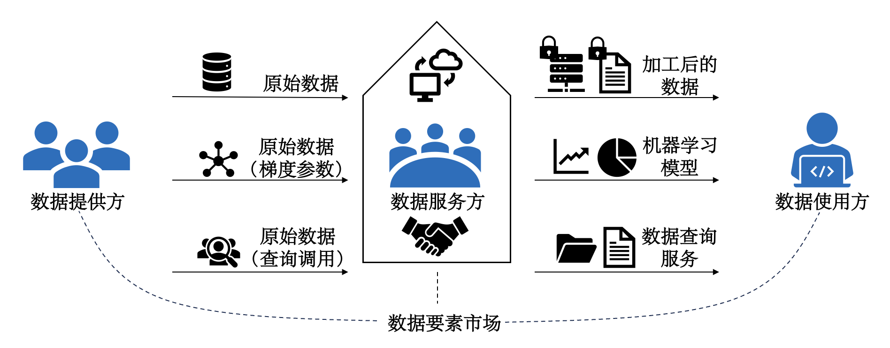
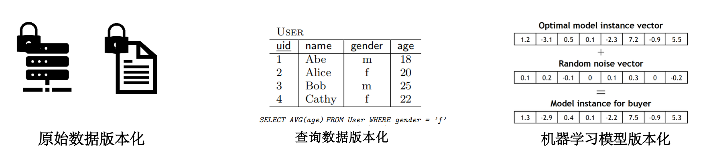
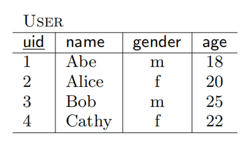
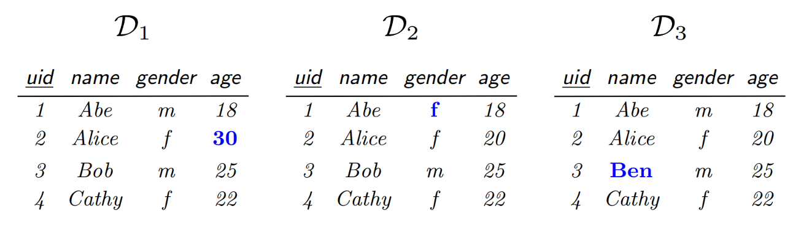
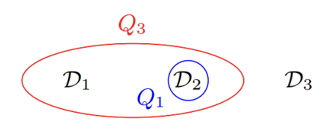
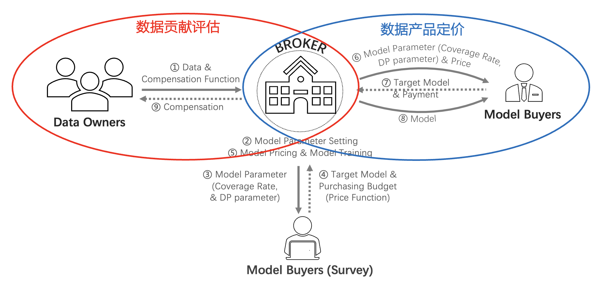
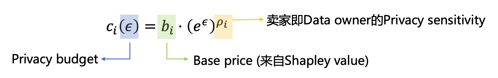
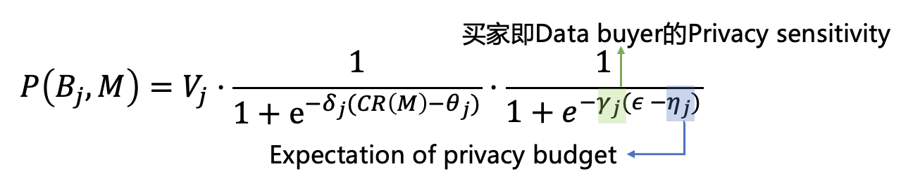
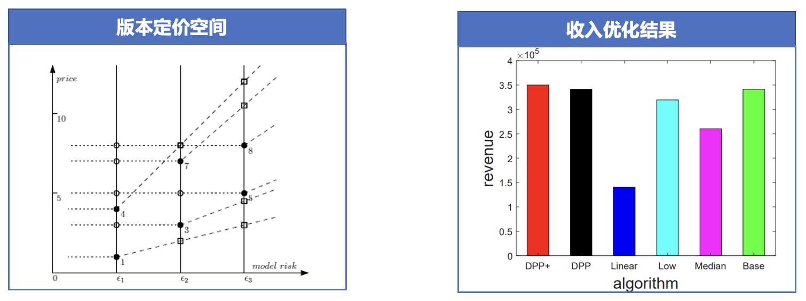
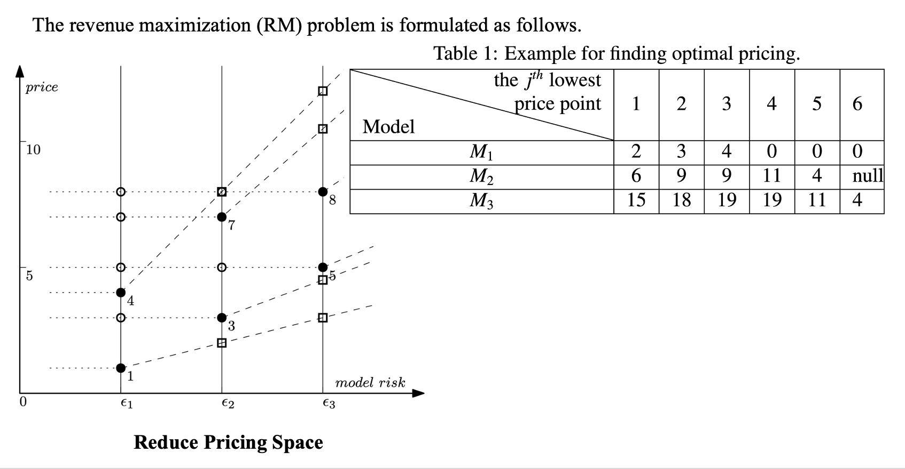

# Lec 8: 数据版本化定价

## 数据交易的基本框架与数据定价的要求

### 数据交易的基本框架

<div style="text-align: center">
    
</div>

- **数据服务方**(data sever)/**数据交易平台**(data marketplace)/**数据中介**(data broker)
    - 承担数据收集、管理、合规与安全等任务，保障数据交易正常运行
    - 将数据提供者的数据转化为产品（查询、机器学习模型），出售给数据使用方，获得收益，将收益按公平分配规则（之后会介绍）分配给数据提供方（可以提取部分收入作为处理费用与利润）
    - 现实中的数据交易通常有中介，但也存在无中介的买卖双方直接交易的简单场景

- **数据提供方**(data owner)/**数据卖家**(data seller)：为数据交易提供原始数据
    - 原始数据可能经过加工得到查询结果或机器学习模型
    - 加工后出售的一份数据可能来源于很多数据提供者的数据，因此收益需要根据公平分配的原则分配给这些数据提供者

- **数据使用方**(data user)/**数据买家**(data buyer)
    - 向数据中介提出购买数据产品的需求
    - 为了得到需要的数据产品，需要付出一定的价格


### 数据定价的要求

针对数据的特性，数据定价的挑战，在数据交易的框架下，数据定价需要满足以下要求：

- 保持传统市场中定价的基本要求
    - **效用最大化 / 帕累托最优 / 预算约束 / [社会福利最大化](6.md#福利最大化机制设计)**：之前已经介绍
    - **平衡预算**(budget balance)：构建市场的成本应当小于等于市场的收益，否则数据市场的建立会带来“财务赤字”
    - **个人理性**(individual rationality, IR)：市场中每个参与人参与市场的效用比不参与市场的效用高
        - 近似而言，不参与市场的效用可以视为 0，因此个人理性的要求就是每个参与人的参与收益大于成本
        - 但是数据的外部性比较明显，因此即使不参与市场也可能产生效用
        - 例如与你竞争的公司在数据市场中购买了机器学习模型，可以预测下一季度客户对不同商品的偏好，如果你没有买，会因此丧失客户，因此不参与市场的效用为负数
    - **无嫉妒**(envy-free)：一个数据买家不会嫉妒另一个数据买家的情况，即他不会觉得用另一个人支付的钱买那个人的产品，比用自己支付的钱买自己的产品更值得
        - 来源于经济学中经典的分蛋糕问题，参见 [Selfridge-Conway 算法](https://en.wikipedia.org/wiki/Selfridge%E2%80%93Conway_procedure)

- 考虑**数据隐私性**(privacy)
    - 尽管数据有零成本复制的特性，但如果考虑数据的隐私成本，数据的出售可能导致数据的价值降低
    - 辨析：数据出售越多，数据的价值越低（可以思考数据的价值包含什么，从不同角度回答）
- **动态性**(dynamicity)
    - 数据具有不断更新的特点，因此动态的数据定价也值得考虑
    - 最新的数据可能具有更高的价值，过时的数据价值降低
    - 数据集不断更新，买家如果要购买同一份数据（因此会出现大量重复的信息），如何定价？
    - 订阅制定价（稍后介绍）
- **无套利原则**(arbitrage freeness)：本讲后半部分内容
- **诚实性**(truthful) / **激励相容**(incentive compatible, IC)：非合作博弈论与[机制设计](6.md#直接显示机制)部分介绍
- **公平分配**(fairness)：[合作博弈论](4.md)部分介绍
- **高效**(efficiency)：定价机制能快速计算，一般而言即能设计出多项式时间算法解决
    - 市场能高效运行的关键，否则参与人需要等待大量时间才能有定价结果出现
    - 经济学与计算机科学的交叉：算法博弈论

以上要求不要求必须同时达到。

- [**Myerson-Satterthwaite 定理**](https://en.wikipedia.org/wiki/Myerson%E2%80%93Satterthwaite_theorem)表明，个人理性、激励相容、平衡预算与社会福利最大化四者不可兼得
- 满足部分要求的价格计算问题是 **NP-hard** 的
- 还有很多亟待解决的问题，例如多参数的最优机制问题等

同时考虑过多的定价要求不切实际，事实上在真实的数据定价中，过多的理论要求也并不一定能得到最优的效果

- 人的理性并不完美，工具理性也并非人们做决策的唯一标准
- 谷歌广告拍卖：从广义二价拍卖到一价拍卖
- 更多的故事我们可以在博弈论和机制设计中了解
- 通常的研究都是考虑在满足一些基本要求（例如利润最大化、诚实性等）的基础上，考虑更多的数据特性带来的定价问题


## 数据的版本化与无套利原则

### 现实中的数据定价策略

- **免费数据**
    - 一些公开的统计数据，不具有出售的价值
    - 但是可以吸引用户进入市场，进而吸引数据提供者进入市场

- **根据使用次数决定价格**
    - 每次调用 API，都收取一定的价格
    - 类似于咨询费，咨询 1h 给多少钱，咨询 3h 给多少钱
    - 从供给成本角度看，数据可以零成本复制，例如机器学习模型训练好之后，尽管训练成本可能很高，但每次调用 API 需要的成本几乎为零，因此当 API 调用越多时，边际成本也会下降
    - 但从需求效用角度看，每次买家调用 API 是为了新的数据，那么存在数据需求，因此也有合理性

- **打包定价**
    - 以固定的价格出售一定次数的 API 调用权
    - 上一种方法的升级版

- **订阅制**
    - 按订阅时间收费，包含两种收费机制
    - 一类是订阅后权限全部开放
    - 另一类是支付固定订阅费用后，还要加收每次服务的费用（结合订阅制和前面的使用次数定价），类似于移动公司，软件许可等。固定费用用于覆盖固定成本，服务费用提供利润
    - 可以比较有效地解决动态定价问题
    - 产生订阅循环，锁定用户

- **免费增值**(freemium)
    - 用免费服务吸引用户，将用户锁定在平台，然后通过增值服务将部分免费用户转化为收费用户实现变现
    - [overleaf](https://www.overleaf.com/)，淘宝旺铺服务
    - 不需要再花费大笔的广告费用向用户介绍你服务的各种特性，而是通过用户的免费使用，让用户进行对你提供服务的自我学习以及熟悉
    - 让一部分高级用户支付普通用户使用产品所消耗的费用（二八定律），因此要思考如何提高付费转化率

---
特点总结：

- 有很多经典营销策略，因为参考了类似的情况
    - 服务定价（例如软件使用、移动公司）或数字商品（例如视频平台）也具有高固定成本，低边际成本的特性，而视频平台的内容也具有动态更新的性质

- **从成本导向转向需求导向**
    - 零成本复制使得考虑数据定价时，固定成本只是一个预算平衡的限制，并非核心要点
    - 如上方法基本都从买家需求出发，目标是吸引买家，给予买家更好的体验

根据使用次数定价以及订阅制的原理比较明显

- 根据使用次数定价与传统定价方式类似，是一种非常 naive 的方案
- 订阅制有效解决了动态定价的问题，同时可以留住客户，并且以买家为中心，因为买家感到不满则可以未来退出订阅，影响市场盈利，不像买断那样服务可能越来越差

那么免费增值呢？——关键方案：**版本化**


### 数据版本化

- **原始数据版本化**：不用一次出售全部数据，可以分成用户感兴趣的几块出售，或根据数据的关键性对数据进行分级分类出售，或添加噪声构造新版本
- **查询数据版本化**：可以为任意的 SQL 查询定价
- **机器学习模型版本化**：向训练的模型中添加噪声影响模型准确性，从而生成不同版本的模型

<div style="text-align: center">
    
</div>

!!! recommend "版本化的好处"

    - 买家侧
        - 面向买家的定价策略：买家的选择更自由，可以只购买自己感兴趣的部分
        - 有预算约束的买家可能买不起最好的数据，但可以购买低级别的数据

    - 卖家侧
        - 有效利用**数据零成本复制**的特点，构建不同类型的数据产品，吸引不同类型的买家
        - **网络外部性**(network externalities)，或“**需求面的规模经济**”(demand-side economies of scale)：使用某一产品的消费者越多，个体消费者在使用该产品时获得的效用就越大
            - 如果其他人没有传真机，那么你购买传真机毫无意义
            - **规模经济**：通过扩大生产规模而引起经济效益增加的现象
            - 微软版本化出售操作系统，低价版本吸引客户，建立 Windows 用户生态，越来越多的人愿意用 Windows 系统。增加用户或服务的成本可以忽略，但愿意购买付费服务的用户增加，故实现规模经济
            - 但是在数据市场中似乎看不到网络外部性的好处？

        - 增大卖家利润：**价格歧视**理论
            - 经济学中的定义：按不同价格出售不同单位的产量
            - 第二级价格歧视：非线性定价，即每单位产品价格不一致，例如批量购买可以打折扣
            - 数据市场中：为较高支付意愿买家出售高价优质数据，为较低支付意愿买家出售低价次级数据
            - 个性化定价：**从成本导向转向需求导向**，根据用户需求出售产品、制定价格

!!! bug "问题：套利的可能"

    ???+ example "例子"

        我们考虑卖香蕉的版本化问题（可以类比到数据）：

        - 假设卖香蕉 3 美元 1 根，10 美元 3 根，这样会发生什么事情？
        - ~~清澈愚蠢的大学生：直接买 3 根赚了啊~~ 聪明的同学一眼看出，为什么我不买三次，一次买一根呢？这样可以只用 9 美元买到 3 根香蕉
        - 买 3 次，一次买 1 根的方法就叫做**套利**(arbitrage)

    - 套利的严格定义
        - 套利这一名词来源于金融学，是指利用**一个或多个市场**存在的各种**价格差异**，在**不冒任何损失风险**且**无需投资者自有资金**的情况下**有可能赚取利润**的交易策略（或行为）
        - 前面买香蕉的例子可以匹配上面的定义：我们现从卖家手中分三次借到三根香蕉，然后将这三根香蕉捆绑以 10 元出售，最后分三次还 9 元给卖家，这样可以无风险地“空手套白狼”
        - 在金融学中，这叫先“**做空**”三根香蕉，然后卖出，获得的收益比要还的钱多，从而盈利
        - 数据市场的研究中没有使用这么严谨的定义，事实上你先分三次买入三根香蕉然后捆绑卖出就是一次套利行为，也即市场中存在套利机会
        - **套利行为的存在可能导致非预期的行为**，金融学理论研究的重要基石就是无套利原则

    - **无套利原则**(arbitrage freeness)
        - 即市场中不允许出现如上的套利机会
        - 无套利原则在不同的数据类型上有相同的本质，但内涵略有差异的定义
        - 接下来我们分别介绍查询数据和机器学习模型的无套利定价


## 查询数据的版本化与无套利定价

### 查询定价基本模型

- 考虑一个数据卖家需要出售一个关系实例（即一个表格）$D \in I$（其中 $I$ 是卖家拥有的全体关系实例），数据买家可以通过查询来购买数据
    - 买家可以通过对 $D$ 进行一组查询 $\bm{Q} = (Q_1, \dots, Q_p)$ 来购买数据，其中 $\bm{Q}$ 称为**查询向量**(query vector)
    - 每次查询（一个 SQL 语句）$Q$ 可以视为一个确定性函数，将表格 $D$ 映射到答案 $Q(D)$，从而整个查询向量得到的答案可以记为 $\bm{Q}(D)$

- 一个定价函数 $p(\bm{Q}, D)$ 根据查询输入的向量以及表格决定出一个价格
    - 其中价格要求是一个正实数

- 我们要求定价函数满足如下两类无套利原则
    - **信息无套利**(information arbitrage)
    - **组合无套利**(combination arbitrage)


### 查询定价的信息无套利原则

直观感觉：如果一个查询向量 $\bm{Q}_1$ 得到的结果是查询向量 $\bm{Q}_2$ 的子集，那么 $\bm{Q}_1$ 的价格一定低于 $\bm{Q}_2$ 的。

!!! definition "定义"

    假设 $D \in I$ 是一个表格，如果对于任意满足 $\bm{Q}_2(D) = \bm{Q}_2(D')$ 的 $D' \in I$ ，都有 $\bm{Q}_1(D) = \bm{Q}_1(D')$，则称在表格 $D$ 下查询向量 $\bm{Q}_2$ 可以决定 $\bm{Q}_1$。

直观来看，查询向量 $\bm{Q}_2$ 可以决定 $\bm{Q}_1$ 表明 $\bm{Q}_2$ 比 $\bm{Q}_1$ 更强，或者说 $\bm{Q}_2$ 包含了 $\bm{Q}_1$，这与我们的直觉相符。

!!! definition "定义"

    如果对于所有满足在表格 $D$ 下查询向量 $\bm{Q}_2$ 可以决定 $\bm{Q}_1$ 的表格 $D$，都有
    
    $$
    p(\bm{Q}_2, D) \ge p(\bm{Q}_1, D)
    $$
    
    则称定价函数 $p$ 是**信息无套利**的。

???+ example "例子"

    { align=right width=30% }

    买家 Alice 希望查找表格中有多少个女性用户，那么她可以使用如下两种查询方式：

    - `#!sql select count(*) from User where gender = 'f'`
    - `#!sql select gender, count(*) from User group by gender`

    查询 1 精确查询出女性的个数，查询 2 则同时给出了男性和女性的个数，无论对于什么表格，查询 2 都是能决定查询 1 的，因此定价函数必须满足查询 2 的价格大于等于查询 1 的。


### 查询定价的组合无套利原则

组合无套利研究买家进行两次分别查询与一次性查询两次的结果之间的关联。

- 可以和买香蕉的故事进行类比，简单而言就是一次查询如果可以拆成两次查询完成，那么一次查询的价格不能大于两次查询的价格之和，否则买家可以通过分别两次查询绕开一次查询的定价，实现套利。
- 我们记 $\bm{Q} = \bm{Q}_1 || \bm{Q}_2$ 为查询 $\bm{Q}_1$ 和 $\bm{Q}_2$ 的连接，即查询 $\bm{Q}$ 可以拆成 $\bm{Q}_1$ 和 $\bm{Q}_2$ 两次查询分别执行。

!!! definition "定义"

    如果对于所有表格 $D$，都有

    $$
    p(\bm{Q}_1 || \bm{Q}_2, D) \le p(\bm{Q}_1, D) + p(\bm{Q}_2, D)
    $$

    则称定价函数 $p$ 是**组合无套利**的。

???+ example "例子"

    买家 Alice 希望查找表格中女性用户的平均年龄，那么她可以使用如下查询方式：

    { align=right width=30% }
    
    ```sql
    Q3: select avg(age) from User where gender = 'f'
    ```

    但这一查询也可以通过

    ```sql
    Q1: select count(*) from User where gender = 'f'
    ```

    和

    ```sql
    Q4: select sum(age) from User where gender = 'f'
    ```

    共同得到，因此如果定价函数 $p$ 是组合无套利的，那么必须要满足

    $$
    p(\bm{Q}_3, D) \le p(\bm{Q}_1, D) + p(\bm{Q}_4, D)
    $$


### 查询定价无套利等价条件

事实上，判断在表格 $D$ 下查询向量 $\bm{Q}_2$ 是否可以决定 $\bm{Q}_1$ 是很难计算的，为了解决这一困难，我们给出如下定义便于进一步讨论：

!!! definition "定义"

    令 $S \subseteq I$ 是任意一个子集，称之为**支撑集**(support)，并定义 $Q$ 关于 $S$ 的**冲突集**(conflict set)为 
    
    $$
    C_S(\bm{Q}, D) = \{D' \in S | \bm{Q}(D) \ne \bm{Q}(D')\}
    $$

我们可以将任意一个查询 $\bm{Q}$ 映射到对应的 $S$ 上的**捆**(bundle)，事实上捆的计算在 $S$ 比较小的时候是很容易的，因为只需要对 $S$ 中的每个表格逐个验证是否满足上述定义即可。

???+ example "例子"

    考虑支撑集 $S = \{D_1, D_2, D_3\}$，如右下图所示，带颜色的值表示和 $D$ 不同的地方：

    <div style="text-align: center">
        
    </div>

    不难计算：

    - $C_S(\bm{Q}_1, D) = \{D_2\}$
    - $C_S(\bm{Q}_3, D) = \{D_1, D_2\}$

!!! definition "定义"

    对于一个集合函数 $f : 2^S \rightarrow \mathbb{R}^+$，即将 $S$ 的一个子集映射到正实数的函数，我们称函数 $f$ 满足

    - **单调性**(monotone)的，如果对于任意的 $A \subseteq B$，都有 $f(A) \le f(B)$
    - **次可加性**(subadditive)的，如果对于任意的集合 $A$ 和 $B$，都有 $f(A \cup B) \le f(A) + f(B)$

!!! theorem "定理"

    令 $S \subseteq I$，并令 $f : 2^S \rightarrow \mathbb{R}^+$ 是一个集合函数，当且仅当函数 $f$ 是单调、次可加的时候，定价函数 $p(\bm{Q}, D) = f(C_S(\bm{Q}, D))$ 是无套利的。

由此我们得到了一个定价函数无套利的等价条件，事实上单调、次可加性对于函数而言并非很严苛的要求，因此这个等价条件在设计定价函数时有很大的帮助。需要注意的是，这里的函数 $f$ 取值于冲突集。

>注：定理证明较为复杂，见[这篇论文](https://arxiv.org/pdf/1606.09376)中的定理 3.8。


### 查询定价最大化利润

为了实现最大化利润，我们要对买家的行动给出一定的假设：

- 我们假设每个买家只购买一组查询 $\bm{Q}$ 的查询结果，现实中一个买家查询多次可以视为多个不同买家
- 买家只有当 $p(\bm{Q}, D) \le v_{\bm{Q}}$ 时才会购买，其中 $v_{\bm{Q}}$ 是买家对 $\bm{Q}$ 的估值，即**价格要小于等于估值才购买**
- 假设市场是完全信息的，即卖家知道买家的心理价位，这可以通过**市场调研**得到

>注：简化模型的假设是研究经济学问题的重要基础，否则模型参数过多很难求解与分析。

现在的问题转化为：在已知所有可能购买查询产品的买家及其估值后，如何利用这一信息，最大化利润，同时满足前面的无套利条件。

- 这里我们假设市场调研的买家就是所有可能购买的买家，这也是一种**经典的简化方式**
- 当然数据量很大时可以尝试拟合曲线解决
- 为了接下来讨论方便，我们假设有 $m$ 个买家，每个买家 $i$ 希望购买查询 $\bm{Q}_i$

选定支撑集 $S \subseteq I$，$S$ 的大小为 $n = |S|$，我们构建**超图**(hypergraph) $H = (V, E)$

- 超图是一种广义上的图，它的一条边可以连接任意数量的顶点（在普通图中，一条边只能连接两个顶点）
- $V = S$
- $E = \{e_i\ |\ i = 1, \dots, m\}$，其中 $e_i = C_S(\bm{Q}_i, D)$

{ align=right width=20% }

右图给出了上页例子对应的超图，三个表格是超图的三个顶点，两条将两个冲突集圈起来的线是超图的两条边。

!!! question "目标问题"

    找到一个满足单调性、次可加性的集合函数 $f$ 可以最大化卖家利润：
    
    $$
    \text{OPT} = \max\limits_{\text{单调、次可加的} f} R(f)
    $$

    其中 $R(f) = \sum_{i:\ v_i \ge f(e_i)} f(e_i)$，即在集合函数 $f$ 下价格小于等于买家估值的价格之和。

- 回忆 $f(e_i) = f(C_S(\bm{Q}_i, D)) = p(\bm{Q}_i, D)$
- 进一步的讨论我们留给大作业的其中两个选题
    - 如何决定定价函数，简单的定价函数能实现怎样的近似比
    - 这里引入超图看似没什么关联，但实际上源于其它的理论性工作，目标是得到进一步的近似算法等


## 机器学习模型的版本化与无套利定价

### Dealer 端到端机器学习模型买卖市场架构

<div style="text-align: center">
    
</div>

- **数据拥有者**(data owner)：贡献数据 & 从中间商获得补偿
- **中间商**(broker)：从数据拥有者处收集数据 & 面向买方设计、构建、销售模型
- **模型购买者**(model buyer)：从中间商处购买目标模型 & [可选\] 参与市场调查

!!! info "预备知识"

    - [版本化](#数据版本化)
    - [差分隐私](2.md#差分隐私)
    - [无套利](#数据版本化)
    - [沙普利值](4.md)


### 数据拥有者：补偿函数

数据拥有者: 关心隐私保护程度和收益分配的公平性

- 用 **$\varepsilon$-差分隐私**来量化数据拥有者的隐私泄露风险
- 用一个单调增的补偿函数 $c_i$ 来建模数据拥有者 $D_i$ 对参与训练的、满足 $\varepsilon$-差分隐私的机器学习模型（数据产品）要求的补偿。

<div style="text-align: center">
    
</div>

$\rho_i\ \uparrow\ \Rightarrow$ 隐私敏感度高，增加隐私预算时要求的补偿增长快。


### 模型购买者：价格函数

模型购买者: 关心最终模型（数据产品）的效用

如何估计模型的最终效用？

- 用参与训练数据的沙普利值覆盖率 $CR$
    $$
    CR(M) = CR(D_{i_i}, \dots, D_{i_k}) = \dfrac{SV(\{D_{i_i}, \dots, D_{i_k}\})}{SV(\{D_1, \dots, D_n\})} = \dfrac{SV(\{D_{i_i}, \dots, D_{i_k}\})}{U(\{D_1, \dots, D_n\})}
    $$

- 为了满足差分隐私所添加的噪声，用隐私预算来量化 $\varepsilon$

    <div style="text-align: center">
        
    </div>


### 中间商

给定一组数据拥有者，一组模型购买者，和模型版本数量 $l$，中间商需要合理划分 $l$ 个模型版本使得**收入最大化**的同时兼顾以下几点：

- 做到**公平分配补偿**，激励数据拥有者参与模型市场
- 不同模型版本定价公平，实现**无套利**
- 模型（数据产品）生产开销最小化，即充分利用**给定补偿，模型效用最大化**
- 考虑一个非盈利导向的中间商，以促进数据市场发展与社会福利为目的，在最大化收入的同时最大化模型效用，模型收入直接分配为数据拥有者的补偿

<div style="text-align: center">
    
</div>


### 收入最大化

优化问题形式化

$$
\arg \max\limits_{\{p(\varepsilon_1), \dots, p(\varepsilon_l)\}} \sum\limits_{k=1}^l \sum\limits_{j=1}^{m'} p(\varepsilon_k) \cdot \mathbb{I}(tm_j == M_k) \cdot \mathbb{I}(p(\varepsilon_k) \le v_j) \\
\text{s.t. } p(\varepsilon_{k_1} + \varepsilon_{k_2}) \le p(\varepsilon_{k_1}) + p(\varepsilon_{k_2}), \varepsilon_{k_1}, \varepsilon_{k_2} > 0 \\
0 < p(\varepsilon_{k_1}) \le p(\varepsilon_{k_2}), 0 < \varepsilon_{k_1} \le \varepsilon_{k_2}
$$

<div style="text-align: center">
    
</div>

???+ example "例子"

    <div style="text-align: center">
        
    </div>

