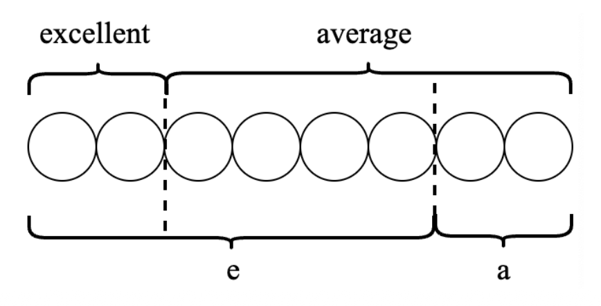
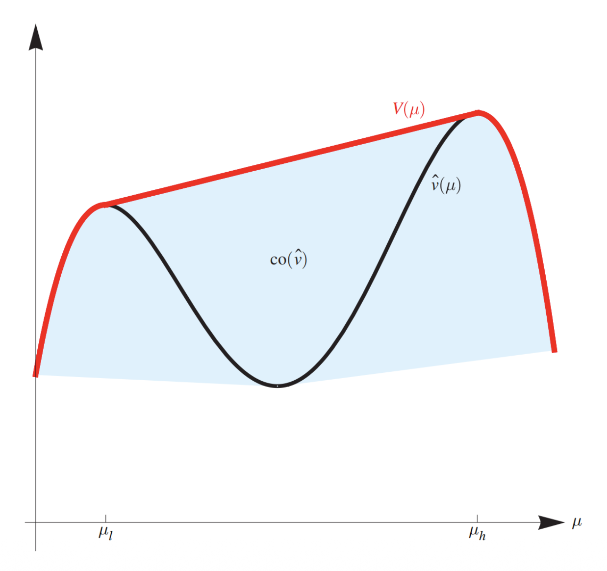
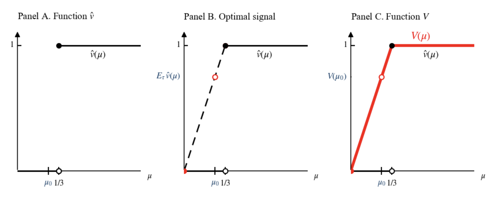
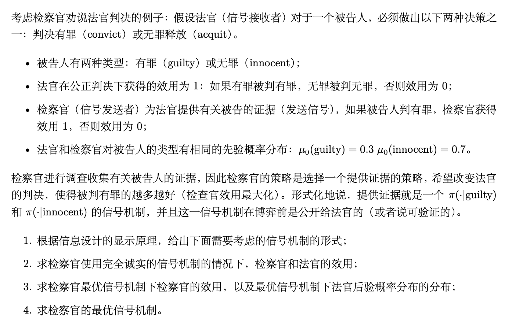
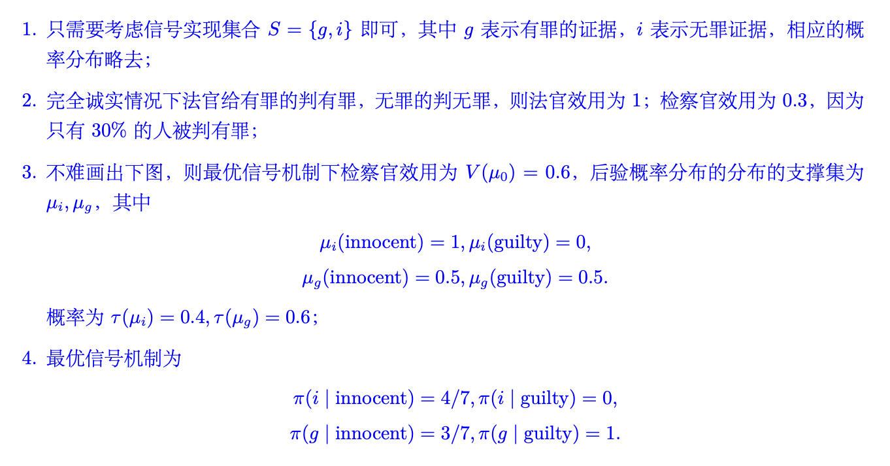
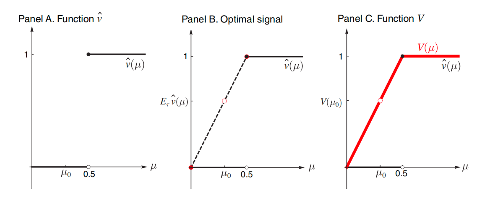

# Lec 9: 贝叶斯劝说

## 贝叶斯劝说：背景与例子

劝说的含义：

- 用言语打动
- 指公共关系人员运用多种传播方式，努力地影响公众接受组织的观点，或促使公众主动地采取某种行动
- 劝人做某种事情或使人对某种事情表示同意

劝说的例子：

- 广告
- 演讲
- 谈判
- 导师写推荐信
- wyy 劝大家选这门课
- ...

建模：

- 具有信息优势的一方向另一方发送“信号”（后续会形式化）
- 在广告的例子中，商家对产品具体质量具有信息优势，广告词就是商家向消费者发送的信号，以期望改变消费者的购买意愿

???+ example "导师写推荐信的例子"

    考虑导师写推荐信将学生推荐至企业的例子：

    - 两个参与人：**导师（信号发送者）**和**企业（信号接收者）**
        - 导师的任务是向企业为每位学生写推荐信，通过推荐信的好坏向企业发送信号
        - 企业的任务是对一个学生，在接收到导师的推荐信（信号）后必须做出以下两种决策之一：**雇用**(hiring)和**不雇用**(not hiring)
        - 学生不是博弈参与方，因为学生只被动接受结果，没有自己的策略。
    - 学生有两种类型：**优秀**(excellent)或**一般**(average)
        - 学生的类型对导师而言是已知的，**对企业则是不完全信息**
        - 与不完全信息博弈中的假设一致，可以认为学生的类型是自然按一定的先验概率随机抽取的
        - 企业对学生类型有先验分布 $\mu_0(\text{average}) = 0.75, \mu_0(\text{excellent}) = 0.25$，这一先验概率分布也符合导师已知的实际学生类型分布，因此如果随机抽取一个学生，**则企业和导师对学生类型有共同的先验分布**

    还需要定义参与人的效用函数：

    - 假设导师希望推荐出去的学生越多越好，因此企业只要雇用一个学生，则导师获得效用 1，否则效用为 0
    - 企业则希望招收到优秀的学生，因此在招收到优秀的学生时获得效用为 1，招收普通学生时获得效用为 −0.5

    综上所述，目前定义了

    - 两个参与人
    - 企业的策略
    - 两个参与人的效用函数
    - 不完全信息的先验分布

<!-- 1. 参与人：导师、企业
2. 策略：
    - 导师：写推荐信
    - 企业：雇/不雇 -> A = {雇，不雇}, a in A
3. 类型：学生，优秀/一般 -> Omega = {ex, av}, omega in Omega
4. 先验分布：mu_0(ex) = 0.25, mu_0(av) = 0.75
5. 效用：
    - 导师：v(雇, omega) = 1, v(不雇, omega) = 0
    - 企业：u(雇, ex) = 1, u(雇, avg) = -0.5, v(不雇, omega) = 0 -->

因此接下来需要形式化定义导师的策略，即形式化“发信号”这一策略。

>问题：贝叶斯劝说下的策略应当具有怎样的形式？注意与不完全信息博弈中策略的异同。

形象地说，发信号就是通过好或坏的推荐信来向企业表明学生是优秀的或一般的。形式化地说，导师写推荐信的**策略就是如下两个条件概率分布** $\pi(\cdot\ |\ \text{excellent})$ 和 $\pi(\cdot\ |\ \text{average})$（又称**信号机制**(signaling scheme)）：

$$
\pi(e\ |\ \text{excellent}), \pi(a\ |\ \text{excellent}) \\
\pi(e\ |\ \text{average}), \pi(a\ |\ \text{average})
$$

- 其中 $e$ 和 $a$ 分别表示描述学生为优秀类型和一般类型的推荐信
- $\pi(A\ |\ B)$ 表示当学生属于 $B$ 类型时，导师在推荐信中给学生描述的类型为 $A$ 的概率
    - 例如 $\pi(e\ |\ \text{average})$ 表示学生一般时导师在推荐信中将其描述为优秀学生的概率；

一个值得注意的点是，导师和企业之间存在长期关系，因此**导师的策略是企业在看到推荐信之前就已知的**，因为企业在与导师的长期关系中可以验证导师的策略。

### 诚实推荐

第一个信号的例子是，导师完全诚实地推荐学生，即为优秀的学生写好的推荐信，为一般的学生写一般的推荐信，故此时信号机制为

$$
\pi(e\ |\ \text{excellent}) = 1, \pi(a\ |\ \text{excellent}) = 0 \\
\pi(e\ |\ \text{average}) = 0, \pi(a\ |\ \text{average}) = 1
$$

企业知道导师的推荐信是诚实的，因此将接收所有推荐信中写优秀的学生，拒绝所有推荐信中写一般的学生

- 此时导师把优秀的同学推出，故在每个学生上的期望效用为 0.25
- 企业接收所有优秀同学，故在每个学生上的期望效用也为 0.25

### 完全不诚实推荐

自然地，导师会认为提供诚实的推荐信能推荐出的学生太少，因此极端的导师可能会选择为每个学生都写好的推荐信，这就构成了第二个信号的例子：

$$
\pi(e\ |\ \text{excellent}) = 1, \pi(a\ |\ \text{excellent}) = 0 \\
\pi(e\ |\ \text{average}) = 1, \pi(a\ |\ \text{average}) = 0
$$

因此此时企业看到的全是好的推荐信，因此只能保持先验概率去判断学生的好坏：

- 由于每个学生是优秀类型的概率只有 0.25，因此如果企业雇用任意一个学生，其期望效用为 0.25 × 1 − 0.75 × 0.5 = −0.125，因此企业不会雇用任何一个学生
- 此时导师和企业的期望效用均为 0

### 部分诚实推荐

从之前的例子可以看出，完全诚实和完全不诚实的策略都不是最优的，因此需要更精妙的设计。

之后会证明如下信号最优（即导师效用最大化）：

$$
\pi(e\ |\ \text{excellent}) = 1, \pi(a\ |\ \text{excellent}) = 0 \\
\pi(e\ |\ \text{average}) = \dfrac{2}{3}, \pi(a\ |\ \text{average}) = \dfrac{1}{3}
$$

即导师会给所有优秀的学生写好的推荐信，对一般的学生则以 2/3 的概率写好的推荐信。

    

根据上图可以看出：

- 当企业看到好的推荐信时，应当有 1/3 的概率认为学生是真的优秀，有 2/3 的概率认为学生一般
- 企业看到一般的推荐信时则一定认为学生一般

即企业看到推荐信后对学生类型的后验概率为（记 $\mu_A(B)$ 是看到 $A$ 类型推荐信后认为学生属于类型 $B$ 的概率，其实就是 $\mu(B\ |\ A)$）。

用[贝叶斯公式](3.md#贝叶斯公式)计算，可以得到：

$$
\pi_e(\text{excellent}) = \dfrac{1}{3}, \pi_e(\text{average}) = \dfrac{2}{3} \\
\pi_a(\text{excellent}) = 0, \pi_a(\text{average}) = 1
$$

在贝叶斯劝说的场景下，贝叶斯公式应当表达为：

$$
\mu_s(\omega) = \dfrac{\pi(s\ |\ \omega) \mu_0(\omega)}{\sum_{\omega' \in \Omega} \pi(s\ |\ \omega') \mu_0(\omega')}
$$

试验证部分诚实推荐策略下给出的后验概率是符合贝叶斯公式的。

- 根据后验概率，看到一般的推荐信代表学生一般，故企业不会雇用
- 当看到好的推荐信时，有 1/3 的概率认为是优秀学生，2/3 的概率认为是一般学生，故对于一个好推荐信对应的学生
    - 企业雇用带来的效用为 1/3 * 1 − 2/3 * 0.5 = 0，即是无差异的
    - **假设在信号接收者策略无差异的情况下，信号接收者会选择有利于信号发送者的决策**，即这里的企业会选择雇用
    - 故企业期望效用为 0，而根据导师的策略 $\pi$，导师将全部的优秀学生以及 2/3 的一般学生推荐进入企业，因此导师的期望效用为 0.25 + 0.75 * 2/3 = 0.75

之后的讨论会严谨说明这一信号是最优的，但现在可以理解这一信号是最优的直观：

- 优秀的学生应当全部被雇用，然后应当尽可能地让一般的学生被雇用
- 在上述信号机制中，如果进一步增大一般学生写好推荐信的比例，企业看到好推荐信时会认为一般学生比例太大，因此将倾向于不雇用，因此**使得企业雇用和不雇用无差异的信号是最优的**

## 模型描述与问题转化

### 贝叶斯劝说：模型描述

从导师写推荐信的例子中可以提炼出一般的**贝叶斯劝说**(Bayesian persuasion)模型：

- 两个参与人：信号发送者（导师）和信号接收者（企业）
- 他们对自然的真实状态 $\omega \in \Omega$（一个学生优秀 / 一般）有相同的先验分布 $\mu_0 \in \text{int}(\Delta(\Omega))$，信号发送者知道状态的实现值（即具体每个学生是优秀还是一般的），但信号接收者不知道
    - $\Delta(\Omega)$ 表示 $\Omega$ 上的概率分布
    - $\text{int}$ 含义是内点，即**先验分布保证每个状态的概率都是正的**

- 假定双方都是理性的，即追求效用最大化的，并且都是按照贝叶斯公式更新信念的
- 发送者的效用为 $v(a, \omega)$，接收者的效用为 $u(a, \omega)$
    - 导师的效用为 $v(\text{hiring}, \omega) = 1, v(\text{not hiring}, \omega) = 0$（与 $\omega$ 无关）
    - 企业的效用为 $u(\text{hiring}, \text{average}) = −0.5$ 等

博弈的行动顺序如下（动态博弈需要说明顺序）：

1. **发送者公开（承诺(commit)）信号机制** $(S, \pi(s\ |\ \omega)), \forall s \in S, \omega \in \Omega$
    - $S$ 称为信号实现空间，例如前面的例子中 $S = \{e, a\}$
    - 故信号机制包含**信号实现空间 $S$ 及其在所有现实状态下的条件分布**
    - 于是**接收者可以利用贝叶斯公式计算出后验概率** $\mu_s(\omega)$

2. 自然以分布 $\mu_0$ 选择 $\omega \in \Omega$（抽出一个学生是优秀 / 一般的）
3. 类型为 $\omega$ 时发送者以概率 $\pi(s\ |\ \omega)$ 发送信号 $s \in S$
4. 接收者收到信号 $s$ 并选择一个行动 $a \in A$（企业雇用 / 不雇用学生）
    - $a$ 的选择应当最大化接收者的效用，即

        $$
        a = \arg \max\limits_{a \in A} \mathbb{E}_{\mu_s}[u(a, \omega)]
        $$

    **如果有多个最大化效用的选择，假设其选择最大化发送者效用的行动**（企业雇用和不雇用无差异时，选择雇用学生）

5. 发送者获得效用 $v(a, \omega)$，接收者获得效用 $u(a, \omega)$

### 贝叶斯劝说的目标

注意**贝叶斯劝说的第一步就是信号发送者公开承诺信号机制**：

- 回忆导师写推荐信的例子，这样的情况可以发生在**结果可验证的情况**
    - 例如企业可以在雇用后看出学生的能力，或者消费者可以在购买产品后看出产品的实际价值
    - 因此贝叶斯劝说主要在这样的场景下具有实际价值
- 此外，贝叶斯劝说模型中，信号发送者优先行动，接收者在看到信号发送者的行动后行动，故最优化问题实际是一个**双层优化问题**
    - 此时信号发送者和信号接收者的策略相对于对方的策略都是最优的，并且信号接收者的信念通过贝叶斯公式进行了更新，这一均衡被称为**完美贝叶斯均衡**(perfect Bayesian equilibrium)

在理解了贝叶斯劝说的例子、思想以及具体模型后，自然地，我们希望研究有关贝叶斯劝说的如下问题：

- 发送者**是否总是可以通过设计信号机制来影响接收者的行为，从而提升自己的效用**？如果不是，什么情况下可以？
- 发送者**如何设计信号机制以达到最大化自己的效用**？最大化效用时信号以及接收者的行为的特点是什么样的？
- 接收者**是否愿意接受发送者的信号机制**？如果不是，什么情况下可以？

### 贝叶斯可行

为了解决前两个问题，首先要定义**贝叶斯可行**(Bayesian plausible)的概念，然后将设计最优信号机制的问题转化为更容易解决的问题。

给定信号机制 $(S, \pi(s\ |\ \omega))$，任一信号实现 $s$ 都会导致一个后验概率分布 $\mu_s \in \Delta(\Omega)$，即对任意的 $s \in S, \omega \in \Omega$：

$$
\mu_s(\omega) = \dfrac{\pi(s\ |\ \omega) \mu_0(\omega)}{\sum_{\omega' \in \Omega} \pi(s\ |\ \omega') \mu_0(\omega')}
$$

由于每个 $s$ 都会导致一个后验概率分布，所以所有的 $s$ 将导致 $|S|$ 个后验概率分布，并且所有的后验概率分布本质上都是 $\Omega$ 上的分布。根据全概率公式，每个 $s$ 被发出的概率为

$$
\mathbb{P}(s) = \sum\limits_{\omega' \in \Omega} \pi(s\ |\ \omega') \mu_0(\omega')
$$

所以所有 $s$ 将导致一个后验概率分布的分布 $\tau \in \Delta(\Delta(\Omega))$，其中概率分布支撑为 $\text{Supp}(\tau) = \{\mu_s\}_{s \in S}$，支撑中每一个后验概率 $\mu \in \Delta(\Omega)$ 的概率为：

$$
\tau(\mu) = \sum\limits_{s: \mu_s = \mu} \mathbb{P}(s) = \sum\limits_{s: \mu_s = \mu} \sum\limits_{\omega' \in \Omega} \pi(s\ |\ \omega') \mu_0(\omega')
$$

如果每个后验概率都不同，则支撑中每一个后验概率 $\mu \in \Delta(\Omega)$ 的概率为：

$$
\tau(\mu) = \mathbb{P}(s) = \sum\limits_{\omega' \in \Omega} \pi(s\ |\ \omega') \mu_0(\omega')
$$

例如，回忆导师写推荐信的例子，在最优机制下，信号机制导致的两个后验概率分布分别为

$$
\pi_e(\text{excellent}) = \dfrac{1}{3}, \pi_e(\text{average}) = \dfrac{2}{3} \\
\pi_a(\text{excellent}) = 0, \pi_a(\text{average}) = 1
$$

这两个后验概率分布不相同，因此 $\text{Supp}(\tau) = \{\mu_e, \mu_a\}$，二者概率为

$$
\mathbb{P}(e) = \pi(e\ |\ \text{excellent}) \mu_0(\text{excellent}) + \pi(e\ |\ \text{average}) \mu_0(\text{average}) = 0.75 \\
\mathbb{P}(a) = \pi(a\ |\ \text{excellent}) \mu_0(\text{excellent}) + \pi(a\ |\ \text{average}) \mu_0(\text{average}) = 0.25
$$

基于上述记号，可以给出贝叶斯可行的定义：

!!! definition "定义"

    - 如果存在信号机制 $(S, \pi(s\ |\ \omega))$ 对应的后验概率分布的分布为 $\tau$，称 $\tau$ 由信号导致。
    - 如果

        $$
        \sum\limits_{\text{Supp}(\tau)} \mu \tau(\mu) = \mu_0
        $$

        即后验概率的期望等于先验概率，那么称一个后验概率分布的分布 $\tau$ 是**贝叶斯可行**的。

再次强调，这里不同的后验概率分布可以求和的原因在于，本质上不同的后验概率分布都是 $\Omega$ 上的概率分布。例如可以检查导师写推荐信的例子是否满足贝叶斯可行性：

$$
\tau(\mu_e) \cdot \mu_e(\text{excellent}) + \tau(\mu_a) \cdot \mu_a(\text{excellent}) = 0.25 = \mu_0(\text{excellent}) \\
\tau(\mu_e) \cdot \mu_e(\text{average}) + \tau(\mu_a) \cdot \mu_a(\text{average}) = 0.75 = \mu_0(\text{average})
$$

事实上，导师写推荐信的例子满足贝叶斯可行性并非偶然：只要 $\tau$ 是信号机制导致的，信号机制必然贝叶斯可行：对任意的 $\omega \in \Omega$ 有

$$
\begin{align}
\sum\limits_{\text{Supp}(\tau)} \mu(\omega) \tau(\mu) & = \sum\limits_{s \in S} \mu_s(\omega) \mathbb{P}(s) \notag \\
& = \sum\limits_{s \in S} \dfrac{\pi(s\ |\ \omega) \mu_0(\omega)}{\sum_{\omega' \in \Omega} \pi(s\ |\ \omega') \mu_0(\omega')} \mathbb{P}(s) \notag \\
& = \sum\limits_{s \in S} \pi(s\ |\ \omega) \mu_0(\omega) = \mu_0(\omega) \notag
\end{align}
$$

### 问题转化

由此可知，一个信号机制可以导致一个贝叶斯可行的后验概率分布的分布。反之，一个贝叶斯可行的后验概率分布的分布 $\tau$ 是否一定对应一个信号机制呢？答案是肯定的：

!!! theorem "定理"

    当且仅当存在一个信号机制 $(S, \pi(s\ |\ \omega))$ 使得 $\tau$ 是由该信号机制导致的时候，一个后验概率分布的分布 $\tau \in \Delta(\Delta(\Omega))$ 是贝叶斯可行的。

??? proof "证明"

    “当”的部分上面已经说明，“仅当”部分的证明需要从 $\tau$ 构造出信号机制 $(S, \pi(s\ |\ \omega))$。根据 $\mathbb{P}(s) \mu_s(\omega) = \pi(s\ |\ \omega) \mu_0(\omega)$ 自然地可以写出这一构造：定义 $S = \text{Supp}(\tau)$，且对任意的 $s \in S$，定义

    $$
    \pi(s\ |\ \omega) = \dfrac{\tau(\mu_s) \mu_s(\omega)}{\mu_0(\omega)}
    $$

    不难验证这的确构造出了一个合理的信号机制。

??? question "练习"

    === "题目"

        从 $\mu_e$ 和 $\mu_a$ 反推出最优信号机制。

    === "解答"

        鸽了...

- 因此，**一个信号机制等价于一个贝叶斯可行的后验概率分布的分布**
    - 进而可以导致**接收者行动的分布**，因为一个后验概率分布就对应接收者的一个最优行动
    - 显然，只要接收者行动分布一定，那么发送者的效用也是确定的

- 因此是否存在一个信号机制使得发送者达到效用 $v^*$，只需要考虑是否存在一个贝叶斯可行的后验概率分布的分布 $\tau$ 使得发送者效用达到 $v^*$
- 因此**设计最优信号机制的问题可以转化为设计一个贝叶斯可行的后验概率分布的分布 $\tau$ 使得接收者的效用最大化**

## 最优信号机制

问题转化后，我们需要解决的问题是设计一个贝叶斯可行的后验概率分布的分布 $\tau$ 使得发送者的效用最大化。首先将问题形式化：记后验概率为 $\mu$ 时，接收者的最优行动为 $\hat{a}(\mu)$，则发送者的期望效用为

$$
\hat{v}(\mu) = \mathbb{E}_\mu v(\hat{a}(\mu), \omega)
$$

此处求期望是考虑到一般的情况下 $v$ 的表达式为 $v(a, \omega)$，因此需要针对 $\omega$ 求期望。而在导师写推荐信的例子中，因为 $v$ 与 $\omega$ 无关，故是可以省略的。基于此，可以定义最优信号机制问题：

$$
\max\limits_{\tau} \mathbb{E}_\tau \hat{v}(\mu) \\
\text{s.t. } \sum\limits_{\text{Supp}(\tau)} \mu \tau(\mu) = \mu_0 
$$

### 显示原理

然而问题在转化到最优后验概率设计后，设计空间仍然非常大：

- 我们甚至不知道后验概率分布的分布 $\tau$ 的支撑集大小（也就是信号实现空间 $S$ 的大小）应该是多少
    - 例如导师写推荐信的例子，或许导师可以写三类甚至更多类推荐信，设计更复杂的信号机制，从而获得更高的期望效用
- 然而可以思考，一个后验概率分布会对应于一个接收者的最优行动，而接收者的最优行动决定发送者的效用，因此直观来看如果有 $|A|$ 种后验概率（故 $|A|$ 种信号实现）诱导出 $|A|$ 种行动就足够了

接下来的定理表明这一直观是正确的，这一结论称为贝叶斯劝说的“显示原理”，以表示其与[机制设计中的显示原理](6.md#显示原理)的关联：

- 因此贝叶斯劝说也称为**信息设计**(information design)，信息设计和机制设计都是使他人行动按照自己设想进行的方式，只是**信息设计通过改变他人信念实现，而机制设计通过设计激励实现**
- 这两个显示原理都是**缩小信息/机制设计的空间**：
    - 信息设计中的显示原理是一个信号实现对应接收者的一个行动（直观来看就是为接收者推荐了一个行动）
    - 机制设计中的显示原理则表明只需设计直接显示机制即可，此时参与人会诚实显示自己的信息

!!! theorem "显示原理"

    存在一个信号机制，当且仅当存在一个**直接**(straightforward)**信号机制**，使得发送者的效用达到 $v^*$，其中直接信号机制是指满足 $S \subseteq A$ 并且接收者的最优行动等于信号实现的信号。

- 放在导师写推荐信的例子中，直接信号机制指信号实现空间 $S \subseteq \{\text{excellent}, \text{average}\}$ 且当接收者看到优秀的推荐信的信号时雇用，看到一般的推荐信的信号时不雇用的信号
    - 事实上此前给出的最优信号机制的确满足直接信号机制的定义
- 总而言之，显示原理表明，最优信号机制设计所需的信号实现数目（后验概率数目）是不超过接收者行动数目的
- 定理的证明是简单的：如果有两个信号实现会导致相同的接收者最优行动，将这两个信号实现合并成一个即可，具体证明略去

### 凹包络

在完成了准备工作后，最后的问题是如何求解最优信号机制。下面我们将介绍一个重要的概念：凹包络。

!!! definition "定义"

    函数 $\hat{v}$ 的**凹包络**(concave closure) $V$ 定义为：

    $$
    V(\mu) = \sup \{z\ |\ (\mu, z) \in \text{co}(\hat{v})\}
    $$

    其中 $\text{co}(\hat{v})$ 表示函数 $\hat{v}$ 的图像的凸包。

下页图给出了一个函数的凹包络的例子。直观而言，一个函数的凹包络就是大于等于这个函数的最小凹函数。

    

### 最优信号机制的解

函数 $\hat{v}$ 的凹包络是求解最优信号机制问题的关键：

- 注意到如果 $(\mu_0, z) \in \text{co}(\hat{v})$，则必然存在后验概率分布的分布 $\tau$ 使得 $\mathbb{E}_\tau \mu = \mu_0$，且 $\mathbb{E}_\tau \hat{v}(\mu) = z$（因为期望也是凸组合）
- $V(\mu_0)$ 则是所有这样的 $z$ 中的最大值

因此 $V(\mu_0)$ 就是最优信号机制问题的解。总而言之我们可以得到下面的推论，从而回答了之前提出的所有问题：

!!! note "推论"

    最优信号机制问题的解存在，最大值为 $V(\mu_0)$。进一步地，发送者设计信号能提升自己的效用当且仅当 $V(\mu_0) > \hat{v}(\mu_0)$。

???+ example "例：导师写推荐信问题的解"

    回到导师写推荐信的例子，可以利用前面的结论证明之前给出的解是最优的。首先计算

    $$
    \hat{v}(\mu) = \mathbb{E}_\mu v(\hat{a}(\mu), \omega) = v(\hat{a}(\mu))
    $$

    又当 $\mu(\text{excellent}) \ge \dfrac{1}{3}$ 时 $\hat{a}(\mu) = \text{hiring}$，故导师的效用为 1；反之 $\hat{a}(\mu) = \text{not hiring}$，因此可以作出下图，横坐标表示 $\mu(\text{excellent})$：

    

        
    

    不难看出 $V(\mu_0) = 0.75$，因此检察官的最优效用是 0.75，符合之前的计算。并且此时 $\tau$ 的支撑集是 $\{\mu_e, \mu_a\}$，其中

    $$
    \pi_e(\text{excellent}) = \dfrac{1}{3}, \pi_e(\text{average}) = \dfrac{2}{3} \\
    \pi_a(\text{excellent}) = 0, \pi_a(\text{average}) = 1
    $$

    也是符合此前的结果的。进一步可以利用这一后验概率分布的分布计算出对应的信号机制，读者可以自行尝试，也是符合此前的结果的。

??? example "例子"

    === "题目"

        

            
        

    === "解答"

        

            
        

        

            
        

### 贝叶斯劝说与线性规划

可以从计算的视角重新看待贝叶斯劝说。已知先验分布 $\mu_0$，发送者的效用函数 $v(a, \omega)$ 和接收者的效用函数 $u(a, \omega)$。设接收者行动有 $n$ 种，记为 $\{1, 2, \dots, n\}$，显示原理表明只需对每个 $\omega$ 设计 $n$ 种信号 $\{\pi(s_i\ |\ \omega)\}_{i=1}^n$ 即可，故可以将最优信号机制问题转化为如下线性规划问题：

$$
\begin{align}
\max\limits_{\pi(s_i\ |\ \omega)} & \sum\limits_{\omega \in \Omega} \sum\limits_{i=1}^n \pi(s_i\ |\ \omega) \mu_0(\omega) v(i, \omega) \notag \\
\text{s.t.} & \sum\limits_{\omega \in \Omega} \pi(s_i\ |\ \omega) \mu_0(\omega) v(i, \omega) \ge \pi(s_i\ |\ \omega) \mu_0(\omega) v(j, \omega), \forall i, j \in [n] \notag \\
& \sum\limits_{i=1}^n \pi(s_i\ |\ \omega) = 1, \forall\ \omega \in \Omega \notag \\
& \pi(s_i\ |\ \omega) \ge 0, \forall s_i \in S, \omega \in \Omega \notag
\end{align}
$$

显然，第二条和第三条约束是称为概率分布的必要条件。第一条约束和目标函数需要进一步的解释。

约束的第一条是显示原理的要求，即要求接收者看到 $s_i$ 时最优的行动选择就是 $i$。实际上，当接收者看到 $s_i$ 且选择行动 $j$ 时，其期望效用为

$$
\sum\limits_{\omega \in \Omega} \mu_{s_i} (\omega) u(j, \omega) = \sum\limits_{\omega \in \Omega} \dfrac{\mu_0(\omega) \pi(s_i\ |\ \omega)}{\sum_{\omega' \in \Omega} \mu_0(\omega') \pi(s_i\ |\ \omega')} u(j, \omega)
$$

因此第一条约束是将不等式两边分母中的相同部分

$$
\sum\limits_{\omega \in \Omega} \mu_0(\omega) \pi(s_i\ |\ \omega)
$$

消去了。事实上，之前介绍的显示原理的作用就在于此。如果没有显示原理，$s_i$ 数目的不确定性会给线性规划的定义带来很大的困难。

结合显示原理的约束，最大化的目标函数的来源是

$$
\begin{align}
\mathbb{E}_r \hat{v}(u) & = \sum\limits_{\mu \in \text{Supp}(\tau)} \tau(mu) \cdot v(\hat{a}(\mu), \omega) = \sum\limits_{i=1}^n \mathbb{P}(s_i) \cdot v(i, \omega) \notag \\
& = \sum\limits_{\omega \in \Omega} \sum\limits_{i=1}^n \mu_0(\omega) \pi(s_i\ |\ \omega) v(i, \omega) \notag
\end{align}
$$

上述线性规划给予我们的启示是，贝叶斯劝说与迈尔森最优拍卖机制设计类似，本质上都可以写成数学规划问题，但是这两个问题都可以找到特殊结构，从而可以将问题转化为可以给出比较直接的解的问题。并且两个问题的解都非常简洁美观，值得反复品味。

### 贝叶斯劝说对接收者的影响

最后解决第三个问题：信号接收者是否愿意接受发送者的信号机制？

!!! theorem "命题"

    在任意信号机制 $S$，$\pi(s\ |\ \omega)$ 下，接收者的效用都不会低于其在没有信号的情况下的效用。

任取信号机制 $S$，$\pi(s\ |\ \omega)$，当接收者看到 $s \in S$ 时，其效用为

$$
\begin{align}
\max\limits_{a \in A} \mathbb{E}_{\mu_s} [u(a, \omega)] & = \max\limits_{a \in A} \sum\limits_{\omega \in \Omega} \mu_s(\omega) u(a, \omega) \notag \\
& = \max\limits_{a \in A} \sum\limits_{\omega \in \Omega} \dfrac{\pi(s\ |\ \omega) \mu_0(\omega)}{\sum_{\omega' \in \Omega} \pi(s\ |\ \omega') \mu_0(\omega')} u(a, \omega) \notag
\end{align}
$$

因此在信号机制 $S$，$\pi(s\ |\ \omega)$ 下，其期望效用为

$$
\begin{align*}
\sum_{s \in S} \mathbb{P}(s) \cdot \max_{a \in A} \mathbb{E}_{\mu_s} [u(a,w)] &= \sum_{s \in S} \left( \sum_{\omega' \in \Omega} \pi(s \mid \omega') \mu_0(\omega') \right) \cdot \max_{a \in A} \mathbb{E}_{\mu_s} [u(a,w)] \\
&= \sum_{s \in S} \max_{a \in A} \sum_{\omega \in \Omega} \pi(s \mid \omega) \mu_0(\omega) u(a,\omega) \\
&\ge \max_{a \in A} \sum_{s \in S} \sum_{\omega \in \Omega} \pi(s \mid \omega) \mu_0(\omega) u(a,\omega) \\
&= \max_{a \in A} \sum_{\omega \in \Omega} \left( \sum_{s \in S} \pi(s \mid \omega) \right) \mu_0(\omega) u(a,\omega) \\
&= \max_{a \in A} \sum_{\omega \in \Omega} \mu_0(\omega) u(a,\omega) = \max_{a \in A} \mathbb{E}_{\mu_0} [u(a,w)] 
\end{align*}
$$

由此可知命题成立。事实上**这里的讨论与下一章出售信号机制的讨论有关联**：基于上述讨论可以计算向数据买家出售信号机制给买家带来的效用，并且上述命题表明这一效用一定是非负的。