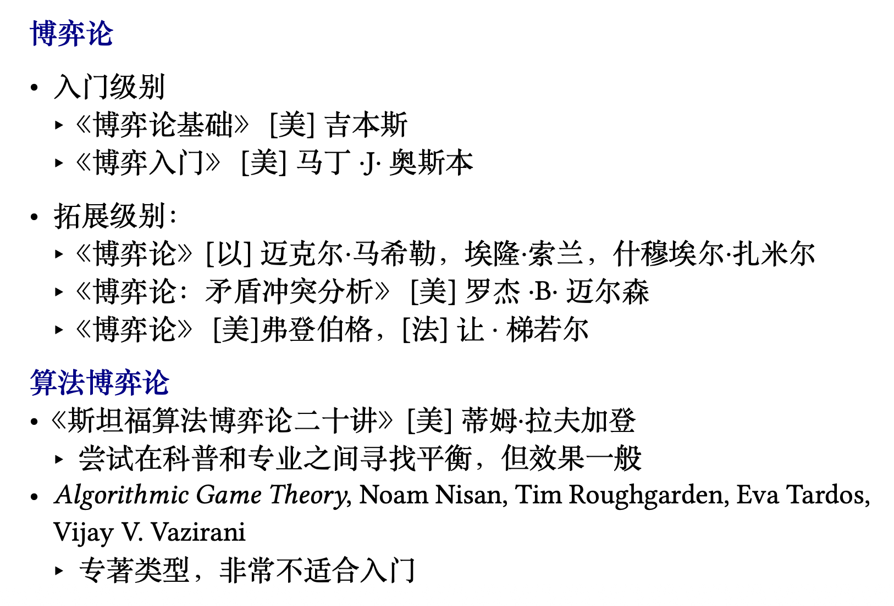

# 数据要素市场（课程综合实践II）

!!! info "课程信息"

    - 学分：2.5
    - 教师：刘金飞
    - 助教：吴一航
    - 教材：《数据要素市场：以数据交易为核心》（但要到 25 年末出版）

!!! abstract "目录"

    - [x] [数据要素市场概述](1.md)
    - [x] [数据合规与安全](2.md)
    - [x] [非合作博弈论基础](3.md)
    - [ ] [合作博弈与数据估值](4.md)
    - [x] [多臂老虎机算法基础与应用](5.md)
    - [ ] [拍卖与机制设计基础](6.md)
    - [ ] [最优机制，拍卖与数据定价](7.md)
    - [ ] [数据版本化定价](8.md)
    - [ ] [贝叶斯劝说](9.md)
    - [ ] [信息定价](10.md)
    - [ ] [隐私，外部性与数据定价](11.md)

!!! recommend "参考资料"

    - [课程网站](https://yhwu-is.github.io/Teach/ec/data_market/2025/)（笔记的绝大多数内容整理自课件）

    ??? abstract "PPT 上列出的参考书籍"

        

            
        

        

            
        
