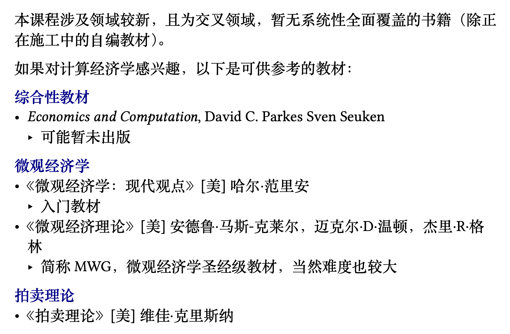

# 数据要素市场（课程综合实践II）

!!! info "课程信息"

    - 学分：2.5
    - 教师：刘金飞
    - 助教：吴一航
    - 教材：《数据要素市场：以数据交易为核心》（但要到 25 年末出版）
    
??? info "考试信息"

    题型：

    - 5个名词解释：10%
    - 9个选择：18%
        - 计算不复杂
    - 3个大题：14% + 15% + 13%
        - 简答 + 计算
        - 无证明题
    - 课程反馈：30%
        - 和去年一样，可提前准备
    - 不是送分题，~~太敷衍的话会倒扣分~~

    考试范围（wyy 讲这块的时候没有用麦克风，回放的时候声音没有录进去（悲））：

    - Lec1：应该也是考概念吧
    - Lec2：概念
    - ==Lec3：都是重点==（均衡）
    - Lec4：只考 3个人的合作沙普利值
    - Lec5（多臂老虎机）：只考概念、性质（简答）
    - ==Lec6&7：都是重点==（拍卖）
        - 和作业题不太一样
        - 参考 quiz 和课上提问（课件上的“？”）
    - Lec8：
        - 无套利
        - 作业题
    - Lec9：
        - 参考作业题
    - Lec10：不考
    - Lec11：考1道选择 ~~没听过也能猜出来~~

    其余信息见课程网站（链接在下面）

!!! abstract "目录"

    - [x] [数据要素市场概述](1.md)
    - [x] [数据合规与安全](2.md)
    - [x] [非合作博弈论基础](3.md)
    - [x] [合作博弈与数据估值](4.md)
    - [x] [多臂老虎机算法基础与应用](5.md)
    - [x] [拍卖与机制设计基础](6.md)
    - [x] [最优机制](7.md)
    - [x] [数据版本化定价](8.md)
    - [x] [贝叶斯劝说](9.md)
    - [ ] [信息定价](10.md)（鸽掉了...）
    - [x] [隐私，外部性与数据定价](11.md)

!!! recommend "参考资料"

    - [课程网站](https://yhwu-is.github.io/Teach/ec/data_market/2025/)（笔记的绝大多数内容整理自课件）

    ??? abstract "PPT 上列出的参考书籍"

        

            
        

        

            
        
