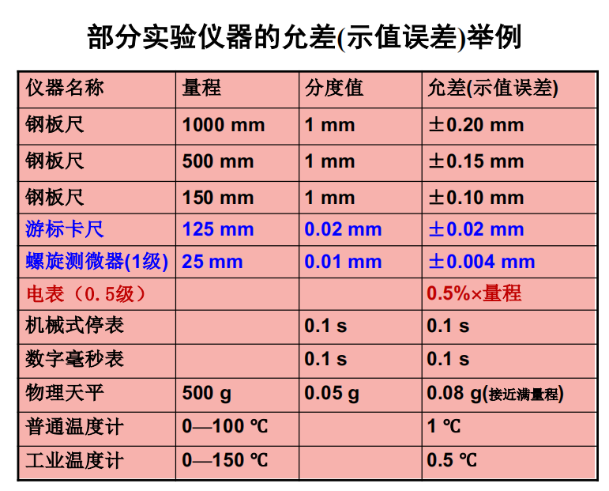
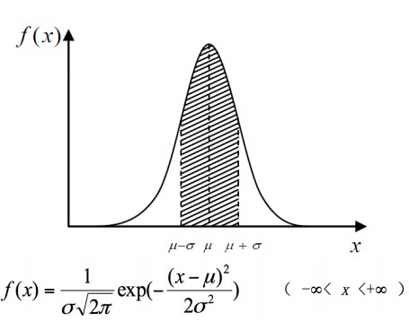
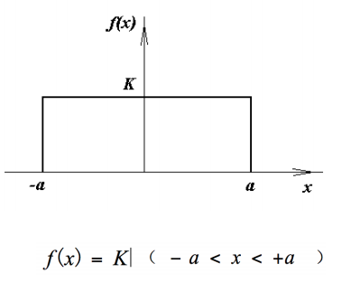
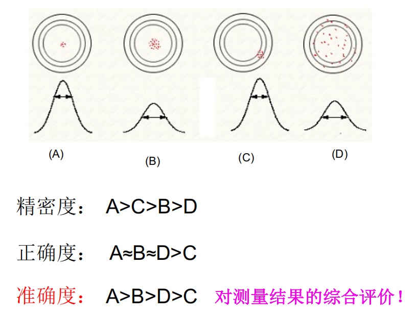

# 绪论

## 实验测量与误差分布

测量四要素：被测对象、测量程序、测量准确度和计量单位

测量的分类：

- 直接测量
- 间接测量：通过计算实测的量得到欲测的量

---
- 可靠数字：通过直读获取的准确数字
- 存疑数字：通过估读得到的数字

有效数字：可靠数字 + 1位存疑数字，其总位数被称为有效位数

---
误差的表示：

- 绝对误差 = 测量值 - 真值
- 相对误差（百分误差）$E = \dfrac{|测量值 - 真值|}{真值} \times 100\%$
- 标准误差（标准差）$S = \sqrt{\dfrac{1}{n-1}\sum\limits_{i=1}^n|绝对误差|^2}$

!!! warning "注意"

    如果真值是不可知的，则无法计算误差。

误差分类：

|名称|主要来源|特点|处理|举例|
|:--|:--|:--|:--|:--|
|系统误差（装置误差）|装置本身|可预知，不可避免|见下面|见下面|
|随机误差（偶然误差）|环境偶然性|无规则涨落，不可避免；存在一定的统计规律|可通过多次测量来减小|测一本书的厚度|
|粗大误差（过失误差）|粗心大意|可避免|尽量避免|电表没调零就用；读错写错数据|

|系统误差|定义|处理|举例|
|:-|:-|:-|:-|
|已定系统误差|在同等条件下，对同一个待测量值进行多次测量，测量值和真值的偏离总是相同的那部分误差分量|必须修正|电表读数、显微镜的零位误差（仪器本身因素）|
|未定系统误差|已知存在于某个范围，而不知具体数值的系统误差|后面会提到|仪器的允差（示值误差）|

    

误差的分布：

- 正态分布：测量值的均值$\mu$看作真值（无穷次测量）

    

        
    

    - 特点：单峰性、对称性、有界性、抵偿性
    - 消除系统误差后，$\mu = \lim\limits_{n \rightarrow \infty}\dfrac{1}{n}\sum\limits_{i=1}^nx_i$，被称为数学期望值，表示$x$出现概率最大的值，作为$x$的近似**真值**
    - $\sigma=\lim\limits_{n \rightarrow \infty}\sqrt{\dfrac{1}{n}\sum\limits_{i=1}^n(x_i - \mu)^2}$ 被称为标准差，表现测量值的分散程度：$\sigma$越大，曲线越平坦；$\sigma$越小，曲线越陡峭
    - 单次测量值的标准偏差：$s(x) = \sqrt{\dfrac{1}{n-1}[\sum\limits_{k=1}^n(x_k - \overline{x})^2]}$
    - 平均值的标准偏差：$s(x) = \sqrt{\dfrac{1}{n(n-1)}[\sum\limits_{k=1}^n(x_k - \overline{x})^2]}$

- 均匀分布：测量值一定会落在$(-a, a)$区间内

    

---
- 精密度：多次重复测量值互相接近的程度
- 正确度：测量平均值接近真值的程度
- 准确度：对上面两个量度的综合评价

    

## 误差与不确定度

**不确定度**：由于测量误差存在而对被测量值不能确定的程度，是一定概率下的误差限值。它反映了可能存在的误差分布范围，是一个正值。

不确定度的两个分量：

- A类分量$u_A$：多次重复测量时与随机误差有关的分量
- B类分量$u_B$：与未定系统误差有关的分量。

这两类分量在相同置信概率下用方和根方法合成总不确定度：

$$
u = \sqrt{u_A^2 + u_B^2}
$$

不确定度的类型：

- 直接测量的标准不确定度$u$
    - 计算：分为A类评定和B类评定两部分
        - A类评定：用统计方法评定的不确定度部分
        - B类评定：用其他方法......
    - 估算过程：
        - 测量数据列的平均值：$\overline{x} = \dfrac{1}{n}\sum\limits_{i=1}^nx_i$
        - 平均值的标准偏差：$s(\overline{x})=\dfrac{s(x)}{\sqrt{x}}= \sqrt{\dfrac{1}{n(n-1)}[\sum\limits_{k=1}^n(x_k - \overline{x})^2]}$，当 $6 \le n \le 10$，置信概率为68.3%时，可简化认为 $u_A \approx S(\overline{x})$
        - 根据使用仪器得出$u_B$
            - 高斯分布：$u_B = \dfrac{\delta_仪}{3}$
            - 均匀分布：$u_B = \dfrac{\delta_仪}{\sqrt{3}}$
        - 总合成不确定度：$u = \sqrt{u_A^2 + u_B^2}$
        - 最终结果：$x = \overline{x} + u$（单位）

- 间接测量的合成标准不确定度$u_c$
    - 设$y = f(x_1, x_2, \dots, x_i, \dots, x_n)$
    - 不确定度的计算公式
        - 公式1（常用于和差形式的函数）：$u_c = \sqrt{\sum\limits_{i=1}^n[\dfrac{\partial f}{\partial x}u(x_i)]^2}$
        - 公式2（常用于积商形式的函数）：$\dfrac{u_c}{y} = \sqrt{\sum\limits_{i=1}^n(\dfrac{\partial \ln f}{\partial x})^2[u(x_i)]^2}$

- 扩展不确定度$U$

## 有效数字与实验数据处理

有效数字的表示法：

- 修约：以修约书代替已知数
    - 修约区间：约定的最小变化间距
    - 修约规则：**“四舍六入五单双”**
        - 四以下舍掉，六以上进一
        - 遇五的话：若前面是奇数就进一，最后一位就变成偶数；若前面是偶数则舍掉
- 有效数值的位数与小数点位置无关，不因使用单位的不同而改变

---
数值书写的要求：

- 有效数字的位数是由合成不确定度来确定的。测量值的最后一位应与不确定度的最后一位对齐
- 对较大或较小的数值，常采用科学计数法
- 若结果是有间接测量得到的，其有效数字由算出结果的不确定度来确定的。若没有给出各数值的不确定度，由有效数字运算法则确定

---
数据处理方法：

- 列表法
- 逐差法
- 作图法
- 最小二乘法

