# 电磁学部分

## 静电场

### 电场强度

电荷守恒定律：一个孤立系统内无论发生什么过程，总电荷数保持不变。电荷既不能被创造、也不能被消灭，它只能从一个物体转移到另一个物体，或者从物体的一个部分转移到另一个部分。

电子电荷量$e \approx 1.6 \times 10^{-19} \text{C}$

**库仑定律**（适用于真空中两个点电荷）：

$$
\bm{F}_{21} = \dfrac{1}{4 \pi \varepsilon_0} \dfrac{q_1q_2}{r_{12}^2} \hat{\bm{r}}_{12}
$$

>注：公式右边的$\hat{\bm{r}}_{12}$表示的是矢量的**方向**，而不代表具体的值，下面如果出现类似的记号，意义与之类似。

---
电场强度：$\bm{E} = \dfrac{\bm{F}}{q_0}$（矢量，单位：$\rm{N/C}$或$\rm{V/m}$）

点电荷的电场强度：$\bm{E} = \dfrac{q}{4 \pi \varepsilon_0 r^2} \hat{\bm{r}}$

!!! note "求连续分布电荷产生的总场强"

    题目往往会给出电荷密度（包括线密度$\lambda$、面密度$\sigma$、体密度$\rho$）的信息。一般的解题步骤如下：

    - 运用**微元法**。先求一个带电量为 $\mathrm{d}q = \lambda \mathrm{d}l$（或$\lambda R \text{d}\theta$（圆弧）$, \sigma \mathrm{d}S,\ \rho \mathrm{d}V$）的点电荷产生的场强 $\mathrm{d}\bm{E}$
    - 再对所有电荷**积分**，得到：$\bm{E} = \int \mathrm{d} \bm{E} = \int \dfrac{1}{4 \pi \varepsilon_0} \dfrac{\mathrm{d} q}{r^2} \hat{\bm{r}}$

---
**电通量**：穿过闭合曲面$S$的电通量 = 穿过该曲面的电场线条数，即$\Phi_e = \oiint\limits_S \bm{E} \cdot \mathrm{d}\bm{S}$（规定电场线从内向外穿出为正）

- $E \perp S \Rightarrow \Phi_e = ES$
- 平面$S$的法线与$E$的夹角为$\theta \Rightarrow \Phi_e = ES \cos \theta = \bm{E \cdot S}$

    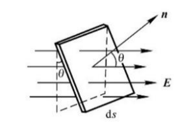

:star:**高斯定理**：通过任意闭合曲面的电通量 = 该曲面所包围的所有电荷量的代数和 / $\varepsilon_0$

$$
\Phi_e = \oiint\limits_S \bm{E} \cdot \mathrm{d} \bm{S} = \dfrac{1}{\varepsilon_0} \sum q_i
$$

:star2:常用结论（最好自己推导一遍，还是挺容易的）：

- 连续分布电荷：$\Phi_e = \oiint\limits_S \bm{E} \cdot \mathrm{d} \bm{S} = \dfrac{1}{\varepsilon_0}\iiint\limits_V \rho \text{d} V$
- **均匀带电球面**：$E = \begin{cases}\dfrac{q}{4 \pi \varepsilon_0 r^2} & r > R \\ 0 & r < R\end{cases}$（同等电量点电荷的场强）
- **无限长带电直线/圆柱面/圆柱体**（线密度$\lambda$）：$E = \dfrac{\lambda}{2 \pi \varepsilon_0 R}$
- **无限大平面**（可有厚度）（面密度$\sigma$）：$E = \dfrac{\sigma}{2 \varepsilon_0}$

    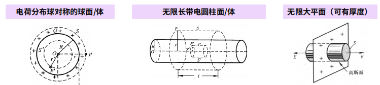

### 电势

电场力所做的功，仅与电荷电量大小及其始末位置有关，与电荷移动的路径无关。所以电场力是一种保守力，静电场是一种保守场。

**静电场环路定理**：在静电场中，电场强度沿任意闭合回路的线积分恒等于0，即$\oint \bm{E} \cdot \mathrm{d} \bm{l} = 0$

**电势能**：在点电荷$q_0$从$a$点移动到$b$点的过程中，电场力所做的功 = 电荷电势能的增量的负值。

$$
A_{ab} = \int_a^b q_0 \bm{E} \cdot \mathrm{d}\bm{l} = -(W_b - W_a) = - \Delta W
$$

- 电势能是相对的，对于有限分布的电荷系统，取无穷远处电势能为0，则将电荷从$p$点移动到无穷远时，$p$点的电势能 = 电场力所做的功，即：$W_p = q_0 \int_p^{\infty} \bm{E} \mathrm{d}\bm{l} $

**电势**：$U_p = \dfrac{W_p}{q_0} = \int_p^{p_0}\bm{E} \cdot \mathrm{d}\bm{l}$，其中$p_0$是电势为0的参考点。

- 注：电势是**标量**，电势的叠加就是电势的代数和，无需考虑方向

现在，电场力做功可以表示为：$A_{ab} = \int_a^b q_0 \bm{E} \cdot \mathrm{d}\bm{l} = q_0(U_a - U_b)$

**常用结论**（可以将电势简单理解为场强在距离$r$的积分，所以这里的结论就是上面“常用结论”的积分版本）：

- **单个点电荷**$q$产生的电势分布为：$U = \dfrac{q}{4\pi \varepsilon_0 r}$，其中$r$为到点电荷的距离
    - 根据电势叠加定理，可以分别算出各个点电荷在某点的电势，然后相加
    - 若电荷连续分布，则分解为微元电荷$\text{d}q$ = 电荷密度与几何微元的乘积，然后表示出$\text{d}U = \dfrac{\text{d}q}{4\pi \varepsilon_0 r}$后积分；或者在已知$\bm{E}$的情况下直接按定义式计算

- **均匀带电空心球壳**：$U = \begin{cases}\dfrac{q}{4\pi \varepsilon_0 r} & r > R \\ \dfrac{q}{4\pi \varepsilon_0 R} & r < R\end{cases}$
- **无限长均匀带电直线/圆柱体**：$U_P = -\dfrac{\lambda}{2 \pi \varepsilon_0} \ln r$，其中$r$为$P$点距带电直线的距离
- **无限大平面**：$U = -\dfrac{\sigma}{2 \varepsilon_0}r$

??? example "例题"

    

        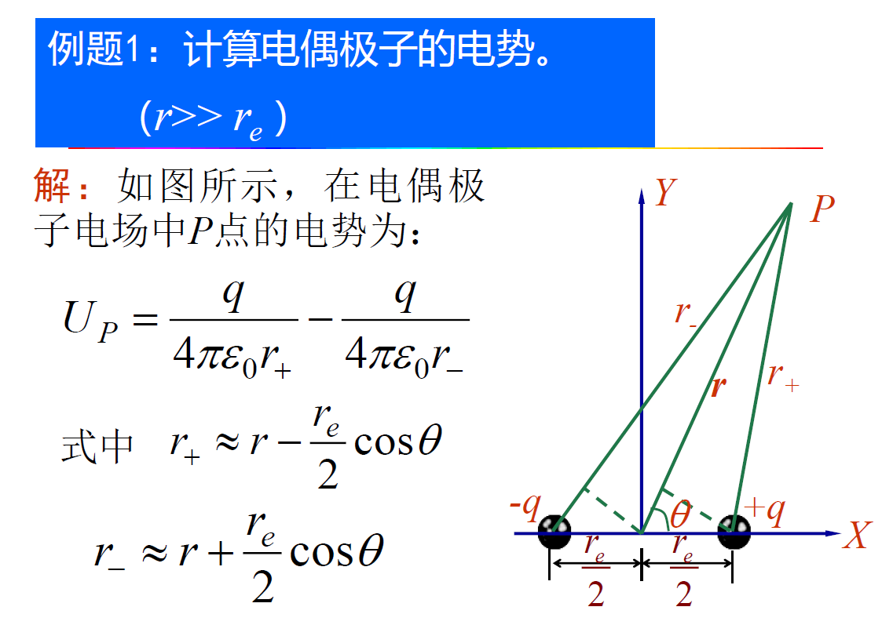
        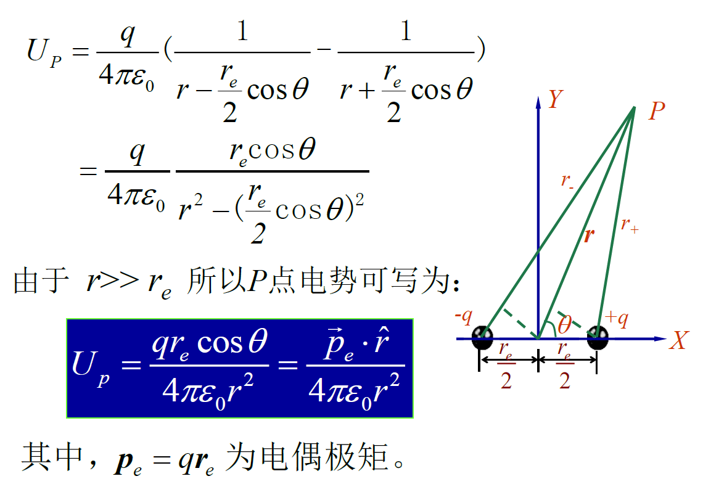
    

    电偶极子的场强分布即为电势梯度的负值（下面会讲到）

---
等势面的性质：

- 等势面与电场线处处正交
- 等势面密集的地方场强大，稀疏处场强小

---
用电势分布求解电场：电场中任一点的电场强度矢量 = 该点**电势梯度**矢量的**负值**

$$
\bm{E} = -\text{grad}\ U = -(\dfrac{\partial U}{\partial x}, \dfrac{\partial U}{\partial y}, \dfrac{\partial U}{\partial z}) = - (\dfrac{\partial U}{\partial x} \overrightarrow{i} + \dfrac{\partial U}{\partial y} \overrightarrow{j} + \dfrac{\partial U}{\partial z} \overrightarrow{k})
$$

## 静电场中的导体与电介质

### 导体

- 静电平衡的特点：
    - 电荷分布
        - 电荷只分布在导体表面
        - 导体表面场强与电荷面密度的关系：$E = \dfrac{\sigma}{\varepsilon_0}$
        - 孤立导体曲率越大的地方，电荷面密度越大
    - 场强与电势
        - 导体内部场强处处为0，导体表面的场强与表面垂直
        - 导体是一个等势体，导体表面是一个等势面

- 静电屏蔽
    - 外部场强无法影响到空腔内，只能引起外表面电荷分布的变化
    - 外表面未接地时，空腔内的电荷将影响导体外的电场
    - 若外表面接地（电势 = 0），则内外电场互不干扰

    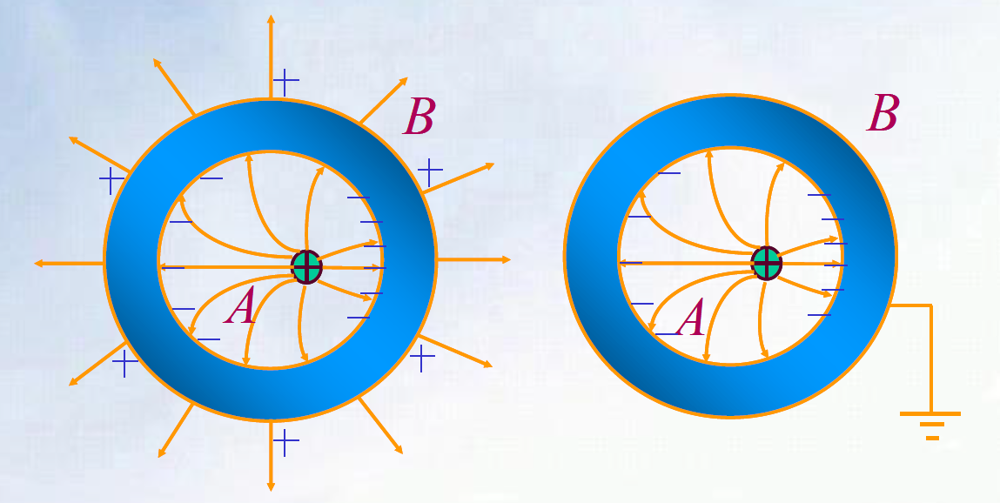

!!! note "静电场中金属导体问题求解的步骤"

    通常题目要求导体的电荷分布/电荷量/电场分布/电势等

    - 根据静电平衡时导体内无场强与电荷守恒，用高斯定理联系场强与电荷量，求解各个面的电荷量
    - 根据电荷量，用高斯定理、场强叠加等计算导体外部（空腔和外界）的点电荷产生的场强
    - 根据场强，用电势定义式计算导体表面的电势
    - 一些操作的含义
        - 接地：改变导体所带电荷量，使其电势为0
        - 连接：两个导体等电势，电荷在两个导体间重新分布

### 电容器

电容单位：$F$，常用单位有：$1\mu F = 10^{-6}F, 1pF = 10^{-12}F$。

各类电容器：

- 平行板电容器：两极板面积$S$，间距$d$，分别带电荷$+Q$和$-Q$
    - 公式：$C = \dfrac{Q}{U_A - U_B} = \dfrac{\varepsilon_0 S}{d}$

    

        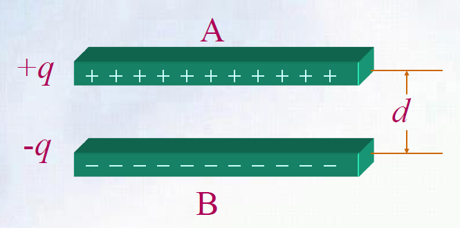
    

    - 注意两类问题：
        - 接通电源：$U$不变，其他量可能改变
        - 断开电源：$Q$不变，其他量可能改变

- 圆柱形电容器：内外柱面半径分别为$R_A$、$R_B$，内外柱面线电荷密度为$+\lambda$、$-\lambda$，长$l \gg (R_B - R_A)$
    - 公式（用高斯定理 + 电势定义式推导）：$C = \dfrac{Q}{U_A - U_B} = \dfrac{\lambda l}{U_A - U_B} = \dfrac{2\pi \varepsilon_0 l}{\ln \frac{R_B}{R_A}}$

    

        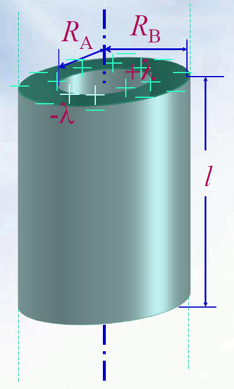
    

- 球形电容器：两同心金属球壳半径分别为$R_A, R_B$，电荷分别为$+q, -q$
    - 公式（可用同样的方式推导）：$C = \dfrac{Q}{U_A - U_B} = 4 \pi \varepsilon_0 \dfrac{R_BR_A}{(R_B - R_A)}$

    

        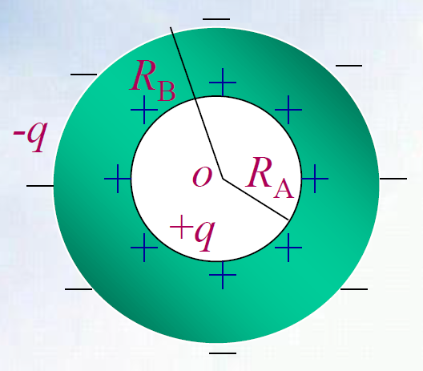
    

电容的串并联

- 串联：
    - 电容减小：$\dfrac{1}{C} = \dfrac{1}{C_1} + \dfrac{1}{C_2} + \dots + \dfrac{1}{C_n}$
    - 耐压增加：$U_A - U_B = \sum\limits_{i=1}^n U_i$
- 并联：
    - 电容增加：$C = C_1 + C_2 + \dots + C_n$
    - 耐压减小：$U_A - U_B = \min\{U_1, U_2, \dots, U_n\}$

??? example "例题"

    === "题目"

        

            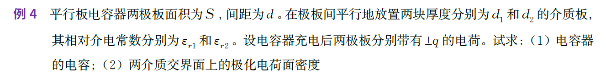
        

    === "答案"

        

            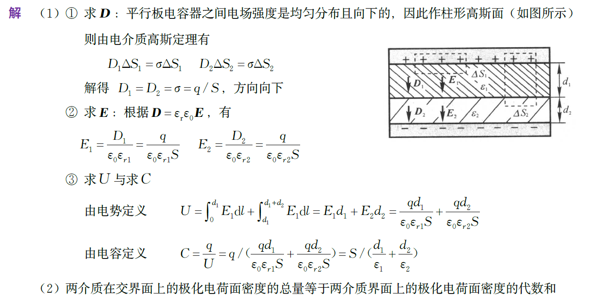
            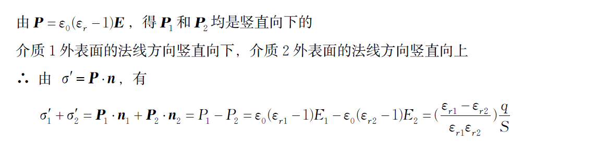
        

### 电介质

- 电介质（可被电极化的绝缘体）在电场中的表现：
    - 外电场在电介质上，会使介质表面产生极化电荷，从而影响电场
    - 介质内部产生的电场不会与外电场抵消，因此介质内部场强不等于0
    - 电介质在平行板电容器中（其中$\varepsilon_r$为相对介电常数）：
        - $E = \dfrac{E_0}{\varepsilon_r} = \dfrac{\sigma}{\varepsilon}$
        - $U = \dfrac{U_0}{\varepsilon_r}$（如果**电源保持接通**，则该式子和上面的式子均不成立，即$U$和$E$不变）
        - $C = \varepsilon_r C_0 = \dfrac{\varepsilon S}{d}$
        
- **极化强度**$\bm{P} = \dfrac{\sum \bm{p}}{\Delta V}$：某点对应的体积微元中所有分子电矩的矢量和
    - 当外加电场不太大时，有线性关系：

    $$
    P = \varepsilon_0 \chi_e \bm{E} = \varepsilon_0(\varepsilon_r - 1)\bm{E}
    $$

    其中$\chi_e$为电极化率

- **极化电荷面密度**：均匀电介质极化时，电介质表面上某点处的极化电荷面密度$\sigma '$等于极化强度在该点表面的外法向分量（从内向外）。

    $$
    \sigma ' = \bm{P} \cdot \bm{e_n}
    $$

- **电位移**$\bm{D} = \varepsilon_0 \bm{E} + \bm{P} = (1 + \chi_e) \varepsilon_0 \bm{E} = \varepsilon_r \varepsilon_0 \bm{E} = \varepsilon \bm{E}$（单位：$\text{C/m}^2$），其中$\varepsilon_r$为相对介电常数，$\varepsilon$为介电常数。
    - 自由电荷面密度：$\sigma = \bm{D} \cdot \bm{e_n}$

- **电介质中的高斯定理**：$\oiint\limits_S \bm{D} \text{d} \bm{S} = \sum q_0$

!!! note "含电介质的电场问题求解"

    - 若题目没有给出电荷量，且需要求出电容，则首先确定两极板间的电荷量（等量异号）
    - 根据电介质高斯定理求出$\bm{D}$
    - 根据$\bm{D}$和$\bm{E}$的比例关系求出$\bm{E}$
    - 根据电势定义和$\bm{E}$得到两极板电势差，再根据电容定义得到电容
    - 若有要求，则继续根据$\bm{E}$求$\bm{P}$和$\sigma '$

??? example "例题"

    === "题目"

        

            
        

    === "答案"

        

            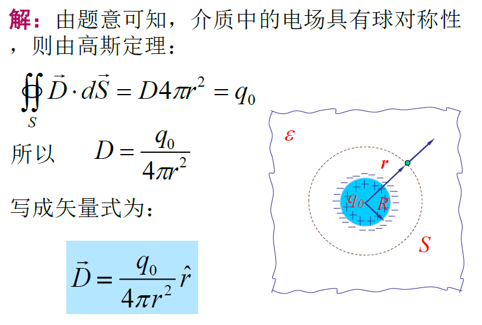
            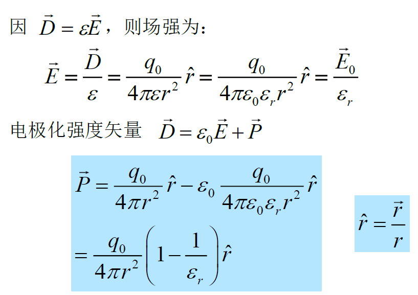
            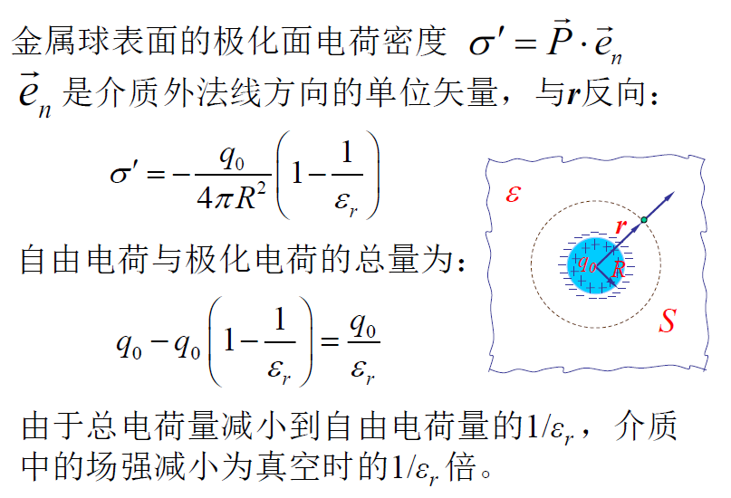
        

### 静电场中的能量

- 点电荷系统的能量：
    - 离散分布：$W = \dfrac{1}{2}\sum q_i U_i$
    - 连续分布（电荷体/电荷面）：$W = \dfrac{1}{2} \iiint\limits_V U \rho \text{d} V = \dfrac{1}{2} \iint\limits_S U \sigma \text{d} S$
- 电容器的能量：$W = \dfrac{1}{2}\dfrac{Q^2}{C} = \dfrac{1}{2}Q(U_A - U_B) = \dfrac{1}{2}C(U_A - U_B)^2$
- 电场能量
    - 电（场）能（量）密度：$\omega_e = \dfrac{W}{V} = \dfrac{1}{2}\varepsilon E^2 = \dfrac{1}{2}DE$
    - 非均匀电场：$W = \iiint\limits_V \omega_e \text{d}V$

## 稳恒电流

- 电流强度（标量）$I = \dfrac{\text{d}q}{\text{d}t}$

- 电流密度（矢量）$\bm{j}$的公式为：$I = \oiint\limits_S \bm{j} \text{d}\bm{S}$
    - 这里给出的是面密度公式，题目中也可能会出现线密度的形式

- 漂流运动：自由电子作逆着电场方向的定向运动
    - 漂移速度：漂移运动的平均速度，它与电流密度的关系为$\bm{j} = -ne\bm{v}_d$（其中$n$为自由电子数密度，$e$为基本电荷）

- 导体中各点电流密度矢量$\bm{j}$或通过导体任一截面的电流强度$I$不随时间变化的电流

    $$
    \oiint\limits_S \bm{j} \text{d}\bm{S} = -\dfrac{\text{d}q}{\text{d}t} = 0
    $$

- 欧姆定律：$I = \dfrac{U}{R}$
    - 电阻决定式：$R = \rho \dfrac{l}{S}$
    - 金属材料的电阻率与温度的关系：$\rho_t = \rho_0 (1 + \alpha t)$
    - 欧姆定律的微分形式：$\bm{j} = \gamma \mathbf{E} = -en \bf{V}_d$，其中$\gamma = \dfrac{1}{\rho}$为电导率
- 电动势：在电源内部，将单位正电荷从负极移到正极时非静电力所做的功

$$
\varepsilon = \dfrac{A_k}{q}
$$

## 稳恒磁场

### 磁感应强度

- 洛伦兹力：运动电荷在某点收到的磁场作用力$\bm{F} = q\bm{v} \times \bm{B}$（用左手定则判定方向）

>注：如果给出了$\bm{v}$和$\bm{B}$的三维坐标，那么需要用[行列式](../../math/calculus/7.md#矢量积)的方法计算。

- 右手螺旋法则
    - 直线电流产生的磁场：大拇指指向电流方向，四指绕行方向为$\bm{B}$的方向
    - 环形电流产生的磁场：大拇指指向$\bm{B}$的方向，四指绕行方向为电流方向

---
**毕奥-萨伐尔定律**：长为$\text{d} \bm{l}$的电流元$I\text{d} \bm{l}$（微元，视为一个点）在点$P$处的产生的磁感应强度为

$$
\text{d} \bm{B} = \dfrac{\mu_0}{4 \pi}\dfrac{I\text{d} \bm{l} \times \bm{r}}{r^3}
$$

其中$\bm{r}$为电流元指向$P$的矢量，$\mu_0 = 4 \pi \times 10^{-7} \text{N/A}^2$为真空磁导率。

    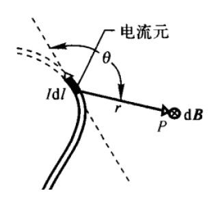

常用结论：

    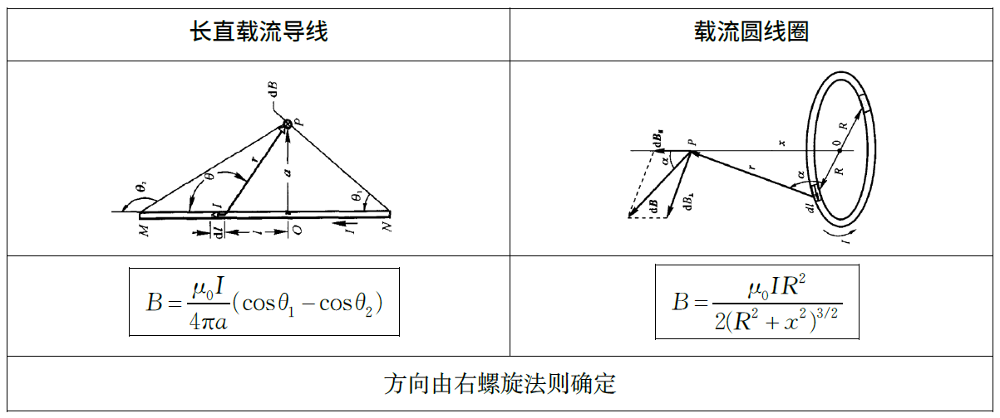

推论：

- **无限长**直导线距离$a$处（长直载流导线的特殊情况，$L \gg a$）：$B = \dfrac{\mu_0 I}{2 \pi a}$
- 载流圆线圈的特殊情况：
    - 圆心：$B(0) = \dfrac{\mu_0 I}{2 R}$
        - $N$匝圆线圈：$B(0) = \dfrac{\mu_0 IN}{2 R}$
        - 圆弧形电流（圆心角$\theta$）在圆心处：$B = \dfrac{\mu_0 I}{2R} \cdot \dfrac{\theta}{2 \pi}$
    - 在轴线上远离圆线圈（$x \ge R$）：$B = \dfrac{\mu_0 IR^2}{2x^3} = \dfrac{\mu_0 IS}{2\pi x^3}$，其中$S$为线圈面积

- 载流直螺线管内部（对$P$点）的磁场：$B = \dfrac{\mu_0}{2} nI (\cos \beta_2 - \cos \beta_1)$，其中$n$为单位长度环绕的线圈匝数

    

        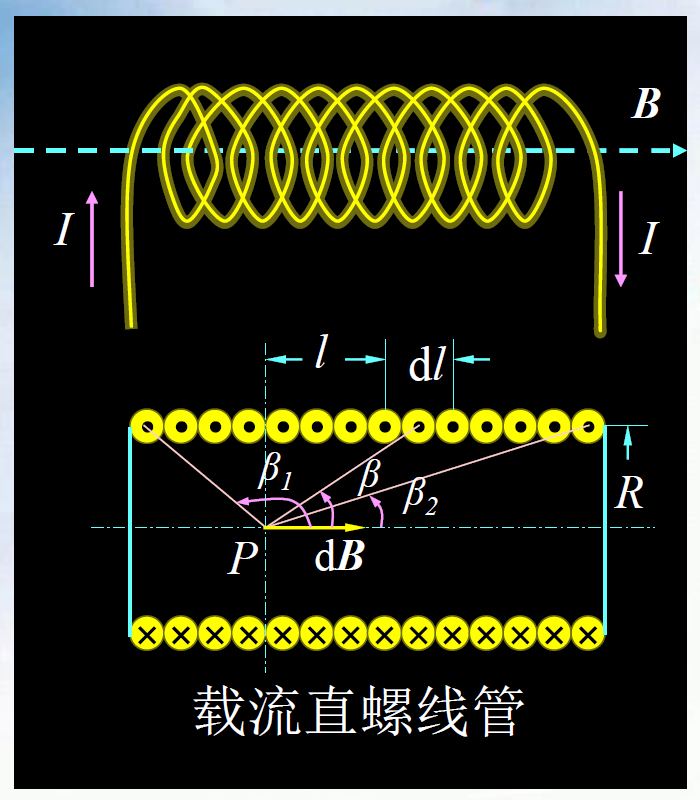
    

    - 当$L \gg R$时，$B = \mu_0 nI$
    - 在长直螺线管上的两端点：$B = \dfrac{1}{2} \mu_0 nI$

    

        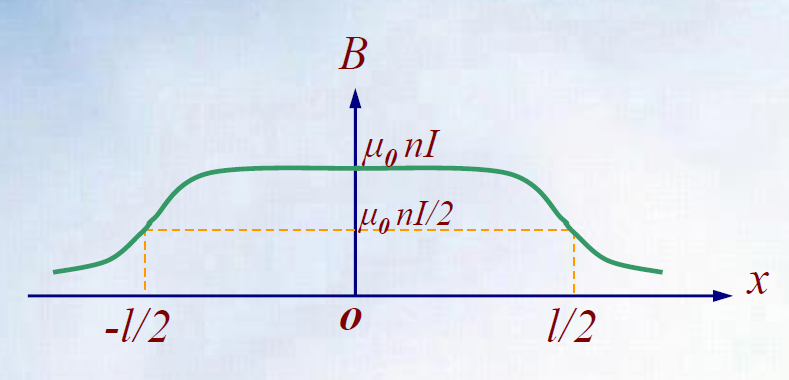
    

    >说实话，个人感觉不会考这个模型，而且它的公式还可以用下面讲的安培环路定理来推导，比这里的更加容易理解

- 亥姆霍兹线圈（考试应该不考，但实验课上可能会遇到）

!!! note "由毕奥-萨伐尔定律于叠加原理求磁感应强度的基本流程"

    - 最一般的情况：根据微元法表示出$I \text{d} \bm{l}$，代入公式得到$\text{d} \bm{B}$后进行积分
    - 最常见的情形：产生磁场的电流可以分解为直流电流、圆形电流等基本单元，根据已有结论分别求出各部分产生的磁场，再根据叠加原理将$\bm{B}$相加

---
- **单个运动电荷**$q$以速度$\bm{v}$运动产生的磁感应强度：$\bm{B} = \dfrac{\mu_0}{4 \pi} \dfrac{q \bm{v} \times \bm{r}}{r^3} = \mu_0 \varepsilon_0 \bm{v} \times \bm{E}$
    - 方向：

    

        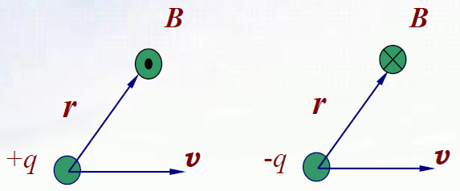
    

- 当多电荷（连续分布电荷）匀速运动时，可求这些电荷形成的等效电流$I = \dfrac{\text{d}q}{\text{d}t}$

---
**安培环路定律**：在稳恒磁场中，磁感应强度沿任何回路的线积分等于闭合回路所包围电流的代数和的$\mu_0$倍。

$$
\oint\limits_L \bm{B} \text{d}\bm{l} = \mu_0 \sum I_{内}
$$

电流方向与积分路径绕行方向呈右手螺旋关系时取正号，反之取负号。

常用结论：

    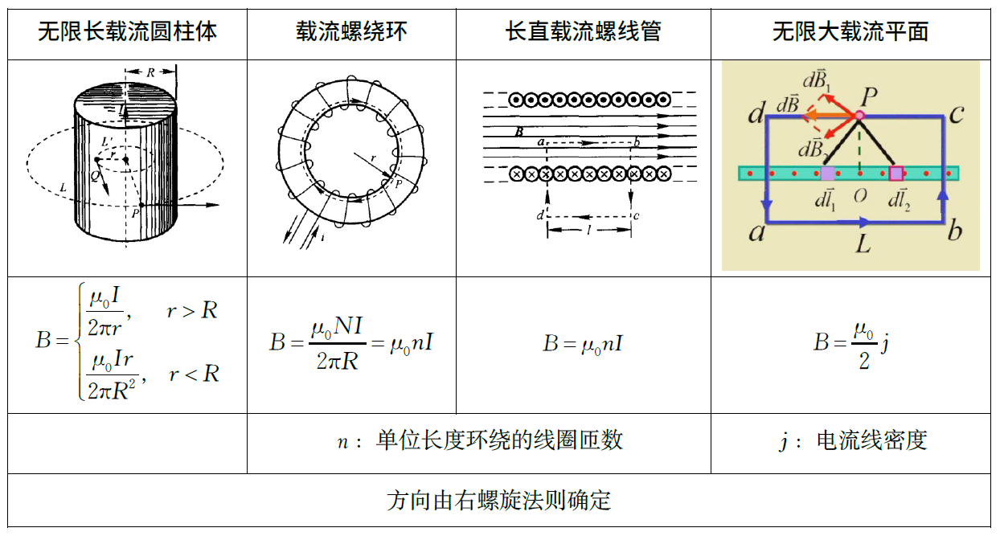

与叠加定理结合：有些因不对称无法适用安培环路定理的磁场可以分解为多个可以适用的磁场的叠加

### 磁通量、磁矩

磁通量$\Phi_m = \iint\limits_S \bm{B} \text{d} \bm{S}$（单位：$\text{Wb} = \text{T}\cdot\text{m}^2$），规定外法线方向为正方向（闭合曲面）

**磁场高斯定理**：$\Phi_m = \oiint\limits_S \bm{B} \text{d} \bm{S} = 0$

---
**磁矩**：$\bm{p}_m = NIS\hat{n}$（单位：$\text{A}\cdot\text{m}^2$），其中$N$为线圈匝数，$\hat{n}$表示磁矩方向（无大小），与电流环绕方向呈右手螺旋关系。

    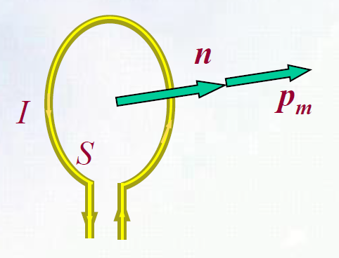

- 作匀速圆周运动的电荷磁矩$\bm{p}_{m} = IS = \dfrac{\text{d}q}{\text{d}t} \pi r^2$（$\text{d}q$和$\text{d}t$根据实际情况求解，一般可用$e$和$\dfrac{2\pi r}{v} = \dfrac{2\pi}{\omega}$来替换；$r$为轨道半径）（几乎每年都考这类题型）
- 在轴线上远离载流圆线圈的磁场可以写成：$\bm{B} = \dfrac{\mu_0 \bm{p}_m}{2 \pi x^3}$

### 磁场作用力和功

- **安培力**：$\text{d} \bm{F} = I\text{d}\bm{l} \times \bm{B}$，其中$I = envS$
    - 对于一段导线受到的安培力，可根据力的叠加原理相加（积分）：$\bm{F} = \int\limits_L I \text{d} \bm{l} \times \bm{B}$
    - 均匀磁场中，直导线受力为$\bm{F} = I\bm{L} \times \bm{B}$

    !!! note "结论"

        对于不规则形状的导线，它受到的安培力等价于与它始末位置相同的，通以同等大小电流的直导线所受的安培力

        

            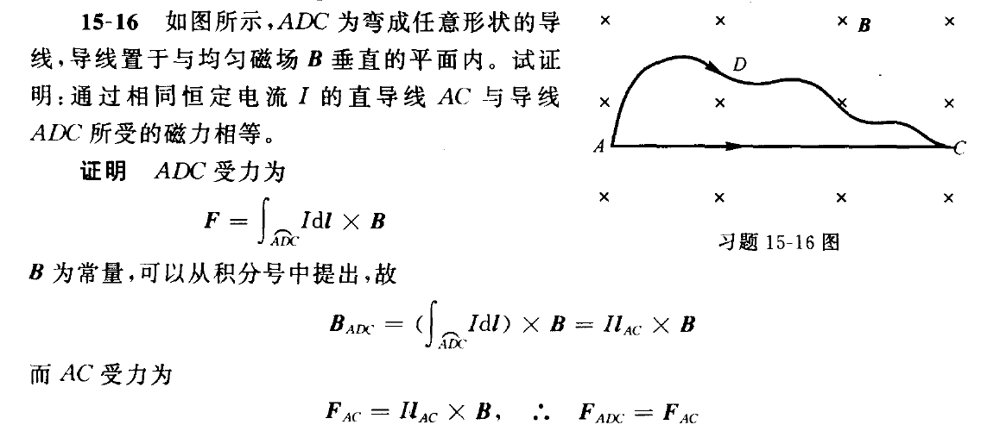
        

- 载流平面线圈的**磁力矩**
    - 一般情况下：$\text{d} \bm{M} = \bm{r} \times (I \text{d} \bm{l} \times \bm{B})$
    - 均匀磁场中：$\bm{M} = \bm{p}_m \times \bm{B}$

- 一个任意的闭合载流回路，在磁场中改变位置或形状时（载流导线的平动、载流线圈的转动等），磁力或磁力矩做的功为$\text{d} A = I \text{d} \Phi$

### 带电粒子在磁场中的运动

- 荷质比：$\dfrac{q}{m}$
- $\bm{v}_0 \perp \bm{B}$
    - 粒子圆形轨道半径：$R = \dfrac{mv_0}{qB}$
    - 周期：$T = \dfrac{2 \pi R}{v_0} = \dfrac{2 \pi m}{qB}$
- $\bm{v}_0$与$\bm{B}$呈$\theta$角：运动轨迹为螺旋线
    - 令$v_{0x} = v_0 \cos \theta$，$v_{0n} = v_0 \sin \theta$
    - 螺旋半径：$R = \dfrac{mv_{0n}}{qB}$
    - 螺距：$h = v_{0x}T = v_{0x}\dfrac{2\pi R}{v_{0n}} = v_{0x} \dfrac{2\pi m}{qB}$

    

        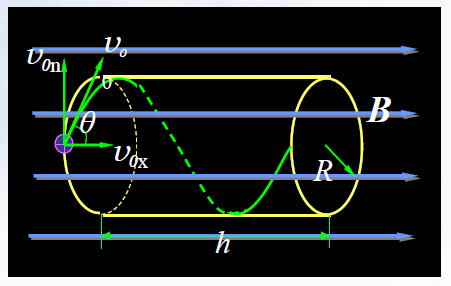
    

应用：

- 质谱仪：
    - 示意图：

    

        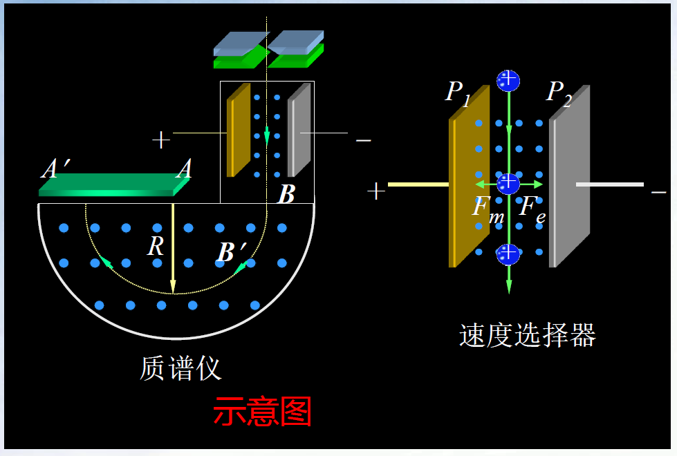
    

    - $\dfrac{q}{m} = \dfrac{v}{RB'} = \dfrac{E}{RBB'}$

- 回旋加速器：
    - $R = \dfrac{mv}{qB}$，$T = \dfrac{2 \pi R}{v} = \dfrac{2 \pi m}{qB}$
    - 若电场震荡频率$\upsilon = \dfrac{1}{T}$，则粒子速度$v = \dfrac{q}{m}BR$，动能为$E_K = \dfrac{1}{2}mv^2 = \dfrac{q^2}{2m}B^2R^2$

- 霍尔效应：处在均匀磁场中的通电导体薄板，当电流方向与磁场方向垂直时，则在垂直于磁场和电流方向的薄板上、下两端之间出现电势差。

    

        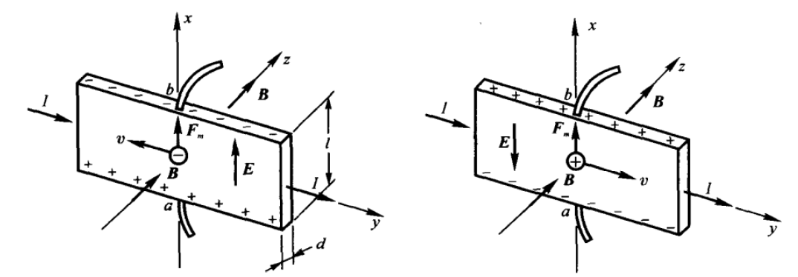
    

    - 电势差方向判别：
        - 载流子带负电荷（比如金属导体）：$\bm{I} \times \bm{B}$的方向为$\bm{E}$的方向（N型半导体）
        - 载流子带正电荷：$\bm{I} \times \bm{B}$的反方向为$\bm{E}$的方向（P型半导体）

    - 与霍尔元件相关的物理量（$d$为厚度，$n$为载流子浓度）：
        - 霍尔电压$U_H = R_H \dfrac{IB}{d}$
        - 霍尔系数$R_H = \dfrac{1}{nq}$

## 磁场中的磁介质

磁介质内的磁感应强度$B$ = 真空中原来的磁感应强度$B_0$ + 附加磁感应强度$B'$

磁介质的种类：

- 顺磁质：$B > B_0$
- 抗磁质：$B < B_0$
- 铁磁质：$B \gg B_0$

- 磁介质对外磁场的影响：
    - 分子本身具有磁矩（**固有磁矩**$p_m$），可认为由等效的圆电流（分子电流）产生，由于磁矩取向无规则，它们相互抵消，导致磁介质不显磁性
    - 磁介质处于外磁场时，每个分子均产生与外磁场方向相反的附加磁矩$\Delta p_m$
    - 顺磁质的$\sum p_m \gg \sum \Delta p_m$，且分子受到的磁力矩尽可能使固有磁矩转向外磁场方向
    - 抗磁质的$p_m = 0$，因此附加磁矩是产生磁化的唯一原因

- **磁化强度**：某单位体积微元内分子总磁矩之和，$\bm{M} = \sum \bm{p}_m / \Delta V$（单位：$\text{A/m}$）
    - 真空：$\bm{M} = 0$
    - 顺磁质$\bm{M}$与$\bm{B_0}$同向，抗磁质$\bm{M}$与$\bm{B_0}$反向

- **磁化电流**$I_m$：由磁介质中各分子的分子电流叠加而成，仅在磁介质表面产生的等效环形电流

    

        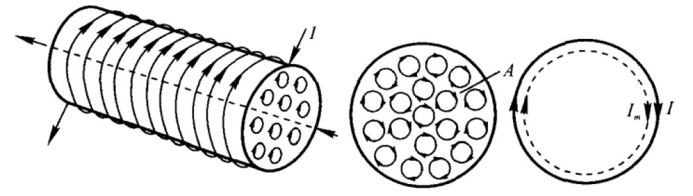
    

    - 磁介质表面上某处**磁化电流线密度**$j_m$等于该点磁化强度$\bm{M}$沿表面的切向分量。若是均匀磁介质被磁化，则$j_m = |\bm{M}|$
    - 磁化强度沿任意闭合回路$L$的积分，等于通过该回路所包围的磁化电流强度的代数和：$\oint\limits_L \bm{M} \text{d}\bm{l} = \sum\limits_{L_内}I_m$

- **磁场强度**$\bm{H} = \dfrac{\bm{B}}{\mu_0} - \bm{M}$（单位：$\text{A/m}$）（定义式）
- **安培环路定理**：磁场强度$\bm{H}$沿任意闭合路径$L$的环流，等于穿过该路径所围面积的传导电流的代数和（决定式）

    $$
    \oint\limits_L \bm{H} \text{d}\bm{l} = \sum I_0
    $$

- $ \bm{B}, \bm{M}, \bm{H}$之间的关系（各向同性的磁介质）
    - 基本关系式：$\bm{M} = \chi_m \bm{H}$（$\chi_m$为介质的**磁化率**，顺磁质为正，抗磁质为负）
    - 常用关系式：$\bm{B} = \mu_0(1 + \chi_m)\bm{H} = \mu_0 \mu_r \bm{H} = \mu \bm{H}$（$\mu_r$为**相对磁导率**，$\mu$为**磁导率**）

!!! note "磁介质下磁场问题求解流程"

    - 用磁介质下的安培环路定理求出磁场强度$\bm{H}$的分布
    - 根据$\bm{H}, \bm{B}, \bm{M}$间的关系，求解出$\bm{B}$和$\bm{M}$（有时已知这两者，反过来求$\mu$）
    - 根据$\bm{M}$与$j_m$的关系，得到$j_m, I_m$等

### 铁磁质的特性

不同于磁化率恒定的其他介质，铁磁质的磁化率会随着磁场变化而变化。由于$B = \mu H$，故通过$B$-$H$曲线研究这一性质：

- **起始磁化曲线**：当铁磁质从未磁化状态开始加外磁场测得的曲线

    

        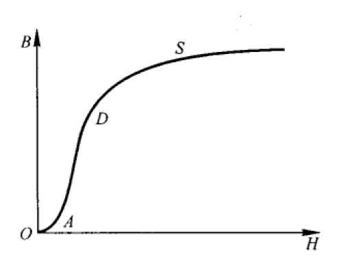
    

    - 曲线成"S"型，说明$\mu$不是常数
    - 随着$H$增加，$B$会趋于一个极限值——饱和磁感应强度

- **磁滞回线**：

    

        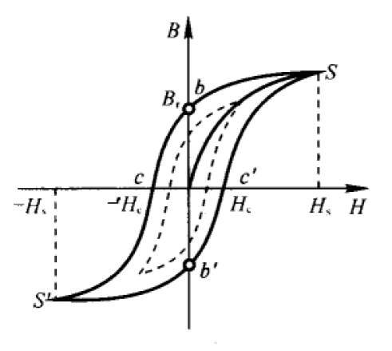
    

    - 铁磁质达到饱和状态后，当减小$H$时，$B$的减小呈现出滞后性（磁滞现象）
    - 因此$H = 0$时，$B \ne 0$，称此时的磁感应强度为**剩磁感应强度**$B_r$
    - 只有$H = -H_c$（**矫顽力**）时才能让$B = 0$
    - 此后再减小$H$（增大反向磁场），铁磁质开始反向磁化至反向饱和状态；再沿正方向增加$H$，$B$又会滞后于$H$达到饱和状态，形成磁滞回线
    - 实际上，即使未达到饱和状态就开始减小$H$，也会形成磁滞回线，只是相比之下会小一些（图中的虚线）
    - 磁滞损耗：磁化过程中，会发热消耗能量，与磁滞回线所包围的面积成正比

!!! note "总结：磁介质与电介质的对比"

    ||电介质|磁介质|
    |:-:|:-:|:-:|
    |描述极化或磁化状态量|极化强度$\bm{P} = \dfrac{\sum p_{\text{分子}}}{\Delta V}$|磁化强度$\bm{M} = \dfrac{\sum p_{m\text{分子}}}{\Delta V}$|
    |极化或磁化的宏观效果|介质表面出现束缚电荷$\sigma'$|介质表面出现束缚电流$i_s$|
    |基本矢量|$\bm{E}$|$\bm{B}$|
    |介质对场的影响|束缚电荷产生附加场$\bm{E}'$ $\bm{E} = \bm{E}_0 + \bm{E}'$|束缚电流产生附加场$\bm{B}'$ $\bm{B} = \bm{B}_0 + \bm{B}'$|
    |辅助矢量|$\bm{D} = \varepsilon_0\bm{E} + \bm{P}$|$\bm{H} = \dfrac{\bm{B}}{\mu_0} - \bm{M}$|
    |高斯定理|$\oiint\limits_S \bm{D} \text{d}\bm{S} = \sum\limits_S q_0$|$\oiint\limits_S \bm{B} \text{d} \bm{S} = 0$|
    |环流定理|$\oint\limits_L \bm{E} \text{d} \bm{l} = 0$|$\oint\limits_L \bm{H} \text{d} \bm{l} = \sum I_0$|
    |各向同性介质|$\bm{P} = \varepsilon_0 \chi_e \bm{E}$ $\sigma' = \bm{P} \cdot \bm{n}$ $\bm{D} = \varepsilon_0 \varepsilon_r \bm{E}$|$\bm{M} = \chi_m \bm{H}$ $\bm{j}_m = \bm{M} \times \bm{n}$ $\bm{H} = \dfrac{\bm{B}}{\mu_0 \mu_r}$|
    |常量|$\varepsilon_0 = 8.85 \times 10^{-12}$ 相对介电常量$\varepsilon_r$ 极化率$\chi_e$ 介电常量$\varepsilon = \varepsilon_0 \varepsilon_r$ $\varepsilon_r = 1 + \chi_e$|$\mu_0 = 1.26 \times 10^{-6}$ 相对磁导率$\mu_r$ 磁化率$\chi_m$ 磁导率$\mu = \mu_0 \mu_r$ $\mu_r = 1 + \chi_m$|

## 电磁感应

### 感应电动势

**楞次定律**：闭合回路中感应电流的方向，总是使它所激发出的磁场去阻碍原磁通量的变化。

    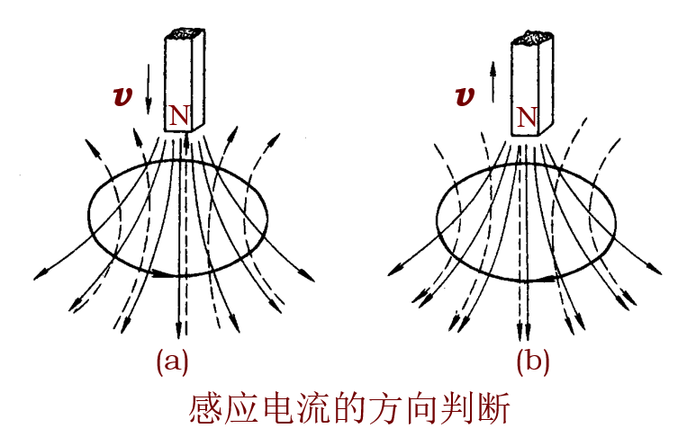

**法拉第电磁感应定律**：回路所包围面积的磁通量$\Phi$发生变化时，回路中会产生感应电动势$\varepsilon_i$，即$\varepsilon_i = -\dfrac{\text{d}\Phi}{\text{d}t}$

- 方向：通常规定$\Phi$方向与原磁感应强度方向成右螺旋关系的回路方向为正方向，然后再判断$\dfrac{\text{d}\Phi}{\text{d}t}$的方向，$\varepsilon_i$的反向与之相反

    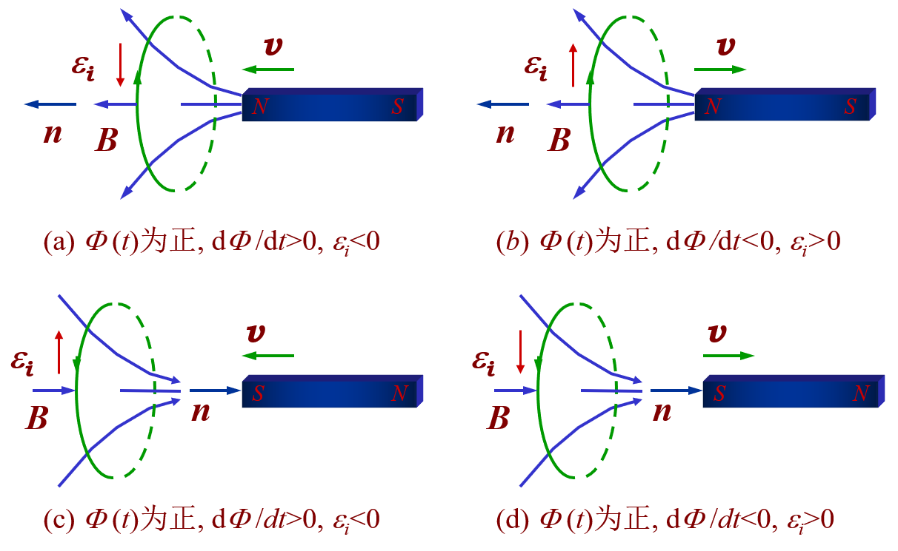

- **全通量**$\Psi$：若导体由多个线圈串联而成，每个线圈的磁通量为$\Phi_1, \dots, \Phi_n$，则$\varepsilon_i = -\dfrac{\text{d}\Psi}{\text{d}t}$，其中$\Psi = \Phi_1 + \Phi_2 + \dots + \Phi_n$

- 磁通量相等时，$\Psi = N \Phi$称为线圈的**磁通匝链数**
- 此时回路中的感应电流为：$I_i = \dfrac{\varepsilon_i}{R} = -\dfrac{N}{R}\dfrac{\text{d}\Phi}{\text{d}t}$
- 感生电荷：$q = \int_{t_1}^{t_2}I_i\text{d}t = -\dfrac{N}{R}\int_{\Phi_1}^{\Phi_2}\text{d}\Phi = \dfrac{N}{R}(\Phi_1 - \Phi_2)$，即感生电荷与磁通量变化有关，而与磁通量变化的快慢无关

!!! warning "注意"

    当通过回路的磁通量不变时，整个回路的感应电动势为0，但这并不代表每根导线上没有感应电动势，可能只是这些感应电动势的代数和为0而已。

!!! note "用法拉第电磁感应定律求电动势——磁通量法"

    1. 求出$B$的分布
    2. 求出回路的磁通量$\Phi_m$（关于$t$的函数）
    3. 根据定律求出$\varepsilon_i$的值
    4. 用楞次定律确定电动势的方向

---
**动生电动势**：导体或回路在（稳恒）磁场中运动产生的电动势

- 对于线元$\text{d}\bm{l}$，其上产生的动生电动势为$\text{d}\varepsilon_i = (\bm{v} \times \bm{B}) \cdot \text{d}\bm{l}$，结果的正/负号表明电动势方向与$\text{d}\bm{l}$相同/相反
- 整个导体的电动势为就是线元上电动势沿导体长度的积分
- 磁通量法——**补全**
    - 将要求电动势的导体与其它不切割磁感线的假想导体组成回路，此时回路的电动势即为所求
    - 若要求的就是回路电动势，且回路作转动，则一般来说用磁通量法更加便捷
- 磁通量法——**转化**
    - 将要求电动势的导体与其它假想导体组成回路使得回路磁通量不变，此时假想导体电动势为所求
    - 此法可将求复杂形状导体的电动势转化为简单导体（直导线）的电动势
    - 均匀磁场$\bm{B}$的常用结论：长$L$的直线导体（与磁场垂直）
        - 作平动：$\varepsilon_i = (\bm{v} \cdot \bm{B}) \cdot \bm{L}$
        - 绕一端作转动：$\varepsilon_i = \dfrac{1}{2}\omega B L^2$

---
**感生电动势**：导体所处磁场发生变化所产生的电动势（在周围激发**涡旋电场**）

计算方法：

- 直接算（通常不推荐，除非题目有要求）
    - 涡旋电场与变化磁场的关系：$\oint\limits_{L} \bm{E}_i \cdot \text{d}\bm{l} = -\iint\limits_{S} \dfrac{\partial \bm{B}}{\partial t} \cdot \text{d} \bm{S}$（涡旋电场线与$\dfrac{\partial \bm{B}}{\partial t}$呈左螺旋关系）
    - 磁场分布及变化处于高度对称性时，上式的左边可以简化，从而求出$E_i$，最常见的是圆柱磁场（题目会直接说明，也会隐含在载流螺旋管当中）

    $$
    \begin{cases}2\pi r\bm{E}_i = -\dfrac{\text{d}B}{\text{d}t}\pi r^2, r < R \\ 2\pi r\bm{E}_i = -\dfrac{\text{d}B}{\text{d}t}\pi R^2, r > R\end{cases} \Rightarrow \begin{cases}\bm{E}_i = -\dfrac{r}{2} \dfrac{\text{d}B}{\text{d}t}, r < R \\ \bm{E}_i = -\dfrac{R^2}{2r} \dfrac{\text{d}B}{\text{d}t}, r > R\end{cases}
    $$

    

        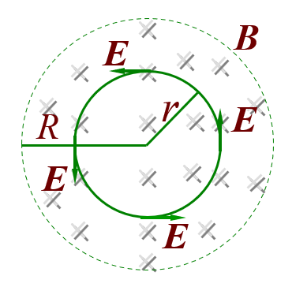
    

    - 感生电动势在数值上等于单位正电荷绕闭合回路一周涡旋电场力所做的功，即$\varepsilon_i = \oint\limits_{L} \bm{E}_i \cdot \text{d} \bm{l}$

- 磁通量法：
    - 将要求电动势的导体与其它**不产生感生电动势**的假想导体组成回路，此时回路的电动势就是所求
    - 位于径向的直导线因为处处垂直于涡旋电场，因此不产生感生电动势

- 感生电动势与动生电动势同时存在，求$t$时刻的感应电动势（考试大题必考）
    1. 假定磁场分布恒为$t$时刻的磁场，求出动生电动势
    2. 假定导体位置固定于$t$时刻的位置，求出感生电动势
    3. 两者相加，得到感应电动势  

???+ note "计算圆盘的感应电流"

    - 将圆盘分割为微元圆环，半径$r$ ，宽$\text{d}r$
    - 求出该圆环的磁通量 $\rightarrow$ 感应电动势 $\rightarrow$ 电阻 $\rightarrow$ 感应电流
    - 将所有感应电流叠加（积分）

??? info "涡电流（不做要求）"

    涡电流：大块金属导体处在变化磁场中，金属内部产生的涡旋状电流。

    - 热效应：由于大块导体电阻小，电流大，容易产生大量的焦耳热
    - 机械效应：感应电流在反抗引起感应电流的原因时，会产生机械效应，可用作电磁阻尼
    - 趋肤效应：在高频电路中，由于涡流，使导体横截面上的电流分布趋于导体表面附近的现象

### 自感与互感

**自感**：

- **自感现象**：由于回路中电流变化而在回路自身中产生感应电动势（**自感电动势**）
- 此时通过回路的全磁通$\Psi$与电流$I$成正比，有公式：$\Psi = LI$，其中$L$称为**自感系数**，单位为亨利(H)（1H = 1Wb/A）
    - 计算：假设回路中通有电流$I$，算出磁场分布，然后算出全磁通$\Psi$，用$\Psi = LI$求出自感系数

- 自感电动势：$\varepsilon_i = -L \dfrac{\text{d}i}{\text{d}t}$，负号表示$\varepsilon_i$与$I$方向相反
    - 计算：若通有随时间变化的电流$i$，按上述公式直接计算

- LR电路：
    - 电路接通时的电流（电流的增长过程）：$I = I_0(1 - e^{-\frac{R}{L}t})$

    

        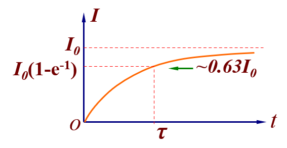
    

    - 电路切断时的电流（电流的衰减过程）：$I = I_0e^{-\frac{R}{L}t}$

    

        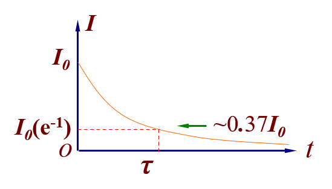
    

---
**互感**：

- **互感现象**：一个回路中的电流变化使得另一个回路中产生感应电动势（**互感电动势**）
- **互感系数**$M_{12} = M_{21} = M$，单位为亨利(H)。其中$\Psi_{21} = MI_1, \Psi_{12} = MI_2$
    - 计算：假设回路1通有电流$I_1$，算出磁场分布，然后算出回路2全磁通$\Psi_{21}$，用$\Psi_{21} = MI_1$求出系数
    - 对于一般情形，$M = K\sqrt{L_1L_2}, 0 \le K \le 1$，称为耦合系数

- 互感电动势$\varepsilon_{21} = -M \dfrac{\text{d}i_1}{\text{d}t}$
    - 计算：若有随时间变化的电流$i_1$，按上述公式直接计算

### 磁场能量

- 磁场的能量密度（**磁能密度**）：$u_m = \dfrac{1}{2}BH$
- 磁场能量：$U_m = \iiint\limits_V u_m \text{d}V = \iiint\limits_V \dfrac{1}{2}\dfrac{B^2}{\mu_0 \mu} \text{d}V$
- 自感磁能：自感系数$L$的线圈建立稳定电流$I_0$时，线圈中的磁能为$W_m = \dfrac{1}{2}LI_0^2$

??? example "例题"

    

        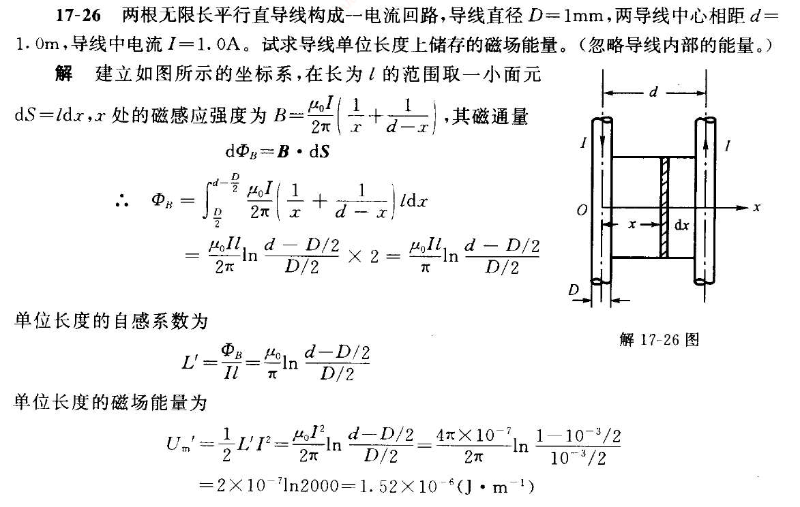
    

!!! note "求解步骤"

    1. 求出$\bm{H}$和$\bm{B}$的分布
    2. 求出磁能密度$u_m$
    3. 在指定的体积范围内对$u_m$进行积分，得到磁场能量$U_m$

## 电磁场与电磁波

- **位移电流**：$I_d = \dfrac{\text{d}\Phi_D}{\text{d}t}$，方向规定为$\bm{D}$增量的方向
    - **位移电流密度**：$\bm{j}_d = \dfrac{\partial \bm{D}}{\partial t}$
    - 计算方法：利用前面所学，用$U, \bm{E}$等参数求出$\bm{D}$，再通过定义式求出$\bm{j}_d$，进而求出$I_d$
        - 若曲面$S$不随时间变化，位移电流为：$I_d = \dfrac{\text{d}}{\text{d}t} \iint\limits_S \bm{D} \text{d}S = \iint\limits_S \dfrac{\partial D}{\partial t} \text{d}S$

    - 在**平行板电容器**中，若已知电容为$C$，两极板的电压变化率为$\dfrac{\text{d}U}{\text{d}t}$，那么位移电流$I_d = C \cdot \dfrac{\text{d}U}{\text{d}t}$

    ??? proof "证明"

        $I_d = \dfrac{\text{d}\Phi_d}{\text{d}t} = \dfrac{\text{d}(\bm{D} \cdot \bm{S})}{\text{d}t} = \dfrac{\text{d}(\sigma S)}{\text{d}t} = \dfrac{\text{d}Q}{\text{d}t} = C \dfrac{\text{d}U}{\text{d}t}$

- 全电流：在充电电路中，$I_{\text{all}} = \sum I + I_d$，它在任何情况下总是连续的
    - 全电流环路定律：

    $$
    \oint\limits_L \bm{H} \text{d}l = \sum I + \iint\limits_S \dfrac{\partial D}{\partial t} \text{d}S
    $$

- [麦克斯韦方程组](https://zh.wikipedia.org/wiki/%E9%A6%AC%E5%85%8B%E5%A3%AB%E5%A8%81%E6%96%B9%E7%A8%8B%E7%B5%84)（主要记积分形式）
    - 电场的性质：
        - 积分形式：$\oiint\limits_S \bm{D} \text{d}S = \sum\limits_{S}q_i \iiint\limits_V \rho \text{d}V$
        - 微分形式：$\nabla \cdot \bm{D} = \rho$

    - 磁场的性质：
        - 积分形式：$\oiint\limits_S \bm{B} \text{d}S = 0$
        - 微分形式：$\nabla \cdot \bm{B} = 0$

    - 变化电场和磁场的联系：
        - 积分形式：$\oint\limits_L \bm{H} \text{d}l = I + I_d = \iint\limits_S \bm{j} \text{d} S + \iint\limits_S \dfrac{\partial D}{\partial t} \text{d}S$
        - 微分形式：$\nabla \times \bm{H} = \bm{j} + \dfrac{\partial \bm{D}}{\partial t}$

    - 变化磁场和电场的联系：
        - 积分形式：$\oint\limits_L \bm{E} \text{d}l = -\dfrac{\text{d}\Phi_m}{\text{d}t} = -\iint\limits_S \dfrac{\partial \bm{B}}{\partial t}\text{d}S$
        - 微分形式：$\nabla \times \bm{E} = -\dfrac{\partial \bm{B}}{\partial t}$

    - 补充：介质方程：$\bm{D} = \varepsilon \bm{E}, \bm{B} = \mu \bm{H}, \bm{j} = \gamma \bm{E}$

    ??? info "关于微分形式的解释"

        回忆一些微积分的知识：

        - 向量微分算子：$\nabla = \dfrac{\partial}{\partial x}\hat{x} + \dfrac{\partial}{\partial y}\hat{y} + \dfrac{\partial}{\partial z}\hat{z}$
        - 散度：$\nabla \cdot \bm{A} = \dfrac{\partial A_x}{\partial x} + \dfrac{\partial A_y}{\partial y} + \dfrac{\partial A_z}{\partial z}$
        - 旋度：$\nabla \times \bm{A} = \begin{vmatrix}\hat{x} & \hat{y} & \hat{z} \\ \dfrac{\partial}{\partial x} & \dfrac{\partial}{\partial y} & \dfrac{\partial}{\partial z} \\ A_x & A_y & A_z\end{vmatrix}$

- 电磁波
    - 性质：
        - 横波
        - 传播电场$\bm{E}$和磁场$\bm{H}$，两者垂直，传播方向为$\bm{E} \times \bm{H}$

        

            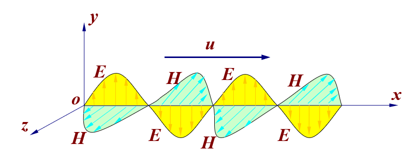
        

        - 真空中速度为光速$c = \dfrac{1}{\sqrt{\mu_0 \varepsilon_0}} = 2.9978 \times 10^8 m/s$，介质中为$u = \dfrac{c}{n}$，其中介质折射率$n = \sqrt{\mu_r \varepsilon_r}$
        - $\sqrt{\varepsilon}E = \sqrt{\mu}H \propto \cos [\omega (t - \dfrac{x}{u})]$
    - 电磁波的**能流密度**：单位时间内通过垂直于传播方向的单位面积的能量，矢量形式（玻印廷矢量）为$\bm{S} = \bm{E} \times \bm{H}$

- 电磁振荡

    

        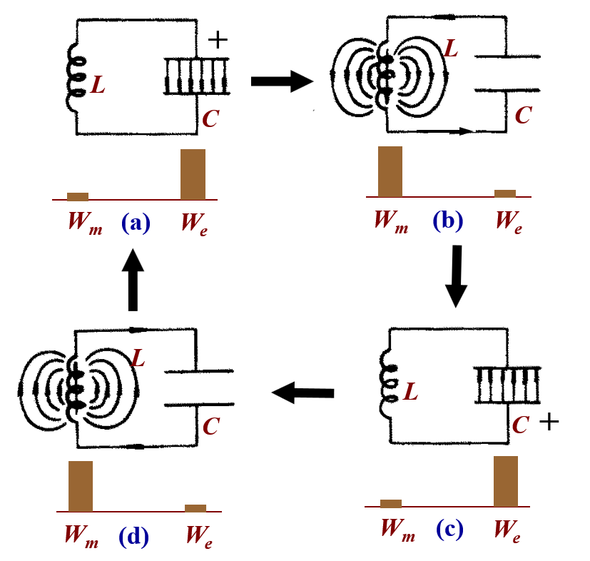
    

    - 电容器电荷量$q = Q_0 \cos(\omega t + \varphi)$
    - 振荡的圆频率$\omega = \dfrac{1}{\sqrt{LC}}$，周期$T = 2 \pi \sqrt{LC}$
    - 电流强度$I = I_0 \cos (\omega t + \varphi + \dfrac{\pi}{2})$
    - 电场能量：$W_e = \dfrac{1}{2} \dfrac{q^2}{C} = \dfrac{1}{2C}Q_o^2 \cos^2 (\omega t + \varphi)$
    - 磁场能量：$W_m = \dfrac{1}{2}LI^2 = \dfrac{1}{2C}Q_o^2 \sin^2 (\omega t + \varphi)$
    - 总能量：$W = W_e + W_m = \dfrac{Q_0^2}{2C}$

- 电磁波的辐射
    - 偶极振子的电矩$p = p_0 \cos \omega t = ql_0 \cos \omega t$
    - 振荡电偶极子的辐射强度分布：$\overline{S} = \dfrac{p_0^2}{32 \pi^2 \varepsilon_0 c^3}\dfrac{\omega^4 \sin^2 \theta}{r^2}$
    
    

        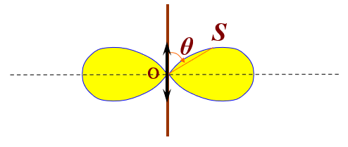
    

- 电磁波谱

    

        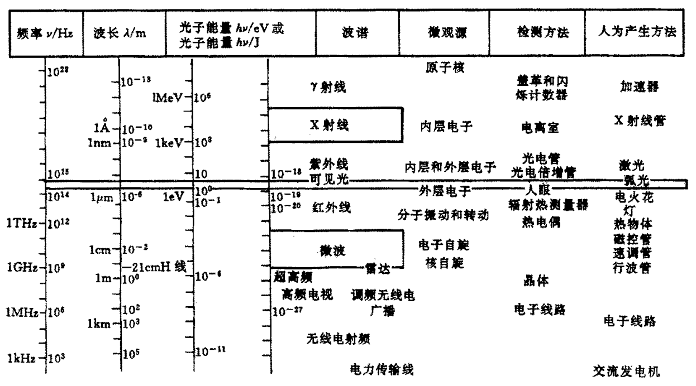
    

    

        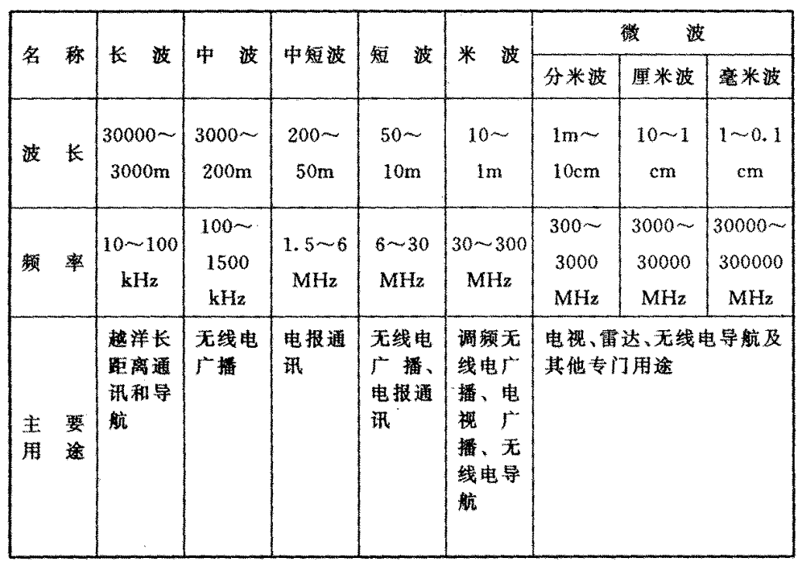
    
