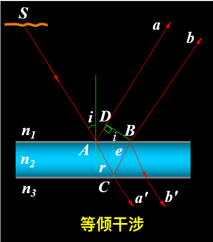

# 光学部分

## 光的干涉

基本概念：

- 光程：光在介质中传播的路程$r$与介质折射率的乘积$nr$
- 折射率$n = \dfrac{c}{u}$，其中$c$为真空中波速，$u$为介质中波速
- 光强$I$：平均能流密度，与振幅平方成正比
- 波的干涉：
    - **相位差**$\Delta \varphi$与**光程差**$\delta$的关系：$\Delta \varphi = (\varphi_2 - \varphi_1) + \dfrac{2 \pi}{\lambda}\delta$
    - 干涉加强/相消与相位差的关系：
        - $\Delta \varphi = 2k\pi$ -> 加强 -> $k$级明纹，此时光强$I = I_1 + I_2 + 2\sqrt{I_1 I_2}$
        - $\Delta \varphi = (2k - 1) \pi$ -> 相消 -> $k$级暗纹，此时光强$I = I_1 + I_2 - 2\sqrt{I_1 I_2}$
    
    - 一般相干光初相位相同，因此$\Delta \varphi = \dfrac{2\pi}{\lambda} \delta$，常用结论为：
        - $\delta = k \lambda$ -> 加强 -> $k$级明纹
        - $\delta = (k - \dfrac{1}{2})\lambda$ -> 相消 -> $k$级暗纹

    - 两相干光束（初相相同）通过不同介质在某处相遇时的相位差为：$\varphi = \dfrac{2\pi}{\lambda}(n_2r_2 - n_1r_1)$，因此光程差为$\delta = n_2r_2 - n_1r_1$

### 双缝干涉

双缝干涉模型如下所示：

    

其中：

- $d$：相干光源的距离
- $D$：光源到屏幕的距离
- $x$：所求点$P$至中心$o$的距离
- $\theta$：中心点与$P$点连线与水平线之间的夹角

可以得到以下关系：

- 相位差：$\Delta \varphi = (\varphi_1 - \varphi_2) - \dfrac{2\pi}{\lambda}(r_1 - r_2) = \dfrac{2\pi}{\lambda}(r_2 - r_1) \approx \dfrac{2\pi}{\lambda} d \sin \theta$（当$D \gg d$时，$\delta = r_2 - r_1 \approx d \sin \theta$）
    - 当$d \sin \theta = \pm k \lambda$时，$\Delta \varphi = \pm 2k \pi(k = 0, 1, 2, \dots)$ -> 相长干涉，$k$表示第$k$条亮纹（$k = 0$时为中央亮纹）
    - 当$d \sin \theta = \pm (2k - 1) \dfrac{\lambda}{2}$时，$\Delta \varphi = \pm (2k - 1) \pi(k = 1, 2, 3, \dots)$ -> 相消干涉，$k$表示第$k$条暗纹
    - 当$D \gg x$时，$\sin \theta \approx \tan \theta = \dfrac{x}{D}$，可解得
        - 亮纹的位置：$x = \pm k \dfrac{D}{d} \lambda$
        - 暗纹的位置：$x = \pm (2k - 1) \dfrac{D}{2d} \lambda$
        - 条纹间距$\Delta x = \dfrac{D}{d}\lambda$

- $P$点处的光强：$I_P = 4I \cos^2 \dfrac{\Delta \varphi}{2}$
    - $\Delta \varphi = \pm 2k \pi \rightarrow I_P = 4I$
    - $\Delta \varphi = \pm (2k - 1) \pi \rightarrow I_P = 0$

- 复色光的双缝干涉中，红光在外，紫光在内

### 薄膜干涉

#### 等倾干涉

**等倾干涉**：薄膜厚度处处相等，同一干涉条纹是由相同入射角$i$的光形成的，其条纹为明暗相间的同心圆环

- 设扩展单色光源照射到平行平面薄膜，在A点产生反射和折射，形成a、b两光束

    

- 半波损$\delta'$：界面反射导致的相位跳变

    

- 光程差（$\delta' = \dfrac{\lambda}{2}$）：

$$
\delta = 2e \sqrt{n_2^2 - n_1^2 \sin^2 i} + \delta' = \begin{cases}k \lambda, & k = 1, 2, 3, \dots \\ k \lambda + \dfrac{\lambda}{2}, &  k = 0, 1, 2, \dots \end{cases}
$$

- 在等倾干涉条纹中，$i \downarrow \rightarrow \delta \uparrow \rightarrow k \uparrow$，因此中央处$k$最大
- 光垂直照射薄膜时，光程差$\delta = 2n_2 e + \dfrac{\lambda}{2}$

    

        
    

    - 相长干涉：$\delta = k \lambda, k = 0, 1, 2$
    - 相消干涉：$\delta = k \lambda + \dfrac{\lambda}{2}, k = 0, 1, 2$

#### 等厚干涉

**等厚干涉**：由于干涉薄膜上下表面不平行，造成反射光线$a_1$ , $b_1$不平行，它们在薄膜上表面附近干涉

    

- 光程差：$\delta = 2n_2 e \cos r + \delta' = 2e\sqrt{n_2^2 - n_1^2 \sin^2 i} + \delta'$
- 在实际应用中，$i = r = 0$，因此$\delta = 2n_2e + \delta' = \begin{cases}k \lambda & k = 1, 2, 3, \dots \\ (2k+1) \dfrac{\lambda}{2} & k = 0, 1, 2, \dots \end{cases}$
    - $n_2$为中间介质的折射率，由于中间介质通常为空气，因此令$n_2 = 1$

- **劈尖干涉**：干涉条纹是明暗相间等间距的直条纹

    

        
    

    - 明纹：
        - 光程差：$\delta_{\text{light}} = 2e + \dfrac{\lambda}{2} = k \lambda, k = 1, 2, 3, \dots$
        - 第$k$条明纹对应的厚度：$e_{k, \text{light}} = \dfrac{k}{2}\lambda - \dfrac{\lambda}{4}$
        
    - 暗纹：
        - 光程差：$\delta_{\text{dark}} = 2e + \dfrac{\lambda}{2} = (2k + 1) \dfrac{\lambda}{2}, k = 0, 1, 2, \dots$
        - 第$k$条暗纹对应的厚度：$e_{k, \text{dark}} = \dfrac{k}{2}\lambda$
        - $e = 0$处为0级暗纹

    - 条纹间距$l = \dfrac{\lambda}{2\sin \theta}$

    

        
    

- **牛顿环**：将一曲率半径很大的球冠置于一平板玻璃上，即构成牛顿环，干涉条纹是明暗相间的同心圆环

    

        
    

    - 明纹：
        - 光程差：$\delta_{\text{light}} = 2e + \dfrac{\lambda}{2} = k \lambda, k = 1, 2, 3, \dots$
        - 条纹半径：$r_{k, \text{light}} = \sqrt{\dfrac{(2k - 1)R\lambda}{2}}, k = 1, 2, 3, \dots$

    - 暗纹：
        - 光程差：$\delta_{\text{dark}} = 2e + \dfrac{\lambda}{2} = (2k + 1) \dfrac{\lambda}{2}, k = 0, 2, 3, \dots$
        - 条纹半径：$r_{k, \text{dark}} = \sqrt{kR\lambda}, k = 0, 1, 2, \dots$

    - 厚度与条纹半径的关系：$e = \dfrac{r^2}{2R}$

## 光的衍射

衍射现象：波在传播过程中，绕过障碍物的边缘，偏离直线传播的现象，称为波的衍射。当光遇到的障碍物尺寸与光波的波长相当时，产生光的衍射现象。

分类：

- **菲涅耳衍射**：衍射屏离光源和接收屏为有限距离的衍射。
- **夫琅禾费衍射**：衍射屏离光源和接收屏无限远的衍射，相当于入射光和衍射光都为平行光。实验上可利用两个透镜来实现。

    

### 单缝衍射

- 模型参数
    - $a$：缝宽
    - $\theta$：光线相对缝面法线的偏转角
    - $f$：透镜焦距
    - $x$：条件位置到中心的距离
    - $\sin \theta \approx \tan \theta = \dfrac{x}{f}$

- 明暗条纹位置
    - 中央明纹中心：$\theta = 0$，光照最强
    - **暗纹**中心：$a \sin \theta = \pm k \lambda, k = 1, 2, 3, \dots$
    - 明纹中心：$a \sin \theta = \pm (k + \dfrac{1}{2})\lambda, k = 1, 2, 3, \dots$
    - 若不是垂直入射，而是存在入射角$i$，则将$\sin \theta$替换为$\sin \theta + \sin i$

    

单缝衍射图样的特征：

- 条纹的亮度分布：中央明纹的光强最大，随着k增加，波带数增多，未被抵消的波带面积变小，条纹光强减弱
- 中央明纹的半宽度$\Delta \theta$：第一级暗纹的衍射角
    - $\Delta \theta = \theta_1 = \arcsin \dfrac{\lambda}{a} \approx \dfrac{\lambda}{a}$

- 色散效应：
    - $\lambda$一定，$a \downarrow, \theta \uparrow$
    - $a$不变，$\lambda \uparrow, \theta \uparrow$

    

光强分布：

- 对于任意衍射角$\theta$，$P$点的光强为$I = I_0 \dfrac{\sin^2 u}{u^2}$，其中$u = \dfrac{\pi a}{\lambda} \sin \theta$
- 相对光强$\dfrac{I}{I_0}$随$u$的分布曲线见下图：

    

        
    

    - 中央明纹：$\theta = 0$处，$I = I_0$
    - 暗纹位置：$u \ne 0$而$\sin u = 0$时为暗纹，满足：$u = \dfrac{\pi a}{\lambda}\sin \theta = \pm k \pi, a \sin \theta = \pm k \lambda, k = 1, 2, 3, \dots$
    - 明纹位置：各级明纹满足$\dfrac{\text{d}}{\text{d}u}(\dfrac{\sin^2 u}{u^2}) = 0$，即$\tan u = u$
        - 解出：$u_1 = \pm 1.43 \pi, u_2 = \pm 2.46 \pi, u_3 = \pm 3.47 \pi$

### 光栅衍射

光栅：任何能起周期性地分割波阵面作用的衍射屏，可视为多个规律排列的单缝

- 光栅参数
    - $a$：透光缝的宽度
    - $b$：不透光刻痕的宽度
    - $d$：光栅常数，$d = a + b$
    - $N$：单缝数量

    

        
    

- **主极大明纹**的形成
    - 光栅方程：$d \sin \theta = \pm k \lambda, k = 0, 1, 2, \dots$，满足该方程的$\theta$处可以看到明纹
    - 由于$-\dfrac{\pi}{2} < \theta < \dfrac{\pi}{2}$，因此$k$存在最大值和最小值，也就是<u>主极大个数是有限的</u>

- 相邻两光振动的相位差：$\Delta \varphi = \dfrac{2 \pi}{\lambda} d\sin \theta$

- $N$个狭缝的**暗纹方程**：$d\sin \theta = k' \dfrac{\lambda}{N}, k' \ne N, 2N, 3N, \dots$
    - 两相邻主极大之间有$N - 1$条暗纹
    - $k' = N, 2N, 3N$时满足明纹方程

- 缺级：某些衍射角$\theta$同时满足光栅方程和单缝衍射的暗纹条件，此时原定的主极大就会变成暗纹

    $$
    \begin{cases}a \sin \theta = k_1 \lambda \\ d \sin \theta = k_2 \lambda\end{cases} \Rightarrow k_2 = \dfrac{d}{a}k_1
    $$

    - $k_1$取遍正整数，若算出$k_2$也是正整数，那么这个$k_2$就会缺级

- 光栅光谱：

    

        
    

- 光栅分辨本领$R = \dfrac{\overline{\lambda}}{\Delta \lambda} = kN$
    - 在某级恰好能分辨的两条谱线的平均波长$\lambda$与其波长差$\Delta \lambda$的比值

### 其他衍射

- 圆孔衍射：$\theta_{\text{min}} = 1.22 \dfrac{\lambda}{D}$，其中$D$为圆孔直径
    - 当$\theta < \theta_{\text{min}}$时，仪器或人就无法分辨两个点

    

        
    

    - 一级暗环包围的中央亮斑称为爱里斑，爱里斑的角半径即为$\theta_{\text{min}}$, 半径$R$为：$R = f \tan \theta_{\text{min}} \approx f\theta_{\text{min}} \approx 1.22f \dfrac{\lambda}{D}$
    

- X射线在晶体上的衍射
    - 布拉格公式：能够产生强反射的$\theta$为：$2d \sin \theta = k \lambda, k = 1, 2, \dots$，其中$\theta$为入射光与晶面间的掠射角，$d$为相邻晶面间距

    

        
    

## 光的偏振

光束的分类：

- 线偏振光：空间各点的光矢量都沿同一个固定的方向振动

    

- 自然光：两个振动方向互相垂直、相位差随机、等振幅的线偏振光组合
- 部分偏振光：介于自然光和线偏振光之间，振动在各个方向上的振幅不同

### 偏振片偏振

理想偏振片：平行于指定方向的振动分量完全通过，垂直于指定方向的振动分量完全吸收

**马吕斯定律**：

- 自然光：$I = \dfrac{1}{2}I_0$
- 线偏振光：$I = I_0 \cos^2 \theta$
- 思路：将光振动矢量$A$分解为平行于指定方向和垂直于指定方向的两个振动分量，保留前者。光强$I$则与$A^2$成正比，在解题时，最好画一个振动矢量图，使思路更加清晰
- 参数：$I_0$为入射光强，$I$为透射光强，$\theta$为原振动方向与指定方向的夹角（$0 \le \theta < 90 \degree$）

常见情形：

- 多偏振片组成序列：对每一个偏振片i都使用马吕斯定律，构建起一个“递推公式”
- 自然光与偏振光混合：分别对自然光和偏振光进行处理，然后叠加

### 反射折射偏振

**布儒斯特定律**：入射角$i_0$时，反射光成为振动方向垂直于入射面的线偏振光，折射光成为最大偏振化程度的部分偏振光。

$$
\tan i_0 = \dfrac{n_2}{n_1} \quad \quad i_0 + r = 90 \degree
$$

其中$i_0$为入射角（又称布儒斯特角），$r$为折射角，$n$为介质折射率。

    

### 双折射

双折射中的基本概念：

- 现象：光线入射到**各向异性晶体**时会分裂成偏振方向不同的两束光
两束光线分为服从折射定律的**寻常光（o光）**和不服从的**非寻常光（e光）**
- **光轴**：一个特定的方向，光线只有沿此方向入射时才不发生双折射现象
- **主平面**：o光光线与e光光线分别与光轴组成的平面。当光轴与入射面平行时，o光和e光主平面重合，且都在入射面内

双折射的原理：

- 光线传播速度的差异性
    - 光在各向异性晶体中的传播速度与<u>光矢量振动方向与光轴的位置关系</u>有关
        - 若振动方向与光轴垂直，传播速度为正常值，对应折射率为$n_o$
        - 若振动方向与光轴平行，传播速度达到最值，对应折射率为$n_e$（**主折射率**）
        - 若介于两者之间，则折射率也介于$n_o$和$n_e$之间
    - **正晶体**的$n_e > n_o$，**负晶体**的$n_o > n_e$
oenn

- 双折射现象的判断（仅限光轴平行或垂直于入射面）
    - 将振动方向分解为<u>垂直于入射面</u>和<u>位于入射面且垂直于入射光线两个分量</u>
    - 确定光轴方向，判断这两个分量哪个与光轴平行（$e$光），哪个与光轴垂直（$o$光）
    - 再根据折射率和入射角确定两束光的光路

#### 波片

**波片**：厚度均匀($d$)、两表面与晶体光轴平行的晶体片，要求<u>线偏振光正入射</u>表面，偏振方向与光轴夹角为$\theta$

- $o$光、$e$光分析
    - 由于正入射，偏振方向与光轴都在晶体表面平面内
    - 因此按光轴分解为正交的两个振动方向，就是$o$光和$e$光
- 相位差分析
    - 由于正入射，两束光在波片中传播方向相同，但速度不同（折射率不同），导致光程差$\delta$产生：
    
    $$
    \underbrace{\delta = |n_o - n_e|d}_{\text{光程差}} \stackrel{\Delta \varphi = \frac{2 \pi}{\lambda}}{\longrightarrow} \underbrace{\Delta \varphi = \dfrac{2 \pi}{\lambda} |n_o - n_e|d}_{\text{相位差}}
    $$

    - 对于确定的$\lambda$，要产生特定的相位差，波片厚度$d$就要取特定值
    - 常见的波片有$\dfrac{1}{4}$波片（产生光程差$\dfrac{1}{4}\lambda$）、$\dfrac{1}{2}$波片（产生光程差$\dfrac{1}{2}\lambda$），注意均是对特定波长的

偏振光的合成：偏振光通过晶体片后两方向的振动产生相位差，这两个振动可以合成为特殊偏振光

### 椭圆偏振光

**椭圆偏振光**：一线偏振光垂直入射波晶片后将分为偏振方向互相垂直的$o$光和$e$光, 彼此有恒定相位差. 两光的合振动矢量, 其端点轨迹一般为椭圆。

    

- 相位差：$\Delta \varphi = \varphi_o - \varphi_e = \dfrac{2 \pi}{\lambda}(n_o - n_e)d$
- 椭圆偏振光：$A_o \cos (\omega t + \varphi_o), A_e \cos (\omega t + \varphi_e)$

    

- 圆偏振光：$A_e = A_o, \Delta \varphi_o = \dfrac{\pi}{2}, \dfrac{3 \pi}{2}$（左右两图）

    

