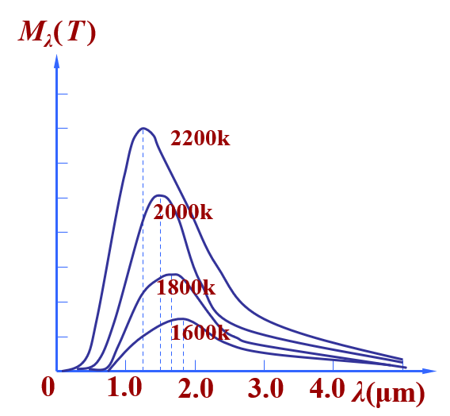
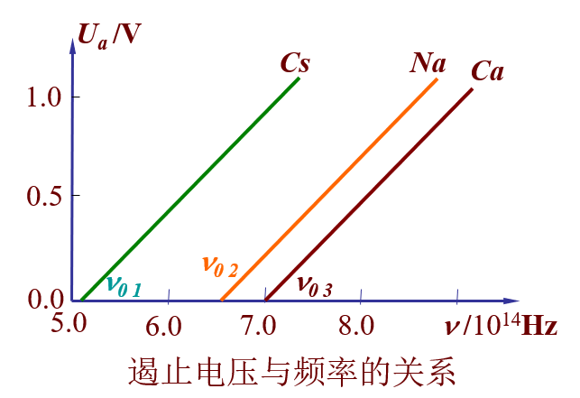
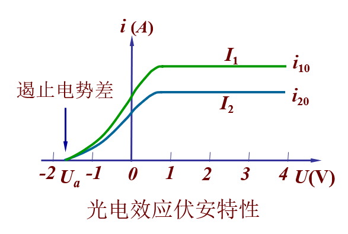
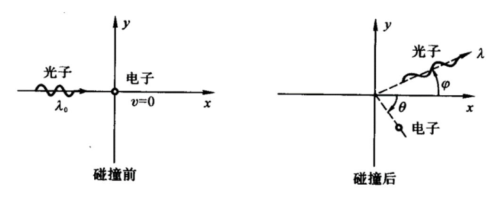
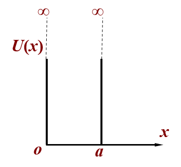
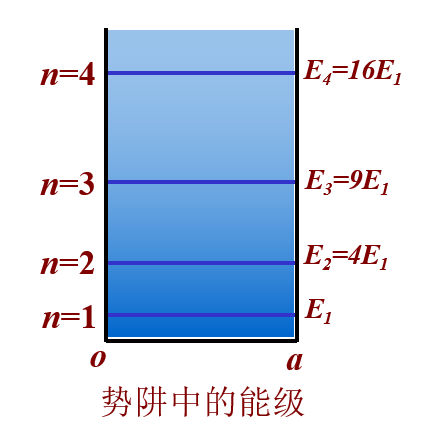
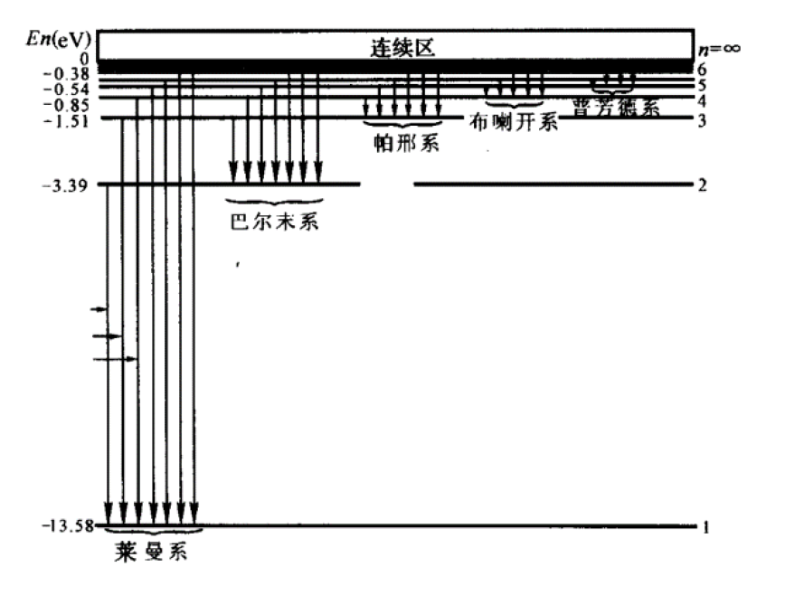

# 量子力学部分

## 电磁辐射的量子性

### 黑体辐射

- （热）辐射：物体内部因带电粒子热运动发射电磁波的现象。物体发射辐射能的同时也在吸收辐射能。
- **单色辐出度**$M_\lambda(T)$：单位时间、单位表面积上发射的波长在$\lambda$到$\lambda + \text{d}\lambda$范围内的辐射能为$\text{d}M_\lambda$，则：$M_\lambda(T) = \dfrac{\text{d}M_\lambda}{\text{d}\lambda}$（关于$T, \lambda$的函数）
- 辐射出射度$M(T)$：单位时间、单位表面积上发射全波长范围内的辐射能，公式为：$M(T) = \int_0^{+\infty}M_\lambda(T)\text{d}\lambda$

- **入射**进来的能量 = 被**吸收**的能量 + 被**反射**的能量 + **透射**过去的能量
    - 对应的占比为**吸收系数**$\alpha(\lambda, T)$与**反射系数**$r(\lambda, T)$，它们是关于$\lambda, T$的二元函数
        - 对于不透明物体，$\alpha(\lambda, T) + r(\lambda, T) = 1$

- **绝对黑体**
    - 入射进来的能量被全部吸收的物体，满足$\alpha_B(\lambda, T) = 1$
    - 基尔霍夫定律：任何物体的单色辐出度与单色吸收系数的壁纸都满足：$\dfrac{M_\lambda(T)}{\alpha(\lambda, T)} = M_{B\lambda}(T)$

- 绝对黑体的辐射定律：
    - 斯特藩-玻尔兹曼定律：$M_B(T) = \int_0^{+\infty}M_{B\lambda}(T)\text{d}\lambda = \sigma T^4$，其中：
        - $M_B(T)$：特定温度下绝对黑体的总辐射能量
        - $\sigma$：常数，$\mathtt{5.67 \times 10^{-8} W/m^2 \cdot K^4}$
    - 维恩位移定律：$T\lambda_m = b$，其中
        - $\lambda_m$：下图中曲线峰值对应的波长
        - $b$：常数，$\mathtt{2.898 \times 10^{-3} m \cdot K}$

        

            
        

### 光电效应

- 光子：电磁辐射在空间传播的离散的量子形式（被视为一种例子）
- 单个光子的性质：

$$
\underbrace{E = h \upsilon}_{\mathtt{能量}} \xrightarrow{E = mc^2} \underbrace{m = \dfrac{h\upsilon}{c^2} = \dfrac{h}{c\lambda}}_{\mathtt{质量}} \xrightarrow{p = mc} \underbrace{p = \dfrac{h\upsilon}{c} = \dfrac{h}{\lambda}}_{\mathtt{动量}}
$$

- **光电效应**
    - 基本现象：在光的照射下，电子从金属表面逸出
    - 一个电子获得一个光子的能量，首先用于克服表面阻力所需的**逸出功**$A$，剩下的能量作为**最大初动能**$E_{km}$，公式为：$h\upsilon = E_{km} + A$
    - 加上反向电压可以遏止光电子的运动，加**遏止电压**$U_a$时，光电流为0，对应公式为：$E_{km} = e|U_a|$
    - 遏止电压与频率的关系：

    

        
    

    - 当光频率 = 截止频率（又称红限频率）$\upsilon_0$时，电子获得的能量 <= 逸出功，无光电子激发或激发的光电子没有动能，因而无光电流，对应公式为：$h\upsilon_0 = A$
    - 随着电压增大，光电流增大至饱和值，该值与激发的光电子数量有关（等于光子数量）。光子数量$n$与光强$I$的关系为：$I = nh\upsilon$

    

        
    

### 康普顿效应

- 现象：单色X射线投射到石墨晶体及其他材料上时，散射光线除了有与入射线波长$\lambda_0$相同的成分外，还有波长大于$\lambda_0$的部分，且波长变化$\Delta \lambda = \lambda - \lambda_0$随散射角$\varphi$增大而增大，并与$\lambda_0$及物质无关。
- 解释：电子与光子碰撞模型：

    

        
    

    - 入射光子与电子发生碰撞（假设是弹性碰撞），光子部分能量转化为电子动能
    - 能量守恒：$h\upsilon_0 + m_e c^2 = h\upsilon + mc^2$
    - 动量守恒：$\begin{cases}\dfrac{h\upsilon_0}{c} = \dfrac{h\upsilon}{c} \cos \varphi + mV \cos \theta \\ \dfrac{h\upsilon}{c}\sin \varphi = mV \sin \theta \end{cases}$
    - 其中，$m_e$为电子静止质量，$m$为电子相对论质量（$m = \dfrac{m_e}{\sqrt{1 - \frac{v^2}{c^2}}}$）

- 常考物理量
    - 波长改变量与散射角的关系：$\Delta \lambda = \lambda - \lambda_0 = \dfrac{h}{m_e c}(1 - \cos \varphi)$，其中：
        - $\dfrac{h}{m_e c} = \mathtt{0.0024nm}$：电子的康普顿波长
        - 散射角$\varphi$可取到$180\degree$
    
    - 电子获得的动能：$E_k = h\upsilon_0 - h\upsilon$

## 量子力学简介

### 德布罗意波

实物粒子同样具有波粒二象性，波长$\lambda$由动量决定，频率$\upsilon$由能量决定，公式为：

$$
E = mc^2 = h\upsilon \xleftrightarrow{E = \frac{p^2}{2m}} p = mv = \dfrac{h}{\lambda}
$$

### 不确定性理论

- 动量与位置的不确定性关系：$\Delta x \Delta p_x \ge \dfrac{h}{4\pi}$
- 能量和时间的不确定性关系：$\Delta E \Delta t \ge \dfrac{h}{4\pi}$
- 微观粒子的（位置和动量）/（处于某个状态的时间与能量）不可能同时准确测定

### 波函数

- **波函数**$\Psi(x, y, z, t)$是空间与时间的函数，蕴含了粒子的运动状态。
    - 当粒子运动状态不随时间变化时，波函数为**定态波函数**$\psi(x, y, z)$ 
    - 波函数的值可能是复数，它的模长平方$|\Psi(x, y, z, t)|^2 = \Psi^* \Psi$代表粒子在对应点出现的**概率密度**
    - 波函数的要求：
        - $\Psi(x, y, z, t)$是单值、连续、有限的函数
        - **归一化条件**：$\iiint\limits_V \Psi^* \Psi \text{d}V = 1$

- 薛定谔方程：量子力学的基本方程，其正确性只能由实验检验

    $$
    i\dfrac{h}{2\pi}\Psi(\mathbf{r}, t) = [-\dfrac{h}{4\pi m}(\dfrac{\partial^2}{\partial x^2}+\dfrac{\partial^2}{\partial y^2}+\dfrac{\partial^2}{\partial z^2})]\Psi(\mathbf{r}, t)
    $$

    - 定态薛定谔方程：当势能$U$与时间无关，而只是坐标的函数时，可将波函数分离变量，最终得到：

    $$
    \dfrac{\partial^2 \Psi}{\partial x^2}+\dfrac{\partial^2 \Psi}{\partial y^2}+\dfrac{\partial^2 \Psi}{\partial z^2} + \dfrac{8\pi^2 m}{h^2}[E - U(\mathbf{r})]\psi(\mathbf{r}) = 0
    $$

- **一维无限深势阱**：粒子在某一区间内势能为0，其余区间势能为无限大，由薛定谔方程，该粒子只在该区间出现。
    - 一维无限深势阱的势能分布：$U(x) = \begin{cases}0 & 0 < x < a \\ \infty & x \le 0 \text{ or } x \ge a\end{cases}$

    

        
    

    - 粒子的运动特征：
        - 能量的量子化：$E_n = n^2 \dfrac{h^2}{8ma^2}, n = 1, 2, 3 \dots$，$n$为量子数

        

            
        

        - 粒子的最小能量$E_1$称为**零点能**
        - 粒子在势阱的不同位置中出现的概率：按量子力学结论，粒子出现的概率在势阱内有一定分布。但当$n$趋于无限大时，$P(x)$振荡过密，可近似看作均匀分布

!!! note "一维波函数分析"

    !!! question "题目"

        已知未归一化的波函数，求归一化常数、概率密度函数、最大概率密度位置、某区间概率等

    核心：$\psi^2(x)$是例子出现在$x$处的概率密度
    
    1. 令$\int_{-\infty}^{+\infty} \psi^2(x) \text{d}x = 1$，求出归一化常数$A$
    2. 然后代入该常数得到波函数，进而得到概率密度函数$f(x) = \psi^2(x)$
    3. 最大概率密度位置通过对$f(x)$求导得到，区间$(a, b)$出现的概率为$\int_a^b f(x)\text{d}x$

## 氢原子及其结构

### 玻尔氢原子理论

- 玻尔理论
    - 原子存在一系列具有确定能量的稳定状态（定态）
    - 原子处于定态时，电子在稳定的圆形轨道上运动，其角动量$L$必为$\dfrac{h}{2\pi}$的整数倍，即$L = nvr = n\dfrac{h}{2\pi}, n = 1, 2, 3$，其中$n$为量子数
    - 氢原子的**轨道半径**是量子化的：

        $$
        \dfrac{1}{4\pi\varepsilon}\dfrac{e^2}{r^2} = m\dfrac{v^2}{r} \rightarrow r_n = n^2 \dfrac{\varepsilon_0 h^2}{\pi me^2} \quad n = 1, 2, 3 \dots
        $$

        其中$r_1$称为**玻尔半径**$a_0$，从而$r_n = n^2a_0$

    - 氢原子的**能量**是量子化的：

        $$
        E_n = -\dfrac{1}{n^2}\Big(\dfrac{me^4}{8\varepsilon_0^2 h^2}\Big) \quad n = 1, 2, 3 \dots
        $$

        其中$n = 1$称为**基态能级**，$E_1 = \mathtt{-13.6eV}$，$E_n = \dfrac{E_1}{n^2}$

- 氢原子光谱
    - 从高能级$n_i$跃迁到低能级$n_f$时，发射一个光子，其波长为

        $$
        \dfrac{hc}{\lambda} = E_i - E_f \quad \text{or} \quad \dfrac{1}{\lambda} = R(\dfrac{1}{n_f^2} - \dfrac{1}{n_i^2})
        $$

        其中**里德伯常数**$R = -\dfrac{E_1}{hc}$

    - 氢原子光谱的线系：各个高能级向同一低能级跃迁时辐射的谱线集合
        - 向$n=1$跃迁：莱曼系
        - 向$n=2$跃迁：巴耳末系

        

            
        

    - 氢原子光谱的系限：由$n = \infty(E = 0)$向线系最低能级跃迁辐射的蒲县，其波长（极限波长）是线系中最短的
    - 若被激发到的最高能级为$n$级，则能够发射的谱线数为$\dfrac{n(n - 1)}{2}$

### 量子力学氢原子理论

- 量子数
    - 主量子数$n$
        - 取值：$1, 2, 3, \dots$
        - 量子化：$E_n = -\dfrac{1}{n^2}\Big(\dfrac{me^4}{8\varepsilon_0h^2}\Big)$（电子能量）
    - 角量子数$l$
        - 取值：$0, 1, 2, \dots, n - 1$
        - 量子化：$L = \sqrt{l(l+1)}\dfrac{h}{2\pi}$（电子绕核旋转的角动量）
    - 磁量子数$m_l$
        - 取值：$0, \pm 1, \pm 2, \dots, \pm l$
        - 量子化：$L_z = m_l\dfrac{h}{2\pi}$（轨道角动量在指定的$Z$轴的分量）
    - 因此，一组量子数$n, l, m_l$确定了一个满足要求的波函数，氢原子中电子的波函数可以写为：

        $$
        \psi_{n, l, m_l}(r, \theta, \varphi) = R_{n, l}(r)\Theta_{l, m_l}\Psi_{m_l}(\varphi)
        $$

- 电子自旋
    - 现象
    - 轨道磁矩的最小值称为玻尔磁子$\mu_B = \dfrac{eh}{4\pi m} = \mathtt{9.27 \times 10^{-24} A \cdot m^2}$
    - 自旋磁矩和自旋角动量的关系：$\mu_s = -\dfrac{e}{m}S$
    - 物质的磁性由电子轨道磁矩和自旋磁矩决定
    - 自旋磁量子数$m_s$，取值：$\pm \dfrac{1}{2}$
    - 自选角动量$S$在外磁场的分量$S_z = m_s \dfrac{h}{2\pi}$

- 概率密度
    - $|\psi_{n, l, m_l}(r, \theta, \varphi)|^2$代表电子出现在$(r, \theta, \varphi)$处的概率密度
    - **径向概率密度**$r^2|R_{n, l}(r)|^2$代表电子出现在$r$处的概率密度

## 激光和固体能带

目前不清楚考不考，等我做了历年卷再说。