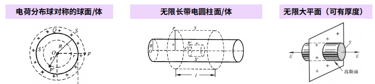

# 电学部分

## 静电场

### 电场强度

电荷守恒定律：一个孤立系统内无论发生什么过程，总电荷数保持不变。电荷既不能被创造、也不能被消灭，它只能从一个物体转移到另一个物体，或者从物体的一个部分转移到另一个部分。

**库仑定律**：适用于真空中两个点电荷，同种电荷相斥，异种电荷相吸。其中 真空中介电常数$\epsilon_0 = 8.85 \times 10^{-12} \rm{C^2/(N \cdot m^2)}$

$$
\bm{F}_{21} = \dfrac{1}{4 \pi \epsilon_0} \dfrac{q_1q_2}{r_{12}^2} \hat{\bm{r}}_{12}
$$

>注：公式右边的$\hat{\bm{r}}_{12}$表示的是矢量的方向，而不代表具体的值，下面如果出现类似的记号，意义与之类似。

---
电场强度的定义（单位：$\rm{N/C}$或$\rm{V/m}$）：

$$
\bm{E} = \dfrac{\bm{F}}{q_0}
$$

场强叠加原理

点电荷的电场强度：

$$
\bm{E} = \dfrac{q}{4 \pi \epsilon_0 r^2} \hat{\bm{r}}
$$

!!! note "求连续分布电荷产生的总场强"

    题目往往会给出电荷密度（包括线密度$\lambda$、面密度$\sigma$、体密度$\rho$）的信息。一般的解题步骤如下：

    - 运用**微元法**。先求一个带电量为 $\mathrm{d}q = \lambda \mathrm{d}l$（或$\sigma \mathrm{d}S,\ \rho \mathrm{d}V$）的点电荷产生的场强 $\mathrm{d}\bm{E}$
    - 再对所有电荷**积分**，得到：

    $$
    \bm{E} = \int \mathrm{d} \bm{E} = \int \dfrac{\mathrm{d} q}{r^2} \hat{\bm{r}}
    $$

---
电场线

    

**电通量**：

- 定义：穿过曲面$S$的电通量 = 穿过该曲面的电场线条数

$$
\Phi_e = \int\limits_S \bm{E} \cdot \mathrm{d}\bm{S}
$$

- 特殊情况：
    - $E \perp S \Rightarrow \Phi_e = ES$
    - 平面$S$的法线与$E$的夹角为$\theta \Rightarrow \Phi_e = ES \cos \theta = \bm{E \cdot S}$

    

---
:star:**高斯定理**：通过任意闭合曲面的电通量 = 该曲面所包围的所有电荷量的代数和 / $\epsilon_0$

$$
\Phi_e = \oint\limits_S \bm{E} \cdot \mathrm{d} \bm{S} = \dfrac{1}{\epsilon_0} \sum q_i
$$

常用结论：

- 均匀带电球面：$E = \dfrac{q}{4 \pi \epsilon_0 r^2}$
- 无限大平面（面密度$\sigma$）：$E = \dfrac{\sigma}{2 \epsilon_0}$
- 均匀带电圆柱面（线密度$\lambda$）：$E = \dfrac{\lambda}{2 \pi \epsilon_0 r}$

    

### 电势

电场力所做的功，仅与电荷电量大小及其始末位置有关，与电荷移动的路径无关。所以电场力是一种保守力，静电场是一种保守场。

**静电场环路定理**：在静电场中，电场强度沿任意闭合回路的线积分恒等于0

$$
\oint \bm{E} \cdot \mathrm{d} \bm{l} = 0
$$

---
电势能：在点电荷$q_0$从$a$点移动到$b$点的过程中，电场力所做的功 = 电荷电势能的增量的负值。

$$
A_{ab} = \int_a^b q_0 \bm{E} \cdot \mathrm{d}\bm{l} = -(W_b - W_a) = - \Delta W
$$

电势能是相对的，对于有限分布的电荷系统，取无穷远处电势能为0，则将电荷从$p$点移动到无穷远时，$p$点的电势能 = 电场力所做的功，即：

$$
W_p = A{p \infty} & = q_0 \int_p^{\infty} \bm{E} \mathrm{d}\bm{l} 
$$

电势：

$$
U_p = \dfrac{W_p}{q_0} = \int_p^{p_0}\bm{E} \cdot \mathrm{d}\bm{l}  
$$

其中$p_0$是电势为0的参考点。

现在，电场力做工可以表示为：

