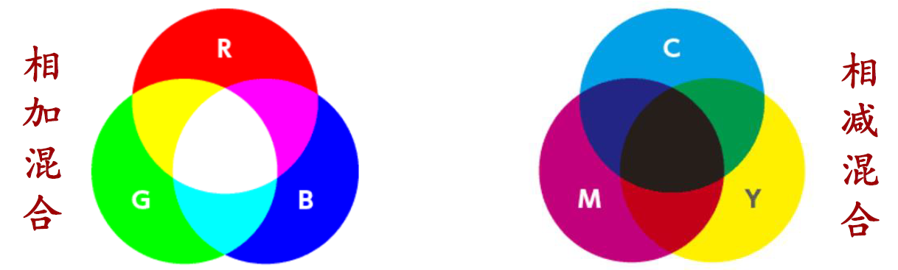
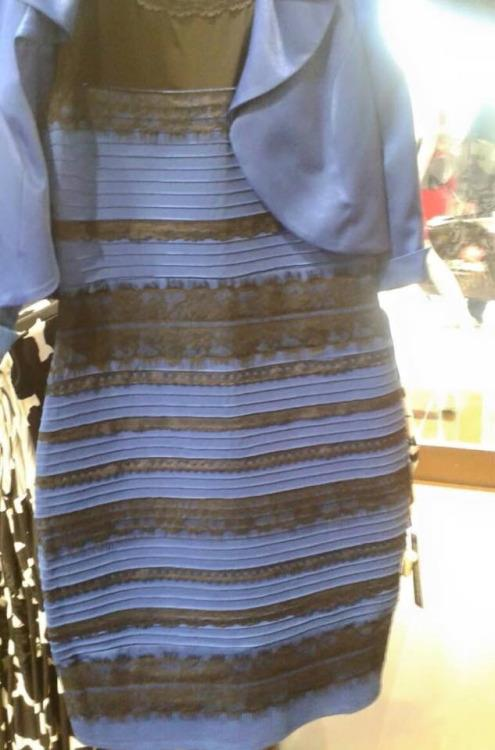

# Part 1

## 绪论

### 心理学是科学

- 心理学是**用科学的方法**研究心理过程及个体行为的学科
    - 心理过程：情感、思维、梦境、记忆等
    - 行为：微笑、哭泣、攻击、合作、竞争等
- 生活中的与心理学相关的许多常识并不可靠；心理学（脑科学）中有一些不可思议的发现
- 心理学家得出的结论是基于实验事实的科学观察
- 心理学研究结论具有系统性和可重复性
- 研究对象：动物、（各种状态的）人

### 生活中的伪心理学

- 举例：
    - 手相学(palmistry)
    - 颅相学(phrenology)
    - 笔迹学(graphology)
    - 占星术(astrology)
- 为何伪心理学如此流行：
    - **无批判接受顺言**(uncritical acceptance)：容易相信别人对自己奉承赞扬的偏向（比如很多星盘的解释都是为了媚谄于人而预设建造的）
    - **肯定例证谬误**(fallacy positive instances)：倾向于记住或注意与自己期望相一致的信息，而忽略不一致的信息（选择性相信效应）
- 像科学家一样思考：

    

### 心理学的研究方法

- 描述性研究方法：不能揭示因果关系
    - **调查研究法**：获得人的行为及心理过程的信息最直接的一种方法，仅需向人提问。被广泛应用于人们对电视节目、饮料、政治候选人等对象的态度
        - 优点：可在短时间内获取大量资料
        - 缺点：
            - 不同的调查对象群体可能得到不同的结果
            - 不能保证人们对调查问题的回答是完全诚实的
            - 很多微妙因素会影响调查结果，如语气、措辞等
    - **自然观察法**：在自然的环境下，对人或动物自然发生的行为作观察和描述
        - 缺点：
            - 被观察对象的行为容易受到观察者影响
            - 容易出现观察者偏差
            - 被观察对象行为难以控制和精确重复
    - **个案观察法**：对单个被试进行深入研究，以揭示出对所有个体来说都适用的规律
        - 优点：个案研究可以为心理学积累大量有价值的知识，这些知识可为实验研究指引方向
        - 缺点：个案研究缺少对研究过程的控制，只能提供观察性描述，有些结果难以重复
    - **相关研究法**：用于揭示一个量的变化是否伴随另一个量的变化
        - 正相关：一个测量的值从小到大变化时，另一个测量的值对应地也从小到大变化
        - 负相关：一个测量的值从小到大变化时，而另一个测量的值从大到小变化
        - 相关系数是-1\~1的值，用于描述变量间相关的程度
- **实验研究法**（可揭示因果）是通过谨慎操控变量，观察是否导致行为结果的变化，是获得行为因果的最有效方法
    - 变量
        - 自变量(independent variable)：因实验者操纵而变化的因素；（引起行为反应的因）
        - 因变量(dependent variable)：实验的测量结果，自变量引起的特定反应；（行为反应）
        - 干扰变量(extraneous variable)：与实验无关的其他因素
    - 实验组vs对照组，两者不可或缺：后者的结果是一个参考点，前者的结果与之比较才能揭示原因
        - 实验组(experimental group)：接受自变量条件
        - 对照组(control group)：接受除自变量条件之外所有条件
    - **被试偏差**(participant bias)：因为被试的主观期待而造成结果上的无意偏差
    - **安慰剂效应**(placebo effect)：因为被试对药物效果产生期待而导致的药物效应
        - 安慰剂效应非常强大，生理盐水作为安慰剂的镇痛效果能达到吗啡效果的70%
        - 大量的心理过程受安慰剂效应影响：痛觉、焦虑、抑郁、警觉、酒精渴求等
    - **研究者偏差**(research bias)：主试不经意的暗示对实验结果造成影响
    - **自证预言**(self fulfilling prophecy)：预言促使人们朝预言的方向努力
    - **单盲试验**(single-blind experiment)：不让被试知道自己被分为实验组还是对照组
    - **双盲实验**(double-blind experiment)：被试和主试都不知道哪组被试是实验组，哪组是对照组
    - 心理学实验要遵循伦理道德
        - 基本要求：
            - 不会造成伤害（心理和生理）
            - 让被试知晓可能潜在的危险
            - 尽量减少实验过程中的不适
            - 保密被试的所有行为记录
            - 不侵犯被试隐私尽力减少欺骗
            - 尊重被试
        - 动物研究中的伦理道德：
            - 大约7%的心理学研究中使用动物，其中95%使用老鼠和鸟类
            - 大量不能适用于人的研究在动物上开展：药物成瘾、焦虑、攻击性、电生理等
            - 实验中尽量减少动物的痛苦

## 大脑

### 基础结构

大脑由**神经元**构成，神经元的结构如下：

    

- 树突(dendrites)：接受从其他神经元传入信息的神经纤维
- 胞体(soma)：神经元的主要部分,对各种输入信息进行汇总、整合
- 轴突(axon)：从神经细胞体向外传导信息的纤维
- 突触末梢(axon terminals)：轴突末端分支的纤维

神经元的工作流程：

    

---
神经元之间的对话——**动作电位**

- 神经元既是神经系统的导线，又是神经系统的电池
- 静息电位(resting potential)：神经元在静息状态时细胞的内外的电位差，约-70mV
- **动作电位**:因为其他神经输入，静息电位达到-50mV的阈值时，神经元上的离子通道发生一系列开关动作，造成膜电位的快速上升之后又快速恢复的过程

    

        
    

    - 动作电位是通过放电频率来编码信息

    

        
    

    - 动作电位轴突传递到下一级神经元，最快90米/秒

    

        
    

---
神经元间的连接纽带——**突触和神经递质**

- 突触：一个神经元的轴突末梢与另一个神经元接触的特异性连接
- 神经递质：突触前神经元分泌的可激活突触后神经元受体的分子
- 受体：探测神经递质并启动细胞反应的特化蛋白质

    

        
    

    - 突触后神经元整合兴奋性和抑制性神经输入

    

        
    

    - 近百种神经递质被发现：
        - 兴奋性：乙酰胆碱(Ach)、谷氨酸(Glu)
        - 抑制性：$\gamma$氨基丁酸(GABA)
    - 通过控制神经递质的作用强度调节心理或行为
    - 神经调节剂：神经肽(neuropeptides)
        - 可通过突触以外的部位释放，作用更慢，效应长
        - 调节神经活动：影响记忆、痛觉、情绪等
    - 脑内的鸦片：内啡肽
        - 疼痛成瘾，“痛并快乐着”
        - 脏话上瘾、安慰剂止痛等
    - 爱情激素——催产剂：增强亲社会行为，提升亲和力、慷慨度、共情能力等

---
如何建立神经联结——**赫布(Hebb)学习原则**

- Fire together, wire together
- 大脑神经联结随着年龄（经验）而变得丰富、复杂

    

### 功能和结构

大脑的功能：感知觉、运动、记忆、情感、认知

大脑的结构：

    

- **大脑皮层**：人类大脑皮层厚度3mm，包含神经系统70%的神经元
    - **灰质**：神经元胞体排列在皮层表面，呈现为灰色
    - **白质**：皮层下的区域，由皮层神经元的轴突构成，因为这些轴突被髓鞘包裹，呈现为白色

    

        
    

    - **大脑半球**
        - 大脑皮层由两个大脑半球组成，两个半球由一条厚厚的纤维带（1亿条轴突）——**胼胝体**相连接

        

            
        

        - 每个半球控制对侧躯体：左半球控制右侧，右半球控制左侧
        - 左、右侧视野的视觉信息分别投射到右、左半球

        

            
        

        - 左右脑的功能是不一样的

            

                
            

            - 左脑：口语能力、更关注细节...
            - 右脑：空间能力、更关注整体...

    - 大脑皮层的分区及功能（根据大裂纹把大脑分为4个脑叶）
        - **枕叶**：负责对视觉信息进行初步加工
        - **颞叶**：处理听觉信息，参与语言、记忆功能
        - **顶叶**：处理躯体感觉信息（温度、触觉、压力觉等）还负责空间推理和空间注意
        - **额叶**：大脑的控制中心，控制运动、情绪/情感、冲动等，参与决策、思维等高级功能

        

            
        

    - **镜像神经元**(mirror neurons)：当做出某种动作时，这些神经元会反应；看到别人做相似动作时，它们也会反应。帮助理解、模仿别人的行为

- **皮层下结构**：源自于进化的更早期，负责基本的生命活动
    - **丘脑**：各种感觉信息（视觉、听觉、味觉、触觉）传输的中转站。损伤将导致除嗅觉之外的其他感觉的丧失

    

        
    

    - **小脑**
        - 控制不随意的、快速及精细动作，协调肌肉的运动，维持平衡，使运动自动化，如行走、舞蹈、打字、演奏乐器等
        - 负责动作的记忆
        - 音乐家的小脑比普通人的更大
    - **脑干**(brain stem)
        - 构造：网状结构、脑桥、延髓
        - 功能：
            - 维持基本的生命活动（呼吸、心跳、吞咽、消化等）
            - 上行和下行信息的分类/选择（觉醒、警觉、睡眠）
    - **边缘系统**(limbic system)：位于脑干/丘脑与皮层之间的结构，出现于进化的中期，与情绪、记忆、动机有关

        

            
        

        - **海马**(hippocampus)：参与形成新的长时记忆
        - **杏仁核**(amygdala)：与恐惧情绪与恐惧记忆有密切关系。摘除杏仁核的猴子不怕蛇和人
        - **下丘脑**(hypothalamus)：基本动机的控制中心，包括摄食、饮水、体温调节和性唤醒。被称为“快乐中枢” “奖赏系统”，电刺激下丘脑某些区域时会产生强烈的、广泛的快感或特定的性快感

复杂的心理功能和行为是由大脑很多子脑区综合协调工作的结果。

    

- 清醒状态下大部分脑区都在工作

???+ example "例子：朗诵时涉及的脑区"

    - 视觉区接收视觉信息
    - 角回把视觉词汇转换为听觉编码
    - 威尼卡区理解词汇
    - 布洛卡区作朗读的准备
    - 运动区支配肌肉运动

### 窥探大脑的方法

- 脑组织切除：通过外科手术切除大脑某些部分，观察行为的改变
- 电刺激：电刺激大脑某些区域，观察行为的改变，或询问被试的感受
    - 虚拟损伤法 —— 经颅磁刺激(TMS)
        - 利用交变强磁场，刺激大脑某个区域，让该脑区神经元去极化或超极化，从而短暂干扰该脑区的功能
- 大脑电活动记录：
    - 脑电图(EEG)和脑磁图(MEG)
    - 通过放置于头皮上的电极或磁探头，测量脑部大范围的电或磁活动
    - 觉醒状态、睡眠阶段与脑电波

    

        
    

    - 细胞外记录：通过插入极细的金属或玻璃电极，靠近神经元胞体或轴突，记录神经元的放电活动

- 脑成像技术：
    - 正电子发射断层扫描技术(PET)：将含有正电子的葡萄糖注射至人体静脉，葡萄糖进入大脑后，正电子与脑中负电子湮灭，发射伽马射线，PET通过测量伽马射线强度，推测在完成各种任务时大脑中葡萄糖消耗量，从而推测大脑各脑区的功能
        - 不同的认知任务引起不同脑区的活动

        

            
        

        ??? example "例子"

            

                
            

            - 左侧被试比右侧被试的大脑消耗更多的葡萄糖，但在完成推理任务的成绩更差（11 vs 33）
            - 勤奋的脑就是聪明的脑？NO！效率越高的脑才越聪明

    - 磁共振成像(MRI)：利用人体组织中氢原子核（质子）对强磁场的反应构建出大脑的三维图像
        - 功能磁共振成像(fMRI)：通过测量大脑对氧气的消耗来确定各脑区的认知功能

## 感觉

### 基本概念、测量方法

**感觉**：是感觉器官（眼、耳）检测物理能量, 将其转化为神经信号并输送给大脑的过程。感觉系统塑造了我们聪明的大脑。

感觉过程：

    

感觉的测量：

- **绝对阈限**：产生感觉所必需的最小物理量

    

        
    

    不同感觉的绝对阈限：

    

        
    

- **差别阈限**：人们在辨别两种强度不同的刺激时所需要的刺激强度最小差异值，又被称为最小可觉差(Just Noticeable Difference, 简称JND)。

    

        
    

- **韦伯定律**：引起最小可觉察的刺激变化量和原刺激强度的比值是一个常数，公式为：
    $$
    K = \dfrac{\Delta I}{I}
    $$

    其中$K$为韦伯常数，$\Delta I$为差别阈限，$I$为原刺激强度

    - 不同感觉的韦伯常数：

    

        
    

- **费希纳定理**：各刺激强度下最小感觉差别相等，揭示了刺激与感觉之间的数学关系：
    $$
    \begin{align}
    \Delta S & = a \dfrac{\Delta I}{I} \notag \\
    \text{d}S & = a \dfrac{\text{d}I}{I} \notag \\
    S & = k \log I \notag
    \end{align}
    $$

    其中$\Delta S$为韦伯定律，各刺激强度下$\dfrac{\Delta I}{I}$是常数，$S$为感觉大小，$k$和$a$是常数，对应的曲线图如下：

    

        
    

感觉适应：感觉器官因接受刺激太久，其敏感度暂时发生改变的现象。

- 感觉不到手上带着表，脚上穿着鞋等，使得我们对变化更敏感，把注意集中到新的刺激上
- 视觉没有适应特性，因为在没有眼动的情况下，视觉适应使我们无法看到东西

例子：[Troxler's effect](https://en.wikipedia.org/wiki/Troxler%27s_fading)——盯着中间的小点看10s，你发现什么有趣的现象呢？

### 视觉

- 70%的信息靠眼睛获取
- 可见光谱范围：400-700nm

    

#### 眼睛的结构

    

- 眼睛的成像原理：

    

- 近视、远视、散光：

    

#### 视网膜及感光细胞

- 感光细胞有：
    - **视锥细胞**(cone)：负责颜色和**白昼**视觉的光感受器；高分辨率；约700万个；3种视锥编码颜色信息
    - **视杆细胞**(rode)：对**暗光**敏感的视觉感受器，产生黑白感觉; 低分辨率；约1.2亿个

    

        
    

- 感光细胞在视网膜上的分布：

    

- 中央视野和外周视野
    - **中央凹**(fovea)：视网膜中央的一小块凹陷区域，视锥细胞密集，负责颜色、细节加工

    

        
    

    - **外周**(periphery)：视网膜上的外围区域，主要分布于视杆细胞。视觉敏锐度差；颜色知觉差
        - 对光线敏感，在暗环境下工作；对运动信息敏感。这种能力对运动员、驾车和走入黑暗走廊等环境下保持知觉能力是十分重要的。

- [**盲点**](https://zh.wikipedia.org/wiki/%E7%9B%B2%E9%BB%9E_(%E7%9C%BC))：下图中，血管汇集处的高亮区域即为盲点

    

        
    

#### 视觉信息处理

- 对光线的检测只是视觉的第一步，更重要的是对视觉感受器传来的神经信号的进行计算和处理
- 照相机/计算机对图像是按像素来处理的，各像素之间是离散的、没有关联的；而大脑是以整体的方式来处理视觉信息
- 视觉过程由很多阶段来完成，不同的阶段识别不同的模式
- 视觉通路：

    

        
    

    - 视网膜（光点）
    - 丘脑外膝体（圆形）
    - 初级视皮层（线段）
    - 高级视觉皮层（形状/物体）
- **丘脑**（外膝体）：圆形感受野
    - 视网膜有1.3亿个感光细胞，但只有120万根视神经；每根视神经会接受多个感光细胞的输入
    - **感受野**(receptive field)：能引起某个视觉细胞的反应视网膜区域
        - 感受野结构：中央外周结构，有助于检测边界

        

            
        

        - On-off感受野：在感受野中央给光刺激时引起细胞放电，在外周区给光则抑制细胞的放电

        

            
        

        - Off-on感受野：在感受野中央给光刺激时抑制细胞放电，在外周区给光时引起细胞的放电

        

            
        

        - Off中心型神经节细胞对边界的反应

        

            
        

    - **马赫带**：光线的明暗交界处有一条明显的光带，靠近暗处的更暗，靠近亮处的更亮的现象

    

        
    

    - **侧抑制**：相邻的感觉神经元之间彼此有抑制作用

        - 下面两张图中间的灰色看起来右边的那个更深一些，但实际上两种灰色是一样的

        

            
        

        - 首次发现海洋节肢动物[鲎](https://zh.wikipedia.org/zh-cn/%E9%B1%9F%E7%A7%91)复眼的不同小眼之间存在相互抑制，并提出了经验公式解释这种现象。这种对信息的预加工可增强刺激的反差。侧抑制现象普遍存在于各种感觉神经系统中，具有重要的生理功能

        

            
        

- **视觉皮层**——特征检测
    - 丘脑的视觉信号传递到视觉皮层作进一步加工
    - 不同的脑区，检测不同的特征（朝向、运动、颜色等）

    

        
    

    - 越高级的视觉脑区，检测的视觉特征越复杂（点、线、面、物体），脑区的损伤导致对应的识认症
    - 各个脑区并行工作

    

        
    

#### 颜色视觉

- 不同类型的电磁波之间的差别在波长；视觉系统把可见光的波长信息转化为颜色

    

- 颜色的混合：所有的颜色都可以通过三种基本的颜色按照一定比例的混合得到
    - 580nm的纯光是黄色，可通过650nm（红）、500nm（绿）、450nm（蓝）混合得到与580nm完全一样的颜色
    - 颜色的混合说明颜色是一种心理量
    - 颜色的混合是各种显示技术的基础（电视、电影、摄影、印刷等）

    

        
    

- **颜色三原色理论**：虽然我们能感知无数种颜色，但视觉系统只有三种颜色感受器（红绿蓝），不同颜色的光会引起这三种感受器不同比例的激活，造成不同的颜色感受。

    

- **颜色拮抗说**：视觉系统的颜色表征是由颜色相互对抗的机制构成，如红-绿拮抗、蓝-黄拮抗、黑-白拮抗。某个拮抗机制不能同时对它的两种颜色反应，它会被某种颜色激活，而被与其相对的颜色抑制。

- 上述两种理论均正确，它们反映的是不同视觉信息处理阶段颜色的加工机制
    - 三原色理论可解释视网膜颜色机制
    - 颜色拮抗理论可解释视觉信息离开眼睛之后，大脑内的颜色机制

- 不同动物对颜色的体验：

    

- 色盲：

    

        
    

    - 为什么没有绿色毛发的哺乳动物？因为大部分哺乳动物是**红绿色盲**
    - 人类为了采摘果实，再次进化出分辨红绿能力

## 知觉

### 认识知觉的误区

- 感觉(sensatation)：把物理能量转化神经生理信号。这些信号是零碎的、分离的、无意义的
- 知觉(perception)：对感觉神经信号进行解释和理解。该过程是整体的、综合的、有意义的

知觉过程并不是对感觉信号忠实的解读（眼不见未必为虚，眼见未必为实），知觉的结果与感觉的物理输入可能有较大的差别。

### 知觉的形成过程

**知觉**(perception)：是通过对感觉信息进行组织、整合并根据已有的知识和经验对这些感觉信息进行理解的过程。

- 知觉把无意义的感觉输入信息（如亮度、颜色、线条等）组织整合起来，赋予这些无意义的信息以意义
- 知觉总试图赋予感觉刺激一定的意义，哪怕这些感觉输入本身无任何意义。知觉的过程是“不自觉的”，而且是“豪不费力”的；人脑特别擅长这种识别和理解（电脑只擅长记录和存储）

知觉形成过程：

    

- **自下而上加工**(bottom up processing)
    - 对输入的基本感觉信息进行抽提，形成简单的知觉特征，如颜色、亮度、线条朝向等；自下而上的信息是形成知觉的原材料
    - 原材料是零碎的、无序的、无意义的，只有对这些原材料进行合理的组织才能形成知觉

- **自上而下加工**(top down processing)：利用原有的知识经验，把“感觉原材料”组织成有意义的整体

- 知识经验的作用：
    - 加快感觉信息处理的速度
    - 当大量的感觉信息缺失时，可利用知识经验形成生动的知觉

### 知觉的恒常性

**知觉的恒常性**：

- 知觉能对目标物体的很多属性（颜色、亮度、形状、大小等）保持不变，即使它们投射在视网膜上的这些物理属性因视角/距离/光线等物理因素的变化而发生了极大的改变。
- 知觉的恒常性表明知觉并不是直接解读感觉输入, 自上而下的经验在知觉中扮演重要角色。

各类恒常性：

- **明度的恒常性**(brightness constancy)：物体本身所处照明环境发生改变，而对物体的亮度知觉仍然保持不变的心理倾向。
    - 例子：暗光下的粉笔仍为白色，阳光下的木炭仍为黑色。
- **颜色的恒常性**(color constancy)：当物体的环境照明颜色发生改变，而知觉经验仍对物体颜色知觉保持不变的心理倾向。
    - 颜色的恒常性存在的前提是要熟悉物体的颜色
    - 看到什么样的颜色取决于你认为衣服处于什么样的照明环境下

    ??? example "例子"

        2015年2月，网上流行了一张裙子的照片，人们对裙子的颜色争论不休，有人认为它是蓝-黑（blue and black）色，有人认为它是白-黄色（white and gold），你认为是什么颜色？ 心理学家们很好奇为什么人们看到了不一样的颜色。

        

            
        

- **大小的恒常性**(size constancy)：物体在视网膜上图像大小发生改变时，对物体的知觉体验不会发生改变

例子：月亮错觉、[Ames Room](https://en.wikipedia.org/wiki/Ames_room)"、[Beuchet Chair](https://richardwiseman.wordpress.com/2016/08/07/a-new-beuchet-chair-illusion/)"

### 深度知觉

**深度知觉**(depth perception)：人们能够把二维的视网膜上的图像恢复为三维图像的知觉过程，对开车、投篮、穿针等日常行为十分关键。

深度知觉线索来自两个方面：一方面是产生于视觉系统的特性；另一方面则是源自于刺激物的物理特征。

    

 

- **生理线索**
    - 辐合作用(convergence)：由两眼球转动以聚合视线，从而获得深度知觉的双眼线索

    

        
    
 

- **单眼线索**
    - 线条透视(linear perspective)：两条向远方延伸的平行线看来趋于接近

    

        
    
 

    - 相对大小：远处的物体比近处的物体显得更小

    

        
    
 

    - 遮挡/重叠：远处的物体被近处的物体遮挡

    

        
    
 

    - 明暗(shading)/光影(shadow)：物体反射光的强弱以及它投下的光影 (影子) 反映了深度信息

    

        
    
 

    - 相对清晰度：因为空气对光线的散射，远处的物体显得更模糊

    

        
    
 

- **双眼线索**
    - 双眼视差(binocular disparity): 视觉目标物体在两眼视网膜上成像位置的差别（应用：立体图、3D电影等）

    

        
    
 

### 影响知觉的因素

- 先天遗传：为自上而下的知觉过程打下基础，如亮度、颜色、边界、双眼视差等基本属性的检测
- 后天经验：塑造形成了自上而下的知觉成分，是知觉的核心，没有后天经验的塑造将没有知觉

例子：

- 一些生活在丛林里的原始部落居民不能利用相对大小线索来知觉远近，因为丛林中树木林立，日常生活中居民的视野范围很小。
- 文化影响知觉：东方文化注重整体，西方文化注重个体。
- 期待影响知觉：由于过程的不同造成了不同的期待，所以即使得到相同的结果，我们也会产生不同的知觉。 
- 不同通道间的知觉信息整合：如果视觉和听觉接受的信息产生矛盾，大脑更倾向于相信视觉得到的信息。