# Part 2

## 记忆

记忆的三阶段模型：

    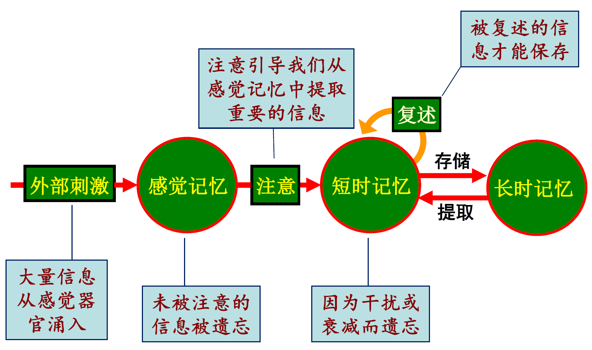

   

### 感觉记忆

**感觉记忆**(sensory memory)：记忆的第一个阶段，此阶段所有的感觉印象被完整保留很短一段时间。

- 映像记忆(icon memory): 视觉感觉记忆，约持续$\dfrac{1}{4}$秒
- 回声记忆(echoic memory): 听觉感觉记忆，可持续$4$秒

特点：

- **容量大**：包含大量的信息，几乎完整复制感觉信息
- **消退快**：持续时间极短，在几秒甚至更短的时间之内感觉记忆即消失
    - 感觉记忆就像一幅幅快照(snapshot)映在脑海，虽然清晰，但消失的很快
    - 被注意的信息才进入记忆的下一个阶段，短时记忆

### 短时记忆

**短时记忆**(short-term memory)的特点：

- 短时记忆保存着在任何特定时刻我们正在思考或意识到的信息：记陌生的电话号码、购物清单、汉字的结构、一幅风景画等
- 短时记忆还要存储信息认知加工的过程，又被称为**工作记忆**(working memory)；例如口算加法时加法的算法以及计算过程中新信息
- 短时记忆主要以**语音**的形式存储
    - 短时记忆的信息能以听觉语音的方式存储（记一句话），也能以视觉画面的形式存储（记一个场景）
    - 信息更可能以听觉形式存储，因为语音更有利于复述(rehearsal)。实验表明当人们试图从短时记忆中提取信息时，它们通常会混淆那些听起来类似的项目
    - 书写错误：是$\rightarrow$时，抑$\rightarrow$易
- 短时记忆容量小
    - 扩大短时记忆的容量：短时记忆的记忆单元是**组**(chunk)，通过对离散的信息进行重新组织形成有意义的组块，可以大大提高短时记忆的记忆容量
- 短时记忆保持时间短：半分钟之内会完全消失
    - 通过复述，信息得以保持
    - 如果信息得到充分的复述或与现有的记忆产生联系，则会进入长时记忆

### 长时记忆

30秒以前和更早的信息即进入**长时记忆**(long-term memory)。

长时记忆不是更持久的短时记忆

- 容量有质的差别：长时记忆具有庞大的储存容量
- 回忆信息的方式不同：扫描 VS 索引
- 遗忘机制不同：短时记忆中信息没得到复述即衰减遗忘；长时记忆的遗忘通常不是信息被擦除，而是由于信息无法提取
- 在不同的脑区编码：短时记忆主要由前额叶皮层编码；长时记忆首先在海马中得到整合，然后被转移到参与语言和知觉的大脑皮层做永久保存

长时记忆的分类：

- **程序记忆**：对动作行为和技能的记忆
- **陈述记忆**：对事实的记忆，如日期、地点、事件等
    - **语义记忆**：对事件事实的记忆、意义的记忆
    - **情景记忆**：对信息发生的时间和地点相关的记忆，与个体独特的经历有关，又称为自传体记忆

大脑更善于储存语义信息（语义记忆），而对情节信息（情景记忆）的储存要弱很多。

长时记忆的意义编码：长时记忆里的信息根据意义进行归类组织。对信息进行组织和赋予意义极大提高长时记忆能力

- **精细复述**：对新的信息进行详细的处理，尽可能多地与已有的记忆内容联系起来，使得新的信息获得意义（理解地记忆）。它有助于短时记忆转化为长时记忆
- 长时记忆的分布式编码：长时记忆的信息存储于由一群神经元组成的分布式网络之中，编码各种信息的神经元群相互重叠

    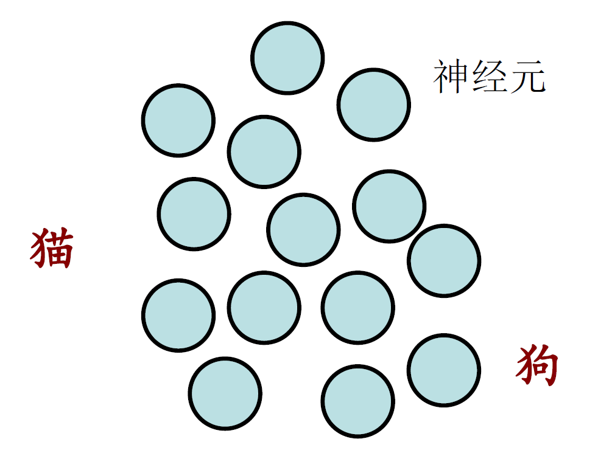

 

- 记忆信息的组织：
    - **激活扩散模型**：记忆网络中的各个记忆节点相互联系，相似节点间的距离更近
    - 一个记忆节点可以通过语义、价值、情境等激活其他节点。可解释记忆的自动提取

    

        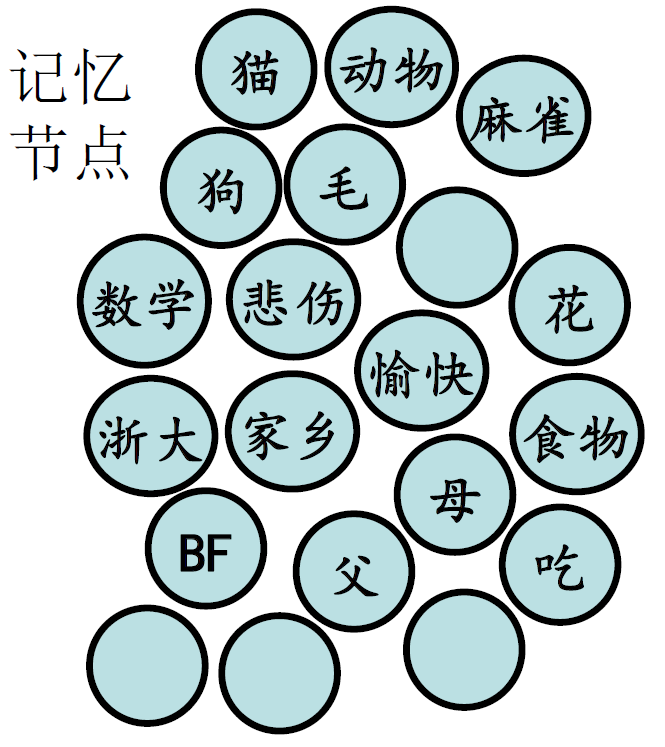
    
 

**记忆重构理论**(reconstruction theory)：记忆并不像磁带或硬盘那样忠实记录所有信息。记忆过程对信息进行了大量的压缩, 对某事件的回忆不是忠实恢复而是重构, 经重构而获得的记忆往往会因以下因素的影响而偏离事实：

- 知识和期望
- 新的记忆
- 想像

记忆的测量：

- 回忆法：只提供很少线索，要求从长时记忆里提取出相关信息
- 再认法：从提供的选项中，辨别出学过的内容
    - 因为会提供更多线索，再认法会帮助回忆起更多的事情
- 再学习法：对已忘记的材料再学习，通过学习时间的长短测量先前的记忆
    - 学过的知识从来不会被彻底忘记

### 遗忘

遗忘研究的先驱——德国心理学家艾宾浩斯。

??? example "例子"

    无意义音节，即一种有两个辅音和一个元音组成的字母串，如P0F、QAZ等。

    运用节省法（再学习法）：10(初学遍数) - 6(再学遍数) = 4(节省遍数)，保持率 = 4 / 10 = 40%

艾宾浩斯遗忘曲线：

    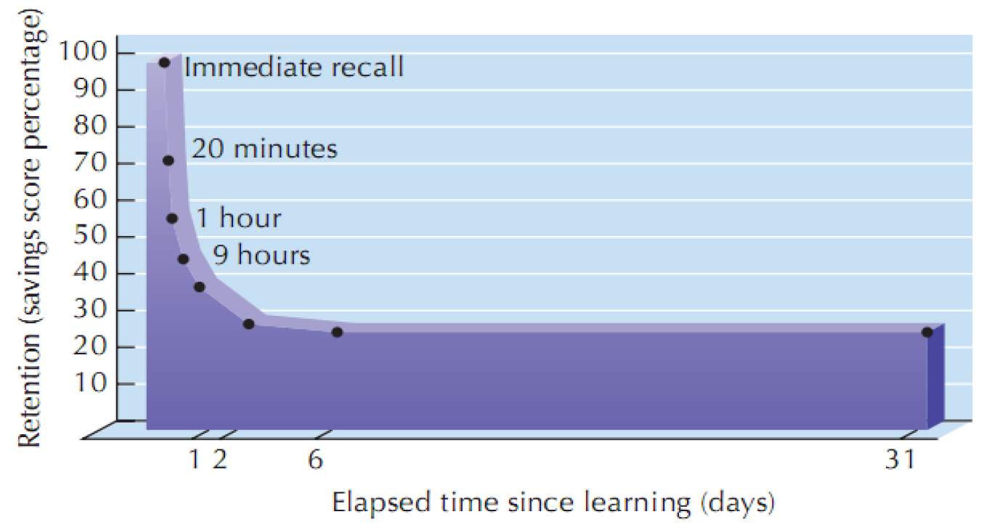

 

- 对于无语义的、死机硬背的集中学习，遗忘在开始阶段快速发生
- 有意义的信息不会被快速遗忘

遗忘的原因：

    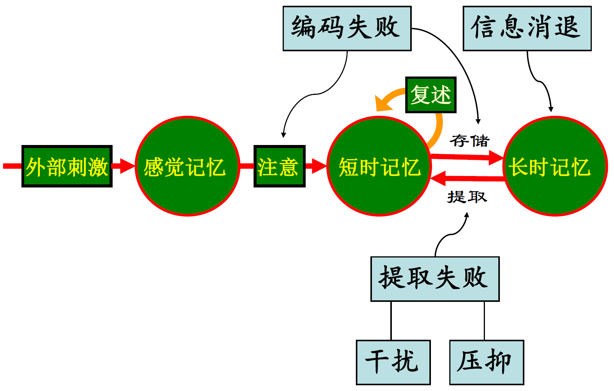

 

- 编码失败：信息没有得到有效编码，没能进入长时记忆
    - 解决办法：对信息进行精细加工
- 存储消退
    - 信息消退: 没有被使用的信息会随着时间推移而逐渐淡化
    - 消退是感觉记忆和短时记忆的遗忘的原因
    - 长时记忆信息也可随着时间而消退，而导致不能无法回忆，例如艾宾浩斯的无意义音节
    - 消退假说可以解释部分遗忘现象，但无法解释看似遗忘的信息可通过提示而被记起
- 提取失败
    - 记忆依赖于线索，增加线索可促进记忆的提取
    - 干扰导致遗忘：其他记忆信息的干扰会导致记忆信息提取的失败
        - 倒摄干扰：新的记忆抑制了先前的记忆
        - 前摄干扰：先前的记忆抑制了后来的记忆

        

            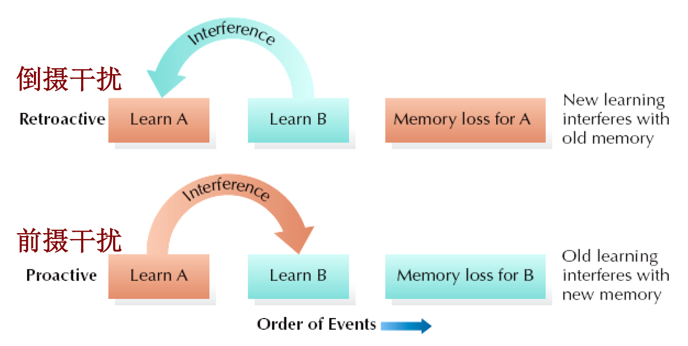
        
 

    - 动机性压抑可干扰记忆提取
        - 压抑说：人们会有意识的压抑、遗忘痛苦的记忆，把它们驱逐到潜意识里。即动机性遗忘
        - 压抑说并没有得到完全的实验支持

## 情绪

### 情绪及其功能

**情绪**：人对客观事物的态度体验以及相应的生理和行为反应

- 消极情绪：表明个体生存受到一些因素的威胁，需要个体快速应对从而保护自己。例如愤怒、恐惧、悲伤、嫉妒、孤独等
- 积极情绪：表明个体很适应当前环境，当前的状态是安全的，个体只需继续保持这个状态。例如快乐、欣慰、兴奋、兴趣、满足等

情绪的要素：情绪是一种由多种心理、生理过程组成的综合体

- **刺激情境**：引起情绪反应的刺激物。是情绪产生的原因
- **主观体验**：情绪中的一个关键成分，是个体对不同情绪状态的自我感受
- **生理反应**：情绪引起的生理活动的改变，如恐惧时的心跳加快、血压升高等
- **外部表现**：情绪引起个体的行为，如个体对自己情绪状态的表露（表情），或对情绪刺激的反应

情绪的分类：

- 基本情绪：人与动物所共有的、先天的、不学而能的情绪
- 复合情绪：由基本情绪组合而派生出来的情绪

    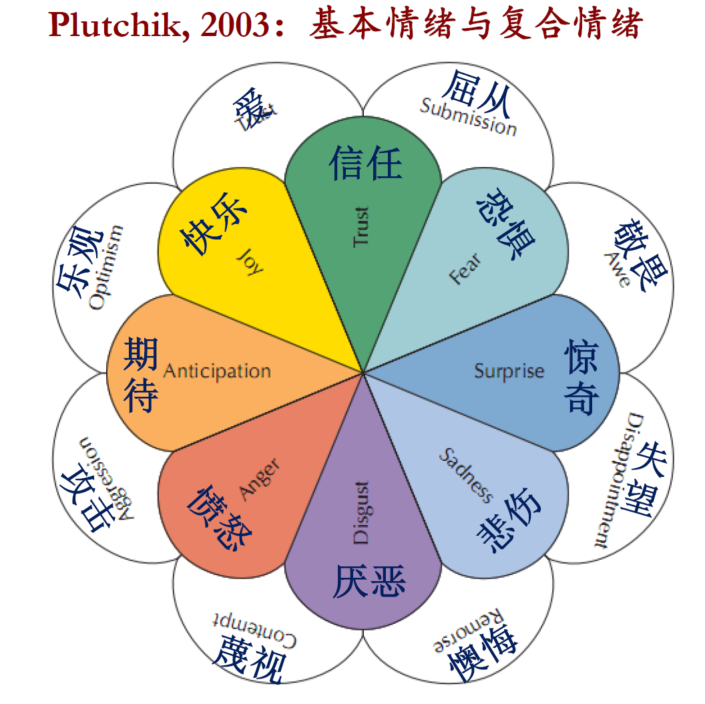

 

情绪维度理论：情绪具有多个维度，每种情绪在各个维度上具有不同的值

- Russell, 1980: 情绪分为两维度—愉快度和强度

    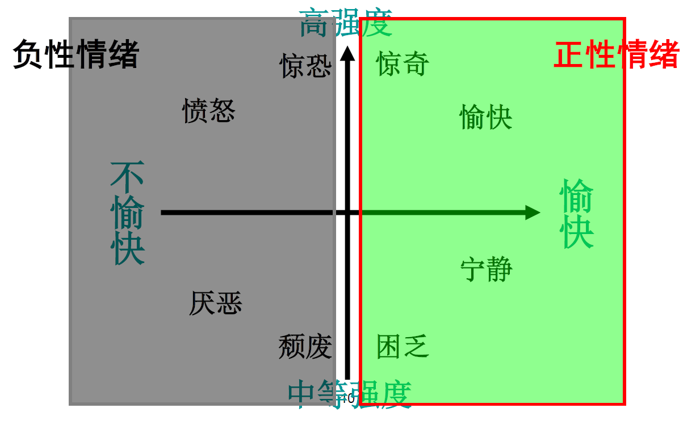

 

情绪的功能：

- 情绪是行动的指南针，可以指导行为，可以让个体快速趋利避害（恐惧情绪、密集恐惧症触发恶心情绪）
- 进化中细菌、寄生虫、昆虫等对人类产生过致命伤害。对潜在的致命/致病物体的恐惧、恶心能人们下意识地远离这些危险源，从而保护自己免受伤害
- 情绪指导行为和决策
- 社会功能：情绪通过外部表现（表情）表达自己的状况，通过识别情绪了解别人的状况

### 情绪与脑

控制情绪的两条神经通路：

    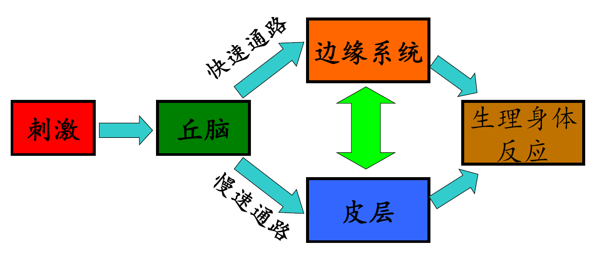

 

- 边缘系统（杏仁核、下丘脑、海马等皮层下神经核团）接受来自丘脑的感觉信息，快速处理情绪信号，对情绪信息进行下意识的、初步的判断/评价
    - 杏仁核接受丘脑视觉听觉等感觉信息，快速产生恐惧情绪，并受到皮层的调节

    

        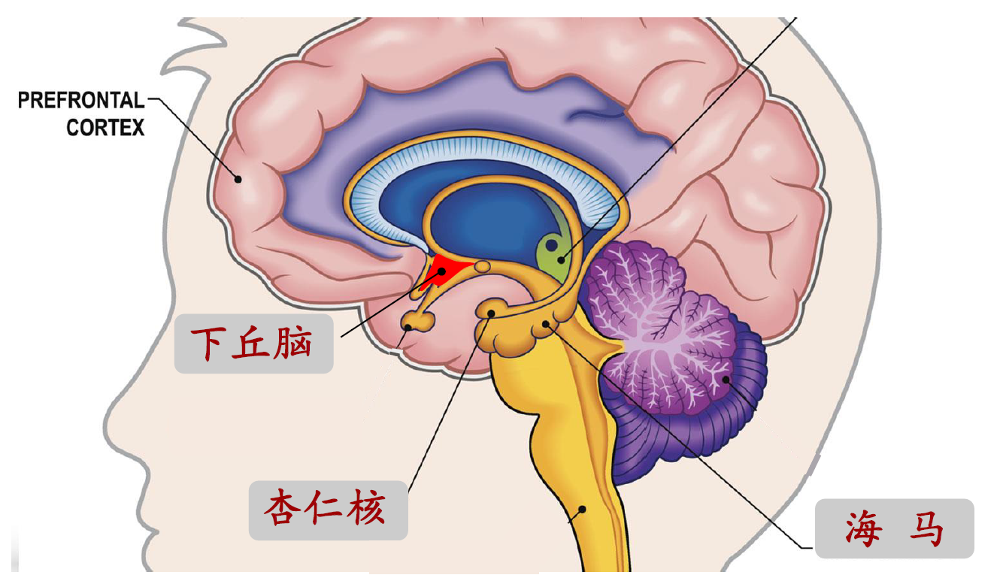
    
 

- 皮层对情绪的控制
    - 皮层对情绪进行归因、解释，调整边缘系统的情绪反应。皮层还负责指导更高级的行为，以应付情绪事件
    - 前额叶对情绪控制至关重要，额叶损伤会导致情绪异常
    - 皮层对情绪的控制（理智）往往很难战胜边缘系统对情绪的控制（本能）
    - 左右半球加工不同的情绪：积极情绪主要在大脑左半球加工，而消极情绪主要在大脑右半球加工。右脚比左脚更怕痒

情绪的外周机制：

- 神经系统

    

        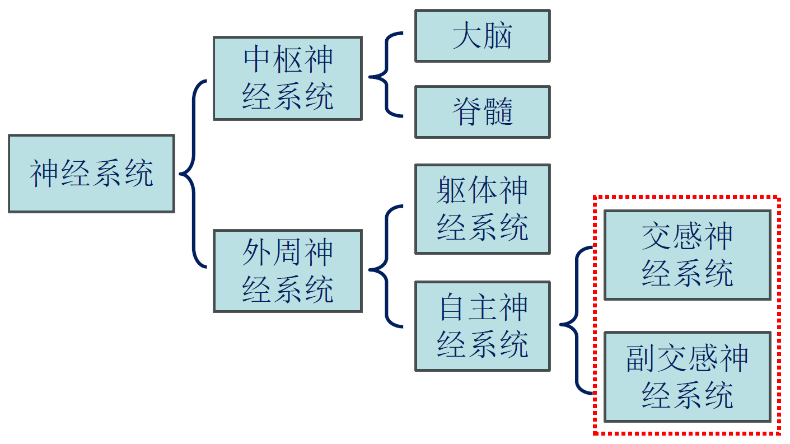
    
 

- 情绪与自主神经系统

    

        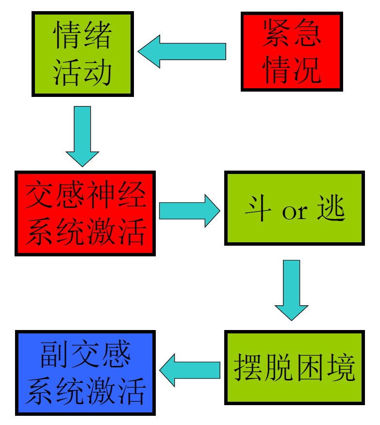
    
 

    - 情绪引起交感神经系统的反应，导致血压升高、心跳加速、凝血因子升高、瞳孔增大等等。这些生理变化帮助个体进行斗逃反应
    - 情绪事件过后副交感系统激活，平息情绪、放松身体、积蓄能量，使过快的心跳、升高的血压、张大的瞳孔复原
    - 经过激烈情绪之后，副交感神经系统可能会反应过度，如把血压降得太低。如受到惊吓之后感到眩晕
    - 副交感回弹：经过极端恐怖或其他激烈情绪之后，副交感神经系统可能会做出过度反应。回弹严重时可能引起猝死

- 情绪与生理信号
    - 人在平静时呼吸20次/分钟；愤怒时呼吸40—50次/分钟；突然惊惧时人的呼吸会临时中断，狂喜或悲痛时呼吸痉挛产生
    - 不同情绪状态下的呼吸情况：
        - 高兴：17次/分钟
        - 消极悲伤：9次/分钟
        - 积极的动脑筋：20次/分钟
        - 恐惧：64次/分钟
        - 愤怒：40次/分钟
    - 情绪引起皮肤电阻的变化
        - 费利效应(Fere effect)：由费利（1888）和泰赫诺夫（1890）发现：费利将两个电极接到前臂上，并把它同弱电源和一个电流计串联。他发现当用光或声刺激时，皮肤表面的电阻降低。
        - 当人在情绪状态时，皮肤内血管会舒张或收缩，汗腺分泌也会发生变化，这会引起皮肤电阻的变化。通过对皮肤电流的测量和记录，就可测定情绪反应。
    - 测谎：
        - 测谎仪（多重波动描记器）：是一种同时记录心率、血压、呼吸和皮肤电反应变化的多导仪

        

            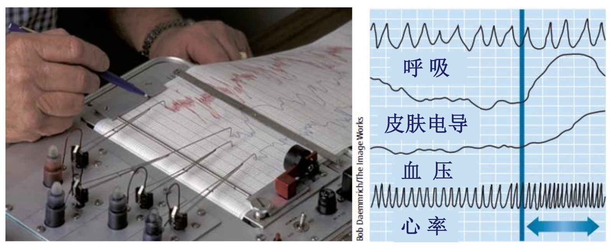
        
 

        - 测谎仪只能记录一般情绪变化引起的生理指标的改变，无法分辨说谎、害怕、焦虑或激动等不同情绪
        - 测谎器可提供判案的线索，但不能提供判决的根据

### 情绪的表达与理解

面部表情：

- 表情的交流作用：通过表情表达自己的情绪、了解他人的情绪。对愤怒等威胁性的表情识别更快

    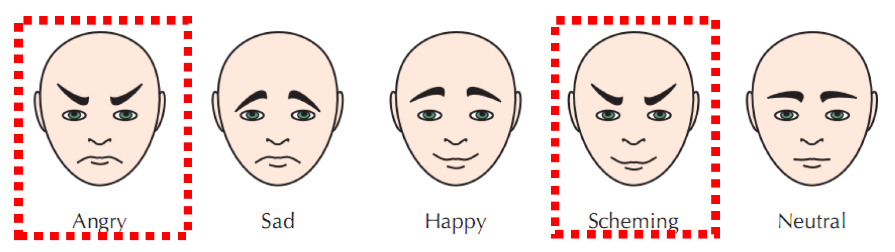

 

- 不同表情由不同的面部肌肉来决定：悲哀情绪显现在眼睛，快乐与厌恶表现在嘴部，惊愕表现在前额，愤怒表现在整个面部
- 几个月大的婴儿就能读懂别人的表情
- 社交表情—微笑(smile)
    - 杜氏笑容(Duchenne smile)：真正的微笑，具有极强的感染力，可预测幸福感（涉及到眼轮匝肌和颊肌的两个肌肉群）

表情是先天遗传还是后天习得：

- 达尔文《动物和人类的表情》1872，认为表情是进化的产物，因为很多动物有相似的表情
- 婴儿具有与成人相似的表情；盲人具有与正常人一样的表情
- 不同种族和文化用相似的表情表达情绪
- 7种跨文化的基本表情：高兴、惊奇、生气、厌恶、恐惧、悲伤、轻蔑
- 并不是所有表情都具有普遍性，某些表情具有文化特异性
    - 情绪表达的强烈程度、表达方式上的差异,可能是学习的结果；中国古代教育女子笑不露齿
    - 在集体主义文化中，消极情绪表达受到约束
    - 日本学生和美国学生独自在房间看恶心电影片段时具有相似的表情反应; 而当试验者在房间时，日本被试则用微笑掩饰自己的恶心表情
- 表情影响情绪——表情反馈理论：表情不但具有交流的功能，而且可以影响我们的情绪体验
- 表情可引起生理活动的改变
    - 愤怒的表情可提高心率和皮肤温度
    - 厌恶的表情可降低心率和皮肤温度

### 情绪理论

情绪的要素：

    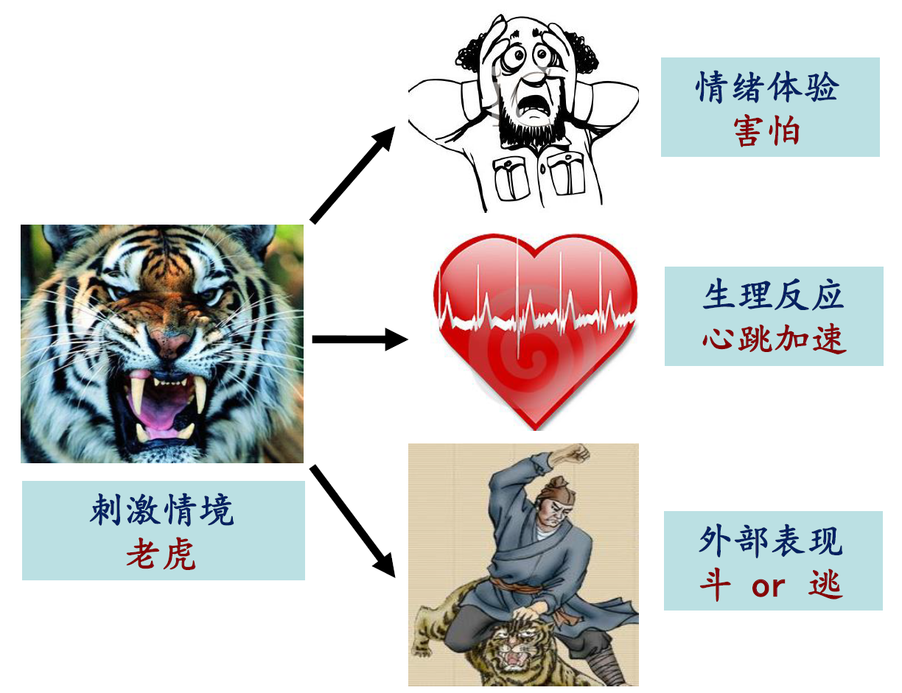

 

**詹姆士-兰格(James-Lange)理论**：刺激物引起自主神经的反应（如心跳、血压、呼吸等的改变），这些生理信息传送到大脑从而引起情绪体验。情绪的产生是自主神经系统活动的产物。

    

 

- 我们难过是因为我们哭；我们生气是因为我们打架；我们害怕是因为我们战栗
- 该理论可以解释表情影响情绪的实验结果；电击实验中作出面部表情的被试比不做出面部表情的被试更痛苦

**坎农-巴德(Cannon-Bard)理论**：情绪刺激首先激活丘脑，然后丘脑激活自主神经系统、下丘脑、大脑，从而产生生理唤醒、应对行为、情绪体验。这些过程相互独立。

    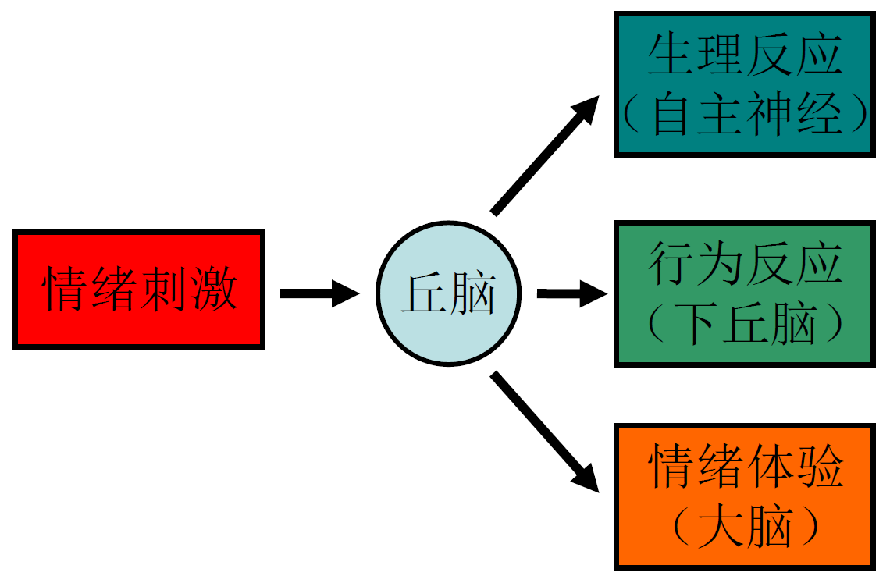

 

**情绪认知理论**：刺激本能并不能引起情绪，而是人们对事件进行评价或解释之后才产生情绪体验。

    

 

- 认知评价包括：对情绪刺激进行评价、对生理反应进行评价
- 错误的评价会引起错误的情绪体验
- 对刺激本身的评价影响情绪体验
- 对生理反应的评价影响情绪体验
    - 各种情绪体验会产生很类似的身体反应，对这些反应的评价决定了我们的情绪体验

### 调节负性情绪

- 焦虑、恐惧、愤怒等负性情绪成为现代人的健康杀手
- 70-80%的疾病与压力引起的负性情绪有关，压力由“生存机制”变成了“罪魁祸首”

    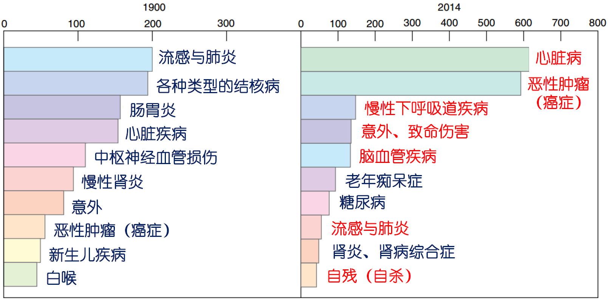

 

- 恐惧、愤怒等负性情绪，帮助身体调动能量，应对突发事件，摆脱困境，这对原始生存十分重要
    - 交感神经系统被唤醒，呼吸加快，心跳加速，消化系统血流量减少，四肢肌肉血液量增加，胆固醇水平上升
    - 肾上腺素系统被激活，血压被进一步提高，血液凝固速度加快
- 负性情绪不健康的方面：
    - 心理方面：现代的大部分压力源不需要提升血压、腿脚利索；负性情绪会干扰记忆、思维、决策等认知活动，不利复杂问题的解决
    - 身体方面：凝血因子和胆固醇会在压力来临之后飙升，血压高、凝血因子高、胆固醇高会在动脉内形成胆固醇凝块，使血管堵塞和硬化，引起心脏病
    - 应付压力事件会消耗能量，削弱免疫系统

如何应对负性情绪带来的影响：

- 压抑情绪不可取

    

        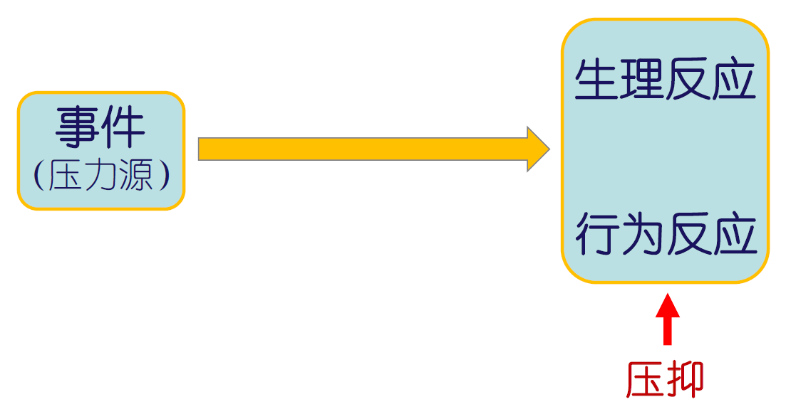
    
 

    - 抑制感情会导致交感系统生理指标上升

    

        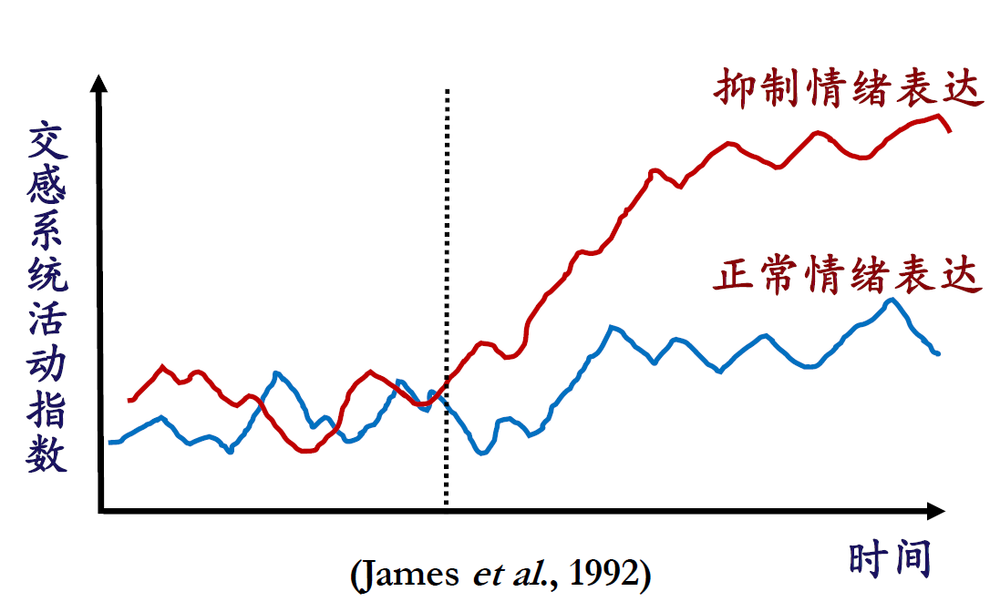
    
   

- 发泄情绪不可取

    

        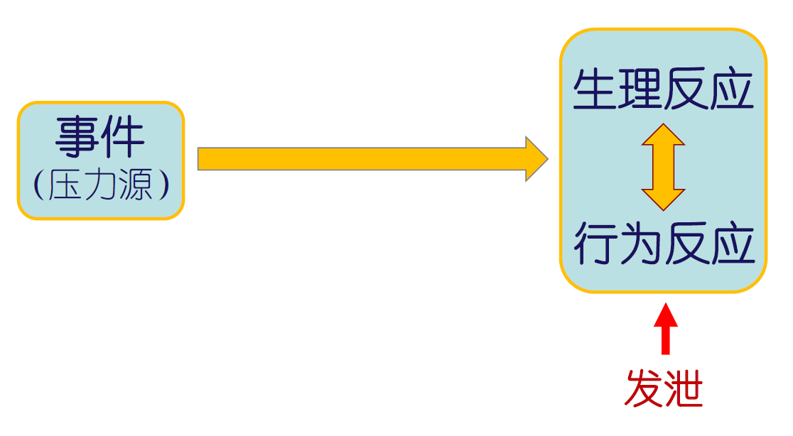
    
  

- 通过改变认知评价来削弱/消除负性情绪
    - 吊桥实验、注射肾上腺素实验都说明了认知可改变情绪

    

        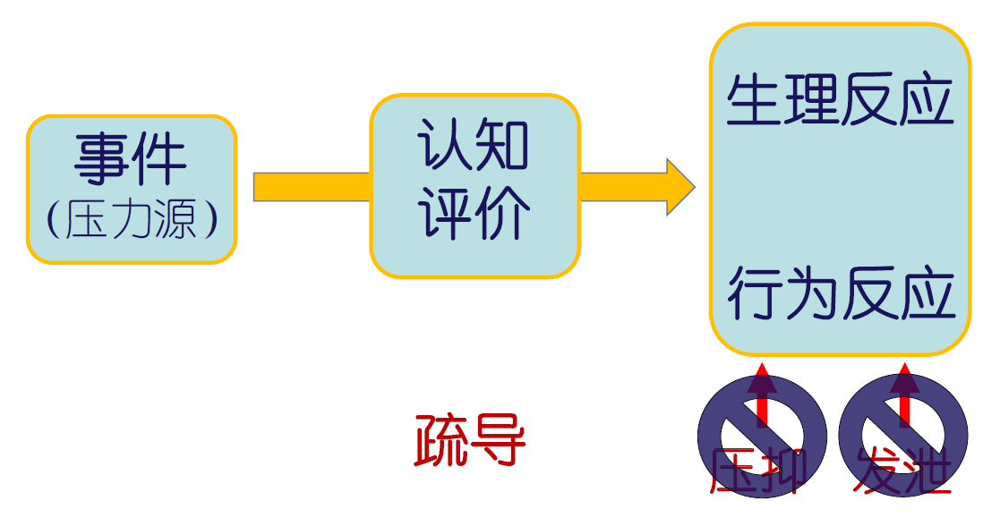
    

    - 认知三角：情绪、观念、行为互相影响

    

        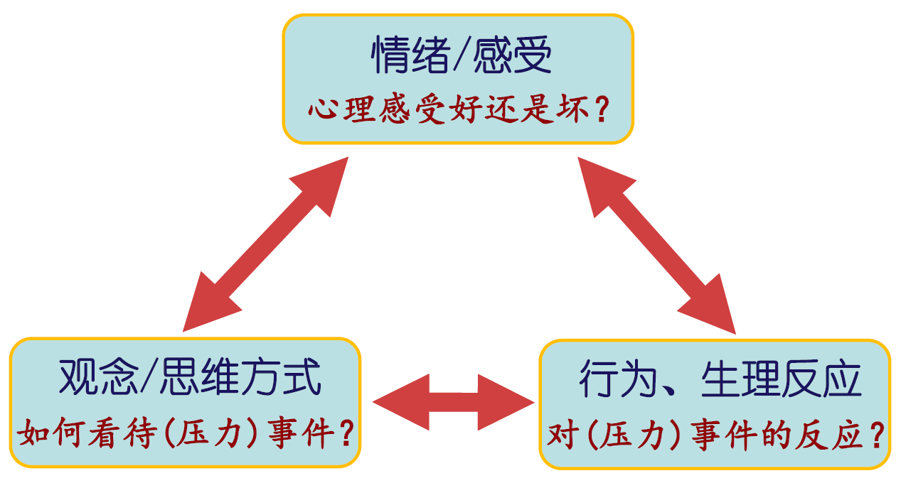
    
  

- 可操作性技巧：ABCD疗法
    - Activating event: 压力事件/情境
    - Beliefs: 自动化的信念
    - Consequences: 行为或情绪上的结果，直接源自于B
    - Dispute: 思辨，改变B中的负性思维，从另一个角度（正性）解释A

>There is nothing good or bad, but thinking makes it so.  -- William Shakespeare

## 意识

### 意识及其作用

**意识**(consciousness)作为当今科学最大的难题之一，仍然缺乏统一的理论对其作出解释，迄今为止没有一个准确而满意的定义。

意识涉及两个方面：

- 觉醒状态下，对外部和内部世界的觉知
    - 外部世界：感觉信息、外部环境中发生的一切
    - 内部世界：记忆、思维、决策等心理过程
- 对自己行为和心理进行控制和管理，从而调整自己的行为以改变外界环境，实现自己的目的

**自我意识**(self-consciousness)：指对自己作为一个有意识的、会思考的个体的觉知，进而将自己区别于周围的能力

意识的功能：

- 监督功能：监视当前的外部和内部状态，根据事情的紧急程度，排除干扰，集中大脑资源处理一件事
- 控制功能：计划、发起、引导、维持行为，与外界进行交互。需协调和沟通各个认知过程，交换各种心理过程的信息，对外界形成统一的、整体的表征

弗洛伊德的精神分析理论是最早的意识理论——**意识的冰山理论**

    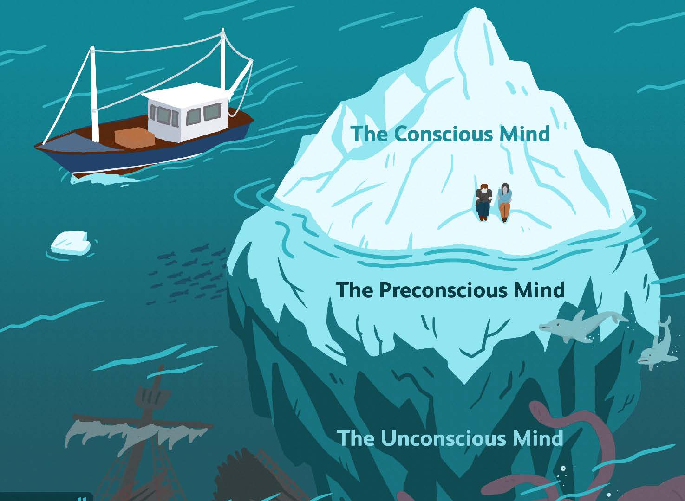

 

- **前（潜）意识**(preconscious)：当前不在意识之中，集中精力努力回忆和经过提醒，才能进入意识
    - 在精神分析理论中是介于意识和潜意识之间的一种意识层面，其作用是去除不为意识层面所接受的内容，并将其压抑到潜意识中去
    - 在认知心理学中是指储存在大脑内的经验、知识、记忆，这些信息可以被意识提取，进入意识
- **无意识**(unconscious)：在通常的情况下无法进入意识的内容，例如内心深处被压制的记忆、被抑制的本能欲望，以及被压制的冲动等
    - 弗洛伊德认为无意识的过程比意识更重要，对行为有深远的影响
    - 被压抑到无意识中的思想和冲动虽然不能进入意识，但它们会以间接或伪装的方式，例如通过梦、非理性行为、怪癖、口误等间接地干扰意识层面的行为
    - 弗洛伊德认为无意识的欲望和冲动是行为的动力，也是大部分心理疾病的根源

现代认知观点——无意识：

- 大部分心理学家同意存在无意识过程，但认为精神分析理论过分强调了无意识过程的（负面）情感色彩
- 心理和行为中的大量无意识过程对正常精神活动至关重要
- 现代科学心理学认为意识是非自动化的过程，而无意识则是自动化的过程
- 学习就是把行为由非自动化的意识过程转化为自动化的过程

### 无意识及其对行为的影响

- **盲视**(blindsight)：（对刺激的无意识）视觉皮层完全损毁的人还具有视觉能力

    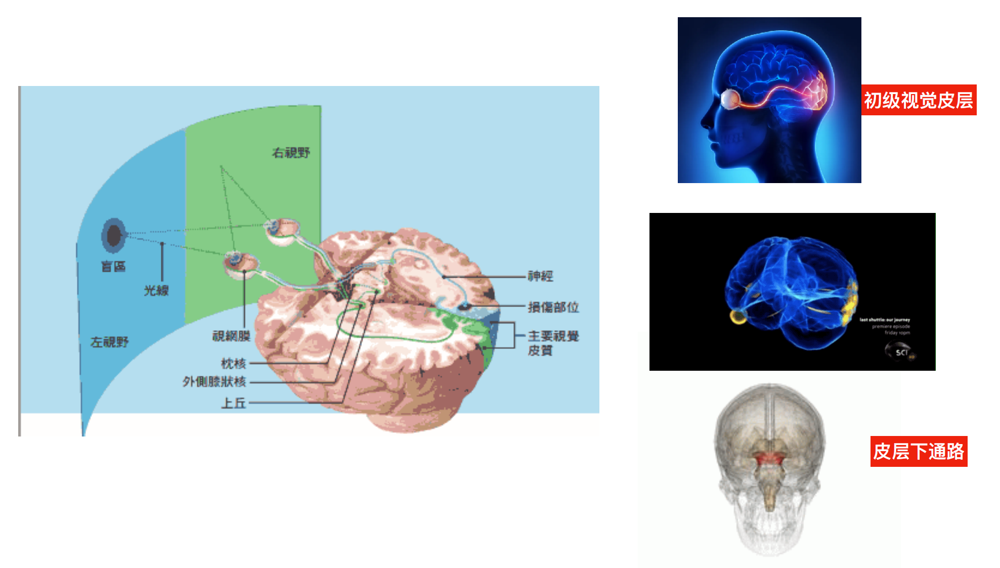

 

- **阈下启动**(subliminal priming)：阈下知觉与启动效应

    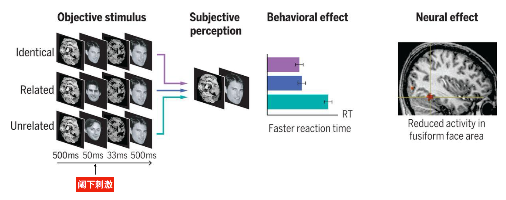

- **双眼竞争**(binocular rivalry)：当两眼视网膜所对应位置呈现的图像不一致时，我们的视知觉会在两只眼睛的图像之间随机地切换，而不是融合
    - 双眼竞争是一种刺激不变而知觉状态动态发生改变的视觉现象，研究视觉意识的重要工具

        

            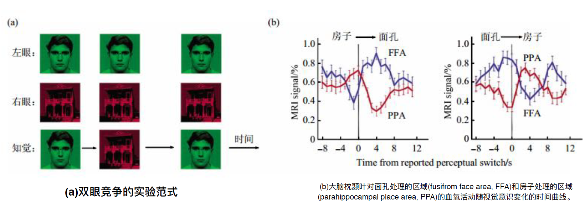
        

    - 无意识对决策的影响：

        

            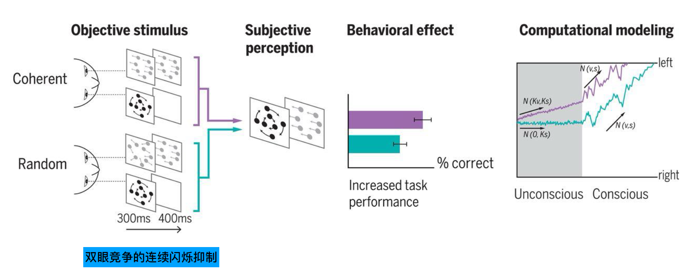
        

        - 外卖平台改动餐具选择用户界面这一绿色助推实践对于一次性餐具消费和减少塑料垃圾的影响

意识对无意识的控制：

意识的监视和控制作用催生了**自由意志**(free will)

- 监视作用(monitoring): 最重要、强度最大的刺激进入意识，这使得我们时刻了解周围以及自身的情况
- 控制作用(controlling): 计划、启动、引导、维持行为，让我们与外界进行有效的交互

举例：[斯特鲁普效应](https://en.wikipedia.org/wiki/Stroop_effect)(Stroop effect)

意识与无意识相冲突时, 有时意识难以战胜无意识：

- 无意识长期被意识压制，一旦意识减弱，无意识即会反弹
    - 举例：[白熊效应](https://wiki.mbalib.com/wiki/%E7%99%BD%E7%86%8A%E6%95%88%E5%BA%94)
- 在紧急情况下意识对无意识的控制往往会失效
    - 举例：口误

### 睡眠与梦

生物节律的周期性与意识状态：

- 意识的周期性波动与我们的生物节律(biological rhythm)和环境中的刺激模式相对应
- 下丘脑视交叉上核(SCN)对人体生理功能和心理状态的周期性变化起关键作用

**睡眠**是一种特殊的意识状态，人一生大约有三分之一的时间是在睡眠中度过。

- 睡眠的不可抗拒性与昼夜节律：睡眠是一种不可完全拒绝的生物节律。睡眠和觉醒节律是十分稳定的，即使在不知道时间和看不到昼夜交替的情况下也能持续多日

- 睡眠剥夺(sleep deprivation)：持续4天或4天以上不睡觉就会感到极为痛苦
    - 睡眠缺乏会对集中注意力、保持警觉、完成枯燥的任务造成影响。长期睡眠缺乏会引起大脑不可逆的损伤。
    - 睡眠是维持大脑正常运作的重要组成部分，对身心健康都发挥重要作用

- 睡眠时间
    - 短睡眠者：睡眠时间不超过5小时，占8%
    - 长睡眠者：平均每晚睡9小时以上
    - 美国国家睡眠基金会建议，成年人（18~64岁）每天睡眠时间7~9小时
    - 随着年龄的增长，睡眠时间逐渐减少

- 睡眠的功能：
    - 补充物资
        - 能量供应：睡眠是补充清醒状态下消耗的资源的重要时期
        - 神经递质的供应：大部分神经细胞通过化学突触传递信息，神经递质分子在传递后大多被销毁，需要源源不断的补充
        - 蛋白质和mRNA的供应：神经活动不仅消耗能量和神经递质，还会导致与神经活动相关的蛋白质受损，需要蛋白质和mRNA的补充来修复和维持功能
    - 清除废物
    - 修复和调整
        - 睡眠期间，大脑中的废物清除系统被激活，清除神经活动产生的废物，如Aβ、tau、α-synuclein等蛋白
        - 清醒状态下的工作可能导致神经细胞损伤和改变。睡眠期间，神经系统进行自我修复，调整神经细胞的功能，以维持其正常工作

- 睡眠生理信号的测量：

    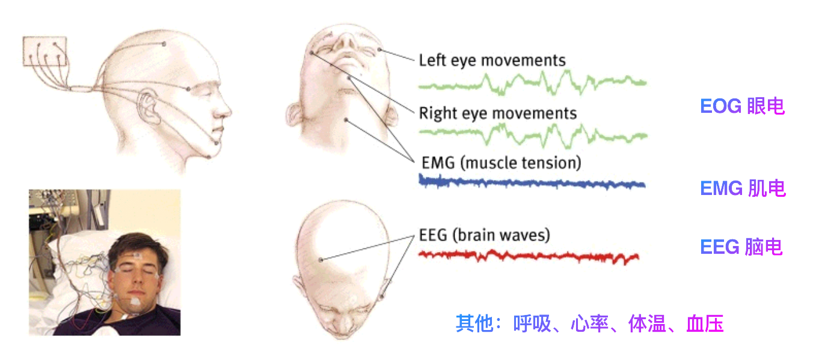

- 睡眠的五个阶段：

    

        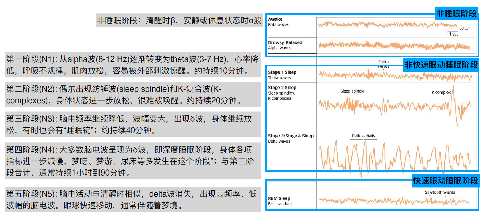
    

    - 人类睡眠周期的两个时相：
        - 快速眼动睡眠期(REM)：REM每晚合计大约90分钟，在REM阶段被叫醒，85%的人会报告生动的梦境。大脑非常活跃，看起来像醒着，REM期间肌肉松弛。哺乳动物都有REM，但爬行类没有
        - 非快速眼动睡眠期(NREM)：在NREM阶段90%的时间没有梦，REM的梦持续时间更长，更清晰离奇。白天的体力消耗大，NREM增加；精神压力大，则REM增加
        - 梦游（梦惊）发生在第四阶段睡眠，多出现在儿童身上；梦（梦魇）发生在REM阶段睡眠

    - 睡眠阶段周期地交替：约90分钟一个睡眠周期，第4阶段睡眠时间减少，快速动眼期睡眠时间增加

    

        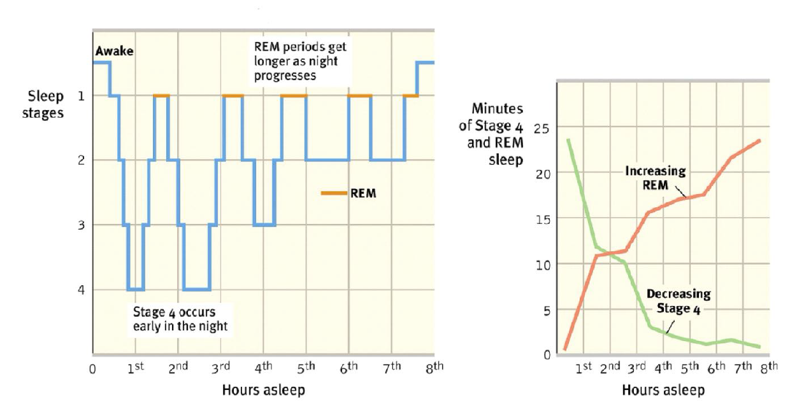
    

    - 不同生命时期睡眠模式有差别：

    

        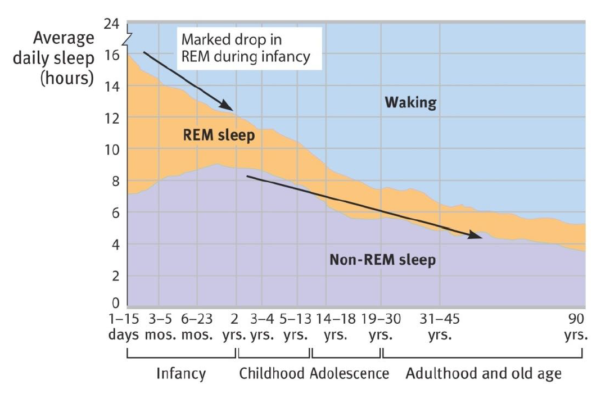
    

---
**梦**：

- 抑制做梦对人的影响——做梦剥夺实验：被试每次进入REM睡眠时即被唤醒，很快，他们做梦的需求增加，到第5个晚上，有人被唤醒20-30次。当允许被试无干扰地睡眠之后，他们的REM睡眠大大增加，这被称为快速眼动睡眠反弹（REM-rebound）
    - REM睡眠可能与脑内神经联结的形成有关，新生儿每天8-9小时是REM睡眠。REM睡眠可帮助整合白天的记忆

- 做梦的原因：
    - 梦是潜意识的流露：
        - 在睡眠时，意识对无意识压制产生松懈，无意识中的欲望绕过抵抗，并以伪装的方式，乘机闯入意识而形成梦。可见梦是对清醒时被压抑到无意识中的欲望的一种委婉表达
        - 梦是通向潜意识的一条秘密通道。通过对梦的分析可以窥见人的内部心理，探究其潜意识中的欲望和冲突。通过释梦可以治疗神经症
    - 梦是大脑活动的副产物：
        - 活化-合成理论(acitivation-synthesis theory)：
            - 梦是前脑对脑干随机输出的反应，是大脑试图理解REM睡眠期间发生的神经活动的副产物
            - 通常情况下，一定数量的刺激对脑与神经系统的正常功能是必要的。睡眠情况下，刺激减少，神经系统产生一些随机活动，梦就是认知系统对这些随机活动进行解释并赋予一定意义的过程
        - 大脑会在梦境中巩固积极情绪（梦可以处理负面情绪）
            - REM睡眠与前额叶皮层锥体神经元胞体-树突解耦(somatodendritic decoupling)有关。树突的强烈活动允许对危险和安全情绪进行编码，而胞体的抑制作用在REM睡眠期间完全阻止了神经回路的输出
            - 大脑倾向于在树突中辨别安全与危险，但阻止对情绪的过度反应，特别是危险
    - 梦是为了删除无用的记忆：
        - 反向学习(reverse learning or unlearning)理论
            - 梦也擦除了大脑中无用的节点和其他“垃圾”
            - 神经活动的抑制：反向学习通过主动忘却无效信息，保证我们的皮层或大脑容量不至于在演化过程中随着信息处理量的增加而不断增加
            - 突触的调整：反向学习可以改变皮层连接，从而使这些不当的神经活动在未来不太可能发生。例如，如果需要突触强化才能记住某件事，那么在REM睡眠中，反向学习就会削弱突触，从而剔除不必要的神经联系

- 睡眠与学习：
    - 学习之后，当天的睡眠对学习的巩固至关重要。成绩提高与慢波睡眠和REM相关
    - 睡眠不足或睡眠中断会导致海马尖波涟漪(sharp-wave ripple，SWR)紊乱，破坏神经元同步活动引起的神经振荡活动，阻碍神经元放电模式的重激活和回放，从而阻止记忆进入长期存储

    

        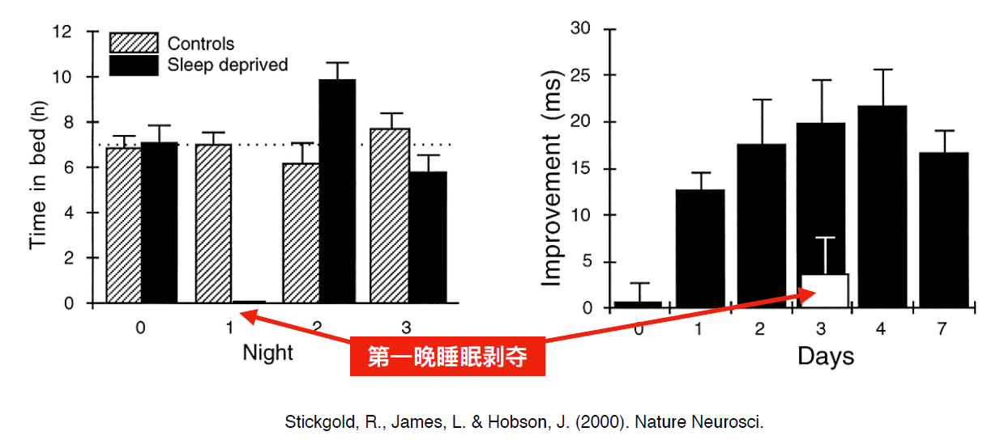
    

## 注意

### 概念与功能

**注意**(attention)：⼼理活动或意识对⼀定对象的**指向与集中**，是⼀种对各种信息进⾏筛选过滤的认知过程。

- 指向性：⼼理活动或意识在某个瞬间，选择了某个对象，⽽忽略了另外⼀些对象
- 集中性：⼼理活动或意识在某个⽅向上的活动的强度和紧张度，⼼理活动或意识的强度越⼤，紧张度越⾼，注意也就越集中

需要注意的原因：

- 变化盲(change blindness)和未注意盲(inattentional blindness)现象表明每⼀时刻我们忽略掉了⼤部分信息。
- 我们接收的信息输⼊远超过⼤脑的处理能⼒。⼤部分时候只能处理⼀⼩部分信息。没有注意⼒的引导，我们⽆法有效处理所有感官输⼊。

注意的功能：

- **选择功能**：⼈的⼼理活动指向那些有意义、符合需要、与当前活动相⼀致的有关刺激，避开或抑制那些⽆意义的附加刺激和信息。
- **保持功能**：当对外界信息进⼊知觉、记忆等⼼理过程加⼯时，注意能够把已经选择了的有意义、需要⼯的信息保持在意识之中。
- **调节和控制**：注意使个体的活动朝向⽬标和⽅向，并根据需要适当分配和适时转移，使⼈对外界事物或⾃⼰的⾏为、思想、感反映清晰和准确。

“被注意”和“不被注意”的不同命运：

- 被注意：信息加⼯得到易化，表现为反应速度加快、正确性提⾼、知觉更清晰。
- 不被注意：信息加⼯不充分，或被抑制，表现为反应速度减慢，正确性降低，知觉模糊，甚⾄不可⻅、不能被意识到。

### 特征与分类

注意的种类：

- 根据注意有⽆⽬的以及意志努⼒的程度分类
    - 随意注意（有意注意）
        - ⾃上⽽下，主动性注意
        - 积极的、内源性的、根据主观意图或⽬的
    - 不随意注意（⽆意注意）
        - ⾃下⽽上，反射性注意
        - 消极的、外源性的、不依赖于主观意图或⽬的，由突然出现的刺激引起

- 根据注意的功能分类
    - 选择性注意(selective attention)：在同一时刻只对有限的信息给予注意而忽视其他信息
    - 分配性注意(divided attention)：同一时间内把注意指向不同的对象和活动。对不熟悉的操作，分配注意相当困难。但对于自动化行为，分配注意较容易
    - 持续性注意(substained attention)：在一段时间之内，持续地把注意力集中在某个客体或事物之上

注意的选择：

- 自下而上：**刺激物**本身的特点，即刺激的物理属性，包括刺激物的新异性、相对强度、运动变化及刺激物与背景的差异。
- 自上而下：人本身所处的状态，即⼈本身的状态，包括⼈对事物的需要和兴趣，积极的情感态度，个⼈的情绪状态、精神状态、⼼境和主观期待。

负启动效应(negative priming)：当探测刺激与先前被忽略的启动刺激相同或相关时，对探测刺激的反应变慢或准确度下降。

注意的分配是有条件的，受到⼏种活动的复杂程度、熟悉程度和⾃动化程度的影响。

- 双作业任务(dual-task performance)

    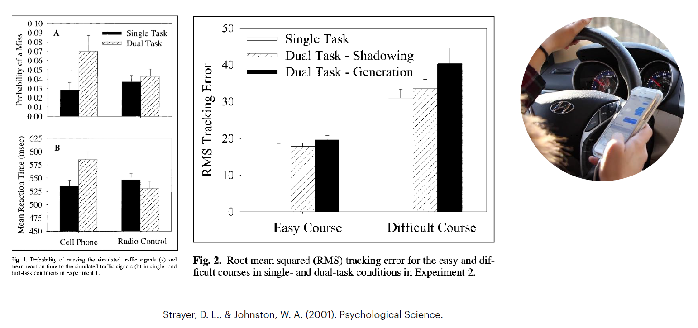

注意的稳定性：注意在同⼀对象或活动上所保持时间的⻓短

- 注意不稳定表现为注意分散(也叫分⼼): 注意**不⾃觉**地离开当前应当完成的活动⽽被⽆关刺激所吸引。
- 持续性注意：持续性注意通常使⽤警觉任务测量

    

        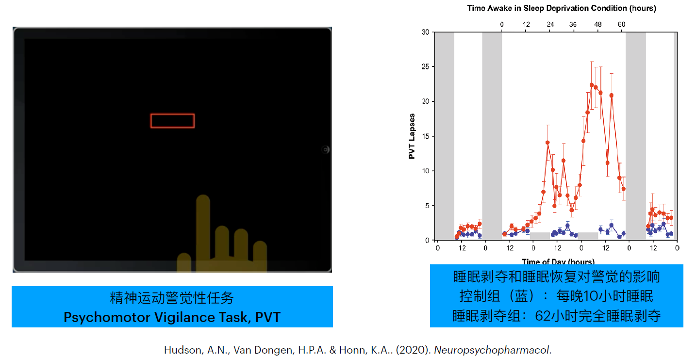
    

    - 注意的起伏：注意时强时弱的周期性变化的现象
        - 正时相: 感受性提⾼
        - 负时相: 感受性降低
        - 起伏的速度: 周期平均约8～10秒。
    - 原因：感觉器官的局部适应，使其对物体的感受性交替⽽短暂地下降；有机体的⼀系列机能活动都具有节律性，注意的动摇是由于机体的这种节律性造成的。

注意的转移：根据活动任务和要求，⼈有意地把注意从⼀个对象转移到另⼀个对象上，或从⼀种活动转移到另⼀种活动上。

注意与意识的关系：

- 注意是⼀种⼼理活动或“⼼理动作”，⽽意识主要是⼀种⼼理内容或体验。只有被注意到的内外刺激，才能被个体所觉察，进⽽产⽣意识。
- 在可控制的意识状态下，⼈的注意集中在当前有意义的内容上,得到⽐较清晰和深刻的认识。⾃动化的意识状态要求很少的注意，意识的参与成分也相对较少。

    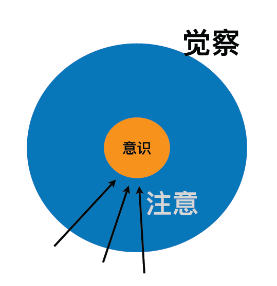

### 认知理论

**选择过滤**：注意受⼈的信息加⼯系统的限制，某些特定类型的输⼊信息可以通过过滤器得到进⼀步的加⼯⽽得到识别，⽽其他的信息则不能通过。

注意的选择与过滤模型：

- 过滤器模型(filter model)（单通道、早期选择理论）

    

        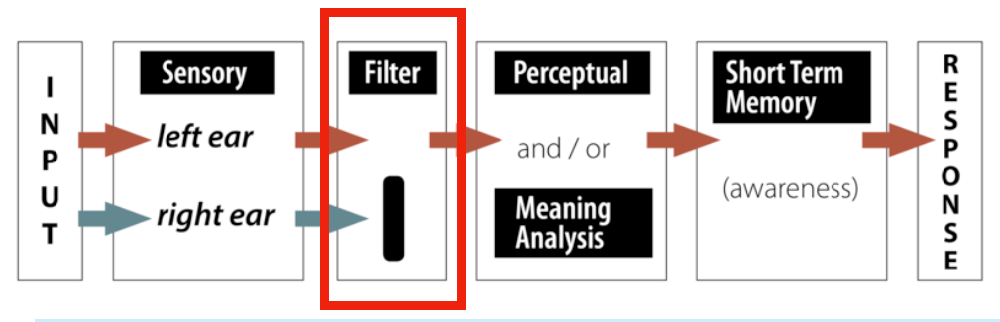
    

    - 提出者：英国⼼理学家布罗德本特
    - 神经系统在加⼯信息的容量⽅⾯是有限度的。当信息通过各种感觉通道进⼊神经系统时，要先经过⼀个过滤机制。 只有部分信息可以通过这个机制，接受进⼀步加⼯，其他信息被阻断在外⾯，完全丧失。
    - 过滤器按照“**全或⽆**”的⽅式进⾏⼯作，⼀个通道通过信息的同时就关闭其他通道。
    - 过滤器位于语义分析(知觉)之前(**早期选择**)；对输⼊信息的通过或拒绝完全是由刺激的**物理属性**决定的。

    - 局限：过滤器⽆法解释对有意义材料的信息加⼯和注意分配。
        - [鸡尾酒会效应](https://en.wikipedia.org/wiki/Cocktail_party_effect)(cocktail party effect)
        - 追随⽿任务：
            - 什么能被⾮追随⽿听到？
                - 声⾳是否出现
                - 声⾳的性别转换
                - ⼈声变成声调
            - 什么不能被⾮追随⽿听到？
                - 语义信息
                - 信息的语⾔（中、法、英）
                - 语⾔的变换（中切英）
                - 演讲顺序 vs 倒序

- 衰减模型(attenuation model)

    

        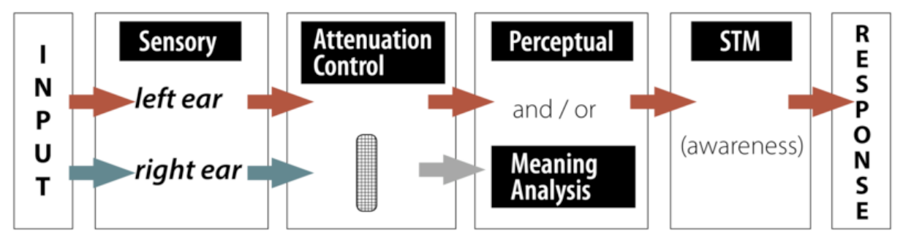
    

    - 承认过滤器的存在，即⾼级分析⽔平的容量有限，必须由过滤器加以调节
    - 过滤器不是按照“全或⽆”的⽅式⼯作，当信息通过过滤装置时，不被注意或⾮追随的<u>信息只是在强度上减弱了，⽽不是完全消失</u>
    - ⻓时记忆中的项⽬具有不同的**激活阈值**。特别有意义的信息（如⾃⼰的名字）具有较低的激活阈值，容易被激活

???+ note "过滤器模型 vs 衰减模型"

    - 相同点
        - ⾼级认知加⼯的容量是有限的，需要过滤器来调节信息流
        - 过滤器处于初级的物理特征分析和⾼级的意义分析之间
        - 过滤器的功能是**选择**⼀部分信息进⼊⾼级知觉分析⽔平，使之得到识别
        - 注意的选择是**知觉**性质的，因此统称为知觉选择模型

    - 不同点
        - 过滤器的功能不同：过滤器理论把注意的选择视为对刺激的**物理特征**的分析；衰减理论认为注意的输⼊既存在对刺激的物理特征的加⼯，也存在对刺激的**意义(语义)**的⾼级加⼯处理。
        - 过滤器的⼯作⽅式不同：过滤器理论认为过滤器是按“**全或⽆**”原则进⾏操作的，未被选择的信息通道是关闭的；⽽衰减理论认为⾮追随通道的信息只是**衰减**了，在达到兴奋阈限时仍可被识别。

- 后期选择模型(late selection model)

    

        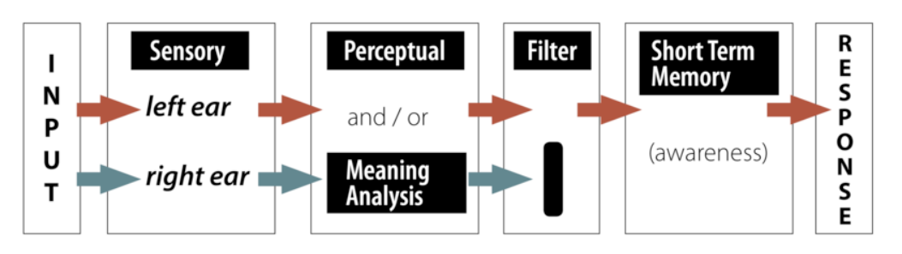
    

    - 由莫顿·多伊奇（Morton Deutsch）等⼈于1963年提出，后由诺曼（Norman）在1968年修订。
    - 过滤器位于知觉和⼯作记忆之间，⽽不是在感知的早期阶段。该模型认为所有的选择性注意都发⽣在信息加⼯的**后期**，即在知觉和⼯作记忆之间。
    - 所有输⼊感觉通道的刺激信息都可以进⼊⾼级分析⽔平阶段，得到全部的知觉加⼯和处理。选择性加⼯主要发⽣在决策或反应阶段，基于信息的**意义和相关性**。

??? note "上述三种模型的比较"

    

        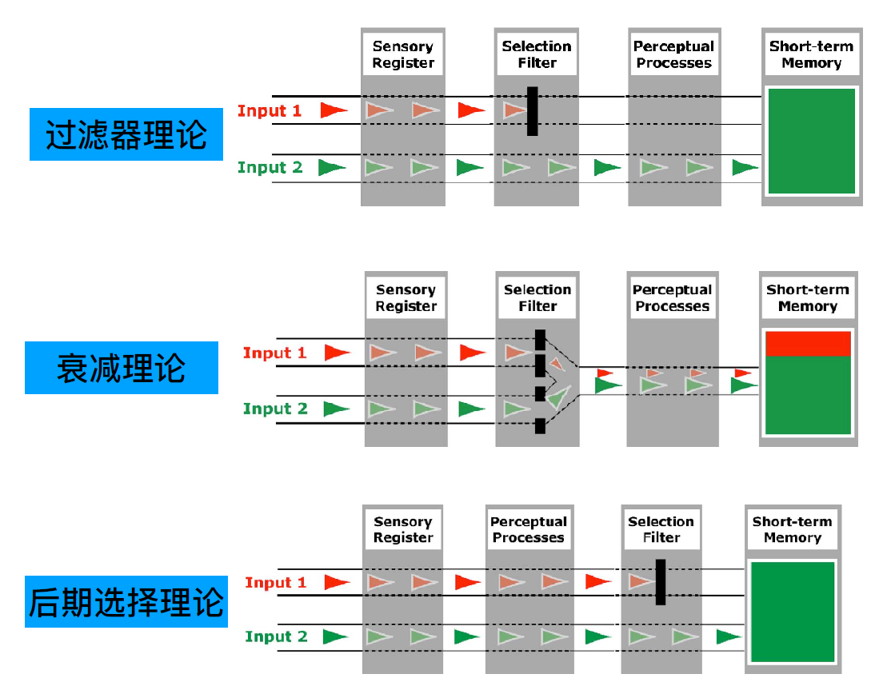
    

- 多阶段选择模型(multi-stage selection model)
    - 约翰斯顿（Johnston, 1978）等⼈提出了多阶段选择理论模型，这是⼀个更为灵活的模型，认为选择过程可以在不同的加⼯阶段发⽣。
    - 早期选择可能基于刺激的物理属性，⽽晚期选择则涉及中央控制器的主动预期，是⻓时记忆中特定项⽬⾼度激活的产物。
    - 这⼀理论模型包括两个主要假设：
        - 第⼀，在进⾏选择之前的加⼯阶段越多，所需要的认知加⼯资源就越多；
        - 第⼆，选择发⽣的阶段依赖于当前任务的需要。

注意分配与认知资源：

- 认知资源理论(capacity model)
    - 丹尼尔·卡尼曼（Daniel Kahneman）把注意看作是⼀组对刺激进⾏归类和识别的认知资源或认知能⼒。
    - **资源有限性**：注意资源是有限的，识别刺激要占⽤资源刺激越复杂，占⽤资源越多，当认知资源完全被占⽤时，新的刺激将得不到加⼯（或注意）。
    - **资源分配机制**：刺激本身并不能⾃动地占⽤认知资源，⽽是通过认知系统中的⼀个资源分配机制进⾏分配，⼈可以根据情境灵活地把资源分配到重要刺激上。

    

        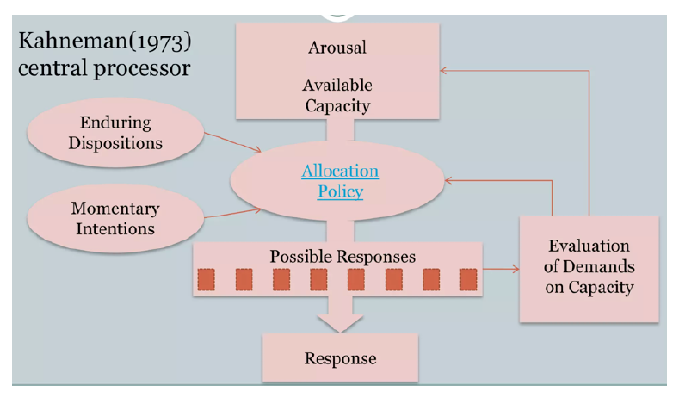
    

- 注意瞬脱(attentional blink)：当辨别快速呈现的视觉刺激流中的两个刺激⽬标时(T1与T2)，对T1的准确识别，会影响到其后对特定时间间隔(200-500ms)的刺激识别(T2)。当两个刺激（如T1和T2）的时间间隔较短时，第⼀个刺激（T1）的处理会占⽤⼤量的认知资源，从⽽使得第⼆个刺激（T2）⽆法得到充分的处理。

- 双加工理论(dual-processing theory)：由Shiffrin和Schneider在1977年提出。该理论区分了两种不同的认知加⼯过程。
    - ⾃动加⼯(automatic processing)：不受认知资源的限制，不需要注意，是⾃动进⾏的。
    - 控制加⼯(controlled processing)：受认知资源的限制，需要注意的参与，可以随环境的变化⽽不断进⾏调整。