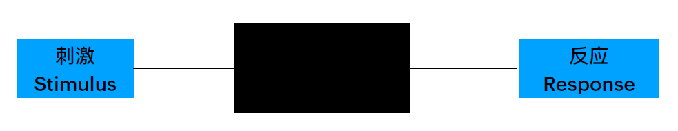

# Part 3

## 能力

### 概念

**能力**的概念：

- 能⼒是⼀种**⼼理特征**，是顺利实现某种活动的基本⼼理条件
- 能⼒是**直接影响活动效率**，使活动得以顺利进⾏的⼼理特征
- 能⼒是掌握知识、技能的基础，⼜是掌握知识、技能的结果

**智力**的概念：

- 智⼒是抽象思维能⼒
- 智⼒是个⼈为适应环境⽽进⾏学习的能⼒
- 智⼒是从真理和事实的观点出发，靠正确反应所获得的能⼒
- 智⼒是获得知识的能⼒
- 智⼒是应⽤认知技能和知识，学习解决问题及实现个体或⽂化认为重要的⽬标的能⼒
- 智⼒是指与环境拟和的能⼒, 是有⽬的的适应环境、塑造环境、与选择环境的能⼒

智力理论：

- 心理测量观点：认为智⼒由基本元素或成分构成，主要探讨智⼒究竟有哪些元素或成分
    - 以⼼理测量统计分析的经验发现为出发点，提出智⼒的成分和结构
    - ⼼理测量的主要⼯具是**因素分析**(factor analysis)，⽤来从⼤量不同测量中找到共同因素
    - 代表理论：
        - 斯⽪尔曼：**二因素论/G因⼦**
            - **一般智力**（G(General)因素）：⼈的基本的⼼理潜能，是决定⼀个⼈能⼒⾼低的主要因素
            - **特殊智力**（S(Special)因素）：保证⼈们完成某种特定作业或活动所必需的能⼒

            

                
                
            
 

        - 卡特尔：流体智⼒与晶体智⼒
            - **流体智⼒**(fluid intelligence)是个体通过遗传获得的在信息加⼯和问题解决过程中所表现出来的能⼒。主要和神经⽣理的结构和功能有关，很少受社会教育影响，依赖于先天的秉赋。    
            - **晶体智⼒**(crystallized intelligence)则主要是后天获得的，受⽂化背景影响很⼤，与知识经验的积累有关，是流体智⼒运⽤在不同⽂化环境中的产物。
            - 衰老对流体和晶体智力的影响
                - 流体智⼒随⽣理成⻓曲线⽽变化，到20岁左右达到⾼峰，30岁以后将随年龄的增⻓⽽降低。
                - 晶体智⼒不因年龄增⻓⽽降低，有些⼈由于知识与经验的累积，其晶体智⼒反⽽呈随年龄增⻓⽽升⾼的趋势

            

                
            
 

        - 瑟斯顿：**智力群因素理论/大脑基本能力**
            - 智⼒是由七种平等的基本能⼒或原始能⼒构成的，不存在⼀般的因素
            - 然⽽研究表明，这七种⼼理能⼒之间都有不同程度的正相关，这在⼀定程度上⽀持了⼆因素理论提出的存在⼀般因素的观点

            

                
            
 

- 加德纳多元智力理论：
    - “智⼒是在某种⽂化环境的价值标准之下，个体⽤以解决问题与⽣产创造所需的能⼒”
    - 智⼒的内涵是**多元**的，由**8种相对独⽴**的智⼒成分构成，每种智⼒都是⼀个单独的功能系统，这些系统相互作⽤产⽣外显的⾏为
    - “每个孩⼦都是⼀个潜在的天才⼉童，只是经常表现为不同的形式。”

    

        
    
 

- 信息加工观点：
    - 认知观点从成分分析转移到内部⼼理过程的探讨上，研究**智⼒操作的⼼理机制**，把智⼒活动看作⼀个过程，由不同阶段组成，并由更⾼的决策过程组织起来
    - 认知观点试图探测智⼒⾏为背后的**具体认知过程**
    - 代表理论：
        - 斯腾伯格的智⼒三元理论
            - 智⼒被看作是“指向有于⽬的地适应、选择、改变与个体⽣活有关的现实环境的⼼理活动”
            - 智⼒三元理论试图解释认知活动中所需要的能⼒。个体之所以有智⼒上⾼低的差异，是因其⾯对刺激情境时个⼈对信息处理的⽅式不同
            - 按智⼒三元论的主张，⼈类的智⼒乃是由互相连接的三边关系组合的智⼒统合体
                - 情境亚理论：智力成分的外部作用
                - 经验亚理论：智力成分与经验的关系
                - 成分亚理论：智力的内在成分

            

                
            
 

        ???+ info "成功智力"

            成功智⼒: 是⽤以达到⼈⽣中主要⽬标的智⼒，它能导致个体以⽬标为导向并采取相应的⾏动，是对个体的现实⽣活起到举⾜轻重影响的智⼒。
            
            - 分析性智⼒(analytical intelligence): 问题解决、理性判断、以及对观点进⾏⽐较和对⽐的能⼒ (“书本智慧”)
            - 创造性智⼒(creative intelligence): 产⽣新观点并看出概念间新关系的能⼒
            - 实践性智⼒(practical intelligence) : 解决实际⽣活种问题的能⼒，包括使⽤、运⽤以及应⽤知识的能⼒（“街头智慧”）          

        - 智⼒的PASS模型
            - 最高层次——计划：涉及设定⽬标、制定策略、监控进展和调整策略以达成⽬标
            - 基础层次——注意：所有认知活动开始的前提
            - 信息加工系统（中间层次）
                - 同时性加工：涉及同时处理多个信息元素的能⼒，这通常与空间和视觉信息处理相关
                - 继时性加工：涉及按顺序处理信息的能⼒，这通常与时间序列和语⾔信息处理相关

            

                
            
 

!!! abstract "智力理论小结"

    - 智⼒的因素学说认为智⼒由基本元素或成分构成，主要探讨智⼒究竟有哪些
    元素或成分。智⼒的因素学说是把智⼒看作各种成分组成的复杂体。
    - 智⼒的认知理论主要是针对智⼒的因素学说，认为因素学说只关注⼼理活动
    的结果，对产⽣结果的⼼理活动的过程不关⼼。认知⼼理学主要研究⼈内部
    的⼼理过程，对智⼒内涵的揭示要考虑其内部⼼理过程。

### 智力的测量

- 高尔顿：⻄⽅智⼒测验发展的⿐祖
    - 《遗传的天才》、《⼈类的才能及其发展研究》
    -  “优⽣学”
    - 建⽴第⼀个“⼈体测量实验室”

    

        
    
 

- **⽐纳-⻄蒙量表**：第⼀个正式的智⼒测验
    - 系统采⽤测验⽅法来测量⼈的智⼒，是在本世纪初由法国⼼理学家⽐纳(A.Binet)和医⽣⻄蒙(T.Simon)提出来的
    - 1905年，⽐纳在⻄蒙的帮助下，编制了**世界上第⼀个智⼒测验量表**。1908年，⽐纳和⻄蒙对其量表进⾏了第⼀次修订，终于形成了著名的《⽐纳-⻄蒙智⼒量表》
    - 1908年，量表经过修订增加到59个题⽬，适⽤于3～15岁；并按年龄分组，采⽤**智⼒年龄**(mental age)来计算成绩

- **斯坦福—⽐纳量表**
    - 历史：
        - 1916年，美国斯坦福⼤学教授推孟(L. M .Terman)将⽐纳—⻄蒙量表介绍到美国，并修订成**斯坦福—⽐纳量表**
        - 1937、1960和1972年，斯坦福—⽐纳量表⼜经过了三次修订，它是⽬前世界上最⼴泛使⽤的量表之⼀
    - 智⼒年龄(mental age, MA)简称智龄，即受测者通过测验项⽬所属的年龄
    - 智⼒年龄只能提供个体智⼒发展的绝对⽔平，⽽不能直接⽐较不同年龄⼉童的智⼒⽔平。相同智⼒年龄的⼉童可能因为实际年龄不同⽽具有不同的智⼒潜⼒
    - 为了克服⽤智龄作指标的局限性，推孟在修订斯坦福—⽐纳量表时，采⽤**智商**(Intelligence Quotient, IQ)作为智⼒的指标。
    - 智商的概念是由德国⼼理学家Stern⾸先提出来的，其计算⽅法如下：$IQ = \dfrac{智龄}{实龄} \times 100$
    - 智商是智⼒年龄和实际年龄(chronological age, CA)的⽐率，故⼜称为⽐率智商(ratio IQ)
    - 按⽐率智商，IQ远远⼤于100，表示智⼒偏⾼，IQ在100上下，表示智⼒中等，IQ远远⼩于100，则说明智⼒较低
    - ⽐率智商适⽤于⼉童却不适⽤于成⼈

- **离差智商**(Deviation IQ)
    - 美国⼼理学家⻙克斯勒Wechsler在他编制的⼉童智⼒量表提出了离差智商(Deviation IQ)的概念，并采⽤了离差智商取代⽐率智商
    - 离差智商以某⼀个年龄段内全体⼈的智⼒分布为正态分布，<u>以该年龄组的平均智商为参照点</u>，以标准差为单位求得的个体在智⼒测验中的标准分数
    - 离差智商是将⼀个⼈在智⼒测验上的成绩和同年龄组的平均成绩⽐较⽽得到的⼀个相对分数，同样的智商分数在不同的年龄⽔平上代表同样的相对位置
    - 计算方法：
        - 标准分数($Z = \dfrac{X - \overline{X}}{S}$)：表示个体测验的分数与个体同年龄组在该测验上的平均分数之间的标准差数
        - 离差智商：$IQ = 100 + 15Z$

    

        
    
 

???+ note "比率智商 vs. 离差智商"

    - ⽐率智商
        - 适⽤于⼉童
        - 不⾜之处在于当⼈发展到⼀定的年龄后，智⼒并不随着年龄增⻓，⽼年时甚⾄有下降的现象，使⽤⽐率智商将不符合实际情况
    - 离差智商
        - 个体在相同条件的团体(例如同年龄组)中的相对位置
        - 但容易造成对智⼒的绝对⽔平的误解

- ⻙克斯勒智⼒量表
    - 类别：
        - Wechsler Adult Intelligence Scale(WAIS) ⻙克斯勒成⼈智⼒量表: 16岁以上
        - Wechsler Intelligence Scale for Children (WISC)⻙克斯勒⼉童智⼒量表: 6～16岁
        - Wechsler Preschool and Primary Scale of Intelligence(WPPSI) ⻙克斯勒幼⼉智⼒量表: 4～6.5岁
    - 1982年，在湖南医学院龚耀先教授⽀持下，发表了WAIS的中国修订本(WAIS-RC)，分别建⽴了农村和城市两套常模
    - ⻙克斯勒认为，智⼒是个⼈有⽬的地⾏动、理智地思考及有效地应付环境的整体的或综合的能⼒。⼈的智⼒包含各种成分，在同⼀个⼈身上也会表现出不同⽔平
    - ⻙克斯勒智⼒测验量表分为⾔语和操作两个分量表，把智商分为⾔语智商和操作智商

        

            
        

        - 类同: 想想两个物品或概念有哪些共同点，例如“斧头和据⼦有什么相似?”
        - 词汇: 对图⽚中的物品命名，或定义⼀些词语(“什么是吉他?”)
        - 字⺟-数字排序: 听⼀系列数字和字⺟，先按照升序复述其中的数字，再按照字⺟表的顺序复述字⺟:“R-2-C-1-M-3。”
        - 积⽊拼图: 视觉抽象加⼯，例如，“⽤四块积⽊拼成这个样⼦。”

???+ question "如何认识智力测验"

    - 智⼒测验测的是什么？
    - 认知能⼒ vs 其他能⼒？
    - 智⼒测验公平吗？
    - 客观性 vs 主观性？（情绪、情境的影响）
    - 智⼒预测学业还是成就？

### 情绪智力

情绪智⼒：个体监控⾃⼰及他⼈的情绪和情感，并识别、利⽤这些信息指导⾃⼰的思想和⾏为的能⼒

情绪智⼒结构模型：

- 感知情绪：情绪知觉、评价和表达的能⼒
- 利⽤情绪：情绪对思维的促进能⼒
- 理解情绪：理解、分析情绪，运⽤情绪知识的能⼒
- 管理情绪：对情绪⾃我调节的能⼒

    

情商：⾃我觉察、⾃我管理、社交觉察、⼈际关系管理

    

### 能力发展与个体差异

能力发展的一般趋势：

- 历史研究：
    - 1970年Bayley采⽤纵向研究⽅法，对相同的⼀批被试在不同年龄阶段（从出⽣到36岁）的智⼒进⾏了测量（⻉利婴⼉量表、斯坦福—⽐纳量表和⻙克斯勒成⼈智⼒量表）
    - 结果发现，智⼒随着年龄增⻓到26岁左右后，保持⽔平状态，直到36岁开始衰退

    

        
    

    

        
    

    - Salthouse(2019)的研究数据显示，虽然液体智⼒各维度随着年龄增⻓⽽衰退，但词汇能⼒随年龄⽽增⻓

    

        
    

    - 弗林效应：⼈类整体智⼒⽔平逐渐上升的趋势

    

        
    

- 童年期和少年期是某些能⼒发展的重要时期
- ⼈的总体智⼒在18－25岁之间达到顶峰，但是不同的智⼒达到顶峰的时间是不同的
- ⼈的流体智⼒在中年之后有下降的趋势，但是⼈的晶体智⼒在⼀⽣中是稳步上升的
- 成年是⼈⽣最漫⻓的时期，也是能⼒发展最稳定的时期
- 能⼒发展的趋势存在个体差异

能⼒发展⽔平的个体差异：

    

    

- 智⼒较⾼的⼈更有可能在主要位于顶额区的⼤脑区域拥有较⼤的灰质体积
- **智⼒的神经效率假说**：⾼智商个体的⼤脑神经元⽹络更加稀疏简洁，⽽低智商个体的⼤脑神经元链接更加密集复杂

    

能⼒的性别差异：

- **在总体智⼒⽔平上，男⼥没有显著差异**
    - 1932年对苏格兰近90,000名11岁⼉童进⾏的智⼒测验显示，男孩和⼥孩的平均IQ分数基本⼀致（Deary et al.,2003）
    - 男性的智⼒测验分数⽐⼥性更分散。位于正态曲线极低端和极⾼端的男孩⼈数都超过⼥孩(Johnson et al.，2008) 

    

        
    

    - ⼥孩在⻙⽒智⼒测验的⾔语量表上得分⾼，男孩在操作量表上得分⾼(主要体现在空间知觉和⼼理旋转测验中)

    - 能⼒形成的原因和条件
        - 遗传(双⽣⼦、亲缘、收养家庭…)
        - 环境和教育
        - 实践活动
        - ⼈的主观能动性

“天赋与环境”之争：

- 双⽣⼦研究
    - 智⼒的遗传⼒(Heritability)：(群体内)智⼒测验分数的差异在多⼤程度上可归因为遗传因素，变化范围⼤概为50%

    

        
    

- 遗传的影响——⽽不是环境影响——随着我们⽣活经验的积累变得更加明显。
    - ⼀项以四个国家的11, 000对双胞胎为参与者的⼤样本研究显示，⼉童期（9岁）G因素的遗传⼒为41%，⻘春期（12岁）增加⾄55%，成年早期（17岁）增加⾄66%(A)(Haworth et al.，2010)
    - 与此同时，共享环境对智⼒的影响随着年龄的增⻓不断下降（C），⾮共享环境对智⼒的影响基本保持不变（E）

    

        
    

- 我们在基因和经验的基础上能达到怎样的成就还取决于**信念和动机**
    - ⼀项对72,431名⼤学⽣的分析显示，与能⼒和以前的成绩相⽐，**学习动机和学习技能**可以更好地预测学业成就(Credé & Kuncel, 2008)
    - **动机**也可以影响智⼒测验的表现。40多项研究表明，当向⻘少年承诺如果他们表现好就可以获得钱时，他们在这些测验中的分数会更⾼(Duckworth et al.，2011, PNAS)

    

        
    

## 人格

### 概念

**⼈格**(personality)是构成⼀个⼈**思想、情感及⾏为**的独特模式，这个独特模式包含了⼀个⼈区别于他⼈的**稳定⽽统⼀**的⼼理品质。

特点：

- 独特性
    - “⼈⼼不同，各如其⾯” 、“⼀⺟⽣九⼦，九⼦九条⼼”
- 稳定性与可塑性
    - “三岁看⼤，七岁看⽼”、”江⼭易改，本性难移”
- 统合性（整体性）
    - ⼼理健康的重要指标 (反⾯是⼈格分裂)
- 功能性
    - 影响⽣活⽅式和⽣活结果

结构和成分：

- 气质(temperament)：⼈的⼼理活动和⾏为反应的速度、强度、灵活性及指向性等动⼒特征，它不以⼈的活动⽬的和内容为转移
    - 衡量指标：
        - 速度：感知觉的速度、灵敏性和注意⼒集中时间的⻓短、思维的快慢等
        - 强度：情绪、情感的强弱、意志努⼒的程度
        - 灵活性：⼀个⼈能够根据环境变化转换反应的能⼒，也称为应变能⼒
        - 指向性：有的⼈倾向于外部事物，对⼈热情，善于交际，有的⼈⽐较内向，不爱说笑，⽐较独善其身
    - ⽓质具有⽣物学基础的⼈格特质，受神经活动过程的特性制约
    - ⽓质与⽣俱来，⽆好坏之分，⽆道德评价含义
    - ⽓质是⼈格形成和发展的⽣理基础

- 性格(character)：
    - 性格是个体在⻓期的⽣活过程中形成的对现实的稳定**态度**，以及与之相应的习惯化了的**⾏为⽅式**中表现出来的⼼理特征
    - 性格的表现可以从两个维度来理解：做什么(What)和怎么做(How)
    - 性格与社会评价密切相关，具有社会道德评价的含义

- 自我调控系统：⾃我调控系统是⼈格中的内控系统，以**⾃我意识**为核⼼、包含认知、情感和意向三种成分构成的结构系统
    - 自我认识(self-cognition)：
        - 解决“我是⼀个什么样的⼈”的问题
        - 包括⾃我观察和⾃我评价
    - 自我体验(self-experience)：
        - “对⾃⼰是否满意”、“能否悦纳⾃⼰”的问题
        - 是伴随⾃我认识⽽产⽣的内⼼体验，如⾃豪、⾃卑、⾃信等
    - 自我控制(self-control)：
        - 解决“如何有效地调控⾃⼰”、“如何改变现状使⾃⼰成为⼀个理想的⼈”的问题。
        - 包括⾃我监督、⾃我控制、⾃我调整等  

### 理论

- 特质理论：认为⼈格可以通过⼀系列基本特质（Traits）来描述和理解。这些特质是相对稳定的个体差异，它们决定了个体如何感知世界和如何对环境做出反应。⼈格特质是⼈们所共有的，但是它们在**量**的⽅⾯存在差异，因此表现出不同的⼈格。
    - 奥尔波特的特质理论
        - 方法：词汇分析法
        - 区分了共同特质和个⼈特质，以及个⼈特质中的⾸要特质、中⼼特质和次要特质

        

            
        

    - 卡特尔的特质理论
        - 方法：因素分析方法

        

            
        

        - 卡特尔16种人格特质

        

            
        

    - 现代五因素模型/大五人格模型(FFM)：开放性、尽责性、外倾性、宜人性、神经质

        

            
        

        - 稳定性：随着年龄的增⻓，⼈格特质变得越发稳定
        - 特质一致性：
            - 童年时期: 0.31
            - ⼤学时期: 0.54
            - 30岁: 0.64
            - 50～70 岁: 0.74  

        - 在成年早期和中期，尽责性和宜⼈性以不同的速度增⻓；神经质在⼥性中有所下降，但在男性中没有变化     

    - 现代人格特质理论应用
        - ⼈格特质会体现在我们的语⾔模式中
            - 外倾性与更倾向于使⽤第⼀⼈称单数代词，使⽤的负⾯情绪词汇较少，更频繁地发送短信，且在短信中使⽤更多的词汇，更倾向于使⽤扩展词汇（如“hhhhhhhhhhhhhhhh”）
            - 宜⼈性⾼的个体在短信中更倾向于避免使⽤负⾯情绪词汇和脏话，更少使⽤死亡和健康相关的词汇
            - 神经质⾼的个体在短信中更倾向于使⽤负⾯情绪词汇，更频繁地使⽤表情符号和缩写

        - 许多⻓期的追踪研究发现，⼈格特质在预测死亡率、离婚和职业成就⽅⾯，与社会经济地位和智⼒的影响程度相当

        

            
        

        - ⼈格与不同⼼理障碍/⾏为的关系
            - 神经质性与焦虑和抑郁之间存在着双向的因果关系，⾼神经质性个体更易经历焦虑和抑郁，宜⼈性对这两个特质具有双向保护关系
            - 尽责性与特定的体⼒活动相关
            - 开放性与外向性、冒险⾏为和教育程度相关

- 类型理论
    - 单一类型：⼈格类型依据⼀群⼈是否具有某⼀特殊⼈格来确定，如T型人格
    - 对立类型：⼈格类型包含了某⼀⼈格维度的两个相反的⽅向，如A-B型人格、内-外倾人格
        - 內-外倾⼈格类型学说
            - 两种⼼理倾向：
                - 外倾⼈格(Extroversion)：将注意⼒和能量指向外部世界，喜欢社交、⾏动和外部刺激
                - 内倾⼈格(Introversion)：将注意⼒和能量指向内部世界，喜欢反思、独处，通常在社交场合中更为保守和谨慎
            
            - 四种基本功能：思维、感情、感觉和直觉

            

                
            

    - 多元类型：⼈格类型由⼏种不同质的⼈格特性构成。如⽓质类型学说、性格类型学说、阴阳五⾏说（太阴、少阴、太阳、少阳、阴阳平和）

??? abstract "特质理论 v.s. 类型理论"

    

        
    

- 整合理论
    - 艾森克⼈格结构的四层次模型

    

        
    

    - 艾森克的⼈格三因素模型

        

            
        

        - 类型⽔平的⼀般因⼦有三个
            - 外倾性(extraversion)：内外倾
            - 神经质(neuroticism)：情绪稳定性
            - 精神质(psychoticism)： 孤独、冷酷、敌视、怪异等偏于负⾯的⼈格特征上的表现。
        
        - 艾森克⼈格问卷
        - 艾森克认为内外向由个⼈⽪层兴奋性⽔平决定。
            - 外向型⼈格特质的⼈⽪层兴奋性⽔平较低，会因感到⽆聊⽽主动活跃地寻求外界刺激，以提⾼⽪层的唤醒⽔平
            - 内向型⼈格的⼈，⽪层兴奋性⽔平较⾼，因⻓期处于过度激活状态中⽽神经过敏，因此需要平和安静⽽少与外界接触，以避免过多刺激⽽导致更⾼的⽪层兴奋性⽔平

        - 内外向的昼夜节律与最佳唤醒⽔平
    
    - 采⽤算法，通过分析来⾃世界各地的150万⼈的在线⼤五⼈格测试数据集，发现四个⼈格“集群”：
        - 普通⼈(Average)
        - 保留型(Reserved)
        - 榜样型(Role Models)
        - 以⾃我为中⼼(Self-Centered)

        

            
        
 

### 认知风格

认知⻛格是个⼈所偏爱的信息加⼯⽅式，也叫认知⽅式。

能⼒ vs. ⻛格：

- 能⼒是成就⽔平，⽽⻛格是偏爱⽅式。
- 能⼒是⼈们能够达到的最⾼⾏为，⽽⻛格是⼈们的典型⾏为。
- 能⼒是⼀种单极变量，有⾼低之分，⽽⻛格是⼀种双极或多极变量，⽆⾼低
或好坏之分。

认知⻛格的分类：

- **场独⽴性-场依存性**(field independent-dependent)：根据⼈对外界环境（场）依赖程度的不同来划分认知风格
    - 场独立性：倾向于依赖内在的参照和标准，较少受到周围环境或外部参考框架的影响
    - 场依存性：对外在参照有较⼤的依赖倾向，处理问题时往往依赖于场，与别⼈交往时能考虑对⽅感受 

- 冲动-沉思(reflectiveness-impulsivity)：描述了个体在⾯对问题时的信息处理⽅式和决策速度的差异
    - 冲动型：快速形成看法，在解决问题时强调速度⽽⾮精度，更善于从整体⻆度思考问题
    - 沉思型：不急于说出看法，⽽是先对各种可能的答案进⾏分析，强调精度⽽⾮速度，更善于对问题的细节进⾏思考

- 同时性-继时性(simultaneous-successive)：描述了个体在处理信息时所偏好的⽅式，并且与⼤脑两半球的功能特点相关联
    - 左脑优势（⾔语操作和记忆）：继时性认知⻛格
    - 右脑优势（数学操作、空间问题）：同时性认知⻛格

### 测验

    

 

- 明尼苏达多相⼈格测验(MMPI)
    - MMPI：最初由美国明尼苏达⼤学教授哈萨威（Starke R. Hathaway）和⻨克⾦⾥（J. C. McKinley）于1942年编制，旨在评估⼼理健康和诊断精神疾病
    - MMPI-2：在J. Butcher等⼈的主持下，MMPI的修订版MMPI-2于1989年出版，增加了新的测试题⽬并对原有量表进⾏了更新和改进。MMPI-2包含567个⾃我报告题⽬，覆盖了健康状况、情绪反应、社会态度、⼼身症状、家庭婚姻等多个⽅⾯，分为26类题⽬。
    - 基本结构：
        - 10个临床量表：疑病(Hs)、抑郁(D)、癔病(Hy)、精神病态(Pd)、男⼦⽓和⼥⼦⽓(Mf)、妄想狂(Pa)、精神衰弱(Pt)、精神分裂(So)、轻躁狂(Ma)、社会内向(Si)。
        - 四个效度量表：说谎分数(L)、诈病分数(F)、校正分数(L)、疑问分数(Q)
    - 采⽤“是”或“否”的回答⽅式，通过计算机或⼿动⽅式对测验结果进⾏评分，并根据标准化的常模进⾏解释。
    - MMPI-2被⼴泛应⽤于⼼理健康评估、精神疾病诊断、司法评估、职业指导和教育评估等领域。

- 罗夏墨迹测验
    - 投射性⼼理测试，由瑞⼠精神病学家赫尔曼·罗夏（Hermann Rorschach）在1921年设计。
    - 测验由10张对称的墨迹图⽚构成，这些图⽚是随机滴落的墨迹在纸上形成的图案，经过折叠形成对称图样。
    - 罗夏墨迹测验被⽤于临床⼼理学中，以辅助诊断⼈格障碍、情绪问题和其他⼼理疾病。然⽽，这种测验的解释很⼤程度上依赖于测试者的主观判断，因此它的可靠性和效度⼀直存在争议。测验的结果通常需要与其他⼼理评估⼯具和临床信息结合起来综合评估。

- 主题统觉测验
    - 美国⼼理学家亨利·默⾥（Henry A. Murray）在1935年编制的⼀种投射性⼼理测试⼯具
    - 30张内容模棱两可的⿊⽩图⽚
    - 被试针对每张图⽚回答四个问题
        - 图中发⽣了什么事？
        - 为什么会出现这种情境？
        - 图中的⼈物正在想什么？
        - 推论故事的结局会怎样？

- 情景测验
    - 情境测验通过在特定情境下观察个体的⾏为反应来了解其⼈格特点。可⽤于教育评价、⼈事甄选。
    - 情境压⼒测验(situational stress test)：设计⼀种情境，让被试产⽣身临其境的压⼒，观察被试在这种压⼒情境下的反应，从⽽了解被试的⼈格特质

### 成因

- 生物遗传因素
    - 遗传是⼈格不可缺少的影响因素，约50%的⼈格差异可以归结为遗传因素（遗传率）
    - 同卵双⽣⼦在⼤五⼈格特征上的相关系数⼤于异卵双⽣⼦的相关系数
    - 在出⽣后第⼆年表现出抑制性⽓质的成年⼈，与那些之前没有表现出抑制性⽓质的成年⼈相⽐，他们的⼤脑中杏仁核对新⾯孔和熟悉⾯孔的反应更为活跃
    - 基于⽣物学的⼤五⼈格解释模型：⼤脑的某些区域和⼀些⼤五⼈格特质是相关联的：
        - 外向性与内侧眶额⽪层的体积有关，⽽内侧眶额⽪层是处理奖励信息的⼤脑区域
        - 责任⼼与外侧前额叶⽪层的体积有关，前额叶⽪层是⼀个参与计划和⾃主⾏为控制的区域
        - 神经质与⼤脑中与威胁、惩罚和负⾯情绪相关的区域的体积有关
        - 合群性与处理有关他⼈意图和精神状态信息的区域的体积有关
- 环境：
    - 基因的影响并⾮独⽴于环境存在，⽽是在特定环境条件下才会显现出来
    - 诚实-谦逊、情感和责任性维度的遗传差异呈现了随年龄增⻓⽽降低的趋势
    - 外向性、宜⼈性和开放性维度的遗传差异遵循了跨年龄的倒U形模式

- 情境论：⼈格不变性和⾏为跨情境变异性的悖论
    - Mischel和Peake在1982年的研究揭示了尽责性与19种具体⾏为之间的联系，这些⾏为包括整理床铺、按时上课、完成作业和保持课堂笔记的整洁等。他们发现，尽管这些⾏为在特定情境下表现出⼀致性，但在不同情境间则显示出变异性
    - ⼈格的**认知-情感系统理论**(Cognitive-Affective PersonalitySystem，简称CAPS)，认为个体在不同情境下所表现出来的差异是由认知-情感系统与情境发⽣交互作⽤所决定的
    - ⼈格动态性：个体是在其认知-情感系统和当前情境的交互作⽤之下，根据其对情境的解释，选择其所特有的某种稳定的⾏为模型来进⾏反应，从⽽导致了不同情境下性格有所出⼊的情况

- 社会文化因素
    - ⽂化差异是指不同群体之间在⽣态环境、社会环境以及语⾔、习俗、价值观等⽅⾯存在的差异。这些差异不仅包括外在的、可观察的⾏为模式，如饮⻝、服饰、节⽇庆典等，还包括内在的、深层次的信念和价值观，如对家庭、教育、⼯作的态度和看法
    - 个人主义 vs 集体主义

    

        
        
    
 

- 自然物理因素：“⼀⽅⽔⼟养⼀⽅⼈”，⽣态环境、⽓候条件、空间拥挤程度等⾃然物理因素都影响⼈格的形成和发展

- 家庭环境因素
- 早期童年经验
- 学校教育因素
- 自我调控因素

## 学习

学习(learning)：个体在⼀定情境下，由于反复地经验或练习⽽产⽣的⾏为或⾏为潜能的⽐较持久的变化。

- 学习是以⾏为或⾏为潜能的改变为标志
- 学习是由练习或经验引起的
- ⾏为变化是相对持久的

与如何学习相关的理论：

- 联结理论(connectionism)：
    - 经典条件作用(classical conditioning)：通过联结
    - 操作性条件作用(operant conditioning)：通过结果
- 认知理论(cognitionism)：
    - 认知学习(cognitive learning)：顿悟
    - 观察学习(observational learning)：观察

### 经典条件作用

- 经典条件作用：⼀个引发内在反射的刺激与另⼀个中性的刺激建⽴联结，令后者能引发与前者相同的反应。
    - 作用过程：

        

            
        
 

    - 经典条件作用的规律：

        - **习得**(acquisition)：有机体学习条件刺激(CS)与⽆条件刺激(UCS)之间的联结关系的过程。
        - **消退**(extinction)：条件反射形成后，若得不到强化，条件反应就会逐渐减弱，直⾄消失，这种现象叫做消退。
        - **⾃然恢复**(spontaneous recovery)：短暂的停顿后(减弱的)条件反应重新出现——巴甫洛夫暗示消退只会抑制⽽不能完全消除条件反应。
        - **泛化**(generalization)：条件反射形成后的初期，另外⼀些类似的刺激会引起相同的条件反应。
        - **分化**(discrimination)：对有差异的刺激做出不同的反应。

        

            
        

- **高阶/二阶条件作用**(second order conditioning)：

    - ⼆阶条件作⽤，也称为⾼级条件作⽤，是⼀种在已有条件作⽤基础上，通过将条件刺激作为⽆条件刺激，与另⼀个中性刺激相伴随出现，建⽴起⼀种新的条件作⽤的过程。
    - 在⼆阶条件作⽤中，不需要有⽣物意义的⽆条件刺激，这使得⽣物体能够获得更复杂的学习。

    

        
    

- **相倚**(contingency)：条件刺激(CS)之后⽆条件刺激(UCS)发⽣的概率。

    

        
        
    

- **条件性恐惧**：对于特定刺激与不愉快经历的关联学习和记忆。

    

        
    

- **评价性条件作⽤**(Evaluative Conditioning, EC)：通过将中性刺激与情绪性刺激重复配对，中性刺激会获得情绪性刺激的情感性评价。

    

        
    

### 操作性条件作用

- **尝试错误说**(trial and error learning theory)：学习实质——通过“尝试”，在⼀定的情景和⼀定的反应之间建⽴某种联系，从⽽不断减少错误的过程。

    

- **效果律**(law of effect)：学习是建⽴在**先前试次结果**基础上的⾏为变化。⾏为的后果是影响学习最关键的因素。学习者通过不断的尝试，发现并保留正确的尝试，摒弃错误的尝试，从⽽完成学习过程。
    - 正强化促进⾏为，负强化或惩罚会削弱⾏为。

    

        
    

- **操作性条件作⽤**：某⼀⾏为引发的后果（奖赏或惩罚）影响⾏为再次出现的概率。
    - 操作：⽣物体⽤来“操控”或影响环境的可观察⾏为。

- **强化**(reinforcement)：能够使反应概率增加，或维持某种反应⽔平的任何刺激都可以称为强化物，这⼀过程为强化。反之为惩罚。强化塑造（shaping）我们的⾏为。

    

        
    

    - **强化程式**(reinforcement schedules)：连续与部分强化
        - **连续强化**(continuous reinforcement)：奖赏每⼀个正确反应，忽略不正确的反应。易形成、易消退。
        - **部分（间歇）强化**(partial/intermittent reinforcement): 奖赏部分正确反应。部分强化更能抵抗消退，⽐率强化反应率更⾼。
            - **固定间隔程式**(fixed-interval schedule): 在固定时间间隔后强化第⼀个正确反应。
            - **可变间隔程式**(variable-interval schedule): 在不同的时间间隔后强化第⼀个正确反应。
            - **固定⽐率程式**(fixed-ratio schedule): 每完成⼀定次数的反应后给予强化。
            - **可变⽐率程式**(variable-ratio schedule): 在变化的、不可预测的反应次数之后给予强化。
        - 连续强化是发展和塑造新⾏为的好策略，部分强化是维持已经学会⾏为的最有效的⽅式。

    

        
    

- 普雷⻢克原则(Premack principle)
    - 强化策略的设计：更可能发⽣的⾏为（⾼概率⾏为）可以⽤来强化不太可能发⽣的⾏为（低概率⾏为）
- 习得性⽆助(Learned helplessness)

    

        
    

???+ abstract "经典条件作用 vs. 操作性条件作用"

    

        
    

选择性联结效应(selective association effect)：

    

选择性联结效应表明，动物（⼤⿏）在将特定的条件刺激（CS）与不愉快的结果（如疾病或电击）联系起来时，会表现出对某些刺激的**偏好性学习（本能漂(instinct drift)）**。具体来说，动物更容易将味道刺激与疾病相关联，⽽将视听刺激与电击相关联。

### 认知学习

- 认知社会理论(cognitive-social theory)：
    - 认知社会理论与联结理论是截然不同的：
        - 联结理论：认为⾏为是刺激引起的，只要研究“刺激－反应”这⼀关系，⽽⼼理过程是⿊箱，是不需要研究的。

        

            
        

        - 认知社会理论：在研究⼈的复杂⾏为时，除了要关⼼个体可观察到的⾏为外，更要关⼼“刺激－反应”的中间过程，即刺激怎样引起反应和学习⾏为的内在机制。
    - 认知社会理论认为学习涉及到个体内在⼼理结构的形成、丰富或改组的过程，⽽不仅仅是外部刺激和反应的简单联结。

- 格式塔的学习理论——**顿悟学习**(insight learning)
    - 学习不是“尝试—错误”过程，⽽是⼀种顿悟（“灵机⼀动”）。
    - 顿悟是对整个情境、对对象间的整体关系理解的结果，不是对个别刺激产⽣反应。即学习是⼀种“完形”的过程，通过学习者对情境感知的重新组织来实现。
    - ⿊猩猩顿悟实验

- 托尔曼的**认知地图**(cognitive map)
    - 认知—⾏为主义：强调了“刺激—反应”的“中间变量”。学习的结果不是S与R的直接联结，⽽是S-O-R公式，其中O代表有机体(organism)的内部变化。
    - 完整的⾏为包括三部分：
        - 由外部环境或内部⽣理状态激发
        - 经过某些中间变量
        - 表现出⾏为和反应
    - 托尔曼的迷宫实验
        - 实验1：在实验中，⽩⿏被训练游泳通过⼀个迷宫以逃脱并找到⻝物。当迷宫中的⽔被抽⼲后，⽩⿏能够直接⾛出迷宫，⽽⽆需再次学习。
        - 实验2：⽩⿏被训练通过迷宫找到⻝物。当⼀些通道被堵住后，⽩⿏能够迅速调整路径，选择剩下的最佳通道到达⽬的地。
    - 位置学习(place learning): 动物不仅习得关于⽬的物的意义，也习得关于刺激情境的意义
    - ⽼⿏学会⾛迷宫并⾮只是机械的左转、右转的动作联结在⼀起，⽽是⽼⿏会在⾛过之后把迷津通路中某些特征（⽅向、与⽬的地间距离及其间关系等）做为“符号标志”，并通过对符号之间关系（⼿段—⽬的—关系）辨别，建⽴⼀个完整的“符号-完形”模式，在头脑中形成了⼀副迷宫通道的认知地图。

- **潜伏学习**(latent learning)：指在学习过程中，学习效果并未⽴即表现出来，⽽是在某些条件下（如提供强化）才显现出来
    - 托尔曼提出，外在的强化并不是学习产⽣的必要因素，不强化也会出现学习。
    - ⽩⿏在没有获得⻝物奖励的情况下也在学习迷宫的空间关系，⽩⿏的认知结构（即对迷宫的理解）也在发⽣变化，形成了认知地图。这表明学习不仅仅是对⾏为的强化，还包括认知过程。这种学习过程被托尔曼称为“潜伏学习”。
    - ⽬标的重要性：学习是有⽬的的，即⾏为指向⼀定的⽬标。⽬标为学习提供了⽅向和意义，使得⾏为不仅仅是随机的反应，⽽是有计划、有⽬的的⾏动。

    

        
    

### 观察学习

观察学习：个体通过观察他⼈的⾏为及其后果来学习新的⾏为模式。

- 观察学习是⼀种社会学习形式。这种学习过程不涉及直接的实践或强化，⽽是通过观察他⼈的⾏为和这些⾏为的结果来获得知识。

## 毕生发展

### 认知发展

**图式**(schemas)：个体⽤来组织和解释外部世界的内在⼼理结构，它们是认知发展的基本单元。

所有认知发展都基于两个动态过程：

- 同化(assimilation)：个体使⽤现有的图式来解释和整合新信息的过程
- 顺应(accommodation)：个体为了适应新信息⽽修改或创造新图式的过程

婴儿图式(baby schema)：

- 娃娃脸效应(babyface effect)：对婴⼉⾯孔的偏好及过度泛化

新生儿(neonates)（0-1个⽉）

- 新⽣⼉的先天反射：新⽣⼉出⽣时就具备多种先天性条件反射能⼒，这些反射有助于找到营养物质、回避危险情境，以及与他⼈互动——适应环境并⽣存下来。
    - 抓握反射(palmer grasp)
    - 觅食反射(sucking reflex)
    - 踏步反射(stepping reflex)
    - 降落伞反射(parachute reflex)
- 新⽣⼉的模仿与社会认知能⼒

婴儿期(infancy)（2-18个月）

- 记忆力：2个⽉的婴⼉能有1-2天的记忆，随着年龄增⻓，记忆时间越⻓

    

        
    

- 数感
- 大脑神经的发展：天性和教养

    - 神经可塑性：突触形成与修剪

    

        
    

    - 环境丰富性对大脑发育的影响

    

        
    

⽪亚杰的认知发展阶段理论

    

- 感知运动阶段（0~2岁左右）
    - 依靠视觉、听觉、触觉等感觉与⼿的动作等图式吸收外界知识 。
    - 发展出**客体恒常性**(object permanence)即理解了客体可以独⽴于他们的⾏为和知觉⽽存在或运动。
        - 对违反他们预期的事件表现出兴趣，他们会对这些出乎意料的现象注视更⻓
        的时间，这表明他们正在尝试理解这些新情况，包括数量的基本觉知。
        - 分离焦虑
    - 开始进⾏符号思维
- 前运算阶段（2~7岁）
    - 思维具有**⾃我中⼼性**(egocentrism)、泛灵论思维、不可逆性
    - 符号思维继续发展，开始喜欢“假装游戏”

!!! note "心理理论(theory of mind)"

    - ⼼理理论是指个体对⾃⼰及他⼈的⼼理状态如知识、愿望、意图、情绪、信念等多种成分的认识和理解，并由此归因和预测他⼈⼼理状态及⾏为表现的能⼒。
    - Sally-Anne错误信念范式：理解他⼈可能持有错误的信念

    

        
    

- 具体运算阶段（7~11岁）
    - 掌握**守恒**(conservation)概念
    - 发展出对**具体有形表象**进⾏⼼理运算的能⼒

    

        
    

- 形式运算阶段（12岁以上）
    - 从纯具体的思维⽅式（包括实际经验）发展到抽象的思维⽅式（包括想象的现实和符号）
    - 能够解决假设命题和推论因果关系：如果if...，那么then...
    - 成熟的道德推理的潜⼒

### 社会性发展

依恋(attachment)：

- 社会性发展始于婴⼉与照料者之间建⽴紧密的情感联系。这种强烈的、持久的社会情感关系被称为依恋。
- 碗柜理论(Cupboard theory)： 获取⻝物
- 哈⾥·哈洛(Harlow，1958)认为婴⼉会依恋那些给予他们接触性安慰(contact comfort)的⼈，强调了依恋关系中⾮物质因素的重要性，特别是接触性安慰和情感⽀持的作⽤。
- 类型：
    - 安全型依恋(secure)
    - 焦虑-⽭盾型依恋(anxious-ambivalent)
    - 回避型依恋(avoidant)
    - 混乱型(disorganized)/迷失型(disoriented)

    

        
    

埃⾥克森的8个社会⼼理发展阶段

    

### 道德发展

科尔伯格的道德推理阶段

- 科尔伯格的理论强调道德推理的发展是⼀个逐步上升的过程，每个阶段都是对前⼀个阶段的超越。
- 他通过“**道德两难故事法**”来研究个体的道德推理能⼒。
- 道德推理的早期阶段基于**⾃⼰**的利益，⽽后期更⾼级的阶段是基于**他⼈**的期望或更⼴泛的**社会**利益标准。不是所有⼈都能达到后期的不以⾃我中⼼的阶段。

科尔伯格的道德推理三阶段

    

道德直觉：乔纳森·海特（Jonathan Haidt）认为，我们的⼤部分道德判断根植于道德直觉，这种直觉是快速的、本能的情感反应，⽽不是经过深思熟虑的理性推理。这意味着⼈们在⾯对道德困境时，往往会⾸先依赖于情感和直觉，⽽不是逻辑。

    

发展的阶段性 vs 连续性

    

### 成年发展与老化

成年⼤脑内是否还有新⽣神经元？

- ⼈类新⽪层的神经发⽣主要发⽣在围产期，主要发⽣在发育阶段，尤其是在胎⼉期和婴⼉期。成年后，新的神经元⽣成显著减少或⼏乎停⽌。
- ⾮神经元细胞有更新，但神经元没有在成年期⽣成。

    

- 灵⻓类动物（包括⼈类）的海⻢体神经⽣成在⽣命早期迅速下降，成年期的神经⽣成⾮常罕⻅或⼏乎不存在。

⽣命周期脑图形态变化

- 从妊娠中期开始，**脑灰质**（处理复杂信息）的体积迅速增加，并5.9岁时达到顶峰，然后体积开始缓慢线性下降。
- 从妊娠中期到⼉童早期，**脑⽩质**（⼤脑连接和信号传递）的数量也迅速增加，并在28.7岁时达到峰值。50岁后，脑⽩质体积的开始加速下降。
- **⽪层下的灰质**（控制身体运动、基本⾏为和情绪调节）体积，在⻘春期14.4岁时达到顶峰。
- **脑脊液**在2岁之前呈增⻓趋势，之后呈稳定状态直⾄30岁前，然后缓慢呈线性增⻓，在60岁时开始呈指数增⻓。

    

**认知老化**(congnitive aging)

- 流体与晶体智力：

    

- HAROLD模型（Hemispheric Asymmetry Reduction in Older
Adults）是指与年轻⼈相⽐，⽼年⼈在完成某些认知任务时⼤脑激活呈现出⾮对称性减弱的现象。
- ⽼年⼈⼤脑两侧对称性的增加有助于抵消与年龄相关的神经认知功能受损。

运动与脑

- 使⽤磁共振成像MRI技术测量⼩⿏和⼈类海⻢体的脑⾎容量CBV，作为神经⽣成的成像相关性。
- 对⼩⿏进⾏为期两周的运动训练，并在第⼆周注射BrdU（⼀种标记新⽣成细胞的化合物）。在⼩⿏中，运动主要影响⻮状回(DG)的CBV，这与神经⽣成的增加相关。
- 对⼈类受试者进⾏为期三个⽉的有氧运动训练(4/周，1⼩时)，并测量最⼤氧摄取量（VO2max）和认知功能。在⼈类中，运动同样主要影响⻮状回的CBV，并且CBV的变化与**⼼肺功能和认知功能**的选择性相关。

年龄歧视(ageism)

- 年龄歧视是指基于个体年龄的负⾯态度和⾏为。
- 经历年龄歧视的⽼年⼈可能会报告更⾼的⼼理压⼒、抑郁和焦虑症状，以及更低的⽣活满意度。
- 年龄歧视还可能与身体健康问题相关，如慢性病的发病率增加、⾃我报告的健康状况较差和死亡率上升。