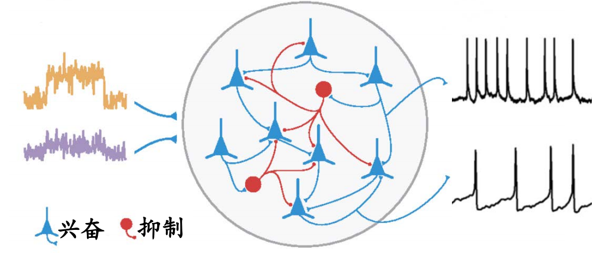
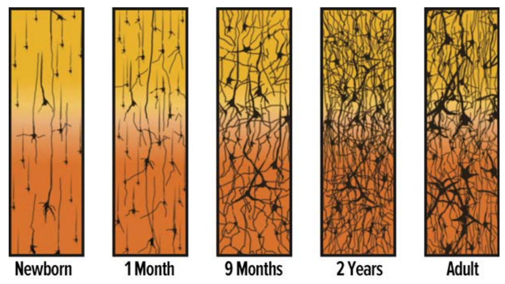
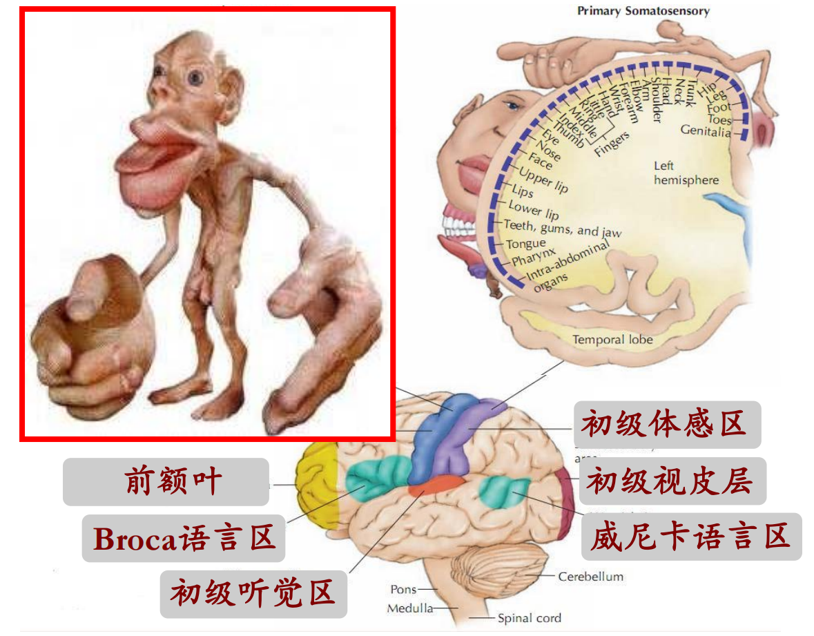
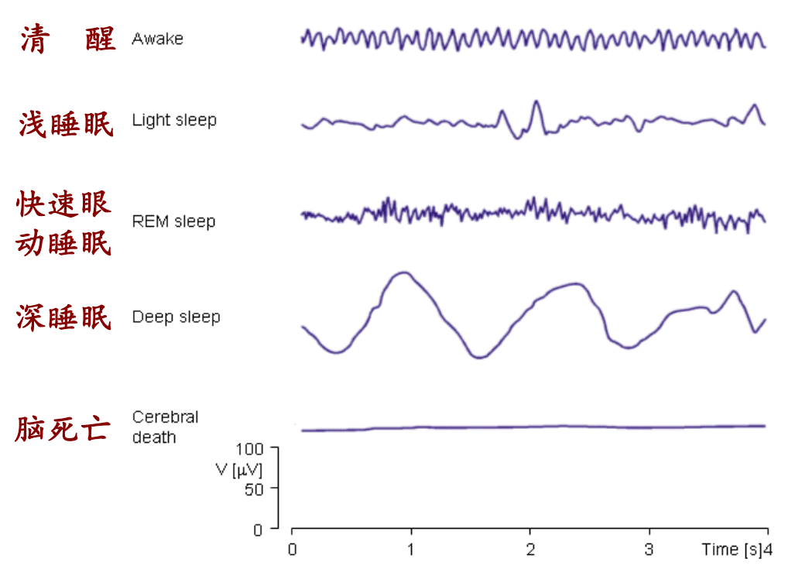

# 心理学导论

!!! info "课程信息"

    - 学分：2.0
    - 教师：蔡永春、陈珂
    - 教材：《普通心理学》（厚厚的一本书，看起来没啥用，更推荐看PPT）

## 绪论

### 心理学是科学

- 心理学是**用科学的方法**研究心理过程及个体行为的学科
    - 心理过程：情感、思维、梦境、记忆等
    - 行为：微笑、哭泣、攻击、合作、竞争等
- 生活中的与心理学相关的许多常识并不可靠；心理学（脑科学）中有一些不可思议的发现
- 心理学家得出的结论是基于实验事实的科学观察
- 心理学研究结论具有系统性和可重复性
- 研究对象：动物、（各种状态的）人

### 生活中的伪心理学

- 举例：
    - 手相学(palmistry)
    - 颅相学(phrenology)
    - 笔迹学(graphology)
    - 占星术(astrology)
- 为何伪心理学如此流行：
    - 无批判接受顺言(uncritical acceptance)：容易相信别人对自己奉承赞扬的偏向（比如很多星盘的解释都是为了媚谄于人而预设建造的）
    - 肯定例证谬误(fallacy positive instances)：倾向于记住或注意与自己期望相一致的信息，而忽略不一致的信息（选择性相信效应）
- 像科学家一样思考：

    

### 心理学的研究方法

- 描述性研究方法：不能揭示因果关系
    - 调查研究法：获得人的行为及心理过程的信息最直接的一种方法，仅需向人提问。被广泛应用于人们对电视节目、饮料、政治候选人等对象的态度
        - 优点：可在短时间内获取大量资料
        - 缺点：
            - 不同的调查对象群体可能得到不同的结果
            - 不能保证人们对调查问题的回答是完全诚实的
            - 很多微妙因素会影响调查结果，如语气、措辞等
    - 自然观察法：在自然的环境下，对人或动物自然发生的行为作观察和描述
        - 缺点：
            - 被观察对象的行为容易受到观察者影响
            - 容易出现观察者偏差
            - 被观察对象行为难以控制和精确重复
    - 个案观察法：对单个被试进行深入研究，以揭示出对所有个体来说都适用的规律
        - 优点：个案研究可以为心理学积累大量有价值的知识，这些知识可为实验研究指引方向
        - 缺点：个案研究缺少对研究过程的控制，只能提供观察性描述，有些结果难以重复
    - 相关研究法：法用于揭示一个量的变化是否伴随另一个量的变化
        - 正相关：一个测量的值从小到大变化时，另一个测量的值对应地也从小到大变化
        - 负相关：一个测量的值从小到大变化时，而另一个测量的值从大到小变化
        - 相关系数是-1\~1的值，用于描述变量间相关的程度
- 实验研究法（可揭示因果）是通过谨慎操控变量，观察是否导致行为结果的变化；是获得行为因果的最有效方法
    - 变量
        - 自变量(independent variable)：因实验者操纵而变化的因素；（引起行为反应的因）
        - 因变量(dependent variable)：实验的测量结果，自变量引起的特定反应；（行为反应）
        - 干扰变量(extraneous variable)：与实验无关的其他因素
    - 实验组vs对照组，两者不可或缺：后者的结果是一个参考点，前者的结果与之比较才能揭示原因
        - 实验组(experimental group)：接受自变量条件
        - 对照组(control group)：接受除自变量条件之外所有条件
    - 被试偏差(participant bias)：因为被试的主观期待而造成结果上的无意偏差
    - 安慰剂效应(placebo effect)：因为被试对药物效果产生期待而导致的药物效应
        - 安慰剂效应非常强大，生理盐水作为安慰剂的镇痛效果能达到吗啡效果的70%
        - 大量的心理过程受安慰剂效应影响：痛觉、焦虑、抑郁、警觉、酒精渴求等
    - 研究者偏差(research bias)：主试不经意的暗示对实验结果造成影响
    - 自证预言(self fulfilling prophecy)：预言促使人们朝预言的方向努力
    - 单盲试验(single-blind experiment)：不让被试知道自己被分为实验组还是对照组
    - 双盲实验(double-blind experiment)：被试和主试都不知道哪组被试是实验组，哪组是对照组
    - 心理学实验要遵循伦理道德
        - 基本要求：
            - 不会造成伤害（心理和生理）
            - 让被试知晓可能潜在的危险
            - 尽量减少实验过程中的不适
            - 保密被试的所有行为记录
            - 不侵犯被试隐私尽力减少欺骗
            - 尊重被试
        - 动物研究中的伦理道德：
            - 大约7%的心理学研究中使用动物，其中95%使用老鼠和鸟类
            - 大量不能适用于人的研究在动物上开展：药物成瘾、焦虑、攻击性、电生理等
            - 实验中尽量减少动物的痛苦

## 大脑

### 基础结构

大脑由**神经元**构成，神经元的结构如下：

    

- 树突(dendrites)：接受从其他神经元传入信息的神经纤维
- 胞体(soma)：神经元的主要部分,对各种输入信息进行汇总、整合
- 轴突(axon)：从神经细胞体向外传导信息的纤维
- 突触末梢(axon terminals)：轴突末端分支的纤维

神经元的工作流程：

    

---
神经元之间的对话——**动作电位**

- 神经元既是神经系统的导线，又是神经系统的电池
- 静息电位(Resting potential)：神经元在静息状态时细胞的内外的电位差，约-70mV
- **动作电位**:因为其他神经输入，静息电位达到-50mV的阈值时，神经元上的离子通道发生一系列开关动作，造成膜电位的快速上升之后又快速恢复的过程

    

        
    

    - 动作电位是通过放电频率来编码信息

    

        
    

    - 动作电位轴突传递到下一级神经元，最快90米/秒

    

        
    

---
神经元间的连接纽带——**突触和神经递质**

- 突触：一个神经元的轴突末梢与另一个神经元接触的特异性连接
- 神经递质：突触前神经元分泌的可激活突触后神经元受体的分子
- 受体：探测神经递质并启动细胞反应的特化蛋白质

    

        
    

    - 突触后神经元整合兴奋性和抑制性神经输入

    

        
    

    - 近百种神经递质被发现：
        - 兴奋性：乙酰胆碱(Ach)、谷氨酸(Glu)
        - 抑制性：$\gamma$氨基丁酸(GABA)
    - 通过控制神经递质的作用强度调节心理或行为
    - 神经调节剂：神经肽(neuropeptides)
        - 可通过突触以外的部位释放，作用更慢，效应长
        - 调节神经活动：影响记忆、痛觉、情绪等
    - 脑内的鸦片：内啡肽
        - 疼痛成瘾,“痛并快乐着”
        - 脏话上瘾、安慰剂止痛等
    - 爱情激素：催产剂
        - 增强亲社会行为，提升亲和力、慷慨度、共情能力等

---
如何建立神经联结——赫布(Hebb)学习原则

- Fire together, wire together
- 大脑神经联结随着年龄（经验）而变得丰富、复杂

    

### 功能和结构

大脑的功能：感知觉、运动、记忆、情感、认知

大脑的结构：

    

- 大脑皮层：人类大脑皮层厚度3mm，包含神经系统70%的神经元
    - 灰质：神经元胞体排列在皮层表面，呈现为灰色
    - 白质：皮层下的区域，由皮层神经元的轴突构成，因为这些轴突被髓鞘包裹，呈现为白色

    

        
    

    - 大脑半球
        - 大脑皮层由两个大脑半球组成，两个半球由一条厚厚的纤维带（1亿条轴突） ——胼胝体相连接

        

            
        

        - 每个半球控制对侧躯体：左半球控制右侧，右半球控制左侧
        - 左、右侧视野的视觉信息分别投射到右、左半球

        

            
        

        - 左右脑的功能是不一样的

            

                
            

            - 左脑：口语能力、更关注细节...
            - 右脑：空间能力、更关注整体...

    - 大脑皮层的分区及功能（根据大裂纹把大脑分为4个脑叶）
        - 枕叶：负责对视觉信息进行初步加工
        - 颞叶：处理听觉信息，参与语言、记忆功能
        - 顶叶：处理躯体感觉信息(温度、触觉、压力觉等)还负责空间推理和空间注意
        - 额叶：大脑的控制中心，控制运动、情绪/情感、冲动等，参与决策、思维等高级功能

        

            
        

    - 镜像神经元(mirror neurons)：当做出某种动作时，这些神经元会反应；看到别人做相似动作时，它们也会反应。帮助理解、模仿别人的行为

- 皮层下结构：源自于进化的更早期，负责基本的生命活动
    - 丘脑：各种感觉信息（视觉、听觉、味觉、触觉）传输的中转站。损伤将导致除嗅觉之外的其他感觉的丧失

    

        
    

    - 小脑
        - 控制不随意的、快速及精细动作，协调肌肉的运动，维持平衡，使运动自动化，如行走、舞蹈、打字、演奏乐器等
        - 负责动作的记忆
        - 音乐家的小脑比普通人的更大
    - 脑干(brain stem)
        - 构造：网状结构、脑桥、延髓
        - 功能：
            - 维持基本的生命活动（呼吸、心跳、吞咽、消化等）
            - 上行和下行信息的分类/选择（觉醒、警觉、睡眠）
    - 边缘系统(limbic system)：位于脑干/丘脑与皮层之间的结构，出现于进化的中期，与情绪、记忆、动机有关

        

            
        

        - 海马(hippocampus)：参与形成新的长时记忆
        - 杏仁核(amygdala)：与恐惧情绪与恐惧记忆有密切关系。摘除杏仁核的猴子不怕蛇和人
        - 下丘脑(hypothalamus)：基本动机的控制中心，包括摄食、饮水、体温调节和性唤醒。被称为“快乐中枢” “奖赏系统”，电刺激下丘脑某些区域时会产生强烈的、广泛的快感或特定的性快感

复杂的心理功能和行为是由大脑很多子脑区综合协调工作的结果。

    

- 清醒状态下大部分脑区都在工作

???+ example "例子：朗诵时涉及的脑区"

    - 视觉区接收视觉信息
    - 角回把视觉词汇转换为听觉编码
    - 威尼卡区理解词汇
    - 布洛卡区作朗读的准备
    - 运动区支配肌肉运动

### 窥探大脑的方法

- 脑组织切除：通过外科手术切除大脑某些部分，观察行为的改变
- 电刺激：电刺激大脑某些区域，观察行为的改变，或询问被试的感受
    - 虚拟损伤法 —— 经颅磁刺激（TMS）
        - 利用交变强磁场，刺激大脑某个区域，让该脑区神经元去极化或超极化，从而短暂干扰该脑区的功能
- 大脑电活动记录：
    - 脑电图（EEG）和脑磁图(MEG)
    - 通过放置于头皮上的电极或磁探头，测量脑部大范围的电或磁活动
    - 觉醒状态、睡眠阶段与脑电波

    

        
    

    - 细胞外记录：通过插入极细的金属或玻璃电极，靠近神经元胞体或轴突，记录神经元的放电活动

- 脑成像技术：
    - 正电子发射断层扫描技术PET：将含有正电子的葡萄糖注射至人体静脉，葡萄糖进入大脑后，正电子与脑中负电子湮灭，发射伽马射线，PET通过测量伽马射线强度，推测在完成各种任务时大脑中葡萄糖消耗量，从而推测大脑各脑区的功能
        - 不同的认知任务引起不同脑区的活动

        

            
        

        ??? example "例子"

            

                
            

            - 左侧被试比右侧被试的大脑消耗更多的葡萄糖，但在完成推理任务的成绩更差（11 vs 33）
            - 勤奋的脑就是聪明的脑？NO！效率越高的脑才越聪明

    - 磁共振成像（MRI）：利用人体组织中氢原子核（质子）对强磁场的反应构建出大脑的三维图像
        - 功能磁共振成像（fMRI）：通过测量大脑对氧气的消耗来确定各脑区的认知功能
