# 秋学期部分

??? abstract "核心知识"

    === "导论、方法论"

        - 心理学的ABC模型
        - 研究方法：**相关研究法**、**实验研究法**、调查法、档案研究法、大数据法等等
            - 效度：内部效度、构造效度、外部效度
        
        - 复制危机
            - 原因
            - 应对

    === "情绪"

        - 理论：基本情绪论、情绪评价论、情绪建构论
        - 诱发情绪：图片、视频、音频、回忆、书面社交...
        - 测量情绪：自我汇报、生理测量、非语言表述
        - 面部表情：
            - 表情编码

        - 群内优势（情绪方言）

    === "态度"

        - 测量：李克特量表、内因联想测验(IAT)
        - 态度有时不能准确预测行为
        - 行为可以改变态度
            - 认知失调理论
                - 努力证明
                - 诱导依从
            - 自我知觉理论

    === "说服"

        - 理论
            - ELM：中央路径（动机 + 能力）、外围路径
            - 耶鲁态度改变方法：
                - 发送者（交流者）：可信度、吸引力、自信程度
                - 信息：信息质量、生动性、情绪、文化
                - 接收者（观众）：动机、能力、年龄、心情、认知需求

        - 元认知
            - 自我验证假设
            - 体现和自信

        - 抵抗说服
            - 偏见
            - 从前的承诺
            - 知识
            - 态度接种

    === "社会影响"

        - 从众
            - 显式/隐式
            - 好处
            - 信息社会影响、规范社会影响
        - 依从
            - 基于理由：互惠原则（门槛技术）、互惠让步技术、脚入门技术
            - 基于情绪：积极、消极（内疚）
            - 基于规范：描述性规范、规范性规范
        - 服从
            - 去个体化
        - 抵抗社会影响
            - 反应性
            - 灵活修正模型

## 导论、方法论

**社会心理学**(social psychology)是一门研究处于各种社会情况下的个体的情感、认知和行为的学科。

社会心理学的ABC：

- **情感**(Affect/feelings)
- **行为**(Behavior/actions)
- **认知**(Cognition/thoughts)

社会心理学的研究（和理论）：

- 理论：一组旨在描述世界的某些现象或方面的相关的命题
    - 一个好理论的特征：
        - 提出因果关系（解释观察结果）
        - 试图保持连贯性（组织观察结果）
        - 讲述一个好故事
        - 力求简约（用一些基本原理便能解释一系列的观察结果）
        - 可测量的（提供研究方向）
        - 能通过证明得到结果（产生新的问题）
        - 能够解决问题的（有实际价值）
- 基于一种理论来提出假设
    - 关于两个或多个变量之间关系的可检验的预测
    - If-then语句来说明变量之间的相关性，以及在特定条件下会发生的情况
- 检验假设
- 理论修正（机制、边界条件、扩展）

### 方法

- **相关研究法**(correlational research)：通过测量自然关联来评估两个或多个变量间的关系，即检验A的发生是否与B的发生有联系
- **实验研究法**(experimental research)：通过操纵其中一个变量A（**自变量**(independent variable)）来观察它是否影响另一个变量B（**因变量**(dependent variable)）
    - 基本原则——随机分配：参与者会被平均分配到不同的实验情况（对应自变量的设定）

**效度**(validity)：研究方法中关于测量方法能否如实反映所欲测量对象的能力，即测量值与实际值相符合的程度。

- 分类：
    - **内部(internal)效度**：因变量的改变是否是因为自变量的改变
    - **构造(construct)效度**：对自变量的操纵以及对因变量的测量是否是理论构造的良好体现
    - **外部(external)效度**：结果是否能够泛化到其他实验或被试中

- 关于上述方法的效度问题：
    - 内部效度：在相关研究法中，可能存在相反的因果关系、受其他变量影响等问题
    - 外部效度：在实验研究法中，可能存在不知道如何泛化结果的问题
    - 构造效度：在相关研究法和实验研究法中，对变量的操作和测量可能无法反映理论构造

其他方法：

- **观察研究法**(observational research)：只是以系统的方式看待一种现象，以理解正在发生的事情，并提出了关于“事物为什么是这个样子”的假设
- **档案研究法**(archival research)：研究人员可以查看各种档案中发现的证据，例如包含不同文化的人们的人类学描述的数据库
- **调查法**(surveys)：可通过面试或调查问卷来执行
- **元分析研究法**(meta-analysis research)：一种结合了多项研究结果以确定特定研究领域的总体趋势或影响的统计技术。
- **大数据研究法**(big data research)：大数据研究涉及分析通常从数字平台，社交媒体，在线交易或传感器收集的大规模数据集，以发现人类行为的模式，趋势和关联。社会心理学家使用大数据来研究大规模的社交互动和行为，这些行为很难通过传统方法观察

### 复制危机

**复制危机**(replication crisis)是一种正在进行的方法论危机，其中许多科学研究的结果难以或不能被复制。由于经验结果的可重复性是科学方法的重要组成部分，因此这种失败破坏了基于它们的理论的可信度，并有可能质疑科学知识的重要部分。（翻译自[Wikipedia](https://en.wikipedia.org/wiki/Replication_crisis)）

某个实验难以被复现的原因有：

- 较小的样本规模
- **p-hacking / 有问题的研究实践**(questionable research practices, QRPs)通过以下不当操作，获得统计上的显著结果（即使得$p < .05$）
    - 丢弃一部分对研究结果影响不利的实验对象数据、条件和因变量等
    - 文件抽屉：存放不生效的研究

如何提升科学研究的质量：

- 提升样本规模
- 直接或间接地复制多次试验
- 通过预先注册(preregistration)来防止p-hacking操作
- 搭建用于存储数据和刺激复制尝试的异地存储库(offsite repository)

理论的进化：

- 科学是一个持续积累的过程
- 它取决于直接或概念上的复制
- 它正不断发展，朝着对现实有效的更有用和有效的理解发展

## 情绪

### 表征

**情绪**(emotions)：针对特定的身体和社会挑战和机会而发生的、片段性的、相对短期的、基于生物的感知、体验、生理、行为和沟通模式。

基本情绪：愤怒(anger)、厌恶(disgust)、恐惧(fear)、惊喜(surprise)、悲伤(sadness)、快乐(joy)

### 理论

情绪理论：关于情感如何产生的可检验的陈述。

根据**成因**(cause)、**生物特征**(biological given)和**各成分的融合**(integration of components)的三个要素，我们将情绪理论分为以下几类：

- **基本情绪论**(evolutionary theories)
- **情绪评价论**(appraisal theories)
- **情绪建构论**(constructionist theories)

情绪的成分有：

- 非语言的表达(nonverbal expressions)
- 生理的变化(physiological changes)
- 评价(appraisal)
- 主观体验(subjective experience)
- 其他行为(other behaviour)

#### 基本情绪论

- 成因：来自**情感程序**(Affect Program)的激活
    - 根本的来源是适应性问题（生存或繁殖中出现的挑战），也就是说情绪来自**进化**过程中解决问题的行动
- 生物特征：基本情绪是一种生物特征
- 成分：面部表情、行为（行动趋势）、心理、认知改变、主观体验等
- 融合：各成分之间高度融合

    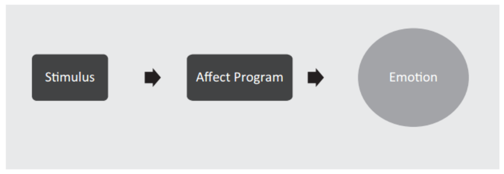

情绪的特点：

- 与进化(envolved)和适应性(adaptive)相关
- 将情绪分为单独的(seperate)、不同的(distinct)东西
- 普遍性(universal)
- 与生俱来的(innate)

#### 情绪评价论

- 成因：情绪来自评价
- 生物特征：新颖性和效价(valence)
- 成分：评价能影响（但不一定是所有的）成分
- 融合：成分之间的融合相对较少

    

对情绪的评价指标有：

- **新颖性/期望**(novelty/expectation)：你是否期望这种情况的发生？
- **内在的愉悦**(intrinsic pleasantness)：你认为这件事是令人愉快的还是不愉快的？
- **目标诱导**(goal conduciveness)：这件事是否帮助或阻止你去达到目标？
- **媒介**(agency)：谁导致这件事的发生？
- **应对潜力**(coping potential)：我能应对这件事吗？

???+ example "例子"

    

        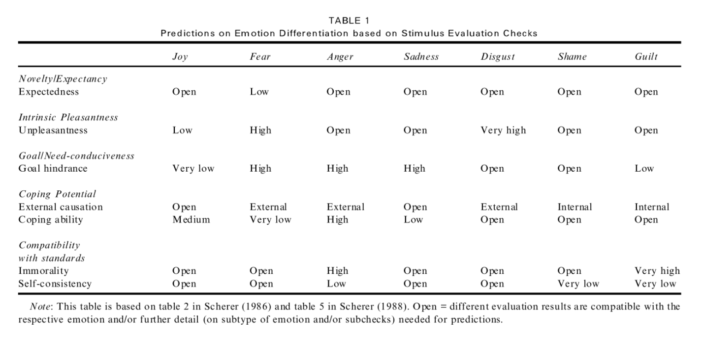
    

#### 情绪建构论

- 成因：由**效价**(valence)、**唤起**(arousal)（核心情感(core affect)）与**抽象知识 / 个人经历**之间的结合而产生情绪

    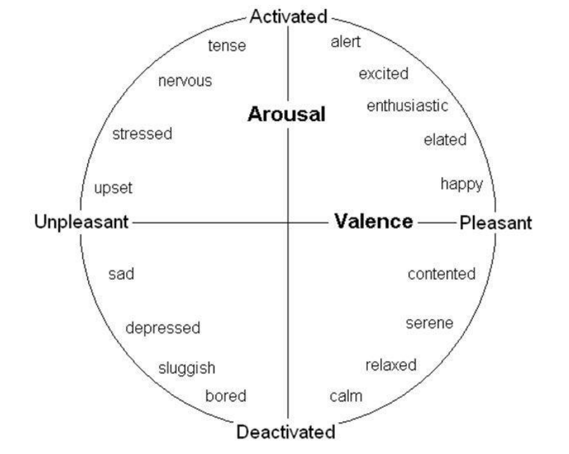

- 生物特征：核心情感是一种生物特征
- 成分：成分根据经历的不同而不同，主观经历占主导地位
- 融合：成分之间的融合很少

    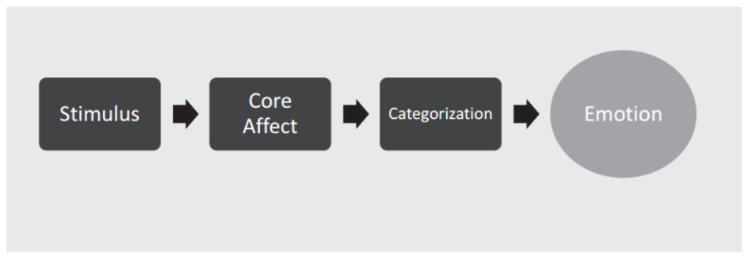

>Specific emotions are caused by applying **learned categories** to experience.

    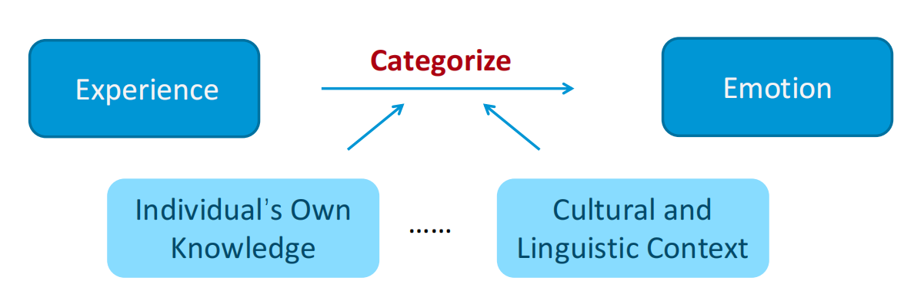

### 研究

#### 诱发情绪

诱发情绪的方法：

- **图片**
    - 有效的刺激集
    - 能够诱发微弱的、短暂的情绪
    - 适用于多种测量
    - 仅作用于部分情绪
- **视频**
    - 有效的刺激集
    - 能够诱发具体的、强烈的情绪
    - 难以重复
    - 仅作用于部分情绪
- **音乐**
    - 有效的刺激集
    - 能诱发扩散的情绪和情感
    - 仅作用于部分情绪
- **回忆**
    - 能诱发强烈的、具体的情绪
    - 难以重复
    - 对大多数情绪有效
- **书面的社交**(scripted social interactions)
    - 能够诱发强烈的、具体的情绪
    - 通常而言，每个参与者只能进行一次试验
    - 仅作用于部分情绪
- **自然出现的情绪**（比如在鬼屋感到害怕，乘过山车感到激动等）

#### 测量情绪

- **自我汇报**（问卷调查）
- **生理测量**
    - 皮肤导电(EDA/GSR)
    - 脑活动(EEG, fMRI)
    - 心率(ECG)
- **非口头的表述**
    - 面部表情
        - 面部EMG
        - 基于FACS的自动化软件：FaceReader, iMotion
        - 人工FACS编码
    - 瞳孔扩张(pupil dilation)（眼动追踪(eye tracking)）
    - 姿势
    - 触摸
    - 声音：叹词(vocalization)、韵律(speech prosody)

### 面部表情

**面部动作编码系统**(Facial Action Coding System, FACS)

    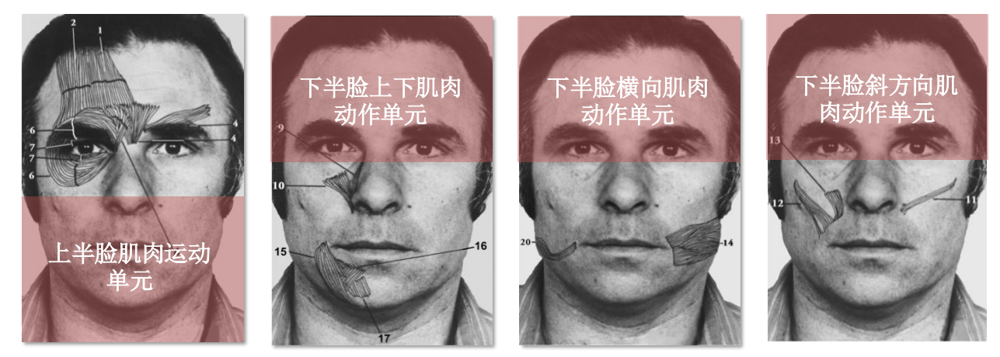

一共有44种面部动作单元(action unit)，下面列出其中一些动作单元：

    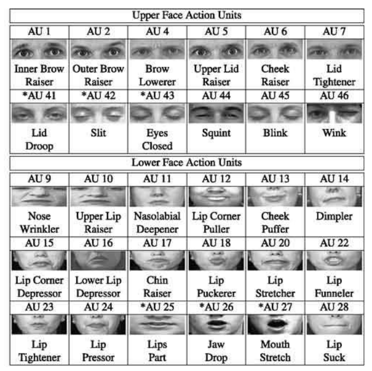

破译面部表情的方法：

- 人工编码
- 自动编码
    - 问题：
        - 识别情绪种类和面部动作有限
        - 对自然情境下的自发表情识别信度和效度较低

???+ "案例分析：群内优势(ingroup advantage)"

    

        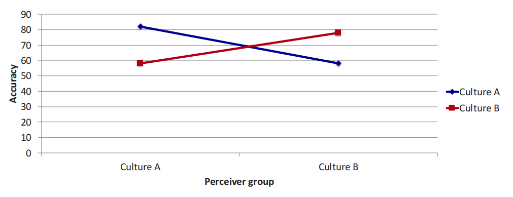
    

    情绪方言(emotional dialects)：

    - 来自不同文化背景的人们，因为文化差异和社会环境，有着略微不同的情绪表达方式（“方言”）
    - 人们更容易识别出与自己文化相同的人们的面部表情所反映的情绪

## 态度

### 概念

**态度**(attitude)：从积极/消极角度对一个事物的评估。

态度的组成(ABC)：

- 情绪(affect/emotion)：几乎所有事物都会触发人们某种程度的积极或负面情绪
- 行为(behavior)：对好坏的情感评估与接近或逃避的行为呈相关趋势
- 认知(cognition)：包括对有关事物的知识和信念，以及相关的记忆和图像
    - 神经科学研究表明，我们的态度激活了的特定大脑区域（支持具体行为的运动皮层区域）

### 测量

**[李克特量表](https://en.wikipedia.org/wiki/Likert_scale)**(Likert scale)：用于评估人们态度的数值量表。

- 构成：一组刻度，两端有具体的文字说明

    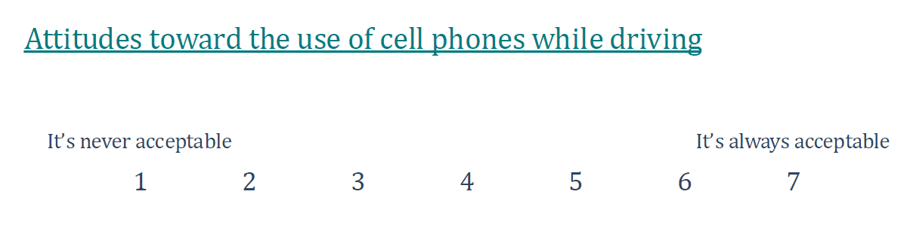

在测量时需要考虑到的因素：

- **可访问性**(accessibility)：大脑的可读性
    - 响应延迟(response latency)：人们对一个关于态度的问题的反应所需的时间
        - 那些花较少时间回答态度问题的人可能比花费更多时间答题的人对该问题具有更强烈的态度
- **中心性**(centrality)：对人们信仰体系的中心态度（对某些现象或行为等更为强烈的态度）
    - 测量方法：测量域内的各种态度，计算它们之间的联系有多强烈

测量分为**显式**(explicit)测量和**隐式**(implicit)测量，它们的区别相当重要，因为：

- 研究对敏感问题（例如对社会类别，宗教，性别等）的态度时，人们可能会警惕发表自己的态度，或者有时甚至出现自己可能不知道的无意识态度（**不想**(unwilling)或**不能**(unable)准确表达自己的情感或态度）
- 实际经验表明，在许多态度上，人们从显式测量和隐式测量的反应很不一样

隐式测量的方法：

- 生理指标测量：
    - 测量仪器：EEG和fMRI（大脑活动）、ECG（心率）、眼部追踪器（眼动）等
- 非语言行为测量：面部表情、姿势等
- 反应时间测量——**内隐联想测验**(implicit-association test, IAT)：该测试通过测量被试对不同词汇或图像的反应时间，来评估个体在潜意识层面对特定概念或群体的态度和偏好
    - 步骤：
        - 呈现概念词
        - 呈现属性词
        - 联合任务一
        - 对联合任务一进行测试
        - 让被试对概念词做出相反的判断，交换左右键反映的内容
        - 联合任务二
        - 对联合任务二进行测试
    - 一般用反应时间作为测试结果的衡量指标，对某个问题的反应越快说明此人对该问题的态度更为强烈
    - 缺陷：
        - 熟悉程度可能会影响反应时间
        - 可能会受到文化差异的影响，某些群体的反应模式可能与其他群体不同
        - ...

### 态度 -> 行为

<u>有时可能无法通过态度来预测行为</u>，这是因为：

- 态度和别的态度，态度和其他支配因素之间存在冲突，比如对一件事情有不同矛盾的态度，或者受其他因素（如习惯、情境、常识等）影响
- 不自觉地（或自动地）将态度和行为进行错误的匹配

???+ note "直觉 vs 分析"

    - 通过解剖和分析关系，人们将注意力集中在容易口述出来的线索上，然后基于这些提示来表明态度。但是这些看似合理的提示可能在影响我们的行为和态度
    - 我们的**直觉**有时可能更加准确地反映我们真实的情感，从而达到更好的预测效果

- 在特定水平上将态度和行为进行错误的匹配
    - 一般的态度预测一般的行为
    - 特定的态度预测特定的行为
    - 对事物或概念的一般态度可能无法预测任何特定的行为，但是如果我们在许多情况下平均检测我们的行为，态度可以预测行为
- 态度的强弱程度不同
    - 强烈的态度更容易被测得，这些更容易被测得的态度引导人们的行为

### 行为 -> 态度

态度有时不能准确预测行为，但<u>行为有时可以改变态度</u>，下面介绍一些相关的经典理论：

- **认知失调理论**(cognitive dissonance theory)：人的思想、情感和行为之间的不一致会产生厌恶的情绪状态（不和谐），促使人们努力恢复这两者的一致性。
    - 认知失调何时发生：
        - 做出不可撤销的决定之后发生
        - 在做出决定之前，也有可能下意识地做出了对事件的合理化和扭曲
        - 一旦对某种选择略有偏爱，人们会扭曲关于该选择的信息以支持自己的偏好

    - 与认知失调相关的心理学现象：
        - **努力证明**(effor justification)：一种通过投入精力来证明自己所为的趋势
        - **诱导依从**(induced compliance)：轻微地强迫人们以与他们的信念，态度或价值观不一致的方式行事，以引起不和谐，从而改变其原来的态度和价值观

- **自我知觉理论**(self-perception theory)：人们并不是通过直接的内省来了解自己的态度或情感，而是像观察他人一样，通过观察自己的行为（外显行为）和行为发生的情境（环境线索）来推断自己的态度和情感（内在状态）。

## 说服

**说服**(persuasion)：通过信息引起感觉，态度或行为的变化的过程。

### 理论知识

#### ELM

**推敲可能性模型**(elaboration likelihood model, ELM)：一种说服模型，它认为有两种不同的说服类型：**中央**(central)路径和**外围**(peripheral)路径。

    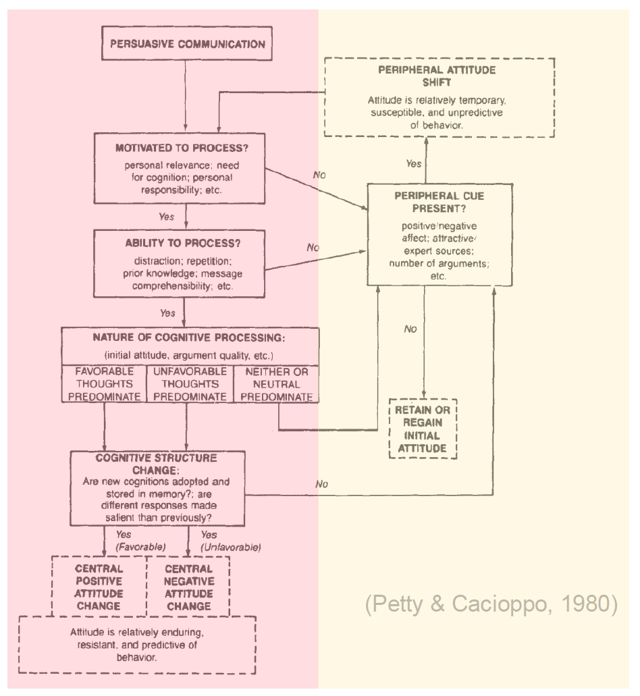

- 通过**中央路径**的说服（左半图）：人们仔细、慎重地思考**说服信息的内容**，关注其逻辑和论点的力度，以及相关的证据和原则。
    - **论证质量**(argument quality)对中央路径有重要影响：强论证使人们更加喜欢某个事物，弱论证使人们对事物不太感兴趣
    - 中央说服产生强烈的态度：持续更长、更能预测行为、更加难以改变
- 通过**外围路径**的说服（右半图）：人们更加注意与说服信息相关的、相对容易处理的**表面线索**，例如信息长度或信息来源的专业性或吸引力。
    - 论证质量对外围路径不怎么重要，不会产生太大的影响
    - 外围说服产生较弱的态度：临时性、对行为的预测更少、更容易受他人的影响

??? example "例子"

    

        
    

中央路径说服的因素有：

- **动机**(motivation)：目标，兴趣，幸福感
- **能力**(ability)：
    - 个人：认知资源、智力/知识
    - 刺激：信息阐明、时间限制

只有同时根据人们的动机和能力进行的说服才属于中央路径说服，其余的说服都是外围路径说服。

    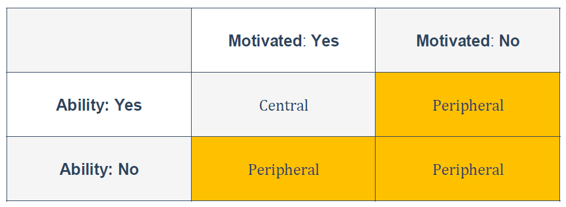

#### 改变态度

如何通过说服改变态度——**耶鲁态度改变方法**(Yale attitude change approach)

    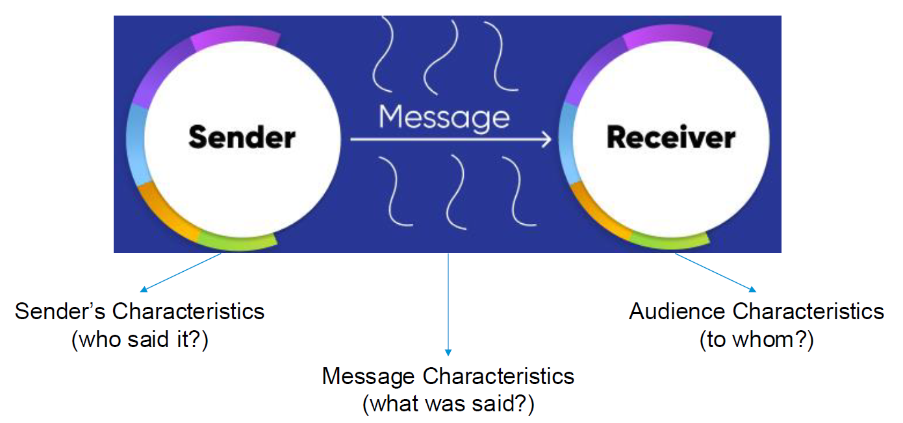

成分：

- **交流者**(communicator)/发送端(sender)——谁说的
    - **可信度**：专业知识、来源可靠度
    - **吸引力**：外在吸引力（一种外围路径的说服）、与自己类似的人
    - **确定性/自信程度**
- **信息**(message)——说了什么
    - **信息质量**
    - **生动性**：多彩的、有趣的、难忘的
    - **情绪**：
        - 积极感觉（外围路径）
        - 消极感觉，尤其是恐惧
    - **文化**：符合某个文化的规范和价值观
- **观众**(audience)/接收端(receiver)——对谁说
    - **动机和能力**
    - **年龄**：年轻人，尤其是小孩子更容易被说服
    - **心情**：当信息与人们的心情匹配时更容易被说服
    - **认知需求**：驱使人们对判断的深入思考，有较高认知需求的人们更容易被中央路径信息说服

### 元认知与说服

**元认知**(metacognition)：对自己认知过程的思考（“认知的认知”）

- **自我验证假设**(self-validation hypothesis)：人们对某个观点的信心会影响该观点的说服力
- **体现**(embodiment)和自信：我们的自信可以通过各种非语言的线索表现出来

### 抵抗说服

抵抗说服的原因：

- **专注偏见和抵抗**：人们倾向于选择有助于证实他们原先态度的信息
- **以前的承诺和抵抗**：很多有信息缺少说服力的原因在于它们不能影响目标观众的从前的承诺
- **知识和抵抗**：有大量知识的人们更容易抵抗说服

**态度接种**(attitude inoculation)：通过让人们接触轻微的、易于反驳的反对意见，从而增强他们对更强烈的说服尝试的抵抗力。这一理论类似于医学中的“疫苗接种”：通过事先暴露于小剂量的病毒来激发免疫系统，从而对抗未来的感染。

## 社会影响

**社会影响**(social influence)：人们相互影响的多种途径，包括因评论、行动，甚至仅仅是他人的存在而对态度、信仰、感觉和行为的改变。

例子：时尚潮流、同伴压力、社交媒体的影响等等。

### 从众

**从众**(conformity)：因来自他人的显式或隐式的压力（真实的或想象的）而改变某人的行为或信仰。

- 隐式：比如你打算换别的款式的牛仔裤，是因为你看到别人也这么做
- 显式：比如一伙人相互鼓励对方玩电脑游戏

从众有害有利，也有无害无利的。带来好处的有：

- 抑制愤怒
- 遵守秩序：食堂排队、人行道上靠右走等

???+ example "例子"

    === "变色龙效应"
    
        变色龙效应(Chameleon Effect)：人们对身边人的特殊习惯的无意识模仿。
    
        - 仅仅对他人行为的看法就可以自动增加参与这种行为的可能性。这是因为负责感知的大脑区域与负责行动的大脑区域重叠
        - 变色龙效应有利于促进和睦的，令人满意的互动并建立社会联系
            - 人们更喜欢模仿自己的人
            - 被模仿的人更倾向于进行亲社会行为
    
    === "Sherif从众实验"
    
        实验内容：参与者被放置在一个黑暗的房间里，观察一个光点（实际上是静止的），然后被问到光点移动了多少。由于视觉感知的模糊性，参与者的回答会有所不同。随后，研究者将参与者分成小组，让他们讨论自己的观察结果。经过一段时间，参与者的答案逐渐趋向一致，显示出群体规范对个体判断的强大影响。
    
        

            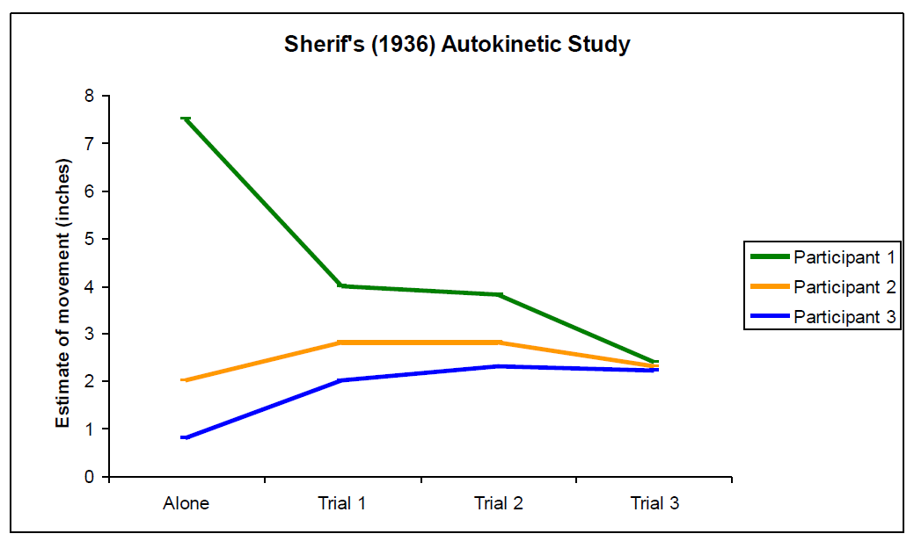
        

    

    === "Asch从众实验"
    
        实验内容：
        
        - 实验中，真实的参与者与一组伪参与者（同谋）一起被要求完成视觉判断任务。参与者需要判断两条线的长度，选择与标准线相同长度的线
    
        

            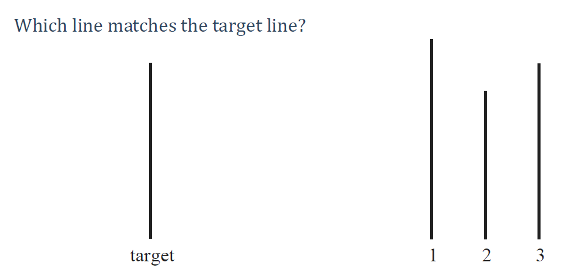
        

        - 伪参与者事先被安排给出一致的错误答案，而真实参与者是在最后回答。这使得真实参与者面临明显的群体压力，看到其他人给出错误的答案
    
        

            
        

    
        结果观察：研究发现，尽管真实参与者知道正确答案，但在面对伪参与者一致的错误答案时，许多人选择跟随群体的判断。约有37%的回答选择跟随错误的群体意见。
    
        

            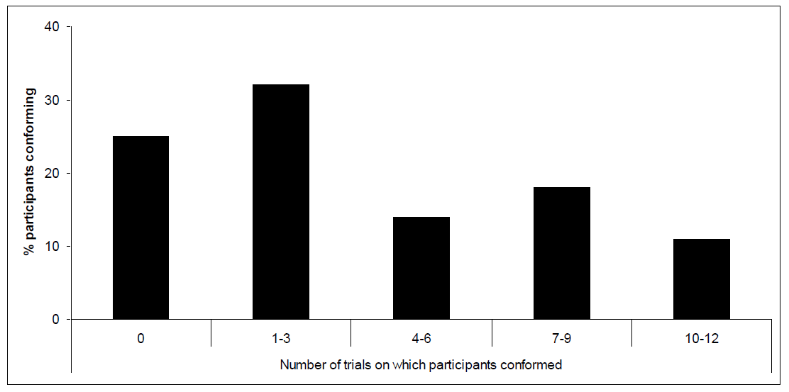
        

    
        >[相关资料](https://en.wikipedia.org/wiki/Asch_conformity_experiments)

社会影响的类型：

- **信息社会影响**(informational social influence)：人们常常在面临模糊或复杂情境时，认为他人的信息更为准确，因此会改变自己的看法，以帮助我们选择合适的行动。Sherif从众实验体现的便是这类社会影响。
- **规范社会影响**(normative social influence)：个体为了获得群体的认可、避免孤立或迎合社会规范而调整自己行为或态度的现象。它会导致群体的依从，但是人们在私底下不一定接受这种行为或观点。Asch从众实验体现的便是这类社会影响。

造成少数影响多数的因素：

- 一致的少数选项
- 信息社会影响的作用大于规范社会影响

### 依从

**依从**(compliance)：对他人的显在请求的积极响应，比如同意帮别人忙等。

使人依从的方法：

- 基于**理由**的方法：
    - **互惠原则**(reciprocity norm)（**门面技术**(door-in-the-face technique)）：一种要求人们应为施惠者提供利益的规范
        - 即使施惠者给予的很少，但我们往往会认为有义务接受它们的请求
        - **互惠让步技术**(reciprocal concessions technique)：首先，提出一个较大的、通常会被拒绝的请求。随后再提出一个较小的请求，这才是最初想要的请求。由于参与者刚刚拒绝了较大的请求，心理上会感到压力，认为自己应当回应对方的让步，因而更容易接受这个请求（“以退为进”）
            - 可行的原因：“你向我妥协，我也会向你妥协”
    - **登门槛技术**(foot-in-the-door technique)：首先提出一个较小的、容易接受的请求。接下来再提出一个较大的请求，这一请求是我们真正感兴趣的行为
        - 可行的原因：如果某人先接受一个较小的请求，这会导致他的自我形象发生变化。随后他就有理由同意更大的要求，因为“这就是我”
- 基于**情绪**的方法：
    - 积极情绪：
        - 心情会影响我们对事件的看法：当我们心情愉快时，我们更有可能认为他人的请求没什么侵入性和威胁性
        - 心情的维持：因为人们想要保持积极的心情，所以他们会更容易接受请求
    - 消极情绪：
        - 消极状态解除假设：人们想通过某些行动（比如接受请求）来环节消极情绪，并使自我感觉良好
    - **内疚**：内疚和依从有强烈的正相关。如果一个人感到内疚，那么他会觉得更有义务去帮助他人
        - 例子：在请求某人捐款前，先让他说出自己的罪过，这样成功的概率更大
- 基于**规范**的方法：让人们知道其他人在做什么有助于促进公共利益
    - **描述性规范**(descriptive norms)：人们在特定情境中观察到的行为模式
    - **规范性规范**(prescriptive/injunctive norms)：社会上被认为应该遵循的行为标准

### 服从

**服从**(obedience)：在不平等的关系下，屈从于权威的命令

???+ example "例子"

    === "Milgram研究"
    
        实验内容：
    
        - 角色分配：参与者被随机分为“教师”和“学生”两个角色。实际上，“学生”是研究人员提前录好的音像，并没有真正受到电击。但“教师”和“学生”之间用一块挡板隔开，“教师”无法得知“学生”的确切情况（信息社会影响）
        - 任务设定：教师的任务是向学生提出一系列问题，并在学生回答错误时施加电击。电击的强度从轻度（15伏）逐渐增加到危害生命的极限（450伏）
        - 权威的作用：实验者（权威角色）会在实验过程中指示教师继续施加电击，即使教师对学生的痛苦表示关切或拒绝继续（规范社会影响）
    
        结果：尽管许多参与者在面对明显的痛苦和道德困惑时感到不安，仍有大约65%的参与者在权威的强烈指示下最终施加了最高电压。
    
        解释：
    
        - 我们倾向于（无意识地）服从权威，难以拒绝权威的命令
        - 脚入门技术、自我证明
        - 难以面对和质疑规范
        - 即使不是邪恶的人也会做出这种不良的行为
    
        >[相关链接](https://en.wikipedia.org/wiki/Milgram_experiment)
    
    === "斯坦福监狱研究"
    
        实验内容：
    
        - 角色分配：实验在斯坦福大学的地下监狱模拟环境中进行，参与者被随机分为“囚犯”和“监狱警察”两个角色。参与者都是心理健康的大学生，实验者希望观察他们在这两种角色中的表现。
        - 环境设置：实验模拟了监狱环境，监狱警察穿着制服、佩戴手铐和警棍，而囚犯则穿着简单的囚服，被剃头以示身份。实验的目的是观察这些角色如何影响参与者的行为。
        - 权力动态：监狱警察被赋予绝对的权力，而囚犯则被剥夺了个人自由和权利。随着实验的进行，监狱警察的行为变得越来越暴力和专制，囚犯则表现出依从、抑郁和焦虑。
    
        结果：实验原定持续两周，但由于监狱警察的虐待行为和囚犯的心理崩溃，实验在六天后被迫停止。
    
        !!! bug "该实验的问题"
    
            - 难以被复制
            - 一些学者认为这不是一个实验
            - 警卫是被训练得如此凶残
            - 囚犯也有可能作假
            - 实验没有发表在科学期刊上，反而发在《纽约时代》杂志上，没有经过peer review
    
        >[相关链接](https://en.wikipedia.org/wiki/Stanford_prison_experiment)

**去个体化**(deindividuation)：当人们在群体时，对行为的正常限制放松，导致冲动（和异常）行为的增加。因为群体能使人们对他们的行为更加不负责任，减少自我意识，以及更倾向于服从群体规范。

### 其他

抵制社会压力：

- 反应性(reactance)：个体在感受到自由受到威胁或限制时，会产生对这种限制的抵制和反抗行为
- 灵活修正模型(flexible correction model)：一种解释个体在信息处理和判断过程中如何修正其初步的判断或反应，以减少偏差和误导的理论。修正的内容有感知影响的方向和程度