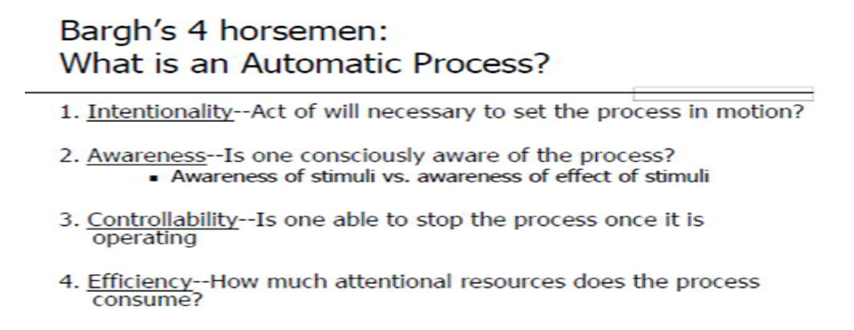
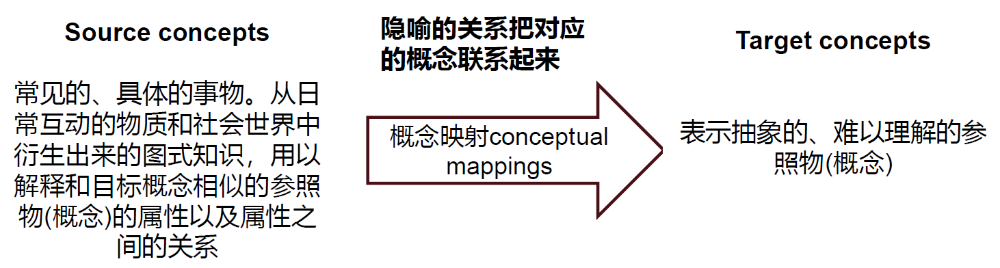
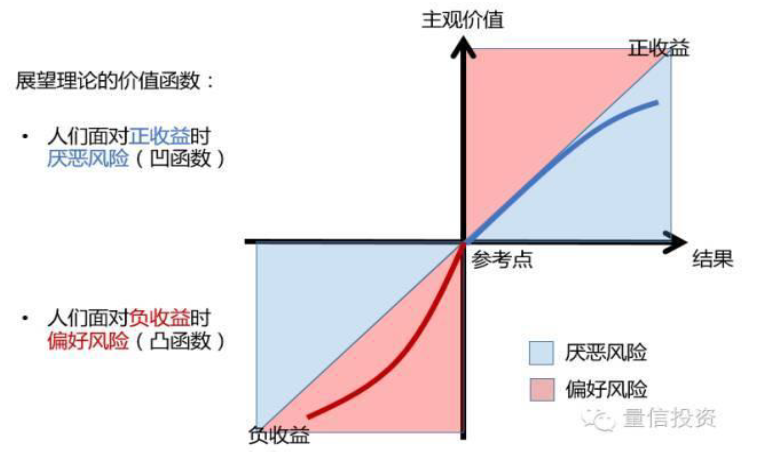
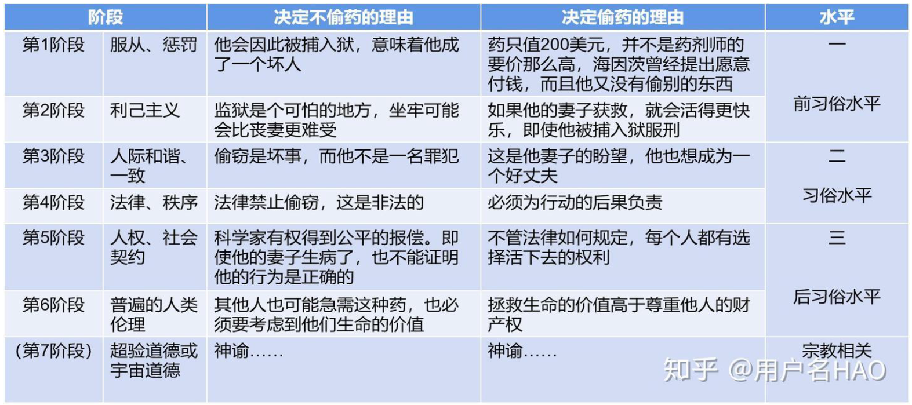

# 冬学期部分

## 社会认知

**社会认知**：主观建构社会现实

- 社会认知过程受到人们的信念、动机、情绪、人格、自我概念等因素的影响
- 助推：通过了解人的社会认知过程，更好促进个人幸福和社会发展

### 图式

**图式**(schema)：对特定对象的**有组织的**、**结构化**的认知结构

分类：

- 角色图式(role schema)：对特定角色(教授)的认知结构
- 个人图式(person schema)：对特定个体的认知结构
- 自我结构(self-schema)：对自己的认知结构
- 团体图式(stereotype)：对特定群体的认知结构
- 脚本(script)：对事件或事件顺序的图式（以情境为特性的一系列事件）

表征形式：语义和图象

!!! info "文化原型(cultural prototype)"

    - 经典情节
    - 经典人物原型

图式的功能：

- 填充信息：脚本
- 组织信息
- 引导加工
    - 图示化加工：信息越是模糊，人们越有可能使用图式来弥补
        - 自上而下加工（脑补）
        - 图式不一致
            - 道德二元论：道德侵害模板包括有意图的行为者，与遭痛苦的受害者，且两者存在因果关系
            - 心智感知(mind perception)
                - 能动性(agency)：计划与执行的心智能力（包括自我控制、判断、交流、思考、记忆），与加害者关联
                - 感受性(experience)：人们感觉和感受的心智能力(包括饥饿、害怕、痛苦、愉快)，与受害者关联
                - 能动性与道德责任相对应，感受性与道德权利相对应

图示的个体差异：有无、高低、深浅

### 社会认知过程

社会认知的双加工过程(dual process theory)：从无意识、启发式到有意识

#### 自动化加工

特点：

    

进化根源：

- 形成：压抑、联结学习、习惯化、进化
- 原因：远因（进化）、近因（个性）、即时原因（情境）
- 自然选择和适应
    - 恐惧使得祖先能够对潜在的威胁如毒虫、毒蛇和敌人等迅速做出反应；身体持续保持高度唤醒状态，形成战斗/逃跑反应模式
    - 由进化而来的心理机制：人类的许多倾向和偏好是自然选择的结果
    - 人类祖先面临的许多重要问题本质上是社会性问题，在解决这些问题过程中形成不同的心理机制，如归属需要、对群体排斥的恐惧、与他人合作的能力、在孩子身上的投资意愿等
    - 进化心理学
    - 自然主义谬误：存在即合理吗，即是什么 $\ne$ 应该是什么

类型：

- 内容无意识
    - 颜色的社会属性
        - 红色
            - 醒目：老师用红笔批改、红绿灯
            - 红色与性关联：红唇，月下老人从红绳，红灯区
            - 红色与攻击性：奈良将车站灯光调成蓝色以降低犯罪
        - 黑色
            - 黑色往往有贬义：黑钱，黑色幽默
            - 黑钱 vs. 脏钱  
    - 内隐联想测验(Implicit Association Test, IAT)：检测内隐自尊、态度和刻板印象
        - 自恋：外显自尊高，内隐自尊低
        - [IAT程序](https://www.millisecond.com/download/library/IAT/)、[IAT网站](http://www.projectimplicit.net/)
    
- 源无意识
    - 阈下觉察
        - 阈下广告(subliminal advertisement)
    - 内隐学习
        - 经典条件反射/联想学习：无关刺激(CS)（比如铃声）与无条件刺激(UCS)（比如事物）的配对重复呈现后，无关刺激的呈现会产生无条件行为（比如唾液分泌）
        - 评价性条件反射程序：态度对象(无关/条件刺激)与积极或消极刺激(无条件刺激)配对呈现，多次重复后，态度对象获得了无条件刺激的效价
        - 阈下评价性条件反射：阈下呈现条件刺激或无条件刺激
            - Dijksterhuis(2004)的自尊的内隐提升：阈下呈现自我相关刺激(I, me, mine)，其后呈现一些有意义或无意义词，要求被试进行词/非词判断。一些被试看到的有意义词是积极词如聪慧、和善，另一些看被试看到的有意义词是常见中性词如桌椅
            - 网络成瘾者一般持有对互联网积极评价的内隐态度，通过阈下评价性条件反射技术可以将其变得消极（梁宁建，吴明证，邱扶东和曹小燕, 2006）。

- 影响无意识
    - 人生高度
        - 进化：膝下无子的男性比有子嗣的男性约矮3厘米(Dunbar)
        - 财经：高大业务员比矮个业绩好(1940)；Judge & Cable发现，比平均身高每高1英寸则每年多赚789美元，以30年职场生涯做复利计算，高个比矮个同事多赚数10万美元
        - 竞选：身高一方的得票率高于另一方的占2/3；成功连任的身高比竞选对手高2寸；如果身高比对方高，则赢得竞选的概率会增加15%。
        - 对陌生人身高的评估随着身份的不同而改变
        - 隐喻：大人物、现金短缺(Martel & Biller，《Stature and Stigma》)

具身认知：大脑通过身体的性质、感觉和方位等来认知世界

- 重量效应：用厚纸打印的简历是否让人觉得更厚重？
- 温度效应：为何客人用餐前递上热毛巾？天气越冷人们越爱看浪漫爱情片？

隐喻：

>Metaphor is primarily a cognitive tool that people use to understand abstract concepts in terms of superficially dissimilar concepts that are relatively easier to comprehend.

- 具身到隐喻：
    - 软/硬：“软”科学和“硬”科学
    - 轻/重：保守秘密让人很“重”？
    - 计算机科学：中毒、死机、存储空间，保存到电脑
    - 积极和消极
        - 前进、进步、向前看 ——积极
        - 后退、落后、拖后腿 ——消极
    - 道德与价值观
        - 黑暗房间里让人更为不道德
        - 黑钱

- 概念的隐喻：

    

        
    

    - 结构隐喻：以一种概念的结构来构造另一种概念，使两种概念相叠加
        - 举例：目标概念：爱 <- 源概念：旅程
            - 她陪伴我度过一些艰难的时期。
            - 你能看到我们十年后的样子吗？
            - 我认为我们之间的关系需要发展得慢一点
            - 《从你的全世界路过》、《陪你度过漫长岁月》等
    - 方位隐喻：将上-下，前-后，深-浅，中心-边缘等具体概念投射到情绪、身体状况、社会地位等抽象概念
        - 举例：目标概念：理性化/情绪化 <- 源概念：上/下
            - 他无法超越情绪的影响
            - 这个讨论降到了情绪层面，我将其提升到理性层面
            - 我们把感受放到一边，开展了一场高智力的讨论        
    - 本体隐喻：将抽象模糊的概念看成具体有形的实体，特别是人的身体
        - 事件和行为被概念化为物体，活动被概念化为物质，状态被概念化为容器
            - 周日你要参加(in)比赛吗？ [比赛是容器物体]
            - 比赛的结束部分真是令人激动不已。 [结束是容器内的事件物体]
            - 在比赛中，很多跑步非常不错。 [“跑”是容器内的“内容”，即物质]

具身、隐喻与道德

- 身体经验(如温暖、洁净、轻重)无意识影响内在抽象的心理过程，如人际亲疏、权力高低、道德判断等
    - 恶心与道德判断、麦克白效应
    - 道德判断的社会直觉模型(Social Intuitionist Model)：道德判断大体是内脏(肠道)迅速感觉的结果
- 黑白与道德判断：在价值领域，身体的干净整洁与道德的纯洁清白之间存在隐喻映射
    - 人在智慧上应当是明豁的，道德上应当是清白的，身体上应当是洁净的—契诃夫
- 轻重与道德判断
    - 较重的重量感知让人们的道德判断更为严格，不容易道德妥协；
    - 相比于具有不道德信息的物品和中性信息的物品, 个体倾向于将具有道德信息的物品知觉得更重。
    - 隐喻：人们用德高望重、举止庄重、一诺千金、一言九鼎等描述一个人的举止符合道德规范，而用轻薄、轻佻、举止轻浮、轻诺寡信等描述举止不符合道德规范，如用a light woman指代举止不稳重的女人

#### 启发式加工

**启发式**(heuristics)：减少社会认知过程中的努力，就是解决问题的套路，如我们采用“反其道而行之”“一报还一报”等就是经验性法则。

**启发式判断**：人们在不确定情境中，通常依据 直觉和经验 对事件进行判断，而不是系统、有步骤地解决问题

- Why：注意资源有限、记忆容量有限
- When：
    - 话题不重要、时间紧急、信息超载
    - 没有其它知识和信息
    - 情境因素唤起已有启发式，使其在认知上具有实用性
- How: 人们拒绝做复杂决策

**代表性启发式**(Representativeness heuristic)：人们倾向于根据样本是否代表(或类似于)总体判断其出现的概率，越有代表性，被判断为越可能出现。

- 江歌妈妈追求正义的行为为何遭到误解？江歌妈妈越是强硬地追求正义，越是不符合我们头脑中的受害者的形象（图式或刻板印象）
- 鬼鬼祟祟 = 小偷：基于(过去经验的)相似性，来预测(当前事件的)可能性
- 代表性启发式是一个关于样本与群体、行为与行为者、特征与类别、结果与模型之间的一致性估计
    - 这个模型可以是指一个人、一枚硬币或者是世界经济，相应的结果是婚姻状况、一系列的正反面或者当前的黄金价格

**合成谬误**：样本与群体

**误解随机性**：

- 随机性的原型：人们通常把与实际的随机序列相比，存在更多转换的序列看作是随机序列(Gilovich et al., 1985)
- 彩票心理学
    - 赌徒谬误：人们以为随机序列中，一个事件发生的机率与之前发生的事件有关，即其发生的机率随着之前没有发生该事件的次数而上升的错误信念。
        - 对于中奖号码，在下次投注中会遭到人们的遗弃。人们认为已经中过的号码不大可能再中，所以主观降低了该号码的中奖概率
    - 热手谬误：人们认为一个的随机结果会重复发生多次
        - 在连续状态出现多次的情况下人们容易过度反应，误以为事物发展趋势不是偶然的，而是事物本质发生变化，因此该趋势将持续下去
        - 人们认为某一小样本或事件都应该具有全局的特征，倾向于将偶然性推至全局
        - 中头奖的彩票能够为销售商店带来销量显著、持续增加，称为彩票的幸运店效应(Lucky store effect)
- 金融心理学
    - 投资者会抱着深度套牢的股票不放
    - 人们倾向于选择去年业绩好的投资基金
- 投资(或下注)法：先用极少的钱下注，如果输了，就加倍下注，以此类推……。因为之前连续输的次数越多，下一把赢的概率越高

**局部代表启发式**

- 人们错误地诠释了“大数法则”的平均律：人们倾向于认为大数法则在适用于大样本的同时，也适用于小样本

    - “小数法则” (law of small numbers)：认为局部具有总体所具有的全部性质的一种错误信念(Tversky & Kahneman, 1986)
        - 当与随机序列的原型不符，个体会使用小数法则进行调节，保证两种结果的出现次数基本持平，使局部序列像随机序列原型，从而产生赌徒谬误；
        - 当与随机序列的原型相比，如果随机序列的局部连续出现某一种结果的次数太多，序列缺少变化性，这些局部序列中的结果之间看起来好像具有一种正相关关系，个体就会使用小数法则把整个序列看作是非随机的，从而在对结果做出预期时，出现热手效应。

- 赌徒谬误和热手效应都源自认知偏差：认为一系列事件的结果，在某种程度上隐含了自相关的关系。从事物发展来看，人们对
    - 基于随机的事件，会出现赌徒谬误
    - 基于技术的事件，会出现热手效应

**可得性启发式**：人们依据某类事情是否容易被回想起来(回忆起该事件的难易程度，以及能够回忆起的事件数量)，来判断发生的概率或频率，容易被知觉或回想起来的事件常被判定为经常出现。

- 信息可得性存在差别
- 生动性：一个例子胜过千万数据
    - 生动性效应(vividness effect)
        - 情感上有趣的
        - 具体的，能够引起人们想象的
        - 在感觉、时间和空间方面让人们感觉更接近的
        - 奇闻轶事比统计数据引人注目：人们难以从一般公理中演绎出一个具体例子，但从一个鲜明的例证中归纳出一般公理则非常迅速
        - 对感人/骇人的生动故事需保持足够警惕，不要被情绪所主宰，注重统计数据，很多时候只有统计数据才能相对真实地反映出客观情况

- 启动效应：（可得性启发式）先期呈现的信息，促进个体对后续相关信息的加工
- 应用与克服：
    - 组织情境
        - 紧急事务(5分钟事情)常吸引人们的更多关注，从而忘记去处理重要事务
        - 下属如果在领导面前经常出现，会增加被提拔的可能性
    - 狗咬人不是新闻，人咬狗才是新闻

**锚定与调整**：（先入为主）人们的判断是以某个初始值或锚为依据，然后进行并不充分的上、下调整

- 经典锚定效应：语意启动范式
    - 第一步，要求被试对于问题中需要作出估计的未知目标值，是高于或低于某一个锚值进行判断和回答
    - 第二步，要求被试估计目标值的绝对数量
- 人们难以对锚定进行充分的调整
    - 专家也难以对锚定做出充分调整
- 应用：
    - 消费者心理(Wansink, Kent, & Hoch, 1998)
    - 谈判法则
        - 争取先开价
        - 开价越极端越好
        - 在开价前，先提醒对方所开之价是荒唐的

#### 受控加工

受控加工：高努力水平思维

- **反事实思维**：在某种情况下，想象与事实不同的另一种可能性，表现为虚拟蕴涵命题：要是······就好了
    - 依据心理模拟内容的性质，反事实思维分为三种类型：
        - 加法式(additive)：在前提中添加事实上未发生的事件或未采取的行动，而对事实进行否定的反事实思维：要是当时好好复习，这次考试就通过了
        - 减法式(subtractive)：从真实事件中删除某些因素然后再重新进行建构：如果没有带这么多东西的话，我们现在就可以跑得快点了。
        - 替代式(substitutional)：假设如果是替代性的前提，则可能有另外的结果：如果平时好好学习而不是打游戏的话，奖学金就是我的啦。

    - 上行反事实思维(upward counterfactual)是对于已发生的事件想象如果满足某种条件就有可能出现更好的结果
    - 下行反事实思维(downward counterfactual)指可替代的结果比真实结果更糟糕
    - 作用：
    - 反事实思维被视为模拟启发式
        - 人是生活在对未来的预测中，反事实思维在其中发挥了负反馈作用，表明我们对行为结果的预测出错，让我们在对这一结果的反思中不断强化对这一行为达不到预先目的的认识。因此，反事实思维本质上是人类在漫长进化过程中产生的一种行为纠错机制，但是人们对它的使用泛化了，变成了对未能达成的欲望的一种发泄方式。
    - 反事实思维的积极作用
        - 让我们更好地为未来做准备
        - 让我们在承受消极后果后感到好受些：大难不死的人
        - 降低痛苦和失望：能做的都做了，死亡没有办法避免
    - 反事实思维的消极作用
        - 下行反事实思维有时候可能让我们目光短浅
        - 抑郁：
            - 反刍思维：当遭遇诸如考试失败、丧失亲人等消极生活事件后，个体的思维停留在该事件的影响之中，反复思考事件的原因、后果及其给自己带来的感受等，如不断回想“为什么这种事发生在我身上”。
        - 后悔：将事件的真实结果和可能发生的一个比真实结果更好的假设结果相比较，并伴随痛苦情绪的过程
            - 上行或加法反事实思维容易引发后悔

- **思维抑制与压抑**
    - 思维抑制：
    
    >psychologicalprocess whereby an individual’s deliberate attempts to suppress or avoid certain thoughts render those thoughts more persistent.

    - 压抑：
        - 当情绪被唤起时不作出任何表达性的举动，克制自己释放出表现该情绪的面部表情、行为和言语等以掩藏此刻的情绪体验(Gross & Evensong, 1993)
        - 我们会压抑自己的一些想法、欲望以及行为的冲动(Wegner, 1989)
            - 每个人都会有拼命想忘记或逃避的事情，或者是恐惧，或者是憎恨：丢钱、分手、鬼片、肮脏的想法
        - 压抑更耗费心智资源
            - 研究者向健康成年人展示场景和面部的图像，指示他们记住或忘记图像，同时追踪其大脑活动模式
            - 人类有能力控制自己去忘记什么，而且成功的有意遗忘需要在感觉和知觉区域中“适度”的大脑活动，要比记忆所需的大脑活动更多

    - 白熊实验：压抑一个过程使之不进入思维，需要包括两个先后认知过程
        - 自动监视过程：人们搜寻想要强行进入意识的不受欢迎的思想或观念
        - 受控加工过程：人们有意识地尝试思考其他事情分散当前的注意力，这需要投入过多的努力

    - 回弹效应：试图压抑的内容会以更激烈的形式，再次回到人们身上

### 决策与判断

**框架效应**(framing effect)：同一问题的两种逻辑相似的说法，引导决策者选择不同的选项。

类型：

- 风险框架：如亚洲疾病问题
- 特性框架：
    - 80%瘦肉的肉 vs 20%肥肉的肉
    - 含5%脂肪的奶酪 vs 95%不含脂肪的奶酪
- 目的框架：用死亡率来说服病人更为有效
    - 如果做手术，可以让病人的存活率从80％提高到90％
    - 如果不做手术，可以让病人的存活率从90％降低到80％

**损失厌恶**(loss aversion)：人们在面临获得时偏向保守，在面临损失时容易冒险

**得失不对称**(Gain-loss asymmetry)：人们对损失和获得的敏感程度不同，损失的痛苦要远远大于获得的快乐

给消息的艺术：

- 如果有几个好的消息要发布，应该分开发布：v(x) + v(y) > v(x+y)
- 如果有几个坏的消息要公布，应该一起发布：v(-x) + v(-y) < v(-x-y)
- 如果有一个大的好消息和一个小的坏消息，应该一起发布：v(x) + v(-y) < v(x-y)
- 如果有一个大的坏消息和一个小的好消息，应该分别公布：v(x) + v(-y) > v(x-y)

    

损失回避和得失不对称现象：

- 框架效应(framing effect)
- 赋予效应(Endowment effect)
- 商家无条件退货
- 机会成本
- 安于现状(Status Quo Bias)：婚姻的稳定性
- 忽视未得收益(Insensitivity to foregone gain)

**沉没成本**：

- 损失回避会引发沉没成本(sunk cost)效应
- 沉默成本现象：铱星计划

心理账户：个体在心理上对金钱和资源进行分类、记账、估价和预算的过程

- 中国人的心理账户及支出方式：
    - 工资收入支配方式为：日常必需开支、储蓄、家庭建设与发展开支
    - 奖金收入支配方式为：储蓄、人情花费、家庭建设与发展开支
    - 彩票收入支配方式为：人情花费、储蓄、享乐休闲开支

- 不同账户的非替代性
    - 不同来源财富而设立的心理账户之间具有非替代性：忍两周让意外之财变财富
        - 赌场盈利效应(House money effect)：钱是通过自身努力获得还是通过运气赢来，我们会为之建立不同的心理帐户
        - 拆迁户有时候不容易保住财产？
    - 不同消费项目而设立的心理账户之间具有非替代性
        - 王先生看中商场一件羊毛衫，价格为1250元，他舍不得买觉得太贵了。但他妻子买下羊毛衫作为生日礼物送给他时，他却非常开心。
        - 不同存储方式导致心理账户的非替代性
    - 大钱小花，小钱大花：人们倾向于把大钱放入更加长期、谨慎的帐户中，而把零钱放入短期消费帐户中。
    - 心理账户的应用：
        - 怎样给父母钱更合适？
        - 用孩子的名义建立账户

### 魔幻思维

**魔幻思维**(magical thinking) ：Thinking based on irrational assumptions

- The law of contagion: two objects pass properties to one another by touch.
    - Suppose someone who had died of cancer had bought a sweater that was sealed in a plastic bag and put it away in a drawer. If someone gave it to you a year after the person’s death, would you wear it?
- The law of similarity: thinking that things that resemble each other share basic properties.
    - Imagine someone offered you a piece of chocolate shaped like a spider—Would you eat it?
- 魔幻思维与泛灵论
    - 前运算阶段（2-7岁），“泛灵论”是该阶段儿童发展的思维特征

- 确定性的追求：
    - 从局部信息出发推测总体

### 道德决策

- 道德思维模式：
    - 道义论：遵守道德义务，认为一个行为的对错与否，不是由行为的结果决定的，而取决于行为本身及责任、权利和义务等
    - 功利论：利益最大化，通常基于结果的收益最大化来评价道德相关行为

- 道德发展水平测试：

    

- 道德基础理论：

    - 道德多元主义
        - 关爱/伤害(Care/Harm)：与对他人的伤害、关怀、同情心和保护弱者相关联
        - 公正/欺骗(Fairness/Cheating)：对公平和正义的关注，及对不平等和欺骗的反感
        - 忠诚/背叛(Loyalty/Betrayal)：与群体忠诚和群体承诺有关，反对背叛和不忠
        - 权威/颠覆(Authority/Subversion)：强调尊重权威和等级制度，反对颠覆和无序
        - 圣洁/堕落(Sanctity/Degradation)：与纯洁和神圣的概念有关，反对亵渎和堕落
        - 自由/压迫(Liberty/Oppression)：强调个人自由和自主，反对压迫和控制
    - 道德基础的群体间差异
    - 亲社会谎言、亲组织不道德行为

- 人-人交互、人-机交互与群体智能
    - 技术发展影响人的社会认知和人际交互
        - Google effect，交往在云端
        - 互动对象：同情、自豪、尴尬、羡慕、正义和团结
    - 道德机器(moral machine)
        - 当一个人向自己的机器人寻求自杀帮助时，机器人应该怎么办？
        - 当机器人发现主人的生命受到他人威胁时，能否保护主人而伤害人类？
        - 为了袒护主人，智能机器是否可以欺骗他人？
        - 智能机器人能否说出亲社会谎言(prosocial lie)

    - 人工智能时代的道德挑战：
        - 智能机器可以创造社会规范
        - 基础性问题
            - 我们是否愿意赋予智能机器做道德决策的能力
            - 我们是否愿意让智能机器灵活地进行道德决策  
            - 如何通过编制程序，为智能机器设置道德算法
            - 如何提高我们对智能机器道德决策的接受程度
            - 如何对智能机器的道德决策错误进行责任追究

- 现代社会的道德决策：基因编辑的伦理困境