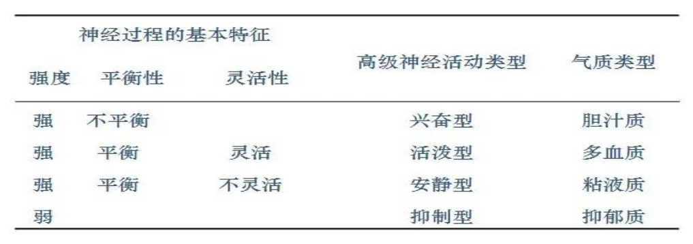
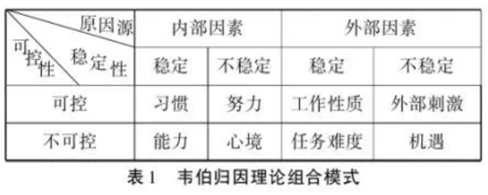
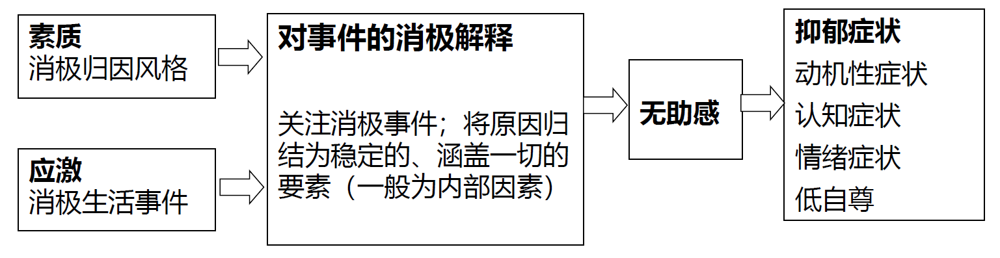
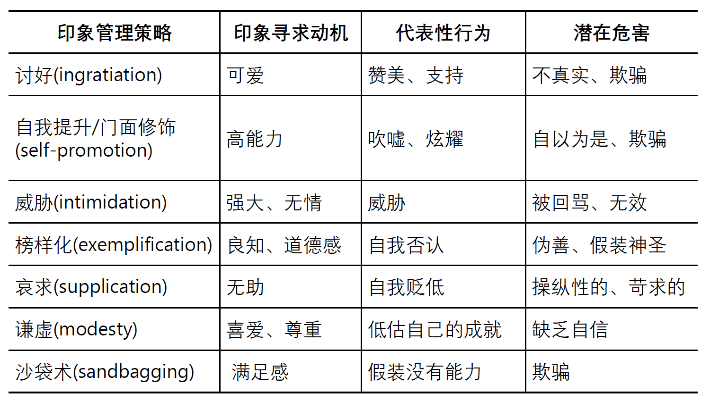
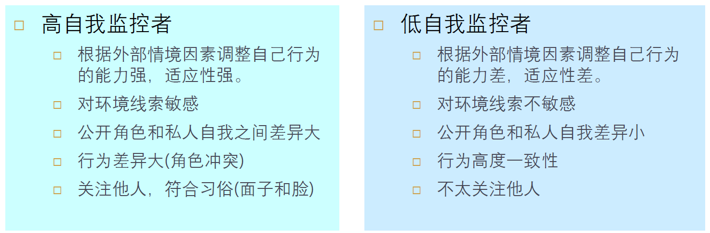
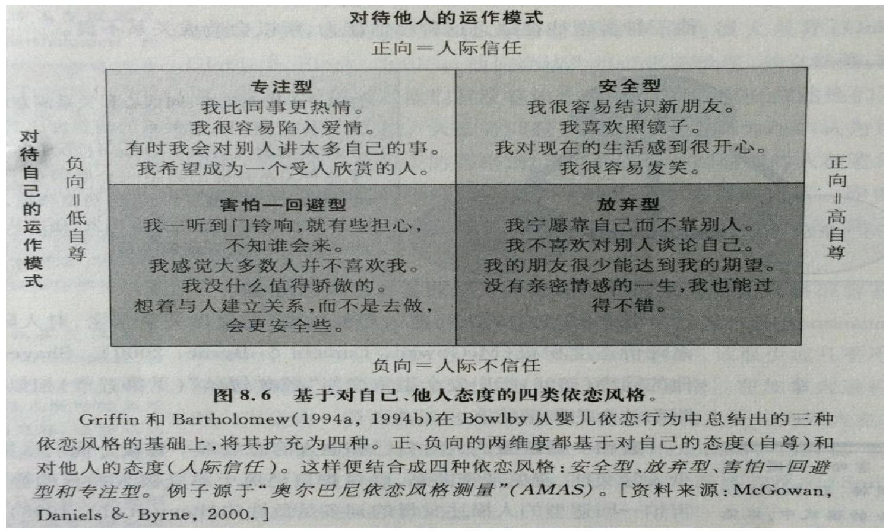
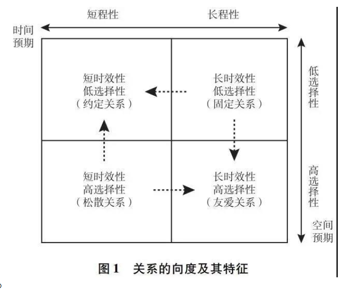
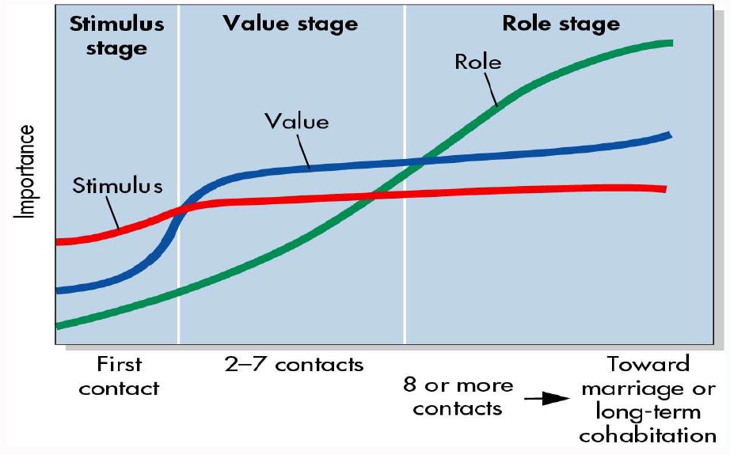
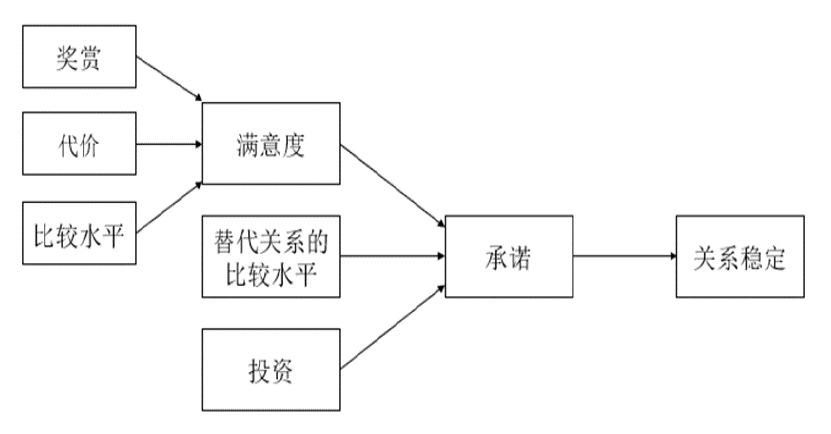

# 冬学期部分

!!! info "注"

    虽然笔记文字量巨大，但最有用的知识点就是**加粗**的那些概念。考试不要求记住这些概念的细节，只要对每个关键概念留个印象就行了，考试的时候就借题发挥了（~~类似高中政治学考（雾）~~）

??? abstract "核心知识"

    === "社会认知"

        - 图式：概念、功能
        - 社会认知过程
            - 自动式加工（无意识）：内容无意识、源无意识、影响无意识（具身、隐喻）
            - 启发式加工：直觉/启发式加工、代表性启发式、可得性启发式、锚定与调整
            - 受控加工（有意识）：反事实思维、思维抑制
        - 决策和判断：损失回避、沉没成本、心理账户
        - 魔幻思维
        - 道德决策

    === "社会知觉"

        - 非语言线索
        - 印象形成：首因效应、近因效应、消极偏差、刻板印象、晕轮效应、投射效应、期望效应...
        - 归因：
            - 理论：海德的朴素心理学、三维理论
            - 归因偏差：基本归因错误、相应推断理论、行动者-观察者差异、自我服务偏差
            - 应用
            - 责任归属

    === "自我"

        - 概念：自我中心思维、自我控制
        - 自我知识：
            - 来源：自我构念、社会认同、人际关系、自我加工
            - 自我复杂性：压力缓冲模型
            - 自尊：进化、文化、人际关系、外显自尊/内因自尊
            - 自我差异性
            - 自我属性

        - 自我动机：
            - 自我评价
            - 自我提升
            - 自我证实
            - 自我呈现

    === "人际关系"

        - 概念：六度分离理论、四种类型、关系响度理论...
        - 人际吸引：
            - 情境因素：接近性、熟悉性
            - 个体特征：外表吸引力、真诚、能力
            - 匹配：相似性、互补性
            - 人际关系现象

        - 亲密关系：
            - 爱情：爱情三元论（亲密、激情、承诺）
            - 社会交易理论：一些简单公式

    === "社会行为"

        - 攻击性
            - 一般攻击模型：
                - 个人因素：基因、激素、脑和攻击性
                - 社会情境：挫折、环境（高温/拥挤）、凶器/酒精/性、激活唤起理论
                - 社会认知过程
            - 干预：药物/手术/脑刺激、惩罚、VR
            - 应对：宣泄、分心、重新归因、宽恕
        - 亲社会行为
            - 理论：进化心理学（群内选择）、社会规范理论、社会学习论、社会交换论
            - 助人的决策过程（5步）
            - 助人者
            - 受助者

## 社会认知

**社会认知**：主观建构社会现实

- 社会认知过程受到人们的信念、动机、情绪、人格、自我概念等因素的影响
- 助推：通过了解人的社会认知过程，更好促进个人幸福和社会发展

### 图式

**图式**(schema)：对特定对象的**有组织的**、**结构化**的认知结构

分类：

- 角色图式(role schema)：对特定角色的认知结构
- 个人图式(person schema)：对特定个体的认知结构
- 自我结构(self-schema)：对自己的认知结构
- 团体图式(stereotype)：对特定群体的认知结构
- **脚本**(script)：对事件或事件顺序的图式（以情境为特性的一系列事件）

表征形式：语义和图象

图式的功能：

- **填充信息**：脚本
- **组织信息**
- **引导加工**
    - 图示化加工：信息越是模糊，人们越有可能使用图式来弥补
        - 自上而下加工（脑补）
        - 图式不一致
            - 道德二元论：道德侵害模板包括有意图的行为者，与遭痛苦的受害者，且两者存在因果关系
            - 心智感知(mind perception)
                - 能动性(agency)：计划与执行的心智能力（包括自我控制、判断、交流、思考、记忆），与加害者关联
                - 感受性(experience)：人们感觉和感受的心智能力(包括饥饿、害怕、痛苦、愉快)，与受害者关联
                - 能动性与道德责任相对应，感受性与道德权利相对应

图示的个体差异：有无、高低、深浅

### 社会认知过程

社会认知的双加工过程(dual process theory)：从无意识、启发式到有意识

#### 自动化加工

特点：

- 意向性(intentionality)
- 意识(awareness)
- 可控性(controllability)
- 效率(efficiency)

进化根源：

- 形成：压抑、联结学习、习惯化、进化
- 原因：远因（进化）、近因（个性）、即时原因（情境）
- 自然选择和适应
    - 恐惧使得祖先能够对潜在的威胁如毒虫、毒蛇和敌人等迅速做出反应；身体持续保持高度唤醒状态，形成战斗/逃跑反应模式
    - 由进化而来的心理机制：人类的许多倾向和偏好是自然选择的结果
    - 人类祖先面临的许多重要问题本质上是社会性问题，在解决这些问题过程中形成不同的心理机制，如归属需要、对群体排斥的恐惧、与他人合作的能力、在孩子身上的投资意愿等
    - 进化心理学
    - 自然主义谬误：存在即合理吗，即是什么 $\ne$ 应该是什么

:star:类型：

- **内容无意识** 
    - **内隐联想测验**(implicit association test, IAT)：检测内隐自尊、态度和刻板印象
        - 自恋：外显自尊高，内隐自尊低
        - [IAT程序](https://www.millisecond.com/download/library/IAT/)、[IAT网站](http://www.projectimplicit.net/)
    
- **源无意识**
    - **阈下觉察**
        - 阈下广告(subliminal advertisement)
    - 内隐学习
        - 经典条件反射/联想学习：无关刺激(CS)（比如铃声）与无条件刺激(UCS)（比如事物）的配对重复呈现后，无关刺激的呈现会产生无条件行为（比如唾液分泌）
        - 评价性条件反射程序：态度对象(无关/条件刺激)与积极或消极刺激(无条件刺激)配对呈现，多次重复后，态度对象获得了无条件刺激的效价
        - 阈下评价性条件反射：阈下呈现条件刺激或无条件刺激

- **影响无意识**
    - **具身认知**(embodied cognition)：大脑通过身体的性质、感觉和方位等来认知世界
    - **隐喻**：一种认知工具，人们用它来理解相对更容易理解的表面上不同概念来理解抽象概念。
        - 具身到隐喻：
            - 计算机科学：中毒、死机、存储空间，保存到电脑
            - 积极和消极
            - 道德与价值观：黑钱

        - 概念的隐喻：

            

                
            

            - 结构隐喻：以一种概念的结构来构造另一种概念，使两种概念相叠加
            - 方位隐喻：将上-下，前-后，深-浅，中心-边缘等具体概念投射到情绪、身体状况、社会地位等抽象概念     
            - 本体隐喻：将抽象模糊的概念看成具体有形的实体，特别是人的身体；事件和行为被概念化为物体，活动被概念化为物质，状态被概念化为容器

    - 具身、隐喻与道德
        - 身体经验(如温暖、洁净、轻重)无意识影响内在抽象的心理过程，如人际亲疏、权力高低、道德判断等
        - 黑白与道德判断：在价值领域，身体的干净整洁与道德的纯洁清白之间存在隐喻映射
        - 轻重与道德判断
            - 较重的重量感知让人们的道德判断更为严格，不容易道德妥协；
            - 相比于具有不道德信息的物品和中性信息的物品, 个体倾向于将具有道德信息的物品知觉得更重。
            - 隐喻：人们用德高望重、举止庄重、一诺千金、一言九鼎等描述一个人的举止符合道德规范，而用轻薄、轻佻、举止轻浮、轻诺寡信等描述举止不符合道德规范

#### 启发式加工

**启发式**(heuristics)：减少社会认知过程中的努力。

- **直觉/启发式加工**：人们加工可能性的信息与贝叶斯公式很少有关甚至无关，人们往往不顾事件的基础比率而采用启发式策略，依据**直觉和经验**对事件进行判断，而不是系统地、有步骤地解决问题。何时使用：
    - 注意资源有限、记忆容量有限
    - 话题不重要、时间紧急、信息超载
    - 没有其它知识和信息
    - 情境因素唤起已有启发式，使其在认知上具有实用性
    - 人们拒绝做复杂决策

- **代表性启发式**(representativeness heuristic)：人们倾向于根据样本是否代表（或类似于）总体判断其出现的概率，越有代表性，被判断为越可能出现。
    - **合成谬误**：样本与群体
    - 误解随机性：
        - 随机性的原型：人们通常把与实际的随机序列相比，存在更多转换的序列看作是随机序列
        - **赌徒谬误**：人们以为随机序列中，一个事件发生的机率与之前发生的事件有关，即其发生的机率随着之前没有发生该事件的次数而上升的错误信念。
        - **热手谬误**：人们认为一个的随机结果会重复发生多次
        - 赌徒谬误和热手效应都源自认知偏差：认为一系列事件的结果，在某种程度上隐含了自相关的关系。从事物发展来看，人们对
            - 基于随机的事件，会出现赌徒谬误
            - 基于技术的事件，会出现热手效应

- **局部代表启发式**：人们错误地诠释了“大数法则”的平均律：人们倾向于认为大数法则在适用于大样本的同时，也适用于小样本
    - “小数法则” (law of small numbers)：认为局部具有总体所具有的全部性质的一种错误信念

- **可得性启发式**：人们依据某类事情是否容易被回想起来（回忆起该事件的难易程度，以及能够回忆起的事件数量），来判断发生的概率或频率，容易被知觉或回想起来的事件常被判定为经常出现。
    - 信息可得性存在差别
    - 生动性：一个例子胜过千万数据
        - 生动性效应(vividness effect)
            - 情感上有趣的
            - 具体的，能够引起人们想象的
            - 在感觉、时间和空间方面让人们感觉更接近的
            - 奇闻轶事比统计数据引人注目：人们难以从一般公理中演绎出一个具体例子，但从一个鲜明的例证中归纳出一般公理则非常迅速
            - 对感人/骇人的生动故事需保持足够警惕，不要被情绪所主宰，注重统计数据，很多时候只有统计数据才能相对真实地反映出客观情况

    - 启动效应：（可得性启发式）先期呈现的信息，促进个体对后续相关信息的加工
    - 应用与克服：
        - 组织情境
            - 紧急事务(5分钟事情)常吸引人们的更多关注，从而忘记去处理重要事务
            - 下属如果在领导面前经常出现，会增加被提拔的可能性
        - 狗咬人不是新闻，人咬狗才是新闻

- **锚定与调整**：（先入为主）人们的判断是以某个初始值或锚为依据，然后进行并不充分的上、下调整
    - 经典锚定效应：语意启动范式
        - 第一步，要求被试对于问题中需要作出估计的未知目标值，是高于或低于某一个锚值进行判断和回答
        - 第二步，要求被试估计目标值的绝对数量
    - 人们难以对锚定进行充分的调整
        - 专家也难以对锚定做出充分调整
    - 应用：
        - 消费者心理
        - 谈判法则
            - 争取先开价
            - 开价越极端越好
            - 在开价前，先提醒对方所开之价是荒唐的

#### 受控加工

受控加工：高努力水平思维

- **反事实思维**：在某种情况下，想象与事实不同的另一种可能性，表现为虚拟蕴涵命题：要是······就好了
    - 依据心理模拟内容的性质，反事实思维分为三种类型：
        - **加法式**(additive)：在前提中添加事实上未发生的事件或未采取的行动，而对事实进行否定的反事实思维：要是当时好好复习，这次考试就通过了
        - **减法式**(subtractive)：从真实事件中删除某些因素然后再重新进行建构：如果没有带这么多东西的话，我们现在就可以跑得快点了。
        - **替代式**(substitutional)：假设如果是替代性的前提，则可能有另外的结果：如果平时好好学习而不是打游戏的话，奖学金就是我的啦。

    - 或分为：
        - **上行反事实思维**(upward counterfactual)：对于已发生的事件想象如果满足某种条件就有可能出现更好的结果
        - **下行反事实思维**(downward counterfactual)：可替代的结果比真实结果更糟糕
    - 作用：
        - 反事实思维的积极作用
            - 让我们更好地为未来做准备
            - 让我们在承受消极后果后感到好受些：大难不死的人
            - 降低痛苦和失望：能做的都做了，死亡没有办法避免
        - 反事实思维的消极作用
            - 下行反事实思维有时候可能让我们目光短浅
            - 抑郁：
                - 反刍思维：当遭遇诸如考试失败、丧失亲人等消极生活事件后，个体的思维停留在该事件的影响之中，反复思考事件的原因、后果及其给自己带来的感受等，如不断回想“为什么这种事发生在我身上”。
            - 后悔：将事件的真实结果和可能发生的一个比真实结果更好的假设结果相比较，并伴随痛苦情绪的过程
                - 上行或加法反事实思维容易引发后悔

- **思维抑制与压抑**
    - 思维抑制：个体故意抑制或避免某些想法的心理过程，反而使这些想法在心里持续更久。
    - 压抑：
        - 当情绪被唤起时不作出任何表达性的举动，克制自己释放出表现该情绪的面部表情、行为和言语等以掩藏此刻的情绪体验
        - 我们会压抑自己的一些想法、欲望以及行为的冲动
        - 压抑更耗费心智资源

    - 白熊实验：压抑一个过程使之不进入思维，需要包括两个先后认知过程
        - 自动监视过程：人们搜寻想要强行进入意识的不受欢迎的思想或观念
        - 受控加工过程：人们有意识地尝试思考其他事情分散当前的注意力，这需要投入过多的努力

    - **回弹效应**(rebound effect)：试图压抑的内容会以更激烈的形式，再次回到人们身上

### 决策与判断

- **损失回避**
    - **框架效应**(framing effect)：同一问题的两种逻辑相似的说法，引导决策者选择不同的选项。类型有：
        - 风险框架：比如亚洲疾病问题
        - 特性框架：比如80%瘦肉的肉 vs 20%肥肉的肉
        - 目的框架：用死亡率来说服病人更为有效
            - 如果做手术，可以让病人的存活率从80％提高到90％
            - 如果不做手术，可以让病人的存活率从90％降低到80％
        
    - **损失厌恶**(loss aversion)：人们在面临获得时偏向保守，在面临损失时容易冒险
    - **得失不对称**(Gain-loss asymmetry)：人们对损失和获得的敏感程度不同，损失的痛苦要远远大于获得的快乐

- **沉没成本**(sunk cost)：已投入且无法回收的成本，人们常因不愿浪费而继续投资，导致非理性决策。
    - 损失回避会引发沉没成本效应
    - 沉默成本现象：铱星计划

- **心理账户**(mental accounting)：个体在心理上对金钱和资源进行分类、记账、估价和预算的过程。钱并不具备完全的替代性，人们会为不同来路的钱建立不同账户。

### 魔幻思维

**魔幻思维**(magical thinking)：基于非理智假设的思维。

- 传染病法则(the law of contagion)：认为两个物体可以通过接触传递某些性质
- 相似性法则(the law of similarity)：认为相似的事物会共享基本属性

### 道德决策

- 道德思维模式：
    - 道义论：遵守道德义务，认为一个行为的对错与否，不是由行为的结果决定的，而取决于行为本身及责任、权利和义务等
    - 功利论：利益最大化，通常基于结果的收益最大化来评价道德相关行为

- 道德发展水平测试：

    

- 道德基础理论：

    - 道德多元主义
        - 关爱/伤害(care/harm)：与对他人的伤害、关怀、同情心和保护弱者相关联
        - 公正/欺骗(fairness/cheating)：对公平和正义的关注，及对不平等和欺骗的反感
        - 忠诚/背叛(loyalty/betrayal)：与群体忠诚和群体承诺有关，反对背叛和不忠
        - 权威/颠覆(authority/subversion)：强调尊重权威和等级制度，反对颠覆和无序
        - 圣洁/堕落(sanctity/degradation)：与纯洁和神圣的概念有关，反对亵渎和堕落
        - 自由/压迫(liberty/oppression)：强调个人自由和自主，反对压迫和控制
    - 道德基础的群体间差异
    - 亲社会谎言、亲组织不道德行为

- 人-人交互、人-机交互与群体智能
    - 技术发展影响人的社会认知和人际交互
    - 道德机器(moral machine)
        - 当一个人向自己的机器人寻求自杀帮助时，机器人应该怎么办？
        - 当机器人发现主人的生命受到他人威胁时，能否保护主人而伤害人类？
        - 为了袒护主人，智能机器是否可以欺骗他人？
        - 智能机器人能否说出亲社会谎言(prosocial lie)

    - 人工智能时代的道德挑战：
        - 智能机器可以创造社会规范
        - 基础性问题
            - 我们是否愿意赋予智能机器做道德决策的能力
            - 我们是否愿意让智能机器灵活地进行道德决策  
            - 如何通过编制程序，为智能机器设置道德算法
            - 如何提高我们对智能机器道德决策的接受程度
            - 如何对智能机器的道德决策错误进行责任追究

- 现代社会的道德决策：基因编辑的伦理困境

## 社会知觉

### 概述

**社会知觉**(social perception)：对其他个人或团体的印象，观点或推论的研究。

社会知觉过程：

- 印象形成(impression formation)
- 归因(attribution)

社会知觉范畴：

- 他人
- 自我
- 人际：自己与他人、他人与他人
- 群体：群体实体性(group entitativity)

对人知觉过程：

- 知觉对象：非言语行为、言语行为
- 知觉者的个性和经验：刻板印象、偏见
- 知觉过程：首因效应、近因效应、消极偏差、投射效应、晕轮效应、期望效应

对人知觉线索：

分析人的框架：

- 气质：个体在进行心理活动或在行为表现方式上表现出来的强度、速度、稳定性、指向性、灵活性等动态的个性心理特征
    - 四种气质类型：

        

            
        

- 人格：16PF、EBQ、MBTI、九型人格理论、大五人格(OCEAN)

### 非语言线索

非言语交流：效率——准确性权衡

#### 面部表情

- 脸部表达六种基本情绪：高兴、惊讶、愤怒、恐惧、伤心、厌恶。
- 面部表情的生理基础
    - 情绪表达由面孔不同部位决定：悲哀显现在眼睛，快乐与厌恶表现在嘴部，惊愕由前额显示，愤怒表现在全部面孔
    - 人的面部分为额眉-鼻根区、眼-鼻颊区和口唇-下巴区三个区域：愉快时额眉—鼻根区放松，眉毛下降；眼—鼻颊区眼睛眯小，面颊上提，鼻面扩张；口唇—下巴区嘴角后收、上翘。

- 微笑
    - 微笑的理论：微笑能够让我们的声音更悦耳
    - 微笑与人际关系：笑面虎—只有笑才能成为老虎
        - 微笑以消除敌意：丈夫的傻笑是婚姻的缓冲器
        - 微笑让我们更善良：
            - 研究发现，丢失在街上的钱包有52%的可能性被回还。钱包里装有名片的话，回还的可能性提高8%；最有效的是微笑婴儿的照片，钱包回还率可提高35%。
    - 微笑的自我作用：积极心理学
    - 社交性微笑：
        - 情绪劳动(Emotion labor)：希尔顿的微笑服务

- **面部表情反馈假设**(facial feedback hypothesis)：人为地表现某种面部表情导致相应情绪体验的产生或增强
    - 举例：让被试将一支铅笔咬在嘴里或用嘴唇夹住，同时评价一些卡通片的有趣程度。结果发现，咬住铅笔比用嘴夹住笔让被试觉得更有趣。

#### 眼睛

- 瞳孔：人们误以为瞳孔放大或缩小反映出情绪的愉快和不愉快
- 眼部表现：眼神接触、眼神注视和眼神移动。
    - 高接触与友善、礼貌、自信有关；低接触与攻击、逃避、服从、漫不经心有关(直视)
    - 视觉优势比例(Visual dominance ratio, VDR)＝说话-注视 /倾听-注视 的比例
        - 高VDR(55:45)表明高地位、专业能力、人际控制
        - 女性的VDR通常较低，不超过40:60
        
- 眼神移动：凝视的忽视(分心)、转向、躲避
    - 移开眼神会显示不可信任、缺乏能力，降低说服力
    - 向下看显示软弱、服从

#### 声音

- 声音线索：音量、速度、音质和音高
- 含义与运用
    - 语速快慢：心直口快
    - 低音调嗓音与积极人格特质相联，被知觉为更具吸引力、能力、支配性
    - 高音调的男性嗓音被认为更值得信任, 而低音调的女性嗓音却被知觉为更值得信任
- 声音与情感
    - 娃娃腔(baby talk)
    - 副语言(paralanguage)：语速、节奏、响度、间隔、特质音(指哈欠、咳嗽、喷嚏、打嗝声等由口鼻发出，但完全独立于语言或文化之外的自然声响)等语音特质。
        - 语气助词：呀、吧、呦、啊等具有积极含义

#### 嗅觉

嗅觉(olfactics)

- 嗅觉的丧失会被视为老年痴呆症的前兆

#### 接触

- 接触交流(haptics)：功能专业接触和社交礼貌接触
- 身体接触表达的信息
    - 情感
    - 关怀
    - 性吸引
    - 侵犯
    - 优越感(地位差异)
        - 握双手则表明诚意、给人威严感

- **触碰效应**让距离迅速拉近

#### 外表和装饰

- 外表和装饰(appearance and adornment)：通过衣服、化妆品、物体等有形物质传递信息

#### 肢体语言

肢体语言(body language)指借助身体和头部的运动、姿势、手势等传递信息

- 权力姿势：地位高的人通常采用开放的、不对称的姿势，身体左右两侧作出不同的姿势

#### 空间利用

#### 时间使用

- 时间使用：人们如何组织时间，如何对时间作出反应，认为时间传递了什么信息
- 线性时间和多角时间(Monochronic and polychronic time)
    - 线性时间指一个时间内只做一件事情：美国
    - 多角时间指一个时间内做许多事情：地中海、阿拉伯和南美国家
    
#### 环境

- 在整洁环境中人们的行为更有控制性和友善，会选择健康饮食、从事慈善及符合规范的行为；但在杂乱房间中，人们在创造性测验中的表现更好，且倾向于做出新尝试。
- 从人格特质的角度来看，喜欢整洁的人可能会喜欢秩序、传统、惯例、约定俗成、保守。能够忍受混乱的人，同样可以忍受模糊不清的状态，更为看重个人的自由。
    - 秩序通常与道德约束、正确的行为模式有关，而混乱则与偏离标准、禁忌的行为关系密切
- 整洁的环境有利于工作效率的提高，因为环境会提高人们的自律行为。从机会成本来看，时间和精力花费在整理房间或书桌上，就无法用在有创造力的工作中。但是，混乱的工作环境却能激发人们的创造性
- 懒癌除外！！！

#### 现代科技与交流

- E-mail不能有效传递信息
- 表情符号(emoji)与人格判断
    - 个体在描述中使用了网络语言，会被知觉为具有较低的宜人性、开放性与自尊水平，以及较高的情绪稳定性
    - 脸书中符号表情的使用与开放性和宜人性正相关；宜人性与神经质的个体使用更多的符号表情
- 网络尬聊

### 印象形成

**印象形成**(impression formation)：观察者将自我展示着的各种信息综合起来，以形成一个完整而一致的判断过程。

- 顺序效应：
    - **首因效应**：人在记忆或判断时，最初接触的信息对后续的印象或决定有较强的影响，即**最早形成的印象**通常会持久影响对某人的总体评价。
    - **近因效应**：人在记忆或判断时，最近接触的信息对决策或评价的影响较大，即**刚刚接触到的信息**比较早的信息更容易被回忆起来。
- 中心特质：热情、冷淡等对印象形成起重要作用的特征
    - 边缘特质：文雅、粗鲁等
    - 社会知觉的代数模型：元素论
        - 包括：加法模型、平均模型、加权平均模型
- **消极偏差**(negative bias)：消极信息在形成他人印象的过程中的作用更大
    - 损失回避：消极偏差具有进化论基础

印象形成的社会认知过程：

- **刻板印象**(stereotype)：人们对一类人或事的固定、概括而笼统的看法。
    - **刻板印象威胁**(stereotype threat)：指一个人在某种环境里担忧或焦虑自己的行为，将会验证那些对于自己所属社会群体的负面刻板印象，这种焦虑将会消极地影响一个人的表现。
        - 性别刻板印象威胁
        - 种族刻板印象威胁
        - 劣势者预期

- **晕轮效应**(halo effect)：当对一个人的某种特征形成好或坏的印象后，倾向于据此特征推论其他的特征/区别于首因效应
    - 晕轮效应在爱情和偶像崇拜中最为明显
    - 晕轮效应的作用机制：**内隐人格理论**(implicit personality theory)
        - 内隐人格理论探讨哪些人格特质能够组合在一起，认为人格特质并非独立存在，而是相互关联
            - 善良的人会慷慨大方，吝啬的人则暴躁易怒
            - 乐于助人之于真诚，务实之于谨慎
        - 容貌的内隐人格理论：
            - 美的就是好的
            - 娃娃脸：一种特殊的容貌

- **投射效应**：在认知和形成他人印象时，以为他人具有与己相似的特性的现象，将自己的感情、特性投射到他人身上并**强加于他人**。投射效应有以下类型：
    - 相同投射：从自我出发做判断
    - 愿望投射：将自我的主观愿望强加于人
    - 情感投射：以自我的爱憎指引交往

- **期望效应**
    - **自我实现预言**(self-fulfilling prophecy)：最初持有的错误期望引发某些行为，从而使得期望变成现实。
        - 条件：持有错误期望的人在社会交往中占据主导性、控制性地位；被期望的对象顺从于这种控制
        - 行为验证(behavioral confirmation)：一旦形成错误的社会信念，就可能引导他人做出某些行为反应，以支持这些信念。
        - 积极运用：
            - 婚姻关系：对伴侣的理想化有助于缓解冲突，保持婚姻满意度
            - 友善会带来友善

### 归因

#### 概述

**归因**(attribution)：人们解释行为原因的过程。

- 归因决定当下的感觉、态度与行为
- 归因影响未来预期
- 错误归因可能带来不利后果

#### 理论

因果关系会给我们提供确定性。

- **海德的朴素心理学**
    - 人们存在两种动机：**有条理地了解环境**与**控制环境**
    - 人们在分析他人行为时，常常推测该行为出于内在的或外在的原因
    - 原因的维度
        - 原因源
            - **性格归因**(dispositional attributions)：特质、态度和持久的内部状态，如动机、情绪状态、心境、能力、努力等
            - **情境归因**(situational attributions)：外部环境、其他人、角色限制、该行为可能得到的奖赏或惩罚、运气、工作的特殊本质等
        - 稳定性：原因是否具备永久的特征
        - 可控制性：原因是否在可控范围内
        - 抑郁：普遍性和特异性
    - **成败归因理论**：人们将成败作四种归因，即努力与否、能力高低、任务(事业)难易和机遇好坏

    

        
    

- **Kelley的共变模式(covariation model)/三维理论**：人常常会寻求某个原因与结果之间在许多不同状况下的联系
    - 人们分析相同的结果是否会在不同的对象、行为者或情境中出现
        - **行为人**(person)：情境中的个体
        - **刺激物**(stimulus)：情境中的某些固有特征   
        - **背景**(context)：特定时刻的某些因素
    - **归因的三维理论**：人们同时使用三方面信息以探究行为原因
        - **一致性**(consensus)：该情境中的**其他人**也有同样的行为吗？（较少使用）
        - **区别性**(distinctiveness)：此人只有对这个刺激**对象**，才有这样的行为吗？
        - **一贯性**(consistency)：在不同时间和不同情境下，对于同一刺激是否会产生相同的反应？
    - **原因图式**(casual schema)：人们并非如Kelley所述，从对象独特性/区别性、行为者一致性、场合一贯性三类信息推测他人的行为原因，有时候会采取思考的捷径(short cuts)。不同原因之间会相互影响
        - **折扣原则**(discount principle)：特定的原因产生特定的结果的作用，会由于其他可能的原因而削弱
            - **过度理由效应**(overjustification effect)：外部酬赏会损及对内部动机的归因现象，这是折扣原则的归因图式
            - **德西效应**(Deci effect)：在进行一项愉快的活动（内在报酬），如果同时提供外部的物质奖励（外在报酬），反而会减少这项活动对参与者的吸引力，动机强度会变成两者之差。
            - 折扣原则与操作性条件反射(operant conditioning) 矛盾
        - **扩大原则**(augmenting principle)：对于某一特定结果，同时出现一个似乎合理的抑制性的原因和一个似乎合理的促进性原因，那么与仅出现该促进性原因作为一个似乎合理的原因时相比，对该促进性原因的判断将会增加

#### 归因偏差

- 归因偏差使得个体将事件的结果归结到错误的原因
- **基本归因错误**(fundamental attribution error, FAE)：当<u>解释他人行为</u>时，人们会高估特质和态度的作用，而低估情境的影响
    - 自我特质推理(Spontaneous trait inference, STI)
    - 消极面：
        - 三种重要信念：
            - **公正世界信念**(a just world belief)：善有善报，恶有恶报；人们持有一种基本信念，认为每个人应该为行为负责；在分析行为的原因时我们会追溯个人自身的原因
            - 危险世界信念
            - 自由意志信念
        - 责怪被害人：受害者因为自己的不幸而被指责，无论他们遭遇的是虐待、性侵犯、犯罪还是贫困
            - 人们期待公平，却学会合理化不公平
            - 即使与当前事件无关的因素，也会被纳入对当前事件的判断

- **相应推断理论**(correspondent inference theory)：用来解释人如何形成特质推论的归因理论。
    - 动机：人们希望从特质的角度解释他人行为
    - 相应推论：推论出的行动者的内在心理倾向同这个人的外在行为相符合、相一致的程度/社会赞许性、选择自由性、非共同效应

- 解释机制
    - 锚定和调整：归因的两阶段过程

- **行动者—观察者差异**(actor-observer difference)：在<u>解释自己的行为</u>时，人们倾向于将他人行为归于内部原因，却将自己行为归于外部原因
    - **双重标准**：当个体作为观察者时会犯FAE，但是对于自己的行为却经常用情境因素来解释
    - 行动者-观察者差异的原因
        - 行动者与观察者的信息源不同
        - 行动者和观察者的注意角度不同
    - 高权力者会低估下属完成任务过程中的努力

- **自我服务偏差**(self-serving bias)
    - **争功诿过**(credit for success, blame for failure)：人们观察和评论自己的行为时倾向将成功归于内因，而将失败归于外因；观察和评论别人的行为时将他人成功归于外因，将他人失败归于内因

#### 应用

- 归因和抑郁：据估计，大约有一半的人在生命的某些时期经历过抑郁
    - 自我攻击的归因模式：抑郁者倾向于将否定结果归因于持久的、内部原因，如不良特质或能力欠缺；将肯定结果归因于暂时的、外部的原因，如好运气
- 归因训练
    - 引导个体改变对失败的因果知觉：把稳定的、内在原因改变为不稳定的、外在原因
    - 引导个体将原因归于可控、不稳定的内在因素，如努力

- 抑郁者的消极归因方式：在抑郁状态下，人们表现出永久性、普遍性和个体化的极端表达
    - 抑郁者将坏事情看作是永久的，而好事情是暂时的
    - 抑郁者将坏事情看作是普遍性的，而非特殊性的
    - 抑郁者的个体化，当坏事发生时抑郁者习惯于苛责自己

    

        
    

#### 责任归属

- 归因与决定论
- 归因与因果链
- 儿童对责任的归属
- 人工智能与责任归属
    - 智能机器本身
    - 使用智能机器的组织机构
    - 编写程序的软件开发商
    - 选择与智能机器交互的用户
    - 当人类和智能机器共同犯错，如何进行责任归属

!!! abstract "总结"

    - 归因理论希望帮助人们了解自己行为背后的原因
    - 而很多时候，人的行为却是各种原因交互的结果

## 自我

### 概述

**自我**(self)：人们对自己所持有的主要信念的集合，即我是什么样的人。

- **自我中心思维**(egocentric thought)：人们对自我的感觉处于意识的核心，从自我出发而非客观地看待事物。有以下表现：
    - **错误一致性效应**(false consensus effect)：在观点上，人们倾向于高估他人会像我们同样地思考
    - **虚假独特性效应**(false uniqueness effect)：在能力上，当人们做得不错时倾向于将其聪明才智看成是超乎寻常，以满足自我价值感
    - **聚光灯效应**(spotlight effect)：将自己视为舞台的中央，高估别人注意我们的外表和行为
    - **透明错觉**(illusion of transparency)：以为隐藏的情绪容易泄露，并被人所知晓的一种错觉
    - **巴纳姆效应**(Barnum effect)
- 自我服务偏差（[前面](#归因偏差)介绍过）
- **自我控制**：
    - 控制冲动
    - 控制情绪
    - 控制思维
    - 控制表现：将心理资源集中于当前任务
    - **自我控制的资源模型和自我衰竭**(ego depletion)：人的自我控制资源是有限的，可因使用而短暂枯竭
    - 心理许可和道德许可
    - 恢复自我控制：长期性的自控力、暂时性恢复自我控制
        - 生理：补充血糖（自我控制的血糖模型）
        - 运动：锻炼、冥想、金钱、仪式
        - 心理：积极情绪/乐观
            - 成长思维
            - 解释水平：高/抽象、低/具体的解释水平
        - 意义：创造人生工作的价值和意义

### 自我知识

概念：

- 生理自我：躯体、性别、容貌、年龄、健康等方面的认识
- 心理自我：能力、兴趣、爱好、气质、性格等方面的认识
- 社会自我：在群体中的地位、名望、受人尊敬和接纳等方面的认识

#### 来源

- 文化与自我：**自我构念**(self construal)
    - **独立性自我**(independent self)：将自我看成是有界限的、单一的、与社会情境分离的
    - **互赖性自我**(interdependent self)：将自我看作灵活的、可变的、与社会情境关联的

- **社会认同**(social identity)
    - 自我概念来自所属群体身份(种族、家族、群体)，以及属于此群体的价值与情感
    - 优势群体和劣势群体

- **人际关系**
    - **社会比较理论**(social comparison theory)：当人们对自己的能力不确定时，会与相似的他人进行比较来评估自己
        - 人们有准确评价自己的观念、能力和驱力
        - 人们在缺乏客观标准时，通过与他人比较来评价自己
        - 人们通常喜欢与相似的人进行比较
        - 社交媒体加剧了社会比较，扩到大了社会比较范围
        - 完美人设和理想自我
        - FOMO症候群
            - FOMO, Fear of missing something
            - FOBO, Fear of better options
            - MOMO, Mystery of missing out
            - FODA, Fear of doing anything
    - 社会比较的表现形式
        - 合理进行社会比较
            - 向下比较(downward)：合理选择比较对象，如心情不好去医院急诊室看看
            - 向上比较(upward)：承认别人的优秀
            - 与过去的自己比较
        - 攀比
        - 他人反馈
            - **反射性评价**(reflected appraisal)：根据他人对自己的反应来知觉自己
            - **镜我**(looking-glass self)：我不是以为的我，我也不是你以为的我，我是我以为你以为的我
                - 劣势者预期
            - Cooley(1902)认为，自我包括三个要素
                - 展现(presentation)：想象我在他人心目中的形象
                - 辨认(identification)：想象他人对此形象的评价
                - 主观解释(subjective interpretation)：由此形象产生自我的感觉

- **自我加工**
    - **自我知觉理论**(self perception theory)：行为的知觉
        - 面部表情反馈假设
        - 当内在线索微弱时，人们通过观察其行为与当前的情境推论自己的想法和感受
        - 想了解自己的人品好坏，看与自己交往朋友的多寡
    - **自传式记忆**(autobiographic memories)：记忆塑造自我概念，自我概念也会雕塑个人记忆
    - **内省**(introspection)：思考“究竟是什么”构成了我是谁

#### 自我复杂性

- **自我复杂性**(self-complexity)：个体对自己知觉的复杂程度
    - 有些人通过1个或2个占优势的方面来认识自己，另一些人则将自己的认识建立在很多特征的基础上
    - 某些学生认为其主要身份是学生，自我认识仅基于学业表现；另一些人可能分别从学生、子女、运动员等多角度认识自我。

- **自我复杂性的压力缓冲模型**：高自我复杂性的人能够将注意力从自我的某一个面向(facet)，转到另外一个面向以缓冲压力
    - 当生活中的一个方面遇到逆境而其它方面令人满意时，逆境的危害小于将全部生活重心放在一个方面的情况
    - 我们需要具有积极的、复杂的自我表征来应对逆境

#### 自尊

**自尊**(self-esteem)：个体对自我价值的感受，在多大程度上相信自己是有能力的、重要的、成功的和有价值的

- 进化：自尊的**恐惧管理理论**(terror management theory, TMT)
    - **死亡提醒假说**(mortality salience hypothesis)：每个人都有对死亡的恐惧心理，为了缓解对死亡的恐惧人们创立文化世界观
    - **焦虑缓冲假说**(anxiety buffer hypothesis)：文化世界观可以使人们感觉象征性的超越死亡，并给人提供一种感觉，即每个人是这个有意义的世界中有价值的一员
    - 自尊是对个人价值的评价和感受，是人们对其生命意义感和价值感的体会，保护人们免受与生俱来的对死亡的恐惧所带来的焦虑。自尊获得途径包括：
        - 相信自己所持有的文化世界观的正确性：人们可以获得意义感，因为文化世界观是对现实世界的抽象反映，只有“正确的文化世界观才能赋予我们存在的意义。
        - 相信自己所遵守的价值标准是文化世界观的一部分：人们可以获得价值感，因为对这种已经内化的价值标准遵守程度的评价，反映了个体价值和价值标准体系的关系，遵守程度越高，两者间关系越紧密，个体的价值感也就越高。

- 文化：东亚人的谦逊
- 人际关系：
    - 自尊的社会计量理论(sociometer theory)：对自尊的需求源于希望能够与他人连结和得到他人认同
    - 发展理论：埃里克森(Erikson)的心理发展理论认为，婴儿最初的发展任务中
        - 第一阶段是建立对抚养者的信任，对应自尊的**归属感**(belonging)、人际、温暖感
        - 第二阶段是自主对害羞和怀疑，对应自尊的**掌控感**(mastery) 、能力

- 自尊的稳定性  
    - 高自尊的阴暗面
        - 极端种族主义者、恐怖主义者、黑帮头目
        - 高自尊者在受质疑时会报复
    - 真正的 vs. 脆弱的自尊(true and fragile self-esteem)
        - 脆弱高自尊者往往将自尊建立在金钱、容貌、分数与他人的赞美上
        - 脆弱高自尊者的画像
- 外显自尊和内隐自尊
    - **内隐自尊**：自动化过程作用的结果，反映个体对自我的即时性、自动化的情感反应
    - 外显自尊：受控过程作用的结果，是个体对于即时性的、自动化的情感反应的合理性和准确性进行精细加工的产物
    - 自尊类型
        - 安全性高自尊：外显自尊高、内隐自尊高
        - 防御性/脆弱型高自尊(defensive or fragile high self-esteem)：外显自尊高、内隐自尊低
        - 受损型自尊(damaged high self-esteem)：外显自尊低、内隐自尊高
        - 低自尊：外显自尊低、内隐自尊低

#### 自我差异性

**自我差异理论**(self-discrepancy theory)：人们参照内在的理想和应该的标准来评价自己，由此产生特定情绪，并以此作为个人行为的指引。

- **现实自我**(actual self)：我是什么人
- **理想自我**(ideal self)：我想要成为的人(奢侈品消费)
- **应该自我**(ought self)：我觉得自己应该成为的人
    - 现实自我－理想自我差异过大：失望、不满或悲伤
    - 现实自我－应该自我差异过大：害怕或焦虑
- 害怕成为的自我(feared self)
- 未来自我连续性：一个人将<u>现在自我</u>和<u>未来自我</u>联系在一起的紧密程度，反映了他/她在时间维度上自我连续性的强度
    - 学业成就/拖延、心理健康、社会行为

#### 自我的属性

- **自我效能感**(self-efficacy)：认为自己能够成功完成某一任务的信念
    - 对自己能力与效率的乐观信念可以获得很大回报
    - 习得性无能(learned helplessness)
- **自我的控制源**(locus of control)：内控者和外控者
    - 船夫和乘客：人是自己命运的主宰者，还是环境的牺牲品？
    - 内控者：在学校表现优秀、成功戒烟、经常系安全带、直接处理婚姻问题、赚很多钱、可以延迟满足以实现长远的目标

    |内控者|外控者|
    |:-|:-|
    |· 从长远来看,世界上的每个人都应该得到他人的尊敬 · 发生在我身上的事是我自己的事 · 即使一个普通人也可能对政府决议产生影响|· 不幸的是，不管人们多么努力，其价值在未得到众人认可前就一晃而过了 · 有时候我觉得自己无法控制自己的生活 · 这个世界是靠少数有权势的人运转的，小人物没有什么可为的|

    - 自我控制源关注对行为结果的控制，自我效能感关注对自我的信念

- **自我控制感**
    - **生命意义感**(meaning in life)
        - 空心病
        - 反思，而非反刍
    - **稀缺心态**(scarcity mindset)和富足心态(abundance mindset)
        - 稀缺心态是一种认为自己所“拥有的”少于“需要”的感觉
        - 贫困个体可能会因为想减轻经济压力而做出可能导致处境恶化的决策，倾向于贷高利贷；减少储蓄；在经济选择任务中有表现出更多偏见；更频繁地参与彩票活动等。
        - 管窥(tunneling)
        - 带宽(bandwidth)

- 自由和选择并不是越多越好
    - 回避选择：选择太多的代价
    - 更多的选择会带来信息超载，也带来更多后悔的机会

### 自我与动机

自我与动机：自我的动机功能的目的是什么？

- **自我评价**以寻求自我认识，渴望评定自己：准确性
- **自我提升**(self-enhancement)以保持积极的自我概念：享乐主义者
- **自我证实**(self verification) 以维持自我概念一致性：一致性
- **自我展示**(self presentation)以给他人留下好的印象：政治家

#### 自我评价动机

自我评价动机：对自己形成正确的评估以预测和控制其未来。

- **诊断性作业**：人们在无需顾及面子的情况下，会选择最能清楚告知自己能力的任务
- **SWOT模型**
    - **优势**(strengths)：能给企业带来重要竞争优势的积极因素或独特能力（内部因素）
    - **劣势**(weaknesses)：限制企业发展且有待改正的消极方面（内部因素）
    - **机会**(opportunities)：随着企业外部环境的改变而产生的有利于企业的时机（外部因素）
    - **威胁**(threats)：随着企业外部环境的改变而产生的不利于企业的时机（外部因素）

#### 自我提升动机

自我提升(self-enhancement)动机：人们维持、提升以保护自尊或自我形象。

- **自我积极性**(self-positivity)：自我认识的准确性 vs 积极性
    - 抑郁者比正常人更能正确地认识自我
    - 正确认识自我并不是心理健康的必要条件
        - 对自己有一个公正、客观的态度，是一种首因的品质，是其他方面得以发展的基础
        - 生活是被欺骗的艺术；为使得欺骗成功，它必须成为不间断的习惯
    - 人们对自我的认识不太准确
        - **有偏差的积极自我评价**
            - 平均以上效应(above-average effect)：认为其在所有方面都属于中上水平
            - Lake Wobegon效应：人们相信自己优于其他人
            - Dunning & Kruger效应：能力不强(incompetent)的人倾向于高估其能力，无法认知和正视自身的不足及不足的极端程度，也无法认知他人真正的能力
                - 越强越谦虚，越差越牛
                - 达尔文：自信更经常来自无知而不见得是来自有知
        - **控制错觉**(illusion of control)：人们夸大自己产生预期结果的能力
        - **乐观**：人们对未来的估计
            - **计划谬误**(planning fallacy)：乐观偏差的一种具体形式，人们通常会低估完成即将到来的任务所需的时间，即使他们之前完成过类似的任务的时候花了更长的时间。
            - 乐观的局限性
                - 盲目乐观(illusory optimism)
                - 过度乐观：自恋(narcissism)
                - 徒劳无益的坚持：乐观的赌徒即使不断输钱也会坚持下去
            - 防御性悲观
                - 设立不现实的低期望，即使以前曾在同样任务中成功过  
                - 执行任务前考虑各种结果，尤其关注这些结果中其表现将会被如何评价
            - 乐观使人健康，悲观则使人长寿

- 自我提升的策略
    - **自我评价维持模型**(self evaluation maintenance model)
        - 人们的自我概念可能会因为他人的行为而受到威胁
        - 威胁的程度取决于对方与我们的亲密程度，以及该行为与我们自我定义的相关程度
        - 自我评价的维持机制
            - **反射效应**(the reflection effect)：在某项和我们自我定义无关的行为上另一人的表现优于我们时，他人表现越好且与我们关系越密切对我们的自我评价越有利。
            - **比较效应**(the comparison effect)：当他人表现比我们好，且该表现和我们的自我定义明显相关时便会威胁我们的自我评价，产生忌妒与不舒服的感觉。
                - 疏远：对科学家进行的档案分析发现，兄弟隔阂尤其容易发生在年龄相近的兄弟身上
                - 改变自我定义中与某项表现的关联性：亲密关系中一方表现出色的领域往往是另一方所不看重的

    - **自我肯定理论**(self-affirmation theory)
        - 价值观自我肯定：写下你的核心价值，如家庭、能吃苦、创造力、事业成功等，再写出成为你核心价值的理由
        - **自我复杂性**：在自尊受威胁时，人们通过肯定自己的一些无关事项，以缓冲自我价值威胁

    - 自我服务偏差(self-serving bias)
        - 表现领域：伦理道德、工作能力、优点、驾驶技术、聪明才智、赡养父母、健康、洞察力、摆脱偏见
        - **自我服务归因**(self-serving attribution)：人们将成功归于自己的能力，将失败归于外部因素

    - 信息加工策略

#### 自我证实动机

- **自我证实理论**(self verification theory)：人们有着证实自我概念的需求，无论自我概念是正面还是负面的。
- 人们倾向于寻求/接近可以加强其自我概念、避免/拒绝与自我概念不一致的情境或反馈
- **认同破坏模型**(identity disruption model)：对于低自尊者，积极生活事件往往与更多的疾病相连

#### 自我呈现动机

**印象管理**(impression management)/**自我呈现**(self presentation)：人们期望向外在观众(别人)和内在观众(自己)展现一种受赞许的形象。

- 戏剧论(dramaturgy)：人的社会交往像是戏剧舞台，每个人都在扮演角色和演出一定节目
- 情境同一性理论(situated identity)：在不同社会情境或人际背景中，人们都有一种合适的社会行为模式

印象管理的目的：

- 促进社会交往：当获得礼物时应该表示喜欢
- 获取物质或社会奖赏：策略性的自我展示
- 自我象征性(self-symbolizing)：青少年的服饰和行为

影响印象管理的因素：

- 交往对象影响人的印象管理：寻求一致性和寻求差异性
- 交往情境影响人的印象管理：交往目标

印象管理策略：

    

**保护性印象管理**：面向危机的印象管理策略

- **自我妨碍**(self handicapping)：个体通过设置障碍，阻挠自己成功以维持自我形象
    - 运动员减少对重要的个人赛事的准备，给对手提供一些有利条件
    - 任务开始时不好好干以避免对自己产生过高期望
    - 自我妨碍的分类：
        - 自陈式自我妨碍：个体为可能的失败寻找的一系列不可控的借口，例如声称的焦虑、创伤性生活事件、疾病等
        - 行动式自我妨碍：个体所能控制的对评价性情境不利的行为或事件，如酗酒、吃药、减少努力、设立过高的目标等

印象管理的个体差异：

- **自我表露**(self-disclosure, self-revelation)：个体与他人交往时自愿在他人面前真实地展示自己的行为，或倾诉其思想。
    - 描述性表露：关于自己的事实，如工作、居住地、生活状况、糗事等
    - 评价性表露：对人、事的意见与评价
    - 自我表露的原因
        - 表达：单纯为了表达感觉
        - 自我澄清：澄清对自己状况的看法—说给自己听
        - 社会确认：想知道自己的看法是否正确
        - 社会控制：如谈判场合中有意吐露自己的身份、人脉
        - 关系发展：开展关系和增加亲密度

- **自我监控**(self monitoring)：个体根据外界情境调整行为的能力
    - 表达性自我控制(expressive self-control)：主动控制、表现行为的能力
    - 社会舞台表现(social stage presence)：吸引社会对个人的注意倾向
    - 他人导向的自我呈现(other-directed self-presentation)：呈现出他人期待个人展现的样子

    

## 人际关系

### 概念

人际关系的功能：

- 减轻寂寞：社会排斥诱发了与身体疼痛导致的相似的大脑反应
- 满足需求：社会交换
- 增进自我了解
    - 社会比较：低自尊个体喜欢向下比较
- 寻求刺激

依恋模式：

    

**六度分离理论**(six degrees of separation)：生活这个世界上的每个人平均只需要通过6个中间人就能与全世界任何一个人建立联系。

人际关系距离：

- **自我对他人的包含**：人与组织、人与机器、人与环境的联结
- **弱关系和强关系**
    - 弱关系：人与人之间联系较少、互动较少、情感投入较低的关系，比如同事、邻居等
    - 强关系：人与人之间联系密切、互动频繁、情感投入较高的关系，比如亲朋好友、恋人等
    - 强关系的组成者的相似度高，他们之间信息的重复性也高，通过强关系传播的信息更可能限制在较小范围内；而弱关系中的信息传播，由于经过较长的社会距离使得信息流动起来
    - 网友分享的放大效应：我们转发别人分享给我们的地址的可能性(p_feed)，比自己看到这个地址直接分享的可能性(p_nofeed)高5倍以上，这两种可能性的比值(p_feed/p_nofeed)即为网友分享的放大效应。
        - 弱联系的放大效应是9，强联系的放大效应是6
        - 强联系告诉我们的有用信息，我们即有可能发现；而弱联系告诉我们的有用信息，我们可能发现不了。

- 人际关系的四种类型（关系理论模型）
    - **共有共享关系**(communal sharing relationship)：群体中所有成员在需要的时候共享资源并相互依靠和照顾
    - **权威等级关系**(authority ranking relationship)：高等级个体有权享受忠诚、尊敬和尊重；低等级个体则获得保护、建议和领导
    - **平等匹配关系**(equality matching relationship)：没有人比其他人获益多，大家轮流、平等分享、相互回报
    - **市场定价关系**(market pricing relationship)：根据合理的利己原则进行交易。个体的付出与获得的商品或服务成正比，并且寻求可能的最佳“交易”

- **关系向度理论**：社会交往大体可以按照时间维度和空间维度进行分类。
    - **时间**维度：交往者预期彼此交往时间的短程或长程
    - **空间**维度：交往者预期彼此关系的稳定状态
    - 稳定状态最主要的影响因素是一个人一生中的流动性，由此引申为个体在交往中的选择性机遇
        - 如果个体的选择性增大，稳定度就低；选择性不大，稳定度就高

    

        
    

### 人际吸引

**人际吸引**：个体之间在情感方面相互喜欢和亲和的现象，即一个人对其他人所持有的积极态度。

人际吸引的基础：

- **回报/奖赏**：我们被那些其出现对我们是一种回报/奖赏的人所吸引，包括直接回报和间接回报。
    - **直接奖赏**能够给我们提供愉悦感：称赞、肯定我们，让我们产生被关注及被接纳的感觉。
    - **间接奖赏**往往与人们的外貌和个性存在间接关联且不易察觉：他人与我们的共同点越多，看起来更讨人喜欢

- **人际吸引的增强情感理论**(reinforcement-affect model of attraction)：当人们处于愉快情绪时，伴随此情境出现的人会让我们喜欢

#### 情境因素

- **接近性**：
    - 规则：时空愈接近的人越有可能彼此吸引，可能成为朋友﹑亲密伴侣或夫妻
    - 接近增加获取对方信息的机会
    - 接近减少彼此互动的成本，酬赏相对较多
        - 已婚的人分开一段时间比住在一起的容易离婚
    - 接近导致彼此产生熟悉感，增加彼此的吸引力

- **熟悉性**：
    - 纯粹接触效应(mere exposure effect)：熟悉性导致偏好
        - 我们喜欢自己的镜像、朋友喜欢我们的照片
    - 阈下纯粹接触效应(subliminal mere exposure effect)：首字母效应，比如法国大学生不喜欢W，W是法语字母里最为不常见的
    - 熟悉性：了解—行为可预测—避免不愉快
        - 熟悉减少不确定和不安感
        - 熟悉让我们可以预测对方的行为
        - 熟悉让我们有可能发现或假设对方与我们相似，增加对此人的好感
    - 需要注意的是
        - 初始知觉是积极还是消极的
        - 当两个人的兴趣﹑需求﹑个性相冲突时，空间距离愈大、见面机会愈少，反而可能减少彼此的争执或冲突
        - 刺激重复太多，可能引起厌烦或过度饱和(satiation)

#### 个体特征

- **外表吸引力**
    - 外表美丽的人在社会互动中获得较好的待遇
    - 面孔对待性(symmetry)、平均性和性别二态化
        - 男性的面部成熟性：宽前额、浓密的眼毛和大下颌
        - 美丽女性具有娃娃脸特征：小鼻子，丰富的嘴唇，小下巴和精巧下颌
    - 原因
        - 美丽的人让人产生积极情绪
        - 美即是好的刻板印象
        - 美具有散逸效果：与有吸引力的人在一起可增进公众形象
    - 局限
        - 外表吸引力在信息有限情况下产生影响，对于长期人际关系没有明显作用
        - “美即是好”的效果仅体现于social competence，在预测个人生活适应﹑智力﹑正直(integrity)﹑关心他人(concern for others)等方面只有中等以下效果
        - 容易导致感觉适应(sensory adaptation)
    - 值得拥有的程度＝外表的吸引力 $\times$ 被接受的可能性
        - 在摸不准漂亮异性反应之前只有3%的学生会请她约会
        - 高安全感者对吸引人的异性持有浪漫情感，低安全感者则对不吸引人的异性持有浪漫情感
        - 低自尊者易被传统女性吸引，高自尊者易被非传统女性吸引

- 个性：真诚和能力
    - **真诚/温暖感**
        - 热情和忠诚（比如善解人意、亲切友善、值得信赖）；吸引力（健康、性感）；社会地位和资源
        - 人们在追求伴侣时最注重的特征：智慧、幽默、友善和可靠
    - **能力**
        - 人们通常喜欢聪明、有能力的人：与有能力的人在一起，对我们较为有利，能够提供较多的酬赏
        - 仰巴脚效应(The pratfall effect)：与能力很强或接近完美的人在一起会让人不舒服，减少喜欢程度；但如果他们显露出一些瑕疵或遭遇挫败，会比完美无缺更受人欢迎

#### 匹配

- **相似性**：
    - **般配原则**(matching principle)：挑选那些与自己在态度﹑社会背景﹑人格等方面接近的人作为朋友﹑约会对象或配偶
        - 吸引法则：态度愈相似的人，彼此愈喜欢对方
        - 婚姻中性格相似的人比不同的人更为幸福
    - 遇见那些相似的人往往令人心安，也更具有奖赏价值
        - 根据镜像原理，我们都希望从对方身上看到自己：对方越优秀，我们就越容易肯定自己的价值，并且假设对方同时也能够欣赏我们的优点。
    - 知觉到的相似性(perceived similarity)和真正的相似性
        - 知觉到的相似性与婚姻满意度的关系比真正的相似性更高
        - 幻想中的形象似乎更为重要：**自我实现预言**
    - **假想独特性**：我们喜欢那些观点与我们不同，却又喜欢我们的人

- **互补性**：外向/内向，积极/消极，乐观/悲观等特质互补的人会相互吸引
    - 抗体的互补？
    - 互补性的两种形式
        - 需求互补：支配和依赖/女性成长力的影响
        - 角色互补：男主外，女主内？

相似性和互补性，取决于他人能否提供我们想要的东西

#### 人际关系现象

人际关系的发展阶段：**刺激－价值－角色理论**

- 初期：信息有限，只能依靠性别、年龄、外表
- 中期：价值﹑信念或态度的相似可以增加彼此的喜欢
- 晚期：双方对对方的角色期待（父母、居家或事业）能够兼容或相符，则关系就能维持

    

人际关系现象有：

- 赞美
- 障碍：喜欢我们得不到的人
    - 罗密欧和朱丽叶效应：父母越是干扰恋人的交往，其关系越是密切
    - 打烊效应
- **人际吸引的得失效果**
    - 婚姻不忠定律：从陌生人处获得的赞许往往比配偶的赞许更有吸引力

- **致命的吸引**：曾经被认为最令人着迷和极具吸引力的特质，在分手后却成为最致命的缺陷和瑕疵
    - 学生回忆的分手中大约有30%涉及致命的吸引
        - 最初的主动风趣最后可能看上去不负责任而且愚蠢；最初的坚强可能被视为一种颐指气使；最初的强烈兴趣演变为对其人的占有；女性的聪明自信最后变为过于自我
    - 致命的吸引的产生条件：当个体为另一个人所有具有的独特的、极端的或者和自己很不同的特征所吸引时，就更容易出现这种致命的吸引
        - 对方与自己完全不同
        - 对方拥有平常人所没有的特质
        - 对方拥有超越其性别本身的特质（如普遍意义上男性或女性所不具备的特质）

### 亲密关系

长期关系的研究比较少，主要是因为：

- 很难在已经成为恋人的受试者之间操纵某些实验因素，有道德与实务的问题；不能刻意让受试者建立亲密关系。
- 在亲密关系中的感觉与亲密感很难测量

#### 爱情

爱情与喜欢（友谊）

- 依恋：爱情中的个体在感到孤独时会高度特异性地渴望和依赖爱人的陪伴与抚慰，而喜欢的对象不会起到相同的作用；
- 利他：爱情中的个体对伴侣更加包容和无私，高度关心伴侣的情感状态，将伴侣的幸福视为自己的职责；
- 亲密：性是爱情的核心成分，爱情中的个体会有身体接触的需求

**爱情三元论**(triangular theory of love)：

- **亲密**(intimacy)（情感性）：人们在爱情中体验到的联结、结合的感觉以及对爱情的温暖感。包括：对所爱的人有使其幸福的欲望、和所爱的人体验到幸福、对所爱的人高度尊重、在需要的时候可以依赖所爱的人、互相了解、分享自我和所拥有的、接受情感支持、给予情感支持、亲密对话、在生命中珍视所爱的人
    - 表示亲密的行动有：沟通内心的感受、增进对方的福祉、分享时间和财物、表达同理、提供情绪与物质支持等

- **激情**(passion)（动机性）：人们在爱情中体验到的浪漫感、生理吸引、性行为，主要特征为性的唤起和欲望
    - 表示激情的行动有：亲吻、拥抱、凝视对方、触摸、性行为等
- **承诺**(commitment)（认知性）：人们投身于爱情中和维护爱情的决心。短期而言是决定爱上确定的一个人，长期而言是承诺要维持爱
    - 表示承诺的行动有：誓约、订婚、结婚、忠诚、困难时不背弃对方等

爱情的类型：

- 喜欢(liking)： 只有亲密，没有激情和承诺。
- 迷恋(infatuated love)： 只有激情，没有亲密和承诺。
- 空虚的爱(empty love)： 只有承诺，没有亲密和激情。
- 浪漫的爱(romantic love)： 亲密＋激情，没有承诺。
- 伴侣的爱(companionate love)：亲密＋承诺，没有激情。
- 愚笨的爱(fatuous love)： 激情＋承诺，没有亲密。
- 圆满的爱(comsummate/complete love)：亲密＋激情＋承诺。
- 没有爱(non-love)： 完全没有亲密、激情、承诺。

#### 社会交易理论

- **社会交易理论**(social-exchange theory)
    - 我们寻求成本最小、回报最大的人际关系(友谊、爱情) 。
    - 人际关系中的正面酬赏：他会安慰我、鼓励我、请客、帮忙、升官、赚钱
    - 人际关系中的负面成本：帮助他、借他钱、教他功课、忍受他的脾气
    - <u>人际关系的价值(outcome) = 收获（利润） - 付出（成本）</u>

    我们会选择能给予我们最大价值的人际关系。

- 比较基准
    - 价值不是绝对的，会受到期望的影响
        - 有些人要求比较低，比较容易满足
        - 有些人要求比较高，比较容易不满意
    - **比较水平**(comparison level，CL)：我们认为在与他人交往中应得结果的价值。
    - **亲密关系满意度** = 价值(outcome) - 比较水平(CL)

- **替代选择基准**(comparison level for alternatives, CLalt)：获得其它更佳关系的机率是高还是低
    - 替代选择基准高的人：容易骑驴找马，常常换朋友、换情人
    - 替代选择基准低的人：比较可能维持稳定关系

- CLalt是我们可以忍受目前伴侣的最低水平
- CLalt可能决定我们对人际关系的满意度
- **关系依赖性** = 价值(outcome)－ Clalt
    - 权力与依赖性：较小利益原则(principle of lesser interest)关系中较小依赖的一方在关系中拥有更大的权力。

- **亲密关系的投资模型**：
    - 承诺(commitment) = 满意度(satisfaction) + 投资(investments) - 替代关系的比较水平(alternatives)
        - 除上述因素外，还应考虑对亲密关系的投资对长期关系的影响。
        - 投资：有形(金钱、资源)和无形(对小孩的关爱、别人的异样眼光)

    

## 社会行为

### 攻击性

攻击(aggression)：是以伤害某个想逃避此种伤害的个体为目的的任何形式的行为。

攻击性的进化与文化基础

- **替代攻击**(displacement)：攻击不一定直接向挫折来源，当别人会反对或惩罚时，人们将敌意转向安全的目标
- 荣誉文化(Culture of honor)：南方人远比北方人重视声誉，即使付出巨大代价来捍卫声誉也在所不惜。
    - 荣誉文化的本质是，它不认可攻击和工具性暴力，但是允许在受到侮辱和冒犯后进行报复(steven pinker)
    - 荣誉谋杀：即家族的荣誉，其效用是为男性成员建立社会地位，其表征则是女性成员的贞洁。
    - 父权社会：视女性为私产、兄弟如手足、女人如衣服

#### 一般攻击模型

**一般攻击模型**(general aggression model)：**遗传因素**为枪支加油，**个性和心理**是瞄准目标，**经验**是触发因素

- **个人因素**：
    - Cesare Lombroso：犯罪是退行行为、返祖行为，认为罪犯是大鼻子和耳朵、突出的下巴和颧骨、不对称的面部特征、突出的嘴唇等
    - 基因
        - 单胺氧化酶A基因异常(MAOA gene)：Brunner等人(1993)在荷兰一家人身上发现他们携带的变异基因使他们有暴力倾向，该基因负责合成大脑中调节神经递质水平的酶-单胺氧化酶A
        - HTR2B基因突变后不能正常产生5-羟色胺2B受体，导致脑部伏隔核中5-羟色胺的耗损，使得大脑中约束人的行为、预见行为后果的机能无法正常发挥
    - 激素
        - 5-HT：5-HT在控制冲动的额叶区有许多接受器，5-HT 受抑制会产生攻击；有暴力倾向的幼儿和成人的5-HT水平偏低；5-HT与反社会行为的相关为-.45
        - 多巴胺：高于正常水平则与攻击性和暴力有关
        - 睾酮(testosterone)：45项研究中83%揭示睾酮与攻击性有关，加权相关为0.14；容易出现不良行为、食用致瘾性麻醉品及攻击
    - 脑和攻击性(bad brains)
        - Adrian Raine等人(1998，2000)扫描杀人犯和反社会人格障碍个体后发现：未受过虐待的杀人犯的前额叶激活水平比正常人低14%，反社会人格障碍个体的前额叶比正常人小15%。
        - 在看到有人露出害怕的表情时，有冷血精神病倾向的孩子的大脑右侧杏仁核对此毫无反应：他们大脑中负责准确识别并对这些恐惧表情做出反应的部位的功能是有缺陷的，他们无法理解他人的恐惧情绪
        - **黑暗三人格理论**(dark triad of personality)；马基雅维利主义、精神病态和自恋，分别代表操纵性、冷酷无情、自我中心。
            - **马基雅维利主义**：不惜挑战社会常规以及利用非法手段来实现目的，具有喜好操纵、渴望权力、高策略性三个维度
            - **精神病态**：情绪冲动、自控性差、攻击性强的人格特质，对自己的行为很难自我约束，容易对他人进行身体和语言上的攻击。
            - **自恋**：以自我为中心。
                - 内隐：难以维持兴趣和动机，缺乏内驱力，经常把没意思挂在嘴边；
                - 外显：喜欢夸大其词、装模做样，实质是缺乏自我认同。

- **社会情境**：
    - **挫折—攻击假说**(frustration-aggression hypothesis)：挫折会导致某种形式的攻击行为
        - 挫折：阻碍我们实现目标的事物
        - 挫折-攻击假说的经典理论夸大了挫折与攻击之间的关联
        - 挫折 vs. 挫折感：期望与实际所得的差距
            - 相对剥夺(relative deprivation)
        - 挫折引发众多不同的反应
        - 挫折只是引发攻击的一种条件，挫折产生的是愤怒，是攻击的情绪准备状态
    - **环境**：
        - **高温**：愤怒的热量
        - **拥挤**：为什么电梯里大家都喜欢往上看
            - 人数越来越多时，人们的出汗量会增加，呼吸加快，肌肉收缩次数增加，血压升高并且心跳加速
            - 拥挤对儿童攻击性的影响更大，并且随年龄的增加而改变
            - 攻击性行为的发生依赖于高密度是引发负性的情感体验，还是积极的情感体验
    - **凶器、酒精与性**
        - 武器效应：（身怀利器，杀心自起）攻击线索，如武器会提高攻击性
        - 枪支不仅提供攻击线索，还会拉大攻击者与受害者之间的心理距离
        - 去抑制(dis-inhibition)：酒精削弱了个体对攻击行为的抑制。
            - 酒精损害了高级认知功能，如对刺激的感知和记忆，使得个体难以评估他人的意图，也难以评估自己的行为
            - 酒精削弱了个体自我觉知与遵守社会规范的能力
            - 酒精影响行为期望：推脱责任
        - 性唤起
    - 高水平的生理唤起  
        - 替代攻击理论(displaced aggression theory)：目标是无辜的，就因为错误的时间处于错误的地方，攻击被置换为对准它
        - **激活转移理论**(Excitation transfer theory)
            - 生理唤起：噪音、竞争性游戏、锻炼、某些类型的音乐

- **社会认知过程**：
    - **预期**：酒精与攻击性的预期影响攻击行为
    - **敌意归因偏见**：即使他人意图是良性的，个体也会曲解社会暗示并推断他人具有攻击性
    - **控制源**：男性外控源与暴力间的联系比女性更强
    - **道德推脱**(moral disengagement)：
        - 通过对应受谴责行为的认知重建，在一定程度上提高其道德可接受性
            - **道德辩护**指个体为了使自己的行为在道德上看起来更符合情理，重新定义、解释自己伤害别人的行为：UPB
            - **委婉标签**指个体通过道德上中立的语言使原本应该受到谴责的行为变得似乎不再那么有害甚至是有益的。例如，将欺骗商业对手称为“战略失实陈述”、在战争中杀害平民被称为“附带伤害”
            - **有利比较**指个体把不道德行为与更有害的行为进行比较，使原先不可接受的行为变得看似可以接受
        - 掩盖或扭曲有害行为的影响
            - **责任转移**指个体在不道德行为发生时，会推卸不道德行为中承担的责任，并把其归因于他人
            - **责任分散**指在有他人在场的情况下，导致个体在面对紧急情境时所需要承担的责任相应减少
            - **忽视或扭曲结果**使个体在产生不道德行为后也不会自责，并对行为造成的结果进行忽视或扭曲
        - 对行为作用对象的重新定义，降低对其的认同而摆脱道德责备
            - **非人化**指将受害者贬斥为没有情感和思想、在进化上低于人类的客体(sub-humanobjects)
            - **责备归因**：将受害者视为罪魁祸首，将自己的行为解释为正当防卫

#### 攻击的预防

可怕的两岁：甚至从两岁起，我们就开始攻击他人，此后我们并不是在学习如何攻击，而是学习如何不去攻击。

攻击干预

- **药物、精细手术、脑刺激**以调控神经回路
    - 经颅磁刺激(rTMS)通过直接刺激可能有缺陷的杏仁核区域，提高患者的共情能力，让他们的大脑理解别人的痛苦
- **惩罚**：对暴力的有效威慑？
    - 通过监禁严惩暴力犯罪并不能长期有效地干预犯罪行为
    - 死刑的复仇：人类如何走出“以命抵命”的心理？
    - 惩罚提供了暴力模仿对象，却没有提供新的亲社会行为方式
    - 惩罚令人愤怒：受害者变成未来的加害者
    - 惩罚最终会失效，还会破坏亲子关系
    - 有效惩罚的必须条件
        - 惩罚必须是迅速的：它必须尽可能快地紧跟攻击行为
        - 惩罚必须是可靠的：跟随攻击的可能性很高
        - 惩罚必须是强烈的：足够强到让攻击者不开心
        - 它必须被接受者知觉为公正的
- VR干预
    - 研究者让被试头戴式显示器将体验者置身于虚拟房间的走廊里，他们在此可以通过第一人称视角直接感受一名男性对一名女性施暴，也可以通过第三人称视角扮演无实体的观测者。
    - 第一视角的体验者还可以从镜子中看到女性角色与自己的同步反映。该实验记录了体验者的行为反应、心电图和皮肤电反应数据。
    - 当虚拟场景中施暴者摔下手机，并紧接着朝女子逼近时，两组体验者都对这两种带有威胁性的行为表现出了显著生理反应。
    - 使用第一人称视角的被试者更会觉得这场试验真实而吓人，且更易于表现出强烈的害怕、无助、警觉、脆弱的情绪。
    - 体验者与虚拟女性角色的身份认同感更强了，对女性的偏见也更少了

个人如何应对？

- **宣泄**(catharsis hypothesis)：将怒火和敌意通过无害的方式发泄出来，降低个体从事更加危险的行为倾向
    - 类型：
        - 初级宣泄：杯子，水壶
        - 中级宣泄：基础宣泄设备
        - 高级宣泄：智能情绪宣泄产品(如智能击打宣泄仪、智能呐喊宣泄仪、智能互动宣泄仪等)
    - 宣泄可能会导致更多的攻击
        - 观看或参与攻击性活动(如击打沙袋)反而会提高攻击性
        - 宣泄的效应只是短期的，让人们愤怒的事情还会再次发生
    - 合理宣泄：锻炼、观看戏剧作品、回忆和重新体验往事

- **分心**：制止自己或他人去细想以前发生的真实或想象的错误
- **重新归因**：改变敌意归因/愤怒管理
- **宽恕**(forgiveness)：用同情代替报复
    - 宽恕有助于心理健康
    - 原谅别人就是放过自己？
    - 宽恕技巧：重新发现美好事物、重新发现积极意图、感恩

### 亲社会行为

助人是一个社交过程

- **成本和收益的视角不对称**：帮助者预期的回报与其付出的成本相关，受惠者提供的回报与其获得的收益相关

**亲社会行为**(prosocial behavior)：有利于他人的行为，这种行为不一定给帮助者带来直接利益，甚至可能带来风险

- 亲社会行为：直接帮助、紧急干预、志愿工作、与他人合作、保护环境、雇工揭发、帮助他人培养技能（授人以渔）、感恩、原谅等
- **利他行为**(altruism)：不带个人私利地关注他人幸福的行为
- **助人行为**：期待回报的亲社会行为

#### 助人行为理论

- **进化心理学**
    - 社会生物学(sociobiology)：本能与基因
        - **自私的基因**：任何层次上的利他，实际上都可以看做另外一个层次上的自利。
    - 亲缘选择理论(kin selection theory)
        - 基因相似性预测助人：Burnstein等人(1994)对帮助身处困境亲属研究
            - 人们倾向于帮助近亲而非远亲或陌生人
            - 人们帮助年轻的亲人而非老者；向年轻女亲人提供更多帮助，而非绝经的女人
    - 人类亲属之间的利他行为具有不对称性，表现为：母亲对子女投入的精力大于父亲；外祖母对孙辈的投资高于外祖父、祖父和祖母；父辈二级亲属、堂（表）兄弟姐妹的利他行为与（外）祖父母的投资模式类似。
    - 内含适应性(inclusive fitness)区分个体生存和基因生存
    - **群体选择**(group selection)：利他行为的产生是群体选择的结果：种群和社群是进化的单位；群体选择使那些对个体不利（降低适合度）、但对社群或物种整体（增加适合度）有利的特性在进化中得以保存。
    - 非亲缘个体之间的利他行为：
        - 互惠合作式利他行为：两个或更多个体实行合作对其中每个个体都会带来好处，每一个体从合作中得到利益都会大于为合作付出的代价
        - 互相回报式利他行为：Wilkinson(1984)在哥斯达黎加研究了吸血蝙蝠种群发现：反吐喂食现象只发生在彼此有密切亲缘关系的个体之间，以及虽无亲缘但经常同栖一处的配偶之间
        - 行为操纵式利他行为：杜鹃的巢寄生
    - 进化心理学理论的不足：生物学与社会心理学的矛盾
        - 我们不仅会帮助亲属，也会帮助朋友甚至是完全的陌生人：小费
        - 实验室无法验证
        - 无法解释人在有些情境中会帮助别人，而其他情境中则不会

- **社会规范理论**
    - 社会规范规定我们生活中适宜的行为和应尽的义务
    - 驱动利他行为的社会规范
        - **互惠规范**(reciprocity norm)
            - 要求我们对过去帮助自己的人回报以帮助
            - 滴水之恩当涌泉相报 vs. 饮水思源
        - **社会责任规范**(social-responsibility norm)：路见不平，拔刀相助：要求我们帮助那些需要帮助的人，只要他们值得帮助，即使没有回报也无所谓
        - **社会公平规范**(social justice norm)
            - 公正和资源公平分配
            - 我们更愿意帮助自然灾难的受害者，而非人为灾难的受害者

- 社会学习论和社会交换论
    - 社会学习理论：经济专业的学生比心理学专业学生更遵循古典经济学理论的预期
    - **社会交换理论**(social exchange theory)：人的行为由对代价最小化和收益最大化的需求所驱动
        - 外部回报：获得称赞或友谊、提高企业形象
        - 内部回报：提升自我价值感(empathic joy hypothesis)、减轻内疚感、维护自我形象

#### 助人的决策过程

- **注意突发事件**
    - 看到突发事件而不是事情的后果会提供更多帮助
    - 刺激过载假说
        - 乡村与城市的助人行为：人口密度越大，助人行为越少

- **解释事件为突发事件**
    - **众人致误**(pluralistic ignorance)：一群陌生人犹豫和不采取行动的现象，当人们无法完全确定正在发生的事件时，会不予行动以等待更多信息。
        - 多数情况下设想一个常规的、日常的解释比高度异常和不可能的解释要好得多；但发生危急事件时这一倾向会阻碍人们去助人
        - “房间充烟”实验：当他人在场和求助需要模糊时，他人的忽视会导致个体帮助行为的可能性降低
        - 当求助的需要明确时，他人在场对帮助的水平无显著作用
        - 他人的线索能降低或提高个体旁观者给予帮助的可能性
        - 与朋友在一起，**旁观者效应**大大削弱
            - 旁观者效应：旁观者越多，获助的可能性越低
        - 酒精可以减少做错事后的恐惧：酒精可以减少他人对自己的观点所产生的焦虑，从而增加助人的可能性
    - 我们使用哪些线索来确定突发事件？
        - 某件事突然地、出乎意料的发生
        - 对受害者存在明显的伤害
        - 如果没有他人的干预，对受害者的伤害还会继续
        - 受害者很无助，需要外界的帮助
        - 某种有效的干预是可能的

- **假定有责任去帮助**
    - 在责任不清晰的情况下，人们倾向于认为那些担任领导角色的人必须负起责任；而在没有领导的群体里，会出现明显的责任扩散
    - 当责任与一特定的旁观者有关时，责任并不分散

- **知道要做什么**
    - 助人以道：授人以鱼，只供一餐，授人以渔，可享一生
    - 有些突发事件要求助人者拥有特殊的知识和技能
    - 最有价值的帮助并非直接提供的帮助
        - 增加“是否需要帮助”和“需要何种帮助”的模糊度

- **决定去帮助**
    - 人们会在助人的积极后果和消极后果之间进行权衡
    - 旁观者计算模型
        - 人们是不会看重善行的，除非善行可以带来好处
    - 潜在的风险是多方面的
        - 人们不愿意涉及家庭就纠纷或家庭暴力活动
        - 《无偿施救者保护法》：关于在紧急状态下，施救者因其无偿的救助行为，给被救助者造成某种损害时免除责任的法律条文。但有一些限定条件，如这种情形必须是在紧急事件发生现场，而且这种救助是无偿的。

#### 助人者

- 性别：助人形式：男性更多提供体力上的帮助，在女性求助和有观众时更多帮忙；女性更多提供情感上的支持
- 时限：男：短暂的侠义英勇/女：承诺性大、长期
- 旁观者的**情绪**状态：积极情绪/消极情绪
    - 情绪有助于助人行为
        - 积极情绪促使了个体的积极思考和行为。
        - **负面状态解除说**(negative-state relief model)：助人行为可以缓解消极情绪。
    - 情绪会降低助人行为
        - 消极情绪让人将注意力集中于自己
        - 助人会破坏积极情绪（如尴尬或危险）

- 人格特征：共情、利他人格、内控型、高自我监控
    - **共情—利他假说**(empathy-altruism hypothesis, Batson, 1991)
        - 共情(empathy)
        - 个人困扰(personnel distress)
    - 可识别受害者效应(identifiable victim effect)：相对于大量受害者，我们更愿意帮助单个受害者
    - 共情(empathy)和同情(sympathy)
        - 共情是一种情感反映，在性质上与感知到的正遭受痛苦的人的情感状态类似
        - 同情是一种认知反应，是对他人痛苦的强化意识，伴随着一种想要消除这种痛苦的欲望；相对较轻的唤起会产生同情，而非共情。

助人者的六大陷阱：

- 急于展露智慧
- 面对抵触情绪时，施加更大的压力
- 马上接手问题，而且表现得胜券在握
- 条件反射式的支持
    - 使助人者被奉为超级诊断专家
    - 会强化受助者的从属地位
    - 受助者可能还没完全准备好，以双方当前的关系这样做实际上并不恰当

- 拒绝担当助人者角色
- 容易范式重复、预设期望值，易受“反移情” 影响，并喜欢预判

#### 受助者

哪些人得到更多帮助：

影响因素：

- 性别：女性比男性或一对男女更有可能获得帮助
- 相似性：基因、外表、人格
- 求助行为：减少事发现场的不确定性

受助者的陷阱：

- 最初的不信任感
- 解脱
- 寻求关注、保障和验证，而非帮助
- 怨恨和抵触
- 死板，抱有不切实际的期望，移情

受助者需要付出的潜在代价：

- **对自尊的威胁**：当帮助者与受助者很相似，受助者会反应消极，感到自己无能，自尊受到伤害，并憎恨帮助者
    - 人们不愿意从兄弟姐妹那儿寻求帮助
- **抗拒理论**(reactance theory)：自由的丧失
    - 接受帮助的人会知觉到丧失大量的自由
- **社会交换理论**：当帮助行为可以回报，由此关系中平等的均衡状态得以保持，助人行为最为人感激
    - 人们认为能够以某种能力回报时，才会寻求帮助
    - 人们认为有能力回报接受的捐赠时更愿意感激捐助者

- 如何更好地帮助别人？
    - 社会责任企业

如何感激他人的帮助—表达感谢：

- 成本和收益的视角不对称：帮助者预期的回报与其付出的成本相关，受惠者提供的回报与其获得的收益相关
- 受助者的认知偏差
    - 人们低估了他人愿意帮助的意愿
    - 人们低估了他人拒绝后再次帮助的意愿
    - 与陌生人相比，人们会低估朋友的付出
    - 即使答应只帮助一半，他人会同样感激
    - 即使答应后只帮助了一半，他人同样会感激
    - 舍弃额外的帮助，别人会更为感激
    - 刻意表达感激，人们仍会感激
- 应当表达感激的原因
    - 当帮助别人时，他人会期待受助者的感谢
    - 社会规范：礼貌与谦虚