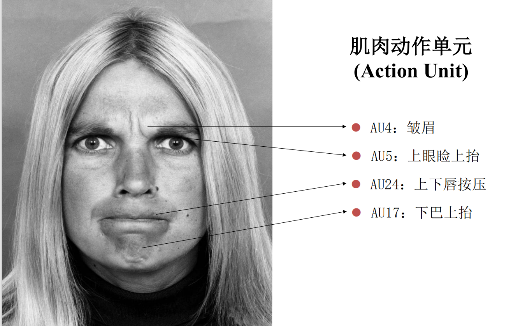
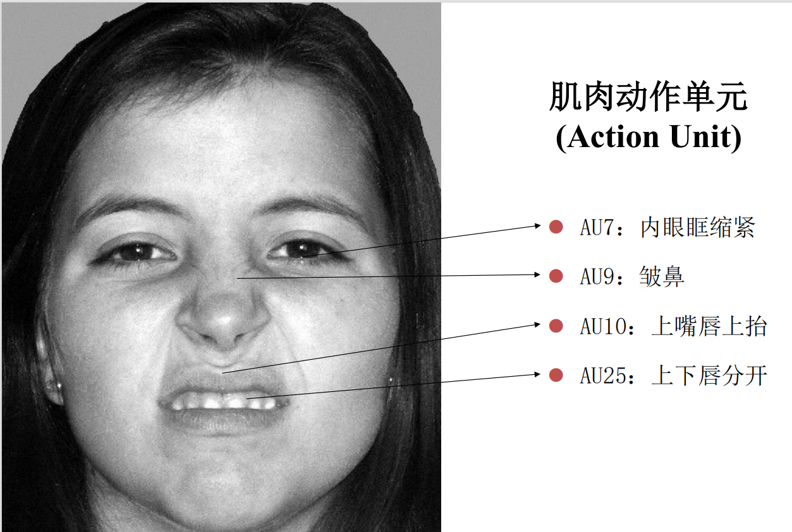

# 社会心理学

!!! info "课程信息"

    - 学分：2.0
    - 教师：吴明证、方霞
    - 教材：《社会心理学》吴明证著

## 导论、方法论

**社会心理学**(social psychology)是一门研究处于各种社会情况下的个体的情感、认知和行为的学科。

社会心理学的ABC：情感Affect(feelings)、行为Behavior(actions)、认知Cognition(thoughts)

社会心理学的研究（和理论）：

- 理论：一组旨在描述世界的某些现象或方面的相关的命题
    - 一个好理论的迹象（by Susan Fiske）
        - 提出因果关系（解释观察结果）
        - 试图保持连贯性（组织观察结果）
        - 讲述一个好故事
        - 力求简约（用一些基本原理便能解释一系列的观察结果）
        - 可测量的（提供研究方向）
        - 能通过证明得到结果（产生新的问题）
        - 能够解决问题的（有实际价值）
- 基于一种理论来提出假设
    - 关于两个或多个变量之间关系的可检验的预测
    - If-then语句来说明变量之间的相关性，以及在特定条件下会发生的情况
- 检验假设
- 理论修正（机制、边界条件、扩展）

### 方法

- **相关研究法**(correlational research)：通过测量自然关联来评估两个或多个变量间的关系，即检验A的发生是否与B的发生有联系
- **实验研究法**(experimental research)：通过操纵其中一个变量A（**自变量**(independent variable)）来观察它是否影响另一个变量B（**因变量**(dependent variable)）
    - 基本原则：
        - 随机分配：参与者在任何条件下都有平等的机会

**有效性**(validity)：

- 分类：
    - 内部(internal)有效性：因变量的改变是否是因为自变量的改变
    - 构造(construct)有效性：对自变量的操纵以及对因变量的测量是否是理论构造的良好体现
    - 外部(external)有效性：结果是否能够泛化到其他的地方或参与者中
- 关于上述方法的有效性问题：
    - 内部有效性：在相关研究法中，可能存在相反的因果关系、受其他变量影响等问题
    - 外部有效性：在实验研究法中，可能存在不知道如何泛化结果的问题
    - 构造有效性：上面讲述的两种方法都会有这类问题

其他方法：

- **观察研究法**(observational research)：只是以系统的方式看待一种现象，以理解正在发生的事情，并提出了关于“事物为什么是这个样子”的假设
- **档案研究法**(archival research)：研究人员可以查看各种档案中发现的证据，例如包含不同文化的人们的人类学描述的数据库
- **调查法**(surveys)：可通过面试或调查问卷来执行
- **元分析研究法**(meta-analysis research)：一种结合了多项研究结果以确定特定研究领域的总体趋势或影响的统计技术。
- **大数据研究法**(big data research)：大数据研究涉及分析通常从数字平台，社交媒体，在线交易或传感器收集的大规模数据集，以发现人类行为的模式，趋势和关联。社会心理学家使用大数据来研究大规模的社交互动和行为，这些行为很难通过传统方法观察

---

**复制危机**(replication crisis)：

>（以下内容摘自[wiki](https://en.wikipedia.org/wiki/Replication_crisis)）The replication crisis is an ongoing methodological crisis in which the results of many scientific studies are difficult or impossible to reproduce. Because the reproducibility of empirical results is an essential part of the scientific method, such failures undermine the credibility of theories building on them and potentially call into question substantial parts of scientific knowledge.

不容易造成复制的原因：

- 较小的样本规模
- p-hacking/有问题的研究实践(questionable research practices, QRPs)确保（$p < .05$）
    - dropping subjects
    - dropping conditions
    - dropping dependent variables
    - 文件抽屉：存放不生效的研究

科学研究的发展趋势：

- 提升的样本规模
- 来自多个实验室的直接（或间接）的复制
- 通过预先注册(preregistration)来防止p-hacking
- 出现了作为刺激（复制尝试）的异地存储库(offsite repository)（存储数据）

理论的进化：

- 科学是一个持续积累的过程
- 它取决于直接或概念上的复制
- 它正不断发展，朝着对现实有效的更有用和有效的理解发展

## 情绪

### 表征

情绪的定义（by Keltner and Gross, 1999）：情绪是针对特定的身体和社会挑战和机会而发生的、片段性的、相对短期的、基于生物的感知、体验、生理、行为和沟通模式。

情绪的词汇：

- 基本的：愤怒(anger)、厌恶(disgust)、恐惧(fear)、惊喜(surprise)、悲伤(sadness)、快乐(joy)
- 复杂的：轻蔑(contempt)
- 《礼记·礼运》：喜、怒、哀、惧、爱、恶、欲

### 理论

情绪理论指的是关于情感如何产生的可检验的语句，主要分有**基本情绪论**(evolutionary theories)、**情绪评价论**(appraisal theories)、**情绪建构论**(constructionist theories)三种理论。

情绪的成分：

- 非语言的表达(nonverbal expressions)
- 生理的变化(physiological changes)
- 评价(appraisal)
- 主观体验(subjective experience)
- 其他行为(other behaviour)

#### 基本情绪论

情绪的成因：

- 适应性问题（生存或繁殖机会的挑战）是情绪的成因
- 也就是说情绪来自进化过程中解决问题的行动
- 情绪与行动趋势相关联

特点：

- 与进化(envolved)和适应性(adaptive)相关
- 将情绪分为单独的(seperate)、不同的(distinct)东西
- 普遍性(universal)
- 与生俱来的(innate)

总结：

- 成因：来自情感程序(Affect Program)的激活
- 生理事实(biological givens)：基本情绪是一种生理事实
- 成分：面部表情、行为（行动趋势）、心理、认知改变、主观体验
- 汇合：各成分间高度汇合

    

#### 情绪评价论

情绪评价论有以下组成部分：

- **新颖性/期望**(novelty/expectation)：你是否期望这种情况的发生？
- **内在的愉悦**(intrinsic pleasantness)：你认为这件事是令人愉快的还是不愉快的？
- **目标诱导**(goal conduciveness)：这件事是否帮助或阻止你去达到目标？
- **媒介**(agency)：谁导致这件事的发生？
- **应对潜力**(coping potential)：我能应对这件事吗？

    

总结：

- 成因：情绪来自评价
- 生理事实：新颖性和效价(valence)
- 成分：评价能影响其他成分，但不是所有的
- 汇合：成分之间的汇合相对较少

    

#### 情绪建构论

>Specific emotions are caused by applying **learned categories** to experience.

    

- 成因：情绪由效价(valence)和唤起(arousal)（核心情感(core affect)），并与抽象的知识相结合而引起的

    

- 生理事实：核心情感
- 成分：成分根据经历的不同而不同，主观经历占主导地位
- 汇合：成分之间有很少的汇合

    

### 研究

#### 诱发情绪

诱发情绪的方法：

- 图片
    - 有效的刺激集
    - 能够诱发微弱的、短暂的情绪
    - 适用于多种测量
    - 仅作用于部分情绪
- 视频
    - 有效的刺激集
    - 能够诱发具体的、强烈的情绪
    - 难以重复
    - 仅作用于部分情绪
- 音乐
    - 有效的刺激集
    - 能诱发扩散的情绪和情感
    - 仅作用于部分情绪
- 回忆
    - 能诱发强烈的、具体的情绪
    - 难以重复
    - 对大多数情绪有效
- 书面的社交(scripted social interactions)
    - 能够诱发强烈的、具体的情绪
    - 通常而言，每个参与者只能进行一次试验
    - 仅作用于部分情绪
- 自然发生的情绪

#### 测量情绪

- 自我汇报（问卷调查）
- 生理测量
    - 皮肤导电(EDA/GSR)
    - 脑活动(EEG, fMRI)
    - 心率(ECG)
- 非口头的表述
    - 面部表情
        - 面部EMG
        - 基于FACS的自动化软件：FaceReader, iMotion
        - 人工FACS编码
    - 瞳孔扩张(pupil dilation)（眼动追踪(eye tracking)）
    - 首饰
    - 触摸
    - 声音：叹词(vocalization)、韵律(speech prosody)

### 面部表情

**面部动作编码系统**(Facial Action Coding System, FACS)

    

一共有44种面部动作单元(action unit)，下面列出其中一些动作单元：

    

??? example "例子"

    === "例1"

        

            
        

    === "例2"

        

            
        

破译面部表情的方法：

- 人工编码
- 自动编码
    - 问题：
        - 识别情绪种类和面部动作有限
        - 对自然情境下的自发表情识别信度和效度较低

基本的面部表情：

- 愤怒(anger)
- 厌恶(disgust)
- 恐惧(fear)
- 悲伤(sadness)
- 惊讶(surprise)
- 愉快(happiness)

群内优势(ingroup advantage)

    

- 情绪方言(emotional dialects)：
    - 来自不同文化背景的人们，因为文化差异和社会环境，有着略微不同的情绪表达方式（“方言”）
    - 人们更容易识别出与自己文化相同的人们的面部表情所反映的情绪

