# 计算机体系结构简史与先进计算介绍

## 计算的本质

所谓“计算”，其实就是<u>利用信息解决问题的过程</u>；通过计算解决问题，就实现了进步和发展。

    

- 在整个过程中，人类是主体，信息是输入和输出物，经验和技术则是方法；而完成整个计算过程的能力，就是**算力**(computing power)
- 在人类早期阶段，之所以需要算力，是为了**生存**；主要的计算内容是如何狩猎，如何防范袭击，如何繁衍后代
- 后来，有了基本的生存保障，人类就开始将更多的算力用于**改善生存质量**，例如搭建房屋、交易物品、制造工具等

从文字发展理解「信息与编码」：

- 计算是对信息进行处理的过程；如何表达和记录信息，是计算的第一步
- 信息是世界的本质之一，是复杂系统（宏观、微观、社会、人类、CPS（赛博物理系统））中单元相互沟通的信令
- **文字**本身就是用表意符号对信息进行“编码”
    - 这也是为什么 NLP 大模型能够泛化到各类下游应用场景
- **数字**出现后，人们将计数和算数的过程，称为计算（可以理解为狭义的计算）
- 毕达哥拉斯学派的主张：万物皆是数！

（古时候）算力的物理形态：

- **结绳记事**：本质就是将信息编码为一个个绳结
- **算筹**：用于计算的小棍子；个位用纵式，十位用横式，百位用纵式

    

        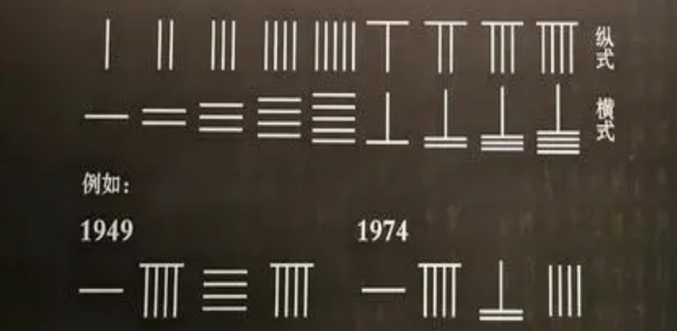
    

**计算的本质：信息编码与处理**

- 计算的编码规则
    - 加法口诀
- 编码规则物理实现
    - 算盘：集**存储**与**计算**一体，是真正意义上的计算机

经典与量子计算体系：

    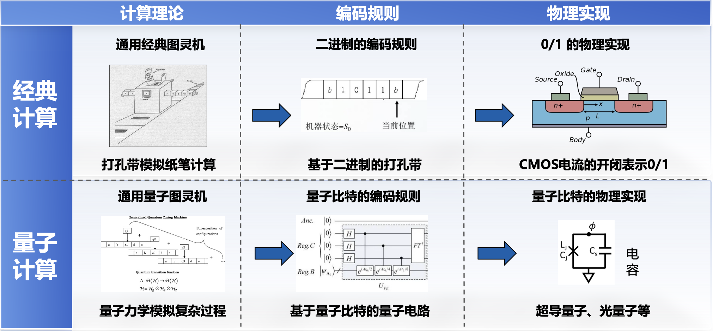

## 计算机发展历史

计算发展历史规模：

    

- **专用计算**

    

        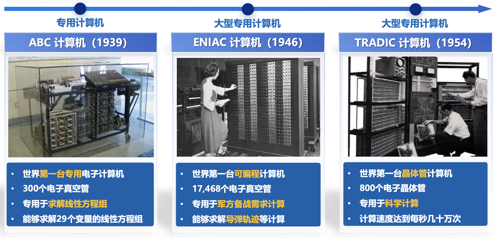
    

- **集成电路**
    - [J.Kilby](https://en.wikipedia.org/wiki/Jack_Kilby)
        - 集成电路之父
        - 2000 Nobel 物理奖
        - 1958.9.12 发明了第1个 IC "Solid Circuit"
    - **集成电路**：把一个电路中所需的晶体管、电阻、电容和电感等元件及布线互连一起，制作在一小块或几小块半导体晶片

    

        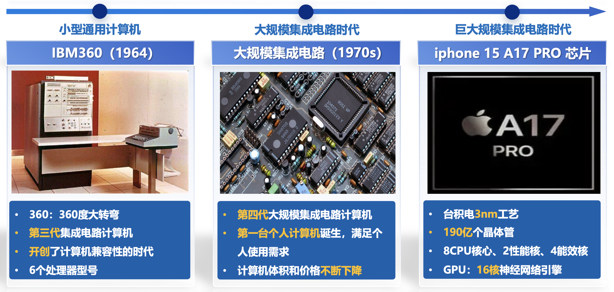
    

- **PC 与互联网**

    

        
    

- **云计算**
    - 随着规模扩大，应用场景增多，为了满足数据运算需求，公司就要购置运算能力更强的服务器，甚至是具有多台服务器的数据中心，导致初期建设成本、电费、运营和网络维护成了很多企业的心头病。
    - 90年代，Salesforce.com 看到了机会，通过租赁式网页CRM软件服务，开创了 **SaaS 模式**（软件即服务）的时代。
    - 2002年，出版商建议亚马逊开发一个 API，第三方公司可以通过这个接口获取其产品、价格和销售排名。在贝佐斯的推动下，更丰富的接口被陆续推出，这些服务器的运作能力，能够当成虚拟货品卖给开发者和初创企业，这和当时毛利率百分之二的主业务电子商务比起来，简直就是一笔“横财”。
    - 2006 年，当**亚马逊**第一次将其计算能力作为云服务去售卖时，标志着云计算这种新的商业模式诞生。
    - 云计算的特点：
        - 计算机技术与网络技术融合发展
        - 通过互联网提供计算资源
        - 具有超大规模、虚拟化、高可靠性、高通用性、按需服务、高性价比等优势

- **天计算**
    - 天计算希望解决的问题：每一家云计算都在提供自己定制的服务, 相互之间差别较大无法转换。
    - 不同于我们都熟知的“云计算”，“天计算”是云计算的未来——是指天空中有很多的云，如何解决跨云的问题，打破不同云之间的隔阂，最大化地利用跨云数据！
    - 天计算的优势
        - 可以让使用云服务更加简单，从而扩大云服务的市场
        - 可以促进更加专门的云服务
        - 允许整合不同的计算资源
        - 合规性的考虑，例如对于数据存放位置在不同国家地区可能有不同的要求

    - 相关研究：

        

            
        

        

            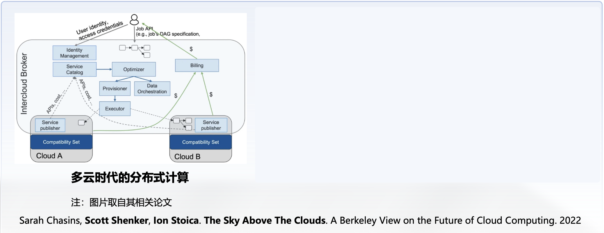
        
   

{ align=right width=30% }

- **边缘计算**（EC）
    - 海量数据对云计算提出了苛刻要求
    - 在网络的边缘侧，靠近用户的地方提供计算、存储和网络带宽
    - 着眼于实时、短周期数据的分析，确保低延时、低带宽与隐私保护

- **高性能计算**（HPC）
    - 复杂的计算任务需要 HPC 的支持
    - HPC 系统具有高带宽的存储和内存，以支持海量数据的快速读写和访问
    - HPC 系统能大幅降低计算延迟，在尽可能短的时间内完成更多的计算任务

## 计算机体系结构发展

从 **IBM 360** 讲起 (1964)：

- IBM 在 1960 年代初创造了 **computer architecture** 一词。1964年， Amdahl，Blaauw，Brooks 论文使用该术语指代 IBM 360指令集中程序员可见部分。
- G.M.Amdahl（阿姆达尔）是 IBM360 的首席架构师，他提出：
    - 计算机体系结构是程序员看到的计算机属性
    - 不同级程序员所看到的计算机属性显然不同
    - Amdahl 等人提出的程序员是指机器语言程序员
    - 计算机属性是硬件的概念结构及其功能特性，是计算机硬
    件的外特性

- 因此完整的计算机体系结构的定义是：**机器语言程序员所必须了解的机器概念性结构和功能特性**
- 传统定义——冯诺依曼体系结构
    - 基本结构：运算单元、控制单元、存储单元、输入设备、输出设备
    - 基本特点：存储程序结构，符合图灵机模型
    - 可存储程序的机器提供了灵活的编程能力
- **指令集**定义（IBM 360 论文，首次提出**体系结构**概念）
    - 指令集开始成为计算机设计的出发点
    - 软件和硬件的研究自此相对独立
    - 指令集占据着核心地位 ，也是目前体系结构课程的主要内容

主流计算机体系结构课程大纲：

    

  

>~~所以我们学校的体系结构课是非主流课程hh~~

冯诺依曼体系算力瓶颈：

- 信息量集聚爆炸
- 系统规模空前复杂
- 传统冯诺依曼体系已达到算力瓶颈
    - 当前经典超级计算机的发展面临“**计算墙**”、“**存储墙**”、“**功耗墙**”的瓶颈问题

- 图灵奖得主、计算机体系结构领域杰出人物 John L. Hennessy 和 David A. Patterson 也指出“随着摩尔定律
走向极限，设计新的计算硬件架构及其编程软件系统将成为提升计算机效能的核心技术”

先进计算体系结构：

- **量子计算**：量子计算是基于**量子力学**的新型计算方式，理论上具有经典计算无法比拟的巨大信息携带和超强并行处理能力！
- **光子计算**：基于光子进行信息处理的计算技术，信息是通过**光子传递**的，具有速度快、能耗低等优点，可用于高速通信、高性能计算！
- **类脑计算**：通过**神经元模型**模拟生物膜电压变化及传递过程脉冲方式，神经元之间信息传递采用脉冲方式，更具生物真实性、功耗更低！
- **DNA 计算**：基于大量 DNA 分子的并行操作及生化处理技术，通过产生组合结果并对其进行抽取和检测来完成问题求解的过程！

体系结构领域的会议：

    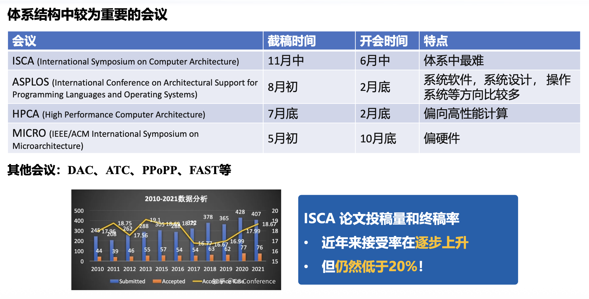

  

其中 **MICRO** 会议接收的 topic 有：

    

  

## 量子计算背景介绍

量子信息技术简介：

- 基本概念：
    - 基于量子力学微观原理的技术
        - 美国原子弹 —— 曼哈顿计划
        - 量子计算机 —— 微曼哈顿计划
    
    - **量子通信** —— 数据传输，**量子计算** —— 数据处理，**量子测量** —— 数据读取

- 量子优势

    

        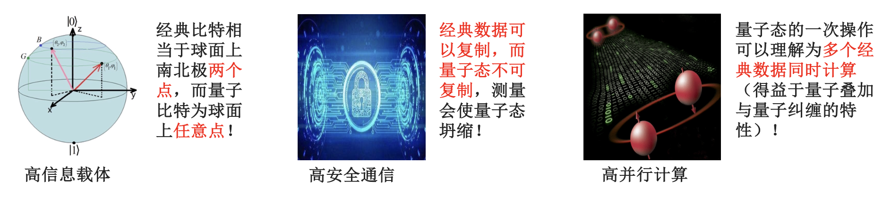
    

- 量子信息技术开始受到普遍关注
    - 2022 诺贝尔物理学奖：通过实验进一步证明了量子信息相关理论的正确性
    - 2023 春节档电影《流浪地球2》：550W 量子计算机，人工智能与量子计算的结合
    - GTC 2023 大会：ChatGPT 巨大的 GPU 算力需求推动英伟达打造 GPU+QPU 量子混合计算

当前量子计算的局限性：

- 比特数受限
- 设备繁杂
- 计算存在噪声
- 只能在特定任务上取得量子计算优势

经典物理学上空的两朵“乌云”：

    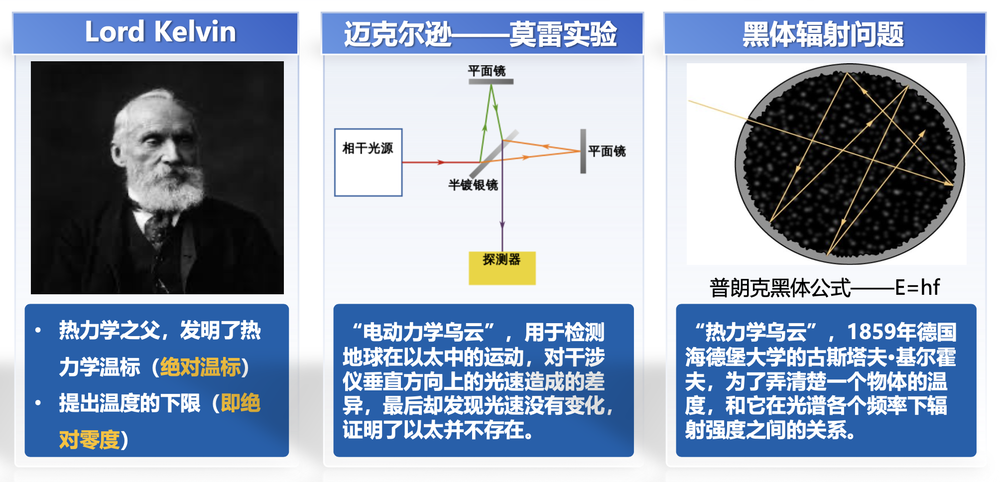

量子概念的提出：

    

量子力学发展：

    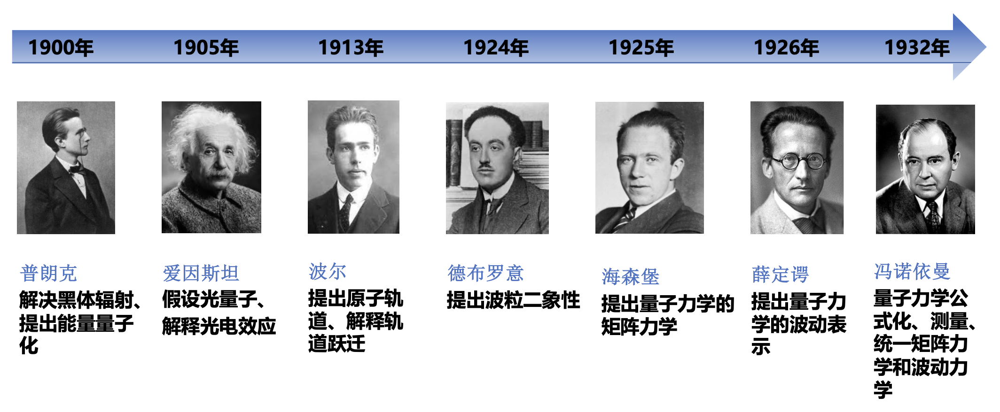

量子计算机发展：

    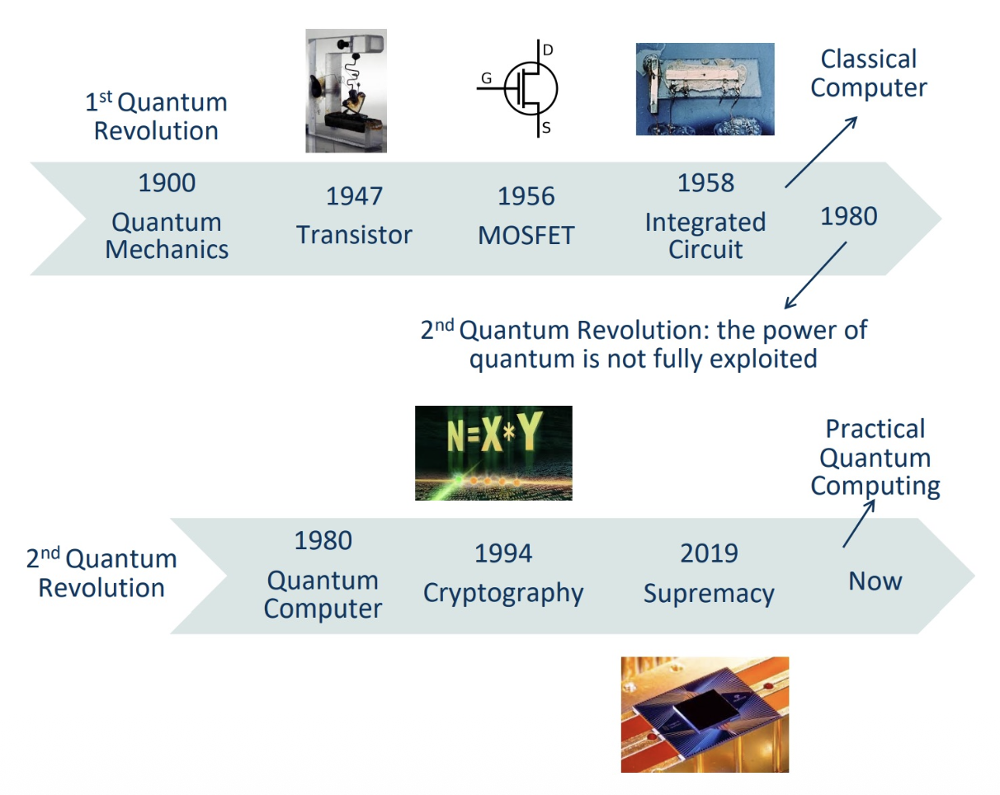

量子计算操作：

- $|0\rangle, |1\rangle$ 态作为一组**单位正交基**，可以表示为向量形式：

    $$
    |0\rangle=\begin{bmatrix}1\\0\end{bmatrix},\quad|1\rangle=\begin{bmatrix}0\\1\end{bmatrix}
    $$

- $|\psi\rangle=\alpha|0\rangle+\beta|1\rangle$，即

    $$
    |\psi\rangle=\begin{bmatrix}\alpha\\\beta\end{bmatrix}
    $$

    在该式中，$\alpha$ 和 $\beta$ 被称为**复系数**（有时被称为振幅），它们描述了量子比特的叠加状态。

量子线路模型：

    

量子程序通过测量将量子比特的信息读取到经典比特中：

    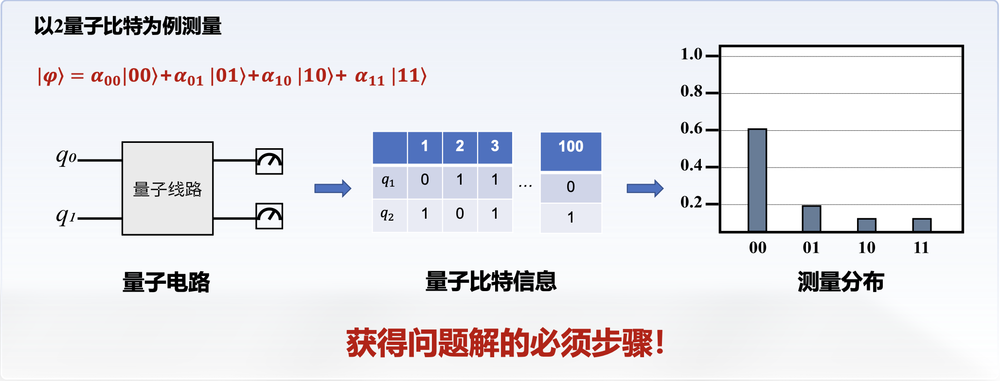

量子计算机体系结构：

    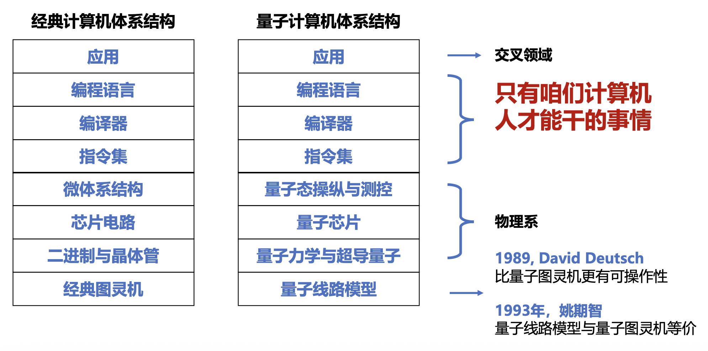

量子计算产业链：

    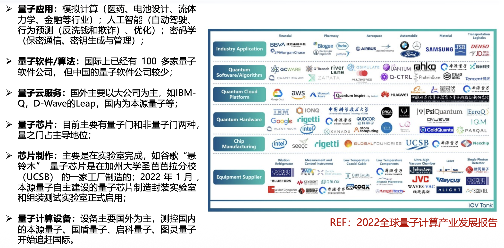

量子芯片：

    

    

量子软件：

    

量子软件的发展趋势：

    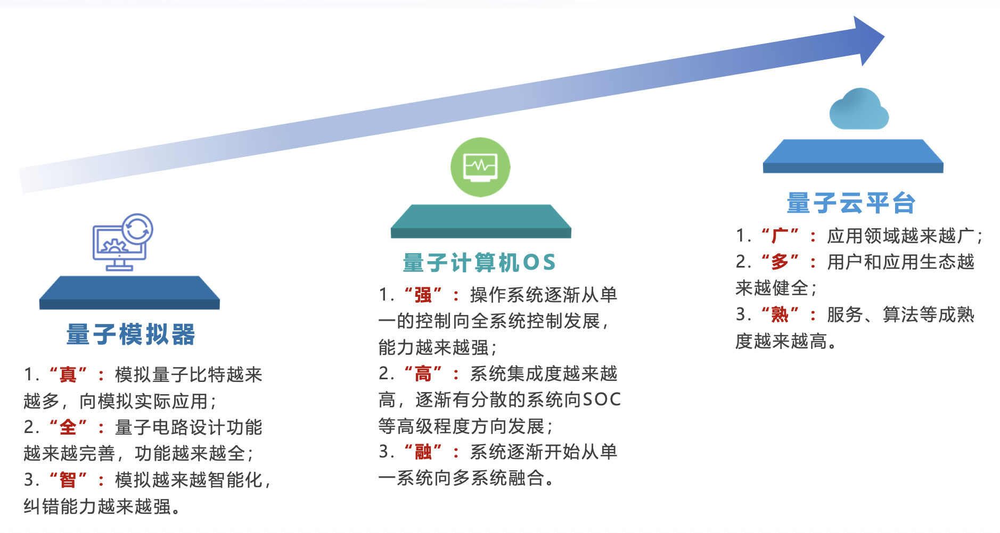

量子计算应用：

    

工业界现状：

    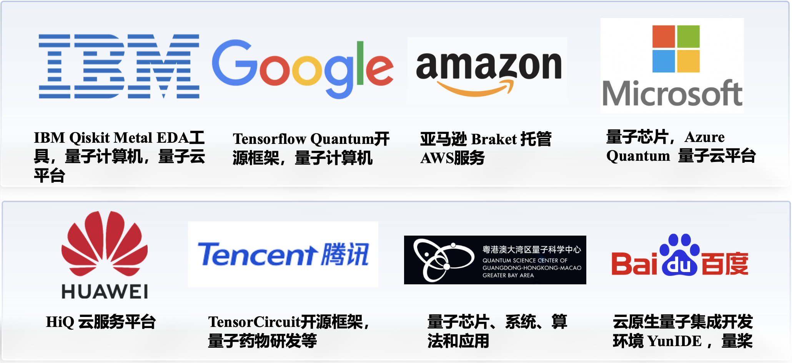

