# 量子态与量子门

## 量子计算发展简史

IBM Roadmap：

    

???+ abstract "量子术语与线代术语对照"

    - **态矢量**(state vactor)：向量
    - **本征态**(eigenstate)：特征向量
    - **本征值**(eigenvalue)：特征值
    - **右矢**(ket) $|a\rangle$：列向量
    - **左矢**(bra) $\langle a|$：行向量
    - $\langle \bm{a} | \bm{b} \rangle$：$\bm{a}, \bm{b}$ 向量的**内积**
    - $|\bm{a} \rangle \langle \bm{b}|$：$\bm{a}, \bm{b}$  的**外积**构成的投影矩阵

        ??? example "例子"

            向量 $\bm{a} = [1, 2]^T, \bm{b} = [3, 4]^T$，则：

            - 内积（标量）：$1 \times 3 + 2 \times 4 = 11$
            - 外积（矩阵）：$\begin{bmatrix}1\times3&1\times4\\2\times3&2\times4\end{bmatrix}$

    - **基态**(ground state)：最小本征态(eigenstate with lowest eigenvalue)
    - **算符**(operator)：矩阵
    - **线性算符**(linear operator)：线性变换(linear transformation)
    - **幺正（酉）算符**(unitary operator)：正交矩阵(orthogonal matrix)
        - 正交矩阵是**实数**矩阵中的概念，当矩阵满足 $AA^T = I$ 时，矩阵 $A$ 是正交矩阵
        - 幺正矩阵是**复数**矩阵中的概念，当矩阵满足 $UU^{\dagger} = I$时，矩阵 $U$ 是幺正的，其中 $\dagger$（dagger）符号指的是**共轭转置运算**
        - 幺正矩阵在量子力学和量子计算中至关重要，因为它的性质保证了量子态 $|\varphi \rangle$ 经过幺正算子后仍然是一个有效的量子态 $|\varphi \rangle$

    - **厄米矩阵**(Hermitian matrix)：自伴矩阵(self-adjoint matrix)
        - 厄米矩阵是复数矩阵中的概念，当矩阵满足 $H = H^{\dagger}$ 时，则 $H$ 为厄米的

    - **线性叠加原理**(principle of superposition)：线性组合性质
    - **投影算符**(projection operator)：投影矩阵

???+ abstract "经典-量子对比"

    

        
    

## 单量子比特

### 量子比特的物理实现

- **信息**是与**物理**过程和物理系统紧密相关的概念，信息的本质是由物理系统中的状态、变化和相互作用所确定的
- **电子自旋叠加**、**能量态叠加**等物理过程的抽象就是量子比特的叠加特性

    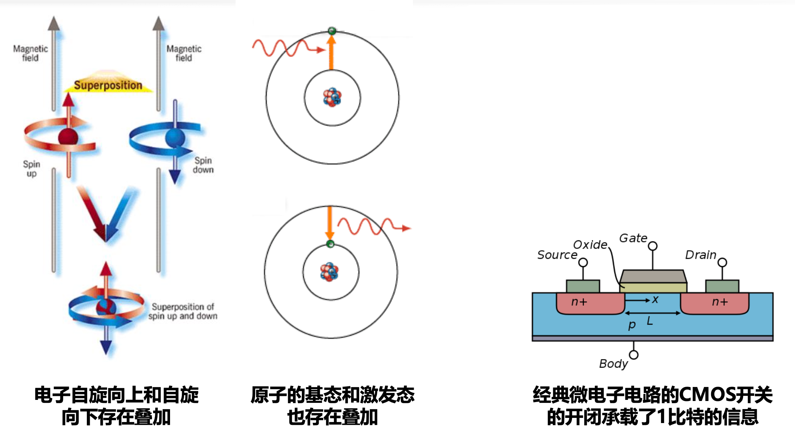

### DiVincenzo 判据

- 具有可操控的量子比特，并具有可扩充性（可调控的二能级系统）
- 能够将量子比特的状态初始化为简单基准状态（设置 $|0\rangle$ 态或 $|1\rangle$ 态）
- 具有长相关退相干时间（确保充足的时间有效完成计算任务）
- 具有一组“通用”量子门（确保能够满足所有的计算任务需求）
- 能够测量特定量子比特（完成量子信息到经典信息的转换）

### 超导量子比特测控

- 下图展示了超导体系下单个量子比特测控的完整结构
- 右侧为具有分立能级的量子比特具体结构，左侧展示了量子比特的操纵和读取结构

    

### 超导量子芯片

- **超导量子芯片**通过封装工艺集成了多个量子比特，这些量子比特通过耦合器连接，并实现相互作用
- 由于封装工艺限制，量子比特和耦合器排布在同一平面内，每个量子比特只能与相邻比特产生作用

    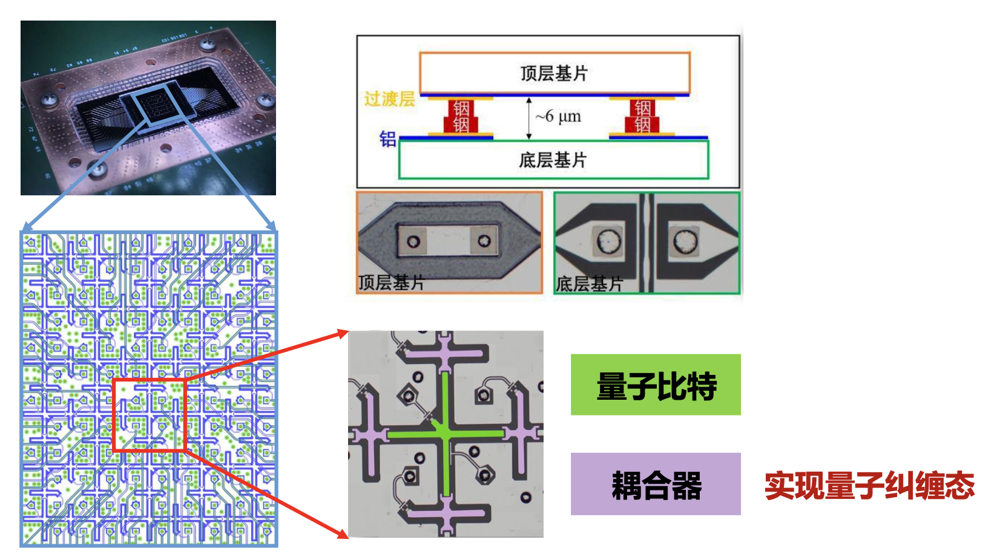

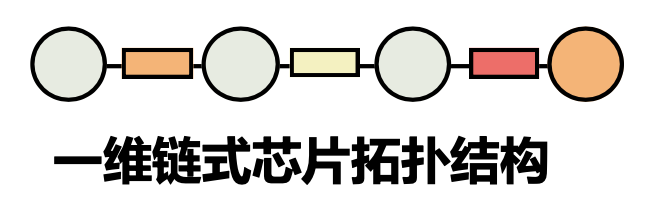{ align=right width=20% }

- 对于超导量子芯片，我们可以抽象出如下结构：
    - 提供了一定数量的可操作量子比特
    - 每个量子比特可以施加基础单量子比特门
    - 通过耦合器连接的量子比特间可以施加特定双量子比特门
    - 每个量子比特可以施加量子测量
- 超导体系是目前主流的量子计算物理体系之一，能够很好地符合基于门电路的量子计算范式。
- 此外，能够实现量子计算的物理体系还包括光量子、离子阱、中性原子等，这些体系均能够满足基本的 DiVincenzo 判据，但各有优缺，在部署量子算法的过程中也存在着不同的限制。

### 量子态基本概念

- **量子叠加态**：
    - 量子比特(qubits)可以同时代表 1 和 0 的多种可能性组合，而这种同时处于多种状态的特性称之为**叠加**(superposition)
    - 研究人员使用精密激光或微波束操纵让量子比特以使它们能处于叠加态
- **量子纠缠态**：
    - 研究人员可以制备“纠缠”的量子比特对，即是说一对量子比特对的两个量子比特存在于单个量子状态
    - 当研究人员以可预测的方式改变其中一个量子比特的状态时，另一个量子比特的状态将瞬间改变
- **薛定谔的猫**：
    - 将一只猫放在一个密闭的盒子里，盒子里有一个放射性原子，一个盖革计数器和一个致命装置；如果盖革计数器检测到原子衰变，则装置会释放毒气，导致猫死亡；如果没有衰变，猫则存活
    - 根据量子力学理论，由于放射性原子处于衰变和没有衰变两种状态的叠加，猫就理应处于死猫和活猫的叠加状态。这只既死又活的猫就是所谓的薛定谔猫
    - 但是经典世界不可能存在既死又活的猫，必须在打开容器后才知道结果
- **量子纠缠**：
    - 把左脚鞋和右脚鞋分别放在两个盒子中；盒子在没有被打开之前，里面的鞋处在了左和右的叠加态中，既是左脚鞋又是右脚鞋，打开鞋盒后既有可能看到左脚鞋，又有可能看到右脚鞋，这是不确定的状态
    - 但是有一点是可以确定的，只要其中的一个鞋盒被打开了，另外一个鞋盒中的鞋子也就等于确定了左右；这表现了量子纠缠现象，是量子叠加的必然结果

    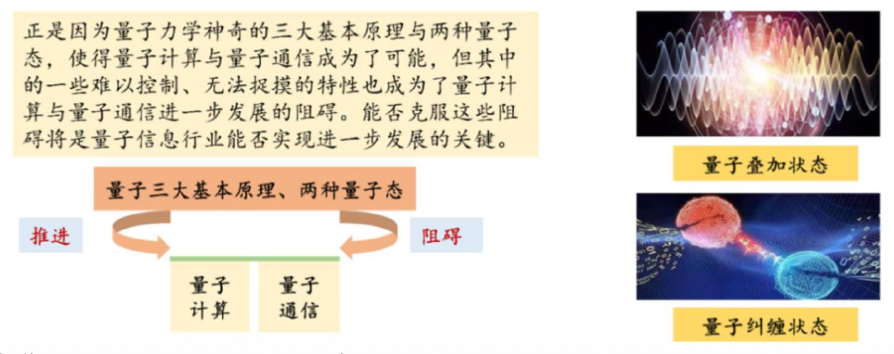

### 量子比特

- 正如经典比特存在两个可能的状态 0 和 1，**量子比特**的两个可能的状态为 $|0\rangle$ 态和 $|1\rangle$ 态
- 式中的 “$|\rangle$” 符号被称为 **Dirac 记号**，是量子力学中状态的标准符号
- 经典比特和量子比特之间的区别在于量子比特可以处于除 $|0\rangle$ 态或 $|1\rangle$ 态以外的状态，是状态的**线性组合**，这被称为**叠加态**，例如：

    $$
    |\psi\rangle=\alpha|0\rangle+\beta|1\rangle
    $$

    其中 $\alpha$ 和 $\beta$ 是复数，因此量子比特的状态是**二维复向量空间中的向量**

    - 其中 $|0\rangle$ 和 $|1\rangle$ 是该叠加态的**基矢态**，是构成该向量空间的一组正交基
    - 量子态可以用任意两个正交基的线性组合来表示

- 除了 $|0\rangle$ 和 $|1\rangle$ 可以作为量子态的基矢态，**任意两个单位正交基都可以作为量子态的基矢态**
    - 例如，另一组常用的单位正交基定义为 $|+\rangle$ 态和 $|-\rangle$ 态：

        $$
        \begin{aligned}|+\rangle&=\frac{1}{\sqrt2}(|0\rangle+|1\rangle)\\|-\rangle&=\frac{1}{\sqrt2}(|0\rangle-|1\rangle)\end{aligned}
        $$

        则任意量子态也可以表示为这组基的线性组合：
        $$
        \psi=\alpha|+\rangle+\beta|-\rangle
        $$

    ??? proof "证明 $|+\rangle$ 态和 $|-\rangle$ 态是正交的"

        $$
        \begin{aligned}\langle+|-\rangle&=\left(\frac{\langle0|+\langle1|}{\sqrt{2}}\right)\left(\frac{|0\rangle-|1\rangle}{\sqrt{2}}\right)\\&=\frac{1}{2}(\langle0|0\rangle-\langle0|1\rangle+\langle1|0\rangle-\langle1|1\rangle)\\&=\frac{1}{2}(1-0+0-1)=0\end{aligned}
        $$

- 量子比特的向量表示：
    - $|0\rangle$ 态和 $|1\rangle$ 态作为一组单位正交基，可以表示为向量形式：

        $$
        |0\rangle=\begin{bmatrix}1\\0\end{bmatrix},\quad|1\rangle=\begin{bmatrix}0\\1\end{bmatrix}
        $$

    - 利用这个定义，$|+\rangle$ 态和 $|-\rangle$ 态也可以表示为向量形式：

        $$
        |+\rangle=\frac{1}{\sqrt{2}}\begin{bmatrix}1\\1\end{bmatrix},\quad|-\rangle=\frac{1}{\sqrt{2}}\begin{bmatrix}1\\-1\end{bmatrix}
        $$

    - $|\psi\rangle=\alpha|0\rangle+\beta|1\rangle$ 可以表示任一量子态，其向量形式表示为：

        $$
        |\psi\rangle=\begin{bmatrix}\alpha\\\beta\end{bmatrix}
        $$
    
    - 在该式中，$\alpha$ 和 $\beta$ 被称为**复系数**（有时被称为振幅），它们描述了**量子比特的叠加状态**

### 量子态矢内积

用 $| \varphi \rangle$ 表示一个列向量的表示法又称为 **bra-ket 表示法**（bra 为列向量，ket 为行向量），与之对应的 ket 为 $\langle \varphi |$，且 $\langle \varphi |$ 为 $| \varphi \rangle$ 的**共轭转置**，即：$\langle\psi|=\begin{bmatrix}\alpha^*&\beta^*\end{bmatrix}$，其中 $\alpha^*, \beta^*$ 为 $\alpha, beta$ 的共轭复数。

两个向量的内积是一个标量，定义为ket向量和bra向量的矩阵乘积，对于 $| \varphi \rangle$，有：

$$
\langle\psi||\psi\rangle=\langle\psi|\psi\rangle{=}\alpha^*\alpha+\beta^*\beta=1
$$

内积的更一般定义为：

$$
\langle a|=[a_0^*,\quad a_1^*,\quad\ldots\quad a_n^*],\quad|b\rangle=\begin{bmatrix}b_0\\b_1\\\vdots\\b_n\end{bmatrix},\quad\langle a\mid b\rangle=a_0^*b_0+a_1^*b_1\ldots a_n^*b_n
$$

如果两个向量的内积为 0，则称两个向量**正交**。与实数域向量中“模长”的概念一致，我们通过向量与自身的内积的开方，来定义向量的**欧几里得范数**：
$$
\||v\rangle\|\equiv\sqrt{\langle v|v\rangle}
$$

### 量子态的坍缩

对于处在态 $|\psi\rangle=\alpha|0\rangle+\beta|1\rangle$ 的量子比特,它处在 $|0\rangle$ 和 $|1\rangle$ 之间的连续状态中，但是我们无法通过检查量子比特来确定它的量子态，也就是 $\alpha$ 和 $\beta$ 的值；相反，量子力学规定我们只能获得有关量子态的有限信息，当我们**测量量子态时**，会发生**量子态的坍缩**（又称为**量子态的投影**），我们将以 $|\alpha|^2$ 的概率得到 0 态，以 $|\beta|^2$ 的概率得到 1 态，显然有：
$$
|\alpha|^2 + |\beta|^2 = 1
$$

这被称为**归一化条件**。因此，通常量子比特的状态时二维复向量空间中的单位向量，其向量表示必须满足以下性质：

- 向量的**各分量为复数**
- 向量的**欧几里得范数为 1**

???+ question "思考"

    === "问题"

        $|q\rangle=\frac{1}{\sqrt{2}}|0\rangle+\frac{i}{\sqrt{2}}|1\rangle$ 是正确的量子态向量表示吗？

    === "解答"

        - 显然 $\dfrac{1}{\sqrt{2}}, \dfrac{i}{\sqrt{2}}$ 是复数
        - 欧几里得范数：

            $$
            \mid\frac{1}{\sqrt{2}}\mid^2+\mid\frac{i}{\sqrt{2}}\mid^2=\frac{1}{2}+\frac{1}{2}=1
            $$

        因此是正确的量子态向量表示。

### 不可克隆原理

一种自然的想法是，是否可以在量子态崩塌之前先制作一个量子态的“副本”，这样就可以对同一个量子态进行重复测量？可惜的是，量子系统严格遵守不可克隆原理。

    

**量子不可克隆原理**(quantum no-cloning theorem)是量子信息理论中的一个重要原理，它阐明了在**一般情况下不能创建一个完美的克隆（拷贝）任意未知的量子态**。用数学语言可表示为：不存在一个线性算符（量子操作）$U$，可以将量子态 $| \varphi \rangle$ 映射到相应的复制态 $| \varphi \rangle | \varphi \rangle$。

### 量子比特的几何表示

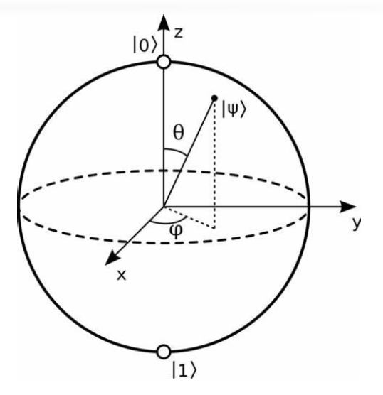{ align=right width=20% }

考虑到**归一化条件**，可以进一步改写 $r_i$ 得到：
$$
\begin{aligned}|\psi\rangle=\cos(\frac{\theta}{2})|0\rangle+e^{i\varphi}\sin(\frac{\theta}{2})|1\rangle\end{aligned}
$$

$\theta$ 和 $\varphi$ 可以视为球坐标下的分量，且量子态的欧几里得范数为 1，因此一个量子比特的量子态可以可视化为 **Bloch 球**上的一个点。

注意，Bloch 球只能可视化**单个量子比特**的状态！

一些特殊情况：

- $\theta = 0$：$|\psi\rangle=1\cdot|\mathbf{0}\rangle+e^{j\varphi}\cdot0\cdot|\mathbf{1}\rangle=|\mathbf{0}\rangle$
- $\theta = \pi$：$|\psi\rangle=0\cdot|\mathbf{0}\rangle+e^{j\varphi}\cdot1\cdot|\mathbf{1}\rangle=e^{j\varphi}\cdot|\mathbf{1}\rangle=|\mathbf{1}\rangle$
- $\theta = \dfrac{\pi}{2}, \varphi = 0$：$|\psi\rangle=\frac{1}{\sqrt{2}}\cdot|\mathbf{0}\rangle+\frac{e^{j0}}{\sqrt{2}}\cdot|\mathbf{1}\rangle=\frac{|\mathbf{0}\rangle+|\mathbf{1}\rangle}{\sqrt{2}}$
- $\theta = \dfrac{\pi}{2}, \varphi = \pi$：$|\psi\rangle=\frac{1}{\sqrt{2}}\cdot|\mathbf{0}\rangle+\frac{e^{j\pi}}{\sqrt{2}}\cdot|\mathbf{1}\rangle=\frac{|\mathbf{0}\rangle-|\mathbf{1}\rangle}{\sqrt{2}}$

### 量子信息的无限与有限

- 对于一个经典比特，它的状态只能是非 0 即 1 的两个“点”；而对于一个量子比特，它的状态可能是 Bloch 球上的任意一点，由此可见一个量子比特就可以包含大量信息。如果量子态的复系数是连续取值的，那么理论上可以将复系数的取值无限拓展，一个量子比特的信息容量足以存储下一本书！
- 然而，量子力学的基本假设限定了量子比特被测量后便会坍缩，因此**单次测量只能获取一比特的信息**，只有在测量了无数多个“完全相同”的量子比特后，才能确定 $\alpha$ 和 $\beta$。
- 从某种意义上说，在一个量子比特的状态里，大自然隐藏了大量的“隐含信息”，这些信息会随着量子比特数的增长而**指数增长**。
 

## 多量子比特

假设有两个量子比特，类似于两个经典比特有四种可能的状态，双量子比特的系统也有四个基本状态，依次为 $| 00 \rangle, | 01 \rangle, | 10 \rangle, | 11 \rangle$。一对量子比特可能是这四个基本态的其中一个，也可能是四个基本态的**叠加**，即：
$$
|\psi\rangle=\alpha_{00}|00\rangle+\alpha_{01}|01\rangle+\alpha_{10}|10\rangle+\alpha_{11}|11\rangle
$$

如果**测量**这个量子系统，那么将有 $|\alpha_x|^2$ 的概率结果为 $| \alpha_x \rangle$ 态。由**归一化条件**可知：

$$
\sum_{x\in\{0,1\}^2}|\alpha_x|^2=1
$$

如果测量其中低位量子比特，那么将有 $|\alpha_{00}|^2 + |\alpha_{01}|^2$ 的概率得到 0，经过测量之后状态坍缩为：

$$
|\psi^{\prime}\rangle=\frac{\alpha_{00}|00\rangle+\alpha_{01}|01\rangle}{\sqrt{|\alpha_{00}|^2+|\alpha_{01}|^2}}
$$

注意，测量后的态被因子 $\sqrt{|\alpha_{00}|^2 + |\alpha_{01}|^2}$ 正规化后仍然满足归一化条件。

判断是否纠缠：

- $|\varphi\rangle=\alpha_{00}|00\rangle+\alpha_{11}|11\rangle$：**纠缠态**，第一个比特测得为 0，那么第二个比特一定为 0；第一个比特测得为 1，那么第二个比特一定为 1
- $|\varphi\rangle=\alpha\left|00\right\rangle+\alpha\left|01\right\rangle=\alpha\left|0\right\rangle\left(\left|0\right\rangle+\left|1\right\rangle\right)$：**非纠缠态**，第二个比特的状态与第一个比特无关

### 张量积

在线性代数和量子力学中，**张量积**(tensor product)（又称为**克罗内克积**(kronoker product)）是一种用于组合向量空间的运算。它**将两个向量空间的向量合并成一个更大的向量空间**。

给定两个向量空间 $V$ 和 $W$，它们的张量积可以表示为 $V \otimes W$。张量积的结果是一个**新的向量空间**，其维度等于 $V$ 和 $W$ 的维度的乘积。例如，一个简单的行向量和矩阵的张量积示例为：

$$
\mathbf{v}\otimes\mathbf{M}=\begin{bmatrix}1&2\end{bmatrix}\otimes\begin{bmatrix}1&2\\3&4\end{bmatrix}=\left[1\cdot\begin{bmatrix}1&2\\3&4\end{bmatrix}\quad2\cdot\begin{bmatrix}1&2\\3&4\end{bmatrix}\right]=\begin{bmatrix}1&2&2&4\\3&4&6&8\end{bmatrix}
$$

**张量积可以获得多个量子态的复合量子态**，这给多量子比特的量子态提供了一种数学表示方法。

在量子力学中，量子的状态由**希尔伯特空间**(Hilbert spaces)中的单位向量来描述。本质上复合系统中量子态的演化也是矩阵的乘法，与单个子系统相比，只是多了张量积的运算。

若有两个量子比特分别处于如下的态：
$$
|\psi\rangle=\alpha|0\rangle+\beta|1\rangle\quad,\quad|\phi\rangle=\gamma|0\rangle+\delta|1\rangle
$$

则两个量子比特的张量积为：

$$
\begin{aligned}|\psi\rangle\otimes|\phi\rangle&=\alpha\gamma|0\rangle\otimes|0\rangle+\alpha\delta|0\rangle\otimes|1\rangle+\beta\gamma|1\rangle\otimes|0\rangle+\beta\delta|1\rangle\otimes|1\rangle\\&=\alpha\gamma|00\rangle+\alpha\delta|01\rangle+\beta\gamma|10\rangle+\beta\delta|11\rangle\end{aligned}
$$

若使用量子态的向量表示，则该过程表示为：
$$
|\psi\rangle=\begin{bmatrix}\alpha\\ \beta\end{bmatrix},\quad|\phi\rangle=\begin{bmatrix}\gamma\\ \delta\end{bmatrix},\quad|\psi\rangle\otimes|\phi\rangle=|\psi\phi\rangle=\begin{bmatrix}\alpha\times\begin{bmatrix}\gamma\\ \delta\end{bmatrix}\\\\\beta\times\begin{bmatrix}\gamma\\ \delta\end{bmatrix}\end{bmatrix}=\begin{bmatrix}\alpha\gamma\\ \alpha\delta\\ \beta\gamma\\ \beta\delta\end{bmatrix}
$$

??? example "例子：单位向量"

    $$
    \begin{aligned}&|00\rangle=|0,0\rangle=|0\rangle\otimes|0\rangle=\begin{bmatrix}1\\0\end{bmatrix}\otimes\begin{bmatrix}1\\0\end{bmatrix}=\begin{bmatrix}1\begin{bmatrix}1\\0\end{bmatrix}\\0\begin{bmatrix}1\\0\end{bmatrix}\end{bmatrix}=\begin{bmatrix}1\\0\\0\\0\end{bmatrix}\\
    &|01\rangle=|0,1\rangle=|0\rangle\otimes|1\rangle=\begin{bmatrix}1\\0\end{bmatrix}\otimes\begin{bmatrix}0\\1\end{bmatrix}=\begin{bmatrix}1\begin{bmatrix}0\\1\end{bmatrix}\\0\begin{bmatrix}0\\1\end{bmatrix}\end{bmatrix}=\begin{bmatrix}0\\1\\0\\0\end{bmatrix}\\
    &|10\rangle=|1,0\rangle=|1\rangle\otimes|0\rangle=\begin{bmatrix}0\\1\end{bmatrix}\otimes\begin{bmatrix}1\\0\end{bmatrix}=\begin{bmatrix}0\begin{bmatrix}1\\0\end{bmatrix}\\1\begin{bmatrix}1\\0\end{bmatrix}\end{bmatrix}=\begin{bmatrix}0\\0\\1\\0\end{bmatrix}
    \\&|11\rangle=|1,1\rangle=|1\rangle\otimes|1\rangle=\begin{bmatrix}0\\1\end{bmatrix}\otimes\begin{bmatrix}0\\1\end{bmatrix}=\begin{bmatrix}0\begin{bmatrix}0\\1\end{bmatrix}\\1\begin{bmatrix}0\\1\end{bmatrix}\end{bmatrix}=\begin{bmatrix}0\\0\\0\\1\end{bmatrix}\end{aligned}
    $$

???+ example "量子优势案例"

    

        
    

### 贝尔态

**贝尔态**是双量子比特系统中重要的纠缠态，它们的定义如下：

$$
\begin{aligned}
\left|\phi^{+}\right\rangle=\frac{1}{\sqrt{2}}|00\rangle+\frac{1}{\sqrt{2}}|11\rangle&,\quad\left|\phi^{-}\right\rangle=\frac{1}{\sqrt{2}}|00\rangle-\frac{1}{\sqrt{2}}11\rangle \\
\left|\psi^{+}\right\rangle=\frac{1}{\sqrt{2}}|01\rangle+\frac{1}{\sqrt{2}}|10\rangle&,\quad\left|\psi^{-}\right\rangle=\frac{1}{\sqrt{2}}|01\rangle-\frac{1}{\sqrt{2}}|10\rangle
\end{aligned}
$$

这四个贝尔状态都表示两个量子比特之间的纠缠，它们构成的集合：$\{\begin{aligned}\left|\phi^+\right\rangle,\left|\phi^-\right\rangle,\left|\psi^+\right\rangle,\left|\psi^+\right\rangle\end{aligned}\}$ 被称为**贝尔基**；任何两个量子比特的量子态向量，都可以表示为**四个贝尔态的线性组合**。例如：

$$
|00\rangle=\frac{1}{\sqrt{2}}\left|\phi^+\right\rangle+\frac{1}{\sqrt{2}}\left|\phi^-\right\rangle
$$

贝尔态应用：

量子纠缠是量子力学最神秘迷人的特性，一个纠缠的量子系统不能简单地分解为各个子量子系统的独立态。它具有如下性质：

- 纠缠态**不能被单独的量子系统的态所描述**，而需要考虑整个系统的态
- 测量一个纠缠态中的一个量子，可能会**瞬间**影响到另一个纠缠态中的量子（例如坍缩），即使它们之间的距离很远

纠缠可以用于实现量子隐形传态、量子纠错码、量子远程纠缠和量子密钥分发等量子通信协议；在量子计算中也扮演着关键的角色，用于实现量子比特之间的并行计算和量子门操作，提供了超级密集的计算能力，能够解决一些经典计算难题。

## 单量子门

???+ example "引入：量子非门"

    在经典计算机中，**X 门**（又称为 **NOT 门**）用于电平信号的翻转，即将 0 态和 1 态交换。在量子电路中，是否能够定义类似的量子非门？

    答案是肯定的，但与经典非门不同的是，量子非门不仅可以实现 $|0\rangle \rightarrow |1\rangle$ 的转变，它的作用还是**线性**的，即可以把状态：
    $$
    |\psi\rangle=\alpha|0\rangle+\beta|1\rangle
    $$

    经过 X 门后，互换两个复系数，即：
    $$
    X |\psi\rangle=\beta|0\rangle+\alpha|1\rangle
    $$

    易知 X 门是一个 2×2 矩阵，其矩阵表示为：

    $$
    X = \begin{bmatrix}0 & 1 \\ 1 & 0\end{bmatrix}
    $$

    因此，单量子比特的量子门可以由 2×2 的矩阵给出，其矩阵分量决定了量子门的行为。

### Hadamard 门

**Hadamard 门**（**H 门**）是一个基础的量子门，它可以让 $|0\rangle$ 和 $|1\rangle$ 转变为叠加态，它的矩阵表示为：

$$
\left.H=\frac{1}{\sqrt{2}}\left[\begin{array}{cc}1&1\\1&-1\end{array}\right.\right]
$$

{ align=right width=20% }

当 H 门作用在 0 态或者 1 态上时，可以产生叠加态：
$$
H|0\rangle=\frac{1}{\sqrt{2}}(|0\rangle+|1\rangle)=|+\rangle,\quad H|1\rangle=\frac{1}{\sqrt{2}}(|0\rangle-|1\rangle)=|-\rangle
$$

在后续的学习中读者将了解到，

- H 门对 $|0\rangle$ 和 $|1\rangle$ 的转化实际上是**将量子态从 z 基到 x 基的转变**；H 门的操作使得量子态在 Bloch 球上先绕 z 轴转 180 度再绕 y 轴转 90 度（等于先绕 y 轴转 90 度再绕 x 轴转 180 度）
- 另一种理解 H 门的方法是，H 门可以让量子态围绕着 x-z 轴中界线旋转 180°

### 泡利矩阵和泡利门

前文所述的量子 X 门的矩阵表示被称为 **Pauli-X 矩阵**。Pauli 矩阵的完整集合为：

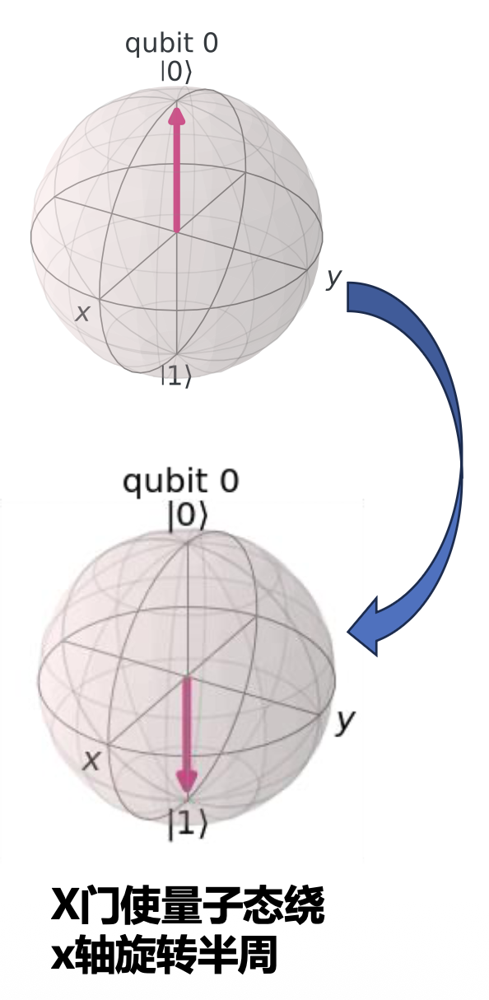{ align=right width=20% }

$$
\sigma_x=\begin{bmatrix}0&1\\1&0\end{bmatrix},\quad\sigma_y=\begin{bmatrix}0&-i\\i&0\end{bmatrix},\quad\sigma_z=\begin{bmatrix}1&0\\0&-1\end{bmatrix}
$$

与 Pauli-Y、Z 矩阵对应的量子门称为 **Y 门**和 **Z 门**。

量子 X 门可以实现 $|0\rangle \rightarrow |1\rangle$ 的转变，反之亦然，如果观察实现 $|0\rangle$ 和 $|1\rangle$ 在 Bloch 球上的位置，你会发现 $|0\rangle$ 到 $|1\rangle$ 恰好需要绕 x 轴旋转 $\pi$ 的角度。类似的，Y 门和 Z 门对一个量子态的作用为让其绕着 y 轴和 z 轴旋转 $\pi$ 的角度。

???+ question "思考"

    === "问题"

        Y、Z 门作用在 0 态和 1 态上的向量形式是什么？

    === "解答"

        - $Y|0\rangle=\begin{bmatrix}0&-i\\i&0\end{bmatrix}\begin{bmatrix}1\\0\end{bmatrix}\begin{bmatrix}0\\i\end{bmatrix}=i|1\rangle$
        - $Y|1\rangle=\begin{bmatrix}0&-i\\i&0\end{bmatrix}\begin{bmatrix}0\\1\end{bmatrix}\begin{bmatrix}-i\\0\end{bmatrix}=-i|0\rangle$
        - $Z|0\rangle=\begin{bmatrix}1&0\\0&-1\end{bmatrix}\begin{bmatrix}1\\0\end{bmatrix}\begin{bmatrix}1\\0\end{bmatrix}=|0\rangle$
        - $Z|1\rangle=\begin{bmatrix}1&0\\0&-1\end{bmatrix}\begin{bmatrix}0\\1\end{bmatrix}\begin{bmatrix}0\\-1\end{bmatrix}=-|1\rangle$

### 量子门与矩阵乘法

量子计算本质是酉矩阵计算！

酉矩阵乘法：$V' = U V$（输出态 = 演化矩阵 · 输入态）

- 可逆：$V = U^{-1} V'$
- 正则：$\|U\| = 1$

量子门 = 小的矩阵模板（控制电子轨道变化的电磁波）

量子门的例子：

    

### 厄米矩阵和酉矩阵

用作表示量子门的矩阵是否存在限制？任意一个 2×2 的矩阵都可以表示一个量子门吗？显然不是的。只有**酉矩阵**才能用作表示一个量子门！

**厄米矩阵**(Hermitian matrix)和**酉矩阵**(unitary matrix)是量子力学和量子计算中重要的两类矩阵，它们的定义为：

- 厄米矩阵：一个矩阵是厄米矩阵，如果它等于其自身的共轭转置，即：$A = A^{\dagger}$
    - 厄米矩阵的性质保证了其本征值（特征值）是实数，且它的本征向量是正交的，在后续的章节中你将学习到，这确保了**量子系统的物理量是可观测的**。
- 酉矩阵：一个矩阵是酉矩阵，如果其逆等于其共轭转置。即：$UU^{\dagger} = U^{\dagger}U = I$
    - 酉矩阵的性质保证了作用在量子态上得到的结果**仍然满足归一化条件**，即仍然是合法的量子态；此外，酉矩阵保持内积不变，即它保持态矢量之间的正交性质。

### 相位旋转门

- **相位旋转门**作用于量子比特的态矢量时，会引入一个特定的相位因子，改变量子态的相对相位；具体而言，相位的旋转是通过调整量子比特的状态矢量与**某个特定基态**的**相对相位**来实现的
- 相位旋转门可以改变量子态的相对相位，但**不改变其概率分布**。它在量子算法中有广泛的应用，如量子相位估计、量子傅里叶变换等
- 需要注意的是，相位旋转门与其他门操作不同，它**不涉及量子比特的旋转操作，而是旋转相位**。这使得相位旋转门具有独特的功能和作用。常见的相位旋转门有 P 门、T 门、S 门
    - **P 门**将量子比特的相位进行旋转，带有一个输入参数用于确定具体相位
    - **S 门**是 P 门的特例，其中相位参数 $\varphi$ 等于 $\frac{\pi}{2}$ 
    - **T 门**是另一个相位旋转门，它将量子比特的相位旋转 $\frac{\pi}{4}$

    $$
    P=\begin{bmatrix}1&0\\0&e^{i\phi}\end{bmatrix},\quad S=\begin{bmatrix}1&0\\0&i\end{bmatrix},\quad T=\begin{bmatrix}1&0\\0&e^{i\frac{\pi}{4}}\end{bmatrix}
    $$

### 参数旋转门

**参数旋转门**是量子计算中的一种基本门，它允许根据给定参数执行量子态的旋转操作。在单量子比特系统中，最常见的参数旋转门是绕 X 轴、Y 轴和 Z 轴的旋转门，分别记为 $R_X(\theta), R_Y(\theta), R_Z(\theta)$，其中 $\theta$ 是旋转角度，对应矩阵表示如下：

$$
R_X(\theta)=\begin{bmatrix}\cos\frac{\theta}{2}&-i\sin\frac{\theta}{2}\\-i\sin\frac{\theta}{2}&\cos\frac{\theta}{2}\end{bmatrix},R_Y(\theta)=\begin{bmatrix}\cos\frac{\theta}{2}&-\sin\frac{\theta}{2}\\\theta&\theta\\\sin\frac{\theta}{2}&\cos\frac{\theta}{2}\end{bmatrix},R_Z(\theta)=\begin{bmatrix}e^{-i\theta/2}&0\\0&e^{i\theta/2}\end{bmatrix}
$$

容易验证 $H=iR_Y\left(\frac{\pi}{2}\right)R_Z(\pi)=iR_X(\pi)R_Y\left(\frac{\pi}{2}\right)$，与 Bloch 球上的物理图像相符，即 Hadamard 门可以
看作是量子态先绕 Z 轴旋转 $\pi$，再绕 Y 轴旋转 $\frac{\pi}{2}$（等于先绕 Y 轴旋转 $\frac{\pi}{2}$，再绕 X 轴旋转 $\pi$）。

参数旋转门在量子电路设计、量子机器学习（例如量子神经网络、变分量子算法）中广泛使用，因为它们通过可调参数来实现灵活的操作。

### 单量子比特操作分解

一个单量子比特操作，对应一个2×2的酉矩阵。由于这样的酉矩阵有无穷多个，因此理论上有无穷多个单比特门。那么，为了实现任意一种单比特门，我们需要制造出这么多的门吗？

事实上，对任意一个 2×2 的酉矩阵，都有如下的分解：

$$
U=\mathrm{e}^{\mathrm{i}\alpha}\begin{bmatrix}\mathrm{e}^{-\mathrm{i}\beta/2}&0\\0&\mathrm{e}^{\mathrm{i}\beta/2}\end{bmatrix}\begin{bmatrix}\cos\frac{\gamma}{2}&-\sin\frac{\gamma}{2}\\\sin\frac{\gamma}{2}&\cos\frac{\gamma}{2}\end{bmatrix}\begin{bmatrix}\mathrm{e}^{-\mathrm{i}\delta/2}&0\\0&\mathrm{e}^{\mathrm{i}\delta/2}\end{bmatrix}
$$

其中，中间的矩阵就是线性代数中的旋转矩阵（绕 $y$ 轴），而其前后的两个矩阵可以理解为在特定平面内的旋转（绕 $z$ 轴）。这个分解可以对任意单比特操作进行精确描述。

???+ example "例子"

    对矩阵 $U_1=\begin{bmatrix}0.707&-0.707i\\0.707i&0.707\end{bmatrix}$，可以这样分解：
    $$
    U_1=Rz(-\frac{\pi}{4})\cdot X\cdot Rz(-\frac{\pi}{2})
    $$

    使用 Qiskit 实现其电路为：

    

        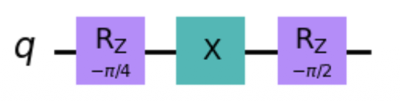
    

## 多量子门

### 纠缠判定

如果一个多量子比特系统可以分解为多个单量子比特的张量积，那么这个系统被称作**无关的、可分的**；反之，该系统是**不可分的、纠缠的**。例如，

- 如果一个双量子比特系统的量子态为：

    $$
    \frac{1}{2}|00\rangle+\frac{i}{2}|01\rangle-\frac{1}{2}|10\rangle-\frac{i}{2}|11\rangle
    $$

    它实际上可以分解为两个单量子比特的张量积：

    $$
    \frac{1}{2}|00\rangle+\frac{i}{2}|01\rangle-\frac{1}{2}|10\rangle-\frac{i}{2}|11\rangle=\left(\frac{1}{\sqrt2}|0\rangle-\frac{1}{\sqrt2}|1\rangle\right)\otimes\left(\frac{1}{\sqrt2}|0\rangle+\frac{i}{\sqrt2}|1\rangle\right)
    $$

    这意味着这个双量子比特系统仅仅是两个量子比特简单合成的！

- 反之，如果一个双量子比特系统的量子态为 $\frac{1}{\sqrt{2}}|00\rangle+\frac{1}{\sqrt{2}}|11\rangle$，可以证明，这个双量子比特系统无法分解成两个单量子比特的张量积，即不可分的、纠缠的。

### 复合系统

对于包含多个量子比特的复合系统，我们规定态矢量中的每个量子比特按从左到右的顺序依次编号，记为 $q_0, q_1, \dots$，并在量子电路图中从上至下依次绘制每个量子比特。

下图展示了双量子比特构成的复合系统，初态为 $|00\rangle$ ， $q_0$ 经过 X 门状态变为 $|1\rangle$ ， $q_1$ 经过 Z 门状
态变为 $|0\rangle$。

$$
\begin{aligned}q_0:|0\rangle& \ —\boxed{X}— \ |1\rangle\\\\q_1:|0\rangle& \ —\boxed{Z}— \ |0\rangle\end{aligned}
$$

若将两个单量子门视作一个整体，可以通过张量积的形式构成一个双量子门。

$$
\begin{aligned}& X\otimes Z=\begin{bmatrix}0&1\\1&0\end{bmatrix}\otimes\begin{bmatrix}1&0\\0&-1\end{bmatrix}=\begin{bmatrix}0\cdot1&0\cdot0&1\cdot1&1\cdot0\\0\cdot0&0\cdot-1&1\cdot0&1\cdot-1\\1\cdot1&1\cdot0&0\cdot1&0\cdot0\\1\cdot0&1\cdot-1&0\cdot0&0\cdot-1\end{bmatrix}=\begin{bmatrix}0&0&1&0\\0&0&0&-1\\1&0&0&0\\0&-1&0&0\end{bmatrix}\\
& X\otimes Z|00\rangle=\begin{bmatrix}0&0&1&0\\0&0&0&-1\\1&0&0&0\\0&-1&0&0\end{bmatrix}\begin{bmatrix}1\\0\\0\\0\end{bmatrix}=\begin{bmatrix}0\\0\\1\\0\end{bmatrix}=|10\rangle\end{aligned}
$$

### CNOT 门

???+ info "引入"

    在经典逻辑电路中，**异或门**（XOR）是一种广泛应用的逻辑门，它是很多逻辑计算的基础，例如可用于构建半加器和全加器。

    异或门的真值表如下所示，一种理解异或门的思路是“**受控非门**”：输入 A 是一种“**控制端**”

    

        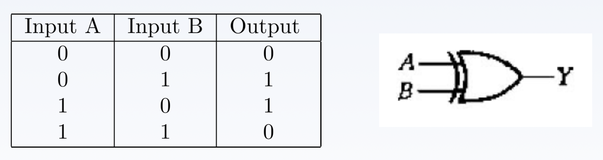
    

    - 当 A 为 1 的时候，XOR 对 B 施加非门
    - 而当 A 为 0 的时候，则不施加非门

    那么，在量子电路中，是否存在类似的“受控”门呢？答案是肯定的，一种最基础的受控门被称为 **CNOT 门**(controlled-NOT gate)。

**CNOT 门**是一种受控门，其中一个量子比特（称为控制比特）的状态决定了另一个量子比特（称为目标比特）是否进行翻转操作：

- 当控制比特为 $|1\rangle$ 时，翻转目标比特的状态
- 当控制比特为 $|0\rangle$ 时，保持目标比特的状态不变。其矩阵表示形式为：

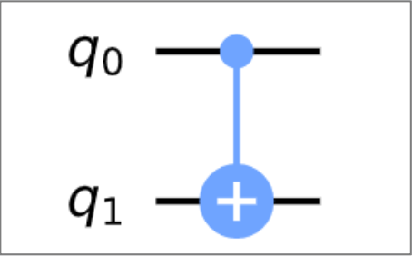{ align=right width=20% }

$$
CNOT=\begin{bmatrix}1&0&0&0\\0&1&0&0\\0&0&0&1\\0&0&1&0\end{bmatrix}
$$

Qiskit 中的 CNOT 门如右图所示。

若量子态为非叠加态，类比经典比特的真值表，有：

    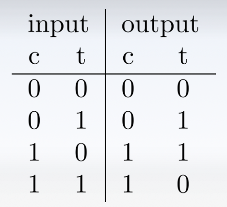

若以 $q_0$ 为 CNOT 门的控制比特，$q_1$ 为受控比特，则会将 $|10\rangle$ 和 $|11\rangle$ 的振幅替换，如下所示：

$$
|a\rangle=\begin{bmatrix}a_{00}\\a_{01}\\a_{10}\\a_{11}\end{bmatrix}\quad\mathrm{CNOT}|a\rangle=\begin{bmatrix}a_{00}\\a_{01}\\a_{11}\\a_{10}\end{bmatrix}
$$

CNOT 门的一大作用是用于**制备纠缠态**。以量子态 $|q_0 q_1\rangle = |00\rangle$ 为例，首先 $q_1$ 通过一个 H 门：再将 CNOT 门作用在两个量子比特上，则有：

{ align=right width=20% }

$$
\begin{aligned}|q_0\rangle\otimes|q_1\rangle&\xrightarrow{\text{H gate on }q_0}\frac{1}{\sqrt{2}}(|0\rangle+|1\rangle)\otimes|0\rangle=\frac{1}{\sqrt{2}}(|00\rangle+|10\rangle)\\&\xrightarrow{\mathrm{CNOT~gate}}\frac{1}{\sqrt{2}}(|00\rangle+|11\rangle)\end{aligned}
$$

右图为制备两比特贝尔态的量子电路。

### 量子隐形传态

假设 Alice 和 Bob 是一对老朋友，他们上一次见面的时候各自拿走了一对处于贝尔态的纠缠 qubits 中的一个，也就是说：

    

现在他们相隔千里，Alice 手上有另一个处于量子态 $|\psi \rangle = \alpha |0\rangle + \beta |1\rangle$ 的 qubit 想要发送给 Bob，但是 Alice 却陷入如下的困境：

- 假如 Alice 不知道 $|\psi \rangle$ 是一个怎样的量子态，她手上只有一份 qubit，由于量子不可克隆原理及量子态坍缩，她无法测得两个参数 $\alpha, \beta$ 的确切取值
- 就算 Alice 知道 $\alpha, \beta$ 的取值，它们也有可能是无穷位的实数

**量子隐形传态**为 Alice 和 Bob 的量子态传输提供了可能，事实上，Alice 只需要用经典信道向 Bob 传输两个 bit 的经典信息。Alice 和 Bob 端的操作电路如下图所示。

    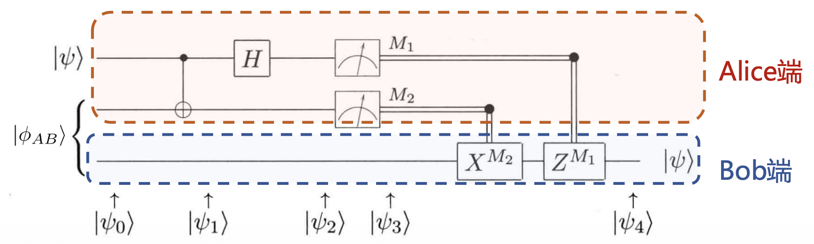

首先，Alice、Bob 持有的三个 qubit 构成的初始整体量子态可表示为：
$$
|\psi_0\rangle=\frac{1}{\sqrt{2}}\left[\alpha|0\rangle(|00\rangle+|11\rangle)+\beta|1\rangle(|00\rangle+|11\rangle)\right]
$$

然后，Alice 首先将他要发送的 qubit 以及她持有的纠缠 qubit 经过一个 CNOT 门，那么整体的量子态变为：
$$
\begin{aligned}|\psi_1\rangle=\frac{1}{\sqrt{2}}\left[\alpha|0\rangle(|00\rangle+|11\rangle)+\beta|1\rangle(|10\rangle+|01\rangle)\right]\end{aligned}
$$

紧接着，Alice 又将 $|\psi\rangle$ 对应的 qubit 经过一个 H 门，则现在系统整体的量子态变为：
$$
|\psi_2\rangle=\frac{1}{2}\left[\alpha(|0\rangle+|1\rangle)(|00\rangle+|11\rangle)+\beta(|0\rangle-|1\rangle)(|10\rangle+|01\rangle)\right]
$$

重新组织各个项，将其改写为 Alice 持有的 qubits 和 Bob 的一个 qubit 的张量积形式：

$$
\begin{aligned}|\psi_{2}\rangle&=\frac{1}{2}\left[\left|00\right\rangle\left(\alpha|0\right\rangle+\beta|1\rangle\right)+\left|01\right\rangle\left(\alpha|1\rangle+\beta|0\rangle\right)\\&+|10\rangle\left(\alpha|0\rangle-\beta|1\rangle\right)+|11\rangle\left(\alpha|1\rangle-\beta|0\rangle\right)]\end{aligned}
$$

在该式中，第一项中 Alice 处在 $|00\rangle$，而 Bob 持有的 qubit 已经转变为 $\alpha |0\rangle + \beta |1\rangle$ ——这刚好是 Alice 想要传送给 Bob 的态 $|\psi\rangle$。并且由该式可以知道，若 Alice 对手上持有的 qubits 进行测量，则测量结果与 Bob 端的 qubit 的态的对应关系为：

    

现在，Alice 可以测量持有的 qubits，并将结果通过经典信道发送给 Bob，这只需要两个经典 bit 的数据；反过来，Bob 可根据接收到的经典数据对持有的 qubit 进行操作，进而恢复 $|\psi\rangle$。

如果 Alice 测量结果为 **00**，Bob 不需要做任何事；如果结果为 **01**，那么 Bob 需要使用 X 门来修正量子态；如果结果为 **10**，那么 Bob 需要使用 Z 门来修正量子态；如果结果为 **11**，那么 Bob 需要先使用 X 门，再作用 Z 门来修正量子态。

???+ question "信息是否能超距传输？"

    一个自然的疑问是，加入 Alice 和 Bob 相距很远很远，那么这种信息的传递速度岂不是可以超越光速？实际上，虽然 Alice 对 qubits 测量后系统量子态的坍缩是瞬时的，但是如果 Alice 想要向 Bob 传递量子态，她仍然需要使用经典信道传输测量结果，因此量子隐形传态也不能突破光速的限制。

    其次，在超距传输中 $|\psi\rangle$ 被拷贝了吗？Bob 确实可以通过修正得到 $|\psi\rangle$，但是此时 Alice 端的指定 qubit 已经坍缩。因此，量子隐形传态实际上实现了 Alice 到 Bob 的一个量子比特的传输，但不等同于量子拷贝。

### SWAP 门和 CSWAP 门

**SWAP 门**是一个非常简单但重要的两量子比特门，它用于交换两个量子比特的状态。SWAP 门的操作非常直观：它将两个量子比特的状态互换，将第一个量子比特的状态赋予第二个量子比特，并将第二个量子比特的状态赋予第一个量子比特。SWAP 门的矩阵形式及 Qiskit 可视化如下：

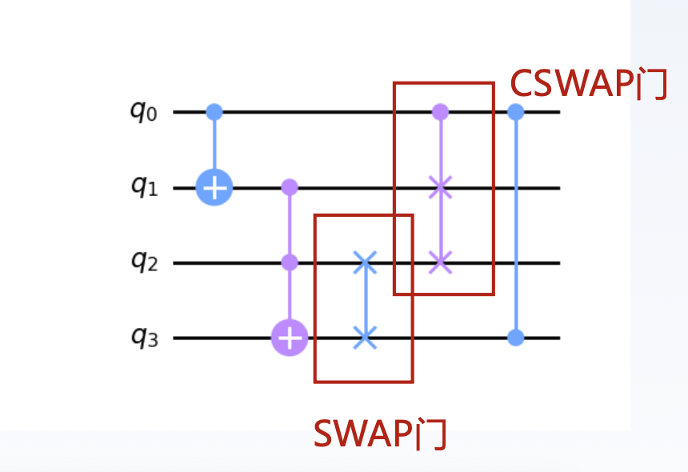{ align=right width=20% }

$$
\mathrm{SWAP}=\begin{pmatrix}1&0&0&0\\0&0&1&0\\0&1&0&0\\0&0&0&1\end{pmatrix}
$$

SWAP 门可以用来生成和操作纠缠态。**通过交换两个量子比特的状态，可以创建新的纠缠态**。可以给 SWAP 门添加控制端，使之成为 CSWAP，即受控的 SWAP 门，又被成为 Fredkin 门。

由于现阶段量子计算机中量子比特的**连接性**问题，两个逻辑上可以进行多比特门操作的量子比特，**在硬件上可能并不相邻**，这就需要 SWAP 操作将物理比特的量子比特“交换”后再进行多比特门操作。SWAP操作也因此成为量子线路编译及优化中常用的技术。

    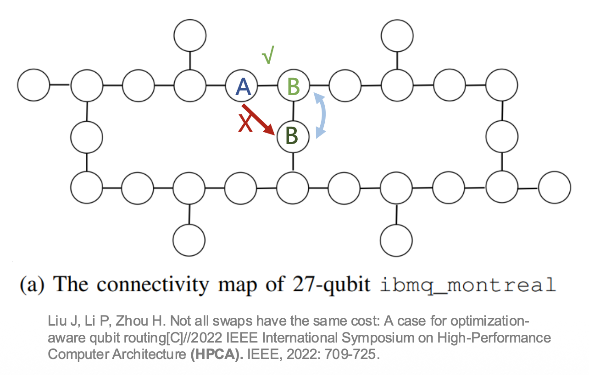

### Toffoli 门

**Toffoli 门**（有时也称为 CCNOT 门或者 CCX 门）是一个三量子比特门，它在经典计算中执行了一个非常重要的逻辑操作，即布尔逻辑中的 AND 门。具体来说，Toffoli 门的操作如下：

- 如果前两个量子比特（通常称为**控制比特**）都处于状态 $|1\rangle$ 时，它会对第三个量子比特（通常称为**目标比特**）执行一个非门操作
- 如果其中任何一个或两个控制比特处于 $|0\rangle$ 状态，它不会执行非门操作，目标比特保持不变

{ align=right width=30% }

$$
\mathrm{Toffoli}=\begin{pmatrix}1&0&0&0&0&0&0&0\\0&1&0&0&0&0&0&0\\0&0&1&0&0&0&0&0\\0&0&0&1&0&0&0&0\\0&0&0&0&1&0&0&0\\0&0&0&0&0&1&0&0\\0&0&0&0&0&0&0&1\\0&0&0&0&0&0&1&0\end{pmatrix}
$$

Toffoli 门的广义形式： 除了标准的 CCNOT 门，还有更通用的多量子比特门，例如 CCCNOT、CCCCNOT 等，具体取决于控制比特的数量。

### 量子计算的并行性

**量子并行性**是量子计算的一个基本特征，它使得量子计算机可以同时计算 $f(x)$ 在多个 $x$ 取值下的函数值。假如存在一个量子电路，可以实现 $|x, y\rangle \rightarrow |x, y \oplus f(x) \rangle$ 的映射，其中 $\oplus$ 符号表示模2加运算。如果输入的 $y = 0$， 那么第二个输出等于 $f(x)$ 。现在，让我们考虑输入 $x$ 处于叠加态中，如下所示：

    

经过该电路之后，系统的量子态转化为：
$$
\frac{\mid0,f(0)\rangle+\mid1,f(1)\rangle}{\sqrt{2}}
$$

值得注意的是，这个结果中既包含了 $f(0)$，也包含了 $f(1)$，该电路似乎对 $x$ 的两个取值同时计算了函数 $f$。在经典计算中，需要使用多个电路模块才能实现这样的并行计算，但是在量子计算中利用叠加态，可以在一个电路中同时计算多个函数值。

???+ question "思考"

    === "问题"

        在上述情况中，函数 $f$ 的输入 $x$ 由一个 qubit 来编码，只有 0 或者 1 两种状态；假如函数稍微复杂一些，输入 $x$ 由两个 qubit 来编码，并有四种可能取值：$|00\rangle, |01\rangle, |10\rangle, |11\rangle$，应该怎样实现并行计算？

    === "解答"

        我们可以分别施加 H 门在两个 qubits 的初态 0 上，得到：
        $$
        x=(\frac{|0\rangle+|1\rangle}{\sqrt{2}})(\frac{|0\rangle+|1\rangle}{\sqrt{2}})=\frac{|00\rangle+|01\rangle+|10\rangle+|11\rangle}{2}
        $$

        再将 $x$ 应用前文提到的量子电路，则该电路可以同时计算  $x$ 的 4 种取值对应的函数值。若将其推广到具有 $N = 2n$ 种输入的函数，则需要 $n$ 个 H 门分别作用在 $n$ 个初态量子比特上，得到所有可能取值的平衡叠加：

        $$
        \begin{aligned}\frac{1}{\sqrt{2^n}}\sum_x|x\rangle\end{aligned}
        $$

        应用前文提到的量子电路，最终产生具有并行计算效果的输出：

        $$
        \frac{1}{\sqrt{2^n}}\sum_x\mid x\rangle\mid f(x)\rangle
        $$

### Deutsch 算法

???+ info "引入"

    然而，这种并行性并不是直接有用，如果对输出进行测量，每一次测量也只能获得一种输入 $x_i$ 下的函数值，这与经典计算相比并没有优势。量子计算要求的不仅是并行性，还要求有更高的信息抽取能力，我们将从 **Deutsch 算法**中一窥量子计算的优越性！

用 $x \in {0, 1}^n$ 来表示由 $0$ 或 $1$ 组成的任意 $n$ 为二进制数，例如 $n = 3$ 时，一个可能的二进制数为 $010$. 我们定义在 $n$ 位长度二进制数上的映射函数 $f$，它分为两种情况：

    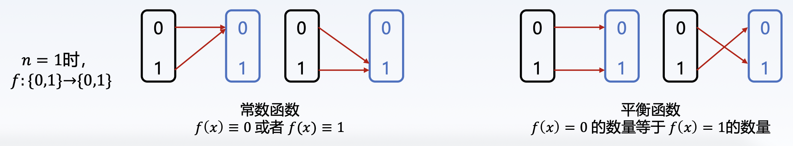

**Deutsch 问题**就是：如果有一个符合以上条件的未知函数，那么如何尝试最少且足够的次数，来确定它是常数函数还是平衡函数？

???+ note "经典计算机算法"

    $n$ 位 2 进制最多表示 $2^n$ 个数字，比如：

    - $n = 2$ 位，$2^2$ 种：00、01、10、11，可以表示十进制的 0-3
    - $n = 3$ 位，$2^3$ 种：000、001、010、011、100、101、110、111，可以表示表示十进制 0-7

    

        
    

    所以，对于经典计算机来说，**需要尝试 $2^{n-1} + 1$ 次（也就是一半多一次）**，才能确保足够可以判断未知函数属于哪一种，因为前提只有 2 种函数可选，一半多一次恰好刚刚超过 50%，如果这么多情况的结果都是相同的，那么它就是常数函数，否则就是平衡函数。

而对于量子计算机算法，单量子比特 4 种可能操作及对应 $f$ 算子如下：

    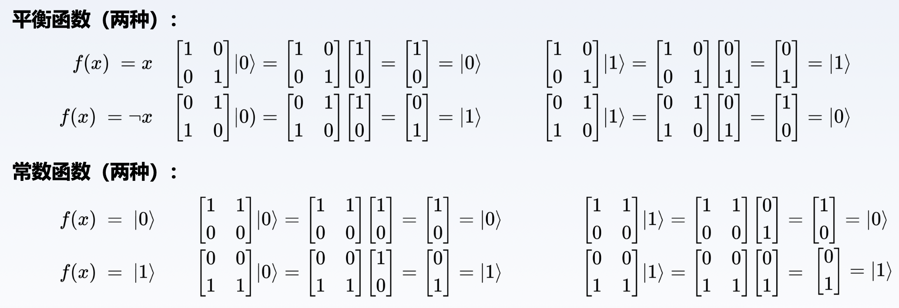

现在问题是：假设有一个函数操作，我们只知道它是四种操作里的一种，但我们可以用输入输出进行测试，那么，要确定属于平衡函数还是常数函数，我们**最少做几次测试**？

**Deutsch 算法**使用的电路和前文提到的类似，但不同之处在于 $y$ 也处于叠加态，如下所示：

    

其中，输入态经过两个 H 门之后，新量子态为：
$$
\mid\psi_1\rangle=\left[\frac{|0\rangle+|1\rangle}{\sqrt{2}}\right]\left[\frac{|0\rangle-|1\rangle}{\sqrt{2}}\right]
$$

由于异或计算的特性，我们有：
$$
|x\rangle|y\rangle \overset{U_f}{\longrightarrow} |x\rangle|y \oplus f(x)\rangle = |x\rangle(-1)^{f(x)}|y\rangle
$$

考虑输入 $|x\rangle$ 为：$\left[\frac{|0\rangle+|1\rangle}{\sqrt{2}}\right]$，因此 $U_f$ 的输出为：
$$
|\psi_2\rangle=\frac{|0\rangle(-1)^{f(0)}|y\rangle+|1\rangle(-1)^{f(1)}|y\rangle}{\sqrt{2}}=\frac{|0\rangle(-1)^{f(0)}+|1\rangle(-1)^{f(1)}}{\sqrt{2}}|y\rangle
$$

经过简单分类讨论我们可以得到：

$$
|\psi_2\rangle=\left\{\begin{array}{cc}\pm\left[\frac{|0\rangle+|1\rangle}{\sqrt{2}}\right]\left[\frac{|0\rangle-|1\rangle}{\sqrt{2}}\right]&\mathrm{if~}f(0)=f(1)\\\\\pm\left[\frac{|0\rangle-|1\rangle}{\sqrt{2}}\right]\left[\frac{|0\rangle-|1\rangle}{\sqrt{2}}\right]&\mathrm{if~}f(0)\neq f(1).\end{array}\right.
$$

对第一个 qubit 施加 H 门，这可以把第一个 qubit 复原为 $|0\rangle$ 或者 $|1\rangle$：

$$
\left.|\psi_3\rangle=\left\{\begin{array}{cc}\pm|0\rangle\left[\frac{|0\rangle-|1\rangle}{\sqrt{2}}\right]&\mathrm{if~}f(0)=f(1)\\\\\pm|1\rangle\left[\frac{|0\rangle-|1\rangle}{\sqrt{2}}\right]&\mathrm{if~}f(0)\neq f(1).\end{array}\right.\right.
$$

再一次联系异或计算的定义，注意到当 $f(0) = f(1)$ 时， $f(0) \oplus f(1)$ 为 0，其余情况为 1，因此我们
可以将第一个量子比特进一步改写为：
$$
|\psi_3\rangle=\pm|f(0)\oplus f(1)\rangle\left[\frac{|0\rangle-|1\rangle}{\sqrt{2}}\right]
$$

可以看到，最终的系统量子态中，第二个 qubit 的态是固定的，而第一个 qubit 的状态却与 $f(0)$ 和 $f(1)$ 都有关。对第一个 qubit 进行测量，如果结果为 $|0\rangle$, 那么说明 $f$ 是平衡函数，反之为常数函数。

这是一个很有趣的特性，这意味着我们可以**通过一次计算、一次测量，就确定了函数 $f$ 的一个全局性质**，这个过程比所有可能的经典计算都要快，因为经典计算至少需要两次计算。

由此可见，通过**精心选择函数以及变换**，以优于经典计算的速度获取函数的全局信息是可能的，这也是许多量子算法的设计本质。

### Oracle

???+ info "注"

    古希腊时期，Oracle 是 Delphi 的阿波罗神庙女祭司，她们有时会对询问的问题给出 yes 或 no 的回复

而在量子计算里: **Oracle** 代表的功能是输入数据，输出 1(yes) 或 0(no)。

{ align=right width=30% }

- Oracle的要点：
    - 尽可能快速高效
    - 调用 Oracle 的次数尽可能少，减少算法复杂度

- Oracle 也被称为黑盒，意思是我们知道它的行为，但是不知道它如何实现
- 输入的数据用 01 串表示，则函数 $f$ 可以表示为：$f: \{0, 1\}^n \rightarrow \{0, 1\}$
- 在量子计算中，Oracle 可以表示为：

    $$
    f(|\psi\rangle)=\begin{cases}|1\rangle&\text{like: }|\psi\rangle=|1000\rangle\\|0\rangle&\text{otherwise}&\end{cases}
    $$

#### 线路设计

因此，首先我们需要设计一个量子线路，它包含我们需要进行判断的函数 $f(x)$ ，可以传入一些量子比特，然后输出另外一些量子比特，并且可以让我们从输出的量子比特中一眼就可以看出其是常量函数还是平衡函数。
$$
U_f:|x\rangle|y\rangle\to|x\rangle|y\oplus f(x)\rangle
$$

其中 $\oplus$ 表示异或。

在这里我们输入两个量子位 InputA 和 InputB，其中 InputA 是固定的 $|0\rangle$，你可以把它视为辅助输入；同样输出的 OutputA 是真正的操作结果，而 OutputB 也可以视为冗余输出。那么我们可以构造出 4 种操作对应的线路：

    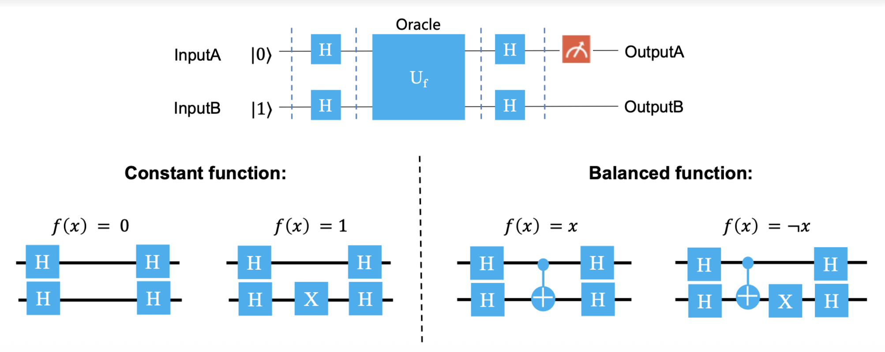

#### 线路简化

由单比特门的矩阵表示，可知：

    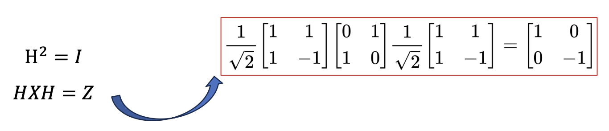

因此常量函数中 $f(x) = 0, f(x) = 1$ 对应的电路可以简化为：

    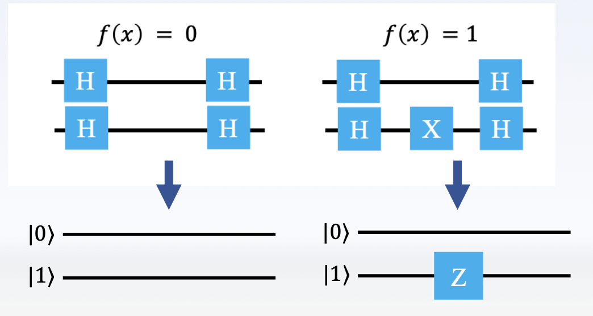

CNOT 的低位、高位作为控制比特时，其矩阵表示分别为：

$$
CNOT_{low}=\begin{bmatrix}1&0&0&0\\0&0&0&1\\0&0&1&0\\0&1&0&0\end{bmatrix}\quad CNOT_{high}=\begin{bmatrix}1&0&0&0\\0&1&0&0\\0&0&0&1\\0&0&1&0\end{bmatrix}
$$

且有：

$$
\begin{aligned}
& \mathrm{H}\otimes\mathrm{H}=\frac{1}{\sqrt{2}}\begin{bmatrix}1&1\\1&-1\end{bmatrix}\otimes\frac{1}{\sqrt{2}}\begin{bmatrix}1&1\\1&-1\end{bmatrix}=\frac{1}{2}\begin{bmatrix}1&1&1&1\\1&-1&1&-1\\1&1&-1&-1\\1&-1&-1&1\end{bmatrix} \\
& (H\otimes H)CNOT_{low}(H\otimes H)=\frac{1}{4}\begin{bmatrix}1&1&1&1\\1&-1&1&-1\\1&1&-1&-1\\1&-1&-1&1\end{bmatrix}\begin{bmatrix}1&0&0&0\\0&0&0&1\\0&0&1&0\\0&1&0&0\end{bmatrix}\begin{bmatrix}1&1&1&1\\1&-1&1&-1\\1&1&-1&-1\\1&-1&-1&1\end{bmatrix}=\frac{1}{4}\begin{bmatrix}1&0&0&0\\0&1&0&0\\0&0&0&1\\0&0&1&0\end{bmatrix}=CNOT_{high}
\end{aligned}
$$

因此平衡函数中 $f(x) = x$ 对应的电路可以简化为：

    

综上，我们得到以下三条电路简化的结论：

    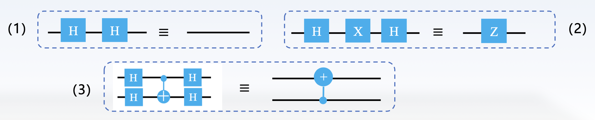

那么，对于平衡函数中 $f(x) = \neg x$ 对应的电路可以简化为：

    

### 量子电路部署流程

    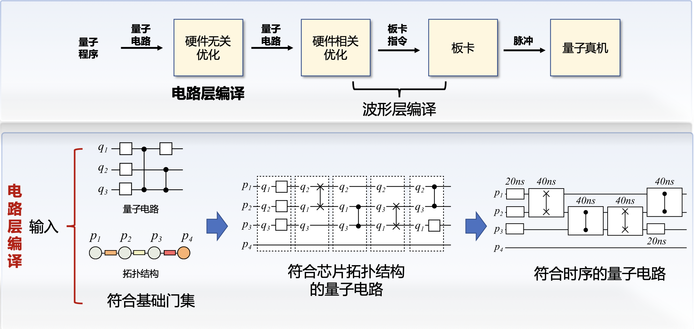

    

波形生成：

    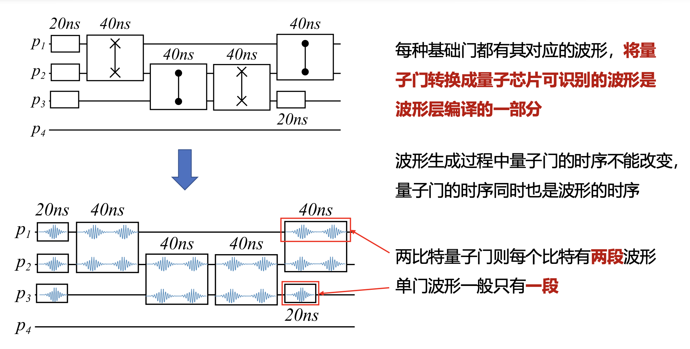

