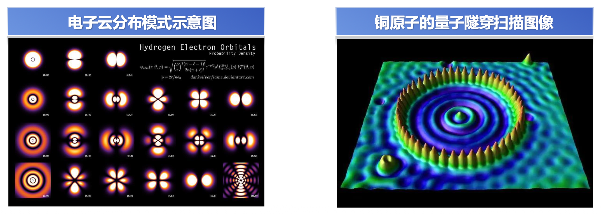
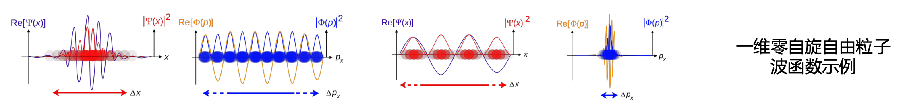
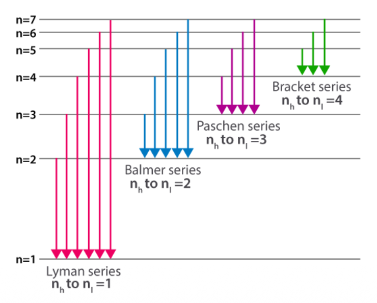
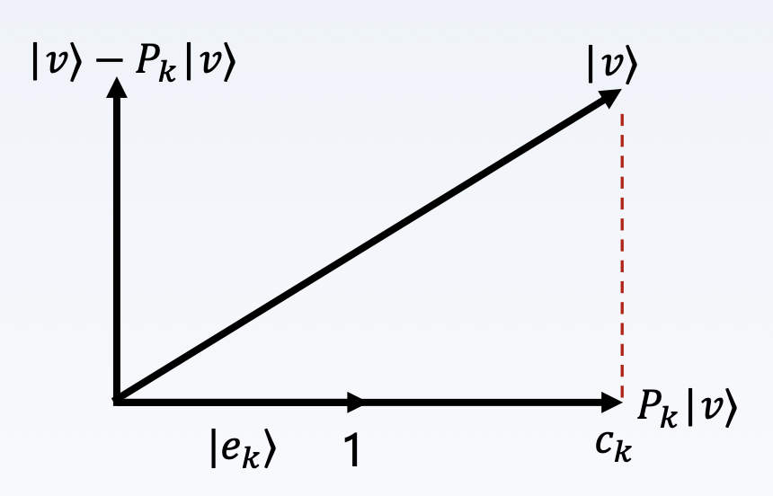
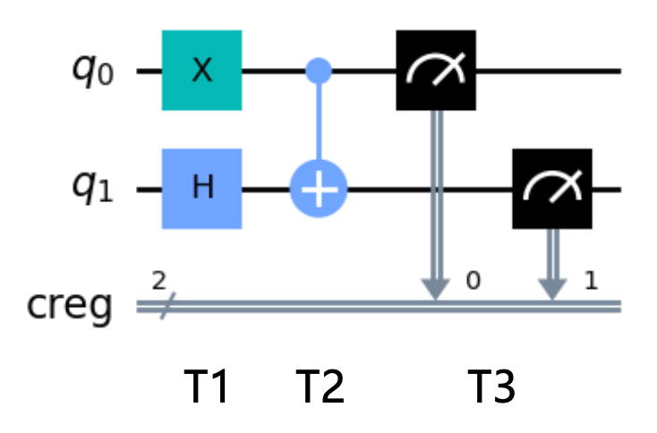

# 量子测量与量子图灵机

## 量子态演化

### 波函数

- 波函数是量子力学的基本假设，波函数最简单的形式是：$\psi(x) = Ae^{i\left(\frac{p}{\hbar}\right)x}$，它是一种复指数函数，表示了粒子在某位置的**概率幅**，其绝对值的平方意味着某个时间点自由粒子在某个位置的**概率密度**
- 波函数需要满足**归一化条件**，即对其绝对值的平方进行全空间积分，**结果一定是 1**

    

### 哈密顿量

- **哈密顿量**通常表示为 $H$，是一个**厄米算符**，它对应于系统的**能量算符**。在量子力学中，系统的状态可以由波函数表示，而哈密顿量作用于波函数上，产生系统的**能量和动力学演化**。

    

        
    

- 哈密顿量由两个部分组成：**动能项**和**势能项**
    - 动能项描述了系统中粒子的运动能量，通常用动量算符和质量来表示
    - 势能项则描述了系统中粒子之间的相互作用和受到的外部场的影响，可以是位置算符和外部势场的函数

- 哈密顿量表达式：

    $$
    \hat{H} = -\dfrac{h^2}{2m} \nabla^2 + V(\bar{r})
    $$

- 在量子计算中，哈密顿量在描述量子比特的演化和控制中起着关键的作用。通过设计和调整系统的哈密顿量，可以实现量子比特之间的耦合、量子门操作和量子算法的实现。
- 离散哈密顿量（算符），以量子光学中原子与电磁场相互作用的哈密顿量为例：

    $$
    \hbar \begin{pmatrix} 0 & \Omega_1 \cos(\omega t + \varphi) \\ \Omega_1 \cos(\omega t + \varphi) & \omega_0 \end{pmatrix}
    $$

- 哈密顿量表达式的**第一项实则为粒子的动能**，**第二项是一个空间位置的函数**，即势能函数，表示粒子处在不同位置时的势能。

    $$
    \hat{H} = \hat{T} + \hat{V} = \frac{\mathbf{\hat{p}} \cdot \mathbf{\hat{p}}}{2m} + V(\mathbf{r}, t) = -\frac{\hbar^2}{2m}\nabla^2 + V(\mathbf{r}, t)
    $$

- 哈密顿量的本征值是**系统能量的可能取值**，对应的特征向量是在该能量取值下的**状态向量**。它们可以用来刻画系统的能级结构、谱线、跃迁概率等性质。

    

        
    

### 薛定谔方程与量子态演化

- 哈密顿量 $H$ 可以用于表征量子态演化，$H$ 可以和时间有关，也可以独立与时间；若与时间独立（不显含 $t$），则**薛定谔方程**为：

    $$
    i\hbar \frac{d|\psi(t)\rangle}{dt} = H |\psi(t)\rangle
    $$

- 该方程是一个一阶齐次微分方程，移项后积分，积分的上下限表示波函数从时间 $t_1$ 演化到时间 $t_2$

    $$
    \begin{aligned}
    \int_{t_1}^{t_2} \frac{i\hbar}{|\psi(t)\rangle} d|\psi(t)\rangle & = \int_{t_1}^{t_2} H dt \\
    i\hbar \left( \ln |\psi(t_2)\rangle - \ln |\psi(t_1)\rangle \right) & = H(t_2 - t_1)
    \end{aligned}
    $$

    可得：

    $$
    |\psi(t_2)\rangle = e^{\frac{-iH(t_2-t_1)}{\hbar}} |\psi(t_1)\rangle = e^{\frac{-iH\Delta t}{\hbar}} |\psi(t_1)\rangle
    $$

    设 $t_1 = 0, t_2 = t$，则有：

    $$
    |\psi(t)\rangle = e^{\frac{-iH\Delta t}{\hbar}} |\psi(0)\rangle = U |\psi(0)\rangle
    $$

    该式表明，量子态从初态到终态的演化可以由一个与 $H$ 有关的算子表示，**该算子又被称为时间演化算子 $U$，且 $U$ 一定是幺正的**。如果哈密顿量显含时间，则需要更复杂的分析计算，并涉及到时序算子、对易性等原理。

---
根据量子力学原理，量子态演化过程由两部分组成：

- **线性演化过程**：如果一个物理系统没有被测量，它将按照薛定谔方程以一种确定的、线性的方式演化
- **非线性的坍缩过程**：如果对系统进行一个测量，系统将立即非线性地、随机地从初始的叠加态跃迁到正被测量的可观测量的一个本征态，这时，实验者就会感知到一个确定的观察值，即本征态相应的本征值

    

---
- 与牛顿定律方程描述了低速世界的运动基本规律类似，**薛定谔方程也是描述量子系统随时间的演化规律的基本方程**。
- 量子电路中的门，实际上正是通过影响**量子系统的“演化”**来对量子比特产生逻辑效应。对于量子计算系统，**每个量子位都可以处于一种叠加态**，这与薛定谔方程中的波函数叠加性质密切相关；薛定谔方程告诉我们粒子可以同时处于多个状态，而**量子位也可以处于多个状态的叠加**。

总之，薛定谔方程就是**量子计算的最底层的理论基础**！

## 量子测量

### 特征值与特征向量

我们知道，矩阵乘法对应了一个变换，是把任意一个向量变成另一个方向或长度都大多不同的新向量。

- 在这个变换的过程中，**原向量主要发生旋转、伸缩的变化**。
- 如果矩阵对某一个向量或某些向量只发生伸缩变换，不对这些向量产生旋转的效果，那么这些向量就称为这个矩阵的**特征向量，伸缩的比例就是特征值**。

    

---
如果说一个向量 $v$ 是方阵 $A$ 的特征向量，将一定可以表示成下面的形式：
$$
Av = \lambda v
$$

这时候，$\lambda$ 就被称为特征向量 $v$ 对应的特征值，特征值分解是将一个矩阵分解成下面的形式：
$$
A = Q \Sigma Q^{-1}
$$

其中 $Q$ 是矩阵 $A$ 的**特征向量**组成的矩阵，$\Sigma$ 是一个**对角阵**，对角线上的每个元素就是一个**特征值**。

**特征值分解**的含义：

- 分解得到的 $\Sigma$ 矩阵是一个对角阵，里面的特征值是**由大到小排列的**，这些特征值所对应的特征向量就是描述这个矩阵变化方向（从主要的变化到次要的变化排列）
- 也就是说**矩阵 $A$ 的信息可以由其特征值和特征向量表示**
- 对于矩阵为高维的情况下，那么这个矩阵就是高维空间下的一个线性变换。可以想象，这个变换也同样有很多的变换方向，我们通过特征值分解得到的前 N 个特征向量，那么就对应了这个矩阵最主要的 N 个变化方向。我们利用这前 N 个变化方向，就可以近似这个矩阵（变换）。

综上，特征值分解可以得到特征值与特征向量，

- 特征值表示的是这个特征到底有多重要
- 而特征向量表示这个特征是什么

不过，特征值分解也有很多的局限，比如说变换的矩阵必须是方阵。

### 特征分解

**特征分解**(eigen decomposition)（又称**谱分解**(spectral decomposition)）是将矩阵分解为由其特征值 $\lambda_i$ 和特征向量 $v_i$ 表示的矩阵 $V = [v_1\ v_2\ \dots\ v_n]$ 之积的方法：

$$
A=V{\begin{bmatrix}\lambda_1&\cdots&0\\\\\vdots&\ddots&\vdots\\0&\cdots&\lambda_n\end{bmatrix}}V^{-1}
$$

需要注意只有对**可对角化矩阵**才可以施以特征分解。特征值的集合 $\{\lambda_i\}$，也称为“**谱**(spectrum)”。因为**厄米矩阵**（共轭对称的方阵）属于正规矩阵，根据正规矩阵的性质可知，其可以对角化。

???+ info "正规矩阵"

    对于一个复数域上的方阵 $A$，若满足 $AA^\dagger = A^\dagger A$（$A^\dagger$ 为 $A$ 的共轭转置），则称 $A$ 是一个**正规矩阵**(normal matrix)。

假设 $A$ 是一个复数域正规矩阵，它的特征值为 $\{\lambda_i\}$，标准正交基为 $\{|e_i\rangle\}$ ，那么 $A$ 可以分解为：
$$
A = U \Lambda U^\dagger =\sum_{i=1}^\mathbf{n}\lambda_i|e_i\rangle\langle e_i|
$$

其中 $U = \begin{bmatrix}e_1 & \dots & e_n\end{bmatrix}, \Lambda = \text{diag}(\lambda_1, \dots, \lambda_n)$。

### 标准正交基和完备性方程

标准正交基 $\{|e_i\rangle\}$ 满足如下条件（$i, j$ 相同为 1，不同为0）：$\langle e_i | e_j \rangle = \delta_{ij}$。

**完备性方程**：
$$
\sum_{i=1}^n\lvert e_i\rangle\langle e_i\rvert=I
$$

??? proof "证明"

    令 $|x\rangle=\sum_{i=1}^{n}c_i|e_i\rangle$，由于：

    $$
    \langle e_j|x\rangle=\sum_{i=1}^nc_i\langle e_j||e_i\rangle=\sum_{i=1}^nc_i\delta_{ij}=c_j
    $$

    即：$c_j = \langle e_j | x \rangle$，因此有：

    $$
    |x\rangle=\sum_{i=1}^nc_i|e_i\rangle=\sum_{i=1}^n\langle e_i|x\rangle|e_i\rangle=\left(\sum_{i=1}^n|e_i\rangle\langle e_i|\right)|x\rangle
    $$

    由于 $|x\rangle$ 是任意的，因此有 $\sum_{i=1}^n|e_i\rangle\langle e_i|=I$。

??? example "例子"

    === "问题"

        验证 $|00\rangle=\begin{bmatrix}1\\0\\0\\0\end{bmatrix}|01\rangle=\begin{bmatrix}0\\1\\0\\0\end{bmatrix}|10\rangle=\begin{bmatrix}0\\0\\1\\0\end{bmatrix}|11\rangle=\begin{bmatrix}0\\0\\0\\1\end{bmatrix}$ 是一组标准正交基。

    === "解答"

        $$
        \begin{aligned}
        & |00\rangle\langle00|+|01\rangle\langle01|+|10\rangle\langle10|+|11\rangle\langle11\\
        = & \begin{bmatrix}1\\0\\0\\0\end{bmatrix}[1000]+\begin{bmatrix}0\\1\\0\\0\end{bmatrix}[0100]+\begin{bmatrix}0\\0\\1\\0\end{bmatrix}[0010]+\begin{bmatrix}0\\0\\0\\1\end{bmatrix}[0001]\\
        = & \begin{bmatrix}1&0&0&0\\0&0&0&0\\0&0&0&0\\0&0&0&0\end{bmatrix}+\begin{bmatrix}0&0&0&0\\0&1&0&0\\0&0&0&0\\0&0&0&0\end{bmatrix}+\begin{bmatrix}0&0&0&0\\0&0&0&0\\0&0&1&0\\0&0&0&0\end{bmatrix}+\begin{bmatrix}0&0&0&0\\0&0&0&0\\0&0&0&0\\0&0&0&1\end{bmatrix}=\begin{bmatrix}1&0&0&0\\0&1&0&0\\0&0&1&0\\0&0&0&1\end{bmatrix}=I
        \end{aligned}
        $$

### 投影算子

将一个向量 $|v\rangle$ 投影到特定方向，使用单位向量 $|e_k \rangle$ 定义**投影算子**为：

$$
P_k = | e_k \rangle \langle e_k |
$$

{ align=right width=30% }

这样的投影算子集合 $\{P_k = | e_k \rangle \langle e_k |\}$ 且满足如下性质：

- $P_k^2 = P_k$
- $P_k P_j = 0 (k \ne j)$
- $\sum P_k = I$

对于：
$$
P_k|v\rangle=|e_k\rangle\langle e_k|v\rangle=c_k|e_k\rangle
$$

其中 $\langle e_k|v\rangle$ 为向量内积，根据**向量内积的几何意义**，向量 $v$ 在另一个向量 $e_k$ 上的投影长度 $c_k$ 乘以 $e_k$ 的长度，由于 $e_k$ 长度为 1，所以可知，向量内积为 $c_k$。

综上，$P_k |v \rangle$ 为 $|v\rangle$ 在 $|e_k \rangle$ 上的投影。

??? example "例子"

    若两个基向量为：

    $$
    \begin{aligned}&|e_1\rangle=H|0\rangle=\frac{1}{\sqrt2}(|0\rangle+|1\rangle)=\frac{1}{\sqrt2}\begin{bmatrix}1\\1\end{bmatrix}\\&|e_2\rangle=H|1\rangle=\frac{1}{\sqrt2}(|0\rangle-|1\rangle)=\frac{1}{\sqrt2}\begin{bmatrix}1\\-1\end{bmatrix}\end{aligned}
    $$

    对应的投影算子为：

    $$
    \begin{aligned}
    P_1 & =|e_1\rangle\langle e_1|=\frac{1}{\sqrt{2}}\begin{bmatrix}1\\1\end{bmatrix}\frac{1}{\sqrt{2}}[1\quad1]=\frac{1}{2}\begin{bmatrix}1&1\\1&1\end{bmatrix} \\
    P_2 & =|e_2\rangle\langle e_2|=\frac{1}{\sqrt{2}}\begin{bmatrix}1\\-1\end{bmatrix}\frac{1}{\sqrt{2}}[1\quad-1]=\frac{1}{2}\begin{bmatrix}1&-1\\-1&1\end{bmatrix}
    \end{aligned}
    $$

    由 $P_1, P_2$ 可以验证**完备性方程**：

    $$
    \sum_kP_k=\begin{bmatrix}1&0\\0&1\end{bmatrix}=I
    $$

    以及**正交条件**：

    $$
    P_1P_2=\begin{bmatrix}0&0\\0&0\end{bmatrix}
    $$

### 谱分解的另一种视角

回顾前文提到，复数域正规矩阵 $A$ 有谱分解：
$$
A=\sum_{i=1}^\mathbf{n}\lambda_i|e_i\rangle\langle e_i|
$$

根据投影算子的定义 $P_k = | e_k \rangle \langle e_k |$，因此复数域正规矩阵 $A$ 可以表示为：
$$
A = \sum_i \lambda_i P_i
$$

因此 $A$ 作用于任何向量，其几何意义如下：相当于该向量，投影到 $A$ 的各特征向量上，然后再以特征值 $\{\lambda\}$ 为系数**线性组合**起来。

### 量子测量

**测量**是获取关于量子系统状态的信息的主要方式。测量允许我们从量子系统中获取观测值，以便预测和理解系
统的性质，并在量子计算中执行各种程序。

如前文所说，**量子测量是一个非线形演化，将导致量子态的坍缩**：当对量子比特 $|\psi\rangle=\alpha|0\rangle+\beta|1\rangle$ 进行测量时，仅能得到该量子比特概率 $|\alpha|^2$ 处在 $|0\rangle$ 态，或概率 $|\beta|^2$ 处在 $|1\rangle$ 态。由于所有情况的概率总和为 $1$，则有 $|\alpha|^2 + |\beta|^2 = 1$。

量子测量有很多种方式，如：

- 一般测量
- 投影测量(projective measurements)
- POVM 测量(positive operator-valued measure)

对于选定的观测性质，我们需要执行相应的测量算符。例如，位置测量可以使用位置算符，自旋测量可以使用自旋算符。

每个可能的测量结果都对应一个测量算符的特征值 $\lambda$，由可观测量 $|P|\psi\rangle|^2$ 描述，$P$ 为特征值 $\lambda$ 对应的特征空间上的投影。由于向量做了归一化，**测量的状态可以用特征值和特征向量来描述**。

#### 投影测量

**投影测量**由一个**可观测量**(observable) $A$（矩阵）来描述。**指标**(index) $i$ 表示在实验上可能发生的结果。可观测量 $A$ 是一个待观测系统的状态空间上的厄米算子，它可以写成**谱分解**的形式：
$$
A = \sum_i \lambda_i P_i
$$

测量的可能结果与可观测量 $A$ 的特征值 $\lambda_i$ 对应。在对状态 $|\psi\rangle$ 测量之后 , 得到结果 $i$ 概率为：
$$
p_{i}=p(\lambda=\lambda_{i})=\langle\psi|P_{i}|\psi\rangle
$$

测量后的态坍缩为：$\dfrac{P_{i}|\psi\rangle}{\sqrt{p_{i}}}$

观测量的**平均值**为：$E(A)=\sum_i\lambda_ip_i=\sum_i\lambda_i\langle\psi|P_i|\psi\rangle=\langle\psi|(\sum_i\lambda_iP_i)|\psi\rangle=\langle\psi|A|\psi\rangle=\langle A\rangle$

**标准差**为：$\Delta(A)=\sqrt{\langle(A-\langle A\rangle)^2\rangle}=\sqrt{\langle A^2\rangle-\langle A\rangle^2}$

---
量子测量是由**投影算子**(projection operator)的集合 $\{P_i\}$ 来描述的。投影算子是一类特殊的厄米算符，它的本征值为 0 或 1，其本征态形成了正交归一的完备基。投影算符具有如下性质：
$$
P_m^\dagger P_m=P_m^2=P_m
$$

指标(index) $i$ 表示在实验上可能发生的结果。如果测量前的量子系统处在最新状态 $|\psi\rangle$，那么结果发生的概率为：
$$
\mathrm{p}(i)=\langle\psi|P_i^\dagger P_i|\psi\rangle=\langle\psi|P_i|\psi\rangle
$$

用投影算子 $P_i$ 测量，就是将量子态 $|\psi \rangle$ 投影到它的本征态矢 $|\alpha \rangle$ 上（即 $P_i = | \alpha \rangle \langle \alpha |$）。获得这个态的概率是它们**内积的平方**：
$$
p_\alpha=|\langle\psi|\alpha\rangle|^2
$$

在投影测量之后，量子态就坍缩到本征态矢 $|\alpha\rangle$ 上。

??? question "问题"

    === "题目"

        

            
        

    === "解答"

        答案：C

        由于 $M^2 = 3M$，利用投影算符性质对 $M$ 进行**归一化处理**，$M'= \dfrac{1}{3} M$，然后计算 $\langle \psi | M' | \psi \rangle$。

??? example "例子"

    === "例1：单比特测量"

        当我们测量单比特量子态 $|\psi\rangle=\alpha|0\rangle+\beta|1\rangle$ 时，使用的投影算子为：

        $$
        P_0 = |0\rangle\langle 0| = \begin{bmatrix} 1 & 0 \\ 0 & 0 \end{bmatrix}, P_1 = |1\rangle\langle 1| = \begin{bmatrix} 0 & 0 \\ 0 & 1 \end{bmatrix}
        $$

        可以证明，这两个算子是**自伴**的（厄米的），即：
        $$
        P_0^\dagger = P_0, P_1^\dagger = P_1
        $$

        而且有：
        $$
        P_0^2 = P_0, P_1^2 = P_1
        $$

        且满足完备性方程：
        $$
        P_0^\dagger P_0 + P_1^\dagger P_1 = P_0 + P_1 = I
        $$

        当使用 $P_0$ 作用在态矢量上，得到 0 态的概率为：

        $$
        \mathrm{p}(0) = \langle\psi|P_0^\dagger P_0|\psi\rangle = \langle\psi|P_0|\psi\rangle = \begin{bmatrix} \alpha,\beta \end{bmatrix} \begin{bmatrix} 1 & 0 \\ 0 & 0 \end{bmatrix} \begin{bmatrix} \alpha \\ \beta \end{bmatrix} = |\alpha|^2
        $$

        测量后的状态为：
        $$
        \frac{P_0 |\psi\rangle}{\sqrt{\mathrm{p}_0}} = \frac{P_0 |\psi\rangle}{\alpha} = \frac{\alpha}{|\alpha|} |0\rangle
        $$

        同理，得到 1 态的概率为：

        $$
        \mathrm{p}(1) = \langle\psi|P_1^\dagger P_1|\psi\rangle = \langle\psi|P_1|\psi\rangle = \begin{bmatrix} \alpha,\beta \end{bmatrix} \begin{bmatrix} 0 & 0 \\ 0 & 1 \end{bmatrix} \begin{bmatrix} \alpha \\ \beta \end{bmatrix} = |\beta|^2
        $$

        测量后的状态为：

        $$
        \frac{P_1 |\psi\rangle}{\sqrt{\mathrm{p}_1}} = \frac{P_1 |\psi\rangle}{\beta} = \frac{\beta}{|\beta|} |1\rangle
        $$

    === "例2"

        >来自去年期中卷。

        === "题目"

            考虑多比特量子系统 $|\psi\rangle = \frac{1}{2}|000\rangle + \frac{1}{2}|010\rangle + \frac{1}{2}|101\rangle + \frac{1}{2}|111\rangle$, 若对其中部分量子比特进行测量，其余量子比特的量子态会发生变化。请回答以下问题：

            1. 若对最高位量子比特使用标准基 $\big\{|0\rangle, |1\rangle\big\}$ 进行测量，给出所有可能的测量结果和测量后剩余两个量子比特的态。

            2. 若对最高位和最低位两个量子比特使用 **Bell 基** $\big\{|\beta_{xy}\rangle = \frac{1}{\sqrt{2}}(|x y\rangle + (-1)^x | \bar{x} \bar{y}\rangle)\big\}$ 进行部分测量，给出所有可能的测量结果和测量后剩余一个量子比特的态。

        === "解答"

            1. 对最高位比特使用标准基进行测量，有 $p_i$ 的概率测得 $|i\rangle$，测量后系统态为 $|\psi_i\rangle$，其中

            $$
            \begin{aligned}
            M_0 &= \sum_{j\in\{00,01,10,11\}} M_{0j} \\
            p_0 &= \langle\psi|M_0|\psi\rangle = \frac{1}{4} + \frac{1}{4} = \frac{1}{2} \\
            |\psi_0\rangle &= \frac{M_0|\psi\rangle}{\sqrt{p_0}} = \frac{1}{\sqrt{2}}(|00\rangle + i|10\rangle) \\
            M_1 &= \sum_{j\in\{00,01,10,11\}} M_{1j} \\
            p_1 &= \langle\psi|M_1|\psi\rangle = \frac{1}{4} + \frac{1}{4} = \frac{1}{2} \\
            |\psi_1\rangle &= \frac{M_1|\psi\rangle}{\sqrt{p_1}} = \frac{1}{\sqrt{2}}(|01\rangle + i|11\rangle)
            \end{aligned}
            $$

            ---
            2. 将最高位和最低位两个量子比特记在左侧，变换量子态形式有

            $$
            \begin{aligned}
            |\psi\rangle &= \frac{1}{2}|000\rangle + \frac{i}{2}|001\rangle + \frac{1}{2}|110\rangle + \frac{i}{2}|111\rangle \\
            &= \frac{1}{2}|00\rangle(|0\rangle + i|1\rangle) + \frac{1}{2}|11\rangle(|0\rangle + i|1\rangle) \\
            &= \frac{1}{\sqrt{2}}(|00\rangle + |11\rangle) \otimes \frac{1}{\sqrt{2}}(|0\rangle + i|1\rangle) \\
            &= |\beta_{00}\rangle \otimes \frac{1}{\sqrt{2}}(|0\rangle + i|1\rangle)
            \end{aligned}
            $$

            因此，对最高位和最低位两个量子比特使用 Bell 基进行测量，**一定测得 $|\beta_{00}\rangle$**，测量后剩余量子比特的态为 $\frac{1}{\sqrt{2}}(|0\rangle + i|1\rangle)$。

#### 量子线路与测量操作

在真实的量子计算机上，最后要对量子系统末态进行测量操作，才能得到**末态**的信息，因此也把测量操作作为量子线路的一部分，有时也被称为**测量门**。测量背后的原理就是之前讲到的**投影测量**。

在量子电路中，用一般使用**带仪表符号的门**来表示对该量子线路代表的量子比特进行测量操作。

    

???+ example "示例"

    === "单量子比特线路测量"

        { align=right width=45% }

        一个简单的单量子比特量子线路如右图所示：

        初态为 $|0\rangle$ ，首先经过一个 H 门，演化的到新的态：

        $$
        |\psi\rangle = H|0\rangle = \frac{1}{\sqrt{2}} \begin{bmatrix} 1 & 1 \\ 1 & -1 \end{bmatrix} \begin{bmatrix} 1 \\ 0 \end{bmatrix} = \frac{1}{\sqrt{2}} \begin{bmatrix} 1 \\ 1 \end{bmatrix} = \frac{1}{\sqrt{2}} (|0\rangle + |1\rangle)
        $$

        根据单比特测量公式可得：

        $$
        \begin{aligned}
        \mathrm{p}(0) & = \langle\psi|P_0^\dagger P_0|\psi\rangle = \langle\psi|P_0|\psi\rangle = \begin{bmatrix} \alpha,\beta \end{bmatrix} \begin{bmatrix} 1 & 0 \\ 0 & 0 \end{bmatrix} \begin{bmatrix} \alpha \\ \beta \end{bmatrix} = |\alpha|^2 \\
        \mathrm{p}(1) & = \langle\psi|P_1^\dagger P_1|\psi\rangle = \langle\psi|P_1|\psi\rangle = \begin{bmatrix} \alpha,\beta \end{bmatrix} \begin{bmatrix} 0 & 0 \\ 0 & 1 \end{bmatrix} \begin{bmatrix} \alpha \\ \beta \end{bmatrix} = |\beta|^2
        \end{aligned}
        $$

        因此，测量结果为 0 的概率为 1/2，测量后的状态为 $|0\rangle$；测量结果为 1 的概率为 1/2，测量后的状态为 $|1\rangle$。

    === "双比特整体测量"

        

            
        

        该系统的复合量子态为 $|00\rangle$：

        $$
        |0\rangle\otimes|0\rangle=|00\rangle=\begin{bmatrix}1\\0\end{bmatrix}\otimes\begin{bmatrix}1\\0\end{bmatrix}=\begin{bmatrix}1\cdot1\\1\cdot0\\0\cdot1\\0\cdot0\end{bmatrix}=\begin{bmatrix}1\\0\\0\\0\end{bmatrix}
        $$

        系统的演化过程：

        - T1 时刻，分别经过 H 和 X 门，演化为：

            $$
            \begin{aligned}\left|\psi_{1}\right\rangle&=\left(X\otimes H\right)|00\rangle=\left(\begin{bmatrix}0&1\\1&0\end{bmatrix}\otimes\frac{1}{\sqrt{2}}\begin{bmatrix}1&1\\1&-1\end{bmatrix}\right)|00\rangle\\&=\frac{1}{\sqrt{2}}\begin{bmatrix}0&0&1&1\\0&0&1&-1\\1&1&0&0\\1&-1&0&0\end{bmatrix}\begin{bmatrix}1\\0\\0\\0\end{bmatrix}=\frac{1}{\sqrt{2}}\begin{bmatrix}0\\0\\1\\1\end{bmatrix}=\frac{1}{\sqrt{2}}(|10\rangle+|11\rangle)\end{aligned}
            $$

        - T2 时刻，分别经过 CNOT 门，演化为：

            $$
            |\psi_2\rangle=CNOT|\psi_1\rangle=\begin{bmatrix}1&0&0&0\\0&1&0&0\\0&0&0&1\\0&0&1&0\end{bmatrix}\frac{1}{\sqrt{2}}\begin{bmatrix}0\\0\\1\\1\end{bmatrix}=\frac{1}{\sqrt{2}}(|10\rangle+|11\rangle)
            $$

        - T3 时刻，整体测量操作
            - 使用测量操作 $M_{00} = |00\rangle\langle 00|$，则得到投影到计算基 $|00\rangle$ 下的概率为：

                $$
                \begin{aligned}P(|00\rangle)&=\langle\psi_2|M_{00}^\dagger M_{00}|\psi_2\rangle=\langle\psi_2|M_{00}|\psi_2\rangle\\&=\frac{1}{\sqrt{2}}\begin{bmatrix}0&0&1&1\end{bmatrix}\begin{bmatrix}1&0&0&0\\0&0&0&0\\0&0&0&0\\0&0&0&0\end{bmatrix}\frac{1}{\sqrt{2}}\begin{bmatrix}0\\0\\1\\1\end{bmatrix}\\&=0\end{aligned}
                $$

                根据测量，由于 $P(|00\rangle) = 0$，可知：量子态**不可能**坍缩在基态 $|00\rangle$ 上面！

            - 使用测量操作 $M_{01} = |01\rangle\langle 01|$，则得到投影到计算基 $|01\rangle$ 下的概率为：

                $$
                P(|01\rangle)=\langle\psi_2|M_{01}^\dagger M_{01}|\psi_2\rangle=\langle\psi_2|M_{01}|\psi_2\rangle=0
                $$

                根据测量，由于 $P(|01\rangle) = 0$，可知：量子态**不可能**坍缩在基态 $|01\rangle$ 上面！

            - 使用测量操作 $M_{10} = |10\rangle\langle 10|$，则得到投影到计算基 $|10\rangle$ 下的概率为：

                $$
                P(|10\rangle)=\langle\psi_2|M_{10}^\dagger M_{10}|\psi_2\rangle=\langle\psi_2|M_{10}|\psi_2\rangle=\frac{1}{2}
                $$

                测量之后，量子态坍缩在新态 $|10\rangle$ 上，即 
                $$
                |\psi_3\rangle=\frac{M_{10}|\psi_2\rangle}{\sqrt{P(|10\rangle)}}=|10\rangle
                $$

            - 使用测量操作 $M_{11} = |11\rangle\langle 11|$，则得到投影到计算基 $|11\rangle$ 下的概率为：

                $$
                P(|11\rangle)=\langle\psi_2|M_{11}^\dagger M_{11}|\psi_2\rangle=\langle\psi_2|M_{11}|\psi_2\rangle=\frac{1}{2}
                $$

                测量之后，量子态坍缩在新态 $|11\rangle$ 上，即 
                $$
                |\psi_3\rangle=\frac{M_{11}|\psi_2\rangle}{\sqrt{P(|11\rangle)}}=|11\rangle
                $$

    === "双比特部分测量"

        { align=right width=20% }

        - 如果只对**低地址**量子比特进行测量，则此时测量对应的测量操作矩阵为：

            $$
            \begin{aligned}M_0^{q_0}=\sum_{i\in\{0,1\}}M_{0i}=\begin{bmatrix}1&0&0&0\\0&0&0&0\\0&0&0&0\\0&0&0&0\end{bmatrix}+\begin{bmatrix}0&0&0&0\\0&1&0&0\\0&0&0&0\\0&0&0&0\end{bmatrix}=\begin{bmatrix}1&0&0&0\\0&1&0&0\\0&0&0&0\\0&0&0&0\end{bmatrix}\\M_1^{q_0}=\sum_{i\in\{0,1\}}M_{1i}=\begin{bmatrix}0&0&0&0\\0&0&0&0\\0&0&1&0\\0&0&0&0\end{bmatrix}+\begin{bmatrix}0&0&0&0\\0&0&0&0\\0&0&0&0\\0&0&0&1\end{bmatrix}=\begin{bmatrix}0&0&0&0\\0&0&0&0\\0&0&1&0\\0&0&0&1\end{bmatrix}\end{aligned}
            $$

            - 因此通过测量，得到测量结果 0 和 1 概率为：

                $$
                \begin{aligned}
                P_{q0}(|0\rangle) & = \langle\psi_2| M_0^{q0} |\psi_2\rangle = \frac{1}{\sqrt{2}} \begin{bmatrix} 0 & 0 & 1 & 1 \end{bmatrix} \begin{bmatrix} 1 & 0 & 0 & 0 \\ 0 & 1 & 0 & 0 \\ 0 & 0 & 0 & 0 \\ 0 & 0 & 0 & 0 \end{bmatrix} \frac{1}{\sqrt{2}} \begin{bmatrix} 0 \\ 0 \\ 1 \\ 1 \end{bmatrix} = 0 \\
                P_{q0}(|1\rangle) & = \langle\psi_2| M_1^{q0} |\psi_2\rangle = \frac{1}{\sqrt{2}} \begin{bmatrix} 0 & 0 & 1 & 1 \end{bmatrix} \begin{bmatrix} 0 & 0 & 0 & 0 \\ 0 & 0 & 0 & 0 \\ 0 & 0 & 1 & 0 \\ 0 & 0 & 0 & 1 \end{bmatrix} \frac{1}{\sqrt{2}} \begin{bmatrix} 0 \\ 0 \\ 1 \\ 1 \end{bmatrix} = 1
                \end{aligned}
                $$

            - 测量后，量子系统的状态分别变为：

                $$
                |\psi_3\rangle = \frac{M_1^{q0} |\psi_2\rangle}{\sqrt{P_{q0}(|1\rangle)}} = \frac{1}{\sqrt{2}}(|10\rangle + |11\rangle), c_0 = 1
                $$

        { align=right width=20% }

        - 如果只对**高地址**量子比特进行测量，则此时测量对应的测量操作矩阵为：

            $$
            M_{0}^{q_{1}}=\sum_{i\in\{0,1\}}M_{i0}=\begin{bmatrix}1&0&0&0\\0&0&0&0\\0&0&0&0\\0&0&0&0\end{bmatrix}+\begin{bmatrix}0&0&0&0\\0&0&0&0\\0&0&1&0\\0&0&0&0\end{bmatrix}=\begin{bmatrix}1&0&0&0\\0&0&0&0\\0&0&1&0\\0&0&0&0\end{bmatrix}\\M_{1}^{q_{1}}=\sum_{i\in\{0,1\}}M_{i1}=\begin{bmatrix}0&0&0&0\\0&1&0&0\\0&0&0&0\\0&0&0&0\end{bmatrix}+\begin{bmatrix}0&0&0&0\\0&0&0&0\\0&0&0&0\\0&0&0&1\end{bmatrix}=\begin{bmatrix}0&0&0&0\\0&1&0&0\\0&0&0&0\\0&0&0&1\end{bmatrix}
            $$

            - 因此通过测量，得到测量结果 0 和 1 概率为：

                $$
                \begin{aligned}P_{q_1}(|0\rangle)=\langle\psi_2|M_0^{q_1}|\psi_2\rangle=\frac{1}{\sqrt{2}}\begin{bmatrix}0&0&1&1\end{bmatrix}\begin{bmatrix}1&0&0&0\\0&0&0&0\\0&0&1&0\\0&0&0&0\end{bmatrix}\frac{1}{\sqrt{2}}\begin{bmatrix}0\\0\\1\\1\end{bmatrix}=\frac{1}{2}\\P_{q_1}(|1\rangle)=\langle\psi_2|M_1^{q_1}|\psi_2\rangle=\frac{1}{\sqrt{2}}\begin{bmatrix}0&0&1&1\end{bmatrix}\begin{bmatrix}0&0&0&0\\0&1&0&0\\0&0&0&0\\0&0&0&1\end{bmatrix}\frac{1}{\sqrt{2}}\begin{bmatrix}0\\0\\1\\1\end{bmatrix}=\frac{1}{2}\end{aligned}
                $$

            - 测量后，量子系统的状态分别变为：

                $$
                |\psi_3\rangle=\frac{M_0^{q_1}|\psi_2\rangle}{\sqrt{P_{q_1}(|0\rangle)}}=|10\rangle,c_1=0 \\
                |\psi_3\rangle=\frac{M_1^{q_1}|\psi_2\rangle}{\sqrt{P_{q_1}(|1\rangle)}}=|11\rangle,c_1=1
                $$

### 量子态区分公设

量子测量的原理的一大应用是**区分量子系统中不同的量子态**。

- 如果一组态向量是**正交**的，可以通过为每个态向量分别定义测量算子 $M_i=|\psi_i\rangle\langle\psi_i|$ 对其进行确定性的区分：

    $$
    p(i)=\langle\psi_i|M_i|\psi_i\rangle=1
    $$

- 如果量子态之间**不正交**，则可以证明没有量子测量可以精确区分这些状态。

以非正交的量子态 $|\psi_1\rangle$ 和 $|\psi_2\rangle$ 为例，$|\psi_2\rangle$ 总可以分解成一个平行于 $|\psi_1\rangle$ 的分量和一个与 $|\psi_1\rangle$ 正交的分量，从而导致对其进行测量时 $p(2) < 1$，因此不能进行确定性区分！

## 通用量子门

**通用量子门**(universal quantum gate)是一种能够在量子计算中实现任意量子操作的门。它是量子计算中的基本构建块，类似于**经典计算中的逻辑门**（如与门、或门、非门等）。

通用量子门可以用来进行任意的量子计算和量子算法。通过将一系列的通用量子门按照特定顺序和参数应用于量子比特上，我们可以进行**各种复杂的量子计算操作**，包括量子纠缠、量子态制备、量子搜索、量子因子分解等。

    

以下的门集合是通用的：

- 单量子比特门和 CNOT 门
- 通用门的标准集合，由 H 门、相位门、CNOT 门和 $\pi$/8 门构成
- H 门、相位门、CNOT 门和 Toffoli 门

    

### 量子门分解

- 通用量子门可以用来对任意的酉操作进行近似，这种近似的方法被称为**量子门分解**(quantum gate decomposition)或**量子门逼近**(quantum gate approximation)
- 基本思想：将目标酉操作分解为一系列更简单的量子门的乘积，通过合理选择和组合这些基本量子门，并对它们的参数进行调整，我们可以逐步逼近目标酉操作
- 分解的精度取决于所使用的门集合和逼近方法的复杂程度；通常情况下，使用更多的门和更复杂的门序列可以提供更精确的逼近结果

    

常见的量子门分解方法包括：

- 应用基于泰勒级数展开的逼近方法，将目标酉操作近似为一系列基本门的乘积
- 利用通用量子门集合（如 Hadamard-$\pi$/8-CNOT）中的门进行分解
- 使用优化算法，例如基于梯度下降的方法，找到适合的门序列和参数来逼近目标酉操作

下面进行证明 Hadamard 门和 $\pi$/8 门可以对任意的单比特酉操作**以任意精度近似**：

???+ proof "证明"

    考虑 $T$ 门和 $THT$ 门，其中 $T$ 的作用是在布洛赫球上进行绕 $z$ 轴转 $\pi$/4 角度的操作，而 $THT$ 是绕 $x$ 轴转 $\pi$/4 的角度，将这两个操作组合起来，有：

    $$
    R_z(\pi/4)R_x(\pi/4)=e^{-i\frac{\pi}{8}Z}e^{-i\frac{\pi}{8}X}=\cos^2\frac{\pi}{8}I-i[\cos\frac{\pi}{8}(X+Z)+\sin\frac{\pi}{8}Y]\sin\frac{\pi}{8}
    $$

    可以看出这是一个在 Bloch 球面上绕轴 $\hat{n}=(\cos\frac{\pi}{8},\sin\frac{\pi}{8},\cos\frac{\pi}{8})$ 旋转 $\theta$ 的操作，其中 $\cos\frac{\theta}{2}=\cos^2\frac{\pi}{8}$。重复进行 $R_{\hat{n}}(\theta)$ 操作可以以任意精度近似任意的 $R_{\hat{n}}(\alpha)$。

量子门分解的代价：

- 需要注意的是，量子门分解是一种**近似方法**，因此逼近结果可能不是完美的。分解的精度取决于所选择的门集合、逼近方法以及目标酉操作本身的复杂程度。
- 对于量子门分解的代价，**Solovay-Kitaev 定理**阐述了，对任意的单量子比特门，如果要求精度为 $\varepsilon$ 的话，需要 $O(\log^c(1/\varepsilon))$ 多的门。所以对有 $m$ 个门的量子线路以 $\varepsilon$ 为精度的近似需要的通用门的数量级在 $O(m\log^c(m/c))$ 左右。

    

## 量子图灵机

### 经典图灵机

???+ info "历史"

    - 1936年，图灵在他的硕士论文《论可计算数及其在判定性问题上的应用》中提出了**图灵机模型**
    - 1949年，冯诺伊曼基于此模型造出了**世界上第一台通用电子计算机**，而后计算机行业开始迅速发展

{ align=right width=30% }

图灵机由以下几个要素组成：

- **无限长的纸带**(tape)：纸带被划分为一个个离散的单元格，每个单元格上可以写入符号
- **读写头**(head)：读写头可以在纸带上水平移动，并读取或写入单元格上的符号
- **状态集合**(states)：图灵机具有一组离散的内部状态，可以根据当前状态和读写头的位置和读取的符号来进行转换
- **转移函数**(transition function)：转移函数定义了在给定状态和读写头读取的符号下，图灵机应该如何改变其状态、移动读写头以及在纸带上写入符号
- **停机状态**(halting state)：图灵机的一种特殊状态，当图灵机进入停机状态时，计算过程终止

### 量子图灵机

???+ info "历史"

    - 在 1980 年和 1982 年，物理学家 Paul Benioff 首次描述了图灵机的量子力学模型
    - 随后量子计算的奠基科学家 Deutsch 在 1985 年撰写的一篇文章进一步发展了量子图灵机的概念，提出量子门可以以类似于传统数字计算二进制逻辑门的方式运行
    - Deutsch 在 1989 年又提出了更底层的量子电路模型
    - 1993年，姚期智又证明了每一个量子图灵机都可以用量子电路模拟出来
    - 本世纪以来，量子图灵机逐渐过时，大家提到量子计算时基本**默认是量子电路模型**，并基于此提出了多种复杂度理论

与经典图灵机基本上类似，区别在于将纸带上的字符与寄存的状态均改为了叠加态的量子比特。量子图灵机的概念模型存在以下问题：

- 难以保证每一步操作的**幺正性**
- **停机问题**：量子图灵机一直处于叠加态，不知道什么时候结束
- 量子图灵机模型只是告诉我们了量子计算机的下限（至少和经典计算机一样快），却并没有真正告诉我们它真正能有多快

直到量子图灵机过时前，人们都一直在讨论这些问题，并未完全解决。

## 量子电路模型

量子电路模型由**姚期智**在 1993 年提出，是一种基于量子比特和量子门操作的计算框架，用于描述量子计算的过程和算法。

{ align=right width=30% }

姚期智的量子电路模型基于以下几个关键概念：

- **量子比特**：姚期智的模型使用量子比特(quantum bit)，通常简称为 qubit，作为信息的基本单元。与经典比特只能表示 0 或 1 不同，量子比特可以处于 0 和 1 的叠加态，具有更丰富的信息表示能力。
- **量子门操作**：量子门操作是在量子比特上进行的变换操作，类似于经典计算中的逻辑门。姚期智的模型使用一组基本的量子门操作，如H门、相位门、CNOT 门等，来对量子比特进行操作和变换。
- **量子电路**：姚期智的模型使用量子电路来表示量子计算过程。量子电路由一系列量子门操作按照特定的顺序组成，类似于经典电路中的逻辑门组合。量子电路描述了量子比特之间的相互作用和信息流动，以及计算过程中的量子门操作序列。
- **量子测量**：量子电路模型允许对量子比特进行测量，以获取计算结果。量子测量将量子比特的状态投影到经典态上，从而获得一个经典的比特值。

在量子电路模型中，每个量子比特可以用一个线路表示，每个量子逻辑门可以用一个符号表示，每个电路可以用一个矩阵表示，它可以清楚地展示量子计算的**并行性**、**可逆性**和**干涉性**，也可以方便地分析量子算法的复杂度和正确性。

量子图灵机和量子电路模型的区别在于：

- 量子图灵机采用**迭代**的方式进行计算，通过读写头的移动和纸带上的符号变化来实现状态转换和计算过程；而量子电路模型采用**顺序执行**的方式进行计算，量子门操作按照特定的顺序应用于量子比特上，因此量子电路模型更加注重描述量子比特之间的相互作用和变换；
- 量子图灵机是一种**通用、底层**的计算模型，它提供了一种理论基础和抽象框架，用于研究量子计算的性质和能力；而量子电路模型**更加直观和可视化**，它提供了一种以量子门操作为基础的计算框架，更加方便和实用。