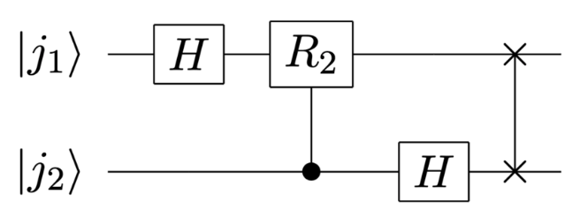
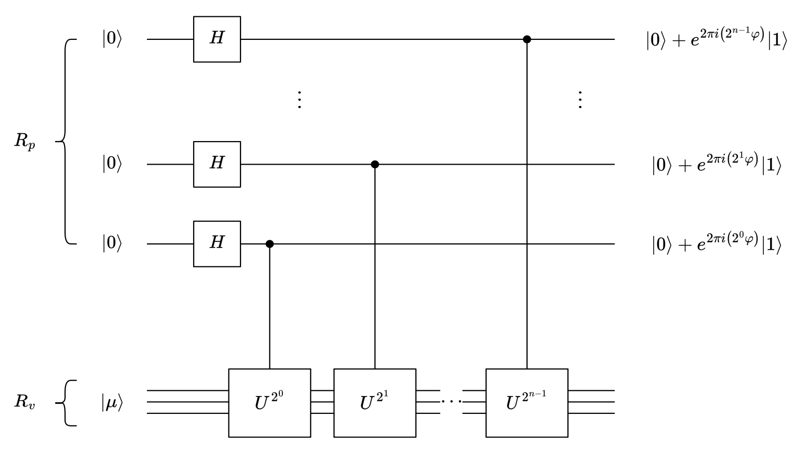
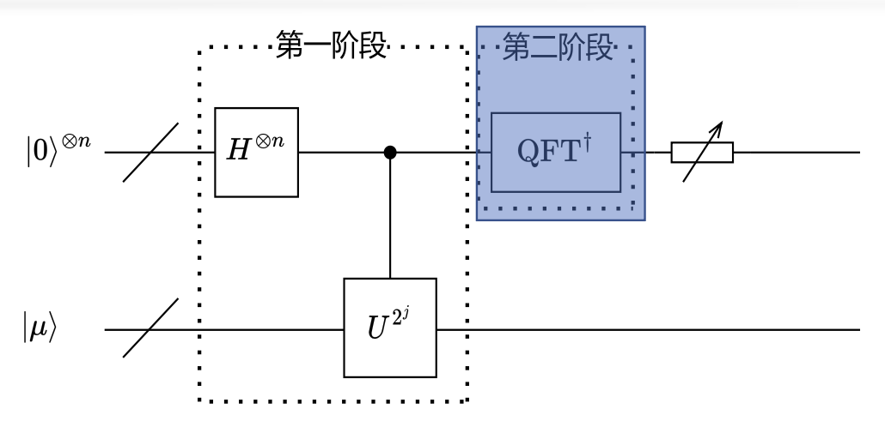
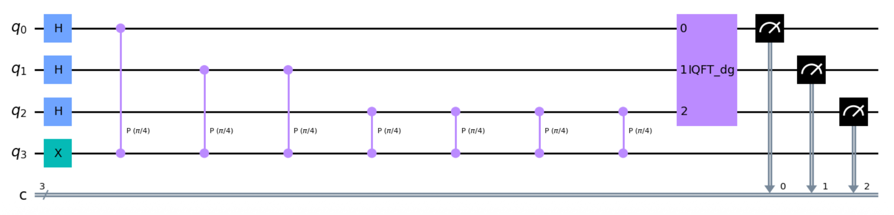
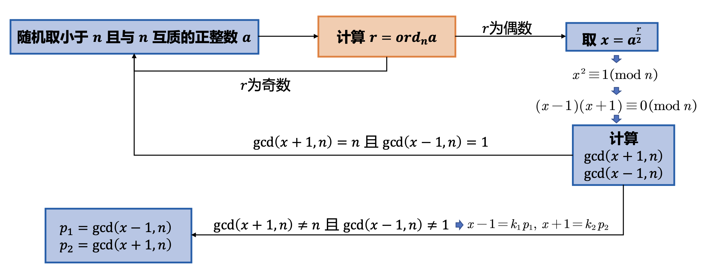
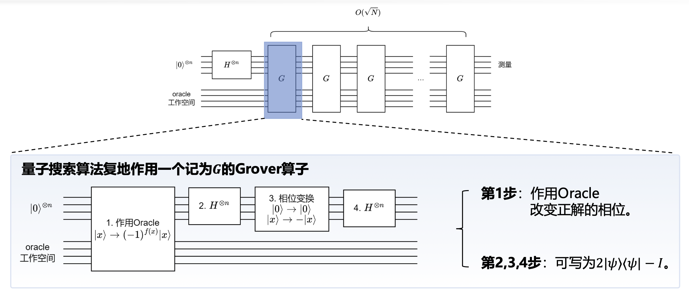
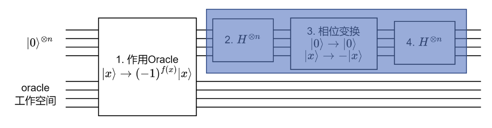
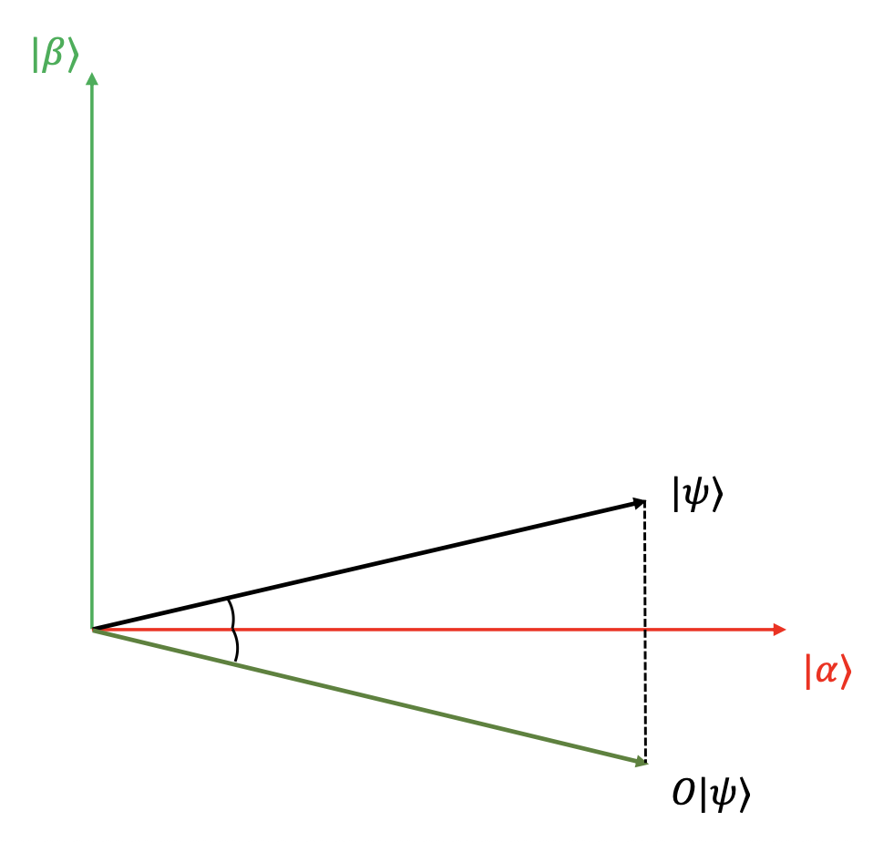
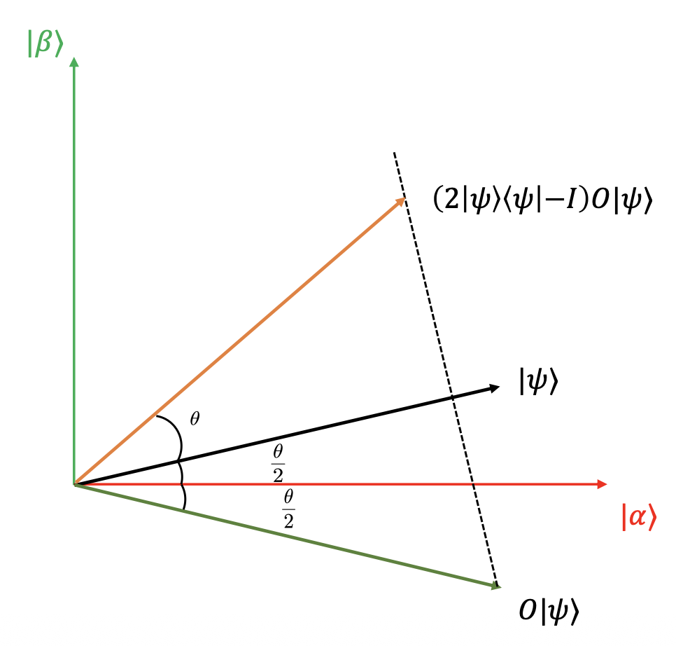

# 量子算法

## 量子傅里叶变换

### 傅里叶变换

- 通过不同的角度可以发现事物不同的特征，信号也是这样
- **傅里叶变换**就是为信号在**时域**表示和**频域**表示之间的转换提供了一个桥梁
    - 当我们使用傅里叶变换来分析一个音频信号时，我们可以将其看作是**时域中的波形**
    - 经过傅里叶变换后，我们可以将这个信号转换为**频域中的频率分量**
    - 每个峰表示了输入信号中的一个频率分量，其高度表示了该**频率在原始信号中的强度**
    
    <div style="text-align: center">
        
    </div>

- 傅里叶变换使得人们能从能量的角度看待信号，同时大大简化了信号处理中所需要的计算量
- 傅里叶变换在现代社会中得到了广泛应用，例如手机中的通信模块无时无刻不在进行傅里叶变换

广泛的应用场景：

- 分解信号频率成分，优化信号传输质量
- 声音特效处理与分析，变换声音特征等
- 处理地震信号，了解地质结构

但实际上，傅里叶变换早在 18 世纪就由让·巴普蒂斯·约瑟夫·傅里叶（Baron Jean Baptiste Joseph Fourier）提出，但其真正得到快速发展和广泛使用却已是在 19 世纪 60 年代 **FFT**（Fast Fourier Transform，**快速傅里叶变换**）算法发明后，期间间隔了近两百年。


### 离散傅里叶变换

**离散傅里叶变换**（**DFT**）是用于将离散信号从时域转换到频域的一种数学工具。它将一系列等间隔采样的信号表示为不同频率成分的组合，用以分析信号的频率特性。DFT 是傅里叶变换在**离散情况**下的对应形式，特别适用于**处理数字信号和有限长度的数据序列**。

- 离散傅里叶变换

    $$
    \{x_j\} \xrightarrow{\text{DFT}} \{y_k\} \\
    y_k = \frac{1}{\sqrt{N}} \sum_{j=0}^{N-1} x_j e^{\frac{2\pi i}{N} \cdot j k}
    $$

- 逆离散傅里叶变换

    $$
    \{y_k\} \xrightarrow{\text{IDFT}} \{x_j\} \\
    x_j = \frac{1}{\sqrt{N}} \sum_{k=0}^{N-1} y_k e^{-\frac{2\pi i}{N} \cdot j k}
    $$


### 量子傅里叶变换

**量子傅里叶变换**（**QFT**）的作用是将量子态从计算基 $\{|j\rangle\}$ 映射至频域基 ۧ$\{|k\rangle\}$ ，其中振幅序列 $\{x_j\}$ 由 DFT 变换为 $\{y_k\}$。
$$
\sum_{k=0}^{N-1} y_k |k\rangle \xleftarrow{\text{QFT}} \sum_{j=0}^{N-1} x_j |j\rangle
$$

QFT 作为量子算符即定义为：
$$
\text{QFT}|j\rangle = \frac{1}{\sqrt{N}} \sum_{k=0}^{N-1} e^{\frac{2\pi i}{N} \cdot j k} |k\rangle
$$

QFT 不仅是 DFT 的量子计算实现，同样是众多量子算法（QPE、Shor）的子模块。

<div style="text-align: center">
    
</div>


#### 张量积形式

为分析基于量子比特的 QFT 算法电路实现，规定以下记法：

- 基态 $|j\rangle$ 表示为 $|j_1j_2\cdots j_n\rangle$，即 $j = 2^{n-1}j_1 + 2^{n-2}j_2 + \cdots + 2^0j_n$
- 用 $0.j_1j_2\cdots j_n$ 表示小数 $2^{-1}j_1 + 2^{-2}j_2 + \cdots + 2^{-n}j_n$

若使用 $n$ 个量子比特执行量子傅里叶变换，则共有 $2^n$ 个基态，$N = 2^n$。
$$
\text{QFT}|j\rangle = \frac{1}{\sqrt{N}} \sum_{k=0}^{N-1} e^{\frac{2\pi i}{N} \cdot j k} |k\rangle
$$

上述 QFT 算符可写作如下的张量积形式：
$$
\text{QFT}|j_1j_2\cdots j_n\rangle = \frac{1}{\sqrt{2^n}} \left( |0\rangle + e^{2\pi i \cdot 0.j_n}|1\rangle \right) \left( |0\rangle + e^{2\pi i \cdot 0.j_{n-1}j_n}|1\rangle \right) \cdots \left( |0\rangle + e^{2\pi i \cdot 0.j_1j_2\cdots j_n}|1\rangle \right)
$$

张量积形式有助于构建 $\text{QFT}$ 的量子电路并证明其酉性。

下面证明 QFT 张量积形式的正确性：

???+ proof "证明"

    1. 将频域基同样展开为二进制表示

        $$
        \begin{aligned}
        \text{QFT}|j\rangle & = \frac{1}{\sqrt{2^n}} \sum_{k=0}^{N-1} e^{\frac{2\pi i}{N} \cdot j k} |k\rangle \\
        & = \frac{1}{\sqrt{2^n}} \sum_{k_1=0}^{1} \cdots \sum_{k_n=0}^{1} e^{\frac{2\pi i}{2^n} \cdot j \sum_{l=1}^n k_l 2^{n-l}} |k_1 \cdots k_n\rangle \\
        & = \frac{1}{\sqrt{2^n}} \sum_{k_1=0}^{1} \cdots \sum_{k_n=0}^{1} e^{2\pi i j \sum_{l=1}^n k_l 2^{-l}} |k_1 \cdots k_n\rangle
        \end{aligned}
        $$

    2. $e$ 的指数中的求和拆解至张量积中

        $$
        \begin{aligned}
        \text{QFT}|j\rangle & = \frac{1}{\sqrt{2^n}} \sum_{k=0}^{N-1} e^{\frac{2\pi i}{N} \cdot j k} |k\rangle \\
        & = \frac{1}{\sqrt{2^n}} \sum_{k_1=0}^{1} \cdots \sum_{k_n=0}^{1} e^{2\pi i j \sum_{l=1}^n k_l 2^{-l}} |k_1 \cdots k_n\rangle \\
        & = \frac{1}{\sqrt{2^n}} \sum_{k_1=0}^{1} \cdots \sum_{k_n=0}^{1} \bigotimes_{l=1}^n e^{2\pi i j k_l 2^{-l}} |k_l\rangle
        \end{aligned}
        $$

    3. 交换求和与张量积的运算顺序

        $$
        \begin{aligned}
        \text{QFT}|j\rangle & = \frac{1}{\sqrt{2^n}} \sum_{k=0}^{N-1} e^{\frac{2\pi i}{N} \cdot j k} |k\rangle \\
        & = \frac{1}{\sqrt{2^n}} \sum_{k_1=0}^{1} \cdots \sum_{k_n=0}^{1} \bigotimes_{l=1}^n e^{2\pi i j k_l 2^{-l}} |k_l\rangle \\
        & = \frac{1}{\sqrt{2^n}} \bigotimes_{l=1}^n \sum_{k_l=0}^{1} e^{2\pi i j k_l 2^{-l}} |k_l\rangle
        \end{aligned}
        $$

    4. 展开 $k_l$ 求和

        $$
        \begin{aligned}
        \text{QFT}|j\rangle & = \frac{1}{\sqrt{2^n}} \sum_{k=0}^{N-1} e^{\frac{2\pi i}{N} \cdot j k} |k\rangle \\
        & = \frac{1}{\sqrt{2^n}} \bigotimes_{l=1}^n \sum_{k_l=0}^{1} e^{2\pi i j k_l 2^{-l}} |k_l\rangle \\
        & = \frac{1}{\sqrt{2^n}} \bigotimes_{l=1}^n \left( |0\rangle + e^{2\pi i j 2^{-l}} |1\rangle \right)
        \end{aligned}
        $$

    5. 根据 $e^{2 \pi i} = 1$，可将 $j2^{-l}$ 的整数部分略去

        $$
        \begin{aligned}
        \text{QFT}|j\rangle & = \frac{1}{\sqrt{2^n}} \sum_{k=0}^{N-1} e^{\frac{2\pi i}{N} \cdot j k} |k\rangle \\
        & = \frac{1}{\sqrt{2^n}} \bigotimes_{l=1}^n \left( |0\rangle + e^{2\pi i j 2^{-l}} |1\rangle \right) \\
        & = \frac{1}{\sqrt{2^n}} \left( |0\rangle + e^{2\pi i 0.j_n} |1\rangle \right) \left( |0\rangle + e^{2\pi i 0.j_{n-1}j_n} |1\rangle \right) \cdots \left( |0\rangle + e^{2\pi i 0.j_1j_2\cdots j_n} |1\rangle \right)
        \end{aligned}
        $$


#### 示例

=== "单比特系统"

    考虑单比特系统下的 QFT 算符

    $$
    \begin{aligned}\mathrm{QFT}_1|j\rangle=\frac{1}{\sqrt{2}}\sum_{k=0}^{1}e^{\frac{2\pi i}{2}\cdot jk}|k\rangle\end{aligned}
    $$

    对于计算基 $|0\rangle, |1\rangle$ 有：

    $$
    \begin{aligned}\mathrm{QFT}_1|0\rangle&=\frac{1}{\sqrt{2}}\left(|0\rangle+|1\rangle\right)\\\mathrm{QFT}_1|1\rangle&=\frac{1}{\sqrt{2}}\left(|0\rangle-|1\rangle\right)\end{aligned}
    $$

    由矩阵形式可知，单比特的 QFT 算符和 H 门等价

    $$
    \mathrm{QFT}_1=\frac{1}{\sqrt{2}}\begin{bmatrix}1&1\\1&-1\end{bmatrix}=H
    $$

    ---
    考虑对单比特态 $|\psi\rangle=\alpha|0\rangle+\beta|1\rangle$ 执行 QFT 过程：
    $$
    y_k=\frac{1}{\sqrt{2}}\sum_{j=0}^1x_je^{\frac{2\pi i}{2}\cdot jk}
    $$

    其中 $x_0 = \alpha, x_1 = \beta$，于是有：

    $$
    y_0=\frac{1}{\sqrt{2}}\left(\alpha+\beta\right) \\
    y_1=\frac{1}{\sqrt{2}}\left(\alpha-\beta\right)
    $$

    同样可知，单比特的 QFT 算符和 H 门等价：
    $$
    \mathrm{QFT}_1|\psi\rangle=\frac{1}{\sqrt{2}}\left(\alpha+\beta\right)|0\rangle+\frac{1}{\sqrt{2}}\left(\alpha-\beta\right)|1\rangle=H|\psi\rangle
    $$

=== "双比特系统"

    考虑双比特系统下的 QFT 算符

    $$
    \mathrm{QFT}_2|j\rangle=\frac{1}{\sqrt{4}}\sum_{k=0}^3e^{\frac{2\pi i}{4}\cdot jk}|k\rangle=\frac{1}{\sqrt{4}}\left(|0\rangle+e^{2\pi i\overline{0.j_2}}|1\rangle\right)\left(|0\rangle+e^{2\pi i\overline{0.j_1j_2}}|1\rangle\right)
    $$

    对于计算基 $|2\rangle = |10\rangle$ 有
    $$
    \mathrm{QFT}_2|10\rangle=\frac{1}{2}\left(|00\rangle-|01\rangle+|10\rangle-|11\rangle\right)=\frac{1}{2}\left(|0\rangle+|1\rangle\right)\left(|0\rangle-|1\rangle\right)
    $$


#### 量子电路

为构建 QFT 的量子电路，定义如下形式的单比特相位旋转门

$$
R_k=\begin{bmatrix}1&0\\0&e^{\frac{2\pi i}{2^k}}\end{bmatrix},\quad k=2,\cdots,n
$$

QFT 可由如下量子电路实现

- QFT电路中仅使用了 Hadamard 门和受控旋转门。电路中所有量子门都是酉的，QFT无疑是**酉变换**

<div style="text-align: center">
    
</div>

下面验证 QFT 的量子电路执行过程：

- 当 $j_1 = 1$ 时， $e^{2\pi i \overline{0.j_1}} = -1$，否则为 $1$。因此，经过一个 $\text{H}$ 门后系统量子态变为 $\frac{1}{\sqrt{2}}\left(|0\rangle + e^{2\pi i \overline{0.j_1}}|1\rangle\right)\Big|\overline{j_2\cdots j_n}\Big\rangle$。
- 当 $j_2 = 1$ 时，执行受控旋转门 $R_2$，将 $|j_1\rangle$ 相位乘以 $e^{2\pi i \overline{0.0.j_2}}$。此时，系统量子态变为 $\frac{1}{\sqrt{2}}\left(|0\rangle + e^{2\pi i \overline{0.j_1j_2}}|1\rangle\right)\Big|\overline{j_2\cdots j_n}\Big\rangle$。
- 以此类推，执行针对第一个量子比特的所有受控旋转门，此时系统量子态变为 $\frac{1}{\sqrt{2}}\left(|0\rangle + e^{2\pi i \overline{0.j_1j_2 \dots j_n}}|1\rangle\right)\Big|\overline{j_2\cdots j_n}\Big\rangle$。
- 同理，执行针对剩余量子比特的所有 H 门和受控旋转门。最终，系统量子态变为

    $$
    \frac{1}{\sqrt{2^n}}\left(|0\rangle+e^{2\pi i\overline{0.j_1j_2\cdots j_n}}|1\rangle\right)\left(|0\rangle+e^{2\pi i\overline{0.j_2\cdots j_n}}|1\rangle\right)\cdotp\cdotp\cdotp\left(|0\rangle+e^{2\pi i\overline{0.j_n}}|1\rangle\right)
    $$

对比 QFT 的张量积形式，发现电路末端的态和张量积形式**顺序相反**，再加**一些 SWAP 门**即可。

复杂度分析：观察量子电路易知，QFT 的量子门复杂度为 $O(n^2)$。


#### 双比特量子电路

由上述分析可知，双比特的 QFT 量子电路如下所示：

<div style="text-align: center">
    
</div>

1. 假设对 $|\psi\rangle = |10\rangle$ 进行 QFT 操作，首先作用 H 门，得到 $H|10\rangle = \frac{1}{\sqrt{2}}(|0\rangle - |1\rangle) \otimes |0\rangle$
2. 然后作用受控 R~2~ 门，此时态不变
3. 最后对 $|j_2\rangle$ 作用 H 门，得到 $\frac{1}{\sqrt{2}}(|0\rangle - |1\rangle) \otimes \frac{1}{\sqrt{2}}(|0\rangle + |1\rangle)$
4. 然后 SWAP 门交换量子态，得到 $\frac{1}{2}(|0\rangle + |1\rangle) \otimes (|0\rangle - |1\rangle)$
5. 最终化简后得到 $\frac{1}{2}|00\rangle - \frac{1}{2}|01\rangle + \frac{1}{2}|10\rangle - \frac{1}{2}|11\rangle$


## 量子相位估计

**量子相位估计**（**QPE**）用于估计给定量子态的相位信息。它是许多量子算法的核心组成部分，在量子模拟、量子化学和量子机器学习中具有广泛应用。

基本目标：对于一个酉算符 $U$，已知其本征态 $|\mu\rangle$，对应本征值为 $e^{2\pi i \varphi}$，估计相位 $\varphi$ 的值，其中 $\varphi \in [0, 1)$。

算法流程：

- **初始化**：准备两个量子寄存器，一个存储相位估计结果，另一个存储本征态 $|u\rangle$
- **作用 H 门**：对用于存储相位的量子比特施加 H 门
- **作用受控 U 门**：对每个量子比特执行受控 U 门操作（第 j 个量子比特执行受控 $U^{2^{j-1}}$ 门）
- **逆 QFT**：对相位寄存器进行逆 QFT 操作，将相位信息转为位信息
- **测量**：获得相位估计值


### QPE 量子电路

<div style="text-align: center">
    
</div>

- **寄存器 1** 用来存储最终的特征值
- **寄存器 2** 用来存储输入的特征向量
- 而**酉算子 U** 通过受控 U 门输入到量子电路中

#### 第一阶段

作用 H 门与受控 U 门：

<div style="text-align: center">
    
</div>

作用 H 门：

<div style="text-align: center">
    
</div>

作用受控 U 门：

<div style="text-align: center">
    
</div>

在 $\text{R}_p$ 中，**从下往上**设置量子态为 $|j_1\rangle, |j_2\rangle, \ldots, |j_n\rangle$，则有

$$
|j_i\rangle|\mu\rangle \xrightarrow{CU^{2^i}} |j_i\rangle U^{2^i}|j_i\rangle|\mu\rangle
$$

因为 $U|\mu\rangle = e^{2\pi i \varphi}|\mu\rangle$，则有

$$
|j_i\rangle U^{2^i}|j_i\rangle|\mu\rangle = \frac{1}{\sqrt{2}}(|0\rangle + e^{2\pi i 2^{i-1}\varphi}|1\rangle)|\mu\rangle
$$


#### 第二阶段

<div style="text-align: center">
    
</div>

- $\varphi=\overline{0.\varphi_1\varphi_2\cdots\varphi_n}$
- QFT 张量积形式：
  $$
  \frac{1}{\sqrt{2^n}} \left( |0\rangle + e^{2\pi i 0.\overline{\varphi_n}} |1\rangle \right) \left( |0\rangle + e^{2\pi i 0.\overline{\varphi_{n-1}\varphi_n}} |1\rangle \right) \cdots \left( |0\rangle + e^{2\pi i 0.\overline{\varphi_1\varphi_2\cdots \varphi_n}} |1\rangle \right)
  $$

- 作用逆 QFT 电路，即可得到 $\varphi$


#### 结果

<div style="text-align: center">
    
</div>

$$
U_{QPE}|j\rangle|\mu\rangle=|\widetilde{\varphi}\rangle|\mu\rangle
$$

演化过程：

$$
\begin{aligned}
|0\rangle^{\otimes n}|\mu\rangle & \xrightarrow{H^{\otimes n}} \frac{1}{\sqrt{2^n}}(|0\rangle + |1\rangle)^{\otimes n}|\mu\rangle \\
& \xrightarrow{CU\dots} \bigotimes_{k=0}^{n-1} \left( |0\rangle + e^{2\pi i 2^{n-1-k}\varphi} |1\rangle \right) \\
& \xrightarrow{QFT^\dagger} |\tilde{\varphi}\rangle|\mu\rangle
\end{aligned}
$$


### QPE 过程举例

=== "例1：精确解"

    问题：考虑相位旋转门 $P(\varphi) = \begin{bmatrix} 1 & 0 \\ 0 & e^{i\varphi} \end{bmatrix}$，其本征态之一为 $|1\rangle$。取 $\varphi = \frac{\pi}{4}$，即 $P\left(\frac{\pi}{4}\right) = \begin{bmatrix} 1 & 0 \\ 0 & e^{i\frac{\pi}{4}} \end{bmatrix}$，求其对应本征值的相位。

    ---
    - $q_0, q_1, q_2$ 作为第一个寄存器估计相位，均初始化为 $|0\rangle$
    - $q_3$ 作为第二个寄存器初始化为本征态 $|1\rangle$
    - 运行 QPE 电路，输出相位的三比特估计值为 $\varphi = (0.001)_2 = \frac{1}{8}$
    - 验证与 $|1\rangle$ 态本征值理论值相符：$e^{2\pi i \varphi} = e^{2\pi i \frac{1}{8}} = e^{i \frac{\pi}{4}} = e^{i\phi}$

    <div style="text-align: center">
        
    </div>

    对于旋转相位门 $P(\phi) = \begin{pmatrix} 1 & 0 \\ 0 & e^{i\phi} \end{pmatrix}$

    - 若 $\phi = \frac{\pi}{4}$，电路可精确估计出相位 $\varphi$
    - 若 $\phi = \frac{2\pi}{3}$，$P\left(\frac{2\pi}{3}\right)|1\rangle=e^{i\frac{2\pi}{3}}|1\rangle=e^{2\pi i\varphi}, (011)_2 = \dfrac{3}{8}$，相比更接近

    ???+ warning "注意"

        { align=right width=20% }

        - $\varphi = \dfrac{1}{3}$ 不能由二进制精确表示
        - 共计运行电路 1000 次，测量得到某个值的概率可用于衡量与真实值的接近程度
        - QPE 精度取决于 qubit 数目：n 个 qubit 可以估计相位到 $\dfrac{1}{2^n}$ 的精度

=== "例2：使用特征向量"

???+ tip "提示"

    - 将酉矩阵 U 谱分解：$U = \sum_{j=1}^n \lambda_j |\mu_j\rangle\langle\mu_j|$
    - 任意向量 $|b\rangle = \sum_{j=1}^n \beta_j |\mu_j\rangle$
    - 执行 QPE 得到 $\sum_{j=1}^n \beta_j |\varphi_j\rangle|\mu_j\rangle$

{ align=right width=30% }

$$
\begin{gathered}U=P\left(\frac{\pi}{4}\right)=\begin{bmatrix}1&0\\0&e^{\frac{i\pi}{4}}\end{bmatrix}\\\lambda_1=1,\quad\lambda_2=e^{\frac{i\pi}{4}}\\|\mu_1\rangle=\begin{bmatrix}1\\0\end{bmatrix},\quad|\mu_2\rangle=\begin{bmatrix}0\\1\end{bmatrix}\\|b\rangle=\frac{1}{5}\left[\begin{array}{c}3\\4\end{array}\right]=\frac{3}{5}|\mu_1\rangle+\frac{4}{5}|\mu_2\rangle\end{gathered}
$$

QPE 电路测得相位 $0$ 和 $\frac{1}{8}$ 的概率各为 $\frac{9}{25}$ 和 $\frac{16}{25}$。


## Shor 算法

### 背景

#### 对称加密

<div style="text-align: center">
    
</div>


#### 非对称加密

非对称加密解决了对称加密密钥分发的问题：

- 非对称加密是单向的，一个人使用一组密钥和公钥
- 密钥由 Bob 自己“制造”并使用，公钥可告诉所有人，所有信息发送方都可使用公钥加密

???+ note "前置知识"

    - 同余
        - $a \equiv b \pmod n$：$a$ 和 $b$ 除以 $n$ 的余数相同
        - $ab \equiv 1 \pmod n$：$b$ 是 $a$ 模 $n$ 下的逆元

    - 阶：$a^r \equiv 1 \pmod n$
        - $a$ 模 $n$ 的阶：令上式成立的最小正整数 $r$，记作 $\text{ord}_n a$

    - 欧拉函数 $\varphi(n)$ 是与 $n$ 互质的小于 $n$ 的整数个数，互质即最大公约数为 1
        - 若 $p$ 是质数，显然有 $\varphi(p) = p-1$
        - 欧拉函数是积性函数：若 $\text{gcd}(a, b) = 1$ ($a, b$ 互质)，则 $\varphi(ab) = \varphi(a)\varphi(b)$
        - 若 $\text{gcd}(a, n) = 1$，则 $a^{\varphi(n)} \equiv 1 \pmod n$

<div style="text-align: center">
    
</div>

制造公钥（$n, e$）和密钥（$n, d$）：

- 获得两个大质数 $p_1$ 和 $p_2$
- 令 $n = p_1p_2$，则 $\varphi(n) = \varphi(p_1p_2) = (p_1-1)(p_2-1)$
- 取与 $\varphi(n)$ 互质的正整数 $e$，满足 $\text{gcd}(e, \varphi(n)) = 1, e \neq p_1, p_2$
- 求 $e$ 模 $\varphi(n)$ 的逆元 $d$，满足 $ed \equiv 1 \pmod{\varphi(n)}$

??? example "例子"

    <div style="text-align: center">
        
    </div>

如何破解 RSA？

1. 已知公钥 $n, e$
2. 分解 $n = p_1 p_2$
3. 计算 $\varphi(n)$
4. 计算私钥 $d$

???+ info "试除法（传统）"

    ```py
    for i in 2, 3, 4, ..., sqrt(n)
        while 𝑛 equiv 0 mod i
            n := n / i
            add i to ans
    if n > 1
        add n to ans

    return ans
    ```

    - 尝试用小于 n 的**所有可能因数**去除目标数，直到找到质因数为止。
    - 试除法是传统的分解质因数方法，时间复杂度 $O(\sqrt{n})$
    - 试除法非常低效，当前常用的 RSA 密钥长度即便使用最快的计算机进行试除法，也会**耗费极其长的时间**


### Shor 算法

<div style="text-align: center">
    
</div>

只有“**计算阶**”这一步使用量子计算，其余为经典计算。

如何使用 Shor 算法求阶？

- 定义酉变换
    - $U|y\rangle=|ay(\mathrm{mod~}n)\rangle$
    - $U^2|y\rangle=U|ay\left(\mathrm{mod~}n\right)\rangle=|a^2y(\mathrm{mod~}n)\rangle$
    - $U^t|y\rangle=|a^ty(\mathrm{mod~}n)\rangle$

- 定义量子态 $|u_s\rangle$

    $$
    |u_s\rangle = \frac{1}{\sqrt{r}} \sum_{k=0}^{r-1} e^{-\frac{2\pi isk}{r}} |a^k \pmod N\rangle
    $$

    - 性质1：$U|u_s\rangle = e^{\frac{2\pi is}{r}} |u_s\rangle$
    - 性质2：$\frac{1}{\sqrt{r}} \sum_{s=0}^{r-1} |u_s\rangle = |1\rangle$

    ??? info "说明"

        - $|u_s\rangle$ 是 $U$ 的特征向量
        - $|1\rangle$ 是 $|u_s\rangle_{s=0}^{r-1} $ 等概率的叠加态，所以根据性质 2 我们可以规避制备 $|u_s\rangle$

    ??? proof "证明"

        === "性质1"

            $$
            U|u_s\rangle = \frac{1}{\sqrt{r}} \sum_{k=0}^{r-1} e^{-\frac{2\pi isk}{r}} |a^{k+1} \pmod N\rangle = e^{2\pi is} |u_s\rangle
            $$

        === "性质2"

            $$
            \begin{aligned}
            & \frac{1}{\sqrt{r}} \sum_{s=0}^{r-1} |u_s\rangle = |1\rangle \iff \frac{1}{\sqrt{r}} \sum_{s=0}^{r-1} e^{\frac{2\pi isk}{r}} |u_s\rangle = |a^k \pmod N\rangle \\
            & \frac{1}{\sqrt{r}} \sum_{s=0}^{r-1} e^{\frac{2\pi isk}{r}} |u_s\rangle = \frac{1}{\sqrt{r}} \sum_{s,l=0}^{r-1} e^{\frac{2\pi isk}{r}} |a^l \pmod N\rangle
            \end{aligned}
            $$

            此时设

            $$
            \sum_{s=0}^{r-1} e^{\frac{2\pi is(k-l)}{r}} = \begin{cases} r & \text{if } k=l \\ \frac{1-e^{\frac{2\pi i(k-l)}{r}}}{1-e^{\frac{2\pi i(k-l)}{r}}} = 0 & \text{if } k\neq l \end{cases}
            $$

            即有
            $$
            \frac{1}{\sqrt{r}} \sum_{s=0}^{r-1} e^{\frac{2\pi isk}{r}} |u_s\rangle = \frac{1}{r} \sum_{s,l=0}^{r-1} e^{\frac{2\pi isk}{r}} |a^l \pmod N\rangle = \frac{1}{r} \sum_{l=0}^{r-1} r\delta_{k,l}|a^l \pmod N\rangle = |a^k \pmod N\rangle
            $$


### 量子电路

<div style="text-align: center">
    
</div>

量子电路说明：

$$
U|u_s\rangle = e^{\frac{2\pi is}{r}} |u_s\rangle \\
\frac{1}{\sqrt{r}} \sum_{s=0}^{r-1} |u_s\rangle = |1\rangle
$$

对 $U$ 和 $|1\rangle$ 进行 QPE，可等概率测量得到相位 $\left\{ 0, \frac{1}{r}, \frac{2}{r}, \ldots, \frac{r-1}{r} \right\}$


??? example "例子"

    <div style="text-align: center">
        
    </div>


### U 算子的一种构造方法

$U$ 算子的初步构造方法十分简单：

1. 将变换前所有可能的 $x$ **进行穷举**（从 $0$ 到 $N-1$ 共有 $N$ 个数），并一一算出对应的 $f(x) = a^x \bmod N$

2. 对每一个 $x$，我们都可以写出变换前的态 $|x\rangle$ 和变换后的态 $|f(x)\rangle$ 的矩阵表示，将它们进行外乘即可得到每一个 $x$ 对应的变换矩阵，然后将所有矩阵求和即得到算子 $U$ 的矩阵表示，即

$$
U = \sum_{x=0}^{N-1} |f(x)\rangle\langle x|
$$


## Grover 算法

???+ info "引入：简单搜索问题举例（寻找因子）"

    寻找 24 的因子？

    <div align=center>
    **1**,**2**,**3**,**4**,5,**6**,7,**8**,9,10,11,**12**,13,14,15,16,17,18,19,20,21,22,23,**24**
    </div>

    通过遍历 1 至 24 所有整数，**逐个检验**。

    ---
    **Grover 算法**可以将 $O(N)$ 的经典算法，加速至 $O(\sqrt{N})$。

Grover算法的**几何**解释：

{ align=right width=30% }

- $|\alpha\rangle$ 是**所有错解**的叠加态
- $|\beta\rangle$ 是**所有正解**的叠加态

??? example "例子"

    寻找 24 的因子

    - $|\alpha\rangle$ 处于 5, 7, 9, 10, 13... 的叠加态
    - $|\beta\rangle$ 处于 1, 2, 3, 4, 6... 的叠加态

Grover 算法通过旋转初始量子态，使其逐渐接近 $|\beta\rangle$。


### Oracle

- **Oracle** 是一个黑盒，它不能给出问题的可行解，但**能检验某个解是不是正确的**
- 几何上的旋转主要通过 Oracle 电路实现
- 不同问题的 Oracle 电路不同，比如检验是否为 $x$ 因子的电路、检验 $x$ 是否小于一个常数 $C$ 的电路，学习 Grover 算法不必纠结 Oracle 电路实现

??? example "例子"

    $$
    |x\rangle \xrightarrow{\text{Oracle}} (-1)^{f(x)} |x\rangle
    $$

    $x$ 为正解时 $f(x) = 1$，否则 $f(x) = 0$。


### 量子电路

<div style="text-align: center">
    
</div>

算法始于状态 $|0\rangle^{\otimes n}$，用 $H^{\otimes n}$ 使寄存器处于均匀叠加态：

$$
|\psi\rangle = \frac{1}{\sqrt{N}} \sum_{x=0}^{N-1} |x\rangle
$$

<div style="text-align: center">
    
</div>

简单证明第2, 3, 4步：可写为 $2|\psi\rangle\langle\psi| - I$

<div style="text-align: center">
    
</div>

第 3 步的酉矩阵表示为 

$$
2|\psi\rangle\langle\psi| - I \left\{
\begin{aligned}
(2|0\rangle\langle 0|-I)|0\rangle &= 2|0\rangle - |0\rangle = |0\rangle \\
(2|0\rangle\langle 0|-I)|x\rangle &= 0 - |x\rangle = -|x\rangle
\end{aligned}
\right.
$$

于是 $H^{\otimes n} (2|0\rangle\langle 0| - I) H^{\otimes n} = 2|\psi\rangle\langle\psi| - I$。


### G 迭代的几何意义

{ align=right width=30% }

初始状态：$|\psi\rangle = \sqrt{\frac{N-M}{N}} |\alpha\rangle + \sqrt{\frac{M}{N}} |\beta\rangle$

- 待检验的解个数：$N$
- 可行解个数：$N$

<br/>
<br/>

---
{ align=right width=30% }

第 1 步：作用 Oracle（算子 $O$），改变正解相位

- $O$ 就是以 $|\alpha\rangle$ 为对称轴做对称操作
- 令 $a = \sqrt{\frac{N-M}{N}}, b = \sqrt{\frac{M}{N}}$，即有：

    $$
    O(a|\alpha\rangle + b|\beta\rangle) = a|\alpha\rangle - b|\beta\rangle
    $$

- 在 $|\alpha\rangle$ 上的投影不变，在 $|\beta\rangle$ 上的投影翻转

---
{ align=right width=30% }

第 2, 3, 4 步：作用 $2|\psi\rangle\langle\psi| - I$

- 任意量子态（单位向量）$|v\rangle = p|\psi\rangle + q|\psi\rangle_{\perp}$
- 其中 $|\psi\rangle_\perp$ 表示与 $|\psi\rangle$ 垂直的分量

    $$
    (2|\psi\rangle\langle\psi| - I)|v\rangle = p|\psi\rangle - q|\psi\rangle_{\perp}
    $$

- $2|\psi\rangle\langle\psi| - I$ 就是以 $|\psi\rangle$ 为对称轴做对称操作

---
{ align=right width=30% }

总结：

- 初始状态为 $|\psi\rangle = \sqrt{\frac{N-M}{N}} |\alpha\rangle + \sqrt{\frac{M}{N}} |\beta\rangle$
- $G$ 算子几何意义：先将量子态相对 $|\alpha\rangle$ 做对称，再将量子态相对 $|\psi\rangle$ 做对称
- 使用 $G$ 算子后，量子态向正确解的叠加态旋转
- 可以证明，作用一次 $G$ 算子，可将量子态向 $|\beta \rangle$ 旋转角度 $\theta$，即 $G^k |\psi\rangle = \cos\left(\frac{2k+1}{2}\theta\right) |\alpha\rangle + \sin\left(\frac{2k+1}{2}\theta\right) |\beta\rangle$
    - $|\psi\rangle=\sqrt{\frac{N-M}{N}}|\alpha\rangle+\sqrt{\frac{M}{N}}|\beta\rangle$
    - $\theta=2\arccos\sqrt{\frac{N-M}{N}}$
    - $\sin\theta=\frac{2\sqrt{M(N-M)}}{N}$


### 复杂度分析

<div style="text-align: center">
    
</div>
