# 量子纠错

## 基本概念

???+ question "为什么需要量子纠错？"

    量子比特本身极易受到噪声的影响，包括退相干、门错误、测量错误、串扰等，这些因素导致量子比特的物理错误率远高于发挥量子优势所需要的错误率。

    

        
    

    因此**量子纠错**(quantum error correction)对于降低错误率、实现大规模量子计算尤为重要。

???+ info "经典纠错回顾"

    - 在经典计算中，信道编码通过添加**冗余位**来增强数据在噪声信道中传输的可靠性
    - 经典的**重复码**就是一个例子，核心思想：将每个原始的二进制位进行多次重复。例如，如果原始信息是 0 或 1，我们可以将每个比特重复三次或更多次来形成一个编码块

        

            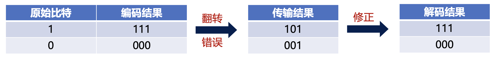
        

        - 重复码通过冗余编码提高了抗噪性能；若信道中发生错误，解码器能以高概率判断出正确的原始比特

    量子纠错码同样也利用了冗余编码的思想。

### 量子系统的特殊难点

在 1995 年前，一般认为经典的纠错不能直接应用到量子系统中，原因如下：

- **测量破坏问题**：量子态是无法克隆的，且一旦测量，叠加态会坍缩为经典的结果，这意味着经典容错中的“直接检测”策略失效，无法通过观测量子态来执行纠错
- **误差类型不同**：经典错误通常是 0 和 1 之间的的离散跳变，而量子比特的错误可以表现为 Bloch（布洛赫）球上的连续扰动，即任意角度的旋转

    

### 常见量子错误类型与解决方式

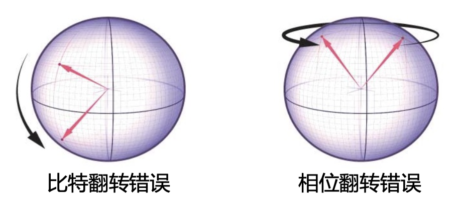{ align=right width=30% }

- **X 错误**（**比特翻转**），作用：$|0\rangle \leftrightarrow |1\rangle$
- **Z 错误**（**相位翻转**），作用：$|0\rangle \rightarrow |0\rangle, |1\rangle \rightarrow -|1\rangle$
- **Y 错误**（X 与 Z 的复合），作用：$Y = IXZ$

把连续误差约化为离散错误的核心机制：

- 量子误差算符的线性展开：任意单比特误差算符都可以用 **Pauli 基底 ${I, X, Y, Z}$** 来展开
- 错误叠加到错误混合（错误投影）：我们不直接测量数据比特，而是将辅助比特与数据比特叠加，通过测量辅助比特将原本的叠加误差**坍缩成一个离散的 Pauli 错误**，同时不破坏数据比特的信息

通过将数据比特与辅助比特纠缠，并测量辅助比特，即可避开量子系统的特殊难点。

### 错误产生的物理表示

与环境的交互会改变 qubit 并使其与环境进行纠缠，我们可以假设下面的过程：

$$
\begin{aligned}&|e_0\rangle|0\rangle\to|e_1\rangle|0\rangle+|e_2\rangle|1\rangle\\&|e_0\rangle|1\rangle\to|e_3\rangle|0\rangle+|e_4\rangle|1\rangle\end{aligned}
$$

其中 $|e_{0-4}\rangle$ 是环境的状态。

对于真实的量子计算，我们可以假设 qubit 和环境之间存在弱耦合，因此我们期望：

$$
\begin{gathered}\sqrt{\left|\langle e_0\mid e_1\rangle\right|^2}\approx\sqrt{\left|\langle e_0\mid e_4\rangle\right|^2}\approx1\\\langle e_2\mid e_2\rangle,\langle e_3\mid e_3\rangle\ll1\end{gathered}
$$

即尽量与原状态接近。

为了更好的讨论和环境之间的交互，我们可以写下投影算符：

$$
\begin{aligned}P_0|\psi\rangle&=|0\rangle\langle0|\psi\rangle&\longrightarrow\quad&P_0&=\frac{I+Z}{2}\\P_1|\psi\rangle&=|1\rangle\langle1|\psi\rangle&\longrightarrow\quad&P_1&=\frac{I-Z}{2}\end{aligned}
$$

因此，我们现在可以这么写：
$$
|e_0\rangle|\psi\rangle\to[|e_1)I+|e_2\rangle X\rangle]P_0|\psi\rangle+[|e_3\rangle X+|e_4\rangle I]P_1|\psi\rangle
$$

其中 $|e\rangle O|\psi\rangle\equiv|e\rangle\otimes O|\psi\rangle$。

将其代入后进行进一步的化简，可以得到如下式子：

$$
|e_{0}\rangle|\psi\rangle \to \left[\frac{|e_{1}\rangle+|e_{4}\rangle}{2}I + \frac{|e_{1}\rangle-|e_{4}\rangle}{2}Z \right. \\
\left. + \frac{|e_{3}\rangle+|e_{2}\rangle}{2}X + \frac{|e_{3}\rangle-|e_{2}\rangle}{2}Y\right]|\psi\rangle \\
\equiv (|d\rangle I + |a\rangle X + |b\rangle Y + |c\rangle Z)|\psi\rangle
$$

其中，$X, Y, Z$ 分别对应三种 Pauli 错误。通过观察发现，$|a\rangle, |b\rangle, |c\rangle$ 三个对应不同种的错误，并且都是小振幅(amplitude)
$$
|d\rangle=\frac{|e_1\rangle+|e_4\rangle}{2}\approx|e_0\rangle
$$

和弱耦合的假设对应。因此对于一个 n-qubit 的量子编码方式（单比特错误），一种通用的写法可以是这样：

$$
|e_0\rangle|\Psi_n\rangle\to|d\rangle|\Psi_n\rangle+\sum_{i=1}^n(|a_i\rangle X_i|\Psi_n\rangle+|b_i\rangle Y_i|\Psi_n\rangle+|c_i\rangle Z_i|\Psi_n\rangle)
$$

## 基础量子纠错码

### 比特翻转码

准备过程：我们用如图的量子电路编码 3 个数据比特，通过两个 CNOT 门使其处于纠缠态，即：

    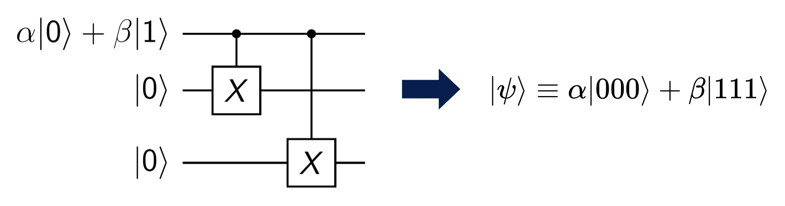

如果有一个数据比特发生翻转错误：

$$
\begin{align*}
|\psi_1\rangle &= X_1|\psi\rangle = \alpha|100\rangle + \beta|011\rangle \\
|\psi_2\rangle &= X_2|\psi\rangle = \alpha|010\rangle + \beta|101\rangle \\
|\psi_3\rangle &= X_3|\psi\rangle = \alpha|001\rangle + \beta|110\rangle
\end{align*}
$$

比特翻转情况的概率：

| 类型 | 量子态 | 发生概率 |
| :--- | :--- | :--- |
| 没有错误 | $\alpha\|000\rangle + \beta\|111\rangle$ | $(1-\varepsilon)^3$ |
| 翻转一个数据比特 | $\alpha\|010\rangle + \beta\|101\rangle$   $\alpha\|001\rangle + \beta\|110\rangle$   $\alpha\|100\rangle + \beta\|011\rangle$ | $\varepsilon(1-\varepsilon)^2$ |
| 翻转两个数据比特 | $\alpha\|011\rangle + \beta\|100\rangle$   $\alpha\|110\rangle + \beta\|001\rangle$   $\alpha\|101\rangle + \beta\|010\rangle$ | $\varepsilon^2(1-\varepsilon)$ |
| 翻转三个数据比特 | $\alpha\|111\rangle + \beta\|000\rangle$ | $\varepsilon^3$ |

- 其中 $\varepsilon$ 为发生比特翻转的概率
- 在 $\varepsilon$ 值很小的时候，翻转两个和三个数据比特的概率较低，因此后续的分析中我们只考虑翻转一个的情况

正如我们前面所说，为了不破坏数据比特的信息，我们利用 CNOT 门将其与辅助比特纠缠，通过测量辅助比特，来判断数据比特位上有没有发生错误：

    

=== "情况 1：无错误"

    

        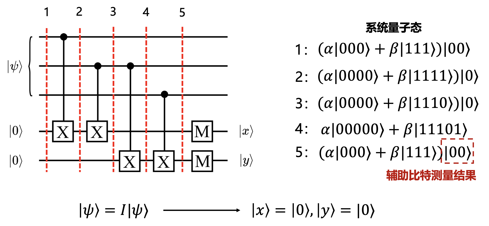
    

=== "情况 2：数据比特 1 发生 X 错误"

    

        
    

=== "情况 3：数据比特 2 发生 X 错误"

    

        
    

=== "情况 4：数据比特 3 发生 X 错误"

    

        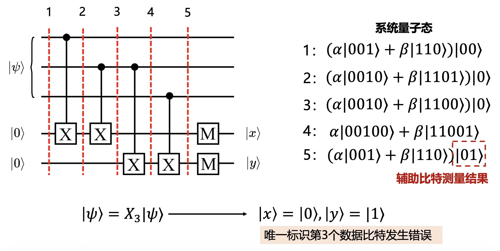
    

---
紧接着，我们施加下面的错误纠正电路（根据前面 $|x\rangle, |y\rangle$ 取值的各种 case 设置电路，用到 CNOT 门和 Toffoli 门），可以直接完成对3个数据比特的纠错工作，不需要揭露任何有关 $\alpha$ 和 $\beta$ 的信息，从而保护了系统量子态。

    

??? info "相关研究"

    UCSB 研究团队通过实验验证：利用比特翻转码可以减少量子态受环境干扰所导致的比特翻转错误

    - 使用 5 比特：错误率减小 2.7 倍
    - 使用 9 比特：错误率减小 8.5 倍

    

        
    

### 相位翻转码

要实现相位翻转码非常简单，我们看一下相位错误的表现形式：
$$
|0\rangle \to |0\rangle \quad |1\rangle \to -|1\rangle \quad \alpha|0\rangle + \beta|1\rangle \to \alpha|0\rangle - \beta|1\rangle
$$

如果我们换一个基底来看，相位翻转就变成了比特翻转的形式：

$$
|+\rangle = \frac{1}{\sqrt{2}}(|0\rangle + |1\rangle) \qquad 
\begin{array}{c}
|-\rangle \to |+\rangle \\
|+\rangle \to |-\rangle
\end{array}
$$

因此，我们只需要**在比特翻转码的编码电路上加上一层 H 门**即可：
$$
\alpha|000\rangle + \beta|111\rangle \to \alpha|+++\rangle + \beta|---\rangle
$$

此时，我们即可复用比特翻转码的错误检测和纠正电路，来实现相位翻转码。

### Shor 码

研究动机：如果同时发生比特翻转和相位翻转错误了怎么办？上述两种编码方案只能解决其中一种错误，无法同时纠正 X 和 Z 错误。

核心思想：3-qubit 的比特翻转码与相位翻转码的组合

$$
\begin{align*}
|0\rangle \to |0_L\rangle &\equiv \frac{(|000\rangle + |111\rangle)(|000\rangle + |111\rangle)(|000\rangle + |111\rangle)}{2\sqrt{2}} \\
|1\rangle \to |1_L\rangle &\equiv \frac{(|000\rangle - |111\rangle)(|000\rangle - |111\rangle)(|000\rangle - |111\rangle)}{2\sqrt{2}}
\end{align*}
$$

推导：$|+++\rangle \equiv \frac{(|0\rangle + |1\rangle)(|0\rangle + |1\rangle)(|0\rangle + |1\rangle)}{2\sqrt{2}}$（相位翻转码）将其中的 $|0\rangle$ 和 $|1\rangle$ 分别替换成 $|000\rangle$ 和 $|111\rangle$ 即可得到 Shor 码的编码形式。

编码线路：通过级联的方式，将比特翻转码与相位翻转码结合起来，从而保留两种码的纠错能力。

    

- 将 9 个物理 qubit 分为 3 个块，每个块内部含有 3 个 qubits
- 每个块为内层编码，负责纠正**比特翻转**错误
- 3个块合在一起为外层编码，负责纠正**相位翻转**错误

通过这样的嵌套，九个物理比特被编码为一个能够同时容忍比特和相位翻转错误的逻辑比特！

## 稳定子框架与主流量子纠错码

### 稳定子码

在上一章我们看到，Shor 码可以纠正任意单比特错误，但它仍然存在很多问题：

- Shor 码的构造方式很“手工”，不是系统化的
- 为了实现容错计算，我们需要规模更大、更复杂、更高效的量子纠错码

因此，**稳定子码**应运而生，它提供了统一、简洁、可扩展的数学框架

- 核心思想：把码空间定义为一组**对易 Pauli 算符**（稳定子）的公共 +1 本征态集合
    - 对易：两个操作的顺序不影响最终结果，即满足 $AB = BA$（$A, B$ 为算符）
- 这意味着：一个逻辑态就是所有稳定子测量结果都等于 +1 的态
- 当错误发生时，会导致某些稳定子的测量结果从 +1 翻到 −1，这个测量结果就叫做**症状**(syndrome)
- 通过分析症状就可以判断出哪些数据比特上发生了错误
- **稳定子群**(stabilizer group)：在 n 比特系统上，考虑所有 Pauli 算符（I、X、Y、Z 的张量积），其中选出一组互相对易的生成元，它们生成的群称为稳定子群 $S$
- **码空间**(code space)：所有被稳定子群固定（即测量结果均为 +1）的态，我们用符号 $C$ 表示：

    $$
    \mathcal{C} = \{|\psi\rangle : g|\psi\rangle = |\psi\rangle, \forall g \in S\}
    $$

- **错误检测**(error detection)
    - 若某个 Pauli 错误 $E$ 与某些稳定子反对易（即 $Eg = -gE$），那么作用在码态上会导致测量结果翻转（+1 -> -1），从而形成我们观测到的症状
    - 如果错误 $E$ 与所有稳定子对易，那就检测不到

???+ example "例子"

    考虑两个 qubits 构成的一个 EPR 对：
    $$
    |\psi\rangle = \frac{|00\rangle + |11\rangle}{\sqrt{2}}
    $$

    对于上述的 EPR 对，我们可以发现：
    $$
    X_1X_2|\psi\rangle = |\psi\rangle \quad Z_1Z_2|\psi\rangle = |\psi\rangle
    $$

    此时，我们称 $|\psi\rangle$ 被 $X_1X_2$ 和 $Z_1Z_2$ 所稳定。

    而且，态 $|\psi\rangle$ 是**唯一**一个能被操作符 $X_1X_2$ 和 $Z_1Z_2$ 所稳定的，证明也较为简单：

    - 我们考虑一个通用的 2-qubit 量子态 $a|00\rangle + b|01\rangle + c|10\rangle + d|11\rangle$
    - 要被操作符 $X_1X_2$ 稳定，需要有：$a = d, b = c$
    - 要被操作符 $Z_1Z_2$ 稳定，需要有：$b = c = 0$
    - 代入即可得到：$|\psi\rangle = (|00\rangle + |11\rangle)/\sqrt{2}$

### 表面码

**表面码**(surface code)是当前研究最多、实际应用最为广泛的量子纠错码，它是稳定子码的二维实现，即将物理量子比特排列在一个二维的方格网络上。

表面码的特点与优势：

- 稳定子算符都是局部的，只作用在相邻的 4 个数据比特上
- 天然适合当前主流的超导量子系统，它们本身也是二维耦合布局

    

我们通常用 3 个参数来描述表面码（其他稳定子码也适用），即 [n, k, d]：

- n：一个逻辑比特中数据比特的数量
- k：逻辑比特的数量
- d：所形成的逻辑比特的码距，用来衡量纠错能力，最多能纠正 $\lfloor \dfrac{d-1}{2} \rfloor$ 个错误（向下取整）

编码率 = k / (number of physical qubits)，用来衡量物理比特资源的消耗度。

???+ example "例子"

    

        
    

表面码具有两类**稳定子**，当数据比特发生错误时，会引起其相邻辅助比特的翻转，此时执行稳定子测量操作，我们就能检测出数据比特上的错误：

- **X 稳定子**：负责检测 Z 错误（相位翻转）
- **Z 稳定子**：负责检测 X 错误（比特翻转）

    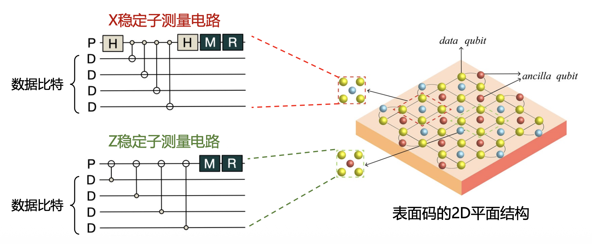

???+ example "具体例子：表面码的错误检测与纠正"

    

        
    

### 量子低密度奇偶校验码

???+ info "引入"

    尽管表面码的研究已经取得了巨大进展，但它存在一个很大的局限性：**物理比特开销极大**！

    - 例如，构建一个 d=13 的逻辑比特就需要 337 个物理比特（2d^2^ − 1），而当前 IBM 商用的成熟量子计算机最多只支持 156 个物理比特（ibm_pittsburgh）
    - 未来大规模量子计算需要更高效的编码方式，因此，学术界逐渐将研究重心转向对 qLDPC 码

    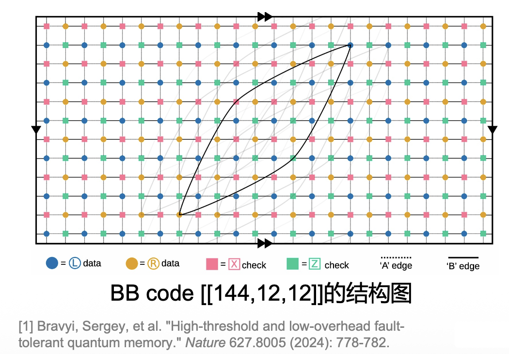{ align=right width=30% }

    IBM 于 Nature 2024 发布一种新的 qLDPC 码，即**双变量自行车码**(bivariate bicycle codes, BB code)

    - BB code 在实现和表面码持平的容错阈值的同时，大大降低了对物理比特的资源需求
    - 例如，BB code [[144,12,12]] 平均只需要 12 个物理比特就可以编码 1 个 d=12 的逻辑比特

量子低密度奇偶校验码（**qLDPC 码**）与表面码都属于稳定子码。但相比于表面码的 2D 平面结构，qLDPC 码是**超图**结构，拓扑连接较为稀疏，并且会涉及到非局部化的长程耦合作用（1 个校验比特可以连接多个物理比特）。

    

qLDPC 码的稳定子分别由两个校验矩阵表示，矩阵元素的取值为 0 或 1：

- 矩阵 $D_X$: 表示 X 稳定子，用于检测 Z 错误
- 矩阵 $D_Z$: 表示 Z 稳定子，用于检测 X 错误
- 矩阵 $D_X$ 和 $D_Z$ 需要满足**所有稳定子彼此对易**：$D_X \cdot D_Z^T = 0$

    

### 解码器

有了量子纠错码的编码设计之后，我们还需要有针对性的**解码器**设计。解码器的作用是：根据症状信息，判断出最有可能的错误，并给出纠正操作。

{ align=left width=30% }

- 逻辑比特构建完成后，通过执行稳定子测量电路，提取症状信息
- 将症状发送给**经典解码器**，从而定位错误类型和位置
- 解码器执行**解码算法**，计算出具体的错误纠正操作，发给控制系统
- 控制系统接收到纠正操作，向量子芯片发送纠正指令

量子纠错对解码器的性能要求非常严格，需要满足以下条件：

- **高精度**：任何对错误的误判都会导致逻辑错误，并且在量子电路中传播，最终导致计算失败
- **低延迟**：如果解码器的速度落后于症状生成的速度，就会造成数据堆积，从而延迟后续的操作，这种延迟开销是随着电路深度呈指数级增长

    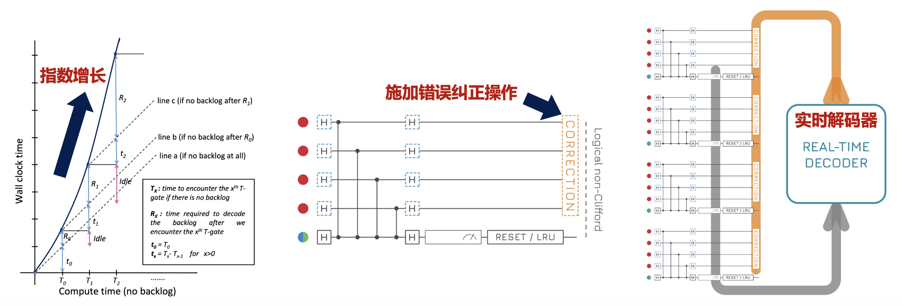

#### 表面解码器

当前的表面码解码器研究较为成熟，主要基于表面码几何特征设计解码算法。目前最常用和成功的表面码解码器为：**最小权重完美匹配**(minimum-weight perfect matching, **MWPM**)**解码器**。

    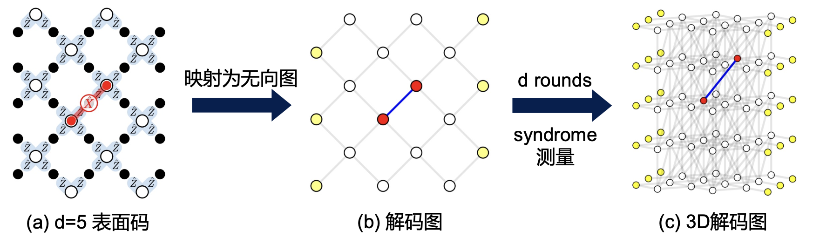

构建完图之后，解码问题就变成了在图上寻找一个最小权重完美匹配

- **完美匹配**：简单来说，就是把所有的“缺陷”两两配对，一个不剩
- **最小权重**：在所有可能的完美匹配中，MWPM 会找到一个使得所有配对边的权重总和最小的匹配，这个匹配就对应着最可能发生的物理错误模式

MWPM 在理论上能实现对表面码的精确解码，但由于其**相对较高的时间复杂度**（$O(V^2E)$，其中 $V$ 是图的顶点数，$E$ 是图的边数），许多研究聚焦于如何基于 MWPM 实现**表面码的实时解码器**（1μs）

- **硬件加速**：将 MWPM 计算任务部署到**专用硬件**上（如 FPGA、ASIC 等）
- **算法优化**：研究 MWPM 的**近似算法**，虽然不能保证找到全局最优解，但可以极大缩短求解时间

    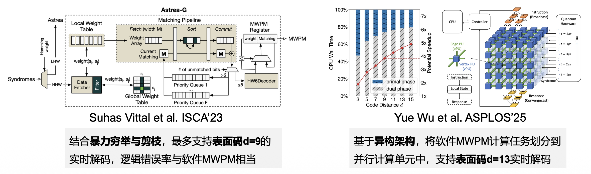

---
除了 MWPM 外，基于**并查集**(union-find)和**神经网络**的解码器也能实现出色的解码性能。

- 基于并查集的解码器：

    

        
    

    - 基于图论，采用一种更高效的聚类算法
    - 从每个症状位出发，逐步向外生长聚类，直到不同的聚类相遇并连接
    - 利用并查集数据结构高效管理这些聚类，判断它们是否属于同一个“错误链”并进行合并

- 基于神经网络的解码器：

    

        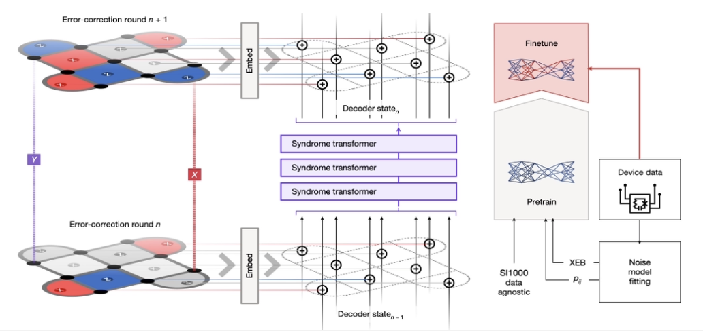
    

    - 将症状作为神经网络的输入，训练模型来预测最可能的错误模式
    - Google 在 Nature 2024 上提出的 Alpha-qubit 能实现 SOTA 的表面码解码精度

#### 针对 qLDPC 码的解码器

相比于表面码解码器，**qLDPC 解码器**的设计相对困难，这是因为 qLDPC 码呈现出与表面码不同的超图结构，我们无法直接将表面码解码器套用到 qLDPC 码上。

当前，针对 qLDPC 最经典的解码器为：

- **置信传播**（BP）

    

        
    

    - BP 在 Tanner 图上传递消息，迭代更新数据比特出错的概率值，从而确定最有可能的错误模式
    - 核心特点：高度并行性、低计算复杂度

- **置信传播 + 有序统计解码**（BP+OSD）

    

        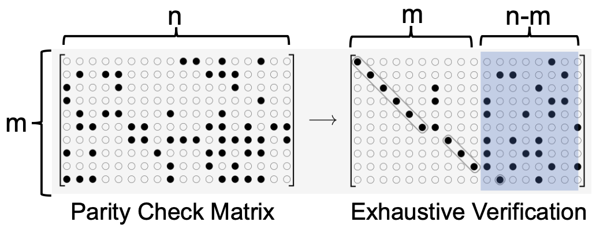
    

    - 如果 BP 解码失败，OSD 作为后处理会执行高斯消元法，接收 BP 输出的概率信息，遍历可能的错误模式
    - 核心特点：解码精度高、计算复杂度极高

qLDPC 的解码精度受到**量子简并性**(quantum degeneracy)的影响，即可能有多种错误对应同一个错误症状，解码器无法确定究竟是哪一个错误模式导致的。

    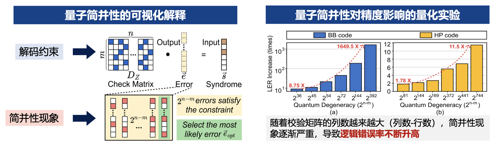

要缓解量子简并性现象，可以从考虑错误权重、校验矩阵解耦等方面入手。

## 容错量子计算

### 逻辑操作

- 量子纠错码的目的是保护信息，在此基础上，我们还需要执行有意义的计算
- **逻辑操作**是在物理比特上执行一系列的操作，总效果等同对一个被编码的逻辑比特执行操作
- 在所有逻辑操作中，**横向操作**(transversal qperations)是最为重要的类型，核心思想是**局部化**，通过对每个物理比特独立执行相同的物理门操作来实现

???+ example "例子"

    假设我们使用经典的重复码 000 来编码逻辑 0，用 111 来编码逻辑 1。要对逻辑比特执行一个**逻辑非门**（CNOT），我们只需对每个物理比特都执行一个 CNOT：

    - 逻辑 0 (000) -> (111) $\equiv$ 逻辑 1
    - 逻辑 1 (111) -> (000) $\equiv$ 逻辑 0

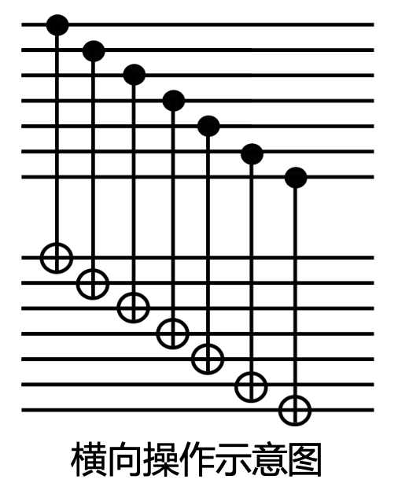{ align=right width=20% }

横向操作是**高度容错的**，主要因为：

- **不传播错误**：横向操作只对单个物理量子比特进行操作，不引入新纠缠
- **保持编码空间**：横向操作天生就保证了操作后的状态仍然处于编码空间内

尽管横向操作非常理想，但它并非万能的。因为横向方式不能实现所有的通用量子门。例如，对于表面码，T 门就不能以横向方式实现。

### 量子计算的通用门集

容错量子计算需要一个通用的门集来执行任意的量子算法，当前最常用的通用门集包括：Hadamard 门、S 门（相位门）、CNOT 门、以及一个非 Clifford 门（如 T 门）。

- **Clifford 门**（H、S、CNOT）：可以相对容易地通过横向操作来实现，具有很高的容错性
- **非 Clifford 门**（T门）：主要挑战，因为 T 门通常不能以横向方式实现，其容错实现更为复杂。当前主要通过**魔态蒸馏**(magic state distillation)的方式来实现 T 门

    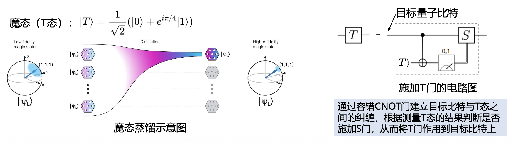

### 表面码的逻辑操作实现

- 刚刚我们提到，可以通过横向操作实现逻辑门。但这在表面码里不现实，因为表面码是二维局域的，每个物理比特只能和它邻近的比特交互。如果要横向连接两个逻辑比特间的所有物理比特，需要长程连接，这对于当前的量子硬件来说极不友好，会引入额外的串扰与误差。
- **格子手术**(lattice surgery)解决了这个问题，它不直接连接所有物理比特，而是通过合并和分裂操作，对表面码的边界进行重新定义和测量

    

