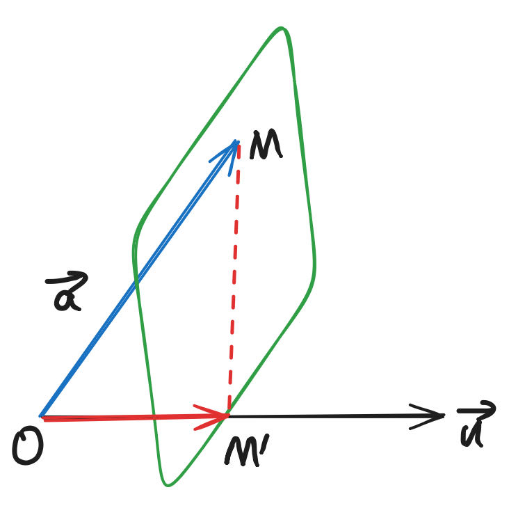
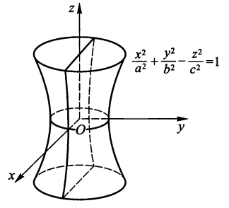

# 第七章 矢量代数与空间解析几何

???+ info "补充：矢量的投影"

    矢量$\bm{a}$在轴u上的投影为：$|\bm{a}| \cos{\varphi} = \dfrac{\bm{a} \cdot \bm{u}}{|\bm{u}|}$

    投影矢量：$|\bm{a}| \cos{\varphi} \dfrac{\bm{u}}{|\bm{u}|}$

    性质：

    + $(\bm{a} + \bm{b})_{\bm{u}} = (\bm{a})_{\bm{u}} + (\bm{b})_{\bm{u}}$
    + $(\lambda \bm{a})_{\bm{u}} = \lambda (\bm{a})_{\bm{u}}$

    

    
    
  

## 两矢量的数量积与矢量积

### 数量积

**数量积(点积)**：$\bm{a} \cdot \bm{b} = |\bm{a}||\bm{b}|\cos \theta$

运算规律：

+ 交换律：$\bm{a} \cdot \bm{b} = \bm{b} \cdot \bm{a}$
+ 结合律：$m(\bm{a} \cdot \bm{b}) = (m\bm{a}) \cdot \bm{b} = \bm{a} \cdot (m\bm{b})$
+ 分配律：$\bm{a} \cdot (\bm{b} + \bm{c}) = \bm{a} \cdot \bm{b} + \bm{a} \cdot \bm{c}$

**定理1**：$\bm{a} \perp \bm{b} \Leftrightarrow \bm{a} \cdot \bm{b} = 0$

若$\bm{a} = (a_1, a_2, a_3), \bm{b} = (b_1, b_2, b_3)$，则：

$$
\cos(\bm{a}, \bm{b}) = \dfrac{\bm{a} \cdot \bm{b}}{|\bm{a}|\ |\bm{b}|} = \dfrac{a_1b_1 + a_2b_2 + a_3b_3}{\sqrt{a_1^2 + a_2^2 + a_3^2} \cdot \sqrt{b_1^2 + b_2^2 + b_3^2}}
$$

### 矢量积

**矢量积(叉积)**：$\bm{c} = \bm{a} \times \bm{b}$

+ 大小：$|\bm{c}| = |\bm{a}|\ |\bm{b}|\sin(\bm{a}, \bm{b})$
+ 方向：从$\bm{a}$经角$(\bm{a}, \bm{b})$到$\bm{b}$的右手定则确定

几何意义：数值上 = 以$\bm{a}, \bm{b}$为邻边的平行四边形的面积

运算规律：

+ $\bm{a} \times \bm{b} = - (\bm{b} \times \bm{a})$
+ 结合律：$m(\bm{a} \times \bm{b}) = (m\bm{a}) \times \bm{b} = \bm{a} \times (m\bm{b})$
+ 分配律：$\bm{a} \times (\bm{b} + \bm{c}) = \bm{a} \times \bm{b} + \bm{a} \times \bm{c},\ (\bm{a} + \bm{b}) \times \bm{c} = \bm{a} \times \bm{c} + \bm{b} \times \bm{c}$

**定理2**：$\bm{a} \parallel \bm{b} \Leftrightarrow \bm{a} \times \bm{b} = \bm{0}$

坐标表达式：

$$
\bm{a} \times \bm{b} = \begin{vmatrix}\bm{i} & \bm{j} & \bm{k} \\ a_1 & a_2 & a_3 \\ b_1 & b_2 & b_3\end{vmatrix}
$$

且：$\bm{a} \parallel \bm{b} \Leftrightarrow \dfrac{a_1}{b_1} = \dfrac{a_2}{b_2} = \dfrac{a_3}{b_3}$

## 矢量的混合积与二重矢积

### 混合积

令$\bm{a} = (a_1, a_2, a_3), \bm{b} = (b_1, b_2, b_3), \bm{c} = (c_1, c_2, c_3)$

**混合积**：$\bm{a} \cdot (\bm{b} \times \bm{c}) = \begin{vmatrix}a_1 & a_2 & a_3 \\ b_1 & b_2 & b_3 \\ c_1 & c_2 & c_3 \end{vmatrix}$

**定理3**：$\bm{a}, \bm{b}, \bm{c}$共面 $\Leftrightarrow\ \bm{a} \cdot (\bm{b} \times \bm{c}) = 0$  

几何意义：$|\bm{a} \cdot (\bm{b} \times \bm{c})|$的值为以$\bm{a}, \bm{b}, \bm{c}$为棱的平行六面体的体积

性质：

+ 顺次轮换混合积中的三个矢量，所得混合积不变，即
$$
\bm{a} \cdot (\bm{b} \times \bm{c}) = \bm{b} \cdot (\bm{c} \times \bm{a}) = \bm{c} \cdot (\bm{a} \times \bm{b})
$$

+ 任意对调混合积中两矢量的位置所得混合积的绝对值不变，但符号相反，即

$$
\begin{align}
\bm{a} \cdot (\bm{b} \times \bm{c}) & = - \bm{a} \cdot (\bm{c} \times \bm{b}) \notag \\ 
\bm{a} \cdot (\bm{b} \times \bm{c}) & = - \bm{b} \cdot (\bm{a} \times \bm{c}) \notag \\ 
\bm{a} \cdot (\bm{b} \times \bm{c}) & = - \bm{c} \cdot (\bm{b} \times \bm{a}) \notag 
\end{align}
$$

### 二重矢积

**二重矢积**：$\bm{a} \times (\bm{b} \times \bm{c})$

**定理4**：

$$
\begin{align}
\bm{a} \times (\bm{b} \times \bm{c}) & = (\bm{a} \cdot \bm{c}) \bm{b} - (\bm{a} \cdot \bm{b})\bm{c} \notag \\
(\bm{a} \times \bm{b}) \times \bm{c} & = (\bm{c} \cdot \bm{a}) \bm{b} - (\bm{c} \cdot \bm{b})\bm{a} \notag 
\end{align}
$$

## 平面与直线方程

### 平面及平面方程

+ **点法式方程**：已知一平面过$P_0(x_0, y_0, z_0)$，且垂直于非零矢量$\bm{n} = A\bm{i} + B\bm{j} + C\bm{k}$，则平面方程为：

$$
A(x - x_0) + B(y - y_0) + C(z - z_0) = 0
$$

+ **一般式方程**：(其中$A, B, C$不全为0)

$$
Ax + By + Cz + D = 0
$$

+ 当$D = 0$，平面过原点
+ 当$A, B, C$三者有一个为0时，平面与坐标轴(Ox/Oy/Oz)平行
+ 当$A, B, C$三者有两个为0时，平面与坐标平面平行

+ **截距式方程**：(其中$A, B, C, D$均不为0)令$a = -\dfrac{D}{A}, b = -\dfrac{D}{B}, c = -\dfrac{D}{C}$，则方程为：

$$
\dfrac{x}{a} + \dfrac{y}{b} + \dfrac{z}{c} = 1
$$

+ 三点式方程：若平面过$M_i(x_i, y_i, z_i)(i = 1, 2, 3)$这3个定点，则方程为：

$$
\begin{vmatrix}
x - x_1 & y - y_1 & z - z_1 \\
x_2 - x_1 & y_2 - y_1 & z_2 - z_1 \\
x_3 - x_2 & y_3 - y_2 & z_3 - z_2
\end{vmatrix} = 0
$$

---
+ 两平面的夹角：设平面$\pi_1: A_1x + B_1y + C_1z + D_1 = 0,\ \pi_2: A_2x + B_2y + C_2z + D_2 = 0$，则该两平面的夹角的余弦值为：

$$
\cos \theta = \cos(\bm{n}_1, \bm{n}_2) = \dfrac{A_1A_2 + B_1B_2 + C_1C_2}{\sqrt{A_1^2 + B_1^2 + C_1^2}\sqrt{A_2^2 + B_2^2 + C_2^2}}
$$

+ $\pi_1 \perp \pi_2 \Leftrightarrow A_1A_2 + B_1B_2 + C_1C_2 = 0$
+ $\pi_1 \parallel \pi_2 \Leftrightarrow \dfrac{A_1}{A_2} = \dfrac{B_1}{B_2} = \dfrac{C_1}{C_2}$

+ 点到平面的距离：求空间一点$P_0(x_0, y_0, z_0)$到平面$Ax + By + Cz + D = 0$的距离

$$
d = \dfrac{|Ax_0 + By_0 + Cz_0 + D|}{\sqrt{A^2 + B^2 + C^2}}
$$

### 空间直线方程

+ **点向式方程(对称式方程)**：设L是过点$P_0(x_0, y_0, z_0)$且与一非零矢量$\bm{v} = l\bm{i} + m\bm{j} + n\bm{k}$平行的直线，求其方程：

$$
\dfrac{x - x_0}{l} = \dfrac{y - y_0}{m} = \dfrac{z - z_0}{n}
$$

>注：若l, m或n为0，可以将0写在分母的位置上，表示在Ox/Oy/Oz轴上的投影为0，即直线垂直于Ox/Oy/Oz轴

**参数式方程**：(t为参数)

$$
\begin{cases}x = x_0 + lt \\ y = y_0 + mt \\ z = z_0 + nt\end{cases},\quad (- \infty < l < + \infty)
$$

+ **两点式方程**：已知直线上两点$P_1(x_1, y_1, z_1), P_2(x_2, y_2, z_2)$，则直线方程为：

$$
\dfrac{x - x_1}{x_2 - x_1} = \dfrac{y - y_1}{y_2 - y_1} = \dfrac{z - z_1}{z_2 - z_1}
$$

+ **一般式方程**：($A_1, B_1, C_1$与$A_2, B_2, C_2$不成比例)

$$
\begin{cases}A_1x + B_1y + C_1z + D_1 = 0 \\ A_2x + B_2y + C_2z + D_2 = 0\end{cases}
$$

特别地，$\begin{cases}y = 0 \\ z = 0\end{cases}$，$\begin{cases}x = 0 \\ z = 0\end{cases}$，$\begin{cases}x = 0 \\ y = 0\end{cases}$分别表示与Ox、Oy、Oz轴重合的直线。

!!! note "一般式 $\Rightarrow$ 点向式"

    设一般式方程中：
    
    $$
    \begin{align}
    \pi_1: A_1x + B_1y + C_1z + D_1 = 0 \text{ 的法矢量为 } \bm{n}_1\notag \\
    \pi_2: A_2x + B_2y + C_2z + D_2 = 0 \text{ 的法矢量为 } \bm{n}_2\notag \\
    \end{align}
    $$

    设直线方向矢量为$\bm{v}$，取$\bm{v} = \bm{n}_1 \times \bm{n}_2$，再在直线上取一点即可得到点向式方程。

---
+ 两直线的夹角：两直线方向矢量的夹角$\theta$或它们的补角$\pi - \theta$，设：

$$
\begin{align}
L_1: \dfrac{x - x_1}{l_1} & = \dfrac{y - y_1}{m_1} = \dfrac{z - z_1}{n_1} \notag \\
L_2: \dfrac{x - x_2}{l_2} & = \dfrac{y - y_2}{m_2} = \dfrac{z - z_2}{n_2} \notag \\
\end{align}
$$

则: $cos \theta = \dfrac{l_1l_2 + m_1m_2 + n_1n_2}{\sqrt{l_1^2 + m_1^2 + n_1^2} \sqrt{l_2^2 + m_2^2 + n_2^2}}$

+ $L_1 \perp L_2 \Leftrightarrow l_1l_2 + m_1m_2 + n_1n_2 = 0$ 
+ $L_1 \parallel L_2 \Leftrightarrow \dfrac{l_1}{l_2} = \dfrac{m_1}{m_2} = \dfrac{n_1}{n_2}$

+ 直线与平面的夹角：设平面$\pi: Ax + By + Cz + D = 0$，其法矢量为$\bm{n} = A\bm{i} + B\bm{j} + C\bm{k}$；直线$L: \dfrac{x - x_0}{l} = \dfrac{y - y_0}{m} = \dfrac{z - z_0}{n}$，其方向矢量为$\bm{v} = l\bm{i} + m\bm{j} + n\bm{k}$。设$\bm{v}$与$\bm{n}$的夹角为$\theta$，则$\dfrac{\pi}{2} - \theta$或$\theta - \dfrac{\pi}{2}$为L与$\pi$的夹角。

    + $L \perp \pi \Rightarrow \dfrac{A}{l} = \dfrac{B}{m} = \dfrac{C}{n}$
    + $L \parallel \pi \Rightarrow Al + Bm + Cn = 0$

+ 点到直线的距离：已知点$P(x_1, y_1, z_1)$和直线$L: \dfrac{x - x_0}{l} = \dfrac{y - y_0}{m} = \dfrac{z - z_0}{n}$，求点P到直线L的距离。

由上图得：
$$
h = |\overrightarrow{P_0P}|\sin(\overrightarrow{P_0P}, \bm{v}) = \dfrac{|\overrightarrow{P_0P} \times \bm{v}|}{|\bm{v}|}
$$

+ 直线在平面上的投影直线方程 $\rightarrow$ 分类讨论

    + 直线与平面平行：在直线l上取一点P，过该点作与平面$\pi$垂直的直线$l^*$，P在平面上的投影点$P_0 = l^* \cap \pi$。投影直线的方向向量同原直线，且过$P_0$，则可求出它的方程。

    + 直线与平面相交：设交点为$P_1$，易知投影直线过该交点。投影直线的方向向量$\bm{v}' = (\bm{v} \times \bm{n}) \times \bm{n}$，其中$\bm{n}, \bm{v}$分别是平面的法向量和直线的方向向量，此时可以求出投影直线的方程了。

+ 两异面直线的距离：设两异面直线分别为

$$
\begin{align}
L_1: \dfrac{x - x_1}{l_1} = \dfrac{y - y_1}{m_1} = \dfrac{z -z_1}{n_1} ,\ \bm{v}_1 = l_1\bm{i} + m_1\bm{j} + n_1\bm{k} \notag \\ 
L_2: \dfrac{x - x_2}{l_2} = \dfrac{y - y_2}{m_2} = \dfrac{z -z_2}{n_2} ,\ \bm{v}_2 = l_2\bm{i} + m_2\bm{j} + n_2\bm{k} \notag \\
\end{align}
$$

作上图所示的辅助线，最终可得：

$$
d = |(\overrightarrow{M_1M_2})_{\bm{n}}| = \dfrac{|\overrightarrow{M_1M_2} \cdot (\bm{v_1} \times \bm{v_2})|}{|\bm{v_1} \times \bm{v_2}|}
$$

### 平面束方程

通过一已知直线L的平面有无穷多张，这些平面的集合称为**平面束**，其中L为平面束的轴。

若$L: \begin{cases}\pi_1: A_1x + B_1y + C_1z + D_1 = 0 \\ \pi_2: A_2x + B_2y + C_2z + D_2 = 0 \end{cases}$，则**平面束方程**为：

$$
\lambda(A_1x + B_1y + C_1z + D_1) + \mu(A_2x + B_2y + C_2z + D_2) = 0
$$

为了计算的方便，当$\lambda \ne 0$时，令$\alpha = \dfrac{\mu}{\lambda}$，则平面束方程变成：

$$
A_1x + B_1y + C_1z + D_1 + \alpha(A_2x + B_2y + C_2z + D_2) = 0
$$

注意，该方程无法表示平面$A_2x + B_2y + C_2z + D = 0$。

## 曲面方程与空间曲线方程

### 曲面方程

+ **球面方程**：$(x - x_0)^2 + (y - y_0)^2 + (z - z_0)^2 = R^2$

+ **柱面方程**：以Oxy平面的曲线$\Gamma: F(x, y) = 0$为准线，母线L的方向矢量为$\bm{v} = a\bm{i} + b\bm{j} + c\bm{k}$的柱面方程为例：

$$
F(x - \dfrac{a}{c}z, y - \dfrac{b}{c}z) = 0
$$

+ **锥面方程**：以$z = h(h \ne 0)$平面上的曲线$\Gamma: F(x, y) = 0$为准线，以原点为顶点的锥面方程为例：

$$
F(\dfrac{h}{z}x, \dfrac{h}{z}y) = 0
$$

+ **旋转曲面方程**：设$\Gamma$是Oyz平面上的曲线，方程为F(y, z) = 0，将该曲线绕Oz轴旋转，得到一个以Oz轴为轴的旋转曲面，求其方程：

取曲线上一点$P(0, y_P, z_P)$，当曲线绕轴旋转一周后，点P的轨迹为一个圆，取圆上任意一点$Q(x_Q, y_Q, z_Q)$，可得到：

$$
\begin{cases}
z_P = z_Q \\
y_P = \pm \sqrt{x_Q^2 + y_Q^2}
\end{cases}
$$

解得旋转曲面方程为$F(\pm \sqrt{x^2 + y^2}, z)$

### 曲线方程

+ 用两曲面交线表示：

$$
\Gamma: \begin{cases}
F(x, y, z) = 0 \\ 
G(x, y, z) = 0
\end{cases}
$$

+ 用参数方程表示：

$$
\Gamma: \begin{cases}
x = \varphi(t) \\
y = \psi(t) \\
z = \omega(t)
\end{cases}
$$

---
空间曲线在<u>坐标平面</u>上的**投影**

令空间曲线

$$
\Gamma: \begin{cases}
F_1(x, y, z) = 0 \\ 
F_2(x, y, z) = 0
\end{cases}
$$

消去变量z，得到方程$\begin{cases}F(x, y) = 0 \\ z = 0 \end{cases}$，这是$\Gamma$在Oxy平面上的**投影**

同理的$\Gamma$在Oyz和Ozx平面上的投影分别为：
$$
\begin{cases}G(y, z) = 0 \\ x = 0 \end{cases} \quad
\begin{cases}H(x, z) = 0 \\ y = 0 \end{cases}
$$

!!! note "更复杂的题型：空间曲线在**任意平面上**的投影曲线"

    可以将投影曲线理解为一个过该曲线的柱体与已知平面的交线，该柱体母线的方向即为已知平面的法向量的方向。然后在空间曲线和投影曲线上各设一个点$P, P_0$，满足$\overrightarrow{PP_0} \parallel \bm{n}$，代入已知方程计算求解。

## 二次曲面

+ **椭球面**：$\dfrac{x^2}{a^2} + \dfrac{y^2}{b^2} + \dfrac{z^2}{c^2} = 1(a > 0, b > 0, c > 0)$

+ **椭圆抛物面**：$z = \dfrac{x^2}{a^2} + \dfrac{y^2}{b^2}(a > 0, b > 0)$

+ **二次锥面**：$\dfrac{x^2}{a^2} + \dfrac{y^2}{b^2} - \dfrac{z^2}{c^2} = 0(a > 0, b > 0, c > 0)$

+ **双曲抛物面(马鞍面)**：$z = -\dfrac{x^2}{a^2} + \dfrac{y^2}{b^2}$

+ **单叶双曲面**：$\dfrac{x^2}{a^2} + \dfrac{y^2}{b^2} - \dfrac{z^2}{c^2} = 1$

+ **双叶双曲面**：$\dfrac{x^2}{a^2} + \dfrac{y^2}{b^2} - \dfrac{z^2}{c^2} = -1$

