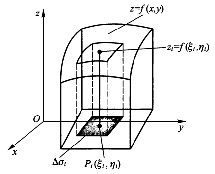
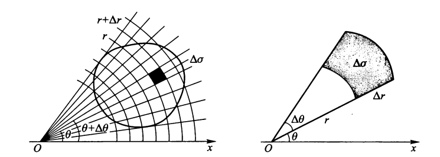
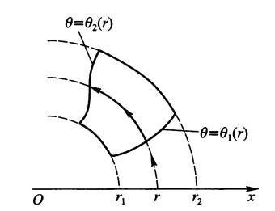
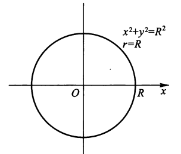
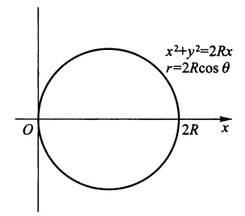

# 第九章 多元函数积分学

## 二重积分

### 概念

??? example "引入"

    求下列实际问题，我们采用与推导定积分时类似的步骤：

    1. 分割
    2. 近似
    3. 作和
    4. 取极限

    === "曲顶柱体的体积"

        

        
        

        体积$V = \lim\limits_{\lambda \rightarrow 0} \sum\limits_{i = 1}^n f(\xi_i, \eta_i) \Delta \sigma_i$
        

    === "平面薄板的面积"
        
        *面密度*：$\lim\limits_{\Delta \sigma \rightarrow P_0}\dfrac{\Delta m}{\Delta \sigma}$

        质量$M =  \lim\limits_{\lambda \rightarrow 0} \sum\limits_{i = 1}^n f(\xi_i, \eta_i) \Delta \sigma_i$
        
定义：

设二元函数$f(P) = f(x, y)$在平面有界闭区域$\sigma$上有界，用曲线网将区域$\sigma$任意分成n个(彼此无公共内点的)小闭区域$\Delta \sigma_1, \Delta \sigma_2, \dots, \Delta \sigma_n$，仍以$\Delta \sigma_i$记为小区域的面积，

+ $\forall P_i(\xi_i, \eta_i) \in \Delta \sigma_i, f(\xi_i, \eta_i) \Delta \sigma_i$称为*积分元*
+ *积分和式*：$\sum\limits_{i = 1}^n f(\xi_i, \eta_i) \Delta \sigma_i$
+ **二重积分(黎曼积分)**：$\iint\limits_\sigma f(x, y)\mathrm{d}\sigma = \lim\limits_{\lambda \rightarrow 0} \sum\limits_{i = 1}^n f(\xi_i, \eta_i) \Delta \sigma_i$，其中

    + 被积函数：$f(P) = f(x, y)$
    + 积分区域：$\sigma$
    + 被积表达式：$f(x, y)\mathrm{d}\sigma$
    + 积分变量：x, y
    + 面积元素：$\mathrm{d}\sigma$

**定理1**：若f(x, y)在有界闭区域$\sigma$上连续，则f(x, y)在$\sigma$上可积。

!!! note "补充"

    + 平面图形的面积$\sigma = \iint\limits_\sigma \mathrm{d}\sigma $
    + 几何意义：曲顶柱体的体积

### 性质

+ $\iint\limits_\sigma [f(x, y) \pm g(x, y)] \mathrm{d}\sigma = \iint\limits_\sigma f(x, y) \mathrm{d}\sigma \pm \iint\limits_\sigma g(x, y) \mathrm{d}\sigma$
+ $\iint\limits_\sigma kf(x, y) \mathrm{d}\sigma = k\iint\limits_\sigma f(x, y) \mathrm{d}\sigma$ (k为任意常数)
+ $\iint\limits_\sigma 1 \mathrm{d}\sigma = \iint\limits_\sigma \mathrm{d}\sigma = \sigma$
+ 若$\sigma$可分解为2个不共内点的区域$\sigma_1, \sigma_2$，记作$\sigma = \sigma_1 + \sigma_2$，则有：

$$
\iint\limits_\sigma f(x, y) \mathrm{d}\sigma = \iint\limits_{\sigma_1} f(x, y) \mathrm{d}\sigma + \iint\limits_{\sigma_2} f(x, y) \mathrm{d}\sigma
$$

+ 
    + 若$\iint\limits_\sigma f(x, y) \mathrm{d}\sigma$存在，$f(x, y) \ge 0$，则$\iint\limits_\sigma f(x, y) \mathrm{d}\sigma \ge 0$
    + 若$\iint\limits_\sigma f(x, y) \mathrm{d}\sigma$存在，$f(x, y) \le 0$，则$\iint\limits_\sigma f(x, y) \mathrm{d}\sigma \le 0$

+ 
    + 若$f(x, y) \ge 0, f(x, y) \not\equiv 0, (x, y) \in \sigma$且$f(x, y)$连续，则$\iint\limits_\sigma f(x, y) \mathrm{d}\sigma \ge 0$
    + 若$f(x, y) \le g(x, y), f(x, y) \not\equiv g(x, y), (x, y) \in \sigma$且$f(x, y), g(x, y)$连续，则$\iint\limits_\sigma f(x, y) \mathrm{d}\sigma \le \iint\limits_\sigma g(x, y) \mathrm{d}\sigma$

+ $|\iint\limits_\sigma f(x, y) \mathrm{d}\sigma| \le \iint\limits_\sigma |f(x, y)| \mathrm{d}\sigma$

+ **二重积分中值定理**：若f(x, y)在有界闭区域$\sigma$上连续，则在$\sigma$上至少存在一点$P(x^*, y^*)$，使得$\iint\limits_\sigma f(x, y) \mathrm{d}\sigma = f(x^*, y^*) \sigma$

    + 推论：$m \sigma \le \iint\limits_\sigma f(x, y) \mathrm{d}\sigma \le M \sigma$
    + 几何意义：曲顶柱体的体积 = 以$\sigma$为底，$f(x^*, y^*)$为高的柱体体积

### 计算

#### 直角坐标系 

!!! info "x-型区域 & y-型区域"

    === "x-型区域"

        $D = {(x, y): \varphi_1(x) \le y \le \varphi_2(x), a \le x \le b}$

        

        
        

    === "y-型区域"

        $D = {(x, y): \psi_1(y) \le x \le \psi_2(y), c \le x \le d}$

        

        
        

    === "既不是x-型区域，也不是y-型区域"

        将区域分割成一系列的x-型区域和(或)y-型区域，分别求解后再相加

        

        
        

!!! note ":star2:计算二重积分的方法"

    === "积分区域为x-型区域"

        $$
        \iint\limits_\sigma f(x, y) \mathrm{d}\sigma = \iint\limits_\sigma f(x, y) \mathrm{d}x\mathrm{d}y = \int_a^b\mathrm{d}x \int_{\varphi_1(x)}^{\varphi_2(x)}f(x, y)\mathrm{d}y
        $$

        

        
        
        

    === "积分区域为y-型区域"

        $$
        \iint\limits_\sigma f(x, y) \mathrm{d}\sigma = \iint\limits_\sigma f(x, y) \mathrm{d}x\mathrm{d}y = \int_c^d\mathrm{d}y \int_{\psi_1(y)}^{\psi_2(y)}f(x, y)\mathrm{d}x
        $$

        

        
        
        

    === "既是x-型区域，也是y-型区域"

        $$
        \int_a^b\mathrm{d}x \int_{\varphi_1(x)}^{\varphi_2(x)}f(x, y)\mathrm{d}y = \iint\limits_\sigma f(x, y) \mathrm{d}\sigma = \int_c^d\mathrm{d}y \int_{\psi_1(y)}^{\psi_2(y)}f(x, y)\mathrm{d}x
        $$

        

        
        

#### 极坐标系

直角坐标 $\Rightarrow$ 极坐标

$$
\iint\limits_\sigma f(x, y) \mathrm{d}\sigma = \iint\limits_\sigma f(r \cos \theta, r\sin \theta) r \mathrm{d}r \mathrm{d} \theta
$$

!!! note ":star2:计算方法"

    === ":white_check_mark:积分区域是$\theta$-型区域"

        $\sigma: r_1(\theta) \le r \le r_2(\theta), \alpha \le \theta \le \beta$，即$\sigma$是由曲线$r = r_1(\theta)$(下曲线)，$r = r_2(\theta)$(上曲线)，及射线$\theta = \alpha, \theta = \beta$所围成的区域，则：

        $$
        \iint\limits_\sigma f(x, y) \mathrm{d}\sigma = \int_\alpha^\beta \mathrm{d}\theta \int_{r_1(\theta)}^{r_2(\theta)}f(r\cos \theta, r\sin \theta)r \mathrm{d}r
        $$

        === "极点O在区域外部"

            $\sigma: r_1(\theta) \le r \le r_2(\theta), \alpha \le \theta \le \beta$

            $$
            \iint\limits_\sigma f(x, y) \mathrm{d}\sigma = \int_\alpha^\beta \mathrm{d}\theta \int_{r_1(\theta)}^{r_2(\theta)}f(r\cos \theta, r\sin \theta)r \mathrm{d}r
            $$

            

            
            

        === "极点O在区域边界上"

            $\sigma: 0 \le r \le r(\theta), \alpha \le \theta \le \beta$

            $$
            \iint\limits_\sigma f(x, y) \mathrm{d}\sigma = \int_\alpha^\beta \mathrm{d}\theta \int_0^{r(\theta)}f(r\cos \theta, r\sin \theta)r \mathrm{d}r
            $$

            

            
            

        === "极点O在区域内部"       

            $\sigma: 0 \le r \le r(\theta), 0 \le \theta \le 2\pi$

            $$
            \iint\limits_\sigma f(x, y) \mathrm{d}\sigma = \int_0^{2\pi} \mathrm{d}\theta \int_0^{r(\theta)}f(r\cos \theta, r\sin \theta)r \mathrm{d}r
            $$     

            

            
            
  
    
    === "积分区域是r-型区域"

        $\sigma: \theta_1(r) \le \theta \le \theta_2(r), r_1 \le r \le r_2$，即$\sigma$是由曲线$\theta = \theta_1(r), \theta = \theta_2(r)$与圆$r = r_1, r = r_2$所围成的区域，则有：

        $$
        \iint\limits_\sigma f(x, y) \mathrm{d}\sigma = \int_{r_1}^{r_2} \mathrm{d}r \int_{\theta_1(r)}^{\theta_2(r)}f(r\cos \theta, r\sin \theta)r \mathrm{d}\theta
        $$

        

        
        
 

    === "一些特殊区域"

        === "$x^2 + y^2 = R^2$"

            $\sigma: r = R$

            $$
            \iint\limits_\sigma f(x, y) \mathrm{d}\sigma = \int_0^{2\pi} \mathrm{d}\theta \int_0^Rf(r\cos \theta, r\sin \theta)r \mathrm{d}r
            $$ 

            

            
            
 

        === "$x^2 + y^2 = 2xR$"

            $\sigma: 0 \le r \le 2R \cos \theta, -\dfrac{\pi}{2} \le \theta \le \dfrac{\pi}{2}$

            $$
            \iint\limits_\sigma f(x, y) \mathrm{d}\sigma = \int_{-\frac{\pi}{2}}^{\frac{\pi}{2}} \mathrm{d}\theta \int_0^{2R \cos \theta}f(r\cos \theta, r\sin \theta)r \mathrm{d}r
            $$

            

            
            
 

        === "$x^2 + y^2 = 2Ry$"

            $\sigma: 0 \le r \le 2R \sin \theta, 0 \le \theta \le \pi$

            $$
            \iint\limits_\sigma f(x, y) \mathrm{d}\sigma = \int_0^\pi \mathrm{d}\theta \int_0^{2R \sin \theta}f(r\cos \theta, r\sin \theta)r \mathrm{d}r
            $$

            

            
            
             

???+ note "总结"

    + 我们应根据区域的特征，选取更容易计算的方法求解。
    + 要熟悉一些特殊图形的曲线，比如摆线、心形线等(见微积分上教材的附录部分)
    + 小技巧：改良版极坐标法(有些题目无法直接用极坐标做，则采用此法)

        + 设$x = ar \cos^n \theta, y = br \sin^n \theta$，记$|J| = nabr \cos^{n-1} \theta \sin^{n-1} \theta$
        + $ \iint\limits_\sigma f(x, y) \mathrm{d}\sigma = \int_\alpha^\beta \mathrm{d}\theta \int_{r_1(\theta)}^{r_2(\theta)}f(r\cos \theta, r\sin \theta)|J| \mathrm{d}r$

## 三重积分

### 概念

定义：

+ 设V为一空间立体，$P_0(x_0, y_0, z_0) \in V$，取包含$P_0$的$\Delta V$，质量为$\Delta m$，若$\lim\limits_{\Delta V \rightarrow P_0} \dfrac{\Delta m}{\Delta V}$存在，则该极限值称为在$P_0$处的*体密度*。

+ 质量$M = \lim\limits_{\lambda \rightarrow 0}\sum\limits_{i = 1}^nf(\xi_i, \eta_i, \zeta_i)\Delta V_i$

+ 设f(x, y, z)是空间有界闭区域V的有界函数，将V任意分成n个小闭区域$\Delta V_1, \Delta V_2, \dots, \Delta V_n$，其中$\Delta V_i$既表示第i个小闭区域，也表示其体积。在每个$\Delta V_i$上任取一点$(\xi_i, \eta_i, \zeta_i)$，作乘积再求和得上述质量等式的右侧。若$\lambda$为各小闭区域直径最大值，当$\lambda \rightarrow 0$时，该和式极限总存在，称此极限为f(x, y, z)在V的**三重积分**，记作$\iiint\limits_{V} f(x, y, z) \mathrm{d}V$，其中$\mathrm{d}V$叫做*体积元素*

    + 在直角坐标系中，三重积分也可记作$\iiint\limits_{V} f(x, y, z) \mathrm{d}x\mathrm{d}y\mathrm{d}z$   

### 直角坐标系的计算

!!! note "1. 投影法"

    若立体V的投影区域为：

    === "在Oxy平面上的有界闭区域$\sigma_{xy}$"

        $V = \{(x, y, z): z_1(x, y) \le z \le z_2(x, y), (x, y) \in \sigma_{xy}\}$

        === "$\sigma_{xy}$为x-型区域"

            $\varphi_1(x) \le y \le \varphi_2(x), a \le x \le b$

            $$
            \iiint\limits_V f(x, y, z) \mathrm{d}V = \int_a^b \mathrm{d}x \int_{\varphi_1(x)}^{\varphi_2(x)} \mathrm{d}y \int_{z_1(x, y)}^{z_2(x, y)}f(x, y, z) \mathrm{d}z
            $$

        === "$\sigma_{xy}$为y-型区域"

            $\psi_1(y) \le x \le \psi_2(y), c \le y \le d$

            $$
            \iiint\limits_V f(x, y, z) \mathrm{d}V = \int_c^d \mathrm{d}y \int_{\psi_1(y)}^{\psi_2(y)} \mathrm{d}x \int_{z_1(x, y)}^{z_2(x, y)}f(x, y, z) \mathrm{d}z
            $$
    
        

        
        

    === "在Ozx平面上的有界闭区域$\sigma_{zx}$"

        $V = \{(x, y, z): y_1(x, z) \le y \le y_2(x, z), (x, z) \in \sigma_{zx}\}$

        $$
        \iiint\limits_V f(x, y, z) \mathrm{d}V = \iint\limits_{\sigma_{zx}}\mathrm{d}\sigma \int_{y_1(x, z)}^{y_2(x, z)}f(x, y, z)\mathrm{d}y
        $$

        若$\sigma_{zx}$为x-型区域：$z_1(x) \le z \le z_2(x), a \le x \le b$，则：

        $$
        \iiint\limits_V f(x, y, z) \mathrm{d}V = \int_a^b \mathrm{d}x \int_{z_1(x)}^{z_2(x)} \mathrm{d}z \int_{y_1(x, z)}^{y_2(x, z)}f(x, y, z)\mathrm{d}y
        $$

    === "在Oyz平面上的有界闭区域$\sigma_{yz}$"

        $V = \{(x, y, z): x_1(y, z) \le x \le x_2(y, z), (y, z) \in \sigma_{yz}\}$

        $$
        \iiint\limits_V f(x, y, z) \mathrm{d}V = \iint\limits_{\sigma_{yz}}\mathrm{d}\sigma \int_{x_1(y, z)}^{x_2(y, z)}f(x, y, z)\mathrm{d}x
        $$

>注：对有些较难画的曲面，关键是要画出曲面与曲面的交线，交线与交线的交点，并确定*投影区域*及<u>上曲面、下曲面方程</u>

!!! note "2. 平面截割法"

    === "区域V介于两平面z = c, z = d之间(c < d)"

        $V = \{(x, y, z): (x, y) \in D_z, c \le z \le d\}$

        $$
        \iiint\limits_V f(x, y, z) \mathrm{d}V = \int_c^d \mathrm{d}z \iint\limits_{D_z} f(x, y, z) \mathrm{d}\sigma = \int_c^d \mathrm{d}z \iint\limits_{D_z} f(x, y, z) \mathrm{d}x \mathrm{d}y
        $$

        若$D_z$为x-型区域，则：
        $$
        \iiint\limits_V f(x, y, z) \mathrm{d}V = \int_c^d \mathrm{d}z \int_{x_1(z)}^{x_2(z)} \mathrm{d}x \int_{y_1(x, z)}^{y_2(x, z)} f(x, y, z) \mathrm{d}y
        $$

        

        
        

    === "区域V介于两平面y = c, y = d之间(c < d)"

        $V = \{(x, y, z): (x, z) \in D_y, c \le y \le d\}$

        $$
        \iiint\limits_V f(x, y, z) \mathrm{d}V = \int_c^d \mathrm{d}y \iint\limits_{D_y} f(x, y, z) \mathrm{d}\sigma = \int_c^d \mathrm{d}y \iint\limits_{D_y} f(x, y, z) \mathrm{d}z \mathrm{d}x
        $$

    === "区域V介于两平面x = a, x = b之间(a < b)"

        $V = \{(x, y, z): (y, z) \in D_x, a \le x \le b\}$

        $$
        \iiint\limits_V f(x, y, z) \mathrm{d}V = \int_a^b \mathrm{d}x \iint\limits_{D_x} f(x, y, z) \mathrm{d}\sigma = \int_a^b \mathrm{d}x \iint\limits_{D_x} f(x, y, z) \mathrm{d}y \mathrm{d}z
        $$

### 柱面坐标系的计算

柱面坐标系：

柱面坐标系的坐标曲面：

+ 一族以Oz轴为对称轴的圆柱面：$r = r_i$(常)，即$x^2 + y^2 = r_i^2$
+ 一族通过Oz轴的半平面：$\theta = \theta_i$(常)，即$y = x\tan \theta_i$
+ 一族垂直Oz轴的平面$z = z_i$(常)

>(推导过程略)

$$
\begin{align}
\iiint\limits_V f(x, y, z) \mathrm{d}V & = \iiint\limits_V f(r\cos\theta, r\sin\theta, z) r\mathrm{d} r \mathrm{d}\theta \mathrm{d}z \notag \\
& = \iint\limits_{\sigma_{xy}} r\mathrm{d}r\mathrm{d}\theta \int_{z_1(r, \theta)}^{z_2(r, \theta)}f(r\cos\theta, r\sin\theta, z) \mathrm{d}z\notag
\end{align}
$$

### 球面坐标系的计算

球面坐标系：

其中$\varphi$为$\overrightarrow{OM}$为与Oz轴的夹角，$\theta$为投影点M'的极角，$\rho$为点M到原点的距离

球面坐标系的坐标曲面：

+ 一族中心在原点的球面：$\rho = r_i$(常)，即$x^2 + y^2 + z^2= r_i^2$
+ 一族顶点在原点而对称轴与Oz轴重合的圆锥面：$\varphi = \varphi_i$(常)，即$x^2 + y^2 - z^2 \tan^2\varphi_i = 0$
+ 一族通过Oz轴的半平面$\theta = \theta_i$(常)，即$y = x\tan \theta_i$

直角坐标 $\Rightarrow$ 球面坐标

$$
\begin{cases}
x = \rho \sin \varphi \cos \theta \\
y = \rho \sin \varphi \sin \theta \\
z = \rho \cos \varphi
\end{cases}
$$

从而：

$$
\begin{align}
\iiint\limits_V f(x, y, z) \mathrm{d}V & = \iiint\limits_V f(\rho \sin \varphi \cos \theta, \rho \sin \varphi \sin \theta, \rho \cos \varphi) \rho^2 \sin \varphi \mathrm{d} \rho \mathrm{d}\varphi \mathrm{d}\theta \notag \\
& = \int_\beta^\alpha \mathrm{d}\theta \int_{\varphi_1(\theta)}^{\varphi_2(\theta)} \sin \varphi \mathrm{d} \varphi \int_{\rho_1(\theta, \varphi)}^{\rho_2(\theta, \varphi)} \rho^2 f(\rho \sin \varphi \cos \theta, \rho \sin \varphi \sin \theta, \rho \cos \varphi) \mathrm{d} \rho \notag
\end{align}
$$

其中：$\rho_1(\theta, \varphi) \le \rho \le \rho_2(\theta, \varphi),\ \varphi_1(\theta) \le \varphi \le \varphi_2(\theta),\ \alpha \le \theta \le \beta$

???+ tip "“椭球”坐标系"

    设坐标为：

    $$
    \begin{cases}
    x = a\rho \sin \varphi \cos \theta \\
    y = b\rho \sin \varphi \sin \theta \\
    z = c\rho \cos \varphi
    \end{cases}
    $$

    令$|J| = abc\rho^2 \sin \varphi$，则

    $$
    \begin{align}
    & \iiint\limits_V f(x, y, z) \mathrm{d}V \notag \\ 
    = & \int_\beta^\alpha \mathrm{d}\theta \int_{\varphi_1(\theta)}^{\varphi_2(\theta)} \mathrm{d} \varphi \int_{\rho_1(\theta, \varphi)}^{\rho_2(\theta, \varphi)}|J| f(\rho \sin \varphi \cos \theta, \rho \sin \varphi \sin \theta, \rho \cos \varphi) \mathrm{d} \rho \notag
    \end{align}
    $$

???+ note "总结"

    + 根据区域的特征选取最容易计算的方法
    + 需要熟记常用的<u>二次曲面</u>方程，否则很难确定积分的范围

!!! question "该选取哪个坐标系呢？"

    按照笔记给出的顺序(直角坐标系的投影法、平面截割法，柱面坐标系、球面坐标系)，根据情况，看哪个简单就用那个。

    有时看似无法用直角坐标系做，但如果我们稍微**变换一下积分区域**，比如从x-型区域转化为y-型区域，就能够成功计算积分了。
    
    不要一上来就用球面坐标系，有时候可能用直角坐标系更快一些。

## 第一类曲线积分与第一类曲面积分

### 第一类曲线积分

定义：设函数f(P)是定义在以A, B为端点的光滑曲线$\Gamma$上的有界函数，在$\Gamma$上任意取点：$A = M_0, M_1, M_2, \dots, M_n = B$，将曲线分成n个部分。记弧$\widehat{M_{i-1}M_i}$的长度为$\Delta s_i$，并在$\widehat{M_{i-1}M_i}$任取一点$P_i(\xi_i, \eta_i, \zeta_i)$，作和$\sum\limits_{i-1}^nf(P_i)\Delta s_i$。记$\lambda = \max\{\Delta s_i: 1 \le i \le n\}$。称下列极限值为$f(P)$沿$\Gamma$的第一类曲线积分(若存在):

$$
\int\limits_\Gamma f(P) \mathrm{d}s = \lim\limits_{\lambda \rightarrow 0} \sum\limits_{i = 1}^n f(P_i) \Delta s_i
$$

!!! note "计算"

    === "case 1"

        若$\Gamma: \begin{cases}x = x(t) \\ y = y(t) \\ z = z(t)\end{cases}, \alpha \le t \le \beta$，则：

        $$
        \int\limits_\Gamma f(P) \mathrm{d}s = \int_\alpha^\beta f(x(t), y(t), z(t))\sqrt{x'^2(t) + y'^2(t) + z'^2(t)} \mathrm{d} t
        $$

    === "case 2"

        若$\Gamma: y = \varphi(x), x \in [a, b]$，则

        $$
        \int\limits_\Gamma f(x, y) \mathrm{d}s = \int_a^b f(x, \varphi(x))\sqrt{1 + \varphi'^2(x)} \mathrm{d} x
        $$

        若$\Gamma: x = \psi(y), y \in [c, d]$，则

        $$
        \int\limits_\Gamma f(x, y) \mathrm{d}s = \int_a^b f(\psi(y), y)\sqrt{1 + \psi'^2(y)} \mathrm{d} y
        $$

    === "case 3"

        若$\Gamma: r = r(\theta), \theta \in [\alpha, \beta]$，则

        $$
        \int\limits_\Gamma f(x, y) \mathrm{d}s = \int_\alpha^\beta f(r\cos \theta, r\sin \theta)\sqrt{r^2(\theta) + r'^2(\theta)} \mathrm{d} \theta
        $$

第一类曲线积分也具有二重积分的八条性质。

### 第一类曲面积分

定义：设函数f(x, y, z)是定义在有界光滑曲面S上的有界函数，用曲线网将S分成任意n部分：$\Delta S_1, \Delta S_2, \dots, \Delta S_n$，仍用$\Delta S_i$记$\Delta S_i$的面积，并在$\Delta S_i$上任取点$P_i(\xi_i, \eta_i, \zeta_i)$，作和$\sum\limits_{i-1}^nf(P_i)\Delta S_i$。记$\lambda$为$\Delta S_i$直径最大者。称下列极限值为$f(P)$沿S的第一类曲面积分(若存在):

$$
\iint\limits_S f(P) \mathrm{d}S = \lim\limits_{\lambda \rightarrow 0} \sum\limits_{i = 1}^n f(P_i) \Delta S_i
$$

!!! note "计算"

    === "case 1"

        若$S: z = z(x, y), (x, y) \in \sigma_{xy}$($\sigma_{xy}$是S在Oxy平面上的投影)，则：

        $$
        \iint\limits_S f(x, y, z) = \iint\limits_{\sigma_{xy}} f(x, y, z(x, y))\sqrt{1 + z'^2_x + z'^2_y} \mathrm{d}\sigma
        $$

        >注：若缺少某些变量，比如$z = 2\sqrt{x}$，这时积分内根号里的内容还是$1 + z'^2_x + z'^2_y$，没有省略

    === "case 2"

        若$S: y = y(x, z), (x, z) \in \sigma_{zx}$($\sigma_{zx}$是S在Ozx平面上的投影)，则：

        $$
        \iint\limits_S f(x, y, z) = \iint\limits_{\sigma_{zx}} f(x, y(x, z), z)\sqrt{1 + y'^2_x + y'^2_z} \mathrm{d}\sigma
        $$

    === "case 3"

        若$S: x = x(y, z), (y, z) \in \sigma_{yz}$($\sigma_{yz}$是S在Oyz平面上的投影)，则：

        $$
        \iint\limits_S f(x, y, z) = \iint\limits_{\sigma_{yz}} f(x(y, z), y, z)\sqrt{1 + x'^2_y + x'^2_z} \mathrm{d}\sigma
        $$

!!! note "注"

    任意曲面与柱体相交形成的交曲面，它的投影区域即为柱体的底面。这样，我们可以直接使用上面的计算方法求解，其中的f(x, y, z)即为已知曲面的方程。

## 点函数积分的概念、性质及应用

### 概念

定义：设$\Omega \subset \bm{R}(or\ \bm{R}^2\ or\ \bm{R^3})$，且$\Omega$为有界闭区域。设$u = f(P), P \in \Omega$为$\Omega$上的有界点函数。任用一种分割法将$\Omega$分成n个子闭形体$\Delta \Omega_1 \Delta \Omega_2, \dots, \Delta \Omega_n$，这些子闭形体的度量仍记为$\Delta \Omega_i(i = 1, 2, \dots, n)$，设$\lambda_i = \max \{\rho(P_1, P_2): P_1, P_2 \in \Delta \Omega_i\}$为$\Delta \Omega_i$的直径，令$\lambda = \max\{\lambda_i: 1 \le i \le n\}$。称下列极限值为点函数$f(P)$在$\Omega$上的积分(若存在):

$$
\int\limits_\Omega f(P) \mathrm{d} \Omega = \lim\limits_{\lambda \rightarrow 0} \sum_{i = 1}^n f(P_i) \Delta \Omega_i
$$

+ 积分元：$f(P_i)\Delta \Omega_i$
+ 积分和式：$\sum\limits_{i = 1}^n f(P_i) \Delta \Omega_i$
+ 积分区域：$\Omega$
+ 被积函数：$f(P)$
+ 积分变量：$P$
+ 被积表达式：$f(P) \mathrm{d} \Omega$
+ 度量元素：$\mathrm{d} \Omega$

物理意义：当$f(P) \ge 0$时，$\int\limits_\Omega f(P) \mathrm{d} \Omega$表示密度为$\rho = f(P)$的空间形体的质量M。特别地，当$f(P) \equiv 1$时，$\int\limits_{\Omega}\mathrm{d} \Omega = \Omega$

**定理2**：若$f(P)$在有界闭区域$\Omega$上连续，则$f(P)$在$\Omega$上可积。

### 性质

设$f(P), g(P)$在有界闭区域$\Omega$上都可积，有：

+ 线性运算法则：

    + $\int\limits_\Omega [f(P) \pm g(P)] \mathrm{d}\Omega = \int\limits_\Omega f(P) \mathrm{d}\sigma \pm \int\limits_\Omega g(P) \mathrm{d}\Omega$
    + $\int\limits_\Omega kf(P) \mathrm{d}\Omega = k\int\limits_\Omega f(P) \mathrm{d}\Omega$ (k为任意常数)

+ $\int\limits_\Omega f(P) \mathrm{d}\Omega = \int\limits_{\Omega_1} f(P) \mathrm{d}\Omega + \int\limits_{\Omega_2} f(P) \mathrm{d}\Omega$，其中$\Omega_1 \cup \Omega_2 = \Omega$，且$\Omega_1, \Omega_2$无公共内点

+ 
    + 若$f(P) \ge 0, P \in \Omega$，则$\int\limits_\Omega f(P) \mathrm{d}\Omega \ge 0$
    + 若$f(P)$连续，$f(P) \ge, f(P) \not \equiv 0, P \in \Omega$，则$\int\limits_\Omega f(P) \mathrm{d} \Omega > 0$

+ 
    + 若$f(P) \le g(P), P \in \Omega$，则$\int\limits_\Omega f(P) \mathrm{d}\Omega \le \int\limits_\Omega g(x, y) \mathrm{d}\Omega$
    + 若$f(P), g(P)$连续，$f(P) \le g(P), f(P) \not\equiv g(P), P \in \Omega$且$f(x, y), g(x, y)$连续，则$\int\limits_\Omega f(P) \mathrm{d}\Omega < \int\limits_\Omega g(x, y) \mathrm{d}\Omega$

+ 若$f(P)$连续，$|\int\limits_\Omega f(P) \mathrm{d}\Omega| \le \int\limits_\Omega |f(P)| \mathrm{d}\Omega$

+ 若$f(P)$在积分区域$\Omega$上满足$m \le f(P) \le M$，其中$m, M$均为常数，则
$$m \Omega \le \int\limits_\Omega f(P) \mathrm{d}\Omega \le M \Omega$$

+ **中值定理**：若f(P)在有界闭区域$\Omega$上连续，则至少存在一点$P^* \in \Omega$，使得
$$\int\limits_\Omega f(P) \mathrm{d}\sigma = f(P^*) \Omega$$

$f(P^*) = \dfrac{\int\limits_\Omega f(P) \mathrm{d}\Omega}{\Omega}$称为函数$f(P)$在$\Omega$上的**平均值**

### 分类

+ $\Omega = [a, b] \subset \bm{R}, f(P) = f(x), x \in [a, b]$ —— 一元函数定积分
+ $\Omega = s \subset \bm{R}^2$，s是平面曲线，$f(P) = f(x, y), (x, y) \in s$ —— 第一类平面曲线积分
+ $\Omega = s \subset \bm{R}^3$，s是空间曲线，$f(P) = f(x, y, z), (x, y, z) \in s$ —— 第一类空间曲线积分
+ $\Omega = \sigma \subset \bm{R}^2$，$\sigma$是平面区域，$f(P) = f(x, y), (x, y) \in \sigma$ —— 二重积分
+ $\Omega = S \subset \bm{R}^3$，S是空间曲面，$f(P) = f(x, y, z), (x, y, z) \in S$ —— 第一类曲面积分
+ $\Omega = V \subset \bm{R}^3$，V是空间曲面，$f(P) = f(x, y, z), (x, y, z) \in V$ —— 三重积分

### 对称区域上的点函数积分

+ $\Omega \subset \bm{R}^3$，$\Omega$是曲线/曲面/立体：

    + 若$\Omega = \Omega_1 + \Omega_2$，且$\Omega_1, \Omega_2$关于Oxy平面对称，则：
$$
\int\limits_{\Omega}f(P)\mathrm{d}\Omega = \begin{cases}0 & f(x, y, -z) = - f(x, y, z) \\ 2\int\limits_{\Omega_1}f(P)\mathrm{d}\Omega & f(x, y, -z) = f(x, y, z)\end{cases}
$$

    + 若$\Omega = \Omega_3 + \Omega_4$，且$\Omega_3, \Omega_5$关于Oyz平面对称，则：
$$
\int\limits_{\Omega}f(P)\mathrm{d}\Omega = \begin{cases}0 & f(-x, y, z) = - f(x, y, z) \\ 2\int\limits_{\Omega_3}f(P)\mathrm{d}\Omega & f(-x, y, z) = f(x, y, z)\end{cases}
$$

    + 若$\Omega = \Omega_5 + \Omega_6$，且$\Omega_5, \Omega_6$关于Ozx平面对称，则：
$$
\int\limits_{\Omega}f(P)\mathrm{d}\Omega = \begin{cases}0 & f(x, -y, z) = - f(x, y, z) \\ 2\int\limits_{\Omega_5}f(P)\mathrm{d}\Omega & f(x, -y, z) = f(x, y, z)\end{cases}
$$
+ $\Omega \subset \bm{R}^2$，$\Omega$是平面曲线或平面图形，分两种情况，原理同上，故不再详细讨论。

### 应用

=== "质心"

    !!! question "题目"

        设密度函数$\rho = \mu(P) = \mu(x, y, z)$连续，求空间闭形体$\Omega \subset \bm{R}^3$的质心坐标，设为$(\overline{x}, \overline{y}, \overline{z})$。

    答案：

    总质量$M = \int\limits_\Omega \mu (P) \mathrm{d}\Omega$

    $$
    \overline{x} = \dfrac{\int\limits_{\Omega} \mu(P) x \mathrm{d}\Omega}{M} \quad \overline{y} = \dfrac{\int\limits_{\Omega} \mu(P) y \mathrm{d}\Omega}{M} \quad \overline{z} = \dfrac{\int\limits_{\Omega} \mu(P) z \mathrm{d}\Omega}{M}
    $$

=== "转动惯量"

    !!! question "题目"

        设$\Omega \subset \bm{R}^3$的密度函数$\rho = \mu(P)$连续，求该物体的动能和关于L轴的转动惯量。

    答案：

    + 当L是Oz轴时，$I_z = \int\limits_\Omega (x^2 + y^2) \mu(P) \mathrm{d}\Omega = \int\limits_\Omega (x^2 + y^2) \mu(x, y, z) \mathrm{d}\Omega$
    + 当L是Ox轴时，$I_x = \int\limits_\Omega (y^2 + z^2) \mu(P) \mathrm{d}\Omega = \int\limits_\Omega (y^2 + z^2) \mu(x, y, z) \mathrm{d}\Omega$
    + 当L是Oy轴时，$I_y = \int\limits_\Omega (z^2 + x^2) \mu(P) \mathrm{d}\Omega = \int\limits_\Omega (z^2 + x^2) \mu(x, y, z) \mathrm{d}\Omega$

=== "引力"

    !!! question "题目"

        设$\Omega \subset \bm{R}^3$，$\Omega$的密度函数$\rho = \mu(P) = \mu(x, y, z)$连续，$P_0(x_0, y_0, z_0)$是一质点，质量为m，求$\Omega$对质点$P_0$的引力。

    答案：

    + $F_x = Gm\int\limits_\Omega \dfrac{\mu(P)(x - x_0)}{r^3}\mathrm{d}\Omega$
    + $F_y = Gm\int\limits_\Omega \dfrac{\mu(P)(y - y_0)}{r^3}\mathrm{d}\Omega$
    + $F_z = Gm\int\limits_\Omega \dfrac{\mu(P)(z - z_0)}{r^3}\mathrm{d}\Omega$